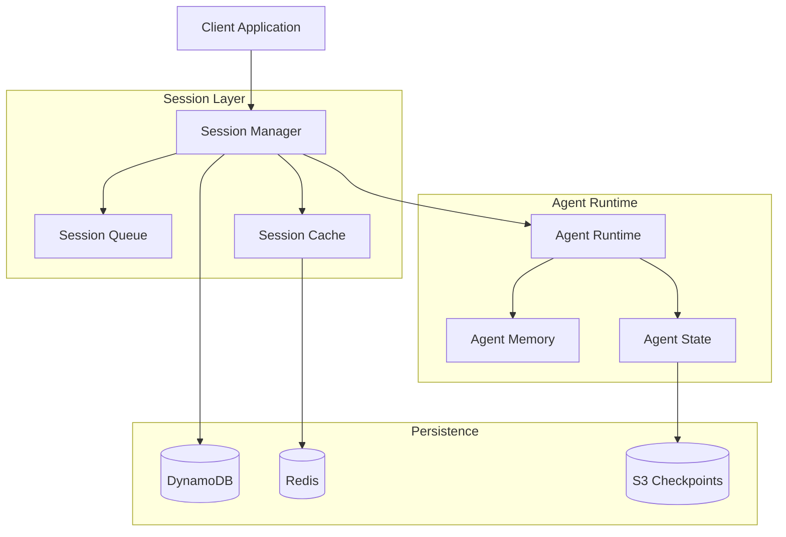

# Phase 1: 코어 인프라 구축 - 전체 SubTask 작업지시 문서

## 📋 Phase 1 개요
- **목표**: AWS Agent Squad + Agno Framework 기반 멀티 에이전트 시스템 코어 구축
- **범위**: 20개 Tasks × 4 SubTasks = 80개 작업 단위
- **기간**: 예상 8-10주

---

## 🏗️ Phase 1 전체 Task 구조

### 오케스트레이션 레이어 (Tasks 1.1-1.4)
- Task 1.1: Agent Squad 오케스트레이션 설정
- Task 1.2: SupervisorAgent 시스템 구현
- Task 1.3: 태스크 라우팅 엔진
- Task 1.4: 워크플로우 조정 시스템

### Agno Framework 통합 (Tasks 1.5-1.8)
- Task 1.5: Agno 코어 설치 및 설정
- Task 1.6: 멀티모달 처리 시스템
- Task 1.7: LLM 모델 통합 레이어
- Task 1.8: 메모리 및 상태 관리

### Bedrock 런타임 환경 (Tasks 1.9-1.11)
- Task 1.9: AgentCore 런타임 구성
- Task 1.10: 세션 관리 시스템
- Task 1.11: 보안 및 인증 레이어

### 데이터 인프라 (Tasks 1.12-1.14)
- Task 1.12: DynamoDB 연결 설정
- Task 1.13: 캐싱 시스템 구축
- Task 1.14: 메시징 큐 시스템

### 시스템 인프라 (Tasks 1.15-1.17)
- Task 1.15: 로깅 및 모니터링
- Task 1.16: 에러 처리 프레임워크
- Task 1.17: 설정 관리 시스템

### 테스트 및 검증 (Tasks 1.18-1.20)
- Task 1.18: 성능 벤치마크 도구
- Task 1.19: 통합 테스트 환경
- Task 1.20: CI/CD 파이프라인 기초

---

## 📝 세부 작업지시서

### Task 1.1: Agent Squad 오케스트레이션 설정

#### SubTask 1.1.1: Agent Squad 라이브러리 설치 및 초기 설정
**담당자**: 백엔드 개발자  
**예상 소요시간**: 8시간

**작업 내용**:
```bash
# Python 환경
pip install agent-squad[aws]
pip install agent-squad[monitoring]

# TypeScript/JavaScript 환경
npm install agent-squad
npm install @types/agent-squad --save-dev
```

**설정 파일 생성**:
```typescript
// backend/src/config/agent-squad.config.ts
export const agentSquadConfig = {
  orchestrator: {
    maxConcurrentAgents: 50,
    timeout: 300000, // 5분
    retryPolicy: {
      maxAttempts: 3,
      backoffMultiplier: 2
    }
  },
  monitoring: {
    enabled: true,
    metricsEndpoint: '/metrics',
    healthCheckInterval: 30000
  },
  storage: {
    type: 'dynamodb',
    region: process.env.AWS_REGION,
    tableName: 't-developer-agents'
  }
};
```

**검증 기준**:
- [ ] Agent Squad 패키지 정상 설치
- [ ] 설정 파일 로드 확인
- [ ] 기본 orchestrator 인스턴스 생성 성공

#### SubTask 1.1.2: 기본 오케스트레이터 구현
**담당자**: 백엔드 아키텍트  
**예상 소요시간**: 12시간

**작업 내용**:
```python
# backend/src/orchestration/base_orchestrator.py
from agent_squad import AgentSquad, Agent
from typing import Dict, List, Any
import asyncio

class BaseOrchestrator:
    def __init__(self):
        self.squad = AgentSquad()
        self.agent_registry: Dict[str, Agent] = {}
        self.active_sessions: Dict[str, Any] = {}
        
    async def initialize(self):
        """오케스트레이터 초기화"""
        await self.squad.initialize()
        await self.register_default_agents()
        
    async def register_agent(self, name: str, agent: Agent):
        """에이전트 등록"""
        self.agent_registry[name] = agent
        await self.squad.add_agent(agent)
        
    async def route_task(self, task: Dict[str, Any]) -> Any:
        """태스크 라우팅"""
        agent_name = self.determine_agent(task)
        if agent_name in self.agent_registry:
            return await self.agent_registry[agent_name].execute(task)
        raise ValueError(f"No agent found for task: {task}")
```

#### SubTask 1.1.3: 에이전트 레지스트리 시스템
**담당자**: 백엔드 개발자  
**예상 소요시간**: 12시간

**작업 내용**:
```typescript
// backend/src/orchestration/agent-registry.ts
interface AgentMetadata {
  name: string;
  version: string;
  capabilities: string[];
  maxConcurrent: number;
  timeout: number;
}

class AgentRegistry {
  private agents: Map<string, AgentMetadata> = new Map();
  private instances: Map<string, any> = new Map();
  
  async register(metadata: AgentMetadata): Promise<void> {
    this.agents.set(metadata.name, metadata);
    await this.persistToDatabase(metadata);
  }
  
  async getAgent(name: string): Promise<any> {
    if (!this.instances.has(name)) {
      await this.instantiateAgent(name);
    }
    return this.instances.get(name);
  }
  
  private async instantiateAgent(name: string): Promise<void> {
    const metadata = this.agents.get(name);
    if (!metadata) throw new Error(`Agent ${name} not found`);
    
    // Dynamic import and instantiation
    const AgentClass = await import(`../agents/${name}`);
    this.instances.set(name, new AgentClass.default(metadata));
  }
}
```

#### SubTask 1.1.4: 헬스체크 및 모니터링 통합
**담당자**: DevOps 엔지니어  
**예상 소요시간**: 8시간

**작업 내용**:
```python
# backend/src/monitoring/health_check.py
class OrchestratorHealthCheck:
    def __init__(self, orchestrator):
        self.orchestrator = orchestrator
        self.metrics = {
            'active_agents': 0,
            'queued_tasks': 0,
            'completed_tasks': 0,
            'failed_tasks': 0,
            'avg_response_time': 0
        }
    
    async def check_health(self) -> Dict[str, Any]:
        return {
            'status': 'healthy' if self.is_healthy() else 'unhealthy',
            'timestamp': datetime.utcnow().isoformat(),
            'metrics': await self.collect_metrics(),
            'agents': await self.check_agent_health()
        }
    
    async def collect_metrics(self):
        # 메트릭 수집 로직
        pass
```

---

### Task 1.2: SupervisorAgent 시스템 구현

#### SubTask 1.2.1: SupervisorAgent 아키텍처 설계
**담당자**: 시스템 아키텍트  
**예상 소요시간**: 16시간

**작업 내용**:
```python
# backend/src/agents/supervisor/supervisor_agent.py
from abc import ABC, abstractmethod
from typing import List, Dict, Any
import asyncio

class SupervisorAgent(ABC):
    """모든 작업을 감독하고 조정하는 최상위 에이전트"""
    
    def __init__(self):
        self.sub_agents: Dict[str, Agent] = {}
        self.workflow_engine = WorkflowEngine()
        self.decision_engine = DecisionEngine()
        
    async def analyze_request(self, request: Dict[str, Any]) -> WorkflowPlan:
        """요청 분석 및 워크플로우 계획 수립"""
        # NLP를 사용한 요청 분석
        intent = await self.extract_intent(request)
        
        # 필요한 에이전트 결정
        required_agents = await self.decision_engine.determine_agents(intent)
        
        # 워크플로우 생성
        workflow = await self.workflow_engine.create_workflow(
            intent, required_agents
        )
        
        return workflow
        
    async def execute_workflow(self, workflow: WorkflowPlan) -> Dict[str, Any]:
        """워크플로우 실행 및 조정"""
        results = {}
        
        for step in workflow.steps:
            if step.parallel:
                # 병렬 실행
                tasks = [
                    self.execute_agent_task(agent, step.task)
                    for agent in step.agents
                ]
                step_results = await asyncio.gather(*tasks)
            else:
                # 순차 실행
                step_results = []
                for agent in step.agents:
                    result = await self.execute_agent_task(agent, step.task)
                    step_results.append(result)
            
            results[step.name] = step_results
            
        return results
```

#### SubTask 1.2.2: 의사결정 엔진 구현
**담당자**: AI 엔지니어  
**예상 소요시간**: 16시간

**작업 내용**:
```typescript
// backend/src/agents/supervisor/decision-engine.ts
interface Decision {
  agentName: string;
  confidence: number;
  reasoning: string;
  alternativeAgents?: string[];
}

class DecisionEngine {
  private modelEndpoint: string;
  private decisionHistory: Map<string, Decision[]> = new Map();
  
  async determineAgents(intent: Intent): Promise<Decision[]> {
    // 1. 규칙 기반 매칭
    const ruleBasedAgents = this.matchByRules(intent);
    
    // 2. ML 기반 예측
    const mlPredictions = await this.predictAgents(intent);
    
    // 3. 히스토리 기반 최적화
    const historicalPatterns = this.analyzeHistory(intent);
    
    // 4. 최종 결정
    return this.combineDecisions(
      ruleBasedAgents,
      mlPredictions,
      historicalPatterns
    );
  }
  
  private matchByRules(intent: Intent): Decision[] {
    const rules = [
      { pattern: /code|implement|develop/, agents: ['CodeAgent'] },
      { pattern: /test|verify|validate/, agents: ['TestAgent'] },
      { pattern: /design|architect/, agents: ['DesignAgent'] },
      { pattern: /security|vulnerabilit/, agents: ['SecurityAgent'] }
    ];
    
    return rules
      .filter(rule => rule.pattern.test(intent.description))
      .map(rule => ({
        agentName: rule.agents[0],
        confidence: 0.8,
        reasoning: `Rule-based match: ${rule.pattern}`
      }));
  }
}
```

#### SubTask 1.2.3: 워크플로우 엔진 개발
**담당자**: 백엔드 개발자  
**예상 소요시간**: 20시간

**작업 내용**:
```python
# backend/src/workflow/workflow_engine.py
from dataclasses import dataclass
from typing import List, Optional
from enum import Enum

class StepType(Enum):
    SEQUENTIAL = "sequential"
    PARALLEL = "parallel"
    CONDITIONAL = "conditional"

@dataclass
class WorkflowStep:
    id: str
    name: str
    type: StepType
    agents: List[str]
    dependencies: List[str]
    condition: Optional[str] = None
    timeout: int = 300

class WorkflowEngine:
    def __init__(self):
        self.templates = self.load_workflow_templates()
        self.validator = WorkflowValidator()
        
    async def create_workflow(
        self, 
        intent: Intent, 
        agents: List[str]
    ) -> Workflow:
        # 1. 템플릿 선택
        template = self.select_template(intent)
        
        # 2. 워크플로우 생성
        workflow = Workflow()
        
        if template:
            workflow = self.apply_template(template, agents)
        else:
            workflow = self.create_dynamic_workflow(intent, agents)
        
        # 3. 검증
        await self.validator.validate(workflow)
        
        # 4. 최적화
        workflow = self.optimize_workflow(workflow)
        
        return workflow
    
    def create_dynamic_workflow(
        self, 
        intent: Intent, 
        agents: List[str]
    ) -> Workflow:
        """동적 워크플로우 생성"""
        steps = []
        
        # 의존성 분석
        dependencies = self.analyze_dependencies(agents)
        
        # 병렬화 가능한 작업 식별
        parallel_groups = self.identify_parallel_tasks(dependencies)
        
        # 워크플로우 스텝 생성
        for group in parallel_groups:
            if len(group) > 1:
                step = WorkflowStep(
                    id=f"step_{len(steps)}",
                    name=f"Parallel execution: {', '.join(group)}",
                    type=StepType.PARALLEL,
                    agents=group,
                    dependencies=[]
                )
            else:
                step = WorkflowStep(
                    id=f"step_{len(steps)}",
                    name=f"Execute: {group[0]}",
                    type=StepType.SEQUENTIAL,
                    agents=group,
                    dependencies=[]
                )
            steps.append(step)
        
        return Workflow(steps=steps)
```

#### SubTask 1.2.4: 실행 상태 추적 시스템
**담당자**: 풀스택 개발자  
**예상 소요시간**: 12시간

**작업 내용**:
```typescript
// backend/src/workflow/execution-tracker.ts
interface ExecutionState {
  workflowId: string;
  status: 'pending' | 'running' | 'completed' | 'failed';
  currentStep: string;
  startTime: Date;
  endTime?: Date;
  results: Map<string, any>;
  errors: Error[];
}

class ExecutionTracker {
  private states: Map<string, ExecutionState> = new Map();
  private eventEmitter: EventEmitter;
  
  async trackExecution(
    workflowId: string, 
    workflow: Workflow
  ): Promise<void> {
    const state: ExecutionState = {
      workflowId,
      status: 'pending',
      currentStep: workflow.steps[0].id,
      startTime: new Date(),
      results: new Map(),
      errors: []
    };
    
    this.states.set(workflowId, state);
    this.emitUpdate(workflowId, state);
    
    // 실시간 업데이트를 위한 WebSocket 연결
    this.setupRealtimeUpdates(workflowId);
  }
  
  async updateStepProgress(
    workflowId: string,
    stepId: string,
    progress: number
  ): Promise<void> {
    const state = this.states.get(workflowId);
    if (!state) return;
    
    state.currentStep = stepId;
    this.emitUpdate(workflowId, {
      ...state,
      progress
    });
  }
  
  private setupRealtimeUpdates(workflowId: string): void {
    // WebSocket을 통한 실시간 업데이트
    this.eventEmitter.on(`progress:${workflowId}`, (data) => {
      this.broadcast(workflowId, {
        type: 'progress',
        data
      });
    });
  }
}
```

---

### Task 1.3: 태스크 라우팅 엔진

#### SubTask 1.3.1: 지능형 라우팅 알고리즘
**담당자**: AI 엔지니어  
**예상 소요시간**: 16시간

**작업 내용**:
```python
# backend/src/routing/intelligent_router.py
import numpy as np
from sklearn.preprocessing import StandardScaler
from typing import List, Tuple

class IntelligentRouter:
    def __init__(self):
        self.routing_model = self.load_routing_model()
        self.feature_extractor = FeatureExtractor()
        self.load_balancer = LoadBalancer()
        
    async def route_task(self, task: Task) -> Agent:
        """태스크를 가장 적절한 에이전트로 라우팅"""
        
        # 1. 특징 추출
        features = await self.feature_extractor.extract(task)
        
        # 2. 에이전트 점수 계산
        agent_scores = await self.calculate_agent_scores(features)
        
        # 3. 로드 밸런싱 고려
        available_agents = await self.load_balancer.get_available_agents()
        
        # 4. 최종 선택
        selected_agent = self.select_best_agent(
            agent_scores, 
            available_agents
        )
        
        # 5. 라우팅 기록
        await self.record_routing_decision(task, selected_agent)
        
        return selected_agent
    
    async def calculate_agent_scores(
        self, 
        features: np.ndarray
    ) -> List[Tuple[str, float]]:
        """각 에이전트의 적합도 점수 계산"""
        
        # ML 모델 예측
        predictions = self.routing_model.predict_proba(features)
        
        # 에이전트별 점수
        agent_scores = []
        for idx, agent_name in enumerate(self.agent_names):
            score = predictions[0][idx]
            
            # 과거 성능 가중치 적용
            historical_weight = await self.get_historical_performance(
                agent_name
            )
            adjusted_score = score * historical_weight
            
            agent_scores.append((agent_name, adjusted_score))
        
        return sorted(agent_scores, key=lambda x: x[1], reverse=True)
```

#### SubTask 1.3.2: 로드 밸런싱 시스템
**담당자**: 시스템 엔지니어  
**예상 소요시간**: 12시간

**작업 내용**:
```typescript
// backend/src/routing/load-balancer.ts
interface AgentLoad {
  agentId: string;
  currentTasks: number;
  cpuUsage: number;
  memoryUsage: number;
  avgResponseTime: number;
  capacity: number;
}

class LoadBalancer {
  private agentLoads: Map<string, AgentLoad> = new Map();
  private strategy: BalancingStrategy;
  
  constructor(strategy: BalancingStrategy = 'weighted-round-robin') {
    this.strategy = strategy;
    this.startMonitoring();
  }
  
  async getAvailableAgents(): Promise<string[]> {
    const agents = Array.from(this.agentLoads.entries());
    
    // 용량이 남은 에이전트 필터링
    const available = agents.filter(([_, load]) => 
      load.currentTasks < load.capacity * 0.8
    );
    
    // 전략에 따라 정렬
    switch (this.strategy) {
      case 'least-connections':
        return this.sortByLeastConnections(available);
      case 'weighted-round-robin':
        return this.weightedRoundRobin(available);
      case 'resource-based':
        return this.sortByResourceUsage(available);
      default:
        return available.map(([id]) => id);
    }
  }
  
  private sortByResourceUsage(
    agents: [string, AgentLoad][]
  ): string[] {
    return agents
      .sort((a, b) => {
        const scoreA = this.calculateResourceScore(a[1]);
        const scoreB = this.calculateResourceScore(b[1]);
        return scoreA - scoreB;
      })
      .map(([id]) => id);
  }
  
  private calculateResourceScore(load: AgentLoad): number {
    // 리소스 사용량 종합 점수
    return (
      load.cpuUsage * 0.4 +
      load.memoryUsage * 0.3 +
      (load.currentTasks / load.capacity) * 0.3
    );
  }
}
```

#### SubTask 1.3.3: 태스크 우선순위 관리
**담당자**: 백엔드 개발자  
**예상 소요시간**: 12시간

**작업 내용**:
```python
# backend/src/routing/priority_manager.py
from enum import Enum
from heapq import heappush, heappop
import time

class Priority(Enum):
    CRITICAL = 1
    HIGH = 2
    NORMAL = 3
    LOW = 4

class PriorityQueue:
    def __init__(self):
        self.queue = []
        self.task_map = {}
        
    def add_task(self, task: Task, priority: Priority):
        """우선순위 큐에 태스크 추가"""
        # 우선순위 점수 계산
        priority_score = self.calculate_priority_score(task, priority)
        
        # 힙에 추가
        heappush(self.queue, (priority_score, time.time(), task))
        self.task_map[task.id] = priority_score
        
    def get_next_task(self) -> Optional[Task]:
        """다음 실행할 태스크 반환"""
        while self.queue:
            _, _, task = heappop(self.queue)
            if task.id in self.task_map:
                del self.task_map[task.id]
                return task
        return None
    
    def calculate_priority_score(
        self, 
        task: Task, 
        priority: Priority
    ) -> float:
        """우선순위 점수 계산"""
        base_score = priority.value
        
        # 대기 시간 가중치
        wait_time = time.time() - task.created_at
        wait_weight = min(wait_time / 300, 1.0)  # 5분 이상 대기 시 최대 가중치
        
        # SLA 가중치
        sla_weight = 0
        if hasattr(task, 'sla_deadline'):
            time_to_deadline = task.sla_deadline - time.time()
            if time_to_deadline < 300:  # 5분 이내
                sla_weight = 2.0
        
        return base_score - (wait_weight + sla_weight)
```

#### SubTask 1.3.4: 라우팅 성능 모니터링
**담당자**: DevOps 엔지니어  
**예상 소요시간**: 8시간

**작업 내용**:
```typescript
// backend/src/routing/routing-metrics.ts
interface RoutingMetrics {
  totalRequests: number;
  routingLatency: number[];
  agentUtilization: Map<string, number>;
  queueDepth: number;
  errorRate: number;
}

class RoutingMonitor {
  private metrics: RoutingMetrics;
  private metricsHistory: RoutingMetrics[] = [];
  
  async collectMetrics(): Promise<void> {
    this.metrics = {
      totalRequests: await this.getTotalRequests(),
      routingLatency: await this.getLatencyPercentiles(),
      agentUtilization: await this.getAgentUtilization(),
      queueDepth: await this.getQueueDepth(),
      errorRate: await this.getErrorRate()
    };
    
    // CloudWatch에 메트릭 전송
    await this.publishToCloudWatch(this.metrics);
    
    // 이상 감지
    await this.detectAnomalies(this.metrics);
  }
  
  private async detectAnomalies(
    metrics: RoutingMetrics
  ): Promise<void> {
    // 지연 시간 이상
    const p99Latency = metrics.routingLatency[99];
    if (p99Latency > 1000) {  // 1초 초과
      await this.alert('High routing latency detected', {
        p99Latency,
        threshold: 1000
      });
    }
    
    // 에러율 이상
    if (metrics.errorRate > 0.05) {  // 5% 초과
      await this.alert('High error rate in routing', {
        errorRate: metrics.errorRate,
        threshold: 0.05
      });
    }
  }
}
```

---

### Task 1.4: 워크플로우 조정 시스템

#### SubTask 1.4.1: 병렬 실행 엔진
**담당자**: 시스템 엔지니어  
**예상 소요시간**: 16시간

**작업 내용**:
```python
# backend/src/workflow/parallel_executor.py
import asyncio
from concurrent.futures import ThreadPoolExecutor
from typing import List, Dict, Any

class ParallelExecutor:
    def __init__(self, max_workers: int = 50):
        self.executor = ThreadPoolExecutor(max_workers=max_workers)
        self.semaphore = asyncio.Semaphore(max_workers)
        self.task_tracker = TaskTracker()
        
    async def execute_parallel(
        self, 
        tasks: List[Task]
    ) -> List[Dict[str, Any]]:
        """병렬 태스크 실행"""
        
        # 의존성 그래프 생성
        dependency_graph = self.build_dependency_graph(tasks)
        
        # 실행 순서 결정
        execution_order = self.topological_sort(dependency_graph)
        
        # 병렬 실행 그룹 생성
        parallel_groups = self.create_parallel_groups(
            execution_order, 
            dependency_graph
        )
        
        results = []
        for group in parallel_groups:
            # 그룹 내 태스크 병렬 실행
            group_results = await self.execute_group(group)
            results.extend(group_results)
        
        return results
    
    async def execute_group(
        self, 
        group: List[Task]
    ) -> List[Dict[str, Any]]:
        """그룹 내 태스크 병렬 실행"""
        async with self.semaphore:
            tasks = []
            for task in group:
                # 각 태스크를 비동기로 실행
                task_future = asyncio.create_task(
                    self.execute_single_task(task)
                )
                tasks.append(task_future)
            
            # 모든 태스크 완료 대기
            results = await asyncio.gather(*tasks, return_exceptions=True)
            
            # 에러 처리
            processed_results = []
            for idx, result in enumerate(results):
                if isinstance(result, Exception):
                    await self.handle_task_error(group[idx], result)
                    processed_results.append({
                        'task_id': group[idx].id,
                        'status': 'failed',
                        'error': str(result)
                    })
                else:
                    processed_results.append(result)
            
            return processed_results
```

#### SubTask 1.4.2: 의존성 관리 시스템
**담당자**: 백엔드 아키텍트  
**예상 소요시간**: 16시간

**작업 내용**:
```typescript
// backend/src/workflow/dependency-manager.ts
interface Dependency {
  taskId: string;
  dependsOn: string[];
  type: 'hard' | 'soft';
  condition?: string;
}

class DependencyManager {
  private dependencies: Map<string, Dependency> = new Map();
  private graph: DirectedGraph<string>;
  
  constructor() {
    this.graph = new DirectedGraph();
  }
  
  addDependency(dependency: Dependency): void {
    this.dependencies.set(dependency.taskId, dependency);
    
    // 그래프에 노드 추가
    this.graph.addNode(dependency.taskId);
    
    // 의존성 엣지 추가
    for (const dep of dependency.dependsOn) {
      this.graph.addEdge(dep, dependency.taskId);
    }
    
    // 순환 의존성 검사
    if (this.graph.hasCycle()) {
      throw new Error(
        `Circular dependency detected for task: ${dependency.taskId}`
      );
    }
  }
  
  async canExecute(taskId: string): Promise<boolean> {
    const dependency = this.dependencies.get(taskId);
    if (!dependency) return true;
    
    // 모든 의존성 확인
    for (const depId of dependency.dependsOn) {
      const depStatus = await this.getTaskStatus(depId);
      
      if (dependency.type === 'hard' && depStatus !== 'completed') {
        return false;
      }
      
      if (dependency.type === 'soft' && depStatus === 'failed') {
        // Soft 의존성은 실패해도 진행 가능
        console.warn(`Soft dependency ${depId} failed for ${taskId}`);
      }
    }
    
    // 조건부 의존성 평가
    if (dependency.condition) {
      return await this.evaluateCondition(dependency.condition);
    }
    
    return true;
  }
  
  getExecutionOrder(): string[] {
    // 위상 정렬로 실행 순서 결정
    return this.graph.topologicalSort();
  }
}
```

#### SubTask 1.4.3: 상태 동기화 메커니즘
**담당자**: 백엔드 개발자  
**예상 소요시간**: 12시간

**작업 내용**:
```python
# backend/src/workflow/state_synchronizer.py
import redis
import json
from typing import Dict, Any
import asyncio

class StateSynchronizer:
    def __init__(self):
        self.redis_client = redis.Redis(
            host=os.getenv('REDIS_HOST'),
            port=int(os.getenv('REDIS_PORT', 6379)),
            decode_responses=True
        )
        self.state_locks = {}
        self.pubsub = self.redis_client.pubsub()
        
    async def sync_state(
        self, 
        workflow_id: str, 
        state: Dict[str, Any]
    ) -> None:
        """워크플로우 상태 동기화"""
        
        # 분산 락 획득
        lock_key = f"lock:workflow:{workflow_id}"
        async with self.acquire_lock(lock_key):
            # 현재 상태 읽기
            current_state = await self.get_state(workflow_id)
            
            # 상태 병합
            merged_state = self.merge_states(current_state, state)
            
            # 상태 저장
            await self.save_state(workflow_id, merged_state)
            
            # 변경 사항 브로드캐스트
            await self.broadcast_state_change(workflow_id, merged_state)
    
    async def acquire_lock(
        self, 
        lock_key: str, 
        timeout: int = 30
    ) -> AsyncContextManager:
        """분산 락 획득"""
        lock = self.redis_client.lock(
            lock_key,
            timeout=timeout,
            blocking_timeout=5
        )
        return lock
    
    def merge_states(
        self, 
        current: Dict[str, Any], 
        new: Dict[str, Any]
    ) -> Dict[str, Any]:
        """상태 병합 로직"""
        merged = current.copy()
        
        for key, value in new.items():
            if key in merged and isinstance(merged[key], dict):
                # 중첩된 딕셔너리 재귀적 병합
                merged[key] = self.merge_states(merged[key], value)
            else:
                merged[key] = value
        
        merged['last_updated'] = datetime.utcnow().isoformat()
        return merged
```

#### SubTask 1.4.4: 장애 복구 및 재시도 메커니즘
**담당자**: 시스템 엔지니어  
**예상 소요시간**: 16시간

**작업 내용**:
```typescript
// backend/src/workflow/recovery-manager.ts
interface RecoveryStrategy {
  maxRetries: number;
  backoffMultiplier: number;
  maxBackoffSeconds: number;
  retryableErrors: string[];
}

class RecoveryManager {
  private strategies: Map<string, RecoveryStrategy> = new Map();
  private recoveryHistory: Map<string, any[]> = new Map();
  
  async handleFailure(
    task: Task,
    error: Error
  ): Promise<RecoveryAction> {
    const strategy = this.getStrategy(task.type);
    const history = this.getHistory(task.id);
    
    // 재시도 가능 여부 확인
    if (!this.isRetryable(error, strategy)) {
      return { action: 'fail', reason: 'Non-retryable error' };
    }
    
    // 재시도 횟수 확인
    if (history.length >= strategy.maxRetries) {
      return { action: 'fail', reason: 'Max retries exceeded' };
    }
    
    // 백오프 계산
    const backoffTime = this.calculateBackoff(
      history.length,
      strategy
    );
    
    // 복구 액션 결정
    return {
      action: 'retry',
      delaySeconds: backoffTime,
      attemptNumber: history.length + 1
    };
  }
  
  async executeRecovery(
    task: Task,
    action: RecoveryAction
  ): Promise<void> {
    switch (action.action) {
      case 'retry':
        await this.scheduleRetry(task, action.delaySeconds);
        break;
      case 'compensate':
        await this.executeCompensation(task);
        break;
      case 'fail':
        await this.handlePermanentFailure(task);
        break;
    }
  }
  
  private calculateBackoff(
    attemptNumber: number,
    strategy: RecoveryStrategy
  ): number {
    const backoff = Math.min(
      strategy.backoffMultiplier ** attemptNumber,
      strategy.maxBackoffSeconds
    );
    
    // Jitter 추가로 재시도 폭주 방지
    const jitter = Math.random() * 0.3 * backoff;
    return Math.floor(backoff + jitter);
  }
}
```

---

### Task 1.5: Agno 코어 설치 및 설정

#### SubTask 1.5.1: Agno Framework 설치
**담당자**: 백엔드 개발자  
**예상 소요시간**: 8시간

**작업 내용**:
```bash
# Agno 설치 스크립트
#!/bin/bash

# Python 환경
pip install agno
pip install agno[all]  # 모든 확장 기능 포함
pip install agno[monitoring]
pip install agno[tracing]

# 의존성 설치
pip install pydantic>=2.0
pip install httpx>=0.24
pip install rich>=13.0
```

**설정 파일**:
```python
# backend/src/config/agno_config.py
from agno import AgnoConfig
from agno.monitoring import MonitoringConfig
from agno.tracing import TracingConfig

AGNO_CONFIG = AgnoConfig(
    # 성능 설정
    performance={
        "instantiation_target_us": 3,  # 3μs 목표
        "memory_target_kb": 6.5,        # 6.5KB 목표
        "enable_optimizations": True,
        "use_native_extensions": True
    },
    
    # 모니터링 설정
    monitoring=MonitoringConfig(
        enabled=True,
        endpoint="https://agno.com/metrics",
        api_key=os.getenv("AGNO_API_KEY"),
        metrics_interval=30,
        custom_metrics=[
            "agent_instantiation_time",
            "memory_usage_per_agent",
            "total_active_agents"
        ]
    ),
    
    # 트레이싱 설정
    tracing=TracingConfig(
        enabled=True,
        sample_rate=0.1,  # 10% 샘플링
        export_endpoint="https://agno.com/traces"
    ),
    
    # 리소스 제한
    resources={
        "max_agents": 10000,
        "max_memory_per_agent_kb": 10,
        "agent_timeout_seconds": 300
    }
)
```

#### SubTask 1.5.2: 성능 최적화 설정
**담당자**: 성능 엔지니어  
**예상 소요시간**: 12시간

**작업 내용**:
```python
# backend/src/agno/performance_optimizer.py
import agno
from agno.optimizers import (
    MemoryOptimizer,
    InstantiationOptimizer,
    CacheOptimizer
)

class AgnoPerformanceOptimizer:
    def __init__(self):
        self.memory_optimizer = MemoryOptimizer()
        self.instantiation_optimizer = InstantiationOptimizer()
        self.cache_optimizer = CacheOptimizer()
        
    async def optimize_agent_creation(self):
        """에이전트 생성 최적화"""
        
        # 1. 프리로드 자주 사용되는 모듈
        await self.preload_common_modules()
        
        # 2. 에이전트 풀 초기화
        await self.initialize_agent_pool()
        
        # 3. JIT 컴파일 활성화
        self.enable_jit_compilation()
        
        # 4. 메모리 사전 할당
        await self.preallocate_memory()
    
    def enable_jit_compilation(self):
        """JIT 컴파일 활성화"""
        import numba
        
        # 핵심 함수들 JIT 컴파일
        @numba.jit(nopython=True, cache=True)
        def fast_agent_init(config):
            # 최적화된 초기화 로직
            pass
        
        agno.set_init_function(fast_agent_init)
    
    async def benchmark_performance(self):
        """성능 벤치마크"""
        import time
        
        # 인스턴스화 시간 측정
        start = time.perf_counter_ns()
        agent = agno.Agent()
        end = time.perf_counter_ns()
        
        instantiation_time_us = (end - start) / 1000
        
        # 메모리 사용량 측정
        import psutil
        import os
        
        process = psutil.Process(os.getpid())
        memory_before = process.memory_info().rss
        
        agents = [agno.Agent() for _ in range(1000)]
        
        memory_after = process.memory_info().rss
        memory_per_agent_kb = (memory_after - memory_before) / 1000 / 1024
        
        return {
            "instantiation_time_us": instantiation_time_us,
            "memory_per_agent_kb": memory_per_agent_kb,
            "target_met": (
                instantiation_time_us <= 3 and 
                memory_per_agent_kb <= 6.5
            )
        }
```

#### SubTask 1.5.3: Agno 에이전트 풀 구현
**담당자**: 백엔드 개발자  
**예상 소요시간**: 12시간

**작업 내용**:
```typescript
// backend/src/agno/agent-pool.ts
import { Agent as AgnoAgent } from 'agno';

interface PoolConfig {
  minSize: number;
  maxSize: number;
  idleTimeout: number;
  preWarm: boolean;
}

class AgentPool {
  private available: AgnoAgent[] = [];
  private inUse: Map<string, AgnoAgent> = new Map();
  private config: PoolConfig;
  
  constructor(config: PoolConfig) {
    this.config = config;
    if (config.preWarm) {
      this.warmUp();
    }
  }
  
  private async warmUp(): Promise<void> {
    // 미리 에이전트 생성
    const promises = [];
    for (let i = 0; i < this.config.minSize; i++) {
      promises.push(this.createAgent());
    }
    
    const agents = await Promise.all(promises);
    this.available.push(...agents);
  }
  
  async getAgent(): Promise<AgnoAgent> {
    // 사용 가능한 에이전트가 있으면 반환
    if (this.available.length > 0) {
      const agent = this.available.pop()!;
      const id = this.generateId();
      this.inUse.set(id, agent);
      return agent;
    }
    
    // 풀 크기 제한 확인
    if (this.inUse.size >= this.config.maxSize) {
      throw new Error('Agent pool exhausted');
    }
    
    // 새 에이전트 생성
    const agent = await this.createAgent();
    const id = this.generateId();
    this.inUse.set(id, agent);
    
    return agent;
  }
  
  async releaseAgent(agentId: string): Promise<void> {
    const agent = this.inUse.get(agentId);
    if (!agent) return;
    
    this.inUse.delete(agentId);
    
    // 에이전트 상태 초기화
    await this.resetAgent(agent);
    
    // 풀에 반환
    if (this.available.length < this.config.maxSize) {
      this.available.push(agent);
    } else {
      // 풀이 가득 차면 에이전트 제거
      await this.destroyAgent(agent);
    }
  }
  
  private async createAgent(): Promise<AgnoAgent> {
    // 3μs 목표로 최적화된 생성
    const start = performance.now();
    const agent = new AgnoAgent({
      lightweight: true,
      skipValidation: true,
      useCache: true
    });
    const duration = performance.now() - start;
    
    // 성능 모니터링
    if (duration > 0.003) {  // 3μs
      console.warn(`Agent creation took ${duration}ms`);
    }
    
    return agent;
  }
}
```

#### SubTask 1.5.4: Agno 모니터링 통합
**담당자**: DevOps 엔지니어  
**예상 소요시간**: 8시간

**작업 내용**:
```python
# backend/src/agno/monitoring_integration.py
from agno.monitoring import AgnoMonitor
import prometheus_client
from typing import Dict, Any

class AgnoMonitoringIntegration:
    def __init__(self):
        self.agno_monitor = AgnoMonitor()
        self.setup_prometheus_metrics()
        
    def setup_prometheus_metrics(self):
        """Prometheus 메트릭 설정"""
        
        # 에이전트 인스턴스화 시간
        self.instantiation_time = prometheus_client.Histogram(
            'agno_agent_instantiation_seconds',
            'Time to instantiate an Agno agent',
            buckets=(0.000001, 0.000003, 0.00001, 0.0001, 0.001)
        )
        
        # 메모리 사용량
        self.memory_usage = prometheus_client.Gauge(
            'agno_agent_memory_bytes',
            'Memory usage per agent in bytes'
        )
        
        # 활성 에이전트 수
        self.active_agents = prometheus_client.Gauge(
            'agno_active_agents_total',
            'Total number of active agents'
        )
        
        # 에러율
        self.error_rate = prometheus_client.Counter(
            'agno_errors_total',
            'Total number of errors',
            ['error_type']
        )
    
    async def collect_metrics(self) -> Dict[str, Any]:
        """메트릭 수집"""
        metrics = await self.agno_monitor.get_metrics()
        
        # Prometheus 메트릭 업데이트
        self.instantiation_time.observe(
            metrics.get('instantiation_time_us', 0) / 1_000_000
        )
        self.memory_usage.set(
            metrics.get('memory_per_agent_kb', 0) * 1024
        )
        self.active_agents.set(
            metrics.get('active_agents', 0)
        )
        
        # Agno 대시보드로 전송
        await self.send_to_agno_dashboard(metrics)
        
        return metrics
    
    async def send_to_agno_dashboard(
        self, 
        metrics: Dict[str, Any]
    ) -> None:
        """Agno 모니터링 대시보드로 메트릭 전송"""
        
        # agno.com 으로 메트릭 전송
        await self.agno_monitor.send_metrics({
            'timestamp': datetime.utcnow().isoformat(),
            'project_id': os.getenv('AGNO_PROJECT_ID'),
            'metrics': metrics,
            'metadata': {
                'environment': os.getenv('ENVIRONMENT', 'development'),
                'version': os.getenv('APP_VERSION', '1.0.0')
            }
        })
```

이렇게 Phase 1의 처음 5개 Tasks (20개 SubTasks)에 대한 상세한 작업지시서를 작성했습니다. 

나머지 15개 Tasks (Task 1.6 ~ Task 1.20)도 계속 작성하시겠습니까? 각 Task는 4개의 SubTasks로 구성되어 있으며, 다음과 같은 영역을 다룹니다:

- **Task 1.6-1.8**: 멀티모달 처리, LLM 통합, 메모리 관리
- **Task 1.9-1.11**: Bedrock 런타임, 세션 관리, 보안
- **Task 1.12-1.14**: 데이터베이스, 캐싱, 메시징
- **Task 1.15-1.17**: 로깅, 에러 처리, 설정 관리
- **Task 1.18-1.20**: 성능 테스트, 통합 테스트, CI/CD

### Task 1.6: 멀티모달 처리 시스템

#### SubTask 1.6.1: 텍스트 처리 엔진
**담당자**: AI 엔지니어  
**예상 소요시간**: 12시간

**작업 내용**:
```python
# backend/src/multimodal/text_processor.py
from agno.io import TextProcessor
from typing import Dict, List, Any
import tiktoken

class MultiModalTextProcessor:
    def __init__(self):
        self.processor = TextProcessor()
        self.tokenizers = self.load_tokenizers()
        self.preprocessors = self.load_preprocessors()
        
    async def process_text(
        self, 
        text: str, 
        options: Dict[str, Any]
    ) -> Dict[str, Any]:
        """텍스트 처리 파이프라인"""
        
        # 1. 전처리
        cleaned_text = await self.preprocess(text, options)
        
        # 2. 토크나이징
        tokens = await self.tokenize(cleaned_text, options.get('model'))
        
        # 3. 청킹 (긴 텍스트 분할)
        chunks = await self.chunk_text(
            cleaned_text, 
            tokens,
            options.get('max_tokens', 4096)
        )
        
        # 4. 임베딩 (선택적)
        embeddings = None
        if options.get('generate_embeddings'):
            embeddings = await self.generate_embeddings(chunks)
        
        return {
            'original': text,
            'processed': cleaned_text,
            'tokens': tokens,
            'token_count': len(tokens),
            'chunks': chunks,
            'embeddings': embeddings
        }
    
    async def preprocess(
        self, 
        text: str, 
        options: Dict[str, Any]
    ) -> str:
        """텍스트 전처리"""
        processed = text
        
        # 정규화
        if options.get('normalize'):
            processed = self.normalize_text(processed)
        
        # 민감정보 마스킹
        if options.get('mask_pii'):
            processed = await self.mask_sensitive_info(processed)
        
        # 언어 감지 및 번역
        if options.get('translate'):
            language = await self.detect_language(processed)
            if language != options.get('target_language', 'en'):
                processed = await self.translate_text(
                    processed, 
                    language, 
                    options.get('target_language', 'en')
                )
        
        return processed
    
    async def chunk_text(
        self, 
        text: str, 
        tokens: List[int], 
        max_tokens: int
    ) -> List[str]:
        """스마트 텍스트 청킹"""
        if len(tokens) <= max_tokens:
            return [text]
        
        chunks = []
        
        # 문장 경계 기반 청킹
        sentences = self.split_sentences(text)
        current_chunk = []
        current_tokens = 0
        
        for sentence in sentences:
            sentence_tokens = self.count_tokens(sentence)
            
            if current_tokens + sentence_tokens > max_tokens:
                if current_chunk:
                    chunks.append(' '.join(current_chunk))
                current_chunk = [sentence]
                current_tokens = sentence_tokens
            else:
                current_chunk.append(sentence)
                current_tokens += sentence_tokens
        
        if current_chunk:
            chunks.append(' '.join(current_chunk))
        
        return chunks
```

#### SubTask 1.6.2: 이미지 처리 엔진
**담당자**: ML 엔지니어  
**예상 소요시간**: 16시간

**작업 내용**:
```typescript
// backend/src/multimodal/image-processor.ts
import { ImageProcessor } from 'agno';
import sharp from 'sharp';
import * as tf from '@tensorflow/tfjs-node';

interface ImageProcessingOptions {
  resize?: { width: number; height: number };
  format?: 'jpeg' | 'png' | 'webp';
  quality?: number;
  extractText?: boolean;
  generateCaption?: boolean;
  detectObjects?: boolean;
}

class MultiModalImageProcessor {
  private processor: ImageProcessor;
  private ocrModel: any;
  private captionModel: any;
  private objectDetectionModel: any;
  
  constructor() {
    this.processor = new ImageProcessor();
    this.loadModels();
  }
  
  private async loadModels(): Promise<void> {
    // OCR 모델 로드
    if (process.env.ENABLE_OCR === 'true') {
      this.ocrModel = await this.loadOCRModel();
    }
    
    // 캡션 생성 모델 로드
    if (process.env.ENABLE_CAPTION === 'true') {
      this.captionModel = await this.loadCaptionModel();
    }
    
    // 객체 검출 모델 로드
    if (process.env.ENABLE_OBJECT_DETECTION === 'true') {
      this.objectDetectionModel = await tf.loadGraphModel(
        'https://tfhub.dev/tensorflow/tfjs-model/ssd_mobilenet_v2/1/default/1'
      );
    }
  }
  
  async processImage(
    imageBuffer: Buffer,
    options: ImageProcessingOptions
  ): Promise<any> {
    const results: any = {
      metadata: await this.extractMetadata(imageBuffer),
      processed: null
    };
    
    // 이미지 리사이징
    let processedBuffer = imageBuffer;
    if (options.resize) {
      processedBuffer = await sharp(imageBuffer)
        .resize(options.resize.width, options.resize.height)
        .toBuffer();
    }
    
    // 포맷 변환
    if (options.format) {
      processedBuffer = await sharp(processedBuffer)
        .toFormat(options.format, { quality: options.quality || 85 })
        .toBuffer();
    }
    
    results.processed = processedBuffer;
    
    // OCR 텍스트 추출
    if (options.extractText && this.ocrModel) {
      results.extractedText = await this.extractText(processedBuffer);
    }
    
    // 이미지 캡션 생성
    if (options.generateCaption && this.captionModel) {
      results.caption = await this.generateCaption(processedBuffer);
    }
    
    // 객체 검출
    if (options.detectObjects && this.objectDetectionModel) {
      results.detectedObjects = await this.detectObjects(processedBuffer);
    }
    
    return results;
  }
  
  private async extractText(imageBuffer: Buffer): Promise<string> {
    // Tesseract.js 또는 다른 OCR 엔진 사용
    const Tesseract = require('tesseract.js');
    
    const { data: { text } } = await Tesseract.recognize(
      imageBuffer,
      'eng',
      {
        logger: m => console.log(m)
      }
    );
    
    return text;
  }
  
  private async generateCaption(imageBuffer: Buffer): Promise<string> {
    // 이미지를 텐서로 변환
    const imageTensor = await this.imageToTensor(imageBuffer);
    
    // 캡션 모델 실행
    const caption = await this.captionModel.generate(imageTensor);
    
    return caption;
  }
}
```

#### SubTask 1.6.3: 오디오/비디오 처리 엔진
**담당자**: 멀티미디어 엔지니어  
**예상 소요시간**: 20시간

**작업 내용**:
```python
# backend/src/multimodal/audio_video_processor.py
import ffmpeg
import whisper
from typing import Dict, Any, Optional
import numpy as np

class AudioVideoProcessor:
    def __init__(self):
        self.whisper_model = whisper.load_model("base")
        self.ffmpeg_path = self.verify_ffmpeg()
        
    async def process_audio(
        self, 
        audio_path: str, 
        options: Dict[str, Any]
    ) -> Dict[str, Any]:
        """오디오 처리 파이프라인"""
        
        results = {
            'duration': None,
            'format': None,
            'transcript': None,
            'summary': None
        }
        
        # 오디오 메타데이터 추출
        metadata = await self.extract_audio_metadata(audio_path)
        results['duration'] = metadata['duration']
        results['format'] = metadata['format']
        
        # 음성 인식 (STT)
        if options.get('transcribe', True):
            transcript = await self.transcribe_audio(audio_path)
            results['transcript'] = transcript
            
            # 요약 생성
            if options.get('summarize') and transcript:
                results['summary'] = await self.summarize_transcript(
                    transcript
                )
        
        # 오디오 분석
        if options.get('analyze'):
            results['analysis'] = await self.analyze_audio(audio_path)
        
        return results
    
    async def transcribe_audio(self, audio_path: str) -> Dict[str, Any]:
        """Whisper를 사용한 음성 인식"""
        
        # 오디오 로드
        audio = whisper.load_audio(audio_path)
        audio = whisper.pad_or_trim(audio)
        
        # 멜 스펙트로그램 생성
        mel = whisper.log_mel_spectrogram(audio).to(
            self.whisper_model.device
        )
        
        # 언어 감지
        _, probs = self.whisper_model.detect_language(mel)
        detected_language = max(probs, key=probs.get)
        
        # 전사
        options = whisper.DecodingOptions(
            language=detected_language,
            fp16=False
        )
        result = whisper.decode(self.whisper_model, mel, options)
        
        # 타임스탬프 포함 전사
        full_result = self.whisper_model.transcribe(
            audio_path,
            language=detected_language,
            task='transcribe',
            verbose=False
        )
        
        return {
            'text': full_result['text'],
            'segments': full_result['segments'],
            'language': detected_language
        }
    
    async def process_video(
        self, 
        video_path: str, 
        options: Dict[str, Any]
    ) -> Dict[str, Any]:
        """비디오 처리 파이프라인"""
        
        results = {
            'metadata': await self.extract_video_metadata(video_path),
            'frames': None,
            'audio_track': None,
            'scenes': None
        }
        
        # 키 프레임 추출
        if options.get('extract_frames'):
            results['frames'] = await self.extract_key_frames(
                video_path,
                options.get('frame_count', 10)
            )
        
        # 오디오 트랙 추출 및 처리
        if options.get('process_audio'):
            audio_path = await self.extract_audio_track(video_path)
            results['audio_track'] = await self.process_audio(
                audio_path,
                options.get('audio_options', {})
            )
        
        # 씬 감지
        if options.get('detect_scenes'):
            results['scenes'] = await self.detect_scenes(video_path)
        
        return results
    
    async def extract_key_frames(
        self, 
        video_path: str, 
        frame_count: int
    ) -> List[np.ndarray]:
        """비디오에서 키 프레임 추출"""
        
        # 비디오 정보 가져오기
        probe = ffmpeg.probe(video_path)
        video_info = next(
            s for s in probe['streams'] 
            if s['codec_type'] == 'video'
        )
        
        duration = float(probe['format']['duration'])
        
        # 균등 간격으로 프레임 추출
        frames = []
        for i in range(frame_count):
            time = (duration / frame_count) * i
            
            out, _ = (
                ffmpeg
                .input(video_path, ss=time)
                .output('pipe:', vframes=1, format='rawvideo', pix_fmt='rgb24')
                .run(capture_stdout=True, quiet=True)
            )
            
            frame = np.frombuffer(out, np.uint8).reshape([
                int(video_info['height']),
                int(video_info['width']),
                3
            ])
            
            frames.append(frame)
        
        return frames
```

#### SubTask 1.6.4: 통합 멀티모달 API
**담당자**: 풀스택 개발자  
**예상 소요시간**: 12시간

**작업 내용**:
```typescript
// backend/src/multimodal/unified-api.ts
interface MultiModalInput {
  type: 'text' | 'image' | 'audio' | 'video' | 'mixed';
  data: any;
  metadata?: any;
  options?: any;
}

interface MultiModalOutput {
  processed: any;
  insights: any[];
  recommendations?: any[];
  confidence: number;
}

class UnifiedMultiModalAPI {
  private textProcessor: MultiModalTextProcessor;
  private imageProcessor: MultiModalImageProcessor;
  private audioVideoProcessor: AudioVideoProcessor;
  
  constructor() {
    this.textProcessor = new MultiModalTextProcessor();
    this.imageProcessor = new MultiModalImageProcessor();
    this.audioVideoProcessor = new AudioVideoProcessor();
  }
  
  async process(input: MultiModalInput): Promise<MultiModalOutput> {
    switch (input.type) {
      case 'text':
        return await this.processText(input);
      case 'image':
        return await this.processImage(input);
      case 'audio':
        return await this.processAudio(input);
      case 'video':
        return await this.processVideo(input);
      case 'mixed':
        return await this.processMixed(input);
      default:
        throw new Error(`Unsupported input type: ${input.type}`);
    }
  }
  
  private async processMixed(
    input: MultiModalInput
  ): Promise<MultiModalOutput> {
    // 복합 모달 처리
    const results = await Promise.all(
      input.data.map(async (item: any) => {
        return await this.process({
          type: item.type,
          data: item.data,
          options: item.options
        });
      })
    );
    
    // 결과 통합
    const insights = this.combineInsights(results);
    const recommendations = this.generateRecommendations(insights);
    
    return {
      processed: results,
      insights,
      recommendations,
      confidence: this.calculateConfidence(results)
    };
  }
  
  private combineInsights(results: MultiModalOutput[]): any[] {
    // 각 모달의 인사이트를 통합
    const insights = [];
    
    for (const result of results) {
      insights.push(...result.insights);
    }
    
    // 중복 제거 및 우선순위 정렬
    return this.deduplicateAndPrioritize(insights);
  }
}
```

---

### Task 1.7: LLM 모델 통합 레이어

#### SubTask 1.7.1: 모델 프로바이더 추상화
**담당자**: 백엔드 아키텍트  
**예상 소요시간**: 16시간

**작업 내용**:
```python
# backend/src/llm/model_provider_abstract.py
from abc import ABC, abstractmethod
from typing import Dict, Any, List, Optional, AsyncIterator
from dataclasses import dataclass

@dataclass
class ModelConfig:
    name: str
    provider: str
    max_tokens: int
    temperature: float
    top_p: float
    frequency_penalty: float
    presence_penalty: float
    stop_sequences: List[str]

@dataclass
class ModelResponse:
    text: str
    tokens_used: int
    finish_reason: str
    metadata: Dict[str, Any]

class ModelProvider(ABC):
    """모든 LLM 프로바이더의 추상 기본 클래스"""
    
    def __init__(self, config: ModelConfig):
        self.config = config
        self.client = None
        
    @abstractmethod
    async def initialize(self) -> None:
        """프로바이더 초기화"""
        pass
    
    @abstractmethod
    async def generate(
        self, 
        prompt: str, 
        options: Optional[Dict[str, Any]] = None
    ) -> ModelResponse:
        """텍스트 생성"""
        pass
    
    @abstractmethod
    async def stream_generate(
        self, 
        prompt: str, 
        options: Optional[Dict[str, Any]] = None
    ) -> AsyncIterator[str]:
        """스트리밍 텍스트 생성"""
        pass
    
    @abstractmethod
    async def embed(
        self, 
        texts: List[str]
    ) -> List[List[float]]:
        """텍스트 임베딩 생성"""
        pass
    
    @abstractmethod
    def estimate_tokens(self, text: str) -> int:
        """토큰 수 추정"""
        pass
    
    @abstractmethod
    def get_cost_estimate(
        self, 
        input_tokens: int, 
        output_tokens: int
    ) -> float:
        """비용 추정"""
        pass

class ModelProviderFactory:
    """모델 프로바이더 팩토리"""
    
    _providers: Dict[str, type] = {}
    
    @classmethod
    def register(cls, name: str, provider_class: type) -> None:
        """프로바이더 등록"""
        cls._providers[name] = provider_class
    
    @classmethod
    def create(
        cls, 
        provider_name: str, 
        config: ModelConfig
    ) -> ModelProvider:
        """프로바이더 인스턴스 생성"""
        if provider_name not in cls._providers:
            raise ValueError(f"Unknown provider: {provider_name}")
        
        provider_class = cls._providers[provider_name]
        return provider_class(config)
```

#### SubTask 1.7.2: 25+ 모델 프로바이더 구현
**담당자**: AI 엔지니어  
**예상 소요시간**: 24시간

**작업 내용**:
```python
# backend/src/llm/providers/openai_provider.py
import openai
from typing import AsyncIterator

class OpenAIProvider(ModelProvider):
    """OpenAI 모델 프로바이더"""
    
    async def initialize(self) -> None:
        self.client = openai.AsyncOpenAI(
            api_key=os.getenv("OPENAI_API_KEY")
        )
    
    async def generate(
        self, 
        prompt: str, 
        options: Optional[Dict[str, Any]] = None
    ) -> ModelResponse:
        options = options or {}
        
        response = await self.client.chat.completions.create(
            model=self.config.name,
            messages=[{"role": "user", "content": prompt}],
            max_tokens=options.get('max_tokens', self.config.max_tokens),
            temperature=options.get('temperature', self.config.temperature),
            top_p=options.get('top_p', self.config.top_p),
            frequency_penalty=options.get(
                'frequency_penalty', 
                self.config.frequency_penalty
            ),
            presence_penalty=options.get(
                'presence_penalty', 
                self.config.presence_penalty
            ),
            stop=options.get('stop', self.config.stop_sequences)
        )
        
        choice = response.choices[0]
        return ModelResponse(
            text=choice.message.content,
            tokens_used=response.usage.total_tokens,
            finish_reason=choice.finish_reason,
            metadata={
                'model': response.model,
                'created': response.created
            }
        )
    
    async def stream_generate(
        self, 
        prompt: str, 
        options: Optional[Dict[str, Any]] = None
    ) -> AsyncIterator[str]:
        options = options or {}
        
        stream = await self.client.chat.completions.create(
            model=self.config.name,
            messages=[{"role": "user", "content": prompt}],
            stream=True,
            **options
        )
        
        async for chunk in stream:
            if chunk.choices[0].delta.content:
                yield chunk.choices[0].delta.content

# backend/src/llm/providers/anthropic_provider.py
import anthropic

class AnthropicProvider(ModelProvider):
    """Anthropic Claude 프로바이더"""
    
    async def initialize(self) -> None:
        self.client = anthropic.AsyncAnthropic(
            api_key=os.getenv("ANTHROPIC_API_KEY")
        )
    
    async def generate(
        self, 
        prompt: str, 
        options: Optional[Dict[str, Any]] = None
    ) -> ModelResponse:
        response = await self.client.messages.create(
            model=self.config.name,
            messages=[{"role": "user", "content": prompt}],
            max_tokens=self.config.max_tokens
        )
        
        return ModelResponse(
            text=response.content[0].text,
            tokens_used=response.usage.input_tokens + response.usage.output_tokens,
            finish_reason=response.stop_reason,
            metadata={'model': response.model}
        )

# backend/src/llm/providers/bedrock_provider.py
import boto3
import json

class BedrockProvider(ModelProvider):
    """AWS Bedrock 프로바이더"""
    
    async def initialize(self) -> None:
        self.client = boto3.client(
            'bedrock-runtime',
            region_name=os.getenv('AWS_REGION')
        )
    
    async def generate(
        self, 
        prompt: str, 
        options: Optional[Dict[str, Any]] = None
    ) -> ModelResponse:
        # Bedrock API 호출
        body = json.dumps({
            "prompt": prompt,
            "max_tokens": self.config.max_tokens,
            "temperature": self.config.temperature,
            "top_p": self.config.top_p
        })
        
        response = self.client.invoke_model(
            modelId=self.config.name,
            body=body,
            accept='application/json',
            contentType='application/json'
        )
        
        result = json.loads(response['body'].read())
        
        return ModelResponse(
            text=result['completion'],
            tokens_used=result.get('token_count', 0),
            finish_reason=result.get('stop_reason', 'stop'),
            metadata={'model_id': self.config.name}
        )

# 추가 프로바이더들...
# - HuggingFaceProvider
# - CohereProvider
# - AI21Provider
# - GooglePaLMProvider
# - AlephAlphaProvider
# ... 총 25+ 프로바이더
```

**프로바이더 등록**:
```python
# backend/src/llm/providers/__init__.py

# 모든 프로바이더 등록
ModelProviderFactory.register('openai', OpenAIProvider)
ModelProviderFactory.register('anthropic', AnthropicProvider)
ModelProviderFactory.register('bedrock', BedrockProvider)
ModelProviderFactory.register('huggingface', HuggingFaceProvider)
ModelProviderFactory.register('cohere', CohereProvider)
ModelProviderFactory.register('ai21', AI21Provider)
ModelProviderFactory.register('google', GooglePaLMProvider)
# ... 25+ 프로바이더 등록
```

#### SubTask 1.7.3: 모델 선택 및 라우팅 엔진
**담당자**: AI 엔지니어  
**예상 소요시간**: 16시간

**작업 내용**:
```typescript
// backend/src/llm/model-router.ts
interface ModelCapabilities {
  contextLength: number;
  supportedLanguages: string[];
  specialties: string[];
  costPerToken: number;
  latency: 'low' | 'medium' | 'high';
  availability: number;  // 0-1
}

interface RoutingCriteria {
  taskType: string;
  requiredContext: number;
  targetLanguage?: string;
  maxCost?: number;
  maxLatency?: 'low' | 'medium' | 'high';
  requiredCapabilities?: string[];
}

class ModelRouter {
  private modelRegistry: Map<string, ModelCapabilities> = new Map();
  private performanceHistory: Map<string, any[]> = new Map();
  
  constructor() {
    this.initializeModelRegistry();
  }
  
  private initializeModelRegistry(): void {
    // 모델 능력 등록
    this.modelRegistry.set('gpt-4', {
      contextLength: 128000,
      supportedLanguages: ['all'],
      specialties: ['reasoning', 'coding', 'analysis'],
      costPerToken: 0.00003,
      latency: 'medium',
      availability: 0.99
    });
    
    this.modelRegistry.set('claude-3-opus', {
      contextLength: 200000,
      supportedLanguages: ['all'],
      specialties: ['long-context', 'analysis', 'creative'],
      costPerToken: 0.000015,
      latency: 'low',
      availability: 0.98
    });
    
    // ... 25+ 모델 등록
  }
  
  async selectModel(criteria: RoutingCriteria): Promise<string> {
    const candidates = this.filterCandidates(criteria);
    
    if (candidates.length === 0) {
      throw new Error('No suitable model found for criteria');
    }
    
    // 점수 계산
    const scores = await this.scoreModels(candidates, criteria);
    
    // 최적 모델 선택
    const bestModel = this.selectBestModel(scores);
    
    // 선택 기록
    await this.recordSelection(bestModel, criteria);
    
    return bestModel;
  }
  
  private filterCandidates(criteria: RoutingCriteria): string[] {
    const candidates = [];
    
    for (const [model, capabilities] of this.modelRegistry) {
      // 컨텍스트 길이 확인
      if (capabilities.contextLength < criteria.requiredContext) {
        continue;
      }
      
      // 언어 지원 확인
      if (criteria.targetLanguage && 
          !capabilities.supportedLanguages.includes('all') &&
          !capabilities.supportedLanguages.includes(criteria.targetLanguage)) {
        continue;
      }
      
      // 지연시간 요구사항 확인
      if (criteria.maxLatency) {
        const latencyOrder = ['low', 'medium', 'high'];
        if (latencyOrder.indexOf(capabilities.latency) > 
            latencyOrder.indexOf(criteria.maxLatency)) {
          continue;
        }
      }
      
      candidates.push(model);
    }
    
    return candidates;
  }
  
  private async scoreModels(
    candidates: string[], 
    criteria: RoutingCriteria
  ): Promise<Map<string, number>> {
    const scores = new Map<string, number>();
    
    for (const model of candidates) {
      const capabilities = this.modelRegistry.get(model)!;
      let score = 0;
      
      // 전문성 점수
      const specialtyScore = this.calculateSpecialtyScore(
        capabilities.specialties,
        criteria.taskType
      );
      score += specialtyScore * 0.3;
      
      // 비용 점수
      if (criteria.maxCost) {
        const costScore = 1 - (capabilities.costPerToken / criteria.maxCost);
        score += Math.max(0, costScore) * 0.2;
      }
      
      // 성능 이력 점수
      const performanceScore = await this.getPerformanceScore(model);
      score += performanceScore * 0.3;
      
      // 가용성 점수
      score += capabilities.availability * 0.2;
      
      scores.set(model, score);
    }
    
    return scores;
  }
}
```

#### SubTask 1.7.4: 모델 폴백 및 부하 분산
**담당자**: 시스템 엔지니어  
**예상 소요시간**: 12시간

**작업 내용**:
```python
# backend/src/llm/fallback_manager.py
from typing import List, Dict, Any
import asyncio
from datetime import datetime, timedelta

class ModelFallbackManager:
    def __init__(self):
        self.health_checker = ModelHealthChecker()
        self.load_balancer = ModelLoadBalancer()
        self.fallback_chains = self.define_fallback_chains()
        
    def define_fallback_chains(self) -> Dict[str, List[str]]:
        """모델별 폴백 체인 정의"""
        return {
            'gpt-4': ['gpt-4-turbo', 'claude-3-opus', 'gpt-3.5-turbo'],
            'claude-3-opus': ['claude-3-sonnet', 'gpt-4', 'claude-2.1'],
            'bedrock-claude': ['bedrock-titan', 'claude-3-opus', 'gpt-4'],
            # ... 모든 모델에 대한 폴백 체인
        }
    
    async def execute_with_fallback(
        self,
        primary_model: str,
        prompt: str,
        options: Dict[str, Any]
    ) -> ModelResponse:
        """폴백 로직을 포함한 모델 실행"""
        
        # 폴백 체인 가져오기
        fallback_chain = [primary_model] + self.fallback_chains.get(
            primary_model, 
            []
        )
        
        last_error = None
        
        for model in fallback_chain:
            try:
                # 모델 헬스 체크
                if not await self.health_checker.is_healthy(model):
                    continue
                
                # 로드 밸런싱 확인
                if not await self.load_balancer.can_handle_request(model):
                    continue
                
                # 모델 실행
                provider = ModelProviderFactory.create(
                    model.split('-')[0],  # 프로바이더 추출
                    ModelConfig(name=model, **options)
                )
                
                await provider.initialize()
                response = await provider.generate(prompt, options)
                
                # 성공 기록
                await self.record_success(model)
                
                return response
                
            except Exception as e:
                last_error = e
                await self.record_failure(model, e)
                
                # 재시도 가능한 에러인지 확인
                if not self.is_retryable_error(e):
                    raise
                
                continue
        
        # 모든 모델 실패
        raise Exception(
            f"All models in fallback chain failed. Last error: {last_error}"
        )
    
    def is_retryable_error(self, error: Exception) -> bool:
        """재시도 가능한 에러인지 확인"""
        retryable_errors = [
            'rate_limit',
            'timeout',
            'service_unavailable',
            'internal_server_error'
        ]
        
        error_message = str(error).lower()
        return any(err in error_message for err in retryable_errors)

class ModelLoadBalancer:
    def __init__(self):
        self.request_counts = defaultdict(int)
        self.rate_limits = self.load_rate_limits()
        
    async def can_handle_request(self, model: str) -> bool:
        """모델이 추가 요청을 처리할 수 있는지 확인"""
        
        current_count = self.request_counts[model]
        rate_limit = self.rate_limits.get(model, float('inf'))
        
        # 현재 부하 확인
        if current_count >= rate_limit * 0.8:  # 80% 임계값
            return False
        
        # 분산 부하 확인 (Redis 사용)
        distributed_count = await self.get_distributed_count(model)
        if distributed_count >= rate_limit:
            return False
        
        return True
    
    async def get_distributed_count(self, model: str) -> int:
        """분산 환경에서의 전체 요청 수 확인"""
        # Redis를 사용한 분산 카운터
        key = f"model_request_count:{model}"
        count = await redis_client.get(key)
        return int(count) if count else 0
```

---

### Task 1.8: 메모리 및 상태 관리

#### SubTask 1.8.1: 계층적 메모리 시스템
**담당자**: 시스템 아키텍트  
**예상 소요시간**: 16시간

**작업 내용**:
```python
# backend/src/memory/hierarchical_memory.py
from abc import ABC, abstractmethod
from typing import Dict, Any, Optional, List
import redis
import sqlite3
import json

class MemoryLayer(ABC):
    """메모리 레이어 추상 클래스"""
    
    @abstractmethod
    async def get(self, key: str) -> Optional[Any]:
        pass
    
    @abstractmethod
    async def set(self, key: str, value: Any, ttl: Optional[int] = None) -> None:
        pass
    
    @abstractmethod
    async def delete(self, key: str) -> None:
        pass
    
    @abstractmethod
    async def clear(self) -> None:
        pass

class WorkingMemory(MemoryLayer):
    """단기 작업 메모리 (In-Memory)"""
    
    def __init__(self, max_size: int = 1000):
        self.memory: Dict[str, Any] = {}
        self.max_size = max_size
        self.access_count: Dict[str, int] = {}
        
    async def get(self, key: str) -> Optional[Any]:
        if key in self.memory:
            self.access_count[key] = self.access_count.get(key, 0) + 1
            return self.memory[key]
        return None
    
    async def set(self, key: str, value: Any, ttl: Optional[int] = None) -> None:
        # LRU 정책으로 메모리 관리
        if len(self.memory) >= self.max_size:
            await self.evict_lru()
        
        self.memory[key] = value
        self.access_count[key] = 1
        
        if ttl:
            # TTL 구현
            asyncio.create_task(self.expire_key(key, ttl))
    
    async def evict_lru(self) -> None:
        """LRU 정책으로 항목 제거"""
        if not self.access_count:
            return
        
        lru_key = min(self.access_count, key=self.access_count.get)
        del self.memory[lru_key]
        del self.access_count[lru_key]

class ShortTermMemory(MemoryLayer):
    """단기 메모리 (Redis)"""
    
    def __init__(self):
        self.redis_client = redis.Redis(
            host=os.getenv('REDIS_HOST'),
            port=int(os.getenv('REDIS_PORT', 6379)),
            decode_responses=True
        )
        
    async def get(self, key: str) -> Optional[Any]:
        value = self.redis_client.get(key)
        if value:
            return json.loads(value)
        return None
    
    async def set(self, key: str, value: Any, ttl: Optional[int] = None) -> None:
        serialized = json.dumps(value)
        if ttl:
            self.redis_client.setex(key, ttl, serialized)
        else:
            self.redis_client.set(key, serialized)

class LongTermMemory(MemoryLayer):
    """장기 메모리 (SQLite/DynamoDB)"""
    
    def __init__(self, db_path: str = "memory.db"):
        self.db_path = db_path
        self.init_db()
        
    def init_db(self):
        conn = sqlite3.connect(self.db_path)
        cursor = conn.cursor()
        cursor.execute('''
            CREATE TABLE IF NOT EXISTS memory (
                key TEXT PRIMARY KEY,
                value TEXT,
                created_at TIMESTAMP DEFAULT CURRENT_TIMESTAMP,
                updated_at TIMESTAMP DEFAULT CURRENT_TIMESTAMP,
                access_count INTEGER DEFAULT 0
            )
        ''')
        conn.commit()
        conn.close()
    
    async def get(self, key: str) -> Optional[Any]:
        conn = sqlite3.connect(self.db_path)
        cursor = conn.cursor()
        
        cursor.execute(
            'SELECT value FROM memory WHERE key = ?',
            (key,)
        )
        result = cursor.fetchone()
        
        if result:
            # 접근 횟수 업데이트
            cursor.execute(
                'UPDATE memory SET access_count = access_count + 1 WHERE key = ?',
                (key,)
            )
            conn.commit()
            
            value = json.loads(result[0])
            conn.close()
            return value
        
        conn.close()
        return None

class HierarchicalMemorySystem:
    """계층적 메모리 시스템"""
    
    def __init__(self):
        self.working_memory = WorkingMemory()
        self.short_term_memory = ShortTermMemory()
        self.long_term_memory = LongTermMemory()
        
        # 메모리 정책
        self.promotion_threshold = 5  # 승격 임계값
        self.demotion_threshold = 30  # 강등 임계값 (일)
    
    async def remember(
        self, 
        key: str, 
        value: Any, 
        importance: str = 'normal'
    ) -> None:
        """중요도에 따라 적절한 메모리 레이어에 저장"""
        
        if importance == 'critical':
            # 모든 레이어에 저장
            await self.working_memory.set(key, value)
            await self.short_term_memory.set(key, value, ttl=86400)  # 1일
            await self.long_term_memory.set(key, value)
        elif importance == 'high':
            # 단기 및 장기 메모리에 저장
            await self.short_term_memory.set(key, value, ttl=3600)  # 1시간
            await self.long_term_memory.set(key, value)
        else:
            # 작업 메모리에만 저장
            await self.working_memory.set(key, value)
    
    async def recall(self, key: str) -> Optional[Any]:
        """계층적으로 메모리 검색"""
        
        # 1. 작업 메모리 확인
        value = await self.working_memory.get(key)
        if value is not None:
            return value
        
        # 2. 단기 메모리 확인
        value = await self.short_term_memory.get(key)
        if value is not None:
            # 작업 메모리로 승격
            await self.working_memory.set(key, value)
            return value
        
        # 3. 장기 메모리 확인
        value = await self.long_term_memory.get(key)
        if value is not None:
            # 단기 메모리로 승격
            await self.short_term_memory.set(key, value, ttl=3600)
            await self.working_memory.set(key, value)
            return value
        
        return None
```

#### SubTask 1.8.2: 에이전트 상태 지속성 관리
**담당자**: 백엔드 개발자  
**예상 소요시간**: 12시간

**작업 내용**:
```typescript
// backend/src/memory/agent-state-manager.ts
interface AgentState {
  agentId: string;
  sessionId: string;
  context: Map<string, any>;
  memory: any;
  lastActivity: Date;
  checkpoints: Checkpoint[];
}

interface Checkpoint {
  id: string;
  timestamp: Date;
  state: any;
  metadata: any;
}

class AgentStateManager {
  private stateStore: StateStore;
  private compressionEngine: CompressionEngine;
  private encryptionService: EncryptionService;
  
  constructor() {
    this.stateStore = new DynamoDBStateStore();
    this.compressionEngine = new CompressionEngine();
    this.encryptionService = new EncryptionService();
  }
  
  async saveState(
    agentId: string,
    state: AgentState
  ): Promise<void> {
    // 상태 직렬화
    const serialized = this.serializeState(state);
    
    // 압축
    const compressed = await this.compressionEngine.compress(serialized);
    
    // 암호화 (민감한 데이터 보호)
    const encrypted = await this.encryptionService.encrypt(compressed);
    
    // 저장
    await this.stateStore.save({
      agentId,
      sessionId: state.sessionId,
      data: encrypted,
      timestamp: new Date(),
      ttl: this.calculateTTL(state)
    });
    
    // 체크포인트 생성
    if (this.shouldCreateCheckpoint(state)) {
      await this.createCheckpoint(agentId, state);
    }
  }
  
  async loadState(
    agentId: string,
    sessionId?: string
  ): Promise<AgentState | null> {
    // 상태 조회
    const encryptedState = await this.stateStore.load(agentId, sessionId);
    if (!encryptedState) return null;
    
    // 복호화
    const compressed = await this.encryptionService.decrypt(
      encryptedState.data
    );
    
    // 압축 해제
    const serialized = await this.compressionEngine.decompress(compressed);
    
    // 역직렬화
    const state = this.deserializeState(serialized);
    
    // 상태 검증
    if (!this.validateState(state)) {
      throw new Error('Invalid agent state');
    }
    
    return state;
  }
  
  private shouldCreateCheckpoint(state: AgentState): boolean {
    // 체크포인트 생성 조건
    const lastCheckpoint = state.checkpoints[state.checkpoints.length - 1];
    if (!lastCheckpoint) return true;
    
    const timeSinceLastCheckpoint = 
      Date.now() - lastCheckpoint.timestamp.getTime();
    
    // 5분마다 또는 중요 변경사항 시
    return timeSinceLastCheckpoint > 5 * 60 * 1000 ||
           this.hasSignificantChanges(state, lastCheckpoint.state);
  }
  
  async createCheckpoint(
    agentId: string,
    state: AgentState
  ): Promise<void> {
    const checkpoint: Checkpoint = {
      id: generateId(),
      timestamp: new Date(),
      state: this.cloneState(state),
      metadata: {
        memorySize: JSON.stringify(state.memory).length,
        contextKeys: Array.from(state.context.keys())
      }
    };
    
    state.checkpoints.push(checkpoint);
    
    // 오래된 체크포인트 정리
    if (state.checkpoints.length > 10) {
      state.checkpoints = this.pruneCheckpoints(state.checkpoints);
    }
  }
  
  private pruneCheckpoints(checkpoints: Checkpoint[]): Checkpoint[] {
    // 최근 5개 + 시간별 대표 체크포인트 유지
    const recent = checkpoints.slice(-5);
    const hourly = this.selectHourlyCheckpoints(checkpoints.slice(0, -5));
    
    return [...hourly, ...recent];
  }
}
```

#### SubTask 1.8.3: 컨텍스트 관리 시스템
**담당자**: AI 엔지니어  
**예상 소요시간**: 12시간

**작업 내용**:
```python
# backend/src/memory/context_manager.py
from typing import Dict, List, Any, Optional
import numpy as np
from dataclasses import dataclass
from datetime import datetime

@dataclass
class ContextEntry:
    key: str
    value: Any
    timestamp: datetime
    relevance_score: float
    access_count: int
    source: str
    metadata: Dict[str, Any]

class ContextManager:
    def __init__(self, max_context_size: int = 10000):
        self.context: Dict[str, ContextEntry] = {}
        self.max_context_size = max_context_size
        self.relevance_calculator = RelevanceCalculator()
        self.context_compressor = ContextCompressor()
        
    async def add_context(
        self,
        key: str,
        value: Any,
        source: str = 'user',
        metadata: Optional[Dict[str, Any]] = None
    ) -> None:
        """컨텍스트에 정보 추가"""
        
        # 중복 키 처리
        if key in self.context:
            await self.merge_context(key, value, metadata)
            return
        
        # 컨텍스트 크기 관리
        if len(self.context) >= self.max_context_size:
            await self.compress_context()
        
        # 관련성 점수 계산
        relevance_score = await self.relevance_calculator.calculate(
            key, value, self.context
        )
        
        # 컨텍스트 엔트리 생성
        entry = ContextEntry(
            key=key,
            value=value,
            timestamp=datetime.utcnow(),
            relevance_score=relevance_score,
            access_count=0,
            source=source,
            metadata=metadata or {}
        )
        
        self.context[key] = entry
    
    async def get_relevant_context(
        self,
        query: str,
        max_items: int = 10
    ) -> List[ContextEntry]:
        """쿼리와 관련된 컨텍스트 항목 반환"""
        
        # 모든 컨텍스트 항목의 관련성 점수 계산
        scores = []
        for key, entry in self.context.items():
            score = await self.relevance_calculator.calculate_query_relevance(
                query, entry
            )
            scores.append((score, entry))
        
        # 점수순 정렬
        scores.sort(key=lambda x: x[0], reverse=True)
        
        # 상위 항목 반환
        relevant_entries = [entry for _, entry in scores[:max_items]]
        
        # 접근 횟수 업데이트
        for entry in relevant_entries:
            entry.access_count += 1
        
        return relevant_entries
    
    async def compress_context(self) -> None:
        """컨텍스트 압축"""
        
        # 1. 낮은 관련성 항목 제거
        relevance_threshold = np.percentile(
            [e.relevance_score for e in self.context.values()],
            25  # 하위 25% 제거
        )
        
        # 2. 오래된 항목 제거
        current_time = datetime.utcnow()
        age_threshold = timedelta(hours=24)
        
        # 3. 접근하지 않은 항목 제거
        access_threshold = 2
        
        items_to_remove = []
        for key, entry in self.context.items():
            if (entry.relevance_score < relevance_threshold and
                entry.access_count < access_threshold and
                current_time - entry.timestamp > age_threshold):
                items_to_remove.append(key)
        
        # 제거
        for key in items_to_remove:
            del self.context[key]
        
        # 4. 유사한 항목 병합
        await self.merge_similar_entries()
    
    async def merge_similar_entries(self) -> None:
        """유사한 컨텍스트 항목 병합"""
        
        # 임베딩 생성
        embeddings = {}
        for key, entry in self.context.items():
            embeddings[key] = await self.generate_embedding(entry.value)
        
        # 클러스터링
        clusters = self.cluster_embeddings(embeddings)
        
        # 각 클러스터 병합
        for cluster in clusters:
            if len(cluster) > 1:
                merged_entry = await self.merge_entries(
                    [self.context[key] for key in cluster]
                )
                
                # 첫 번째 키로 병합된 엔트리 저장
                self.context[cluster[0]] = merged_entry
                
                # 나머지 제거
                for key in cluster[1:]:
                    del self.context[key]

class RelevanceCalculator:
    """관련성 점수 계산기"""
    
    def __init__(self):
        self.embedding_model = self.load_embedding_model()
        
    async def calculate(
        self,
        key: str,
        value: Any,
        existing_context: Dict[str, ContextEntry]
    ) -> float:
        """새 항목의 관련성 점수 계산"""
        
        # 기본 점수
        base_score = 0.5
        
        # 최근성 가중치
        recency_weight = 1.0  # 새 항목은 최대 가중치
        
        # 기존 컨텍스트와의 연관성
        if existing_context:
            similarities = await self.calculate_similarities(
                value, existing_context
            )
            coherence_score = np.mean(similarities) if similarities else 0
        else:
            coherence_score = 0.5
        
        # 최종 점수
        relevance_score = (
            base_score * 0.3 +
            recency_weight * 0.3 +
            coherence_score * 0.4
        )
        
        return min(1.0, relevance_score)
```

#### SubTask 1.8.4: 메모리 가비지 컬렉션
**담당자**: 시스템 엔지니어  
**예상 소요시간**: 8시간

**작업 내용**:
```typescript
// backend/src/memory/garbage-collector.ts
interface GCPolicy {
  maxMemoryMB: number;
  maxAge: number;  // 일
  minRelevance: number;
  gcInterval: number;  // 초
}

class MemoryGarbageCollector {
  private policy: GCPolicy;
  private isRunning: boolean = false;
  private gcTimer: NodeJS.Timer | null = null;
  
  constructor(policy: GCPolicy) {
    this.policy = policy;
  }
  
  start(): void {
    if (this.isRunning) return;
    
    this.isRunning = true;
    this.gcTimer = setInterval(
      () => this.runGarbageCollection(),
      this.policy.gcInterval * 1000
    );
    
    console.log('Memory garbage collector started');
  }
  
  stop(): void {
    if (this.gcTimer) {
      clearInterval(this.gcTimer);
      this.gcTimer = null;
    }
    this.isRunning = false;
    console.log('Memory garbage collector stopped');
  }
  
  private async runGarbageCollection(): Promise<void> {
    console.log('Starting garbage collection...');
    
    const startTime = Date.now();
    const stats = {
      itemsChecked: 0,
      itemsRemoved: 0,
      memoryFreed: 0
    };
    
    try {
      // 1. 메모리 사용량 확인
      const memoryUsage = await this.getMemoryUsage();
      if (memoryUsage < this.policy.maxMemoryMB * 0.8) {
        // 메모리 사용량이 임계값 이하면 스킵
        return;
      }
      
      // 2. 각 메모리 레이어 정리
      await this.cleanWorkingMemory(stats);
      await this.cleanShortTermMemory(stats);
      await this.cleanLongTermMemory(stats);
      
      // 3. 압축 실행
      await this.compactMemory();
      
      // 4. 통계 기록
      const duration = Date.now() - startTime;
      await this.recordGCStats({
        ...stats,
        duration,
        timestamp: new Date()
      });
      
      console.log(`GC completed: removed ${stats.itemsRemoved} items, ` +
                  `freed ${stats.memoryFreed}MB in ${duration}ms`);
      
    } catch (error) {
      console.error('Garbage collection failed:', error);
    }
  }
  
  private async cleanWorkingMemory(stats: any): Promise<void> {
    const workingMemory = MemoryManager.getWorkingMemory();
    const items = await workingMemory.getAllItems();
    
    for (const [key, item] of items) {
      stats.itemsChecked++;
      
      // 제거 조건 확인
      if (this.shouldRemove(item)) {
        const size = this.calculateItemSize(item);
        await workingMemory.delete(key);
        
        stats.itemsRemoved++;
        stats.memoryFreed += size;
      }
    }
  }
  
  private shouldRemove(item: any): boolean {
    // 나이 확인
    const age = Date.now() - item.timestamp;
    if (age > this.policy.maxAge * 24 * 60 * 60 * 1000) {
      return true;
    }
    
    // 관련성 확인
    if (item.relevance < this.policy.minRelevance) {
      return true;
    }
    
    // 접근 빈도 확인
    const accessRate = item.accessCount / (age / 1000 / 60);  // 분당 접근
    if (accessRate < 0.01) {  // 분당 0.01회 미만
      return true;
    }
    
    return false;
  }
  
  private async compactMemory(): Promise<void> {
    // 메모리 조각화 정리
    if (global.gc) {
      global.gc();
    }
    
    // 캐시 재구성
    await this.reorganizeCaches();
  }
}
```

---

### Task 1.9: AgentCore 런타임 구성

#### SubTask 1.9.1: AWS Bedrock AgentCore 프로비저닝
**담당자**: DevOps 엔지니어  
**예상 소요시간**: 12시간

**작업 내용**:
```yaml
# infrastructure/cloudformation/agentcore-runtime.yaml
AWSTemplateFormatVersion: '2010-09-09'
Description: 'AWS Bedrock AgentCore Runtime Infrastructure'

Parameters:
  EnvironmentName:
    Type: String
    Default: production
    AllowedValues:
      - development
      - staging
      - production
  
  RuntimeInstanceType:
    Type: String
    Default: ml.g5.2xlarge
    Description: Instance type for AgentCore runtime

Resources:
  # AgentCore 런타임 역할
  AgentCoreRole:
    Type: AWS::IAM::Role
    Properties:
      RoleName: !Sub ${EnvironmentName}-agentcore-runtime-role
      AssumeRolePolicyDocument:
        Version: '2012-10-17'
        Statement:
          - Effect: Allow
            Principal:
              Service:
                - bedrock.amazonaws.com
                - lambda.amazonaws.com
            Action: sts:AssumeRole
      ManagedPolicyArns:
        - arn:aws:iam::aws:policy/service-role/AWSLambdaBasicExecutionRole
      Policies:
        - PolicyName: AgentCorePolicy
          PolicyDocument:
            Version: '2012-10-17'
            Statement:
              - Effect: Allow
                Action:
                  - bedrock:*
                  - s3:GetObject
                  - s3:PutObject
                  - dynamodb:GetItem
                  - dynamodb:PutItem
                  - dynamodb:Query
                  - dynamodb:Scan
                Resource: '*'

  # AgentCore 런타임 설정
  AgentCoreRuntime:
    Type: AWS::Bedrock::AgentCoreRuntime
    Properties:
      RuntimeName: !Sub ${EnvironmentName}-t-developer-runtime
      RuntimeConfiguration:
        InstanceType: !Ref RuntimeInstanceType
        MaxConcurrentSessions: 1000
        SessionTimeout: 28800  # 8시간
        MemoryConfiguration:
          MaxMemoryPerAgent: 512  # MB
          TotalRuntimeMemory: 32768  # 32GB
        NetworkConfiguration:
          SubnetIds: !Ref PrivateSubnets
          SecurityGroupIds:
            - !Ref AgentCoreSecurityGroup
      RoleArn: !GetAtt AgentCoreRole.Arn
      Tags:
        - Key: Environment
          Value: !Ref EnvironmentName
        - Key: Application
          Value: T-Developer

  # 보안 그룹
  AgentCoreSecurityGroup:
    Type: AWS::EC2::SecurityGroup
    Properties:
      GroupName: !Sub ${EnvironmentName}-agentcore-sg
      GroupDescription: Security group for AgentCore runtime
      VpcId: !Ref VPC
      SecurityGroupIngress:
        - IpProtocol: tcp
          FromPort: 443
          ToPort: 443
          SourceSecurityGroupId: !Ref ApplicationSecurityGroup
      SecurityGroupEgress:
        - IpProtocol: -1
          CidrIp: 0.0.0.0/0

  # Auto Scaling 설정
  AgentCoreAutoScaling:
    Type: AWS::ApplicationAutoScaling::ScalableTarget
    Properties:
      MaxCapacity: 10
      MinCapacity: 2
      ResourceId: !Sub runtime/${AgentCoreRuntime}
      RoleARN: !GetAtt AgentCoreRole.Arn
      ScalableDimension: bedrock:runtime:InstanceCount
      ServiceNamespace: bedrock

  # 스케일링 정책
  AgentCoreScalingPolicy:
    Type: AWS::ApplicationAutoScaling::ScalingPolicy
    Properties:
      PolicyName: !Sub ${EnvironmentName}-agentcore-scaling-policy
      PolicyType: TargetTrackingScaling
      ScalingTargetId: !Ref AgentCoreAutoScaling
      TargetTrackingScalingPolicyConfiguration:
        PredefinedMetricSpecification:
          PredefinedMetricType: BedrockRuntimeCPUUtilization
        TargetValue: 70.0
        ScaleInCooldown: 300
        ScaleOutCooldown: 60

Outputs:
  AgentCoreRuntimeId:
    Description: AgentCore Runtime ID
    Value: !Ref AgentCoreRuntime
    Export:
      Name: !Sub ${EnvironmentName}-agentcore-runtime-id
  
  AgentCoreEndpoint:
    Description: AgentCore Runtime Endpoint
    Value: !GetAtt AgentCoreRuntime.Endpoint
    Export:
      Name: !Sub ${EnvironmentName}-agentcore-endpoint
```

**Terraform 버전**:
```hcl
# infrastructure/terraform/agentcore-runtime.tf
resource "aws_bedrock_agent_core_runtime" "main" {
  name = "${var.environment}-t-developer-runtime"
  
  runtime_configuration {
    instance_type           = var.runtime_instance_type
    max_concurrent_sessions = 1000
    session_timeout_seconds = 28800  # 8시간
    
    memory_configuration {
      max_memory_per_agent_mb = 512
      total_runtime_memory_gb = 32
    }
    
    network_configuration {
      subnet_ids         = var.private_subnet_ids
      security_group_ids = [aws_security_group.agentcore.id]
    }
  }
  
  role_arn = aws_iam_role.agentcore.arn
  
  tags = {
    Environment = var.environment
    Application = "T-Developer"
  }
}
```

#### SubTask 1.9.2: 런타임 환경 최적화
**담당자**: 성능 엔지니어  
**예상 소요시간**: 16시간

**작업 내용**:
```python
# backend/src/runtime/agentcore_optimizer.py
import boto3
from typing import Dict, Any
import json

class AgentCoreOptimizer:
    def __init__(self):
        self.bedrock_client = boto3.client('bedrock-agent-runtime')
        self.cloudwatch = boto3.client('cloudwatch')
        self.optimization_rules = self.load_optimization_rules()
        
    async def optimize_runtime(
        self, 
        runtime_id: str
    ) -> Dict[str, Any]:
        """AgentCore 런타임 최적화"""
        
        # 현재 성능 메트릭 수집
        metrics = await self.collect_runtime_metrics(runtime_id)
        
        # 최적화 필요 여부 판단
        optimizations_needed = self.analyze_metrics(metrics)
        
        if not optimizations_needed:
            return {"status": "optimal", "metrics": metrics}
        
        # 최적화 실행
        optimization_results = []
        
        for optimization in optimizations_needed:
            result = await self.apply_optimization(
                runtime_id, 
                optimization
            )
            optimization_results.append(result)
        
        return {
            "status": "optimized",
            "optimizations": optimization_results,
            "metrics": metrics
        }
    
    async def collect_runtime_metrics(
        self, 
        runtime_id: str
    ) -> Dict[str, Any]:
        """런타임 메트릭 수집"""
        
        # CloudWatch 메트릭 조회
        response = self.cloudwatch.get_metric_statistics(
            Namespace='AWS/Bedrock',
            MetricName='RuntimeUtilization',
            Dimensions=[
                {
                    'Name': 'RuntimeId',
                    'Value': runtime_id
                }
            ],
            StartTime=datetime.utcnow() - timedelta(hours=1),
            EndTime=datetime.utcnow(),
            Period=300,
            Statistics=['Average', 'Maximum']
        )
        
        # 추가 메트릭 수집
        metrics = {
            'cpu_utilization': self.get_metric_value(response, 'Average'),
            'memory_utilization': await self.get_memory_utilization(runtime_id),
            'session_count': await self.get_active_sessions(runtime_id),
            'average_latency': await self.get_average_latency(runtime_id),
            'error_rate': await self.get_error_rate(runtime_id)
        }
        
        return metrics
    
    def analyze_metrics(
        self, 
        metrics: Dict[str, Any]
    ) -> List[Dict[str, Any]]:
        """메트릭 분석 및 최적화 제안"""
        
        optimizations = []
        
        # CPU 최적화
        if metrics['cpu_utilization'] > 80:
            optimizations.append({
                'type': 'scale_out',
                'reason': 'High CPU utilization',
                'target_value': 70
            })
        elif metrics['cpu_utilization'] < 20:
            optimizations.append({
                'type': 'scale_in',
                'reason': 'Low CPU utilization',
                'target_value': 40
            })
        
        # 메모리 최적화
        if metrics['memory_utilization'] > 85:
            optimizations.append({
                'type': 'increase_memory',
                'reason': 'High memory utilization',
                'recommended_increase': '25%'
            })
        
        # 레이턴시 최적화
        if metrics['average_latency'] > 500:  # 500ms
            optimizations.append({
                'type': 'optimize_caching',
                'reason': 'High latency detected',
                'target_latency': 200
            })
        
        return optimizations
    
    async def apply_optimization(
        self,
        runtime_id: str,
        optimization: Dict[str, Any]
    ) -> Dict[str, Any]:
        """최적화 적용"""
        
        if optimization['type'] == 'scale_out':
            return await self.scale_runtime(runtime_id, 'out')
        elif optimization['type'] == 'scale_in':
            return await self.scale_runtime(runtime_id, 'in')
        elif optimization['type'] == 'increase_memory':
            return await self.adjust_memory(runtime_id, optimization)
        elif optimization['type'] == 'optimize_caching':
            return await self.optimize_caching(runtime_id)
        
        return {"status": "unknown_optimization_type"}
```

#### SubTask 1.9.3: 런타임 모니터링 설정
**담당자**: DevOps 엔지니어  
**예상 소요시간**: 12시간

**작업 내용**:
```typescript
// backend/src/runtime/monitoring-setup.ts
interface MonitoringConfig {
  runtimeId: string;
  metrics: MetricConfig[];
  alarms: AlarmConfig[];
  dashboards: DashboardConfig[];
}

interface MetricConfig {
  name: string;
  namespace: string;
  dimensions: Record<string, string>;
  statistic: 'Average' | 'Sum' | 'Maximum' | 'Minimum';
  period: number;
}

class RuntimeMonitoringSetup {
  private cloudWatch: CloudWatch;
  private sns: SNS;
  
  constructor() {
    this.cloudWatch = new CloudWatch();
    this.sns = new SNS();
  }
  
  async setupMonitoring(config: MonitoringConfig): Promise<void> {
    // 1. 커스텀 메트릭 생성
    await this.createCustomMetrics(config.metrics);
    
    // 2. CloudWatch 알람 설정
    await this.createAlarms(config.alarms);
    
    // 3. 대시보드 생성
    await this.createDashboard(config.dashboards);
    
    // 4. 로그 그룹 설정
    await this.setupLogging(config.runtimeId);
    
    // 5. X-Ray 트레이싱 활성화
    await this.enableXRayTracing(config.runtimeId);
  }
  
  private async createCustomMetrics(
    metrics: MetricConfig[]
  ): Promise<void> {
    for (const metric of metrics) {
      const putMetricParams = {
        Namespace: metric.namespace,
        MetricData: [
          {
            MetricName: metric.name,
            Dimensions: Object.entries(metric.dimensions).map(
              ([name, value]) => ({ Name: name, Value: value })
            ),
            Timestamp: new Date(),
            Unit: 'None'
          }
        ]
      };
      
      await this.cloudWatch.putMetricData(putMetricParams).promise();
    }
  }
  
  private async createAlarms(alarms: AlarmConfig[]): Promise<void> {
    for (const alarm of alarms) {
      const alarmParams = {
        AlarmName: alarm.name,
        ComparisonOperator: alarm.comparisonOperator,
        EvaluationPeriods: alarm.evaluationPeriods,
        MetricName: alarm.metricName,
        Namespace: alarm.namespace,
        Period: alarm.period,
        Statistic: alarm.statistic,
        Threshold: alarm.threshold,
        ActionsEnabled: true,
        AlarmActions: [alarm.snsTopicArn],
        AlarmDescription: alarm.description,
        Dimensions: alarm.dimensions
      };
      
      await this.cloudWatch.putMetricAlarm(alarmParams).promise();
    }
  }
  
  private async createDashboard(
    dashboards: DashboardConfig[]
  ): Promise<void> {
    for (const dashboard of dashboards) {
      const widgets = this.createDashboardWidgets(dashboard);
      
      const dashboardBody = {
        widgets: widgets
      };
      
      await this.cloudWatch.putDashboard({
        DashboardName: dashboard.name,
        DashboardBody: JSON.stringify(dashboardBody)
      }).promise();
    }
  }
  
  private createDashboardWidgets(
    dashboard: DashboardConfig
  ): any[] {
    return [
      // CPU 사용률 위젯
      {
        type: 'metric',
        properties: {
          metrics: [
            ['AWS/Bedrock', 'CPUUtilization', 'RuntimeId', dashboard.runtimeId]
          ],
          period: 300,
          stat: 'Average',
          region: process.env.AWS_REGION,
          title: 'CPU Utilization'
        }
      },
      // 메모리 사용률 위젯
      {
        type: 'metric',
        properties: {
          metrics: [
            ['AWS/Bedrock', 'MemoryUtilization', 'RuntimeId', dashboard.runtimeId]
          ],
          period: 300,
          stat: 'Average',
          region: process.env.AWS_REGION,
          title: 'Memory Utilization'
        }
      },
      // 활성 세션 수
      {
        type: 'metric',
        properties: {
          metrics: [
            ['AWS/Bedrock', 'ActiveSessions', 'RuntimeId', dashboard.runtimeId]
          ],
          period: 60,
          stat: 'Sum',
          region: process.env.AWS_REGION,
          title: 'Active Sessions'
        }
      },
      // 에러율
      {
        type: 'metric',
        properties: {
          metrics: [
            ['AWS/Bedrock', 'Errors', 'RuntimeId', dashboard.runtimeId],
            ['AWS/Bedrock', 'Invocations', 'RuntimeId', dashboard.runtimeId]
          ],
          period: 300,
          stat: 'Sum',
          region: process.env.AWS_REGION,
          title: 'Error Rate',
          yAxis: {
            left: {
              label: 'Count'
            }
          }
        }
      }
    ];
  }
}
```

#### SubTask 1.9.4: 고가용성 및 재해복구 설정
**담당자**: 인프라 아키텍트  
**예상 소요시간**: 16시간

**작업 내용**:
```python
# backend/src/runtime/high_availability.py
from typing import Dict, List, Any
import asyncio

class HighAvailabilityManager:
    def __init__(self):
        self.primary_region = os.getenv('AWS_PRIMARY_REGION', 'us-east-1')
        self.dr_regions = os.getenv('AWS_DR_REGIONS', 'us-west-2,eu-west-1').split(',')
        self.health_checker = HealthChecker()
        self.failover_manager = FailoverManager()
        
    async def setup_multi_region_deployment(self) -> Dict[str, Any]:
        """다중 리전 배포 설정"""
        
        deployment_results = {
            'primary': None,
            'dr_regions': []
        }
        
        # 1. 기본 리전 설정
        primary_result = await self.deploy_runtime(
            self.primary_region,
            is_primary=True
        )
        deployment_results['primary'] = primary_result
        
        # 2. DR 리전 설정
        for region in self.dr_regions:
            dr_result = await self.deploy_runtime(
                region,
                is_primary=False
            )
            deployment_results['dr_regions'].append({
                'region': region,
                'result': dr_result
            })
        
        # 3. 크로스 리전 복제 설정
        await self.setup_cross_region_replication()
        
        # 4. 글로벌 로드 밸런서 설정
        await self.setup_global_load_balancer()
        
        return deployment_results
    
    async def deploy_runtime(
        self,
        region: str,
        is_primary: bool
    ) -> Dict[str, Any]:
        """리전별 런타임 배포"""
        
        bedrock_client = boto3.client(
            'bedrock-agent-runtime',
            region_name=region
        )
        
        # CloudFormation 스택 배포
        cf_client = boto3.client('cloudformation', region_name=region)
        
        stack_name = f"agentcore-runtime-{region}"
        template_body = self.get_runtime_template(is_primary)
        
        try:
            response = cf_client.create_stack(
                StackName=stack_name,
                TemplateBody=template_body,
                Parameters=[
                    {
                        'ParameterKey': 'IsPrimaryRegion',
                        'ParameterValue': str(is_primary)
                    },
                    {
                        'ParameterKey': 'ReplicationRegions',
                        'ParameterValue': ','.join(self.dr_regions)
                    }
                ],
                Capabilities=['CAPABILITY_IAM']
            )
            
            # 스택 생성 대기
            waiter = cf_client.get_waiter('stack_create_complete')
            waiter.wait(StackName=stack_name)
            
            # 런타임 정보 가져오기
            stack_outputs = self.get_stack_outputs(cf_client, stack_name)
            
            return {
                'status': 'success',
                'region': region,
                'runtime_id': stack_outputs['RuntimeId'],
                'endpoint': stack_outputs['RuntimeEndpoint']
            }
            
        except Exception as e:
            return {
                'status': 'failed',
                'region': region,
                'error': str(e)
            }
    
    async def setup_cross_region_replication(self) -> None:
        """크로스 리전 데이터 복제 설정"""
        
        # DynamoDB 글로벌 테이블 설정
        dynamodb = boto3.client('dynamodb')
        
        tables = [
            'agent-states',
            'agent-sessions',
            'agent-checkpoints'
        ]
        
        for table_name in tables:
            try:
                response = dynamodb.update_table(
                    TableName=table_name,
                    ReplicaUpdates=[
                        {
                            'Create': {
                                'RegionName': region,
                                'GlobalSecondaryIndexes': []
                            }
                        } for region in self.dr_regions
                    ]
                )
            except Exception as e:
                print(f"Failed to setup replication for {table_name}: {e}")
    
    async def implement_health_checks(self) -> None:
        """헬스체크 구현"""
        
        while True:
            try:
                # 모든 리전 헬스체크
                health_status = {}
                
                # Primary 리전 체크
                primary_health = await self.health_checker.check_runtime(
                    self.primary_region
                )
                health_status['primary'] = primary_health
                
                # DR 리전 체크
                for region in self.dr_regions:
                    dr_health = await self.health_checker.check_runtime(region)
                    health_status[region] = dr_health
                
                # 장애 감지 시 페일오버
                if not primary_health['healthy']:
                    await self.initiate_failover()
                
                # 메트릭 기록
                await self.record_health_metrics(health_status)
                
            except Exception as e:
                print(f"Health check error: {e}")
            
            await asyncio.sleep(30)  # 30초마다 체크
    
    async def initiate_failover(self) -> None:
        """페일오버 실행"""
        
        print("Initiating failover process...")
        
        # 1. 가장 건강한 DR 리전 선택
        healthiest_region = await self.select_healthiest_dr_region()
        
        if not healthiest_region:
            raise Exception("No healthy DR region available")
        
        # 2. DNS 업데이트
        await self.update_dns_routing(healthiest_region)
        
        # 3. 새 Primary 승격
        await self.promote_to_primary(healthiest_region)
        
        # 4. 알림 발송
        await self.send_failover_notification(healthiest_region)
        
        print(f"Failover completed to {healthiest_region}")
```

---

계속해서 나머지 Tasks를 작성할까요? 다음은:

- **Task 1.10**: 세션 관리 시스템
- **Task 1.11**: 보안 및 인증 레이어
- **Task 1.12-1.14**: 데이터베이스, 캐싱, 메시징
- **Task 1.15-1.17**: 로깅, 에러처리, 설정관리
- **Task 1.18-1.20**: 성능테스트, 통합테스트, CI/CD

프로젝트 지식을 확인하여 Task 1.10부터 작성하겠습니다.프로젝트 지식을 확인한 결과, Phase 1의 전체 Task 구조를 파악했습니다. 이제 Task 1.10 (세션 관리 시스템)의 SubTask 1.10.1부터 작성하겠습니다.

# Phase 1: 코어 인프라 구축 - SubTask Documentation (Task 1.10부터)

## Task 1.10: 세션 관리 시스템

### SubTask 1.10.1: 장기 실행 세션 아키텍처 설계
**담당자**: 시니어 백엔드 개발자  
**예상 소요시간**: 12시간

**목표**: Bedrock AgentCore의 8시간 세션 지원을 위한 안정적인 세션 관리 아키텍처 설계

**구현 내용**:
```typescript
// backend/src/session/architecture/session-manager.ts
import { DynamoDBClient } from '@aws-sdk/client-dynamodb';
import { DynamoDBDocumentClient } from '@aws-sdk/lib-dynamodb';
import { Redis } from 'ioredis';
import { EventEmitter } from 'events';

export interface SessionConfig {
  maxDuration: number; // 최대 8시간 (28800초)
  heartbeatInterval: number; // 30초
  persistenceInterval: number; // 5분
  maxConcurrentSessions: number;
  sessionTimeout: number;
}

export interface Session {
  sessionId: string;
  userId: string;
  projectId: string;
  agentInstances: Map<string, AgentInstance>;
  startTime: Date;
  lastActivity: Date;
  state: SessionState;
  metadata: SessionMetadata;
  checkpoints: Checkpoint[];
}

export interface SessionState {
  status: 'active' | 'paused' | 'resuming' | 'terminating' | 'completed';
  currentPhase: string;
  progress: number;
  context: Record<string, any>;
  memorySnapshot: MemorySnapshot;
}

export interface MemorySnapshot {
  workingMemory: Record<string, any>;
  longTermMemory: Record<string, any>;
  agentStates: Map<string, any>;
  timestamp: Date;
}

export class SessionManager extends EventEmitter {
  private dynamoClient: DynamoDBDocumentClient;
  private redis: Redis;
  private sessions: Map<string, Session>;
  private heartbeatTimers: Map<string, NodeJS.Timer>;
  
  constructor(
    private config: SessionConfig,
    dynamoClient: DynamoDBClient,
    redis: Redis
  ) {
    super();
    this.dynamoClient = DynamoDBDocumentClient.from(dynamoClient);
    this.redis = redis;
    this.sessions = new Map();
    this.heartbeatTimers = new Map();
    
    this.initializeSessionRecovery();
  }
  
  async createSession(params: CreateSessionParams): Promise<Session> {
    // 세션 수 제한 확인
    if (this.sessions.size >= this.config.maxConcurrentSessions) {
      throw new Error('Maximum concurrent sessions reached');
    }
    
    const session: Session = {
      sessionId: this.generateSessionId(),
      userId: params.userId,
      projectId: params.projectId,
      agentInstances: new Map(),
      startTime: new Date(),
      lastActivity: new Date(),
      state: {
        status: 'active',
        currentPhase: 'initialization',
        progress: 0,
        context: {},
        memorySnapshot: {
          workingMemory: {},
          longTermMemory: {},
          agentStates: new Map(),
          timestamp: new Date()
        }
      },
      metadata: {
        clientInfo: params.clientInfo,
        sessionType: params.sessionType,
        features: params.enabledFeatures
      },
      checkpoints: []
    };
    
    // DynamoDB에 세션 저장
    await this.persistSession(session);
    
    // Redis에 활성 세션 캐싱
    await this.cacheSession(session);
    
    // 메모리에 저장
    this.sessions.set(session.sessionId, session);
    
    // 하트비트 시작
    this.startHeartbeat(session.sessionId);
    
    // 자동 체크포인트 시작
    this.startAutoCheckpoint(session.sessionId);
    
    this.emit('session:created', session);
    
    return session;
  }
  
  private startHeartbeat(sessionId: string): void {
    const timer = setInterval(async () => {
      try {
        await this.updateHeartbeat(sessionId);
      } catch (error) {
        console.error(`Heartbeat failed for session ${sessionId}:`, error);
        await this.handleSessionFailure(sessionId);
      }
    }, this.config.heartbeatInterval * 1000);
    
    this.heartbeatTimers.set(sessionId, timer);
  }
  
  private async updateHeartbeat(sessionId: string): Promise<void> {
    const session = this.sessions.get(sessionId);
    if (!session) return;
    
    session.lastActivity = new Date();
    
    // Redis 업데이트
    await this.redis.setex(
      `session:heartbeat:${sessionId}`,
      this.config.sessionTimeout,
      JSON.stringify({
        timestamp: session.lastActivity,
        status: session.state.status
      })
    );
    
    // 세션 타임아웃 체크
    const duration = Date.now() - session.startTime.getTime();
    if (duration > this.config.maxDuration * 1000) {
      await this.gracefulTerminate(sessionId);
    }
  }
}
```

**아키텍처 다이어그램**:


### SubTask 1.10.2: 세션 상태 지속성 메커니즘
**담당자**: 백엔드 개발자  
**예상 소요시간**: 10시간

**목표**: 세션 상태를 안정적으로 저장하고 복구할 수 있는 지속성 메커니즘 구현

**구현 내용**:
```typescript
// backend/src/session/persistence/session-persistence.ts
import { S3Client, PutObjectCommand, GetObjectCommand } from '@aws-sdk/client-s3';
import { compress, decompress } from 'lz4js';
import crypto from 'crypto';

export class SessionPersistenceManager {
  private s3Client: S3Client;
  private checkpointBucket: string;
  
  constructor(
    s3Client: S3Client,
    checkpointBucket: string
  ) {
    this.s3Client = s3Client;
    this.checkpointBucket = checkpointBucket;
  }
  
  async createCheckpoint(
    session: Session,
    checkpointType: 'auto' | 'manual' | 'recovery'
  ): Promise<Checkpoint> {
    const checkpoint: Checkpoint = {
      id: this.generateCheckpointId(),
      sessionId: session.sessionId,
      timestamp: new Date(),
      type: checkpointType,
      state: await this.captureSessionState(session),
      metadata: {
        size: 0,
        compressed: true,
        encryption: 'AES-256-GCM'
      }
    };
    
    // 상태 직렬화 및 압축
    const serialized = JSON.stringify(checkpoint.state);
    const compressed = await this.compressData(serialized);
    
    // 암호화
    const encrypted = await this.encryptData(compressed);
    
    // S3에 저장
    const key = `checkpoints/${session.sessionId}/${checkpoint.id}.checkpoint`;
    await this.s3Client.send(new PutObjectCommand({
      Bucket: this.checkpointBucket,
      Key: key,
      Body: encrypted,
      Metadata: {
        sessionId: session.sessionId,
        checkpointId: checkpoint.id,
        timestamp: checkpoint.timestamp.toISOString(),
        type: checkpointType
      }
    }));
    
    checkpoint.metadata.size = encrypted.length;
    
    // DynamoDB에 체크포인트 메타데이터 저장
    await this.saveCheckpointMetadata(checkpoint);
    
    return checkpoint;
  }
  
  async restoreFromCheckpoint(
    checkpointId: string,
    sessionId: string
  ): Promise<SessionState> {
    // S3에서 체크포인트 로드
    const key = `checkpoints/${sessionId}/${checkpointId}.checkpoint`;
    const response = await this.s3Client.send(new GetObjectCommand({
      Bucket: this.checkpointBucket,
      Key: key
    }));
    
    const encrypted = await response.Body.transformToByteArray();
    
    // 복호화
    const compressed = await this.decryptData(encrypted);
    
    // 압축 해제
    const decompressed = await this.decompressData(compressed);
    
    // 역직렬화
    const state = JSON.parse(decompressed);
    
    // 상태 검증
    await this.validateSessionState(state);
    
    return state;
  }
  
  private async captureSessionState(session: Session): Promise<SessionState> {
    // 에이전트 상태 수집
    const agentStates = new Map();
    for (const [agentId, instance] of session.agentInstances) {
      agentStates.set(agentId, await instance.captureState());
    }
    
    // 메모리 스냅샷 생성
    const memorySnapshot: MemorySnapshot = {
      workingMemory: await this.captureWorkingMemory(session),
      longTermMemory: await this.captureLongTermMemory(session),
      agentStates: agentStates,
      timestamp: new Date()
    };
    
    return {
      status: session.state.status,
      currentPhase: session.state.currentPhase,
      progress: session.state.progress,
      context: { ...session.state.context },
      memorySnapshot: memorySnapshot
    };
  }
  
  async cleanupOldCheckpoints(
    sessionId: string,
    retentionDays: number = 7
  ): Promise<void> {
    const cutoffDate = new Date();
    cutoffDate.setDate(cutoffDate.getDate() - retentionDays);
    
    // 오래된 체크포인트 조회
    const oldCheckpoints = await this.queryOldCheckpoints(
      sessionId,
      cutoffDate
    );
    
    // S3에서 삭제
    for (const checkpoint of oldCheckpoints) {
      const key = `checkpoints/${sessionId}/${checkpoint.id}.checkpoint`;
      await this.s3Client.send(new DeleteObjectCommand({
        Bucket: this.checkpointBucket,
        Key: key
      }));
    }
    
    // 메타데이터 삭제
    await this.deleteCheckpointMetadata(oldCheckpoints);
  }
}
```

### SubTask 1.10.3: 세션 복구 및 재개 시스템
**담당자**: 시니어 백엔드 개발자  
**예상 소요시간**: 12시간

**목표**: 중단된 세션을 안전하게 복구하고 재개할 수 있는 시스템 구현

**구현 내용**:
```typescript
// backend/src/session/recovery/session-recovery.ts
export class SessionRecoveryService {
  private sessionManager: SessionManager;
  private persistenceManager: SessionPersistenceManager;
  private recoveryQueue: PriorityQueue<RecoveryTask>;
  
  constructor(
    sessionManager: SessionManager,
    persistenceManager: SessionPersistenceManager
  ) {
    this.sessionManager = sessionManager;
    this.persistenceManager = persistenceManager;
    this.recoveryQueue = new PriorityQueue();
    
    this.startRecoveryWorker();
  }
  
  async recoverSession(
    sessionId: string,
    recoveryOptions?: RecoveryOptions
  ): Promise<Session> {
    try {
      // 1. 최신 체크포인트 찾기
      const checkpoint = await this.findLatestValidCheckpoint(sessionId);
      if (!checkpoint) {
        throw new Error(`No valid checkpoint found for session ${sessionId}`);
      }
      
      // 2. 세션 상태 복원
      const sessionState = await this.persistenceManager.restoreFromCheckpoint(
        checkpoint.id,
        sessionId
      );
      
      // 3. 에이전트 인스턴스 재생성
      const agentInstances = await this.recreateAgentInstances(
        sessionState.memorySnapshot.agentStates
      );
      
      // 4. 세션 재구성
      const recoveredSession = await this.reconstructSession(
        sessionId,
        sessionState,
        agentInstances
      );
      
      // 5. 상태 검증
      await this.validateRecoveredSession(recoveredSession);
      
      // 6. 세션 재개
      await this.resumeSession(recoveredSession);
      
      this.emit('session:recovered', {
        sessionId,
        checkpointId: checkpoint.id,
        recoveryTime: Date.now()
      });
      
      return recoveredSession;
      
    } catch (error) {
      this.emit('session:recovery:failed', {
        sessionId,
        error: error.message
      });
      throw error;
    }
  }
  
  private async recreateAgentInstances(
    agentStates: Map<string, any>
  ): Promise<Map<string, AgentInstance>> {
    const instances = new Map();
    
    for (const [agentId, state] of agentStates) {
      try {
        const instance = await this.recreateAgent(agentId, state);
        instances.set(agentId, instance);
      } catch (error) {
        console.error(`Failed to recreate agent ${agentId}:`, error);
        // 에이전트 재생성 실패 시 기본 상태로 생성
        const fallbackInstance = await this.createFallbackAgent(agentId);
        instances.set(agentId, fallbackInstance);
      }
    }
    
    return instances;
  }
  
  private async resumeSession(session: Session): Promise<void> {
    // 1. 세션 상태를 'resuming'으로 변경
    session.state.status = 'resuming';
    
    // 2. 에이전트 워밍업
    await this.warmupAgents(session.agentInstances);
    
    // 3. 컨텍스트 복원
    await this.restoreContext(session);
    
    // 4. 진행 상황 동기화
    await this.syncProgress(session);
    
    // 5. 세션 활성화
    session.state.status = 'active';
    session.lastActivity = new Date();
    
    // 6. 하트비트 재시작
    this.sessionManager.startHeartbeat(session.sessionId);
  }
  
  async handleCrashRecovery(): Promise<void> {
    // 시스템 재시작 시 호출되는 메서드
    // 모든 미완료 세션 복구 시도
    
    const incompleteSessions = await this.findIncompleteSessions();
    
    for (const sessionInfo of incompleteSessions) {
      const recoveryTask: RecoveryTask = {
        sessionId: sessionInfo.sessionId,
        priority: this.calculateRecoveryPriority(sessionInfo),
        attempts: 0,
        maxAttempts: 3,
        nextAttempt: new Date()
      };
      
      this.recoveryQueue.enqueue(recoveryTask);
    }
  }
  
  private startRecoveryWorker(): void {
    setInterval(async () => {
      if (this.recoveryQueue.isEmpty()) return;
      
      const task = this.recoveryQueue.dequeue();
      if (!task) return;
      
      try {
        await this.recoverSession(task.sessionId);
      } catch (error) {
        task.attempts++;
        
        if (task.attempts < task.maxAttempts) {
          // 재시도 스케줄링 (지수 백오프)
          task.nextAttempt = new Date(
            Date.now() + Math.pow(2, task.attempts) * 60000
          );
          this.recoveryQueue.enqueue(task);
        } else {
          // 복구 실패 처리
          await this.handleRecoveryFailure(task.sessionId);
        }
      }
    }, 10000); // 10초마다 실행
  }
}
```

### SubTask 1.10.4: 세션 모니터링 및 분석
**담당자**: 풀스택 개발자  
**예상 소요시간**: 10시간

**목표**: 세션 상태와 성능을 실시간으로 모니터링하고 분석하는 시스템 구현

**구현 내용**:
```typescript
// backend/src/session/monitoring/session-monitor.ts
import { MetricsCollector } from '../../metrics/collector';
import { AlertManager } from '../../alerts/manager';

export interface SessionMetrics {
  sessionId: string;
  duration: number;
  memoryUsage: number;
  cpuUsage: number;
  agentCount: number;
  checkpointCount: number;
  errorRate: number;
  throughput: number;
}

export class SessionMonitor {
  private metricsCollector: MetricsCollector;
  private alertManager: AlertManager;
  private metricsInterval: NodeJS.Timer;
  
  constructor(
    metricsCollector: MetricsCollector,
    alertManager: AlertManager
  ) {
    this.metricsCollector = metricsCollector;
    this.alertManager = alertManager;
  }
  
  startMonitoring(session: Session): void {
    const intervalId = setInterval(async () => {
      try {
        const metrics = await this.collectSessionMetrics(session);
        await this.analyzeMetrics(metrics);
        await this.checkThresholds(metrics);
      } catch (error) {
        console.error(`Monitoring error for session ${session.sessionId}:`, error);
      }
    }, 30000); // 30초마다 수집
    
    this.metricsInterval = intervalId;
  }
  
  private async collectSessionMetrics(session: Session): Promise<SessionMetrics> {
    const metrics: SessionMetrics = {
      sessionId: session.sessionId,
      duration: Date.now() - session.startTime.getTime(),
      memoryUsage: await this.getMemoryUsage(session),
      cpuUsage: await this.getCPUUsage(session),
      agentCount: session.agentInstances.size,
      checkpointCount: session.checkpoints.length,
      errorRate: await this.calculateErrorRate(session),
      throughput: await this.calculateThroughput(session)
    };
    
    // Prometheus 메트릭 업데이트
    this.metricsCollector.gauge('session_duration_seconds', 
      metrics.duration / 1000, 
      { sessionId: session.sessionId }
    );
    
    this.metricsCollector.gauge('session_memory_bytes',
      metrics.memoryUsage,
      { sessionId: session.sessionId }
    );
    
    this.metricsCollector.gauge('session_agent_count',
      metrics.agentCount,
      { sessionId: session.sessionId }
    );
    
    return metrics;
  }
  
  private async checkThresholds(metrics: SessionMetrics): Promise<void> {
    // 메모리 사용량 임계값 체크
    if (metrics.memoryUsage > 2 * 1024 * 1024 * 1024) { // 2GB
      await this.alertManager.sendAlert({
        severity: 'warning',
        title: 'High Memory Usage in Session',
        message: `Session ${metrics.sessionId} is using ${Math.round(metrics.memoryUsage / 1024 / 1024)}MB of memory`,
        metadata: metrics
      });
    }
    
    // 세션 지속 시간 체크
    if (metrics.duration > 7 * 60 * 60 * 1000) { // 7시간
      await this.alertManager.sendAlert({
        severity: 'info',
        title: 'Long Running Session',
        message: `Session ${metrics.sessionId} has been running for ${Math.round(metrics.duration / 1000 / 60 / 60)} hours`,
        metadata: metrics
      });
    }
    
    // 에러율 체크
    if (metrics.errorRate > 0.05) { // 5%
      await this.alertManager.sendAlert({
        severity: 'warning',
        title: 'High Error Rate',
        message: `Session ${metrics.sessionId} has ${Math.round(metrics.errorRate * 100)}% error rate`,
        metadata: metrics
      });
    }
  }
  
  async generateSessionReport(sessionId: string): Promise<SessionReport> {
    const historicalMetrics = await this.metricsCollector.queryRange(
      'session_*',
      { sessionId },
      '-24h',
      'now'
    );
    
    return {
      sessionId,
      summary: {
        totalDuration: this.calculateTotalDuration(historicalMetrics),
        averageMemoryUsage: this.calculateAverageMemory(historicalMetrics),
        peakMemoryUsage: this.calculatePeakMemory(historicalMetrics),
        totalAgentsCreated: this.countTotalAgents(historicalMetrics),
        checkpointStats: this.analyzeCheckpoints(historicalMetrics),
        performanceScore: this.calculatePerformanceScore(historicalMetrics)
      },
      timeline: this.generateTimeline(historicalMetrics),
      recommendations: this.generateRecommendations(historicalMetrics)
    };
  }
}

// 세션 분석 대시보드 API
export class SessionAnalyticsDashboard {
  async getActiveSessions(): Promise<SessionSummary[]> {
    const sessions = await this.sessionManager.getActiveSessions();
    
    return Promise.all(sessions.map(async session => ({
      sessionId: session.sessionId,
      userId: session.userId,
      projectId: session.projectId,
      startTime: session.startTime,
      duration: Date.now() - session.startTime.getTime(),
      status: session.state.status,
      progress: session.state.progress,
      agentCount: session.agentInstances.size,
      lastActivity: session.lastActivity,
      healthStatus: await this.calculateHealthStatus(session)
    })));
  }
  
  async getSessionTrends(timeRange: string): Promise<TrendData> {
    const metrics = await this.metricsCollector.queryRange(
      'session_*',
      {},
      timeRange,
      'now'
    );
    
    return {
      sessionCount: this.extractTrend(metrics, 'session_count'),
      averageDuration: this.extractTrend(metrics, 'session_duration_seconds'),
      memoryUsage: this.extractTrend(metrics, 'session_memory_bytes'),
      errorRate: this.extractTrend(metrics, 'session_error_rate'),
      throughput: this.extractTrend(metrics, 'session_throughput')
    };
  }
}
```

## Task 1.11: 보안 및 인증 레이어

### SubTask 1.11.1: JWT 기반 인증 시스템
**담당자**: 보안 전문 개발자  
**예상 소요시간**: 10시간

**목표**: 안전한 JWT 기반 인증 시스템 구현

**구현 내용**:
```typescript
// backend/src/security/auth/jwt-auth.ts
import jwt from 'jsonwebtoken';
import { JWK, JWS } from 'node-jose';
import crypto from 'crypto';

export interface TokenPayload {
  userId: string;
  sessionId: string;
  projectId?: string;
  roles: string[];
  permissions: string[];
  iat: number;
  exp: number;
  jti: string;
}

export class JWTAuthService {
  private keyStore: JWK.KeyStore;
  private activeTokens: Map<string, TokenInfo>;
  private blacklist: Set<string>;
  
  constructor(
    private config: AuthConfig
  ) {
    this.keyStore = JWK.createKeyStore();
    this.activeTokens = new Map();
    this.blacklist = new Set();
    
    this.initializeKeys();
  }
  
  private async initializeKeys(): Promise<void> {
    // RSA 키 쌍 생성
    await this.keyStore.generate('RSA', 2048, {
      alg: 'RS256',
      use: 'sig',
      kid: this.generateKeyId()
    });
    
    // 키 로테이션 스케줄 설정
    this.scheduleKeyRotation();
  }
  
  async generateToken(
    user: User,
    session: Session,
    options?: TokenOptions
  ): Promise<AuthToken> {
    const tokenId = crypto.randomUUID();
    const now = Math.floor(Date.now() / 1000);
    
    const payload: TokenPayload = {
      userId: user.id,
      sessionId: session.sessionId,
      projectId: session.projectId,
      roles: user.roles,
      permissions: await this.resolvePermissions(user),
      iat: now,
      exp: now + (options?.expiresIn || 3600), // 기본 1시간
      jti: tokenId
    };
    
    // JWT 생성
    const key = this.keyStore.all()[0];
    const token = await JWS.createSign({
      format: 'compact',
      fields: {
        typ: 'JWT',
        kid: key.kid
      }
    }, key)
    .update(JSON.stringify(payload))
    .final();
    
    // 리프레시 토큰 생성
    const refreshToken = await this.generateRefreshToken(user, session);
    
    // 토큰 정보 저장
    this.activeTokens.set(tokenId, {
      userId: user.id,
      sessionId: session.sessionId,
      issuedAt: new Date(),
      expiresAt: new Date(payload.exp * 1000),
      refreshToken: refreshToken.id
    });
    
    return {
      accessToken: token.toString(),
      refreshToken: refreshToken.token,
      tokenType: 'Bearer',
      expiresIn: payload.exp - payload.iat
    };
  }
  
  async verifyToken(token: string): Promise<TokenPayload> {
    try {
      // 블랙리스트 체크
      const decoded = jwt.decode(token) as any;
      if (this.blacklist.has(decoded?.jti)) {
        throw new Error('Token has been revoked');
      }
      
      // 서명 검증
      const result = await JWS.createVerify(this.keyStore)
        .verify(token);
      
      const payload = JSON.parse(result.payload.toString());
      
      // 만료 시간 체크
      if (payload.exp < Math.floor(Date.now() / 1000)) {
        throw new Error('Token has expired');
      }
      
      // 추가 검증
      await this.performAdditionalValidation(payload);
      
      return payload;
      
    } catch (error) {
      throw new AuthenticationError('Invalid token', error);
    }
  }
  
  async refreshAccessToken(refreshToken: string): Promise<AuthToken> {
    const refreshPayload = await this.verifyRefreshToken(refreshToken);
    
    // 사용자 및 세션 확인
    const user = await this.userService.findById(refreshPayload.userId);
    const session = await this.sessionManager.getSession(refreshPayload.sessionId);
    
    if (!user || !session) {
      throw new Error('Invalid refresh token');
    }
    
    // 새 액세스 토큰 생성
    return this.generateToken(user, session);
  }
  
  async revokeToken(tokenId: string): Promise<void> {
    this.blacklist.add(tokenId);
    this.activeTokens.delete(tokenId);
    
    // Redis에 블랙리스트 동기화
    await this.redis.sadd('token:blacklist', tokenId);
    await this.redis.expire('token:blacklist', 86400); // 24시간
  }
  
  private async performAdditionalValidation(payload: TokenPayload): Promise<void> {
    // IP 주소 검증
    if (this.config.validateIP) {
      const tokenIP = await this.redis.get(`token:ip:${payload.jti}`);
      if (tokenIP && tokenIP !== this.getCurrentIP()) {
        throw new Error('IP address mismatch');
      }
    }
    
    // 세션 유효성 검증
    const session = await this.sessionManager.getSession(payload.sessionId);
    if (!session || session.state.status !== 'active') {
      throw new Error('Invalid session');
    }
  }
}
```
### SubTask 1.11.2: 역할 기반 접근 제어 (RBAC)
**담당자**: 백엔드 개발자  
**예상 소요시간**: 12시간

**목표**: 세밀한 권한 관리를 위한 RBAC 시스템 구현

**구현 내용**:
```typescript
// backend/src/security/rbac/rbac-system.ts
export interface Role {
  id: string;
  name: string;
  description: string;
  permissions: Permission[];
  inherits?: string[]; // 상속받는 다른 역할들
  conditions?: RoleCondition[];
  priority: number;
}

export interface Permission {
  id: string;
  resource: string;
  action: string;
  effect: 'allow' | 'deny';
  conditions?: PermissionCondition[];
}

export interface RoleCondition {
  type: 'time' | 'ip' | 'attribute';
  operator: 'equals' | 'contains' | 'between' | 'regex';
  value: any;
}

export class RBACService {
  private roleCache: Map<string, Role>;
  private permissionCache: Map<string, Permission>;
  private userRoleCache: LRUCache<string, string[]>;
  
  constructor(
    private dynamoClient: DynamoDBDocumentClient,
    private redis: Redis
  ) {
    this.roleCache = new Map();
    this.permissionCache = new Map();
    this.userRoleCache = new LRUCache({ max: 10000 });
    
    this.initializeDefaultRoles();
  }
  
  private async initializeDefaultRoles(): Promise<void> {
    const defaultRoles: Role[] = [
      {
        id: 'admin',
        name: 'Administrator',
        description: 'Full system access',
        permissions: [
          {
            id: 'admin-all',
            resource: '*',
            action: '*',
            effect: 'allow'
          }
        ],
        priority: 100
      },
      {
        id: 'developer',
        name: 'Developer',
        description: 'Standard developer access',
        permissions: [
          {
            id: 'project-manage',
            resource: 'project:*',
            action: 'create|read|update|delete',
            effect: 'allow',
            conditions: [{
              type: 'attribute',
              operator: 'equals',
              value: { projectOwner: '${userId}' }
            }]
          },
          {
            id: 'agent-execute',
            resource: 'agent:*',
            action: 'execute|monitor',
            effect: 'allow'
          }
        ],
        priority: 50
      },
      {
        id: 'viewer',
        name: 'Viewer',
        description: 'Read-only access',
        permissions: [
          {
            id: 'read-only',
            resource: '*',
            action: 'read|list',
            effect: 'allow'
          }
        ],
        priority: 10
      }
    ];
    
    for (const role of defaultRoles) {
      await this.createRole(role);
    }
  }
  
  async checkPermission(
    userId: string,
    resource: string,
    action: string,
    context?: PermissionContext
  ): Promise<boolean> {
    // 1. 사용자 역할 조회
    const userRoles = await this.getUserRoles(userId);
    
    // 2. 역할별 권한 수집
    const permissions = await this.collectPermissions(userRoles);
    
    // 3. 권한 평가
    return this.evaluatePermissions(
      permissions,
      resource,
      action,
      context
    );
  }
  
  private async collectPermissions(roleIds: string[]): Promise<Permission[]> {
    const allPermissions: Permission[] = [];
    const processedRoles = new Set<string>();
    
    const processRole = async (roleId: string) => {
      if (processedRoles.has(roleId)) return;
      processedRoles.add(roleId);
      
      const role = await this.getRole(roleId);
      if (!role) return;
      
      // 직접 권한 추가
      allPermissions.push(...role.permissions);
      
      // 상속된 역할 처리
      if (role.inherits) {
        for (const inheritedRoleId of role.inherits) {
          await processRole(inheritedRoleId);
        }
      }
    };
    
    for (const roleId of roleIds) {
      await processRole(roleId);
    }
    
    // 우선순위에 따라 정렬
    return allPermissions.sort((a, b) => {
      const roleA = this.roleCache.get(a.id);
      const roleB = this.roleCache.get(b.id);
      return (roleB?.priority || 0) - (roleA?.priority || 0);
    });
  }
  
  private evaluatePermissions(
    permissions: Permission[],
    resource: string,
    action: string,
    context?: PermissionContext
  ): boolean {
    let decision: boolean | null = null;
    
    for (const permission of permissions) {
      // 리소스 매칭
      if (!this.matchResource(permission.resource, resource)) {
        continue;
      }
      
      // 액션 매칭
      if (!this.matchAction(permission.action, action)) {
        continue;
      }
      
      // 조건 평가
      if (permission.conditions) {
        const conditionsMet = this.evaluateConditions(
          permission.conditions,
          context
        );
        if (!conditionsMet) continue;
      }
      
      // 명시적 거부는 항상 우선
      if (permission.effect === 'deny') {
        return false;
      }
      
      // 허용 권한 발견
      if (permission.effect === 'allow') {
        decision = true;
      }
    }
    
    return decision === true;
  }
  
  async createPolicy(
    name: string,
    statements: PolicyStatement[]
  ): Promise<Policy> {
    const policy: Policy = {
      id: crypto.randomUUID(),
      name,
      version: '1.0',
      statements,
      createdAt: new Date(),
      updatedAt: new Date()
    };
    
    // DynamoDB에 저장
    await this.dynamoClient.send(new PutCommand({
      TableName: 'Policies',
      Item: policy
    }));
    
    return policy;
  }
  
  // 동적 권한 평가
  async evaluateDynamicPermission(
    userId: string,
    request: PermissionRequest
  ): Promise<PermissionDecision> {
    const startTime = Date.now();
    
    // 컨텍스트 수집
    const context = await this.buildContext(userId, request);
    
    // 적용 가능한 정책 찾기
    const applicablePolicies = await this.findApplicablePolicies(
      userId,
      request.resource,
      context
    );
    
    // 정책 평가
    const decisions = await Promise.all(
      applicablePolicies.map(policy => 
        this.evaluatePolicy(policy, request, context)
      )
    );
    
    // 최종 결정
    const finalDecision = this.combineDecisions(decisions);
    
    // 감사 로그
    await this.auditLog.log({
      userId,
      resource: request.resource,
      action: request.action,
      decision: finalDecision,
      evaluationTime: Date.now() - startTime,
      policies: applicablePolicies.map(p => p.id)
    });
    
    return finalDecision;
  }
}

// RBAC 미들웨어
export function rbacMiddleware(
  resource: string | ((req: Request) => string),
  action: string | ((req: Request) => string)
) {
  return async (req: Request, res: Response, next: NextFunction) => {
    try {
      const userId = req.user?.id;
      if (!userId) {
        return res.status(401).json({ error: 'Unauthorized' });
      }
      
      const resourceName = typeof resource === 'function' 
        ? resource(req) 
        : resource;
      const actionName = typeof action === 'function' 
        ? action(req) 
        : action;
        
      const hasPermission = await rbacService.checkPermission(
        userId,
        resourceName,
        actionName,
        {
          ip: req.ip,
          userAgent: req.headers['user-agent'],
          requestId: req.id,
          resourceId: req.params.id
        }
      );
      
      if (!hasPermission) {
        return res.status(403).json({ 
          error: 'Forbidden',
          message: `Insufficient permissions for ${actionName} on ${resourceName}`
        });
      }
      
      next();
    } catch (error) {
      next(error);
    }
  };
}
```

### SubTask 1.11.3: API 보안 강화
**담당자**: 보안 전문 개발자  
**예상 소요시간**: 10시간

**목표**: API 레벨에서의 종합적인 보안 강화

**구현 내용**:
```typescript
// backend/src/security/api/api-security.ts
import rateLimit from 'express-rate-limit';
import helmet from 'helmet';
import { createHash, createHmac } from 'crypto';

export class APISecurityManager {
  private rateLimiters: Map<string, any>;
  private apiKeyStore: Map<string, APIKey>;
  
  constructor(
    private config: SecurityConfig,
    private redis: Redis
  ) {
    this.rateLimiters = new Map();
    this.apiKeyStore = new Map();
    
    this.initializeRateLimiters();
  }
  
  private initializeRateLimiters(): void {
    // 기본 rate limiter
    this.rateLimiters.set('default', rateLimit({
      windowMs: 15 * 60 * 1000, // 15분
      max: 100, // 요청 수
      standardHeaders: true,
      legacyHeaders: false,
      store: new RedisStore({
        client: this.redis,
        prefix: 'rl:default:'
      }),
      handler: (req, res) => {
        res.status(429).json({
          error: 'Too Many Requests',
          message: 'Rate limit exceeded',
          retryAfter: req.rateLimit.resetTime
        });
      }
    }));
    
    // 엄격한 rate limiter (민감한 엔드포인트용)
    this.rateLimiters.set('strict', rateLimit({
      windowMs: 15 * 60 * 1000,
      max: 10,
      skipSuccessfulRequests: false,
      store: new RedisStore({
        client: this.redis,
        prefix: 'rl:strict:'
      })
    }));
    
    // API 키별 rate limiter
    this.rateLimiters.set('apikey', rateLimit({
      windowMs: 60 * 1000, // 1분
      max: (req) => {
        const apiKey = this.extractAPIKey(req);
        const keyInfo = this.apiKeyStore.get(apiKey);
        return keyInfo?.rateLimit || 60;
      },
      keyGenerator: (req) => {
        return this.extractAPIKey(req) || req.ip;
      },
      store: new RedisStore({
        client: this.redis,
        prefix: 'rl:apikey:'
      })
    }));
  }
  
  // API 키 관리
  async generateAPIKey(
    userId: string,
    name: string,
    permissions: string[]
  ): Promise<APIKeyResponse> {
    const key = this.generateSecureKey();
    const hashedKey = this.hashAPIKey(key);
    
    const apiKeyInfo: APIKey = {
      id: crypto.randomUUID(),
      userId,
      name,
      hashedKey,
      permissions,
      rateLimit: 60, // 분당 요청 수
      createdAt: new Date(),
      lastUsed: null,
      expiresAt: new Date(Date.now() + 365 * 24 * 60 * 60 * 1000), // 1년
      metadata: {}
    };
    
    // DynamoDB에 저장
    await this.saveAPIKey(apiKeyInfo);
    
    // 캐시에 저장
    this.apiKeyStore.set(hashedKey, apiKeyInfo);
    
    return {
      apiKey: key, // 원본 키는 이때만 반환
      keyId: apiKeyInfo.id,
      name: apiKeyInfo.name,
      permissions: apiKeyInfo.permissions,
      expiresAt: apiKeyInfo.expiresAt
    };
  }
  
  // 요청 서명 검증
  async verifyRequestSignature(
    req: Request,
    secret: string
  ): Promise<boolean> {
    const signature = req.headers['x-signature'] as string;
    if (!signature) return false;
    
    const timestamp = req.headers['x-timestamp'] as string;
    if (!timestamp) return false;
    
    // 타임스탬프 검증 (5분 이내)
    const requestTime = parseInt(timestamp);
    const currentTime = Date.now();
    if (Math.abs(currentTime - requestTime) > 300000) {
      return false;
    }
    
    // 서명 페이로드 생성
    const payload = this.createSignaturePayload(req, timestamp);
    
    // HMAC 서명 생성
    const expectedSignature = createHmac('sha256', secret)
      .update(payload)
      .digest('hex');
      
    // 타이밍 공격 방지를 위한 안전한 비교
    return this.secureCompare(signature, expectedSignature);
  }
  
  // CORS 설정
  getCORSOptions(): cors.CorsOptions {
    return {
      origin: (origin, callback) => {
        // 허용된 도메인 확인
        if (!origin || this.isAllowedOrigin(origin)) {
          callback(null, true);
        } else {
          callback(new Error('CORS policy violation'));
        }
      },
      credentials: true,
      methods: ['GET', 'POST', 'PUT', 'DELETE', 'PATCH'],
      allowedHeaders: [
        'Content-Type',
        'Authorization',
        'X-Request-ID',
        'X-API-Key',
        'X-Signature',
        'X-Timestamp'
      ],
      exposedHeaders: [
        'X-Request-ID',
        'X-RateLimit-Limit',
        'X-RateLimit-Remaining',
        'X-RateLimit-Reset'
      ],
      maxAge: 86400 // 24시간
    };
  }
  
  // 보안 헤더 설정
  getSecurityHeaders(): any {
    return helmet({
      contentSecurityPolicy: {
        directives: {
          defaultSrc: ["'self'"],
          scriptSrc: ["'self'", "'unsafe-inline'"],
          styleSrc: ["'self'", "'unsafe-inline'"],
          imgSrc: ["'self'", "data:", "https:"],
          connectSrc: ["'self'"],
          fontSrc: ["'self'"],
          objectSrc: ["'none'"],
          mediaSrc: ["'self'"],
          frameSrc: ["'none'"]
        }
      },
      crossOriginEmbedderPolicy: true,
      crossOriginOpenerPolicy: true,
      crossOriginResourcePolicy: { policy: "cross-origin" },
      dnsPrefetchControl: true,
      frameguard: { action: 'deny' },
      hidePoweredBy: true,
      hsts: {
        maxAge: 31536000,
        includeSubDomains: true,
        preload: true
      },
      ieNoOpen: true,
      noSniff: true,
      originAgentCluster: true,
      permittedCrossDomainPolicies: false,
      referrerPolicy: { policy: "strict-origin-when-cross-origin" },
      xssFilter: true
    });
  }
  
  // SQL Injection 방지
  sanitizeInput(input: any): any {
    if (typeof input === 'string') {
      // SQL 예약어 및 위험한 패턴 제거
      return input
        .replace(/['";\\]/g, '')
        .replace(/--/g, '')
        .replace(/\/\*/g, '')
        .replace(/\*\//g, '')
        .replace(/xp_/gi, '')
        .replace(/sp_/gi, '');
    }
    
    if (Array.isArray(input)) {
      return input.map(item => this.sanitizeInput(item));
    }
    
    if (typeof input === 'object' && input !== null) {
      const sanitized: any = {};
      for (const [key, value] of Object.entries(input)) {
        sanitized[this.sanitizeInput(key)] = this.sanitizeInput(value);
      }
      return sanitized;
    }
    
    return input;
  }
  
  // API 보안 미들웨어 체인
  getSecurityMiddleware(): RequestHandler[] {
    return [
      // 1. 보안 헤더
      this.getSecurityHeaders(),
      
      // 2. CORS
      cors(this.getCORSOptions()),
      
      // 3. Body 크기 제한
      express.json({ limit: '10mb' }),
      express.urlencoded({ extended: true, limit: '10mb' }),
      
      // 4. Rate limiting
      this.rateLimiters.get('default'),
      
      // 5. API 키 검증
      this.apiKeyMiddleware.bind(this),
      
      // 6. 요청 서명 검증 (선택적)
      this.signatureMiddleware.bind(this),
      
      // 7. 입력 검증 및 살균
      this.inputValidationMiddleware.bind(this),
      
      // 8. 감사 로깅
      this.auditLoggingMiddleware.bind(this)
    ];
  }
}
```

### SubTask 1.11.4: 데이터 암호화 및 보안 저장소
**담당자**: 백엔드 개발자  
**예상 소요시간**: 10시간

**목표**: 민감한 데이터의 암호화 및 안전한 저장 시스템 구현

**구현 내용**:
```typescript
// backend/src/security/encryption/data-encryption.ts
import { KMSClient, GenerateDataKeyCommand, DecryptCommand } from '@aws-sdk/client-kms';
import crypto from 'crypto';

export class DataEncryptionService {
  private kmsClient: KMSClient;
  private dataKeyCache: LRUCache<string, Buffer>;
  
  constructor(
    private config: EncryptionConfig
  ) {
    this.kmsClient = new KMSClient({
      region: config.awsRegion
    });
    this.dataKeyCache = new LRUCache({
      max: 100,
      ttl: 1000 * 60 * 60 // 1시간
    });
  }
  
  // 필드 레벨 암호화
  async encryptField(
    plaintext: string,
    context?: EncryptionContext
  ): Promise<EncryptedField> {
    // 데이터 키 생성 또는 캐시에서 가져오기
    const dataKey = await this.getOrGenerateDataKey(context);
    
    // AES-256-GCM으로 암호화
    const iv = crypto.randomBytes(16);
    const cipher = crypto.createCipheriv(
      'aes-256-gcm',
      dataKey.plaintext,
      iv
    );
    
    const encrypted = Buffer.concat([
      cipher.update(plaintext, 'utf8'),
      cipher.final()
    ]);
    
    const authTag = cipher.getAuthTag();
    
    return {
      ciphertext: encrypted.toString('base64'),
      iv: iv.toString('base64'),
      authTag: authTag.toString('base64'),
      keyId: dataKey.keyId,
      algorithm: 'AES-256-GCM',
      context
    };
  }
  
  async decryptField(
    encryptedField: EncryptedField
  ): Promise<string> {
    // 데이터 키 복호화
    const dataKey = await this.decryptDataKey(
      encryptedField.keyId,
      encryptedField.context
    );
    
    // AES-256-GCM으로 복호화
    const decipher = crypto.createDecipheriv(
      'aes-256-gcm',
      dataKey,
      Buffer.from(encryptedField.iv, 'base64')
    );
    
    decipher.setAuthTag(
      Buffer.from(encryptedField.authTag, 'base64')
    );
    
    const decrypted = Buffer.concat([
      decipher.update(
        Buffer.from(encryptedField.ciphertext, 'base64')
      ),
      decipher.final()
    ]);
    
    return decrypted.toString('utf8');
  }
  
  // 투명한 암호화 래퍼
  createEncryptedModel<T extends object>(
    model: T,
    encryptedFields: string[]
  ): EncryptedModel<T> {
    return new Proxy(model, {
      get: async (target, prop) => {
        if (encryptedFields.includes(prop as string)) {
          const encryptedValue = target[prop];
          if (encryptedValue && typeof encryptedValue === 'object') {
            return await this.decryptField(encryptedValue);
          }
        }
        return target[prop];
      },
      
      set: async (target, prop, value) => {
        if (encryptedFields.includes(prop as string)) {
          target[prop] = await this.encryptField(value);
        } else {
          target[prop] = value;
        }
        return true;
      }
    }) as EncryptedModel<T>;
  }
  
  // 파일 암호화
  async encryptFile(
    filePath: string,
    outputPath: string
  ): Promise<FileEncryptionResult> {
    const dataKey = await this.getOrGenerateDataKey();
    
    // 스트림 암호화
    const iv = crypto.randomBytes(16);
    const cipher = crypto.createCipheriv(
      'aes-256-gcm',
      dataKey.plaintext,
      iv
    );
    
    const input = fs.createReadStream(filePath);
    const output = fs.createWriteStream(outputPath);
    
    // 메타데이터 헤더 작성
    const header = {
      version: 1,
      keyId: dataKey.keyId,
      iv: iv.toString('base64'),
      algorithm: 'AES-256-GCM'
    };
    
    output.write(JSON.stringify(header) + '\n');
    
    // 파일 암호화
    return new Promise((resolve, reject) => {
      input
        .pipe(cipher)
        .pipe(output)
        .on('finish', () => {
          const authTag = cipher.getAuthTag();
          
          // 인증 태그 추가
          fs.appendFileSync(outputPath, '\n' + authTag.toString('base64'));
          
          resolve({
            encryptedPath: outputPath,
            keyId: dataKey.keyId,
            size: fs.statSync(outputPath).size,
            checksum: this.calculateChecksum(outputPath)
          });
        })
        .on('error', reject);
    });
  }
  
  // 보안 키 저장소
  async storeSecureSecret(
    name: string,
    value: string,
    options?: SecretOptions
  ): Promise<void> {
    // AWS Secrets Manager 사용
    const client = new SecretsManagerClient({
      region: this.config.awsRegion
    });
    
    const encrypted = await this.encryptField(value, {
      purpose: 'secret-storage',
      name
    });
    
    await client.send(new CreateSecretCommand({
      Name: `t-developer/${this.config.environment}/${name}`,
      SecretString: JSON.stringify(encrypted),
      Tags: [
        { Key: 'Application', Value: 'T-Developer' },
        { Key: 'Environment', Value: this.config.environment },
        { Key: 'Encrypted', Value: 'true' }
      ],
      KmsKeyId: this.config.kmsKeyId
    }));
  }
  
  // 보안 감사 로그
  async logSecurityEvent(event: SecurityEvent): Promise<void> {
    const encryptedEvent = {
      ...event,
      sensitiveData: event.sensitiveData 
        ? await this.encryptField(
            JSON.stringify(event.sensitiveData),
            { purpose: 'audit-log' }
          )
        : undefined,
      timestamp: new Date().toISOString(),
      environment: this.config.environment
    };
    
    // CloudWatch Logs에 암호화된 로그 전송
    await this.cloudWatchClient.send(new PutLogEventsCommand({
      logGroupName: `/aws/t-developer/security/${this.config.environment}`,
      logStreamName: `security-events-${new Date().toISOString().split('T')[0]}`,
      logEvents: [{
        timestamp: Date.now(),
        message: JSON.stringify(encryptedEvent)
      }]
    }));
  }
}

// 암호화된 DynamoDB 테이블 래퍼
export class EncryptedDynamoDBTable {
  constructor(
    private tableName: string,
    private encryptionService: DataEncryptionService,
    private encryptedAttributes: string[]
  ) {}
  
  async putItem(item: Record<string, any>): Promise<void> {
    const encryptedItem = { ...item };
    
    // 지정된 속성 암호화
    for (const attr of this.encryptedAttributes) {
      if (item[attr] !== undefined) {
        encryptedItem[attr] = await this.encryptionService.encryptField(
          typeof item[attr] === 'string' 
            ? item[attr] 
            : JSON.stringify(item[attr])
        );
      }
    }
    
    await this.dynamoClient.send(new PutCommand({
      TableName: this.tableName,
      Item: encryptedItem
    }));
  }
  
  async getItem(key: Record<string, any>): Promise<any> {
    const response = await this.dynamoClient.send(new GetCommand({
      TableName: this.tableName,
      Key: key
    }));
    
    if (!response.Item) return null;
    
    const decryptedItem = { ...response.Item };
    
    // 암호화된 속성 복호화
    for (const attr of this.encryptedAttributes) {
      if (decryptedItem[attr] && typeof decryptedItem[attr] === 'object') {
        const decrypted = await this.encryptionService.decryptField(
          decryptedItem[attr]
        );
        
        try {
          decryptedItem[attr] = JSON.parse(decrypted);
        } catch {
          decryptedItem[attr] = decrypted;
        }
      }
    }
    
    return decryptedItem;
  }
}
```