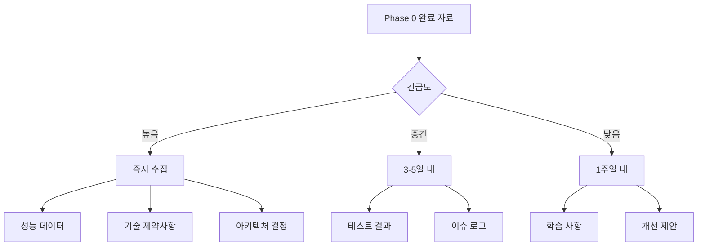

네, 좋은 방법입니다! 다만 더 효과적인 진행을 위해 다음과 같이 구체적인 실행 계획을 추가로 제안드립니다:

## 📋 Phase 0 완료 자료 준비 실행 계획

### 1. 작업 분담 템플릿

```markdown
# Phase 0 완료 자료 수집 태스크

## 긴급도별 분류

### 🔴 즉시 필요 (Phase 1 설계 전 필수)
1. **성능 벤치마크 데이터**
   - 담당: DevOps 팀
   - 기한: 3일 이내
   - 산출물: performance-metrics.json

2. **아키텍처 결정 기록(ADR)**
   - 담당: 아키텍트
   - 기한: 2일 이내
   - 산출물: docs/adr/*.md

3. **발견된 기술적 제약사항**
   - 담당: 전체 개발팀
   - 기한: 2일 이내
   - 산출물: technical-constraints.md

### 🟡 중요 (Phase 1 초기에 필요)
4. **테스트 결과 및 품질 메트릭**
   - 담당: QA 팀
   - 기한: 5일 이내
   - 산출물: test-report.html

5. **이슈 트래킹 및 해결 로그**
   - 담당: 프로젝트 매니저
   - 기한: 4일 이내
   - 산출물: issue-resolution-log.md

### 🟢 보조 (Phase 1 진행 중 참고)
6. **팀 학습 및 개선사항**
   - 담당: 전체 팀
   - 기한: 1주일 이내
   - 산출물: lessons-learned.md
```

### 2. 자료 수집 자동화 스크립트

```bash
#!/bin/bash
# collect-phase0-artifacts.sh

echo "📊 Phase 0 자료 수집 시작..."

# 1. 코드 메트릭 자동 수집
echo "1. 코드 분석 중..."
npm run analyze:code > reports/code-metrics.json
npm run test:coverage > reports/coverage-report.json

# 2. 성능 데이터 수집
echo "2. 성능 데이터 추출 중..."
docker logs prometheus > reports/performance-raw.log
python scripts/parse-performance.py

# 3. 인프라 스냅샷
echo "3. 인프라 상태 캡처 중..."
terraform show -json > reports/infrastructure-state.json
aws dynamodb describe-table --table-name t-developer-main > reports/dynamodb-config.json

# 4. Git 통계
echo "4. 개발 통계 생성 중..."
git log --pretty=format:"%h - %an, %ar : %s" > reports/git-history.log
git diff --stat phase0-start..HEAD > reports/changes-summary.txt

# 5. 의존성 분석
echo "5. 의존성 트리 생성 중..."
npm list --json > reports/dependency-tree.json

echo "✅ 자료 수집 완료! reports/ 디렉토리를 확인하세요."
```

### 3. 체크리스트 관리 도구

```typescript
// scripts/phase0-checklist-tracker.ts
interface ChecklistItem {
  id: string;
  title: string;
  assignee: string;
  dueDate: Date;
  status: 'pending' | 'in-progress' | 'completed';
  artifacts: string[];
}

class Phase0ChecklistTracker {
  private items: ChecklistItem[] = [
    {
      id: "P0-001",
      title: "성능 벤치마크 데이터",
      assignee: "@devops-team",
      dueDate: new Date('2024-01-15'),
      status: 'pending',
      artifacts: ['performance-metrics.json']
    },
    // ... 더 많은 항목들
  ];

  generateReport(): void {
    console.log("📊 Phase 0 완료 자료 준비 현황");
    console.log("================================");
    
    const completed = this.items.filter(i => i.status === 'completed').length;
    const total = this.items.length;
    
    console.log(`진행률: ${completed}/${total} (${Math.round(completed/total*100)}%)`);
    
    // 지연된 항목 표시
    const overdue = this.items.filter(i => 
      i.status !== 'completed' && i.dueDate < new Date()
    );
    
    if (overdue.length > 0) {
      console.log("\n⚠️  지연된 항목:");
      overdue.forEach(item => {
        console.log(`- ${item.title} (담당: ${item.assignee})`);
      });
    }
  }
}
```

### 4. 커뮤니케이션 템플릿

```markdown
# Phase 0 완료 자료 요청

안녕하세요 팀원 여러분,

Phase 1 설계를 시작하기 위해 Phase 0의 완료 자료가 필요합니다.
각자 담당 부분의 자료를 준비해 주세요.

## 📅 일정
- 자료 제출 마감: 2024-01-15 (금)
- Phase 1 설계 시작: 2024-01-18 (월)

## 📝 제출 방법
1. 각 자료는 `reports/phase0/` 디렉토리에 저장
2. 파일명은 체크리스트에 명시된 형식 사용
3. 완료 시 Slack #phase0-completion 채널에 알림

## 🔗 참고 자료
- [자료 수집 가이드](./docs/phase0-collection-guide.md)
- [템플릿 모음](./templates/)
- [자동화 스크립트](./scripts/collect-phase0-artifacts.sh)

질문사항은 언제든 연락주세요!
```

### 5. 우선순위 매트릭스



### 💡 실행 제안

1. **이 체크리스트를 프로젝트 관리 도구에 등록**
   - Jira, Trello, Notion 등에 태스크로 생성
   - 각 항목에 담당자 배정

2. **일일 진행상황 체크**
   - 매일 스탠드업에서 5분간 진행상황 공유
   - 블로커 있으면 즉시 해결

3. **자료 품질 검증**
   - 각 자료 제출 시 체크리스트 대조
   - 누락된 정보 있으면 즉시 보완 요청

이렇게 체계적으로 준비하면 Phase 1 문서 작성이 훨씬 수월해질 것입니다!