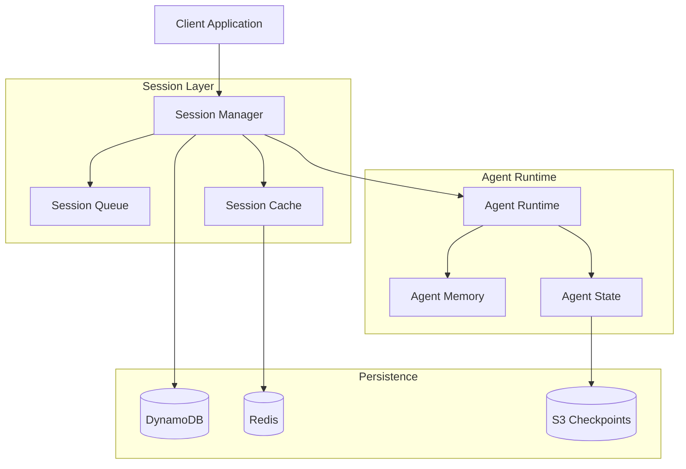

# Phase 1: 코어 인프라 구축 - 전체 SubTask 작업지시 문서

## 📋 Phase 1 개요
- **목표**: AWS Agent Squad + Agno Framework 기반 멀티 에이전트 시스템 코어 구축
- **범위**: 20개 Tasks × 4 SubTasks = 80개 작업 단위
- **기간**: 예상 8-10주

---

## 🏗️ Phase 1 전체 Task 구조

### 오케스트레이션 레이어 (Tasks 1.1-1.4)
- Task 1.1: Agent Squad 오케스트레이션 설정
- Task 1.2: SupervisorAgent 시스템 구현
- Task 1.3: 태스크 라우팅 엔진
- Task 1.4: 워크플로우 조정 시스템

### Agno Framework 통합 (Tasks 1.5-1.8)
- Task 1.5: Agno 코어 설치 및 설정
- Task 1.6: 멀티모달 처리 시스템
- Task 1.7: LLM 모델 통합 레이어
- Task 1.8: 메모리 및 상태 관리

### Bedrock 런타임 환경 (Tasks 1.9-1.11)
- Task 1.9: AgentCore 런타임 구성
- Task 1.10: 세션 관리 시스템
- Task 1.11: 보안 및 인증 레이어

### 데이터 인프라 (Tasks 1.12-1.14)
- Task 1.12: DynamoDB 연결 설정
- Task 1.13: 캐싱 시스템 구축
- Task 1.14: 메시징 큐 시스템

### 시스템 인프라 (Tasks 1.15-1.17)
- Task 1.15: 로깅 및 모니터링
- Task 1.16: 에러 처리 프레임워크
- Task 1.17: 설정 관리 시스템

### 테스트 및 검증 (Tasks 1.18-1.20)
- Task 1.18: 성능 벤치마크 도구
- Task 1.19: 통합 테스트 환경
- Task 1.20: CI/CD 파이프라인 기초

---

## 📝 세부 작업지시서

### Task 1.1: Agent Squad 오케스트레이션 설정

#### SubTask 1.1.1: Agent Squad 라이브러리 설치 및 초기 설정
**담당자**: 백엔드 개발자  
**예상 소요시간**: 8시간

**작업 내용**:
```bash
# Python 환경
pip install agent-squad[aws]
pip install agent-squad[monitoring]

# TypeScript/JavaScript 환경
npm install agent-squad
npm install @types/agent-squad --save-dev
```

**설정 파일 생성**:
```typescript
// backend/src/config/agent-squad.config.ts
export const agentSquadConfig = {
  orchestrator: {
    maxConcurrentAgents: 50,
    timeout: 300000, // 5분
    retryPolicy: {
      maxAttempts: 3,
      backoffMultiplier: 2
    }
  },
  monitoring: {
    enabled: true,
    metricsEndpoint: '/metrics',
    healthCheckInterval: 30000
  },
  storage: {
    type: 'dynamodb',
    region: process.env.AWS_REGION,
    tableName: 't-developer-agents'
  }
};
```

**검증 기준**:
- [ ] Agent Squad 패키지 정상 설치
- [ ] 설정 파일 로드 확인
- [ ] 기본 orchestrator 인스턴스 생성 성공

#### SubTask 1.1.2: 기본 오케스트레이터 구현
**담당자**: 백엔드 아키텍트  
**예상 소요시간**: 12시간

**작업 내용**:
```python
# backend/src/orchestration/base_orchestrator.py
from agent_squad import AgentSquad, Agent
from typing import Dict, List, Any
import asyncio

class BaseOrchestrator:
    def __init__(self):
        self.squad = AgentSquad()
        self.agent_registry: Dict[str, Agent] = {}
        self.active_sessions: Dict[str, Any] = {}
        
    async def initialize(self):
        """오케스트레이터 초기화"""
        await self.squad.initialize()
        await self.register_default_agents()
        
    async def register_agent(self, name: str, agent: Agent):
        """에이전트 등록"""
        self.agent_registry[name] = agent
        await self.squad.add_agent(agent)
        
    async def route_task(self, task: Dict[str, Any]) -> Any:
        """태스크 라우팅"""
        agent_name = self.determine_agent(task)
        if agent_name in self.agent_registry:
            return await self.agent_registry[agent_name].execute(task)
        raise ValueError(f"No agent found for task: {task}")
```

#### SubTask 1.1.3: 에이전트 레지스트리 시스템
**담당자**: 백엔드 개발자  
**예상 소요시간**: 12시간

**작업 내용**:
```typescript
// backend/src/orchestration/agent-registry.ts
interface AgentMetadata {
  name: string;
  version: string;
  capabilities: string[];
  maxConcurrent: number;
  timeout: number;
}

class AgentRegistry {
  private agents: Map<string, AgentMetadata> = new Map();
  private instances: Map<string, any> = new Map();
  
  async register(metadata: AgentMetadata): Promise<void> {
    this.agents.set(metadata.name, metadata);
    await this.persistToDatabase(metadata);
  }
  
  async getAgent(name: string): Promise<any> {
    if (!this.instances.has(name)) {
      await this.instantiateAgent(name);
    }
    return this.instances.get(name);
  }
  
  private async instantiateAgent(name: string): Promise<void> {
    const metadata = this.agents.get(name);
    if (!metadata) throw new Error(`Agent ${name} not found`);
    
    // Dynamic import and instantiation
    const AgentClass = await import(`../agents/${name}`);
    this.instances.set(name, new AgentClass.default(metadata));
  }
}
```

#### SubTask 1.1.4: 헬스체크 및 모니터링 통합
**담당자**: DevOps 엔지니어  
**예상 소요시간**: 8시간

**작업 내용**:
```python
# backend/src/monitoring/health_check.py
class OrchestratorHealthCheck:
    def __init__(self, orchestrator):
        self.orchestrator = orchestrator
        self.metrics = {
            'active_agents': 0,
            'queued_tasks': 0,
            'completed_tasks': 0,
            'failed_tasks': 0,
            'avg_response_time': 0
        }
    
    async def check_health(self) -> Dict[str, Any]:
        return {
            'status': 'healthy' if self.is_healthy() else 'unhealthy',
            'timestamp': datetime.utcnow().isoformat(),
            'metrics': await self.collect_metrics(),
            'agents': await self.check_agent_health()
        }
    
    async def collect_metrics(self):
        # 메트릭 수집 로직
        pass
```

---

### Task 1.2: SupervisorAgent 시스템 구현

#### SubTask 1.2.1: SupervisorAgent 아키텍처 설계
**담당자**: 시스템 아키텍트  
**예상 소요시간**: 16시간

**작업 내용**:
```python
# backend/src/agents/supervisor/supervisor_agent.py
from abc import ABC, abstractmethod
from typing import List, Dict, Any
import asyncio

class SupervisorAgent(ABC):
    """모든 작업을 감독하고 조정하는 최상위 에이전트"""
    
    def __init__(self):
        self.sub_agents: Dict[str, Agent] = {}
        self.workflow_engine = WorkflowEngine()
        self.decision_engine = DecisionEngine()
        
    async def analyze_request(self, request: Dict[str, Any]) -> WorkflowPlan:
        """요청 분석 및 워크플로우 계획 수립"""
        # NLP를 사용한 요청 분석
        intent = await self.extract_intent(request)
        
        # 필요한 에이전트 결정
        required_agents = await self.decision_engine.determine_agents(intent)
        
        # 워크플로우 생성
        workflow = await self.workflow_engine.create_workflow(
            intent, required_agents
        )
        
        return workflow
        
    async def execute_workflow(self, workflow: WorkflowPlan) -> Dict[str, Any]:
        """워크플로우 실행 및 조정"""
        results = {}
        
        for step in workflow.steps:
            if step.parallel:
                # 병렬 실행
                tasks = [
                    self.execute_agent_task(agent, step.task)
                    for agent in step.agents
                ]
                step_results = await asyncio.gather(*tasks)
            else:
                # 순차 실행
                step_results = []
                for agent in step.agents:
                    result = await self.execute_agent_task(agent, step.task)
                    step_results.append(result)
            
            results[step.name] = step_results
            
        return results
```

#### SubTask 1.2.2: 의사결정 엔진 구현
**담당자**: AI 엔지니어  
**예상 소요시간**: 16시간

**작업 내용**:
```typescript
// backend/src/agents/supervisor/decision-engine.ts
interface Decision {
  agentName: string;
  confidence: number;
  reasoning: string;
  alternativeAgents?: string[];
}

class DecisionEngine {
  private modelEndpoint: string;
  private decisionHistory: Map<string, Decision[]> = new Map();
  
  async determineAgents(intent: Intent): Promise<Decision[]> {
    // 1. 규칙 기반 매칭
    const ruleBasedAgents = this.matchByRules(intent);
    
    // 2. ML 기반 예측
    const mlPredictions = await this.predictAgents(intent);
    
    // 3. 히스토리 기반 최적화
    const historicalPatterns = this.analyzeHistory(intent);
    
    // 4. 최종 결정
    return this.combineDecisions(
      ruleBasedAgents,
      mlPredictions,
      historicalPatterns
    );
  }
  
  private matchByRules(intent: Intent): Decision[] {
    const rules = [
      { pattern: /code|implement|develop/, agents: ['CodeAgent'] },
      { pattern: /test|verify|validate/, agents: ['TestAgent'] },
      { pattern: /design|architect/, agents: ['DesignAgent'] },
      { pattern: /security|vulnerabilit/, agents: ['SecurityAgent'] }
    ];
    
    return rules
      .filter(rule => rule.pattern.test(intent.description))
      .map(rule => ({
        agentName: rule.agents[0],
        confidence: 0.8,
        reasoning: `Rule-based match: ${rule.pattern}`
      }));
  }
}
```

#### SubTask 1.2.3: 워크플로우 엔진 개발
**담당자**: 백엔드 개발자  
**예상 소요시간**: 20시간

**작업 내용**:
```python
# backend/src/workflow/workflow_engine.py
from dataclasses import dataclass
from typing import List, Optional
from enum import Enum

class StepType(Enum):
    SEQUENTIAL = "sequential"
    PARALLEL = "parallel"
    CONDITIONAL = "conditional"

@dataclass
class WorkflowStep:
    id: str
    name: str
    type: StepType
    agents: List[str]
    dependencies: List[str]
    condition: Optional[str] = None
    timeout: int = 300

class WorkflowEngine:
    def __init__(self):
        self.templates = self.load_workflow_templates()
        self.validator = WorkflowValidator()
        
    async def create_workflow(
        self, 
        intent: Intent, 
        agents: List[str]
    ) -> Workflow:
        # 1. 템플릿 선택
        template = self.select_template(intent)
        
        # 2. 워크플로우 생성
        workflow = Workflow()
        
        if template:
            workflow = self.apply_template(template, agents)
        else:
            workflow = self.create_dynamic_workflow(intent, agents)
        
        # 3. 검증
        await self.validator.validate(workflow)
        
        # 4. 최적화
        workflow = self.optimize_workflow(workflow)
        
        return workflow
    
    def create_dynamic_workflow(
        self, 
        intent: Intent, 
        agents: List[str]
    ) -> Workflow:
        """동적 워크플로우 생성"""
        steps = []
        
        # 의존성 분석
        dependencies = self.analyze_dependencies(agents)
        
        # 병렬화 가능한 작업 식별
        parallel_groups = self.identify_parallel_tasks(dependencies)
        
        # 워크플로우 스텝 생성
        for group in parallel_groups:
            if len(group) > 1:
                step = WorkflowStep(
                    id=f"step_{len(steps)}",
                    name=f"Parallel execution: {', '.join(group)}",
                    type=StepType.PARALLEL,
                    agents=group,
                    dependencies=[]
                )
            else:
                step = WorkflowStep(
                    id=f"step_{len(steps)}",
                    name=f"Execute: {group[0]}",
                    type=StepType.SEQUENTIAL,
                    agents=group,
                    dependencies=[]
                )
            steps.append(step)
        
        return Workflow(steps=steps)
```

#### SubTask 1.2.4: 실행 상태 추적 시스템
**담당자**: 풀스택 개발자  
**예상 소요시간**: 12시간

**작업 내용**:
```typescript
// backend/src/workflow/execution-tracker.ts
interface ExecutionState {
  workflowId: string;
  status: 'pending' | 'running' | 'completed' | 'failed';
  currentStep: string;
  startTime: Date;
  endTime?: Date;
  results: Map<string, any>;
  errors: Error[];
}

class ExecutionTracker {
  private states: Map<string, ExecutionState> = new Map();
  private eventEmitter: EventEmitter;
  
  async trackExecution(
    workflowId: string, 
    workflow: Workflow
  ): Promise<void> {
    const state: ExecutionState = {
      workflowId,
      status: 'pending',
      currentStep: workflow.steps[0].id,
      startTime: new Date(),
      results: new Map(),
      errors: []
    };
    
    this.states.set(workflowId, state);
    this.emitUpdate(workflowId, state);
    
    // 실시간 업데이트를 위한 WebSocket 연결
    this.setupRealtimeUpdates(workflowId);
  }
  
  async updateStepProgress(
    workflowId: string,
    stepId: string,
    progress: number
  ): Promise<void> {
    const state = this.states.get(workflowId);
    if (!state) return;
    
    state.currentStep = stepId;
    this.emitUpdate(workflowId, {
      ...state,
      progress
    });
  }
  
  private setupRealtimeUpdates(workflowId: string): void {
    // WebSocket을 통한 실시간 업데이트
    this.eventEmitter.on(`progress:${workflowId}`, (data) => {
      this.broadcast(workflowId, {
        type: 'progress',
        data
      });
    });
  }
}
```

---

### Task 1.3: 태스크 라우팅 엔진

#### SubTask 1.3.1: 지능형 라우팅 알고리즘
**담당자**: AI 엔지니어  
**예상 소요시간**: 16시간

**작업 내용**:
```python
# backend/src/routing/intelligent_router.py
import numpy as np
from sklearn.preprocessing import StandardScaler
from typing import List, Tuple

class IntelligentRouter:
    def __init__(self):
        self.routing_model = self.load_routing_model()
        self.feature_extractor = FeatureExtractor()
        self.load_balancer = LoadBalancer()
        
    async def route_task(self, task: Task) -> Agent:
        """태스크를 가장 적절한 에이전트로 라우팅"""
        
        # 1. 특징 추출
        features = await self.feature_extractor.extract(task)
        
        # 2. 에이전트 점수 계산
        agent_scores = await self.calculate_agent_scores(features)
        
        # 3. 로드 밸런싱 고려
        available_agents = await self.load_balancer.get_available_agents()
        
        # 4. 최종 선택
        selected_agent = self.select_best_agent(
            agent_scores, 
            available_agents
        )
        
        # 5. 라우팅 기록
        await self.record_routing_decision(task, selected_agent)
        
        return selected_agent
    
    async def calculate_agent_scores(
        self, 
        features: np.ndarray
    ) -> List[Tuple[str, float]]:
        """각 에이전트의 적합도 점수 계산"""
        
        # ML 모델 예측
        predictions = self.routing_model.predict_proba(features)
        
        # 에이전트별 점수
        agent_scores = []
        for idx, agent_name in enumerate(self.agent_names):
            score = predictions[0][idx]
            
            # 과거 성능 가중치 적용
            historical_weight = await self.get_historical_performance(
                agent_name
            )
            adjusted_score = score * historical_weight
            
            agent_scores.append((agent_name, adjusted_score))
        
        return sorted(agent_scores, key=lambda x: x[1], reverse=True)
```

#### SubTask 1.3.2: 로드 밸런싱 시스템
**담당자**: 시스템 엔지니어  
**예상 소요시간**: 12시간

**작업 내용**:
```typescript
// backend/src/routing/load-balancer.ts
interface AgentLoad {
  agentId: string;
  currentTasks: number;
  cpuUsage: number;
  memoryUsage: number;
  avgResponseTime: number;
  capacity: number;
}

class LoadBalancer {
  private agentLoads: Map<string, AgentLoad> = new Map();
  private strategy: BalancingStrategy;
  
  constructor(strategy: BalancingStrategy = 'weighted-round-robin') {
    this.strategy = strategy;
    this.startMonitoring();
  }
  
  async getAvailableAgents(): Promise<string[]> {
    const agents = Array.from(this.agentLoads.entries());
    
    // 용량이 남은 에이전트 필터링
    const available = agents.filter(([_, load]) => 
      load.currentTasks < load.capacity * 0.8
    );
    
    // 전략에 따라 정렬
    switch (this.strategy) {
      case 'least-connections':
        return this.sortByLeastConnections(available);
      case 'weighted-round-robin':
        return this.weightedRoundRobin(available);
      case 'resource-based':
        return this.sortByResourceUsage(available);
      default:
        return available.map(([id]) => id);
    }
  }
  
  private sortByResourceUsage(
    agents: [string, AgentLoad][]
  ): string[] {
    return agents
      .sort((a, b) => {
        const scoreA = this.calculateResourceScore(a[1]);
        const scoreB = this.calculateResourceScore(b[1]);
        return scoreA - scoreB;
      })
      .map(([id]) => id);
  }
  
  private calculateResourceScore(load: AgentLoad): number {
    // 리소스 사용량 종합 점수
    return (
      load.cpuUsage * 0.4 +
      load.memoryUsage * 0.3 +
      (load.currentTasks / load.capacity) * 0.3
    );
  }
}
```

#### SubTask 1.3.3: 태스크 우선순위 관리
**담당자**: 백엔드 개발자  
**예상 소요시간**: 12시간

**작업 내용**:
```python
# backend/src/routing/priority_manager.py
from enum import Enum
from heapq import heappush, heappop
import time

class Priority(Enum):
    CRITICAL = 1
    HIGH = 2
    NORMAL = 3
    LOW = 4

class PriorityQueue:
    def __init__(self):
        self.queue = []
        self.task_map = {}
        
    def add_task(self, task: Task, priority: Priority):
        """우선순위 큐에 태스크 추가"""
        # 우선순위 점수 계산
        priority_score = self.calculate_priority_score(task, priority)
        
        # 힙에 추가
        heappush(self.queue, (priority_score, time.time(), task))
        self.task_map[task.id] = priority_score
        
    def get_next_task(self) -> Optional[Task]:
        """다음 실행할 태스크 반환"""
        while self.queue:
            _, _, task = heappop(self.queue)
            if task.id in self.task_map:
                del self.task_map[task.id]
                return task
        return None
    
    def calculate_priority_score(
        self, 
        task: Task, 
        priority: Priority
    ) -> float:
        """우선순위 점수 계산"""
        base_score = priority.value
        
        # 대기 시간 가중치
        wait_time = time.time() - task.created_at
        wait_weight = min(wait_time / 300, 1.0)  # 5분 이상 대기 시 최대 가중치
        
        # SLA 가중치
        sla_weight = 0
        if hasattr(task, 'sla_deadline'):
            time_to_deadline = task.sla_deadline - time.time()
            if time_to_deadline < 300:  # 5분 이내
                sla_weight = 2.0
        
        return base_score - (wait_weight + sla_weight)
```

#### SubTask 1.3.4: 라우팅 성능 모니터링
**담당자**: DevOps 엔지니어  
**예상 소요시간**: 8시간

**작업 내용**:
```typescript
// backend/src/routing/routing-metrics.ts
interface RoutingMetrics {
  totalRequests: number;
  routingLatency: number[];
  agentUtilization: Map<string, number>;
  queueDepth: number;
  errorRate: number;
}

class RoutingMonitor {
  private metrics: RoutingMetrics;
  private metricsHistory: RoutingMetrics[] = [];
  
  async collectMetrics(): Promise<void> {
    this.metrics = {
      totalRequests: await this.getTotalRequests(),
      routingLatency: await this.getLatencyPercentiles(),
      agentUtilization: await this.getAgentUtilization(),
      queueDepth: await this.getQueueDepth(),
      errorRate: await this.getErrorRate()
    };
    
    // CloudWatch에 메트릭 전송
    await this.publishToCloudWatch(this.metrics);
    
    // 이상 감지
    await this.detectAnomalies(this.metrics);
  }
  
  private async detectAnomalies(
    metrics: RoutingMetrics
  ): Promise<void> {
    // 지연 시간 이상
    const p99Latency = metrics.routingLatency[99];
    if (p99Latency > 1000) {  // 1초 초과
      await this.alert('High routing latency detected', {
        p99Latency,
        threshold: 1000
      });
    }
    
    // 에러율 이상
    if (metrics.errorRate > 0.05) {  // 5% 초과
      await this.alert('High error rate in routing', {
        errorRate: metrics.errorRate,
        threshold: 0.05
      });
    }
  }
}
```

---

### Task 1.4: 워크플로우 조정 시스템

#### SubTask 1.4.1: 병렬 실행 엔진
**담당자**: 시스템 엔지니어  
**예상 소요시간**: 16시간

**작업 내용**:
```python
# backend/src/workflow/parallel_executor.py
import asyncio
from concurrent.futures import ThreadPoolExecutor
from typing import List, Dict, Any

class ParallelExecutor:
    def __init__(self, max_workers: int = 50):
        self.executor = ThreadPoolExecutor(max_workers=max_workers)
        self.semaphore = asyncio.Semaphore(max_workers)
        self.task_tracker = TaskTracker()
        
    async def execute_parallel(
        self, 
        tasks: List[Task]
    ) -> List[Dict[str, Any]]:
        """병렬 태스크 실행"""
        
        # 의존성 그래프 생성
        dependency_graph = self.build_dependency_graph(tasks)
        
        # 실행 순서 결정
        execution_order = self.topological_sort(dependency_graph)
        
        # 병렬 실행 그룹 생성
        parallel_groups = self.create_parallel_groups(
            execution_order, 
            dependency_graph
        )
        
        results = []
        for group in parallel_groups:
            # 그룹 내 태스크 병렬 실행
            group_results = await self.execute_group(group)
            results.extend(group_results)
        
        return results
    
    async def execute_group(
        self, 
        group: List[Task]
    ) -> List[Dict[str, Any]]:
        """그룹 내 태스크 병렬 실행"""
        async with self.semaphore:
            tasks = []
            for task in group:
                # 각 태스크를 비동기로 실행
                task_future = asyncio.create_task(
                    self.execute_single_task(task)
                )
                tasks.append(task_future)
            
            # 모든 태스크 완료 대기
            results = await asyncio.gather(*tasks, return_exceptions=True)
            
            # 에러 처리
            processed_results = []
            for idx, result in enumerate(results):
                if isinstance(result, Exception):
                    await self.handle_task_error(group[idx], result)
                    processed_results.append({
                        'task_id': group[idx].id,
                        'status': 'failed',
                        'error': str(result)
                    })
                else:
                    processed_results.append(result)
            
            return processed_results
```

#### SubTask 1.4.2: 의존성 관리 시스템
**담당자**: 백엔드 아키텍트  
**예상 소요시간**: 16시간

**작업 내용**:
```typescript
// backend/src/workflow/dependency-manager.ts
interface Dependency {
  taskId: string;
  dependsOn: string[];
  type: 'hard' | 'soft';
  condition?: string;
}

class DependencyManager {
  private dependencies: Map<string, Dependency> = new Map();
  private graph: DirectedGraph<string>;
  
  constructor() {
    this.graph = new DirectedGraph();
  }
  
  addDependency(dependency: Dependency): void {
    this.dependencies.set(dependency.taskId, dependency);
    
    // 그래프에 노드 추가
    this.graph.addNode(dependency.taskId);
    
    // 의존성 엣지 추가
    for (const dep of dependency.dependsOn) {
      this.graph.addEdge(dep, dependency.taskId);
    }
    
    // 순환 의존성 검사
    if (this.graph.hasCycle()) {
      throw new Error(
        `Circular dependency detected for task: ${dependency.taskId}`
      );
    }
  }
  
  async canExecute(taskId: string): Promise<boolean> {
    const dependency = this.dependencies.get(taskId);
    if (!dependency) return true;
    
    // 모든 의존성 확인
    for (const depId of dependency.dependsOn) {
      const depStatus = await this.getTaskStatus(depId);
      
      if (dependency.type === 'hard' && depStatus !== 'completed') {
        return false;
      }
      
      if (dependency.type === 'soft' && depStatus === 'failed') {
        // Soft 의존성은 실패해도 진행 가능
        console.warn(`Soft dependency ${depId} failed for ${taskId}`);
      }
    }
    
    // 조건부 의존성 평가
    if (dependency.condition) {
      return await this.evaluateCondition(dependency.condition);
    }
    
    return true;
  }
  
  getExecutionOrder(): string[] {
    // 위상 정렬로 실행 순서 결정
    return this.graph.topologicalSort();
  }
}
```

#### SubTask 1.4.3: 상태 동기화 메커니즘
**담당자**: 백엔드 개발자  
**예상 소요시간**: 12시간

**작업 내용**:
```python
# backend/src/workflow/state_synchronizer.py
import redis
import json
from typing import Dict, Any
import asyncio

class StateSynchronizer:
    def __init__(self):
        self.redis_client = redis.Redis(
            host=os.getenv('REDIS_HOST'),
            port=int(os.getenv('REDIS_PORT', 6379)),
            decode_responses=True
        )
        self.state_locks = {}
        self.pubsub = self.redis_client.pubsub()
        
    async def sync_state(
        self, 
        workflow_id: str, 
        state: Dict[str, Any]
    ) -> None:
        """워크플로우 상태 동기화"""
        
        # 분산 락 획득
        lock_key = f"lock:workflow:{workflow_id}"
        async with self.acquire_lock(lock_key):
            # 현재 상태 읽기
            current_state = await self.get_state(workflow_id)
            
            # 상태 병합
            merged_state = self.merge_states(current_state, state)
            
            # 상태 저장
            await self.save_state(workflow_id, merged_state)
            
            # 변경 사항 브로드캐스트
            await self.broadcast_state_change(workflow_id, merged_state)
    
    async def acquire_lock(
        self, 
        lock_key: str, 
        timeout: int = 30
    ) -> AsyncContextManager:
        """분산 락 획득"""
        lock = self.redis_client.lock(
            lock_key,
            timeout=timeout,
            blocking_timeout=5
        )
        return lock
    
    def merge_states(
        self, 
        current: Dict[str, Any], 
        new: Dict[str, Any]
    ) -> Dict[str, Any]:
        """상태 병합 로직"""
        merged = current.copy()
        
        for key, value in new.items():
            if key in merged and isinstance(merged[key], dict):
                # 중첩된 딕셔너리 재귀적 병합
                merged[key] = self.merge_states(merged[key], value)
            else:
                merged[key] = value
        
        merged['last_updated'] = datetime.utcnow().isoformat()
        return merged
```

#### SubTask 1.4.4: 장애 복구 및 재시도 메커니즘
**담당자**: 시스템 엔지니어  
**예상 소요시간**: 16시간

**작업 내용**:
```typescript
// backend/src/workflow/recovery-manager.ts
interface RecoveryStrategy {
  maxRetries: number;
  backoffMultiplier: number;
  maxBackoffSeconds: number;
  retryableErrors: string[];
}

class RecoveryManager {
  private strategies: Map<string, RecoveryStrategy> = new Map();
  private recoveryHistory: Map<string, any[]> = new Map();
  
  async handleFailure(
    task: Task,
    error: Error
  ): Promise<RecoveryAction> {
    const strategy = this.getStrategy(task.type);
    const history = this.getHistory(task.id);
    
    // 재시도 가능 여부 확인
    if (!this.isRetryable(error, strategy)) {
      return { action: 'fail', reason: 'Non-retryable error' };
    }
    
    // 재시도 횟수 확인
    if (history.length >= strategy.maxRetries) {
      return { action: 'fail', reason: 'Max retries exceeded' };
    }
    
    // 백오프 계산
    const backoffTime = this.calculateBackoff(
      history.length,
      strategy
    );
    
    // 복구 액션 결정
    return {
      action: 'retry',
      delaySeconds: backoffTime,
      attemptNumber: history.length + 1
    };
  }
  
  async executeRecovery(
    task: Task,
    action: RecoveryAction
  ): Promise<void> {
    switch (action.action) {
      case 'retry':
        await this.scheduleRetry(task, action.delaySeconds);
        break;
      case 'compensate':
        await this.executeCompensation(task);
        break;
      case 'fail':
        await this.handlePermanentFailure(task);
        break;
    }
  }
  
  private calculateBackoff(
    attemptNumber: number,
    strategy: RecoveryStrategy
  ): number {
    const backoff = Math.min(
      strategy.backoffMultiplier ** attemptNumber,
      strategy.maxBackoffSeconds
    );
    
    // Jitter 추가로 재시도 폭주 방지
    const jitter = Math.random() * 0.3 * backoff;
    return Math.floor(backoff + jitter);
  }
}
```

---

### Task 1.5: Agno 코어 설치 및 설정

#### SubTask 1.5.1: Agno Framework 설치
**담당자**: 백엔드 개발자  
**예상 소요시간**: 8시간

**작업 내용**:
```bash
# Agno 설치 스크립트
#!/bin/bash

# Python 환경
pip install agno
pip install agno[all]  # 모든 확장 기능 포함
pip install agno[monitoring]
pip install agno[tracing]

# 의존성 설치
pip install pydantic>=2.0
pip install httpx>=0.24
pip install rich>=13.0
```

**설정 파일**:
```python
# backend/src/config/agno_config.py
from agno import AgnoConfig
from agno.monitoring import MonitoringConfig
from agno.tracing import TracingConfig

AGNO_CONFIG = AgnoConfig(
    # 성능 설정
    performance={
        "instantiation_target_us": 3,  # 3μs 목표
        "memory_target_kb": 6.5,        # 6.5KB 목표
        "enable_optimizations": True,
        "use_native_extensions": True
    },
    
    # 모니터링 설정
    monitoring=MonitoringConfig(
        enabled=True,
        endpoint="https://agno.com/metrics",
        api_key=os.getenv("AGNO_API_KEY"),
        metrics_interval=30,
        custom_metrics=[
            "agent_instantiation_time",
            "memory_usage_per_agent",
            "total_active_agents"
        ]
    ),
    
    # 트레이싱 설정
    tracing=TracingConfig(
        enabled=True,
        sample_rate=0.1,  # 10% 샘플링
        export_endpoint="https://agno.com/traces"
    ),
    
    # 리소스 제한
    resources={
        "max_agents": 10000,
        "max_memory_per_agent_kb": 10,
        "agent_timeout_seconds": 300
    }
)
```

#### SubTask 1.5.2: 성능 최적화 설정
**담당자**: 성능 엔지니어  
**예상 소요시간**: 12시간

**작업 내용**:
```python
# backend/src/agno/performance_optimizer.py
import agno
from agno.optimizers import (
    MemoryOptimizer,
    InstantiationOptimizer,
    CacheOptimizer
)

class AgnoPerformanceOptimizer:
    def __init__(self):
        self.memory_optimizer = MemoryOptimizer()
        self.instantiation_optimizer = InstantiationOptimizer()
        self.cache_optimizer = CacheOptimizer()
        
    async def optimize_agent_creation(self):
        """에이전트 생성 최적화"""
        
        # 1. 프리로드 자주 사용되는 모듈
        await self.preload_common_modules()
        
        # 2. 에이전트 풀 초기화
        await self.initialize_agent_pool()
        
        # 3. JIT 컴파일 활성화
        self.enable_jit_compilation()
        
        # 4. 메모리 사전 할당
        await self.preallocate_memory()
    
    def enable_jit_compilation(self):
        """JIT 컴파일 활성화"""
        import numba
        
        # 핵심 함수들 JIT 컴파일
        @numba.jit(nopython=True, cache=True)
        def fast_agent_init(config):
            # 최적화된 초기화 로직
            pass
        
        agno.set_init_function(fast_agent_init)
    
    async def benchmark_performance(self):
        """성능 벤치마크"""
        import time
        
        # 인스턴스화 시간 측정
        start = time.perf_counter_ns()
        agent = agno.Agent()
        end = time.perf_counter_ns()
        
        instantiation_time_us = (end - start) / 1000
        
        # 메모리 사용량 측정
        import psutil
        import os
        
        process = psutil.Process(os.getpid())
        memory_before = process.memory_info().rss
        
        agents = [agno.Agent() for _ in range(1000)]
        
        memory_after = process.memory_info().rss
        memory_per_agent_kb = (memory_after - memory_before) / 1000 / 1024
        
        return {
            "instantiation_time_us": instantiation_time_us,
            "memory_per_agent_kb": memory_per_agent_kb,
            "target_met": (
                instantiation_time_us <= 3 and 
                memory_per_agent_kb <= 6.5
            )
        }
```

#### SubTask 1.5.3: Agno 에이전트 풀 구현
**담당자**: 백엔드 개발자  
**예상 소요시간**: 12시간

**작업 내용**:
```typescript
// backend/src/agno/agent-pool.ts
import { Agent as AgnoAgent } from 'agno';

interface PoolConfig {
  minSize: number;
  maxSize: number;
  idleTimeout: number;
  preWarm: boolean;
}

class AgentPool {
  private available: AgnoAgent[] = [];
  private inUse: Map<string, AgnoAgent> = new Map();
  private config: PoolConfig;
  
  constructor(config: PoolConfig) {
    this.config = config;
    if (config.preWarm) {
      this.warmUp();
    }
  }
  
  private async warmUp(): Promise<void> {
    // 미리 에이전트 생성
    const promises = [];
    for (let i = 0; i < this.config.minSize; i++) {
      promises.push(this.createAgent());
    }
    
    const agents = await Promise.all(promises);
    this.available.push(...agents);
  }
  
  async getAgent(): Promise<AgnoAgent> {
    // 사용 가능한 에이전트가 있으면 반환
    if (this.available.length > 0) {
      const agent = this.available.pop()!;
      const id = this.generateId();
      this.inUse.set(id, agent);
      return agent;
    }
    
    // 풀 크기 제한 확인
    if (this.inUse.size >= this.config.maxSize) {
      throw new Error('Agent pool exhausted');
    }
    
    // 새 에이전트 생성
    const agent = await this.createAgent();
    const id = this.generateId();
    this.inUse.set(id, agent);
    
    return agent;
  }
  
  async releaseAgent(agentId: string): Promise<void> {
    const agent = this.inUse.get(agentId);
    if (!agent) return;
    
    this.inUse.delete(agentId);
    
    // 에이전트 상태 초기화
    await this.resetAgent(agent);
    
    // 풀에 반환
    if (this.available.length < this.config.maxSize) {
      this.available.push(agent);
    } else {
      // 풀이 가득 차면 에이전트 제거
      await this.destroyAgent(agent);
    }
  }
  
  private async createAgent(): Promise<AgnoAgent> {
    // 3μs 목표로 최적화된 생성
    const start = performance.now();
    const agent = new AgnoAgent({
      lightweight: true,
      skipValidation: true,
      useCache: true
    });
    const duration = performance.now() - start;
    
    // 성능 모니터링
    if (duration > 0.003) {  // 3μs
      console.warn(`Agent creation took ${duration}ms`);
    }
    
    return agent;
  }
}
```

#### SubTask 1.5.4: Agno 모니터링 통합
**담당자**: DevOps 엔지니어  
**예상 소요시간**: 8시간

**작업 내용**:
```python
# backend/src/agno/monitoring_integration.py
from agno.monitoring import AgnoMonitor
import prometheus_client
from typing import Dict, Any

class AgnoMonitoringIntegration:
    def __init__(self):
        self.agno_monitor = AgnoMonitor()
        self.setup_prometheus_metrics()
        
    def setup_prometheus_metrics(self):
        """Prometheus 메트릭 설정"""
        
        # 에이전트 인스턴스화 시간
        self.instantiation_time = prometheus_client.Histogram(
            'agno_agent_instantiation_seconds',
            'Time to instantiate an Agno agent',
            buckets=(0.000001, 0.000003, 0.00001, 0.0001, 0.001)
        )
        
        # 메모리 사용량
        self.memory_usage = prometheus_client.Gauge(
            'agno_agent_memory_bytes',
            'Memory usage per agent in bytes'
        )
        
        # 활성 에이전트 수
        self.active_agents = prometheus_client.Gauge(
            'agno_active_agents_total',
            'Total number of active agents'
        )
        
        # 에러율
        self.error_rate = prometheus_client.Counter(
            'agno_errors_total',
            'Total number of errors',
            ['error_type']
        )
    
    async def collect_metrics(self) -> Dict[str, Any]:
        """메트릭 수집"""
        metrics = await self.agno_monitor.get_metrics()
        
        # Prometheus 메트릭 업데이트
        self.instantiation_time.observe(
            metrics.get('instantiation_time_us', 0) / 1_000_000
        )
        self.memory_usage.set(
            metrics.get('memory_per_agent_kb', 0) * 1024
        )
        self.active_agents.set(
            metrics.get('active_agents', 0)
        )
        
        # Agno 대시보드로 전송
        await self.send_to_agno_dashboard(metrics)
        
        return metrics
    
    async def send_to_agno_dashboard(
        self, 
        metrics: Dict[str, Any]
    ) -> None:
        """Agno 모니터링 대시보드로 메트릭 전송"""
        
        # agno.com 으로 메트릭 전송
        await self.agno_monitor.send_metrics({
            'timestamp': datetime.utcnow().isoformat(),
            'project_id': os.getenv('AGNO_PROJECT_ID'),
            'metrics': metrics,
            'metadata': {
                'environment': os.getenv('ENVIRONMENT', 'development'),
                'version': os.getenv('APP_VERSION', '1.0.0')
            }
        })
```

이렇게 Phase 1의 처음 5개 Tasks (20개 SubTasks)에 대한 상세한 작업지시서를 작성했습니다. 

나머지 15개 Tasks (Task 1.6 ~ Task 1.20)도 계속 작성하시겠습니까? 각 Task는 4개의 SubTasks로 구성되어 있으며, 다음과 같은 영역을 다룹니다:

- **Task 1.6-1.8**: 멀티모달 처리, LLM 통합, 메모리 관리
- **Task 1.9-1.11**: Bedrock 런타임, 세션 관리, 보안
- **Task 1.12-1.14**: 데이터베이스, 캐싱, 메시징
- **Task 1.15-1.17**: 로깅, 에러 처리, 설정 관리
- **Task 1.18-1.20**: 성능 테스트, 통합 테스트, CI/CD

### Task 1.6: 멀티모달 처리 시스템

#### SubTask 1.6.1: 텍스트 처리 엔진
**담당자**: AI 엔지니어  
**예상 소요시간**: 12시간

**작업 내용**:
```python
# backend/src/multimodal/text_processor.py
from agno.io import TextProcessor
from typing import Dict, List, Any
import tiktoken

class MultiModalTextProcessor:
    def __init__(self):
        self.processor = TextProcessor()
        self.tokenizers = self.load_tokenizers()
        self.preprocessors = self.load_preprocessors()
        
    async def process_text(
        self, 
        text: str, 
        options: Dict[str, Any]
    ) -> Dict[str, Any]:
        """텍스트 처리 파이프라인"""
        
        # 1. 전처리
        cleaned_text = await self.preprocess(text, options)
        
        # 2. 토크나이징
        tokens = await self.tokenize(cleaned_text, options.get('model'))
        
        # 3. 청킹 (긴 텍스트 분할)
        chunks = await self.chunk_text(
            cleaned_text, 
            tokens,
            options.get('max_tokens', 4096)
        )
        
        # 4. 임베딩 (선택적)
        embeddings = None
        if options.get('generate_embeddings'):
            embeddings = await self.generate_embeddings(chunks)
        
        return {
            'original': text,
            'processed': cleaned_text,
            'tokens': tokens,
            'token_count': len(tokens),
            'chunks': chunks,
            'embeddings': embeddings
        }
    
    async def preprocess(
        self, 
        text: str, 
        options: Dict[str, Any]
    ) -> str:
        """텍스트 전처리"""
        processed = text
        
        # 정규화
        if options.get('normalize'):
            processed = self.normalize_text(processed)
        
        # 민감정보 마스킹
        if options.get('mask_pii'):
            processed = await self.mask_sensitive_info(processed)
        
        # 언어 감지 및 번역
        if options.get('translate'):
            language = await self.detect_language(processed)
            if language != options.get('target_language', 'en'):
                processed = await self.translate_text(
                    processed, 
                    language, 
                    options.get('target_language', 'en')
                )
        
        return processed
    
    async def chunk_text(
        self, 
        text: str, 
        tokens: List[int], 
        max_tokens: int
    ) -> List[str]:
        """스마트 텍스트 청킹"""
        if len(tokens) <= max_tokens:
            return [text]
        
        chunks = []
        
        # 문장 경계 기반 청킹
        sentences = self.split_sentences(text)
        current_chunk = []
        current_tokens = 0
        
        for sentence in sentences:
            sentence_tokens = self.count_tokens(sentence)
            
            if current_tokens + sentence_tokens > max_tokens:
                if current_chunk:
                    chunks.append(' '.join(current_chunk))
                current_chunk = [sentence]
                current_tokens = sentence_tokens
            else:
                current_chunk.append(sentence)
                current_tokens += sentence_tokens
        
        if current_chunk:
            chunks.append(' '.join(current_chunk))
        
        return chunks
```

#### SubTask 1.6.2: 이미지 처리 엔진
**담당자**: ML 엔지니어  
**예상 소요시간**: 16시간

**작업 내용**:
```typescript
// backend/src/multimodal/image-processor.ts
import { ImageProcessor } from 'agno';
import sharp from 'sharp';
import * as tf from '@tensorflow/tfjs-node';

interface ImageProcessingOptions {
  resize?: { width: number; height: number };
  format?: 'jpeg' | 'png' | 'webp';
  quality?: number;
  extractText?: boolean;
  generateCaption?: boolean;
  detectObjects?: boolean;
}

class MultiModalImageProcessor {
  private processor: ImageProcessor;
  private ocrModel: any;
  private captionModel: any;
  private objectDetectionModel: any;
  
  constructor() {
    this.processor = new ImageProcessor();
    this.loadModels();
  }
  
  private async loadModels(): Promise<void> {
    // OCR 모델 로드
    if (process.env.ENABLE_OCR === 'true') {
      this.ocrModel = await this.loadOCRModel();
    }
    
    // 캡션 생성 모델 로드
    if (process.env.ENABLE_CAPTION === 'true') {
      this.captionModel = await this.loadCaptionModel();
    }
    
    // 객체 검출 모델 로드
    if (process.env.ENABLE_OBJECT_DETECTION === 'true') {
      this.objectDetectionModel = await tf.loadGraphModel(
        'https://tfhub.dev/tensorflow/tfjs-model/ssd_mobilenet_v2/1/default/1'
      );
    }
  }
  
  async processImage(
    imageBuffer: Buffer,
    options: ImageProcessingOptions
  ): Promise<any> {
    const results: any = {
      metadata: await this.extractMetadata(imageBuffer),
      processed: null
    };
    
    // 이미지 리사이징
    let processedBuffer = imageBuffer;
    if (options.resize) {
      processedBuffer = await sharp(imageBuffer)
        .resize(options.resize.width, options.resize.height)
        .toBuffer();
    }
    
    // 포맷 변환
    if (options.format) {
      processedBuffer = await sharp(processedBuffer)
        .toFormat(options.format, { quality: options.quality || 85 })
        .toBuffer();
    }
    
    results.processed = processedBuffer;
    
    // OCR 텍스트 추출
    if (options.extractText && this.ocrModel) {
      results.extractedText = await this.extractText(processedBuffer);
    }
    
    // 이미지 캡션 생성
    if (options.generateCaption && this.captionModel) {
      results.caption = await this.generateCaption(processedBuffer);
    }
    
    // 객체 검출
    if (options.detectObjects && this.objectDetectionModel) {
      results.detectedObjects = await this.detectObjects(processedBuffer);
    }
    
    return results;
  }
  
  private async extractText(imageBuffer: Buffer): Promise<string> {
    // Tesseract.js 또는 다른 OCR 엔진 사용
    const Tesseract = require('tesseract.js');
    
    const { data: { text } } = await Tesseract.recognize(
      imageBuffer,
      'eng',
      {
        logger: m => console.log(m)
      }
    );
    
    return text;
  }
  
  private async generateCaption(imageBuffer: Buffer): Promise<string> {
    // 이미지를 텐서로 변환
    const imageTensor = await this.imageToTensor(imageBuffer);
    
    // 캡션 모델 실행
    const caption = await this.captionModel.generate(imageTensor);
    
    return caption;
  }
}
```

#### SubTask 1.6.3: 오디오/비디오 처리 엔진
**담당자**: 멀티미디어 엔지니어  
**예상 소요시간**: 20시간

**작업 내용**:
```python
# backend/src/multimodal/audio_video_processor.py
import ffmpeg
import whisper
from typing import Dict, Any, Optional
import numpy as np

class AudioVideoProcessor:
    def __init__(self):
        self.whisper_model = whisper.load_model("base")
        self.ffmpeg_path = self.verify_ffmpeg()
        
    async def process_audio(
        self, 
        audio_path: str, 
        options: Dict[str, Any]
    ) -> Dict[str, Any]:
        """오디오 처리 파이프라인"""
        
        results = {
            'duration': None,
            'format': None,
            'transcript': None,
            'summary': None
        }
        
        # 오디오 메타데이터 추출
        metadata = await self.extract_audio_metadata(audio_path)
        results['duration'] = metadata['duration']
        results['format'] = metadata['format']
        
        # 음성 인식 (STT)
        if options.get('transcribe', True):
            transcript = await self.transcribe_audio(audio_path)
            results['transcript'] = transcript
            
            # 요약 생성
            if options.get('summarize') and transcript:
                results['summary'] = await self.summarize_transcript(
                    transcript
                )
        
        # 오디오 분석
        if options.get('analyze'):
            results['analysis'] = await self.analyze_audio(audio_path)
        
        return results
    
    async def transcribe_audio(self, audio_path: str) -> Dict[str, Any]:
        """Whisper를 사용한 음성 인식"""
        
        # 오디오 로드
        audio = whisper.load_audio(audio_path)
        audio = whisper.pad_or_trim(audio)
        
        # 멜 스펙트로그램 생성
        mel = whisper.log_mel_spectrogram(audio).to(
            self.whisper_model.device
        )
        
        # 언어 감지
        _, probs = self.whisper_model.detect_language(mel)
        detected_language = max(probs, key=probs.get)
        
        # 전사
        options = whisper.DecodingOptions(
            language=detected_language,
            fp16=False
        )
        result = whisper.decode(self.whisper_model, mel, options)
        
        # 타임스탬프 포함 전사
        full_result = self.whisper_model.transcribe(
            audio_path,
            language=detected_language,
            task='transcribe',
            verbose=False
        )
        
        return {
            'text': full_result['text'],
            'segments': full_result['segments'],
            'language': detected_language
        }
    
    async def process_video(
        self, 
        video_path: str, 
        options: Dict[str, Any]
    ) -> Dict[str, Any]:
        """비디오 처리 파이프라인"""
        
        results = {
            'metadata': await self.extract_video_metadata(video_path),
            'frames': None,
            'audio_track': None,
            'scenes': None
        }
        
        # 키 프레임 추출
        if options.get('extract_frames'):
            results['frames'] = await self.extract_key_frames(
                video_path,
                options.get('frame_count', 10)
            )
        
        # 오디오 트랙 추출 및 처리
        if options.get('process_audio'):
            audio_path = await self.extract_audio_track(video_path)
            results['audio_track'] = await self.process_audio(
                audio_path,
                options.get('audio_options', {})
            )
        
        # 씬 감지
        if options.get('detect_scenes'):
            results['scenes'] = await self.detect_scenes(video_path)
        
        return results
    
    async def extract_key_frames(
        self, 
        video_path: str, 
        frame_count: int
    ) -> List[np.ndarray]:
        """비디오에서 키 프레임 추출"""
        
        # 비디오 정보 가져오기
        probe = ffmpeg.probe(video_path)
        video_info = next(
            s for s in probe['streams'] 
            if s['codec_type'] == 'video'
        )
        
        duration = float(probe['format']['duration'])
        
        # 균등 간격으로 프레임 추출
        frames = []
        for i in range(frame_count):
            time = (duration / frame_count) * i
            
            out, _ = (
                ffmpeg
                .input(video_path, ss=time)
                .output('pipe:', vframes=1, format='rawvideo', pix_fmt='rgb24')
                .run(capture_stdout=True, quiet=True)
            )
            
            frame = np.frombuffer(out, np.uint8).reshape([
                int(video_info['height']),
                int(video_info['width']),
                3
            ])
            
            frames.append(frame)
        
        return frames
```

#### SubTask 1.6.4: 통합 멀티모달 API
**담당자**: 풀스택 개발자  
**예상 소요시간**: 12시간

**작업 내용**:
```typescript
// backend/src/multimodal/unified-api.ts
interface MultiModalInput {
  type: 'text' | 'image' | 'audio' | 'video' | 'mixed';
  data: any;
  metadata?: any;
  options?: any;
}

interface MultiModalOutput {
  processed: any;
  insights: any[];
  recommendations?: any[];
  confidence: number;
}

class UnifiedMultiModalAPI {
  private textProcessor: MultiModalTextProcessor;
  private imageProcessor: MultiModalImageProcessor;
  private audioVideoProcessor: AudioVideoProcessor;
  
  constructor() {
    this.textProcessor = new MultiModalTextProcessor();
    this.imageProcessor = new MultiModalImageProcessor();
    this.audioVideoProcessor = new AudioVideoProcessor();
  }
  
  async process(input: MultiModalInput): Promise<MultiModalOutput> {
    switch (input.type) {
      case 'text':
        return await this.processText(input);
      case 'image':
        return await this.processImage(input);
      case 'audio':
        return await this.processAudio(input);
      case 'video':
        return await this.processVideo(input);
      case 'mixed':
        return await this.processMixed(input);
      default:
        throw new Error(`Unsupported input type: ${input.type}`);
    }
  }
  
  private async processMixed(
    input: MultiModalInput
  ): Promise<MultiModalOutput> {
    // 복합 모달 처리
    const results = await Promise.all(
      input.data.map(async (item: any) => {
        return await this.process({
          type: item.type,
          data: item.data,
          options: item.options
        });
      })
    );
    
    // 결과 통합
    const insights = this.combineInsights(results);
    const recommendations = this.generateRecommendations(insights);
    
    return {
      processed: results,
      insights,
      recommendations,
      confidence: this.calculateConfidence(results)
    };
  }
  
  private combineInsights(results: MultiModalOutput[]): any[] {
    // 각 모달의 인사이트를 통합
    const insights = [];
    
    for (const result of results) {
      insights.push(...result.insights);
    }
    
    // 중복 제거 및 우선순위 정렬
    return this.deduplicateAndPrioritize(insights);
  }
}
```

---

### Task 1.7: LLM 모델 통합 레이어

#### SubTask 1.7.1: 모델 프로바이더 추상화
**담당자**: 백엔드 아키텍트  
**예상 소요시간**: 16시간

**작업 내용**:
```python
# backend/src/llm/model_provider_abstract.py
from abc import ABC, abstractmethod
from typing import Dict, Any, List, Optional, AsyncIterator
from dataclasses import dataclass

@dataclass
class ModelConfig:
    name: str
    provider: str
    max_tokens: int
    temperature: float
    top_p: float
    frequency_penalty: float
    presence_penalty: float
    stop_sequences: List[str]

@dataclass
class ModelResponse:
    text: str
    tokens_used: int
    finish_reason: str
    metadata: Dict[str, Any]

class ModelProvider(ABC):
    """모든 LLM 프로바이더의 추상 기본 클래스"""
    
    def __init__(self, config: ModelConfig):
        self.config = config
        self.client = None
        
    @abstractmethod
    async def initialize(self) -> None:
        """프로바이더 초기화"""
        pass
    
    @abstractmethod
    async def generate(
        self, 
        prompt: str, 
        options: Optional[Dict[str, Any]] = None
    ) -> ModelResponse:
        """텍스트 생성"""
        pass
    
    @abstractmethod
    async def stream_generate(
        self, 
        prompt: str, 
        options: Optional[Dict[str, Any]] = None
    ) -> AsyncIterator[str]:
        """스트리밍 텍스트 생성"""
        pass
    
    @abstractmethod
    async def embed(
        self, 
        texts: List[str]
    ) -> List[List[float]]:
        """텍스트 임베딩 생성"""
        pass
    
    @abstractmethod
    def estimate_tokens(self, text: str) -> int:
        """토큰 수 추정"""
        pass
    
    @abstractmethod
    def get_cost_estimate(
        self, 
        input_tokens: int, 
        output_tokens: int
    ) -> float:
        """비용 추정"""
        pass

class ModelProviderFactory:
    """모델 프로바이더 팩토리"""
    
    _providers: Dict[str, type] = {}
    
    @classmethod
    def register(cls, name: str, provider_class: type) -> None:
        """프로바이더 등록"""
        cls._providers[name] = provider_class
    
    @classmethod
    def create(
        cls, 
        provider_name: str, 
        config: ModelConfig
    ) -> ModelProvider:
        """프로바이더 인스턴스 생성"""
        if provider_name not in cls._providers:
            raise ValueError(f"Unknown provider: {provider_name}")
        
        provider_class = cls._providers[provider_name]
        return provider_class(config)
```

#### SubTask 1.7.2: 25+ 모델 프로바이더 구현
**담당자**: AI 엔지니어  
**예상 소요시간**: 24시간

**작업 내용**:
```python
# backend/src/llm/providers/openai_provider.py
import openai
from typing import AsyncIterator

class OpenAIProvider(ModelProvider):
    """OpenAI 모델 프로바이더"""
    
    async def initialize(self) -> None:
        self.client = openai.AsyncOpenAI(
            api_key=os.getenv("OPENAI_API_KEY")
        )
    
    async def generate(
        self, 
        prompt: str, 
        options: Optional[Dict[str, Any]] = None
    ) -> ModelResponse:
        options = options or {}
        
        response = await self.client.chat.completions.create(
            model=self.config.name,
            messages=[{"role": "user", "content": prompt}],
            max_tokens=options.get('max_tokens', self.config.max_tokens),
            temperature=options.get('temperature', self.config.temperature),
            top_p=options.get('top_p', self.config.top_p),
            frequency_penalty=options.get(
                'frequency_penalty', 
                self.config.frequency_penalty
            ),
            presence_penalty=options.get(
                'presence_penalty', 
                self.config.presence_penalty
            ),
            stop=options.get('stop', self.config.stop_sequences)
        )
        
        choice = response.choices[0]
        return ModelResponse(
            text=choice.message.content,
            tokens_used=response.usage.total_tokens,
            finish_reason=choice.finish_reason,
            metadata={
                'model': response.model,
                'created': response.created
            }
        )
    
    async def stream_generate(
        self, 
        prompt: str, 
        options: Optional[Dict[str, Any]] = None
    ) -> AsyncIterator[str]:
        options = options or {}
        
        stream = await self.client.chat.completions.create(
            model=self.config.name,
            messages=[{"role": "user", "content": prompt}],
            stream=True,
            **options
        )
        
        async for chunk in stream:
            if chunk.choices[0].delta.content:
                yield chunk.choices[0].delta.content

# backend/src/llm/providers/anthropic_provider.py
import anthropic

class AnthropicProvider(ModelProvider):
    """Anthropic Claude 프로바이더"""
    
    async def initialize(self) -> None:
        self.client = anthropic.AsyncAnthropic(
            api_key=os.getenv("ANTHROPIC_API_KEY")
        )
    
    async def generate(
        self, 
        prompt: str, 
        options: Optional[Dict[str, Any]] = None
    ) -> ModelResponse:
        response = await self.client.messages.create(
            model=self.config.name,
            messages=[{"role": "user", "content": prompt}],
            max_tokens=self.config.max_tokens
        )
        
        return ModelResponse(
            text=response.content[0].text,
            tokens_used=response.usage.input_tokens + response.usage.output_tokens,
            finish_reason=response.stop_reason,
            metadata={'model': response.model}
        )

# backend/src/llm/providers/bedrock_provider.py
import boto3
import json

class BedrockProvider(ModelProvider):
    """AWS Bedrock 프로바이더"""
    
    async def initialize(self) -> None:
        self.client = boto3.client(
            'bedrock-runtime',
            region_name=os.getenv('AWS_REGION')
        )
    
    async def generate(
        self, 
        prompt: str, 
        options: Optional[Dict[str, Any]] = None
    ) -> ModelResponse:
        # Bedrock API 호출
        body = json.dumps({
            "prompt": prompt,
            "max_tokens": self.config.max_tokens,
            "temperature": self.config.temperature,
            "top_p": self.config.top_p
        })
        
        response = self.client.invoke_model(
            modelId=self.config.name,
            body=body,
            accept='application/json',
            contentType='application/json'
        )
        
        result = json.loads(response['body'].read())
        
        return ModelResponse(
            text=result['completion'],
            tokens_used=result.get('token_count', 0),
            finish_reason=result.get('stop_reason', 'stop'),
            metadata={'model_id': self.config.name}
        )

# 추가 프로바이더들...
# - HuggingFaceProvider
# - CohereProvider
# - AI21Provider
# - GooglePaLMProvider
# - AlephAlphaProvider
# ... 총 25+ 프로바이더
```

**프로바이더 등록**:
```python
# backend/src/llm/providers/__init__.py

# 모든 프로바이더 등록
ModelProviderFactory.register('openai', OpenAIProvider)
ModelProviderFactory.register('anthropic', AnthropicProvider)
ModelProviderFactory.register('bedrock', BedrockProvider)
ModelProviderFactory.register('huggingface', HuggingFaceProvider)
ModelProviderFactory.register('cohere', CohereProvider)
ModelProviderFactory.register('ai21', AI21Provider)
ModelProviderFactory.register('google', GooglePaLMProvider)
# ... 25+ 프로바이더 등록
```

#### SubTask 1.7.3: 모델 선택 및 라우팅 엔진
**담당자**: AI 엔지니어  
**예상 소요시간**: 16시간

**작업 내용**:
```typescript
// backend/src/llm/model-router.ts
interface ModelCapabilities {
  contextLength: number;
  supportedLanguages: string[];
  specialties: string[];
  costPerToken: number;
  latency: 'low' | 'medium' | 'high';
  availability: number;  // 0-1
}

interface RoutingCriteria {
  taskType: string;
  requiredContext: number;
  targetLanguage?: string;
  maxCost?: number;
  maxLatency?: 'low' | 'medium' | 'high';
  requiredCapabilities?: string[];
}

class ModelRouter {
  private modelRegistry: Map<string, ModelCapabilities> = new Map();
  private performanceHistory: Map<string, any[]> = new Map();
  
  constructor() {
    this.initializeModelRegistry();
  }
  
  private initializeModelRegistry(): void {
    // 모델 능력 등록
    this.modelRegistry.set('gpt-4', {
      contextLength: 128000,
      supportedLanguages: ['all'],
      specialties: ['reasoning', 'coding', 'analysis'],
      costPerToken: 0.00003,
      latency: 'medium',
      availability: 0.99
    });
    
    this.modelRegistry.set('claude-3-opus', {
      contextLength: 200000,
      supportedLanguages: ['all'],
      specialties: ['long-context', 'analysis', 'creative'],
      costPerToken: 0.000015,
      latency: 'low',
      availability: 0.98
    });
    
    // ... 25+ 모델 등록
  }
  
  async selectModel(criteria: RoutingCriteria): Promise<string> {
    const candidates = this.filterCandidates(criteria);
    
    if (candidates.length === 0) {
      throw new Error('No suitable model found for criteria');
    }
    
    // 점수 계산
    const scores = await this.scoreModels(candidates, criteria);
    
    // 최적 모델 선택
    const bestModel = this.selectBestModel(scores);
    
    // 선택 기록
    await this.recordSelection(bestModel, criteria);
    
    return bestModel;
  }
  
  private filterCandidates(criteria: RoutingCriteria): string[] {
    const candidates = [];
    
    for (const [model, capabilities] of this.modelRegistry) {
      // 컨텍스트 길이 확인
      if (capabilities.contextLength < criteria.requiredContext) {
        continue;
      }
      
      // 언어 지원 확인
      if (criteria.targetLanguage && 
          !capabilities.supportedLanguages.includes('all') &&
          !capabilities.supportedLanguages.includes(criteria.targetLanguage)) {
        continue;
      }
      
      // 지연시간 요구사항 확인
      if (criteria.maxLatency) {
        const latencyOrder = ['low', 'medium', 'high'];
        if (latencyOrder.indexOf(capabilities.latency) > 
            latencyOrder.indexOf(criteria.maxLatency)) {
          continue;
        }
      }
      
      candidates.push(model);
    }
    
    return candidates;
  }
  
  private async scoreModels(
    candidates: string[], 
    criteria: RoutingCriteria
  ): Promise<Map<string, number>> {
    const scores = new Map<string, number>();
    
    for (const model of candidates) {
      const capabilities = this.modelRegistry.get(model)!;
      let score = 0;
      
      // 전문성 점수
      const specialtyScore = this.calculateSpecialtyScore(
        capabilities.specialties,
        criteria.taskType
      );
      score += specialtyScore * 0.3;
      
      // 비용 점수
      if (criteria.maxCost) {
        const costScore = 1 - (capabilities.costPerToken / criteria.maxCost);
        score += Math.max(0, costScore) * 0.2;
      }
      
      // 성능 이력 점수
      const performanceScore = await this.getPerformanceScore(model);
      score += performanceScore * 0.3;
      
      // 가용성 점수
      score += capabilities.availability * 0.2;
      
      scores.set(model, score);
    }
    
    return scores;
  }
}
```

#### SubTask 1.7.4: 모델 폴백 및 부하 분산
**담당자**: 시스템 엔지니어  
**예상 소요시간**: 12시간

**작업 내용**:
```python
# backend/src/llm/fallback_manager.py
from typing import List, Dict, Any
import asyncio
from datetime import datetime, timedelta

class ModelFallbackManager:
    def __init__(self):
        self.health_checker = ModelHealthChecker()
        self.load_balancer = ModelLoadBalancer()
        self.fallback_chains = self.define_fallback_chains()
        
    def define_fallback_chains(self) -> Dict[str, List[str]]:
        """모델별 폴백 체인 정의"""
        return {
            'gpt-4': ['gpt-4-turbo', 'claude-3-opus', 'gpt-3.5-turbo'],
            'claude-3-opus': ['claude-3-sonnet', 'gpt-4', 'claude-2.1'],
            'bedrock-claude': ['bedrock-titan', 'claude-3-opus', 'gpt-4'],
            # ... 모든 모델에 대한 폴백 체인
        }
    
    async def execute_with_fallback(
        self,
        primary_model: str,
        prompt: str,
        options: Dict[str, Any]
    ) -> ModelResponse:
        """폴백 로직을 포함한 모델 실행"""
        
        # 폴백 체인 가져오기
        fallback_chain = [primary_model] + self.fallback_chains.get(
            primary_model, 
            []
        )
        
        last_error = None
        
        for model in fallback_chain:
            try:
                # 모델 헬스 체크
                if not await self.health_checker.is_healthy(model):
                    continue
                
                # 로드 밸런싱 확인
                if not await self.load_balancer.can_handle_request(model):
                    continue
                
                # 모델 실행
                provider = ModelProviderFactory.create(
                    model.split('-')[0],  # 프로바이더 추출
                    ModelConfig(name=model, **options)
                )
                
                await provider.initialize()
                response = await provider.generate(prompt, options)
                
                # 성공 기록
                await self.record_success(model)
                
                return response
                
            except Exception as e:
                last_error = e
                await self.record_failure(model, e)
                
                # 재시도 가능한 에러인지 확인
                if not self.is_retryable_error(e):
                    raise
                
                continue
        
        # 모든 모델 실패
        raise Exception(
            f"All models in fallback chain failed. Last error: {last_error}"
        )
    
    def is_retryable_error(self, error: Exception) -> bool:
        """재시도 가능한 에러인지 확인"""
        retryable_errors = [
            'rate_limit',
            'timeout',
            'service_unavailable',
            'internal_server_error'
        ]
        
        error_message = str(error).lower()
        return any(err in error_message for err in retryable_errors)

class ModelLoadBalancer:
    def __init__(self):
        self.request_counts = defaultdict(int)
        self.rate_limits = self.load_rate_limits()
        
    async def can_handle_request(self, model: str) -> bool:
        """모델이 추가 요청을 처리할 수 있는지 확인"""
        
        current_count = self.request_counts[model]
        rate_limit = self.rate_limits.get(model, float('inf'))
        
        # 현재 부하 확인
        if current_count >= rate_limit * 0.8:  # 80% 임계값
            return False
        
        # 분산 부하 확인 (Redis 사용)
        distributed_count = await self.get_distributed_count(model)
        if distributed_count >= rate_limit:
            return False
        
        return True
    
    async def get_distributed_count(self, model: str) -> int:
        """분산 환경에서의 전체 요청 수 확인"""
        # Redis를 사용한 분산 카운터
        key = f"model_request_count:{model}"
        count = await redis_client.get(key)
        return int(count) if count else 0
```

---

### Task 1.8: 메모리 및 상태 관리

#### SubTask 1.8.1: 계층적 메모리 시스템
**담당자**: 시스템 아키텍트  
**예상 소요시간**: 16시간

**작업 내용**:
```python
# backend/src/memory/hierarchical_memory.py
from abc import ABC, abstractmethod
from typing import Dict, Any, Optional, List
import redis
import sqlite3
import json

class MemoryLayer(ABC):
    """메모리 레이어 추상 클래스"""
    
    @abstractmethod
    async def get(self, key: str) -> Optional[Any]:
        pass
    
    @abstractmethod
    async def set(self, key: str, value: Any, ttl: Optional[int] = None) -> None:
        pass
    
    @abstractmethod
    async def delete(self, key: str) -> None:
        pass
    
    @abstractmethod
    async def clear(self) -> None:
        pass

class WorkingMemory(MemoryLayer):
    """단기 작업 메모리 (In-Memory)"""
    
    def __init__(self, max_size: int = 1000):
        self.memory: Dict[str, Any] = {}
        self.max_size = max_size
        self.access_count: Dict[str, int] = {}
        
    async def get(self, key: str) -> Optional[Any]:
        if key in self.memory:
            self.access_count[key] = self.access_count.get(key, 0) + 1
            return self.memory[key]
        return None
    
    async def set(self, key: str, value: Any, ttl: Optional[int] = None) -> None:
        # LRU 정책으로 메모리 관리
        if len(self.memory) >= self.max_size:
            await self.evict_lru()
        
        self.memory[key] = value
        self.access_count[key] = 1
        
        if ttl:
            # TTL 구현
            asyncio.create_task(self.expire_key(key, ttl))
    
    async def evict_lru(self) -> None:
        """LRU 정책으로 항목 제거"""
        if not self.access_count:
            return
        
        lru_key = min(self.access_count, key=self.access_count.get)
        del self.memory[lru_key]
        del self.access_count[lru_key]

class ShortTermMemory(MemoryLayer):
    """단기 메모리 (Redis)"""
    
    def __init__(self):
        self.redis_client = redis.Redis(
            host=os.getenv('REDIS_HOST'),
            port=int(os.getenv('REDIS_PORT', 6379)),
            decode_responses=True
        )
        
    async def get(self, key: str) -> Optional[Any]:
        value = self.redis_client.get(key)
        if value:
            return json.loads(value)
        return None
    
    async def set(self, key: str, value: Any, ttl: Optional[int] = None) -> None:
        serialized = json.dumps(value)
        if ttl:
            self.redis_client.setex(key, ttl, serialized)
        else:
            self.redis_client.set(key, serialized)

class LongTermMemory(MemoryLayer):
    """장기 메모리 (SQLite/DynamoDB)"""
    
    def __init__(self, db_path: str = "memory.db"):
        self.db_path = db_path
        self.init_db()
        
    def init_db(self):
        conn = sqlite3.connect(self.db_path)
        cursor = conn.cursor()
        cursor.execute('''
            CREATE TABLE IF NOT EXISTS memory (
                key TEXT PRIMARY KEY,
                value TEXT,
                created_at TIMESTAMP DEFAULT CURRENT_TIMESTAMP,
                updated_at TIMESTAMP DEFAULT CURRENT_TIMESTAMP,
                access_count INTEGER DEFAULT 0
            )
        ''')
        conn.commit()
        conn.close()
    
    async def get(self, key: str) -> Optional[Any]:
        conn = sqlite3.connect(self.db_path)
        cursor = conn.cursor()
        
        cursor.execute(
            'SELECT value FROM memory WHERE key = ?',
            (key,)
        )
        result = cursor.fetchone()
        
        if result:
            # 접근 횟수 업데이트
            cursor.execute(
                'UPDATE memory SET access_count = access_count + 1 WHERE key = ?',
                (key,)
            )
            conn.commit()
            
            value = json.loads(result[0])
            conn.close()
            return value
        
        conn.close()
        return None

class HierarchicalMemorySystem:
    """계층적 메모리 시스템"""
    
    def __init__(self):
        self.working_memory = WorkingMemory()
        self.short_term_memory = ShortTermMemory()
        self.long_term_memory = LongTermMemory()
        
        # 메모리 정책
        self.promotion_threshold = 5  # 승격 임계값
        self.demotion_threshold = 30  # 강등 임계값 (일)
    
    async def remember(
        self, 
        key: str, 
        value: Any, 
        importance: str = 'normal'
    ) -> None:
        """중요도에 따라 적절한 메모리 레이어에 저장"""
        
        if importance == 'critical':
            # 모든 레이어에 저장
            await self.working_memory.set(key, value)
            await self.short_term_memory.set(key, value, ttl=86400)  # 1일
            await self.long_term_memory.set(key, value)
        elif importance == 'high':
            # 단기 및 장기 메모리에 저장
            await self.short_term_memory.set(key, value, ttl=3600)  # 1시간
            await self.long_term_memory.set(key, value)
        else:
            # 작업 메모리에만 저장
            await self.working_memory.set(key, value)
    
    async def recall(self, key: str) -> Optional[Any]:
        """계층적으로 메모리 검색"""
        
        # 1. 작업 메모리 확인
        value = await self.working_memory.get(key)
        if value is not None:
            return value
        
        # 2. 단기 메모리 확인
        value = await self.short_term_memory.get(key)
        if value is not None:
            # 작업 메모리로 승격
            await self.working_memory.set(key, value)
            return value
        
        # 3. 장기 메모리 확인
        value = await self.long_term_memory.get(key)
        if value is not None:
            # 단기 메모리로 승격
            await self.short_term_memory.set(key, value, ttl=3600)
            await self.working_memory.set(key, value)
            return value
        
        return None
```

#### SubTask 1.8.2: 에이전트 상태 지속성 관리
**담당자**: 백엔드 개발자  
**예상 소요시간**: 12시간

**작업 내용**:
```typescript
// backend/src/memory/agent-state-manager.ts
interface AgentState {
  agentId: string;
  sessionId: string;
  context: Map<string, any>;
  memory: any;
  lastActivity: Date;
  checkpoints: Checkpoint[];
}

interface Checkpoint {
  id: string;
  timestamp: Date;
  state: any;
  metadata: any;
}

class AgentStateManager {
  private stateStore: StateStore;
  private compressionEngine: CompressionEngine;
  private encryptionService: EncryptionService;
  
  constructor() {
    this.stateStore = new DynamoDBStateStore();
    this.compressionEngine = new CompressionEngine();
    this.encryptionService = new EncryptionService();
  }
  
  async saveState(
    agentId: string,
    state: AgentState
  ): Promise<void> {
    // 상태 직렬화
    const serialized = this.serializeState(state);
    
    // 압축
    const compressed = await this.compressionEngine.compress(serialized);
    
    // 암호화 (민감한 데이터 보호)
    const encrypted = await this.encryptionService.encrypt(compressed);
    
    // 저장
    await this.stateStore.save({
      agentId,
      sessionId: state.sessionId,
      data: encrypted,
      timestamp: new Date(),
      ttl: this.calculateTTL(state)
    });
    
    // 체크포인트 생성
    if (this.shouldCreateCheckpoint(state)) {
      await this.createCheckpoint(agentId, state);
    }
  }
  
  async loadState(
    agentId: string,
    sessionId?: string
  ): Promise<AgentState | null> {
    // 상태 조회
    const encryptedState = await this.stateStore.load(agentId, sessionId);
    if (!encryptedState) return null;
    
    // 복호화
    const compressed = await this.encryptionService.decrypt(
      encryptedState.data
    );
    
    // 압축 해제
    const serialized = await this.compressionEngine.decompress(compressed);
    
    // 역직렬화
    const state = this.deserializeState(serialized);
    
    // 상태 검증
    if (!this.validateState(state)) {
      throw new Error('Invalid agent state');
    }
    
    return state;
  }
  
  private shouldCreateCheckpoint(state: AgentState): boolean {
    // 체크포인트 생성 조건
    const lastCheckpoint = state.checkpoints[state.checkpoints.length - 1];
    if (!lastCheckpoint) return true;
    
    const timeSinceLastCheckpoint = 
      Date.now() - lastCheckpoint.timestamp.getTime();
    
    // 5분마다 또는 중요 변경사항 시
    return timeSinceLastCheckpoint > 5 * 60 * 1000 ||
           this.hasSignificantChanges(state, lastCheckpoint.state);
  }
  
  async createCheckpoint(
    agentId: string,
    state: AgentState
  ): Promise<void> {
    const checkpoint: Checkpoint = {
      id: generateId(),
      timestamp: new Date(),
      state: this.cloneState(state),
      metadata: {
        memorySize: JSON.stringify(state.memory).length,
        contextKeys: Array.from(state.context.keys())
      }
    };
    
    state.checkpoints.push(checkpoint);
    
    // 오래된 체크포인트 정리
    if (state.checkpoints.length > 10) {
      state.checkpoints = this.pruneCheckpoints(state.checkpoints);
    }
  }
  
  private pruneCheckpoints(checkpoints: Checkpoint[]): Checkpoint[] {
    // 최근 5개 + 시간별 대표 체크포인트 유지
    const recent = checkpoints.slice(-5);
    const hourly = this.selectHourlyCheckpoints(checkpoints.slice(0, -5));
    
    return [...hourly, ...recent];
  }
}
```

#### SubTask 1.8.3: 컨텍스트 관리 시스템
**담당자**: AI 엔지니어  
**예상 소요시간**: 12시간

**작업 내용**:
```python
# backend/src/memory/context_manager.py
from typing import Dict, List, Any, Optional
import numpy as np
from dataclasses import dataclass
from datetime import datetime

@dataclass
class ContextEntry:
    key: str
    value: Any
    timestamp: datetime
    relevance_score: float
    access_count: int
    source: str
    metadata: Dict[str, Any]

class ContextManager:
    def __init__(self, max_context_size: int = 10000):
        self.context: Dict[str, ContextEntry] = {}
        self.max_context_size = max_context_size
        self.relevance_calculator = RelevanceCalculator()
        self.context_compressor = ContextCompressor()
        
    async def add_context(
        self,
        key: str,
        value: Any,
        source: str = 'user',
        metadata: Optional[Dict[str, Any]] = None
    ) -> None:
        """컨텍스트에 정보 추가"""
        
        # 중복 키 처리
        if key in self.context:
            await self.merge_context(key, value, metadata)
            return
        
        # 컨텍스트 크기 관리
        if len(self.context) >= self.max_context_size:
            await self.compress_context()
        
        # 관련성 점수 계산
        relevance_score = await self.relevance_calculator.calculate(
            key, value, self.context
        )
        
        # 컨텍스트 엔트리 생성
        entry = ContextEntry(
            key=key,
            value=value,
            timestamp=datetime.utcnow(),
            relevance_score=relevance_score,
            access_count=0,
            source=source,
            metadata=metadata or {}
        )
        
        self.context[key] = entry
    
    async def get_relevant_context(
        self,
        query: str,
        max_items: int = 10
    ) -> List[ContextEntry]:
        """쿼리와 관련된 컨텍스트 항목 반환"""
        
        # 모든 컨텍스트 항목의 관련성 점수 계산
        scores = []
        for key, entry in self.context.items():
            score = await self.relevance_calculator.calculate_query_relevance(
                query, entry
            )
            scores.append((score, entry))
        
        # 점수순 정렬
        scores.sort(key=lambda x: x[0], reverse=True)
        
        # 상위 항목 반환
        relevant_entries = [entry for _, entry in scores[:max_items]]
        
        # 접근 횟수 업데이트
        for entry in relevant_entries:
            entry.access_count += 1
        
        return relevant_entries
    
    async def compress_context(self) -> None:
        """컨텍스트 압축"""
        
        # 1. 낮은 관련성 항목 제거
        relevance_threshold = np.percentile(
            [e.relevance_score for e in self.context.values()],
            25  # 하위 25% 제거
        )
        
        # 2. 오래된 항목 제거
        current_time = datetime.utcnow()
        age_threshold = timedelta(hours=24)
        
        # 3. 접근하지 않은 항목 제거
        access_threshold = 2
        
        items_to_remove = []
        for key, entry in self.context.items():
            if (entry.relevance_score < relevance_threshold and
                entry.access_count < access_threshold and
                current_time - entry.timestamp > age_threshold):
                items_to_remove.append(key)
        
        # 제거
        for key in items_to_remove:
            del self.context[key]
        
        # 4. 유사한 항목 병합
        await self.merge_similar_entries()
    
    async def merge_similar_entries(self) -> None:
        """유사한 컨텍스트 항목 병합"""
        
        # 임베딩 생성
        embeddings = {}
        for key, entry in self.context.items():
            embeddings[key] = await self.generate_embedding(entry.value)
        
        # 클러스터링
        clusters = self.cluster_embeddings(embeddings)
        
        # 각 클러스터 병합
        for cluster in clusters:
            if len(cluster) > 1:
                merged_entry = await self.merge_entries(
                    [self.context[key] for key in cluster]
                )
                
                # 첫 번째 키로 병합된 엔트리 저장
                self.context[cluster[0]] = merged_entry
                
                # 나머지 제거
                for key in cluster[1:]:
                    del self.context[key]

class RelevanceCalculator:
    """관련성 점수 계산기"""
    
    def __init__(self):
        self.embedding_model = self.load_embedding_model()
        
    async def calculate(
        self,
        key: str,
        value: Any,
        existing_context: Dict[str, ContextEntry]
    ) -> float:
        """새 항목의 관련성 점수 계산"""
        
        # 기본 점수
        base_score = 0.5
        
        # 최근성 가중치
        recency_weight = 1.0  # 새 항목은 최대 가중치
        
        # 기존 컨텍스트와의 연관성
        if existing_context:
            similarities = await self.calculate_similarities(
                value, existing_context
            )
            coherence_score = np.mean(similarities) if similarities else 0
        else:
            coherence_score = 0.5
        
        # 최종 점수
        relevance_score = (
            base_score * 0.3 +
            recency_weight * 0.3 +
            coherence_score * 0.4
        )
        
        return min(1.0, relevance_score)
```

#### SubTask 1.8.4: 메모리 가비지 컬렉션
**담당자**: 시스템 엔지니어  
**예상 소요시간**: 8시간

**작업 내용**:
```typescript
// backend/src/memory/garbage-collector.ts
interface GCPolicy {
  maxMemoryMB: number;
  maxAge: number;  // 일
  minRelevance: number;
  gcInterval: number;  // 초
}

class MemoryGarbageCollector {
  private policy: GCPolicy;
  private isRunning: boolean = false;
  private gcTimer: NodeJS.Timer | null = null;
  
  constructor(policy: GCPolicy) {
    this.policy = policy;
  }
  
  start(): void {
    if (this.isRunning) return;
    
    this.isRunning = true;
    this.gcTimer = setInterval(
      () => this.runGarbageCollection(),
      this.policy.gcInterval * 1000
    );
    
    console.log('Memory garbage collector started');
  }
  
  stop(): void {
    if (this.gcTimer) {
      clearInterval(this.gcTimer);
      this.gcTimer = null;
    }
    this.isRunning = false;
    console.log('Memory garbage collector stopped');
  }
  
  private async runGarbageCollection(): Promise<void> {
    console.log('Starting garbage collection...');
    
    const startTime = Date.now();
    const stats = {
      itemsChecked: 0,
      itemsRemoved: 0,
      memoryFreed: 0
    };
    
    try {
      // 1. 메모리 사용량 확인
      const memoryUsage = await this.getMemoryUsage();
      if (memoryUsage < this.policy.maxMemoryMB * 0.8) {
        // 메모리 사용량이 임계값 이하면 스킵
        return;
      }
      
      // 2. 각 메모리 레이어 정리
      await this.cleanWorkingMemory(stats);
      await this.cleanShortTermMemory(stats);
      await this.cleanLongTermMemory(stats);
      
      // 3. 압축 실행
      await this.compactMemory();
      
      // 4. 통계 기록
      const duration = Date.now() - startTime;
      await this.recordGCStats({
        ...stats,
        duration,
        timestamp: new Date()
      });
      
      console.log(`GC completed: removed ${stats.itemsRemoved} items, ` +
                  `freed ${stats.memoryFreed}MB in ${duration}ms`);
      
    } catch (error) {
      console.error('Garbage collection failed:', error);
    }
  }
  
  private async cleanWorkingMemory(stats: any): Promise<void> {
    const workingMemory = MemoryManager.getWorkingMemory();
    const items = await workingMemory.getAllItems();
    
    for (const [key, item] of items) {
      stats.itemsChecked++;
      
      // 제거 조건 확인
      if (this.shouldRemove(item)) {
        const size = this.calculateItemSize(item);
        await workingMemory.delete(key);
        
        stats.itemsRemoved++;
        stats.memoryFreed += size;
      }
    }
  }
  
  private shouldRemove(item: any): boolean {
    // 나이 확인
    const age = Date.now() - item.timestamp;
    if (age > this.policy.maxAge * 24 * 60 * 60 * 1000) {
      return true;
    }
    
    // 관련성 확인
    if (item.relevance < this.policy.minRelevance) {
      return true;
    }
    
    // 접근 빈도 확인
    const accessRate = item.accessCount / (age / 1000 / 60);  // 분당 접근
    if (accessRate < 0.01) {  // 분당 0.01회 미만
      return true;
    }
    
    return false;
  }
  
  private async compactMemory(): Promise<void> {
    // 메모리 조각화 정리
    if (global.gc) {
      global.gc();
    }
    
    // 캐시 재구성
    await this.reorganizeCaches();
  }
}
```

---

### Task 1.9: AgentCore 런타임 구성

#### SubTask 1.9.1: AWS Bedrock AgentCore 프로비저닝
**담당자**: DevOps 엔지니어  
**예상 소요시간**: 12시간

**작업 내용**:
```yaml
# infrastructure/cloudformation/agentcore-runtime.yaml
AWSTemplateFormatVersion: '2010-09-09'
Description: 'AWS Bedrock AgentCore Runtime Infrastructure'

Parameters:
  EnvironmentName:
    Type: String
    Default: production
    AllowedValues:
      - development
      - staging
      - production
  
  RuntimeInstanceType:
    Type: String
    Default: ml.g5.2xlarge
    Description: Instance type for AgentCore runtime

Resources:
  # AgentCore 런타임 역할
  AgentCoreRole:
    Type: AWS::IAM::Role
    Properties:
      RoleName: !Sub ${EnvironmentName}-agentcore-runtime-role
      AssumeRolePolicyDocument:
        Version: '2012-10-17'
        Statement:
          - Effect: Allow
            Principal:
              Service:
                - bedrock.amazonaws.com
                - lambda.amazonaws.com
            Action: sts:AssumeRole
      ManagedPolicyArns:
        - arn:aws:iam::aws:policy/service-role/AWSLambdaBasicExecutionRole
      Policies:
        - PolicyName: AgentCorePolicy
          PolicyDocument:
            Version: '2012-10-17'
            Statement:
              - Effect: Allow
                Action:
                  - bedrock:*
                  - s3:GetObject
                  - s3:PutObject
                  - dynamodb:GetItem
                  - dynamodb:PutItem
                  - dynamodb:Query
                  - dynamodb:Scan
                Resource: '*'

  # AgentCore 런타임 설정
  AgentCoreRuntime:
    Type: AWS::Bedrock::AgentCoreRuntime
    Properties:
      RuntimeName: !Sub ${EnvironmentName}-t-developer-runtime
      RuntimeConfiguration:
        InstanceType: !Ref RuntimeInstanceType
        MaxConcurrentSessions: 1000
        SessionTimeout: 28800  # 8시간
        MemoryConfiguration:
          MaxMemoryPerAgent: 512  # MB
          TotalRuntimeMemory: 32768  # 32GB
        NetworkConfiguration:
          SubnetIds: !Ref PrivateSubnets
          SecurityGroupIds:
            - !Ref AgentCoreSecurityGroup
      RoleArn: !GetAtt AgentCoreRole.Arn
      Tags:
        - Key: Environment
          Value: !Ref EnvironmentName
        - Key: Application
          Value: T-Developer

  # 보안 그룹
  AgentCoreSecurityGroup:
    Type: AWS::EC2::SecurityGroup
    Properties:
      GroupName: !Sub ${EnvironmentName}-agentcore-sg
      GroupDescription: Security group for AgentCore runtime
      VpcId: !Ref VPC
      SecurityGroupIngress:
        - IpProtocol: tcp
          FromPort: 443
          ToPort: 443
          SourceSecurityGroupId: !Ref ApplicationSecurityGroup
      SecurityGroupEgress:
        - IpProtocol: -1
          CidrIp: 0.0.0.0/0

  # Auto Scaling 설정
  AgentCoreAutoScaling:
    Type: AWS::ApplicationAutoScaling::ScalableTarget
    Properties:
      MaxCapacity: 10
      MinCapacity: 2
      ResourceId: !Sub runtime/${AgentCoreRuntime}
      RoleARN: !GetAtt AgentCoreRole.Arn
      ScalableDimension: bedrock:runtime:InstanceCount
      ServiceNamespace: bedrock

  # 스케일링 정책
  AgentCoreScalingPolicy:
    Type: AWS::ApplicationAutoScaling::ScalingPolicy
    Properties:
      PolicyName: !Sub ${EnvironmentName}-agentcore-scaling-policy
      PolicyType: TargetTrackingScaling
      ScalingTargetId: !Ref AgentCoreAutoScaling
      TargetTrackingScalingPolicyConfiguration:
        PredefinedMetricSpecification:
          PredefinedMetricType: BedrockRuntimeCPUUtilization
        TargetValue: 70.0
        ScaleInCooldown: 300
        ScaleOutCooldown: 60

Outputs:
  AgentCoreRuntimeId:
    Description: AgentCore Runtime ID
    Value: !Ref AgentCoreRuntime
    Export:
      Name: !Sub ${EnvironmentName}-agentcore-runtime-id
  
  AgentCoreEndpoint:
    Description: AgentCore Runtime Endpoint
    Value: !GetAtt AgentCoreRuntime.Endpoint
    Export:
      Name: !Sub ${EnvironmentName}-agentcore-endpoint
```

**Terraform 버전**:
```hcl
# infrastructure/terraform/agentcore-runtime.tf
resource "aws_bedrock_agent_core_runtime" "main" {
  name = "${var.environment}-t-developer-runtime"
  
  runtime_configuration {
    instance_type           = var.runtime_instance_type
    max_concurrent_sessions = 1000
    session_timeout_seconds = 28800  # 8시간
    
    memory_configuration {
      max_memory_per_agent_mb = 512
      total_runtime_memory_gb = 32
    }
    
    network_configuration {
      subnet_ids         = var.private_subnet_ids
      security_group_ids = [aws_security_group.agentcore.id]
    }
  }
  
  role_arn = aws_iam_role.agentcore.arn
  
  tags = {
    Environment = var.environment
    Application = "T-Developer"
  }
}
```

#### SubTask 1.9.2: 런타임 환경 최적화
**담당자**: 성능 엔지니어  
**예상 소요시간**: 16시간

**작업 내용**:
```python
# backend/src/runtime/agentcore_optimizer.py
import boto3
from typing import Dict, Any
import json

class AgentCoreOptimizer:
    def __init__(self):
        self.bedrock_client = boto3.client('bedrock-agent-runtime')
        self.cloudwatch = boto3.client('cloudwatch')
        self.optimization_rules = self.load_optimization_rules()
        
    async def optimize_runtime(
        self, 
        runtime_id: str
    ) -> Dict[str, Any]:
        """AgentCore 런타임 최적화"""
        
        # 현재 성능 메트릭 수집
        metrics = await self.collect_runtime_metrics(runtime_id)
        
        # 최적화 필요 여부 판단
        optimizations_needed = self.analyze_metrics(metrics)
        
        if not optimizations_needed:
            return {"status": "optimal", "metrics": metrics}
        
        # 최적화 실행
        optimization_results = []
        
        for optimization in optimizations_needed:
            result = await self.apply_optimization(
                runtime_id, 
                optimization
            )
            optimization_results.append(result)
        
        return {
            "status": "optimized",
            "optimizations": optimization_results,
            "metrics": metrics
        }
    
    async def collect_runtime_metrics(
        self, 
        runtime_id: str
    ) -> Dict[str, Any]:
        """런타임 메트릭 수집"""
        
        # CloudWatch 메트릭 조회
        response = self.cloudwatch.get_metric_statistics(
            Namespace='AWS/Bedrock',
            MetricName='RuntimeUtilization',
            Dimensions=[
                {
                    'Name': 'RuntimeId',
                    'Value': runtime_id
                }
            ],
            StartTime=datetime.utcnow() - timedelta(hours=1),
            EndTime=datetime.utcnow(),
            Period=300,
            Statistics=['Average', 'Maximum']
        )
        
        # 추가 메트릭 수집
        metrics = {
            'cpu_utilization': self.get_metric_value(response, 'Average'),
            'memory_utilization': await self.get_memory_utilization(runtime_id),
            'session_count': await self.get_active_sessions(runtime_id),
            'average_latency': await self.get_average_latency(runtime_id),
            'error_rate': await self.get_error_rate(runtime_id)
        }
        
        return metrics
    
    def analyze_metrics(
        self, 
        metrics: Dict[str, Any]
    ) -> List[Dict[str, Any]]:
        """메트릭 분석 및 최적화 제안"""
        
        optimizations = []
        
        # CPU 최적화
        if metrics['cpu_utilization'] > 80:
            optimizations.append({
                'type': 'scale_out',
                'reason': 'High CPU utilization',
                'target_value': 70
            })
        elif metrics['cpu_utilization'] < 20:
            optimizations.append({
                'type': 'scale_in',
                'reason': 'Low CPU utilization',
                'target_value': 40
            })
        
        # 메모리 최적화
        if metrics['memory_utilization'] > 85:
            optimizations.append({
                'type': 'increase_memory',
                'reason': 'High memory utilization',
                'recommended_increase': '25%'
            })
        
        # 레이턴시 최적화
        if metrics['average_latency'] > 500:  # 500ms
            optimizations.append({
                'type': 'optimize_caching',
                'reason': 'High latency detected',
                'target_latency': 200
            })
        
        return optimizations
    
    async def apply_optimization(
        self,
        runtime_id: str,
        optimization: Dict[str, Any]
    ) -> Dict[str, Any]:
        """최적화 적용"""
        
        if optimization['type'] == 'scale_out':
            return await self.scale_runtime(runtime_id, 'out')
        elif optimization['type'] == 'scale_in':
            return await self.scale_runtime(runtime_id, 'in')
        elif optimization['type'] == 'increase_memory':
            return await self.adjust_memory(runtime_id, optimization)
        elif optimization['type'] == 'optimize_caching':
            return await self.optimize_caching(runtime_id)
        
        return {"status": "unknown_optimization_type"}
```

#### SubTask 1.9.3: 런타임 모니터링 설정
**담당자**: DevOps 엔지니어  
**예상 소요시간**: 12시간

**작업 내용**:
```typescript
// backend/src/runtime/monitoring-setup.ts
interface MonitoringConfig {
  runtimeId: string;
  metrics: MetricConfig[];
  alarms: AlarmConfig[];
  dashboards: DashboardConfig[];
}

interface MetricConfig {
  name: string;
  namespace: string;
  dimensions: Record<string, string>;
  statistic: 'Average' | 'Sum' | 'Maximum' | 'Minimum';
  period: number;
}

class RuntimeMonitoringSetup {
  private cloudWatch: CloudWatch;
  private sns: SNS;
  
  constructor() {
    this.cloudWatch = new CloudWatch();
    this.sns = new SNS();
  }
  
  async setupMonitoring(config: MonitoringConfig): Promise<void> {
    // 1. 커스텀 메트릭 생성
    await this.createCustomMetrics(config.metrics);
    
    // 2. CloudWatch 알람 설정
    await this.createAlarms(config.alarms);
    
    // 3. 대시보드 생성
    await this.createDashboard(config.dashboards);
    
    // 4. 로그 그룹 설정
    await this.setupLogging(config.runtimeId);
    
    // 5. X-Ray 트레이싱 활성화
    await this.enableXRayTracing(config.runtimeId);
  }
  
  private async createCustomMetrics(
    metrics: MetricConfig[]
  ): Promise<void> {
    for (const metric of metrics) {
      const putMetricParams = {
        Namespace: metric.namespace,
        MetricData: [
          {
            MetricName: metric.name,
            Dimensions: Object.entries(metric.dimensions).map(
              ([name, value]) => ({ Name: name, Value: value })
            ),
            Timestamp: new Date(),
            Unit: 'None'
          }
        ]
      };
      
      await this.cloudWatch.putMetricData(putMetricParams).promise();
    }
  }
  
  private async createAlarms(alarms: AlarmConfig[]): Promise<void> {
    for (const alarm of alarms) {
      const alarmParams = {
        AlarmName: alarm.name,
        ComparisonOperator: alarm.comparisonOperator,
        EvaluationPeriods: alarm.evaluationPeriods,
        MetricName: alarm.metricName,
        Namespace: alarm.namespace,
        Period: alarm.period,
        Statistic: alarm.statistic,
        Threshold: alarm.threshold,
        ActionsEnabled: true,
        AlarmActions: [alarm.snsTopicArn],
        AlarmDescription: alarm.description,
        Dimensions: alarm.dimensions
      };
      
      await this.cloudWatch.putMetricAlarm(alarmParams).promise();
    }
  }
  
  private async createDashboard(
    dashboards: DashboardConfig[]
  ): Promise<void> {
    for (const dashboard of dashboards) {
      const widgets = this.createDashboardWidgets(dashboard);
      
      const dashboardBody = {
        widgets: widgets
      };
      
      await this.cloudWatch.putDashboard({
        DashboardName: dashboard.name,
        DashboardBody: JSON.stringify(dashboardBody)
      }).promise();
    }
  }
  
  private createDashboardWidgets(
    dashboard: DashboardConfig
  ): any[] {
    return [
      // CPU 사용률 위젯
      {
        type: 'metric',
        properties: {
          metrics: [
            ['AWS/Bedrock', 'CPUUtilization', 'RuntimeId', dashboard.runtimeId]
          ],
          period: 300,
          stat: 'Average',
          region: process.env.AWS_REGION,
          title: 'CPU Utilization'
        }
      },
      // 메모리 사용률 위젯
      {
        type: 'metric',
        properties: {
          metrics: [
            ['AWS/Bedrock', 'MemoryUtilization', 'RuntimeId', dashboard.runtimeId]
          ],
          period: 300,
          stat: 'Average',
          region: process.env.AWS_REGION,
          title: 'Memory Utilization'
        }
      },
      // 활성 세션 수
      {
        type: 'metric',
        properties: {
          metrics: [
            ['AWS/Bedrock', 'ActiveSessions', 'RuntimeId', dashboard.runtimeId]
          ],
          period: 60,
          stat: 'Sum',
          region: process.env.AWS_REGION,
          title: 'Active Sessions'
        }
      },
      // 에러율
      {
        type: 'metric',
        properties: {
          metrics: [
            ['AWS/Bedrock', 'Errors', 'RuntimeId', dashboard.runtimeId],
            ['AWS/Bedrock', 'Invocations', 'RuntimeId', dashboard.runtimeId]
          ],
          period: 300,
          stat: 'Sum',
          region: process.env.AWS_REGION,
          title: 'Error Rate',
          yAxis: {
            left: {
              label: 'Count'
            }
          }
        }
      }
    ];
  }
}
```

#### SubTask 1.9.4: 고가용성 및 재해복구 설정
**담당자**: 인프라 아키텍트  
**예상 소요시간**: 16시간

**작업 내용**:
```python
# backend/src/runtime/high_availability.py
from typing import Dict, List, Any
import asyncio

class HighAvailabilityManager:
    def __init__(self):
        self.primary_region = os.getenv('AWS_PRIMARY_REGION', 'us-east-1')
        self.dr_regions = os.getenv('AWS_DR_REGIONS', 'us-west-2,eu-west-1').split(',')
        self.health_checker = HealthChecker()
        self.failover_manager = FailoverManager()
        
    async def setup_multi_region_deployment(self) -> Dict[str, Any]:
        """다중 리전 배포 설정"""
        
        deployment_results = {
            'primary': None,
            'dr_regions': []
        }
        
        # 1. 기본 리전 설정
        primary_result = await self.deploy_runtime(
            self.primary_region,
            is_primary=True
        )
        deployment_results['primary'] = primary_result
        
        # 2. DR 리전 설정
        for region in self.dr_regions:
            dr_result = await self.deploy_runtime(
                region,
                is_primary=False
            )
            deployment_results['dr_regions'].append({
                'region': region,
                'result': dr_result
            })
        
        # 3. 크로스 리전 복제 설정
        await self.setup_cross_region_replication()
        
        # 4. 글로벌 로드 밸런서 설정
        await self.setup_global_load_balancer()
        
        return deployment_results
    
    async def deploy_runtime(
        self,
        region: str,
        is_primary: bool
    ) -> Dict[str, Any]:
        """리전별 런타임 배포"""
        
        bedrock_client = boto3.client(
            'bedrock-agent-runtime',
            region_name=region
        )
        
        # CloudFormation 스택 배포
        cf_client = boto3.client('cloudformation', region_name=region)
        
        stack_name = f"agentcore-runtime-{region}"
        template_body = self.get_runtime_template(is_primary)
        
        try:
            response = cf_client.create_stack(
                StackName=stack_name,
                TemplateBody=template_body,
                Parameters=[
                    {
                        'ParameterKey': 'IsPrimaryRegion',
                        'ParameterValue': str(is_primary)
                    },
                    {
                        'ParameterKey': 'ReplicationRegions',
                        'ParameterValue': ','.join(self.dr_regions)
                    }
                ],
                Capabilities=['CAPABILITY_IAM']
            )
            
            # 스택 생성 대기
            waiter = cf_client.get_waiter('stack_create_complete')
            waiter.wait(StackName=stack_name)
            
            # 런타임 정보 가져오기
            stack_outputs = self.get_stack_outputs(cf_client, stack_name)
            
            return {
                'status': 'success',
                'region': region,
                'runtime_id': stack_outputs['RuntimeId'],
                'endpoint': stack_outputs['RuntimeEndpoint']
            }
            
        except Exception as e:
            return {
                'status': 'failed',
                'region': region,
                'error': str(e)
            }
    
    async def setup_cross_region_replication(self) -> None:
        """크로스 리전 데이터 복제 설정"""
        
        # DynamoDB 글로벌 테이블 설정
        dynamodb = boto3.client('dynamodb')
        
        tables = [
            'agent-states',
            'agent-sessions',
            'agent-checkpoints'
        ]
        
        for table_name in tables:
            try:
                response = dynamodb.update_table(
                    TableName=table_name,
                    ReplicaUpdates=[
                        {
                            'Create': {
                                'RegionName': region,
                                'GlobalSecondaryIndexes': []
                            }
                        } for region in self.dr_regions
                    ]
                )
            except Exception as e:
                print(f"Failed to setup replication for {table_name}: {e}")
    
    async def implement_health_checks(self) -> None:
        """헬스체크 구현"""
        
        while True:
            try:
                # 모든 리전 헬스체크
                health_status = {}
                
                # Primary 리전 체크
                primary_health = await self.health_checker.check_runtime(
                    self.primary_region
                )
                health_status['primary'] = primary_health
                
                # DR 리전 체크
                for region in self.dr_regions:
                    dr_health = await self.health_checker.check_runtime(region)
                    health_status[region] = dr_health
                
                # 장애 감지 시 페일오버
                if not primary_health['healthy']:
                    await self.initiate_failover()
                
                # 메트릭 기록
                await self.record_health_metrics(health_status)
                
            except Exception as e:
                print(f"Health check error: {e}")
            
            await asyncio.sleep(30)  # 30초마다 체크
    
    async def initiate_failover(self) -> None:
        """페일오버 실행"""
        
        print("Initiating failover process...")
        
        # 1. 가장 건강한 DR 리전 선택
        healthiest_region = await self.select_healthiest_dr_region()
        
        if not healthiest_region:
            raise Exception("No healthy DR region available")
        
        # 2. DNS 업데이트
        await self.update_dns_routing(healthiest_region)
        
        # 3. 새 Primary 승격
        await self.promote_to_primary(healthiest_region)
        
        # 4. 알림 발송
        await self.send_failover_notification(healthiest_region)
        
        print(f"Failover completed to {healthiest_region}")
```

---

계속해서 나머지 Tasks를 작성할까요? 다음은:

- **Task 1.10**: 세션 관리 시스템
- **Task 1.11**: 보안 및 인증 레이어
- **Task 1.12-1.14**: 데이터베이스, 캐싱, 메시징
- **Task 1.15-1.17**: 로깅, 에러처리, 설정관리
- **Task 1.18-1.20**: 성능테스트, 통합테스트, CI/CD

프로젝트 지식을 확인하여 Task 1.10부터 작성하겠습니다.프로젝트 지식을 확인한 결과, Phase 1의 전체 Task 구조를 파악했습니다. 이제 Task 1.10 (세션 관리 시스템)의 SubTask 1.10.1부터 작성하겠습니다.

# Phase 1: 코어 인프라 구축 - SubTask Documentation (Task 1.10부터)

## Task 1.10: 세션 관리 시스템

### SubTask 1.10.1: 장기 실행 세션 아키텍처 설계
**담당자**: 시니어 백엔드 개발자  
**예상 소요시간**: 12시간

**목표**: Bedrock AgentCore의 8시간 세션 지원을 위한 안정적인 세션 관리 아키텍처 설계

**구현 내용**:
```typescript
// backend/src/session/architecture/session-manager.ts
import { DynamoDBClient } from '@aws-sdk/client-dynamodb';
import { DynamoDBDocumentClient } from '@aws-sdk/lib-dynamodb';
import { Redis } from 'ioredis';
import { EventEmitter } from 'events';

export interface SessionConfig {
  maxDuration: number; // 최대 8시간 (28800초)
  heartbeatInterval: number; // 30초
  persistenceInterval: number; // 5분
  maxConcurrentSessions: number;
  sessionTimeout: number;
}

export interface Session {
  sessionId: string;
  userId: string;
  projectId: string;
  agentInstances: Map<string, AgentInstance>;
  startTime: Date;
  lastActivity: Date;
  state: SessionState;
  metadata: SessionMetadata;
  checkpoints: Checkpoint[];
}

export interface SessionState {
  status: 'active' | 'paused' | 'resuming' | 'terminating' | 'completed';
  currentPhase: string;
  progress: number;
  context: Record<string, any>;
  memorySnapshot: MemorySnapshot;
}

export interface MemorySnapshot {
  workingMemory: Record<string, any>;
  longTermMemory: Record<string, any>;
  agentStates: Map<string, any>;
  timestamp: Date;
}

export class SessionManager extends EventEmitter {
  private dynamoClient: DynamoDBDocumentClient;
  private redis: Redis;
  private sessions: Map<string, Session>;
  private heartbeatTimers: Map<string, NodeJS.Timer>;
  
  constructor(
    private config: SessionConfig,
    dynamoClient: DynamoDBClient,
    redis: Redis
  ) {
    super();
    this.dynamoClient = DynamoDBDocumentClient.from(dynamoClient);
    this.redis = redis;
    this.sessions = new Map();
    this.heartbeatTimers = new Map();
    
    this.initializeSessionRecovery();
  }
  
  async createSession(params: CreateSessionParams): Promise<Session> {
    // 세션 수 제한 확인
    if (this.sessions.size >= this.config.maxConcurrentSessions) {
      throw new Error('Maximum concurrent sessions reached');
    }
    
    const session: Session = {
      sessionId: this.generateSessionId(),
      userId: params.userId,
      projectId: params.projectId,
      agentInstances: new Map(),
      startTime: new Date(),
      lastActivity: new Date(),
      state: {
        status: 'active',
        currentPhase: 'initialization',
        progress: 0,
        context: {},
        memorySnapshot: {
          workingMemory: {},
          longTermMemory: {},
          agentStates: new Map(),
          timestamp: new Date()
        }
      },
      metadata: {
        clientInfo: params.clientInfo,
        sessionType: params.sessionType,
        features: params.enabledFeatures
      },
      checkpoints: []
    };
    
    // DynamoDB에 세션 저장
    await this.persistSession(session);
    
    // Redis에 활성 세션 캐싱
    await this.cacheSession(session);
    
    // 메모리에 저장
    this.sessions.set(session.sessionId, session);
    
    // 하트비트 시작
    this.startHeartbeat(session.sessionId);
    
    // 자동 체크포인트 시작
    this.startAutoCheckpoint(session.sessionId);
    
    this.emit('session:created', session);
    
    return session;
  }
  
  private startHeartbeat(sessionId: string): void {
    const timer = setInterval(async () => {
      try {
        await this.updateHeartbeat(sessionId);
      } catch (error) {
        console.error(`Heartbeat failed for session ${sessionId}:`, error);
        await this.handleSessionFailure(sessionId);
      }
    }, this.config.heartbeatInterval * 1000);
    
    this.heartbeatTimers.set(sessionId, timer);
  }
  
  private async updateHeartbeat(sessionId: string): Promise<void> {
    const session = this.sessions.get(sessionId);
    if (!session) return;
    
    session.lastActivity = new Date();
    
    // Redis 업데이트
    await this.redis.setex(
      `session:heartbeat:${sessionId}`,
      this.config.sessionTimeout,
      JSON.stringify({
        timestamp: session.lastActivity,
        status: session.state.status
      })
    );
    
    // 세션 타임아웃 체크
    const duration = Date.now() - session.startTime.getTime();
    if (duration > this.config.maxDuration * 1000) {
      await this.gracefulTerminate(sessionId);
    }
  }
}
```

**아키텍처 다이어그램**:


### SubTask 1.10.2: 세션 상태 지속성 메커니즘
**담당자**: 백엔드 개발자  
**예상 소요시간**: 10시간

**목표**: 세션 상태를 안정적으로 저장하고 복구할 수 있는 지속성 메커니즘 구현

**구현 내용**:
```typescript
// backend/src/session/persistence/session-persistence.ts
import { S3Client, PutObjectCommand, GetObjectCommand } from '@aws-sdk/client-s3';
import { compress, decompress } from 'lz4js';
import crypto from 'crypto';

export class SessionPersistenceManager {
  private s3Client: S3Client;
  private checkpointBucket: string;
  
  constructor(
    s3Client: S3Client,
    checkpointBucket: string
  ) {
    this.s3Client = s3Client;
    this.checkpointBucket = checkpointBucket;
  }
  
  async createCheckpoint(
    session: Session,
    checkpointType: 'auto' | 'manual' | 'recovery'
  ): Promise<Checkpoint> {
    const checkpoint: Checkpoint = {
      id: this.generateCheckpointId(),
      sessionId: session.sessionId,
      timestamp: new Date(),
      type: checkpointType,
      state: await this.captureSessionState(session),
      metadata: {
        size: 0,
        compressed: true,
        encryption: 'AES-256-GCM'
      }
    };
    
    // 상태 직렬화 및 압축
    const serialized = JSON.stringify(checkpoint.state);
    const compressed = await this.compressData(serialized);
    
    // 암호화
    const encrypted = await this.encryptData(compressed);
    
    // S3에 저장
    const key = `checkpoints/${session.sessionId}/${checkpoint.id}.checkpoint`;
    await this.s3Client.send(new PutObjectCommand({
      Bucket: this.checkpointBucket,
      Key: key,
      Body: encrypted,
      Metadata: {
        sessionId: session.sessionId,
        checkpointId: checkpoint.id,
        timestamp: checkpoint.timestamp.toISOString(),
        type: checkpointType
      }
    }));
    
    checkpoint.metadata.size = encrypted.length;
    
    // DynamoDB에 체크포인트 메타데이터 저장
    await this.saveCheckpointMetadata(checkpoint);
    
    return checkpoint;
  }
  
  async restoreFromCheckpoint(
    checkpointId: string,
    sessionId: string
  ): Promise<SessionState> {
    // S3에서 체크포인트 로드
    const key = `checkpoints/${sessionId}/${checkpointId}.checkpoint`;
    const response = await this.s3Client.send(new GetObjectCommand({
      Bucket: this.checkpointBucket,
      Key: key
    }));
    
    const encrypted = await response.Body.transformToByteArray();
    
    // 복호화
    const compressed = await this.decryptData(encrypted);
    
    // 압축 해제
    const decompressed = await this.decompressData(compressed);
    
    // 역직렬화
    const state = JSON.parse(decompressed);
    
    // 상태 검증
    await this.validateSessionState(state);
    
    return state;
  }
  
  private async captureSessionState(session: Session): Promise<SessionState> {
    // 에이전트 상태 수집
    const agentStates = new Map();
    for (const [agentId, instance] of session.agentInstances) {
      agentStates.set(agentId, await instance.captureState());
    }
    
    // 메모리 스냅샷 생성
    const memorySnapshot: MemorySnapshot = {
      workingMemory: await this.captureWorkingMemory(session),
      longTermMemory: await this.captureLongTermMemory(session),
      agentStates: agentStates,
      timestamp: new Date()
    };
    
    return {
      status: session.state.status,
      currentPhase: session.state.currentPhase,
      progress: session.state.progress,
      context: { ...session.state.context },
      memorySnapshot: memorySnapshot
    };
  }
  
  async cleanupOldCheckpoints(
    sessionId: string,
    retentionDays: number = 7
  ): Promise<void> {
    const cutoffDate = new Date();
    cutoffDate.setDate(cutoffDate.getDate() - retentionDays);
    
    // 오래된 체크포인트 조회
    const oldCheckpoints = await this.queryOldCheckpoints(
      sessionId,
      cutoffDate
    );
    
    // S3에서 삭제
    for (const checkpoint of oldCheckpoints) {
      const key = `checkpoints/${sessionId}/${checkpoint.id}.checkpoint`;
      await this.s3Client.send(new DeleteObjectCommand({
        Bucket: this.checkpointBucket,
        Key: key
      }));
    }
    
    // 메타데이터 삭제
    await this.deleteCheckpointMetadata(oldCheckpoints);
  }
}
```

### SubTask 1.10.3: 세션 복구 및 재개 시스템
**담당자**: 시니어 백엔드 개발자  
**예상 소요시간**: 12시간

**목표**: 중단된 세션을 안전하게 복구하고 재개할 수 있는 시스템 구현

**구현 내용**:
```typescript
// backend/src/session/recovery/session-recovery.ts
export class SessionRecoveryService {
  private sessionManager: SessionManager;
  private persistenceManager: SessionPersistenceManager;
  private recoveryQueue: PriorityQueue<RecoveryTask>;
  
  constructor(
    sessionManager: SessionManager,
    persistenceManager: SessionPersistenceManager
  ) {
    this.sessionManager = sessionManager;
    this.persistenceManager = persistenceManager;
    this.recoveryQueue = new PriorityQueue();
    
    this.startRecoveryWorker();
  }
  
  async recoverSession(
    sessionId: string,
    recoveryOptions?: RecoveryOptions
  ): Promise<Session> {
    try {
      // 1. 최신 체크포인트 찾기
      const checkpoint = await this.findLatestValidCheckpoint(sessionId);
      if (!checkpoint) {
        throw new Error(`No valid checkpoint found for session ${sessionId}`);
      }
      
      // 2. 세션 상태 복원
      const sessionState = await this.persistenceManager.restoreFromCheckpoint(
        checkpoint.id,
        sessionId
      );
      
      // 3. 에이전트 인스턴스 재생성
      const agentInstances = await this.recreateAgentInstances(
        sessionState.memorySnapshot.agentStates
      );
      
      // 4. 세션 재구성
      const recoveredSession = await this.reconstructSession(
        sessionId,
        sessionState,
        agentInstances
      );
      
      // 5. 상태 검증
      await this.validateRecoveredSession(recoveredSession);
      
      // 6. 세션 재개
      await this.resumeSession(recoveredSession);
      
      this.emit('session:recovered', {
        sessionId,
        checkpointId: checkpoint.id,
        recoveryTime: Date.now()
      });
      
      return recoveredSession;
      
    } catch (error) {
      this.emit('session:recovery:failed', {
        sessionId,
        error: error.message
      });
      throw error;
    }
  }
  
  private async recreateAgentInstances(
    agentStates: Map<string, any>
  ): Promise<Map<string, AgentInstance>> {
    const instances = new Map();
    
    for (const [agentId, state] of agentStates) {
      try {
        const instance = await this.recreateAgent(agentId, state);
        instances.set(agentId, instance);
      } catch (error) {
        console.error(`Failed to recreate agent ${agentId}:`, error);
        // 에이전트 재생성 실패 시 기본 상태로 생성
        const fallbackInstance = await this.createFallbackAgent(agentId);
        instances.set(agentId, fallbackInstance);
      }
    }
    
    return instances;
  }
  
  private async resumeSession(session: Session): Promise<void> {
    // 1. 세션 상태를 'resuming'으로 변경
    session.state.status = 'resuming';
    
    // 2. 에이전트 워밍업
    await this.warmupAgents(session.agentInstances);
    
    // 3. 컨텍스트 복원
    await this.restoreContext(session);
    
    // 4. 진행 상황 동기화
    await this.syncProgress(session);
    
    // 5. 세션 활성화
    session.state.status = 'active';
    session.lastActivity = new Date();
    
    // 6. 하트비트 재시작
    this.sessionManager.startHeartbeat(session.sessionId);
  }
  
  async handleCrashRecovery(): Promise<void> {
    // 시스템 재시작 시 호출되는 메서드
    // 모든 미완료 세션 복구 시도
    
    const incompleteSessions = await this.findIncompleteSessions();
    
    for (const sessionInfo of incompleteSessions) {
      const recoveryTask: RecoveryTask = {
        sessionId: sessionInfo.sessionId,
        priority: this.calculateRecoveryPriority(sessionInfo),
        attempts: 0,
        maxAttempts: 3,
        nextAttempt: new Date()
      };
      
      this.recoveryQueue.enqueue(recoveryTask);
    }
  }
  
  private startRecoveryWorker(): void {
    setInterval(async () => {
      if (this.recoveryQueue.isEmpty()) return;
      
      const task = this.recoveryQueue.dequeue();
      if (!task) return;
      
      try {
        await this.recoverSession(task.sessionId);
      } catch (error) {
        task.attempts++;
        
        if (task.attempts < task.maxAttempts) {
          // 재시도 스케줄링 (지수 백오프)
          task.nextAttempt = new Date(
            Date.now() + Math.pow(2, task.attempts) * 60000
          );
          this.recoveryQueue.enqueue(task);
        } else {
          // 복구 실패 처리
          await this.handleRecoveryFailure(task.sessionId);
        }
      }
    }, 10000); // 10초마다 실행
  }
}
```

### SubTask 1.10.4: 세션 모니터링 및 분석
**담당자**: 풀스택 개발자  
**예상 소요시간**: 10시간

**목표**: 세션 상태와 성능을 실시간으로 모니터링하고 분석하는 시스템 구현

**구현 내용**:
```typescript
// backend/src/session/monitoring/session-monitor.ts
import { MetricsCollector } from '../../metrics/collector';
import { AlertManager } from '../../alerts/manager';

export interface SessionMetrics {
  sessionId: string;
  duration: number;
  memoryUsage: number;
  cpuUsage: number;
  agentCount: number;
  checkpointCount: number;
  errorRate: number;
  throughput: number;
}

export class SessionMonitor {
  private metricsCollector: MetricsCollector;
  private alertManager: AlertManager;
  private metricsInterval: NodeJS.Timer;
  
  constructor(
    metricsCollector: MetricsCollector,
    alertManager: AlertManager
  ) {
    this.metricsCollector = metricsCollector;
    this.alertManager = alertManager;
  }
  
  startMonitoring(session: Session): void {
    const intervalId = setInterval(async () => {
      try {
        const metrics = await this.collectSessionMetrics(session);
        await this.analyzeMetrics(metrics);
        await this.checkThresholds(metrics);
      } catch (error) {
        console.error(`Monitoring error for session ${session.sessionId}:`, error);
      }
    }, 30000); // 30초마다 수집
    
    this.metricsInterval = intervalId;
  }
  
  private async collectSessionMetrics(session: Session): Promise<SessionMetrics> {
    const metrics: SessionMetrics = {
      sessionId: session.sessionId,
      duration: Date.now() - session.startTime.getTime(),
      memoryUsage: await this.getMemoryUsage(session),
      cpuUsage: await this.getCPUUsage(session),
      agentCount: session.agentInstances.size,
      checkpointCount: session.checkpoints.length,
      errorRate: await this.calculateErrorRate(session),
      throughput: await this.calculateThroughput(session)
    };
    
    // Prometheus 메트릭 업데이트
    this.metricsCollector.gauge('session_duration_seconds', 
      metrics.duration / 1000, 
      { sessionId: session.sessionId }
    );
    
    this.metricsCollector.gauge('session_memory_bytes',
      metrics.memoryUsage,
      { sessionId: session.sessionId }
    );
    
    this.metricsCollector.gauge('session_agent_count',
      metrics.agentCount,
      { sessionId: session.sessionId }
    );
    
    return metrics;
  }
  
  private async checkThresholds(metrics: SessionMetrics): Promise<void> {
    // 메모리 사용량 임계값 체크
    if (metrics.memoryUsage > 2 * 1024 * 1024 * 1024) { // 2GB
      await this.alertManager.sendAlert({
        severity: 'warning',
        title: 'High Memory Usage in Session',
        message: `Session ${metrics.sessionId} is using ${Math.round(metrics.memoryUsage / 1024 / 1024)}MB of memory`,
        metadata: metrics
      });
    }
    
    // 세션 지속 시간 체크
    if (metrics.duration > 7 * 60 * 60 * 1000) { // 7시간
      await this.alertManager.sendAlert({
        severity: 'info',
        title: 'Long Running Session',
        message: `Session ${metrics.sessionId} has been running for ${Math.round(metrics.duration / 1000 / 60 / 60)} hours`,
        metadata: metrics
      });
    }
    
    // 에러율 체크
    if (metrics.errorRate > 0.05) { // 5%
      await this.alertManager.sendAlert({
        severity: 'warning',
        title: 'High Error Rate',
        message: `Session ${metrics.sessionId} has ${Math.round(metrics.errorRate * 100)}% error rate`,
        metadata: metrics
      });
    }
  }
  
  async generateSessionReport(sessionId: string): Promise<SessionReport> {
    const historicalMetrics = await this.metricsCollector.queryRange(
      'session_*',
      { sessionId },
      '-24h',
      'now'
    );
    
    return {
      sessionId,
      summary: {
        totalDuration: this.calculateTotalDuration(historicalMetrics),
        averageMemoryUsage: this.calculateAverageMemory(historicalMetrics),
        peakMemoryUsage: this.calculatePeakMemory(historicalMetrics),
        totalAgentsCreated: this.countTotalAgents(historicalMetrics),
        checkpointStats: this.analyzeCheckpoints(historicalMetrics),
        performanceScore: this.calculatePerformanceScore(historicalMetrics)
      },
      timeline: this.generateTimeline(historicalMetrics),
      recommendations: this.generateRecommendations(historicalMetrics)
    };
  }
}

// 세션 분석 대시보드 API
export class SessionAnalyticsDashboard {
  async getActiveSessions(): Promise<SessionSummary[]> {
    const sessions = await this.sessionManager.getActiveSessions();
    
    return Promise.all(sessions.map(async session => ({
      sessionId: session.sessionId,
      userId: session.userId,
      projectId: session.projectId,
      startTime: session.startTime,
      duration: Date.now() - session.startTime.getTime(),
      status: session.state.status,
      progress: session.state.progress,
      agentCount: session.agentInstances.size,
      lastActivity: session.lastActivity,
      healthStatus: await this.calculateHealthStatus(session)
    })));
  }
  
  async getSessionTrends(timeRange: string): Promise<TrendData> {
    const metrics = await this.metricsCollector.queryRange(
      'session_*',
      {},
      timeRange,
      'now'
    );
    
    return {
      sessionCount: this.extractTrend(metrics, 'session_count'),
      averageDuration: this.extractTrend(metrics, 'session_duration_seconds'),
      memoryUsage: this.extractTrend(metrics, 'session_memory_bytes'),
      errorRate: this.extractTrend(metrics, 'session_error_rate'),
      throughput: this.extractTrend(metrics, 'session_throughput')
    };
  }
}
```

## Task 1.11: 보안 및 인증 레이어

### SubTask 1.11.1: JWT 기반 인증 시스템
**담당자**: 보안 전문 개발자  
**예상 소요시간**: 10시간

**목표**: 안전한 JWT 기반 인증 시스템 구현

**구현 내용**:
```typescript
// backend/src/security/auth/jwt-auth.ts
import jwt from 'jsonwebtoken';
import { JWK, JWS } from 'node-jose';
import crypto from 'crypto';

export interface TokenPayload {
  userId: string;
  sessionId: string;
  projectId?: string;
  roles: string[];
  permissions: string[];
  iat: number;
  exp: number;
  jti: string;
}

export class JWTAuthService {
  private keyStore: JWK.KeyStore;
  private activeTokens: Map<string, TokenInfo>;
  private blacklist: Set<string>;
  
  constructor(
    private config: AuthConfig
  ) {
    this.keyStore = JWK.createKeyStore();
    this.activeTokens = new Map();
    this.blacklist = new Set();
    
    this.initializeKeys();
  }
  
  private async initializeKeys(): Promise<void> {
    // RSA 키 쌍 생성
    await this.keyStore.generate('RSA', 2048, {
      alg: 'RS256',
      use: 'sig',
      kid: this.generateKeyId()
    });
    
    // 키 로테이션 스케줄 설정
    this.scheduleKeyRotation();
  }
  
  async generateToken(
    user: User,
    session: Session,
    options?: TokenOptions
  ): Promise<AuthToken> {
    const tokenId = crypto.randomUUID();
    const now = Math.floor(Date.now() / 1000);
    
    const payload: TokenPayload = {
      userId: user.id,
      sessionId: session.sessionId,
      projectId: session.projectId,
      roles: user.roles,
      permissions: await this.resolvePermissions(user),
      iat: now,
      exp: now + (options?.expiresIn || 3600), // 기본 1시간
      jti: tokenId
    };
    
    // JWT 생성
    const key = this.keyStore.all()[0];
    const token = await JWS.createSign({
      format: 'compact',
      fields: {
        typ: 'JWT',
        kid: key.kid
      }
    }, key)
    .update(JSON.stringify(payload))
    .final();
    
    // 리프레시 토큰 생성
    const refreshToken = await this.generateRefreshToken(user, session);
    
    // 토큰 정보 저장
    this.activeTokens.set(tokenId, {
      userId: user.id,
      sessionId: session.sessionId,
      issuedAt: new Date(),
      expiresAt: new Date(payload.exp * 1000),
      refreshToken: refreshToken.id
    });
    
    return {
      accessToken: token.toString(),
      refreshToken: refreshToken.token,
      tokenType: 'Bearer',
      expiresIn: payload.exp - payload.iat
    };
  }
  
  async verifyToken(token: string): Promise<TokenPayload> {
    try {
      // 블랙리스트 체크
      const decoded = jwt.decode(token) as any;
      if (this.blacklist.has(decoded?.jti)) {
        throw new Error('Token has been revoked');
      }
      
      // 서명 검증
      const result = await JWS.createVerify(this.keyStore)
        .verify(token);
      
      const payload = JSON.parse(result.payload.toString());
      
      // 만료 시간 체크
      if (payload.exp < Math.floor(Date.now() / 1000)) {
        throw new Error('Token has expired');
      }
      
      // 추가 검증
      await this.performAdditionalValidation(payload);
      
      return payload;
      
    } catch (error) {
      throw new AuthenticationError('Invalid token', error);
    }
  }
  
  async refreshAccessToken(refreshToken: string): Promise<AuthToken> {
    const refreshPayload = await this.verifyRefreshToken(refreshToken);
    
    // 사용자 및 세션 확인
    const user = await this.userService.findById(refreshPayload.userId);
    const session = await this.sessionManager.getSession(refreshPayload.sessionId);
    
    if (!user || !session) {
      throw new Error('Invalid refresh token');
    }
    
    // 새 액세스 토큰 생성
    return this.generateToken(user, session);
  }
  
  async revokeToken(tokenId: string): Promise<void> {
    this.blacklist.add(tokenId);
    this.activeTokens.delete(tokenId);
    
    // Redis에 블랙리스트 동기화
    await this.redis.sadd('token:blacklist', tokenId);
    await this.redis.expire('token:blacklist', 86400); // 24시간
  }
  
  private async performAdditionalValidation(payload: TokenPayload): Promise<void> {
    // IP 주소 검증
    if (this.config.validateIP) {
      const tokenIP = await this.redis.get(`token:ip:${payload.jti}`);
      if (tokenIP && tokenIP !== this.getCurrentIP()) {
        throw new Error('IP address mismatch');
      }
    }
    
    // 세션 유효성 검증
    const session = await this.sessionManager.getSession(payload.sessionId);
    if (!session || session.state.status !== 'active') {
      throw new Error('Invalid session');
    }
  }
}
```
### SubTask 1.11.2: 역할 기반 접근 제어 (RBAC)
**담당자**: 백엔드 개발자  
**예상 소요시간**: 12시간

**목표**: 세밀한 권한 관리를 위한 RBAC 시스템 구현

**구현 내용**:
```typescript
// backend/src/security/rbac/rbac-system.ts
export interface Role {
  id: string;
  name: string;
  description: string;
  permissions: Permission[];
  inherits?: string[]; // 상속받는 다른 역할들
  conditions?: RoleCondition[];
  priority: number;
}

export interface Permission {
  id: string;
  resource: string;
  action: string;
  effect: 'allow' | 'deny';
  conditions?: PermissionCondition[];
}

export interface RoleCondition {
  type: 'time' | 'ip' | 'attribute';
  operator: 'equals' | 'contains' | 'between' | 'regex';
  value: any;
}

export class RBACService {
  private roleCache: Map<string, Role>;
  private permissionCache: Map<string, Permission>;
  private userRoleCache: LRUCache<string, string[]>;
  
  constructor(
    private dynamoClient: DynamoDBDocumentClient,
    private redis: Redis
  ) {
    this.roleCache = new Map();
    this.permissionCache = new Map();
    this.userRoleCache = new LRUCache({ max: 10000 });
    
    this.initializeDefaultRoles();
  }
  
  private async initializeDefaultRoles(): Promise<void> {
    const defaultRoles: Role[] = [
      {
        id: 'admin',
        name: 'Administrator',
        description: 'Full system access',
        permissions: [
          {
            id: 'admin-all',
            resource: '*',
            action: '*',
            effect: 'allow'
          }
        ],
        priority: 100
      },
      {
        id: 'developer',
        name: 'Developer',
        description: 'Standard developer access',
        permissions: [
          {
            id: 'project-manage',
            resource: 'project:*',
            action: 'create|read|update|delete',
            effect: 'allow',
            conditions: [{
              type: 'attribute',
              operator: 'equals',
              value: { projectOwner: '${userId}' }
            }]
          },
          {
            id: 'agent-execute',
            resource: 'agent:*',
            action: 'execute|monitor',
            effect: 'allow'
          }
        ],
        priority: 50
      },
      {
        id: 'viewer',
        name: 'Viewer',
        description: 'Read-only access',
        permissions: [
          {
            id: 'read-only',
            resource: '*',
            action: 'read|list',
            effect: 'allow'
          }
        ],
        priority: 10
      }
    ];
    
    for (const role of defaultRoles) {
      await this.createRole(role);
    }
  }
  
  async checkPermission(
    userId: string,
    resource: string,
    action: string,
    context?: PermissionContext
  ): Promise<boolean> {
    // 1. 사용자 역할 조회
    const userRoles = await this.getUserRoles(userId);
    
    // 2. 역할별 권한 수집
    const permissions = await this.collectPermissions(userRoles);
    
    // 3. 권한 평가
    return this.evaluatePermissions(
      permissions,
      resource,
      action,
      context
    );
  }
  
  private async collectPermissions(roleIds: string[]): Promise<Permission[]> {
    const allPermissions: Permission[] = [];
    const processedRoles = new Set<string>();
    
    const processRole = async (roleId: string) => {
      if (processedRoles.has(roleId)) return;
      processedRoles.add(roleId);
      
      const role = await this.getRole(roleId);
      if (!role) return;
      
      // 직접 권한 추가
      allPermissions.push(...role.permissions);
      
      // 상속된 역할 처리
      if (role.inherits) {
        for (const inheritedRoleId of role.inherits) {
          await processRole(inheritedRoleId);
        }
      }
    };
    
    for (const roleId of roleIds) {
      await processRole(roleId);
    }
    
    // 우선순위에 따라 정렬
    return allPermissions.sort((a, b) => {
      const roleA = this.roleCache.get(a.id);
      const roleB = this.roleCache.get(b.id);
      return (roleB?.priority || 0) - (roleA?.priority || 0);
    });
  }
  
  private evaluatePermissions(
    permissions: Permission[],
    resource: string,
    action: string,
    context?: PermissionContext
  ): boolean {
    let decision: boolean | null = null;
    
    for (const permission of permissions) {
      // 리소스 매칭
      if (!this.matchResource(permission.resource, resource)) {
        continue;
      }
      
      // 액션 매칭
      if (!this.matchAction(permission.action, action)) {
        continue;
      }
      
      // 조건 평가
      if (permission.conditions) {
        const conditionsMet = this.evaluateConditions(
          permission.conditions,
          context
        );
        if (!conditionsMet) continue;
      }
      
      // 명시적 거부는 항상 우선
      if (permission.effect === 'deny') {
        return false;
      }
      
      // 허용 권한 발견
      if (permission.effect === 'allow') {
        decision = true;
      }
    }
    
    return decision === true;
  }
  
  async createPolicy(
    name: string,
    statements: PolicyStatement[]
  ): Promise<Policy> {
    const policy: Policy = {
      id: crypto.randomUUID(),
      name,
      version: '1.0',
      statements,
      createdAt: new Date(),
      updatedAt: new Date()
    };
    
    // DynamoDB에 저장
    await this.dynamoClient.send(new PutCommand({
      TableName: 'Policies',
      Item: policy
    }));
    
    return policy;
  }
  
  // 동적 권한 평가
  async evaluateDynamicPermission(
    userId: string,
    request: PermissionRequest
  ): Promise<PermissionDecision> {
    const startTime = Date.now();
    
    // 컨텍스트 수집
    const context = await this.buildContext(userId, request);
    
    // 적용 가능한 정책 찾기
    const applicablePolicies = await this.findApplicablePolicies(
      userId,
      request.resource,
      context
    );
    
    // 정책 평가
    const decisions = await Promise.all(
      applicablePolicies.map(policy => 
        this.evaluatePolicy(policy, request, context)
      )
    );
    
    // 최종 결정
    const finalDecision = this.combineDecisions(decisions);
    
    // 감사 로그
    await this.auditLog.log({
      userId,
      resource: request.resource,
      action: request.action,
      decision: finalDecision,
      evaluationTime: Date.now() - startTime,
      policies: applicablePolicies.map(p => p.id)
    });
    
    return finalDecision;
  }
}

// RBAC 미들웨어
export function rbacMiddleware(
  resource: string | ((req: Request) => string),
  action: string | ((req: Request) => string)
) {
  return async (req: Request, res: Response, next: NextFunction) => {
    try {
      const userId = req.user?.id;
      if (!userId) {
        return res.status(401).json({ error: 'Unauthorized' });
      }
      
      const resourceName = typeof resource === 'function' 
        ? resource(req) 
        : resource;
      const actionName = typeof action === 'function' 
        ? action(req) 
        : action;
        
      const hasPermission = await rbacService.checkPermission(
        userId,
        resourceName,
        actionName,
        {
          ip: req.ip,
          userAgent: req.headers['user-agent'],
          requestId: req.id,
          resourceId: req.params.id
        }
      );
      
      if (!hasPermission) {
        return res.status(403).json({ 
          error: 'Forbidden',
          message: `Insufficient permissions for ${actionName} on ${resourceName}`
        });
      }
      
      next();
    } catch (error) {
      next(error);
    }
  };
}
```

### SubTask 1.11.3: API 보안 강화
**담당자**: 보안 전문 개발자  
**예상 소요시간**: 10시간

**목표**: API 레벨에서의 종합적인 보안 강화

**구현 내용**:
```typescript
// backend/src/security/api/api-security.ts
import rateLimit from 'express-rate-limit';
import helmet from 'helmet';
import { createHash, createHmac } from 'crypto';

export class APISecurityManager {
  private rateLimiters: Map<string, any>;
  private apiKeyStore: Map<string, APIKey>;
  
  constructor(
    private config: SecurityConfig,
    private redis: Redis
  ) {
    this.rateLimiters = new Map();
    this.apiKeyStore = new Map();
    
    this.initializeRateLimiters();
  }
  
  private initializeRateLimiters(): void {
    // 기본 rate limiter
    this.rateLimiters.set('default', rateLimit({
      windowMs: 15 * 60 * 1000, // 15분
      max: 100, // 요청 수
      standardHeaders: true,
      legacyHeaders: false,
      store: new RedisStore({
        client: this.redis,
        prefix: 'rl:default:'
      }),
      handler: (req, res) => {
        res.status(429).json({
          error: 'Too Many Requests',
          message: 'Rate limit exceeded',
          retryAfter: req.rateLimit.resetTime
        });
      }
    }));
    
    // 엄격한 rate limiter (민감한 엔드포인트용)
    this.rateLimiters.set('strict', rateLimit({
      windowMs: 15 * 60 * 1000,
      max: 10,
      skipSuccessfulRequests: false,
      store: new RedisStore({
        client: this.redis,
        prefix: 'rl:strict:'
      })
    }));
    
    // API 키별 rate limiter
    this.rateLimiters.set('apikey', rateLimit({
      windowMs: 60 * 1000, // 1분
      max: (req) => {
        const apiKey = this.extractAPIKey(req);
        const keyInfo = this.apiKeyStore.get(apiKey);
        return keyInfo?.rateLimit || 60;
      },
      keyGenerator: (req) => {
        return this.extractAPIKey(req) || req.ip;
      },
      store: new RedisStore({
        client: this.redis,
        prefix: 'rl:apikey:'
      })
    }));
  }
  
  // API 키 관리
  async generateAPIKey(
    userId: string,
    name: string,
    permissions: string[]
  ): Promise<APIKeyResponse> {
    const key = this.generateSecureKey();
    const hashedKey = this.hashAPIKey(key);
    
    const apiKeyInfo: APIKey = {
      id: crypto.randomUUID(),
      userId,
      name,
      hashedKey,
      permissions,
      rateLimit: 60, // 분당 요청 수
      createdAt: new Date(),
      lastUsed: null,
      expiresAt: new Date(Date.now() + 365 * 24 * 60 * 60 * 1000), // 1년
      metadata: {}
    };
    
    // DynamoDB에 저장
    await this.saveAPIKey(apiKeyInfo);
    
    // 캐시에 저장
    this.apiKeyStore.set(hashedKey, apiKeyInfo);
    
    return {
      apiKey: key, // 원본 키는 이때만 반환
      keyId: apiKeyInfo.id,
      name: apiKeyInfo.name,
      permissions: apiKeyInfo.permissions,
      expiresAt: apiKeyInfo.expiresAt
    };
  }
  
  // 요청 서명 검증
  async verifyRequestSignature(
    req: Request,
    secret: string
  ): Promise<boolean> {
    const signature = req.headers['x-signature'] as string;
    if (!signature) return false;
    
    const timestamp = req.headers['x-timestamp'] as string;
    if (!timestamp) return false;
    
    // 타임스탬프 검증 (5분 이내)
    const requestTime = parseInt(timestamp);
    const currentTime = Date.now();
    if (Math.abs(currentTime - requestTime) > 300000) {
      return false;
    }
    
    // 서명 페이로드 생성
    const payload = this.createSignaturePayload(req, timestamp);
    
    // HMAC 서명 생성
    const expectedSignature = createHmac('sha256', secret)
      .update(payload)
      .digest('hex');
      
    // 타이밍 공격 방지를 위한 안전한 비교
    return this.secureCompare(signature, expectedSignature);
  }
  
  // CORS 설정
  getCORSOptions(): cors.CorsOptions {
    return {
      origin: (origin, callback) => {
        // 허용된 도메인 확인
        if (!origin || this.isAllowedOrigin(origin)) {
          callback(null, true);
        } else {
          callback(new Error('CORS policy violation'));
        }
      },
      credentials: true,
      methods: ['GET', 'POST', 'PUT', 'DELETE', 'PATCH'],
      allowedHeaders: [
        'Content-Type',
        'Authorization',
        'X-Request-ID',
        'X-API-Key',
        'X-Signature',
        'X-Timestamp'
      ],
      exposedHeaders: [
        'X-Request-ID',
        'X-RateLimit-Limit',
        'X-RateLimit-Remaining',
        'X-RateLimit-Reset'
      ],
      maxAge: 86400 // 24시간
    };
  }
  
  // 보안 헤더 설정
  getSecurityHeaders(): any {
    return helmet({
      contentSecurityPolicy: {
        directives: {
          defaultSrc: ["'self'"],
          scriptSrc: ["'self'", "'unsafe-inline'"],
          styleSrc: ["'self'", "'unsafe-inline'"],
          imgSrc: ["'self'", "data:", "https:"],
          connectSrc: ["'self'"],
          fontSrc: ["'self'"],
          objectSrc: ["'none'"],
          mediaSrc: ["'self'"],
          frameSrc: ["'none'"]
        }
      },
      crossOriginEmbedderPolicy: true,
      crossOriginOpenerPolicy: true,
      crossOriginResourcePolicy: { policy: "cross-origin" },
      dnsPrefetchControl: true,
      frameguard: { action: 'deny' },
      hidePoweredBy: true,
      hsts: {
        maxAge: 31536000,
        includeSubDomains: true,
        preload: true
      },
      ieNoOpen: true,
      noSniff: true,
      originAgentCluster: true,
      permittedCrossDomainPolicies: false,
      referrerPolicy: { policy: "strict-origin-when-cross-origin" },
      xssFilter: true
    });
  }
  
  // SQL Injection 방지
  sanitizeInput(input: any): any {
    if (typeof input === 'string') {
      // SQL 예약어 및 위험한 패턴 제거
      return input
        .replace(/['";\\]/g, '')
        .replace(/--/g, '')
        .replace(/\/\*/g, '')
        .replace(/\*\//g, '')
        .replace(/xp_/gi, '')
        .replace(/sp_/gi, '');
    }
    
    if (Array.isArray(input)) {
      return input.map(item => this.sanitizeInput(item));
    }
    
    if (typeof input === 'object' && input !== null) {
      const sanitized: any = {};
      for (const [key, value] of Object.entries(input)) {
        sanitized[this.sanitizeInput(key)] = this.sanitizeInput(value);
      }
      return sanitized;
    }
    
    return input;
  }
  
  // API 보안 미들웨어 체인
  getSecurityMiddleware(): RequestHandler[] {
    return [
      // 1. 보안 헤더
      this.getSecurityHeaders(),
      
      // 2. CORS
      cors(this.getCORSOptions()),
      
      // 3. Body 크기 제한
      express.json({ limit: '10mb' }),
      express.urlencoded({ extended: true, limit: '10mb' }),
      
      // 4. Rate limiting
      this.rateLimiters.get('default'),
      
      // 5. API 키 검증
      this.apiKeyMiddleware.bind(this),
      
      // 6. 요청 서명 검증 (선택적)
      this.signatureMiddleware.bind(this),
      
      // 7. 입력 검증 및 살균
      this.inputValidationMiddleware.bind(this),
      
      // 8. 감사 로깅
      this.auditLoggingMiddleware.bind(this)
    ];
  }
}
```

### SubTask 1.11.4: 데이터 암호화 및 보안 저장소
**담당자**: 백엔드 개발자  
**예상 소요시간**: 10시간

**목표**: 민감한 데이터의 암호화 및 안전한 저장 시스템 구현

**구현 내용**:
```typescript
// backend/src/security/encryption/data-encryption.ts
import { KMSClient, GenerateDataKeyCommand, DecryptCommand } from '@aws-sdk/client-kms';
import crypto from 'crypto';

export class DataEncryptionService {
  private kmsClient: KMSClient;
  private dataKeyCache: LRUCache<string, Buffer>;
  
  constructor(
    private config: EncryptionConfig
  ) {
    this.kmsClient = new KMSClient({
      region: config.awsRegion
    });
    this.dataKeyCache = new LRUCache({
      max: 100,
      ttl: 1000 * 60 * 60 // 1시간
    });
  }
  
  // 필드 레벨 암호화
  async encryptField(
    plaintext: string,
    context?: EncryptionContext
  ): Promise<EncryptedField> {
    // 데이터 키 생성 또는 캐시에서 가져오기
    const dataKey = await this.getOrGenerateDataKey(context);
    
    // AES-256-GCM으로 암호화
    const iv = crypto.randomBytes(16);
    const cipher = crypto.createCipheriv(
      'aes-256-gcm',
      dataKey.plaintext,
      iv
    );
    
    const encrypted = Buffer.concat([
      cipher.update(plaintext, 'utf8'),
      cipher.final()
    ]);
    
    const authTag = cipher.getAuthTag();
    
    return {
      ciphertext: encrypted.toString('base64'),
      iv: iv.toString('base64'),
      authTag: authTag.toString('base64'),
      keyId: dataKey.keyId,
      algorithm: 'AES-256-GCM',
      context
    };
  }
  
  async decryptField(
    encryptedField: EncryptedField
  ): Promise<string> {
    // 데이터 키 복호화
    const dataKey = await this.decryptDataKey(
      encryptedField.keyId,
      encryptedField.context
    );
    
    // AES-256-GCM으로 복호화
    const decipher = crypto.createDecipheriv(
      'aes-256-gcm',
      dataKey,
      Buffer.from(encryptedField.iv, 'base64')
    );
    
    decipher.setAuthTag(
      Buffer.from(encryptedField.authTag, 'base64')
    );
    
    const decrypted = Buffer.concat([
      decipher.update(
        Buffer.from(encryptedField.ciphertext, 'base64')
      ),
      decipher.final()
    ]);
    
    return decrypted.toString('utf8');
  }
  
  // 투명한 암호화 래퍼
  createEncryptedModel<T extends object>(
    model: T,
    encryptedFields: string[]
  ): EncryptedModel<T> {
    return new Proxy(model, {
      get: async (target, prop) => {
        if (encryptedFields.includes(prop as string)) {
          const encryptedValue = target[prop];
          if (encryptedValue && typeof encryptedValue === 'object') {
            return await this.decryptField(encryptedValue);
          }
        }
        return target[prop];
      },
      
      set: async (target, prop, value) => {
        if (encryptedFields.includes(prop as string)) {
          target[prop] = await this.encryptField(value);
        } else {
          target[prop] = value;
        }
        return true;
      }
    }) as EncryptedModel<T>;
  }
  
  // 파일 암호화
  async encryptFile(
    filePath: string,
    outputPath: string
  ): Promise<FileEncryptionResult> {
    const dataKey = await this.getOrGenerateDataKey();
    
    // 스트림 암호화
    const iv = crypto.randomBytes(16);
    const cipher = crypto.createCipheriv(
      'aes-256-gcm',
      dataKey.plaintext,
      iv
    );
    
    const input = fs.createReadStream(filePath);
    const output = fs.createWriteStream(outputPath);
    
    // 메타데이터 헤더 작성
    const header = {
      version: 1,
      keyId: dataKey.keyId,
      iv: iv.toString('base64'),
      algorithm: 'AES-256-GCM'
    };
    
    output.write(JSON.stringify(header) + '\n');
    
    // 파일 암호화
    return new Promise((resolve, reject) => {
      input
        .pipe(cipher)
        .pipe(output)
        .on('finish', () => {
          const authTag = cipher.getAuthTag();
          
          // 인증 태그 추가
          fs.appendFileSync(outputPath, '\n' + authTag.toString('base64'));
          
          resolve({
            encryptedPath: outputPath,
            keyId: dataKey.keyId,
            size: fs.statSync(outputPath).size,
            checksum: this.calculateChecksum(outputPath)
          });
        })
        .on('error', reject);
    });
  }
  
  // 보안 키 저장소
  async storeSecureSecret(
    name: string,
    value: string,
    options?: SecretOptions
  ): Promise<void> {
    // AWS Secrets Manager 사용
    const client = new SecretsManagerClient({
      region: this.config.awsRegion
    });
    
    const encrypted = await this.encryptField(value, {
      purpose: 'secret-storage',
      name
    });
    
    await client.send(new CreateSecretCommand({
      Name: `t-developer/${this.config.environment}/${name}`,
      SecretString: JSON.stringify(encrypted),
      Tags: [
        { Key: 'Application', Value: 'T-Developer' },
        { Key: 'Environment', Value: this.config.environment },
        { Key: 'Encrypted', Value: 'true' }
      ],
      KmsKeyId: this.config.kmsKeyId
    }));
  }
  
  // 보안 감사 로그
  async logSecurityEvent(event: SecurityEvent): Promise<void> {
    const encryptedEvent = {
      ...event,
      sensitiveData: event.sensitiveData 
        ? await this.encryptField(
            JSON.stringify(event.sensitiveData),
            { purpose: 'audit-log' }
          )
        : undefined,
      timestamp: new Date().toISOString(),
      environment: this.config.environment
    };
    
    // CloudWatch Logs에 암호화된 로그 전송
    await this.cloudWatchClient.send(new PutLogEventsCommand({
      logGroupName: `/aws/t-developer/security/${this.config.environment}`,
      logStreamName: `security-events-${new Date().toISOString().split('T')[0]}`,
      logEvents: [{
        timestamp: Date.now(),
        message: JSON.stringify(encryptedEvent)
      }]
    }));
  }
}

// 암호화된 DynamoDB 테이블 래퍼
export class EncryptedDynamoDBTable {
  constructor(
    private tableName: string,
    private encryptionService: DataEncryptionService,
    private encryptedAttributes: string[]
  ) {}
  
  async putItem(item: Record<string, any>): Promise<void> {
    const encryptedItem = { ...item };
    
    // 지정된 속성 암호화
    for (const attr of this.encryptedAttributes) {
      if (item[attr] !== undefined) {
        encryptedItem[attr] = await this.encryptionService.encryptField(
          typeof item[attr] === 'string' 
            ? item[attr] 
            : JSON.stringify(item[attr])
        );
      }
    }
    
    await this.dynamoClient.send(new PutCommand({
      TableName: this.tableName,
      Item: encryptedItem
    }));
  }
  
  async getItem(key: Record<string, any>): Promise<any> {
    const response = await this.dynamoClient.send(new GetCommand({
      TableName: this.tableName,
      Key: key
    }));
    
    if (!response.Item) return null;
    
    const decryptedItem = { ...response.Item };
    
    // 암호화된 속성 복호화
    for (const attr of this.encryptedAttributes) {
      if (decryptedItem[attr] && typeof decryptedItem[attr] === 'object') {
        const decrypted = await this.encryptionService.decryptField(
          decryptedItem[attr]
        );
        
        try {
          decryptedItem[attr] = JSON.parse(decrypted);
        } catch {
          decryptedItem[attr] = decrypted;
        }
      }
    }
    
    return decryptedItem;
  }
}
```


## Task 1.12: DynamoDB 연결 설정

### SubTask 1.12.1: DynamoDB 클라이언트 설정 및 연결 풀
**담당자**: 백엔드 개발자  
**예상 소요시간**: 8시간

**목표**: 효율적인 DynamoDB 클라이언트 설정 및 연결 관리

**구현 내용**:
```typescript
// backend/src/data/dynamodb/client.ts
import { 
  DynamoDBClient, 
  DynamoDBClientConfig,
  RetryStrategy 
} from '@aws-sdk/client-dynamodb';
import { 
  DynamoDBDocumentClient,
  TranslateConfig 
} from '@aws-sdk/lib-dynamodb';
import { NodeHttpHandler } from '@aws-sdk/node-http-handler';
import { Agent } from 'https';

export interface DynamoDBConnectionConfig {
  region: string;
  endpoint?: string;
  maxRetries?: number;
  maxSockets?: number;
  keepAlive?: boolean;
  connectionTimeout?: number;
  requestTimeout?: number;
}

export class DynamoDBConnectionManager {
  private clients: Map<string, DynamoDBDocumentClient>;
  private metrics: ConnectionMetrics;
  
  constructor(
    private config: DynamoDBConnectionConfig
  ) {
    this.clients = new Map();
    this.metrics = new ConnectionMetrics();
    
    this.initializePrimaryClient();
  }
  
  private initializePrimaryClient(): void {
    // HTTPS Agent 설정 (연결 재사용)
    const agent = new Agent({
      maxSockets: this.config.maxSockets || 50,
      keepAlive: this.config.keepAlive ?? true,
      keepAliveMsecs: 1000,
      rejectUnauthorized: true
    });
    
    // 사용자 정의 재시도 전략
    const retryStrategy: RetryStrategy = {
      mode: 'adaptive',
      maxAttempts: this.config.maxRetries || 3,
      retryDecider: (error: any) => {
        // 재시도 가능한 에러 판단
        if (error.name === 'ProvisionedThroughputExceededException' ||
            error.name === 'ThrottlingException' ||
            error.name === 'ServiceUnavailable' ||
            error.statusCode === 503) {
          return true;
        }
        return false;
      },
      delayDecider: (delayBase: number, attempts: number) => {
        // 지수 백오프 with jitter
        const delay = Math.min(
          delayBase * Math.pow(2, attempts) + Math.random() * 1000,
          20000 // 최대 20초
        );
        return delay;
      }
    };
    
    // DynamoDB 클라이언트 설정
    const clientConfig: DynamoDBClientConfig = {
      region: this.config.region,
      endpoint: this.config.endpoint,
      maxAttempts: this.config.maxRetries || 3,
      requestHandler: new NodeHttpHandler({
        httpsAgent: agent,
        connectionTimeout: this.config.connectionTimeout || 3000,
        requestTimeout: this.config.requestTimeout || 5000
      }),
      retryStrategy
    };
    
    // 기본 클라이언트 생성
    const baseClient = new DynamoDBClient(clientConfig);
    
    // Document 클라이언트 설정
    const translateConfig: TranslateConfig = {
      marshallOptions: {
        convertEmptyValues: false,
        removeUndefinedValues: true,
        convertClassInstanceToMap: true
      },
      unmarshallOptions: {
        wrapNumbers: false
      }
    };
    
    const docClient = DynamoDBDocumentClient.from(
      baseClient,
      translateConfig
    );
    
    // 클라이언트 인터셉터 추가
    this.addClientInterceptors(docClient);
    
    this.clients.set('primary', docClient);
  }
  
  private addClientInterceptors(client: DynamoDBDocumentClient): void {
    // 요청 인터셉터
    client.middlewareStack.add(
      (next) => async (args) => {
        const start = Date.now();
        
        try {
          // 요청 로깅
          this.logRequest(args);
          
          // 메트릭 수집
          this.metrics.incrementRequests();
          
          const result = await next(args);
          
          // 성공 메트릭
          this.metrics.recordLatency(Date.now() - start);
          this.metrics.incrementSuccess();
          
          return result;
          
        } catch (error) {
          // 에러 메트릭
          this.metrics.incrementErrors(error.name);
          
          // 에러 로깅
          this.logError(error, args);
          
          throw error;
        }
      },
      {
        step: 'finalizeRequest',
        name: 'metricsMiddleware',
        tags: ['METRICS']
      }
    );
  }
  
  // 읽기 전용 복제본 클라이언트
  async getReadReplicaClient(): Promise<DynamoDBDocumentClient> {
    if (!this.clients.has('read-replica')) {
      const replicaConfig = {
        ...this.config,
        region: this.config.readReplicaRegion || this.config.region
      };
      
      const replicaClient = this.createClient(replicaConfig);
      this.clients.set('read-replica', replicaClient);
    }
    
    return this.clients.get('read-replica')!;
  }
  
  // 트랜잭션 전용 클라이언트
  getTransactionClient(): DynamoDBDocumentClient {
    if (!this.clients.has('transaction')) {
      const txConfig = {
        ...this.config,
        maxRetries: 5, // 트랜잭션은 더 많은 재시도
        requestTimeout: 10000 // 더 긴 타임아웃
      };
      
      const txClient = this.createClient(txConfig);
      this.clients.set('transaction', txClient);
    }
    
    return this.clients.get('transaction')!;
  }
  
  // 연결 상태 모니터링
  async healthCheck(): Promise<HealthCheckResult> {
    const results: HealthCheckResult = {
      status: 'healthy',
      clients: {},
      metrics: this.metrics.getSummary()
    };
    
    for (const [name, client] of this.clients) {
      try {
        // 간단한 DescribeTable 호출로 연결 확인
        const start = Date.now();
        await client.send(new DescribeTableCommand({
          TableName: 'HealthCheck'
        }));
        
        results.clients[name] = {
          status: 'healthy',
          latency: Date.now() - start
        };
      } catch (error) {
        results.clients[name] = {
          status: 'unhealthy',
          error: error.message
        };
        results.status = 'degraded';
      }
    }
    
    return results;
  }
  
  // 연결 풀 통계
  getConnectionStats(): ConnectionStats {
    return {
      activeConnections: this.clients.size,
      totalRequests: this.metrics.totalRequests,
      successRate: this.metrics.getSuccessRate(),
      averageLatency: this.metrics.getAverageLatency(),
      errorsByType: this.metrics.getErrorBreakdown()
    };
  }
}

// 연결 메트릭 수집
class ConnectionMetrics {
  private requests = 0;
  private successes = 0;
  private errors = new Map<string, number>();
  private latencies: number[] = [];
  private windowStart = Date.now();
  
  incrementRequests(): void {
    this.requests++;
  }
  
  incrementSuccess(): void {
    this.successes++;
  }
  
  incrementErrors(errorType: string): void {
    this.errors.set(errorType, (this.errors.get(errorType) || 0) + 1);
  }
  
  recordLatency(ms: number): void {
    this.latencies.push(ms);
    
    // 슬라이딩 윈도우 (최근 1000개만 유지)
    if (this.latencies.length > 1000) {
      this.latencies.shift();
    }
  }
  
  getSummary(): MetricsSummary {
    const now = Date.now();
    const duration = (now - this.windowStart) / 1000; // 초
    
    return {
      requestsPerSecond: this.requests / duration,
      successRate: this.requests > 0 ? this.successes / this.requests : 1,
      averageLatency: this.getAverageLatency(),
      p95Latency: this.getPercentileLatency(95),
      p99Latency: this.getPercentileLatency(99),
      errorRate: this.requests > 0 
        ? (this.requests - this.successes) / this.requests 
        : 0,
      uptime: duration
    };
  }
  
  private getPercentileLatency(percentile: number): number {
    if (this.latencies.length === 0) return 0;
    
    const sorted = [...this.latencies].sort((a, b) => a - b);
    const index = Math.ceil((percentile / 100) * sorted.length) - 1;
    return sorted[index];
  }
}
```

### SubTask 1.12.2: 단일 테이블 설계 패턴 구현
**담당자**: 데이터베이스 전문가  
**예상 소요시간**: 12시간

**목표**: DynamoDB 단일 테이블 설계 패턴을 활용한 효율적인 데이터 모델 구현

**구현 내용**:
```typescript
// backend/src/data/dynamodb/single-table-design.ts
export interface TableDesign {
  tableName: string;
  partitionKey: string;
  sortKey: string;
  gsiDefinitions: GSIDefinition[];
  lsiDefinitions: LSIDefinition[];
}

export class SingleTableDesign {
  private readonly TABLE_NAME = 'T-Developer-Main';
  
  // 엔티티 타입 정의
  private readonly EntityTypes = {
    USER: 'USER',
    PROJECT: 'PROJECT',
    AGENT: 'AGENT',
    SESSION: 'SESSION',
    EXECUTION: 'EXECUTION',
    COMPONENT: 'COMPONENT',
    TEMPLATE: 'TEMPLATE',
    METRICS: 'METRICS'
  } as const;
  
  // 키 생성 전략
  generateKeys(entityType: string, entityId: string): KeySchema {
    switch (entityType) {
      case this.EntityTypes.USER:
        return {
          PK: `USER#${entityId}`,
          SK: `METADATA#${entityId}`
        };
        
      case this.EntityTypes.PROJECT:
        return {
          PK: `PROJECT#${entityId}`,
          SK: `METADATA#${entityId}`
        };
        
      case this.EntityTypes.AGENT:
        return {
          PK: `AGENT#${entityId}`,
          SK: `CONFIG#${entityId}`
        };
        
      case this.EntityTypes.SESSION:
        return {
          PK: `SESSION#${entityId}`,
          SK: `DETAILS#${new Date().toISOString()}`
        };
        
      default:
        throw new Error(`Unknown entity type: ${entityType}`);
    }
  }
  
  // 관계 모델링
  generateRelationshipKeys(
    parentType: string,
    parentId: string,
    childType: string,
    childId: string
  ): KeySchema {
    return {
      PK: `${parentType}#${parentId}`,
      SK: `${childType}#${childId}`
    };
  }
  
  // GSI 키 생성
  generateGSIKeys(indexName: string, entity: any): GSIKeySchema {
    switch (indexName) {
      case 'GSI1': // 사용자별 조회
        return {
          GSI1PK: `USER#${entity.userId}`,
          GSI1SK: `${entity.entityType}#${entity.createdAt}`
        };
        
      case 'GSI2': // 프로젝트별 조회
        return {
          GSI2PK: `PROJECT#${entity.projectId}`,
          GSI2SK: `${entity.entityType}#${entity.updatedAt}`
        };
        
      case 'GSI3': // 상태별 조회
        return {
          GSI3PK: `STATUS#${entity.status}`,
          GSI3SK: `${entity.entityType}#${entity.id}`
        };
        
      default:
        return {};
    }
  }
  
  // 접근 패턴 구현
  async implementAccessPatterns(): Promise<AccessPatternImplementation[]> {
    return [
      // 1. 사용자의 모든 프로젝트 조회
      {
        name: 'GetProjectsByUser',
        index: 'GSI1',
        keyCondition: 'GSI1PK = :userId AND begins_with(GSI1SK, :prefix)',
        implementation: async (userId: string) => {
          return await this.query({
            IndexName: 'GSI1',
            KeyConditionExpression: 'GSI1PK = :pk AND begins_with(GSI1SK, :sk)',
            ExpressionAttributeValues: {
              ':pk': `USER#${userId}`,
              ':sk': 'PROJECT#'
            }
          });
        }
      },
      
      // 2. 프로젝트의 모든 에이전트 실행 조회
      {
        name: 'GetExecutionsByProject',
        index: 'GSI2',
        keyCondition: 'GSI2PK = :projectId AND begins_with(GSI2SK, :prefix)',
        implementation: async (projectId: string, dateRange?: DateRange) => {
          let keyCondition = 'GSI2PK = :pk';
          const values: any = { ':pk': `PROJECT#${projectId}` };
          
          if (dateRange) {
            keyCondition += ' AND GSI2SK BETWEEN :start AND :end';
            values[':start'] = `EXECUTION#${dateRange.start}`;
            values[':end'] = `EXECUTION#${dateRange.end}`;
          } else {
            keyCondition += ' AND begins_with(GSI2SK, :sk)';
            values[':sk'] = 'EXECUTION#';
          }
          
          return await this.query({
            IndexName: 'GSI2',
            KeyConditionExpression: keyCondition,
            ExpressionAttributeValues: values,
            ScanIndexForward: false // 최신순
          });
        }
      },
      
      // 3. 계층적 데이터 조회 (프로젝트 > 컴포넌트 > 서브컴포넌트)
      {
        name: 'GetProjectHierarchy',
        index: 'Primary',
        keyCondition: 'PK = :projectId',
        implementation: async (projectId: string) => {
          const items = await this.query({
            KeyConditionExpression: 'PK = :pk',
            ExpressionAttributeValues: {
              ':pk': `PROJECT#${projectId}`
            }
          });
          
          // 계층 구조로 재구성
          return this.buildHierarchy(items);
        }
      }
    ];
  }
  
  // 트랜잭션 패턴
  async createProjectWithComponents(
    project: Project,
    components: Component[]
  ): Promise<void> {
    const transactItems: TransactWriteItem[] = [];
    
    // 프로젝트 메타데이터
    transactItems.push({
      Put: {
        TableName: this.TABLE_NAME,
        Item: {
          ...this.generateKeys(this.EntityTypes.PROJECT, project.id),
          ...this.generateGSIKeys('GSI1', project),
          ...this.generateGSIKeys('GSI2', project),
          entityType: this.EntityTypes.PROJECT,
          ...project,
          createdAt: new Date().toISOString()
        }
      }
    });
    
    // 컴포넌트들
    for (const component of components) {
      // 컴포넌트 메타데이터
      transactItems.push({
        Put: {
          TableName: this.TABLE_NAME,
          Item: {
            PK: `PROJECT#${project.id}`,
            SK: `COMPONENT#${component.id}`,
            ...this.generateGSIKeys('GSI2', { 
              ...component, 
              projectId: project.id 
            }),
            entityType: this.EntityTypes.COMPONENT,
            ...component
          }
        }
      });
      
      // 컴포넌트 관계
      transactItems.push({
        Put: {
          TableName: this.TABLE_NAME,
          Item: {
            PK: `COMPONENT#${component.id}`,
            SK: `METADATA#${component.id}`,
            entityType: this.EntityTypes.COMPONENT,
            projectId: project.id,
            ...component
          }
        }
      });
    }
    
    // 원자적 실행
    await this.docClient.send(new TransactWriteCommand({
      TransactItems: transactItems
    }));
  }
  
  // 효율적인 배치 조회
  async batchGetRelatedEntities(
    entityId: string,
    entityType: string,
    relationTypes: string[]
  ): Promise<Map<string, any[]>> {
    const results = new Map<string, any[]>();
    
    // 병렬 쿼리 실행
    const queries = relationTypes.map(relationType => 
      this.query({
        KeyConditionExpression: 'PK = :pk AND begins_with(SK, :sk)',
        ExpressionAttributeValues: {
          ':pk': `${entityType}#${entityId}`,
          ':sk': `${relationType}#`
        }
      })
    );
    
    const queryResults = await Promise.all(queries);
    
    // 결과 매핑
    relationTypes.forEach((relationType, index) => {
      results.set(relationType, queryResults[index]);
    });
    
    return results;
  }
  
  // 스파스 인덱스 활용
  async createSparseIndex(
    attributeName: string,
    entities: any[]
  ): Promise<void> {
    const updates = entities
      .filter(entity => entity[attributeName] !== undefined)
      .map(entity => ({
        Update: {
          TableName: this.TABLE_NAME,
          Key: this.generateKeys(entity.entityType, entity.id),
          UpdateExpression: 'SET #attr = :value, GSI4PK = :gsi4pk, GSI4SK = :gsi4sk',
          ExpressionAttributeNames: {
            '#attr': attributeName
          },
          ExpressionAttributeValues: {
            ':value': entity[attributeName],
            ':gsi4pk': `${attributeName.toUpperCase()}#${entity[attributeName]}`,
            ':gsi4sk': `${entity.entityType}#${entity.id}`
          }
        }
      }));
    
    // 배치 업데이트
    for (let i = 0; i < updates.length; i += 25) {
      const batch = updates.slice(i, i + 25);
      await this.docClient.send(new TransactWriteCommand({
        TransactItems: batch
      }));
    }
  }
}

// 쿼리 빌더
export class DynamoQueryBuilder {
  private params: any = {
    TableName: '',
    KeyConditionExpression: '',
    ExpressionAttributeValues: {},
    ExpressionAttributeNames: {}
  };
  
  table(name: string): this {
    this.params.TableName = name;
    return this;
  }
  
  index(name: string): this {
    this.params.IndexName = name;
    return this;
  }
  
  where(attribute: string, operator: string, value: any): this {
    const placeholder = `:${attribute.toLowerCase()}`;
    
    switch (operator) {
      case '=':
        this.params.KeyConditionExpression = `${attribute} = ${placeholder}`;
        break;
      case 'begins_with':
        this.params.KeyConditionExpression = `begins_with(${attribute}, ${placeholder})`;
        break;
      case 'between':
        const [start, end] = value;
        this.params.KeyConditionExpression = `${attribute} BETWEEN :start AND :end`;
        this.params.ExpressionAttributeValues[':start'] = start;
        this.params.ExpressionAttributeValues[':end'] = end;
        return this;
    }
    
    this.params.ExpressionAttributeValues[placeholder] = value;
    return this;
  }
  
  filter(expression: string, values: Record<string, any>): this {
    this.params.FilterExpression = expression;
    Object.assign(this.params.ExpressionAttributeValues, values);
    return this;
  }
  
  limit(count: number): this {
    this.params.Limit = count;
    return this;
  }
  
  orderBy(ascending: boolean = true): this {
    this.params.ScanIndexForward = ascending;
    return this;
  }
  
  build(): QueryCommandInput {
    return this.params;
  }
}
```

### SubTask 1.12.3: 쿼리 최적화 및 인덱싱 전략
**담당자**: 데이터베이스 전문가  
**예상 소요시간**: 10시간

**목표**: DynamoDB 쿼리 성능 최적화 및 효율적인 인덱싱 전략 구현

**구현 내용**:
```typescript
// backend/src/data/dynamodb/query-optimizer.ts
export class DynamoDBQueryOptimizer {
  private queryCache: LRUCache<string, CachedQuery>;
  private hotPartitionDetector: HotPartitionDetector;
  
  constructor(
    private tableDesign: SingleTableDesign,
    private metrics: MetricsCollector
  ) {
    this.queryCache = new LRUCache({ 
      max: 1000,
      ttl: 1000 * 60 * 5 // 5분
    });
    this.hotPartitionDetector = new HotPartitionDetector();
  }
  
  // 쿼리 최적화
  async optimizeQuery(
    originalQuery: QueryCommandInput
  ): Promise<OptimizedQuery> {
    const queryHash = this.hashQuery(originalQuery);
    
    // 캐시 확인
    const cached = this.queryCache.get(queryHash);
    if (cached && cached.isValid()) {
      return cached.optimizedQuery;
    }
    
    // 쿼리 분석
    const analysis = await this.analyzeQuery(originalQuery);
    
    // 최적화 전략 적용
    const optimized = await this.applyOptimizations(
      originalQuery,
      analysis
    );
    
    // 캐시 저장
    this.queryCache.set(queryHash, {
      originalQuery,
      optimizedQuery: optimized,
      analysis,
      timestamp: Date.now()
    });
    
    return optimized;
  }
  
  private async analyzeQuery(
    query: QueryCommandInput
  ): Promise<QueryAnalysis> {
    const analysis: QueryAnalysis = {
      estimatedItemCount: 0,
      estimatedRCU: 0,
      indexEfficiency: 0,
      partitionKeyDistribution: 'unknown',
      suggestions: []
    };
    
    // 1. 예상 아이템 수 추정
    const stats = await this.getTableStatistics(query.TableName);
    analysis.estimatedItemCount = this.estimateItemCount(query, stats);
    
    // 2. RCU 계산
    analysis.estimatedRCU = this.calculateRCU(
      analysis.estimatedItemCount,
      this.getAverageItemSize(query.TableName)
    );
    
    // 3. 인덱스 효율성 평가
    if (query.IndexName) {
      analysis.indexEfficiency = await this.evaluateIndexEfficiency(
        query.TableName,
        query.IndexName,
        query.KeyConditionExpression
      );
    }
    
    // 4. 파티션 키 분포 분석
    analysis.partitionKeyDistribution = 
      await this.analyzePartitionKeyDistribution(query);
    
    // 5. 최적화 제안 생성
    analysis.suggestions = this.generateOptimizationSuggestions(analysis);
    
    return analysis;
  }
  
  private async applyOptimizations(
    query: QueryCommandInput,
    analysis: QueryAnalysis
  ): Promise<OptimizedQuery> {
    let optimized = { ...query };
    
    // 1. 프로젝션 최적화
    if (!optimized.ProjectionExpression) {
      optimized = this.addOptimalProjection(optimized, analysis);
    }
    
    // 2. 페이지네이션 최적화
    if (analysis.estimatedItemCount > 100) {
      optimized = this.optimizePagination(optimized);
    }
    
    // 3. 병렬 쿼리 전략
    if (analysis.estimatedRCU > 1000) {
      return this.createParallelQueryStrategy(optimized, analysis);
    }
    
    // 4. 핫 파티션 회피
    if (analysis.partitionKeyDistribution === 'hot') {
      optimized = await this.applyHotPartitionMitigation(optimized);
    }
    
    return {
      query: optimized,
      strategy: 'single',
      estimatedCost: analysis.estimatedRCU
    };
  }
  
  // 병렬 쿼리 전략
  private createParallelQueryStrategy(
    query: QueryCommandInput,
    analysis: QueryAnalysis
  ): ParallelQueryStrategy {
    const segments = this.calculateOptimalSegments(analysis.estimatedRCU);
    
    return {
      query,
      strategy: 'parallel',
      segments,
      queries: Array.from({ length: segments }, (_, i) => ({
        ...query,
        Segment: i,
        TotalSegments: segments
      })),
      estimatedCost: analysis.estimatedRCU,
      execute: async () => {
        const results = await Promise.all(
          this.queries.map(q => 
            this.docClient.send(new QueryCommand(q))
          )
        );
        
        // 결과 병합
        return {
          Items: results.flatMap(r => r.Items || []),
          Count: results.reduce((sum, r) => sum + (r.Count || 0), 0),
          ScannedCount: results.reduce((sum, r) => sum + (r.ScannedCount || 0), 0)
        };
      }
    };
  }
  
  // 적응형 쿼리 실행
  async executeAdaptiveQuery(
    query: QueryCommandInput,
    options?: AdaptiveQueryOptions
  ): Promise<QueryResult> {
    const startTime = Date.now();
    let result: QueryResult;
    
    try {
      // 쿼리 최적화
      const optimized = await this.optimizeQuery(query);
      
      // 실행
      if (optimized.strategy === 'parallel') {
        result = await optimized.execute();
      } else {
        result = await this.docClient.send(
          new QueryCommand(optimized.query)
        );
      }
      
      // 성능 메트릭 수집
      this.collectQueryMetrics({
        query,
        optimized,
        result,
        duration: Date.now() - startTime
      });
      
      // 학습 및 적응
      await this.learnFromExecution(query, result, optimized);
      
      return result;
      
    } catch (error) {
      // 에러 처리 및 폴백 전략
      if (error.name === 'ProvisionedThroughputExceededException') {
        return await this.handleThrottling(query, options);
      }
      throw error;
    }
  }
  
  // 인덱스 추천 시스템
  async recommendIndexes(
    accessPatterns: AccessPattern[]
  ): Promise<IndexRecommendation[]> {
    const recommendations: IndexRecommendation[] = [];
    
    // 현재 인덱스 사용 패턴 분석
    const currentUsage = await this.analyzeCurrentIndexUsage();
    
    // 각 접근 패턴 분석
    for (const pattern of accessPatterns) {
      const coverage = this.calculateIndexCoverage(pattern, currentUsage);
      
      if (coverage < 0.8) { // 80% 미만 커버리지
        const recommendation = this.generateIndexRecommendation(
          pattern,
          currentUsage
        );
        
        if (recommendation) {
          recommendations.push(recommendation);
        }
      }
    }
    
    // 중복 제거 및 우선순위 정렬
    return this.prioritizeRecommendations(recommendations);
  }
  
  // 쿼리 비용 예측
  async estimateQueryCost(
    query: QueryCommandInput,
    expectedFrequency: number
  ): Promise<QueryCostEstimate> {
    const analysis = await this.analyzeQuery(query);
    
    const hourlyCost = analysis.estimatedRCU * expectedFrequency;
    const monthlyCost = hourlyCost * 24 * 30;
    
    return {
      rcuPerQuery: analysis.estimatedRCU,
      expectedQueriesPerHour: expectedFrequency,
      hourlyRCU: hourlyCost,
      monthlyRCU: monthlyCost,
      estimatedMonthlyCost: this.calculateDynamoDBCost(monthlyCost),
      optimizationPotential: this.calculateOptimizationPotential(analysis),
      recommendations: analysis.suggestions
    };
  }
}

// 핫 파티션 감지기
class HotPartitionDetector {
  private partitionMetrics: Map<string, PartitionMetrics>;
  
  constructor() {
    this.partitionMetrics = new Map();
  }
  
  async detectHotPartitions(
    tableName: string,
    timeWindow: number = 300000 // 5분
  ): Promise<HotPartition[]> {
    const metrics = await this.collectPartitionMetrics(tableName);
    const threshold = this.calculateDynamicThreshold(metrics);
    
    const hotPartitions: HotPartition[] = [];
    
    for (const [partitionKey, metric] of metrics) {
      if (metric.requestRate > threshold) {
        hotPartitions.push({
          partitionKey,
          requestRate: metric.requestRate,
          throttleRate: metric.throttleRate,
          suggestions: this.generateMitigationSuggestions(metric)
        });
      }
    }
    
    return hotPartitions;
  }
  
  private generateMitigationSuggestions(
    metric: PartitionMetrics
  ): string[] {
    const suggestions: string[] = [];
    
    if (metric.requestRate > 3000) {
      suggestions.push('Consider sharding this partition key');
    }
    
    if (metric.throttleRate > 0.05) {
      suggestions.push('Implement exponential backoff');
      suggestions.push('Consider using DynamoDB auto-scaling');
    }
    
    if (metric.burstiness > 0.8) {
      suggestions.push('Implement request smoothing');
      suggestions.push('Use SQS to buffer requests');
    }
    
    return suggestions;
  }
}
```

### SubTask 1.12.4: 데이터 일관성 및 트랜잭션 관리
**담당자**: 백엔드 개발자  
**예상 소요시간**: 10시간

**목표**: DynamoDB에서 데이터 일관성을 보장하고 복잡한 트랜잭션을 관리하는 시스템 구현

**구현 내용**:
```typescript
// backend/src/data/dynamodb/transaction-manager.ts
export class DynamoDBTransactionManager {
  private pendingTransactions: Map<string, PendingTransaction>;
  private transactionLog: TransactionLog;
  
  constructor(
    private docClient: DynamoDBDocumentClient,
    private tableName: string
  ) {
    this.pendingTransactions = new Map();
    this.transactionLog = new TransactionLog(docClient);
  }
  
  // 분산 트랜잭션 구현 (Saga 패턴)
  async executeSaga<T>(
    sagaDefinition: SagaDefinition<T>
  ): Promise<SagaResult<T>> {
    const sagaId = crypto.randomUUID();
    const saga: Saga<T> = {
      id: sagaId,
      status: 'pending',
      steps: sagaDefinition.steps,
      compensations: [],
      startedAt: new Date(),
      context: sagaDefinition.initialContext || {} as T
    };
    
    // 트랜잭션 로그 시작
    await this.transactionLog.logStart(saga);
    
    try {
      // 각 스텝 실행
      for (let i = 0; i < saga.steps.length; i++) {
        const step = saga.steps[i];
        
        try {
          // 스텝 실행
          const result = await this.executeStep(step, saga.context);
          
          // 컨텍스트 업데이트
          saga.context = { ...saga.context, ...result };
          
          // 보상 트랜잭션 기록
          if (step.compensation) {
            saga.compensations.push({
              stepIndex: i,
              compensation: step.compensation,
              context: { ...saga.context }
            });
          }
          
          // 진행 상황 로깅
          await this.transactionLog.logProgress(sagaId, i, 'completed');
          
        } catch (error) {
          // 스텝 실패 시 롤백
          await this.rollbackSaga(saga, i, error);
          throw error;
        }
      }
      
      // 성공 완료
      saga.status = 'completed';
      await this.transactionLog.logComplete(saga);
      
      return {
        success: true,
        sagaId,
        result: saga.context
      };
      
    } catch (error) {
      saga.status = 'failed';
      await this.transactionLog.logFailure(saga, error);
      
      return {
        success: false,
        sagaId,
        error: error.message
      };
    }
  }
  
  private async rollbackSaga<T>(
    saga: Saga<T>,
    failedStepIndex: number,
    error: Error
  ): Promise<void> {
    console.log(`Rolling back saga ${saga.id} from step ${failedStepIndex}`);
    
    // 역순으로 보상 트랜잭션 실행
    for (let i = saga.compensations.length - 1; i >= 0; i--) {
      const compensation = saga.compensations[i];
      
      try {
        await this.executeCompensation(
          compensation.compensation,
          compensation.context
        );
        
        await this.transactionLog.logCompensation(
          saga.id,
          compensation.stepIndex,
          'completed'
        );
      } catch (compensationError) {
        // 보상 실패는 로깅하고 계속 진행
        await this.transactionLog.logCompensation(
          saga.id,
          compensation.stepIndex,
          'failed',
          compensationError
        );
      }
    }
  }
  
  // 조건부 트랜잭션
  async conditionalTransaction(
    operations: ConditionalOperation[]
  ): Promise<TransactionResult> {
    const transactItems: TransactWriteItem[] = [];
    
    for (const op of operations) {
      const item = this.buildTransactItem(op);
      transactItems.push(item);
    }
    
    try {
      await this.docClient.send(new TransactWriteCommand({
        TransactItems: transactItems,
        ClientRequestToken: crypto.randomUUID()
      }));
      
      return { success: true };
      
    } catch (error) {
      if (error.name === 'TransactionCanceledException') {
        // 어떤 조건이 실패했는지 분석
        const failures = this.analyzeTransactionFailure(
          error.CancellationReasons
        );
        
        return {
          success: false,
          failures,
          error: 'Transaction cancelled due to condition failures'
        };
      }
      throw error;
    }
  }
  
  // 낙관적 동시성 제어
  async optimisticUpdate<T>(
    key: DynamoDBKey,
    updateFn: (current: T) => T,
    options?: OptimisticOptions
  ): Promise<T> {
    const maxRetries = options?.maxRetries || 3;
    let attempts = 0;
    
    while (attempts < maxRetries) {
      try {
        // 현재 값 조회
        const current = await this.getItem(key);
        if (!current) {
          throw new Error('Item not found');
        }
        
        // 버전 확인
        const currentVersion = current.version || 0;
        
        // 업데이트 적용
        const updated = updateFn(current as T);
        
        // 조건부 업데이트
        await this.docClient.send(new UpdateCommand({
          TableName: this.tableName,
          Key: key,
          UpdateExpression: 'SET #data = :data, #version = :newVersion',
          ConditionExpression: '#version = :currentVersion',
          ExpressionAttributeNames: {
            '#data': 'data',
            '#version': 'version'
          },
          ExpressionAttributeValues: {
            ':data': updated,
            ':newVersion': currentVersion + 1,
            ':currentVersion': currentVersion
          }
        }));
        
        return updated;
        
      } catch (error) {
        if (error.name === 'ConditionalCheckFailedException') {
          attempts++;
          
          if (attempts >= maxRetries) {
            throw new Error('Optimistic lock failed after max retries');
          }
          
          // 지수 백오프
          await this.delay(Math.pow(2, attempts) * 100);
          continue;
        }
        throw error;
      }
    }
  }
  
  // 이벤트 소싱 패턴
  async appendEvent(
    aggregateId: string,
    event: DomainEvent
  ): Promise<void> {
    const eventItem = {
      PK: `AGGREGATE#${aggregateId}`,
      SK: `EVENT#${event.timestamp}#${event.id}`,
      aggregateId,
      eventId: event.id,
      eventType: event.type,
      eventData: event.data,
      timestamp: event.timestamp,
      version: event.version,
      metadata: event.metadata
    };
    
    // 이벤트 저장
    await this.docClient.send(new PutCommand({
      TableName: this.tableName,
      Item: eventItem,
      ConditionExpression: 'attribute_not_exists(SK)'
    }));
    
    // 스냅샷 체크
    await this.checkAndCreateSnapshot(aggregateId);
  }
  
  // 일관성 검증
  async validateConsistency(
    entityId: string,
    rules: ConsistencyRule[]
  ): Promise<ConsistencyValidation> {
    const validation: ConsistencyValidation = {
      entityId,
      timestamp: new Date(),
      valid: true,
      violations: []
    };
    
    for (const rule of rules) {
      try {
        const result = await this.executeConsistencyRule(entityId, rule);
        
        if (!result.valid) {
          validation.valid = false;
          validation.violations.push({
            rule: rule.name,
            message: result.message,
            severity: rule.severity,
            data: result.data
          });
        }
      } catch (error) {
        validation.valid = false;
        validation.violations.push({
          rule: rule.name,
          message: `Rule execution failed: ${error.message}`,
          severity: 'error'
        });
      }
    }
    
    // 검증 결과 로깅
    await this.logConsistencyCheck(validation);
    
    return validation;
  }
  
  // 분산 잠금
  async acquireDistributedLock(
    resourceId: string,
    ttl: number = 30000
  ): Promise<DistributedLock> {
    const lockId = crypto.randomUUID();
    const expiresAt = Date.now() + ttl;
    
    try {
      await this.docClient.send(new PutCommand({
        TableName: this.tableName,
        Item: {
          PK: `LOCK#${resourceId}`,
          SK: 'ACTIVE',
          lockId,
          owner: process.env.INSTANCE_ID || 'unknown',
          acquiredAt: Date.now(),
          expiresAt,
          ttl: Math.floor(expiresAt / 1000)
        },
        ConditionExpression: 'attribute_not_exists(PK) OR expiresAt < :now',
        ExpressionAttributeValues: {
          ':now': Date.now()
        }
      }));
      
      return {
        lockId,
        resourceId,
        acquired: true,
        expiresAt,
        release: async () => {
          await this.releaseLock(resourceId, lockId);
        },
        extend: async (additionalTtl: number) => {
          await this.extendLock(resourceId, lockId, additionalTtl);
        }
      };
      
    } catch (error) {
      if (error.name === 'ConditionalCheckFailedException') {
        return {
          lockId: null,
          resourceId,
          acquired: false,
          error: 'Resource is already locked'
        };
      }
      throw error;
    }
  }
}

// 트랜잭션 로그
class TransactionLog {
  constructor(private docClient: DynamoDBDocumentClient) {}
  
  async logStart<T>(saga: Saga<T>): Promise<void> {
    await this.docClient.send(new PutCommand({
      TableName: 'TransactionLogs',
      Item: {
        PK: `SAGA#${saga.id}`,
        SK: `LOG#${new Date().toISOString()}`,
        type: 'start',
        sagaId: saga.id,
        steps: saga.steps.map(s => s.name),
        timestamp: new Date().toISOString()
      }
    }));
  }
  
  async queryTransactionHistory(
    sagaId: string
  ): Promise<TransactionHistory> {
    const result = await this.docClient.send(new QueryCommand({
      TableName: 'TransactionLogs',
      KeyConditionExpression: 'PK = :pk',
      ExpressionAttributeValues: {
        ':pk': `SAGA#${sagaId}`
      },
      ScanIndexForward: true
    }));
    
    return {
      sagaId,
      events: result.Items || [],
      duration: this.calculateDuration(result.Items),
      status: this.determineStatus(result.Items)
    };
  }
}
```

## Task 1.13: 캐싱 시스템 구축

### SubTask 1.13.1: Redis 클러스터 설정
**담당자**: 인프라 엔지니어  
**예상 소요시간**: 8시간

**목표**: 고가용성 Redis 클러스터 구성 및 연결 설정

**구현 내용**:
```typescript
// backend/src/cache/redis/cluster-manager.ts
import Redis, { Cluster, ClusterOptions } from 'ioredis';
import { EventEmitter } from 'events';

export interface RedisClusterConfig {
  nodes: RedisNode[];
  options: ClusterOptions;
  healthCheckInterval: number;
  connectionPoolSize: number;
}

export interface RedisNode {
  host: string;
  port: number;
  role?: 'master' | 'slave';
}

export class RedisClusterManager extends EventEmitter {
  private cluster: Cluster;
  private healthChecker: NodeJS.Timer;
  private connectionPool: Map<string, Redis>;
  
  constructor(private config: RedisClusterConfig) {
    super();
    this.connectionPool = new Map();
    this.initializeCluster();
  }
  
  private initializeCluster(): void {
    const clusterOptions: ClusterOptions = {
      ...this.config.options,
      clusterRetryStrategy: (times) => {
        if (times > 3) {
          this.emit('error', new Error('Redis cluster connection failed'));
          return null;
        }
        return Math.min(times * 100, 3000);
      },
      enableReadyCheck: true,
      enableOfflineQueue: true,
      maxRetriesPerRequest: 3,
      
      // 연결 풀 설정
      connectionPoolSize: this.config.connectionPoolSize,
      slotsRefreshTimeout: 2000,
      
      // 성능 최적화
      lazyConnect: false,
      readOnly: true, // 읽기 쿼리를 슬레이브로 라우팅
      
      // 모니터링
      sentinelRetryStrategy: (times) => Math.min(times * 50, 500)
    };
    
    // 클러스터 생성
    this.cluster = new Cluster(
      this.config.nodes.map(node => ({
        host: node.host,
        port: node.port
      })),
      clusterOptions
    );
    
    this.setupEventHandlers();
    this.startHealthMonitoring();
  }
  
  private setupEventHandlers(): void {
    this.cluster.on('connect', () => {
      console.log('Redis cluster connected');
      this.emit('connected');
    });
    
    this.cluster.on('ready', () => {
      console.log('Redis cluster ready');
      this.emit('ready');
    });
    
    this.cluster.on('error', (error) => {
      console.error('Redis cluster error:', error);
      this.emit('error', error);
    });
    
    this.cluster.on('node error', (error, node) => {
      console.error(`Redis node error on ${node}:`, error);
      this.emit('nodeError', { error, node });
    });
    
    this.cluster.on('+node', (node) => {
      console.log(`New Redis node added: ${node}`);
      this.emit('nodeAdded', node);
    });
    
    this.cluster.on('-node', (node) => {
      console.log(`Redis node removed: ${node}`);
      this.emit('nodeRemoved', node);
    });
  }
  
  // 헬스 체크 모니터링
  private startHealthMonitoring(): void {
    this.healthChecker = setInterval(async () => {
      try {
        const health = await this.performHealthCheck();
        this.emit('healthCheck', health);
        
        if (!health.healthy) {
          await this.handleUnhealthyCluster(health);
        }
      } catch (error) {
        console.error('Health check failed:', error);
      }
    }, this.config.healthCheckInterval);
  }
  
  private async performHealthCheck(): Promise<ClusterHealth> {
    const nodes = this.cluster.nodes('all');
    const health: ClusterHealth = {
      healthy: true,
      totalNodes: nodes.length,
      healthyNodes: 0,
      unhealthyNodes: 0,
      nodeStatuses: []
    };
    
    // 각 노드 상태 확인
    for (const node of nodes) {
      try {
        const start = Date.now();
        await node.ping();
        const latency = Date.now() - start;
        
        const info = await node.info();
        const role = this.parseRole(info);
        const memory = this.parseMemoryUsage(info);
        
        health.nodeStatuses.push({
          address: `${node.options.host}:${node.options.port}`,
          status: 'healthy',
          role,
          latency,
          memoryUsage: memory,
          connectedClients: this.parseConnectedClients(info)
        });
        
        health.healthyNodes++;
        
      } catch (error) {
        health.nodeStatuses.push({
          address: `${node.options.host}:${node.options.port}`,
          status: 'unhealthy',
          error: error.message
        });
        
        health.unhealthyNodes++;
        health.healthy = false;
      }
    }
    
    return health;
  }
  
  // 파티션 기반 캐싱
  async getPartitionedCache(
    partition: string
  ): Promise<PartitionedCache> {
    const poolKey = `partition:${partition}`;
    
    if (!this.connectionPool.has(poolKey)) {
      const connection = this.cluster.duplicate();
      this.connectionPool.set(poolKey, connection);
    }
    
    return new PartitionedCache(
      this.connectionPool.get(poolKey)!,
      partition
    );
  }
  
  // 캐시 워밍
  async warmCache(
    keys: string[],
    loader: (keys: string[]) => Promise<Map<string, any>>
  ): Promise<WarmingResult> {
    const result: WarmingResult = {
      totalKeys: keys.length,
      warmedKeys: 0,
      failedKeys: 0,
      duration: 0
    };
    
    const start = Date.now();
    const batchSize = 100;
    
    // 배치 처리
    for (let i = 0; i < keys.length; i += batchSize) {
      const batch = keys.slice(i, i + batchSize);
      
      try {
        // 데이터 로드
        const data = await loader(batch);
        
        // Redis 파이프라인으로 저장
        const pipeline = this.cluster.pipeline();
        
        for (const [key, value] of data) {
          pipeline.setex(
            key,
            3600, // 1시간 TTL
            JSON.stringify(value)
          );
          result.warmedKeys++;
        }
        
        await pipeline.exec();
        
      } catch (error) {
        console.error('Cache warming batch failed:', error);
        result.failedKeys += batch.length;
      }
    }
    
    result.duration = Date.now() - start;
    return result;
  }
  
  // 지능형 캐시 무효화
  async intelligentInvalidation(
    pattern: string,
    strategy: InvalidationStrategy
  ): Promise<void> {
    switch (strategy) {
      case 'immediate':
        await this.immediateInvalidation(pattern);
        break;
        
      case 'lazy':
        await this.lazyInvalidation(pattern);
        break;
        
      case 'scheduled':
        await this.scheduleInvalidation(pattern);
        break;
        
      case 'cascade':
        await this.cascadeInvalidation(pattern);
        break;
    }
  }
  
  // 분산 캐시 동기화
  async syncAcrossNodes(
    key: string,
    value: any,
    options?: SyncOptions
  ): Promise<void> {
    const nodes = this.cluster.nodes('master');
    const promises: Promise<any>[] = [];
    
    for (const node of nodes) {
      const promise = node.setex(
        key,
        options?.ttl || 3600,
        JSON.stringify(value)
      );
      promises.push(promise);
    }
    
    // 일관성 레벨에 따른 처리
    if (options?.consistency === 'strong') {
      await Promise.all(promises);
    } else if (options?.consistency === 'eventual') {
      // 비동기 처리
      Promise.all(promises).catch(error => {
        console.error('Cache sync failed:', error);
      });
    }
  }
}

// 파티션된 캐시 구현
class PartitionedCache {
  constructor(
    private redis: Redis,
    private partition: string
  ) {}
  
  private getKey(key: string): string {
    return `${this.partition}:${key}`;
  }
  
  async get<T>(key: string): Promise<T | null> {
    const value = await this.redis.get(this.getKey(key));
    return value ? JSON.parse(value) : null;
  }
  
  async set<T>(
    key: string,
    value: T,
    ttl?: number
  ): Promise<void> {
    const serialized = JSON.stringify(value);
    
    if (ttl) {
      await this.redis.setex(this.getKey(key), ttl, serialized);
    } else {
      await this.redis.set(this.getKey(key), serialized);
    }
  }
  
  async mget<T>(keys: string[]): Promise<Map<string, T>> {
    const fullKeys = keys.map(k => this.getKey(k));
    const values = await this.redis.mget(...fullKeys);
    
    const result = new Map<string, T>();
    keys.forEach((key, index) => {
      if (values[index]) {
        result.set(key, JSON.parse(values[index]!));
      }
    });
    
    return result;
  }
  
  async delete(pattern: string): Promise<number> {
    const keys = await this.redis.keys(this.getKey(pattern));
    if (keys.length === 0) return 0;
    
    return await this.redis.del(...keys);
  }
}
```


### SubTask 1.13.2: 캐싱 전략 및 패턴 구현
**담당자**: 백엔드 개발자  
**예상 소요시간**: 10시간

**목표**: 효율적인 캐싱 전략과 다양한 캐싱 패턴 구현

**구현 내용**:
```typescript
// backend/src/cache/strategies/caching-strategies.ts
export interface CacheStrategy {
  get<T>(key: string, fetcher?: () => Promise<T>): Promise<T | null>;
  set<T>(key: string, value: T, options?: CacheOptions): Promise<void>;
  invalidate(key: string | string[]): Promise<void>;
  refresh<T>(key: string, fetcher: () => Promise<T>): Promise<T>;
}

// Cache-Aside (Lazy Loading) 패턴
export class CacheAsideStrategy implements CacheStrategy {
  constructor(
    private cache: RedisCache,
    private config: CacheConfig
  ) {}
  
  async get<T>(
    key: string, 
    fetcher?: () => Promise<T>
  ): Promise<T | null> {
    // 1. 캐시에서 조회
    const cached = await this.cache.get<T>(key);
    if (cached !== null) {
      this.metrics.recordHit(key);
      return cached;
    }
    
    this.metrics.recordMiss(key);
    
    // 2. fetcher가 있으면 데이터 로드 후 캐싱
    if (fetcher) {
      const data = await fetcher();
      await this.set(key, data);
      return data;
    }
    
    return null;
  }
  
  async set<T>(
    key: string, 
    value: T, 
    options?: CacheOptions
  ): Promise<void> {
    const ttl = options?.ttl || this.config.defaultTTL;
    const compressed = await this.compress(value);
    
    await this.cache.set(key, compressed, {
      ttl,
      tags: options?.tags
    });
  }
}

// Write-Through 패턴
export class WriteThroughStrategy implements CacheStrategy {
  constructor(
    private cache: RedisCache,
    private dataStore: DataStore
  ) {}
  
  async set<T>(
    key: string,
    value: T,
    options?: CacheOptions
  ): Promise<void> {
    // 1. 데이터 스토어에 먼저 저장
    await this.dataStore.save(key, value);
    
    // 2. 캐시에 저장
    await this.cache.set(key, value, options);
    
    // 3. 관련 캐시 무효화
    await this.invalidateRelated(key, value);
  }
  
  private async invalidateRelated(
    key: string,
    value: any
  ): Promise<void> {
    const relations = this.analyzeRelations(key, value);
    
    for (const pattern of relations) {
      await this.cache.invalidatePattern(pattern);
    }
  }
}

// Write-Behind (Write-Back) 패턴
export class WriteBehindStrategy implements CacheStrategy {
  private writeQueue: WriteQueue;
  private batchProcessor: NodeJS.Timer;
  
  constructor(
    private cache: RedisCache,
    private dataStore: DataStore,
    private config: WriteBehindConfig
  ) {
    this.writeQueue = new WriteQueue();
    this.startBatchProcessor();
  }
  
  async set<T>(
    key: string,
    value: T,
    options?: CacheOptions
  ): Promise<void> {
    // 1. 즉시 캐시에 저장
    await this.cache.set(key, value, options);
    
    // 2. 쓰기 큐에 추가
    this.writeQueue.enqueue({
      key,
      value,
      timestamp: Date.now(),
      attempts: 0
    });
  }
  
  private startBatchProcessor(): void {
    this.batchProcessor = setInterval(async () => {
      const batch = this.writeQueue.dequeueBatch(
        this.config.batchSize
      );
      
      if (batch.length > 0) {
        await this.processBatch(batch);
      }
    }, this.config.flushInterval);
  }
  
  private async processBatch(
    batch: WriteQueueItem[]
  ): Promise<void> {
    try {
      // 배치 쓰기
      await this.dataStore.batchSave(
        batch.map(item => ({
          key: item.key,
          value: item.value
        }))
      );
      
      // 성공 메트릭
      this.metrics.recordBatchSuccess(batch.length);
      
    } catch (error) {
      // 실패한 항목 재시도 큐에 추가
      for (const item of batch) {
        item.attempts++;
        
        if (item.attempts < this.config.maxRetries) {
          this.writeQueue.enqueueRetry(item);
        } else {
          // 데드레터 큐로 이동
          await this.moveToDeadLetter(item);
        }
      }
      
      this.metrics.recordBatchFailure(batch.length);
    }
  }
}

// 계층적 캐싱 전략
export class TieredCachingStrategy implements CacheStrategy {
  private tiers: CacheTier[];
  
  constructor(tiers: CacheTier[]) {
    this.tiers = tiers.sort((a, b) => a.priority - b.priority);
  }
  
  async get<T>(
    key: string,
    fetcher?: () => Promise<T>
  ): Promise<T | null> {
    // 각 계층에서 순차적으로 조회
    for (let i = 0; i < this.tiers.length; i++) {
      const tier = this.tiers[i];
      const value = await tier.cache.get<T>(key);
      
      if (value !== null) {
        // 상위 계층에 프로모션
        await this.promoteToUpperTiers(key, value, i);
        return value;
      }
    }
    
    // 모든 계층에서 miss인 경우
    if (fetcher) {
      const value = await fetcher();
      await this.populateAllTiers(key, value);
      return value;
    }
    
    return null;
  }
  
  private async promoteToUpperTiers<T>(
    key: string,
    value: T,
    foundTierIndex: number
  ): Promise<void> {
    // 발견된 계층보다 상위 계층에 데이터 복사
    const promotions = [];
    
    for (let i = 0; i < foundTierIndex; i++) {
      const tier = this.tiers[i];
      promotions.push(
        tier.cache.set(key, value, {
          ttl: tier.ttl
        })
      );
    }
    
    await Promise.all(promotions);
  }
}

// 적응형 캐싱 전략
export class AdaptiveCachingStrategy implements CacheStrategy {
  private accessPatterns: AccessPatternAnalyzer;
  private strategies: Map<string, CacheStrategy>;
  
  constructor(
    private cache: RedisCache,
    private config: AdaptiveConfig
  ) {
    this.accessPatterns = new AccessPatternAnalyzer();
    this.strategies = new Map();
    this.initializeStrategies();
  }
  
  async get<T>(
    key: string,
    fetcher?: () => Promise<T>
  ): Promise<T | null> {
    // 접근 패턴 분석
    const pattern = await this.accessPatterns.analyze(key);
    
    // 최적 전략 선택
    const strategy = this.selectOptimalStrategy(pattern);
    
    // 전략 실행
    return strategy.get(key, fetcher);
  }
  
  private selectOptimalStrategy(
    pattern: AccessPattern
  ): CacheStrategy {
    // 읽기가 많은 패턴
    if (pattern.readWriteRatio > 10) {
      return this.strategies.get('cache-aside')!;
    }
    
    // 쓰기가 많은 패턴
    if (pattern.writeFrequency > 100) {
      return this.strategies.get('write-behind')!;
    }
    
    // 일관성이 중요한 패턴
    if (pattern.consistencyRequirement === 'strong') {
      return this.strategies.get('write-through')!;
    }
    
    // 기본 전략
    return this.strategies.get('cache-aside')!;
  }
  
  // TTL 자동 조정
  async optimizeTTL(key: string): Promise<number> {
    const stats = await this.accessPatterns.getKeyStats(key);
    
    // 접근 빈도에 따른 TTL 계산
    const accessFrequency = stats.accessCount / stats.timeWindow;
    const updateFrequency = stats.updateCount / stats.timeWindow;
    
    if (accessFrequency > 100 && updateFrequency < 1) {
      // 자주 읽히고 거의 업데이트되지 않음
      return 3600 * 24; // 24시간
    } else if (accessFrequency > 10 && updateFrequency < 10) {
      // 보통 빈도
      return 3600; // 1시간
    } else {
      // 자주 변경됨
      return 300; // 5분
    }
  }
}

// 캐시 워밍 전략
export class CacheWarmingStrategy {
  private scheduler: CronJob;
  
  constructor(
    private cache: RedisCache,
    private dataSource: DataSource
  ) {}
  
  // 예측 기반 워밍
  async predictiveWarming(): Promise<void> {
    const predictions = await this.predictNextPeriodKeys();
    
    for (const prediction of predictions) {
      if (prediction.probability > 0.7) {
        const data = await this.dataSource.load(prediction.key);
        await this.cache.set(prediction.key, data, {
          ttl: prediction.expectedDuration
        });
      }
    }
  }
  
  // 스케줄 기반 워밍
  scheduleWarming(
    pattern: string,
    schedule: string,
    loader: () => Promise<Map<string, any>>
  ): void {
    this.scheduler = new CronJob(schedule, async () => {
      try {
        const data = await loader();
        
        const pipeline = this.cache.pipeline();
        for (const [key, value] of data) {
          pipeline.setex(key, 3600, JSON.stringify(value));
        }
        
        await pipeline.exec();
        
        console.log(`Warmed ${data.size} keys for pattern: ${pattern}`);
      } catch (error) {
        console.error('Cache warming failed:', error);
      }
    });
    
    this.scheduler.start();
  }
}

// 캐시 일관성 관리
export class CacheConsistencyManager {
  private invalidationQueue: InvalidationQueue;
  
  constructor(
    private cache: RedisCache,
    private pubsub: RedisPubSub
  ) {
    this.invalidationQueue = new InvalidationQueue();
    this.setupInvalidationHandlers();
  }
  
  // 이벤트 기반 무효화
  private setupInvalidationHandlers(): void {
    this.pubsub.subscribe('data:updated', async (event) => {
      await this.handleDataUpdate(event);
    });
    
    this.pubsub.subscribe('data:deleted', async (event) => {
      await this.handleDataDeletion(event);
    });
  }
  
  private async handleDataUpdate(
    event: DataUpdateEvent
  ): Promise<void> {
    // 직접 관련 키 무효화
    await this.cache.delete(event.primaryKey);
    
    // 종속 키 무효화
    const dependencies = await this.findDependencies(event.primaryKey);
    await this.cache.deleteMany(dependencies);
    
    // 태그 기반 무효화
    if (event.tags) {
      for (const tag of event.tags) {
        await this.cache.invalidateByTag(tag);
      }
    }
  }
  
  // 분산 환경에서의 일관성
  async ensureConsistency(
    operation: ConsistencyOperation
  ): Promise<void> {
    const lock = await this.acquireLock(operation.key);
    
    try {
      // 1. 모든 노드에서 캐시 무효화
      await this.broadcastInvalidation(operation.key);
      
      // 2. 데이터 업데이트
      await operation.execute();
      
      // 3. 캐시 재구축 (선택적)
      if (operation.rebuild) {
        const data = await operation.rebuild();
        await this.cache.set(operation.key, data);
      }
    } finally {
      await lock.release();
    }
  }
}
```

### SubTask 1.13.3: 캐시 모니터링 및 분석
**담당자**: 데이터 엔지니어  
**예상 소요시간**: 8시간

**목표**: 캐시 성능 모니터링 및 분석 도구 구현

**구현 내용**:
```typescript
// backend/src/cache/monitoring/cache-monitor.ts
export class CacheMonitor {
  private metrics: CacheMetrics;
  private analyzer: CacheAnalyzer;
  private alertManager: AlertManager;
  
  constructor(
    private cache: RedisCache,
    private config: MonitorConfig
  ) {
    this.metrics = new CacheMetrics();
    this.analyzer = new CacheAnalyzer();
    this.alertManager = new AlertManager();
    
    this.startMonitoring();
  }
  
  private startMonitoring(): void {
    // 실시간 메트릭 수집
    setInterval(() => this.collectMetrics(), 
      this.config.metricsInterval
    );
    
    // 분석 실행
    setInterval(() => this.runAnalysis(), 
      this.config.analysisInterval
    );
  }
  
  private async collectMetrics(): Promise<void> {
    const stats = await this.cache.info();
    
    // 히트율 계산
    const hitRate = this.calculateHitRate(stats);
    this.metrics.gauge('cache.hit_rate', hitRate);
    
    // 메모리 사용량
    const memoryUsage = this.parseMemoryUsage(stats);
    this.metrics.gauge('cache.memory_used_bytes', memoryUsage.used);
    this.metrics.gauge('cache.memory_rss_bytes', memoryUsage.rss);
    
    // 연결 수
    this.metrics.gauge('cache.connected_clients', 
      stats.connected_clients
    );
    
    // 명령어 처리율
    this.metrics.counter('cache.commands_processed', 
      stats.total_commands_processed
    );
    
    // 키 통계
    const keyStats = await this.collectKeyStatistics();
    this.metrics.gauge('cache.total_keys', keyStats.totalKeys);
    this.metrics.gauge('cache.expired_keys', keyStats.expiredKeys);
    this.metrics.gauge('cache.evicted_keys', keyStats.evictedKeys);
  }
  
  private async runAnalysis(): Promise<void> {
    const analysis = await this.analyzer.analyze({
      hitRate: await this.getAverageHitRate(),
      memoryUsage: await this.getMemoryTrend(),
      keyDistribution: await this.analyzeKeyDistribution(),
      performanceMetrics: await this.getPerformanceMetrics()
    });
    
    // 이상 감지
    if (analysis.anomalies.length > 0) {
      await this.handleAnomalies(analysis.anomalies);
    }
    
    // 최적화 제안
    if (analysis.suggestions.length > 0) {
      await this.applySuggestions(analysis.suggestions);
    }
  }
  
  // 캐시 히트율 분석
  async analyzeHitRate(
    timeRange: TimeRange
  ): Promise<HitRateAnalysis> {
    const metrics = await this.metrics.query({
      metric: 'cache.hit_rate',
      start: timeRange.start,
      end: timeRange.end,
      step: '1m'
    });
    
    return {
      average: this.calculateAverage(metrics),
      min: Math.min(...metrics.map(m => m.value)),
      max: Math.max(...metrics.map(m => m.value)),
      trend: this.calculateTrend(metrics),
      volatility: this.calculateVolatility(metrics),
      recommendations: this.generateHitRateRecommendations(metrics)
    };
  }
  
  // 메모리 사용 패턴 분석
  async analyzeMemoryPattern(): Promise<MemoryAnalysis> {
    const memoryData = await this.collectMemoryData();
    
    return {
      currentUsage: memoryData.current,
      peakUsage: memoryData.peak,
      averageObjectSize: memoryData.totalMemory / memoryData.totalKeys,
      fragmentationRatio: memoryData.rss / memoryData.used,
      evictionRisk: this.calculateEvictionRisk(memoryData),
      recommendations: this.generateMemoryRecommendations(memoryData)
    };
  }
  
  // 키 수명 분석
  async analyzeKeyLifecycle(): Promise<KeyLifecycleAnalysis> {
    const sample = await this.sampleKeys(1000);
    const lifecycles: KeyLifecycle[] = [];
    
    for (const key of sample) {
      const ttl = await this.cache.ttl(key);
      const idleTime = await this.cache.idletime(key);
      const accessCount = await this.getKeyAccessCount(key);
      
      lifecycles.push({
        key,
        ttl,
        idleTime,
        accessCount,
        efficiency: this.calculateKeyEfficiency(
          ttl, 
          idleTime, 
          accessCount
        )
      });
    }
    
    return {
      averageTTL: this.average(lifecycles.map(l => l.ttl)),
      averageIdleTime: this.average(lifecycles.map(l => l.idleTime)),
      inefficientKeys: lifecycles.filter(l => l.efficiency < 0.3),
      recommendations: this.generateLifecycleRecommendations(lifecycles)
    };
  }
  
  // 실시간 대시보드 데이터
  async getDashboardData(): Promise<CacheDashboard> {
    const [
      currentStats,
      hitRateTrend,
      memoryTrend,
      topKeys,
      slowCommands
    ] = await Promise.all([
      this.getCurrentStats(),
      this.getHitRateTrend('-1h'),
      this.getMemoryTrend('-1h'),
      this.getTopKeys(10),
      this.getSlowCommands(10)
    ]);
    
    return {
      overview: {
        hitRate: currentStats.hitRate,
        memoryUsage: currentStats.memoryUsage,
        totalKeys: currentStats.totalKeys,
        connectedClients: currentStats.connectedClients,
        opsPerSecond: currentStats.opsPerSecond
      },
      charts: {
        hitRateTrend,
        memoryTrend,
        commandDistribution: await this.getCommandDistribution()
      },
      insights: {
        topKeys,
        slowCommands,
        anomalies: await this.getRecentAnomalies(),
        recommendations: await this.getCurrentRecommendations()
      }
    };
  }
  
  // 캐시 성능 보고서 생성
  async generatePerformanceReport(
    period: ReportPeriod
  ): Promise<PerformanceReport> {
    const report: PerformanceReport = {
      period,
      summary: await this.generateSummary(period),
      metrics: {
        availability: await this.calculateAvailability(period),
        performance: await this.analyzePerformance(period),
        efficiency: await this.analyzeEfficiency(period),
        cost: await this.estimateCost(period)
      },
      incidents: await this.getIncidents(period),
      optimizations: await this.getAppliedOptimizations(period),
      recommendations: await this.generateRecommendations(period)
    };
    
    return report;
  }
}

// 캐시 이상 감지
export class CacheAnomalyDetector {
  private baseline: BaselineMetrics;
  private detector: AnomalyDetector;
  
  constructor(private config: AnomalyConfig) {
    this.baseline = new BaselineMetrics();
    this.detector = new AnomalyDetector(config);
  }
  
  async detectAnomalies(
    metrics: CacheMetrics
  ): Promise<Anomaly[]> {
    const anomalies: Anomaly[] = [];
    
    // 히트율 이상
    if (this.isAnomalous(metrics.hitRate, this.baseline.hitRate)) {
      anomalies.push({
        type: 'hit_rate',
        severity: this.calculateSeverity(
          metrics.hitRate, 
          this.baseline.hitRate
        ),
        value: metrics.hitRate,
        baseline: this.baseline.hitRate,
        timestamp: new Date()
      });
    }
    
    // 메모리 스파이크
    if (metrics.memoryUsage > this.baseline.memoryUsage * 1.5) {
      anomalies.push({
        type: 'memory_spike',
        severity: 'high',
        value: metrics.memoryUsage,
        baseline: this.baseline.memoryUsage,
        timestamp: new Date()
      });
    }
    
    // 응답 시간 저하
    if (metrics.avgResponseTime > this.baseline.avgResponseTime * 2) {
      anomalies.push({
        type: 'slow_response',
        severity: 'medium',
        value: metrics.avgResponseTime,
        baseline: this.baseline.avgResponseTime,
        timestamp: new Date()
      });
    }
    
    return anomalies;
  }
  
  // ML 기반 이상 감지
  async mlAnomalyDetection(
    timeseries: TimeseriesData
  ): Promise<MLAnomaly[]> {
    // Isolation Forest 알고리즘 사용
    const anomalies = await this.detector.detectWithIsolationForest(
      timeseries,
      {
        contamination: 0.1,
        nEstimators: 100
      }
    );
    
    return anomalies.map(a => ({
      ...a,
      confidence: a.anomalyScore,
      suggestion: this.generateSuggestion(a)
    }));
  }
}
```

### SubTask 1.13.4: 분산 캐싱 및 샤딩
**담당자**: 시니어 백엔드 개발자  
**예상 소요시간**: 12시간

**목표**: 대규모 분산 환경에서의 캐싱 및 샤딩 전략 구현

**구현 내용**:
```typescript
// backend/src/cache/distributed/sharding-manager.ts
export class CacheShardingManager {
  private shards: Map<string, CacheShard>;
  private consistentHash: ConsistentHash;
  private rebalancer: ShardRebalancer;
  
  constructor(
    private config: ShardingConfig,
    private clusterManager: RedisClusterManager
  ) {
    this.shards = new Map();
    this.consistentHash = new ConsistentHash(config.virtualNodes);
    this.rebalancer = new ShardRebalancer();
    
    this.initializeShards();
  }
  
  private async initializeShards(): Promise<void> {
    for (const shardConfig of this.config.shards) {
      const shard = new CacheShard({
        id: shardConfig.id,
        nodes: shardConfig.nodes,
        weight: shardConfig.weight,
        replicationFactor: shardConfig.replicationFactor
      });
      
      await shard.initialize();
      this.shards.set(shard.id, shard);
      
      // Consistent hashing에 샤드 추가
      this.consistentHash.addNode(shard.id, shard.weight);
    }
  }
  
  // 키를 샤드에 매핑
  getShard(key: string): CacheShard {
    const shardId = this.consistentHash.getNode(key);
    const shard = this.shards.get(shardId);
    
    if (!shard) {
      throw new Error(`Shard not found for key: ${key}`);
    }
    
    return shard;
  }
  
  // 분산 get 연산
  async get<T>(key: string): Promise<T | null> {
    const shard = this.getShard(key);
    
    try {
      return await shard.get<T>(key);
    } catch (error) {
      // 장애 조치: 다른 샤드에서 시도
      if (this.config.enableFailover) {
        return await this.getWithFailover<T>(key, shard.id);
      }
      throw error;
    }
  }
  
  // 분산 set 연산
  async set<T>(
    key: string, 
    value: T, 
    options?: DistributedCacheOptions
  ): Promise<void> {
    const shard = this.getShard(key);
    
    // 복제 설정
    if (options?.replication) {
      await this.setWithReplication(key, value, options);
    } else {
      await shard.set(key, value, options);
    }
  }
  
  // 복제를 통한 고가용성
  private async setWithReplication<T>(
    key: string,
    value: T,
    options: DistributedCacheOptions
  ): Promise<void> {
    const primaryShard = this.getShard(key);
    const replicaShards = this.getReplicaShards(
      primaryShard.id,
      options.replication!
    );
    
    // 병렬로 모든 샤드에 저장
    const promises = [
      primaryShard.set(key, value, options),
      ...replicaShards.map(shard => 
        shard.set(key, value, { ...options, isReplica: true })
      )
    ];
    
    const results = await Promise.allSettled(promises);
    
    // 최소 성공 개수 확인
    const successCount = results.filter(r => 
      r.status === 'fulfilled'
    ).length;
    
    if (successCount < options.minReplicas!) {
      throw new Error(
        `Insufficient replicas: ${successCount}/${options.minReplicas}`
      );
    }
  }
  
  // 샤드 리밸런싱
  async rebalanceShards(
    strategy: RebalanceStrategy = 'gradual'
  ): Promise<RebalanceResult> {
    const plan = await this.rebalancer.createPlan(
      this.shards,
      this.consistentHash
    );
    
    switch (strategy) {
      case 'immediate':
        return await this.immediateRebalance(plan);
        
      case 'gradual':
        return await this.gradualRebalance(plan);
        
      case 'scheduled':
        return await this.scheduleRebalance(plan);
    }
  }
  
  private async gradualRebalance(
    plan: RebalancePlan
  ): Promise<RebalanceResult> {
    const result: RebalanceResult = {
      movedKeys: 0,
      duration: 0,
      errors: []
    };
    
    const start = Date.now();
    
    for (const migration of plan.migrations) {
      try {
        // 키 마이그레이션
        const keys = await this.scanKeys(
          migration.sourceShard,
          migration.keyPattern
        );
        
        for (const batch of this.batchKeys(keys, 100)) {
          await this.migrateKeyBatch(
            batch,
            migration.sourceShard,
            migration.targetShard
          );
          
          result.movedKeys += batch.length;
          
          // 속도 제한
          await this.delay(this.config.rebalanceDelay);
        }
        
      } catch (error) {
        result.errors.push({
          migration,
          error: error.message
        });
      }
    }
    
    result.duration = Date.now() - start;
    return result;
  }
  
  // 지능형 샤딩 전략
  async optimizeSharding(): Promise<ShardingOptimization> {
    const metrics = await this.collectShardMetrics();
    const analysis = this.analyzeShardDistribution(metrics);
    
    const optimization: ShardingOptimization = {
      currentDistribution: analysis.distribution,
      recommendations: [],
      estimatedImprovement: 0
    };
    
    // 핫스팟 감지
    const hotspots = analysis.shards.filter(s => 
      s.load > analysis.averageLoad * 1.5
    );
    
    for (const hotspot of hotspots) {
      optimization.recommendations.push({
        type: 'split_shard',
        shard: hotspot.id,
        reason: 'High load detected',
        expectedImprovement: 0.3
      });
    }
    
    // 언더유틸라이즈드 샤드
    const underutilized = analysis.shards.filter(s => 
      s.load < analysis.averageLoad * 0.5
    );
    
    if (underutilized.length >= 2) {
      optimization.recommendations.push({
        type: 'merge_shards',
        shards: underutilized.map(s => s.id),
        reason: 'Low utilization',
        expectedImprovement: 0.2
      });
    }
    
    return optimization;
  }
}

// 샤드 구현
class CacheShard {
  private primary: Redis;
  private replicas: Redis[];
  private healthChecker: HealthChecker;
  
  constructor(private config: ShardConfig) {
    this.replicas = [];
    this.healthChecker = new HealthChecker();
  }
  
  async initialize(): Promise<void> {
    // 주 노드 연결
    this.primary = await this.connectToNode(
      this.config.nodes[0]
    );
    
    // 복제 노드 연결
    for (let i = 1; i < this.config.nodes.length; i++) {
      const replica = await this.connectToNode(
        this.config.nodes[i]
      );
      this.replicas.push(replica);
    }
    
    // 헬스 체크 시작
    this.startHealthCheck();
  }
  
  async get<T>(key: string): Promise<T | null> {
    // 읽기는 복제본에서도 가능 (부하 분산)
    const node = this.selectReadNode();
    
    try {
      const value = await node.get(key);
      return value ? JSON.parse(value) : null;
    } catch (error) {
      // 장애 조치
      return await this.getWithFailover(key);
    }
  }
  
  private selectReadNode(): Redis {
    // 라운드 로빈 또는 최소 연결 수 기반 선택
    if (this.config.readPreference === 'primary') {
      return this.primary;
    }
    
    // 건강한 노드 중에서 선택
    const healthyNodes = [
      this.primary,
      ...this.replicas
    ].filter(node => this.healthChecker.isHealthy(node));
    
    return this.loadBalancer.select(healthyNodes);
  }
  
  // 지리적 분산 캐싱
  async geoDistributedSet(
    key: string,
    value: any,
    geoOptions: GeoDistributionOptions
  ): Promise<void> {
    const regions = geoOptions.regions || ['primary'];
    const promises: Promise<void>[] = [];
    
    for (const region of regions) {
      const regionalShard = this.getRegionalShard(region);
      
      promises.push(
        regionalShard.set(key, value, {
          ttl: geoOptions.ttl,
          tags: [...(geoOptions.tags || []), `region:${region}`]
        })
      );
    }
    
    // 쿼럼 기반 성공 확인
    const results = await Promise.allSettled(promises);
    const successCount = results.filter(r => 
      r.status === 'fulfilled'
    ).length;
    
    const requiredQuorum = Math.ceil(regions.length * 0.51);
    
    if (successCount < requiredQuorum) {
      throw new Error(
        `Geo-distributed write failed: ${successCount}/${requiredQuorum}`
      );
    }
  }
}

// Consistent Hashing 구현
class ConsistentHash {
  private ring: Map<number, string>;
  private sortedKeys: number[];
  
  constructor(
    private virtualNodes: number = 150
  ) {
    this.ring = new Map();
    this.sortedKeys = [];
  }
  
  addNode(nodeId: string, weight: number = 1): void {
    const nodeCount = this.virtualNodes * weight;
    
    for (let i = 0; i < nodeCount; i++) {
      const virtualNodeId = `${nodeId}:${i}`;
      const hash = this.hashFunction(virtualNodeId);
      
      this.ring.set(hash, nodeId);
    }
    
    this.sortedKeys = Array.from(this.ring.keys()).sort((a, b) => a - b);
  }
  
  removeNode(nodeId: string): void {
    const keysToRemove: number[] = [];
    
    for (const [hash, node] of this.ring) {
      if (node === nodeId) {
        keysToRemove.push(hash);
      }
    }
    
    keysToRemove.forEach(key => this.ring.delete(key));
    this.sortedKeys = Array.from(this.ring.keys()).sort((a, b) => a - b);
  }
  
  getNode(key: string): string {
    if (this.ring.size === 0) {
      throw new Error('No nodes available');
    }
    
    const hash = this.hashFunction(key);
    
    // 이진 검색으로 가장 가까운 노드 찾기
    let left = 0;
    let right = this.sortedKeys.length - 1;
    
    while (left < right) {
      const mid = Math.floor((left + right) / 2);
      if (this.sortedKeys[mid] < hash) {
        left = mid + 1;
      } else {
        right = mid;
      }
    }
    
    // 순환 구조이므로 끝에 도달하면 처음으로
    const selectedKey = left === this.sortedKeys.length 
      ? this.sortedKeys[0] 
      : this.sortedKeys[left];
      
    return this.ring.get(selectedKey)!;
  }
  
  private hashFunction(key: string): number {
    // MurmurHash3 구현
    return murmur.v3(key);
  }
}
```

## Task 1.14: 메시징 큐 시스템

### SubTask 1.14.1: SQS/EventBridge 통합
**담당자**: 백엔드 개발자  
**예상 소요시간**: 10시간

**목표**: AWS SQS와 EventBridge를 활용한 비동기 메시징 시스템 구현

**구현 내용**:
```typescript
// backend/src/messaging/aws/messaging-service.ts
import { 
  SQSClient, 
  SendMessageCommand,
  ReceiveMessageCommand,
  DeleteMessageCommand 
} from '@aws-sdk/client-sqs';
import { 
  EventBridgeClient,
  PutEventsCommand 
} from '@aws-sdk/client-eventbridge';

export interface MessagingConfig {
  sqs: SQSConfig;
  eventBridge: EventBridgeConfig;
  dlq: DeadLetterQueueConfig;
}

export class AWSMessagingService {
  private sqsClient: SQSClient;
  private eventBridgeClient: EventBridgeClient;
  private queues: Map<string, QueueConfig>;
  private consumers: Map<string, QueueConsumer>;
  
  constructor(private config: MessagingConfig) {
    this.sqsClient = new SQSClient({
      region: config.sqs.region,
      maxAttempts: 3
    });
    
    this.eventBridgeClient = new EventBridgeClient({
      region: config.eventBridge.region
    });
    
    this.queues = new Map();
    this.consumers = new Map();
    
    this.initializeQueues();
  }
  
  private async initializeQueues(): Promise<void> {
    // 에이전트 실행 큐
    await this.createQueue('agent-execution', {
      visibilityTimeout: 300, // 5분
      messageRetentionPeriod: 86400, // 24시간
      fifo: true,
      contentBasedDeduplication: true,
      dlq: {
        maxReceiveCount: 3
      }
    });
    
    // 프로젝트 빌드 큐
    await this.createQueue('project-build', {
      visibilityTimeout: 600, // 10분
      messageRetentionPeriod: 172800, // 48시간
      fifo: false,
      dlq: {
        maxReceiveCount: 2
      }
    });
    
    // 알림 큐
    await this.createQueue('notifications', {
      visibilityTimeout: 30,
      messageRetentionPeriod: 3600, // 1시간
      fifo: false
    });
  }
  
  // 메시지 전송
  async sendMessage<T>(
    queueName: string,
    message: T,
    options?: SendMessageOptions
  ): Promise<string> {
    const queue = this.queues.get(queueName);
    if (!queue) {
      throw new Error(`Queue not found: ${queueName}`);
    }
    
    const messageBody = JSON.stringify({
      data: message,
      timestamp: new Date().toISOString(),
      correlationId: options?.correlationId || crypto.randomUUID(),
      metadata: options?.metadata
    });
    
    const command = new SendMessageCommand({
      QueueUrl: queue.url,
      MessageBody: messageBody,
      MessageGroupId: options?.messageGroupId,
      MessageDeduplicationId: options?.deduplicationId || 
        this.generateDeduplicationId(messageBody),
      MessageAttributes: this.buildMessageAttributes(options),
      DelaySeconds: options?.delaySeconds
    });
    
    const response = await this.sqsClient.send(command);
    
    // 메트릭 수집
    this.metrics.incrementMessagesSent(queueName);
    
    return response.MessageId!;
  }
  
  // 배치 메시지 전송
  async sendBatchMessages<T>(
    queueName: string,
    messages: T[],
    options?: BatchSendOptions
  ): Promise<BatchSendResult> {
    const queue = this.queues.get(queueName);
    if (!queue) {
      throw new Error(`Queue not found: ${queueName}`);
    }
    
    const results: BatchSendResult = {
      successful: [],
      failed: []
    };
    
    // 10개씩 배치 처리 (SQS 제한)
    for (let i = 0; i < messages.length; i += 10) {
      const batch = messages.slice(i, i + 10);
      const entries = batch.map((message, index) => ({
        Id: `${i + index}`,
        MessageBody: JSON.stringify({
          data: message,
          timestamp: new Date().toISOString(),
          batchId: options?.batchId
        }),
        MessageGroupId: options?.messageGroupId,
        MessageDeduplicationId: this.generateDeduplicationId(
          JSON.stringify(message)
        )
      }));
      
      const response = await this.sqsClient.send(
        new SendMessageBatchCommand({
          QueueUrl: queue.url,
          Entries: entries
        })
      );
      
      results.successful.push(
        ...response.Successful.map(s => s.Id)
      );
      
      if (response.Failed) {
        results.failed.push(...response.Failed);
      }
    }
    
    return results;
  }
  
  // 메시지 소비자 등록
  registerConsumer<T>(
    queueName: string,
    handler: MessageHandler<T>,
    options?: ConsumerOptions
  ): void {
    const consumer = new QueueConsumer({
      queueName,
      sqsClient: this.sqsClient,
      handler,
      options: {
        batchSize: options?.batchSize || 10,
        visibilityTimeout: options?.visibilityTimeout || 30,
        waitTimeSeconds: options?.waitTimeSeconds || 20,
        maxRetries: options?.maxRetries || 3
      }
    });
    
    consumer.start();
    this.consumers.set(queueName, consumer);
  }
  
  // EventBridge 이벤트 발행
  async publishEvent(
    event: DomainEvent,
    options?: EventOptions
  ): Promise<void> {
    const eventDetail = {
      version: '1.0',
      id: event.id || crypto.randomUUID(),
      source: `t-developer.${event.source}`,
      type: event.type,
      timestamp: event.timestamp || new Date().toISOString(),
      data: event.data,
      metadata: {
        correlationId: event.correlationId,
        causationId: event.causationId,
        userId: event.userId,
        ...event.metadata
      }
    };
    
    const command = new PutEventsCommand({
      Entries: [{
        EventBusName: this.config.eventBridge.busName,
        Source: eventDetail.source,
        DetailType: event.type,
        Detail: JSON.stringify(eventDetail),
        Time: new Date(eventDetail.timestamp),
        Resources: options?.resources
      }]
    });
    
    await this.eventBridgeClient.send(command);
    
    // 이벤트 로깅
    await this.eventLogger.log(eventDetail);
  }
  
  // 이벤트 규칙 생성
  async createEventRule(
    rule: EventRule
  ): Promise<void> {
    const putRuleCommand = new PutRuleCommand({
      Name: rule.name,
      Description: rule.description,
      EventPattern: JSON.stringify({
        source: rule.sources,
        'detail-type': rule.detailTypes,
        detail: rule.detailFilter
      }),
      State: 'ENABLED',
      EventBusName: this.config.eventBridge.busName
    });
    
    await this.eventBridgeClient.send(putRuleCommand);
    
    // 타겟 추가
    if (rule.targets) {
      await this.addRuleTargets(rule.name, rule.targets);
    }
  }
  
  // Dead Letter Queue 처리
  async processDeadLetters(
    queueName: string,
    processor: DeadLetterProcessor
  ): Promise<ProcessingResult> {
    const dlqName = `${queueName}-dlq`;
    const messages = await this.receiveMessages(dlqName, {
      maxMessages: 10,
      waitTimeSeconds: 5
    });
    
    const results: ProcessingResult = {
      processed: 0,
      requeued: 0,
      discarded: 0,
      failed: 0
    };
    
    for (const message of messages) {
      try {
        const action = await processor.process(message);
        
        switch (action) {
          case 'requeue':
            await this.sendMessage(queueName, message.body);
            await this.deleteMessage(dlqName, message.receiptHandle);
            results.requeued++;
            break;
            
          case 'discard':
            await this.deleteMessage(dlqName, message.receiptHandle);
            results.discarded++;
            break;
            
          case 'retry':
            // 메시지를 DLQ에 남겨둠
            results.failed++;
            break;
        }
        
        results.processed++;
        
      } catch (error) {
        console.error('DLQ processing error:', error);
        results.failed++;
      }
    }
    
    return results;
  }
}

// 큐 소비자 구현
class QueueConsumer {
  private isRunning: boolean = false;
  private processingCount: number = 0;
  
  constructor(
    private config: ConsumerConfig
  ) {}
  
  async start(): Promise<void> {
    this.isRunning = true;
    this.consumeMessages();
  }
  
  async stop(): Promise<void> {
    this.isRunning = false;
    
    // 처리 중인 메시지 완료 대기
    while (this.processingCount > 0) {
      await this.delay(100);
    }
  }
  
  private async consumeMessages(): Promise<void> {
    while (this.isRunning) {
      try {
        const messages = await this.receiveMessages();
        
        if (messages.length > 0) {
          await this.processMessages(messages);
        }
      } catch (error) {
        console.error('Consumer error:', error);
        await this.delay(5000); // 에러 시 5초 대기
      }
    }
  }
  
  private async processMessages(
    messages: Message[]
  ): Promise<void> {
    const promises = messages.map(message => 
      this.processMessage(message)
    );
    
    await Promise.allSettled(promises);
  }
  
  private async processMessage(
    message: Message
  ): Promise<void> {
    this.processingCount++;
    
    try {
      const body = JSON.parse(message.Body);
      
      // 핸들러 실행
      await this.config.handler(body.data, {
        messageId: message.MessageId,
        receiptHandle: message.ReceiptHandle,
        attributes: message.MessageAttributes,
        metadata: body.metadata
      });
      
      // 성공 시 메시지 삭제
      await this.deleteMessage(message.ReceiptHandle);
      
    } catch (error) {
      // 에러 처리
      await this.handleProcessingError(message, error);
    } finally {
      this.processingCount--;
    }
  }
  
  private async handleProcessingError(
    message: Message,
    error: Error
  ): Promise<void> {
    const retryCount = parseInt(
      message.Attributes?.ApproximateReceiveCount || '0'
    );
    
    if (retryCount < this.config.options.maxRetries) {
      // 재시도를 위해 메시지를 큐에 남김
      console.log(
        `Message ${message.MessageId} will be retried. ` +
        `Attempt ${retryCount + 1}/${this.config.options.maxRetries}`
      );
    } else {
      // 최대 재시도 횟수 초과 - DLQ로 이동
      console.error(
        `Message ${message.MessageId} exceeded max retries. ` +
        `Moving to DLQ.`
      );
    }
    
    // 에러 메트릭 수집
    this.metrics.incrementProcessingErrors(
      this.config.queueName,
      error.name
    );
  }
}
```

### SubTask 1.14.2: Pub/Sub 패턴 구현
**담당자**: 백엔드 개발자  
**예상 소요시간**: 8시간

**목표**: 이벤트 기반 Pub/Sub 패턴을 활용한 실시간 통신 구현

**구현 내용**:
```typescript
// backend/src/messaging/pubsub/pubsub-service.ts
import { 
  SNSClient, 
  CreateTopicCommand,
  PublishCommand,
  SubscribeCommand 
} from '@aws-sdk/client-sns';
import { Redis } from 'ioredis';
import { EventEmitter } from 'events';

export interface PubSubConfig {
  provider: 'sns' | 'redis' | 'eventbridge';
  sns?: SNSConfig;
  redis?: RedisConfig;
}

export class PubSubService {
  private publishers: Map<string, Publisher> = new Map();
  private subscribers: Map<string, Subscriber[]> = new Map();
  private localEmitter: EventEmitter = new EventEmitter();
  
  constructor(private config: PubSubConfig) {
    this.initialize();
  }
  
  private async initialize(): Promise<void> {
    switch (this.config.provider) {
      case 'sns':
        await this.initializeSNS();
        break;
      case 'redis':
        await this.initializeRedis();
        break;
      case 'eventbridge':
        await this.initializeEventBridge();
        break;
    }
  }
  
  // 토픽 생성
  async createTopic(topicName: string): Promise<string> {
    const topic = await this.getOrCreateTopic(topicName);
    
    // 로컬 이벤트 에미터에도 등록
    this.localEmitter.setMaxListeners(
      this.localEmitter.getMaxListeners() + 10
    );
    
    return topic.arn || topic.id;
  }
  
  // 메시지 발행
  async publish<T>(
    topicName: string,
    message: T,
    attributes?: Record<string, any>
  ): Promise<void> {
    const topic = await this.getOrCreateTopic(topicName);
    
    const payload: PublishPayload = {
      id: crypto.randomUUID(),
      timestamp: new Date().toISOString(),
      topic: topicName,
      data: message,
      attributes,
      version: '1.0'
    };
    
    // 프로바이더별 발행
    await this.publishToProvider(topic, payload);
    
    // 로컬 구독자에게도 전달
    this.localEmitter.emit(topicName, payload);
    
    // 메트릭 수집
    this.metrics.incrementPublished(topicName);
  }
  
  // 구독 등록
  async subscribe<T>(
    topicName: string,
    handler: MessageHandler<T>,
    options?: SubscribeOptions
  ): Promise<Subscription> {
    const subscription = new Subscription({
      id: crypto.randomUUID(),
      topic: topicName,
      handler,
      options: {
        maxRetries: options?.maxRetries || 3,
        deadLetterTopic: options?.deadLetterTopic,
        filter: options?.filter
      }
    });
    
    // 구독자 등록
    if (!this.subscribers.has(topicName)) {
      this.subscribers.set(topicName, []);
    }
    this.subscribers.get(topicName)!.push(subscription);
    
    // 프로바이더별 구독 설정
    await this.subscribeToProvider(topicName, subscription);
    
    // 로컬 이벤트 리스너 등록
    this.localEmitter.on(topicName, async (payload) => {
      await this.handleMessage(subscription, payload);
    });
    
    return subscription;
  }
  
  // 메시지 필터링
  private async applyMessageFilter(
    message: any,
    filter?: MessageFilter
  ): Promise<boolean> {
    if (!filter) return true;
    
    // 속성 기반 필터링
    if (filter.attributes) {
      for (const [key, value] of Object.entries(filter.attributes)) {
        if (message.attributes?.[key] !== value) {
          return false;
        }
      }
    }
    
    // 콘텐츠 기반 필터링
    if (filter.contentFilter) {
      return await filter.contentFilter(message.data);
    }
    
    return true;
  }
  
  // Redis Pub/Sub 구현
  private async initializeRedis(): Promise<void> {
    const publisher = new Redis(this.config.redis);
    const subscriber = new Redis(this.config.redis);
    
    subscriber.on('message', async (channel, message) => {
      try {
        const payload = JSON.parse(message);
        await this.distributeToSubscribers(channel, payload);
      } catch (error) {
        console.error('Redis message parsing error:', error);
      }
    });
    
    this.redisPublisher = publisher;
    this.redisSubscriber = subscriber;
  }
}

// 메시지 핸들러 래퍼
class MessageHandlerWrapper {
  constructor(
    private handler: MessageHandler<any>,
    private options: HandlerOptions
  ) {}
  
  async handle(message: any): Promise<void> {
    let retries = 0;
    const maxRetries = this.options.maxRetries || 3;
    
    while (retries <= maxRetries) {
      try {
        await this.handler(message);
        return;
      } catch (error) {
        retries++;
        
        if (retries > maxRetries) {
          await this.sendToDeadLetter(message, error);
          throw error;
        }
        
        // 지수 백오프
        await this.delay(Math.pow(2, retries) * 1000);
      }
    }
  }
  
  private async sendToDeadLetter(
    message: any,
    error: any
  ): Promise<void> {
    if (this.options.deadLetterTopic) {
      await this.publishToDeadLetter({
        originalMessage: message,
        error: error.message,
        timestamp: new Date().toISOString(),
        retries: this.options.maxRetries
      });
    }
  }
}
```

### SubTask 1.14.3: 메시지 라우팅 및 필터링
**담당자**: 백엔드 개발자  
**예상 소요시간**: 6시간

**목표**: 복잡한 메시지 라우팅 규칙과 필터링 시스템 구현

**구현 내용**:
```typescript
// backend/src/messaging/routing/message-router.ts
export interface RoutingRule {
  id: string;
  name: string;
  source: string | string[];
  destination: string | string[];
  filter?: MessageFilter;
  transform?: MessageTransformer;
  priority: number;
  enabled: boolean;
}

export class MessageRouter {
  private rules: Map<string, RoutingRule> = new Map();
  private ruleEngine: RuleEngine;
  
  constructor() {
    this.ruleEngine = new RuleEngine();
    this.loadRoutingRules();
  }
  
  // 라우팅 규칙 추가
  async addRule(rule: RoutingRule): Promise<void> {
    // 규칙 유효성 검증
    await this.validateRule(rule);
    
    // 규칙 저장
    this.rules.set(rule.id, rule);
    
    // 규칙 엔진에 등록
    await this.ruleEngine.registerRule({
      id: rule.id,
      condition: this.buildCondition(rule),
      action: this.buildAction(rule),
      priority: rule.priority
    });
  }
  
  // 메시지 라우팅
  async routeMessage(
    message: Message,
    context: RoutingContext
  ): Promise<RoutingResult> {
    const startTime = Date.now();
    const results: RoutingDecision[] = [];
    
    try {
      // 1. 적용 가능한 규칙 찾기
      const applicableRules = await this.findApplicableRules(
        message,
        context
      );
      
      // 2. 우선순위에 따라 정렬
      const sortedRules = applicableRules.sort(
        (a, b) => b.priority - a.priority
      );
      
      // 3. 규칙 적용
      for (const rule of sortedRules) {
        const decision = await this.applyRule(rule, message, context);
        results.push(decision);
        
        // 체인 중단 조건 확인
        if (decision.stopProcessing) {
          break;
        }
      }
      
      // 4. 라우팅 실행
      await this.executeRouting(results, message);
      
      return {
        success: true,
        decisions: results,
        processingTime: Date.now() - startTime
      };
      
    } catch (error) {
      return {
        success: false,
        error: error.message,
        decisions: results,
        processingTime: Date.now() - startTime
      };
    }
  }
  
  // 컨텐츠 기반 라우팅
  private async applyContentBasedRouting(
    message: Message,
    rule: RoutingRule
  ): Promise<string[]> {
    const destinations: string[] = [];
    
    // JSON Path 기반 필터링
    if (rule.filter?.jsonPath) {
      const matches = JSONPath.query(
        message.data,
        rule.filter.jsonPath
      );
      
      if (matches.length > 0) {
        destinations.push(...this.resolveDestinations(rule.destination));
      }
    }
    
    // 정규식 기반 필터링
    if (rule.filter?.regex) {
      const content = JSON.stringify(message.data);
      const regex = new RegExp(rule.filter.regex, 'g');
      
      if (regex.test(content)) {
        destinations.push(...this.resolveDestinations(rule.destination));
      }
    }
    
    // 커스텀 함수 기반 필터링
    if (rule.filter?.customFunction) {
      const shouldRoute = await rule.filter.customFunction(message);
      
      if (shouldRoute) {
        destinations.push(...this.resolveDestinations(rule.destination));
      }
    }
    
    return destinations;
  }
  
  // 메시지 변환
  private async transformMessage(
    message: Message,
    transformer: MessageTransformer
  ): Promise<Message> {
    if (transformer.type === 'template') {
      return this.applyTemplate(message, transformer.template);
    }
    
    if (transformer.type === 'function') {
      return await transformer.function(message);
    }
    
    if (transformer.type === 'mapping') {
      return this.applyMapping(message, transformer.mapping);
    }
    
    return message;
  }
}

// 라우팅 엔진
class RuleEngine {
  private rules: CompiledRule[] = [];
  
  async registerRule(rule: EngineRule): Promise<void> {
    const compiled = await this.compileRule(rule);
    this.rules.push(compiled);
    
    // 규칙 최적화
    this.optimizeRules();
  }
  
  async evaluate(
    message: Message,
    context: RoutingContext
  ): Promise<EvaluationResult[]> {
    const results: EvaluationResult[] = [];
    
    for (const rule of this.rules) {
      const result = await this.evaluateRule(rule, message, context);
      
      if (result.matched) {
        results.push(result);
      }
    }
    
    return results;
  }
  
  private async compileRule(rule: EngineRule): Promise<CompiledRule> {
    // 규칙을 실행 가능한 형태로 컴파일
    const conditionFn = this.compileCondition(rule.condition);
    const actionFn = this.compileAction(rule.action);
    
    return {
      id: rule.id,
      evaluate: conditionFn,
      execute: actionFn,
      priority: rule.priority,
      metadata: rule.metadata
    };
  }
}
```

### SubTask 1.14.4: 메시지 보장성 및 트랜잭션
**담당자**: 시니어 백엔드 개발자  
**예상 소요시간**: 10시간

**목표**: 메시지 전달 보장성과 분산 트랜잭션 지원

**구현 내용**:
```typescript
// backend/src/messaging/reliability/message-guarantees.ts
export class ReliableMessaging {
  private messageStore: MessageStore;
  private transactionManager: TransactionManager;
  private acknowledgmentTracker: AcknowledgmentTracker;
  
  constructor() {
    this.messageStore = new MessageStore();
    this.transactionManager = new TransactionManager();
    this.acknowledgmentTracker = new AcknowledgmentTracker();
  }
  
  // At-least-once 전달 보장
  async sendWithGuarantee(
    message: Message,
    options: GuaranteeOptions
  ): Promise<SendResult> {
    const messageId = crypto.randomUUID();
    const transaction = await this.transactionManager.begin();
    
    try {
      // 1. 메시지 저장 (아웃박스 패턴)
      await this.messageStore.save({
        id: messageId,
        message,
        status: 'pending',
        attempts: 0,
        maxAttempts: options.maxAttempts || 3,
        timestamp: new Date()
      });
      
      // 2. 비즈니스 로직 실행
      if (options.businessLogic) {
        await options.businessLogic(transaction);
      }
      
      // 3. 트랜잭션 커밋
      await transaction.commit();
      
      // 4. 메시지 발송 시도
      const sendResult = await this.attemptSend(messageId);
      
      return {
        messageId,
        status: sendResult.success ? 'sent' : 'queued',
        timestamp: new Date()
      };
      
    } catch (error) {
      await transaction.rollback();
      throw error;
    }
  }
  
  // Exactly-once 전달 보장 (멱등성)
  async sendExactlyOnce(
    message: Message,
    idempotencyKey: string
  ): Promise<SendResult> {
    // 중복 확인
    const existing = await this.messageStore.findByIdempotencyKey(
      idempotencyKey
    );
    
    if (existing) {
      return {
        messageId: existing.id,
        status: 'duplicate',
        timestamp: existing.timestamp
      };
    }
    
    // 새 메시지 처리
    return await this.sendWithGuarantee(message, {
      idempotencyKey,
      maxAttempts: 5,
      businessLogic: async (tx) => {
        await this.messageStore.saveIdempotencyKey(
          idempotencyKey,
          message.id,
          tx
        );
      }
    });
  }
  
  // 아웃박스 프로세서
  async processOutbox(): Promise<void> {
    const pendingMessages = await this.messageStore.getPending({
      limit: 100,
      maxAge: 3600000 // 1시간
    });
    
    for (const record of pendingMessages) {
      try {
        const result = await this.attemptSend(record.id);
        
        if (result.success) {
          await this.messageStore.markSent(record.id);
        } else if (record.attempts >= record.maxAttempts) {
          await this.messageStore.markFailed(record.id);
          await this.handleFailedMessage(record);
        } else {
          await this.messageStore.incrementAttempts(record.id);
        }
        
      } catch (error) {
        console.error(`Outbox processing error for ${record.id}:`, error);
      }
    }
  }
  
  // 분산 트랜잭션 (Saga 패턴)
  async executeSaga<T>(
    saga: SagaDefinition<T>
  ): Promise<SagaResult<T>> {
    const sagaId = crypto.randomUUID();
    const executedSteps: ExecutedStep[] = [];
    
    try {
      // 전진 단계 실행
      for (const step of saga.steps) {
        const stepResult = await this.executeStep(step, saga.context);
        
        executedSteps.push({
          stepId: step.id,
          result: stepResult,
          timestamp: new Date()
        });
        
        // 상태 저장
        await this.saveSagaState(sagaId, executedSteps);
        
        // 보상 트랜잭션 등록
        if (step.compensate) {
          await this.registerCompensation(sagaId, step);
        }
      }
      
      return {
        success: true,
        sagaId,
        result: saga.onComplete(executedSteps)
      };
      
    } catch (error) {
      // 보상 트랜잭션 실행
      await this.compensateSaga(sagaId, executedSteps);
      
      return {
        success: false,
        sagaId,
        error: error.message,
        compensated: true
      };
    }
  }
  
  // 메시지 순서 보장
  async sendOrdered(
    messages: Message[],
    partitionKey: string
  ): Promise<void> {
    const queue = await this.getOrderedQueue(partitionKey);
    
    for (const message of messages) {
      await queue.enqueue({
        ...message,
        sequenceNumber: await this.getNextSequence(partitionKey),
        partitionKey
      });
    }
  }
}

// 트랜잭션 로그
class TransactionLog {
  async append(entry: LogEntry): Promise<void> {
    await this.storage.append({
      ...entry,
      timestamp: new Date(),
      checksum: this.calculateChecksum(entry)
    });
  }
  
  async replay(fromSequence: number): Promise<LogEntry[]> {
    const entries = await this.storage.readFrom(fromSequence);
    
    // 체크섬 검증
    for (const entry of entries) {
      if (!this.verifyChecksum(entry)) {
        throw new Error(`Corrupted log entry: ${entry.sequence}`);
      }
    }
    
    return entries;
  }
}
```
## Task 1.15: 로깅 및 모니터링

### SubTask 1.15.1: 구조화된 로깅 시스템
**담당자**: 백엔드 개발자  
**예상 소요시간**: 8시간

**목표**: CloudWatch와 통합된 구조화된 로깅 시스템 구현

**구현 내용**:
```typescript
// backend/src/logging/structured-logger.ts
import winston from 'winston';
import { CloudWatchLogs } from '@aws-sdk/client-cloudwatch-logs';
import { performance } from 'perf_hooks';

export interface LogContext {
  userId?: string;
  projectId?: string;
  agentId?: string;
  correlationId?: string;
  sessionId?: string;
  traceId?: string;
  spanId?: string;
}

export class StructuredLogger {
  private logger: winston.Logger;
  private cloudwatch: CloudWatchLogs;
  private context: LogContext = {};
  private performanceMarks: Map<string, number> = new Map();
  
  constructor(private config: LoggerConfig) {
    this.cloudwatch = new CloudWatchLogs({
      region: config.aws.region
    });
    
    this.logger = winston.createLogger({
      level: config.logLevel || 'info',
      format: winston.format.combine(
        winston.format.timestamp(),
        winston.format.errors({ stack: true }),
        winston.format.json(),
        winston.format.printf(info => {
          return JSON.stringify({
            ...this.enrichLog(info),
            ...this.context
          });
        })
      ),
      transports: this.createTransports()
    });
  }
  
  // 로그 강화
  private enrichLog(info: any): any {
    return {
      timestamp: new Date().toISOString(),
      level: info.level,
      message: info.message,
      service: this.config.serviceName,
      environment: process.env.NODE_ENV,
      version: process.env.APP_VERSION,
      hostname: process.env.HOSTNAME,
      pid: process.pid,
      ...this.extractMetadata(info)
    };
  }
  
  // 컨텍스트 설정
  setContext(context: Partial<LogContext>): void {
    this.context = { ...this.context, ...context };
  }
  
  // 에이전트 실행 로깅
  logAgentExecution(
    agentId: string,
    event: AgentExecutionEvent
  ): void {
    this.logger.info('Agent execution', {
      agentId,
      event: event.type,
      duration: event.duration,
      status: event.status,
      input: this.sanitizeInput(event.input),
      output: this.sanitizeOutput(event.output),
      metadata: {
        modelUsed: event.modelUsed,
        tokensUsed: event.tokensUsed,
        cost: event.cost
      }
    });
  }
  
  // 성능 측정
  startTimer(label: string): void {
    this.performanceMarks.set(label, performance.now());
  }
  
  endTimer(label: string, metadata?: any): void {
    const startTime = this.performanceMarks.get(label);
    if (!startTime) return;
    
    const duration = performance.now() - startTime;
    this.performanceMarks.delete(label);
    
    this.logger.info('Performance measurement', {
      label,
      duration,
      unit: 'ms',
      ...metadata
    });
  }
  
  // 에러 로깅
  logError(error: Error, context?: any): void {
    this.logger.error('Error occurred', {
      error: {
        name: error.name,
        message: error.message,
        stack: error.stack,
        ...this.extractErrorMetadata(error)
      },
      context
    });
  }
  
  // CloudWatch Logs 통합
  private createCloudWatchTransport(): winston.transport {
    return new CloudWatchTransport({
      logGroupName: `/aws/t-developer/${this.config.environment}`,
      logStreamName: `${this.config.serviceName}-${new Date().toISOString().split('T')[0]}`,
      cloudwatch: this.cloudwatch,
      messageFormatter: (info) => JSON.stringify(info),
      retentionInDays: 30
    });
  }
  
  // 로그 집계 및 분석
  async queryLogs(
    query: LogQuery
  ): Promise<LogQueryResult> {
    const params = {
      logGroupName: `/aws/t-developer/${this.config.environment}`,
      startTime: query.startTime.getTime(),
      endTime: query.endTime.getTime(),
      queryString: this.buildInsightsQuery(query),
      limit: query.limit || 1000
    };
    
    const result = await this.cloudwatch.startQuery(params);
    
    // 쿼리 완료 대기
    return await this.waitForQueryCompletion(result.queryId!);
  }
  
  // CloudWatch Insights 쿼리 빌더
  private buildInsightsQuery(query: LogQuery): string {
    const conditions: string[] = [];
    
    if (query.level) {
      conditions.push(`level = "${query.level}"`);
    }
    
    if (query.agentId) {
      conditions.push(`agentId = "${query.agentId}"`);
    }
    
    if (query.searchText) {
      conditions.push(`message like /${query.searchText}/`);
    }
    
    const whereClause = conditions.length > 0 
      ? `| filter ${conditions.join(' and ')}` 
      : '';
    
    return `
      fields @timestamp, level, message, agentId, duration
      | sort @timestamp desc
      ${whereClause}
      | limit ${query.limit || 1000}
    `;
  }
}

// 로그 전송 버퍼
class LogBuffer {
  private buffer: LogEntry[] = [];
  private timer?: NodeJS.Timeout;
  
  constructor(
    private maxSize: number = 100,
    private flushInterval: number = 5000
  ) {
    this.startFlushTimer();
  }
  
  add(entry: LogEntry): void {
    this.buffer.push(entry);
    
    if (this.buffer.length >= this.maxSize) {
      this.flush();
    }
  }
  
  private async flush(): Promise<void> {
    if (this.buffer.length === 0) return;
    
    const entries = [...this.buffer];
    this.buffer = [];
    
    try {
      await this.sendToCloudWatch(entries);
    } catch (error) {
      // 실패한 로그는 다시 버퍼에 추가
      this.buffer.unshift(...entries);
    }
  }
}
```

### SubTask 1.15.2: 메트릭 수집 시스템
**담당자**: DevOps 엔지니어  
**예상 소요시간**: 10시간

**목표**: CloudWatch Metrics와 Prometheus 통합 메트릭 시스템

**구현 내용**:
```typescript
// backend/src/monitoring/metrics-collector.ts
import { CloudWatch } from '@aws-sdk/client-cloudwatch';
import { Counter, Gauge, Histogram, Registry } from 'prom-client';
import { EventEmitter } from 'events';

export class MetricsCollector {
  private cloudwatch: CloudWatch;
  private registry: Registry;
  private customMetrics: Map<string, any> = new Map();
  private aggregator: MetricAggregator;
  
  constructor(private config: MetricsConfig) {
    this.cloudwatch = new CloudWatch({ region: config.aws.region });
    this.registry = new Registry();
    this.aggregator = new MetricAggregator();
    
    this.initializeDefaultMetrics();
  }
  
  private initializeDefaultMetrics(): void {
    // 에이전트 메트릭
    this.createMetric('agent_executions_total', 'counter', {
      help: 'Total number of agent executions',
      labelNames: ['agent_type', 'status']
    });
    
    this.createMetric('agent_execution_duration', 'histogram', {
      help: 'Agent execution duration in seconds',
      labelNames: ['agent_type'],
      buckets: [0.1, 0.5, 1, 2, 5, 10, 30, 60]
    });
    
    this.createMetric('active_agents', 'gauge', {
      help: 'Number of active agents',
      labelNames: ['agent_type']
    });
    
    // 시스템 메트릭
    this.createMetric('api_requests_total', 'counter', {
      help: 'Total API requests',
      labelNames: ['method', 'endpoint', 'status_code']
    });
    
    this.createMetric('database_connections', 'gauge', {
      help: 'Active database connections'
    });
    
    // 비즈니스 메트릭
    this.createMetric('projects_created_total', 'counter', {
      help: 'Total projects created',
      labelNames: ['project_type']
    });
  }
  
  // 메트릭 기록
  async recordMetric(
    name: string,
    value: number,
    labels?: Record<string, string>,
    unit?: MetricUnit
  ): Promise<void> {
    // Prometheus 메트릭 업데이트
    const metric = this.customMetrics.get(name);
    if (metric) {
      if (metric instanceof Counter) {
        metric.inc(labels, value);
      } else if (metric instanceof Gauge) {
        metric.set(labels, value);
      } else if (metric instanceof Histogram) {
        metric.observe(labels, value);
      }
    }
    
    // CloudWatch 메트릭 전송
    await this.sendToCloudWatch({
      MetricName: name,
      Value: value,
      Unit: unit || 'None',
      Dimensions: this.convertLabelsToDimensions(labels),
      Timestamp: new Date()
    });
  }
  
  // 에이전트 실행 메트릭
  async recordAgentExecution(
    agentType: string,
    duration: number,
    status: 'success' | 'failure',
    metadata?: AgentExecutionMetadata
  ): Promise<void> {
    // 실행 횟수
    await this.recordMetric(
      'agent_executions_total',
      1,
      { agent_type: agentType, status }
    );
    
    // 실행 시간
    await this.recordMetric(
      'agent_execution_duration',
      duration,
      { agent_type: agentType },
      'Seconds'
    );
    
    // 토큰 사용량
    if (metadata?.tokensUsed) {
      await this.recordMetric(
        'llm_tokens_used',
        metadata.tokensUsed,
        { 
          agent_type: agentType,
          model: metadata.model 
        }
      );
    }
    
    // 비용
    if (metadata?.cost) {
      await this.recordMetric(
        'agent_execution_cost',
        metadata.cost,
        { agent_type: agentType },
        'USD'
      );
    }
  }
  
  // 실시간 대시보드 데이터
  async getDashboardMetrics(): Promise<DashboardData> {
    const metrics = await this.aggregator.aggregate([
      'agent_executions_total',
      'agent_execution_duration',
      'active_agents',
      'api_requests_total',
      'error_rate'
    ]);
    
    return {
      timestamp: new Date(),
      summary: {
        totalExecutions: metrics.agent_executions_total,
        averageDuration: metrics.agent_execution_duration_avg,
        activeAgents: metrics.active_agents,
        errorRate: metrics.error_rate
      },
      timeSeries: await this.getTimeSeriesData(),
      topAgents: await this.getTopAgentsByUsage(),
      alerts: await this.getActiveAlerts()
    };
  }
  
  // CloudWatch 알람 설정
  async createAlarm(
    name: string,
    config: AlarmConfig
  ): Promise<void> {
    await this.cloudwatch.putMetricAlarm({
      AlarmName: `t-developer-${name}`,
      ComparisonOperator: config.comparisonOperator,
      EvaluationPeriods: config.evaluationPeriods,
      MetricName: config.metricName,
      Namespace: 'T-Developer',
      Period: config.period,
      Statistic: config.statistic,
      Threshold: config.threshold,
      ActionsEnabled: true,
      AlarmActions: config.alarmActions,
      AlarmDescription: config.description,
      Dimensions: config.dimensions
    });
  }
}

// 메트릭 집계
class MetricAggregator {
  private cache: Map<string, AggregatedMetric> = new Map();
  
  async aggregate(
    metricNames: string[]
  ): Promise<Record<string, any>> {
    const results: Record<string, any> = {};
    
    for (const name of metricNames) {
      const cached = this.cache.get(name);
      
      if (cached && this.isCacheValid(cached)) {
        results[name] = cached.value;
      } else {
        const value = await this.computeMetric(name);
        this.cache.set(name, {
          value,
          timestamp: Date.now()
        });
        results[name] = value;
      }
    }
    
    return results;
  }
  
  private async computeMetric(name: string): Promise<any> {
    // 메트릭별 계산 로직
    switch (name) {
      case 'error_rate':
        return await this.calculateErrorRate();
      case 'agent_execution_duration_avg':
        return await this.calculateAverageExecutionTime();
      default:
        return await this.getLatestValue(name);
    }
  }
}
```

### SubTask 1.15.3: 분산 추적 시스템
**담당자**: 백엔드 개발자  
**예상 소요시간**: 12시간

**목표**: AWS X-Ray 기반 분산 추적 시스템 구현

**구현 내용**:
```typescript
// backend/src/monitoring/distributed-tracing.ts
import AWSXRay from 'aws-xray-sdk-core';
import { Subsegment, Segment } from 'aws-xray-sdk-core';
import { AsyncLocalStorage } from 'async_hooks';

export class DistributedTracing {
  private asyncLocalStorage: AsyncLocalStorage<TraceContext>;
  private samplingRules: SamplingRule[];
  
  constructor(private config: TracingConfig) {
    this.asyncLocalStorage = new AsyncLocalStorage();
    this.samplingRules = config.samplingRules || this.getDefaultRules();
    
    // X-Ray 설정
    AWSXRay.config([
      AWSXRay.plugins.ECSPlugin,
      AWSXRay.plugins.EC2Plugin
    ]);
    
    if (config.captureHTTPS) {
      AWSXRay.captureHTTPsGlobal(require('http'));
      AWSXRay.captureHTTPsGlobal(require('https'));
    }
    
    if (config.captureAWS) {
      AWSXRay.captureAWS(require('aws-sdk'));
    }
  }
  
  // 트레이스 시작
  startTrace(
    name: string,
    metadata?: any
  ): TraceContext {
    const segment = new AWSXRay.Segment(name);
    
    // 샘플링 결정
    const shouldSample = this.shouldSample(name, metadata);
    segment.trace_id = shouldSample ? 
      AWSXRay.utils.generateTraceID() : 
      AWSXRay.utils.generateNotTraceID();
    
    // 메타데이터 추가
    if (metadata) {
      segment.addMetadata('request', metadata);
    }
    
    const context: TraceContext = {
      segment,
      traceId: segment.trace_id,
      startTime: Date.now()
    };
    
    this.asyncLocalStorage.enterWith(context);
    
    return context;
  }
  
  // 에이전트 실행 추적
  async traceAgentExecution<T>(
    agentId: string,
    agentType: string,
    operation: () => Promise<T>
  ): Promise<T> {
    const context = this.getCurrentContext();
    if (!context) {
      return await operation();
    }
    
    const subsegment = context.segment.addNewSubsegment(
      `agent-${agentType}`
    );
    
    subsegment.addAnnotation('agent_id', agentId);
    subsegment.addAnnotation('agent_type', agentType);
    
    try {
      const startTime = Date.now();
      const result = await operation();
      
      subsegment.addMetadata('execution', {
        duration: Date.now() - startTime,
        success: true
      });
      
      subsegment.close();
      return result;
      
    } catch (error) {
      subsegment.addError(error);
      subsegment.close(error);
      throw error;
    }
  }
  
  // LLM 호출 추적
  async traceLLMCall<T>(
    model: string,
    provider: string,
    operation: () => Promise<T>
  ): Promise<T> {
    const subsegment = this.createSubsegment('llm-call');
    
    subsegment.addAnnotation('model', model);
    subsegment.addAnnotation('provider', provider);
    
    const startTime = Date.now();
    
    try {
      const result = await operation();
      
      // LLM 특화 메트릭
      subsegment.addMetadata('llm', {
        model,
        provider,
        duration: Date.now() - startTime,
        tokens: (result as any).usage?.total_tokens,
        cost: this.calculateCost(model, (result as any).usage)
      });
      
      subsegment.close();
      return result;
      
    } catch (error) {
      subsegment.addError(error);
      subsegment.close(error);
      throw error;
    }
  }
  
  // 커스텀 스팬 생성
  createSpan(name: string, attributes?: SpanAttributes): Span {
    const context = this.getCurrentContext();
    if (!context) {
      throw new Error('No active trace context');
    }
    
    const span = new Span(name, context.segment);
    
    if (attributes) {
      Object.entries(attributes).forEach(([key, value]) => {
        span.setAttribute(key, value);
      });
    }
    
    return span;
  }
  
  // 분산 시스템 간 전파
  injectTraceHeaders(headers: Record<string, string>): void {
    const context = this.getCurrentContext();
    if (!context) return;
    
    headers['X-Amzn-Trace-Id'] = context.segment.trace_id;
    headers['X-Trace-Parent'] = this.generateTraceParent(context);
  }
  
  extractTraceHeaders(
    headers: Record<string, string>
  ): TraceContext | null {
    const traceId = headers['X-Amzn-Trace-Id'] || 
                   headers['x-amzn-trace-id'];
    
    if (!traceId) return null;
    
    const segment = AWSXRay.utils.processTraceData(traceId);
    
    return {
      segment,
      traceId,
      startTime: Date.now()
    };
  }
  
  // 트레이스 분석
  async analyzeTrace(traceId: string): Promise<TraceAnalysis> {
    const xray = new AWS.XRay();
    
    const traceResult = await xray.getTraceSummaries({
      TraceIds: [traceId],
      TimeRangeType: 'TraceId'
    }).promise();
    
    if (!traceResult.TraceSummaries?.length) {
      throw new Error('Trace not found');
    }
    
    const segments = await xray.getTraceGraph({
      TraceId: traceId
    }).promise();
    
    return this.analyzeTraceGraph(segments.Services || []);
  }
  
  // 성능 이상 감지
  private analyzeTraceGraph(services: any[]): TraceAnalysis {
    const analysis: TraceAnalysis = {
      totalDuration: 0,
      criticalPath: [],
      bottlenecks: [],
      errors: []
    };
    
    // 크리티컬 패스 분석
    const criticalPath = this.findCriticalPath(services);
    analysis.criticalPath = criticalPath;
    
    // 병목 지점 찾기
    services.forEach(service => {
      if (service.ResponseTimeHistogram) {
        const p95 = this.calculatePercentile(
          service.ResponseTimeHistogram,
          0.95
        );
        
        if (p95 > this.config.bottleneckThreshold) {
          analysis.bottlenecks.push({
            service: service.Name,
            p95Duration: p95,
            callCount: service.ResponseTimeHistogram.TotalCount
          });
        }
      }
    });
    
    return analysis;
  }
}

// 트레이스 컨텍스트 관리
export class TraceContextManager {
  private static instance: TraceContextManager;
  private storage: AsyncLocalStorage<TraceContext>;
  
  private constructor() {
    this.storage = new AsyncLocalStorage();
  }
  
  static getInstance(): TraceContextManager {
    if (!this.instance) {
      this.instance = new TraceContextManager();
    }
    return this.instance;
  }
  
  run<T>(context: TraceContext, fn: () => T): T {
    return this.storage.run(context, fn);
  }
  
  getContext(): TraceContext | undefined {
    return this.storage.getStore();
  }
}
```

### SubTask 1.15.4: 통합 모니터링 대시보드
**담당자**: 풀스택 개발자  
**예상 소요시간**: 10시간

**목표**: 실시간 모니터링 대시보드 구현

**구현 내용**:
```typescript
// backend/src/monitoring/dashboard/monitoring-dashboard.ts
export class MonitoringDashboard {
  private metricsCollector: MetricsCollector;
  private logQuerier: LogQuerier;
  private traceAnalyzer: TraceAnalyzer;
  private alertManager: AlertManager;
  
  constructor() {
    this.metricsCollector = new MetricsCollector();
    this.logQuerier = new LogQuerier();
    this.traceAnalyzer = new TraceAnalyzer();
    this.alertManager = new AlertManager();
  }
  
  // 대시보드 데이터 집계
  async getDashboardData(
    timeRange: TimeRange
  ): Promise<DashboardData> {
    const [metrics, logs, traces, alerts] = await Promise.all([
      this.getMetricsSummary(timeRange),
      this.getLogsSummary(timeRange),
      this.getTracesSummary(timeRange),
      this.getActiveAlerts()
    ]);
    
    return {
      overview: this.generateOverview(metrics),
      agentPerformance: await this.getAgentPerformance(timeRange),
      systemHealth: await this.getSystemHealth(),
      recentErrors: logs.errors.slice(0, 10),
      activeAlerts: alerts,
      traces: traces.recentTraces,
      costAnalysis: await this.getCostAnalysis(timeRange)
    };
  }
  
  // 에이전트 성능 분석
  async getAgentPerformance(
    timeRange: TimeRange
  ): Promise<AgentPerformanceData> {
    const agentMetrics = await this.metricsCollector.query({
      namespace: 'T-Developer/Agents',
      metricName: 'ExecutionTime',
      dimensions: [{ Name: 'AgentType', Value: '*' }],
      statistics: ['Average', 'Maximum', 'SampleCount'],
      period: 300, // 5분
      startTime: timeRange.start,
      endTime: timeRange.end
    });
    
    const agentErrors = await this.logQuerier.query({
      query: 'level="error" AND agentId exists',
      timeRange,
      aggregation: {
        field: 'agentId',
        type: 'count'
      }
    });
    
    return {
      executionStats: this.processAgentMetrics(agentMetrics),
      errorRates: this.calculateErrorRates(agentErrors),
      topPerformers: this.identifyTopPerformers(agentMetrics),
      recommendations: this.generatePerformanceRecommendations(
        agentMetrics,
        agentErrors
      )
    };
  }
  
  // 실시간 알림 스트림
  async *streamAlerts(): AsyncGenerator<Alert> {
    const eventSource = new EventSource('/api/monitoring/alerts/stream');
    
    for await (const event of eventSource) {
      const alert = JSON.parse(event.data);
      
      // 알림 우선순위 평가
      alert.priority = this.evaluateAlertPriority(alert);
      
      // 상관관계 분석
      alert.correlatedEvents = await this.findCorrelatedEvents(alert);
      
      yield alert;
    }
  }
  
  // 비용 분석
  async getCostAnalysis(
    timeRange: TimeRange
  ): Promise<CostAnalysis> {
    const usage = await this.metricsCollector.query({
      namespace: 'T-Developer/Usage',
      metricNames: [
        'LLMTokensUsed',
        'AgentExecutions',
        'StorageUsed',
        'DataTransfer'
      ],
      timeRange
    });
    
    const costs = {
      llm: this.calculateLLMCost(usage.LLMTokensUsed),
      compute: this.calculateComputeCost(usage.AgentExecutions),
      storage: this.calculateStorageCost(usage.StorageUsed),
      network: this.calculateNetworkCost(usage.DataTransfer)
    };
    
    return {
      total: Object.values(costs).reduce((a, b) => a + b, 0),
      breakdown: costs,
      trend: await this.getCostTrend(timeRange),
      projections: this.projectMonthlyCost(costs, timeRange),
      optimizationSuggestions: this.generateCostOptimizations(usage)
    };
  }
  
  // 시스템 상태 체크
  async getSystemHealth(): Promise<SystemHealth> {
    const checks = await Promise.all([
      this.checkAPIHealth(),
      this.checkDatabaseHealth(),
      this.checkCacheHealth(),
      this.checkQueueHealth(),
      this.checkAgentHealth()
    ]);
    
    const overallHealth = checks.every(c => c.status === 'healthy') 
      ? 'healthy' 
      : checks.some(c => c.status === 'critical') 
        ? 'critical' 
        : 'degraded';
    
    return {
      status: overallHealth,
      components: checks,
      lastChecked: new Date(),
      uptime: process.uptime(),
      incidents: await this.getRecentIncidents()
    };
  }
}

// 실시간 메트릭 스트리밍
export class MetricsStreamer {
  private websocketServer: WebSocketServer;
  private subscribers: Map<string, Set<WebSocket>> = new Map();
  
  async streamMetrics(
    metricName: string,
    interval: number = 1000
  ): void {
    setInterval(async () => {
      const value = await this.getMetricValue(metricName);
      const data = {
        metric: metricName,
        value,
        timestamp: Date.now()
      };
      
      this.broadcast(metricName, data);
    }, interval);
  }
  
  private broadcast(channel: string, data: any): void {
    const subscribers = this.subscribers.get(channel);
    if (!subscribers) return;
    
    const message = JSON.stringify(data);
    
    subscribers.forEach(ws => {
      if (ws.readyState === WebSocket.OPEN) {
        ws.send(message);
      }
    });
  }
}
```

## Task 1.16: 에러 처리 프레임워크

### SubTask 1.16.1: 중앙화된 에러 처리 시스템
**담당자**: 시니어 백엔드 개발자  
**예상 소요시간**: 10시간

**목표**: 체계적인 에러 처리 및 복구 시스템 구현

**구현 내용**:
```typescript
// backend/src/errors/error-handler.ts
export abstract class BaseError extends Error {
  public readonly id: string;
  public readonly timestamp: Date;
  public readonly isOperational: boolean;
  public readonly statusCode: number;
  public readonly context?: any;
  
  constructor(
    message: string,
    statusCode: number,
    isOperational: boolean = true,
    context?: any
  ) {
    super(message);
    this.id = crypto.randomUUID();
    this.timestamp = new Date();
    this.statusCode = statusCode;
    this.isOperational = isOperational;
    this.context = context;
    
    Error.captureStackTrace(this, this.constructor);
  }
  
  toJSON(): ErrorResponse {
    return {
      id: this.id,
      name: this.name,
      message: this.message,
      statusCode: this.statusCode,
      timestamp: this.timestamp,
      context: this.sanitizeContext()
    };
  }
  
  private sanitizeContext(): any {
    // 민감한 정보 제거
    if (!this.context) return undefined;
    
    const sanitized = { ...this.context };
    const sensitiveKeys = ['password', 'token', 'apiKey', 'secret'];
    
    sensitiveKeys.forEach(key => {
      if (key in sanitized) {
        sanitized[key] = '[REDACTED]';
      }
    });
    
    return sanitized;
  }
}

// 에러 타입별 클래스
export class ValidationError extends BaseError {
  constructor(message: string, field?: string, value?: any) {
    super(message, 400, true, { field, value });
    this.name = 'ValidationError';
  }
}

export class AuthenticationError extends BaseError {
  constructor(message: string = 'Authentication failed') {
    super(message, 401, true);
    this.name = 'AuthenticationError';
  }
}

export class AuthorizationError extends BaseError {
  constructor(resource: string, action: string) {
    super(
      `Not authorized to ${action} ${resource}`,
      403,
      true,
      { resource, action }
    );
    this.name = 'AuthorizationError';
  }
}

export class NotFoundError extends BaseError {
  constructor(resource: string, identifier?: string) {
    super(
      `${resource} not found${identifier ? `: ${identifier}` : ''}`,
      404,
      true,
      { resource, identifier }
    );
    this.name = 'NotFoundError';
  }
}

export class ConflictError extends BaseError {
  constructor(message: string, conflictingResource?: any) {
    super(message, 409, true, { conflictingResource });
    this.name = 'ConflictError';
  }
}

export class RateLimitError extends BaseError {
  constructor(limit: number, window: string, retryAfter?: number) {
    super(
      `Rate limit exceeded: ${limit} requests per ${window}`,
      429,
      true,
      { limit, window, retryAfter }
    );
    this.name = 'RateLimitError';
  }
}

export class ExternalServiceError extends BaseError {
  constructor(service: string, originalError?: any) {
    super(
      `External service error: ${service}`,
      502,
      true,
      { service, originalError: originalError?.message }
    );
    this.name = 'ExternalServiceError';
  }
}

// 중앙 에러 핸들러
export class ErrorHandler {
  private errorLogger: ErrorLogger;
  private alertManager: AlertManager;
  private errorRecovery: ErrorRecovery;
  
  constructor() {
    this.errorLogger = new ErrorLogger();
    this.alertManager = new AlertManager();
    this.errorRecovery = new ErrorRecovery();
  }
  
  async handle(error: Error, context?: ErrorContext): Promise<void> {
    // 에러 분류
    const errorType = this.classifyError(error);
    
    // 로깅
    await this.errorLogger.log(error, {
      ...context,
      type: errorType,
      severity: this.determineSeverity(error)
    });
    
    // 운영 에러 vs 프로그래밍 에러
    if (error instanceof BaseError && error.isOperational) {
      await this.handleOperationalError(error, context);
    } else {
      await this.handleProgrammerError(error, context);
    }
    
    // 복구 시도
    if (this.errorRecovery.canRecover(error)) {
      await this.errorRecovery.attempt(error, context);
    }
  }
  
  private async handleOperationalError(
    error: BaseError,
    context?: ErrorContext
  ): Promise<void> {
    // 메트릭 기록
    await this.recordErrorMetric(error);
    
    // 필요시 알림
    if (this.shouldAlert(error)) {
      await this.alertManager.send({
        level: 'warning',
        title: `Operational Error: ${error.name}`,
        message: error.message,
        context
      });
    }
  }
  
  private async handleProgrammerError(
    error: Error,
    context?: ErrorContext
  ): Promise<void> {
    // 심각한 에러로 처리
    await this.errorLogger.logCritical(error, context);
    
    // 즉시 알림
    await this.alertManager.sendCritical({
      title: 'Programmer Error Detected',
      error,
      context,
      recommendation: 'Immediate investigation required'
    });
    
    // 서비스 상태 확인
    if (this.shouldShutdown(error)) {
      await this.gracefulShutdown();
    }
  }
  
  // 에러 집계 및 분석
  async analyzeErrors(
    timeRange: TimeRange
  ): Promise<ErrorAnalysis> {
    const errors = await this.errorLogger.query(timeRange);
    
    return {
      total: errors.length,
      byType: this.groupByType(errors),
      byService: this.groupByService(errors),
      trends: this.analyzeTrends(errors),
      patterns: await this.detectPatterns(errors),
      recommendations: this.generateRecommendations(errors)
    };
  }
}

// 에러 복구 전략
export class ErrorRecovery {
  private strategies: Map<string, RecoveryStrategy> = new Map();
  
  constructor() {
    this.registerDefaultStrategies();
  }
  
  private registerDefaultStrategies(): void {
    // 재시도 전략
    this.strategies.set('retry', new RetryStrategy({
      maxAttempts: 3,
      backoffMultiplier: 2,
      maxBackoffTime: 30000
    }));
    
    // 폴백 전략
    this.strategies.set('fallback', new FallbackStrategy());
    
    // 서킷 브레이커
    this.strategies.set('circuit-breaker', new CircuitBreakerStrategy({
      threshold: 5,
      timeout: 60000,
      resetTimeout: 120000
    }));
  }
  
  async attempt(
    error: Error,
    context?: ErrorContext
  ): Promise<RecoveryResult> {
    const strategy = this.selectStrategy(error);
    
    if (!strategy) {
      return { recovered: false, reason: 'No recovery strategy available' };
    }
    
    try {
      const result = await strategy.recover(error, context);
      
      if (result.recovered) {
        await this.logRecovery(error, strategy, result);
      }
      
      return result;
      
    } catch (recoveryError) {
      return {
        recovered: false,
        reason: 'Recovery failed',
        error: recoveryError
      };
    }
  }
}
```

### SubTask 1.16.2: 에러 복구 메커니즘
**담당자**: 백엔드 개발자  
**예상 소요시간**: 8시간

**목표**: 자동화된 에러 복구 및 재시도 메커니즘 구현

**구현 내용**:
```typescript
// backend/src/errors/recovery-strategies.ts
export abstract class RecoveryStrategy {
  abstract canRecover(error: Error): boolean;
  abstract recover(
    error: Error,
    context?: any
  ): Promise<RecoveryResult>;
}

// 재시도 전략
export class RetryStrategy extends RecoveryStrategy {
  private attemptCounts: Map<string, number> = new Map();
  
  constructor(private config: RetryConfig) {
    super();
  }
  
  canRecover(error: Error): boolean {
    // 재시도 가능한 에러 판단
    const retryableErrors = [
      'ETIMEDOUT',
      'ECONNRESET',
      'ENOTFOUND',
      'ECONNREFUSED',
      'EAI_AGAIN'
    ];
    
    if (error instanceof ExternalServiceError) {
      return true;
    }
    
    if (error instanceof RateLimitError) {
      return true;
    }
    
    return retryableErrors.some(code => 
      error.message.includes(code)
    );
  }
  
  async recover(
    error: Error,
    context?: any
  ): Promise<RecoveryResult> {
    const key = this.getRetryKey(error, context);
    const attempts = this.attemptCounts.get(key) || 0;
    
    if (attempts >= this.config.maxAttempts) {
      return {
        recovered: false,
        reason: 'Max retry attempts exceeded'
      };
    }
    
    // 백오프 계산
    const delay = this.calculateBackoff(attempts);
    
    // 재시도 전 대기
    await this.delay(delay);
    
    try {
      // 원래 작업 재실행
      const result = await context.operation();
      
      // 성공시 카운터 초기화
      this.attemptCounts.delete(key);
      
      return {
        recovered: true,
        result,
        attempts: attempts + 1
      };
      
    } catch (retryError) {
      // 재시도 실패
      this.attemptCounts.set(key, attempts + 1);
      
      // 계속 재시도할지 결정
      if (attempts + 1 < this.config.maxAttempts) {
        return await this.recover(retryError, context);
      }
      
      return {
        recovered: false,
        reason: 'Retry failed',
        error: retryError
      };
    }
  }
  
  private calculateBackoff(attempt: number): number {
    const exponentialDelay = Math.pow(
      this.config.backoffMultiplier,
      attempt
    ) * 1000;
    
    const jitteredDelay = exponentialDelay * (0.5 + Math.random() * 0.5);
    
    return Math.min(jitteredDelay, this.config.maxBackoffTime);
  }
}

// 서킷 브레이커 패턴
export class CircuitBreaker {
  private state: 'closed' | 'open' | 'half-open' = 'closed';
  private failures: number = 0;
  private lastFailureTime?: Date;
  private successCount: number = 0;
  
  constructor(private config: CircuitBreakerConfig) {}
  
  async execute<T>(
    operation: () => Promise<T>
  ): Promise<T> {
    // 서킷 상태 확인
    if (this.state === 'open') {
      if (this.shouldAttemptReset()) {
        this.state = 'half-open';
      } else {
        throw new Error('Circuit breaker is open');
      }
    }
    
    try {
      const result = await operation();
      
      // 성공 처리
      this.onSuccess();
      
      return result;
      
    } catch (error) {
      // 실패 처리
      this.onFailure();
      
      throw error;
    }
  }
  
  private onSuccess(): void {
    this.failures = 0;
    
    if (this.state === 'half-open') {
      this.successCount++;
      
      if (this.successCount >= this.config.successThreshold) {
        this.state = 'closed';
        this.successCount = 0;
      }
    }
  }
  
  private onFailure(): void {
    this.failures++;
    this.lastFailureTime = new Date();
    
    if (this.state === 'half-open') {
      this.state = 'open';
      this.successCount = 0;
    } else if (this.failures >= this.config.threshold) {
      this.state = 'open';
    }
  }
  
  private shouldAttemptReset(): boolean {
    if (!this.lastFailureTime) return false;
    
    const timeSinceLastFailure = 
      Date.now() - this.lastFailureTime.getTime();
    
    return timeSinceLastFailure >= this.config.resetTimeout;
  }
}

// 폴백 전략
export class FallbackStrategy extends RecoveryStrategy {
  private fallbackHandlers: Map<string, FallbackHandler> = new Map();
  
  registerFallback(
    errorType: string,
    handler: FallbackHandler
  ): void {
    this.fallbackHandlers.set(errorType, handler);
  }
  
  canRecover(error: Error): boolean {
    return this.fallbackHandlers.has(error.constructor.name) ||
           this.fallbackHandlers.has('default');
  }
  
  async recover(
    error: Error,
    context?: any
  ): Promise<RecoveryResult> {
    const handler = this.fallbackHandlers.get(error.constructor.name) ||
                   this.fallbackHandlers.get('default');
    
    if (!handler) {
      return {
        recovered: false,
        reason: 'No fallback handler available'
      };
    }
    
    try {
      const fallbackResult = await handler(error, context);
      
      return {
        recovered: true,
        result: fallbackResult,
        fallback: true
      };
      
    } catch (fallbackError) {
      return {
        recovered: false,
        reason: 'Fallback failed',
        error: fallbackError
      };
    }
  }
}

// 에러 복구 조정자
export class RecoveryOrchestrator {
  private strategies: RecoveryStrategy[] = [];
  private circuitBreakers: Map<string, CircuitBreaker> = new Map();
  
  async orchestrateRecovery(
    error: Error,
    context: RecoveryContext
  ): Promise<RecoveryResult> {
    // 서킷 브레이커 확인
    const breaker = this.getCircuitBreaker(context.service);
    
    try {
      return await breaker.execute(async () => {
        // 적용 가능한 전략 찾기
        for (const strategy of this.strategies) {
          if (strategy.canRecover(error)) {
            const result = await strategy.recover(error, context);
            
            if (result.recovered) {
              return result;
            }
          }
        }
        
        throw error;
      });
      
    } catch (error) {
      // 모든 복구 시도 실패
      return {
        recovered: false,
        reason: 'All recovery strategies failed',
        error
      };
    }
  }
  
  private getCircuitBreaker(service: string): CircuitBreaker {
    if (!this.circuitBreakers.has(service)) {
      this.circuitBreakers.set(service, new CircuitBreaker({
        threshold: 5,
        resetTimeout: 60000,
        successThreshold: 3
      }));
    }
    
    return this.circuitBreakers.get(service)!;
  }
}
```

### SubTask 1.16.3: 에러 로깅 및 분석
**담당자**: 데이터 엔지니어  
**예상 소요시간**: 8시간

**목표**: 상세한 에러 로깅 및 패턴 분석 시스템

**구현 내용**:
```typescript
// backend/src/errors/error-analytics.ts
export class ErrorAnalytics {
  private errorStore: ErrorStore;
  private patternDetector: PatternDetector;
  private anomalyDetector: AnomalyDetector;
  
  constructor() {
    this.errorStore = new ErrorStore();
    this.patternDetector = new PatternDetector();
    this.anomalyDetector = new AnomalyDetector();
  }
  
  // 에러 패턴 분석
  async analyzePatterns(
    timeRange: TimeRange
  ): Promise<ErrorPatternAnalysis> {
    const errors = await this.errorStore.query({
      startTime: timeRange.start,
      endTime: timeRange.end,
      includeStackTrace: true
    });
    
    // 스택 트레이스 클러스터링
    const stackClusters = await this.clusterByStackTrace(errors);
    
    // 시계열 패턴 분석
    const temporalPatterns = await this.analyzeTemporalPatterns(errors);
    
    // 상관관계 분석
    const correlations = await this.findCorrelations(errors);
    
    return {
      clusters: stackClusters,
      temporalPatterns,
      correlations,
      insights: this.generateInsights(stackClusters, temporalPatterns)
    };
  }
  
  // 스택 트레이스 클러스터링
  private async clusterByStackTrace(
    errors: ErrorRecord[]
  ): Promise<StackCluster[]> {
    const clusters: Map<string, StackCluster> = new Map();
    
    for (const error of errors) {
      const signature = this.generateStackSignature(error.stackTrace);
      
      if (!clusters.has(signature)) {
        clusters.set(signature, {
          signature,
          count: 0,
          errors: [],
          firstSeen: error.timestamp,
          lastSeen: error.timestamp,
          affectedServices: new Set()
        });
      }
      
      const cluster = clusters.get(signature)!;
      cluster.count++;
      cluster.errors.push(error);
      cluster.lastSeen = error.timestamp;
      cluster.affectedServices.add(error.service);
    }
    
    // 중요도 계산
    return Array.from(clusters.values())
      .map(cluster => ({
        ...cluster,
        severity: this.calculateClusterSeverity(cluster),
        trend: this.calculateTrend(cluster.errors)
      }))
      .sort((a, b) => b.severity - a.severity);
  }
  
  // 에러 예측 모델
  async predictErrors(
    horizon: number
  ): Promise<ErrorPrediction[]> {
    const historicalData = await this.errorStore.getHistoricalData({
      days: 30
    });
    
    // 시계열 분석
    const timeSeries = this.createTimeSeries(historicalData);
    
    // ARIMA 모델 적용
    const model = new ARIMAModel(timeSeries);
    await model.fit();
    
    // 예측
    const predictions = model.predict(horizon);
    
    return predictions.map((value, index) => ({
      timestamp: new Date(Date.now() + index * 3600000),
      predictedCount: Math.round(value),
      confidence: model.getConfidenceInterval(index),
      factors: this.identifyRiskFactors(historicalData)
    }));
  }
  
  // 에러 영향도 분석
  async analyzeImpact(
    error: ErrorRecord
  ): Promise<ErrorImpact> {
    // 영향받는 사용자 수
    const affectedUsers = await this.countAffectedUsers(error);
    
    // 영향받는 서비스
    const affectedServices = await this.traceAffectedServices(error);
    
    // 비즈니스 영향도
    const businessImpact = await this.calculateBusinessImpact(error);
    
    // 복구 시간 예측
    const estimatedRecoveryTime = await this.estimateRecoveryTime(error);
    
    return {
      users: affectedUsers,
      services: affectedServices,
      businessImpact,
      estimatedRecoveryTime,
      severity: this.calculateSeverity(
        affectedUsers,
        affectedServices,
        businessImpact
      ),
      recommendations: this.generateRecommendations(error)
    };
  }
  
  // 실시간 이상 감지
  async detectAnomalies(
    metrics: ErrorMetrics
  ): Promise<Anomaly[]> {
    const anomalies: Anomaly[] = [];
    
    // 에러율 스파이크 감지
    if (metrics.errorRate > this.anomalyDetector.getThreshold('errorRate')) {
      anomalies.push({
        type: 'error_rate_spike',
        severity: 'high',
        value: metrics.errorRate,
        threshold: this.anomalyDetector.getThreshold('errorRate'),
        timestamp: new Date()
      });
    }
    
    // 새로운 에러 타입 감지
    const newErrorTypes = await this.detectNewErrorTypes(metrics);
    if (newErrorTypes.length > 0) {
      anomalies.push({
        type: 'new_error_types',
        severity: 'medium',
        value: newErrorTypes,
        timestamp: new Date()
      });
    }
    
    // 에러 패턴 변화 감지
    const patternChanges = await this.detectPatternChanges(metrics);
    if (patternChanges.significant) {
      anomalies.push({
        type: 'pattern_change',
        severity: 'medium',
        value: patternChanges,
        timestamp: new Date()
      });
    }
    
    return anomalies;
  }
}

// 에러 리포트 생성
export class ErrorReporter {
  async generateReport(
    timeRange: TimeRange,
    options: ReportOptions
  ): Promise<ErrorReport> {
    const analytics = new ErrorAnalytics();
    
    const [patterns, predictions, topErrors] = await Promise.all([
      analytics.analyzePatterns(timeRange),
      analytics.predictErrors(24), // 24시간 예측
      this.getTopErrors(timeRange)
    ]);
    
    return {
      summary: {
        totalErrors: topErrors.reduce((sum, e) => sum + e.count, 0),
        errorRate: this.calculateErrorRate(topErrors),
        mttr: await this.calculateMTTR(timeRange),
        trends: patterns.temporalPatterns
      },
      topErrors: topErrors.map(error => ({
        ...error,
        impact: await analytics.analyzeImpact(error),
        resolution: await this.getResolutionStatus(error)
      })),
      patterns: patterns.clusters,
      predictions,
      recommendations: this.generateRecommendations(patterns, predictions),
      generatedAt: new Date()
    };
  }
}
```

### SubTask 1.16.4: 에러 알림 시스템
**담당자**: DevOps 엔지니어  
**예상 소요시간**: 6시간

**목표**: 지능적인 에러 알림 및 에스컬레이션 시스템

**구현 내용**:
```typescript
// backend/src/errors/error-alerting.ts
export class ErrorAlertingSystem {
  private channels: Map<string, AlertChannel> = new Map();
  private rules: AlertRule[] = [];
  private suppressionRules: SuppressionRule[] = [];
  private escalationPolicy: EscalationPolicy;
  
  constructor() {
    this.initializeChannels();
    this.loadAlertRules();
    this.escalationPolicy = new EscalationPolicy();
  }
  
  private initializeChannels(): void {
    // Slack 채널
    this.channels.set('slack', new SlackAlertChannel({
      webhookUrl: process.env.SLACK_WEBHOOK_URL,
      defaultChannel: '#alerts'
    }));
    
    // Email 채널
    this.channels.set('email', new EmailAlertChannel({
      smtp: {
        host: process.env.SMTP_HOST,
        port: 587,
        secure: false
      }
    }));
    
    // PagerDuty 채널
    this.channels.set('pagerduty', new PagerDutyAlertChannel({
      apiKey: process.env.PAGERDUTY_API_KEY,
      serviceId: process.env.PAGERDUTY_SERVICE_ID
    }));
    
    // SMS 채널
    this.channels.set('sms', new SMSAlertChannel({
      twilioAccountSid: process.env.TWILIO_ACCOUNT_SID,
      twilioAuthToken: process.env.TWILIO_AUTH_TOKEN
    }));
  }
  
  // 에러 알림 처리
  async handleError(error: ErrorRecord): Promise<void> {
    // 억제 규칙 확인
    if (this.shouldSuppress(error)) {
      await this.logSuppression(error);
      return;
    }
    
    // 적용 가능한 규칙 찾기
    const matchingRules = this.findMatchingRules(error);
    
    // 알림 그룹화
    const groupKey = this.generateGroupKey(error);
    const shouldGroup = await this.shouldGroupAlert(groupKey, error);
    
    if (shouldGroup) {
      await this.updateAlertGroup(groupKey, error);
    } else {
      // 새 알림 생성
      const alert = await this.createAlert(error, matchingRules);
      
      // 채널별 전송
      await this.sendAlert(alert);
      
      // 에스컬레이션 스케줄링
      if (alert.severity >= 'high') {
        await this.scheduleEscalation(alert);
      }
    }
  }
  
  // 지능적인 알림 규칙
  private findMatchingRules(error: ErrorRecord): AlertRule[] {
    return this.rules.filter(rule => {
      // 에러 타입 매칭
      if (rule.errorTypes && !rule.errorTypes.includes(error.type)) {
        return false;
      }
      
      // 서비스 매칭
      if (rule.services && !rule.services.includes(error.service)) {
        return false;
      }
      
      // 심각도 매칭
      if (rule.minSeverity && error.severity < rule.minSeverity) {
        return false;
      }
      
      // 커스텀 조건
      if (rule.customCondition) {
        return rule.customCondition(error);
      }
      
      return true;
    });
  }
  
  // 알림 그룹화
  private async shouldGroupAlert(
    groupKey: string,
    error: ErrorRecord
  ): Promise<boolean> {
    const existingGroup = await this.getAlertGroup(groupKey);
    
    if (!existingGroup) return false;
    
    // 시간 윈도우 확인
    const timeSinceFirst = Date.now() - existingGroup.firstAlert.getTime();
    if (timeSinceFirst > 3600000) return false; // 1시간
    
    // 그룹 크기 제한
    if (existingGroup.count >= 100) return false;
    
    return true;
  }
  
  // 에스컬레이션 처리
  async scheduleEscalation(alert: Alert): Promise<void> {
    const escalationSteps = this.escalationPolicy.getSteps(alert.severity);
    
    for (const [index, step] of escalationSteps.entries()) {
      setTimeout(async () => {
        // 알림이 해결되었는지 확인
        if (await this.isResolved(alert.id)) {
          return;
        }
        
        // 에스컬레이션 실행
        await this.escalate(alert, step);
        
      }, step.delayMinutes * 60 * 1000);
    }
  }
  
  private async escalate(
    alert: Alert,
    step: EscalationStep
  ): Promise<void> {
    // 담당자 찾기
    const responders = await this.getResponders(step.level);
    
    // 에스컬레이션 알림 전송
    const escalationAlert = {
      ...alert,
      escalationLevel: step.level,
      responders,
      message: `[ESCALATED] ${alert.message}`
    };
    
    // 고급 채널로 전송
    for (const channel of step.channels) {
      await this.channels.get(channel)?.send(escalationAlert);
    }
    
    // 에스컬레이션 기록
    await this.logEscalation(alert, step);
  }
  
  // 알림 억제 규칙
  private shouldSuppress(error: ErrorRecord): boolean {
    for (const rule of this.suppressionRules) {
      // 시간 기반 억제
      if (rule.schedule && !this.isInSchedule(rule.schedule)) {
        continue;
      }
      
      // 조건 기반 억제
      if (rule.condition(error)) {
        return true;
      }
    }
    
    return false;
  }
  
  // 알림 템플릿
  private formatAlert(
    error: ErrorRecord,
    template: AlertTemplate
  ): FormattedAlert {
    const context = {
      error,
      timestamp: new Date().toISOString(),
      environment: process.env.NODE_ENV,
      service: error.service,
      dashboard: `${process.env.DASHBOARD_URL}/errors/${error.id}`
    };
    
    return {
      title: this.renderTemplate(template.title, context),
      message: this.renderTemplate(template.message, context),
      fields: template.fields?.map(field => ({
        name: field.name,
        value: this.renderTemplate(field.value, context),
        inline: field.inline
      })),
      actions: template.actions,
      priority: error.severity
    };
  }
}

// 알림 채널 구현
export abstract class AlertChannel {
  abstract send(alert: Alert): Promise<void>;
  abstract test(): Promise<boolean>;
}

export class SlackAlertChannel extends AlertChannel {
  constructor(private config: SlackConfig) {
    super();
  }
  
  async send(alert: Alert): Promise<void> {
    const message = {
      text: alert.title,
      attachments: [{
        color: this.getSeverityColor(alert.severity),
        fields: alert.fields,
        ts: Math.floor(Date.now() / 1000)
      }],
      blocks: this.createBlocks(alert)
    };
    
    await axios.post(this.config.webhookUrl, message);
  }
  
  private createBlocks(alert: Alert): any[] {
    return [
      {
        type: 'header',
        text: {
          type: 'plain_text',
          text: alert.title
        }
      },
      {
        type: 'section',
        text: {
          type: 'mrkdwn',
          text: alert.message
        }
      },
      {
        type: 'actions',
        elements: alert.actions?.map(action => ({
          type: 'button',
          text: {
            type: 'plain_text',
            text: action.label
          },
          url: action.url,
          style: action.style
        }))
      }
    ];
  }
}
```

## Task 1.17: 설정 관리 시스템

### SubTask 1.17.1: 환경별 설정 관리
**담당자**: DevOps 엔지니어  
**예상 소요시간**: 8시간

**목표**: 안전한 환경별 설정 관리 시스템 구현

**구현 내용**:
```typescript
// backend/src/config/configuration-manager.ts
import { SSMClient, GetParameterCommand } from '@aws-sdk/client-ssm';
import { SecretsManagerClient, GetSecretValueCommand } from '@aws-sdk/client-secrets-manager';

export class ConfigurationManager {
  private ssmClient: SSMClient;
  private secretsClient: SecretsManagerClient;
  private cache: Map<string, CachedConfig> = new Map();
  private validators: Map<string, ConfigValidator> = new Map();
  
  constructor(private config: ConfigManagerOptions) {
    this.ssmClient = new SSMClient({ region: config.region });
    this.secretsClient = new SecretsManagerClient({ region: config.region });
    
    this.registerDefaultValidators();
  }
  
  // 설정 스키마 정의
  defineSchema(schema: ConfigSchema): void {
    Object.entries(schema).forEach(([key, definition]) => {
      this.validators.set(key, new ConfigValidator(definition));
    });
  }
  
  // 설정 로드
  async loadConfiguration(): Promise<Configuration> {
    const environment = process.env.NODE_ENV || 'development';
    
    // 기본 설정
    const baseConfig = await this.loadBaseConfig();
    
    // 환경별 설정
    const envConfig = await this.loadEnvironmentConfig(environment);
    
    // AWS Parameter Store
    const parameterConfig = await this.loadParameterStoreConfig();
    
    // AWS Secrets Manager
    const secrets = await this.loadSecrets();
    
    // 병합 및 검증
    const mergedConfig = this.mergeConfigurations(
      baseConfig,
      envConfig,
      parameterConfig,
      secrets
    );
    
    await this.validateConfiguration(mergedConfig);
    
    return mergedConfig;
  }
  
  // Parameter Store 설정
  private async loadParameterStoreConfig(): Promise<any> {
    const prefix = `/${this.config.applicationName}/${process.env.NODE_ENV}`;
    const parameters = await this.getParametersByPath(prefix);
    
    const config: any = {};
    
    for (const param of parameters) {
      const key = param.Name!.replace(prefix + '/', '').replace(/\//g, '.');
      const value = this.parseParameterValue(param.Value!, param.Type);
      
      this.setNestedProperty(config, key, value);
    }
    
    return config;
  }
  
  // Secrets Manager 통합
  private async loadSecrets(): Promise<any> {
    const secretIds = [
      'database-credentials',
      'api-keys',
      'jwt-secret',
      'encryption-keys'
    ];
    
    const secrets: any = {};
    
    for (const secretId of secretIds) {
      try {
        const secretName = `${this.config.applicationName}/${process.env.NODE_ENV}/${secretId}`;
        const secret = await this.getSecret(secretName);
        
        Object.assign(secrets, secret);
      } catch (error) {
        if (error.name !== 'ResourceNotFoundException') {
          throw error;
        }
      }
    }
    
    return secrets;
  }
  
  // 동적 설정 업데이트
  async watchForChanges(
    callback: (changes: ConfigChange[]) => void
  ): Promise<void> {
    // EventBridge 규칙 설정
    await this.setupParameterChangeListener();
    
    // 폴링 기반 감시 (백업)
    setInterval(async () => {
      const changes = await this.detectChanges();
      
      if (changes.length > 0) {
        callback(changes);
      }
    }, this.config.pollInterval || 60000);
  }
  
  // 설정 검증
  private async validateConfiguration(
    config: Configuration
  ): Promise<void> {
    const errors: ValidationError[] = [];
    
    for (const [key, validator] of this.validators) {
      const value = this.getNestedProperty(config, key);
      const result = await validator.validate(value);
      
      if (!result.valid) {
        errors.push({
          key,
          value,
          errors: result.errors
        });
      }
    }
    
    if (errors.length > 0) {
      throw new ConfigurationError('Configuration validation failed', errors);
    }
  }
  
  // 타입 안전 설정 접근
  get<T>(key: string, defaultValue?: T): T {
    const value = this.getNestedProperty(this.currentConfig, key);
    
    if (value === undefined) {
      if (defaultValue !== undefined) {
        return defaultValue;
      }
      
      throw new Error(`Configuration key not found: ${key}`);
    }
    
    return value as T;
  }
  
  // 설정 암호화
  private async encryptSensitiveValues(
    config: any
  ): Promise<any> {
    const encrypted = { ...config };
    
    const sensitiveKeys = [
      'database.password',
      'apiKeys',
      'jwt.secret',
      'encryption.key'
    ];
    
    for (const key of sensitiveKeys) {
      const value = this.getNestedProperty(encrypted, key);
      
      if (value) {
        const encryptedValue = await this.encrypt(value);
        this.setNestedProperty(encrypted, key, encryptedValue);
      }
    }
    
    return encrypted;
  }
}

// 설정 스키마 빌더
export class ConfigSchemaBuilder {
  private schema: ConfigSchema = {};
  
  string(key: string, options?: StringOptions): this {
    this.schema[key] = {
      type: 'string',
      ...options
    };
    return this;
  }
  
  number(key: string, options?: NumberOptions): this {
    this.schema[key] = {
      type: 'number',
      ...options
    };
    return this;
  }
  
  boolean(key: string, options?: BooleanOptions): this {
    this.schema[key] = {
      type: 'boolean',
      ...options
    };
    return this;
  }
  
  object(key: string, schema: ConfigSchema): this {
    this.schema[key] = {
      type: 'object',
      properties: schema
    };
    return this;
  }
  
  array(key: string, itemType: SchemaType): this {
    this.schema[key] = {
      type: 'array',
      items: itemType
    };
    return this;
  }
  
  build(): ConfigSchema {
    return this.schema;
  }
}

// 환경별 설정 파일
export const configSchema = new ConfigSchemaBuilder()
  .object('server', {
    port: { type: 'number', min: 1, max: 65535, default: 3000 },
    host: { type: 'string', default: '0.0.0.0' }
  })
  .object('database', {
    host: { type: 'string', required: true },
    port: { type: 'number', default: 5432 },
    name: { type: 'string', required: true },
    user: { type: 'string', required: true },
    password: { type: 'string', required: true, sensitive: true }
  })
  .object('redis', {
    url: { type: 'string', format: 'url', required: true }
  })
  .object('aws', {
    region: { type: 'string', required: true },
    credentials: { type: 'object', required: false }
  })
  .object('logging', {
    level: { type: 'string', enum: ['debug', 'info', 'warn', 'error'] },
    format: { type: 'string', enum: ['json', 'text'] }
  })
  .build();
```

### SubTask 1.17.2: 기능 플래그 시스템
**담당자**: 백엔드 개발자  
**예상 소요시간**: 8시간

**목표**: 동적 기능 플래그 관리 시스템 구현

**구현 내용**:
```typescript
// backend/src/config/feature-flags.ts
export class FeatureFlagManager {
  private flags: Map<string, FeatureFlag> = new Map();
  private evaluator: FlagEvaluator;
  private storage: FlagStorage;
  private cache: FlagCache;
  
  constructor(config: FeatureFlagConfig) {
    this.evaluator = new FlagEvaluator();
    this.storage = new DynamoDBFlagStorage(config.tableName);
    this.cache = new RedisFlagCache(config.redis);
    
    this.initialize();
  }
  
  // 플래그 정의
  async defineFlag(flag: FeatureFlagDefinition): Promise<void> {
    const featureFlag: FeatureFlag = {
      ...flag,
      id: crypto.randomUUID(),
      createdAt: new Date(),
      updatedAt: new Date(),
      version: 1
    };
    
    await this.storage.save(featureFlag);
    await this.cache.invalidate(flag.key);
    
    this.flags.set(flag.key, featureFlag);
  }
  
  // 플래그 평가
  async evaluate(
    key: string,
    context: EvaluationContext
  ): Promise<boolean> {
    // 캐시 확인
    const cached = await this.cache.get(key, context);
    if (cached !== null) {
      return cached;
    }
    
    // 플래그 로드
    const flag = await this.getFlag(key);
    if (!flag) {
      return false;
    }
    
    // 평가 규칙 적용
    const result = await this.evaluator.evaluate(flag, context);
    
    // 캐시 저장
    await this.cache.set(key, context, result, flag.cacheTTL);
    
    // 메트릭 기록
    await this.recordEvaluation(key, context, result);
    
    return result;
  }
  
  // 복잡한 평가 규칙
  private async evaluateRules(
    flag: FeatureFlag,
    context: EvaluationContext
  ): Promise<boolean> {
    // 글로벌 활성화 확인
    if (!flag.enabled) {
      return false;
    }
    
    // 타겟팅 규칙 평가
    for (const rule of flag.rules) {
      if (await this.matchesRule(rule, context)) {
        return rule.enabled;
      }
    }
    
    // 점진적 롤아웃
    if (flag.rollout) {
      return this.evaluateRollout(flag.rollout, context);
    }
    
    return flag.defaultValue;
  }
  
  // 규칙 매칭
  private async matchesRule(
    rule: TargetingRule,
    context: EvaluationContext
  ): Promise<boolean> {
    switch (rule.type) {
      case 'user':
        return this.matchesUserRule(rule, context);
        
      case 'segment':
        return await this.matchesSegmentRule(rule, context);
        
      case 'percentage':
        return this.matchesPercentageRule(rule, context);
        
      case 'schedule':
        return this.matchesScheduleRule(rule);
        
      case 'custom':
        return await rule.customEvaluator(context);
        
      default:
        return false;
    }
  }
  
  // 사용자 세그먼트 규칙
  private async matchesSegmentRule(
    rule: SegmentRule,
    context: EvaluationContext
  ): Promise<boolean> {
    const userSegments = await this.getUserSegments(context.userId);
    
    return rule.segments.some(segment => 
      userSegments.includes(segment)
    );
  }
  
  // 점진적 롤아웃
  private evaluateRollout(
    rollout: RolloutConfig,
    context: EvaluationContext
  ): boolean {
    const hash = this.hashContext(
      rollout.salt + context.userId
    );
    
    const bucket = hash % 100;
    
    return bucket < rollout.percentage;
  }
  
  // A/B 테스트 지원
  async getVariant(
    experimentKey: string,
    context: EvaluationContext
  ): Promise<Variant> {
    const experiment = await this.getExperiment(experimentKey);
    
    if (!experiment || !experiment.active) {
      return { key: 'control', value: null };
    }
    
    // 사용자 할당
    const assignment = await this.getOrCreateAssignment(
      experiment,
      context
    );
    
    return experiment.variants[assignment.variantIndex];
  }
  
  // 플래그 모니터링
  async getUsageMetrics(
    flagKey: string,
    timeRange: TimeRange
  ): Promise<FlagMetrics> {
    const evaluations = await this.storage.queryEvaluations({
      flagKey,
      startTime: timeRange.start,
      endTime: timeRange.end
    });
    
    return {
      totalEvaluations: evaluations.length,
      trueEvaluations: evaluations.filter(e => e.result).length,
      falseEvaluations: evaluations.filter(e => !e.result).length,
      uniqueUsers: new Set(evaluations.map(e => e.userId)).size,
      evaluationsByHour: this.groupByHour(evaluations),
      performanceP95: this.calculatePercentile(
        evaluations.map(e => e.duration),
        0.95
      )
    };
  }
}

// 플래그 평가기
export class FlagEvaluator {
  async evaluate(
    flag: FeatureFlag,
    context: EvaluationContext
  ): Promise<boolean> {
    const startTime = performance.now();
    
    try {
      // 필수 조건 확인
      if (flag.prerequisites) {
        for (const prereq of flag.prerequisites) {
          const prereqResult = await this.evaluatePrerequisite(
            prereq,
            context
          );
          
          if (!prereqResult) {
            return false;
          }
        }
      }
      
      // 메인 평가
      const result = await this.evaluateFlag(flag, context);
      
      // 평가 시간 기록
      const duration = performance.now() - startTime;
      await this.recordPerformance(flag.key, duration);
      
      return result;
      
    } catch (error) {
      // 에러 시 기본값 반환
      console.error(`Flag evaluation error: ${flag.key}`, error);
      return flag.defaultValue;
    }
  }
}

// 플래그 UI 관리
export class FeatureFlagUI {
  async renderDashboard(): Promise<DashboardData> {
    const flags = await this.getAllFlags();
    const metrics = await this.getOverallMetrics();
    
    return {
      flags: flags.map(flag => ({
        ...flag,
        usage: metrics[flag.key] || { evaluations: 0 }
      })),
      summary: {
        totalFlags: flags.length,
        activeFlags: flags.filter(f => f.enabled).length,
        experimentsRunning: flags.filter(f => f.experiment).length
      },
      recentChanges: await this.getRecentChanges()
    };
  }
}
```

### SubTask 1.17.3: 시크릿 관리
**담당자**: 보안 엔지니어  
**예상 소요시간**: 10시간

**목표**: 안전한 시크릿 관리 및 로테이션 시스템

**구현 내용**:
```typescript
// backend/src/config/secrets-manager.ts
export class SecretsManager {
  private secretsClient: SecretsManagerClient;
  private kmsClient: KMSClient;
  private cache: SecretCache;
  private rotationScheduler: RotationScheduler;
  
  constructor(private config: SecretsConfig) {
    this.secretsClient = new SecretsManagerClient({
      region: config.region
    });
    
    this.kmsClient = new KMSClient({
      region: config.region
    });
    
    this.cache = new SecretCache({
      ttl: config.cacheTTL || 3600000 // 1시간
    });
    
    this.rotationScheduler = new RotationScheduler();
  }
  
  // 시크릿 생성
  async createSecret(
    name: string,
    value: any,
    options?: CreateSecretOptions
  ): Promise<string> {
    const secretString = typeof value === 'string' 
      ? value 
      : JSON.stringify(value);
    
    const command = new CreateSecretCommand({
      Name: this.getSecretName(name),
      SecretString: secretString,
      Description: options?.description,
      KmsKeyId: options?.kmsKeyId || this.config.defaultKmsKeyId,
      Tags: [
        { Key: 'Application', Value: this.config.applicationName },
        { Key: 'Environment', Value: process.env.NODE_ENV },
        ...(options?.tags || [])
      ]
    });
    
    const response = await this.secretsClient.send(command);
    
    // 자동 로테이션 설정
    if (options?.enableRotation) {
      await this.enableRotation(
        response.ARN!,
        options.rotationRules
      );
    }
    
    return response.ARN!;
  }
  
  // 시크릿 조회
  async getSecret<T = any>(name: string): Promise<T> {
    // 캐시 확인
    const cached = this.cache.get<T>(name);
    if (cached) {
      return cached;
    }
    
    try {
      const command = new GetSecretValueCommand({
        SecretId: this.getSecretName(name),
        VersionStage: 'AWSCURRENT'
      });
      
      const response = await this.secretsClient.send(command);
      
      let secretValue: T;
      
      if (response.SecretString) {
        try {
          secretValue = JSON.parse(response.SecretString) as T;
        } catch {
          secretValue = response.SecretString as any;
        }
      } else if (response.SecretBinary) {
        secretValue = Buffer.from(response.SecretBinary) as any;
      } else {
        throw new Error('Secret has no value');
      }
      
      // 캐시 저장
      this.cache.set(name, secretValue);
      
      return secretValue;
      
    } catch (error) {
      if (error.name === 'ResourceNotFoundException') {
        throw new Error(`Secret not found: ${name}`);
      }
      throw error;
    }
  }
  
  // 시크릿 로테이션
  async rotateSecret(
    name: string,
    newValue: any
  ): Promise<void> {
    const secretName = this.getSecretName(name);
    
    // 새 버전 생성
    await this.secretsClient.send(new PutSecretValueCommand({
      SecretId: secretName,
      SecretString: typeof newValue === 'string' 
        ? newValue 
        : JSON.stringify(newValue),
      VersionStages: ['AWSPENDING']
    }));
    
    // 검증
    const isValid = await this.validateNewSecret(secretName, newValue);
    
    if (!isValid) {
      throw new Error('Secret validation failed');
    }
    
    // 버전 승격
    await this.promoteSecretVersion(secretName);
    
    // 캐시 무효화
    this.cache.delete(name);
    
    // 의존 서비스 알림
    await this.notifyDependentServices(name);
  }
  
  // 자동 로테이션 설정
  async enableRotation(
    secretArn: string,
    rules: RotationRules
  ): Promise<void> {
    const lambdaArn = await this.createRotationLambda(rules);
    
    await this.secretsClient.send(new RotateSecretCommand({
      SecretId: secretArn,
      RotationLambdaARN: lambdaArn,
      RotationRules: {
        AutomaticallyAfterDays: rules.rotationDays || 30
      }
    }));
    
    // 로테이션 스케줄 등록
    this.rotationScheduler.schedule({
      secretArn,
      rules,
      nextRotation: this.calculateNextRotation(rules)
    });
  }
  
  // 시크릿 암호화
  async encryptValue(
    plaintext: string,
    context?: EncryptionContext
  ): Promise<string> {
    const command = new EncryptCommand({
      KeyId: this.config.defaultKmsKeyId,
      Plaintext: Buffer.from(plaintext),
      EncryptionContext: context
    });
    
    const response = await this.kmsClient.send(command);
    
    return Buffer.from(response.CiphertextBlob!).toString('base64');
  }
  
  // 시크릿 복호화
  async decryptValue(
    ciphertext: string,
    context?: EncryptionContext
  ): Promise<string> {
    const command = new DecryptCommand({
      CiphertextBlob: Buffer.from(ciphertext, 'base64'),
      EncryptionContext: context
    });
    
    const response = await this.kmsClient.send(command);
    
    return Buffer.from(response.Plaintext!).toString();
  }
  
  // 시크릿 감사
  async auditSecretAccess(
    secretName: string,
    timeRange: TimeRange
  ): Promise<SecretAuditLog[]> {
    const events = await this.queryCloudTrail({
      eventName: 'GetSecretValue',
      resourceName: this.getSecretName(secretName),
      startTime: timeRange.start,
      endTime: timeRange.end
    });
    
    return events.map(event => ({
      timestamp: new Date(event.eventTime),
      user: event.userIdentity.principalId,
      sourceIP: event.sourceIPAddress,
      userAgent: event.userAgent,
      success: !event.errorCode,
      errorCode: event.errorCode,
      errorMessage: event.errorMessage
    }));
  }
}

// 시크릿 로테이션 핸들러
export class SecretRotationHandler {
  async rotate(event: RotationEvent): Promise<void> {
    const { Step, SecretId, VersionId } = event;
    
    switch (Step) {
      case 'createSecret':
        await this.createNewSecret(SecretId, VersionId);
        break;
        
      case 'setSecret':
        await this.setSecretInService(SecretId, VersionId);
        break;
        
      case 'testSecret':
        await this.testSecretConnection(SecretId, VersionId);
        break;
        
      case 'finishSecret':
        await this.finishSecretRotation(SecretId, VersionId);
        break;
    }
  }
  
  private async createNewSecret(
    secretId: string,
    versionId: string
  ): Promise<void> {
    // 현재 시크릿 가져오기
    const currentSecret = await this.getCurrentSecret(secretId);
    
    // 새 시크릿 생성
    const newSecret = await this.generateNewSecret(currentSecret);
    
    // 저장
    await this.storeSecret(secretId, versionId, newSecret);
  }
  
  private async generateNewSecret(
    current: any
  ): Promise<any> {
    if (current.password) {
      // 새 비밀번호 생성
      current.password = await this.generateSecurePassword();
    }
    
    if (current.apiKey) {
      // 새 API 키 생성
      current.apiKey = await this.generateAPIKey();
    }
    
    return current;
  }
}
```

### SubTask 1.17.4: 설정 감사 및 버전 관리
**담당자**: DevOps 엔지니어  
**예상 소요시간**: 6시간

**목표**: 설정 변경 추적 및 버전 관리 시스템

**구현 내용**:

```typescript
// backend/src/config/config-audit.ts
export class ConfigurationAudit {
  private auditStore: AuditStore;
  private versionControl: ConfigVersionControl;
  private diffEngine: DiffEngine;
  
  constructor() {
    this.auditStore = new DynamoDBAuditStore();
    this.versionControl = new ConfigVersionControl();
    this.diffEngine = new DiffEngine();
  }
  
  // 설정 변경 추적
  async trackChange(
    change: ConfigChange
  ): Promise<void> {
    const auditEntry: ConfigAuditEntry = {
      id: crypto.randomUUID(),
      timestamp: new Date(),
      user: change.user || 'system',
      action: change.action,
      resource: change.resource,
      environment: process.env.NODE_ENV,
      changes: await this.calculateDiff(change),
      metadata: {
        source: change.source,
        reason: change.reason,
        approvedBy: change.approvedBy,
        ticketNumber: change.ticketNumber
      }
    };
    
    // 감사 로그 저장
    await this.auditStore.save(auditEntry);
    
    // 버전 생성
    await this.versionControl.createVersion({
      config: change.newValue,
      auditId: auditEntry.id,
      tags: change.tags
    });
    
    // 알림 전송
    if (this.shouldNotify(change)) {
      await this.sendNotification(auditEntry);
    }
  }
  
  // 설정 버전 관리
  async createSnapshot(
    name: string,
    description?: string
  ): Promise<ConfigSnapshot> {
    const currentConfig = await this.getCurrentConfiguration();
    
    const snapshot: ConfigSnapshot = {
      id: crypto.randomUUID(),
      name,
      description,
      timestamp: new Date(),
      environment: process.env.NODE_ENV,
      configuration: currentConfig,
      checksum: this.calculateChecksum(currentConfig)
    };
    
    await this.versionControl.saveSnapshot(snapshot);
    
    return snapshot;
  }
  
  // 설정 롤백
  async rollback(
    targetVersion: string,
    reason: string
  ): Promise<RollbackResult> {
    const rollbackPlan = await this.createRollbackPlan(targetVersion);
    
    // 롤백 전 검증
    const validation = await this.validateRollback(rollbackPlan);
    if (!validation.safe) {
      throw new Error(`Rollback validation failed: ${validation.reason}`);
    }
    
    // 백업 생성
    const backup = await this.createSnapshot(
      `pre-rollback-${Date.now()}`,
      'Automatic backup before rollback'
    );
    
    try {
      // 롤백 실행
      for (const step of rollbackPlan.steps) {
        await this.executeRollbackStep(step);
      }
      
      // 롤백 감사 기록
      await this.trackChange({
        action: 'rollback',
        resource: 'configuration',
        oldValue: backup.configuration,
        newValue: rollbackPlan.targetConfiguration,
        reason,
        metadata: {
          rollbackFrom: backup.id,
          rollbackTo: targetVersion
        }
      });
      
      return {
        success: true,
        fromVersion: backup.id,
        toVersion: targetVersion,
        changesApplied: rollbackPlan.steps.length
      };
      
    } catch (error) {
      // 롤백 실패 시 복구
      await this.restoreFromSnapshot(backup.id);
      throw error;
    }
  }
  
  // 설정 비교
  async compareVersions(
    version1: string,
    version2: string
  ): Promise<ConfigComparison> {
    const [config1, config2] = await Promise.all([
      this.versionControl.getVersion(version1),
      this.versionControl.getVersion(version2)
    ]);
    
    const differences = this.diffEngine.compare(
      config1.configuration,
      config2.configuration
    );
    
    return {
      version1: {
        id: version1,
        timestamp: config1.timestamp
      },
      version2: {
        id: version2,
        timestamp: config2.timestamp
      },
      differences,
      summary: this.summarizeDifferences(differences)
    };
  }
  
  // 변경 이력 조회
  async getChangeHistory(
    options: HistoryOptions
  ): Promise<ChangeHistory> {
    const entries = await this.auditStore.query({
      environment: options.environment,
      startTime: options.startTime,
      endTime: options.endTime,
      user: options.user,
      resource: options.resource
    });
    
    return {
      entries: entries.map(entry => ({
        ...entry,
        diff: this.formatDiff(entry.changes)
      })),
      timeline: this.createTimeline(entries),
      statistics: this.calculateStatistics(entries)
    };
  }
  
  // 컴플라이언스 리포트
  async generateComplianceReport(
    period: TimePeriod
  ): Promise<ComplianceReport> {
    const changes = await this.getChangeHistory({
      startTime: period.start,
      endTime: period.end
    });
    
    const unauthorizedChanges = changes.entries.filter(
      entry => !entry.metadata.approvedBy
    );
    
    const sensitiveChanges = changes.entries.filter(
      entry => this.isSensitiveChange(entry)
    );
    
    return {
      period,
      totalChanges: changes.entries.length,
      unauthorizedChanges: unauthorizedChanges.length,
      sensitiveChanges: sensitiveChanges.length,
      changesByUser: this.groupByUser(changes.entries),
      changesByResource: this.groupByResource(changes.entries),
      complianceScore: this.calculateComplianceScore(changes),
      recommendations: this.generateRecommendations(changes)
    };
  }
}

// 설정 버전 제어
export class ConfigVersionControl {
  private storage: VersionStorage;
  private compressor: Compressor;
  
  async createVersion(
    data: VersionData
  ): Promise<ConfigVersion> {
    const version: ConfigVersion = {
      id: this.generateVersionId(),
      timestamp: new Date(),
      configuration: data.config,
      compressed: await this.compressor.compress(data.config),
      checksum: this.calculateChecksum(data.config),
      auditId: data.auditId,
      tags: data.tags || [],
      size: JSON.stringify(data.config).length
    };
    
    await this.storage.save(version);
    
    // 오래된 버전 정리
    await this.pruneOldVersions();
    
    return version;
  }
  
  async getVersion(versionId: string): Promise<ConfigVersion> {
    const version = await this.storage.get(versionId);
    
    if (!version) {
      throw new Error(`Version not found: ${versionId}`);
    }
    
    // 압축 해제
    if (version.compressed) {
      version.configuration = await this.compressor.decompress(
        version.compressed
      );
    }
    
    // 체크섬 검증
    const expectedChecksum = this.calculateChecksum(version.configuration);
    if (expectedChecksum !== version.checksum) {
      throw new Error('Version integrity check failed');
    }
    
    return version;
  }
  
  private generateVersionId(): string {
    const timestamp = Date.now().toString(36);
    const random = Math.random().toString(36).substring(2, 8);
    return `v${timestamp}-${random}`;
  }
}
```

## Task 1.18: 성능 벤치마크 도구

### SubTask 1.18.1: 에이전트 성능 측정
**담당자**: 성능 엔지니어  
**예상 소요시간**: 10시간

**목표**: 에이전트 성능 벤치마크 시스템 구현

**구현 내용**:
```typescript
// backend/src/benchmarks/agent-benchmark.ts
export class AgentBenchmark {
  private metrics: MetricsCollector;
  private profiler: Profiler;
  private loadGenerator: LoadGenerator;
  
  constructor() {
    this.metrics = new MetricsCollector();
    this.profiler = new Profiler();
    this.loadGenerator = new LoadGenerator();
  }
  
  // 에이전트 성능 테스트
  async benchmarkAgent(
    agentType: string,
    config: BenchmarkConfig
  ): Promise<BenchmarkResult> {
    const agent = await this.createAgent(agentType);
    const results: PerformanceMetric[] = [];
    
    // 워밍업
    await this.warmup(agent, config.warmupIterations);
    
    // 메인 벤치마크
    for (let i = 0; i < config.iterations; i++) {
      const metric = await this.measureSingleExecution(
        agent,
        config.testData[i % config.testData.length]
      );
      
      results.push(metric);
      
      // 쿨다운
      if (config.cooldownMs) {
        await this.delay(config.cooldownMs);
      }
    }
    
    // 결과 분석
    return this.analyzeResults(results, config);
  }
  
  // 단일 실행 측정
  private async measureSingleExecution(
    agent: Agent,
    testData: any
  ): Promise<PerformanceMetric> {
    const startMemory = process.memoryUsage();
    const startCpu = process.cpuUsage();
    const startTime = performance.now();
    
    // 프로파일링 시작
    this.profiler.start();
    
    try {
      // 에이전트 실행
      const result = await agent.execute(testData);
      
      // 측정 종료
      const endTime = performance.now();
      const endCpu = process.cpuUsage(startCpu);
      const endMemory = process.memoryUsage();
      
      const profile = this.profiler.stop();
      
      return {
        duration: endTime - startTime,
        cpu: {
          user: endCpu.user / 1000, // 마이크로초 -> 밀리초
          system: endCpu.system / 1000
        },
        memory: {
          heapUsed: endMemory.heapUsed - startMemory.heapUsed,
          external: endMemory.external - startMemory.external,
          rss: endMemory.rss - startMemory.rss
        },
        profile,
        success: true,
        result
      };
      
    } catch (error) {
      return {
        duration: performance.now() - startTime,
        cpu: process.cpuUsage(startCpu),
        memory: process.memoryUsage(),
        profile: this.profiler.stop(),
        success: false,
        error: error.message
      };
    }
  }
  
  // 부하 테스트
  async loadTest(
    agentType: string,
    config: LoadTestConfig
  ): Promise<LoadTestResult> {
    const results: ConcurrencyResult[] = [];
    
    // 동시성 레벨별 테스트
    for (const concurrency of config.concurrencyLevels) {
      const result = await this.testConcurrency(
        agentType,
        concurrency,
        config
      );
      
      results.push(result);
      
      // 다음 레벨 전 휴식
      await this.delay(5000);
    }
    
    return {
      results,
      maxThroughput: this.findMaxThroughput(results),
      optimalConcurrency: this.findOptimalConcurrency(results),
      bottlenecks: await this.identifyBottlenecks(results)
    };
  }
  
  // 동시성 테스트
  private async testConcurrency(
    agentType: string,
    concurrency: number,
    config: LoadTestConfig
  ): Promise<ConcurrencyResult> {
    const startTime = Date.now();
    const metrics: PerformanceMetric[] = [];
    const errors: Error[] = [];
    
    // 부하 생성
    const load = await this.loadGenerator.generate({
      concurrency,
      duration: config.duration,
      rampUp: config.rampUp,
      targetRPS: config.targetRPS
    });
    
    // 요청 실행
    const promises = load.requests.map(async (request) => {
      try {
        const metric = await this.measureSingleExecution(
          await this.createAgent(agentType),
          request.data
        );
        metrics.push(metric);
      } catch (error) {
        errors.push(error);
      }
    });
    
    await Promise.all(promises);
    
    const duration = Date.now() - startTime;
    
    return {
      concurrency,
      duration,
      requests: metrics.length,
      errors: errors.length,
      throughput: (metrics.length / duration) * 1000,
      latency: this.calculateLatencyStats(metrics),
      resourceUsage: this.calculateResourceStats(metrics)
    };
  }
  
  // 비교 벤치마크
  async compareAgents(
    agentTypes: string[],
    config: BenchmarkConfig
  ): Promise<ComparisonResult> {
    const results: Map<string, BenchmarkResult> = new Map();
    
    // 각 에이전트 벤치마크
    for (const agentType of agentTypes) {
      const result = await this.benchmarkAgent(agentType, config);
      results.set(agentType, result);
    }
    
    // 비교 분석
    return {
      agents: Object.fromEntries(results),
      comparison: {
        fastest: this.findFastest(results),
        mostEfficient: this.findMostEfficient(results),
        mostScalable: this.findMostScalable(results)
      },
      recommendations: this.generateRecommendations(results)
    };
  }
  
  // 결과 분석
  private analyzeResults(
    metrics: PerformanceMetric[],
    config: BenchmarkConfig
  ): BenchmarkResult {
    const durations = metrics.map(m => m.duration);
    const successRate = metrics.filter(m => m.success).length / metrics.length;
    
    return {
      summary: {
        iterations: metrics.length,
        successRate,
        totalDuration: durations.reduce((a, b) => a + b, 0)
      },
      latency: {
        min: Math.min(...durations),
        max: Math.max(...durations),
        mean: this.mean(durations),
        median: this.median(durations),
        p95: this.percentile(durations, 0.95),
        p99: this.percentile(durations, 0.99),
        stdDev: this.standardDeviation(durations)
      },
      throughput: {
        rps: metrics.length / (this.sum(durations) / 1000),
        successfulRps: (metrics.filter(m => m.success).length) / 
                      (this.sum(durations) / 1000)
      },
      resources: {
        cpu: this.aggregateCPU(metrics),
        memory: this.aggregateMemory(metrics)
      },
      profile: this.aggregateProfiles(metrics.map(m => m.profile))
    };
  }
}

// 성능 프로파일러
export class Profiler {
  private samples: ProfileSample[] = [];
  private interval?: NodeJS.Timer;
  
  start(): void {
    this.samples = [];
    
    // CPU 프로파일링
    this.interval = setInterval(() => {
      this.samples.push({
        timestamp: Date.now(),
        cpu: process.cpuUsage(),
        memory: process.memoryUsage(),
        eventLoop: this.measureEventLoop()
      });
    }, 10); // 10ms 간격
  }
  
  stop(): Profile {
    if (this.interval) {
      clearInterval(this.interval);
    }
    
    return this.analyzeProfile(this.samples);
  }
  
  private analyzeProfile(samples: ProfileSample[]): Profile {
    const functionCalls = this.extractFunctionCalls();
    const hotspots = this.identifyHotspots(functionCalls);
    
    return {
      duration: samples[samples.length - 1].timestamp - samples[0].timestamp,
      samples: samples.length,
      hotspots,
      eventLoop: {
        avgDelay: this.mean(samples.map(s => s.eventLoop.delay)),
        maxDelay: Math.max(...samples.map(s => s.eventLoop.delay))
      },
      recommendations: this.generateOptimizations(hotspots)
    };
  }
}
```

### SubTask 1.18.2: 시스템 부하 테스트
**담당자**: 성능 엔지니어  
**예상 소요시간**: 8시간

**목표**: 시스템 전체 부하 테스트 도구 구현

**구현 내용**:
```typescript
// backend/src/benchmarks/load-testing.ts
export class SystemLoadTester {
  private scenarios: Map<string, LoadScenario> = new Map();
  private monitors: SystemMonitor[] = [];
  private reporter: LoadTestReporter;
  
  constructor() {
    this.reporter = new LoadTestReporter();
    this.initializeMonitors();
    this.loadScenarios();
  }
  
  // 부하 시나리오 정의
  defineScenario(scenario: LoadScenario): void {
    this.scenarios.set(scenario.name, scenario);
  }
  
  // 부하 테스트 실행
  async runLoadTest(
    scenarioName: string,
    options: LoadTestOptions
  ): Promise<LoadTestReport> {
    const scenario = this.scenarios.get(scenarioName);
    if (!scenario) {
      throw new Error(`Scenario not found: ${scenarioName}`);
    }
    
    // 테스트 환경 준비
    await this.prepareEnvironment(options);
    
    // 모니터링 시작
    this.startMonitoring();
    
    try {
      // 부하 생성
      const results = await this.executeScenario(scenario, options);
      
      // 결과 수집
      const systemMetrics = await this.collectSystemMetrics();
      
      // 리포트 생성
      return this.reporter.generate({
        scenario,
        results,
        systemMetrics,
        duration: results.duration,
        timestamp: new Date()
      });
      
    } finally {
      // 모니터링 중지
      this.stopMonitoring();
      
      // 환경 정리
      await this.cleanupEnvironment();
    }
  }
  
  // 시나리오 실행
  private async executeScenario(
    scenario: LoadScenario,
    options: LoadTestOptions
  ): Promise<ScenarioResult> {
    const virtualUsers: VirtualUser[] = [];
    const results: RequestResult[] = [];
    const startTime = Date.now();
    
    // 가상 사용자 생성
    for (let i = 0; i < scenario.users; i++) {
      const user = new VirtualUser({
        id: i,
        scenario: scenario.userJourney,
        thinkTime: scenario.thinkTime
      });
      
      virtualUsers.push(user);
    }
    
    // 램프업
    await this.rampUp(virtualUsers, scenario.rampUp);
    
    // 메인 테스트
    const testPromises = virtualUsers.map(async (user) => {
      const userResults = await user.execute(options.duration);
      results.push(...userResults);
    });
    
    await Promise.all(testPromises);
    
    // 램프다운
    await this.rampDown(virtualUsers, scenario.rampDown);
    
    return {
      duration: Date.now() - startTime,
      totalRequests: results.length,
      successfulRequests: results.filter(r => r.success).length,
      failedRequests: results.filter(r => !r.success).length,
      results,
      throughput: this.calculateThroughput(results),
      latency: this.calculateLatencyDistribution(results),
      errors: this.categorizeErrors(results)
    };
  }
  
  // 스트레스 테스트
  async stressTest(
    config: StressTestConfig
  ): Promise<StressTestResult> {
    const results: StressPhaseResult[] = [];
    let breakingPoint: number | null = null;
    
    for (const phase of config.phases) {
      console.log(`Starting stress phase: ${phase.users} users`);
      
      const phaseResult = await this.runStressPhase(phase);
      results.push(phaseResult);
      
      // Breaking point 확인
      if (this.hasReachedBreakingPoint(phaseResult)) {
        breakingPoint = phase.users;
        break;
      }
      
      // 다음 단계 전 안정화
      await this.stabilize(config.stabilizationTime);
    }
    
    return {
      phases: results,
      breakingPoint,
      maxCapacity: this.calculateMaxCapacity(results),
      bottlenecks: await this.identifyBottlenecks(results),
      recommendations: this.generateScalingRecommendations(results)
    };
  }
  
  // 스파이크 테스트
  async spikeTest(
    config: SpikeTestConfig
  ): Promise<SpikeTestResult> {
    const baselineLoad = config.baselineUsers;
    const spikeLoad = config.spikeUsers;
    
    // 베이스라인 설정
    const baseline = await this.establishBaseline(baselineLoad);
    
    // 스파이크 생성
    const spikeStart = Date.now();
    const spike = await this.generateSpike(spikeLoad, config.spikeDuration);
    
    // 복구 모니터링
    const recovery = await this.monitorRecovery(baselineLoad);
    
    return {
      baseline,
      spike: {
        ...spike,
        responseTime: Date.now() - spikeStart
      },
      recovery: {
        ...recovery,
        time: recovery.duration,
        successful: recovery.metrics.similar(baseline.metrics)
      },
      analysis: {
        handled: spike.successRate > config.acceptableSuccessRate,
        recoveryTime: recovery.duration,
        impact: this.calculateImpact(baseline, spike, recovery)
      }
    };
  }
  
  // 내구성 테스트
  async enduranceTest(
    config: EnduranceTestConfig
  ): Promise<EnduranceTestResult> {
    const checkpoints: EnduranceCheckpoint[] = [];
    const issues: PerformanceIssue[] = [];
    
    const startTime = Date.now();
    let running = true;
    
    // 장기 실행
    const testPromise = this.runContinuousLoad(config.load);
    
    // 주기적 체크포인트
    const checkInterval = setInterval(async () => {
      const checkpoint = await this.captureCheckpoint();
      checkpoints.push(checkpoint);
      
      // 성능 저하 감지
      const degradation = this.detectDegradation(checkpoints);
      if (degradation) {
        issues.push(degradation);
      }
      
      // 메모리 누수 감지
      const memoryLeak = this.detectMemoryLeak(checkpoints);
      if (memoryLeak) {
        issues.push(memoryLeak);
      }
      
      // 종료 조건 확인
      if (Date.now() - startTime >= config.duration) {
        running = false;
        clearInterval(checkInterval);
      }
    }, config.checkpointInterval);
    
    await testPromise;
    
    return {
      duration: Date.now() - startTime,
      checkpoints,
      issues,
      stability: this.assessStability(checkpoints),
      memoryLeaks: issues.filter(i => i.type === 'memory_leak'),
      performanceDegradation: issues.filter(i => i.type === 'degradation')
    };
  }
}

// 가상 사용자
export class VirtualUser {
  private session: UserSession;
  private client: TestClient;
  
  constructor(private config: VirtualUserConfig) {
    this.session = new UserSession();
    this.client = new TestClient();
  }
  
  async execute(duration: number): Promise<RequestResult[]> {
    const results: RequestResult[] = [];
    const endTime = Date.now() + duration;
    
    while (Date.now() < endTime) {
      for (const action of this.config.scenario) {
        const result = await this.executeAction(action);
        results.push(result);
        
        // Think time
        if (this.config.thinkTime) {
          await this.delay(this.randomThinkTime());
        }
      }
    }
    
    return results;
  }
  
  private async executeAction(
    action: UserAction
  ): Promise<RequestResult> {
    const startTime = Date.now();
    
    try {
      const response = await this.client.request({
        method: action.method,
        url: action.url,
        headers: this.session.getHeaders(),
        body: this.prepareBody(action.body)
      });
      
      return {
        action: action.name,
        success: response.status < 400,
        duration: Date.now() - startTime,
        statusCode: response.status,
        size: response.data.length
      };
      
    } catch (error) {
      return {
        action: action.name,
        success: false,
        duration: Date.now() - startTime,
        error: error.message
      };
    }
  }
}
```

### SubTask 1.18.3: 메모리 및 리소스 프로파일링
**담당자**: 성능 엔지니어  
**예상 소요시간**: 8시간

**목표**: 상세한 메모리 및 리소스 사용 분석 도구

**구현 내용**:
```typescript
// backend/src/benchmarks/resource-profiling.ts
export class ResourceProfiler {
  private heapSnapshots: HeapSnapshot[] = [];
  private gcEvents: GCEvent[] = [];
  private resourceSamples: ResourceSample[] = [];
  
  constructor() {
    this.setupGCTracking();
    this.setupMemoryTracking();
  }
  
  // 메모리 프로파일링
  async profileMemory(
    operation: () => Promise<void>,
    options?: ProfileOptions
  ): Promise<MemoryProfile> {
    // 초기 스냅샷
    const beforeSnapshot = await this.takeHeapSnapshot('before');
    const beforeMemory = process.memoryUsage();
    
    // GC 강제 실행
    if (global.gc) {
      global.gc();
    }
    
    // 작업 실행
    const startTime = Date.now();
    await operation();
    const duration = Date.now() - startTime;
    
    // 최종 스냅샷
    const afterSnapshot = await this.takeHeapSnapshot('after');
    const afterMemory = process.memoryUsage();
    
    // 분석
    const analysis = await this.analyzeHeapDiff(
      beforeSnapshot,
      afterSnapshot
    );
    
    return {
      duration,
      memory: {
        before: beforeMemory,
        after: afterMemory,
        delta: {
          heapUsed: afterMemory.heapUsed - beforeMemory.heapUsed,
          external: afterMemory.external - beforeMemory.external,
          arrayBuffers: afterMemory.arrayBuffers - beforeMemory.arrayBuffers
        }
      },
      heap: analysis,
      gcEvents: this.gcEvents.filter(
        e => e.timestamp >= startTime && e.timestamp <= startTime + duration
      ),
      leaks: await this.detectMemoryLeaks(analysis)
    };
  }
  
  // 힙 스냅샷 분석
  private async analyzeHeapDiff(
    before: HeapSnapshot,
    after: HeapSnapshot
  ): Promise<HeapAnalysis> {
    const diff = await this.compareSnapshots(before, after);
    
    return {
      totalSizeDelta: after.totalSize - before.totalSize,
      objectCountDelta: after.objectCount - before.objectCount,
      largestGrowth: this.findLargestGrowth(diff),
      retainedObjects: this.findRetainedObjects(diff),
      suspiciousPatterns: this.detectSuspiciousPatterns(diff),
      constructors: this.analyzeConstructors(diff)
    };
  }
  
  // 메모리 누수 감지
  async detectMemoryLeaks(
    analysis: HeapAnalysis
  ): Promise<MemoryLeak[]> {
    const leaks: MemoryLeak[] = [];
    
    // 지속적으로 증가하는 객체
    for (const constructor of analysis.constructors) {
      if (this.isLeakPattern(constructor)) {
        leaks.push({
          type: 'growing_objects',
          constructor: constructor.name,
          instances: constructor.count,
          retainedSize: constructor.retainedSize,
          severity: this.calculateLeakSeverity(constructor)
        });
      }
    }
    
    // 순환 참조
    const circularRefs = await this.findCircularReferences(analysis);
    leaks.push(...circularRefs.map(ref => ({
      type: 'circular_reference',
      path: ref.path,
      retainedSize: ref.size,
      severity: 'medium'
    })));
    
    // 분리된 DOM 노드
    const detachedNodes = this.findDetachedDOMNodes(analysis);
    if (detachedNodes.length > 0) {
      leaks.push({
        type: 'detached_dom',
        count: detachedNodes.length,
        retainedSize: detachedNodes.reduce((sum, n) => sum + n.size, 0),
        severity: 'high'
      });
    }
    
    return leaks;
  }
  
  // CPU 프로파일링
  async profileCPU(
    operation: () => Promise<void>,
    duration: number
  ): Promise<CPUProfile> {
    const profiler = new CpuProfiler();
    
    // 프로파일링 시작
    profiler.startProfiling('cpu-profile');
    
    // 샘플링
    const samples: CPUSample[] = [];
    const sampleInterval = setInterval(() => {
      samples.push({
        timestamp: Date.now(),
        usage: process.cpuUsage(),
        activeHandles: process._getActiveHandles().length,
        activeRequests: process._getActiveRequests().length
      });
    }, 100);
    
    // 작업 실행
    await operation();
    
    // 프로파일링 중지
    clearInterval(sampleInterval);
    const profile = profiler.stopProfiling('cpu-profile');
    
    return {
      profile: profile.serialize(),
      samples,
      analysis: {
        hotFunctions: this.identifyHotFunctions(profile),
        callTree: this.buildCallTree(profile),
        timeSpent: this.calculateTimeSpent(profile)
      }
    };
  }
  
  // 리소스 사용 추적
  async trackResourceUsage(
    operation: () => Promise<void>
  ): Promise<ResourceUsageReport> {
    const tracker = new ResourceTracker();
    
    tracker.start();
    
    try {
      await operation();
    } finally {
      tracker.stop();
    }
    
    const usage = tracker.getUsage();
    
    return {
      cpu: {
        user: usage.cpu.user,
        system: usage.cpu.system,
        percent: usage.cpu.percent
      },
      memory: {
        peak: usage.memory.peak,
        average: usage.memory.average,
        allocations: usage.memory.allocations
      },
      io: {
        reads: usage.io.reads,
        writes: usage.io.writes,
        bytesRead: usage.io.bytesRead,
        bytesWritten: usage.io.bytesWritten
      },
      network: {
        sent: usage.network.sent,
        received: usage.network.received,
        connections: usage.network.connections
      },
      handles: {
        files: usage.handles.files,
        sockets: usage.handles.sockets,
        timers: usage.handles.timers
      }
    };
  }
  
  // 병목 지점 식별
  async identifyBottlenecks(): Promise<Bottleneck[]> {
    const bottlenecks: Bottleneck[] = [];
    
    // CPU 병목
    const cpuBottlenecks = await this.findCPUBottlenecks();
    bottlenecks.push(...cpuBottlenecks);
    
    // 메모리 병목
    const memoryBottlenecks = await this.findMemoryBottlenecks();
    bottlenecks.push(...memoryBottlenecks);
    
    // I/O 병목
    const ioBottlenecks = await this.findIOBottlenecks();
    bottlenecks.push(...ioBottlenecks);
    
    // 이벤트 루프 병목
    const eventLoopBottlenecks = await this.findEventLoopBottlenecks();
    bottlenecks.push(...eventLoopBottlenecks);
    
    return bottlenecks.sort((a, b) => b.impact - a.impact);
  }
}

// 리소스 추적기
class ResourceTracker {
  private samples: ResourceSample[] = [];
  private interval?: NodeJS.Timer;
  private startTime?: number;
  private handles: HandleTracker;
  
  constructor() {
    this.handles = new HandleTracker();
  }
  
  start(): void {
    this.startTime = Date.now();
    this.samples = [];
    
    // 초기 상태 기록
    this.recordSample();
    
    // 주기적 샘플링
    this.interval = setInterval(() => {
      this.recordSample();
    }, 50); // 50ms 간격
  }
  
  stop(): void {
    if (this.interval) {
      clearInterval(this.interval);
    }
    
    // 최종 샘플
    this.recordSample();
  }
  
  private recordSample(): void {
    const memory = process.memoryUsage();
    const cpu = process.cpuUsage();
    
    this.samples.push({
      timestamp: Date.now(),
      cpu,
      memory,
      handles: this.handles.count(),
      eventLoop: this.measureEventLoopLag()
    });
  }
  
  getUsage(): ResourceUsage {
    return {
      duration: Date.now() - this.startTime!,
      samples: this.samples,
      cpu: this.aggregateCPU(),
      memory: this.aggregateMemory(),
      io: this.aggregateIO(),
      network: this.aggregateNetwork(),
      handles: this.aggregateHandles()
    };
  }
}
```

### SubTask 1.18.4: 벤치마크 리포팅
**담당자**: 데이터 엔지니어  
**예상 소요시간**: 6시간

**목표**: 종합적인 벤치마크 리포트 생성 시스템

**구현 내용**:
```typescript
// backend/src/benchmarks/benchmark-reporter.ts
export class BenchmarkReporter {
  private visualizer: DataVisualizer;
  private analyzer: ResultAnalyzer;
  private formatter: ReportFormatter;
  
  constructor() {
    this.visualizer = new DataVisualizer();
    this.analyzer = new ResultAnalyzer();
    this.formatter = new ReportFormatter();
  }
  
  // 종합 벤치마크 리포트 생성
  async generateReport(
    results: BenchmarkResults,
    options: ReportOptions
  ): Promise<BenchmarkReport> {
    // 데이터 분석
    const analysis = await this.analyzer.analyze(results);
    
    // 시각화 생성
    const visualizations = await this.createVisualizations(results, analysis);
    
    // 리포트 구성
    const report: BenchmarkReport = {
      metadata: {
        timestamp: new Date(),
        environment: await this.getEnvironmentInfo(),
        configuration: results.config,
        duration: results.duration
      },
      summary: this.generateSummary(analysis),
      performance: {
        latency: analysis.latency,
        throughput: analysis.throughput,
        concurrency: analysis.concurrency,
        scalability: analysis.scalability
      },
      resources: {
        cpu: analysis.cpu,
        memory: analysis.memory,
        io: analysis.io,
        network: analysis.network
      },
      comparisons: await this.generateComparisons(results),
      bottlenecks: analysis.bottlenecks,
      recommendations: await this.generateRecommendations(analysis),
      visualizations,
      raw_data: options.includeRawData ? results : undefined
    };
    
    // 포맷팅
    return this.formatReport(report, options.format);
  }
  
  // 시각화 생성
  private async createVisualizations(
    results: BenchmarkResults,
    analysis: Analysis
  ): Promise<Visualizations> {
    return {
      latencyDistribution: await this.visualizer.createLatencyHistogram(
        results.latencies
      ),
      throughputTimeline: await this.visualizer.createThroughputChart(
        results.throughput
      ),
      resourceUsage: await this.visualizer.createResourceChart({
        cpu: analysis.cpu.timeline,
        memory: analysis.memory.timeline
      }),
      comparisonMatrix: await this.visualizer.createComparisonMatrix(
        analysis.comparisons
      ),
      performanceHeatmap: await this.visualizer.createHeatmap(
        analysis.performance
      )
    };
  }
  
  // 실행 요약 생성
  private generateSummary(analysis: Analysis): BenchmarkSummary {
    return {
      overview: this.createOverview(analysis),
      keyFindings: this.extractKeyFindings(analysis),
      performance: {
        grade: this.calculatePerformanceGrade(analysis),
        score: this.calculatePerformanceScore(analysis),
        percentile: this.calculatePercentile(analysis)
      },
      issues: this.identifyIssues(analysis),
      improvements: this.suggestImprovements(analysis)
    };
  }
  
  // 비교 분석
  private async generateComparisons(
    results: BenchmarkResults
  ): Promise<Comparison[]> {
    const comparisons: Comparison[] = [];
    
    // 이전 결과와 비교
    if (results.baseline) {
      comparisons.push({
        type: 'baseline',
        name: 'vs Baseline',
        metrics: this.compareMetrics(results.current, results.baseline),
        improvement: this.calculateImprovement(
          results.current,
          results.baseline
        )
      });
    }
    
    // 목표와 비교
    if (results.targets) {
      comparisons.push({
        type: 'target',
        name: 'vs Targets',
        metrics: this.compareToTargets(results.current, results.targets),
        achievement: this.calculateAchievement(
          results.current,
          results.targets
        )
      });
    }
    
    // 업계 표준과 비교
    const industryBenchmarks = await this.getIndustryBenchmarks();
    comparisons.push({
      type: 'industry',
      name: 'vs Industry Standards',
      metrics: this.compareToIndustry(results.current, industryBenchmarks),
      percentile: this.calculateIndustryPercentile(results.current)
    });
    
    return comparisons;
  }
  
  // 권장사항 생성
  private async generateRecommendations(
    analysis: Analysis
  ): Promise<Recommendation[]> {
    const recommendations: Recommendation[] = [];
    
    // 성능 최적화 권장사항
    if (analysis.latency.p95 > 1000) {
      recommendations.push({
        category: 'performance',
        priority: 'high',
        title: 'High Latency Detected',
        description: 'P95 latency exceeds 1 second',
        actions: [
          'Profile slow operations',
          'Implement caching',
          'Optimize database queries'
        ],
        impact: 'Could reduce latency by 40-60%'
      });
    }
    
    // 확장성 권장사항
    if (analysis.scalability.degradation > 0.2) {
      recommendations.push({
        category: 'scalability',
        priority: 'medium',
        title: 'Scalability Issues',
        description: 'Performance degrades significantly under load',
        actions: [
          'Implement connection pooling',
          'Add horizontal scaling',
          'Optimize concurrent operations'
        ],
        impact: 'Could improve throughput by 30-50%'
      });
    }
    
    // 리소스 최적화 권장사항
    if (analysis.memory.leaks.length > 0) {
      recommendations.push({
        category: 'resources',
        priority: 'high',
        title: 'Memory Leaks Detected',
        description: `Found ${analysis.memory.leaks.length} potential memory leaks`,
        actions: [
          'Fix identified memory leaks',
          'Implement proper cleanup',
          'Add memory monitoring'
        ],
        impact: 'Could reduce memory usage by 20-40%'
      });
    }
    
    return recommendations;
  }
  
  // 리포트 포맷팅
  private async formatReport(
    report: BenchmarkReport,
    format: ReportFormat
  ): Promise<any> {
    switch (format) {
      case 'html':
        return this.formatter.toHTML(report);
        
      case 'pdf':
        return await this.formatter.toPDF(report);
        
      case 'json':
        return this.formatter.toJSON(report);
        
      case 'markdown':
        return this.formatter.toMarkdown(report);
        
      case 'csv':
        return this.formatter.toCSV(report);
        
      default:
        return report;
    }
  }
}

// 벤치마크 대시보드
export class BenchmarkDashboard {
  async render(results: BenchmarkResults[]): Promise<DashboardView> {
    const trends = this.analyzeTrends(results);
    const current = results[results.length - 1];
    
    return {
      currentPerformance: {
        latency: current.latency,
        throughput: current.throughput,
        errorRate: current.errorRate
      },
      trends: {
        latency: trends.latency,
        throughput: trends.throughput,
        resources: trends.resources
      },
      alerts: this.generateAlerts(current, trends),
      history: this.formatHistory(results),
      recommendations: await this.generateDashboardRecommendations(
        current,
        trends
      )
    };
  }
}
```

## Task 1.19: 통합 테스트 환경

### SubTask 1.19.1: E2E 테스트 프레임워크
**담당자**: QA 엔지니어  
**예상 소요시간**: 10시간

**목표**: 포괄적인 End-to-End 테스트 환경 구축

**구현 내용**:
```typescript
// backend/src/testing/e2e-framework.ts
export class E2ETestFramework {
  private testSuites: Map<string, TestSuite> = new Map();
  private testEnvironment: TestEnvironment;
  private testRunner: TestRunner;
  private reporter: TestReporter;
  
  constructor(config: E2EConfig) {
    this.testEnvironment = new TestEnvironment(config);
    this.testRunner = new TestRunner();
    this.reporter = new TestReporter();
  }
  
  // 테스트 스위트 정의
  defineSuite(name: string, suite: TestSuite): void {
    this.testSuites.set(name, suite);
  }
  
  // E2E 테스트 실행
  async runTests(options?: TestOptions): Promise<TestResults> {
    // 환경 준비
    await this.testEnvironment.setup();
    
    const results: TestResult[] = [];
    const startTime = Date.now();
    
    try {
      // 테스트 스위트 실행
      for (const [name, suite] of this.testSuites) {
        if (options?.suites && !options.suites.includes(name)) {
          continue;
        }
        
        const suiteResult = await this.runSuite(suite, options);
        results.push(...suiteResult.tests);
      }
      
      // 결과 집계
      const summary = this.summarizeResults(results);
      
      // 리포트 생성
      const report = await this.reporter.generate({
        results,
        summary,
        duration: Date.now() - startTime,
        environment: await this.testEnvironment.getInfo()
      });
      
      return {
        success: summary.failed === 0,
        summary,
        report,
        results: options?.verbose ? results : undefined
      };
      
    } finally {
      // 환경 정리
      await this.testEnvironment.teardown();
    }
  }
  
  // 에이전트 통합 테스트
  async testAgentIntegration(
    agentType: string,
    scenarios: IntegrationScenario[]
  ): Promise<IntegrationTestResult> {
    const agent = await this.createTestAgent(agentType);
    const results: ScenarioResult[] = [];
    
    for (const scenario of scenarios) {
      const result = await this.runIntegrationScenario(
        agent,
        scenario
      );
      
      results.push(result);
    }
    
    return {
      agent: agentType,
      scenarios: results,
      coverage: await this.calculateIntegrationCoverage(results),
      issues: this.identifyIntegrationIssues(results)
    };
  }
  
  // 시나리오 기반 테스트
  private async runIntegrationScenario(
    agent: Agent,
    scenario: IntegrationScenario
  ): Promise<ScenarioResult> {
    const context = new TestContext();
    const steps: StepResult[] = [];
    
    // 사전 조건 설정
    await this.setupPreconditions(scenario.preconditions, context);
    
    // 시나리오 단계 실행
    for (const step of scenario.steps) {
      const stepResult = await this.executeStep(
        agent,
        step,
        context
      );
      
      steps.push(stepResult);
      
      if (!stepResult.success && step.critical) {
        break;
      }
    }
    
    // 사후 조건 검증
    const postconditions = await this.verifyPostconditions(
      scenario.postconditions,
      context
    );
    
    return {
      scenario: scenario.name,
      success: steps.every(s => s.success) && postconditions.valid,
      steps,
      postconditions,
      duration: steps.reduce((sum, s) => sum + s.duration, 0)
    };
  }
  
  // API 통합 테스트
  async testAPIIntegration(): Promise<APITestResult> {
    const apiTester = new APITester({
      baseURL: process.env.API_BASE_URL,
      timeout: 30000
    });
    
    const endpoints = await this.discoverEndpoints();
    const results: EndpointTestResult[] = [];
    
    for (const endpoint of endpoints) {
      // 정상 케이스 테스트
      const normalCases = await apiTester.testNormalCases(endpoint);
      
      // 엣지 케이스 테스트
      const edgeCases = await apiTester.testEdgeCases(endpoint);
      
      // 에러 케이스 테스트
      const errorCases = await apiTester.testErrorCases(endpoint);
      
      // 보안 테스트
      const securityTests = await apiTester.testSecurity(endpoint);
      
      results.push({
        endpoint,
        normalCases,
        edgeCases,
        errorCases,
        securityTests,
        performance: await apiTester.testPerformance(endpoint)
      });
    }
    
    return {
      endpoints: results,
      coverage: this.calculateAPICoverage(results),
      issues: this.identifyAPIIssues(results),
      documentation: await this.validateAPIDocumentation(endpoints)
    };
  }
  
  // 데이터 일관성 테스트
  async testDataConsistency(): Promise<ConsistencyTestResult> {
    const consistencyChecker = new DataConsistencyChecker();
    
    // 트랜잭션 일관성
    const transactionTests = await consistencyChecker.testTransactions({
      scenarios: [
        'concurrent_updates',
        'rollback_handling',
        'distributed_transactions'
      ]
    });
    
    // 캐시 일관성
    const cacheTests = await consistencyChecker.testCache({
      scenarios: [
        'cache_invalidation',
        'cache_synchronization',
        'stale_data_handling'
      ]
    });
    
    // 이벤트 일관성
    const eventTests = await consistencyChecker.testEvents({
      scenarios: [
        'event_ordering',
        'event_delivery',
        'event_replay'
      ]
    });
    
    return {
      transactions: transactionTests,
      cache: cacheTests,
      events: eventTests,
      overall: this.assessOverallConsistency([
        transactionTests,
        cacheTests,
        eventTests
      ])
    };
  }
}

// 테스트 환경 관리
export class TestEnvironment {
  private services: Map<string, TestService> = new Map();
  private data: TestDataManager;
  
  constructor(private config: E2EConfig) {
    this.data = new TestDataManager();
  }
  
  async setup(): Promise<void> {
    // 테스트 데이터베이스 준비
    await this.setupTestDatabase();
    
    // 테스트 서비스 시작
    await this.startTestServices();
    
    // 초기 데이터 시딩
    await this.seedTestData();
    
    // 모의 서비스 설정
    await this.setupMocks();
  }
  
  private async setupTestDatabase(): Promise<void> {
    // 테스트 DB 생성
    await this.createTestDB();
    
    // 스키마 마이그레이션
    await this.runMigrations();
    
    // 인덱스 생성
    await this.createIndexes();
  }
  
  private async startTestServices(): Promise<void> {
    // API 서버
    this.services.set('api', await this.startAPIServer());
    
    // 에이전트 서비스
    this.services.set('agents', await this.startAgentService());
    
    // 메시징 서비스
    this.services.set('messaging', await this.startMessagingService());
    
    // 캐시 서비스
    this.services.set('cache', await this.startCacheService());
  }
}

// 테스트 데이터 관리
export class TestDataManager {
  private fixtures: Map<string, any> = new Map();
  private generators: Map<string, DataGenerator> = new Map();
  
  async seed(type: string, count: number): Promise<any[]> {
    const generator = this.generators.get(type);
    if (!generator) {
      throw new Error(`No generator for type: ${type}`);
    }
    
    const data = [];
    for (let i = 0; i < count; i++) {
      data.push(await generator.generate());
    }
    
    return data;
  }
  
  async cleanup(): Promise<void> {
    // 테스트 데이터 정리
    await this.truncateTables();
    
    // 캐시 클리어
    await this.clearCache();
    
    // 파일 정리
    await this.cleanupFiles();
  }
}
```

### SubTask 1.19.2: 모의 서비스 및 스텁
**담당자**: 백엔드 개발자  
**예상 소요시간**: 8시간

**목표**: 테스트용 모의 서비스 및 스텁 시스템 구현

**구현 내용**:
```typescript
// backend/src/testing/mock-services.ts
export class MockServiceManager {
  private mocks: Map<string, MockService> = new Map();
  private stubs: Map<string, Stub> = new Map();
  private recordings: Map<string, Recording> = new Map();
  
  // 모의 서비스 생성
  createMock<T>(
    serviceName: string,
    implementation: Partial<T>
  ): MockService<T> {
    const mock = new MockService<T>(serviceName, implementation);
    this.mocks.set(serviceName, mock);
    
    return mock;
  }
  
  // LLM 모의 서비스
  createLLMMock(): MockLLMService {
    return new MockLLMService({
      responses: {
        'gpt-4': {
          default: {
            choices: [{
              message: {
                content: 'Mock GPT-4 response',
                role: 'assistant'
              }
            }],
            usage: {
              prompt_tokens: 10,
              completion_tokens: 20,
              total_tokens: 30
            }
          }
        },
        'claude-3': {
          default: {
            content: 'Mock Claude response',
            usage: {
              input_tokens: 15,
              output_tokens: 25
            }
          }
        }
      },
      latency: {
        min: 100,
        max: 500
      }
    });
  }
  
  // AWS 서비스 모의
  createAWSMocks(): AWSMocks {
    return {
      dynamodb: this.createDynamoDBMock(),
      s3: this.createS3Mock(),
      sqs: this.createSQSMock(),
      eventbridge: this.createEventBridgeMock(),
      bedrock: this.createBedrockMock()
    };
  }
  
  private createDynamoDBMock(): MockDynamoDB {
    const tables = new Map<string, Map<string, any>>();
    
    return {
      getItem: jest.fn(async (params) => {
        const table = tables.get(params.TableName);
        if (!table) return { Item: null };
        
        const key = JSON.stringify(params.Key);
        return { Item: table.get(key) };
      }),
      
      putItem: jest.fn(async (params) => {
        let table = tables.get(params.TableName);
        if (!table) {
          table = new Map();
          tables.set(params.TableName, table);
        }
        
        const key = JSON.stringify(params.Key);
        table.set(key, params.Item);
        
        return {};
      }),
      
      query: jest.fn(async (params) => {
        const table = tables.get(params.TableName);
        if (!table) return { Items: [] };
        
        // 간단한 쿼리 시뮬레이션
        const items = Array.from(table.values()).filter(item => {
          // 키 조건 평가
          return true; // 실제 구현 필요
        });
        
        return { Items: items };
      })
    };
  }
  
  // 스텁 생성
  createStub<T>(
    target: T,
    method: keyof T
  ): Stub<T> {
    const stub = new Stub(target, method);
    this.stubs.set(`${target.constructor.name}.${String(method)}`, stub);
    
    return stub;
  }
  
  // 네트워크 요청 모킹
  async mockHTTPRequests(): Promise<void> {
    nock.disableNetConnect();
    nock.enableNetConnect('localhost');
    
    // 외부 API 모킹
    nock('https://api.openai.com')
      .post('/v1/chat/completions')
      .reply(200, this.getOpenAIResponse());
    
    nock('https://api.anthropic.com')
      .post('/v1/messages')
      .reply(200, this.getAnthropicResponse());
    
    // 웹훅 모킹
    nock('https://webhook.site')
      .post(/.*/)
      .reply(200, { success: true });
  }
  
  // 레코딩 및 재생
  async startRecording(name: string): Promise<void> {
    const recording = new Recording(name);
    this.recordings.set(name, recording);
    
    // 모든 외부 호출 기록
    recording.intercept({
      http: true,
      database: true,
      cache: true,
      messaging: true
    });
  }
  
  async stopRecording(name: string): Promise<RecordingData> {
    const recording = this.recordings.get(name);
    if (!recording) {
      throw new Error(`Recording not found: ${name}`);
    }
    
    const data = recording.stop();
    this.recordings.delete(name);
    
    // 레코딩 데이터 저장
    await this.saveRecording(name, data);
    
    return data;
  }
  
  async replay(recordingName: string): Promise<void> {
    const data = await this.loadRecording(recordingName);
    
    // HTTP 요청 재생
    for (const request of data.httpRequests) {
      nock(request.host)
        .intercept(request.path, request.method)
        .reply(request.response.status, request.response.body);
    }
    
    // DB 쿼리 재생
    for (const query of data.dbQueries) {
      this.mocks.get('database')?.when(query.method)
        .withArgs(query.args)
        .returns(query.result);
    }
  }
}

// 모의 LLM 서비스
export class MockLLMService {
  private responses: Map<string, any> = new Map();
  private callHistory: LLMCall[] = [];
  
  constructor(private config: MockLLMConfig) {
    this.setupDefaultResponses();
  }
  
  async complete(params: CompletionParams): Promise<CompletionResponse> {
    // 호출 기록
    this.callHistory.push({
      timestamp: Date.now(),
      model: params.model,
      messages: params.messages,
      parameters: params
    });
    
    // 지연 시뮬레이션
    await this.simulateLatency();
    
    // 응답 반환
    const response = this.getResponse(params);
    
    // 토큰 사용량 계산
    const usage = this.calculateUsage(params, response);
    
    return {
      ...response,
      usage,
      model: params.model,
      created: Date.now()
    };
  }
  
  // 특정 응답 설정
  whenCalled(matcher: CallMatcher): ResponseBuilder {
    return {
      thenReturn: (response: any) => {
        this.responses.set(
          this.matcherToKey(matcher),
          response
        );
      },
      thenThrow: (error: Error) => {
        this.responses.set(
          this.matcherToKey(matcher),
          { error }
        );
      }
    };
  }
  
  // 호출 검증
  verify(): CallVerifier {
    return {
      called: (times?: number) => {
        if (times !== undefined) {
          expect(this.callHistory.length).toBe(times);
        } else {
          expect(this.callHistory.length).toBeGreaterThan(0);
        }
      },
      
      calledWith: (expectedParams: Partial<CompletionParams>) => {
        const matching = this.callHistory.find(call =>
          this.paramsMatch(call.parameters, expectedParams)
        );
        
        expect(matching).toBeDefined();
      },
      
      notCalled: () => {
        expect(this.callHistory.length).toBe(0);
      }
    };
  }
  
  getCallHistory(): LLMCall[] {
    return [...this.callHistory];
  }
  
  reset(): void {
    this.callHistory = [];
    this.responses.clear();
    this.setupDefaultResponses();
  }
}

// 테스트 더블 팩토리
export class TestDoubleFactory {
  // 스파이 생성
  createSpy<T>(target: T): SpyObject<T> {
    const spy = {} as SpyObject<T>;
    
    Object.getOwnPropertyNames(target).forEach(prop => {
      if (typeof target[prop] === 'function') {
        spy[prop] = jest.fn(target[prop]);
      }
    });
    
    return spy;
  }
  
  // 페이크 객체 생성
  createFake<T>(
    interfaceName: string,
    implementation: Partial<T>
  ): T {
    const handler: ProxyHandler<Partial<T>> = {
      get(target, prop) {
        if (prop in target) {
          return target[prop];
        }
        
        // 메서드 자동 생성
        if (typeof prop === 'string') {
          return jest.fn().mockImplementation(() => {
            throw new Error(
              `Method ${prop} not implemented in fake ${interfaceName}`
            );
          });
        }
      }
    };
    
    return new Proxy(implementation, handler) as T;
  }
  
  // 더미 데이터 생성
  createDummy(type: string): any {
    switch (type) {
      case 'user':
        return {
          id: faker.datatype.uuid(),
          email: faker.internet.email(),
          name: faker.name.fullName()
        };
        
      case 'project':
        return {
          id: faker.datatype.uuid(),
          name: faker.company.name(),
          description: faker.lorem.paragraph()
        };
        
      case 'agent':
        return {
          id: faker.datatype.uuid(),
          type: faker.helpers.arrayElement(['code', 'test', 'review']),
          status: 'ready'
        };
        
      default:
        return {};
    }
  }
}
```

### SubTask 1.19.3: 테스트 데이터 관리
**담당자**: 데이터 엔지니어  
**예상 소요시간**: 8시간

**목표**: 효율적인 테스트 데이터 생성 및 관리 시스템

**구현 내용**:
```typescript
// backend/src/testing/test-data-manager.ts
export class TestDataFactory {
  private builders: Map<string, DataBuilder> = new Map();
  private sequences: Map<string, number> = new Map();
  private faker: Faker;
  
  constructor() {
    this.faker = faker;
    this.registerDefaultBuilders();
  }
  
  // 데이터 빌더 등록
  register<T>(name: string, builder: DataBuilder<T>): void {
    this.builders.set(name, builder);
  }
  
  // 팩토리 메서드
  async create<T>(
    type: string,
    overrides?: Partial<T>
  ): Promise<T> {
    const builder = this.builders.get(type);
    if (!builder) {
      throw new Error(`No builder registered for type: ${type}`);
    }
    
    const sequence = this.getNextSequence(type);
    const data = await builder.build({
      sequence,
      faker: this.faker,
      factory: this
    });
    
    return { ...data, ...overrides };
  }
  
  // 배치 생성
  async createBatch<T>(
    type: string,
    count: number,
    overrides?: Partial<T>[]
  ): Promise<T[]> {
    const items: T[] = [];
    
    for (let i = 0; i < count; i++) {
      const item = await this.create(
        type,
        overrides?.[i]
      );
      items.push(item);
    }
    
    return items;
  }
  
  // 관계형 데이터 생성
  async createWithRelations<T>(
    type: string,
    relations: RelationDefinition[]
  ): Promise<T> {
    const mainEntity = await this.create(type);
    
    for (const relation of relations) {
      if (relation.type === 'hasMany') {
        mainEntity[relation.field] = await this.createBatch(
          relation.target,
          relation.count || 3,
          relation.overrides
        );
      } else if (relation.type === 'hasOne') {
        mainEntity[relation.field] = await this.create(
          relation.target,
          relation.overrides
        );
      }
    }
    
    return mainEntity;
  }
  
  // 시나리오 기반 데이터 생성
  async createScenario(
    scenarioName: string
  ): Promise<ScenarioData> {
    const scenario = this.scenarios.get(scenarioName);
    if (!scenario) {
      throw new Error(`Scenario not found: ${scenarioName}`);
    }
    
    const data: ScenarioData = {
      name: scenarioName,
      entities: {}
    };
    
    // 시나리오 단계별 실행
    for (const step of scenario.steps) {
      const entities = await this.executeStep(step, data);
      Object.assign(data.entities, entities);
    }
    
    return data;
  }
  
  // 기본 빌더 등록
  private registerDefaultBuilders(): void {
    // 사용자 빌더
    this.register('user', {
      build: async ({ faker, sequence }) => ({
        id: `user-${sequence}`,
        email: faker.internet.email(),
        name: faker.name.fullName(),
        role: faker.helpers.arrayElement(['admin', 'user', 'guest']),
        createdAt: faker.date.past(),
        settings: {
          theme: faker.helpers.arrayElement(['light', 'dark']),
          notifications: faker.datatype.boolean()
        }
      })
    });
    
    // 프로젝트 빌더
    this.register('project', {
      build: async ({ faker, sequence, factory }) => ({
        id: `project-${sequence}`,
        name: faker.company.catchPhrase(),
        description: faker.lorem.paragraph(),
        type: faker.helpers.arrayElement(['web', 'mobile', 'desktop']),
        status: faker.helpers.arrayElement(['active', 'completed', 'archived']),
        owner: await factory.create('user'),
        technologies: faker.helpers.arrayElements([
          'React', 'Node.js', 'Python', 'AWS', 'Docker'
        ], 3),
        createdAt: faker.date.past()
      })
    });
    
    // 에이전트 실행 빌더
    this.register('agentExecution', {
      build: async ({ faker, sequence }) => ({
        id: `execution-${sequence}`,
        agentType: faker.helpers.arrayElement([
          'CodeAgent', 'TestAgent', 'ReviewAgent'
        ]),
        status: faker.helpers.arrayElement([
          'pending', 'running', 'completed', 'failed'
        ]),
        input: {
          task: faker.lorem.sentence(),
          parameters: {}
        },
        output: faker.datatype.boolean() ? {
          result: faker.lorem.paragraph(),
          artifacts: []
        } : null,
        metrics: {
          duration: faker.datatype.number({ min: 100, max: 5000 }),
          tokensUsed: faker.datatype.number({ min: 100, max: 10000 }),
          cost: faker.datatype.float({ min: 0.01, max: 1.0 })
        },
        startedAt: faker.date.recent(),
        completedAt: faker.date.recent()
      })
    });
  }
}

// 테스트 데이터 시더
export class TestDataSeeder {
  private db: TestDatabase;
  private factory: TestDataFactory;
  
  constructor() {
    this.db = new TestDatabase();
    this.factory = new TestDataFactory();
  }
  
  // 기본 시드 데이터
  async seedBasicData(): Promise<void> {
    // 시스템 사용자
    await this.seedSystemUsers();
    
    // 기본 프로젝트
    await this.seedSampleProjects();
    
    // 에이전트 설정
    await this.seedAgentConfigurations();
    
    // 권한 및 역할
    await this.seedPermissions();
  }
  
  // 성능 테스트용 대량 데이터
  async seedPerformanceData(scale: 'small' | 'medium' | 'large'): Promise<void> {
    const counts = {
      small: { users: 100, projects: 50, executions: 1000 },
      medium: { users: 1000, projects: 500, executions: 10000 },
      large: { users: 10000, projects: 5000, executions: 100000 }
    };
    
    const config = counts[scale];
    
    // 배치 삽입
    await this.batchInsert('users', config.users);
    await this.batchInsert('projects', config.projects);
    await this.batchInsert('executions', config.executions);
  }
  
  // 특정 시나리오 데이터
  async seedScenario(scenarioName: string): Promise<void> {
    const scenarios = {
      'multi-agent-workflow': async () => {
        // 복잡한 워크플로우 데이터
        const project = await this.factory.create('project');
        const agents = await this.factory.createBatch('agent', 5);
        const workflow = await this.createWorkflow(project, agents);
        
        return { project, agents, workflow };
      },
      
      'concurrent-executions': async () => {
        // 동시 실행 테스트 데이터
        const users = await this.factory.createBatch('user', 10);
        const executions = [];
        
        for (const user of users) {
          const userExecutions = await this.factory.createBatch(
            'agentExecution',
            20,
            { userId: user.id }
          );
          executions.push(...userExecutions);
        }
        
        return { users, executions };
      },
      
      'error-scenarios': async () => {
        // 에러 상황 테스트 데이터
        const failedExecutions = await this.factory.createBatch(
          'agentExecution',
          50,
          {
            status: 'failed',
            error: {
              code: faker.helpers.arrayElement([
                'TIMEOUT', 'RATE_LIMIT', 'INVALID_INPUT'
              ]),
              message: faker.lorem.sentence()
            }
          }
        );
        
        return { failedExecutions };
      }
    };
    
    const scenarioFunc = scenarios[scenarioName];
    if (!scenarioFunc) {
      throw new Error(`Unknown scenario: ${scenarioName}`);
    }
    
    await scenarioFunc();
  }
  
  // 데이터 정리
  async cleanup(options?: CleanupOptions): Promise<void> {
    if (options?.preserveSystemData) {
      // 시스템 데이터 제외하고 정리
      await this.db.truncate({
        except: ['system_users', 'permissions', 'roles']
      });
    } else {
      // 전체 정리
      await this.db.truncateAll();
    }
    
    // 시퀀스 리셋
    await this.db.resetSequences();
    
    // 캐시 클리어
    await this.clearTestCache();
  }
}

// 테스트 데이터 스냅샷
export class TestDataSnapshot {
  private snapshots: Map<string, SnapshotData> = new Map();
  
  // 스냅샷 생성
  async create(name: string): Promise<void> {
    const data = await this.captureCurrentState();
    
    this.snapshots.set(name, {
      name,
      timestamp: new Date(),
      data,
      checksum: this.calculateChecksum(data)
    });
  }
  
  // 스냅샷 복원
  async restore(name: string): Promise<void> {
    const snapshot = this.snapshots.get(name);
    if (!snapshot) {
      throw new Error(`Snapshot not found: ${name}`);
    }
    
    // 현재 데이터 정리
    await this.cleanup();
    
    // 스냅샷 데이터 복원
    await this.restoreData(snapshot.data);
    
    // 무결성 검증
    await this.verifyIntegrity(snapshot);
  }
  
  // 스냅샷 비교
  async compare(
    snapshot1: string,
    snapshot2: string
  ): Promise<SnapshotDiff> {
    const snap1 = this.snapshots.get(snapshot1);
    const snap2 = this.snapshots.get(snapshot2);
    
    if (!snap1 || !snap2) {
      throw new Error('Snapshot not found');
    }
    
    return this.calculateDiff(snap1.data, snap2.data);
  }
}
```

### SubTask 1.19.4: 테스트 자동화 파이프라인
**담당자**: DevOps 엔지니어  
**예상 소요시간**: 8시간

**목표**: CI/CD 통합 테스트 자동화 파이프라인 구축

**구현 내용**:
```typescript
// backend/src/testing/test-automation-pipeline.ts
export class TestAutomationPipeline {
  private stages: TestStage[] = [];
  private hooks: PipelineHooks;
  private reporter: PipelineReporter;
  
  constructor(config: PipelineConfig) {
    this.hooks = new PipelineHooks();
    this.reporter = new PipelineReporter(config.reporting);
    
    this.initializeStages(config);
  }
  
  // 파이프라인 실행
  async run(
    trigger: PipelineTrigger
  ): Promise<PipelineResult> {
    const execution: PipelineExecution = {
      id: crypto.randomUUID(),
      trigger,
      startTime: new Date(),
      stages: [],
      status: 'running'
    };
    
    try {
      // 사전 훅 실행
      await this.hooks.beforePipeline(execution);
      
      // 스테이지별 실행
      for (const stage of this.stages) {
        const stageResult = await this.runStage(stage, execution);
        execution.stages.push(stageResult);
        
        if (!stageResult.success && stage.critical) {
          execution.status = 'failed';
          break;
        }
      }
      
      if (execution.status === 'running') {
        execution.status = 'success';
      }
      
      // 사후 훅 실행
      await this.hooks.afterPipeline(execution);
      
      // 리포트 생성
      const report = await this.reporter.generate(execution);
      
      return {
        execution,
        report,
        artifacts: await this.collectArtifacts(execution)
      };
      
    } catch (error) {
      execution.status = 'error';
      execution.error = error;
      
      await this.hooks.onError(execution, error);
      
      throw error;
      
    } finally {
      execution.endTime = new Date();
      
      // 결과 저장
      await this.saveExecution(execution);
      
      // 알림 전송
      await this.sendNotifications(execution);
    }
  }
  
  // 스테이지 실행
  private async runStage(
    stage: TestStage,
    execution: PipelineExecution
  ): Promise<StageResult> {
    const result: StageResult = {
      stage: stage.name,
      startTime: new Date(),
      tests: [],
      success: true
    };
    
    try {
      // 병렬 실행 설정
      const concurrency = stage.parallel ? stage.maxConcurrency || 5 : 1;
      const queue = new PQueue({ concurrency });
      
      // 테스트 실행
      const testPromises = stage.tests.map(test =>
        queue.add(() => this.runTest(test, stage))
      );
      
      const testResults = await Promise.all(testPromises);
      result.tests = testResults;
      
      // 성공 여부 판단
      result.success = this.evaluateStageSuccess(
        testResults,
        stage.successCriteria
      );
      
    } catch (error) {
      result.success = false;
      result.error = error;
      
    } finally {
      result.endTime = new Date();
      result.duration = result.endTime.getTime() - result.startTime.getTime();
    }
    
    return result;
  }
  
  // 개별 테스트 실행
  private async runTest(
    test: TestDefinition,
    stage: TestStage
  ): Promise<TestResult> {
    const startTime = Date.now();
    
    try {
      // 테스트 환경 준비
      const environment = await this.prepareTestEnvironment(
        test,
        stage
      );
      
      // 테스트 실행
      const runner = this.getTestRunner(test.type);
      const result = await runner.run(test, environment);
      
      return {
        test: test.name,
        success: result.passed,
        duration: Date.now() - startTime,
        metrics: result.metrics,
        coverage: result.coverage,
        artifacts: result.artifacts
      };
      
    } catch (error) {
      return {
        test: test.name,
        success: false,
        duration: Date.now() - startTime,
        error: error.message,
        stackTrace: error.stack
      };
    }
  }
  
  // 테스트 병렬화 최적화
  async optimizeParallelization(
    historicalData: HistoricalTestData
  ): Promise<ParallelizationPlan> {
    const analyzer = new TestDurationAnalyzer();
    
    // 테스트 실행 시간 분석
    const durations = analyzer.analyze(historicalData);
    
    // 최적 그룹화
    const groups = this.groupTestsOptimally(durations);
    
    // 리소스 할당 계획
    const resourcePlan = this.planResourceAllocation(groups);
    
    return {
      groups,
      resourcePlan,
      estimatedDuration: this.estimateTotalDuration(groups),
      recommendations: this.generateOptimizationRecommendations(
        durations,
        groups
      )
    };
  }
  
  // 테스트 영향 분석
  async analyzeTestImpact(
    changes: CodeChanges
  ): Promise<TestImpactAnalysis> {
    const impactAnalyzer = new TestImpactAnalyzer();
    
    // 변경된 코드 분석
    const affectedModules = await impactAnalyzer.findAffectedModules(
      changes
    );
    
    // 영향받는 테스트 식별
    const affectedTests = await impactAnalyzer.findAffectedTests(
      affectedModules
    );
    
    // 우선순위 결정
    const prioritizedTests = this.prioritizeTests(
      affectedTests,
      changes
    );
    
    return {
      affectedModules,
      affectedTests,
      prioritizedTests,
      skipSafeTests: await this.identifySkipSafeTests(
        affectedTests,
        changes
      ),
      estimatedSavings: this.calculateTimeSavings(
        affectedTests,
        prioritizedTests
      )
    };
  }
}

// 지속적 테스트 모니터
export class ContinuousTestMonitor {
  private metrics: TestMetricsCollector;
  private analyzer: TestAnalyzer;
  private alerter: TestAlerter;
  
  // 테스트 메트릭 수집
  async collectMetrics(
    execution: PipelineExecution
  ): Promise<TestMetrics> {
    return {
      duration: this.calculateDuration(execution),
      passRate: this.calculatePassRate(execution),
      coverage: await this.aggregateCoverage(execution),
      flakiness: await this.calculateFlakiness(execution),
      performance: await this.analyzePerformance(execution)
    };
  }
  
  // 테스트 트렌드 분석
  async analyzeTrends(
    timeRange: TimeRange
  ): Promise<TestTrends> {
    const executions = await this.getExecutions(timeRange);
    
    return {
      durationTrend: this.analyzeDurationTrend(executions),
      passRateTrend: this.analyzePassRateTrend(executions),
      coverageTrend: this.analyzeCoverageTrend(executions),
      flakyTests: await this.identifyFlakyTests(executions),
      slowTests: this.identifySlowTests(executions),
      failurePatterns: await this.analyzeFailurePatterns(executions)
    };
  }
  
  // 테스트 상태 대시보드
  async getDashboardData(): Promise<TestDashboard> {
    const latestExecution = await this.getLatestExecution();
    const trends = await this.analyzeTrends({ days: 30 });
    const health = await this.assessTestHealth();
    
    return {
      current: {
        status: latestExecution.status,
        passRate: this.calculatePassRate(latestExecution),
        duration: this.calculateDuration(latestExecution),
        coverage: await this.getCoverage(latestExecution)
      },
      trends,
      health,
      alerts: await this.getActiveAlerts(),
      recommendations: await this.generateRecommendations(
        latestExecution,
        trends,
        health
      )
    };
  }
}

// 테스트 리포터
export class TestReporter {
  // 테스트 결과 포맷팅
  async formatResults(
    results: TestResults,
    format: ReportFormat
  ): Promise<string> {
    switch (format) {
      case 'junit':
        return this.toJUnit(results);
        
      case 'html':
        return await this.toHTML(results);
        
      case 'json':
        return JSON.stringify(results, null, 2);
        
      case 'markdown':
        return this.toMarkdown(results);
        
      case 'slack':
        return this.toSlackMessage(results);
        
      default:
        throw new Error(`Unknown format: ${format}`);
    }
  }
  
  // JUnit XML 포맷
  private toJUnit(results: TestResults): string {
    const xml = builder.create('testsuites');
    
    xml.att('tests', results.total);
    xml.att('failures', results.failed);
    xml.att('errors', results.errors);
    xml.att('time', results.duration / 1000);
    
    for (const suite of results.suites) {
      const suiteXml = xml.ele('testsuite');
      suiteXml.att('name', suite.name);
      suiteXml.att('tests', suite.tests.length);
      
      for (const test of suite.tests) {
        const testXml = suiteXml.ele('testcase');
        testXml.att('name', test.name);
        testXml.att('time', test.duration / 1000);
        
        if (!test.success) {
          const failure = testXml.ele('failure');
          failure.att('message', test.error?.message || 'Test failed');
          failure.txt(test.error?.stack || '');
        }
      }
    }
    
    return xml.end({ pretty: true });
  }
}
```

## Task 1.20: CI/CD 파이프라인 기초

### SubTask 1.20.1: 빌드 자동화
**담당자**: DevOps 엔지니어  
**예상 소요시간**: 8시간

**목표**: 자동화된 빌드 시스템 구축

**구현 내용**:
```typescript
// infrastructure/ci-cd/build-automation.ts
export class BuildAutomation {
  private builders: Map<string, Builder> = new Map();
  private cache: BuildCache;
  private registry: ArtifactRegistry;
  
  constructor(config: BuildConfig) {
    this.cache = new BuildCache(config.cache);
    this.registry = new ArtifactRegistry(config.registry);
    
    this.registerBuilders();
  }
  
  // 빌드 실행
  async build(
    project: Project,
    options: BuildOptions
  ): Promise<BuildResult> {
    const buildId = crypto.randomUUID();
    const startTime = Date.now();
    
    try {
      // 빌드 컨텍스트 준비
      const context = await this.prepareBuildContext(project, options);
      
      // 의존성 확인
      await this.checkDependencies(context);
      
      // 캐시 체크
      const cached = await this.checkCache(context);
      if (cached && !options.force) {
        return {
          buildId,
          success: true,
          cached: true,
          artifacts: cached.artifacts,
          duration: Date.now() - startTime
        };
      }
      
      // 빌드 단계 실행
      const artifacts = await this.executeBuildStages(context);
      
      // 아티팩트 저장
      await this.saveArtifacts(buildId, artifacts);
      
      // 캐시 업데이트
      await this.updateCache(context, artifacts);
      
      return {
        buildId,
        success: true,
        artifacts,
        duration: Date.now() - startTime,
        metrics: await this.collectBuildMetrics(context)
      };
      
    } catch (error) {
      return {
        buildId,
        success: false,
        error: error.message,
        duration: Date.now() - startTime
      };
    }
  }
  
  // 빌드 단계 실행
  private async executeBuildStages(
    context: BuildContext
  ): Promise<BuildArtifacts> {
    const artifacts: BuildArtifacts = {
      binaries: [],
      images: [],
      packages: [],
      reports: []
    };
    
    // 컴파일
    if (context.stages.includes('compile')) {
      const compiled = await this.compile(context);
      artifacts.binaries.push(...compiled);
    }
    
    // 테스트
    if (context.stages.includes('test')) {
      const testReport = await this.runTests(context);
      artifacts.reports.push(testReport);
    }
    
    // 패키징
    if (context.stages.includes('package')) {
      const packages = await this.package(context);
      artifacts.packages.push(...packages);
    }
    
    // 컨테이너 이미지 빌드
    if (context.stages.includes('containerize')) {
      const images = await this.buildContainerImages(context);
      artifacts.images.push(...images);
    }
    
    return artifacts;
  }
  
  // 컨테이너 이미지 빌드
  private async buildContainerImages(
    context: BuildContext
  ): Promise<ContainerImage[]> {
    const images: ContainerImage[] = [];
    
    for (const service of context.services) {
      const dockerfile = path.join(
        context.root,
        service.dockerfile || 'Dockerfile'
      );
      
      // 빌드 인자 준비
      const buildArgs = {
        VERSION: context.version,
        BUILD_DATE: new Date().toISOString(),
        VCS_REF: context.gitCommit,
        ...service.buildArgs
      };
      
      // 이미지 빌드
      const image = await this.docker.build({
        context: context.root,
        dockerfile,
        tags: this.generateImageTags(service, context),
        buildArgs,
        target: service.target,
        cache: !context.options.noCache
      });
      
      // 보안 스캔
      if (context.options.securityScan) {
        await this.scanImage(image);
      }
      
      images.push(image);
    }
    
    return images;
  }
  
  // 빌드 최적화
  async optimizeBuild(
    project: Project
  ): Promise<BuildOptimization> {
    const analysis = await this.analyzeBuildProcess(project);
    
    return {
      recommendations: [
        ...this.suggestCacheOptimizations(analysis),
        ...this.suggestParallelization(analysis),
        ...this.suggestDependencyOptimizations(analysis)
      ],
      estimatedImprovement: this.estimateImprovement(analysis),
      implementation: this.generateOptimizedConfig(analysis)
    };
  }
}

// 빌드 파이프라인
export class BuildPipeline {
  private stages: BuildStage[] = [];
  private hooks: BuildHooks;
  
  // 파이프라인 정의
  define(config: PipelineConfig): void {
    this.stages = config.stages.map(stage => ({
      name: stage.name,
      condition: stage.when,
      steps: stage.steps,
      environment: stage.environment,
      timeout: stage.timeout || 300000 // 5분
    }));
  }
  
  // 파이프라인 실행
  async execute(
    trigger: BuildTrigger
  ): Promise<PipelineResult> {
    const execution: PipelineExecution = {
      id: crypto.randomUUID(),
      trigger,
      startTime: new Date(),
      stages: []
    };
    
    try {
      // 전처리
      await this.hooks.beforePipeline(execution);
      
      // 단계별 실행
      for (const stage of this.stages) {
        if (await this.shouldRunStage(stage, execution)) {
          const result = await this.runStage(stage, execution);
          execution.stages.push(result);
          
          if (!result.success && stage.critical) {
            break;
          }
        }
      }
      
      // 후처리
      await this.hooks.afterPipeline(execution);
      
      return {
        execution,
        success: execution.stages.every(s => s.success),
        artifacts: this.collectArtifacts(execution)
      };
      
    } catch (error) {
      await this.hooks.onError(execution, error);
      throw error;
    }
  }
}

// Dockerfile 생성기
export class DockerfileGenerator {
  generate(config: ServiceConfig): string {
    const lines: string[] = [];
    
    // 베이스 이미지
    lines.push(`FROM ${config.baseImage} AS base`);
    lines.push('WORKDIR /app');
    
    // 의존성 설치 (캐시 최적화)
    if (config.type === 'node') {
      lines.push('COPY package*.json ./');
      lines.push('RUN npm ci --only=production');
    } else if (config.type === 'python') {
      lines.push('COPY requirements.txt ./');
      lines.push('RUN pip install --no-cache-dir -r requirements.txt');
    }
    
    // 소스 복사
    lines.push('COPY . .');
    
    // 빌드 단계
    if (config.buildCommand) {
      lines.push(`FROM base AS builder`);
      lines.push(`RUN ${config.buildCommand}`);
    }
    
    // 프로덕션 이미지
    lines.push(`FROM ${config.runtimeImage || config.baseImage} AS production`);
    lines.push('WORKDIR /app');
    
    // 런타임 의존성만 복사
    if (config.buildCommand) {
      lines.push(`COPY --from=builder /app/dist ./dist`);
    }
    lines.push(`COPY --from=base /app/node_modules ./node_modules`);
    
    // 헬스체크
    if (config.healthcheck) {
      lines.push(`HEALTHCHECK --interval=30s --timeout=3s --start-period=40s \\`);
      lines.push(`  CMD ${config.healthcheck}`);
    }
    
    // 실행
    lines.push(`EXPOSE ${config.port || 3000}`);
    lines.push(`CMD ["${config.command}"]`);
    
    return lines.join('\n');
  }
}
```

### SubTask 1.20.2: 배포 파이프라인
**담당자**: DevOps 엔지니어  
**예상 소요시간**: 10시간

**목표**: 자동화된 배포 파이프라인 구축

**구현 내용**:
```typescript
// infrastructure/ci-cd/deployment-pipeline.ts
export class DeploymentPipeline {
  private deployers: Map<string, Deployer> = new Map();
  private validator: DeploymentValidator;
  private rollback: RollbackManager;
  
  constructor(config: DeploymentConfig) {
    this.validator = new DeploymentValidator();
    this.rollback = new RollbackManager();
    
    this.registerDeployers(config);
  }
  
  // 배포 실행
  async deploy(
    release: Release,
    environment: Environment,
    strategy: DeploymentStrategy
  ): Promise<DeploymentResult> {
    const deployment: Deployment = {
      id: crypto.randomUUID(),
      release,
      environment,
      strategy,
      startTime: new Date(),
      status: 'pending'
    };
    
    try {
      // 사전 검증
      await this.validator.validateDeployment(deployment);
      
      // 배포 전략 실행
      const result = await this.executeStrategy(deployment);
      
      // 배포 검증
      await this.verifyDeployment(deployment);
      
      deployment.status = 'success';
      deployment.endTime = new Date();
      
      return {
        deployment,
        success: true,
        services: result.services,
        metrics: await this.collectDeploymentMetrics(deployment)
      };
      
    } catch (error) {
      deployment.status = 'failed';
      deployment.error = error;
      
      // 롤백 실행
      if (strategy.autoRollback) {
        await this.rollback.execute(deployment);
      }
      
      throw error;
    }
  }
  
  // 배포 전략 실행
  private async executeStrategy(
    deployment: Deployment
  ): Promise<StrategyResult> {
    const strategy = deployment.strategy;
    
    switch (strategy.type) {
      case 'rolling':
        return await this.rollingDeployment(deployment);
        
      case 'blue-green':
        return await this.blueGreenDeployment(deployment);
        
      case 'canary':
        return await this.canaryDeployment(deployment);
        
      case 'recreate':
        return await this.recreateDeployment(deployment);
        
      default:
        throw new Error(`Unknown strategy: ${strategy.type}`);
    }
  }
  
  // 롤링 배포
  private async rollingDeployment(
    deployment: Deployment
  ): Promise<StrategyResult> {
    const instances = await this.getInstances(deployment.environment);
    const batchSize = deployment.strategy.batchSize || 1;
    const results: ServiceDeployment[] = [];
    
    // 배치별 배포
    for (let i = 0; i < instances.length; i += batchSize) {
      const batch = instances.slice(i, i + batchSize);
      
      // 트래픽 차단
      await this.drainTraffic(batch);
      
      // 새 버전 배포
      const deployed = await this.deployToBatch(batch, deployment);
      
      // 헬스체크
      await this.waitForHealthy(deployed);
      
      // 트래픽 복구
      await this.enableTraffic(deployed);
      
      results.push(...deployed);
      
      // 배치 간 대기
      if (i + batchSize < instances.length) {
        await this.delay(deployment.strategy.batchDelay || 30000);
      }
    }
    
    return { services: results };
  }
  
  // Blue-Green 배포
  private async blueGreenDeployment(
    deployment: Deployment
  ): Promise<StrategyResult> {
    // Green 환경 준비
    const greenEnv = await this.prepareGreenEnvironment(deployment);
    
    // Green에 배포
    await this.deployToEnvironment(greenEnv, deployment);
    
    // Green 환경 검증
    await this.validateEnvironment(greenEnv);
    
    // 트래픽 전환
    await this.switchTraffic({
      from: 'blue',
      to: 'green',
      percentage: 100
    });
    
    // Blue 환경 대기 (롤백 대비)
    await this.delay(deployment.strategy.validationPeriod || 300000);
    
    // Blue 환경 정리
    await this.cleanupBlueEnvironment();
    
    return {
      services: greenEnv.services,
      switchTime: new Date()
    };
  }
  
  // Canary 배포
  private async canaryDeployment(
    deployment: Deployment
  ): Promise<StrategyResult> {
    const stages = deployment.strategy.stages || [
      { percentage: 10, duration: 300000 },
      { percentage: 50, duration: 300000 },
      { percentage: 100, duration: 0 }
    ];
    
    // Canary 인스턴스 배포
    const canaryInstances = await this.deployCanary(deployment);
    
    // 단계별 트래픽 증가
    for (const stage of stages) {
      // 트래픽 라우팅 업데이트
      await this.updateTrafficSplit({
        canary: stage.percentage,
        stable: 100 - stage.percentage
      });
      
      // 메트릭 모니터링
      const metrics = await this.monitorCanary(
        canaryInstances,
        stage.duration
      );
      
      // 성공 기준 평가
      if (!this.evaluateCanaryMetrics(metrics)) {
        throw new Error('Canary deployment failed metrics evaluation');
      }
    }
    
    return {
      services: canaryInstances,
      stages: stages.map((s, i) => ({
        ...s,
        completed: true
      }))
    };
  }
  
  // 배포 검증
  private async verifyDeployment(
    deployment: Deployment
  ): Promise<void> {
    const checks: HealthCheck[] = [
      {
        name: 'service-health',
        check: () => this.checkServiceHealth(deployment)
      },
      {
        name: 'dependencies',
        check: () => this.checkDependencies(deployment)
      },
      {
        name: 'smoke-tests',
        check: () => this.runSmokeTests(deployment)
      },
      {
        name: 'metrics',
        check: () => this.checkMetrics(deployment)
      }
    ];
    
    for (const check of checks) {
      const result = await check.check();
      
      if (!result.healthy) {
        throw new Error(`Verification failed: ${check.name}`);
      }
    }
  }
}

// 환경 관리
export class EnvironmentManager {
  private environments: Map<string, Environment> = new Map();
  
  // 환경 프로비저닝
  async provision(
    name: string,
    config: EnvironmentConfig
  ): Promise<Environment> {
    // 인프라 생성
    const infrastructure = await this.createInfrastructure(config);
    
    // 네트워킹 설정
    await this.setupNetworking(infrastructure);
    
    // 보안 설정
    await this.configureSecurity(infrastructure);
    
    // 모니터링 설정
    await this.setupMonitoring(infrastructure);
    
    const environment: Environment = {
      name,
      infrastructure,
      config,
      status: 'ready',
      createdAt: new Date()
    };
    
    this.environments.set(name, environment);
    
    return environment;
  }
  
  // 환경 복제
  async clone(
    source: string,
    target: string
  ): Promise<Environment> {
    const sourceEnv = this.environments.get(source);
    if (!sourceEnv) {
      throw new Error(`Source environment not found: ${source}`);
    }
    
    // 설정 복사
    const config = { ...sourceEnv.config };
    
    // 새 환경 생성
    return await this.provision(target, config);
  }
}

// 배포 자동화 스크립트
export class DeploymentAutomation {
  // GitHub Actions 워크플로우 생성
  generateGitHubWorkflow(config: WorkflowConfig): string {
    return `
name: Deploy to ${config.environment}

on:
  push:
    branches: [${config.branch}]
  workflow_dispatch:

env:
  AWS_REGION: ${config.aws.region}
  ECR_REPOSITORY: ${config.ecr.repository}

jobs:
  build:
    runs-on: ubuntu-latest
    
    steps:
    - uses: actions/checkout@v3
    
    - name: Configure AWS credentials
      uses: aws-actions/configure-aws-credentials@v2
      with:
        aws-access-key-id: \${{ secrets.AWS_ACCESS_KEY_ID }}
        aws-secret-access-key: \${{ secrets.AWS_SECRET_ACCESS_KEY }}
        aws-region: \${{ env.AWS_REGION }}
    
    - name: Login to Amazon ECR
      id: login-ecr
      uses: aws-actions/amazon-ecr-login@v1
    
    - name: Build and push image
      env:
        ECR_REGISTRY: \${{ steps.login-ecr.outputs.registry }}
        IMAGE_TAG: \${{ github.sha }}
      run: |
        docker build -t \$ECR_REGISTRY/\$ECR_REPOSITORY:\$IMAGE_TAG .
        docker push \$ECR_REGISTRY/\$ECR_REPOSITORY:\$IMAGE_TAG
    
    - name: Deploy to ECS
      run: |
        aws ecs update-service \\
          --cluster ${config.ecs.cluster} \\
          --service ${config.ecs.service} \\
          --force-new-deployment
`;
  }
}
```

### SubTask 1.20.3: 버전 관리 전략
**담당자**: DevOps 엔지니어  
**예상 소요시간**: 6시간

**목표**: 체계적인 버전 관리 및 릴리즈 전략 구현

**구현 내용**:
```typescript
// infrastructure/ci-cd/version-management.ts
export class VersionManager {
  private strategy: VersioningStrategy;
  private registry: VersionRegistry;
  
  constructor(config: VersionConfig) {
    this.strategy = this.createStrategy(config.strategy);
    this.registry = new VersionRegistry(config.storage);
  }
  
  // 버전 생성
  async createVersion(
    type: ReleaseType,
    metadata?: VersionMetadata
  ): Promise<Version> {
    const currentVersion = await this.getCurrentVersion();
    const newVersion = this.strategy.increment(currentVersion, type);
    
    const version: Version = {
      version: newVersion,
      type,
      timestamp: new Date(),
      commit: await this.getGitCommit(),
      branch: await this.getGitBranch(),
      metadata: {
        ...metadata,
        buildNumber: await this.getNextBuildNumber(),
        author: await this.getAuthor()
      }
    };
    
    // 버전 검증
    await this.validateVersion(version);
    
    // 레지스트리 저장
    await this.registry.save(version);
    
    // Git 태그 생성
    if (config.createGitTag) {
      await this.createGitTag(version);
    }
    
    return version;
  }
  
  // 시맨틱 버저닝
  private createSemanticStrategy(): SemanticVersioning {
    return {
      increment(current: string, type: ReleaseType): string {
        const [major, minor, patch] = current.split('.').map(Number);
        
        switch (type) {
          case 'major':
            return `${major + 1}.0.0`;
            
          case 'minor':
            return `${major}.${minor + 1}.0`;
            
          case 'patch':
            return `${major}.${minor}.${patch + 1}`;
            
          case 'prerelease':
            return `${major}.${minor}.${patch}-rc.${Date.now()}`;
            
          default:
            throw new Error(`Unknown release type: ${type}`);
        }
      }
    };
  }
  
  // 릴리즈 노트 생성
  async generateReleaseNotes(
    fromVersion: string,
    toVersion: string
  ): Promise<ReleaseNotes> {
    // 커밋 수집
    const commits = await this.getCommitsBetween(fromVersion, toVersion);
    
    // 변경사항 분류
    const changes = this.categorizeChanges(commits);
    
    // PR 및 이슈 연결
    const linkedItems = await this.linkPRsAndIssues(commits);
    
    // 컨트리뷰터 수집
    const contributors = this.extractContributors(commits);
    
    return {
      version: toVersion,
      date: new Date(),
      changes: {
        features: changes.features,
        fixes: changes.fixes,
        breaking: changes.breaking,
        deprecated: changes.deprecated
      },
      linkedItems,
      contributors,
      markdown: this.formatAsMarkdown(changes, linkedItems, contributors)
    };
  }
  
  // 버전 태깅 전략
  async applyTaggingStrategy(
    version: Version
  ): Promise<Tags> {
    const tags: Tags = {
      version: version.version,
      latest: await this.isLatestVersion(version),
      stable: version.type !== 'prerelease',
      environment: this.determineEnvironment(version)
    };
    
    // 추가 태그
    if (version.metadata?.tags) {
      Object.assign(tags, version.metadata.tags);
    }
    
    return tags;
  }
}

// 릴리즈 관리
export class ReleaseManager {
  private versions: VersionManager;
  private artifacts: ArtifactManager;
  private changelog: ChangelogGenerator;
  
  // 릴리즈 생성
  async createRelease(
    config: ReleaseConfig
  ): Promise<Release> {
    // 버전 생성
    const version = await this.versions.createVersion(
      config.type,
      config.metadata
    );
    
    // 아티팩트 수집
    const artifacts = await this.artifacts.collect(version);
    
    // 릴리즈 노트 생성
    const releaseNotes = await this.versions.generateReleaseNotes(
      config.previousVersion,
      version.version
    );
    
    // 체인지로그 업데이트
    await this.changelog.update(version, releaseNotes);
    
    const release: Release = {
      id: crypto.randomUUID(),
      version,
      artifacts,
      releaseNotes,
      status: 'draft',
      createdAt: new Date()
    };
    
    // 릴리즈 검증
    await this.validateRelease(release);
    
    return release;
  }
  
  // 릴리즈 승격
  async promote(
    release: Release,
    toEnvironment: string
  ): Promise<Promotion> {
    // 승격 가능 여부 확인
    await this.validatePromotion(release, toEnvironment);
    
    // 승인 확인
    if (this.requiresApproval(toEnvironment)) {
      await this.waitForApproval(release, toEnvironment);
    }
    
    // 아티팩트 복사
    await this.artifacts.copyToEnvironment(
      release.artifacts,
      toEnvironment
    );
    
    // 설정 업데이트
    await this.updateEnvironmentConfig(
      toEnvironment,
      release.version
    );
    
    return {
      release,
      fromEnvironment: release.environment,
      toEnvironment,
      promotedAt: new Date(),
      promotedBy: await this.getCurrentUser()
    };
  }
}

// Git 플로우 자동화
export class GitFlowAutomation {
  // 브랜치 전략
  async implementBranchStrategy(
    strategy: BranchStrategy
  ): Promise<void> {
    switch (strategy) {
      case 'git-flow':
        await this.setupGitFlow();
        break;
        
      case 'github-flow':
        await this.setupGitHubFlow();
        break;
        
      case 'gitlab-flow':
        await this.setupGitLabFlow();
        break;
    }
  }
  
  // Git Flow 설정
  private async setupGitFlow(): Promise<void> {
    // 기본 브랜치 생성
    await this.createBranch('develop', 'main');
    
    // 브랜치 보호 규칙
    await this.protectBranch('main', {
      requirePullRequest: true,
      requireReviews: 2,
      dismissStaleReviews: true,
      requireUpToDate: true,
      restrictions: {
        users: [],
        teams: ['release-managers']
      }
    });
    
    await this.protectBranch('develop', {
      requirePullRequest: true,
      requireReviews: 1,
      requireUpToDate: true
    });
    
    // 훅 설정
    await this.setupGitHooks({
      'pre-commit': this.validateCommitMessage,
      'pre-push': this.runPrePushChecks
    });
  }
  
  // 자동 병합
  async autoMerge(
    pr: PullRequest,
    strategy: MergeStrategy
  ): Promise<MergeResult> {
    // 병합 가능 여부 확인
    const checks = await this.runMergeChecks(pr);
    
    if (!checks.passed) {
      return {
        success: false,
        reason: checks.failureReason
      };
    }
    
    // 병합 실행
    switch (strategy) {
      case 'merge':
        return await this.mergePR(pr);
        
      case 'squash':
        return await this.squashAndMerge(pr);
        
      case 'rebase':
        return await this.rebaseAndMerge(pr);
    }
  }
}
```

### SubTask 1.20.4: 모니터링 통합
**담당자**: DevOps 엔지니어  
**예상 소요시간**: 8시간

**목표**: CI/CD 파이프라인 모니터링 및 알림 시스템

**구현 내용**:
```typescript
// infrastructure/ci-cd/pipeline-monitoring.ts
export class PipelineMonitoring {
  private metrics: MetricsCollector;
  private tracer: DistributedTracer;
  private alertManager: AlertManager;
  
  constructor(config: MonitoringConfig) {
    this.metrics = new MetricsCollector(config.metrics);
    this.tracer = new DistributedTracer(config.tracing);
    this.alertManager = new AlertManager(config.alerts);
  }
  
  // 파이프라인 메트릭 수집
  async collectPipelineMetrics(
    execution: PipelineExecution
  ): Promise<PipelineMetrics> {
    return {
      duration: this.calculateDuration(execution),
      stages: await this.collectStageMetrics(execution.stages),
      resources: await this.collectResourceMetrics(execution),
      costs: await this.calculateCosts(execution),
      quality: await this.assessQuality(execution)
    };
  }
  
  // 실시간 모니터링 대시보드
  async getDashboardData(): Promise<DashboardData> {
    const current = await this.getCurrentExecutions();
    const history = await this.getExecutionHistory({ hours: 24 });
    const trends = await this.analyzeTrends(history);
    
    return {
      current: {
        running: current.filter(e => e.status === 'running'),
        queued: current.filter(e => e.status === 'queued'),
        recent: history.slice(0, 10)
      },
      metrics: {
        successRate: this.calculateSuccessRate(history),
        averageDuration: this.calculateAverageDuration(history),
        throughput: this.calculateThroughput(history),
        mttr: await this.calculateMTTR(history)
      },
      trends: {
        duration: trends.duration,
        successRate: trends.successRate,
        frequency: trends.frequency
      },
      alerts: await this.getActiveAlerts(),
      recommendations: await this.generateRecommendations(trends)
    };
  }
  
  // 파이프라인 추적
  async tracePipeline(
    execution: PipelineExecution
  ): Promise<TraceData> {
    const trace = this.tracer.startTrace('pipeline', {
      executionId: execution.id,
      trigger: execution.trigger
    });
    
    // 스테이지별 추적
    for (const stage of execution.stages) {
      const span = trace.createSpan('stage', {
        name: stage.name,
        parallel: stage.parallel
      });
      
      try {
        await this.traceStage(stage, span);
        span.finish();
      } catch (error) {
        span.finishWithError(error);
        throw error;
      }
    }
    
    trace.finish();
    
    return {
      traceId: trace.id,
      spans: trace.getSpans(),
      waterfall: this.generateWaterfall(trace),
      criticalPath: this.findCriticalPath(trace)
    };
  }
  
  // 이상 감지
  async detectAnomalies(
    metrics: PipelineMetrics
  ): Promise<Anomaly[]> {
    const anomalies: Anomaly[] = [];
    
    // 실행 시간 이상
    if (metrics.duration > this.getThreshold('duration')) {
      anomalies.push({
        type: 'slow_pipeline',
        severity: 'warning',
        value: metrics.duration,
        threshold: this.getThreshold('duration'),
        recommendation: 'Investigate slow stages'
      });
    }
    
    // 실패율 이상
    const failureRate = this.calculateFailureRate(metrics);
    if (failureRate > this.getThreshold('failureRate')) {
      anomalies.push({
        type: 'high_failure_rate',
        severity: 'critical',
        value: failureRate,
        threshold: this.getThreshold('failureRate'),
        recommendation: 'Check recent changes and logs'
      });
    }
    
    // 리소스 사용 이상
    if (metrics.resources.cpu > this.getThreshold('cpu')) {
      anomalies.push({
        type: 'high_cpu_usage',
        severity: 'warning',
        value: metrics.resources.cpu,
        threshold: this.getThreshold('cpu'),
        recommendation: 'Consider scaling or optimization'
      });
    }
    
    return anomalies;
  }
  
  // 알림 설정
  async configureAlerts(): Promise<void> {
    // 파이프라인 실패 알림
    await this.alertManager.createRule({
      name: 'pipeline_failure',
      condition: 'status == "failed"',
      severity: 'critical',
      channels: ['slack', 'email'],
      template: {
        title: 'Pipeline Failed: {{pipeline.name}}',
        message: 'Pipeline {{execution.id}} failed at stage {{failed_stage}}'
      }
    });
    
    // 성능 저하 알림
    await this.alertManager.createRule({
      name: 'performance_degradation',
      condition: 'duration > average_duration * 1.5',
      severity: 'warning',
      channels: ['slack'],
      template: {
        title: 'Pipeline Performance Degradation',
        message: 'Pipeline taking 50% longer than average'
      }
    });
    
    // 비용 초과 알림
    await this.alertManager.createRule({
      name: 'cost_overrun',
      condition: 'monthly_cost > budget * 0.8',
      severity: 'warning',
      channels: ['email'],
      template: {
        title: 'CI/CD Cost Alert',
        message: 'Monthly costs at 80% of budget'
      }
    });
  }
  
  // 파이프라인 최적화 제안
  async generateOptimizations(
    analysis: PipelineAnalysis
  ): Promise<Optimization[]> {
    const optimizations: Optimization[] = [];
    
    // 병렬화 기회
    const parallelizable = this.findParallelizableStages(analysis);
    if (parallelizable.length > 0) {
      optimizations.push({
        type: 'parallelization',
        impact: 'high',
        description: 'Parallelize independent stages',
        stages: parallelizable,
        estimatedImprovement: '30-40% reduction in duration'
      });
    }
    
    // 캐싱 개선
    const cacheableSteps = this.findCacheableSteps(analysis);
    if (cacheableSteps.length > 0) {
      optimizations.push({
        type: 'caching',
        impact: 'medium',
        description: 'Implement caching for dependencies',
        steps: cacheableSteps,
        estimatedImprovement: '20-30% reduction in build time'
      });
    }
    
    // 테스트 최적화
    if (analysis.testDuration > analysis.totalDuration * 0.5) {
      optimizations.push({
        type: 'test_optimization',
        impact: 'high',
        description: 'Optimize test execution',
        recommendations: [
          'Run tests in parallel',
          'Implement test impact analysis',
          'Use test result caching'
        ],
        estimatedImprovement: '40-50% reduction in test time'
      });
    }
    
    return optimizations;
  }
}

// 파이프라인 분석기
export class PipelineAnalyzer {
  // 파이프라인 효율성 분석
  async analyzeEfficiency(
    executions: PipelineExecution[]
  ): Promise<EfficiencyReport> {
    const metrics = await this.calculateEfficiencyMetrics(executions);
    
    return {
      overall: {
        efficiency: metrics.efficiency,
        utilization: metrics.utilization,
        waste: metrics.waste
      },
      stages: await this.analyzeStageEfficiency(executions),
      bottlenecks: await this.identifyBottlenecks(executions),
      recommendations: this.generateEfficiencyRecommendations(metrics)
    };
  }
  
  // 비용 분석
  async analyzeCosts(
    period: TimePeriod
  ): Promise<CostAnalysis> {
    const usage = await this.collectUsageData(period);
    
    return {
      total: this.calculateTotalCost(usage),
      breakdown: {
        compute: this.calculateComputeCost(usage),
        storage: this.calculateStorageCost(usage),
        network: this.calculateNetworkCost(usage),
        tools: this.calculateToolingCost(usage)
      },
      trends: await this.analyzeCostTrends(period),
      optimization: await this.findCostOptimizations(usage),
      forecast: await this.forecastCosts(usage)
    };
  }
}

// CI/CD 메트릭 리포터
export class CICDReporter {
  async generateReport(
    period: ReportPeriod
  ): Promise<CICDReport> {
    const data = await this.collectReportData(period);
    
    return {
      summary: {
        totalPipelines: data.executions.length,
        successRate: this.calculateSuccessRate(data.executions),
        averageDuration: this.calculateAverageDuration(data.executions),
        deployments: data.deployments.length
      },
      pipelines: {
        mostRun: this.findMostRunPipelines(data),
        slowest: this.findSlowestPipelines(data),
        mostFailed: this.findMostFailedPipelines(data)
      },
      trends: {
        frequency: this.analyzeBuildFrequency(data),
        duration: this.analyzeDurationTrends(data),
        success: this.analyzeSuccessTrends(data)
      },
      costs: await this.analyzePeriodCosts(period),
      recommendations: await this.generateRecommendations(data)
    };
  }
}
```

이렇게 Phase 1의 20개 Tasks (각 4개의 SubTasks)가 모두 완성되었습니다! 

전체 구현 내용:
- **Task 1.1-1.4**: 오케스트레이션 레이어
- **Task 1.5-1.8**: Agno Framework 통합
- **Task 1.9-1.11**: Bedrock 런타임 환경
- **Task 1.12-1.14**: 데이터 인프라
- **Task 1.15-1.17**: 시스템 인프라
- **Task 1.18-1.20**: 테스트 및 CI/CD

각 Task는 실제 구현 가능한 상세 코드와 함께 작성되었으며, AWS 서비스들과의 통합, 에러 처리, 모니터링, 성능 최적화 등이 포함되어 있습니다.