# 📋 T-Developer 9-Agent Pipeline 개발 계획서

## 🎯 목표
사용자의 자연어 요구사항으로부터 완전한 프로덕션 레벨 애플리케이션을 생성하는 9개 에이전트 파이프라인 구축

## 🏗️ 전체 아키텍처

```mermaid
graph LR
    User[사용자 입력] --> A1[NL Input Agent]
    A1 --> A2[UI Selection Agent]
    A2 --> A3[Parser Agent]
    A3 --> A4[Component Decision Agent]
    A4 --> A5[Match Rate Agent]
    A5 --> A6[Search Agent]
    A6 --> A7[Generation Agent]
    A7 --> A8[Assembly Agent]
    A8 --> A9[Download Agent]
    A9 --> Output[완성된 프로젝트]
```



## 📊 에이전트 간 데이터 흐름 정의

### 공통 데이터 인터페이스
```typescript
interface PipelineContext {
  projectId: string;
  timestamp: Date;
  metadata: {
    version: string;
    environment: string;
  };
}

interface AgentInput<T> {
  data: T;
  context: PipelineContext;
  previousResults: AgentResult[];
}

interface AgentResult<T> {
  agentName: string;
  success: boolean;
  data: T;
  confidence: number;
  processingTime: number;
  errors?: string[];
}
```

---

## 🤖 Agent 1: NL Input Agent
### 📌 목적
사용자의 자연어 입력을 분석하여 구조화된 요구사항으로 변환

### 📦 모듈 구성
| 모듈명 | 기능 | 입력 | 출력 |
|--------|------|------|------|
| `requirement_extractor.py` | 기능/비기능 요구사항 추출 | 자연어 텍스트 | 요구사항 리스트 |
| `intent_analyzer.py` | 사용자 의도 분석 | 자연어 텍스트 | 의도 분류 결과 |
| `entity_recognizer.py` | 핵심 엔티티 인식 | 자연어 텍스트 | 엔티티 맵 |
| `context_enhancer.py` | 컨텍스트 정보 보강 | 기본 분석 결과 | 강화된 컨텍스트 |
| `project_type_classifier.py` | 프로젝트 타입 분류 | 요구사항 | 프로젝트 타입 |
| `tech_stack_analyzer.py` | 기술 스택 분석 | 요구사항 | 추천 기술 스택 |
| `ambiguity_resolver.py` | 모호성 해결 | 분석 결과 | 명확한 요구사항 |
| `multilingual_processor.py` | 다국어 처리 | 다국어 입력 | 정규화된 텍스트 |
| `requirement_validator.py` | 요구사항 검증 | 추출된 요구사항 | 검증 결과 |
| `template_matcher.py` | 템플릿 매칭 | 요구사항 | 매칭 템플릿 |

### 🔄 데이터 출력 형식
```python
class NLInputResult:
    project_name: str
    project_type: str  # web, mobile, desktop, api, etc.
    description: str
    requirements: {
        functional: List[Requirement],
        non_functional: List[Requirement],
        technical: List[Requirement]
    }
    entities: Dict[str, List[str]]  # {users: [], products: [], etc.}
    intent: str  # create, update, migrate, etc.
    suggested_tech_stack: {
        frontend: str,
        backend: str,
        database: str,
        deployment: str
    }
    ambiguities_resolved: List[str]
    confidence_score: float
```

### ✅ 구현 체크리스트
- [ ] 모든 모듈 구현
- [ ] 단위 테스트 작성
- [ ] 통합 테스트
- [ ] 성능 최적화
- [ ] 문서화

---

## 🎨 Agent 2: UI Selection Agent
### 📌 목적
프로젝트 요구사항에 맞는 최적의 UI 프레임워크와 디자인 시스템 선택

### 📦 모듈 구성
| 모듈명 | 기능 | 입력 | 출력 |
|--------|------|------|------|
| `framework_selector.py` | UI 프레임워크 선택 | 프로젝트 타입, 요구사항 | 프레임워크 추천 |
| `design_system_advisor.py` | 디자인 시스템 추천 | UI 요구사항 | 디자인 시스템 |
| `responsive_analyzer.py` | 반응형 요구사항 분석 | 디바이스 타겟 | 반응형 전략 |
| `component_library_matcher.py` | 컴포넌트 라이브러리 매칭 | 프레임워크, 요구사항 | 라이브러리 리스트 |
| `state_management_advisor.py` | 상태 관리 도구 추천 | 앱 복잡도 | 상태 관리 솔루션 |
| `styling_strategy_planner.py` | 스타일링 전략 계획 | 디자인 요구사항 | CSS 전략 |
| `accessibility_checker.py` | 접근성 요구사항 체크 | UI 요구사항 | A11y 가이드라인 |
| `performance_optimizer.py` | 성능 최적화 전략 | 성능 요구사항 | 최적화 방안 |
| `theme_generator.py` | 테마 생성 | 브랜드 정보 | 테마 설정 |
| `animation_planner.py` | 애니메이션 계획 | UX 요구사항 | 애니메이션 전략 |

### 🔄 데이터 출력 형식
```python
class UISelectionResult:
    framework: str  # react, vue, angular, svelte
    ui_library: str  # material-ui, antd, bootstrap, tailwind
    design_system: str
    styling_approach: str  # css-in-js, css-modules, tailwind
    state_management: str  # redux, mobx, context, zustand
    component_libraries: List[str]
    responsive_strategy: {
        breakpoints: Dict[str, int],
        mobile_first: bool,
        grid_system: str
    }
    accessibility_level: str  # WCAG AA, AAA
    theme_config: Dict[str, Any]
    animation_library: Optional[str]
    performance_budget: Dict[str, int]
```

---

## 🔍 Agent 3: Parser Agent
### 📌 목적
프로젝트 구조를 분석하고 파일 시스템 구조 정의

### 📦 모듈 구성
| 모듈명 | 기능 | 입력 | 출력 |
|--------|------|------|------|
| `structure_extractor.py` | 프로젝트 구조 추출 | 요구사항 | 폴더 구조 |
| `dependency_resolver.py` | 의존성 해결 | 기술 스택 | 패키지 리스트 |
| `syntax_analyzer.py` | 문법 분석 | 코드 스타일 요구사항 | 린팅 규칙 |
| `validation_engine.py` | 구조 검증 | 프로젝트 구조 | 검증 결과 |
| `code_generator_config.py` | 코드 생성 설정 | 프레임워크 정보 | 생성 설정 |
| `api_contract_generator.py` | API 계약 생성 | API 요구사항 | OpenAPI 스펙 |
| `database_schema_designer.py` | DB 스키마 설계 | 엔티티 정보 | 스키마 정의 |
| `routing_planner.py` | 라우팅 계획 | 페이지 요구사항 | 라우트 맵 |
| `module_organizer.py` | 모듈 구성 | 컴포넌트 리스트 | 모듈 구조 |
| `naming_convention.py` | 네이밍 규칙 | 프로젝트 스타일 | 네이밍 가이드 |

### 🔄 데이터 출력 형식
```python
class ParserResult:
    project_structure: Dict[str, Any]  # 폴더 트리 구조
    file_list: List[str]  # 생성할 파일 목록
    dependencies: {
        production: Dict[str, str],
        development: Dict[str, str],
        peer: Dict[str, str]
    }
    api_specification: Optional[Dict]  # OpenAPI spec
    database_schema: Optional[Dict]  # DB schema
    routing_map: Dict[str, str]
    naming_conventions: Dict[str, str]
    linting_rules: Dict[str, Any]
    module_structure: Dict[str, List[str]]
```

---

## 🧩 Agent 4: Component Decision Agent
### 📌 목적
애플리케이션의 컴포넌트 아키텍처 설계

### 📦 모듈 구성
| 모듈명 | 기능 | 입력 | 출력 |
|--------|------|------|------|
| `component_analyzer.py` | 컴포넌트 분석 | UI 요구사항 | 컴포넌트 리스트 |
| `architecture_selector.py` | 아키텍처 선택 | 프로젝트 규모 | 아키텍처 패턴 |
| `dependency_manager.py` | 컴포넌트 의존성 관리 | 컴포넌트 관계 | 의존성 그래프 |
| `integration_planner.py` | 통합 계획 | 컴포넌트 리스트 | 통합 전략 |
| `optimization_advisor.py` | 최적화 조언 | 성능 요구사항 | 최적화 방안 |
| `design_pattern_selector.py` | 디자인 패턴 선택 | 문제 도메인 | 패턴 리스트 |
| `microservice_decomposer.py` | 마이크로서비스 분해 | 모놀리스 설계 | 서비스 경계 |
| `data_flow_designer.py` | 데이터 흐름 설계 | 컴포넌트 관계 | 데이터 플로우 |
| `interface_designer.py` | 인터페이스 설계 | 컴포넌트 통신 | 인터페이스 정의 |
| `reusability_analyzer.py` | 재사용성 분석 | 컴포넌트 리스트 | 공통 컴포넌트 |

### 🔄 데이터 출력 형식
```python
class ComponentDecisionResult:
    components: List[Component]
    architecture_pattern: str  # MVC, MVVM, Flux, etc.
    component_tree: Dict[str, List[str]]
    dependency_graph: Dict[str, List[str]]
    design_patterns: List[str]
    data_flow: Dict[str, Any]
    shared_components: List[str]
    interfaces: Dict[str, Interface]
    microservices: Optional[List[Service]]
    optimization_strategies: List[str]
```

---

## 📊 Agent 5: Match Rate Agent
### 📌 목적
기존 템플릿과 요구사항 매칭률 계산 및 최적 템플릿 선택

### 📦 모듈 구성
| 모듈명 | 기능 | 입력 | 출력 |
|--------|------|------|------|
| `similarity_calculator.py` | 유사도 계산 | 요구사항, 템플릿 | 유사도 점수 |
| `feature_matcher.py` | 기능 매칭 | 기능 리스트 | 매칭 결과 |
| `confidence_scorer.py` | 신뢰도 점수 | 매칭 결과 | 신뢰도 |
| `gap_analyzer.py` | 갭 분석 | 요구사항, 템플릿 | 차이점 리스트 |
| `recommendation_engine.py` | 추천 엔진 | 매칭 결과 | 추천 템플릿 |
| `template_ranker.py` | 템플릿 순위 | 매칭 점수 | 순위 리스트 |
| `customization_estimator.py` | 커스터마이징 예측 | 갭 분석 | 수정 필요도 |
| `compatibility_checker.py` | 호환성 체크 | 기술 스택 | 호환성 점수 |
| `performance_predictor.py` | 성능 예측 | 템플릿 특성 | 성능 지표 |
| `cost_estimator.py` | 비용 예측 | 커스터마이징 필요도 | 예상 비용 |

### 🔄 데이터 출력 형식
```python
class MatchRateResult:
    best_match_template: str
    match_score: float
    confidence_level: float
    matched_features: List[str]
    missing_features: List[str]
    customization_required: Dict[str, str]
    alternative_templates: List[Template]
    compatibility_score: float
    estimated_effort: int  # hours
    recommendations: List[str]
```

---

## 🔎 Agent 6: Search Agent
### 📌 목적
필요한 라이브러리, 솔루션, 코드 스니펫 검색

### 📦 모듈 구성
| 모듈명 | 기능 | 입력 | 출력 |
|--------|------|------|------|
| `solution_matcher.py` | 솔루션 매칭 | 문제 정의 | 솔루션 리스트 |
| `library_finder.py` | 라이브러리 검색 | 기능 요구사항 | 라이브러리 |
| `code_searcher.py` | 코드 검색 | 구현 필요사항 | 코드 스니펫 |
| `documentation_finder.py` | 문서 검색 | 기술 스택 | 문서 링크 |
| `api_explorer.py` | API 탐색 | API 요구사항 | API 리스트 |
| `vulnerability_scanner.py` | 취약점 스캔 | 라이브러리 리스트 | 보안 리포트 |
| `best_practice_finder.py` | 베스트 프랙티스 | 기술 스택 | 가이드라인 |
| `example_finder.py` | 예제 검색 | 구현 패턴 | 예제 코드 |
| `alternative_finder.py` | 대안 검색 | 제약사항 | 대체 솔루션 |
| `integration_guide_finder.py` | 통합 가이드 | 라이브러리 조합 | 통합 방법 |

### 🔄 데이터 출력 형식
```python
class SearchResult:
    libraries: List[Library]
    code_snippets: List[CodeSnippet]
    solutions: List[Solution]
    documentation_links: List[str]
    api_endpoints: List[API]
    security_report: SecurityReport
    best_practices: List[str]
    examples: List[Example]
    integration_guides: List[Guide]
    alternatives: Dict[str, List[Alternative]]
```

---

## ⚙️ Agent 7: Generation Agent
### 📌 목적
실제 프로덕션 레벨 코드 생성

### 📦 모듈 구성
| 모듈명 | 기능 | 입력 | 출력 |
|--------|------|------|------|
| `code_generator.py` | 코드 생성 | 컴포넌트 스펙 | 소스 코드 |
| `config_generator.py` | 설정 파일 생성 | 프로젝트 설정 | 설정 파일 |
| `test_generator.py` | 테스트 코드 생성 | 컴포넌트 코드 | 테스트 코드 |
| `documentation_generator.py` | 문서 생성 | 프로젝트 정보 | 문서 파일 |
| `deployment_generator.py` | 배포 설정 생성 | 배포 요구사항 | 배포 스크립트 |
| `style_generator.py` | 스타일 생성 | 디자인 시스템 | CSS/SCSS |
| `api_generator.py` | API 코드 생성 | API 스펙 | API 코드 |
| `database_generator.py` | DB 코드 생성 | 스키마 | 마이그레이션 |
| `validation_generator.py` | 검증 코드 생성 | 입력 스펙 | 검증 로직 |
| `optimization_applier.py` | 최적화 적용 | 생성된 코드 | 최적화 코드 |

### 🔄 데이터 출력 형식
```python
class GenerationResult:
    source_files: Dict[str, str]  # filepath: content
    test_files: Dict[str, str]
    config_files: Dict[str, str]
    documentation_files: Dict[str, str]
    deployment_files: Dict[str, str]
    style_files: Dict[str, str]
    total_lines_of_code: int
    code_quality_metrics: Dict[str, float]
    test_coverage: float
    generated_apis: List[str]
```

---

## 🏗️ Agent 8: Assembly Agent
### 📌 목적
생성된 코드를 완전한 프로젝트로 조립

### 📦 모듈 구성
| 모듈명 | 기능 | 입력 | 출력 |
|--------|------|------|------|
| `project_assembler.py` | 프로젝트 조립 | 생성된 파일들 | 프로젝트 구조 |
| `project_structurer.py` | 구조화 | 파일 리스트 | 폴더 구조 |
| `dependency_installer.py` | 의존성 설치 | 패키지 리스트 | package.json |
| `config_merger.py` | 설정 병합 | 여러 설정 파일 | 통합 설정 |
| `build_optimizer.py` | 빌드 최적화 | 빌드 설정 | 최적화 설정 |
| `validation_runner.py` | 검증 실행 | 프로젝트 | 검증 결과 |
| `integration_checker.py` | 통합 체크 | 컴포넌트 관계 | 통합 상태 |
| `lint_fixer.py` | 린트 수정 | 소스 코드 | 정리된 코드 |
| `test_runner.py` | 테스트 실행 | 테스트 파일 | 테스트 결과 |
| `documentation_compiler.py` | 문서 컴파일 | 문서 파일들 | 통합 문서 |

### 🔄 데이터 출력 형식
```python
class AssemblyResult:
    project_path: str
    file_structure: Dict[str, Any]
    validation_results: ValidationReport
    test_results: TestReport
    build_config: Dict[str, Any]
    integration_status: Dict[str, bool]
    lint_report: LintReport
    documentation_path: str
    ready_to_deploy: bool
    issues_found: List[Issue]
```

---

## 📦 Agent 9: Download Agent
### 📌 목적
프로젝트를 다운로드 가능한 패키지로 준비

### 📦 모듈 구성
| 모듈명 | 기능 | 입력 | 출력 |
|--------|------|------|------|
| `project_packager.py` | 프로젝트 패키징 | 프로젝트 경로 | ZIP 파일 |
| `compression_engine.py` | 압축 처리 | 파일 리스트 | 압축 파일 |
| `metadata_generator.py` | 메타데이터 생성 | 프로젝트 정보 | 메타데이터 |
| `readme_creator.py` | README 생성 | 프로젝트 정보 | README.md |
| `deployment_preparer.py` | 배포 준비 | 배포 설정 | 배포 패키지 |
| `license_generator.py` | 라이선스 생성 | 라이선스 타입 | LICENSE 파일 |
| `cleanup_manager.py` | 정리 관리 | 임시 파일 | 정리 상태 |
| `checksum_generator.py` | 체크섬 생성 | 패키지 파일 | 체크섬 |
| `size_optimizer.py` | 크기 최적화 | 패키지 | 최적화 패키지 |
| `version_manager.py` | 버전 관리 | 프로젝트 버전 | 버전 정보 |

### 🔄 데이터 출력 형식
```python
class DownloadResult:
    download_url: str
    file_path: str
    file_size: int
    checksum: str
    metadata: Dict[str, Any]
    included_files: List[str]
    excluded_files: List[str]
    compression_ratio: float
    readme_included: bool
    license_type: str
```

---

## 🔄 에이전트 간 데이터 전달 메커니즘

### 1. Pipeline State Manager
```python
class PipelineStateManager:
    def __init__(self):
        self.state = {}
        self.history = []
    
    def set_agent_result(self, agent_name: str, result: AgentResult):
        self.state[agent_name] = result
        self.history.append({
            'agent': agent_name,
            'timestamp': datetime.now(),
            'result': result
        })
    
    def get_previous_results(self, current_agent: str) -> List[AgentResult]:
        # 현재 에이전트 이전의 모든 결과 반환
        pass
    
    def validate_data_flow(self) -> bool:
        # 데이터 흐름 검증
        pass
```

### 2. Data Transformation Layer
```python
class DataTransformer:
    @staticmethod
    def transform_nl_to_ui(nl_result: NLInputResult) -> UISelectionInput:
        # NL Input 결과를 UI Selection 입력으로 변환
        pass
    
    @staticmethod
    def transform_ui_to_parser(ui_result: UISelectionResult) -> ParserInput:
        # UI Selection 결과를 Parser 입력으로 변환
        pass
    
    # ... 각 에이전트 간 변환 메서드
```

---

## 🧪 테스트 전략

### 1. 단위 테스트 (각 모듈)
```python
# 예시: requirement_extractor_test.py
def test_extract_functional_requirements():
    extractor = RequirementExtractor()
    text = "사용자 로그인 기능과 상품 검색 기능이 필요합니다"
    result = extractor.extract(text)
    assert "authentication" in result.functional
    assert "search" in result.functional
```

### 2. 통합 테스트 (에이전트 레벨)
```python
# 예시: nl_input_agent_integration_test.py
async def test_nl_input_agent_complete_flow():
    agent = NLInputAgent()
    input_data = {
        "user_input": "React로 Todo 앱을 만들어주세요",
        "project_name": "my-todo"
    }
    result = await agent.process(input_data)
    assert result.success
    assert result.data.project_type == "todo"
    assert result.data.suggested_tech_stack.frontend == "react"
```

### 3. E2E 테스트 (전체 파이프라인)
```python
# 예시: pipeline_e2e_test.py
async def test_complete_pipeline():
    pipeline = IntegratedPipeline()
    result = await pipeline.execute(
        user_input="React Todo App with TypeScript",
        project_name="test-todo"
    )
    assert result.success
    assert len(result.data.files) > 10
    assert "App.tsx" in result.data.files
```

---

## 📅 개발 일정 (예상)

### Phase 1: 기반 구축 (3일)
- [ ] Day 1: 데이터 인터페이스 정의 및 State Manager 구현
- [ ] Day 2: Data Transformation Layer 구현
- [ ] Day 3: 테스트 프레임워크 설정

### Phase 2: 에이전트 구현 (18일, 각 2일)
- [ ] Day 4-5: NL Input Agent 완성
- [ ] Day 6-7: UI Selection Agent 완성
- [ ] Day 8-9: Parser Agent 완성
- [ ] Day 10-11: Component Decision Agent 완성
- [ ] Day 12-13: Match Rate Agent 완성
- [ ] Day 14-15: Search Agent 완성
- [ ] Day 16-17: Generation Agent 완성
- [ ] Day 18-19: Assembly Agent 완성
- [ ] Day 20-21: Download Agent 완성

### Phase 3: 통합 및 최적화 (4일)
- [ ] Day 22: 전체 파이프라인 통합
- [ ] Day 23: E2E 테스트
- [ ] Day 24: 성능 최적화
- [ ] Day 25: 문서화 및 배포 준비

---

## 🎯 성공 기준

### 기능적 요구사항
- ✅ 각 에이전트가 독립적으로 작동
- ✅ 에이전트 간 데이터 전달 100% 성공
- ✅ 생성된 코드가 실제로 실행 가능
- ✅ 테스트 커버리지 80% 이상

### 비기능적 요구사항
- ✅ 전체 파이프라인 실행 시간 < 30초
- ✅ 메모리 사용량 < 2GB
- ✅ 동시 요청 처리 가능 (최소 10개)
- ✅ 에러 복구 메커니즘 구현

### 품질 기준
- ✅ 생성된 코드 품질 (ESLint/Prettier 통과)
- ✅ 보안 취약점 없음
- ✅ 문서화 완성도 90% 이상
- ✅ 사용자 만족도 조사 점수 4.0/5.0 이상

---

## 📚 참고 자료

### 기술 문서
- AWS Agent Framework Documentation
- Agno Framework Guidelines
- AWS Bedrock AgentCore API Reference

### 디자인 패턴
- Pipeline Pattern
- Chain of Responsibility Pattern
- Strategy Pattern
- Factory Pattern

### 베스트 프랙티스
- Clean Code Principles
- SOLID Principles
- Test-Driven Development
- Domain-Driven Design

---

## 🚀 다음 단계

1. **즉시 시작할 작업**
   - 데이터 인터페이스 정의 파일 생성
   - NL Input Agent의 첫 번째 모듈 구현
   - 단위 테스트 작성

2. **준비 필요 사항**
   - 템플릿 데이터베이스 구축
   - 라이브러리 메타데이터 수집
   - 성능 벤치마크 환경 설정

3. **리스크 관리**
   - 복잡도 증가 → 모듈화 철저
   - 의존성 충돌 → 버전 관리 엄격
   - 성능 저하 → 프로파일링 도구 활용

---

## 📝 개발 원칙

1. **No Mock Implementation**: 모든 코드는 실제 작동하는 프로덕션 코드
2. **Test First**: 테스트를 먼저 작성하고 구현
3. **Documentation**: 모든 함수와 클래스에 docstring 필수
4. **Error Handling**: 모든 예외 상황 처리
5. **Performance**: 각 모듈 실행 시간 측정 및 최적화
6. **Security**: 입력 검증 및 sanitization 필수
7. **Scalability**: 대용량 처리 고려한 설계
8. **Maintainability**: 명확한 코드 구조와 네이밍

---

이 계획서를 기반으로 체계적으로 개발을 진행하면, 완전히 작동하는 9-Agent Pipeline을 구축할 수 있습니다.