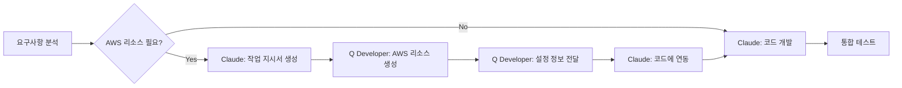
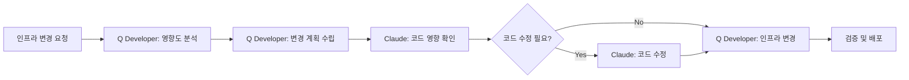

# 🤝 Claude Code & Amazon Q Developer 협업 규칙

## 📌 개요
Claude Code와 Amazon Q Developer가 효율적으로 협업하기 위한 역할 분담 및 작업 지시 규칙입니다.

## 🎯 기본 원칙

### 역할 분담
- **Claude Code**: 애플리케이션 코드 생성, 비즈니스 로직, 아키텍처 설계
- **Amazon Q Developer**: AWS 리소스 생성/관리, IAM 정책, 인프라 구성

### 협업 방식
1. Claude Code가 AWS 작업 필요 시 → Q Developer용 작업 지시서 생성
2. Q Developer가 인프라 구성 완료 → Claude Code가 애플리케이션 코드 연동
3. 상호 검증 및 피드백

## 🔧 역할별 책임 영역

### Claude Code 담당
```yaml
application_development:
  - 비즈니스 로직 구현
  - API 엔드포인트 개발
  - 프론트엔드 컴포넌트
  - 데이터베이스 스키마 설계
  - 테스트 코드 작성
  - 에러 처리 로직
  - 성능 최적화 코드

documentation:
  - 코드 문서화
  - API 명세서
  - 아키텍처 다이어그램
  - 개발 가이드

integration:
  - 서드파티 라이브러리 통합
  - 외부 API 연동
  - 마이크로서비스 간 통신
```

### Amazon Q Developer 담당
```yaml
aws_infrastructure:
  - S3 버킷 생성 및 정책
  - DynamoDB 테이블 생성
  - Lambda 함수 배포
  - API Gateway 설정
  - CloudFront 배포
  - VPC/서브넷 구성
  - RDS 인스턴스 생성

security:
  - IAM 역할 및 정책
  - Security Groups
  - KMS 키 관리
  - Secrets Manager 설정
  - WAF 규칙

monitoring:
  - CloudWatch 알람
  - X-Ray 추적
  - CloudTrail 감사
  - Cost Explorer 설정
```

## 📝 작업 지시서 템플릿

### 1. S3 버킷 생성 요청
```markdown
<!-- q-developer-task: s3-bucket -->
# Amazon Q Developer 작업 요청: S3 버킷 생성

## 요청 사항
S3 버킷을 생성해주세요.

## 상세 명세
- **버킷 이름**: t-developer-{환경}-{용도}
- **리전**: us-east-1
- **용도**: [정적 파일 호스팅/백업/로그 저장]
- **접근 권한**: [퍼블릭/프라이빗]
- **버저닝**: [활성화/비활성화]
- **암호화**: AES-256

## 추가 설정
- CORS 설정 필요: [예/아니오]
- 수명 주기 정책: [30일 후 Glacier 이전]
- 복제 설정: [다른 리전 복제 필요 시]

## 연동 정보
생성 후 다음 정보를 제공해주세요:
- 버킷 ARN
- 버킷 URL
- 접근 정책 예시

<!-- end-q-developer-task -->
```

### 2. IAM 역할 생성 요청
```markdown
<!-- q-developer-task: iam-role -->
# Amazon Q Developer 작업 요청: IAM 역할 생성

## 요청 사항
Lambda 함수용 IAM 역할을 생성해주세요.

## 역할 명세
- **역할 이름**: t-developer-lambda-{기능명}-role
- **신뢰 관계**: lambda.amazonaws.com
- **필요 권한**:
  - DynamoDB: 읽기/쓰기 (테이블: t-developer-*)
  - S3: 읽기 (버킷: t-developer-artifacts)
  - CloudWatch Logs: 쓰기
  - Secrets Manager: 읽기 (시크릿: t-developer/*)

## 정책 상세
```json
{
  "Version": "2012-10-17",
  "Statement": [
    {
      "Effect": "Allow",
      "Action": [
        "dynamodb:PutItem",
        "dynamodb:GetItem",
        "dynamodb:Query"
      ],
      "Resource": "arn:aws:dynamodb:*:*:table/t-developer-*"
    }
  ]
}
```

## 생성 후 필요 정보
- 역할 ARN
- 정책 ARN
- 역할 사용 예시 코드

<!-- end-q-developer-task -->
```

### 3. Lambda 함수 배포 요청
```markdown
<!-- q-developer-task: lambda-deployment -->
# Amazon Q Developer 작업 요청: Lambda 함수 배포

## 요청 사항
작성된 코드를 Lambda 함수로 배포해주세요.

## 함수 명세
- **함수 이름**: t-developer-{서비스}-{기능}
- **런타임**: Python 3.11 / Node.js 18.x
- **핸들러**: index.handler
- **메모리**: 512 MB
- **타임아웃**: 30초
- **환경 변수**:
  - ENVIRONMENT: production
  - DB_TABLE: t-developer-main

## 코드 위치
- 소스 코드: `./backend/lambda/{함수명}/`
- 의존성: `requirements.txt` 또는 `package.json`

## 트리거 설정
- API Gateway: [POST /api/v1/{경로}]
- EventBridge: [일일 실행]
- S3: [버킷 업로드 이벤트]

## 배포 후 확인
- 함수 ARN
- 엔드포인트 URL
- 실행 테스트 결과

<!-- end-q-developer-task -->
```

### 4. DynamoDB 테이블 생성 요청
```markdown
<!-- q-developer-task: dynamodb-table -->
# Amazon Q Developer 작업 요청: DynamoDB 테이블 생성

## 요청 사항
DynamoDB 테이블을 생성해주세요.

## 테이블 명세
- **테이블 이름**: t-developer-{도메인}
- **파티션 키**: id (String)
- **정렬 키**: timestamp (Number)
- **읽기 용량**: 5 (또는 On-Demand)
- **쓰기 용량**: 5 (또는 On-Demand)

## 보조 인덱스
- **GSI-1**:
  - 파티션 키: userId (String)
  - 정렬 키: timestamp (Number)
  - 프로젝션: ALL

## 추가 설정
- TTL 활성화: expiresAt 속성
- 스트림 활성화: NEW_AND_OLD_IMAGES
- 포인트 인 타임 복구: 활성화
- 암호화: AWS 관리 키

## 샘플 데이터 구조
```json
{
  "id": "uuid",
  "userId": "user123",
  "timestamp": 1234567890,
  "data": {
    "key": "value"
  },
  "expiresAt": 1234567890
}
```

<!-- end-q-developer-task -->
```

## 🔄 협업 워크플로우

### 신규 기능 개발 시


### 인프라 변경 시


## 📋 체크리스트

### Claude Code 작업 전 확인
- [ ] 필요한 AWS 리소스 목록 작성
- [ ] Q Developer 작업 지시서 생성
- [ ] 리소스 명명 규칙 확인
- [ ] 환경별 설정 값 정의

### Q Developer 작업 전 확인
- [ ] 작업 지시서 이해도 확인
- [ ] 기존 리소스와 충돌 검사
- [ ] 비용 추정
- [ ] 보안 정책 검토

### 작업 완료 후 검증
- [ ] 리소스 생성 확인
- [ ] 권한 설정 검증
- [ ] 연동 테스트
- [ ] 문서 업데이트

## 🚨 주의사항

### 절대 하지 말아야 할 것
- Claude Code가 직접 AWS CLI로 리소스 생성 ❌
- Q Developer가 비즈니스 로직 수정 ❌
- 작업 지시서 없이 인프라 변경 ❌
- 상호 검증 없이 프로덕션 배포 ❌

### 항상 해야 할 것
- 작업 지시서 통한 명확한 커뮤니케이션 ✅
- 환경별 리소스 분리 (dev/staging/prod) ✅
- 변경사항 문서화 ✅
- 롤백 계획 수립 ✅

## 🏷️ 파일 명명 규칙

### 작업 지시서 파일
```
q-tasks/
├── infrastructure/
│   ├── TASK-001-create-s3-bucket.md
│   ├── TASK-002-setup-vpc.md
│   └── TASK-003-configure-rds.md
├── security/
│   ├── TASK-004-iam-roles.md
│   └── TASK-005-security-groups.md
└── monitoring/
    ├── TASK-006-cloudwatch-alarms.md
    └── TASK-007-xray-tracing.md
```

### 완료된 작업 기록
```
completed-tasks/
├── 2025-08/
│   ├── DONE-001-s3-creation.md
│   └── DONE-002-lambda-deployment.md
```

## 📊 성과 측정

### 협업 효율성 지표
- 작업 지시서 → 완료 시간
- 재작업 빈도
- 통합 오류 발생률
- 리소스 생성 정확도

### 개선 포인트
- 자주 발생하는 패턴 템플릿화
- 자동화 가능 영역 식별
- 커뮤니케이션 병목 해결

---

**이 규칙은 Claude Code와 Amazon Q Developer의 효율적인 협업을 위해 지속적으로 개선됩니다.**

마지막 업데이트: 2025-08-06
버전: 1.0.0