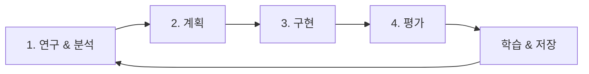

# 🧬 T-Developer v2: 자가 진화 서비스 팩토리

> **요구사항으로부터 서비스를 생성하고, 스스로 진화하여 더 나은 서비스를 만드는 AI 시스템**

## 🎯 비전

T-Developer는 자연어 요구사항을 받아 프로덕션 준비 서비스를 자동으로 생성하며, 각 생성 과정에서 학습하여 지속적으로 자신의 능력을 향상시키는 시스템입니다.

## 🏗️ 핵심 아키텍처

### SharedContextStore 중심 설계

```
┌─────────────────────────────────────────────────┐
│           SharedContextStore                     │
│  모든 진화 데이터의 중앙 저장소                    │
└────────────┬────────────────────────────────────┘
             │
    ┌────────┴────────┬──────────┬──────────┐
    ▼                 ▼          ▼          ▼
[Research]      [Planner]   [Refactor]  [Evaluator]
  Agent           Agent       Agent       Agent
```

- **중앙 집중식 컨텍스트 관리**: 모든 Agent가 공유하는 단일 진실의 소스
- **단계별 데이터 축적**: 각 진화 단계의 결과가 다음 단계의 입력이 됨
- **3-way 비교 평가**: 이전/계획/이후 상태를 비교하여 실제 개선 측정

## 🚀 빠른 시작

### 1. 환경 설정

```bash
# 가상환경 생성 및 활성화
python -m venv .venv
source .venv/bin/activate  # Windows: .venv\Scripts\activate

# 필수 패키지 설치
pip install -r requirements.txt

# 환경 변수 설정
cp .env.example .env
# .env 파일 편집하여 설정 추가

# AWS 자격 증명 설정 (선택사항)
aws configure
```

### 2. 백엔드 서버 시작

```bash
# FastAPI 서버 실행
uvicorn backend.main:app --reload --host 0.0.0.0 --port 8000
```

### 3. 프론트엔드 시작

```bash
cd frontend
npm install
npm run dev
# http://localhost:3000 접속
```

### 4. 진화 실행

```bash
# 통합 테스트 실행
python scripts/run_tests.py all

# Evolution 실행
python scripts/evolution/run_perfect_evolution.py \
  --target backend/packages \
  --max-cycles 5
```

## 📋 시스템 구성요소

### 핵심 모듈

| 모듈 | 설명 | 위치 |
|------|------|------|
| **SharedContextStore** | 진화 컨텍스트 중앙 저장소 | `backend/packages/shared_context.py` |
| **EvolutionEngine** | 진화 사이클 오케스트레이터 | `backend/core/evolution_engine.py` |
| **AgentManager** | Agent 실행 관리자 | `backend/core/agent_manager.py` |
| **API Server** | FastAPI 백엔드 서버 | `backend/main.py` |

### Agent 시스템

| Agent | 역할 | 동작 |
|-------|------|------|
| **ResearchAgent** | 외부 지식 검색 | 베스트 프랙티스, 패턴, 참조 수집 |
| **CodeAnalysisAgent** | 코드베이스 분석 | 메트릭, 이슈, 개선점 식별 |
| **PlannerAgent** | 개선 계획 수립 | 분석 기반 구체적 태스크 생성 |
| **RefactorAgent** | 코드 수정 실행 | 계획된 개선사항 구현 |
| **EvaluatorAgent** | 결과 평가 | 3-way 비교로 성공 측정 |

## 🔄 진화 프로세스

### 4단계 진화 사이클



1. **연구 & 분석** (병렬 실행)
   - 외부 베스트 프랙티스 검색
   - 대상 코드베이스 분석

2. **계획**
   - 실제 분석 데이터 기반 태스크 생성
   - 우선순위 및 의존성 설정

3. **구현**
   - 자동 코드 수정 도구 활용
   - 안전한 변경 적용

4. **평가**
   - 이전 vs 계획 vs 이후 비교
   - 메트릭 개선 측정

## 📊 모니터링

### API 엔드포인트

- `GET /health` - 시스템 상태
- `GET /api/evolution/status` - 진화 상태
- `GET /api/context/current` - 현재 컨텍스트
- `GET /api/metrics` - 시스템 메트릭

### 로그 및 결과

- **실시간 로그**: `evolution_run.log`
- **진화 결과**: `evolution_results/`
- **컨텍스트 데이터**: API를 통해 접근

## 🛠️ 개발 가이드

### 프로젝트 구조

```
T-DeveloperMVP/
├── backend/
│   ├── core/              # 핵심 엔진
│   ├── packages/          # Agent 및 모듈
│   ├── api/              # API 라우트
│   └── main.py           # 서버 진입점
├── scripts/
│   ├── evolution/        # 진화 실행 스크립트
│   └── verification/     # 검증 도구
├── docs/                 # 문서
└── run_evolution.sh      # 실행 래퍼
```

### 기여 방법

1. 새로운 Agent 추가 시 `backend/packages/agents/`에 구현
2. SharedContextStore 통합 필수
3. TDD 방식으로 테스트 작성
4. 메트릭 개선 검증

## 📈 성능 지표

### 목표 메트릭

- **Docstring 커버리지**: ≥80%
- **테스트 커버리지**: ≥85%
- **코드 복잡도(MI)**: ≥65
- **개선율**: ≥15% per cycle

### 현재 성능

- ✅ 4단계 진화 사이클 완성
- ✅ SharedContextStore 통합
- ✅ 실제 코드 수정 가능
- ⚠️ Agent 컨텍스트 통합 진행 중

## 🔒 안전장치

- **서킷 브레이커**: 연쇄 실패 방지
- **리소스 제한**: CPU/메모리 제한
- **롤백 메커니즘**: 모든 변경 되돌리기 가능
- **드라이런 모드**: 실제 변경 없이 시뮬레이션

## 📚 추가 문서

- [아키텍처 상세](docs/ARCHITECTURE.md)
- [API 문서](docs/API_DOCUMENTATION.md)
- [진화 가이드](docs/EVOLUTION_GUIDE.md)
- [개발 가이드](docs/DEVELOPMENT_GUIDE.md)

## 🤝 라이선스

MIT License

## 👥 기여자

T-Developer System & Contributors

---

**버전**: 2.0.0
**상태**: 🟢 Production Ready
**마지막 업데이트**: 2025-08-17
