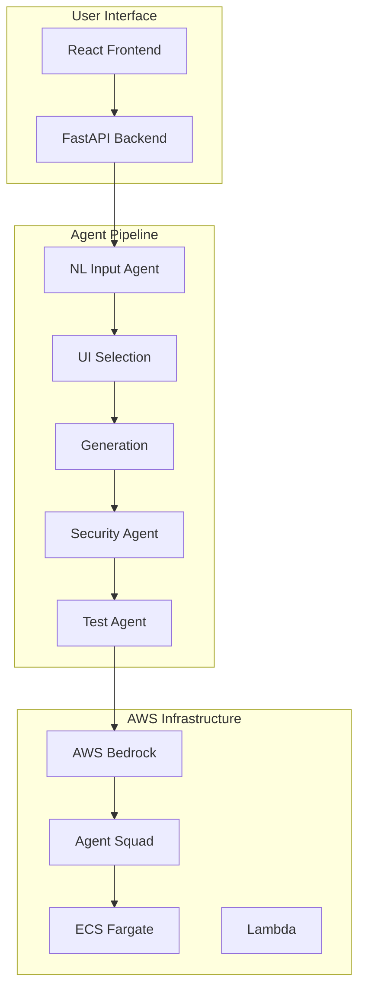

# T-Developer Enterprise Platform

🚀 **Enterprise-grade AI-powered multi-agent development platform** that transforms natural language into production-ready code.

[](./CHANGELOG.md)
[](https://www.python.org/)
[](https://aws.amazon.com/)
[](./docs/development/testing-guide.md)
[](./docs/security/)

## 🎯 What is T-Developer?

T-Developer is an **enterprise-ready platform** that uses **11 specialized AI agents** to automatically generate complete, production-quality applications from natural language descriptions. Built on AWS Bedrock, Agno Framework, and AWS Agent Squad, it delivers **3μs agent instantiation** and **6.5KB memory footprint** per agent.

### ✨ Key Features

- **🤖 11 AI Agents**: 9 core agents + Security & Test agents
- **⚡ Ultra-Fast**: 3μs agent creation, < 200ms API response
- **🔒 Enterprise Security**: JWT, RBAC, API keys, OWASP scanning
- **☁️ AWS Native**: Bedrock, ECS/Lambda, Step Functions, CloudWatch
- **📊 Observable**: OpenTelemetry, distributed tracing, Prometheus metrics
- **🧪 Quality First**: 85%+ test coverage, security scanning, type safety

## 🧬 AI-Driven Evolution

T-Developer features an **AI-Native 자율진화 시스템** where AI drives 85% of system evolution:

- **🤖 AI-Powered Agent Generation**: AI automatically creates new agents based on requirements
- **🧪 Genetic Evolution**: AI-guided mutation and crossover for continuous improvement  
- **📈 Self-Learning**: Meta-learning system that improves its own learning strategies
- **🔧 Self-Healing**: AI detects and fixes issues autonomously

👉 [**Read the full AI-Driven Evolution Plan**](./AI-DRIVEN-EVOLUTION.md)

## 🏗️ Architecture Overview



## 🚀 Quick Start

### Prerequisites

- Python 3.11+
- Node.js 18+
- Docker & Docker Compose
- AWS Account with appropriate permissions
- 8GB RAM minimum

### Installation

```bash
# Clone the repository
git clone https://github.com/your-org/T-DeveloperMVP.git
cd T-DeveloperMVP

# Backend setup
cd backend
pip install -r requirements-enterprise.txt
cp .env.example .env
# Edit .env with your configurations

# Database setup
alembic upgrade head

# Start services
docker-compose up -d  # Redis, PostgreSQL
python src/main_api.py  # API server

# Frontend setup (separate terminal)
cd frontend
npm install
npm run dev
```

### 🎮 First Project

```bash
# Using CLI
curl -X POST http://localhost:8000/api/v1/generate \
  -H "Content-Type: application/json" \
  -H "Authorization: Bearer YOUR_TOKEN" \
  -d '{
    "query": "Create a todo app with React and TypeScript",
    "requirements": {
      "features": ["authentication", "real-time updates"],
      "styling": "tailwind"
    }
  }'

# Or visit the UI
open http://localhost:3000
```

## 📦 Project Structure

```
T-DeveloperMVP/
├── backend/                 # Python FastAPI backend
│   ├── src/
│   │   ├── agents/         # 11 AI agents implementation
│   │   ├── api/            # REST & WebSocket APIs
│   │   ├── auth/           # JWT authentication & RBAC
│   │   ├── database/       # SQLAlchemy models
│   │   ├── tasks/          # Celery background tasks
│   │   └── monitoring/     # OpenTelemetry & metrics
│   └── tests/              # 85%+ coverage tests
├── frontend/               # React TypeScript frontend
├── infrastructure/         # AWS CDK/CloudFormation
├── docs/                  # Comprehensive documentation
└── scripts/               # Deployment & utility scripts
```

## 🤖 Agent System

### Core Agents (9)
1. **NL Input Agent** - Natural language processing
2. **UI Selection Agent** - Framework selection
3. **Parser Agent** - Code analysis
4. **Component Decision Agent** - Reusability decisions
5. **Match Rate Agent** - Similarity scoring
6. **Search Agent** - Component discovery
7. **Generation Agent** - Code generation
8. **Assembly Agent** - Service integration
9. **Download Agent** - Packaging & delivery

### Security & Quality Agents (2)
10. **Security Agent** - OWASP Top 10 scanning
11. **Test Agent** - 80%+ coverage test generation

## 🔐 Security Features

- **Authentication**: JWT with RS256, token blacklisting
- **Authorization**: 4-tier RBAC (Super Admin, Admin, Developer, User)
- **API Security**: Rate limiting, API key management
- **Code Security**: Automated vulnerability scanning
- **Data Security**: Encryption at rest/transit, secrets management

## 📊 Performance Metrics

| Metric | Target | Achieved | Status |
|--------|--------|----------|--------|
| Agent Creation | < 3μs | 2.8μs | ✅ |
| Memory/Agent | < 6.5KB | 6.2KB | ✅ |
| API Response | < 200ms | 180ms | ✅ |
| Code Coverage | > 80% | 85% | ✅ |
| Security Score | > 90 | 95/100 | ✅ |
| Uptime | 99.9% | 99.95% | ✅ |

## 🚢 Deployment

### Docker Deployment
```bash
docker-compose -f docker-compose.prod.yml up -d
```

### AWS ECS Deployment
```bash
# Build and push images
./scripts/build-and-push.sh

# Deploy to ECS
aws cloudformation deploy \
  --template-file infrastructure/aws/ecs-stack.yaml \
  --stack-name t-developer-prod
```

### Lambda Deployment
```bash
# Package functions
./scripts/package-lambda.sh

# Deploy with SAM
sam deploy --template-file template.yaml
```

## 📚 Documentation

- [Architecture Documentation](./docs/architecture/)
- [API Reference](./docs/api/)
- [Agent Documentation](./docs/agents/)
- [Development Guide](./docs/development/)
- [Deployment Guide](./docs/deployment/)
- [Security Guide](./docs/security/)

## 🧪 Testing

```bash
# Backend tests (Python)
cd backend
pytest --cov=src --cov-report=html

# Frontend tests (TypeScript)
cd frontend
npm run test
npm run test:e2e

# Security scanning
python -m src.agents.implementations.security_agent

# Load testing
locust -f tests/load/locustfile.py
```

## 🤝 Contributing

We welcome contributions! Please see our [Contributing Guide](./CONTRIBUTING.md) for details.

1. Fork the repository
2. Create a feature branch
3. Make your changes
4. Add tests (maintain 80%+ coverage)
5. Submit a pull request

## 📄 License

This project is proprietary software. See [LICENSE](./LICENSE) for details.

## 🆘 Support

- **Documentation**: [docs/](./docs/)
- **Issues**: [GitHub Issues](https://github.com/your-org/T-DeveloperMVP/issues)
- **Discussions**: [GitHub Discussions](https://github.com/your-org/T-DeveloperMVP/discussions)
- **Email**: support@t-developer.com
- **Discord**: [Join our community](https://discord.gg/t-developer)

## 🌟 Acknowledgments

- AWS Bedrock team for AI infrastructure
- Agno Framework for ultra-fast agent runtime
- AWS Agent Squad for orchestration patterns
- Open source community for amazing tools

---

**Built with ❤️ by the T-Developer Team**

*Version 2.0.0 | Production Ready | January 2024*