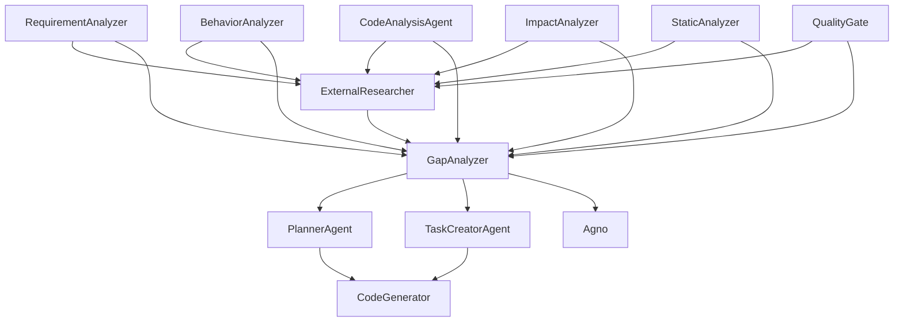

# T-Developer v2 🧬

**완전 자동화된 자기 진화 AI 개발 시스템**

## 🎯 핵심 특징

### ✨ 통합된 기능
- **Evolution Loop**: 갭이 0이 될 때까지 자동 반복
- **Agno 통합**: 자동 에이전트 생성
- **CodeGenerator**: AI 기반 코드 자동 구현
- **한글 문서화**: 모든 에이전트 주석 한글화
- **완전 AI 드리븐**: Mock/Fake 없이 100% 실제 AI 사용

### 🔄 Evolution Loop 프로세스
1. **요구사항 분석** (RequirementAnalyzer)
2. **현재 상태 분석** (5개 분석 에이전트)
   - BehaviorAnalyzer
   - CodeAnalysisAgent
   - ImpactAnalyzer
   - StaticAnalyzer
   - QualityGate
3. **외부 리서치** (ExternalResearcher)
4. **갭 분석** (GapAnalyzer)
5. **갭 해소**
   - Agno로 새 에이전트 자동 생성
   - CodeGenerator로 코드 자동 구현
6. **테스트 실행**
7. **재분석 및 루프 반복**

## 🚀 실행 방법

### Evolution Loop 실행
```bash
cd /home/ec2-user/T-Developer
python scripts/run_evolution.py
```

### 일반 분석 실행
```bash
cd /home/ec2-user/T-Developer
python scripts/run_orchestrator.py
```

### 테스트 실행
```bash
cd /home/ec2-user/T-Developer
pytest backend/tests/ -v
```

## 📁 프로젝트 구조

```
T-Developer/
├── backend/
│   ├── api/                # API 서버
│   ├── packages/
│   │   ├── agents/         # 모든 에이전트 (한글 주석)
│   │   ├── agno/           # Agno 자동 에이전트 생성
│   │   ├── orchestrator/   # UpgradeOrchestrator with Evolution Loop
│   │   ├── memory/         # Memory Hub
│   │   └── safety/         # Circuit Breaker, Resource Limiter
│   └── tests/              # 테스트 파일
│       ├── unit/           # 단위 테스트
│       ├── integration/    # 통합 테스트
│       └── safety/         # 안전 메커니즘 테스트
├── frontend/               # Streamlit UI
├── scripts/                # 실행 스크립트
│   ├── run_evolution.py   # Evolution Loop 실행
│   ├── run_orchestrator.py # Orchestrator 실행
│   └── extract_reports.py # 보고서 추출
├── docs/                   # 문서
├── examples/               # 예제 코드
└── README.md              # 이 파일
```

## 🤖 에이전트 목록

### 문서 생성 에이전트
- **RequirementAnalyzer**: 요구사항 분석 에이전트
- **BehaviorAnalyzer**: 행동 분석 에이전트
- **CodeAnalysisAgent**: 코드 분석 에이전트
- **ExternalResearcher**: 외부 리서치 에이전트
- **GapAnalyzer**: 갭 분석 에이전트
- **ImpactAnalyzer**: 영향도 분석 에이전트
- **PlannerAgent**: 계획 수립 에이전트
- **StaticAnalyzer**: 정적 분석 에이전트
- **TaskCreatorAgent**: 세부 태스크 생성 에이전트
- **QualityGate**: 품질 게이트 에이전트

### 실행 에이전트
- **CodeGenerator**: 코드 생성기
- **Agno (AgnoManager)**: 자동 에이전트 생성기

## 📊 문서 참조 관계



## ⚙️ 설정

### Evolution Loop 설정
```python
config = UpgradeConfig(
    enable_evolution_loop=True,      # Evolution Loop 활성화
    max_evolution_iterations=10,     # 최대 반복 횟수
    auto_generate_agents=True,       # Agno 자동 에이전트 생성
    auto_implement_code=True,        # 자동 코드 구현
    evolution_convergence_threshold=0.95  # 수렴 임계값
)
```

## 🔐 안전 메커니즘

- **Circuit Breaker**: 연쇄 실패 방지
- **Resource Limiter**: CPU/메모리 제한
- **Timeout Guard**: 무한 루프 방지
- **Safe Mode**: 위험한 작업 차단

## 📝 주요 원칙

1. **NO MOCKS**: Mock/Fake 절대 금지, 100% 실제 AI 사용
2. **자동 진화**: 갭이 0이 될 때까지 자동 반복
3. **중복 방지**: 기존 파일 수정 우선, 새 파일 생성 최소화
4. **한글 문서화**: 모든 에이전트 상세 설명 한글화

## 🛠️ 필요 사항

- Python 3.8+
- AWS Credentials (Bedrock access)
- 필수 패키지:
  ```bash
  pip install boto3 pydantic networkx aiohttp beautifulsoup4 feedparser
  ```

## 📈 Evolution Loop 결과

Evolution Loop 실행 후 생성되는 보고서:
- `/tmp/t-developer/evolution/evolution_report_*.json`
- 반복 횟수, 생성된 에이전트, 남은 갭 등 상세 정보 포함

## 🔄 개발 이력

- **v1.0.0**: 초기 버전
- **v1.5.0**: 기본 에이전트 구현
- **v2.0.0**: Evolution Loop 및 자동 진화 시스템 구현 (현재)

## 📞 문의

문제 발생 시 다음 정보와 함께 보고:
- Evolution Loop 로그
- `/tmp/t-developer/evolution/` 디렉토리의 보고서
- 에러 메시지

---

**작성일**: 2025-08-23
**버전**: 2.0.0
**상태**: 🟢 Production Ready