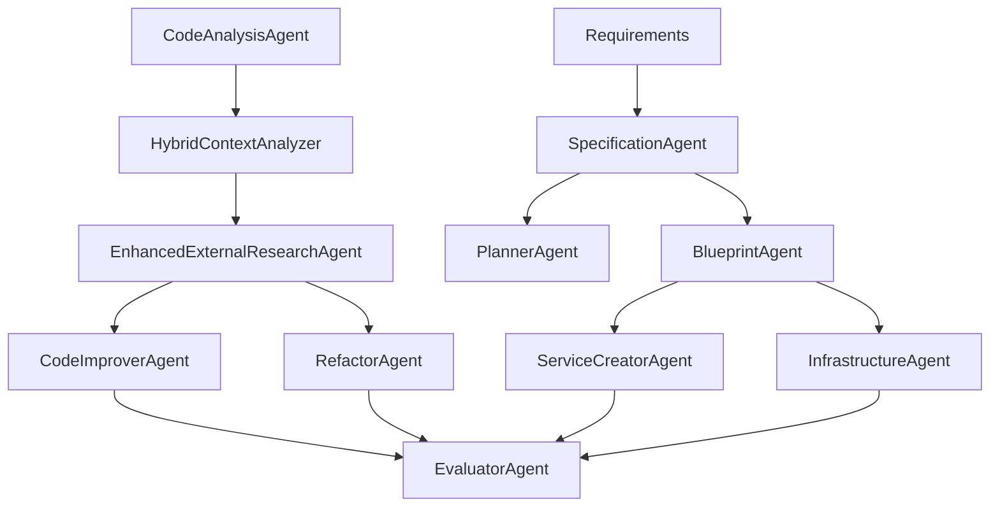

# T-Developer Agents

## 📁 Directory Structure (v2.1.0)

The agents package is now organized by function for better maintainability:

```
agents/
├── base.py                    # Base classes for all agents
├── __init__.py               # Package initialization
│
├── analysis_research/        # 모든 분석 & 리서치 에이전트
│   ├── code_analysis.py     # Static code analysis (유틸리티 포함)
│   ├── hybrid_context.py    # Hybrid context analyzer (static + AI)
│   ├── external_research.py # AI-powered external research with CoT
│   ├── templates.py         # AI analysis templates (공통)
│   └── references.py        # Reference library management
│
├── specification/           # Requirements processing
│   └── spec_agent.py       # Convert requirements to specifications
│
├── generation/             # Code and infrastructure generation
│   ├── blueprint.py        # Generate service blueprints
│   ├── service_creator.py  # Create complete services
│   ├── infrastructure.py   # Generate infrastructure code
│   └── planner.py         # Generate execution plans
│
├── modification/           # Code modification and improvement
│   ├── refactor.py        # Refactoring agent
│   ├── code_improver.py   # Code improvement agent
│   └── simple_code_modifier.py # Simple code modifications
│
├── orchestration/          # High-level coordination
│   └── evaluator.py       # Evaluate results and quality
│
├── external/              # External service integrations
│   ├── bedrock.py        # AWS Bedrock integration
│   ├── ai_integration.py # General AI service integration
│   └── external_code_services.py # External code services
│
└── deprecated/            # Deprecated agents (to be removed)
    ├── research.py.deprecated
    └── context_analyzer.py.deprecated
```

## 🎯 Agent Categories

### 1. Analysis & Research Agents (analysis_research/)

- **CodeAnalysisAgent**: Pure static code analysis using AST parsing (내장 유틸리티 포함)
- **HybridContextAnalyzer**: Combines static analysis with selective AI usage
- **EnhancedExternalResearchAgent**: AI-powered external research with Chain of Thought
- **Templates**: Predefined templates for structured AI analysis (공통 사용)
- **ReferenceLibrary**: Manages reference solutions and patterns

### 2. Specification Agents

- **SpecificationAgent**: Converts natural language requirements into technical specifications
- Generates OpenAPI specs, data models, and acceptance criteria

### 3. Generation Agents

- **BlueprintAgent**: Generates service blueprints from specifications
- **ServiceCreatorAgent**: Creates complete service implementations
- **InfrastructureAgent**: Generates infrastructure as code (Terraform, Docker, K8s)
- **PlannerAgent**: Creates execution plans (NOT an orchestrator - generates plans/blueprints)

### 4. Modification Agents

- **RefactorAgent**: Performs code refactoring based on patterns
- **CodeImproverAgent**: Improves code quality and adds features
- **SimpleCodeModifier**: Makes simple, targeted code modifications

### 5. Orchestration Agents

- **EvaluatorAgent**: Evaluates code quality, test results, and improvements

### 6. External Integrations

- **BedrockCodeService**: AWS Bedrock for code generation
- **AIIntegrationService**: Generic AI service integration
- **ExternalCodeServices**: Integration with external code services

## 🔄 Agent Workflow



## 🚀 Usage Examples

### Basic Import

```python
from backend.packages.agents import (
    CodeAnalysisAgent,
    SpecificationAgent,
    ServiceCreatorAgent,
    EvaluatorAgent
)
```

### Category-specific Import

```python
# Import analysis agents
from backend.packages.agents.analysis import CodeAnalysisAgent, HybridContextAnalyzer

# Import research agents
from backend.packages.agents.research import EnhancedExternalResearchAgent

# Import generation agents
from backend.packages.agents.generation import BlueprintAgent, PlannerAgent
```

### Creating an Agent

```python
from backend.packages.agents.base import AgentInput
from backend.packages.agents.specification import SpecificationAgent

# Create agent
spec_agent = SpecificationAgent()

# Prepare input
input = AgentInput(
    task_id="spec-001",
    intent="process_requirements",
    payload={
        "requirements_text": "Create a user management system...",
        "service_name": "UserService"
    }
)

# Execute
result = await spec_agent.execute(input)
```

## 🔧 Base Classes

All agents inherit from `BaseAgent` and use standard interfaces:

- **AgentInput**: Standard input format
- **AgentOutput**: Standard output format
- **AgentStatus**: Execution status (OK, FAIL, RETRY)
- **Artifact**: Output artifacts with metadata

## 📊 Agent Capabilities

| Agent | AI Usage | Speed | Primary Function |
|-------|----------|-------|------------------|
| CodeAnalysisAgent | ❌ None | ⚡ Fast | Static code analysis |
| HybridContextAnalyzer | ⚠️ Selective | ⚡ Fast | Context analysis with AI fallback |
| EnhancedExternalResearchAgent | ✅ Full | 🐌 Slow | Deep research with CoT |
| SpecificationAgent | ❌ None | ⚡ Fast | Requirement parsing |
| BlueprintAgent | ❌ None | ⚡ Fast | Template-based generation |
| ServiceCreatorAgent | ⚠️ Optional | ⚡ Fast | Service generation |
| PlannerAgent | ❌ None | ⚡ Fast | Plan generation |
| RefactorAgent | ❌ None | ⚡ Fast | Pattern-based refactoring |
| CodeImproverAgent | ⚠️ Optional | ⚡ Fast | Code improvement |
| EvaluatorAgent | ❌ None | ⚡ Fast | Quality evaluation |

## 🔒 Safety Features

All agents include:

- Timeout protection
- Resource limits
- Circuit breakers
- Rollback capabilities
- Audit logging

## 🧪 Testing

Each agent category has its own test suite:

```bash
# Test analysis agents
pytest backend/tests/agents/test_analysis.py

# Test research agents
pytest backend/tests/agents/test_research.py

# Test all agents
pytest backend/tests/agents/
```

## 📝 Adding New Agents

1. Determine the appropriate category
2. Create agent in the category directory
3. Inherit from `BaseAgent`
4. Implement required methods: `execute()`, `validate()`
5. Add to category's `__init__.py`
6. Update main `__init__.py` if needed
7. Add tests in appropriate test file

## 🗑️ Deprecation Policy

Deprecated agents are moved to `deprecated/` folder and:

- Renamed with `.deprecated` extension
- Removed from imports
- Scheduled for deletion after 30 days
- Migration guide provided in deprecation notice
