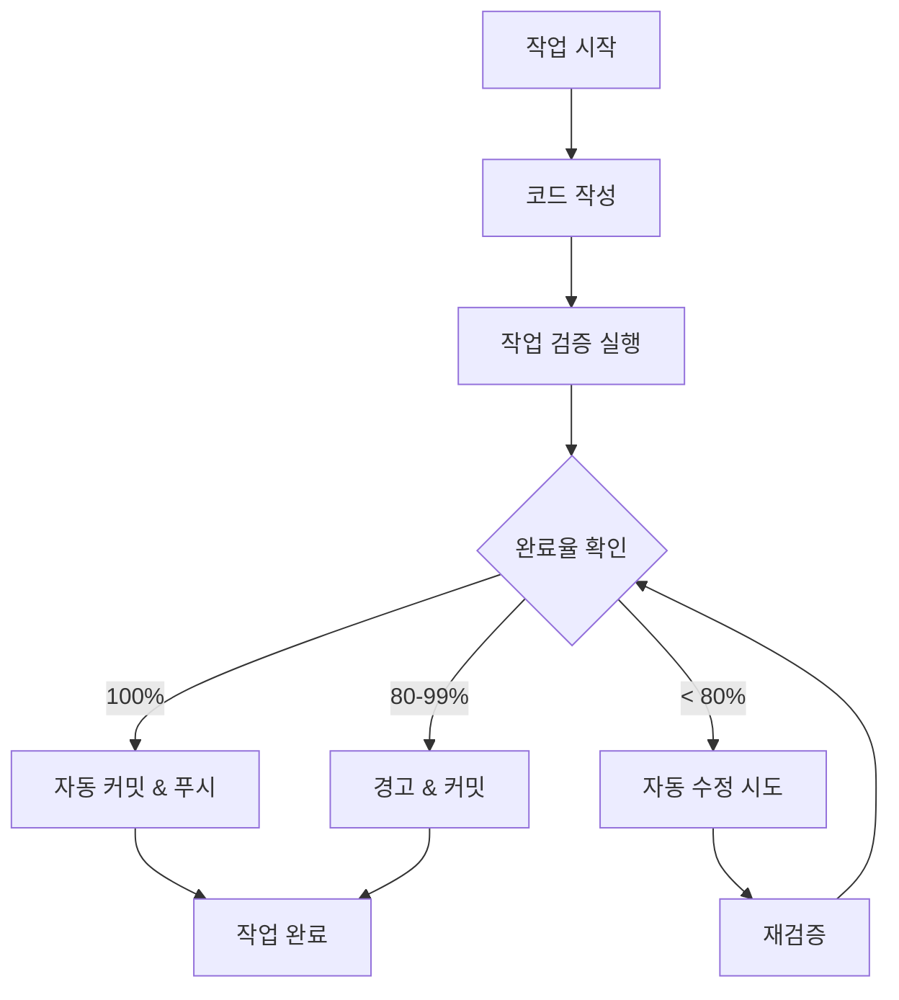

# 📋 T-Developer 작업 단위 자동 검증 시스템

## 개요

각 **작업 단위**가 완료될 때마다 자동으로 검증하고 완료 처리하는 시스템입니다.

### 핵심 기능

1. **작업 단위별 즉시 검증**
   - 파일 존재 확인
   - 코드 품질 검증 (6.5KB, 3μs 제약)
   - 테스트 존재 확인
   - 문서화 확인

2. **자동 수정**
   - 누락된 파일 자동 생성
   - 템플릿 기반 초기 코드 생성
   - 문서 자동 생성

3. **자동 커밋 & 푸시**
   - 80% 이상 완료 시 자동 커밋
   - 의미있는 커밋 메시지 생성
   - 원격 저장소 자동 푸시

## 사용 방법

### 1. 명령줄에서 작업 검증

```bash
# 특정 작업 검증 및 완료
python backend/scripts/task_validator.py "Agent Registry" --files backend/src/evolution/registry.py

# 최근 변경사항 기반 자동 검증
python backend/scripts/task_validator.py --recent

# 현재 상태 확인
python backend/scripts/task_validator.py --status
```

### 2. VSCode에서 사용

VSCode에서 `Ctrl+Shift+P` → `Tasks: Run Task` 선택:

- **🔍 Validate Current Task**: 현재 작업 검증
- **✅ Complete Task**: 작업 완료 처리
- **📊 Validate Recent Changes**: 최근 변경사항 검증
- **📈 Show Status**: 현재 상태 표시

### 3. Git Hook 자동 실행

커밋 시 자동으로 검증이 실행됩니다:

```bash
git commit -m "task(agent-registry): Agent Registry 구현"
# → 자동으로 agent-registry 작업 검증 실행
```

### 4. Python 코드에서 사용

```python
from backend.scripts.task_validator import validate_current_task

# 작업 검증 및 완료
success = validate_current_task(
    task_name="Agent Registry",
    files=[
        "backend/src/evolution/registry.py",
        "backend/tests/evolution/test_registry.py"
    ]
)

if success:
    print("✅ 작업 완료!")
else:
    print("⚠️ 추가 작업 필요")
```

## 검증 항목

### 1. 파일 검증
- 계획된 파일 존재 여부
- 파일 크기 (0 bytes 체크)
- 파일 위치 정확성

### 2. 코드 품질
- **메모리 제약**: 에이전트 < 6.5KB
- **속도 제약**: 인스턴스화 < 3μs
- **언어 제약**: Python 전용 (JS/TS 없음)

### 3. 테스트
- 관련 테스트 파일 존재
- 테스트 네이밍 규칙 준수

### 4. 문서화
- README 또는 문서 파일 존재
- 작업 관련 문서 업데이트

## 완료율 기준

| 완료율 | 상태 | 동작 |
|--------|------|------|
| 100% | ✅ Completed | 자동 커밋 & 푸시 |
| 80-99% | ⚠️ Partial | 자동 커밋 & 경고 |
| < 80% | ❌ Failed | 수정 필요, 커밋 안함 |

## 작업 상태 파일

`.task_state.json` 파일에 모든 작업 상태가 저장됩니다:

```json
{
  "last_validated": "2024-11-15T10:30:00",
  "completed_tasks": [
    {
      "name": "Agent Registry",
      "timestamp": "2024-11-15T10:30:00",
      "day": 3
    }
  ],
  "pending_tasks": [],
  "current_day": 3,
  "current_phase": 1
}
```

## 자동 수정 기능

검증 실패 시 자동으로:

1. **누락된 파일 생성**
   - Python 파일: 기본 클래스 템플릿
   - Terraform 파일: 기본 설정 템플릿
   - YAML 파일: 기본 구조 템플릿

2. **문서 생성**
   - 작업별 문서 자동 생성
   - 완료율 및 상태 기록

3. **CLAUDE.md 업데이트**
   - 현재 상태 섹션 자동 업데이트
   - 작업 완료 기록 추가

## 워크플로우 예시



## 팁

1. **작업 시작 전**: 작업 이름을 명확히 정의
2. **작업 중**: 파일 경로를 기록
3. **작업 완료 시**: `--files` 옵션으로 생성된 파일 명시
4. **커밋 메시지**: `task(작업명):` 형식 사용

## 문제 해결

### 검증 실패 시
1. 로그 확인: `/tmp/task_validation.log`
2. 누락된 파일 확인
3. 수동으로 `--auto-fix` 옵션 실행

### Git 푸시 실패 시
1. 네트워크 연결 확인
2. Git 인증 확인
3. 수동으로 푸시 실행

---

이 시스템으로 모든 작업이 일관된 품질로 완료됩니다! 🚀
