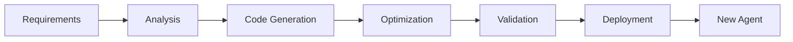

# 🤖 Phase 2: Meta Agents Implementation Guide (Day 21-40)

## 📋 Overview

Meta Agents are autonomous agents that create and improve other agents. This phase implements ServiceBuilder and ServiceImprover agents.

## 🎯 Goals

- Implement ServiceBuilder agent for automatic agent creation
- Implement ServiceImprover agent for continuous optimization
- Achieve 50% automation in agent management
- Enable self-improvement capabilities

## 🏗️ ServiceBuilder Agent

### Purpose
Automatically creates new agents based on requirements.

### Implementation
```python
class ServiceBuilderAgent:
    """Creates new agents autonomously"""
    
    def __init__(self):
        self.memory_limit_kb = 6.5
        self.instantiation_target_us = 3.0
        self.agno_framework = AgnoFramework()
        self.bedrock_client = BedrockClient()
    
    async def create_agent(self, requirements: dict) -> Agent:
        """Create new agent from requirements"""
        # 1. Analyze requirements
        analysis = await self.analyze_requirements(requirements)
        
        # 2. Generate agent code
        code = await self.generate_agent_code(analysis)
        
        # 3. Optimize for constraints
        optimized_code = await self.optimize_code(code)
        
        # 4. Validate constraints
        if not self.validate_constraints(optimized_code):
            raise ConstraintViolationError()
        
        # 5. Deploy to AgentCore
        agent = await self.deploy_agent(optimized_code)
        
        return agent
    
    async def generate_agent_code(self, analysis: dict) -> str:
        """Generate agent code using AI"""
        prompt = f"""
        Create a Python agent with:
        - Purpose: {analysis['purpose']}
        - Inputs: {analysis['inputs']}
        - Outputs: {analysis['outputs']}
        - Memory limit: 6.5KB
        - Instantiation: < 3μs
        """
        
        response = await self.bedrock_client.generate(prompt)
        return response.code
    
    def validate_constraints(self, code: str) -> bool:
        """Validate memory and speed constraints"""
        agent = compile_agent(code)
        
        # Check memory
        if sys.getsizeof(agent) > 6656:  # 6.5KB
            return False
        
        # Check speed
        start = time.perf_counter()
        test_agent = agent()
        duration = (time.perf_counter() - start) * 1_000_000
        
        return duration < 3.0
```

### Workflow


## 🔧 ServiceImprover Agent

### Purpose
Continuously optimizes existing agents for better performance.

### Implementation
```python
class ServiceImproverAgent:
    """Improves existing agents continuously"""
    
    def __init__(self):
        self.improvement_target = 0.05  # 5% per iteration
        self.performance_analyzer = PerformanceAnalyzer()
        self.code_optimizer = CodeOptimizer()
    
    async def improve_agent(self, agent: Agent) -> Agent:
        """Improve agent performance by 5%"""
        # 1. Analyze current performance
        metrics = await self.analyze_performance(agent)
        
        # 2. Identify bottlenecks
        bottlenecks = self.identify_bottlenecks(metrics)
        
        # 3. Generate optimization strategies
        strategies = await self.generate_strategies(bottlenecks)
        
        # 4. Apply optimizations
        improved_code = await self.apply_optimizations(
            agent.code, 
            strategies
        )
        
        # 5. Validate improvement
        new_metrics = await self.test_agent(improved_code)
        
        if new_metrics.performance > metrics.performance * 1.05:
            return self.deploy_improved_agent(improved_code)
        
        return agent  # No improvement, keep original
    
    async def identify_bottlenecks(self, metrics: dict) -> list:
        """Identify performance bottlenecks"""
        bottlenecks = []
        
        # Memory bottlenecks
        if metrics['memory_usage'] > 6.0:  # Close to limit
            bottlenecks.append({
                'type': 'memory',
                'severity': 'high',
                'location': metrics['memory_hotspots']
            })
        
        # Speed bottlenecks
        if metrics['instantiation_time'] > 2.5:  # Close to limit
            bottlenecks.append({
                'type': 'speed',
                'severity': 'high',
                'location': metrics['slow_functions']
            })
        
        # Business logic bottlenecks
        if metrics['success_rate'] < 0.95:
            bottlenecks.append({
                'type': 'logic',
                'severity': 'medium',
                'location': metrics['failure_points']
            })
        
        return bottlenecks
```

### Optimization Strategies
```python
OPTIMIZATION_STRATEGIES = {
    'memory': [
        'remove_unused_variables',
        'optimize_data_structures',
        'lazy_loading',
        'object_pooling'
    ],
    'speed': [
        'algorithm_optimization',
        'cache_implementation',
        'parallel_processing',
        'jit_compilation'
    ],
    'logic': [
        'refactor_complex_conditions',
        'simplify_algorithms',
        'improve_error_handling',
        'enhance_validation'
    ]
}
```

## 🔄 Integration with Evolution System

### Evolution Loop
```python
class MetaAgentEvolution:
    def __init__(self):
        self.service_builder = ServiceBuilderAgent()
        self.service_improver = ServiceImproverAgent()
        self.agent_registry = AgentRegistry()
    
    async def evolution_cycle(self):
        """Complete evolution cycle"""
        while True:
            # 1. Identify needed agents
            needs = await self.identify_needs()
            
            # 2. Create new agents
            for need in needs:
                agent = await self.service_builder.create_agent(need)
                await self.agent_registry.register(agent)
            
            # 3. Improve existing agents
            agents = await self.agent_registry.get_all_agents()
            for agent in agents:
                improved = await self.service_improver.improve_agent(agent)
                if improved != agent:
                    await self.agent_registry.update(improved)
            
            # 4. Remove underperforming agents
            await self.prune_weak_agents()
            
            # 5. Sleep before next cycle
            await asyncio.sleep(3600)  # 1 hour
```

## 📊 Implementation Checklist

### Week 1 (Day 21-27): ServiceBuilder
- [ ] Basic agent template generation
- [ ] Code generation with Bedrock
- [ ] Constraint validation system
- [ ] Agno Framework integration
- [ ] Deployment pipeline
- [ ] Testing framework
- [ ] Documentation

### Week 2 (Day 28-34): ServiceImprover
- [ ] Performance analysis system
- [ ] Bottleneck detection
- [ ] Optimization strategies
- [ ] Code refactoring engine
- [ ] Improvement validation
- [ ] Regression prevention
- [ ] Testing suite

### Week 3 (Day 35-40): Integration
- [ ] Evolution loop implementation
- [ ] Agent registry integration
- [ ] Monitoring dashboard
- [ ] Safety validations
- [ ] Performance benchmarks
- [ ] End-to-end testing
- [ ] Production deployment

## 🧪 Testing Requirements

### Unit Tests
```python
def test_service_builder_memory_constraint():
    builder = ServiceBuilderAgent()
    agent = builder.create_agent(simple_requirements)
    assert sys.getsizeof(agent) <= 6656

def test_service_improver_improvement():
    improver = ServiceImproverAgent()
    original = create_test_agent()
    improved = improver.improve_agent(original)
    assert improved.performance > original.performance * 1.05
```

### Integration Tests
```python
async def test_meta_agent_cycle():
    evolution = MetaAgentEvolution()
    
    # Run one complete cycle
    await evolution.evolution_cycle()
    
    # Verify new agents created
    agents = await evolution.agent_registry.get_all_agents()
    assert len(agents) > 0
    
    # Verify improvements
    for agent in agents:
        assert agent.fitness_score > 0.9
```

## 📈 Success Metrics

| Metric | Target | Measurement |
|--------|--------|-------------|
| Agent Creation Rate | 10/day | New agents registered |
| Improvement Rate | 5%/iteration | Performance increase |
| Success Rate | > 95% | Successful deployments |
| Constraint Compliance | 100% | Memory & speed limits |
| Automation Level | 50% | Autonomous operations |

## 🚨 Common Issues & Solutions

### Issue: Agent exceeds memory limit
```python
# Solution: Aggressive optimization
def optimize_for_memory(code):
    # Remove all non-essential features
    code = remove_logging(code)
    code = remove_comments(code)
    code = minify_variables(code)
    code = use_slots(code)  # __slots__ for classes
    return code
```

### Issue: Slow instantiation
```python
# Solution: Lazy initialization
class FastAgent:
    def __init__(self):
        self._heavy_resource = None  # Don't initialize yet
    
    @property
    def heavy_resource(self):
        if self._heavy_resource is None:
            self._heavy_resource = load_resource()
        return self._heavy_resource
```

## 🔗 Resources

- [Agno Framework Documentation](https://agno-framework.com)
- [AWS Bedrock Agent Creation](https://docs.aws.amazon.com/bedrock/)
- [Code Optimization Techniques](https://wiki.python.org/moin/PythonSpeed)
- [Genetic Programming](https://en.wikipedia.org/wiki/Genetic_programming)

---

**Phase Status**: Ready to Implement  
**Estimated Duration**: 20 days  
**Dependencies**: Phase 1 Complete
