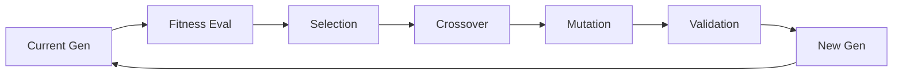

# 🧬 Phase 3: Evolution System Implementation Guide (Day 41-60)

## 📋 Overview

Phase 3 implements the core genetic evolution engine that enables 85% AI autonomy through self-evolution.

## 🎯 Goals

- Implement genetic algorithm engine
- Enable 85% AI autonomy
- Achieve 5% improvement per generation
- Establish safety framework
- Deploy parallel evolution

## 🧬 Genetic Algorithm Implementation

### Core Evolution Engine
```python
class EvolutionEngine:
    """Core genetic evolution system"""
    
    def __init__(self):
        self.population_size = 100
        self.mutation_rate = 0.15
        self.crossover_rate = 0.7
        self.elite_size = 10
        self.generation = 0
        
    async def evolve_generation(self, population: List[Agent]) -> List[Agent]:
        """Evolve one generation"""
        # 1. Fitness evaluation
        fitness_scores = await self.evaluate_fitness(population)
        
        # 2. Selection
        parents = self.select_parents(population, fitness_scores)
        
        # 3. Crossover
        offspring = self.crossover(parents)
        
        # 4. Mutation
        mutated = self.mutate(offspring)
        
        # 5. Elite preservation
        elite = self.get_elite(population, fitness_scores)
        
        # 6. New generation
        new_population = elite + mutated[:self.population_size - len(elite)]
        
        self.generation += 1
        return new_population
```

### Fitness Evaluation
```python
class FitnessEvaluator:
    """Multi-dimensional fitness evaluation"""
    
    def calculate_fitness(self, agent: Agent) -> float:
        """Calculate agent fitness score"""
        weights = {
            'performance': 0.3,
            'efficiency': 0.2,
            'quality': 0.2,
            'innovation': 0.15,
            'stability': 0.15
        }
        
        scores = {
            'performance': self.eval_performance(agent),
            'efficiency': self.eval_efficiency(agent),
            'quality': self.eval_quality(agent),
            'innovation': self.eval_innovation(agent),
            'stability': self.eval_stability(agent)
        }
        
        # Weighted average
        fitness = sum(weights[k] * scores[k] for k in weights)
        
        # Apply constraints penalty
        if agent.memory_kb > 6.5:
            fitness *= 0.5  # Heavy penalty
        if agent.speed_us > 3.0:
            fitness *= 0.7  # Moderate penalty
            
        return fitness
```

## 🔄 Evolution Workflow

### Generation Cycle


### Implementation Steps
```python
async def evolution_cycle():
    """Complete evolution cycle"""
    while True:
        # Load current population
        population = await load_population()
        
        # Evolution step
        new_population = await evolution_engine.evolve_generation(population)
        
        # Safety validation
        if not await safety_framework.validate(new_population):
            await rollback_generation()
            continue
        
        # Deploy new generation
        await deploy_generation(new_population)
        
        # Monitor metrics
        metrics = await monitor_generation(new_population)
        
        # Log progress
        logger.info(f"Generation {evolution_engine.generation}: "
                   f"Avg Fitness: {metrics.avg_fitness:.3f}")
        
        # Sleep before next cycle
        await asyncio.sleep(3600)  # 1 hour
```

## 🛡️ Safety Framework

### Evolution Safety
```python
class EvolutionSafety:
    """Prevent malicious evolution"""
    
    def __init__(self):
        self.safety_rules = [
            self.check_memory_constraint,
            self.check_speed_constraint,
            self.check_malicious_patterns,
            self.check_resource_usage,
            self.check_api_abuse
        ]
    
    async def validate(self, population: List[Agent]) -> bool:
        """Validate population safety"""
        for agent in population:
            for rule in self.safety_rules:
                if not await rule(agent):
                    logger.warning(f"Safety violation: {agent.id}")
                    return False
        return True
    
    def check_malicious_patterns(self, agent: Agent) -> bool:
        """Detect malicious code patterns"""
        dangerous_patterns = [
            r'exec\s*\(',
            r'eval\s*\(',
            r'__import__',
            r'subprocess',
            r'os\.system'
        ]
        
        for pattern in dangerous_patterns:
            if re.search(pattern, agent.code):
                return False
        return True
```

## 📊 Implementation Schedule

### Week 1 (Day 41-47): Core Engine
- [ ] Genetic algorithm implementation
- [ ] Fitness evaluation system
- [ ] Selection strategies
- [ ] Crossover operations
- [ ] Mutation operations
- [ ] Population management
- [ ] Testing framework

### Week 2 (Day 48-54): Safety & Optimization
- [ ] Safety framework
- [ ] Constraint validation
- [ ] Rollback system
- [ ] Performance optimization
- [ ] Parallel evolution
- [ ] Monitoring system
- [ ] Alert system

### Week 3 (Day 55-60): Integration
- [ ] Meta-agent integration
- [ ] Production deployment
- [ ] Dashboard creation
- [ ] Documentation
- [ ] Performance tuning
- [ ] End-to-end testing
- [ ] Launch preparation

## 🧪 Testing Strategy

### Unit Tests
```python
def test_evolution_improvement():
    """Test generation improvement"""
    engine = EvolutionEngine()
    initial_pop = create_test_population()
    initial_fitness = calculate_avg_fitness(initial_pop)
    
    # Evolve 10 generations
    population = initial_pop
    for _ in range(10):
        population = engine.evolve_generation(population)
    
    final_fitness = calculate_avg_fitness(population)
    assert final_fitness > initial_fitness * 1.5  # 50% improvement
```

### Safety Tests
```python
def test_malicious_evolution_prevention():
    """Test malicious pattern detection"""
    safety = EvolutionSafety()
    
    # Create malicious agent
    bad_agent = Agent(code="exec('malicious code')")
    
    # Should be detected
    assert not safety.check_malicious_patterns(bad_agent)
```

## 📈 Success Metrics

| Metric | Target | Measurement |
|--------|--------|-------------|
| AI Autonomy | 85% | Autonomous decisions/Total |
| Fitness Improvement | 5%/gen | Generation comparison |
| Safety Violations | 0 | Safety check failures |
| Generation Time | < 30min | Evolution cycle duration |
| Rollback Rate | < 1% | Rollbacks/Generations |

## 🚨 Common Challenges

### Challenge: Fitness Plateau
```python
# Solution: Increase diversity
def increase_diversity(population):
    # Increase mutation rate temporarily
    engine.mutation_rate = min(0.3, engine.mutation_rate * 1.5)
    
    # Add random individuals
    new_individuals = create_random_agents(10)
    population.extend(new_individuals)
    
    return population
```

### Challenge: Constraint Violations
```python
# Solution: Repair mechanism
def repair_agent(agent):
    # Memory optimization
    if agent.memory_kb > 6.5:
        agent = optimize_memory(agent)
    
    # Speed optimization
    if agent.speed_us > 3.0:
        agent = optimize_speed(agent)
    
    return agent
```

## 🔗 Key Algorithms

### Tournament Selection
```python
def tournament_selection(population, fitness_scores, tournament_size=3):
    """Select parents via tournament"""
    selected = []
    
    for _ in range(len(population)):
        # Random tournament
        tournament = random.sample(
            list(zip(population, fitness_scores)), 
            tournament_size
        )
        
        # Winner takes all
        winner = max(tournament, key=lambda x: x[1])
        selected.append(winner[0])
    
    return selected
```

### Uniform Crossover
```python
def uniform_crossover(parent1, parent2):
    """Create offspring via uniform crossover"""
    offspring = Agent()
    
    for gene in parent1.genes:
        if random.random() < 0.5:
            offspring.genes[gene] = parent1.genes[gene]
        else:
            offspring.genes[gene] = parent2.genes[gene]
    
    return offspring
```

---

**Phase Status**: Ready to Implement  
**Estimated Duration**: 20 days  
**Dependencies**: Phase 1 & 2 Complete  
**Risk Level**: High (Core system)
