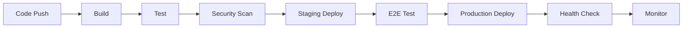

# 🚀 Phase 4: Production Deployment Guide (Day 61-80)

## 📋 Overview

Final phase for production deployment of the AI Autonomous Evolution System with full monitoring and operations.

## 🎯 Goals

- Deploy to production environment
- Establish 24/7 monitoring
- Achieve 99.95% uptime
- Complete documentation
- Launch evolution system

## 🏗️ Production Infrastructure

### AWS Architecture
```yaml
Production Stack:
  Region: us-east-1 (primary), us-west-2 (DR)
  
  Compute:
    ECS Fargate:
      - Cluster: t-developer-prod
      - Services: 3 (Analysis, Processing, Generation)
      - Tasks: 10-100 (auto-scaling)
      - Memory: 2-8GB per task
      - CPU: 1-4 vCPU per task
  
  Storage:
    S3:
      - Artifacts: t-developer-prod-artifacts
      - Checkpoints: t-developer-prod-checkpoints
      - Logs: t-developer-prod-logs
    
    DynamoDB:
      - Agents: t-developer-agents-prod
      - Evolution: t-developer-evolution-prod
      - Metrics: t-developer-metrics-prod
  
  Network:
    VPC: 10.0.0.0/16
    Subnets: 6 (3 AZs × 2 tiers)
    NAT Gateways: 3 (HA)
    Load Balancer: Application LB
```

### Deployment Pipeline


## 🚦 Deployment Process

### Pre-deployment Checklist
```python
class DeploymentValidator:
    """Validate deployment readiness"""
    
    def validate_deployment(self) -> bool:
        checks = [
            self.check_tests_passing(),
            self.check_security_scan(),
            self.check_performance_benchmarks(),
            self.check_documentation(),
            self.check_rollback_plan(),
            self.check_monitoring_ready(),
            self.check_alerts_configured()
        ]
        
        return all(checks)
    
    def check_tests_passing(self) -> bool:
        """All tests must pass"""
        result = run_tests()
        return result.passed_rate >= 0.99  # 99% pass rate
    
    def check_security_scan(self) -> bool:
        """No critical vulnerabilities"""
        scan = security_scan()
        return scan.critical_issues == 0
```

### Blue-Green Deployment
```bash
#!/bin/bash
# Blue-green deployment script

# 1. Deploy to green environment
aws ecs update-service \
  --cluster t-developer-prod \
  --service evolution-service-green \
  --task-definition t-developer-evolution:latest

# 2. Wait for healthy
aws ecs wait services-stable \
  --cluster t-developer-prod \
  --services evolution-service-green

# 3. Run smoke tests
python -m tests.smoke_tests --env=green

# 4. Switch traffic
aws elbv2 modify-rule \
  --rule-arn $RULE_ARN \
  --actions Type=forward,TargetGroupArn=$GREEN_TG_ARN

# 5. Monitor metrics
python -m monitoring.check_metrics --duration=300

# 6. Decommission blue
aws ecs update-service \
  --cluster t-developer-prod \
  --service evolution-service-blue \
  --desired-count 0
```

## 📊 Monitoring Setup

### CloudWatch Dashboard
```python
def create_production_dashboard():
    """Create comprehensive monitoring dashboard"""
    
    dashboard = {
        "name": "t-developer-production",
        "widgets": [
            # System Health
            {
                "type": "metric",
                "properties": {
                    "metrics": [
                        ["AWS/ECS", "CPUUtilization"],
                        [".", "MemoryUtilization"],
                        ["Custom", "EvolutionFitness"],
                        [".", "AgentCount"]
                    ],
                    "period": 300,
                    "stat": "Average",
                    "region": "us-east-1"
                }
            },
            # Evolution Metrics
            {
                "type": "metric",
                "properties": {
                    "metrics": [
                        ["Evolution", "GenerationCount"],
                        [".", "FitnessScore"],
                        [".", "ImprovementRate"],
                        [".", "RollbackCount"]
                    ]
                }
            },
            # Business Metrics
            {
                "type": "metric",
                "properties": {
                    "metrics": [
                        ["Business", "RequestCount"],
                        [".", "SuccessRate"],
                        [".", "ResponseTime"],
                        [".", "ErrorRate"]
                    ]
                }
            }
        ]
    }
    
    return dashboard
```

### Alert Configuration
```yaml
alerts:
  - name: HighErrorRate
    metric: ErrorRate
    threshold: 1
    operator: GreaterThanThreshold
    actions:
      - PagerDuty
      - Slack
      - Email
  
  - name: LowFitness
    metric: FitnessScore
    threshold: 0.85
    operator: LessThanThreshold
    actions:
      - EvolutionTeam
      - AutoRollback
  
  - name: HighMemory
    metric: MemoryUtilization
    threshold: 80
    operator: GreaterThanThreshold
    actions:
      - AutoScale
      - OpsTeam
```

## 🔄 Operations Runbook

### Daily Operations
```markdown
## Morning Checklist (9 AM)
- [ ] Check overnight evolution metrics
- [ ] Review any alerts/incidents
- [ ] Verify system health
- [ ] Check cost metrics
- [ ] Review scheduled deployments

## Afternoon Review (3 PM)
- [ ] Evolution generation analysis
- [ ] Performance metrics review
- [ ] Security scan results
- [ ] Capacity planning check

## End of Day (6 PM)
- [ ] Final system health check
- [ ] Set overnight monitoring
- [ ] Update status dashboard
- [ ] Handoff to on-call
```

### Incident Response
```python
class IncidentResponse:
    """Incident response procedures"""
    
    def handle_incident(self, incident_type: str):
        procedures = {
            'high_error_rate': self.handle_errors,
            'evolution_failure': self.handle_evolution_failure,
            'security_breach': self.handle_security,
            'performance_degradation': self.handle_performance
        }
        
        return procedures[incident_type]()
    
    def handle_evolution_failure(self):
        """Evolution failure response"""
        steps = [
            "1. Halt evolution immediately",
            "2. Identify failing generation",
            "3. Rollback to last stable",
            "4. Analyze failure cause",
            "5. Fix and test locally",
            "6. Deploy fix with caution",
            "7. Resume evolution slowly",
            "8. Monitor closely for 24h"
        ]
        return steps
```

## 📈 Performance Optimization

### Production Tuning
```python
class ProductionOptimizer:
    """Optimize for production workload"""
    
    def optimize_settings(self):
        return {
            # Evolution settings
            'population_size': 200,  # Larger for diversity
            'generation_interval': 3600,  # 1 hour
            'parallel_evaluations': 50,
            
            # Performance settings
            'cache_enabled': True,
            'cache_ttl': 300,
            'connection_pool_size': 100,
            'request_timeout': 30,
            
            # Resource limits
            'max_memory_per_agent': 6.5,
            'max_cpu_per_agent': 0.25,
            'max_concurrent_agents': 10000
        }
```

## 🔐 Security Hardening

### Production Security
```python
SECURITY_CONFIG = {
    # Network
    'vpc_flow_logs': True,
    'waf_enabled': True,
    'ddos_protection': 'Shield Advanced',
    
    # Access
    'mfa_required': True,
    'ip_whitelist': ['10.0.0.0/8'],
    'api_rate_limit': 1000,  # per minute
    
    # Encryption
    'encryption_at_rest': 'AES-256',
    'encryption_in_transit': 'TLS 1.3',
    'kms_key_rotation': True,
    
    # Compliance
    'audit_logging': True,
    'pii_scanning': True,
    'compliance_mode': 'SOC2'
}
```

## 📊 Launch Metrics

### Success Criteria
| Metric | Target | Critical |
|--------|--------|----------|
| Uptime | 99.95% | 99.9% |
| Response Time | < 1s | < 2s |
| Error Rate | < 0.1% | < 1% |
| Evolution Rate | 24/day | 20/day |
| Fitness Score | > 0.95 | > 0.90 |
| Cost/Request | < $0.001 | < $0.002 |

## 🚀 Launch Plan

### Week 1 (Day 61-67): Infrastructure
- [ ] Production environment setup
- [ ] Security hardening
- [ ] Network configuration
- [ ] Database setup
- [ ] Monitoring setup
- [ ] Backup configuration
- [ ] DR preparation

### Week 2 (Day 68-74): Deployment
- [ ] Initial deployment
- [ ] Load testing
- [ ] Performance tuning
- [ ] Security testing
- [ ] Failover testing
- [ ] Documentation review
- [ ] Team training

### Week 3 (Day 75-80): Launch
- [ ] Soft launch (10% traffic)
- [ ] Monitor and adjust
- [ ] Gradual traffic increase
- [ ] Full launch (100% traffic)
- [ ] 24/7 monitoring active
- [ ] Celebration! 🎉

## 📝 Post-Launch

### Continuous Improvement
```python
def post_launch_optimization():
    """Continuous optimization post-launch"""
    
    while True:
        # Collect metrics
        metrics = collect_production_metrics()
        
        # Analyze performance
        bottlenecks = identify_bottlenecks(metrics)
        
        # Generate improvements
        improvements = generate_improvements(bottlenecks)
        
        # Test in staging
        test_results = test_improvements(improvements)
        
        # Deploy successful improvements
        for improvement in test_results.successful:
            deploy_improvement(improvement)
        
        # Sleep for next cycle
        time.sleep(86400)  # Daily
```

---

**Phase Status**: Ready for Production  
**Estimated Duration**: 20 days  
**Dependencies**: All previous phases complete  
**Risk Level**: Critical (Production system)