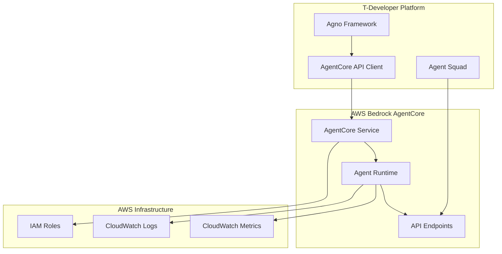

# 🔗 AWS Bedrock AgentCore Integration API

## 개요

T-Developer와 AWS Bedrock AgentCore 간의 통합을 위한 상세 API 명세서입니다. Agno 프레임워크로 생성된 에이전트의 AgentCore 자동 배포, 관리, 모니터링을 위한 완전한 API 인터페이스를 제공합니다.

## 🏗️ 아키텍처 개요



## 📋 API 엔드포인트 명세

### 1. Agent Deployment APIs

#### 1.1 Deploy Agent
에이전트를 AgentCore에 배포합니다.

**Endpoint:** `POST /api/v1/agents/deploy`

**Request Schema:**
```json
{
  "agent_metadata": {
    "agent_id": "string (required)",
    "name": "string (required)",
    "version": "string (required, semver)",
    "description": "string (optional)",
    "tags": ["string"] // optional
  },
  "agent_code": {
    "source_code": "string (required, base64 encoded)",
    "dependencies": {
      "python": ["string"], // Python packages
      "system": ["string"]  // System dependencies
    },
    "entrypoint": "string (required)", // Main function name
    "configuration": {
      "memory_limit": "integer (MB, default: 128)",
      "timeout": "integer (seconds, default: 30)",
      "concurrent_executions": "integer (default: 10)"
    }
  },
  "deployment_config": {
    "environment": "string (enum: dev|staging|prod)",
    "auto_scaling": {
      "enabled": "boolean (default: true)",
      "min_instances": "integer (default: 1)",
      "max_instances": "integer (default: 100)",
      "target_utilization": "number (0-1, default: 0.7)"
    },
    "security": {
      "vpc_config": {
        "subnet_ids": ["string"],
        "security_group_ids": ["string"]
      },
      "iam_role_arn": "string (optional)",
      "environment_variables": {
        "key": "value" // Encrypted automatically
      }
    }
  },
  "monitoring": {
    "health_check": {
      "enabled": "boolean (default: true)",
      "path": "string (default: /health)",
      "interval": "integer (seconds, default: 30)"
    },
    "metrics": {
      "custom_metrics": ["string"], // Custom metric names
      "log_level": "string (enum: DEBUG|INFO|WARN|ERROR)"
    }
  }
}
```

**Response Schema:**
```json
{
  "deployment_id": "string",
  "agent_id": "string",
  "status": "string (enum: deploying|deployed|failed)",
  "api_endpoint": "string", // Generated API endpoint URL
  "deployment_info": {
    "region": "string",
    "runtime_environment": "string",
    "created_at": "string (ISO 8601)",
    "estimated_completion": "string (ISO 8601)"
  },
  "monitoring": {
    "cloudwatch_log_group": "string",
    "metrics_namespace": "string",
    "dashboard_url": "string"
  },
  "security": {
    "api_key": "string", // For accessing the deployed agent
    "webhook_secret": "string" // For webhook validation
  }
}
```

**Error Responses:**
```json
{
  "error": {
    "code": "string",
    "message": "string",
    "details": {
      "validation_errors": ["string"],
      "deployment_logs": ["string"]
    }
  }
}
```

#### 1.2 Update Agent
기존 배포된 에이전트를 업데이트합니다.

**Endpoint:** `PUT /api/v1/agents/{agent_id}/versions/{version}`

**Request Schema:**
```json
{
  "deployment_strategy": "string (enum: blue_green|rolling|canary)",
  "canary_config": {
    "traffic_percentage": "number (0-100, for canary)",
    "duration": "integer (minutes)",
    "success_criteria": {
      "error_rate_threshold": "number (0-1)",
      "latency_threshold": "integer (ms)"
    }
  },
  "rollback_config": {
    "auto_rollback": "boolean (default: true)",
    "rollback_triggers": {
      "error_rate": "number (0-1)",
      "timeout_rate": "number (0-1)",
      "health_check_failures": "integer"
    }
  },
  "agent_code": {
    // Same as deploy request
  }
}
```

#### 1.3 Get Deployment Status
배포 상태를 조회합니다.

**Endpoint:** `GET /api/v1/agents/{agent_id}/deployments/{deployment_id}`

**Response Schema:**
```json
{
  "deployment_id": "string",
  "agent_id": "string",
  "status": "string",
  "progress": "number (0-100)",
  "current_phase": "string",
  "phases": [
    {
      "name": "string",
      "status": "string (pending|running|completed|failed)",
      "started_at": "string (ISO 8601)",
      "completed_at": "string (ISO 8601, nullable)",
      "logs": ["string"]
    }
  ],
  "health": {
    "overall_status": "string (healthy|degraded|unhealthy)",
    "checks": [
      {
        "name": "string",
        "status": "string",
        "last_check": "string (ISO 8601)",
        "message": "string"
      }
    ]
  },
  "performance": {
    "response_time_p95": "number (ms)",
    "error_rate": "number (0-1)",
    "throughput": "number (requests/sec)",
    "cpu_utilization": "number (0-1)",
    "memory_utilization": "number (0-1)"
  }
}
```

### 2. Agent Management APIs

#### 2.1 List Agents
배포된 에이전트 목록을 조회합니다.

**Endpoint:** `GET /api/v1/agents`

**Query Parameters:**
```yaml
environment: string (optional) # dev|staging|prod
status: string (optional) # active|inactive|failed
tag: string (optional, multiple) # Filter by tags
page: integer (default: 1)
limit: integer (default: 50, max: 200)
sort: string (default: created_at) # created_at|name|last_updated
order: string (default: desc) # asc|desc
```

**Response Schema:**
```json
{
  "agents": [
    {
      "agent_id": "string",
      "name": "string",
      "version": "string",
      "status": "string",
      "api_endpoint": "string",
      "created_at": "string (ISO 8601)",
      "last_updated": "string (ISO 8601)",
      "health_status": "string",
      "performance_metrics": {
        "avg_response_time": "number (ms)",
        "success_rate": "number (0-1)",
        "total_requests": "integer"
      }
    }
  ],
  "pagination": {
    "page": "integer",
    "limit": "integer",
    "total": "integer",
    "total_pages": "integer"
  }
}
```

#### 2.2 Agent Details
특정 에이전트의 상세 정보를 조회합니다.

**Endpoint:** `GET /api/v1/agents/{agent_id}`

**Response Schema:**
```json
{
  "agent_id": "string",
  "metadata": {
    "name": "string",
    "description": "string",
    "version": "string",
    "tags": ["string"],
    "created_by": "string",
    "created_at": "string (ISO 8601)",
    "last_updated": "string (ISO 8601)"
  },
  "deployment": {
    "environment": "string",
    "region": "string",
    "api_endpoint": "string",
    "status": "string",
    "configuration": {
      "memory_limit": "integer",
      "timeout": "integer",
      "concurrent_executions": "integer"
    }
  },
  "performance": {
    "uptime": "number (percentage)",
    "total_requests": "integer",
    "avg_response_time": "number (ms)",
    "error_rate": "number (0-1)",
    "throughput": "number (requests/sec)"
  },
  "scaling": {
    "current_instances": "integer",
    "min_instances": "integer",
    "max_instances": "integer",
    "scaling_events": [
      {
        "timestamp": "string (ISO 8601)",
        "action": "string (scale_up|scale_down)",
        "reason": "string",
        "from_instances": "integer",
        "to_instances": "integer"
      }
    ]
  },
  "security": {
    "iam_role": "string",
    "vpc_id": "string",
    "security_groups": ["string"],
    "encryption_status": "string"
  }
}
```

### 3. Agent Execution APIs

#### 3.1 Execute Agent
배포된 에이전트를 실행합니다.

**Endpoint:** `POST /api/v1/agents/{agent_id}/execute`

**Request Schema:**
```json
{
  "execution_id": "string (optional, auto-generated if not provided)",
  "input_data": {
    "parameters": {},
    "context": {
      "user_id": "string",
      "session_id": "string",
      "request_id": "string",
      "metadata": {}
    }
  },
  "execution_options": {
    "timeout": "integer (seconds, optional)",
    "priority": "string (enum: low|normal|high, default: normal)",
    "async": "boolean (default: false)",
    "callback_url": "string (for async execution)",
    "retry_config": {
      "max_retries": "integer (default: 3)",
      "retry_delay": "integer (seconds, default: 1)",
      "backoff_multiplier": "number (default: 2.0)"
    }
  },
  "monitoring": {
    "trace_enabled": "boolean (default: true)",
    "custom_metrics": {}
  }
}
```

**Response Schema (Sync):**
```json
{
  "execution_id": "string",
  "status": "string (completed|failed)",
  "result": {
    "output": {},
    "metadata": {
      "execution_time": "number (ms)",
      "memory_used": "number (MB)",
      "cpu_time": "number (ms)",
      "tokens_used": "integer (if applicable)"
    }
  },
  "performance": {
    "started_at": "string (ISO 8601)",
    "completed_at": "string (ISO 8601)",
    "duration": "number (ms)",
    "queue_time": "number (ms)"
  },
  "logs": [
    {
      "timestamp": "string (ISO 8601)",
      "level": "string",
      "message": "string",
      "context": {}
    }
  ]
}
```

**Response Schema (Async):**
```json
{
  "execution_id": "string",
  "status": "string (queued|running)",
  "estimated_completion": "string (ISO 8601)",
  "status_url": "string",
  "callback_url": "string"
}
```

#### 3.2 Get Execution Status
실행 상태를 조회합니다.

**Endpoint:** `GET /api/v1/agents/{agent_id}/executions/{execution_id}`

**Response Schema:**
```json
{
  "execution_id": "string",
  "agent_id": "string",
  "status": "string (queued|running|completed|failed|timeout)",
  "progress": "number (0-100, optional)",
  "started_at": "string (ISO 8601)",
  "completed_at": "string (ISO 8601, nullable)",
  "result": {
    "output": {}, // null if not completed
    "error": { // null if successful
      "code": "string",
      "message": "string",
      "details": {}
    }
  },
  "performance": {
    "duration": "number (ms)",
    "memory_peak": "number (MB)",
    "cpu_time": "number (ms)",
    "queue_time": "number (ms)"
  },
  "logs": [
    {
      "timestamp": "string (ISO 8601)",
      "level": "string",
      "message": "string"
    }
  ]
}
```

### 4. Monitoring & Analytics APIs

#### 4.1 Agent Metrics
에이전트의 성능 메트릭을 조회합니다.

**Endpoint:** `GET /api/v1/agents/{agent_id}/metrics`

**Query Parameters:**
```yaml
start_time: string (ISO 8601, required)
end_time: string (ISO 8601, required)
granularity: string (1m|5m|1h|1d, default: 5m)
metrics: string (comma-separated list, optional)
```

**Response Schema:**
```json
{
  "agent_id": "string",
  "time_range": {
    "start": "string (ISO 8601)",
    "end": "string (ISO 8601)",
    "granularity": "string"
  },
  "metrics": {
    "execution_count": [
      {
        "timestamp": "string (ISO 8601)",
        "value": "integer"
      }
    ],
    "response_time": [
      {
        "timestamp": "string (ISO 8601)",
        "avg": "number (ms)",
        "p50": "number (ms)",
        "p95": "number (ms)",
        "p99": "number (ms)"
      }
    ],
    "error_rate": [
      {
        "timestamp": "string (ISO 8601)",
        "value": "number (0-1)"
      }
    ],
    "throughput": [
      {
        "timestamp": "string (ISO 8601)",
        "value": "number (requests/sec)"
      }
    ],
    "resource_usage": [
      {
        "timestamp": "string (ISO 8601)",
        "cpu": "number (0-1)",
        "memory": "number (0-1)",
        "disk": "number (0-1)"
      }
    ]
  },
  "summary": {
    "total_executions": "integer",
    "success_rate": "number (0-1)",
    "avg_response_time": "number (ms)",
    "peak_throughput": "number (requests/sec)",
    "uptime": "number (percentage)"
  }
}
```

#### 4.2 System Health
전체 시스템 건강도를 조회합니다.

**Endpoint:** `GET /api/v1/system/health`

**Response Schema:**
```json
{
  "overall_status": "string (healthy|degraded|unhealthy)",
  "timestamp": "string (ISO 8601)",
  "components": {
    "agentcore_service": {
      "status": "string",
      "response_time": "number (ms)",
      "last_check": "string (ISO 8601)"
    },
    "database": {
      "status": "string",
      "connection_count": "integer",
      "query_performance": "number (ms)"
    },
    "monitoring": {
      "status": "string",
      "metrics_lag": "number (seconds)",
      "log_ingestion_rate": "number (events/sec)"
    }
  },
  "capacity": {
    "total_agents": "integer",
    "active_agents": "integer",
    "total_executions_per_minute": "integer",
    "resource_utilization": {
      "cpu": "number (0-1)",
      "memory": "number (0-1)",
      "network": "number (0-1)"
    }
  }
}
```

## 🔧 SDK 및 클라이언트 라이브러리

### Python SDK Example
```python
# backend/src/integrations/agentcore_client.py

import asyncio
import aiohttp
import json
from typing import Dict, List, Any, Optional
from dataclasses import dataclass

@dataclass
class AgentCoreConfig:
    base_url: str
    api_key: str
    region: str
    timeout: int = 30

class AgentCoreClient:
    def __init__(self, config: AgentCoreConfig):
        self.config = config
        self.session = None
        
    async def __aenter__(self):
        self.session = aiohttp.ClientSession(
            timeout=aiohttp.ClientTimeout(total=self.config.timeout),
            headers={
                "Authorization": f"Bearer {self.config.api_key}",
                "Content-Type": "application/json",
                "User-Agent": "T-Developer-AgentCore-Client/1.0"
            }
        )
        return self
    
    async def __aexit__(self, exc_type, exc_val, exc_tb):
        if self.session:
            await self.session.close()
    
    async def deploy_agent(self, deployment_request: Dict[str, Any]) -> Dict[str, Any]:
        """에이전트 배포"""
        url = f"{self.config.base_url}/api/v1/agents/deploy"
        
        async with self.session.post(url, json=deployment_request) as response:
            if response.status == 200:
                return await response.json()
            else:
                error_data = await response.json()
                raise AgentCoreError(f"Deployment failed: {error_data}")
    
    async def get_deployment_status(self, agent_id: str, deployment_id: str) -> Dict[str, Any]:
        """배포 상태 조회"""
        url = f"{self.config.base_url}/api/v1/agents/{agent_id}/deployments/{deployment_id}"
        
        async with self.session.get(url) as response:
            if response.status == 200:
                return await response.json()
            else:
                raise AgentCoreError(f"Failed to get deployment status: {response.status}")
    
    async def execute_agent(self, agent_id: str, execution_request: Dict[str, Any]) -> Dict[str, Any]:
        """에이전트 실행"""
        url = f"{self.config.base_url}/api/v1/agents/{agent_id}/execute"
        
        async with self.session.post(url, json=execution_request) as response:
            if response.status == 200:
                return await response.json()
            else:
                error_data = await response.json()
                raise AgentCoreError(f"Execution failed: {error_data}")
    
    async def wait_for_deployment(self, agent_id: str, deployment_id: str, 
                                max_wait_time: int = 600) -> Dict[str, Any]:
        """배포 완료 대기"""
        start_time = asyncio.get_event_loop().time()
        
        while True:
            status = await self.get_deployment_status(agent_id, deployment_id)
            
            if status["status"] == "deployed":
                return status
            elif status["status"] == "failed":
                raise AgentCoreError(f"Deployment failed: {status}")
            
            elapsed = asyncio.get_event_loop().time() - start_time
            if elapsed > max_wait_time:
                raise AgentCoreError("Deployment timeout")
            
            await asyncio.sleep(5)  # 5초마다 확인

class AgentCoreError(Exception):
    pass
```

## 🔐 보안 및 인증

### 1. API 키 관리
```yaml
API Key Structure:
  Format: "akc_" + base64(region + account_id + random_suffix)
  Example: "akc_dXMtd2VzdC0yXzEyMzQ1Njc4OTBfYWJjZGVm"
  
Key Rotation:
  Frequency: 90 days
  Grace Period: 30 days (old key remains valid)
  Auto-rotation: Configurable
  
Permissions:
  - agent:deploy
  - agent:update  
  - agent:delete
  - agent:execute
  - agent:monitor
  - system:health
```

### 2. IAM 역할 및 정책
```json
{
  "Version": "2012-10-17",
  "Statement": [
    {
      "Effect": "Allow",
      "Action": [
        "bedrock:InvokeModel",
        "bedrock:InvokeModelWithResponseStream"
      ],
      "Resource": "*"
    },
    {
      "Effect": "Allow", 
      "Action": [
        "logs:CreateLogGroup",
        "logs:CreateLogStream",
        "logs:PutLogEvents"
      ],
      "Resource": "arn:aws:logs:*:*:log-group:/aws/agentcore/*"
    },
    {
      "Effect": "Allow",
      "Action": [
        "cloudwatch:PutMetricData"
      ],
      "Resource": "*",
      "Condition": {
        "StringEquals": {
          "cloudwatch:namespace": "AWS/AgentCore"
        }
      }
    }
  ]
}
```

## 📈 SLA 및 성능 보장

### 1. 서비스 수준 목표
```yaml
Availability: 99.95% (월 최대 21.6분 다운타임)
Response Time: 
  - Agent Deployment: < 5분 (95th percentile)
  - Agent Execution: < 1초 (95th percentile)
  - API Calls: < 200ms (95th percentile)

Throughput:
  - Concurrent Executions: 10,000+
  - API Requests: 1,000 req/sec
  - Agent Deployments: 100/hour

Error Rates:
  - API Error Rate: < 0.1%
  - Agent Execution Failure: < 0.5%
  - Deployment Failure: < 1%
```

### 2. 모니터링 및 알림
```yaml
Health Checks:
  - Agent Endpoint: 30초마다
  - System Components: 1분마다
  - Database Connectivity: 30초마다

Alerts:
  - High Error Rate: > 1% for 5 minutes
  - High Latency: > 2 seconds for 3 minutes  
  - Low Availability: < 99% for any agent
  - Resource Exhaustion: > 80% utilization

Escalation:
  - Level 1: Development Team (5 minutes)
  - Level 2: On-call Engineer (15 minutes)
  - Level 3: Engineering Manager (30 minutes)
```

이 AgentCore Integration API를 통해 T-Developer 플랫폼과 AWS Bedrock AgentCore 간의 완벽한 통합이 가능합니다.