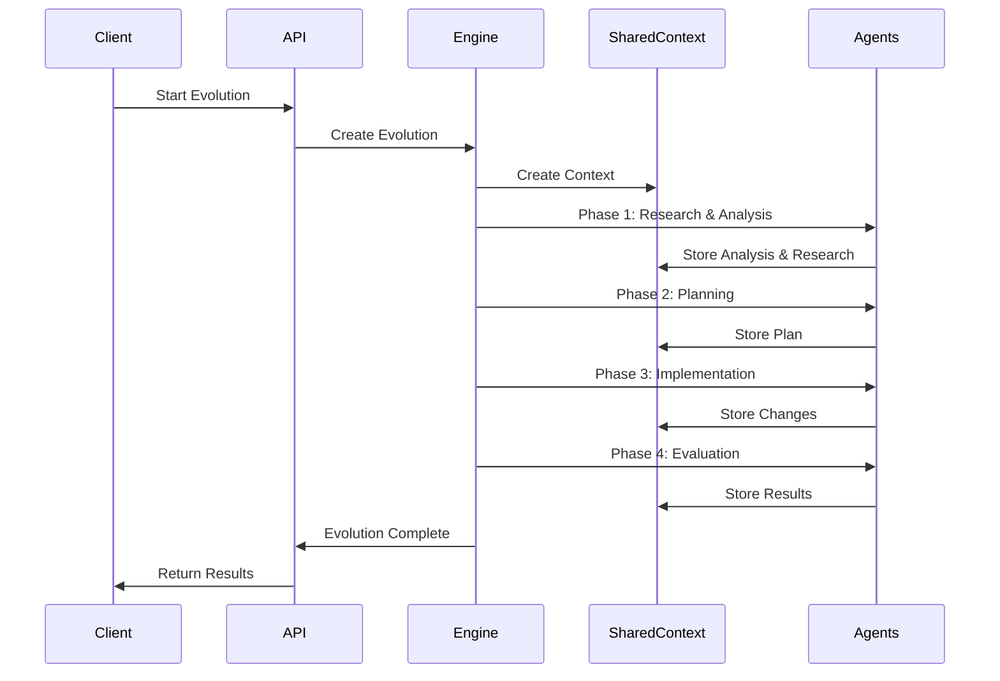

# 🏗️ T-Developer v2 아키텍처

## 개요

T-Developer v2는 **SharedContextStore를 중심으로 한 이벤트 주도 아키텍처**를 채택하여, 모든 Agent가 공유 컨텍스트를 통해 협업하는 구조입니다.

## 핵심 설계 원칙

### 1. 중앙 집중식 상태 관리

- 모든 진화 데이터는 SharedContextStore에 저장
- Agent들은 상태를 직접 관리하지 않음
- 단일 진실의 소스(Single Source of Truth)

### 2. 느슨한 결합

- Agent 간 직접 통신 없음
- SharedContext를 통한 간접 통신
- 독립적 확장 및 교체 가능

### 3. 단계별 데이터 축적

- 각 단계의 출력이 다음 단계의 입력
- 이전 단계 데이터 보존
- 전체 진화 과정 추적 가능

## 시스템 아키텍처

```
┌─────────────────────────────────────────────────────────────┐
│                        Client Layer                          │
│  (Web UI, CLI, API Clients)                                 │
└─────────────────────────────────────────────────────────────┘
                              │
                              ▼
┌─────────────────────────────────────────────────────────────┐
│                      API Gateway                             │
│  FastAPI Server (main.py)                                   │
│  - REST Endpoints                                           │
│  - WebSocket Support                                        │
│  - Authentication & Authorization                           │
└─────────────────────────────────────────────────────────────┘
                              │
                              ▼
┌─────────────────────────────────────────────────────────────┐
│                    Orchestration Layer                       │
│  ┌─────────────────────────────────────────────────────┐   │
│  │           Evolution Engine                          │   │
│  │  - Cycle Management                                │   │
│  │  - Phase Coordination                              │   │
│  │  - Safety Controls                                 │   │
│  └─────────────────────────────────────────────────────┘   │
│  ┌─────────────────────────────────────────────────────┐   │
│  │           Agent Manager                            │   │
│  │  - Agent Lifecycle                                 │   │
│  │  - Task Distribution                               │   │
│  │  - Load Balancing                                  │   │
│  └─────────────────────────────────────────────────────┘   │
└─────────────────────────────────────────────────────────────┘
                              │
                              ▼
┌─────────────────────────────────────────────────────────────┐
│                     Data Layer                               │
│  ┌─────────────────────────────────────────────────────┐   │
│  │           SharedContextStore                        │   │
│  │  ┌────────────────────────────────────────────┐   │   │
│  │  │ Evolution Contexts                          │   │   │
│  │  ├────────────────────────────────────────────┤   │   │
│  │  │ • original_analysis                         │   │   │
│  │  │ • external_research                         │   │   │
│  │  │ • improvement_plan                          │   │   │
│  │  │ • implementation_log                        │   │   │
│  │  │ • evaluation_results                        │   │   │
│  │  └────────────────────────────────────────────┘   │   │
│  └─────────────────────────────────────────────────────┘   │
└─────────────────────────────────────────────────────────────┘
                              │
                              ▼
┌─────────────────────────────────────────────────────────────┐
│                      Agent Layer                             │
│  ┌──────────┐ ┌──────────┐ ┌──────────┐ ┌──────────┐      │
│  │Research  │ │CodeAnalys│ │Planner   │ │Refactor  │      │
│  │Agent     │ │Agent     │ │Agent     │ │Agent     │      │
│  └──────────┘ └──────────┘ └──────────┘ └──────────┘      │
│  ┌──────────┐ ┌──────────┐ ┌──────────┐ ┌──────────┐      │
│  │Evaluator │ │Security  │ │Performance│ │Learning  │      │
│  │Agent     │ │Agent     │ │Agent     │ │Agent     │      │
│  └──────────┘ └──────────┘ └──────────┘ └──────────┘      │
└─────────────────────────────────────────────────────────────┘
                              │
                              ▼
┌─────────────────────────────────────────────────────────────┐
│                   External Services                          │
│  • AWS Bedrock (LLM)                                        │
│  • Claude Code (Code Generation & Modification)             │
│  • GitHub API                                               │
│  • Package Registries                                       │
│  • MCP Tools (filesystem, git, github)                      │
└─────────────────────────────────────────────────────────────┘
```

## 컴포넌트 상세

### SharedContextStore

**역할**: 모든 진화 데이터의 중앙 저장소

**주요 기능**:

- 진화 컨텍스트 생성 및 관리
- 단계별 데이터 저장
- 비교 데이터 제공
- 동시성 제어

**인터페이스**:

```python
class SharedContextStore:
    async def create_context(target_path, focus_areas) -> str
    async def store_original_analysis(evolution_id, ...)
    async def store_external_research(evolution_id, ...)
    async def store_improvement_plan(evolution_id, ...)
    async def store_implementation_log(evolution_id, ...)
    async def store_evaluation_results(evolution_id, ...)
    async def get_context(evolution_id) -> EvolutionContext
    async def get_comparison_data(evolution_id) -> Dict
```

### Evolution Engine

**역할**: 진화 사이클 오케스트레이션

**주요 기능**:

- 4단계 진화 프로세스 관리
- Agent 실행 조정
- 안전 제어 및 롤백
- 메트릭 수집

**진화 사이클**:

1. **Phase 1**: Research & Analysis (병렬)
2. **Phase 2**: Planning
3. **Phase 3**: Implementation
4. **Phase 4**: Evaluation

### Agent System

**Agent 유형**:

| Agent | 입력 | 출력 | SharedContext 사용 |
|-------|------|------|-------------------|
| ResearchAgent | 검색 쿼리 | 베스트 프랙티스, 패턴 | `store_external_research` |
| CodeAnalysisAgent | 코드 경로 | 메트릭, 이슈, 개선점 | `store_original_analysis` |
| PlannerAgent | 분석 데이터 | 태스크 리스트 | `store_improvement_plan` |
| RefactorAgent | 태스크 | 변경 로그 | `store_implementation_log` |
| EvaluatorAgent | 변경 데이터 | 평가 결과 | `store_evaluation_results` |

### API Layer

**엔드포인트 구조**:

```
/health                     # 시스템 상태
/api/
  ├── evolution/
  │   ├── start            # 진화 시작
  │   ├── status           # 현재 상태
  │   └── stop             # 진화 중지
  ├── agents/
  │   ├── list             # Agent 목록
  │   └── {id}/execute     # Agent 실행
  ├── context/
  │   ├── current          # 현재 컨텍스트
  │   ├── {id}             # 특정 컨텍스트
  │   └── comparison/{id}  # 비교 데이터
  └── metrics/
      ├── realtime         # 실시간 메트릭
      └── history          # 과거 메트릭
```

## 데이터 흐름

### 진화 사이클 데이터 흐름



## 확장성 고려사항

### 수평 확장

- Agent는 독립적으로 확장 가능
- SharedContextStore는 Redis/DynamoDB로 교체 가능
- API 서버는 로드 밸런서 뒤에 다중 인스턴스 배치

### 수직 확장

- 각 Agent에 리소스 제한 설정
- 우선순위 기반 스케줄링
- 백프레셔 메커니즘

## 보안 고려사항

### 접근 제어

- API 레벨 인증/인가
- Agent 실행 권한 관리
- 컨텍스트 접근 제어

### 데이터 보호

- 민감 정보 마스킹
- 암호화된 저장
- 감사 로깅

### 실행 안전

- 샌드박스 환경
- 리소스 제한
- 타임아웃 설정

## 성능 최적화

### 캐싱 전략

- 컨텍스트 데이터 캐싱
- Agent 결과 캐싱
- API 응답 캐싱

### 비동기 처리

- 모든 I/O 작업 비동기화
- 병렬 Agent 실행
- 이벤트 기반 통신

### 모니터링

- 실시간 메트릭 수집
- 성능 프로파일링
- 병목 지점 식별

## 장애 처리

### 복원력 패턴

- 서킷 브레이커
- 재시도 로직
- 폴백 메커니즘

### 롤백 전략

- 체크포인트 생성
- 트랜잭션 롤백
- 상태 복원

### 모니터링 및 알림

- 헬스체크
- 오류율 모니터링
- 자동 알림

---

**버전**: 2.0.0
**마지막 업데이트**: 2025-08-17
