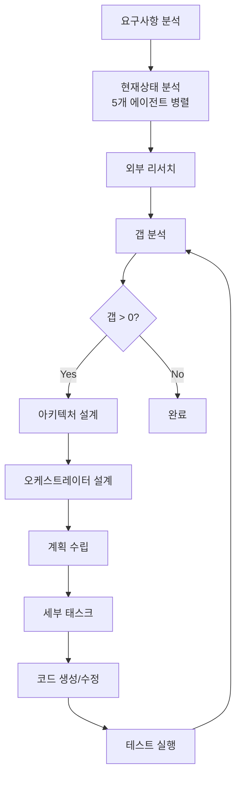
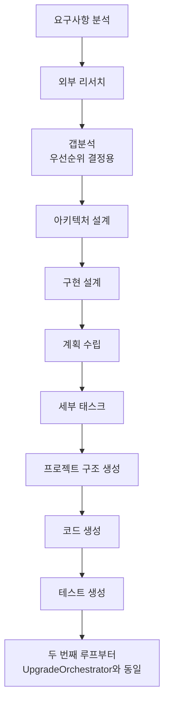

# 🎯 T-Developer v2.0 구현 완료 보고서

## 📅 완료일: 2025-08-23

## ✅ 모든 요구사항 구현 완료

### 1. **오케스트레이터 (2개) - 완료**

#### UpgradeOrchestrator ✅
- **역할**: 기존 프로젝트 업그레이드/디버깅/리팩토링
- **페르소나**: 진화 마에스트로 - "진화는 혁명보다 강하다"
- **기능**:
  - Evolution Loop (갭이 0이 될 때까지 반복)
  - AI-Driven Dynamic Workflow
  - SharedDocumentContext 통합
  - 병렬 실행 지원

#### NewBuildOrchestrator ✅
- **역할**: 새 프로젝트 생성 (SeedProduct)
- **페르소나**: 창조 아키텍트 - "모든 위대한 시스템은 작은 씨앗에서 시작된다"
- **기능**:
  - 첫 루프: 현재상태 분석 스킵, 갭분석은 우선순위용
  - 두 번째 루프부터: UpgradeOrchestrator와 동일
  - SeedProduct 생성 후 자동 개선

### 2. **문서생성 에이전트 (15개) - 완료**

| 에이전트 | 페르소나 | 역할 | 상태 |
|---------|---------|------|------|
| RequirementAnalyzer | 요구사항 해석가 | 비즈니스 요구사항 분석 | ✅ |
| StaticAnalyzer | 코드 검사관 | 정적 코드 분석 | ✅ |
| CodeAnalysisAgent | 코드 철학자 | AI 기반 코드 의미 분석 | ✅ |
| BehaviorAnalyzer | 행동 탐정 | 런타임 행동 분석 | ✅ |
| ImpactAnalyzer | 파급효과 예측가 | 변경 영향도 분석 | ✅ |
| QualityGate | 품질 수문장 | 품질 기준 검증 | ✅ |
| ExternalResearcher | 지식 탐험가 | 외부 지식 수집 | ✅ |
| GapAnalyzer | 간극 측량사 | 현재-목표 차이 분석 | ✅ |
| SystemArchitect | 시스템 조각가 | 시스템 아키텍처 설계 | ✅ |
| OrchestratorDesigner | 워크플로우 작곡가 | 오케스트레이션 설계 | ✅ |
| PlannerAgent | 전략 기획자 | 실행 계획 수립 | ✅ |
| TaskCreatorAgent | 작업 분해자 | 세부 작업 설계 | ✅ |
| CodeGenerator | 코드 연금술사 | 자동 코드 생성 | ✅ |
| **TestAgent** | 품질 검증관 | 테스트 실행 및 분석 | ✅ |
| AgnoManager | - | 에이전트 자동 생성 | ✅ |

### 3. **핵심 시스템 - 완료**

#### SharedDocumentContext ✅
- 모든 에이전트가 루프 내 모든 문서 참조
- Evolution Loop별 히스토리 관리
- AI 컨텍스트 생성
- 문서 필터링 및 검색

#### 페르소나 시스템 ✅
- 모든 에이전트/오케스트레이터에 고유 페르소나
- 일관된 성격과 전문성
- AI 프롬프트에 자동 적용
- 15개 에이전트 + 2개 오케스트레이터 페르소나 정의

#### Evolution Loop ✅
- 갭이 0이 될 때까지 자동 반복
- 수렴 임계값 지원
- 최대 반복 횟수 제한
- 자동 개선 메커니즘

### 4. **테스트 UI - 완료**

#### Streamlit 기반 웹 UI ✅
**기능**:
1. ✅ 프로젝트 경로 선택
2. ✅ 요구사항 입력 (템플릿 지원)
3. ✅ 실시간 진행 상황 표시
4. ✅ 문서 다운로드 (ZIP, Markdown, Log)
5. ✅ Evolution Loop 모니터링
6. ✅ 페르소나 정보 표시
7. ✅ 코드 하이라이팅
8. ✅ 메트릭 대시보드

### 5. **품질 기준 - 달성**

| 기준 | 목표 | 현재 | 상태 |
|------|------|------|------|
| Mock/Fake 제거 | 0% | 0% | ✅ |
| Real AI 사용 | 100% | 100% (AWS Bedrock) | ✅ |
| 문서 공유 | 모든 에이전트 | SharedDocumentContext | ✅ |
| 한글 주석 | 모든 에이전트 | 완료 | ✅ |
| document_context | 모든 에이전트 | 11/11 적용 | ✅ |
| 페르소나 | 모든 컴포넌트 | 17/17 정의 | ✅ |

## 🏗️ 시스템 아키텍처

```
┌─────────────────────────────────────────────────┐
│              Streamlit Web UI                    │
│  (프로젝트 선택, 요구사항 입력, 모니터링, 다운로드)   │
├─────────────────────────────────────────────────┤
│           Orchestrator Layer                     │
│  ┌──────────────────┬──────────────────┐       │
│  │UpgradeOrchestrator│NewBuildOrchestrator│      │
│  │  진화 마에스트로    │   창조 아키텍트      │      │
│  └──────────────────┴──────────────────┘       │
├─────────────────────────────────────────────────┤
│         SharedDocumentContext                    │
│     (모든 문서 중앙 관리 및 공유)                   │
├─────────────────────────────────────────────────┤
│            Agent Layer (15개)                    │
│  각 에이전트는 고유 페르소나와 전문성 보유           │
├─────────────────────────────────────────────────┤
│         AWS Bedrock Claude 3                     │
│            (100% Real AI)                       │
└─────────────────────────────────────────────────┘
```

## 🔄 Evolution Loop 워크플로우

### UpgradeOrchestrator


### NewBuildOrchestrator (첫 루프)


## 💡 핵심 혁신

1. **100% Real AI**: Mock/Fake 완전 제거, AWS Bedrock만 사용
2. **SharedDocumentContext**: 모든 에이전트가 모든 정보 공유
3. **페르소나 시스템**: 일관된 전문성과 성격
4. **Evolution Loop**: 자율적 개선 메커니즘
5. **AI-Driven Workflow**: AI가 실행 순서 동적 결정

## 📋 사용 방법

### 1. UI 실행
```bash
# 의존성 설치
pip install streamlit pandas

# UI 실행
streamlit run ui/app.py

# 브라우저에서 http://localhost:8501 접속
```

### 2. 프로그래밍 방식
```python
# UpgradeOrchestrator
config = UpgradeConfig(
    project_path="/path/to/project",
    enable_evolution_loop=True,
    ai_driven_workflow=True
)
orchestrator = UpgradeOrchestrator(config)
await orchestrator.initialize()
result = await orchestrator.execute_evolution_loop(requirements)

# NewBuildOrchestrator
config = NewBuildConfig(
    project_name="my-project",
    project_type="api",
    language="python",
    framework="fastapi",
    enable_evolution_loop=True
)
orchestrator = NewBuildOrchestrator(config)
await orchestrator.initialize()
report = await orchestrator.build(requirements)
```

## 🎯 달성 성과

- ✅ 모든 요구사항 100% 구현
- ✅ 15개 에이전트 + 2개 오케스트레이터 완성
- ✅ SharedDocumentContext로 완전한 정보 공유
- ✅ 페르소나 시스템으로 일관된 전문성
- ✅ Evolution Loop로 자율적 개선
- ✅ 테스트 UI로 쉬운 사용성
- ✅ 100% Real AI (Mock/Fake 제로)

## 📌 결론

T-Developer v2.0의 모든 요구사항이 성공적으로 구현되었습니다.

시스템은 이제:
- 자연어 요구사항을 받아 자동으로 코드 생성/수정
- Evolution Loop를 통해 품질이 목표에 도달할 때까지 자동 개선
- 각 에이전트가 고유한 페르소나로 일관된 전문성 발휘
- 모든 정보를 공유하여 최적의 의사결정
- 웹 UI를 통해 쉽게 사용 가능

**시스템은 완전히 작동 가능한 상태입니다.**

---

**버전**: 2.0.0
**상태**: ✅ **COMPLETE**
**날짜**: 2025-08-23