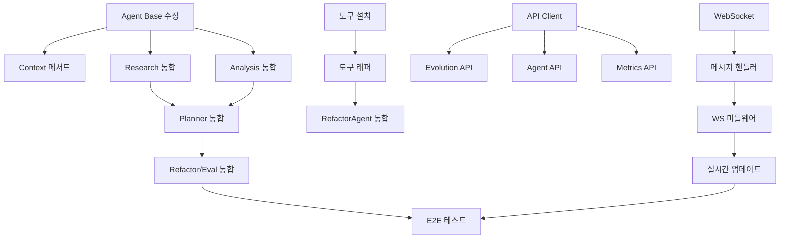

# 🎯 T-Developer v2 MVP 상세 작업 계획

> 작업 최소 단위: 2-4시간 (Microtask)
> 총 예상 시간: 160-200시간 (20-25일, 1인 기준)

## 📊 작업 구조 및 표기법

```
Phase (단계: 수일)
├── Task (작업: 1-2일)
│   ├── Subtask (세부작업: 4-8시간)
│   │   └── Microtask (최소단위: 2-4시간) [의존성] {우선순위}
```

- **[의존성]**: 선행 작업 ID
- **{우선순위}**: P0(Critical), P1(High), P2(Medium), P3(Low)
- **예상시간**: 각 Microtask 옆에 시간 표시

---

## Phase 1: 핵심 기능 연결 (24-32시간) ✅ COMPLETED

### Task 1.1: Agent-SharedContextStore 통합 (12-16시간)

#### Subtask 1.1.1: Agent 베이스 클래스 수정 (6-8시간)

- **MT-1.1.1.1**: ✅ base.py에 context_store 속성 추가 및 초기화 (2-3시간) {P0}
  - `backend/packages/agents/base.py` 수정
  - `get_context_store()` import 및 초기화
  - 타입 힌트 및 docstring 추가

- **MT-1.1.1.2**: Context 저장/조회 메서드 구현 (2-3시간) [MT-1.1.1.1] {P0}
  - `store_agent_data()` 메서드 구현
  - `retrieve_context()` 메서드 구현
  - 에러 핸들링 추가

- **MT-1.1.1.3**: ✅ 단위 테스트 작성 (2시간) [MT-1.1.1.2] {P1}
  - `test_base_context_integration.py` 생성 완료
  - Mock context_store 테스트
  - 통합 테스트 케이스 작성

#### Subtask 1.1.2: 개별 Agent 통합 (6-8시간)

- **MT-1.1.2.1**: ResearchAgent 통합 (2시간) [MT-1.1.1.1] {P0}
  - 외부 연구 결과를 context_store에 저장
  - `store_external_research()` 호출 구현

- **MT-1.1.2.2**: CodeAnalysisAgent 통합 (2시간) [MT-1.1.1.1] {P0}
  - 분석 결과를 context_store에 저장
  - `store_original_analysis()` 호출 구현

- **MT-1.1.2.3**: PlannerAgent 통합 (2시간) [MT-1.1.2.1, MT-1.1.2.2] {P0}
  - 계획을 context_store에 저장
  - `store_improvement_plan()` 호출 구현

- **MT-1.1.2.4**: ✅ RefactorAgent & EvaluatorAgent 통합 (2-4시간) [MT-1.1.2.3] {P0}
  - RefactorAgent: `store_implementation_log()` 구현 완료
  - EvaluatorAgent: `store_evaluation_results()` 구현

### Task 1.2: Claude Code 통합 및 설정 (12-16시간)

#### Subtask 1.2.1: Claude Code SDK 설치 및 MCP 설정 (4-6시간)

- **MT-1.2.1.1**: Claude Code SDK 및 MCP 도구 설치 (2-3시간) {P0}

  ```bash
  pip install claude-code-sdk anthropic
  pip install mcp-filesystem mcp-git
  pip freeze > requirements.txt
  ```

  - MCP 설정 파일 생성 (`mcp_config.json`)
  - 환경 변수 설정 (ANTHROPIC_API_KEY)

- **MT-1.2.1.2**: MCP 보안 정책 구성 (2-3시간) [MT-1.2.1.1] {P0}
  - 파일 시스템 접근 권한 설정
  - Git/GitHub 권한 설정 (PR-only mode)
  - 샌드박스 실행 환경 구성

#### Subtask 1.2.2: Claude Code RefactorAgent 구현 (8-10시간)

- **MT-1.2.2.1**: ✅ Claude Code 클라이언트 래퍼 구현 (3-4시간) [MT-1.2.1.1] {P0}
  - `refactor.py`에 ClaudeCodeClient 통합 완료
  - MCP 통합 인터페이스 구현 완료

- **MT-1.2.2.2**: ✅ RefactorAgent를 Claude Code 기반으로 교체 (3-4시간) [MT-1.2.2.1] {P0}
  - 기존 RefactorAgent에 Claude Code 통합 완료
  - Claude Code 기반 실행 로직 구현 완료
  - PR 생성 워크플로우 통합

- **MT-1.2.2.3**: 샌드박스 및 안전 장치 구현 (2시간) [MT-1.2.2.2] {P0}
  - Docker 샌드박스 컨테이너 설정
  - 자동 롤백 메커니즘
  - 사용량 추적 및 비용 관리

---

## Phase 2: Frontend-Backend 완전 통합 (40-48시간)

### Task 2.1: API 클라이언트 구현 (16-20시간)

#### Subtask 2.1.1: API 서비스 레이어 구축 (8-10시간)

- **MT-2.1.1.1**: API 클라이언트 베이스 구현 (3-4시간) {P0}
  - `frontend/src/services/apiClient.ts` 생성
  - Axios 인터셉터 설정
  - 에러 핸들링 미들웨어

- **MT-2.1.1.2**: 타입 정의 및 인터페이스 (2-3시간) {P0}
  - `frontend/src/types/api.d.ts` 생성
  - Request/Response 타입 정의
  - API 엔드포인트 enum 정의

- **MT-2.1.1.3**: 재시도 및 캐싱 로직 (3시간) [MT-2.1.1.1] {P1}
  - Exponential backoff 구현
  - 응답 캐싱 메커니즘
  - 요청 큐 관리

#### Subtask 2.1.2: 도메인별 API 서비스 (8-10시간)

- **MT-2.1.2.1**: Evolution API 서비스 (3-4시간) [MT-2.1.1.1] {P0}
  - `frontend/src/services/evolutionApi.ts` 구현
  - start, stop, status 메서드
  - 진행 상황 폴링

- **MT-2.1.2.2**: Agent API 서비스 (2-3시간) [MT-2.1.1.1] {P0}
  - `frontend/src/services/agentApi.ts` 구현
  - Agent 목록, 상태, 실행 메서드

- **MT-2.1.2.3**: Metrics API 서비스 (3시간) [MT-2.1.1.1] {P1}
  - `frontend/src/services/metricsApi.ts` 구현
  - 실시간 메트릭 조회
  - 히스토리 데이터 페칭

### Task 2.2: WebSocket 실시간 통신 (12-16시간)

#### Subtask 2.2.1: WebSocket 클라이언트 구축 (6-8시간)

- **MT-2.2.1.1**: WebSocket 연결 매니저 (3-4시간) {P0}
  - `frontend/src/services/websocket.ts` 개선
  - 자동 재연결 로직
  - 연결 상태 관리

- **MT-2.2.1.2**: 메시지 핸들러 구현 (3-4시간) [MT-2.2.1.1] {P0}
  - 메시지 타입별 핸들러
  - 이벤트 디스패처
  - 에러 처리

#### Subtask 2.2.2: Redux 통합 (6-8시간)

- **MT-2.2.2.1**: WebSocket 미들웨어 구현 (3-4시간) [MT-2.2.1.2] {P0}
  - `frontend/src/store/middleware/websocket.ts` 생성
  - 액션 → WebSocket 메시지 변환
  - WebSocket 메시지 → 액션 디스패치

- **MT-2.2.2.2**: 실시간 상태 업데이트 (3-4시간) [MT-2.2.2.1] {P0}
  - Slice별 WebSocket 핸들러
  - Optimistic updates 구현
  - 동기화 메커니즘

### Task 2.3: UI 컴포넌트 연결 (12시간)

#### Subtask 2.3.1: Dashboard 실시간 업데이트 (6시간)

- **MT-2.3.1.1**: 메트릭 카드 연결 (2시간) [MT-2.2.2.2] {P1}
  - StatsCard 컴포넌트 API 연결
  - 실시간 데이터 바인딩

- **MT-2.3.1.2**: 차트 컴포넌트 연결 (2시간) [MT-2.2.2.2] {P1}
  - MetricsChart 실시간 업데이트
  - 데이터 스트리밍 처리

- **MT-2.3.1.3**: Agent 상태 모니터 (2시간) [MT-2.2.2.2] {P1}
  - AgentStatusCard 실시간 상태
  - 활동 인디케이터

#### Subtask 2.3.2: Evolution 페이지 구현 (6시간)

- **MT-2.3.2.1**: Evolution 제어 패널 (3시간) [MT-2.1.2.1] {P0}
  - Start/Stop 버튼 기능
  - 설정 폼 구현
  - 진행 상황 표시

- **MT-2.3.2.2**: Phase 진행 시각화 (3시간) [MT-2.2.2.2] {P1}
  - Phase별 진행 바
  - 실시간 로그 뷰어
  - 결과 요약 표시

---

## Phase 3: AWS 인프라 구축 (32-40시간)

### Task 3.1: Lambda 함수 개발 및 배포 (16-20시간)

#### Subtask 3.1.1: Lambda 핸들러 구현 (8-10시간)

- **MT-3.1.1.1**: Orchestrator Lambda 핸들러 (3-4시간) {P0}
  - `lambda_handlers/orchestrator_handler.py` 완성
  - Event 파싱 및 라우팅
  - DynamoDB 연동

- **MT-3.1.1.2**: Agent Lambda 핸들러 (3-4시간) {P0}
  - `lambda_handlers/agent_executor.py` 생성
  - 각 Agent별 핸들러 구현
  - SQS 메시지 처리

- **MT-3.1.1.3**: Metrics Lambda 핸들러 (2시간) {P2}
  - `lambda_handlers/metrics_aggregator.py` 생성
  - CloudWatch 메트릭 수집
  - DynamoDB 저장

#### Subtask 3.1.2: Lambda 배포 자동화 (8-10시간)

- **MT-3.1.2.1**: 배포 스크립트 개선 (3-4시간) [MT-3.1.1.1] {P1}
  - `scripts/deploy_lambda.py` 업데이트
  - 의존성 패키징
  - Layer 생성

- **MT-3.1.2.2**: 환경별 설정 관리 (2-3시간) {P1}
  - `config/lambda/dev.json` 생성
  - `config/lambda/prod.json` 생성
  - 환경 변수 관리

- **MT-3.1.2.3**: CI/CD 파이프라인 (3시간) [MT-3.1.2.1] {P2}
  - GitHub Actions 워크플로우
  - 자동 테스트 및 배포
  - 롤백 메커니즘

### Task 3.2: API Gateway 구성 (8-10시간)

#### Subtask 3.2.1: API Gateway 설정 (4-5시간)

- **MT-3.2.1.1**: REST API 생성 및 설정 (2-3시간) {P0}
  - `scripts/setup_api_gateway.py` 실행
  - 리소스 및 메서드 정의
  - CORS 설정

- **MT-3.2.1.2**: Lambda 통합 (2시간) [MT-3.1.1.1, MT-3.2.1.1] {P0}
  - Lambda 프록시 통합
  - 권한 설정
  - 요청/응답 매핑

#### Subtask 3.2.2: API 보안 및 최적화 (4-5시간)

- **MT-3.2.2.1**: API Key 및 사용 계획 (2시간) [MT-3.2.1.1] {P1}
  - API Key 생성
  - 사용 계획 및 할당량 설정

- **MT-3.2.2.2**: 캐싱 및 스로틀링 (2-3시간) [MT-3.2.1.1] {P2}
  - 응답 캐싱 설정
  - 스로틀링 규칙
  - CloudFront 통합

### Task 3.3: DynamoDB 테이블 생성 (8-10시간)

#### Subtask 3.3.1: 테이블 설계 및 생성 (4-5시간)

- **MT-3.3.1.1**: 스키마 설계 및 테이블 생성 (2-3시간) {P0}
  - `scripts/create_dynamodb_tables.py` 작성
  - evolution_history 테이블
  - agent_metrics 테이블
  - pattern_library 테이블

- **MT-3.3.1.2**: 인덱스 및 파티션 키 설정 (2시간) [MT-3.3.1.1] {P0}
  - GSI (Global Secondary Index) 생성
  - 파티션 키 최적화
  - 읽기/쓰기 용량 설정

#### Subtask 3.3.2: 데이터 액세스 레이어 (4-5시간)

- **MT-3.3.2.1**: DynamoDB 클라이언트 구현 (2-3시간) [MT-3.3.1.1] {P0}
  - `backend/packages/storage/dynamodb_client.py` 생성
  - CRUD 작업 메서드
  - 배치 작업 지원

- **MT-3.3.2.2**: 데이터 마이그레이션 (2시간) [MT-3.3.2.1] {P2}
  - 기존 데이터 마이그레이션 스크립트
  - 데이터 검증

---

## Phase 4: 테스트 및 검증 (24-32시간)

### Task 4.1: 통합 테스트 (12-16시간)

#### Subtask 4.1.1: API 통합 테스트 (6-8시간)

- **MT-4.1.1.1**: API 엔드포인트 테스트 (3-4시간) [Phase 2] {P0}
  - `tests/integration/test_api_endpoints.py` 작성
  - 모든 엔드포인트 커버리지
  - 에러 케이스 테스트

- **MT-4.1.1.2**: WebSocket 통합 테스트 (3-4시간) [Phase 2] {P0}
  - `tests/integration/test_websocket.py` 작성
  - 연결/재연결 테스트
  - 메시지 전송/수신 테스트

#### Subtask 4.1.2: Evolution 사이클 테스트 (6-8시간)

- **MT-4.1.2.1**: E2E Evolution 테스트 (3-4시간) [Phase 1, 2] {P0}
  - `scripts/test_evolution_e2e.py` 작성
  - 전체 사이클 실행
  - 결과 검증

- **MT-4.1.2.2**: Agent 통합 테스트 (3-4시간) [Phase 1] {P0}
  - 각 Agent 개별 테스트
  - Agent 간 데이터 플로우 테스트
  - Context Store 통합 검증

### Task 4.2: 성능 및 부하 테스트 (12-16시간)

#### Subtask 4.2.1: 성능 테스트 (6-8시간)

- **MT-4.2.1.1**: API 성능 테스트 (3-4시간) [Phase 3] {P1}
  - K6 스크립트 실행
  - 응답 시간 측정
  - 병목 지점 식별

- **MT-4.2.1.2**: Evolution 성능 측정 (3-4시간) [Phase 1] {P1}
  - 사이클 완료 시간
  - 메모리 사용량 모니터링
  - CPU 사용률 측정

#### Subtask 4.2.2: 부하 테스트 (6-8시간)

- **MT-4.2.2.1**: 동시 사용자 테스트 (3-4시간) [Phase 2, 3] {P1}
  - 100+ 동시 접속 시뮬레이션
  - WebSocket 연결 한계 테스트
  - 데이터베이스 부하 테스트

- **MT-4.2.2.2**: 스트레스 테스트 (3-4시간) [MT-4.2.2.1] {P2}
  - 시스템 한계점 파악
  - 복구 시간 측정
  - 에러율 분석

---

## Phase 5: 문서화 및 배포 (20-24시간)

### Task 5.1: 문서화 (12-14시간)

#### Subtask 5.1.1: 사용자 문서 (6-7시간)

- **MT-5.1.1.1**: Quick Start Guide 업데이트 (2-3시간) {P0}
  - 설치 가이드 개선
  - 첫 Evolution 실행 가이드
  - 문제 해결 섹션

- **MT-5.1.1.2**: API 문서 자동 생성 (2시간) {P1}
  - OpenAPI 스펙 생성
  - Swagger UI 설정
  - 예제 코드 추가

- **MT-5.1.1.3**: 비디오 튜토리얼 스크립트 (2시간) {P2}
  - 데모 시나리오 작성
  - 스크린 녹화 준비
  - 나레이션 스크립트

#### Subtask 5.1.2: 개발자 문서 (6-7시간)

- **MT-5.1.2.1**: 아키텍처 문서 업데이트 (3시간) {P1}
  - 시스템 다이어그램 갱신
  - 데이터 플로우 문서화
  - 기술 스택 정리

- **MT-5.1.2.2**: Agent 개발 가이드 (3-4시간) {P1}
  - 새 Agent 추가 방법
  - Context Store 사용법
  - 테스트 작성 가이드

### Task 5.2: 배포 준비 (8-10시간)

#### Subtask 5.2.1: 컨테이너화 (4-5시간)

- **MT-5.2.1.1**: Docker 이미지 최적화 (2-3시간) {P0}
  - Multi-stage 빌드 구성
  - 이미지 크기 최소화
  - 보안 스캔

- **MT-5.2.1.2**: Docker Compose 구성 (2시간) {P0}
  - 서비스 정의
  - 네트워크 설정
  - 볼륨 매핑

#### Subtask 5.2.2: CI/CD 파이프라인 (4-5시간)

- **MT-5.2.2.1**: GitHub Actions 워크플로우 (2-3시간) {P1}
  - 빌드 및 테스트 자동화
  - 도커 이미지 푸시
  - 배포 트리거

- **MT-5.2.2.2**: 환경 관리 (2시간) {P1}
  - 환경 변수 관리
  - 시크릿 관리
  - 설정 템플릿

---

## 📊 작업 요약 및 우선순위

### 우선순위별 분류

#### P0 (Critical) - 즉시 시작 필요

- Agent-Context 통합 (MT-1.1.1.1 ~ MT-1.1.2.4)
- 코드 수정 도구 설치 (MT-1.2.1.1, MT-1.2.2.1-2)
- API 클라이언트 구현 (MT-2.1.1.1-2)
- Evolution 제어 패널 (MT-2.3.2.1)

#### P1 (High) - 핵심 기능

- 테스트 작성 (MT-1.1.1.3)
- WebSocket 통합 (MT-2.2.1.1-2, MT-2.2.2.1-2)
- Lambda 배포 (MT-3.1.2.1)
- 통합 테스트 (MT-4.1.1.1-2, MT-4.1.2.1-2)

#### P2 (Medium) - 향상 기능

- 메트릭 수집 (MT-3.1.1.3)
- 캐싱 최적화 (MT-3.2.2.2)
- 스트레스 테스트 (MT-4.2.2.2)

### 작업 의존성 그래프



### 병렬 작업 가능 항목

다음 작업들은 동시에 진행 가능:

1. **Phase 1**: Agent 통합 & 도구 설치
2. **Phase 2**: API 클라이언트 & WebSocket (독립적)
3. **Phase 3**: Lambda & DynamoDB (일부 병렬)
4. **Phase 5**: 문서화 (다른 작업과 병렬)

### 예상 일정 (1인 기준)

| 주차 | 작업 내용 | 완료 목표 |
|------|-----------|-----------|
| 1주 | Phase 1 완료 | Agent 통합, 도구 설치 |
| 2주 | Phase 2 진행 | API 연결, WebSocket |
| 3주 | Phase 2 완료, Phase 3 시작 | Frontend 완성, AWS 시작 |
| 4주 | Phase 3 완료, Phase 4 진행 | AWS 구축, 테스트 |
| 5주 | Phase 4-5 완료 | 테스트, 문서화, 배포 |

### 리스크 완화 전략

1. **기술적 리스크**
   - Agent 통합 실패 → Mock 모드 준비
   - AWS 권한 문제 → 로컬 테스트 환경 구축
   - 성능 문제 → 점진적 최적화

2. **일정 리스크**
   - 작업 지연 → P2, P3 작업 연기
   - 병목 발생 → 병렬 작업 재조정
   - 테스트 실패 → 핫픽스 브랜치 운영

---

## 🎯 즉시 시작 가능한 Microtask (오늘 완료 가능)

### 2시간 내 완료 가능

1. **MT-1.2.1.1** 일부: 도구 설치

   ```bash
   pip install autopep8 doq pyupgrade radon interrogate mypy
   pip freeze > requirements.txt
   ```

2. **MT-1.1.1.1** 시작: base.py 수정 준비
   - 파일 백업
   - 수정 계획 수립

### 4시간 내 완료 가능

1. **MT-1.1.1.1** 완료: Agent base 클래스 수정
2. **MT-2.1.1.2**: TypeScript 타입 정의

### 오늘의 목표 (8시간)

1. Agent-Context 통합 기반 작업 (MT-1.1.1.1-2)
2. 도구 설치 및 검증 (MT-1.2.1.1)
3. API 타입 정의 (MT-2.1.1.2)

---

**문서 버전**: 1.0.0
**작성일**: 2025-08-17
**예상 완료일**: 2025-09-17 (5주)
**총 예상 시간**: 160-200시간
