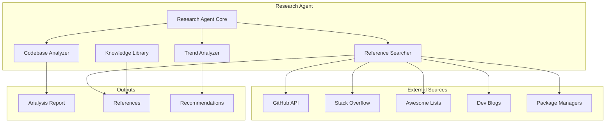

# Research Agent Architecture & Reference Library

## 📋 Overview

The Research Agent is a core component that gathers intelligence for informed decision-making. It analyzes codebases, searches for external references, tracks technology trends, and maintains a knowledge library.

## 🎯 Purpose

### Current Limitations

- **Surface-level metrics**: Only reports "what" not "why" or "how"
- **No context**: Finds issues but doesn't assess business impact
- **Missing external insight**: Reinvents wheels instead of leveraging proven solutions

### Enhanced Capabilities

- **Codebase Analysis**: Deep understanding of current system
- **External References**: Best practices, similar projects, proven solutions
- **Trend Analysis**: Technology adoption curves and community momentum
- **Knowledge Library**: Reusable reference database for future decisions

## 🏗️ Architecture



## 📚 Reference Library Structure

```yaml
references/
├── solutions/              # Problem-solution mappings
│   ├── authentication/
│   │   ├── overview.yaml
│   │   ├── auth0.yaml
│   │   ├── supabase.yaml
│   │   └── nextauth.yaml
│   ├── realtime/
│   │   ├── socketio.yaml
│   │   ├── ably.yaml
│   │   └── pusher.yaml
│   └── payments/
│       ├── stripe.yaml
│       └── toss-payments.yaml
├── patterns/               # Architectural patterns
│   ├── microservices/
│   ├── event-driven/
│   └── serverless/
├── benchmarks/            # Performance comparisons
│   ├── orm-comparison.yaml
│   ├── framework-benchmarks.yaml
│   └── cloud-providers.yaml
├── case-studies/          # Real-world implementations
│   ├── korean/           # Korean company cases
│   │   ├── toss.yaml
│   │   ├── kakao.yaml
│   │   └── danggeun.yaml
│   └── global/
│       ├── netflix.yaml
│       └── uber.yaml
└── trends/                # Technology trends
    ├── 2024-trends.yaml
    ├── rising.yaml
    └── declining.yaml
```

## 🔍 Search Strategy

### 1. Problem Identification

```python
problem_context = {
    "type": "authentication",
    "requirements": ["oauth", "jwt", "mfa"],
    "constraints": ["korean_market", "compliance"],
    "scale": "10k_users"
}
```

### 2. Multi-Source Search

```python
search_sources = [
    "GitHub (stars, issues, adoption)",
    "npm/PyPI (downloads, dependencies)",
    "Stack Overflow (questions, solutions)",
    "Dev.to/Medium (tutorials, case studies)",
    "Awesome Lists (curated collections)"
]
```

### 3. Solution Evaluation

```python
evaluation_criteria = {
    "maturity": "years_in_production",
    "community": "contributors_count",
    "documentation": "quality_score",
    "korean_support": "local_cases",
    "cost": "tco_estimate",
    "learning_curve": "time_to_productive"
}
```

## 📊 Reference Schema

### Solution Reference

```yaml
name: "Auth0"
category: "authentication"
type: "saas"
metadata:
  stars: 12000
  weekly_downloads: 500000
  first_release: "2013-01-01"
  latest_version: "3.5.0"
  license: "MIT"
pros:
  - "Battle-tested at scale"
  - "Comprehensive documentation"
  - "Korean language support"
cons:
  - "Vendor lock-in"
  - "Cost at scale"
  - "Limited customization"
use_cases:
  - "B2C applications"
  - "Quick MVP launch"
  - "Compliance requirements"
korean_cases:
  - company: "당근마켓"
    scale: "20M users"
    feedback: "Reliable but expensive at scale"
alternatives:
  - "Supabase Auth (open source alternative)"
  - "NextAuth.js (self-hosted)"
  - "AWS Cognito (AWS ecosystem)"
pricing:
  free_tier: "7000 MAU"
  paid_start: "$23/month"
  enterprise: "Custom"
integration_effort:
  initial_setup: "2 hours"
  full_integration: "2 days"
  migration_from:
    firebase: "1 week"
    custom: "2 weeks"
```

### Technology Trend

```yaml
technology: "Bun"
category: "javascript_runtime"
status: "rising"
momentum: "high"
adoption_stage: "early_adopter"
metrics:
  github_stars: 70000
  growth_rate: "300% YoY"
  job_postings: 150
  community_size: 5000
comparison:
  vs_node: "3x faster cold start"
  vs_deno: "More compatible with npm"
risks:
  - "Ecosystem maturity"
  - "Production stability"
  - "Debugging tools"
opportunities:
  - "Performance gains"
  - "Reduced infrastructure cost"
  - "Developer experience"
recommendation:
  production: "wait"
  side_project: "try"
  learning: "recommended"
timeline:
  current: "v1.0 released"
  next_milestone: "Windows support"
  production_ready: "2025 Q2 (estimated)"
```

## 🚀 Usage Examples

### 1. Finding Authentication Solution

```python
# Research Agent receives task
task = "Implement secure authentication with Korean market support"

# Searches references
references = await research_agent.search_references({
    "problem": "authentication",
    "requirements": ["korean_support", "mfa", "social_login"],
    "budget": "medium"
})

# Returns ranked solutions
{
    "recommended": {
        "solution": "Supabase Auth",
        "reasoning": [
            "Open source (no vendor lock-in)",
            "Korean companies using it",
            "Good price-performance ratio"
        ],
        "implementation_time": "3 days",
        "monthly_cost": "$25",
        "case_study": "Danggeun Market migration story"
    },
    "alternatives": [...]
}
```

### 2. Technology Decision

```python
# Planner asks: "Should we migrate from Express to Fastify?"

analysis = await research_agent.analyze_migration({
    "from": "express",
    "to": "fastify",
    "codebase_size": "50k_loc",
    "team_size": 5
})

# Returns data-driven recommendation
{
    "recommendation": "gradual_migration",
    "reasoning": {
        "performance_gain": "2x throughput",
        "migration_effort": "3 weeks",
        "team_learning": "1 week",
        "risk_level": "medium"
    },
    "migration_plan": "...",
    "rollback_strategy": "..."
}
```

## 🔄 Continuous Learning

### Feedback Loop

```python
class ReferenceUpdater:
    async def update_from_outcome(self, decision, result):
        """Learn from implementation results"""
        if result.success:
            await self.boost_confidence(decision.solution)
            await self.add_case_study(decision, result)
        else:
            await self.record_failure_pattern(decision, result)
            await self.adjust_recommendations()
```

### Trend Tracking

```python
class TrendMonitor:
    async def daily_scan(self):
        """Daily trend updates"""
        return {
            "new_releases": self.check_github_releases(),
            "trending_topics": self.scan_hackernews(),
            "deprecated": self.check_deprecations(),
            "security_alerts": self.scan_cve_database()
        }
```

## 📈 Metrics & Evaluation

### Success Metrics

- **Decision Speed**: Time from problem to solution selection
- **Implementation Success Rate**: Successful implementations / total attempts
- **Reuse Rate**: References reused across projects
- **Cost Savings**: Avoided reinventing wheels
- **Quality Impact**: Bugs prevented by using proven solutions

### Quality Gates

- Minimum 3 sources per recommendation
- At least 1 production case study
- Security audit within last 12 months
- Active maintenance (commit within 30 days)
- Documentation completeness score > 80%

## 🔗 Integration Points

### With Planner Agent

```python
# Planner requests feasibility check
planner_request = {
    "goal": "Add real-time features",
    "timeline": "2 weeks",
    "team_skills": ["python", "react"]
}

# Research provides actionable intelligence
research_response = {
    "feasible": True,
    "recommended_stack": ["Socket.io", "Redis"],
    "learning_resources": [...],
    "risk_mitigation": [...]
}
```

### With Evaluator Agent

```python
# Evaluator asks for benchmarks
evaluator_request = {
    "implementation": "new_orm",
    "metrics_needed": ["performance", "memory"]
}

# Research provides comparison data
research_response = {
    "benchmarks": {
        "vs_previous": "+15% speed, -20% memory",
        "vs_industry": "Top 25th percentile"
    }
}
```

## 🛡️ Security & Privacy

### Data Handling

- No proprietary code in external searches
- Sanitize queries before API calls
- Cache public data only
- Respect rate limits and licenses

### API Key Management

```yaml
credentials:
  github:
    type: "oauth_app"
    scope: "public_repo"
  stackoverflow:
    type: "api_key"
    tier: "basic"
```

## 📝 Future Enhancements

### Phase 2

- [ ] ML-based solution matching
- [ ] Cost prediction models
- [ ] Auto-generate migration scripts
- [ ] Team skill assessment

### Phase 3

- [ ] Custom benchmark runner
- [ ] A/B testing framework
- [ ] Failure prediction
- [ ] Auto-PR for dependencies

## 🤝 Contributing

The Research Agent improves through:

1. New reference sources
2. Updated case studies
3. Validation of recommendations
4. Failure pattern analysis

---

*Last Updated: 2024-01-16*
*Version: 2.0.0*
*Status: Enhanced with Reference Library*
