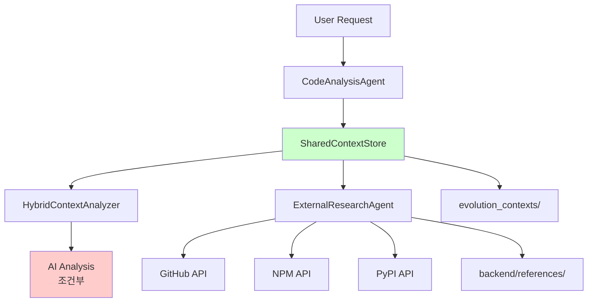

# T-Developer 분석 에이전트 비교 및 상세 사양

## 1. 에이전트별 분석 방식

### 📊 CodeAnalysisAgent (완전 정적 분석)

- **분석 방식**: 100% 정적 분석 (AST 파싱, 정규식 패턴 매칭)
- **AI 사용**: ❌ 없음
- **속도**: ⚡ 매우 빠름 (< 1초)
- **비용**: 💰 무료

### 🔄 HybridContextAnalyzer (하이브리드)

- **분석 방식**: 정적 분석 + 메모리 + 선택적 AI
- **AI 사용**: ⚠️ 조건부 (신뢰도 < 60% 또는 복잡도 > 100)
- **AI 모델**: claude-3-haiku-20240307 (빠르고 저렴)
- **속도**: ⚡ 빠름 (AI 미사용시 < 2초, AI 사용시 < 10초)
- **비용**: 💰 조건부 (AI 사용시만 과금)

### 🌐 ExternalResearchAgent (외부 API)

- **분석 방식**: 외부 API 호출 (GitHub, NPM, PyPI)
- **AI 사용**: ❌ 없음 (API만 사용)
- **속도**: 🐌 느림 (5-15초, 네트워크 의존)
- **비용**: 💰 무료 (GitHub API 무료 한도 내)

## 2. 데이터 저장 위치

### SharedContextStore (공통 저장소)

```python
# 경로: /home/ec2-user/T-Developer/backend/core/shared_context.py
# 저장 위치: ./evolution_contexts/ 디렉토리

class EvolutionContext:
    evolution_id: str           # 고유 ID
    original_analysis: dict     # CodeAnalysisAgent 결과
    external_research: dict     # ExternalResearchAgent 결과
    current_state: dict        # 현재 상태
    improvements: list         # 개선 사항
    created_at: datetime
    updated_at: datetime
```

### 파일 시스템 구조

```
evolution_contexts/
├── evo_20240817_123456.json  # 각 진화 세션별 컨텍스트
├── evo_20240817_123457.json
└── ...
```

### 참조 라이브러리

```
backend/references/
├── trends/                    # 기술 트렌드
│   └── *.json
├── solutions/                 # 솔루션 데이터베이스
│   └── *.json
└── patterns/                  # 패턴 라이브러리
    └── *.json
```

## 3. 분석 분량 제한

### CodeAnalysisAgent

```python
max_files_to_scan: int = 100      # 최대 스캔 파일 수
max_file_size_mb: float = 10      # 파일당 최대 크기
min_improvement_score: float = 0.3 # 최소 개선 점수
```

### HybridContextAnalyzer

```python
AI_TIMEOUT = 10                   # AI 응답 타임아웃 (초)
max_tokens = 1000                  # AI 응답 최대 토큰
recommendations[:10]               # 최대 10개 권장사항
```

### ExternalResearchAgent

```python
max_external_searches: int = 10   # 최대 외부 검색 수
github_per_page = 10              # GitHub 검색 결과 수
npm_limit = 10                    # NPM 검색 결과 수
```

## 4. 품질 평가 기준

### 정적 분석 품질 (CodeAnalysisAgent)

```python
# 코드 품질 메트릭
- Lines of Code (LOC)
- Cyclomatic Complexity (순환 복잡도)
- Code Smells 수
- Pattern/Anti-pattern 탐지율
- Docstring Coverage
- Test Coverage (간접 측정)

# 품질 점수 계산
quality_score = (
    0.3 * (1 - complexity/100) +     # 복잡도 (낮을수록 좋음)
    0.2 * docstring_coverage +       # 문서화율
    0.2 * (1 - smells/50) +         # 코드 스멜 (적을수록 좋음)
    0.3 * pattern_score              # 좋은 패턴 사용
)
```

### 하이브리드 분석 신뢰도 (HybridContextAnalyzer)

```python
# 신뢰도 평가 (0.0 - 1.0)
confidence_score = base_score
    + metric_bonus           # 메트릭 계산 성공시 +0.2
    + pattern_bonus          # 패턴 5개 이상 발견시 +0.15
    - complexity_penalty     # 복잡도 > 50시 -0.2
    + memory_bonus          # 관련 메모리 5개 이상시 +0.15
    - smell_penalty         # 코드 스멜 10개 이상시 -0.15

# AI 사용 결정
use_ai = (
    confidence_score < 0.6 OR
    cyclomatic_complexity > 100 OR
    new_pattern_detected OR
    force_ai == True
)
```

### 외부 리서치 관련성 (ExternalResearchAgent)

```python
# GitHub 결과 관련성
relevance_score = (
    0.4 * stars_count/1000 +        # 인기도
    0.3 * recent_update_score +     # 최신성
    0.2 * language_match +          # 언어 일치
    0.1 * description_match         # 설명 일치도
)

# 결과 필터링
filtered_results = [
    r for r in results
    if r.relevance_score > 0.5      # 50% 이상 관련성
]
```

## 5. 성능 및 비용 비교

| 에이전트 | 속도 | 비용 | 정확도 | 사용 시나리오 |
|---------|------|------|--------|--------------|
| **CodeAnalysisAgent** | ⚡ < 1초 | 무료 | 80% | 일반적인 코드 분석 |
| **HybridContextAnalyzer** | ⚡ 1-10초 | 조건부 | 95% | 복잡한 코드, 아키텍처 분석 |
| **ExternalResearchAgent** | 🐌 5-15초 | 무료 | 70% | 외부 솔루션 탐색 |

## 6. 데이터 흐름



## 7. 개선 제안

### 현재 문제점

1. **ExternalResearchAgent가 AI를 사용하지 않음**
   - GitHub API 결과만으로는 깊이 있는 분석 어려움
   - 솔루션 비교 및 추천이 단순함

2. **품질 평가 기준이 하드코딩됨**
   - 프로젝트별 특성 반영 어려움
   - 동적 조정 불가

3. **저장 용량 제한 없음**
   - evolution_contexts가 무한정 증가 가능
   - 오래된 컨텍스트 정리 메커니즘 부재

### 개선 방향

1. **ExternalResearchAgent에 선택적 AI 추가**

   ```python
   # GitHub 결과를 AI로 분석
   if len(github_results) > 5:
       ai_summary = await analyze_with_ai(github_results)
   ```

2. **동적 품질 기준**

   ```python
   quality_config = load_project_config()
   quality_weights = quality_config.get("weights", DEFAULT_WEIGHTS)
   ```

3. **자동 정리 메커니즘**

   ```python
   # 30일 이상 된 컨텍스트 자동 삭제
   cleanup_old_contexts(days=30)
   ```

## 8. AI 분석 템플릿 시스템

### 사전 정의된 분석 유형 (15개)

#### 코드 분석 (5개)

1. **CODE_QUALITY** - 코드 품질 종합 평가
2. **SECURITY_AUDIT** - 보안 취약점 분석
3. **PERFORMANCE_REVIEW** - 성능 최적화 분석
4. **REFACTORING** - 리팩토링 제안
5. **BUG_ANALYSIS** - 버그 원인 분석

#### 아키텍처 분석 (4개)

6. **ARCHITECTURE_REVIEW** - 시스템 아키텍처 평가
7. **DESIGN_PATTERNS** - 디자인 패턴 적용
8. **SCALABILITY** - 확장성 분석
9. **DEPENDENCY_ANALYSIS** - 의존성 분석

#### 리서치 분석 (6개)

10. **SOLUTION_COMPARISON** - 솔루션 비교 분석
11. **TECHNOLOGY_SELECTION** - 기술 스택 선정
12. **IMPLEMENTATION_GUIDE** - 구현 가이드 생성
13. **TREND_ANALYSIS** - 기술 트렌드 분석
14. **COST_BENEFIT** - 비용-효익 분석
15. **분석 유형 자동 추론** - 키워드 기반

### 템플릿 구조

```python
@dataclass
class AnalysisTemplate:
    type: AnalysisType              # 분석 유형
    purpose: str                    # 명확한 목적
    scope: List[str]                # 분석 범위
    key_questions: List[str]        # 핵심 질문들
    expected_outputs: List[str]     # 기대 산출물
    evaluation_criteria: Dict       # 평가 기준
    max_depth: int                  # 분석 깊이
    time_budget: int                # 시간 제한
    priority_focus: List[str]       # 우선순위
```

### 분석 목적별 AI 프롬프트 최적화

#### 1. 솔루션 비교 (SOLUTION_COMPARISON)

```python
# 목적: 여러 솔루션 중 최적안 선택
# 범위: 기능, 성능, 커뮤니티, 비용
# 핵심 질문:
- 각 솔루션의 핵심 장단점은?
- 우리 요구사항에 가장 적합한 것은?
- 장기적 관점에서 최선의 선택은?
# 평가 기준:
- functionality: 30%
- performance: 20%
- community: 20%
- cost: 15%
- maintainability: 15%
```

#### 2. 구현 가이드 (IMPLEMENTATION_GUIDE)

```python
# 목적: 구체적 구현 로드맵 제공
# 범위: 아키텍처, 단계별 계획, 테스트, 배포
# 핵심 질문:
- 첫 단계는 무엇인가?
- 크리티컬 패스는?
- MVP는 언제 준비되는가?
# 시간 예산: 60초 (더 깊은 분석)
# 최대 깊이: 5 레벨
```

### 분석 품질 보장 메커니즘

1. **템플릿 검증**
   - 모든 필수 필드 확인
   - 평가 기준 타당성 검증
   - 시간/깊이 제한 준수

2. **프롬프트 일관성**
   - 구조화된 프롬프트 생성
   - 명확한 출력 형식 지정
   - 평가 기준 명시

3. **결과 검증**
   - 기대 산출물 충족도
   - 신뢰도 점수 확인
   - 대안 제시 여부

## 9. 사용 가이드라인

### 언제 어떤 에이전트를 사용할까?

1. **CodeAnalysisAgent**
   - ✅ 빠른 코드 품질 체크
   - ✅ CI/CD 파이프라인
   - ✅ 대량 파일 스캔
   - ❌ 복잡한 아키텍처 분석

2. **HybridContextAnalyzer**
   - ✅ 심층 코드 분석
   - ✅ 리팩토링 제안
   - ✅ 복잡한 버그 분석
   - ❌ 단순 문법 체크

3. **ExternalResearchAgent**
   - ✅ 새로운 기술 도입 검토
   - ✅ 대안 솔루션 탐색
   - ✅ 트렌드 분석
   - ❌ 내부 코드 분석
