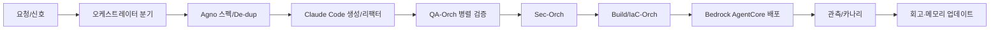
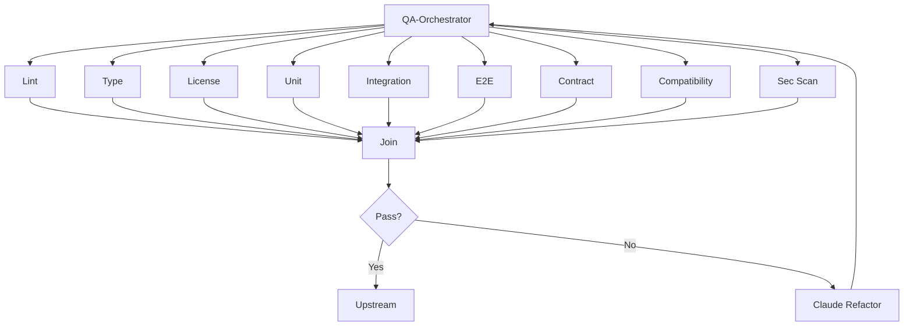

좋아 T! 아래는 \*\*AWS Agent Squad 운영 문서 초안(SQUAD-001)\*\*이야.
지금 우리가 만든 세 워크플로우(생성/업그레이드/자동진화)와 **완전히 호환**되게 설계했고, 말은 최대한 쉽게 풀었어. 그대로 캔버스에 붙여도 돼.

---

# AWS Agent Squad 운영 가이드 (SQUAD-001)

> 비유: **특공대 소팀**.
> 리더(오케스트레이터)가 임무를 쪼개서 지시하고, 각 분야 \*\*미니 전문가(에이전트)\*\*가 짧은 시간(5\~20분)에 딱 맡은 일만 끝낸 뒤 결과를 보고한다.
> **Bedrock AgentCore**는 현장 총무처럼 배포·권한·로그·비용·메모리를 책임진다.

---

## 0) 한 줄 요약

* **AI-First** 기본, **중복개발 금지(De-dup)** 준수, \*\*메모리 5종(O/A/S/U/OBS)\*\*를 안전하게 쓰는 **이벤트 기반 다중 에이전트 팀**.

---

## 1) Squad 구성(역할)

* **Leader**: 상위/하위 오케스트레이터(Top, Create/Upgrade/Auto-Evolve, QA/Sec/Build)
* **Specialists**: Agno(설계/에이전트 정의), Claude Code(코드/리팩터/테스트), DeDup-Checker, RuleKeeper(AI), PolicyEngine(결정형), Memory Curator, Observer(신호/지표)
* **Operator**: Bedrock AgentCore(배포·운영)

---

## 2) AWS 매핑(권장)

* **컴퓨트**: Lambda(기본), Fargate/ECS(긴 작업), Step Functions(고레벨 오케스트레이션)
* **이벤트/큐**: EventBridge(브로드캐스트), SQS(보장·재시도), SNS(알림)
* **스토리지**: S3(원본/아티팩트), DynamoDB(상태/레지스트리), OpenSearch/벡터DB(임베딩 검색)
* **관측**: CloudWatch Logs/Metrics, X-Ray(추적)
* **보안**: IAM, KMS, Secrets Manager
* **배포**: Bedrock AgentCore(서비스 운영), CDK(IaC), CodePipeline/Actions(CI/CD)
* **API**: API Gateway(외부 진입점), Feature Flags/Canary(릴리즈 채널)

---

## 3) 표준 메시지(작업 지시/결과)

```json
{
  "workflow_id": "wf_2025_0819_001",
  "task_id": "t_034",
  "agent_id": "qa_orch",
  "intent": "lint|type|contract|e2e|refactor|research|... ",
  "inputs": { "doc": "...", "repo": "git://...", "params": {...} },
  "policy": { "ai_mode": "auto|assist|off", "aifirst": true, "dedup": true },
  "trace_id": "tr_abc",
  "deadline_s": 1200
}
```

* **결과 이벤트**에는 `{status: pass|warn|block, reasons[], artifacts[], cost, tokens}` 포함.

---

## 4) 메모리 사용(AGCORE-001 연계)

| CTX         | 목적              | 예                   |
| ----------- | --------------- | ------------------- |
| **O-CTX**   | 의사결정·게이트 기록     | “G5 통과, 근거 링크 …”    |
| **A-CTX**   | 에이전트 개인 히스토리/캐시 | “이 스니펫은 실패 케이스 …”   |
| **S-CTX**   | 공용 요약·현재 맥락     | 다음 태스크가 읽는 한 페이지 요약 |
| **U-CTX**   | 사용자/팀 맥락        | 팀별 선호/금지 스택         |
| **OBS-CTX** | 로그·지표·이상        | 카나리 지표, 에러, 비용      |

* **MH-Gate**: 각 게이트 직전 De-dup/PII/권한/요약 최신화 자동 체크.

---

## 5) 게이트(공통 신호등)

* **G0 AIFIRST-001**: AI 기본, 예외 시 ADR
* **DD-Gate**: 신규 전 **유사도 검색≥0.85** 또는 **DEDUP-EXC ADR**
* **QA-Gate(병렬)**: 린트/타입/단위/통합/E2E/계약/호환성/보안 스캔
* **MH-Gate**: 메모리 위생(요약/라벨/권한/TTL)
* **Deploy-Gate**: 플래그/카나리/롤백 준비

---

## 6) Squad 수명주기(5\~20분 태스크)



---

## 7) 실패/복구

* **재시도/역추적**: SQS DLQ + X-Ray로 원인 추적
* **자동 수정**: RuleKeeper 제안 → Claude Code **Auto-Fix PR**
* **롤백**: 카나리 실패 → 즉시 트래픽 복귀, 런북 자동 실행
* **비용 초과**: 요약/샘플링/모델다운시프트

---

## 8) 보안·권한(쉬운 규칙)

* **최소권한(IAM)**: 에이전트별 역할 분리, ABAC 태그
* **암호화(KMS)**: 저장/전송 모두
* **비밀**: Secrets Manager, 커밋/로그 노출 시 즉시 차단
* **데이터 경계**: PII/규정 데이터는 필요 시 **비-AI 경로** + ADR

---

## 9) 관측·지표

* **SLI/SLO**: Lead Time, QA 1회 통과율, 회귀율, 비용/1k tokens, 카나리 실패율
* **대시보드**: 워크플로우별 통과율/비용 Top-N/실패 사유 Top-N

---

## 10) 레지스트리(Agent Registry)

* `name, version, inputs/outputs, policies, memory, tests, owner, tags`
* **버전 규칙**: MAJOR(계약 변경) / MINOR(기능추가) / PATCH(버그·성능·보안)
* **호출 규약**: `run(input)->output`, 타임아웃/재시도/멱등키(idempotency\_key)

---

## 11) 스쿼드 스펙 예시(YAML)

```yaml
squad: "create_workflow_squad"
leader: "create_orchestrator"
members:
  - name: agno
    role: spec_designer
  - name: claude_code
    role: codegen_refactor
  - name: qa_orch
    role: quality_parallel
  - name: sec_orch
    role: security_scan
  - name: build_orch
    role: build_iac
  - name: rulekeeper
    role: policy_ai
  - name: policy_engine
    role: policy_hard
policies:
  ai_first: true
  dedup_required: true
  mh_gate: true
memory:
  read: [S-CTX, U-CTX]
  write: [O-CTX, A-CTX, S-CTX]
release:
  flags: ["CREATE_V1"]
  canary: true
```

---

## 12) Day-0 착수 체크리스트

* [ ] **Agent Registry**: DynamoDB 테이블 + 스키마 키 정의
* [ ] **메시지 스키마**: JSON 스펙/검증 함수, 멱등키 적용
* [ ] **오케스트레이션**: Step Functions 템플릿(직렬/병렬)
* [ ] **큐/버스**: SQS(재시도/ DLQ), EventBridge(브로드캐스트)
* [ ] **IaC(CDK)**: Dev/Stg/Prod 스택 + 플래그/카나리 리소스
* [ ] **관측**: 로그/메트릭/트레이스 + 비용 지표 대시보드
* [ ] **가드레일**: AIFIRST-001/ DD-Gate/ MH-Gate 통합 체크
* [ ] **런북**: 배포/롤백/장애/보안사고 대응 템플릿

---

## 13) 보너스: QA-오케 병렬 내부



---

## 14) 자주 하는 질문(초간단)

* **Q. 왜 Lambda가 기본?**
  A. 5\~20분 태스크에 맞고, 자동 확장/과금이 단순. 긴 작업은 Fargate/ECS로.
* **Q. 외부 AI 못 쓰면?**
  A. PolicyEngine이 감지 → **AIFIRST-EXC ADR**로 온프레/결정형 경로로 전환.
* **Q. 중복 막는 건 누가?**
  A. **DeDup-Checker(AI)** + **DD-Gate** + **RuleKeeper**가 함께.

---

원하면 이 문서를 **새 캔버스**로 만들어두고, 세 워크플로우 문서에서 “참고/부록”으로 링크해줄게.
