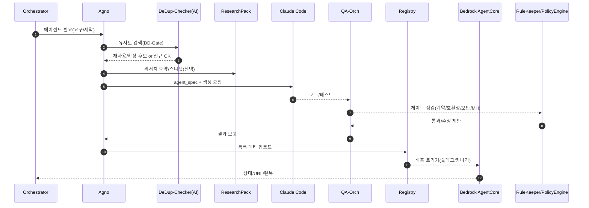

좋아 T! 아래는 **그대로 캔버스에 붙여 넣어도 되는** 초안이야.
톤은 지금까지의 문서들과 맞췄고, 쉬운 비유 + 5\~20분 태스크 + 게이트/규칙(💡AIFIRST-001, DD-Gate, MH-Gate, RuleKeeper/PolicyEngine)까지 포함했어.

---

# Agno 운영 가이드 (AGNO-001)

> 비유: **Agno = 채용·설계 매니저**. “어떤 일을 할 ‘미니 전문가(에이전트)’가 필요해요”가 들어오면,
> ① 필요 역량을 정의하고 → ② 중복 여부를 확인하고(재사용/확장/리팩터 우선) → ③ **Claude Code**에게 구현을 맡겨 코드/테스트를 만들고 → ④ **Agent Registry**에 등록 → ⑤ **Bedrock AgentCore**로 배포까지 연결한다.

---

## 0) 핵심 역할(한 줄)

* **설계·정의(Design)**: 필요한 에이전트의 역할·입출력·규칙을 명확히 문서화
* **중복 금지(De-dup)**: 기존 자산과의 **유사도 검색**으로 재사용 우선
* **구현 위임(Code Gen)**: **Claude Code**에게 스캐폴딩/코드/테스트 생성 요청
* **검증·등록(Validate & Register)**: QA 게이트 통과 후 **Agent Registry** 등록
* **운영 연결(Ops)**: **Bedrock AgentCore** 배포/권한/관측 훅 체결

---

## 1) 호출되는 순간(어디서 Agno를 쓰나)

* **신규 생성**: “새 일감이 필요” → 에이전트 스펙 정의부터
* **요청 기반 업그레이드**: 변경 계획 중 “새/개선된 에이전트 필요”
* **자동 진화**: 신호→가설 단계에서 “실험을 위한 보조 에이전트 필요”

> 항상 **AIFIRST-001** 적용: 기본 AI 사용, 비-AI 예외면 ADR 필수.

---

## 2) 입력/출력 계약(I/O Contract)

### 입력 (요약)

* `intent`: create|upgrade|evolve
* `capability`: 필요한 능력(자연어)
* `constraints`: 보안/리전/비용/마감/모델 제한
* `io`: 입력 스키마/출력 스키마(대략→점진정밀화)
* `policy`: AIFIRST/De-dup/MH-Gate 강제 옵션

### 출력 (요약)

* `agent_spec.yaml` (정의서)
* `scaffold/` (초기 코드·테스트)
* `qa_report.json` / `security_report.json`
* `registry_entry.json` (등록 메타)
* `runbook.md` (운영 가이드 요약)

#### 예시: `agent_spec.yaml`

```yaml
name: text_summarizer_v1
purpose: 긴 문서를 5~7문장으로 요약
inputs:
  - id: doc_text
    type: string
outputs:
  - id: summary
    type: string
non_functionals:
  latency_p95_ms: 800
  cost_per_1k_tokens_max_usd: 0.02
policies:
  ai_first: true
  dedup_required: true
  pii_allowed: false
memory:
  read: [S-CTX, U-CTX]
  write: [A-CTX, S-CTX]
tools:
  - name: embedding_search
tests:
  - id: tc_001_basic
    type: unit
  - id: contract_v1
    type: contract
deployment:
  stage: dev
  canary: true
  feature_flag: SUMM_V1
```

---

## 3) 수명주기(Lifecycle) — 5\~20분 태스크

```mermaid
flowchart LR
  A[요청/신호] --> B[요구 해석]
  B --> C[De-dup 유사도 검색(DD-Gate)]
  C -->|재사용/확장| R[등록부 매핑]
  C -->|신규 필요| D[agent_spec 작성]
  D --> E[Research Pack(ERP/URP) 참조]
  E --> F[Claude Code 생성 요청]
  F --> G[QA-Orch 병렬 검증]
  G -->|Pass| H[Registry 등록]
  H --> I[Bedrock AgentCore 배포]
  G -->|Fail| Fix[Claude Refactor] --> G
  I --> M[관측/런북/메모리 큐레이션]
```

**태스크 체크리스트(예시)**

* [ ] 요구 요약(5m) → 스펙 초안 키워드 추출
* [ ] **유사도 검색(10m)**: 템플릿/스니펫/기존 에이전트(임계값 0.85)
* [ ] 재사용/확장/리팩터 결정(5m) — 신규면 `agent_spec.yaml` 초안(10m)
* [ ] 리서치 팩 스캔(10m) — 핵심 스니펫/주의점 반영
* [ ] Claude Code 요청(5m) → 스캐폴딩/테스트 생성
* [ ] QA 병렬(15m): 린트/타입/단위/계약/호환성/보안 스캔
* [ ] 실패 시 Refactor 루프(10m)
* [ ] Registry 등록(5m) → Bedrock 배포 훅 연결(5m)
* [ ] 메모리 정리(O/S/A-CTX) & 런북 요약(10m)

---

## 4) 게이트 통합(신호등)

* **G0: AIFIRST 체크** — 예외면 ADR 필수
* **DD-Gate: 중복개발 금지** — 유사도 통과 or **DEDUP-EXC ADR**
* **Spec-Gate:** `agent_spec.yaml` 필수 항목 충족(입출력/비기능/정책/메모리/테스트)
* **QA-Gate:** 병렬 테스트/스캔 통과(계약·호환성 포함)
* **MH-Gate:** 메모리 위생(De-dup 링크/PII 없음/요약 최신화)
* **Deploy-Gate:** 플래그/카나리/롤백 준비 확인

**감시 에이전트**

* **RuleKeeper(AI)**: 규칙 위반 설명/수정 제안/PR 보조
* **PolicyEngine(결정형)**: 하드가드레일 차단(비밀/정책/필수항목)

---

## 5) 레지스트리/버전/호환성

* **Agent Registry 항목(필수)**:
  `name, version(semver), inputs/outputs, policies, memory, tests, flags, owner, tags`

* **버전 규칙**

  * `MAJOR`: 계약(입출력) 깨짐 → **호환성 테스트 강제**
  * `MINOR`: 기능 추가(계약 유지)
  * `PATCH`: 버그/성능/보안

* **호환성 수칙**

  * **Contract Tests**로 기존 호출자 보호
  * `feature_flag`로 점진 전환(카나리)

---

## 6) 메모리 사용(AGCORE-001과 연동)

* **읽기**: S-CTX(공용 맥락), U-CTX(사용자 특화)
* **쓰기**: A-CTX(개인 히스토리), S-CTX(요약)
* **큐레이션**: 요약/라벨/중복제거 → 카탈로그 업데이트
* **MH-Gate**로 PII/비밀/권한/TTL 점검(통과 못 하면 자동 중단)

---

## 7) 실패·롤백 시나리오(짧게)

* **Spec-Gate 실패**: 필수 항목 자동 채우기 질문(폼) 생성 → 재시도
* **QA 실패**: Claude Refactor 루프(N회) → N+1회 실패 시 **보류** 태스크
* **배포 실패**: 자동 롤백 + 런북 절차 실행 + 원인 태깅
* **비용 초과**: 요약/샘플링 전환, 모델/프롬프트 다운시프트

---

## 8) 운영 지표(SLO 예시)

* **TTC(초안→등록)**: ≤ 60분(소형)
* **QA 1회 통과율**: ≥ 70%
* **재사용률(De-dup)**: ≥ 40%
* **회귀율**: ≤ 2%/주
* **비용/1k 토큰**: 스펙 상한 준수율 ≥ 95%

---

## 9) 시퀀스 다이어그램



---

## 10) 운영 템플릿(복붙용)

* **`adr/AGNO-EXC-YYYYMMDD.md`**: AIFIRST/DEDUP 예외 사유(기간 2주)
* **`specs/<agent_name>/agent_spec.yaml`**: 위 예시 필드
* **`runbook.md`**: 배포/롤백/모니터링/알람
* **`registry_entry.json`**: 레지스트리 등록 메타
* **`tests/contract_*.yaml`**: 계약/호환성 테스트 정의

---

## 11) Day-0 착수 체크리스트(5\~20분)

* [ ] `specs/` 폴더/스키마 생성(10m)
* [ ] De-dup 검색 스크립트 연결(10m)
* [ ] agent\_spec 템플릿(언어별) 3종 배치(10m)
* [ ] Claude Code 요청 래퍼 함수 준비(5m)
* [ ] QA-Orch 파이프라인 훅(fan-out/fan-in) 연결(15m)
* [ ] Registry & AgentCore 연동 더미 배포(10m)
* [ ] RuleKeeper/PolicyEngine 체크리스트 통합(10m)

---

원하면 이 **AGNO-001**을 새로운 캔버스 문서로 추가하거나, 기존 문서(생성/업그레이드/자동진화)의 **부록**으로 링크해줄게.
