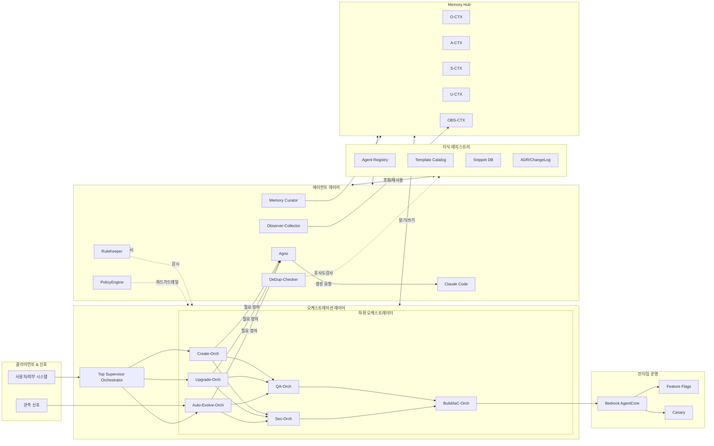
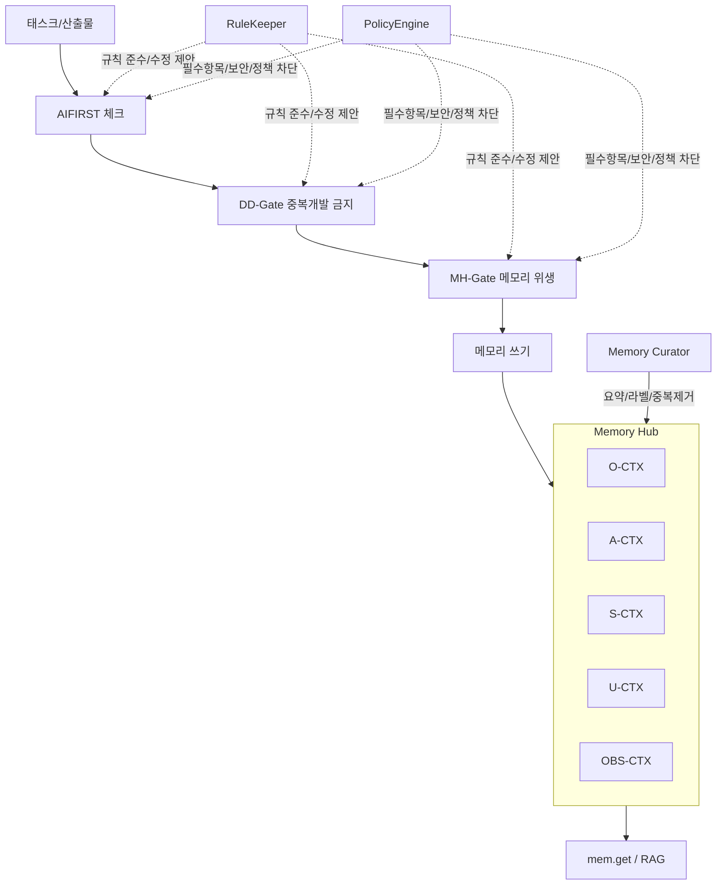
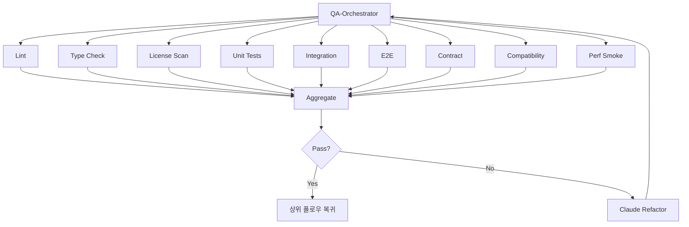

좋아 T! **전체 아키텍처**를 한눈에 볼 수 있게 머메이드로 3개 뷰를 준비했어.
(그대로 복붙해서 미리보기 하면 돼.)

# 1) 시스템 전체 아키텍처(컴포넌트 뷰)

# 2) 메모리 & 가드레일(AGCORE-001, AIFIRST/De-dup/MH-Gate)

# 3) QA-Orchestrator 내부 병렬(팬아웃/팬인)

원하면 세 문서(생성/업그레이드/자동진화) **부록 섹션**에 그대로 붙여넣을 수 있게 제목만 달아서 넣어둘게.
