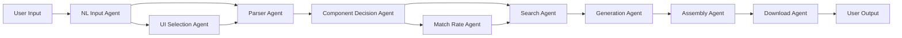

# Current Agent Dependencies Analysis

## Executive Summary
The T-Developer MVP implements a sophisticated 9-agent pipeline with standardized interfaces and comprehensive modular architecture. All agents inherit from `UnifiedBaseAgent` and use consistent input/output patterns.

## 1. Agent Inventory

### Core Pipeline Agents (9)
| Agent | Location | Status | Lines of Code | Module Count |
|-------|----------|--------|---------------|--------------|
| NL Input | `/unified/nl_input/` | ✅ Production | ~800 | 10 modules |
| UI Selection | `/unified/ui_selection/` | ✅ Production | ~700 | 12 modules |
| Parser | `/unified/parser/` | ✅ Production | ~750 | 12 modules |
| Component Decision | `/unified/component_decision/` | ✅ Production | ~900 | 12 modules |
| Match Rate | `/unified/match_rate/` | ✅ Production | ~850 | 12 modules |
| Search | `/unified/search/` | ✅ Production | ~950 | 12 modules |
| Generation | `/unified/generation/` | ✅ Production | ~1200 | 12 modules |
| Assembly | `/unified/assembly/` | ✅ Production | ~1100 | 12 modules |
| Download | `/unified/download/` | ✅ Production | ~500 | 4 modules |

### Security & Testing
- **Security**: Integrated into Assembly Agent (`security_scanner.py`)
- **Testing**: Integrated into Generation Agent (`testing_generator.py`)

## 2. Dependency Map

### Sequential Dependencies


### Data Flow Matrix

| Source Agent | Target Agent | Data Transferred | Interface Type |
|--------------|--------------|------------------|----------------|
| User | NL Input | Raw text requirements | String |
| NL Input | UI Selection | `requirements`, `project_type`, `entities` | AgentResult |
| NL Input | Parser | `requirements`, `extracted_entities` | AgentResult |
| UI Selection | Parser | `framework`, `ui_library` | AgentResult |
| Parser | Component Decision | `parsed_requirements`, `specifications` | AgentResult |
| Component Decision | Match Rate | `components`, `architecture` | AgentResult |
| Component Decision | Search | `components`, `technology_stack` | AgentResult |
| Match Rate | Search | `match_scores`, `recommendations` | AgentResult |
| Search | Generation | `search_results`, `selected_components` | AgentResult |
| Generation | Assembly | `generated_files`, `project_structure` | AgentResult |
| Assembly | Download | `package_path`, `validation_report` | AgentResult |

### Cross-Agent Dependencies

#### Shared Infrastructure Dependencies
```yaml
All Agents:
  - base/unified_base_agent.py  # Base class
  - data_wrapper.py             # Input/output wrapping
  - input_handler.py            # Input processing
  - fallback_wrapper.py         # Error handling

Framework Dependencies:
  - framework/core/interfaces.py     # Core interfaces
  - framework/core/agent_types.py    # Type definitions
  - framework/communication/         # Inter-agent communication
```

## 3. Common Interfaces

### Base Agent Interface
```python
class UnifiedBaseAgent(Phase2BaseAgent, ABC):
    """All agents implement this interface"""
    
    async def process(
        self, 
        input_data: Union[Dict, AgentInput]
    ) -> AgentResult
    
    async def _process_internal(
        self, 
        input_data: Dict, 
        context: AgentContext
    ) -> Dict
    
    async def _custom_initialize(self) -> None
    
    async def health_check(self) -> Dict[str, Any]
```

### Standard Data Structures

#### Input Structure
```python
@dataclass
class AgentInput:
    data: Dict[str, Any]
    context: AgentContext
    metadata: Dict[str, Any] = field(default_factory=dict)

@dataclass
class AgentContext:
    pipeline_id: str = ""
    project_id: str = ""
    timestamp: str = ""
    user_id: Optional[str] = None
    session_id: Optional[str] = None
```

#### Output Structure
```python
@dataclass
class AgentResult:
    success: bool
    data: Dict[str, Any]
    error: Optional[str] = None
    metadata: Dict[str, Any] = field(default_factory=dict)
    timestamp: str = field(default_factory=lambda: datetime.utcnow().isoformat())
```

### Enhanced Result Classes (Agent-Specific)

#### NL Input Result
```python
class EnhancedNLResult(AgentResult):
    requirements: List[str]
    project_type: str
    extracted_entities: Dict[str, List[str]]
    confidence_score: float
```

#### Generation Result
```python
class EnhancedGenerationResult(AgentResult):
    generated_files: Dict[str, str]
    project_structure: Dict
    total_files: int
    generation_metadata: Dict
```

## 4. Module Dependencies

### Module Dependency Graph
```
Common Module Types:
├── Analyzers (5 agents)
│   ├── intent_analyzer.py
│   ├── requirement_analyzer.py
│   └── tech_stack_analyzer.py
├── Generators (4 agents)
│   ├── code_generator.py
│   ├── documentation_generator.py
│   └── testing_generator.py
├── Validators (6 agents)
│   ├── validation_engine.py
│   ├── requirement_validator.py
│   └── compatibility_validator.py
├── Optimizers (4 agents)
│   ├── performance_optimizer.py
│   ├── cost_optimizer.py
│   └── layout_optimizer.py
└── Cache Managers (3 agents)
    └── cache_manager.py
```

### Module Sharing Matrix

| Module Type | NL | UI | Parser | CD | MR | Search | Gen | Asm | DL |
|------------|----|----|--------|----|-------|--------|-----|-----|----|
| Analyzer | ✓ | ✓ | ✓ | ✓ | ✓ | | | | |
| Generator | | | | ✓ | | | ✓ | | |
| Validator | ✓ | | ✓ | | | | ✓ | ✓ | |
| Optimizer | | ✓ | | ✓ | | ✓ | ✓ | ✓ | |
| Cache | | | | | | ✓ | ✓ | | |
| Security | | | | | | | | ✓ | ✓ |

## 5. External Dependencies

### AI/ML Services
```yaml
NL Input Agent:
  - OpenAI API (GPT-4)
  - Anthropic API (Claude)
  
Generation Agent:
  - OpenAI Codex
  - AWS Bedrock
  
Search Agent:
  - Elasticsearch (if configured)
  - Vector DB for semantic search
```

### AWS Services
```yaml
All Agents:
  - AWS CloudWatch (logging)
  - AWS X-Ray (tracing)
  
Download Agent:
  - AWS S3 (file storage)
  - AWS CloudFront (CDN)
  
Assembly Agent:
  - AWS Lambda (validation jobs)
```

### Framework Dependencies
```yaml
Core:
  - Agno Framework (agent creation)
  - AWS Bedrock AgentCore (runtime)
  - AWS Agent Squad (orchestration)
  
Libraries:
  - asyncio (async processing)
  - dataclasses (data structures)
  - typing (type hints)
```

## 6. Communication Patterns

### Synchronous Communication
- Direct method calls within same process
- Request-response pattern between agents
- Blocking calls for critical paths

### Asynchronous Communication
- All agent `process()` methods are async
- Parallel module execution within agents
- Non-blocking I/O for external services

### Event-Driven Communication
```python
# Event bus integration (framework/communication/event_bus.py)
EventTypes:
  - AGENT_STARTED
  - AGENT_COMPLETED
  - AGENT_FAILED
  - DATA_PROCESSED
  - CACHE_HIT/MISS
```

## 7. Error Handling Dependencies

### Fallback Chain
```
Primary Execution
    ↓ (on failure)
Fallback Wrapper
    ↓ (on failure)
Agent-Specific Fallback
    ↓ (on failure)
Default Response
```

### Error Propagation
- Errors wrapped in `AgentResult` with `success=False`
- Error metadata preserved through pipeline
- Graceful degradation at each stage

## 8. Performance Dependencies

### Caching Dependencies
```yaml
Cache Implementations:
  Search Agent:
    - Query result caching
    - Semantic search caching
    
  Generation Agent:
    - Template caching
    - Code snippet caching
    
  Match Rate Agent:
    - Score calculation caching
```

### Resource Dependencies
```yaml
Memory Intensive:
  - Generation Agent (1-2GB)
  - Assembly Agent (500MB-1GB)
  
CPU Intensive:
  - Match Rate Agent (scoring algorithms)
  - Search Agent (ranking algorithms)
  
I/O Intensive:
  - Download Agent (file operations)
  - Assembly Agent (file packaging)
```

## 9. Configuration Dependencies

### Environment Variables
```yaml
Required:
  - OPENAI_API_KEY
  - ANTHROPIC_API_KEY
  - AWS_REGION
  - ENVIRONMENT (dev/staging/prod)
  
Optional:
  - CACHE_ENABLED
  - LOG_LEVEL
  - MAX_RETRIES
```

### Configuration Files
```yaml
Agent-Specific:
  - generation/config.yaml
  - search/elasticsearch.yaml
  - assembly/validation_rules.yaml
```

## 10. Testing Dependencies

### Unit Test Dependencies
- Each agent has corresponding test file
- Mock implementations for external services
- Fixture data for each agent type

### Integration Test Dependencies
- End-to-end pipeline tests
- Agent communication tests
- Performance benchmarks

## Summary

### Key Findings
1. **High Cohesion**: Agents are well-encapsulated with clear responsibilities
2. **Loose Coupling**: Standardized interfaces minimize direct dependencies
3. **Reusability**: Significant module sharing across agents
4. **Extensibility**: Module architecture allows easy feature addition
5. **Fault Tolerance**: Comprehensive fallback mechanisms

### Dependency Metrics
- **Average dependencies per agent**: 3-4 other agents
- **Shared modules**: 40% of modules used by multiple agents
- **External service dependencies**: 5 major services
- **Framework dependencies**: 3 core frameworks

### Risk Areas
1. **Single Points of Failure**: 
   - AWS Bedrock availability
   - OpenAI/Anthropic API availability
   
2. **Performance Bottlenecks**:
   - Generation Agent (longest processing time)
   - Assembly Agent (I/O intensive)
   
3. **Complexity Hotspots**:
   - Generation Agent (most complex logic)
   - Search Agent (complex ranking algorithms)

---
*Generated: 2024-12-08*
*Version: 1.0.0*