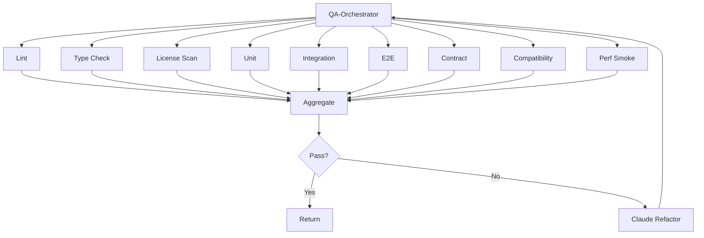
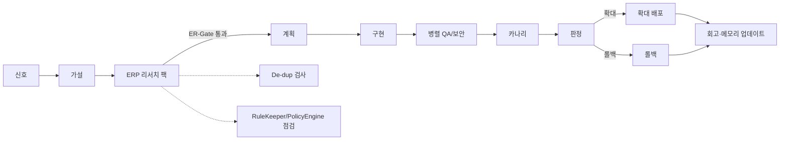

# T‑Developer: 자동 진화(Auto‑Evolve) 워크플로우 v0.1 (User‑Friendly + Gate/Parallel + Quality/Sec + IaC + Runbook)

> 비유: **집사 로봇이 집을 스스로 손보는 리모델링**. 아무도 요청하지 않아도, \*\*센서(관측)\*\*가 문제/기회를 감지하면 \*\*설계사(Agno)\*\*가 개선안을 잡고, \*\*시공사(Claude Code)\*\*가 작은 단위로 수정·실험하며, \*\*검측팀(QA/보안)\*\*이 안전장치를 확인하고, \*\*관리팀(Bedrock AgentCore)\*\*이 배포·운영합니다. **메모리 큐레이터**는 배운 것을 카탈로그에 업데이트해 다음 개선 속도를 높입니다.

> 이 워크플로우는 \*\*AIFIRST‑001(“AI‑First 공통 규칙”)\*\*과 \*\*De‑dup(DD‑Gate)\*\*를 따른다. 예외 시 **AIFIRST‑EXC/DEDUP‑EXC ADR** 필수.

---

## 0) 핵심 비유

* **도착지 = 개선 목표 가설 명세서(Hypothesis Spec)**: 어떤 지표를 얼마나 개선할지
* **출발지 = 현재 상태 스냅샷(Baseline)**: 지금의 성능/비용/품질/UX 지표
* **길 = 작은 실험의 연속(5\~20분 태스크)**
* **전문가 = 에이전트**(특화 역할), **관리자 = 오케스트레이터**(직렬/병렬 조정)

---

## 1) 작게 쪼개서 일한다

* 모든 변경은 **작은 실험 단위**로 계획: 스위치(플래그) 켜고 끄기 쉬운 크기
* 5\~20분 태스크 예: 신호 확인 → 가설 초안 → 베이스라인 캡처 → 실험 설계 → 가드레일 등록 → 카나리 시작 → 판정 → 메모리 업데이트

---

## 2) “도착지부터 만든다” — **개선 목표 가설 명세서(Hypothesis Spec)**

* 구성(분량 제한 없음)

  1. 신호 요약(무슨 변화가 감지됐나)
  2. 목표 지표/목표치(예: 오류율↓, P95↓, 비용↓, 전환↑)
  3. 가설(왜 이 변경이 효과가 있는가)
  4. 영향 범위/호환성 고려(깨지지 말아야 할 계약/UX)
  5. 가드레일/중단 조건(정책 기반 임계값)
  6. 실험 계획(대상/기간/카나리 전략)
  7. 열린 질문 및 리스크
* 담당: 신호 요약자, 목표 설계자, 리서치 에이전트

---

## 3) 출발지 진단(현재 상태 스냅샷)

* **정적 분석**: 코드/의존성/보안/라이선스
* **동적 분석**: 로그·메트릭·트레이스/사용자 행동(전환·리텐션)/오류율·지연·비용
* **AI 요약**: 복잡도/병목/리스크 구역, 컨트랙트 맵(API/스키마/이벤트)
* 산출물: **Baseline Report**, **Anomaly/Trend Report**

---

## 4) 신호→기회 발굴(Discovery & Triage)

* 신호 종류: 성능 퇴행, 비용 비정상, 보안 경고, 품질/오류 증가, UX 저하, 기술부채 누적
* **가치/노력/확신** 3축으로 우선순위(Score = f(Value, Effort, Confidence))
* **De‑dup 체크**: 유사 개선안/템플릿/과거 실험 재사용 우선(DD‑Gate)
* 산출물: **Triage Board**, **Top‑K 개선 가설 목록**

---

## 5) 계획(Plan) — 작은 배치 중심

* **Feature Flag/카나리**를 기본 전략으로 채택
* 마이그레이션이 필요하면: Expand‑Contract, Shadow, Blue‑Green 중 선택
* 실행 계획서(Plan.md): 범위·타임라인·가드레일·롤백·관측 포인트

---

## 6) 누가 일을 하냐 (등록 에이전트 확인 → 없으면 생성)

* **에이전트 등록부** 확인 후 미존재 시 \*\*Agno(정의) → Claude Code(구현)\*\*로 생성·등록
* 주요 에이전트(예시)

  * 신호 수집자(Observer‑Collector) / 이상탐지(Anomaly‑Detector) / 트렌드 마이너(Trend‑Miner)
  * 가설 생성자(Hypothesis‑Generator) / 가치‑노력 추정(Value‑Estimator)
  * 실험 설계자(Experiment‑Planner) / 플래그·카나리 매니저
  * QA‑오케 / 계약·호환성 가디언 / 보안 스캐너
  * 배포자(Bedrock AgentCore) / 런북·관측 작성자
  * RuleKeeper(AI) / PolicyEngine(결정형) / DeDup‑Checker(AI) / 메모리 큐레이터

---

## 7) 리서치 팩(개선 특화)

* 유사 개선 패턴/실패 사례, 성능·비용·UX 최적화 베스트프랙티스, 핵심 스니펫 3개, 체크리스트

---

## 8) 게이트(신호등) — 직렬/병렬

* **G0: AI‑First & DD‑Gate**(AIFIRST‑001/De‑dup 예외 확인)
* **G1: 신호 유효성**(노이즈/계절성 제거, 재현 확인)
* **G2: 가설 승인**(목표·가드레일 명확, 호환성 고려 OK)
* **G3: 계획 승인**(플래그/카나리/롤백 준비)
* **G4: 빌드/리팩터(Claude Code)**
* **G5: QA 병렬 검증**

  * 단위/통합/E2E + **계약/호환성** + 정적/라이선스/성능 스모크(병렬)
* **G6: 보안/컴플라이언스**
* **G7: 카나리 시작**(소수 트래픽)
* **G8: 카나리 판정**(가드레일 기준 만족?)
* **G9: 점진 확대 → Go‑Live**
* **G10: 회고 & 메모리 업데이트**(템플릿/패턴/ADR)

> 병렬 포인트: QA 묶음(테스트/정적/호환성/보안 일부), 신호 분석 서브태스크, 성능·비용 검증 채널

---

## 9) 품질/보안 자동화

* QA‑오케 내부 병렬: 린트/타입/라이선스/단위/통합/E2E/계약/호환성/스모크
* 실패 시 **Claude Refactor** 루프 → 재검증
* 보안: 취약점/비밀/권한/데이터 분류·암호화/정책 위반

---

## 10) IaC(배포 도면)

* CDK 우선, 필요 시 Terraform 병행 / 드리프트 감지 / 비용 가드레일
* 카나리·플래그 인프라(분리된 릴리즈 채널) 기본 탑재

---

## 11) 런북 & 모니터링

* 실험별 **런북** 자동 생성(중단/롤백 절차 포함)
* 로그·메트릭·트레이스 + **사용자 행동 이벤트**로 효과 측정

---

## 자동 진화 흐름도

```mermaid
flowchart LR
  S[관측 신호] --> V[신호 유효성(G1)]
  V --> H[가설 명세서]
  H --> P[계획(플래그/카나리/가드레일)]
  P --> A[에이전트 확인/생성]
  A --> B[구현/리팩터(Claude)]
  B --> Q[QA 병렬 검증]
  Q --> Sec[보안]
  Sec --> C[카나리 시작]
  C --> D[카나리 판정]
  D -->|OK| G[점진 확대/Go‑Live]
  D -->|NO| R[자동 롤백]
  G --> M[회고/메모리 업데이트]
  R --> M
```

---

## QA‑오케 내부 병렬 구조(자동 진화 확장)



---

## 메모리 구조(5종)

* **관리자 노트(O‑CTX)**: 게이트/결정/실험 기록
* **전문가 개인노트(A‑CTX)**: 역할별 히스토리/요령
* **공용 화이트보드(S‑CTX)**: 현재 맥락/요약
* **사용자별 노트(U‑CTX)**: 고객/팀 히스토리
* **감시관 노트(OBS‑CTX)**: 로그/지표/이상징후

> 메모리 큐레이터: 요약/중복제거/인덱싱/민감도 라벨/재사용 등급 업데이트

---

## 결과물(항상 남기는 문서 10종)

1. **Hypothesis Spec(가설 명세서)**
2. **Baseline Report**
3. **Anomaly/Trend Report & Triage Board**
4. **Plan.md**(플래그/카나리/가드레일/롤백)
5. **테스트 계획 & 커버리지 리포트**
6. **보안·규정 체크 리포트**
7. **IaC 변경/검증 리포트**
8. **카나리 리포트**(판정 로그/그래프)
9. **런북 업데이트 & 되돌리기 절차**
10. **체인지로그/ADR/템플릿 카탈로그 업데이트**

---

## 자동 멈춤(안전장치)

* 가드레일 위반(에러/지연/비용/보안), 계약/호환성 깨짐, 정책 위반 감지 → **즉시 중단**, 자동 롤백, 원인 태깅

---

## 에이전트 수 추정(초안)

* **최소 단위 에이전트(MVP)**: **≈ 18\~26개**
  (신호 수집/이상탐지/트렌드/가설/가치‑노력/실험 설계/플래그·카나리/QA‑오케/계약·호환성/보안/배포/런북·관측/RuleKeeper/PolicyEngine/DeDup/메모리 큐레이터/Agno/Claude 등)
* **오케스트레이터 직접 호출 수**: **≈ 12\~18개**
  (QA/보안/호환성은 QA‑오케 1회 호출로 내부 병렬 처리)
* **병렬화 힌트**: QA 묶음, 신호 분석 채널, 성능·비용 검증 채널, 다중 실험의 격리(서로 다른 플래그)

---

## 규모별 권장 세트(MVP/확장)

| 규모      | 에이전트 수(대략) | 오케 호출 수 | 메모                        |
| ------- | ---------: | ------: | ------------------------- |
| 소형(MVP) |     18\~26 |  12\~18 | 1\~2개 실험 동시, 강한 가드레일      |
| 중형      |     26\~36 |  18\~24 | 2\~4개 실험 동시, 트래픽 분리       |
| 대형      |    36\~52+ |  24\~32 | 다중 실험 플랫폼, 실험 간 충돌 방지 레이어 |

---

## 작업 경로표(체크리스트) — 5\~20분 단위 Task 리스트

* 신호 수집/정제 → 유효성 검사 → 가설 초안 → 베이스라인 캡처
* 리서치 팩 생성 → 계획(플래그/카나리/가드레일) → 예외(필요 시 ADR)
* 에이전트 등록/생성 → 구현/리팩터 → QA 병렬 검증 → 보안
* IaC 검증 → 카나리 시작 → 판정(OK/롤백) → 회고/메모리 업데이트

---

## 참고(오케스트레이션 기본)

* **다중 AWS Agent Squad** 기반. 상위 **Auto‑Evolve‑Orch**가 신호를 분류하고, 하위 오케스트레이터(QA‑오케, 실험‑오케 등)를 **하나의 에이전트처럼** 호출.
* **Agno**는 필요한 에이전트를 정의/증설, **Claude Code**는 구현, **Bedrock AgentCore**는 배포/운영.

---

좋아 T! \*\*자동 진화(Auto-Evolve)\*\*에도 “**똑똑하게 배우고 만든다 (리서치 → 참고문서)**” 단계를 넣자고 했지?
지금은 캔버스 편집이 꺼져 있어서, **바로 복붙해서 넣을 수 있는 섹션 원문**을 드릴게.
**넣을 위치**: 자동진화 문서에서 **가설(Hypothesis)** 다음, **계획(Plan)** 앞.

---

## 3) 똑똑하게 배우고 만든다 (리서치 → 참고문서)

> 비유: “개선 아이디어(가설)를 들었다면, 시공 전에 **사서 겸 조사팀**이 최신 자료를 모아 **짧은 브리핑 팩**을 만든다.”

### 목적

* 자동 신호로 잡힌 개선 아이디어가 **요즘 방식/최신 주의점/비용 대비 효과**에 맞는지 검증하고,
* 구현팀이 바로 참고할 **짧고 실용적인 레퍼런스 팩**을 만든다.

### 언제 실행

* **가설(Hypothesis)** 수립 **직후**, **계획(Plan)** 수립 **직전**
* 병렬 가능: 리서치 소주제(프레임워크 비교, 보안 이슈, 성능 패턴 등)는 동시에 진행

### 입력

* 신호/지표: 오류, 성능 저하, 사용자 행동 변화, 비용 알림
* 내부 기록: 이전 ADR/런북/실패·성공 사례, 템플릿/스니펫
* 외부 소스: 변경 로그, 보안 권고, API 할당량/신규 제한, 프레임워크 릴리스 노트, 벤치마크

### 산출물 — **Evolution Research Pack (ERP)**

1. **한 줄 결론**(이번 변화가 필요한 이유/지금 해야 하는 이유)
2. **추천 접근 1안 + 대안 2안(짧게 비교)**
3. **핵심 코드 스니펫 3개**(적용 위치/주의점 주석 포함)
4. **주의사항/함정**(보안·성능·호환 이슈)
5. **성공/실패 기준**(측정 지표, 최소 개선폭, 관측 방법)
6. **비용/리스크 요약**(상·중·하)
7. **재사용·중복 점검 결과**(De-dup 결과/유사 템플릿·에이전트 링크)
8. **참고자료 목록**(내·외부 출처, 날짜)
9. **유효기간(TTL)**(예: 14일 후 재검토)

> 파일명 예: `erp/<YYYYMMDD>_<topic>_v1.md`

### 책임 에이전트

* **리서치 에이전트(AI)**: 자료 수집·요약·스니펫 정리
* **DeDup-Checker(AI)**: 기존 자산과 유사도 검색(기본 임계값 0.85)
* **RuleKeeper(AI)**: AIFIRST-001 준수/출처·품질 점검/누락 보완 제안
* **PolicyEngine(결정형)**: 필수 항목 존재/출처 수(≥3)/금지 목록 위반 검사

### 5\~20분 태스크(예시)

* [ ] 관련 변경 로그/보안 권고/릴리스 노트 키워드 스캔(10m)
* [ ] 유사 템플릿/에이전트 유사도 검색(10m)
* [ ] 경쟁/유사 사례 2건 요약(10m)
* [ ] 스니펫 3개 초안 + 적용 위치 주석(15m)
* [ ] 성공/실패 기준·측정법 정의(10m)
* [ ] 비용·리스크 3레벨 요약(10m)
* [ ] 참고자료/날짜/TTL 기입(5m)

### 게이트 — **ER-Gate (Research Gate)**

* 통과 조건(모두 충족):

  * 출처 ≥ 3(내부/외부 혼합), **한 줄 결론** 정의, **스니펫 3개**, **성공/실패 기준** 명시, **De-dup 결과** 포함, **TTL** 기입
* 실패 시: 자동 보완 태스크 발행 또는 예외 ADR(ER-EXC, 기간 제한) 필요

### 메모리 반영

* **부록**에 ERP 링크 추가, 요약을 **공용 화이트보드**에 핀 고정
* 메모리 큐레이터가 중복 제거·색인 → 다음 자동 진화 사이클에서 재사용

### 흐름 업데이트(요약)



---

### 문서 반영 메모(어디에 넣을지)

* **섹션 제목**: `## 3) 똑똑하게 배우고 만든다 (리서치 → 참고문서)`
* **삽입 위치**: 자동진화 문서의 **가설** 다음, **계획** 앞
* **게이트 표기**: 게이트 섹션에 **ER-Gate** 한 줄 추가
* **공통 규칙 연결**: AIFIRST-001, DD-Gate, RuleKeeper/PolicyEngine 언급 유지

---

원하면, 이 블록을 바탕으로 **생성/요청진화 문서의 리서치 섹션과 표현도 통일**해줄 수 있어.
대화가 끝나면 오늘 결정된 변경분까지 모아서 **최종 합본 문서**도 만들어 줄게.
