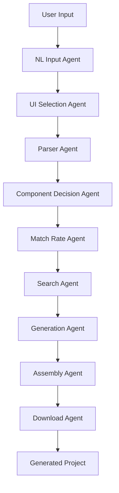

# T-Developer Complete Developer Guide

## Table of Contents

1. [Architecture Overview](#architecture-overview)
2. [Development Environment Setup](#development-environment-setup)
3. [9-Agent Pipeline Deep Dive](#9-agent-pipeline-deep-dive)
4. [Contributing Guidelines](#contributing-guidelines)
5. [Testing Framework](#testing-framework)
6. [Performance Optimization](#performance-optimization)
7. [Security Guidelines](#security-guidelines)
8. [Deployment Guide](#deployment-guide)
9. [Troubleshooting](#troubleshooting)
10. [Advanced Customization](#advanced-customization)

## Architecture Overview

T-Developer is built on a sophisticated 9-agent pipeline architecture that processes natural language inputs and generates production-ready applications.

### High-Level Architecture



### Core Components

#### 1. Master Orchestrator
The central coordinator managing the entire pipeline:

```python
# Location: src/orchestration/master_orchestrator.py
class MasterOrchestrator:
    async def execute_pipeline(self, user_input: str, context_data: Dict[str, Any]) -> Dict[str, Any]:
        # Coordinates all 9 agents
        # Handles error recovery and retries
        # Manages state and checkpoints
        # Collects performance metrics
```

#### 2. Performance Optimizer
Handles caching, profiling, and resource optimization:

```python
# Location: src/optimization/performance_optimizer.py
class PerformanceOptimizer:
    # Multi-level caching (memory + persistent)
    # Real-time performance profiling
    # Intelligent execution strategy selection
    # Resource usage optimization
```

#### 3. Security Layer
Comprehensive security scanning and validation:

```python
# Location: src/security/
- security_auditor.py      # Code security scanning
- infrastructure_security.py # AWS infrastructure audit
- input_validation.py      # Request validation
- rate_limiter.py         # API rate limiting
```

### Agent Framework

Each agent follows a consistent pattern:

```python
# Base agent structure
class BaseAgent:
    async def process(self, input_data: Dict[str, Any]) -> Dict[str, Any]:
        # Pre-processing
        # Core logic implementation
        # Post-processing
        # Result validation
        
    def _validate_input(self, data: Dict[str, Any]) -> bool:
        # Input validation logic
        
    def _generate_result(self, processed_data: Any) -> Dict[str, Any]:
        # Result generation
```

## Development Environment Setup

### Prerequisites
- Python 3.10+
- Node.js 18+
- Docker & Docker Compose
- AWS CLI configured
- Git

### Quick Setup

1. **Clone and Setup**
```bash
git clone https://github.com/t-developer-mvp/backend.git
cd backend

# Python environment
python -m venv venv
source venv/bin/activate  # On Windows: venv\Scripts\activate
pip install -r requirements.txt

# Install development tools
pip install -r requirements-dev.txt
pre-commit install

# Frontend setup
cd ../frontend
npm install
```

2. **Environment Configuration**
```bash
# Copy environment template
cp .env.example .env

# Required environment variables
export AWS_REGION=us-east-1
export AWS_ACCESS_KEY_ID=your_key
export AWS_SECRET_ACCESS_KEY=your_secret
export OPENAI_API_KEY=your_openai_key
export ANTHROPIC_API_KEY=your_anthropic_key
```

3. **Docker Development**
```bash
# Start all services
docker-compose up -d

# View logs
docker-compose logs -f backend

# Run tests
docker-compose exec backend pytest
```

### IDE Configuration

#### VS Code Settings
```json
{
  "python.defaultInterpreter": "./venv/bin/python",
  "python.linting.enabled": true,
  "python.linting.pylintEnabled": true,
  "python.formatting.provider": "black",
  "editor.formatOnSave": true,
  "editor.codeActionsOnSave": {
    "source.organizeImports": true
  }
}
```

#### PyCharm Settings
- Enable Black formatting
- Configure pytest as test runner
- Set up AWS toolkit
- Enable type checking with mypy

## 9-Agent Pipeline Deep Dive

### Agent 1: NL Input Agent
**Purpose**: Process natural language input and extract structured requirements

**Key Components**:
```python
# Location: src/agents/unified/nl_input/
- agent.py                 # Main agent
- modules/
  - requirement_extractor.py    # Extract requirements
  - intent_analyzer.py         # Analyze user intent
  - entity_recognizer.py       # NER for tech entities
  - context_enhancer.py        # Add contextual information
```

**Example Implementation**:
```python
class RequirementExtractor:
    def extract_requirements(self, text: str) -> List[Requirement]:
        # NLP processing using spaCy and custom models
        nlp = spacy.load("en_core_web_lg")
        doc = nlp(text)
        
        requirements = []
        for sent in doc.sents:
            if self._is_requirement(sent):
                req = self._parse_requirement(sent)
                requirements.append(req)
        
        return requirements
```

### Agent 2: UI Selection Agent  
**Purpose**: Select optimal UI framework and design system

**Advanced Features**:
- Framework compatibility analysis
- Performance prediction modeling
- Design system matching
- Responsive design planning

```python
class FrameworkSelector:
    def __init__(self):
        self.compatibility_matrix = {
            'react': {
                'strengths': ['component_reuse', 'ecosystem', 'performance'],
                'best_for': ['spa', 'complex_ui', 'large_teams'],
                'complexity_score': 7
            },
            'vue': {
                'strengths': ['learning_curve', 'documentation', 'flexibility'],
                'best_for': ['rapid_prototyping', 'small_teams'],
                'complexity_score': 5
            }
        }
    
    async def select_framework(self, requirements: List[str]) -> FrameworkChoice:
        # Multi-criteria decision analysis
        # Performance modeling
        # Team skill assessment
        return optimal_framework
```

### Agent 3: Parser Agent
**Purpose**: Parse requirements into structured project specification

**Implementation Highlights**:
```python
class SpecificationBuilder:
    async def build_specification(self, requirements: Dict[str, Any]) -> ProjectSpec:
        spec = ProjectSpec()
        
        # Parse API requirements
        spec.api = await self._parse_api_requirements(requirements)
        
        # Parse data model
        spec.data_model = await self._parse_data_requirements(requirements)
        
        # Parse business rules
        spec.business_rules = await self._extract_business_rules(requirements)
        
        return spec
```

### Agent 4: Component Decision Agent
**Purpose**: Make architectural decisions and select components

**Advanced Decision Making**:
```python
class ArchitectureSelector:
    def __init__(self):
        self.decision_tree = DecisionTree()
        self.load_decision_patterns()
    
    async def select_architecture(self, spec: ProjectSpec) -> Architecture:
        # Rule-based decision making
        # Machine learning predictions
        # Cost-benefit analysis
        # Scalability assessment
        
        factors = {
            'complexity': self._assess_complexity(spec),
            'scalability': self._predict_scaling_needs(spec),
            'team_size': spec.metadata.get('team_size', 1),
            'timeline': spec.metadata.get('timeline', 'medium')
        }
        
        return self.decision_tree.predict(factors)
```

### Agent 5: Match Rate Agent
**Purpose**: Calculate compatibility and success probability

**Matching Algorithms**:
```python
class SimilarityCalculator:
    def calculate_match_rate(self, requirements: List[str], template: Template) -> float:
        # TF-IDF similarity
        vectorizer = TfidfVectorizer()
        req_vector = vectorizer.fit_transform([' '.join(requirements)])
        template_vector = vectorizer.transform([template.description])
        
        # Cosine similarity
        similarity = cosine_similarity(req_vector, template_vector)[0][0]
        
        # Feature matching
        feature_match = self._calculate_feature_overlap(requirements, template)
        
        # Weighted combination
        return 0.6 * similarity + 0.4 * feature_match
```

### Agent 6: Search Agent
**Purpose**: Find optimal solutions and components

**Search Capabilities**:
```python
class SearchEngine:
    def __init__(self):
        self.trie_index = TrieIndex()  # For fast prefix searches
        self.semantic_index = SemanticIndex()  # For semantic similarity
        self.cache = SearchCache()
    
    async def search(self, query: SearchQuery) -> SearchResults:
        # Multi-stage search pipeline
        results = []
        
        # 1. Exact matches
        exact = await self.trie_index.exact_search(query.terms)
        results.extend(exact)
        
        # 2. Semantic search
        semantic = await self.semantic_index.semantic_search(query.vector)
        results.extend(semantic)
        
        # 3. Collaborative filtering
        collaborative = await self._collaborative_search(query.context)
        results.extend(collaborative)
        
        return self._rank_results(results, query)
```

### Agent 7: Generation Agent
**Purpose**: Generate actual project code and files

**Code Generation Pipeline**:
```python
class CodeGenerator:
    def __init__(self):
        self.template_engine = Jinja2Environment()
        self.code_validators = [
            SyntaxValidator(),
            SecurityValidator(),
            QualityValidator()
        ]
    
    async def generate_project(self, spec: ProjectSpec) -> GeneratedProject:
        project = GeneratedProject()
        
        # Generate project structure
        project.structure = await self._generate_structure(spec)
        
        # Generate source files
        for component in spec.components:
            code = await self._generate_component_code(component)
            validated_code = await self._validate_code(code)
            project.add_file(component.file_path, validated_code)
        
        # Generate configuration files
        project.configs = await self._generate_configs(spec)
        
        # Generate documentation
        project.docs = await self._generate_documentation(spec)
        
        return project
```

### Agent 8: Assembly Agent
**Purpose**: Assemble and validate complete project

**Assembly Pipeline**:
```python
class ProjectAssembler:
    async def assemble_project(self, generated_files: Dict[str, str]) -> AssembledProject:
        # File organization
        organized_files = await self._organize_files(generated_files)
        
        # Conflict resolution
        resolved_files = await self._resolve_conflicts(organized_files)
        
        # Dependency consolidation
        consolidated_deps = await self._consolidate_dependencies(resolved_files)
        
        # Build orchestration
        build_artifacts = await self._orchestrate_build(consolidated_deps)
        
        # Quality validation
        validated_project = await self._validate_quality(build_artifacts)
        
        return validated_project
```

### Agent 9: Download Agent
**Purpose**: Package and provide secure downloads

**Security Features**:
```python
class DownloadManager:
    async def prepare_download(self, project: AssembledProject) -> DownloadResult:
        # Security validation
        await self._security_scan(project)
        
        # Compression optimization
        optimized_package = await self._optimize_compression(project)
        
        # Secure token generation
        download_token = self._generate_secure_token()
        
        # Analytics tracking
        await self._track_download_request(download_token)
        
        return DownloadResult(
            token=download_token,
            package=optimized_package,
            expires_at=datetime.now() + timedelta(hours=24)
        )
```

## Contributing Guidelines

### Code Standards

#### Python Code Style
```python
# Follow PEP 8 with these specifics:
# - Line length: 88 characters (Black default)
# - Use type hints for all functions
# - Docstrings in Google format
# - Import organization with isort

def process_user_input(
    user_input: str, 
    context: Optional[Dict[str, Any]] = None
) -> ProcessingResult:
    """Process user input through NL pipeline.
    
    Args:
        user_input: Raw user input string
        context: Optional context information
        
    Returns:
        ProcessingResult with structured data
        
    Raises:
        ValidationError: If input is invalid
    """
```

#### TypeScript Code Style
```typescript
// Use strict TypeScript configuration
// Prefer interfaces over types for object shapes
// Use explicit return types for functions

interface ProjectConfig {
  readonly framework: Framework;
  readonly language: Language;
  readonly features: ReadonlyArray<Feature>;
}

async function generateProject(
  config: ProjectConfig
): Promise<GenerationResult> {
  // Implementation
}
```

### Testing Requirements

#### Test Coverage
- Minimum 80% code coverage
- All public methods must have tests
- Edge cases and error conditions covered

```python
# Example test structure
class TestNLInputAgent:
    @pytest.fixture
    def agent(self):
        return NLInputAgent()
    
    @pytest.fixture
    def sample_input(self):
        return {
            "user_input": "Create a React todo app",
            "context": {"user_id": "test123"}
        }
    
    async def test_process_valid_input(self, agent, sample_input):
        result = await agent.process(sample_input)
        
        assert result["success"] is True
        assert "requirements" in result
        assert "intent" in result
        assert result["intent"] == "create_web_application"
    
    async def test_process_invalid_input(self, agent):
        with pytest.raises(ValidationError):
            await agent.process({"user_input": ""})
```

### Pull Request Process

1. **Branch Naming**
```bash
# Feature branches
feature/agent-name-improvement
feature/add-vue-support

# Bug fixes  
fix/parser-error-handling
fix/security-vulnerability

# Documentation
docs/api-documentation-update
```

2. **Commit Messages**
```bash
# Follow conventional commits
feat(nl-input): add multilingual support for Spanish and French
fix(generation): resolve template rendering issue with special characters
docs(api): add comprehensive webhook documentation
test(assembly): add edge case tests for file conflict resolution
```

3. **PR Template**
```markdown
## Description
Brief description of changes

## Type of Change
- [ ] Bug fix
- [ ] New feature  
- [ ] Breaking change
- [ ] Documentation update

## Testing
- [ ] Unit tests added/updated
- [ ] Integration tests pass
- [ ] Manual testing completed

## Performance Impact
- [ ] No performance impact
- [ ] Performance improvement
- [ ] Potential performance regression (explain)

## Security Considerations
- [ ] No security implications
- [ ] Security review required
- [ ] Security tests added
```

## Testing Framework

### Test Structure
```
tests/
├── unit/                   # Unit tests for individual components
│   ├── agents/            # Agent-specific tests
│   ├── core/              # Core functionality tests
│   └── utils/             # Utility function tests
├── integration/           # Integration tests
│   ├── api/               # API endpoint tests
│   ├── pipeline/          # End-to-end pipeline tests
│   └── database/          # Database integration tests
├── performance/           # Performance and load tests
├── security/              # Security tests
└── e2e/                   # End-to-end user journey tests
```

### Test Execution

```bash
# Run all tests
pytest

# Run specific test categories
pytest tests/unit/
pytest tests/integration/
pytest tests/performance/

# Run with coverage
pytest --cov=src --cov-report=html

# Run specific agent tests
pytest tests/unit/agents/test_nl_input_agent.py -v

# Run performance benchmarks
pytest tests/performance/ --benchmark-only
```

### Mock Data and Fixtures

```python
# tests/fixtures/sample_data.py
@pytest.fixture
def sample_project_configs():
    return {
        "simple_todo": {
            "user_input": "Create a todo app",
            "expected_framework": "react",
            "expected_components": ["TodoList", "TodoItem"]
        },
        "ecommerce_platform": {
            "user_input": "Build an e-commerce site with payments",
            "expected_framework": "next.js",
            "expected_features": ["auth", "payments", "catalog"]
        }
    }
```

## Performance Optimization

### Monitoring and Profiling

```python
# Built-in performance monitoring
from src.monitoring import PerformanceProfiler

profiler = PerformanceProfiler()

@profiler.profile("nl_input_processing")
async def process_input(data):
    # Agent processing logic
    pass

# View performance metrics
metrics = profiler.get_metrics()
bottlenecks = profiler.identify_bottlenecks()
```

### Caching Strategies

#### Memory Caching
```python
from src.optimization.performance_optimizer import MemoryCache

cache = MemoryCache(max_size=1000, ttl_seconds=3600)

@cache.cached
def expensive_operation(params):
    # Expensive computation
    return result
```

#### Persistent Caching
```python
from src.optimization.performance_optimizer import PersistentCache

cache = PersistentCache(cache_dir="/tmp/cache", max_size_mb=500)

# Cache generation results
cache.put("generation_result_hash", generated_code, ttl_hours=24)
```

### Resource Optimization

#### Memory Management
```python
# Use generators for large datasets
def process_large_dataset(data):
    for chunk in chunked(data, chunk_size=1000):
        yield process_chunk(chunk)

# Clean up resources explicitly
async def cleanup_agent_resources():
    await agent.cleanup()
    gc.collect()
```

#### Parallel Processing
```python
import asyncio
from concurrent.futures import ThreadPoolExecutor

async def parallel_agent_execution(agents, input_data):
    # Execute independent agents in parallel
    tasks = []
    for agent in agents:
        if agent.can_run_parallel():
            task = asyncio.create_task(agent.process(input_data))
            tasks.append(task)
    
    results = await asyncio.gather(*tasks)
    return combine_results(results)
```

## Security Guidelines

### Input Validation

```python
from pydantic import BaseModel, validator

class ProjectRequest(BaseModel):
    user_input: str
    project_type: str
    metadata: Optional[Dict[str, Any]] = {}
    
    @validator('user_input')
    def validate_input(cls, v):
        if not v or len(v.strip()) == 0:
            raise ValueError('User input cannot be empty')
        
        # Sanitize potential malicious content
        sanitized = sanitize_html(v)
        if len(sanitized) > 10000:
            raise ValueError('Input too long')
            
        return sanitized
    
    @validator('project_type')
    def validate_project_type(cls, v):
        allowed_types = ['web_app', 'mobile_app', 'api', 'fullstack']
        if v not in allowed_types:
            raise ValueError(f'Invalid project type: {v}')
        return v
```

### Secret Management

```python
# Never hardcode secrets
# Use AWS Secrets Manager or environment variables

import boto3
from src.config.secrets_manager import SecretManager

secrets = SecretManager()

# Secure way to get API keys
openai_key = secrets.get_secret('openai-api-key')
anthropic_key = secrets.get_secret('anthropic-api-key')
```

### Security Scanning

```python
# Automated security scanning
from src.security.security_auditor import SecurityAuditor

auditor = SecurityAuditor()

# Scan generated code for vulnerabilities
audit_result = await auditor.audit_codebase('/path/to/generated/code')

if audit_result.security_score < 80:
    raise SecurityError(f"Security score too low: {audit_result.security_score}")
```

## Deployment Guide

### Local Deployment

```bash
# Using Docker Compose
docker-compose -f docker-compose.local.yml up -d

# Using Python directly
export ENVIRONMENT=development
uvicorn src.main_api:app --host 0.0.0.0 --port 8000 --reload
```

### AWS ECS Deployment

```bash
# Build and push image
docker build -t t-developer-backend .
docker tag t-developer-backend:latest 123456789.dkr.ecr.us-east-1.amazonaws.com/t-developer:latest
docker push 123456789.dkr.ecr.us-east-1.amazonaws.com/t-developer:latest

# Deploy using ECS CLI
ecs-cli compose --file docker-compose.prod.yml --project-name t-developer service up
```

### Environment Configuration

```yaml
# docker-compose.prod.yml
version: '3.8'
services:
  backend:
    image: t-developer-backend:latest
    environment:
      - ENVIRONMENT=production
      - AWS_REGION=us-east-1
      - LOG_LEVEL=INFO
    deploy:
      replicas: 3
      resources:
        limits:
          memory: 2G
          cpus: '1.0'
```

## Troubleshooting

### Common Issues

#### 1. Agent Pipeline Failures
```python
# Check agent logs
tail -f logs/master_orchestrator.log

# Common causes:
# - Network timeouts
# - API rate limits
# - Invalid input format
# - Resource exhaustion

# Debug individual agents
from src.agents.unified.nl_input import NLInputAgent
agent = NLInputAgent()
result = await agent.process(debug_input)
```

#### 2. Performance Issues
```python
# Profile slow operations
from src.optimization.performance_optimizer import PerformanceOptimizer

optimizer = PerformanceOptimizer()
report = optimizer.get_performance_report()

# Check for:
# - High memory usage
# - Cache misses
# - Slow agent stages
# - Resource contention
```

#### 3. Security Alerts
```python
# Run security audit
from src.security.security_auditor import SecurityAuditor

auditor = SecurityAuditor()
result = await auditor.audit_codebase('.')

# Check for:
# - Hardcoded secrets
# - SQL injection risks
# - XSS vulnerabilities
# - Insecure dependencies
```

### Debugging Tools

#### Agent State Inspector
```python
from src.debug.agent_inspector import AgentInspector

inspector = AgentInspector()

# Inspect agent state
state = inspector.get_agent_state('nl_input_agent')
print(f"Agent status: {state.status}")
print(f"Last execution: {state.last_execution}")
print(f"Error count: {state.error_count}")
```

#### Performance Profiler
```python
from src.debug.profiler import DetailedProfiler

with DetailedProfiler() as profiler:
    result = await orchestrator.execute_pipeline(user_input)

# Get detailed performance breakdown
profiler.print_stats()
profiler.save_report('performance_report.html')
```

## Advanced Customization

### Creating Custom Agents

```python
from src.agents.framework.core.interfaces import BaseAgent

class CustomAnalysisAgent(BaseAgent):
    def __init__(self):
        super().__init__()
        self.agent_name = "custom_analysis"
        self.version = "1.0.0"
    
    async def process(self, input_data: Dict[str, Any]) -> Dict[str, Any]:
        # Validate input
        self._validate_input(input_data)
        
        # Custom processing logic
        analysis_result = await self._perform_analysis(input_data)
        
        # Return standardized result
        return {
            "success": True,
            "agent": self.agent_name,
            "analysis": analysis_result,
            "timestamp": datetime.now().isoformat()
        }
    
    async def _perform_analysis(self, data: Dict[str, Any]) -> Dict[str, Any]:
        # Implement your custom analysis logic
        pass
```

### Extending the Pipeline

```python
# Add custom agent to pipeline
from src.orchestration.master_orchestrator import MasterOrchestrator

class ExtendedOrchestrator(MasterOrchestrator):
    def __init__(self, config):
        super().__init__(config)
        
        # Add custom agent
        self.agents[PipelineStage.CUSTOM_ANALYSIS] = CustomAnalysisAgent()
    
    async def _execute_sequential_pipeline(self) -> Dict[str, Any]:
        # Override pipeline to include custom stage
        execution_order = [
            PipelineStage.NL_INPUT,
            PipelineStage.CUSTOM_ANALYSIS,  # Custom stage
            PipelineStage.UI_SELECTION,
            # ... rest of pipeline
        ]
        
        # Execute with custom order
        return await super()._execute_pipeline_with_order(execution_order)
```

### Custom Templates and Generators

```python
# Create custom code templates
custom_templates = {
    'vue_composition': {
        'component': '''
<template>
  <div class="{{ className }}">
    {{ content }}
  </div>
</template>

<script setup lang="ts">
import { ref, computed } from 'vue'

{{ script_content }}
</script>

<style scoped>
{{ styles }}
</style>
        ''',
        'variables': ['className', 'content', 'script_content', 'styles']
    }
}

# Register with generation agent
from src.agents.unified.generation import GenerationAgent

generator = GenerationAgent()
generator.register_templates(custom_templates)
```

### Configuration Customization

```python
# Custom pipeline configuration
custom_config = PipelineConfig(
    enable_parallel_processing=True,
    max_retry_attempts=5,
    timeout_seconds=600,  # 10 minutes for complex projects
    enable_caching=True,
    debug_mode=False,
    custom_agents={
        'analysis': CustomAnalysisAgent,
        'validation': CustomValidationAgent
    }
)

orchestrator = MasterOrchestrator(custom_config)
```

This completes the comprehensive developer guide. The documentation covers all aspects of development, from architecture understanding to advanced customization, providing developers with everything they need to contribute effectively to the T-Developer project.