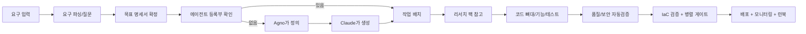
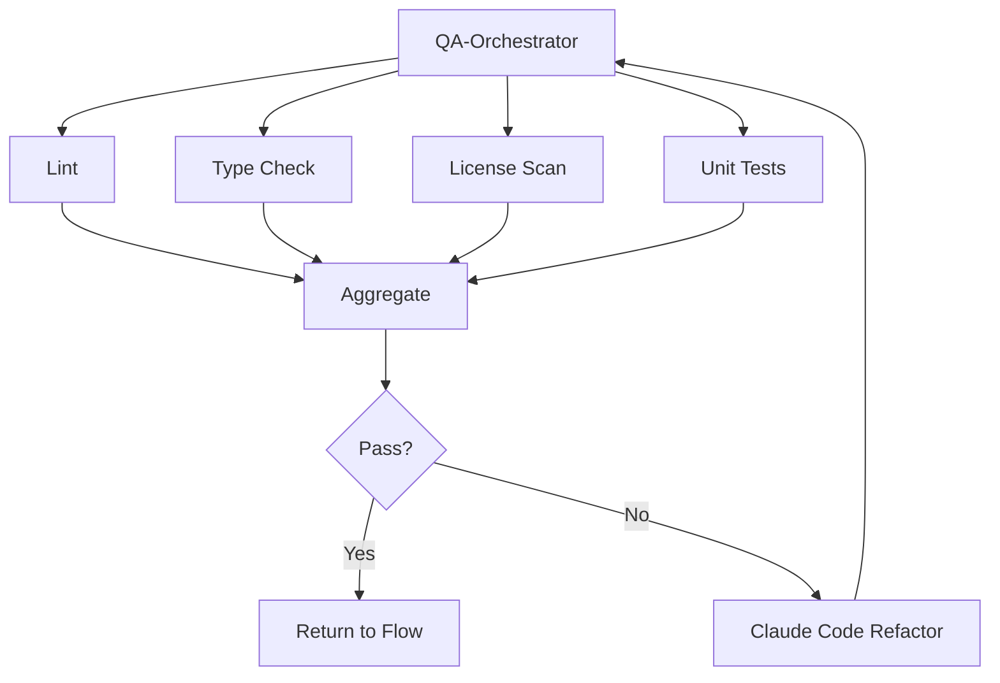

# T-Developer: 신규 생성(New Build) 워크플로우 v0.3 (User-Friendly + Gate/Quality/IaC/Runbook)

> 비유: “빈 땅에서 집 짓기”처럼 생각합니다. **슈퍼바이저**가 용도와 예산을 듣고 \*\*설계사(Agno)\*\*가 도면을 그리며, \*\*시공사(Claude Code)\*\*가 골조를 세우고, **검측팀**이 품질을 확인한 뒤 \*\*입주·관리팀(Bedrock AgentCore)\*\*이 운영에 넘깁니다. **메모리 큐레이터**는 설계변경·자재명세 같은 문서를 정리합니다.

---

## 0) 핵심 비유

* **도착지 = 목표 명세서(최종 문서)**: 집의 완성된 모습
* **출발지 = 0 (빈 땅)**: 아무것도 없는 상태
* **길 = 작업 단계**: 작은 단위로 쪼갠 일의 흐름
* **전문가 = 에이전트**: 작은 기능 하나씩 잘하는 미니 팀원들
* **관리자 = 오케스트레이터**: 전문가에게 순서를 주는 현장소장

---

## 1) 작게 쪼개서 일한다

* 모든 일을 **5\~20분짜리 미션**으로 잘게 쪼갠다.
  예: “요구 파싱 → 항목 리스트화 → 빠진 항목 질문 만들기 → 답으로 문서 업데이트”
* 작은 에이전트를 많이 두고, 각자 한 가지 일만 빠르게 한다.

> 왜? LLM은 큰 요구 한 번에 하는 것보다 작은 미션 여러 번이 더 정확하고 안정적이기 때문.

---

## 2) 도착지부터 만든다 (요구 해석 → 목표 명세서)

* 입력이 한 줄이든 100페이지든, 먼저 **목표 명세서**를 만든다.
* **목표 명세서**는 세 부분으로 구성:

  1. **요약본(1\~2p)**: 목적/배경/이해관계자, 핵심 기능(MoSCoW), 제약(예산/마감/스택/보안), 성공 기준, 열린 질문
  2. **본문(제한 없음)**: 유스케이스·시나리오, 데이터 모델·API 계약, 비기능 요구(성능/보안/신뢰성/컴플라이언스/SLA), 운영·관측·비용 가드레일, 리스크·가정·의존성, 아키텍처/에이전트 조합 설계
  3. **부록**: 리서치 팩, 벤치마크/레퍼런스, 경쟁 분석, ADR(의사결정 기록)
* 작성 방식:

  * 입력이 짧으면 요약본만, 복잡하면 본문/부록까지 확장
  * 체크리스트·게이트는 요약본에는 요약, 본문에는 상세 기록
* 담당 에이전트:

  * 요구 파서 → 요약본 1차 생성
  * 질문 설계자 → 열린 질문 채우기
  * 리서치 에이전트 → 부록용 리서치 팩 작성
  * Agno → 본문 중 설계·에이전트 조합 파트
  * Claude Code → 스캐폴딩/코드/테스트 산출
  * 메모리 큐레이터 → 요약·중복제거·색인

---

## 3) 출발지는 0 (생성은 빈 땅)

* 생성 모드는 기존 코드가 없어서 분석이 필요 없음.
* 필요한 건 **기본 뼈대** (폴더 구조, 빌드/테스트, 서버 코드)부터 세우는 것.

---

## 4) 누가 일을 하냐 (등록된 에이전트 확인 → 없으면 생성)

* **에이전트 등록부**에서 필요한 전문가 확인.

  * 예: 요구 파서, 질문 설계자, 템플릿 선택, 스캐폴딩, 코드 작성, 테스트, 보안 점검, 배포 등
* 없는 에이전트는 **Agno(정의)** + **Claude Code(구현)** 콤보로 새로 만든 뒤 등록.

**에이전트 체크리스트(예시)**

* 요구 파서
* 질문 설계자
* 템플릿 선택자
* 코드 뼈대(스캐폴딩)
* 기능 코드 작성
* 테스트 자동생성
* 품질/보안 점검
* 배포자
* 문서/런북 작성
* 관측(로그/메트릭) 수집

---

## 5) 똑똑하게 배우고 만든다 (리서치 → 참고문서)

* **리서치 에이전트**가 요즘 방식/새 기술/유사 서비스 코드 패턴을 짧은 브리핑으로 정리.
* 레퍼런스 팩(예시 목차):

  * 한 줄 결론
  * 추천 스택(이유 포함, 대안 1줄씩)
  * 핵심 코드 예시 3개
  * 구현 시 함정(주의사항)
  * 체크리스트(구현 전 확인)
* 이 문서를 Agno/Claude Code가 참고해 에이전트와 서비스 코드를 생성.

---

## 6) 게이트 구조 (신호등)

* 각 단계마다 \*\*게이트(Checkpoint)\*\*를 둔다.
* 통과 조건(초록불) 만족 시 다음 단계로, 실패(빨간불) 시 멈추고 수정 루프.
* 직렬(순차)과 병렬(동시) 모두 가능:

  * 직렬: 반드시 순서대로 (예: 요구분석 → 아키텍처 → 구현)
  * 병렬: 독립적인 검사 동시에 (예: 보안 스캔 + 성능 스모크테스트)
* 장점: 문제를 조기에 발견하고, 병렬 실행으로 속도 최적화.

---

## 7) 품질/보안 점검 자동화

* 자동 검수 에이전트가 코드 생성 직후 검증.
* 정적 점검: 코드 스타일, 린트, 타입체크, 라이선스 스캔.
* 보안 점검: OWASP Top 10, 취약점 스캐너, 규제 준수 검사.
* 실패하면 Claude Code가 자동으로 리팩터링 후 재검증.

---

## 8) IaC (배포 도면)

* **배포 환경을 코드로 정의** (Infrastructure as Code).
* AI 친화적인 방식 우선 (AWS CDK 권장, 필요 시 Terraform 병행).
* 장점: 같은 코드로 언제든 동일 환경 재현, 자동 검증 가능.

---

## 9) 런북 & 모니터링

* **런북**: 문제가 생겼을 때 단계별 대응 가이드 자동 작성.
* **모니터링**: 로그, 메트릭, 트레이싱 기본 세팅.
* **관측 에이전트**: 사용자 행동 이벤트도 수집해 향후 자동 진화에 활용.

---

## 목표 명세 흐름도

---

## 메모리 구조 (단순 5종)

* **관리자 노트(오케스트레이터용)**: 진행 상황/결정 기록
* **전문가 개인노트(에이전트별)**: 각자의 히스토리/요령
* **공용 화이트보드**: 모두가 보는 현재 맥락
* **사용자별 노트**: 고객/팀별 히스토리
* **감시관 노트(옵저버)**: 로그/지표/문제 기록

> 메모리 큐레이터가 중복 제거·요약·인덱싱을 맡아 다음 작업에 재사용.

---

## 결과물 (항상 남기는 문서 6종)

1. **목표 명세서**: 요약본 + 본문 + 부록 (분량 제한 없음)
2. **작업 경로표(체크리스트)** — 5\~20분 단위 Task 리스트
3. **에이전트 체크리스트**
4. **리서치 팩**
5. **스캐폴딩/코드 + 테스트**
6. **짧은 런북** (실행/롤백/모니터링)

---

## 자동 멈춤(안전장치)

* 빨간불 조건: 정보 부족 / 비용 과다 / 보안 위험
* 즉시 멈추고 → 질문 다시 던지기 → 목표 명세서 업데이트 → 재개

---

## 요구사항 반영 체크

1. 작은 단위 미션: ✓
2. 요구 분석 → 목표 명세서: ✓ (분량 무제한)
3. 생성은 출발지 없음(0): ✓
4. 에이전트 등록 확인 → 빠른 생성: ✓
5. 외부 리서치로 똑똑해지기: ✓
6. 게이트 구조 직렬/병렬: ✓
7. 품질/보안 자동화: ✓
8. IaC (AI 친화 방식): ✓
9. 런북 & 모니터링: ✓

---

## 에이전트 수 추정(초안)

* **최소 단위 에이전트(MVP)**: **≈ 12개**
  (요구 파서, 질문 설계자, 목표 명세서 작성자, 리서치, 등록부 조회자, Agno, Claude Code, QA‑오케스트레이터, 보안 스캐너(또는 QA에 포함), IaC 빌더/검증자, 배포자, 런북·모니터링 작성자)
  ※ **메모리 큐레이터**는 횡단 역할로 별도 집계하지 않음(보수적으로 세면 13개).
* **오케스트레이터가 직접 호출하는 에이전트 수**: **≈ 8\~12개**
  (QA는 내부에서 여러 검사를 병렬로 돌리지만 상위에선 1회 호출로 취급)
* **병렬화 힌트**: 린트/타입/라이선스/단위테스트는 **병렬**, 보안 스캔과 성능 스모크도 **병렬** 가능.

---

## QA‑오케스트레이터 내부 병렬 구조(예시)

---

## 규모별 권장 세트(MVP/확장)

| 규모      | 에이전트 수(대략) | 오케스트레이터 호출 수 | 메모                          |
| ------- | ---------: | -----------: | --------------------------- |
| 소형(MVP) |     12\~16 |        8\~12 | QA/보안은 QA‑오케 내부 병렬로 처리      |
| 중형      |     18\~28 |       12\~18 | 도메인별 QA·보안·관측 분화            |
| 대형      |    28\~40+ |       18\~30 | 서비스/도메인 단위로 리서치·스캐폴딩·관측 세분화 |

**MVP 필수 12**

1. 요구 파서  2) 질문 설계자  3) 목표 명세서 작성자  4) 리서치  5) 등록부 조회자  6) Agno(정의)  7) Claude Code(구현)  8) QA‑오케스트레이터  9) 보안 스캐너(또는 QA 포함)  10) IaC 빌더/검증자  11) 배포자  12) 런북·모니터링 작성자

**권장 추가(확장)**

* 성능 테스트 에이전트(부하/스모크)
* 비용 가드레일(예산 초과 자동 차단·대안 제안)
* 피처 플래그/카나리 관리
* 도메인별 관측 에이전트(사용자 행동 이벤트 전용)

> 메모: **메모리 큐레이터**는 전 구간에 걸친 횡단 기능으로, 수 산정에서 제외했지만 실사용에선 상시 가동을 권장합니다.
