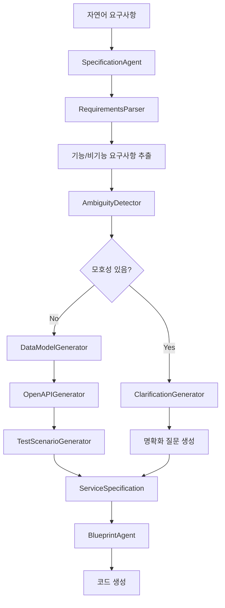

# T-Developer 요구사항 입력 및 처리 플로우

## 1. 요구사항 입력 방법

### 방법 1: 자연어 텍스트 입력

```python
# SpecificationAgent를 통한 자연어 처리
input = AgentInput(
    task_id="spec-001",
    intent="process_requirements",
    payload={
        "requirements_text": """
        사용자 관리 시스템을 만들어주세요.
        - 사용자는 이메일로 회원가입할 수 있어야 합니다
        - JWT 기반 인증이 필요합니다
        - 관리자는 모든 사용자를 조회할 수 있어야 합니다
        - 사용자 프로필에는 이름, 이메일, 프로필 사진이 포함됩니다
        - 응답 시간은 200ms 이내여야 합니다
        """,
        "service_name": "UserManagementService"
    }
)

spec_agent = SpecificationAgent()
result = await spec_agent.execute(input)
```

### 방법 2: 구조화된 요구사항 입력

```python
input = AgentInput(
    task_id="spec-002",
    intent="generate_specification",
    payload={
        "service_name": "OrderService",
        "functional_requirements": [
            {
                "type": "CRUD",
                "entity": "Order",
                "operations": ["create", "read", "update", "delete"],
                "fields": ["user_id", "product_id", "quantity", "status"]
            },
            {
                "type": "workflow",
                "description": "주문 승인 워크플로우",
                "steps": ["주문 생성", "결제 확인", "재고 확인", "배송 준비"]
            }
        ],
        "non_functional_requirements": [
            {
                "category": "performance",
                "target": "response_time",
                "threshold": 0.2,
                "metric": "seconds"
            },
            {
                "category": "availability",
                "target": "uptime",
                "threshold": 99.9,
                "metric": "percent"
            }
        ]
    }
)
```

### 방법 3: User Story 형식

```python
input = AgentInput(
    task_id="spec-003",
    intent="process_requirements",
    payload={
        "requirements_text": """
        As a customer
        I want to search for products
        So that I can find what I need quickly

        As an admin
        I want to view sales reports
        So that I can track business performance

        As a seller
        I want to manage my inventory
        So that I can keep products in stock
        """
    }
)
```

### 방법 4: API 명세 형식

```python
input = AgentInput(
    task_id="spec-004",
    intent="process_requirements",
    payload={
        "requirements_text": """
        GET /users - 모든 사용자 조회
        GET /users/{id} - 특정 사용자 조회
        POST /users - 새 사용자 생성
        PUT /users/{id} - 사용자 정보 수정
        DELETE /users/{id} - 사용자 삭제

        POST /auth/login - 로그인
        POST /auth/logout - 로그아웃
        POST /auth/refresh - 토큰 갱신
        """
    }
)
```

## 2. 요구사항 파싱 프로세스

### SpecificationAgent의 처리 단계

```python
class SpecificationAgent:
    async def process_requirements(self, requirements_text: str):
        # 1단계: 요구사항 추출
        functional_reqs = await self.parser.extract_functional_requirements(text)
        non_functional_reqs = await self.parser.extract_non_functional_requirements(text)

        # 2단계: 엔티티 식별
        entities = self._extract_entities(text)

        # 3단계: 관계 정의
        relationships = await self.define_relationships(entities)

        # 4단계: API 엔드포인트 생성
        endpoints = await self.parse_api_requirements(text)

        # 5단계: 데이터 모델 생성
        data_models = await self.create_models(functional_reqs)

        # 6단계: OpenAPI 명세 생성
        openapi_spec = await self.generate_openapi_spec()

        # 7단계: 테스트 시나리오 생성
        test_scenarios = await self.generate_test_scenarios()

        return ServiceSpecification(...)
```

### 요구사항 파싱 패턴

```python
class RequirementsParser:
    # CRUD 패턴 인식
    crud_patterns = [
        r"(create|add|insert|생성)",
        r"(read|get|view|retrieve|조회)",
        r"(update|modify|edit|수정)",
        r"(delete|remove|삭제)"
    ]

    # 엔티티 추출 패턴
    entity_patterns = [
        r"(user|사용자)",
        r"(product|상품)",
        r"(order|주문)",
        r"(customer|고객)"
    ]

    # 성능 요구사항 패턴
    performance_patterns = [
        r"(\d+)\s*(ms|milliseconds|밀리초)",
        r"(\d+)\s*(requests?/s|rps|qps)",
        r"(\d+)\s*(GB|MB|KB)"
    ]
```

## 3. 요구사항 검증 및 명확화

### 모호성 탐지

```python
class AmbiguityDetector:
    def detect_ambiguities(self, text: str) -> list[Ambiguity]:
        ambiguous_terms = [
            "빨리", "많이", "적절히", "필요시",
            "fast", "many", "appropriate", "as needed"
        ]

        ambiguities = []
        for term in ambiguous_terms:
            if term in text:
                ambiguities.append(Ambiguity(
                    term=term,
                    context=extract_context(text, term),
                    suggestion="구체적인 수치나 기준을 명시해주세요"
                ))
        return ambiguities
```

### 요구사항 명확화 질문 생성

```python
class ClarificationGenerator:
    async def generate_questions(self, spec: ServiceSpecification) -> list[str]:
        questions = []

        # 누락된 정보 확인
        if not spec.authentication_required:
            questions.append("인증이 필요한 서비스인가요?")

        if not spec.database_type:
            questions.append("어떤 데이터베이스를 사용하시겠습니까? (PostgreSQL/MySQL/MongoDB)")

        if not spec.deployment_environment:
            questions.append("배포 환경은 어디인가요? (AWS/GCP/On-premise)")

        # 모호한 요구사항 명확화
        for req in spec.functional_requirements:
            if "많은" in req.description:
                questions.append(f"{req.entity}의 '많은'은 구체적으로 몇 개를 의미하나요?")

        return questions
```

## 4. 출력: ServiceSpecification

### 생성되는 명세 구조

```python
@dataclass
class ServiceSpecification:
    # 기본 정보
    service_name: str
    version: str = "1.0.0"
    description: str = ""

    # 기능 요구사항
    functional_requirements: list[FunctionalRequirement]

    # 비기능 요구사항
    non_functional_requirements: list[NonFunctionalRequirement]

    # API 명세
    api_endpoints: list[APIEndpoint]
    openapi_spec: Optional[dict]

    # 데이터 모델
    data_models: list[DataModel]
    relationships: list[Relationship]

    # 테스트
    test_scenarios: list[TestScenario]
    acceptance_criteria: list[AcceptanceCriterion]

    # 검증 결과
    validation_result: Optional[ValidationResult]
    ambiguities: list[Ambiguity]
    clarification_questions: list[str]
```

## 5. 요구사항 처리 예시

### 입력 예시

```
"전자상거래 플랫폼을 만들어주세요.
사용자는 상품을 검색하고 장바구니에 담을 수 있어야 합니다.
결제는 신용카드와 페이팔을 지원해야 합니다.
관리자는 상품과 주문을 관리할 수 있어야 합니다.
시스템은 동시 사용자 1000명을 처리할 수 있어야 합니다."
```

### 파싱 결과

```json
{
  "functional_requirements": [
    {
      "type": "search",
      "entity": "Product",
      "operations": ["search", "filter"],
      "description": "상품 검색 기능"
    },
    {
      "type": "CRUD",
      "entity": "Cart",
      "operations": ["add", "remove", "update", "view"],
      "description": "장바구니 관리"
    },
    {
      "type": "integration",
      "entity": "Payment",
      "operations": ["process"],
      "description": "신용카드 및 페이팔 결제"
    }
  ],
  "non_functional_requirements": [
    {
      "category": "scalability",
      "target": "concurrent_users",
      "threshold": 1000,
      "metric": "users"
    }
  ],
  "data_models": [
    {
      "name": "Product",
      "fields": ["id", "name", "price", "description", "stock"]
    },
    {
      "name": "Cart",
      "fields": ["id", "user_id", "items", "total"]
    },
    {
      "name": "Order",
      "fields": ["id", "user_id", "items", "payment_method", "status"]
    }
  ],
  "clarification_questions": [
    "상품 검색시 어떤 필터 옵션이 필요한가요?",
    "재고 관리 기능이 필요한가요?",
    "배송 추적 기능이 필요한가요?",
    "어떤 통화를 지원해야 하나요?"
  ]
}
```

## 6. 통합 플로우



## 7. 베스트 프랙티스

### 좋은 요구사항 작성법

✅ **구체적으로 작성**

```
"응답 시간은 200ms 이내여야 합니다"
"동시 사용자 1000명을 지원해야 합니다"
```

❌ **모호한 표현 피하기**

```
"빠른 응답이 필요합니다"
"많은 사용자를 처리해야 합니다"
```

✅ **측정 가능한 기준 제시**

```
"가용성 99.9% 이상 유지"
"초당 100개 요청 처리"
```

✅ **우선순위 명시**

```
"필수: 사용자 인증 기능"
"선택: 소셜 로그인 연동"
```

### 요구사항 카테고리별 키워드

| 카테고리 | 키워드 예시 |
|---------|------------|
| **CRUD** | create, read, update, delete, 생성, 조회, 수정, 삭제 |
| **인증** | login, logout, auth, JWT, OAuth, 로그인, 인증 |
| **검색** | search, filter, sort, 검색, 필터, 정렬 |
| **워크플로우** | process, approve, reject, workflow, 처리, 승인, 반려 |
| **통합** | integrate, connect, API, webhook, 연동, 연결 |
| **보고** | report, dashboard, analytics, 보고서, 대시보드, 분석 |
