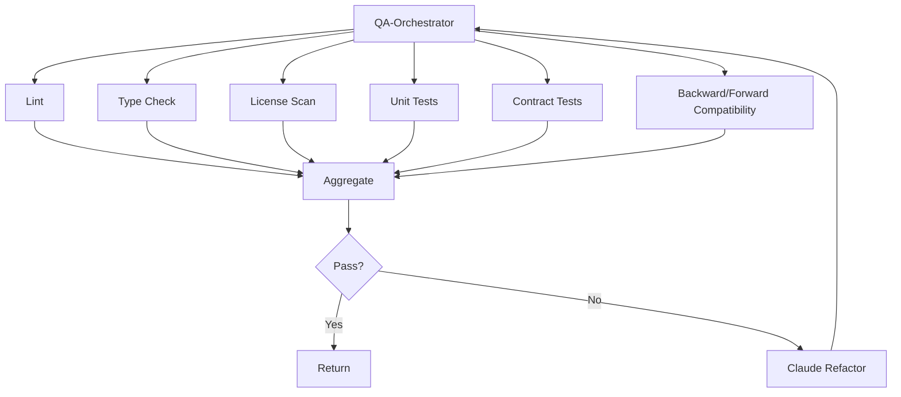

# T‑Developer: 요청 기반 진화(Upgrade) 워크플로우 v0.1 (User‑Friendly + Gate/Parallel + Quality/Sec + IaC + Runbook)

> 비유: **기존 집 리모델링**입니다. **슈퍼바이저**가 요청을 받고 우선순위를 정하고, \*\*설계사(Agno)\*\*가 바뀔 부분의 도면을 그리며, \*\*시공사(Claude Code)\*\*가 안전하게 바꾸고, \*\*검측팀(QA/보안)\*\*이 문제를 잡고, \*\*관리팀(Bedrock AgentCore)\*\*이 운영에 넘깁니다. **메모리 큐레이터**는 변경 이력과 노하우를 정리해 다음 진화에 재사용합니다.

---

## 0) 핵심 비유

* **도착지 = 진화 목표 명세서**(무엇을 왜 어떻게 바꿀지)
* **출발지 = 현재 시스템의 실제 상태**(코드·런타임·사용데이터)
* **길 = 작은 단계들의 흐름**(5\~20분 태스크)
* **전문가 = 에이전트**(한 가지 역할에 특화)
* **관리자 = 오케스트레이터**(순서/병렬 조정, 신호등 게이트 관리)

---

## 1) 작게 쪼개서 일한다

* 모든 작업을 **5\~20분짜리** 태스크로 쪼갭니다.
  예) 요청 파악 → 빠진 정보 질문 → 목표 명세서 갱신 → 영향도 표 작성 → 안전 변경 계획 수립…

---

## 2) 도착지부터 만든다 (요청 해석 → **진화 목표 명세서**)

* 사용자의 요청이 들어오면 먼저 **진화 목표 명세서**를 작성합니다(분량 제한 없음).
* 구성 예시:

  1. 배경/목적, 이해관계자
  2. 변경 범위(무엇을 바꾸고, 무엇은 유지?)
  3. 성공 기준(사용지표·성능·비용·리스크 감소 등)
  4. 제약(마감/예산/규정/호환성 요구)
  5. **호환성 요구**(기존 사용자/클라이언트가 깨지지 않도록)
  6. 열린 질문(모르는 것들)
* 담당 에이전트: 요청 파서, 질문 설계자, 목표 문서 작성자, 리서치 에이전트

---

## 3) 출발지 진단(현재 상태 파악) — 정적/동적/AI 요약

* **정적 분석**(코드/의존성/보안/라이선스): 리포지토리 스캔, 취약점/정책 위반 체크
* **동적 분석**(런타임/사용 행태): 로그·메트릭·트레이스, 오류율, P95 지연, 트래픽 패턴
* **AI 요약(아키텍처 추출)**: 컴포넌트 맵, 데이터 흐름, 복잡도/리스크 영역
* **계약/인터페이스 수집**: API/스키마/이벤트/DB 테이블을 자동 채굴(Contract Miner)
* **테스트 갭 찾기**: 커버리지/결손 시나리오 도출
* **UX/행동 데이터**: 전환/리텐션/클릭스트림 핵심 지표
* 산출물: **현재상태 보고서**, **변경 영향도 매트릭스**(어디를 건드리면 무엇이 깨질지)

---

## 4) 갭 정리 & 계획(Plan)

* **갭 리포트**: 현재 ↔ 목표 차이 목록(기능/데이터/성능/보안/운영)
* **영향도 매트릭스**: 컴포넌트·API·데이터·사용자 영향 정리
* **리스크 스코어**: 난이도·파급력·되돌리기 난도
* **작은 배치 계획**: 피처 단위로 잘게 쪼개 **점진 배포**(Feature Flag/카나리)
* **마이그레이션 전략**(쉬운 말):

  * **확장‑축소(Expand‑Contract)**: 새 구조 추가 → 데이터 옮기기 → 옛 구조 제거
  * **그림자 읽기/쓰기(Shadow)**: 새 경로로 동시에 흘려 결과 비교
  * **블루‑그린/카나리**: 일부 트래픽만 새 버전으로 시험 운영
* 산출물: **실행 계획서(Plan.md)**, **마이그레이션 계획**, **테스트 계획**, **플래그/카나리 계획**

---

## 5) 누가 일을 하냐 (등록된 에이전트 확인 → 없으면 생성)

* **에이전트 등록부**에서 필요한 역할 확인(분석/계획/구현/검증/배포/운영)
* 없으면 **Agno(정의)** + \*\*Claude Code(구현)\*\*로 빠르게 생성 후 등록

**에이전트 체크리스트(예시)**

* 요청 파서 / 질문 설계자 / 목표 문서 작성자
* 리포 스캐너(정적) / 텔레메트리 분석(동적) / 아키텍처 추출
* Contract Miner / 테스트 갭 파인더
* 리스크 평가 / 변경 계획자 / 마이그레이션 플래너
* Claude Refactor / 데이터 마이그레이션 실행자
* 플래그·카나리 매니저 / 배포자 / 런북·관측 작성자

---

## 6) 리서치 팩(업그레이드 특화)

* 유사 서비스의 **변경/마이그레이션 패턴**과 **실패 사례**를 요약
* 권장 스택·라이브러리, 호환성 유지 팁, 성능/비용 절충안
* 핵심 스니펫 3개, 체크리스트(변경 전 점검)

---

## 7) 게이트 구조(신호등) — 직렬/병렬

* G0: 입력 유효성(요청 정합, 규정 위반 없음)
* **G1: 목표 명세서 승인**(열린 질문 해소)
* **G2: 현재상태 진단 완료**(정적/동적/AI 요약, 영향도 매트릭스)
* **G3: 실행 계획 승인**(리스크/예산/일정 OK)
* **G4: 변경 빌드/리팩터**(Claude Code)
* **G5: 품질/계약/호환성 테스트**(병렬)

  * 계약 테스트(API 약속 준수), **호환성**(구버전 클라이언트/데이터와 동작), 단위/통합/E2E
* **G6: 보안/컴플라이언스**(OWASP/정책)
* **G7: 마이그레이션 리허설**(리허설/되돌리기 검증)
* **G8: 카나리/관측 OK**(에러/지연/지표 기준)
* **G9: Go‑Live**(전체 전환)
* **G10: 사후 회고 & 메모리 업데이트**

> 병렬 예: 정적 점검·라이선스·SCA·단위/계약 테스트·보안 스캔 등을 QA‑오케 내부에서 **동시** 실행(fan‑out/fan‑in)

---

## 8) 품질/보안 점검 자동화

* 린트/타입/라이선스/단위/통합/E2E/계약/호환성 테스트를 자동화
* 실패 시 **Claude Refactor** 루프 → 재검증
* 보안: 취약점/비밀노출/권한정책/데이터 분류·암호화 체크

---

## 9) IaC (배포 도면)

* **배포 환경을 코드로 정의**(CDK 권장, 필요 시 Terraform 병행)
* **드리프트 감지**(실제 인프라 ≠ 코드 차이 감시)와 비용 가드레일

---

## 10) 런북 & 모니터링

* 변경/마이그레이션 시나리오별 **런북** 자동 작성(되돌리기 절차 포함)
* 로그·메트릭·트레이싱 + **행동 이벤트**(전환·리텐션) 관측 세트

---

## 목표‑진단‑실행 흐름도

```mermaid
flowchart LR
  A[요청 입력] --> B[진화 목표 명세서]
  B --> C[현재상태 진단(정적/동적/AI)]
  C --> D[갭/영향도/리스크]
  D --> E[실행/마이그레이션 계획]
  E --> F[에이전트 확인/생성]
  F --> G[구현/리팩터(Claude)]
  G --> H[QA 병렬검증(계약/호환성/테스트)]
  H --> I[IaC 검증]
  I --> J[카나리/관측]
  J --> K[Go‑Live]
  K --> L[런북/회고/메모리 업데이트]
```

---

## QA‑오케 내부 병렬 구조(업그레이드 확장)



---

## 메모리 구조(5종)

* **관리자 노트(O‑CTX)**: 게이트 결과/중요 결정
* **전문가 개인노트(A‑CTX)**: 역할별 히스토리/팁
* **공용 화이트보드(S‑CTX)**: 현재 맥락/요약
* **사용자별 노트(U‑CTX)**: 고객/팀 히스토리
* **감시관 노트(OBS‑CTX)**: 로그/지표/이상징후

> 메모리 큐레이터: 요약/중복제거/인덱싱/민감도 라벨링/재사용 등급

---

## 결과물(항상 남기는 문서 10종)

1. **진화 목표 명세서**(요약+본문+부록)
2. **현재상태 보고서**
3. **갭 리포트 & 영향도 매트릭스**
4. **실행 계획서(Plan.md)**
5. **테스트 계획 & 커버리지 리포트**
6. **마이그레이션 계획(Expand‑Contract/Shadow 등)**
7. **플래그/카나리 계획**
8. **IaC 변경/검증 리포트**
9. **런북 업데이트 & 되돌리기 절차**
10. **체인지로그/ADR**

---

## 자동 멈춤(안전장치)

* 위험도 초과, 예산 초과 예측, 호환성 위험 미해소, 데이터 마이그레이션 실패 가능성 높음 → **즉시 정지** → 질문/계획 보강 → 재개

---

## 에이전트 수 추정(초안)

* **최소 단위 에이전트(MVP)**: **≈ 16\~22개**
  (요청 파서, 질문 설계자, 목표 문서, 리포 스캐너, 텔레메트리 분석, 아키텍처 추출, Contract Miner, 테스트 갭 파인더, 리스크 평가, 변경 계획자, 마이그레이션 플래너, Claude Refactor, 데이터 마이그 실행자, 플래그/카나리 매니저, 배포자, 런북·관측 작성자, …)
* **오케스트레이터가 직접 호출하는 에이전트 수**: **≈ 10\~16개**
  (QA/보안/호환성은 QA‑오케 1회 호출로 내부 병렬 처리)
* **병렬화 힌트**: 정적/동적 분석, 계약/호환성/단위/보안 테스트, 비용/드리프트 검증을 병렬화

---

## 규모별 권장 세트(MVP/확장)

| 규모      | 에이전트 수(대략) | 오케스트레이터 호출 수 | 메모                   |
| ------- | ---------: | -----------: | -------------------- |
| 소형(MVP) |     16\~22 |       10\~16 | 플래그/카나리로 점진 배포       |
| 중형      |     22\~32 |       14\~22 | 도메인별 분석·테스트·관측 분화    |
| 대형      |    32\~48+ |       20\~30 | 데이터 마이그/호환성/성능 채널 분리 |

**권장 추가(확장)**

* 성능 부하/회귀 전용 에이전트
* 비용 가드레일(예산 초과 차단·대안 자동 제안)
* 스키마 변환 시뮬레이터(데이터 샘플 기반 리허설)
* 사용자 행동 이벤트 전용 관측 파이프라인

---

## 요구사항 반영 체크

* 요청 기반(도착지 명세 우선) ✓
* 출발지 진단(정적/동적/AI) ✓
* 작은 배치/점진 배포(플래그/카나리) ✓
* 병렬 게이트(QA/보안/호환성) ✓
* IaC/런북/관측까지 포함 ✓
* 5\~20분 태스크 체계 ✓

---

## 작업 경로표(체크리스트) — 5\~20분 단위 Task 리스트

* 입력 정합성 검토 → 빠진 정보 질문 보내기 → 목표 명세서 갱신
* 리포 스캔(정적) → 텔레메트리 분석(동적) → 아키텍처 자동 추출
* 계약/스키마/이벤트 수집 → 영향도 매트릭스 작성
* 작은 배치 계획 → 마이그 전략 선택(Expand‑Contract/Shadow/카나리)
* 리서치 팩 정리 → 에이전트 등록/생성
* 구현/리팩터 → QA‑오케 병렬 검증(계약/호환성/테스트/보안)
* IaC 검증/드리프트 체크 → 카나리 모니터링 → Go‑Live
* 런북/체인지로그/ADR 업데이트 → 회고/메모리 반영

---

좋아 T! 업그레이드(요청 기반 진화)에도 **“똑똑하게 배우고 만든다 (리서치 → 참고문서)”** 단계를 넣을 수 있게, **바로 붙여 넣을 수 있는 섹션 초안**을 준비했어.
먼저 어려운 말 3줄 요약:

* **URP** = *Upgrade Research Pack*: 업그레이드 전에 꼭 보는 “짧은 브리핑 묶음”.
* **UR-Gate** = 리서치 품질 체크 신호등(통과/보류/차단).
* **De-dup/RuleKeeper** = 중복개발 금지 검사 + 규칙 감시.

---

## 4A) 똑똑하게 배우고 만든다 (리서치 → 참고문서)

> 비유: 리모델링 전에 **사서 겸 조사팀**이 최신 자료를 모아 \*\*짧고 실전적인 브리핑 팩(URP)\*\*을 만든다. 덕분에 “감”이 아니라 “근거”로 바꾼다.

### 목적

* 요청된 변경이 **최신 방법/주의점/비용 대비 효과**에 맞는지 검증
* 설계/구현 에이전트가 바로 참고할 **짧고 실용적인 레퍼런스** 제공

### 언제 실행

* **3) 출발지 진단** 직후, **4) 갭 정리 & 계획**에 들어가기 **직전**
* 리서치 소주제(프레임워크 비교, 보안 이슈, 성능 패턴)는 **병렬** 가능

### 입력

* 진단 산출물: 현재상태 보고서, 영향도 매트릭스, 계약/스키마 목록
* 내부 기록: 과거 ADR/런북/실패·성공 사례, 템플릿/스니펫
* 외부 소스: 변경 로그, 보안 권고, 릴리스 노트, 실전 사례, 벤치마크

### 산출물 — **URP (Upgrade Research Pack)**

1. **한 줄 결론**(왜 지금 이 방식이 맞는지)
2. **추천 접근 1안 + 대안 2안**(표로 장단점/적용 조건 비교)
3. **호환성/계약 영향 체크리스트**(구버전 API·데이터·클라이언트 안전성)
4. **마이그레이션 전략 요약**: Expand-Contract / Shadow / Blue-Green 중 선택 근거
5. **핵심 코드 스니펫 3개**(적용 위치/주의점 주석)
6. **주의사항/함정**(보안·성능·데이터·운영)
7. **성공/실패 기준**(지표·최소 개선폭·측정법)
8. **비용/리스크 요약**(상·중·하)
9. **De-dup 결과**(재사용 후보·유사 자산 링크)
10. **참고자료 목록**(내·외부 출처, 날짜)
11. **유효기간(TTL)**(예: 14일 후 재검토)

> 파일명 예: `urp/<YYYYMMDD>_<topic>_v1.md`

### 책임 에이전트

* **리서치 에이전트(AI)**: 자료 수집·요약·스니펫 작성
* **DeDup-Checker(AI)**: 기존 자산 유사도 검색(임계값 기본 0.85)
* **RuleKeeper(AI)**: AIFIRST-001/필수항목 준수 점검, 누락 보완 제안
* **PolicyEngine(결정형)**: 필수 항목 존재/출처≥3/금지 목록 위반 검사

### 5\~20분 태스크(예시)

* [ ] 변경 로그/보안 권고/릴리스 노트 스캔(10m)
* [ ] 유사 템플릿/에이전트 유사도 검색(10m)
* [ ] 성공/실패 사례 2건 요약(10m)
* [ ] 스니펫 3개 초안 + 적용 위치 주석(15m)
* [ ] 호환성 체크리스트 채우기(10m)
* [ ] 성공/실패 기준·측정법 정의(10m)
* [ ] 비용/리스크 3레벨 요약 + TTL 기입(10m)

### 게이트 — **UR-Gate (Upgrade Research Gate)**

* 통과 조건(모두 충족):

  * 출처 **≥ 3**(내/외부 혼합), **한 줄 결론**, **스니펫 3개**,
  * **호환성 체크리스트** 완료, **마이그 전략 선택 근거**,
  * **성공/실패 기준** 명시, **De-dup 결과**, **TTL** 기입
* 실패 시: 자동 보완 태스크 발행 또는 **UR-EXC ADR**(기간 제한) 필요

### 메모리 반영

* URP를 **부록**에 링크, 요약을 **공용 화이트보드** 상단에 고정
* 메모리 큐레이터가 색인/중복제거 → 다음 업그레이드에서 재사용

### 흐름 업데이트(요약)

```mermaid
flowchart LR
  C[현재상태 진단(3)] --> R[URP 리서치(4A)]
  R -->|UR-Gate 통과| P[갭 정리 & 계획(4)]
  P --> I[구현/리팩터(Claude)]
  I --> QA[QA 병렬(계약/호환성/테스트)]
  QA --> Sec[보안]
  Sec --> K[카나리/관측]
  K --> G[Go-Live]
  G --> M[회고·메모리 업데이트]
  R -.-> DD[De-dup 검사]
  R -.-> RK[RuleKeeper/PolicyEngine 점검]
```

---

**삽입 위치 제안**

* 업그레이드 문서의 **3) 출발지 진단**과 **4) 갭 정리 & 계획** 사이에 \*\*“4A) 리서치 → 참고문서”\*\*로 넣으면 번호 충돌 없이 깔끔해.
* 또는 기존 \*\*“6) 리서치 팩(업그레이드 특화)”\*\*을 이 섹션으로 **대체**해도 돼(그 경우 게이트명은 **UR-Gate**로 표기).

원하는 방식(새 4A로 추가 vs 6 교체)만 말해줘. 그에 맞춰 문서에 맞춤형으로 붙여줄게!
