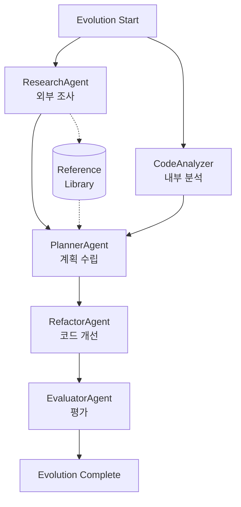

# 🏗️ T-Developer Agent Architecture

## 📊 에이전트 역할 재정의

### 1. 🔍 ResearchAgent (외부 조사)

**역할**: 프로젝트에 도움이 되는 외부 자료와 최신 기술 조사

#### 주요 기능

- **최신 기술 트렌드 조사**
  - GitHub Trending 분석
  - Stack Overflow 인기 태그
  - HackerNews/Reddit 동향

- **레퍼런스 문서 수집**
  - 공식 문서 크롤링
  - 베스트 프랙티스 수집
  - 아키텍처 패턴 연구

- **MCP/Agent 생태계 모니터링**
  - 최신 MCP 도구 발견
  - 새로운 에이전트 패턴
  - AI 모델 업데이트

- **코드 스타일 가이드**
  - 언어별 최신 컨벤션
  - 프레임워크 가이드라인
  - 보안 베스트 프랙티스

#### 출력 형식

```json
{
  "external_references": [
    {
      "source": "GitHub",
      "title": "awesome-mcp-servers",
      "relevance": 0.95,
      "insights": ["새로운 파일시스템 MCP 서버 발견"],
      "url": "https://github.com/..."
    }
  ],
  "technology_trends": [
    {
      "name": "MCP Protocol v2",
      "status": "emerging",
      "impact": "high",
      "recommendation": "조기 도입 검토"
    }
  ],
  "best_practices": [
    {
      "category": "Python Type Hints",
      "update": "Python 3.12 generic syntax",
      "example": "def func[T](item: T) -> T: ..."
    }
  ]
}
```

### 2. 🔬 CodeAnalyzer (내부 코드 분석) - 새로운 역할

**역할**: 현재 프로젝트 코드 품질 분석 및 개선점 발견

#### 주요 기능

- **정적 코드 분석**
  - 복잡도 측정
  - 코드 스멜 감지
  - 타입 검사

- **패턴/안티패턴 감지**
  - 디자인 패턴 식별
  - 안티패턴 경고
  - 중복 코드 발견

- **의존성 분석**
  - 순환 의존성 검사
  - 버전 충돌 감지
  - 보안 취약점 스캔

- **메트릭 수집**
  - 테스트 커버리지
  - 문서화 수준
  - 기술 부채

#### 출력 형식

```json
{
  "code_quality": {
    "complexity": 3.2,
    "maintainability": 85,
    "test_coverage": 45
  },
  "issues": [
    {
      "type": "missing_docstring",
      "severity": "medium",
      "location": "file.py:42",
      "suggestion": "Add comprehensive docstring"
    }
  ],
  "patterns": {
    "detected": ["singleton", "factory"],
    "antipatterns": ["god_object"],
    "duplications": 3
  }
}
```

### 3. 📝 PlannerAgent

**역할**: ResearchAgent와 CodeAnalyzer 결과를 바탕으로 실행 계획 수립

#### 입력

- ResearchAgent의 외부 조사 결과
- CodeAnalyzer의 내부 분석 결과

#### 출력

- 우선순위화된 작업 목록
- 예상 소요 시간
- 의존성 그래프
- 리스크 평가

### 4. 🔧 RefactorAgent

**역할**: 계획에 따라 코드 수정 (또는 시뮬레이션)

#### 기능

- 외부 레퍼런스 기반 개선
  - 최신 패턴 적용
  - 베스트 프랙티스 구현

- 내부 이슈 해결
  - 코드 스멜 제거
  - 복잡도 감소
  - 문서화 개선

### 5. ✅ EvaluatorAgent

**역할**: 변경사항 평가 및 학습

#### 평가 기준

- 외부 표준 준수도
- 내부 품질 개선도
- 성능 영향
- 보안 상태

## 🔄 Evolution Flow



## 📦 데이터 흐름

### Phase 1: 정보 수집 (병렬)

```python
# 동시 실행
research_task = ResearchAgent.execute({
    "query": "MCP best practices",
    "scope": "external"
})

analysis_task = CodeAnalyzer.execute({
    "target": "./backend",
    "scope": "internal"
})

results = await asyncio.gather(research_task, analysis_task)
```

### Phase 2: 계획 수립

```python
plan = await PlannerAgent.execute({
    "external_insights": results[0],  # ResearchAgent
    "internal_analysis": results[1],  # CodeAnalyzer
    "strategy": "balanced"  # 외부/내부 균형
})
```

### Phase 3: 실행

```python
changes = await RefactorAgent.execute({
    "plan": plan,
    "mode": "dry_run",
    "apply_external": True,  # 외부 베스트 프랙티스 적용
    "fix_internal": True     # 내부 이슈 해결
})
```

### Phase 4: 평가

```python
evaluation = await EvaluatorAgent.execute({
    "changes": changes,
    "baseline": analysis_task.result,
    "standards": research_task.result.best_practices
})
```

## 🎯 구현 우선순위

### 즉시 (MVP)

1. **CodeAnalyzer 분리**
   - 현재 ResearchAgent의 코드 분석 기능 분리
   - 독립적인 에이전트로 구성

2. **ResearchAgent 재구현**
   - 외부 검색 기능 강화
   - GitHub API 통합
   - 문서 크롤링

### 단기 (1-2일)

1. **Reference Library 구축**
   - 검색 결과 캐싱
   - 버전 관리
   - 태깅 시스템

2. **AI 통합**
   - 외부 자료 요약
   - 관련성 평가
   - 인사이트 추출

### 중기 (1주)

1. **실시간 모니터링**
   - RSS 피드 구독
   - GitHub 웹훅
   - 트렌드 알림

2. **학습 시스템**
   - 적용 결과 추적
   - 패턴 학습
   - 추천 개선

## 🚀 다음 단계

1. **agent_manager.py 수정**
   - CodeAnalyzer 에이전트 추가
   - ResearchAgent 역할 변경

2. **evolution_engine.py 수정**
   - 병렬 실행 지원
   - 새로운 데이터 흐름

3. **테스트**
   - 외부 검색 테스트
   - 내부 분석 테스트
   - 통합 Evolution 테스트
