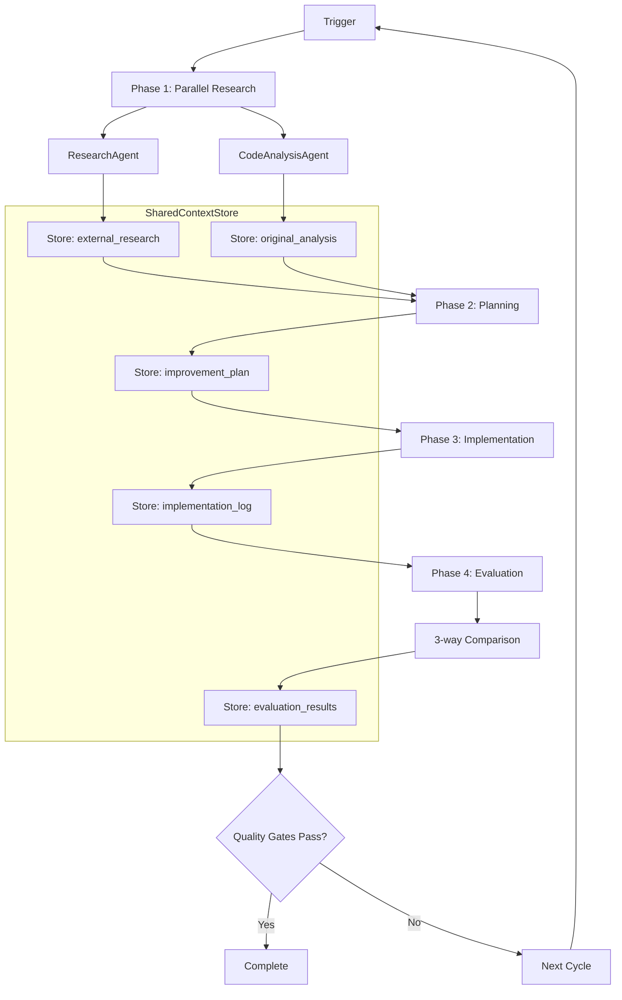

# System Architecture Design

## Overview

T-Developer v2 is a self-evolving service factory built on a multi-agent architecture that enables autonomous service creation and continuous self-improvement.

## Core Architecture Principles

### 1. Agent-First Design

- Every capability is implemented as an independent agent
- Agents communicate through well-defined contracts
- Agents can be composed into complex workflows

### 2. Safety by Default

- All code execution happens in sandboxed environments
- Write operations are scope-limited
- Security scanning is mandatory before any merge

### 3. Observable Evolution

- Every action is traced with correlation IDs
- Metrics drive evolution decisions
- Learning patterns are extracted and reused

## System Components

### Layer 1: Core Agents with SharedContextStore

```
┌──────────────────────────────────────────────────────────────┐
│                     SharedContextStore                        │
│  ┌──────────┬──────────┬──────────┬──────────┬──────────┐  │
│  │Original  │External  │Improvement│Implementation│Evaluation│  │
│  │Analysis  │Research  │Plan       │Log          │Results  │  │
│  └──────────┴──────────┴──────────┴──────────┴──────────┘  │
└────────────────────────┬─────────────────────────────────────┘
                         │
    ┌────────────────────┼────────────────────┐
    │                    │                    │
┌───▼────────┐  ┌───────▼────────┐  ┌────────▼────────┐
│Research    │  │CodeAnalysis    │  │                 │
│Agent       │  │Agent           │  │                 │
└────────────┘  └────────────────┘  │                 │
(External)      (Internal)           │                 │
                                     ▼                 │
                            ┌─────────────┐           │
                            │PlannerAgent │           │
                            └──────┬──────┘           │
                                   ▼                  │
                            ┌─────────────┐           │
                            │RefactorAgent│           │
                            └──────┬──────┘           │
                                   ▼                  ▼
                            ┌──────────────────────────┐
                            │EvaluatorAgent            │
                            │(3-way comparison)        │
                            └──────────────────────────┘
```

#### Research Agent

- **Purpose**: Research external best practices and patterns
- **Input**: Query, focus areas
- **Output**: Best practices, references, patterns
- **Storage**: SharedContextStore.external_research
- **Execution**: Parallel with CodeAnalysisAgent

#### CodeAnalysisAgent (NEW)

- **Purpose**: Analyze internal codebase for improvements
- **Input**: Target path, focus areas
- **Output**: Metrics, issues, improvements
- **Storage**: SharedContextStore.original_analysis
- **Execution**: Parallel with ResearchAgent

#### Planner Agent

- **Purpose**: Create context-aware improvement plans
- **Input**: External research + Internal analysis from SharedContextStore
- **Output**: Prioritized tasks based on actual code issues
- **Storage**: SharedContextStore.improvement_plan
- **Method**: Creates tasks from real improvements, not estimates

#### Refactor Agent

- **Purpose**: Implement code changes using external services
- **Input**: Tasks from improvement_plan
- **Output**: Modified files with changes logged
- **Storage**: SharedContextStore.implementation_log
- **Tools**: AWS Bedrock (Claude), Black, autopep8, doq, pyupgrade

#### Evaluator Agent

- **Purpose**: Three-way comparison evaluation
- **Input**: Comparison data from SharedContextStore (before/plan/after)
- **Output**: Goals achieved, metrics comparison, success rate
- **Storage**: SharedContextStore.evaluation_results
- **Method**: Compares original state, planned goals, and final state

### Layer 2: Orchestration (AWS Agent Squad)

```yaml
Supervisor:
  routing_rules:
    - intent: research → ResearchAgent
    - intent: plan → PlannerAgent
    - intent: code → RefactorAgent
    - intent: evaluate → EvaluatorAgent

  execution_model: DAG
  parallelization: true
  error_handling: retry_with_backoff
```

### Layer 3: Runtime (Bedrock AgentCore)

```
┌──────────────────────────────────────┐
│         Bedrock AgentCore            │
├──────────────────────────────────────┤
│  • Session Management                │
│  • Resource Allocation                │
│  • Identity & Permissions            │
│  • Observability & Tracing           │
│  • Memory & State Management         │
└──────────────────────────────────────┘
```

### Layer 4: Tool Plane (MCP)

```json
{
  "servers": [
    {
      "name": "filesystem",
      "capabilities": ["read", "write"],
      "scope": ["packages/**", "tests/**"]
    },
    {
      "name": "git",
      "capabilities": ["branch", "commit", "diff"],
      "branch_pattern": "tdev/auto/*"
    },
    {
      "name": "github",
      "capabilities": ["create_pr", "comment"],
      "repo": "t-developer"
    }
  ]
}
```

### Layer 5: External Integration (A2A)

```
┌─────────────────┐
│   A2A Broker    │
├─────────────────┤
│ Security Scanner│ ← External specialized agents
│ Test Generator  │
│ Perf Tuner      │
│ Cost Governor   │
└─────────────────┘
```

## Data Flow

### Evolution Cycle Flow with SharedContextStore



### Information Architecture

```yaml
SharedContextStore:
  original_analysis:    # CodeAnalysisAgent output
    - files_analyzed: int
    - metrics: {complexity, coverage, docstrings}
    - issues: [{type, location, severity}]
    - improvements: [{type, location, priority}]

  external_research:    # ResearchAgent output
    - best_practices: [string]
    - references: [{url, title, relevance}]
    - patterns: [{name, description, applicability}]

  improvement_plan:     # PlannerAgent output
    - tasks: [{id, name, type, priority, hours}]
    - priorities: [task_ids_ordered]
    - dependencies: {task_id: [dependent_ids]}
    - estimated_impact: float

  implementation_log:   # RefactorAgent output
    - modified_files: [paths]
    - changes: [{file, type, description}]
    - rollback_points: [{id, timestamp, state}]
    - total_changes: int

  evaluation_results:   # EvaluatorAgent output
    - goals_achieved: [string]
    - metrics_comparison: {before, plan, after}
    - success_rate: float
    - verdict: success|partial|failure
```

## Security Architecture

### Defense in Depth

1. **Input Validation**: All agent inputs are schema-validated
2. **Sandbox Execution**: Code runs in isolated containers
3. **Scope Limiting**: File system access is whitelisted
4. **Security Scanning**: Every change is scanned before merge
5. **Audit Logging**: All operations are logged and traceable

### Permission Model

```yaml
Permissions:
  ResearchAgent:
    - read: /references/**
    - write: SharedContextStore.external_research
    - execute: none

  CodeAnalysisAgent:
    - read: /backend/**
    - write: SharedContextStore.original_analysis
    - execute: none

  PlannerAgent:
    - read: /**
    - write: plans/**

  RefactorAgent:
    - read: /**
    - write: packages/**, tests/**
    - execute: sandbox_only

  EvaluatorAgent:
    - read: /**
    - execute: metrics_tools
```

## Scalability Patterns

### Horizontal Scaling

- Agents run as stateless Lambda/ECS tasks
- Work queue with automatic distribution
- Database per service pattern for data isolation

### Vertical Scaling

- Resource limits per agent type
- Auto-scaling based on queue depth
- Cost optimization through spot instances

## Failure Handling

### Retry Strategy

```python
retry_config = {
    "max_attempts": 3,
    "backoff": "exponential",
    "base_delay": 1,
    "max_delay": 60,
    "retry_on": ["timeout", "rate_limit", "temporary_failure"]
}
```

### Circuit Breaker

```python
circuit_breaker = {
    "failure_threshold": 5,
    "timeout": 300,  # seconds
    "half_open_attempts": 2
}
```

## Monitoring & Observability

### Key Metrics

- **Evolution Success Rate**: Successful PRs / Total attempts
- **Cycle Time**: Time from trigger to merge
- **Quality Delta**: Improvement in metrics per cycle
- **Cost per Evolution**: Total resources consumed

### Tracing Strategy

```
TraceID: unique per evolution cycle
SpanID: unique per agent execution
Correlation: goal_id → plan_id → task_id → pr_id
```

## Future Architecture Evolution

### Phase 1: Current (Supervisor-DAG)

- Simple, predictable execution
- Easy debugging and monitoring

### Phase 2: Event-Driven (Blackboard)

- Loose coupling between agents
- Better failure isolation
- Dynamic agent participation

### Phase 3: Federated (Multi-Organization)

- Cross-boundary agent collaboration
- Marketplace for specialized agents
- Standardized through A2A protocol
